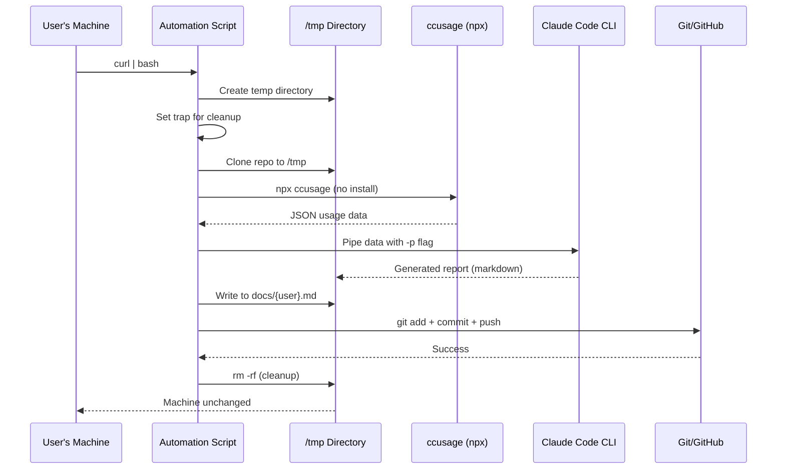
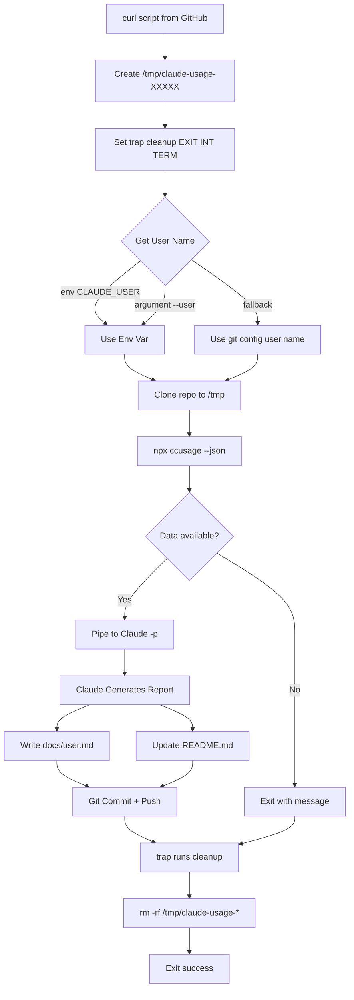
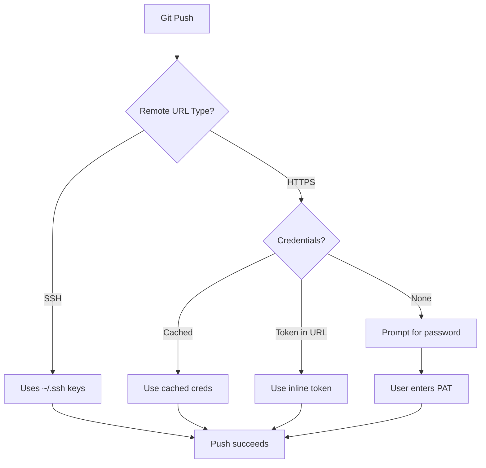
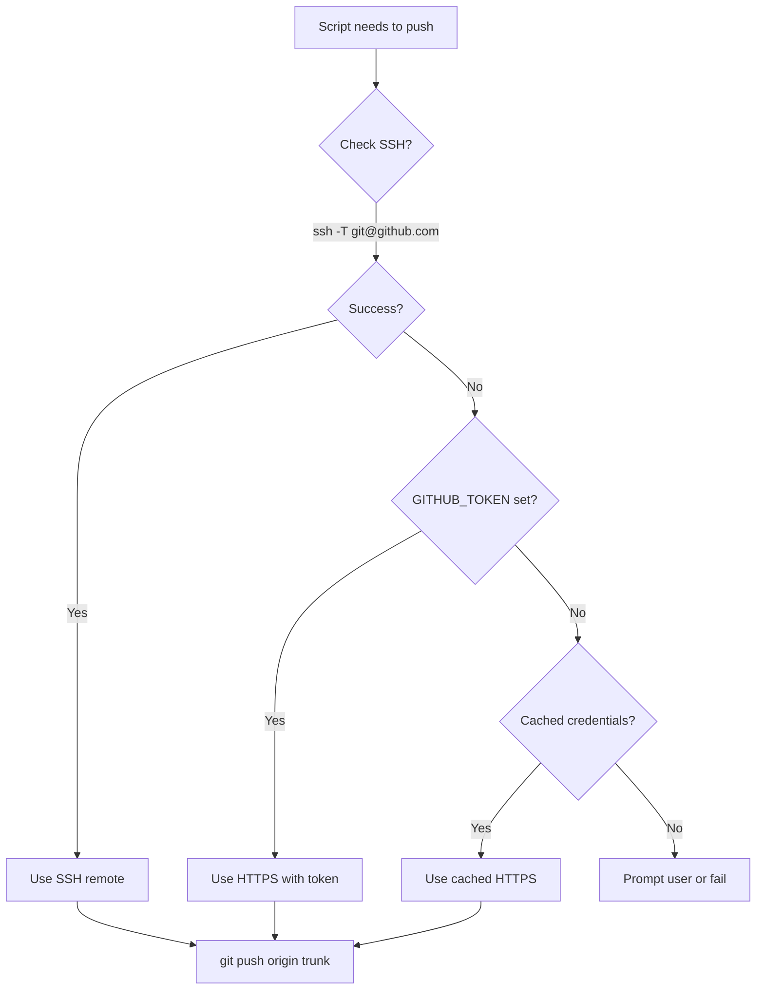

# Automated Claude Code Usage Reporting - Research

**Date**: 2025-12-18
**Status**: Research Complete (Updated)

## Table of Contents

- [Executive Summary](#executive-summary)
- [Technical Deep Dive](#technical-deep-dive)
- [Technology Stack / Ecosystem](#technology-stack--ecosystem)
- [Codebase Analysis](#codebase-analysis)
- [Implementation Feasibility](#implementation-feasibility)
- [Implementation Options](#implementation-options)
- [Comparison Matrix](#comparison-matrix)
- [Implementation Approach](#implementation-approach)
- [Zero-Footprint Execution](#zero-footprint-execution)
- [Alternatives Considered](#alternatives-considered)
- [Debates & Open Questions](#debates--open-questions)
- [Recommendations](#recommendations)
- [Additional Notes](#additional-notes)
- [Sources](#sources)

## Executive Summary

Automating Claude Code usage reporting is **fully feasible** with zero permanent footprint. The workflow can be implemented using `npx ccusage` for temporary data extraction, Claude Code's `--print` flag for non-interactive analysis, and standard git commands for GitHub updates. The script can be executed via `curl | bash` from a raw GitHub URL, work entirely in `/tmp`, and clean up after itself using bash trap handlers.

## Technical Deep Dive

### Overview

The proposed automation workflow involves:
1. Running `ccusage` to extract usage data from local JSONL logs
2. Piping that data to Claude Code in headless mode for analysis
3. Committing and pushing generated reports to GitHub

### ccusage CLI Tool

ccusage is a CLI tool for analyzing Claude Code usage from local JSONL files stored by the Claude Code CLI.

**Installation:**
```bash
# No installation required - use latest version
bunx ccusage@latest
npx ccusage@latest
```

**Core Commands:**
| Command | Purpose |
|---------|---------|
| `ccusage daily` | Daily token usage and costs (default) |
| `ccusage monthly` | Monthly aggregated report |
| `ccusage session` | Usage grouped by conversation sessions |
| `ccusage blocks` | 5-hour billing windows tracking |

**Key Flags for Automation:**
```bash
# Date range filtering
--since YYYYMMDD    # Filter from specific date
--until YYYYMMDD    # Filter until specific date

# Output formats
--json              # Structured JSON export (critical for automation)
--compact           # Force compact table layout

# Display options
--breakdown         # Per-model cost breakdown
--instances         # Group usage by project/instance
--project myproject # Filter to specific project
--timezone UTC      # Configure timezone
```

**Example for Current Month:**
```bash
# Get December 2025 data in JSON format
bunx ccusage@latest daily --since 20251201 --until 20251231 --json
```

### Claude Code CLI Headless Mode

Claude Code supports non-interactive execution via the `--print` (`-p`) flag, enabling script integration.

**Key Flags:**
```bash
# Core automation flags
-p, --print                    # Run non-interactively, print result, exit
--output-format text|json|stream-json  # Output format (default: text)
--input-format text|stream-json        # Input format for piped content

# Control flags
--max-turns N                  # Limit agentic turns
--max-budget-usd N             # Cost control
--verbose                      # Debug logging
--dangerously-skip-permissions # Skip permission prompts (CI/CD use)

# System prompt customization
--system-prompt "prompt"       # Replace system prompt
--append-system-prompt "text"  # Append to default prompt
--system-prompt-file ./file.txt # Load from file
```

**Piping Data to Claude Code:**
```bash
# Pipe file content
cat data.json | claude -p "analyze this data"

# Pipe command output directly
bunx ccusage@latest daily --json | claude -p "generate usage report"
```

### Workflow Diagram



### GitHub Automation

GitHub CLI (`gh`) is **not required**. All operations use standard git commands.

**Git Operations in Scripts:**
```bash
# Git config for commits (uses existing user config)
GIT_USER=$(git config user.name)
GIT_EMAIL=$(git config user.email)

# Standard commit workflow
git add docs/${USER}.md README.md
git commit -m "chore: update ${USER} usage report $(date +%Y-%m-%d)"
git push origin trunk
```

**Authentication for Automated Pushes:**
- SSH keys: If user has SSH configured, it just works
- HTTPS with cached credentials: Works if credentials are cached
- HTTPS with token: Can be passed via environment variable

### User Identification

**Challenge**: There is no CLI command to get the currently logged-in Claude Code user. The `/status` command only works in interactive sessions.

**Workarounds:**
1. **Environment Variable**: Set `CLAUDE_USER` manually in script or config
2. **Git Config**: Use `git config user.name` as proxy (if email matches)
3. **Hardcoded Config**: Store username in a config file

## Technology Stack / Ecosystem

**Required Tools:**
- `ccusage` - npm package, use via `npx ccusage@latest` (no install needed)
- `claude` - Claude Code CLI (installed separately)
- `git` - Standard git CLI
- `curl` - For remote script execution
- Node.js - For npx execution

**Not Required:**
- `gh` - GitHub CLI (not needed)
- `bun` - Optional, Node.js/npx works fine
- Global npm packages - npx handles everything

**Local Data Source:**
- ccusage reads from local JSONL files stored by Claude Code
- Location: `~/.claude/logs/` (varies by platform)

## Codebase Analysis

### Existing Report Structure

Reports follow a consistent format in `docs/{user}.md`:

1. **Jekyll frontmatter** (`---\n---`)
2. **Executive Summary** with verdict
3. **Raw Data Tables** (by month)
4. **Mermaid xychart-beta** visualization
5. **Weekly Aggregation**
6. **Key Patterns Identified**
7. **Growth Metrics**
8. **Adoption Classification**
9. **Conclusion/Recommendation**

### Dashboard Update Requirements

The README.md Live Dashboard must be updated with:
```markdown
| User | Trend | Status | Oct | Nov | Dec | Report |
|------|-------|--------|-----|-----|-----|--------|
| Name | ↑/↓/→ | Status | 🟢/🟡/🔴 | 🟢/🟡/🔴 | 🟢/🟡/🔴 | [View](url) |
```

### Key Files

1. `docs/{user}.md` - Individual reports
2. `README.md` - Live Dashboard table
3. `docs/index.md` - GitHub Pages homepage
4. `CLAUDE.md` - Analysis prompt and format specifications

## Implementation Feasibility

### Benefits

- **Eliminates manual screenshots** - Data extracted directly from local logs
- **Consistent analysis** - Same prompt produces standardized reports
- **One-command execution** - Run script, get updated report
- **Version controlled** - All reports tracked in git history
- **Zero footprint** - Nothing permanently installed, temp files cleaned up

### Trade-offs & Challenges

1. **Claude Code User ID**: Cannot be determined automatically from CLI [1]
   - Requires manual configuration or environment variable

2. **Data Locality**: ccusage reads local JSONL files
   - Only works on the machine where Claude Code was used
   - Cannot aggregate data from multiple machines

3. **Report Quality**: Claude Code output depends on prompt quality
   - May need iteration to match existing report format

4. **Permission Handling**: Non-interactive mode may need `--dangerously-skip-permissions`
   - Or use `--permission-mode acceptEdits`

### When to Use

- Monthly report generation
- Self-service reporting (each user runs on their own machine)
- CI/CD integration (with pre-configured user identity)

### When to Avoid

- Central dashboard aggregating multiple users (requires each user to submit data)
- Real-time monitoring (use ccusage `--live` instead)

## Implementation Options

### Option 1: Simple Bash Script

**Description**: Single bash script that orchestrates the entire workflow.

**Pros**:
- Simple to understand and maintain
- No dependencies beyond existing tools
- Easy to run manually or via cron

**Cons**:
- Limited error handling
- No cross-platform compatibility (macOS/Linux only)
- Hardcoded configuration

**Complexity**: Low

**Time Estimate**: 2-4 hours

**Reuses Patterns**: Yes (follows project's git workflow)

**Example:**
```bash
#!/bin/bash
set -e

# Config
USER_NAME="${CLAUDE_USER:-$(git config user.name)}"
REPO_DIR="/Users/little/Projects/claude-usage"
CURRENT_MONTH=$(date +%Y%m01)
TODAY=$(date +%Y%m%d)

# Get usage data and generate report
cd "$REPO_DIR"
bunx ccusage@latest daily --since "$CURRENT_MONTH" --until "$TODAY" --json | \
  claude -p "Analyze this Claude Code usage data for ${USER_NAME}. Generate a report following the format in docs/dung.md. Include Jekyll frontmatter, executive summary, raw data tables, Mermaid chart, and risk assessment. Save to docs/${USER_NAME,,}.md and update README.md Live Dashboard." \
  --allowedTools "Read,Write" \
  --dangerously-skip-permissions

# Commit and push
git add docs/ README.md
git commit -m "chore: update ${USER_NAME} usage report $(date +%Y-%m-%d)"
git push origin trunk
```

### Option 2: Bun TypeScript Script

**Description**: TypeScript script using Bun for better structure and error handling.

**Pros**:
- Type safety
- Better error handling
- Follows project conventions (Bun-first)
- Cross-platform potential

**Cons**:
- More code to maintain
- Requires script file in repo

**Complexity**: Medium

**Time Estimate**: 4-6 hours

**Reuses Patterns**: Yes (Bun, TypeScript per CLAUDE.md)

**Example:**
```typescript
// scripts/generate-report.ts
import { $ } from "bun";

const userName = process.env.CLAUDE_USER || (await $`git config user.name`.text()).trim();
const currentMonth = new Date().toISOString().slice(0, 8).replace(/-/g, "") + "01";
const today = new Date().toISOString().slice(0, 10).replace(/-/g, "");

// Get usage data
const usageData = await $`bunx ccusage@latest daily --since ${currentMonth} --until ${today} --json`.text();

// Generate report with Claude Code
const prompt = `Analyze this Claude Code usage data for ${userName}...`;
await $`echo ${usageData} | claude -p ${prompt} --allowedTools "Read,Write" --dangerously-skip-permissions`;

// Commit and push
await $`git add docs/ README.md`;
await $`git commit -m "chore: update ${userName} usage report ${today}"`;
await $`git push origin trunk`;
```

### Option 3: Zero-Footprint Remote Script (Recommended)

**Description**: Self-contained bash script executable via `curl | bash` that leaves no trace on the user's machine.

**Pros**:
- Zero permanent installation required
- Works in /tmp, cleans up everything
- Executable from any machine with Node.js and git
- Single command to run

**Cons**:
- Bash only (macOS/Linux)
- Requires trust in script source
- Slightly more complex error handling

**Complexity**: Medium

**Time Estimate**: 4-6 hours

**Reuses Patterns**: Yes

**When to Use**: Self-service reporting from any machine

See [Zero-Footprint Execution](#zero-footprint-execution) section for full implementation.

### Option 4: GitHub Actions Workflow (Self-Hosted)

**Description**: Run automation via GitHub Actions on a self-hosted runner (user's machine).

**Pros**:
- Scheduled automation
- GitHub-native
- Audit trail via workflow runs

**Cons**:
- Requires self-hosted runner (ccusage needs local logs)
- Complex setup
- Runner must stay online

**Complexity**: High

**Time Estimate**: 1-2 days

**Reuses Patterns**: Partial

**When to Use**: When multiple users want scheduled automation

## Comparison Matrix

| Criteria | Bash Script | Bun Script | Remote Script | GitHub Actions |
|----------|-------------|------------|---------------|----------------|
| Complexity | Low | Medium | Medium | High |
| Maintainability | Medium | High | Medium | Medium |
| Error Handling | Basic | Good | Good | Good |
| Cross-Platform | No | Partial | No | Yes |
| Zero Footprint | No | No | Yes | No |
| curl \| bash | No | No | Yes | No |
| Setup Time | 2-4 hours | 4-6 hours | 4-6 hours | 1-2 days |
| Reuses Patterns | Yes | Yes | Yes | Partial |

## Implementation Approach

### Recommended: Option 3 (Zero-Footprint Remote Script)

This provides the best user experience: single command, no installation, no cleanup needed.

### Prerequisites & Requirements

- `node` / `npm` installed (for npx)
- `claude` CLI installed and authenticated
- `git` configured with push access to repo
- Environment variable `CLAUDE_USER` set (or use git config fallback)

### Getting Started

1. Host script at raw GitHub URL
2. Run: `curl -sSL https://raw.githubusercontent.com/org/repo/main/scripts/generate-report.sh | bash`
3. Or with arguments: `curl -sSL ... | bash -s -- --user "John"`

### Architecture



### Best Practices

1. **Use `@latest`**: Always use `npx ccusage@latest` to get latest features
2. **JSON Output**: Use `--json` for reliable parsing
3. **Explicit Tools**: Use `--allowedTools "Read,Write"` to limit Claude's scope
4. **Idempotent Commits**: Check for changes before committing (avoid empty commits)
5. **Error Handling**: Catch and report failures, don't push partial updates

### Common Pitfalls & How to Avoid Them

1. **Empty ccusage output**: If no data exists for date range
   - Check: Validate JSON has data before piping to Claude

2. **Claude permission prompts**: May hang waiting for input
   - Fix: Use `--dangerously-skip-permissions` or configure permission mode

3. **Git push failures**: Authentication or branch protection
   - Fix: Ensure SSH keys or HTTPS credentials are configured

4. **Date calculation bugs**: Timezone issues with date ranges
   - Fix: Use explicit UTC or local timezone consistently

### Testing Strategy

1. **Dry run**: Generate report without committing
2. **Manual review**: Check generated markdown before first automated push
3. **Staged rollout**: Run manually for 1-2 cycles before automating

---

## Zero-Footprint Execution

This section details how to implement a script that leaves no trace on the user's machine.

### GitHub Operations WITHOUT gh CLI

The `gh` CLI is **not required**. All GitHub operations can be done with standard `git` commands and `curl`.

#### Cloning a Repository

```bash
# Standard git clone (works with SSH or HTTPS)
git clone git@github.com:org/repo.git /tmp/repo
git clone https://github.com/org/repo.git /tmp/repo

# With personal access token for private repos
git clone https://${GITHUB_TOKEN}@github.com/org/repo.git /tmp/repo
```

#### Commit and Push

```bash
cd /tmp/repo
git add docs/ README.md
git commit -m "chore: update usage report $(date +%Y-%m-%d)"
git push origin trunk
```

#### Authentication Options



**SSH Authentication (Recommended):**
- If user has SSH keys configured (`~/.ssh/id_rsa` or `~/.ssh/id_ed25519`), git push works automatically
- Check: `ssh -T git@github.com` should show authenticated username

**HTTPS with Personal Access Token:**
```bash
# Inline token (less secure, visible in process list)
git push https://${GITHUB_TOKEN}@github.com/org/repo.git trunk

# Or configure credential helper
git config --global credential.helper store
# Then first push will prompt and cache
```

**HTTPS with Cached Credentials:**
```bash
# Check if credentials are cached
git config --get credential.helper
# If set to 'osxkeychain' (macOS) or 'store', credentials may be cached
```

#### Fetching a Single File (Without Cloning)

```bash
# Public repos - use raw.githubusercontent.com
curl -sSL https://raw.githubusercontent.com/org/repo/main/README.md -o README.md

# Private repos - need token
curl -H "Authorization: token ${GITHUB_TOKEN}" \
     -H "Accept: application/vnd.github.v3.raw" \
     -sSL https://api.github.com/repos/org/repo/contents/README.md \
     -o README.md

# Or use git show after clone
git show origin/trunk:README.md
```

### Temporary Installation Strategies

#### Using npx (Recommended)

npx downloads packages to a temporary cache and removes them after execution.

```bash
# Run ccusage without any installation
npx ccusage@latest daily --json

# Force fresh download (ignore cache)
npx --ignore-existing ccusage@latest daily --json
```

**How npx works:**
1. Checks if package exists in local `node_modules/.bin`
2. Checks if package exists in global `node_modules`
3. If not found, downloads to temp cache (`~/.npm/_npx/`)
4. Executes the package
5. Temp cache may persist but doesn't affect system state

#### Using npm with --prefix (Alternative)

```bash
# Install to specific directory
npm install --prefix /tmp/ccusage-install ccusage

# Run the installed binary
/tmp/ccusage-install/node_modules/.bin/ccusage daily --json

# Clean up
rm -rf /tmp/ccusage-install
```

#### Cleanup Strategies

```bash
# Clear npx cache (optional, not required for zero-footprint)
npm cache clean --force

# Remove temp directory
rm -rf /tmp/claude-usage-*
```

### Working in /tmp

All operations should happen in a temporary directory that gets cleaned up on exit.

```bash
# Create unique temp directory
WORKDIR=$(mktemp -d -t claude-usage-XXXXXX)
# Result: /tmp/claude-usage-abc123

# Or fixed name (simpler, potential conflicts)
WORKDIR="/tmp/claude-usage-temp"
mkdir -p "$WORKDIR"

# Clone repo there
git clone git@github.com:org/repo.git "$WORKDIR/repo"

# Do all work in temp directory
cd "$WORKDIR/repo"
# ... generate report ...
git push

# Clean up
rm -rf "$WORKDIR"
```

### Remote Script Execution Pattern

#### Basic curl | bash

```bash
# Execute script from URL
curl -sSL https://raw.githubusercontent.com/org/repo/main/script.sh | bash

# With arguments
curl -sSL https://raw.githubusercontent.com/org/repo/main/script.sh | bash -s -- arg1 arg2

# With environment variables
CLAUDE_USER="john" curl -sSL ... | bash
```

#### Script Structure for Remote Execution

```bash
#!/bin/bash
set -euo pipefail

# Parse arguments passed via bash -s --
while [[ $# -gt 0 ]]; do
  case $1 in
    --user)
      CLAUDE_USER="$2"
      shift 2
      ;;
    --dry-run)
      DRY_RUN=true
      shift
      ;;
    *)
      echo "Unknown option: $1"
      exit 1
      ;;
  esac
done

# Rest of script...
```

#### Security Considerations

**Risks:**
- Script source could be compromised
- Man-in-the-middle attacks (mitigated by HTTPS)
- Fileless execution leaves minimal forensic traces
- Cannot inspect script before running

**Mitigations:**
1. Always use HTTPS URLs
2. Pin to specific commit hash instead of `main`:
   ```bash
   curl -sSL https://raw.githubusercontent.com/org/repo/abc123/script.sh | bash
   ```
3. Download and inspect before running:
   ```bash
   curl -sSL https://raw.githubusercontent.com/org/repo/main/script.sh > script.sh
   cat script.sh  # Review
   bash script.sh
   rm script.sh
   ```

### Getting README.md for Updates

After cloning, README.md is just a local file:

```bash
cd "$WORKDIR/repo"
cat README.md  # Read it
# Claude can use Read/Write tools directly
```

For fetching without cloning (not recommended for updates):

```bash
# Read current README
curl -sSL https://raw.githubusercontent.com/org/repo/main/README.md

# But you can't push changes without cloning
```

### Complete Cleanup with Trap Handlers

Trap handlers ensure cleanup runs even if script fails or is interrupted.

```bash
#!/bin/bash
set -euo pipefail

# Create temp directory
WORKDIR=$(mktemp -d -t claude-usage-XXXXXX)

# Cleanup function
cleanup() {
  local exit_code=$?
  echo "Cleaning up..."
  [ -d "$WORKDIR" ] && rm -rf "$WORKDIR"
  exit $exit_code
}

# Register trap for multiple signals
trap cleanup EXIT INT TERM ERR

# Now any exit (success, error, Ctrl+C, kill) will run cleanup
cd "$WORKDIR"
# ... rest of script ...
```

**Signals to trap:**
- `EXIT` - Normal script exit
- `INT` - Ctrl+C (SIGINT)
- `TERM` - kill command (SIGTERM)
- `ERR` - Command failure (with `set -e`)

**Best practices:**
- Place trap at the beginning of script
- Use function for complex cleanup
- Preserve exit code in cleanup function
- Test trap with intentional failures

### Authentication for Push



**Check SSH configuration:**
```bash
if ssh -T git@github.com 2>&1 | grep -q "successfully authenticated"; then
  REPO_URL="git@github.com:org/repo.git"
else
  # Fall back to HTTPS
  REPO_URL="https://github.com/org/repo.git"
fi
```

**Use token if provided:**
```bash
if [ -n "${GITHUB_TOKEN:-}" ]; then
  REPO_URL="https://${GITHUB_TOKEN}@github.com/org/repo.git"
fi
```

---

## Complete Script Outline

Here is the recommended script structure incorporating all constraints:

```bash
#!/bin/bash
#
# Claude Code Usage Report Generator
#
# Usage:
#   curl -sSL https://raw.githubusercontent.com/org/repo/main/scripts/generate-report.sh | bash
#   curl -sSL ... | bash -s -- --user "John Doe"
#
# Requirements:
#   - Node.js (for npx)
#   - git (configured with push access)
#   - claude CLI (installed and authenticated)
#
set -euo pipefail

# ============================================================================
# Configuration
# ============================================================================
REPO_URL="${REPO_URL:-git@github.com:org/claude-usage.git}"
BRANCH="${BRANCH:-trunk}"
CLAUDE_USER="${CLAUDE_USER:-}"
DRY_RUN="${DRY_RUN:-false}"

# ============================================================================
# Parse Arguments
# ============================================================================
while [[ $# -gt 0 ]]; do
  case $1 in
    --user)
      CLAUDE_USER="$2"
      shift 2
      ;;
    --dry-run)
      DRY_RUN=true
      shift
      ;;
    --repo)
      REPO_URL="$2"
      shift 2
      ;;
    --help)
      echo "Usage: $0 [--user NAME] [--dry-run] [--repo URL]"
      exit 0
      ;;
    *)
      echo "Unknown option: $1"
      exit 1
      ;;
  esac
done

# ============================================================================
# Setup
# ============================================================================
WORKDIR=$(mktemp -d -t claude-usage-XXXXXX)
echo "Working in: $WORKDIR"

# Cleanup on exit (success, error, or interrupt)
cleanup() {
  local exit_code=$?
  echo ""
  echo "Cleaning up temporary files..."
  [ -d "$WORKDIR" ] && rm -rf "$WORKDIR"
  if [ $exit_code -eq 0 ]; then
    echo "Done! Your machine is unchanged."
  else
    echo "Script failed with exit code $exit_code"
  fi
  exit $exit_code
}
trap cleanup EXIT INT TERM

# ============================================================================
# Determine User Name
# ============================================================================
if [ -z "$CLAUDE_USER" ]; then
  CLAUDE_USER=$(git config user.name 2>/dev/null || echo "")
fi

if [ -z "$CLAUDE_USER" ]; then
  echo "Error: Could not determine user name."
  echo "Set CLAUDE_USER environment variable or configure git user.name"
  exit 1
fi

echo "Generating report for: $CLAUDE_USER"

# ============================================================================
# Calculate Date Range
# ============================================================================
CURRENT_MONTH=$(date +%Y%m01)
TODAY=$(date +%Y%m%d)
echo "Date range: $CURRENT_MONTH to $TODAY"

# ============================================================================
# Get Usage Data (using npx - no permanent install)
# ============================================================================
echo "Fetching usage data..."
USAGE_DATA=$(npx ccusage@latest daily --since "$CURRENT_MONTH" --until "$TODAY" --json 2>/dev/null || echo "[]")

if [ "$USAGE_DATA" = "[]" ] || [ -z "$USAGE_DATA" ]; then
  echo "No usage data found for this period."
  exit 0
fi

echo "Usage data retrieved successfully."

# ============================================================================
# Clone Repository
# ============================================================================
echo "Cloning repository..."
git clone --depth 1 --branch "$BRANCH" "$REPO_URL" "$WORKDIR/repo"
cd "$WORKDIR/repo"

# ============================================================================
# Generate Report with Claude Code
# ============================================================================
echo "Generating report with Claude Code..."
USER_LOWER=$(echo "$CLAUDE_USER" | tr '[:upper:]' '[:lower:]' | tr ' ' '-')

PROMPT="Analyze this Claude Code usage data for ${CLAUDE_USER}.
Generate a report following the format in docs/dung.md.
Include Jekyll frontmatter, executive summary, raw data tables, Mermaid chart, and risk assessment.
Save to docs/${USER_LOWER}.md and update README.md Live Dashboard table."

if [ "$DRY_RUN" = "true" ]; then
  echo "DRY RUN: Would generate report for $CLAUDE_USER"
  echo "Data: $USAGE_DATA"
else
  echo "$USAGE_DATA" | claude -p "$PROMPT" \
    --allowedTools "Read,Write" \
    --dangerously-skip-permissions \
    --max-turns 10
fi

# ============================================================================
# Commit and Push
# ============================================================================
if [ "$DRY_RUN" = "true" ]; then
  echo "DRY RUN: Would commit and push changes"
else
  # Check if there are changes to commit
  if git diff --quiet && git diff --cached --quiet; then
    echo "No changes to commit."
  else
    echo "Committing changes..."
    git add docs/ README.md
    git commit -m "chore: update ${CLAUDE_USER} usage report $(date +%Y-%m-%d)"

    echo "Pushing to origin..."
    git push origin "$BRANCH"
    echo "Report published successfully!"
  fi
fi

# ============================================================================
# Cleanup happens automatically via trap
# ============================================================================
echo ""
echo "Report generation complete!"
```

### Script Features

1. **Zero footprint**: Works entirely in `/tmp`, cleans up on exit
2. **No gh CLI required**: Uses standard git commands
3. **No permanent installations**: Uses `npx` for ccusage
4. **Trap-based cleanup**: Cleans up even on error or Ctrl+C
5. **Argument parsing**: Supports `--user`, `--dry-run`, `--repo`
6. **Remote execution ready**: Can be run via `curl | bash`
7. **Respects existing auth**: Uses SSH keys or cached HTTPS credentials

### Running the Script

```bash
# Basic usage (uses git config user.name)
curl -sSL https://raw.githubusercontent.com/org/repo/main/scripts/generate-report.sh | bash

# With explicit user
curl -sSL ... | bash -s -- --user "John Doe"

# Dry run (no changes)
curl -sSL ... | bash -s -- --dry-run

# With environment variables
CLAUDE_USER="John" REPO_URL="git@github.com:myorg/myrepo.git" curl -sSL ... | bash
```

---

## Alternatives Considered

### Alternative 1: Manual Screenshot Workflow (Current)

- Brief description: Export screenshots, run Claude Code interactively
- Why it wasn't chosen: Time-consuming, error-prone, inconsistent
- When it might be better: One-off reports, new users not yet configured

### Alternative 2: ccusage Native Export + Manual Analysis

- Brief description: Use ccusage to export JSON, manually analyze
- Why it wasn't chosen: Doesn't automate the analysis portion
- When it might be better: When you want human-in-the-loop analysis

### Alternative 3: Custom JSONL Parser

- Brief description: Build custom tool to parse Claude Code logs directly
- Why it wasn't chosen: ccusage already solves this well
- When it might be better: If ccusage becomes unmaintained

### Alternative 4: Global npm Install

- Brief description: Install ccusage globally, require it as prerequisite
- Why it wasn't chosen: Violates zero-footprint requirement
- When it might be better: For frequent users who don't mind global packages

## Debates & Open Questions

1. **User Identification**: No clean solution for automated user ID detection
   - Current workaround: Environment variable or git config
   - Open issue: [GitHub #1886](https://github.com/anthropics/claude-code/issues/1886) requests CLI status check

2. **Multi-User Aggregation**: How to collect data from multiple machines?
   - Potential solution: Each user runs script locally and pushes their report
   - Alternative: Shared network drive for JSONL logs (complex)

3. **Report Format Drift**: Will AI-generated reports match expected format?
   - Mitigation: Include example report in prompt context
   - Future: Consider JSON schema validation for report structure

4. **npx Cache Persistence**: npx may leave cache files in `~/.npm/_npx/`
   - Mitigation: This is minimal and doesn't affect functionality
   - Alternative: Use `npm install --prefix /tmp/...` for complete isolation

## Recommendations

### Preferred Approach: Zero-Footprint Remote Script (Option 3)

**Should This Be Implemented?**: Yes

**Rationale**:
- All required tools exist and are documented
- Workflow is straightforward with clear inputs/outputs
- Meets all new constraints (zero footprint, no gh CLI, curl-executable)

**Why**:
- Eliminates manual screenshot export process
- Consistent report format via standardized prompt
- Self-service model lets each user generate their own report
- No permanent changes to user's machine

**Key Considerations**:
- User must have git configured with push access (SSH or HTTPS)
- First run should be with `--dry-run` to verify setup
- Report prompt may need tuning to match existing format exactly

**Potential Challenges**:

1. **Prompt Engineering** - Getting Claude to match existing report format
   - Mitigation: Include full example report in prompt context

2. **Data Availability** - ccusage only reads local files
   - Mitigation: Document requirement for users to run on their own machines

3. **Git Authentication** - User must have push access configured
   - Mitigation: Script checks SSH first, falls back to HTTPS with token

**Success Criteria**:
- Script runs in under 60 seconds
- Generated report matches existing format structure
- README.md dashboard is correctly updated
- Git commit and push succeed without manual intervention
- `/tmp` directory is cleaned up after execution
- No global packages or config files are modified

## Additional Notes

- ccusage is actively maintained (last update December 2025)
- Claude Code headless mode is stable and documented
- The `--dangerously-skip-permissions` flag is explicitly designed for CI/CD use cases
- Consider adding `--max-budget-usd 1` to limit costs during automation
- npx is included with npm since version 5.2.0, no separate install needed
- For maximum security, pin script to specific git commit hash instead of `main`

## Sources

1. [ccusage GitHub Repository](https://github.com/ryoppippi/ccusage) - CLI documentation and usage examples
2. [Claude Code CLI Reference](https://code.claude.com/docs/en/cli-reference) - Official CLI flags and options
3. [Claude Code Headless Mode](https://code.claude.com/docs/en/headless) - Non-interactive execution documentation
4. [GitHub Issue #1886](https://github.com/anthropics/claude-code/issues/1886) - CLI status check feature request
5. [Git Config Documentation](https://git-scm.com/book/en/v2/Getting-Started-First-Time-Git-Setup) - Git configuration
6. [Claude Code Best Practices](https://www.anthropic.com/engineering/claude-code-best-practices) - Anthropic engineering blog
7. [ClaudeLog --print Flag Guide](https://claudelog.com/faqs/what-is-print-flag-in-claude-code/) - Print flag usage examples
8. [Download Single File from GitHub](https://careerkarma.com/blog/git-download-a-single-file-from-github/) - curl/wget approaches
9. [GitHub Gist: Download from Private Repos](https://gist.github.com/maboloshi/9b9a25a93b4f9a0955d1f65391c9572e) - PAT authentication
10. [npm --prefix Documentation](https://docs.npmjs.com/cli/v7/commands/npm-prefix/) - Temporary install location
11. [Baeldung: Pass Arguments to curl Script](https://www.baeldung.com/linux/curl-fetched-script-arguments) - bash -s patterns
12. [curl bash pipe Security](https://www.kicksecure.com/wiki/Dev/curl_bash_pipe) - Security considerations
13. [Linux Journal: Bash Trap Statement](https://www.linuxjournal.com/content/use-bash-trap-statement-cleanup-temporary-files) - Cleanup patterns
14. [Bash Exit Traps](http://redsymbol.net/articles/bash-exit-traps/) - Robust trap handling
15. [GitHub: Personal Access Tokens](https://docs.github.com/en/authentication/keeping-your-account-and-data-secure/managing-your-personal-access-tokens) - Token authentication
16. [GeeksforGeeks: Git Push with Token](https://www.geeksforgeeks.org/git/how-to-authenticate-git-push-with-github-using-a-token/) - HTTPS auth
17. [npx Package Runner](https://www.npmjs.com/package/npx) - Temporary package execution
18. [egghead.io: npx Temporary Install](https://egghead.io/lessons/npm-use-npx-to-temporarily-install-and-invoke-a-package-from-npm) - How npx works
