# Mermaid Diagrams - Comprehensive Guide

**Date**: 2025-12-14
**Status**: Research Complete

## Table of Contents

- [Executive Summary](#executive-summary)
- [What is Mermaid?](#what-is-mermaid)
- [Getting Started](#getting-started)
- [Diagram Types](#diagram-types)
  - [Flowcharts](#1-flowcharts)
  - [Sequence Diagrams](#2-sequence-diagrams)
  - [Class Diagrams](#3-class-diagrams)
  - [State Diagrams](#4-state-diagrams)
  - [Entity Relationship Diagrams](#5-entity-relationship-diagrams)
  - [Gantt Charts](#6-gantt-charts)
  - [Pie Charts](#7-pie-charts)
  - [User Journey Diagrams](#8-user-journey-diagrams)
  - [GitGraph Diagrams](#9-gitgraph-diagrams)
  - [Mindmaps](#10-mindmaps)
  - [Timeline Diagrams](#11-timeline-diagrams)
  - [Quadrant Charts](#12-quadrant-charts)
  - [Requirement Diagrams](#13-requirement-diagrams)
  - [C4 Diagrams](#14-c4-diagrams)
  - [Sankey Diagrams](#15-sankey-diagrams)
  - [XY Charts](#16-xy-charts)
  - [Block Diagrams](#17-block-diagrams)
  - [Kanban Boards](#18-kanban-boards)
  - [Architecture Diagrams](#19-architecture-diagrams)
  - [Packet Diagrams](#20-packet-diagrams)
  - [Radar Charts](#21-radar-charts)
  - [Treemap Diagrams](#22-treemap-diagrams)
- [Node Shapes Reference](#node-shapes-reference)
- [Arrow and Line Types](#arrow-and-line-types)
- [Layout and Direction](#layout-and-direction)
- [Theming and Styling](#theming-and-styling)
- [Configuration and Directives](#configuration-and-directives)
- [Advanced Features](#advanced-features)
- [Platform Integrations](#platform-integrations)
- [Best Practices](#best-practices)
- [Common Patterns](#common-patterns)
- [Troubleshooting](#troubleshooting)
- [Sources](#sources)

## Executive Summary

Mermaid is a JavaScript-based diagramming tool that renders Markdown-inspired text definitions into diagrams. It supports over 20 diagram types including flowcharts, sequence diagrams, class diagrams, and more. This guide covers all features comprehensively for beginners to learn and reference.

## What is Mermaid?

Mermaid is an open-source JavaScript library created in 2014 by Knut Sveidqvist. It enables developers and writers to create diagrams using simple text syntax, similar to Markdown.

### How It Works

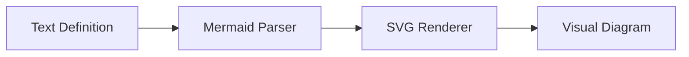

1. You write diagram definitions in text using Mermaid syntax
2. The Mermaid parser reads `<pre class="mermaid">` or `<div class="mermaid">` tags
3. The library converts text to SVG graphics
4. The diagram renders in your browser or documentation

### Key Benefits

- **Version Control Friendly**: Diagrams are plain text, tracked in Git
- **Easy to Maintain**: Update diagrams by editing text, no graphic tools needed
- **Wide Integration**: Works in GitHub, GitLab, Notion, VS Code, and many more
- **No External Tools**: Renders directly in browsers

## Getting Started

### Basic HTML Usage

```html
<!DOCTYPE html>
<html>
<head>
  <script type="module">
    import mermaid from 'https://cdn.jsdelivr.net/npm/mermaid@11/dist/mermaid.esm.min.mjs';
    mermaid.initialize({ startOnLoad: true });
  </script>
</head>
<body>
  <pre class="mermaid">
    flowchart LR
      A --> B
  </pre>
</body>
</html>
```

### Markdown Usage (GitHub, GitLab, etc.)

````markdown
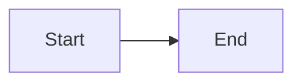
````

### Live Editor

Use the [Mermaid Live Editor](https://mermaid.live/) to test diagrams before adding them to your documentation.

---

## Diagram Types

### 1. Flowcharts

Flowcharts visualize processes, decisions, and workflows using connected nodes.

#### Basic Syntax

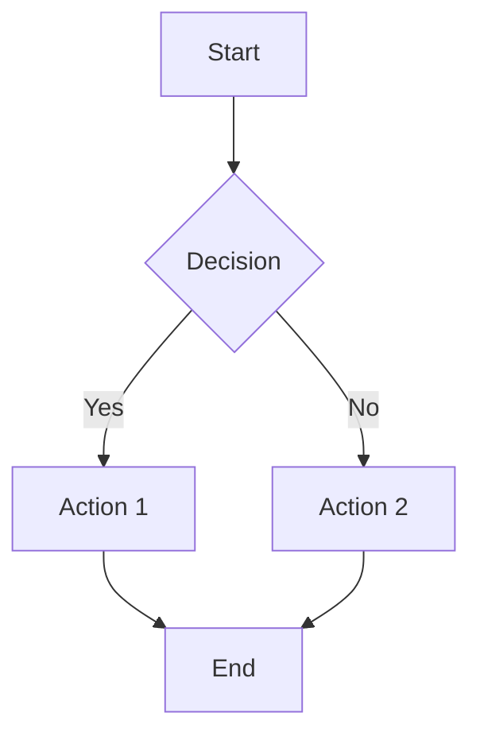

#### Direction Options

| Direction | Description |
|-----------|-------------|
| `TB` or `TD` | Top to Bottom |
| `BT` | Bottom to Top |
| `LR` | Left to Right |
| `RL` | Right to Left |

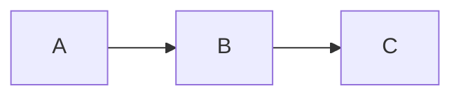

#### Node Shapes

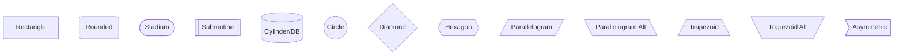

**Node Shape Reference Table:**

| Shape | Syntax | Use Case |
|-------|--------|----------|
| Rectangle | `[text]` | Process steps |
| Rounded | `(text)` | Start/End |
| Stadium | `([text])` | Terminal |
| Subroutine | `[[text]]` | Subprocess |
| Cylinder | `[(text)]` | Database |
| Circle | `((text))` | Connector |
| Diamond | `{text}` | Decision |
| Hexagon | `{{text}}` | Preparation |
| Parallelogram | `[/text/]` | Input/Output |
| Trapezoid | `[/text\]` | Manual operation |
| Asymmetric | `>text]` | Document |

#### Modern Shape Syntax (v11.3.0+)

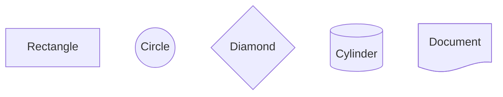

#### Arrow Types

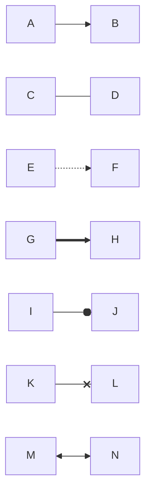

**Arrow Reference Table:**

| Arrow | Syntax | Description |
|-------|--------|-------------|
| Solid arrow | `-->` | Standard connection |
| Open link | `---` | Connection without arrow |
| Dotted arrow | `-.->` | Optional/conditional |
| Thick arrow | `==>` | Emphasized connection |
| Circle end | `--o` | Association |
| Cross end | `--x` | Rejection/termination |
| Bidirectional | `<-->` | Two-way flow |
| Invisible | `~~~` | Hidden link for layout |

#### Text on Links

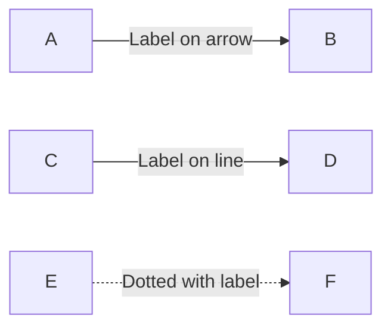

#### Extended Link Length

Add extra dashes to span more ranks:

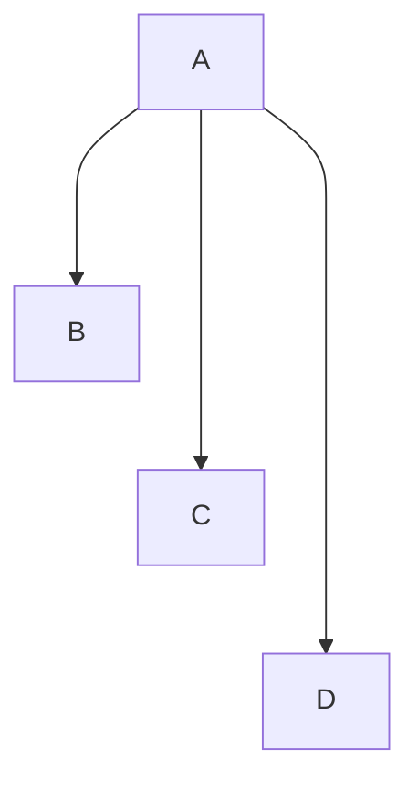

#### Subgraphs

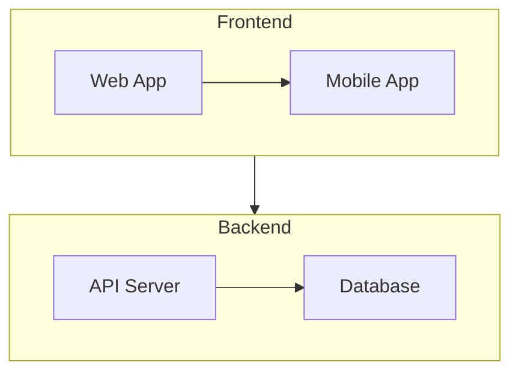

**Subgraph with Direction:**

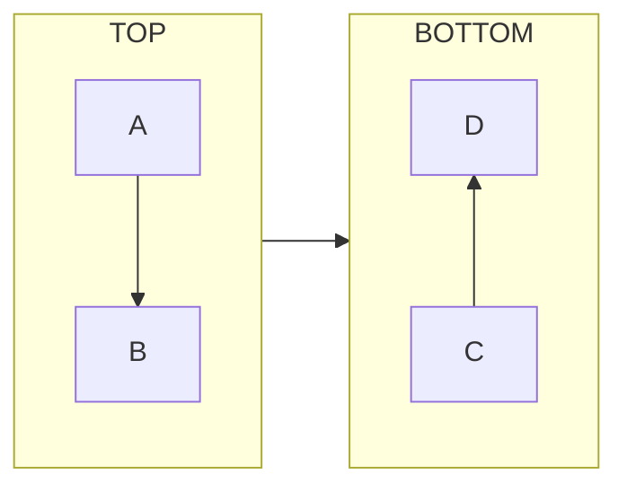

#### Chaining Syntax

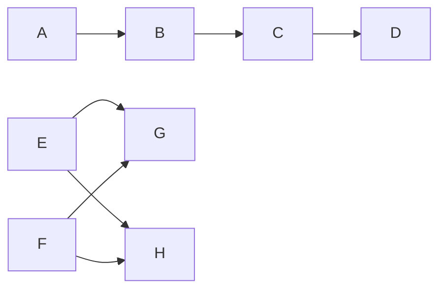

---

### 2. Sequence Diagrams

Sequence diagrams show interactions between actors/objects over time.

#### Basic Syntax

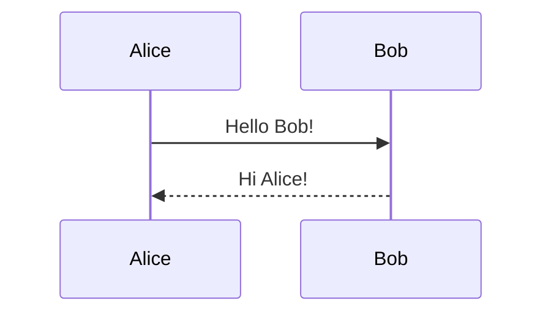

#### Arrow Types

| Arrow | Description |
|-------|-------------|
| `->` | Solid line without arrow |
| `-->` | Dotted line without arrow |
| `->>` | Solid line with arrowhead |
| `-->>` | Dotted line with arrowhead |
| `<<->>` | Bidirectional solid |
| `<<-->>` | Bidirectional dotted |
| `-x` | Solid with cross |
| `--x` | Dotted with cross |
| `-)` | Solid async arrow |
| `--)` | Dotted async arrow |

#### Activations

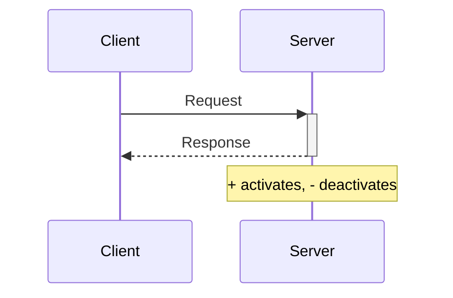

**Stacked Activations:**

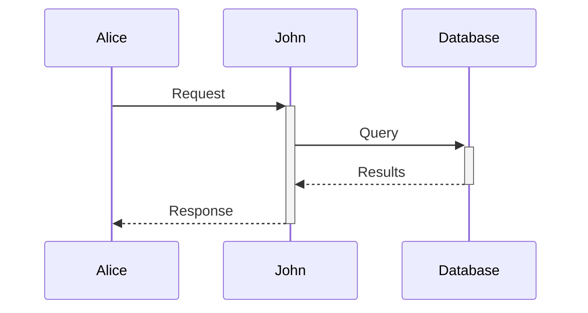

#### Loops and Conditionals

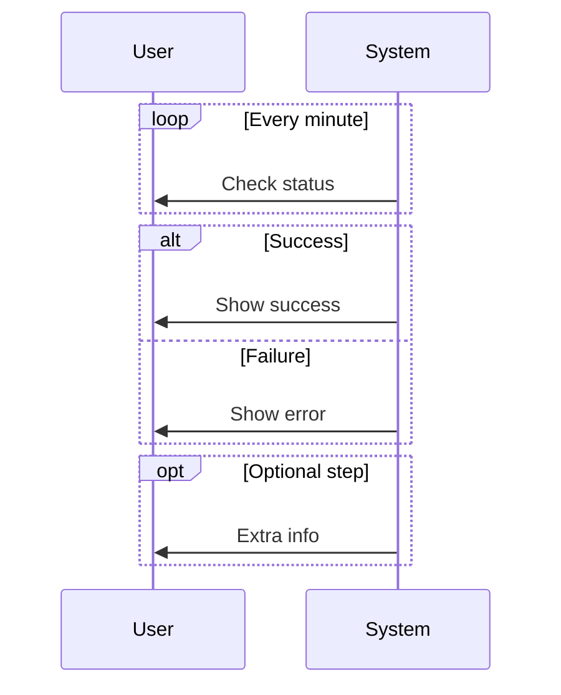

#### Parallel Execution

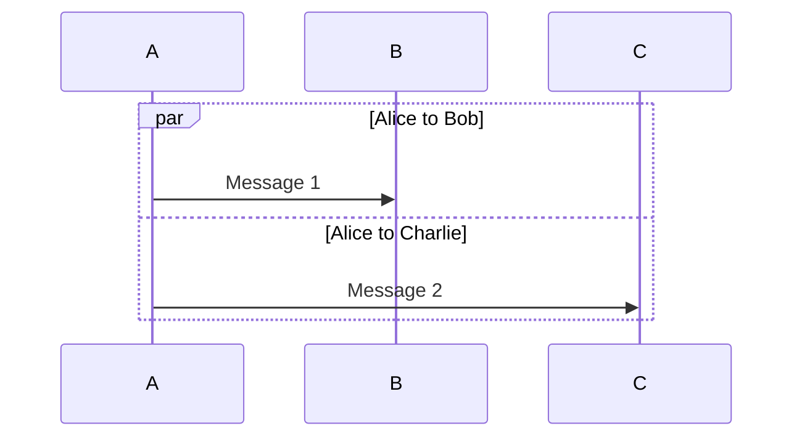

#### Notes

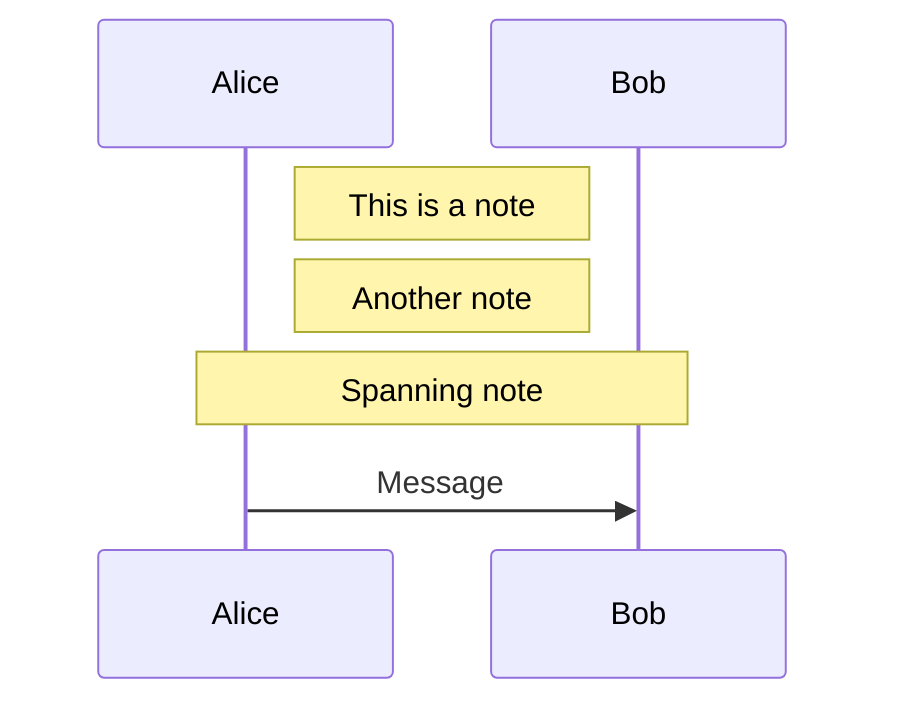

#### Grouping with Boxes

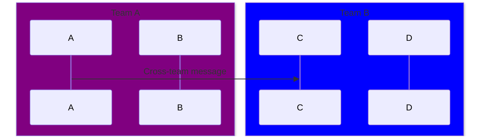

#### Critical Regions and Breaks

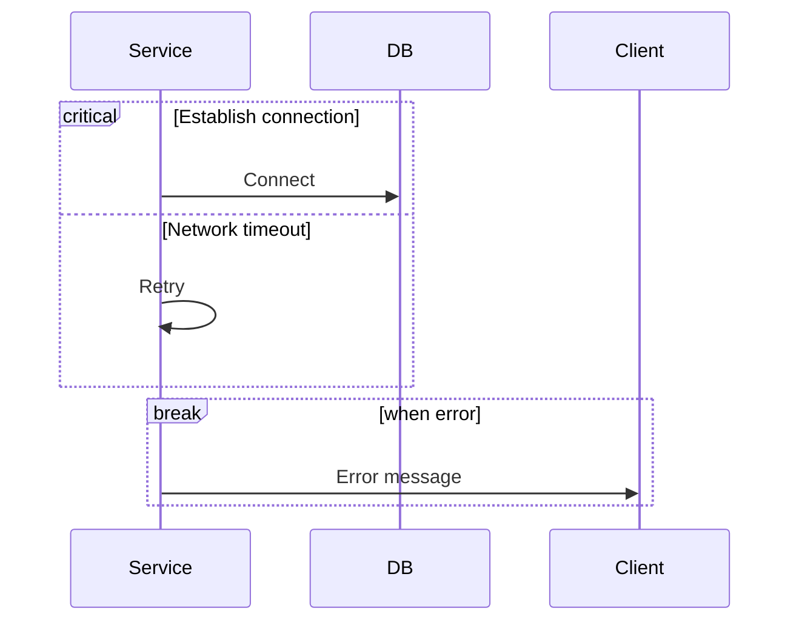

#### Actor Creation and Destruction

```mermaid
sequenceDiagram
    Alice->>Bob: Hello
    create participant Carl
    Alice->>Carl: Hi Carl!
    destroy Carl
    Carl->>Alice: Goodbye!
```

---

### 3. Class Diagrams

Class diagrams represent object-oriented structures.

#### Basic Syntax

```mermaid
classDiagram
    class Animal {
        +String name
        +int age
        +makeSound()
    }

    class Dog {
        +String breed
        +bark()
    }

    Animal <|-- Dog
```

#### Visibility Modifiers

| Symbol | Visibility |
|--------|------------|
| `+` | Public |
| `-` | Private |
| `#` | Protected |
| `~` | Package/Internal |

#### Method Classifiers

| Symbol | Meaning |
|--------|---------|
| `*` | Abstract |
| `$` | Static |

```mermaid
classDiagram
    class Shape {
        <<abstract>>
        +calculateArea()* double
        +PI$ double
    }
```

#### Relationships

```mermaid
classDiagram
    classA <|-- classB : Inheritance
    classC *-- classD : Composition
    classE o-- classF : Aggregation
    classG --> classH : Association
    classI -- classJ : Link
    classK ..> classL : Dependency
    classM ..|> classN : Realization
    classO .. classP : Dashed Link
```

**Relationship Reference:**

| Symbol | Type | Description |
|--------|------|-------------|
| `<\|--` | Inheritance | "is-a" relationship |
| `*--` | Composition | Strong "has-a", lifecycle dependent |
| `o--` | Aggregation | Weak "has-a", independent lifecycle |
| `-->` | Association | Uses/references |
| `..>` | Dependency | Depends on |
| `..\|>` | Realization | Implements interface |

#### Cardinality/Multiplicity

```mermaid
classDiagram
    Customer "1" --> "*" Order : places
    Order "1" --> "1..*" LineItem : contains
    Product "0..1" --> "*" Review : has
```

| Notation | Meaning |
|----------|---------|
| `1` | Exactly one |
| `0..1` | Zero or one |
| `*` | Many (zero or more) |
| `1..*` | One or more |
| `n` | Fixed number n |
| `0..n` | Zero to n |

#### Annotations

```mermaid
classDiagram
    class Shape {
        <<interface>>
    }
    class Color {
        <<enumeration>>
        RED
        GREEN
        BLUE
    }
    class UserService {
        <<service>>
    }
```

#### Generic Types

```mermaid
classDiagram
    class List~T~ {
        +add(T item)
        +get(int index) T
    }
    class Map~K,V~ {
        +put(K key, V value)
        +get(K key) V
    }
```

#### Namespaces

```mermaid
classDiagram
    namespace Core {
        class Entity
        class Repository
    }
    namespace Services {
        class UserService
        class OrderService
    }
```

---

### 4. State Diagrams

State diagrams show state machines and transitions.

#### Basic Syntax

```mermaid
stateDiagram-v2
    [*] --> Idle
    Idle --> Processing : Start
    Processing --> Complete : Done
    Processing --> Error : Fail
    Complete --> [*]
    Error --> Idle : Reset
```

#### Start and End States

- `[*]` as source = Start state
- `[*]` as target = End state

#### State Descriptions

```mermaid
stateDiagram-v2
    state "Waiting for input" as Waiting
    Waiting : User has not acted yet
    Waiting : Display prompt
```

#### Composite States

```mermaid
stateDiagram-v2
    [*] --> Active

    state Active {
        [*] --> Idle
        Idle --> Processing
        Processing --> Idle
    }

    Active --> Inactive : Pause
    Inactive --> Active : Resume
```

#### Forks and Joins

```mermaid
stateDiagram-v2
    state fork_state <<fork>>
    state join_state <<join>>

    [*] --> fork_state
    fork_state --> State1
    fork_state --> State2
    State1 --> join_state
    State2 --> join_state
    join_state --> [*]
```

#### Choice (Conditional)

```mermaid
stateDiagram-v2
    state check_result <<choice>>

    [*] --> Processing
    Processing --> check_result
    check_result --> Success : valid
    check_result --> Failure : invalid
```

#### Notes

```mermaid
stateDiagram-v2
    State1 --> State2
    note right of State1
        Important information
        about State1
    end note
    note left of State2 : Quick note
```

#### Concurrency

```mermaid
stateDiagram-v2
    state Parallel {
        [*] --> A
        --
        [*] --> B
    }
```

---

### 5. Entity Relationship Diagrams

ER diagrams model database schemas and relationships.

#### Basic Syntax

```mermaid
erDiagram
    CUSTOMER ||--o{ ORDER : places
    ORDER ||--|{ LINE-ITEM : contains
    PRODUCT ||--o{ LINE-ITEM : "is part of"
```

#### Cardinality (Crow's Foot Notation)

| Left | Right | Meaning |
|------|-------|---------|
| `\|o` | `o\|` | Zero or one |
| `\|\|` | `\|\|` | Exactly one |
| `}o` | `o{` | Zero or more |
| `}\|` | `\|{` | One or more |

```mermaid
erDiagram
    A ||--|| B : "one to one"
    C ||--o{ D : "one to many"
    E }o--o{ F : "many to many"
```

#### Relationship Lines

- `--` Solid line (identifying relationship)
- `..` Dashed line (non-identifying relationship)

#### Entity Attributes

```mermaid
erDiagram
    USER {
        int id PK
        string email UK
        string name
        date created_at
    }
    POST {
        int id PK
        int user_id FK
        string title
        text content
    }
    USER ||--o{ POST : writes
```

**Attribute Markers:**

| Marker | Meaning |
|--------|---------|
| `PK` | Primary Key |
| `FK` | Foreign Key |
| `UK` | Unique Key |

#### Entity Aliases

```mermaid
erDiagram
    u[User] ||--o{ p[Post] : writes
```

---

### 6. Gantt Charts

Gantt charts display project schedules and timelines.

#### Basic Syntax

```mermaid
gantt
    title Project Timeline
    dateFormat YYYY-MM-DD

    section Planning
    Requirements    :a1, 2024-01-01, 7d
    Design          :a2, after a1, 5d

    section Development
    Implementation  :b1, after a2, 14d
    Testing         :b2, after b1, 7d
```

#### Date Formats

- `dateFormat YYYY-MM-DD` - Input format
- `axisFormat %Y-%m-%d` - Display format

Common format specifiers:
| Specifier | Meaning |
|-----------|---------|
| `%Y` | 4-digit year |
| `%m` | Month (01-12) |
| `%d` | Day (01-31) |
| `%H` | Hour (00-23) |
| `%M` | Minute (00-59) |

#### Task Tags

```mermaid
gantt
    dateFormat YYYY-MM-DD

    section Tasks
    Completed task    :done, t1, 2024-01-01, 3d
    Active task       :active, t2, 2024-01-04, 3d
    Critical task     :crit, t3, 2024-01-07, 2d
    Milestone         :milestone, m1, 2024-01-09, 0d
```

| Tag | Description |
|-----|-------------|
| `done` | Completed task |
| `active` | Currently running |
| `crit` | Critical path |
| `milestone` | Single point marker |

#### Dependencies

```mermaid
gantt
    dateFormat YYYY-MM-DD

    Task A :a, 2024-01-01, 3d
    Task B :b, after a, 2d
    Task C :c, after a b, 4d
```

#### Exclusions

```mermaid
gantt
    dateFormat YYYY-MM-DD
    excludes weekends

    section Sprint
    Development :2024-01-01, 10d
```

---

### 7. Pie Charts

Pie charts show proportional data.

#### Basic Syntax

```mermaid
pie title Browser Market Share
    "Chrome" : 65
    "Safari" : 19
    "Firefox" : 8
    "Edge" : 5
    "Other" : 3
```

#### Show Data Values

```mermaid
pie showData
    title Sales by Region
    "North" : 45
    "South" : 30
    "East" : 15
    "West" : 10
```

#### Rules

- Values must be positive numbers greater than zero
- Labels must be in quotes
- Values support up to 2 decimal places

---

### 8. User Journey Diagrams

User journey diagrams visualize user experiences and workflows.

#### Basic Syntax

```mermaid
journey
    title User Shopping Experience

    section Browse
        Visit homepage: 5: User
        Search products: 4: User
        View product details: 4: User

    section Purchase
        Add to cart: 5: User
        Checkout: 3: User, System
        Payment: 2: User, Payment Provider

    section Delivery
        Order confirmation: 5: User, System
        Shipping update: 4: System
        Delivery: 5: User, Delivery
```

#### Format

```
Task name: score: actor1, actor2
```

- **Score**: 1-5 (1 = poor, 5 = excellent)
- **Actors**: Comma-separated list of participants

---

### 9. GitGraph Diagrams

GitGraph diagrams visualize Git branching and history.

#### Basic Syntax

```mermaid
gitGraph
    commit
    commit
    branch develop
    checkout develop
    commit
    commit
    checkout main
    merge develop
    commit
```

#### Commands

| Command | Description |
|---------|-------------|
| `commit` | Add a commit |
| `branch name` | Create and switch to branch |
| `checkout name` | Switch to branch |
| `merge name` | Merge branch into current |
| `cherry-pick id:"id"` | Apply specific commit |

#### Commit Attributes

```mermaid
gitGraph
    commit id: "Initial"
    commit id: "feat-1" type: HIGHLIGHT
    commit id: "fix-1" tag: "v1.0.0"
    branch feature
    commit id: "feat-2"
    checkout main
    merge feature id: "merge-1"
```

**Commit Types:**

| Type | Appearance |
|------|------------|
| `NORMAL` | Solid circle |
| `REVERSE` | Crossed circle |
| `HIGHLIGHT` | Rectangle |

#### Orientation

```mermaid
gitGraph TB:
    commit
    branch develop
    commit
    checkout main
    merge develop
```

Options: `LR` (default), `TB`, `BT`

---

### 10. Mindmaps

Mindmaps display hierarchical information radiating from a central concept.

#### Basic Syntax

```mermaid
mindmap
    root((Project))
        Planning
            Requirements
            Timeline
            Budget
        Development
            Frontend
            Backend
            Database
        Testing
            Unit Tests
            Integration
            E2E
```

#### Node Shapes

```mermaid
mindmap
    root[Square Root]
        (Rounded)
        ((Circle))
        ))Bang((
        )Cloud(
        {{Hexagon}}
```

| Shape | Syntax |
|-------|--------|
| Square | `[text]` |
| Rounded | `(text)` |
| Circle | `((text))` |
| Bang | `))text((` |
| Cloud | `)text(` |
| Hexagon | `{{text}}` |

#### Icons and Classes

```mermaid
mindmap
    root((Central Idea))
        Important:::urgent
        With Icon
            ::icon(fa fa-star)
```

---

### 11. Timeline Diagrams

Timeline diagrams show chronological events.

#### Basic Syntax

```mermaid
timeline
    title History of Computing

    section Early Era
        1940s : ENIAC : First electronic computer
        1950s : FORTRAN : First high-level language

    section Personal Computing
        1970s : Apple I : Microcomputer revolution
        1980s : IBM PC : Business computing
        1990s : WWW : Internet age begins
```

#### Multiple Events

```mermaid
timeline
    2020 : COVID-19 Pandemic
         : Remote Work Surge
         : Digital Transformation
    2021 : Vaccine Rollout
         : Return to Office
```

---

### 12. Quadrant Charts

Quadrant charts categorize items in a 2x2 matrix.

#### Basic Syntax

```mermaid
quadrantChart
    title Feature Priority Matrix
    x-axis Low Effort --> High Effort
    y-axis Low Impact --> High Impact
    quadrant-1 Do First
    quadrant-2 Schedule
    quadrant-3 Delegate
    quadrant-4 Eliminate

    Feature A: [0.8, 0.9]
    Feature B: [0.3, 0.8]
    Feature C: [0.7, 0.3]
    Feature D: [0.2, 0.2]
```

#### Point Styling

```mermaid
quadrantChart
    x-axis Low --> High
    y-axis Low --> High

    Point A: [0.5, 0.5] radius: 15
    Point B:::important: [0.8, 0.8]

    classDef important color: #ff0000, radius: 12
```

---

### 13. Requirement Diagrams

Requirement diagrams show system requirements and their relationships.

#### Basic Syntax

```mermaid
requirementDiagram

    requirement UserAuth {
        id: REQ-001
        text: System must authenticate users
        risk: medium
        verifymethod: test
    }

    functionalRequirement LoginPage {
        id: REQ-002
        text: Login page with username/password
        risk: low
        verifymethod: demonstration
    }

    element AuthService {
        type: module
        docref: auth-service.ts
    }

    UserAuth - contains -> LoginPage
    AuthService - satisfies -> UserAuth
```

#### Requirement Types

- `requirement`
- `functionalRequirement`
- `interfaceRequirement`
- `performanceRequirement`
- `physicalRequirement`
- `designConstraint`

#### Relationship Types

| Type | Description |
|------|-------------|
| `contains` | Parent contains child |
| `copies` | Derived copy |
| `derives` | Derived from |
| `satisfies` | Element satisfies requirement |
| `verifies` | Element verifies requirement |
| `refines` | More detailed version |
| `traces` | Traceability link |

---

### 14. C4 Diagrams

C4 diagrams follow the C4 model for software architecture visualization.

#### Context Diagram

```mermaid
C4Context
    title System Context Diagram

    Person(user, "User", "A user of the system")
    System(system, "Our System", "The main application")
    System_Ext(email, "Email Service", "External email provider")

    Rel(user, system, "Uses")
    Rel(system, email, "Sends emails via")
```

#### Container Diagram

```mermaid
C4Container
    title Container Diagram

    Person(user, "User")

    Container_Boundary(app, "Application") {
        Container(web, "Web App", "React", "Frontend UI")
        Container(api, "API", "Node.js", "Backend services")
        ContainerDb(db, "Database", "PostgreSQL", "Stores data")
    }

    Rel(user, web, "Uses", "HTTPS")
    Rel(web, api, "Calls", "JSON/HTTPS")
    Rel(api, db, "Reads/Writes", "SQL")
```

#### Diagram Types

| Type | Use Case |
|------|----------|
| `C4Context` | High-level system overview |
| `C4Container` | Application containers |
| `C4Component` | Internal components |
| `C4Dynamic` | Runtime interactions |
| `C4Deployment` | Infrastructure/deployment |

#### Elements

| Element | Description |
|---------|-------------|
| `Person` | User/actor |
| `Person_Ext` | External user |
| `System` | Internal system |
| `System_Ext` | External system |
| `Container` | Application container |
| `ContainerDb` | Database container |
| `ContainerQueue` | Message queue |
| `Component` | Component within container |

---

### 15. Sankey Diagrams

Sankey diagrams show flow quantities between nodes.

#### Basic Syntax

```mermaid
sankey-beta

Energy,Electricity,50
Energy,Heat,30
Energy,Transport,20
Electricity,Residential,25
Electricity,Commercial,15
Electricity,Industrial,10
```

#### Format

CSV format with three columns:
- Source node
- Target node
- Flow value

#### Configuration

```yaml
---
config:
  sankey:
    linkColor: gradient
    nodeAlignment: justify
---
```

Options:
- `linkColor`: `source`, `target`, `gradient`, or hex color
- `nodeAlignment`: `justify`, `center`, `left`, `right`

---

### 16. XY Charts

XY charts create bar charts and line graphs.

#### Bar Chart

```mermaid
xychart-beta
    title "Monthly Sales"
    x-axis [Jan, Feb, Mar, Apr, May]
    y-axis "Revenue ($K)" 0 --> 100
    bar [45, 52, 38, 67, 82]
```

#### Line Chart

```mermaid
xychart-beta
    title "Temperature Trend"
    x-axis [Mon, Tue, Wed, Thu, Fri]
    y-axis "Temperature (°F)" 50 --> 90
    line [65, 72, 68, 75, 80]
```

#### Combined Chart

```mermaid
xychart-beta
    title "Sales vs Target"
    x-axis [Q1, Q2, Q3, Q4]
    y-axis "Amount ($M)" 0 --> 50
    bar [30, 35, 42, 48]
    line [35, 35, 40, 45]
```

#### Horizontal Orientation

```yaml
---
config:
  xyChart:
    chartOrientation: horizontal
---
```

---

### 17. Block Diagrams

Block diagrams show system components and architecture.

#### Basic Syntax

```mermaid
block-beta
    columns 3

    A["Frontend"]
    B["API Gateway"]
    C["Backend"]

    D["Database"]:3

    A --> B --> C
    C --> D
```

#### Column Spans

```mermaid
block-beta
    columns 4

    Header:4

    Left:2 Right:2

    Footer:4
```

#### Nested Blocks

```mermaid
block-beta
    block:Group1
        A["Service A"]
        B["Service B"]
    end

    C["External"]

    Group1 --> C
```

---

### 18. Kanban Boards

Kanban diagrams visualize task workflows.

#### Basic Syntax

```mermaid
kanban
    todo[To Do]
        task1[Research]
        task2[Design]

    doing[In Progress]
        task3[Development]

    done[Done]
        task4[Testing]
```

#### Task Metadata

```mermaid
kanban
    backlog[Backlog]
        t1[Feature A] @{ assigned: "Alice", priority: "High", ticket: "PROJ-101" }
        t2[Bug Fix] @{ assigned: "Bob", priority: "Very High" }

    inProgress[In Progress]
        t3[Refactoring] @{ assigned: "Charlie" }
```

#### Configuration

```yaml
---
config:
  kanban:
    ticketBaseUrl: 'https://jira.example.com/browse/#TICKET#'
---
```

---

### 19. Architecture Diagrams

Architecture diagrams (v11.1.0+) show cloud and CI/CD deployments.

#### Basic Syntax

```mermaid
architecture-beta
    group api(cloud)[API]

    service db(database)[Database] in api
    service server(server)[Server] in api
    service disk(disk)[Storage] in api

    db:L -- R:server
    server:B -- T:disk
```

#### Default Icons

- `cloud`
- `database`
- `disk`
- `internet`
- `server`

#### Custom Icons

Register iconify icons for cloud providers (AWS, Azure, GCP):

```javascript
import { icons } from '@iconify-json/logos';
mermaid.registerIconPacks([{ name: icons.prefix, icons }]);
```

Then use: `service ec2(logos:aws-ec2)[EC2 Instance]`

#### Edge Directions

- `T` = Top
- `B` = Bottom
- `L` = Left
- `R` = Right

```mermaid
architecture-beta
    service a(server)[A]
    service b(database)[B]

    a:R --> L:b
```

#### Junctions

```mermaid
architecture-beta
    service a(server)[A]
    service b(server)[B]
    service c(server)[C]
    junction hub

    a:R -- L:hub
    hub:R -- L:b
    hub:B -- T:c
```

---

### 20. Packet Diagrams

Packet diagrams (v11.0.0+) visualize network packet structures.

#### Basic Syntax

```mermaid
packet-beta
    0-15: "Source Port"
    16-31: "Destination Port"
    32-63: "Sequence Number"
    64-95: "Acknowledgment Number"
```

#### Modern Syntax (v11.7.0+)

```mermaid
packet-beta
    +16: "Source Port"
    +16: "Destination Port"
    +32: "Sequence Number"
    +32: "Acknowledgment Number"
```

The `+count` notation auto-calculates bit positions.

---

### 21. Radar Charts

Radar charts (v11.6.0+) compare multiple variables across categories.

#### Basic Syntax

```mermaid
radar-beta
    title "Team Skills Assessment"

    axis JavaScript, Python, SQL, DevOps, Communication

    "Alice" --> [80, 60, 70, 50, 90]
    "Bob" --> [70, 85, 80, 65, 75]
```

---

### 22. Treemap Diagrams

Treemap diagrams display hierarchical data as nested rectangles.

#### Basic Syntax

```mermaid
treemap-beta
    "Company Revenue"
        "Product A"
            "Region 1": 100
            "Region 2": 80
        "Product B"
            "Region 1": 60
            "Region 2": 50
        "Services": 120
```

---

## Node Shapes Reference

### Flowchart Shapes (Classic)

```
┌─────────────────────────────────────────────────────────────┐
│                                                             │
│  [Rectangle]    Standard process step                       │
│                                                             │
│  (Rounded)      Softer appearance, terminals                │
│                                                             │
│  ([Stadium])    Pill shape, start/end terminals             │
│                                                             │
│  [[Subroutine]] Double-lined, subprocess                    │
│                                                             │
│  [(Cylinder)]   Database or storage                         │
│                                                             │
│  ((Circle))     Connector or junction point                 │
│                                                             │
│  {Diamond}      Decision/conditional branch                 │
│                                                             │
│  {{Hexagon}}    Preparation step                            │
│                                                             │
│  [/Parallel/]   Parallelogram for I/O                       │
│                                                             │
│  [\Parallel\]   Alternate parallelogram                     │
│                                                             │
│  [/Trapezoid\]  Manual operation                            │
│                                                             │
│  [\Trapezoid/]  Alternate trapezoid                         │
│                                                             │
│  >Asymmetric]   Document or note                            │
│                                                             │
│  (((Double)))   Double circle for emphasis                  │
│                                                             │
└─────────────────────────────────────────────────────────────┘
```

### Modern Shape Syntax (v11.3.0+)

| Shape ID | Description |
|----------|-------------|
| `rect` | Rectangle |
| `circle` | Circle |
| `diam` | Diamond |
| `cyl` | Cylinder |
| `doc` | Document |
| `delay` | Delay symbol |
| `h-cyl` | Horizontal cylinder |
| `lin-cyl` | Lined cylinder |
| `curv-trap` | Curved trapezoid |
| `tri` | Triangle |
| `fork` | Fork/merge |
| `flag` | Flag shape |
| `docs` | Stacked documents |
| `st-rect` | Striped rectangle |

---

## Arrow and Line Types

### Complete Arrow Reference

```
┌─────────────────────────────────────────────────────────────┐
│  SOLID LINES                                                │
├─────────────────────────────────────────────────────────────┤
│  A --> B        Solid line with arrow                       │
│  A --- B        Solid line without arrow                    │
│  A ---> B       Extended solid arrow (longer)               │
│  A <--> B       Bidirectional solid arrow                   │
│                                                             │
├─────────────────────────────────────────────────────────────┤
│  DOTTED LINES                                               │
├─────────────────────────────────────────────────────────────┤
│  A -.-> B       Dotted line with arrow                      │
│  A -.- B        Dotted line without arrow                   │
│  A <-.-> B      Bidirectional dotted arrow                  │
│                                                             │
├─────────────────────────────────────────────────────────────┤
│  THICK LINES                                                │
├─────────────────────────────────────────────────────────────┤
│  A ==> B        Thick solid with arrow                      │
│  A === B        Thick solid without arrow                   │
│  A <==> B       Bidirectional thick arrow                   │
│                                                             │
├─────────────────────────────────────────────────────────────┤
│  SPECIAL ENDINGS                                            │
├─────────────────────────────────────────────────────────────┤
│  A --o B        Circle end                                  │
│  A --x B        Cross end                                   │
│  A o--o B       Circles on both ends                        │
│  A x--x B       Crosses on both ends                        │
│                                                             │
├─────────────────────────────────────────────────────────────┤
│  INVISIBLE                                                  │
├─────────────────────────────────────────────────────────────┤
│  A ~~~ B        Invisible link (for layout)                 │
│                                                             │
└─────────────────────────────────────────────────────────────┘
```

### Text on Arrows

```mermaid
flowchart LR
    A -->|Pipe syntax| B
    C -- Text syntax --> D
    E -.->|Dotted with text| F
    G ==>|Thick with text| H
```

---

## Layout and Direction

### Flowchart Directions

```
TB/TD (Top to Bottom)        LR (Left to Right)
     ┌───┐                    ┌───┐ → ┌───┐ → ┌───┐
     │ A │                    │ A │   │ B │   │ C │
     └─┬─┘                    └───┘   └───┘   └───┘
       ↓
     ┌───┐
     │ B │
     └─┬─┘
       ↓
     ┌───┐
     │ C │
     └───┘

BT (Bottom to Top)           RL (Right to Left)
     ┌───┐                    ┌───┐ ← ┌───┐ ← ┌───┐
     │ A │                    │ C │   │ B │   │ A │
     └───┘                    └───┘   └───┘   └───┘
       ↑
     ┌───┐
     │ B │
     └───┘
       ↑
     ┌───┐
     │ C │
     └───┘
```

### Subgraph Direction Override

```mermaid
flowchart LR
    subgraph sub1[Vertical Inside]
        direction TB
        A --> B --> C
    end

    D --> sub1 --> E
```

**Note**: If subgraph nodes link externally, subgraph direction is ignored.

### Alternative Layout Engines

```yaml
---
config:
  layout: elk
---
```

The `elk` layout engine is better for larger, complex diagrams.

---

## Theming and Styling

### Built-in Themes

| Theme | Description |
|-------|-------------|
| `default` | Standard light theme |
| `neutral` | Black and white, good for printing |
| `dark` | Dark mode friendly |
| `forest` | Green color palette |
| `base` | Customizable base theme |

### Applying Themes

**Site-wide (JavaScript):**

```javascript
mermaid.initialize({
  theme: 'dark',
});
```

**Per-diagram (Frontmatter):**

```yaml
---
config:
  theme: forest
---
flowchart LR
    A --> B
```

### Custom Theme Variables

```yaml
---
config:
  theme: base
  themeVariables:
    primaryColor: "#ff6b6b"
    primaryTextColor: "#ffffff"
    primaryBorderColor: "#ee5a5a"
    lineColor: "#333333"
    secondaryColor: "#4ecdc4"
    tertiaryColor: "#45b7aa"
---
```

**Important**: Use hex colors (`#ff0000`), not color names (`red`).

### Key Theme Variables

| Variable | Affects |
|----------|---------|
| `primaryColor` | Main node backgrounds |
| `primaryTextColor` | Text on primary nodes |
| `primaryBorderColor` | Primary node borders |
| `secondaryColor` | Secondary elements |
| `tertiaryColor` | Tertiary elements |
| `lineColor` | Connection lines |
| `background` | Diagram background |
| `noteBkgColor` | Note backgrounds |
| `noteTextColor` | Note text |

### Inline Styling

**Style individual nodes:**

```mermaid
flowchart LR
    A --> B --> C
    style A fill:#f9f,stroke:#333,stroke-width:4px
    style B fill:#bbf,stroke:#00f,stroke-dasharray: 5 5
```

**CSS Properties:**

| Property | Example |
|----------|---------|
| `fill` | Background color |
| `stroke` | Border color |
| `stroke-width` | Border thickness |
| `stroke-dasharray` | Dashed borders |
| `color` | Text color |

### CSS Classes

**Define and apply classes:**

```mermaid
flowchart LR
    A:::important --> B:::warning --> C

    classDef important fill:#f00,color:#fff
    classDef warning fill:#ff0,color:#000
```

**Shorthand application:**

```mermaid
flowchart LR
    A:::classA --> B:::classB

    classDef classA fill:#0f0
    classDef classB fill:#00f
```

### Link Styling

```mermaid
flowchart LR
    A --> B --> C --> D

    linkStyle 0 stroke:#ff0000,stroke-width:3px
    linkStyle 1,2 stroke:#00ff00
```

Links are zero-indexed in order of definition.

---

## Configuration and Directives

### Modern Configuration (v10.5.0+)

Use frontmatter YAML instead of deprecated directives:

```yaml
---
config:
  theme: dark
  fontFamily: monospace
  logLevel: debug
  flowchart:
    curve: basis
    padding: 20
  sequence:
    mirrorActors: true
    showSequenceNumbers: true
---
```

### Common Configuration Options

| Option | Description | Default |
|--------|-------------|---------|
| `theme` | Visual theme | `default` |
| `fontFamily` | Font for text | System default |
| `logLevel` | Debug logging | `fatal` |
| `securityLevel` | Security mode | `strict` |
| `startOnLoad` | Auto-render | `true` |

### Diagram-Specific Configuration

**Flowchart:**

```yaml
config:
  flowchart:
    curve: basis
    padding: 20
    nodeSpacing: 50
    rankSpacing: 50
    htmlLabels: true
```

**Sequence:**

```yaml
config:
  sequence:
    mirrorActors: true
    showSequenceNumbers: true
    actorMargin: 50
    messageAlign: center
```

**Gantt:**

```yaml
config:
  gantt:
    titleTopMargin: 25
    barHeight: 20
    barGap: 4
    topPadding: 50
    leftPadding: 75
```

### Security Levels

| Level | Description |
|-------|-------------|
| `strict` | No scripts/events (default, safest) |
| `loose` | Enables click events and scripts |
| `antiscript` | Blocks scripts, allows other features |
| `sandbox` | Renders in iframe sandbox |

---

## Advanced Features

### Click Events and Interactions

**Requires `securityLevel: 'loose'`**

**Link to URL:**

```mermaid
flowchart LR
    A[Click Me]
    click A "https://example.com" "Visit Site" _blank
```

**JavaScript Callback:**

```mermaid
flowchart LR
    B[Click for Alert]
    click B callback "Tooltip text"
```

```javascript
function callback(nodeId) {
  alert('Clicked: ' + nodeId);
}
```

**Target Options:**

| Target | Description |
|--------|-------------|
| `_self` | Same window (default) |
| `_blank` | New tab |
| `_parent` | Parent frame |
| `_top` | Full window |

### Tooltips

```mermaid
flowchart LR
    A[Hover Me]
    click A "#" "This is tooltip text"
```

Style tooltips with CSS class `.mermaidTooltip`.

### Icons (FontAwesome)

```mermaid
flowchart LR
    A[fa:fa-twitter Twitter]
    B[fa:fa-github GitHub]
    C[fa:fa-database Database]
```

### Comments

```mermaid
flowchart LR
    %% This is a comment
    A --> B
    %% Comments are ignored by the parser
```

### Markdown Text Support

```mermaid
flowchart LR
    A["**Bold** and *italic*"]
    B["Line 1<br/>Line 2"]
```

### Unicode Support

```mermaid
flowchart LR
    A["Hello 你好 مرحبا"]
    B["Emoji: 🚀 ✨"]
```

### Escaping Special Characters

```mermaid
flowchart LR
    A["Use #quot; for quotes"]
    B["Use #amp; for &"]
```

---

## Platform Integrations

### Native Support

| Platform | Support Level |
|----------|---------------|
| **GitHub** | Native in Markdown files, Issues, PRs |
| **GitLab** | Native in Markdown |
| **Notion** | Native support |
| **Obsidian** | Native support |
| **Azure DevOps** | Native in Wiki |

### Documentation Tools

| Tool | Integration |
|------|-------------|
| **Docusaurus** | Built-in plugin |
| **MkDocs** | mkdocs-mermaid2-plugin |
| **GitBook** | Native support |
| **Sphinx** | sphinxcontrib-mermaid |
| **VitePress** | Built-in |
| **Hugo** | Shortcode available |

### Editors

| Editor | Extension |
|--------|-----------|
| **VS Code** | Markdown Preview Mermaid Support |
| **JetBrains IDEs** | Mermaid Plugin |
| **Vim** | vim-mermaid |
| **Emacs** | mermaid-mode |
| **Atom** | atom-mermaid |

### Communication Tools

| Tool | Integration |
|------|-------------|
| **Confluence** | Mermaid Diagrams app |
| **Slack** | Mermaid Preview bot |
| **Mattermost** | Native plugin |
| **Discord** | Mermaid bot |

### Online Tools

- **Mermaid Live Editor**: https://mermaid.live/
- **Mermaid Chart** (official): https://www.mermaidchart.com/
- **Kroki**: https://kroki.io/

---

## Best Practices

### Clarity and Simplicity

1. **Keep diagrams focused** - One concept per diagram
2. **Limit nodes** - 7-15 nodes is ideal; split larger diagrams
3. **Use meaningful labels** - Self-explanatory text, not abbreviations

### Naming Conventions

```mermaid
%% Good: Self-explanatory IDs
flowchart LR
    userInput[User Input]
    validateData[Validate Data]
    processRequest[Process Request]

    userInput --> validateData --> processRequest
```

```mermaid
%% Avoid: Cryptic IDs
flowchart LR
    A --> B --> C
```

### Structure and Organization

1. **Declare nodes first** - List all nodes, then define connections
2. **Group related nodes** - Use subgraphs for logical grouping
3. **Define shared nodes separately** - When multiple nodes connect to one

```mermaid
flowchart TD
    %% Node declarations
    A[Start]
    B[Process 1]
    C[Process 2]
    D[Shared Handler]
    E[End]

    %% Connections
    A --> B
    A --> C
    B --> D
    C --> D
    D --> E
```

### Direction Choice

| Use Case | Recommended Direction |
|----------|----------------------|
| Process flow | TB (top to bottom) |
| Timeline/sequence | LR (left to right) |
| Hierarchy/org chart | TB |
| Data pipeline | LR |
| State machine | LR or TB |

### Testing and Validation

1. **Use the Live Editor** - Test diagrams before committing
2. **Check rendering** - View in target platform (GitHub, docs site)
3. **Validate syntax** - Small errors can break entire diagrams

### Version Control

1. **Treat diagrams as code** - Store in Git, review in PRs
2. **Keep diagrams near code** - Colocate with related documentation
3. **Update with code changes** - Include diagram updates in feature PRs

### Performance

1. **Use `elk` layout** for complex diagrams (50+ nodes)
2. **Avoid deeply nested subgraphs**
3. **Minimize crossing edges** - Rearrange nodes for cleaner layout

---

## Common Patterns

### Authentication Flow

```mermaid
sequenceDiagram
    participant U as User
    participant C as Client
    participant A as Auth Server
    participant R as Resource Server

    U->>C: Login request
    C->>A: Authentication request
    A->>A: Validate credentials
    A-->>C: Access token
    C->>R: Request with token
    R->>R: Validate token
    R-->>C: Protected resource
    C-->>U: Display data
```

### Microservices Architecture

```mermaid
flowchart TB
    subgraph Client
        Web[Web App]
        Mobile[Mobile App]
    end

    subgraph Gateway
        API[API Gateway]
        Auth[Auth Service]
    end

    subgraph Services
        User[User Service]
        Order[Order Service]
        Inventory[Inventory Service]
    end

    subgraph Data
        UserDB[(User DB)]
        OrderDB[(Order DB)]
        Cache[(Redis Cache)]
    end

    Web & Mobile --> API
    API --> Auth
    API --> User & Order & Inventory
    User --> UserDB
    Order --> OrderDB
    User & Order --> Cache
```

### CI/CD Pipeline

```mermaid
flowchart LR
    subgraph Source
        Code[Code Push]
    end

    subgraph Build
        Lint[Lint]
        Test[Unit Tests]
        Build[Build]
    end

    subgraph Deploy
        Stage[Staging]
        Approve{Approval}
        Prod[Production]
    end

    Code --> Lint --> Test --> Build
    Build --> Stage --> Approve
    Approve -->|Yes| Prod
    Approve -->|No| Code
```

### Database Schema

```mermaid
erDiagram
    USER ||--o{ POST : creates
    USER ||--o{ COMMENT : writes
    POST ||--o{ COMMENT : has
    POST ||--o{ TAG : has
    CATEGORY ||--o{ POST : contains

    USER {
        uuid id PK
        string email UK
        string name
        timestamp created_at
    }

    POST {
        uuid id PK
        uuid user_id FK
        uuid category_id FK
        string title
        text content
        timestamp published_at
    }

    COMMENT {
        uuid id PK
        uuid user_id FK
        uuid post_id FK
        text content
        timestamp created_at
    }
```

### State Machine

```mermaid
stateDiagram-v2
    [*] --> Draft

    Draft --> Review : Submit
    Review --> Draft : Request Changes
    Review --> Approved : Approve
    Review --> Rejected : Reject

    Approved --> Published : Publish
    Published --> Archived : Archive

    Draft --> Archived : Cancel
    Rejected --> Draft : Revise

    Archived --> [*]
```

### User Flow

```mermaid
flowchart TD
    Start([Start]) --> Home[Homepage]
    Home --> Browse{Browse Products?}

    Browse -->|Yes| Category[Select Category]
    Browse -->|No| Search[Search]

    Category --> Product[View Product]
    Search --> Product

    Product --> Cart{Add to Cart?}
    Cart -->|Yes| AddCart[Add Item]
    Cart -->|No| Browse

    AddCart --> Checkout{Checkout?}
    Checkout -->|Yes| Payment[Payment]
    Checkout -->|No| Browse

    Payment --> Confirm[Order Confirmed]
    Confirm --> End([End])
```

---

## Troubleshooting

### Common Errors

| Error | Cause | Solution |
|-------|-------|----------|
| Diagram not rendering | Syntax error | Check for typos, use Live Editor |
| "end" breaks flowchart | Reserved word | Use "End" or "END" |
| Node ID starting with o/x | Special characters | Add space or use quotes |
| Links not working | securityLevel | Set to 'loose' |
| Subgraph direction ignored | External links | Redesign to avoid external links |

### Reserved Words

Avoid these as node IDs (or capitalize them):
- `end`
- `graph`
- `subgraph`
- `direction`

### Escaping Text

```mermaid
flowchart LR
    A["Text with (parentheses)"]
    B["Text with [brackets]"]
    C["Text with {braces}"]
```

### Debugging Tips

1. **Simplify** - Remove nodes until it works, then add back
2. **Check quotes** - Ensure matching quotes around labels
3. **Validate JSON** - If using config, validate YAML/JSON syntax
4. **Browser console** - Check for JavaScript errors
5. **Use comments** - Comment out sections to isolate issues

---

## Sources

1. [About Mermaid | Official Documentation](https://mermaid.js.org/intro/)
2. [Mermaid GitHub Repository](https://github.com/mermaid-js/mermaid)
3. [Flowchart Syntax | Mermaid](https://mermaid.js.org/syntax/flowchart.html)
4. [Diagram Syntax Reference | Mermaid](https://mermaid.js.org/intro/syntax-reference.html)
5. [Sequence Diagram | Mermaid Chart Docs](https://docs.mermaidchart.com/mermaid-oss/syntax/sequenceDiagram.html)
6. [Class Diagrams | Mermaid](https://mermaid.js.org/syntax/classDiagram.html)
7. [State Diagram | Mermaid](https://mermaid.js.org/syntax/stateDiagram.html)
8. [Entity Relationship Diagram | Mermaid](https://mermaid.js.org/syntax/entityRelationshipDiagram.html)
9. [Gantt Chart | Mermaid](https://mermaid.js.org/syntax/gantt.html)
10. [Pie Chart | Mermaid](https://mermaid.js.org/syntax/pie.html)
11. [Mindmap | Mermaid](https://mermaid.js.org/syntax/mindmap.html)
12. [Timeline | Mermaid](https://mermaid.js.org/syntax/timeline.html)
13. [GitGraph | Mermaid](https://mermaid.js.org/syntax/gitgraph.html)
14. [Quadrant Chart | Mermaid](https://mermaid.js.org/syntax/quadrantChart.html)
15. [C4 Diagrams | Mermaid](https://mermaid.js.org/syntax/c4.html)
16. [XY Chart | Mermaid](https://mermaid.js.org/syntax/xyChart.html)
17. [Block Diagram | Mermaid](https://mermaid.js.org/syntax/block.html)
18. [Kanban | Mermaid](https://mermaid.js.org/syntax/kanban.html)
19. [Architecture Diagrams | Mermaid](https://mermaid.js.org/syntax/architecture.html)
20. [Packet Diagram | Mermaid](https://mermaid.js.org/syntax/packet.html)
21. [Radar Diagram | Mermaid](https://mermaid.js.org/syntax/radar.html)
22. [Treemap Diagram | Mermaid](https://mermaid.js.org/syntax/treemap.html)
23. [Theming | Mermaid](https://mermaid.js.org/config/theming.html)
24. [Integrations | Mermaid](https://mermaid.js.org/ecosystem/integrations-community.html)
25. [Mermaid Live Editor](https://mermaid.live/)
26. [Mastering Diagramming as Code | Kalle Marjokorpi](https://www.kallemarjokorpi.fi/blog/mastering-diagramming-as-code-essential-mermaid-flowchart-tips-and-tricks-2/)
27. [Mermaid.js Complete Guide | Swimm](https://swimm.io/learn/mermaid-js/mermaid-js-a-complete-guide)
28. [Mermaid Diagrams Guide | ClickUp](https://clickup.com/blog/mermaid-diagram-examples/)
