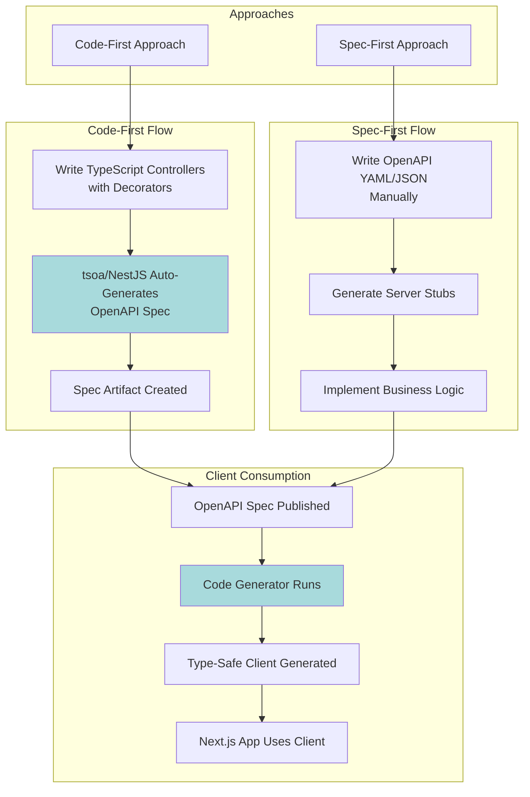
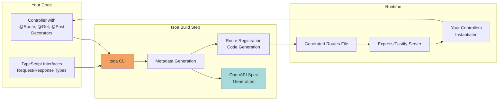
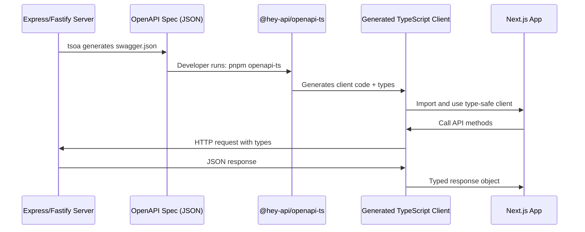
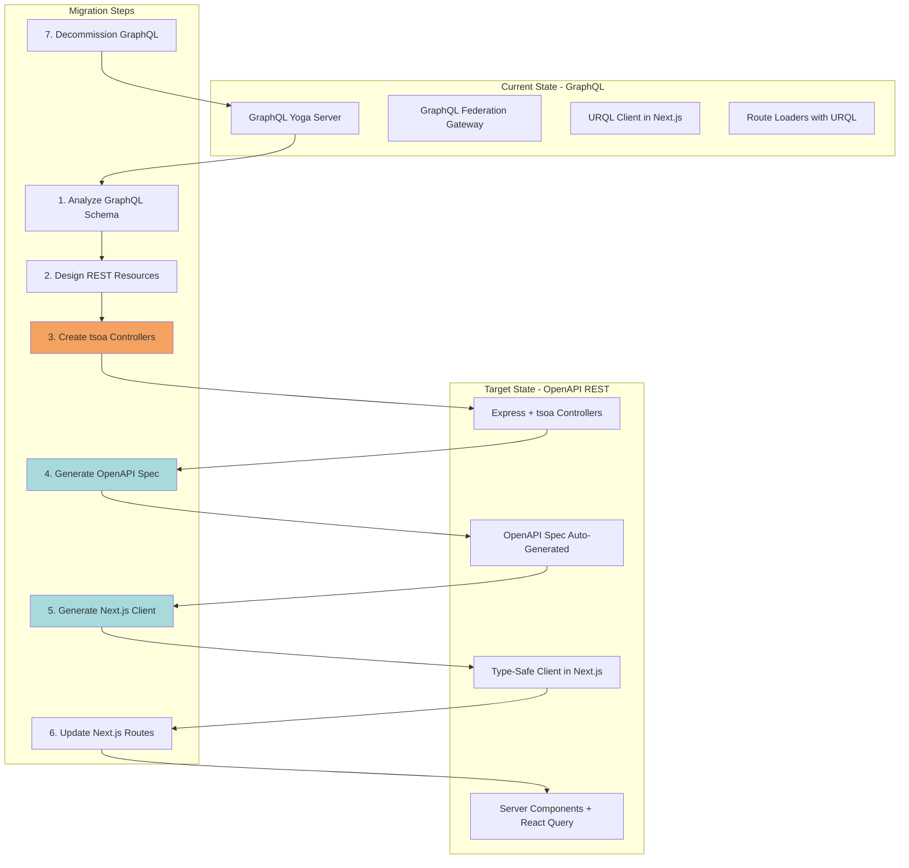
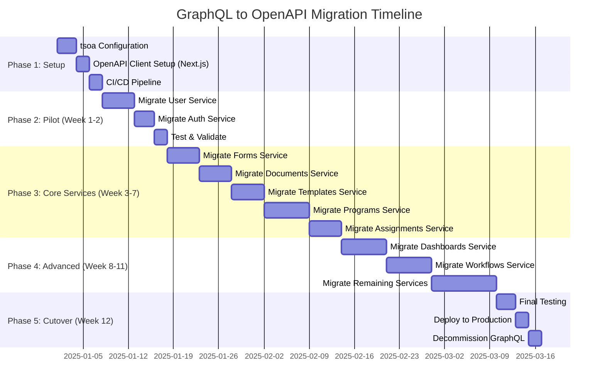
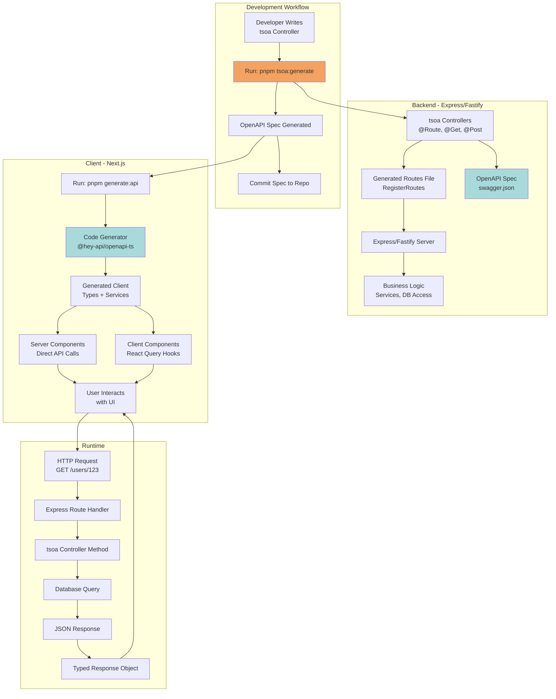

# OpenAPI Architecture & Migration from GraphQL - Deep Research

**Date**: 2025-10-23
**Status**: Research & Planning

## Executive Summary

This document provides a comprehensive guide to implementing OpenAPI REST APIs, specifically focusing on:
1. **OpenAPI fundamentals** - How the specification and ecosystem work
2. **Server-side implementation** - Express vs Fastify comparison with code generation tools
3. **Client-side consumption** - Next.js integration with type-safe clients
4. **Migration strategy** - Converting GraphQL (Yoga) to OpenAPI REST
5. **Effort estimation** - Timeline and complexity analysis

**Key Recommendations**:
- **Server**: Use **tsoa** (TypeScript OpenAPI) for automatic spec generation from TypeScript decorators
- **Backend Framework**: **Express** or **Fastify** both work well; Fastify has better performance but Express has more tsoa maturity
- **Client Generation**: Use **@hey-api/openapi-ts** for Next.js client generation
- **Runtime Validation**: Integrate **Zod** with **zod-to-openapi** for single source of truth
- **Migration Timeline**: 8-12 weeks for complete GraphQL → OpenAPI migration (15+ services)

---

## Part 1: OpenAPI Fundamentals

### What is OpenAPI?

**OpenAPI Specification (OAS)** is a standard, language-agnostic interface description for HTTP APIs. It allows both humans and computers to discover and understand the capabilities of a service without access to source code or documentation.

**Key Concepts**:
- **Specification Document**: JSON or YAML file describing your entire API
- **Schema-First or Code-First**: You can write the spec manually or generate it from code
- **Tooling Ecosystem**: Vast ecosystem for validation, testing, documentation, and code generation

### OpenAPI Specification Structure

An OpenAPI document has the following main sections:

```yaml
openapi: 3.1.0  # OpenAPI version
info:
  title: Platform API
  version: 1.0.0
  description: Enterprise platform REST API

servers:
  - url: https://api.example.com/v1
    description: Production server
  - url: http://localhost:3000/v1
    description: Development server

paths:
  /users/{userId}:
    get:
      operationId: getUserById
      summary: Get user by ID
      parameters:
        - name: userId
          in: path
          required: true
          schema:
            type: string
            format: uuid
      responses:
        '200':
          description: Successful response
          content:
            application/json:
              schema:
                $ref: '#/components/schemas/User'
        '404':
          description: User not found
          content:
            application/json:
              schema:
                $ref: '#/components/schemas/Error'

components:
  schemas:
    User:
      type: object
      required:
        - id
        - email
        - name
      properties:
        id:
          type: string
          format: uuid
        email:
          type: string
          format: email
        name:
          type: string
        role:
          type: string
          enum: [admin, user, guest]

    Error:
      type: object
      required:
        - message
      properties:
        message:
          type: string
        code:
          type: string

  securitySchemes:
    bearerAuth:
      type: http
      scheme: bearer
      bearerFormat: JWT

security:
  - bearerAuth: []
```

### The OpenAPI Workflow



**Code-First (Recommended for Your Use Case)**:
1. Write TypeScript controllers with decorators (tsoa)
2. Decorators provide metadata (routes, parameters, response types)
3. Build step generates OpenAPI spec automatically
4. Spec is published for client consumption

**Spec-First**:
1. Write OpenAPI YAML/JSON manually
2. Use code generation to create server stubs
3. Implement business logic in generated stubs
4. More suitable for API-first organizations

---

## Part 2: Server-Side Implementation (Code-First with tsoa)

### What is tsoa?

**tsoa** (TypeScript OpenAPI) is a framework that generates:
- OpenAPI 3.0 specifications from TypeScript controllers
- Express/Hapi/Koa route handlers
- Runtime request/response validation

**Why tsoa?**:
- ✅ TypeScript-native (uses decorators)
- ✅ Zero schema drift (types ARE the spec)
- ✅ Automatic OpenAPI generation
- ✅ Supports Express and Fastify (via adapters)
- ✅ Built-in validation
- ✅ 3.9K GitHub stars, actively maintained

### tsoa Architecture



### Express vs Fastify for OpenAPI/tsoa

| Criteria | Express | Fastify | Winner |
|----------|---------|---------|--------|
| **tsoa Support** | ✅ First-class, mature | ✅ Via adapter, works well | Express (maturity) |
| **Performance** | Baseline (10K req/s) | 2-3x faster (25K req/s) | Fastify |
| **Ecosystem** | Massive (50K+ packages) | Growing (5K+ packages) | Express |
| **Complexity** | Simple, familiar | Slightly more complex | Express |
| **TypeScript Support** | Good (via @types) | Excellent (built-in) | Fastify |
| **JSON Schema Validation** | Manual (express-validator) | Built-in | Fastify |
| **OpenAPI Plugins** | Many options | Fewer, but high quality | Express |
| **Learning Curve** | Low (most devs know it) | Medium | Express |
| **Async/Await** | Good | Better (designed for it) | Fastify |

**Recommendation**:
- **Express** if your team already uses it and values ecosystem/familiarity
- **Fastify** if you want better performance and modern TypeScript experience
- **Both work equally well with tsoa** - primarily a preference/familiarity decision

For this guide, I'll show **Express** examples (more common), but Fastify patterns are nearly identical.

### Setting Up tsoa with Express

#### 1. Install Dependencies

```bash
pnpm add tsoa express zod
pnpm add -D @types/express @types/node ts-node
```

#### 2. Create tsoa Configuration (`tsoa.json`)

```json
{
  "entryFile": "src/server.ts",
  "noImplicitAdditionalProperties": "throw-on-extras",
  "controllerPathGlobs": ["src/controllers/**/*Controller.ts"],
  "spec": {
    "outputDirectory": "src/generated",
    "specVersion": 3,
    "name": "Platform API",
    "version": "1.0.0",
    "description": "Enterprise platform REST API",
    "securityDefinitions": {
      "bearerAuth": {
        "type": "http",
        "scheme": "bearer",
        "bearerFormat": "JWT"
      }
    }
  },
  "routes": {
    "routesDir": "src/generated",
    "middleware": "express",
    "authenticationModule": "./src/auth/authentication.ts"
  }
}
```

#### 3. Create Your First Controller

```typescript
// src/controllers/UserController.ts
import { Body, Controller, Get, Path, Post, Route, Tags, Security, Query } from 'tsoa';

// Define your types/interfaces
interface User {
  id: string;
  email: string;
  name: string;
  role: 'admin' | 'user' | 'guest';
  createdAt: Date;
}

interface CreateUserRequest {
  email: string;
  name: string;
  role?: 'admin' | 'user' | 'guest';
}

interface PaginationParams {
  limit?: number;
  offset?: number;
}

// Controller with decorators
@Route('users')
@Tags('Users')
export class UserController extends Controller {
  /**
   * Retrieves a list of users with pagination
   * @param limit Maximum number of users to return (default: 10)
   * @param offset Number of users to skip (default: 0)
   */
  @Get()
  public async getUsers(
    @Query() limit: number = 10,
    @Query() offset: number = 0
  ): Promise<User[]> {
    // Your business logic here
    const users = await db.user.findMany({
      take: limit,
      skip: offset,
    });

    return users;
  }

  /**
   * Get a specific user by ID
   * @param userId The user's unique identifier
   */
  @Get('{userId}')
  public async getUserById(@Path() userId: string): Promise<User> {
    const user = await db.user.findUnique({
      where: { id: userId },
    });

    if (!user) {
      this.setStatus(404);
      throw new Error('User not found');
    }

    return user;
  }

  /**
   * Create a new user
   * @param requestBody User creation data
   */
  @Post()
  @Security('bearerAuth')
  public async createUser(@Body() requestBody: CreateUserRequest): Promise<User> {
    // Validation happens automatically based on interface
    const user = await db.user.create({
      data: {
        email: requestBody.email,
        name: requestBody.name,
        role: requestBody.role || 'user',
      },
    });

    this.setStatus(201); // Created
    return user;
  }
}
```

#### 4. Generate OpenAPI Spec and Routes

Add scripts to `package.json`:

```json
{
  "scripts": {
    "tsoa:spec": "tsoa spec",
    "tsoa:routes": "tsoa routes",
    "tsoa:generate": "pnpm tsoa:spec && pnpm tsoa:routes",
    "build": "pnpm tsoa:generate && tsc"
  }
}
```

Run generation:

```bash
pnpm tsoa:generate
```

This creates:
- `src/generated/swagger.json` - OpenAPI specification
- `src/generated/routes.ts` - Express route registration

#### 5. Wire Up Express Server

```typescript
// src/server.ts
import express, { Express, Request, Response } from 'express';
import { RegisterRoutes } from './generated/routes';
import swaggerUi from 'swagger-ui-express';

const app: Express = express();

// Middleware
app.use(express.json());
app.use(express.urlencoded({ extended: true }));

// Register tsoa-generated routes
RegisterRoutes(app);

// Serve OpenAPI spec
app.use('/api-docs', swaggerUi.serve, async (_req: Request, res: Response) => {
  const swaggerDocument = await import('./generated/swagger.json');
  return res.send(swaggerUi.generateHTML(swaggerDocument));
});

// Serve raw OpenAPI JSON
app.get('/openapi.json', async (_req: Request, res: Response) => {
  const spec = await import('./generated/swagger.json');
  res.json(spec);
});

// Error handling
app.use((err: any, req: Request, res: Response, next: any) => {
  console.error(err);
  res.status(err.status || 500).json({
    message: err.message || 'Internal Server Error',
  });
});

const PORT = process.env.PORT || 3001;
app.listen(PORT, () => {
  console.log(`Server running on http://localhost:${PORT}`);
  console.log(`API Docs available at http://localhost:${PORT}/api-docs`);
  console.log(`OpenAPI spec at http://localhost:${PORT}/openapi.json`);
});
```

#### 6. Authentication Integration (Optional)

```typescript
// src/auth/authentication.ts
import { Request } from 'express';

export async function expressAuthentication(
  request: Request,
  securityName: string,
  scopes?: string[]
): Promise<any> {
  if (securityName === 'bearerAuth') {
    const token = request.headers.authorization?.replace('Bearer ', '');

    if (!token) {
      throw new Error('No token provided');
    }

    // Validate token (use your actual auth logic)
    const user = await validateJWT(token);

    if (!user) {
      throw new Error('Invalid token');
    }

    return user;
  }
}
```

### Generated OpenAPI Spec Output

After running `pnpm tsoa:generate`, your `src/generated/swagger.json` will look like:

```json
{
  "openapi": "3.0.0",
  "info": {
    "title": "Platform API",
    "version": "1.0.0"
  },
  "paths": {
    "/users": {
      "get": {
        "operationId": "GetUsers",
        "tags": ["Users"],
        "parameters": [
          {
            "in": "query",
            "name": "limit",
            "required": false,
            "schema": {
              "type": "number",
              "default": 10
            }
          },
          {
            "in": "query",
            "name": "offset",
            "required": false,
            "schema": {
              "type": "number",
              "default": 0
            }
          }
        ],
        "responses": {
          "200": {
            "description": "Ok",
            "content": {
              "application/json": {
                "schema": {
                  "type": "array",
                  "items": {
                    "$ref": "#/components/schemas/User"
                  }
                }
              }
            }
          }
        }
      }
    }
  },
  "components": {
    "schemas": {
      "User": {
        "type": "object",
        "required": ["id", "email", "name", "role", "createdAt"],
        "properties": {
          "id": { "type": "string" },
          "email": { "type": "string" },
          "name": { "type": "string" },
          "role": { "type": "string", "enum": ["admin", "user", "guest"] },
          "createdAt": { "type": "string", "format": "date-time" }
        }
      }
    },
    "securitySchemes": {
      "bearerAuth": {
        "type": "http",
        "scheme": "bearer",
        "bearerFormat": "JWT"
      }
    }
  }
}
```

---

## Part 3: Client-Side Consumption (Next.js)

### The Client Generation Flow



### Setting Up Client Generation in Next.js

#### 1. Install Client Generator

```bash
# In your Next.js project
pnpm add -D @hey-api/openapi-ts
```

#### 2. Configure OpenAPI Generation

Create `openapi-ts.config.ts` in your Next.js project root:

```typescript
// openapi-ts.config.ts
import { defineConfig } from '@hey-api/openapi-ts';

export default defineConfig({
  client: '@hey-api/client-fetch',
  input: 'http://localhost:3001/openapi.json', // Your API spec URL
  output: {
    path: 'src/lib/api',
    format: 'prettier',
    lint: 'biome',
  },
  types: {
    enums: 'javascript',
    dates: 'types+transform',
  },
  services: {
    asClass: true,
  },
});
```

#### 3. Add Generation Script

In your Next.js `package.json`:

```json
{
  "scripts": {
    "dev": "next dev",
    "build": "pnpm generate:api && next build",
    "generate:api": "openapi-ts"
  }
}
```

#### 4. Run Code Generation

```bash
pnpm generate:api
```

This generates:
- `src/lib/api/types.ts` - TypeScript types for all schemas
- `src/lib/api/services/` - Service classes for each tag/controller
- `src/lib/api/client.ts` - Base HTTP client configuration

### Generated Client Code Example

**Generated Types** (`src/lib/api/types.ts`):

```typescript
// Auto-generated - DO NOT EDIT
export interface User {
  id: string;
  email: string;
  name: string;
  role: 'admin' | 'user' | 'guest';
  createdAt: string;
}

export interface CreateUserRequest {
  email: string;
  name: string;
  role?: 'admin' | 'user' | 'guest';
}

export type GetUsersQueryParams = {
  limit?: number;
  offset?: number;
};

export type GetUsersResponse = User[];
export type GetUserByIdResponse = User;
export type CreateUserResponse = User;
```

**Generated Service** (`src/lib/api/services/UsersService.ts`):

```typescript
// Auto-generated - DO NOT EDIT
import { BaseHttpRequest } from '../core/BaseHttpRequest';
import type { User, CreateUserRequest, GetUsersQueryParams } from '../types';

export class UsersService {
  constructor(public readonly httpRequest: BaseHttpRequest) {}

  public getUsers(params?: GetUsersQueryParams): Promise<User[]> {
    return this.httpRequest.request({
      method: 'GET',
      url: '/users',
      query: params,
    });
  }

  public getUserById(userId: string): Promise<User> {
    return this.httpRequest.request({
      method: 'GET',
      url: `/users/${userId}`,
    });
  }

  public createUser(requestBody: CreateUserRequest): Promise<User> {
    return this.httpRequest.request({
      method: 'POST',
      url: '/users',
      body: requestBody,
    });
  }
}
```

### Using the Generated Client in Next.js

#### Configure API Client

```typescript
// src/lib/api/client-config.ts
import { OpenAPI } from './api/client';

// Configure base URL and authentication
OpenAPI.BASE = process.env.NEXT_PUBLIC_API_URL || 'http://localhost:3001';

OpenAPI.TOKEN = async () => {
  // Get token from your auth system (e.g., next-auth)
  const session = await getSession();
  return session?.accessToken;
};

// Optional: Add request interceptor
OpenAPI.interceptors = {
  request: async (request) => {
    console.log('API Request:', request);
    return request;
  },
  response: async (response) => {
    console.log('API Response:', response);
    return response;
  },
};
```

#### Server Component Usage

```typescript
// src/app/users/page.tsx (Server Component)
import { UsersService } from '@/lib/api/services/UsersService';
import { client } from '@/lib/api';

export default async function UsersPage() {
  const usersService = new UsersService(client);

  // Type-safe API call in Server Component
  const users = await usersService.getUsers({ limit: 10, offset: 0 });

  return (
    <div>
      <h1>Users</h1>
      <ul>
        {users.map((user) => (
          <li key={user.id}>
            {user.name} ({user.email}) - {user.role}
          </li>
        ))}
      </ul>
    </div>
  );
}
```

#### Client Component Usage

```typescript
// src/app/users/UserList.tsx (Client Component)
'use client';

import { useState, useEffect } from 'react';
import { UsersService } from '@/lib/api/services/UsersService';
import { client } from '@/lib/api';
import type { User } from '@/lib/api/types';

export function UserList() {
  const [users, setUsers] = useState<User[]>([]);
  const [loading, setLoading] = useState(true);

  useEffect(() => {
    const usersService = new UsersService(client);

    usersService.getUsers({ limit: 10 })
      .then(setUsers)
      .catch(console.error)
      .finally(() => setLoading(false));
  }, []);

  if (loading) return <div>Loading...</div>;

  return (
    <ul>
      {users.map((user) => (
        <li key={user.id}>{user.name}</li>
      ))}
    </ul>
  );
}
```

#### Form with Mutation

```typescript
// src/app/users/CreateUserForm.tsx
'use client';

import { useState } from 'react';
import { UsersService } from '@/lib/api/services/UsersService';
import { client } from '@/lib/api';
import type { CreateUserRequest } from '@/lib/api/types';

export function CreateUserForm() {
  const [formData, setFormData] = useState<CreateUserRequest>({
    email: '',
    name: '',
    role: 'user',
  });

  const handleSubmit = async (e: React.FormEvent) => {
    e.preventDefault();

    const usersService = new UsersService(client);

    try {
      const newUser = await usersService.createUser(formData);
      console.log('Created user:', newUser);
      // Handle success (e.g., redirect, show toast)
    } catch (error) {
      console.error('Failed to create user:', error);
      // Handle error
    }
  };

  return (
    <form onSubmit={handleSubmit}>
      <input
        type="email"
        value={formData.email}
        onChange={(e) => setFormData({ ...formData, email: e.target.value })}
        placeholder="Email"
        required
      />
      <input
        type="text"
        value={formData.name}
        onChange={(e) => setFormData({ ...formData, name: e.target.value })}
        placeholder="Name"
        required
      />
      <select
        value={formData.role}
        onChange={(e) => setFormData({ ...formData, role: e.target.value as any })}
      >
        <option value="user">User</option>
        <option value="admin">Admin</option>
        <option value="guest">Guest</option>
      </select>
      <button type="submit">Create User</button>
    </form>
  );
}
```

### React Query Integration (Recommended)

For better caching and state management, integrate with React Query:

```bash
pnpm add @tanstack/react-query
```

```typescript
// src/lib/api/hooks/useUsers.ts
import { useQuery, useMutation, useQueryClient } from '@tanstack/react-query';
import { UsersService } from '../services/UsersService';
import { client } from '../client';
import type { CreateUserRequest } from '../types';

const usersService = new UsersService(client);

export function useUsers(params?: { limit?: number; offset?: number }) {
  return useQuery({
    queryKey: ['users', params],
    queryFn: () => usersService.getUsers(params),
  });
}

export function useUser(userId: string) {
  return useQuery({
    queryKey: ['users', userId],
    queryFn: () => usersService.getUserById(userId),
  });
}

export function useCreateUser() {
  const queryClient = useQueryClient();

  return useMutation({
    mutationFn: (data: CreateUserRequest) => usersService.createUser(data),
    onSuccess: () => {
      // Invalidate users list to refetch
      queryClient.invalidateQueries({ queryKey: ['users'] });
    },
  });
}
```

Usage with React Query:

```typescript
'use client';

import { useUsers, useCreateUser } from '@/lib/api/hooks/useUsers';

export function UserListWithQuery() {
  const { data: users, isLoading, error } = useUsers({ limit: 10 });
  const createUser = useCreateUser();

  if (isLoading) return <div>Loading...</div>;
  if (error) return <div>Error: {error.message}</div>;

  return (
    <div>
      <ul>
        {users?.map((user) => (
          <li key={user.id}>{user.name}</li>
        ))}
      </ul>

      <button
        onClick={() => {
          createUser.mutate({
            email: 'test@example.com',
            name: 'Test User',
          });
        }}
      >
        Add User
      </button>
    </div>
  );
}
```

---

## Part 4: Runtime Validation with Zod

One limitation of pure TypeScript: **types are compile-time only**. Runtime validation is crucial for API security.

### Integrating Zod with tsoa

#### 1. Install Zod + OpenAPI Integration

```bash
pnpm add zod @asteasolutions/zod-to-openapi
```

#### 2. Define Zod Schemas

```typescript
// src/schemas/user.schema.ts
import { z } from 'zod';
import { extendZodWithOpenApi } from '@asteasolutions/zod-to-openapi';

extendZodWithOpenApi(z);

export const CreateUserSchema = z.object({
  email: z.string().email().openapi({ example: 'user@example.com' }),
  name: z.string().min(1).max(100).openapi({ example: 'John Doe' }),
  role: z.enum(['admin', 'user', 'guest']).optional().openapi({ example: 'user' }),
});

export const UserSchema = z.object({
  id: z.string().uuid(),
  email: z.string().email(),
  name: z.string(),
  role: z.enum(['admin', 'user', 'guest']),
  createdAt: z.date(),
});

export type CreateUserRequest = z.infer<typeof CreateUserSchema>;
export type User = z.infer<typeof UserSchema>;
```

#### 3. Use Zod in tsoa Controller

```typescript
// src/controllers/UserController.ts
import { Body, Controller, Post, Route } from 'tsoa';
import { CreateUserSchema, CreateUserRequest, User } from '../schemas/user.schema';

@Route('users')
export class UserController extends Controller {
  @Post()
  public async createUser(@Body() requestBody: CreateUserRequest): Promise<User> {
    // Validate with Zod (runtime validation)
    const validatedData = CreateUserSchema.parse(requestBody);

    // If validation fails, Zod throws error with detailed messages
    // If it succeeds, validatedData is typed and validated

    const user = await db.user.create({
      data: validatedData,
    });

    return user;
  }
}
```

#### 4. Custom Validation Middleware

For automatic validation without manual `.parse()` calls:

```typescript
// src/middleware/validation.ts
import { Request, Response, NextFunction } from 'express';
import { AnyZodObject, ZodError } from 'zod';

export const validate = (schema: AnyZodObject) => {
  return async (req: Request, res: Response, next: NextFunction) => {
    try {
      await schema.parseAsync({
        body: req.body,
        query: req.query,
        params: req.params,
      });
      next();
    } catch (error) {
      if (error instanceof ZodError) {
        return res.status(400).json({
          message: 'Validation failed',
          errors: error.errors.map((err) => ({
            path: err.path.join('.'),
            message: err.message,
          })),
        });
      }
      next(error);
    }
  };
};
```

---

## Part 5: GraphQL (Yoga) to OpenAPI Migration

### Understanding Your Current GraphQL Setup

Based on the migration spec, you have:
- **GraphQL Yoga** server
- **URQL** client in Next.js
- **Federation** across multiple microservices
- **15+ internal services**

### Migration Architecture



### Step-by-Step Migration Process

#### Step 1: Analyze GraphQL Schema

Map GraphQL types to REST resources:

```graphql
# GraphQL Schema (BEFORE)
type User {
  id: ID!
  email: String!
  name: String!
  role: Role!
  posts: [Post!]!
}

type Post {
  id: ID!
  title: String!
  content: String!
  author: User!
  comments: [Comment!]!
}

enum Role {
  ADMIN
  USER
  GUEST
}

type Query {
  user(id: ID!): User
  users(limit: Int, offset: Int): [User!]!
  post(id: ID!): Post
  posts(authorId: ID, limit: Int): [Post!]!
}

type Mutation {
  createUser(input: CreateUserInput!): User!
  updateUser(id: ID!, input: UpdateUserInput!): User!
  deleteUser(id: ID!): Boolean!
}

input CreateUserInput {
  email: String!
  name: String!
  role: Role
}
```

**Mapping to REST**:

| GraphQL | REST Endpoint | HTTP Method | Notes |
|---------|---------------|-------------|-------|
| `user(id: ID!)` | `GET /users/{id}` | GET | Direct mapping |
| `users(limit, offset)` | `GET /users?limit={}&offset={}` | GET | Query params |
| `createUser(input)` | `POST /users` | POST | Body = input |
| `updateUser(id, input)` | `PUT /users/{id}` or `PATCH /users/{id}` | PUT/PATCH | Path + body |
| `deleteUser(id)` | `DELETE /users/{id}` | DELETE | Path param |
| `user.posts` | `GET /users/{id}/posts` | GET | Nested resource |
| `post(id)` | `GET /posts/{id}` | GET | Separate resource |
| `posts(authorId)` | `GET /posts?authorId={}` | GET | Filter by query |

#### Step 2: Create REST Controllers from GraphQL Resolvers

**GraphQL Resolver (BEFORE)**:

```typescript
// GraphQL resolver
const resolvers = {
  Query: {
    user: async (_, { id }, context) => {
      return await context.db.user.findUnique({ where: { id } });
    },
    users: async (_, { limit, offset }, context) => {
      return await context.db.user.findMany({
        take: limit,
        skip: offset,
      });
    },
  },
  Mutation: {
    createUser: async (_, { input }, context) => {
      return await context.db.user.create({
        data: input,
      });
    },
  },
  User: {
    posts: async (parent, _, context) => {
      return await context.db.post.findMany({
        where: { authorId: parent.id },
      });
    },
  },
};
```

**tsoa Controller (AFTER)**:

```typescript
// src/controllers/UserController.ts
import { Controller, Get, Post, Put, Delete, Route, Path, Body, Query, Tags } from 'tsoa';

interface User {
  id: string;
  email: string;
  name: string;
  role: 'ADMIN' | 'USER' | 'GUEST';
}

interface CreateUserInput {
  email: string;
  name: string;
  role?: 'ADMIN' | 'USER' | 'GUEST';
}

@Route('users')
@Tags('Users')
export class UserController extends Controller {
  // Query: user(id)
  @Get('{id}')
  public async getUser(@Path() id: string): Promise<User> {
    const user = await db.user.findUnique({ where: { id } });

    if (!user) {
      this.setStatus(404);
      throw new Error('User not found');
    }

    return user;
  }

  // Query: users(limit, offset)
  @Get()
  public async getUsers(
    @Query() limit: number = 10,
    @Query() offset: number = 0
  ): Promise<User[]> {
    return await db.user.findMany({
      take: limit,
      skip: offset,
    });
  }

  // Mutation: createUser(input)
  @Post()
  public async createUser(@Body() input: CreateUserInput): Promise<User> {
    const user = await db.user.create({
      data: {
        email: input.email,
        name: input.name,
        role: input.role || 'USER',
      },
    });

    this.setStatus(201);
    return user;
  }

  // Mutation: updateUser(id, input)
  @Put('{id}')
  public async updateUser(
    @Path() id: string,
    @Body() input: Partial<CreateUserInput>
  ): Promise<User> {
    return await db.user.update({
      where: { id },
      data: input,
    });
  }

  // Mutation: deleteUser(id)
  @Delete('{id}')
  public async deleteUser(@Path() id: string): Promise<{ success: boolean }> {
    await db.user.delete({ where: { id } });
    return { success: true };
  }

  // Nested field: user.posts
  @Get('{id}/posts')
  public async getUserPosts(@Path() id: string): Promise<Post[]> {
    return await db.post.findMany({
      where: { authorId: id },
    });
  }
}
```

#### Step 3: Handling Nested GraphQL Queries

**GraphQL Nested Query (BEFORE)**:

```graphql
query {
  user(id: "123") {
    id
    name
    posts {
      id
      title
      comments {
        id
        text
      }
    }
  }
}
```

**REST Approach (Multiple Options)**:

**Option A: Separate Requests** (Most RESTful)
```typescript
// Client makes multiple requests
const user = await usersService.getUser('123');
const posts = await usersService.getUserPosts('123');

// For each post, get comments
const postsWithComments = await Promise.all(
  posts.map(async (post) => ({
    ...post,
    comments: await postsService.getPostComments(post.id),
  }))
);
```

**Option B: Query Parameter for Includes** (Pragmatic)
```typescript
// Add query param to include nested resources
@Get('{id}')
public async getUser(
  @Path() id: string,
  @Query() include?: string[] // ['posts', 'posts.comments']
): Promise<User> {
  const includeConfig = parseIncludeParams(include);

  return await db.user.findUnique({
    where: { id },
    include: {
      posts: includeConfig.posts ? {
        include: {
          comments: includeConfig.posts.comments,
        },
      } : false,
    },
  });
}

// Client usage
const user = await usersService.getUser('123', { include: ['posts', 'posts.comments'] });
```

**Option C: Dedicated Endpoints for Common Queries**
```typescript
// Specific endpoint for user with posts
@Get('{id}/full')
public async getUserWithPosts(@Path() id: string): Promise<UserWithPosts> {
  return await db.user.findUnique({
    where: { id },
    include: {
      posts: {
        include: {
          comments: true,
        },
      },
    },
  });
}
```

**Recommendation**: Start with **Option A** (separate requests), add **Option B** (include params) for performance-critical queries.

#### Step 4: Migrate Next.js Data Fetching

**GraphQL URQL (BEFORE)**:

```typescript
// Route loader with URQL
import { client } from '@/utils/client';
import { UserByIdDocument } from '@/generated/graphql';

export async function loader({ params }) {
  const result = await client.query(
    UserByIdDocument,
    { userId: params.userId },
    { url: '/graphql' }
  );

  return result.data?.user;
}

// Component with URQL hook
import { useQuery } from 'urql';

export function UserProfile({ userId }: { userId: string }) {
  const [result] = useQuery({
    query: UserByIdDocument,
    variables: { userId },
  });

  if (result.fetching) return <div>Loading...</div>;
  if (result.error) return <div>Error: {result.error.message}</div>;

  return <div>{result.data.user.name}</div>;
}
```

**OpenAPI Client (AFTER)**:

```typescript
// Server Component (no loader needed)
import { UsersService } from '@/lib/api/services/UsersService';
import { client } from '@/lib/api';

export default async function UserPage({ params }: { params: { userId: string } }) {
  const usersService = new UsersService(client);
  const user = await usersService.getUser(params.userId);

  return <div>{user.name}</div>;
}

// Client Component with React Query
'use client';

import { useUser } from '@/lib/api/hooks/useUsers';

export function UserProfile({ userId }: { userId: string }) {
  const { data: user, isLoading, error } = useUser(userId);

  if (isLoading) return <div>Loading...</div>;
  if (error) return <div>Error: {error.message}</div>;

  return <div>{user.name}</div>;
}
```

**Key Differences**:
- ❌ No URQL `client.query()` or code generation
- ✅ Generated REST client from OpenAPI spec
- ❌ No GraphQL document definitions
- ✅ TypeScript interfaces from OpenAPI
- ❌ No `useQuery` from urql
- ✅ `useQuery` from React Query (same API, different package)

---

## Part 6: Migration Timeline & Effort Estimation

### Service-by-Service Migration

Assuming **15 services** with varying complexity:

| Service Type | Count | Resolver Count | Est. Time Each | Total Time |
|--------------|-------|----------------|----------------|------------|
| **Small** (User, Auth) | 5 | 5-10 | 3 days | 3 weeks |
| **Medium** (Forms, Documents) | 7 | 10-20 | 5 days | 5 weeks |
| **Large** (Programs, Dashboards) | 3 | 20-30 | 7 days | 3 weeks |

**Sequential Migration**: 11 weeks (3 + 5 + 3)
**Parallel Migration** (2 teams): 6-7 weeks
**Conservative Estimate**: 12-16 weeks (with testing, buffer)

### Migration Phases



### Detailed Migration Checklist

**Per Service**:
- [ ] **Week 1**: Backend Migration
  - [ ] Day 1: Analyze GraphQL schema, map to REST resources
  - [ ] Day 2: Create tsoa controllers with decorators
  - [ ] Day 3: Implement query endpoints (GET)
  - [ ] Day 4: Implement mutation endpoints (POST/PUT/DELETE)
  - [ ] Day 5: Add Zod validation, write tests

- [ ] **Week 2**: Frontend Migration
  - [ ] Day 1: Generate OpenAPI client, review types
  - [ ] Day 2: Update Server Components (replace URQL loaders)
  - [ ] Day 3: Update Client Components (replace URQL hooks)
  - [ ] Day 4: Integration testing, fix issues
  - [ ] Day 5: Deploy to staging, validate

**Overall Project**:
- [ ] **Phase 1**: Infrastructure Setup (Week 1)
  - [ ] Install tsoa, configure tsoa.json
  - [ ] Set up Express/Fastify server with tsoa routes
  - [ ] Configure OpenAPI spec generation
  - [ ] Set up Swagger UI for API docs
  - [ ] Configure Next.js OpenAPI client generation
  - [ ] Set up CI/CD pipeline for spec generation

- [ ] **Phase 2**: Pilot Migration (Week 2-3)
  - [ ] Choose 2 small services for pilot
  - [ ] Migrate backend (controllers, validation)
  - [ ] Generate OpenAPI spec
  - [ ] Migrate Next.js frontend
  - [ ] Document learnings and refine process

- [ ] **Phase 3**: Incremental Service Migration (Week 4-11)
  - [ ] Migrate services one-by-one or in parallel (if multiple teams)
  - [ ] Run GraphQL and REST side-by-side (no downtime)
  - [ ] Feature flag routes to use REST vs GraphQL
  - [ ] Monitor performance and errors

- [ ] **Phase 4**: Cutover & Cleanup (Week 12-13)
  - [ ] All services migrated to REST
  - [ ] All Next.js routes using OpenAPI client
  - [ ] Comprehensive testing (unit, integration, E2E)
  - [ ] Production deployment
  - [ ] Decommission GraphQL server
  - [ ] Remove URQL dependencies from Next.js

### Risk Mitigation

1. **Risk**: Schema drift between GraphQL and REST during migration
   - **Mitigation**: Run both in parallel, feature flag per route
   - **Validation**: Integration tests for both APIs

2. **Risk**: Generated code conflicts (GraphQL codegen vs OpenAPI codegen)
   - **Mitigation**: Different output directories (`generated/graphql` vs `lib/api`)
   - **Cleanup**: Remove GraphQL codegen only after full migration

3. **Risk**: Performance degradation (N+1 queries with REST)
   - **Mitigation**: Use `include` query params for nested resources
   - **Monitoring**: Compare GraphQL vs REST query counts

4. **Risk**: Breaking changes not caught until runtime
   - **Mitigation**: TypeScript strict mode, comprehensive tests
   - **Process**: Schema validation in CI/CD

---

## Part 7: Complete Architecture Diagram



### Full Stack Flow Explanation

**Step 1: Backend Development**
1. Developer writes TypeScript controller with `@Route`, `@Get`, `@Post` decorators
2. Run `pnpm tsoa:generate` to generate:
   - OpenAPI spec (`swagger.json`)
   - Route registration code
3. Express/Fastify server uses generated routes
4. Publish OpenAPI spec at `/openapi.json`

**Step 2: Frontend Development**
1. Next.js project fetches OpenAPI spec from backend
2. Run `pnpm generate:api` (triggers `@hey-api/openapi-ts`)
3. Code generator creates:
   - TypeScript types for all schemas
   - Service classes for API calls
   - HTTP client configuration
4. Developer uses generated client in Server/Client Components

**Step 3: Runtime**
1. User interacts with UI (Next.js app)
2. Client Component makes API call using generated service
3. HTTP request sent to Express/Fastify
4. tsoa routes request to correct controller method
5. Controller executes business logic, queries database
6. JSON response returned
7. Client receives typed response object
8. UI updates with data

---

## Part 8: Comparison Summary

### OpenAPI vs GraphQL vs tRPC

| Criteria | GraphQL (Current) | OpenAPI REST (Proposed) | tRPC (Alternative) |
|----------|-------------------|------------------------|--------------------|
| **Type Safety** | ✅ Codegen required | ✅ Codegen required | ✅ Direct inference |
| **Developer Velocity** | ⚠️ Slow (3 codegen layers) | ⚠️ Medium (2 codegen steps) | ✅ Fast (no codegen) |
| **Bundle Size** | ⚠️ 30-50KB (URQL + generated) | ⚠️ 6-32KB (client + generated) | ✅ 1KB (tRPC client) |
| **Multi-Language Clients** | ✅ Yes (any language) | ✅ Yes (any language) | ❌ TypeScript only |
| **External API Support** | ✅ Yes | ✅ Yes | ❌ Not suitable |
| **Learning Curve** | ⚠️ High (GraphQL concepts) | ✅ Low (standard REST) | ⚠️ Medium (new patterns) |
| **Over-fetching** | ✅ Solved (field selection) | ⚠️ Fixed endpoints | ✅ Solved (selective fetching) |
| **Under-fetching** | ✅ Solved (nested queries) | ⚠️ Multiple requests | ⚠️ Multiple requests |
| **API Documentation** | ✅ GraphiQL introspection | ✅ Swagger UI (OpenAPI) | ⚠️ Limited (type exports) |
| **Migration from GraphQL** | - | ✅ Straightforward | ✅ Very similar patterns |
| **Caching** | ⚠️ Complex (normalized cache) | ✅ HTTP caching + React Query | ✅ React Query built-in |
| **Real-time (Subscriptions)** | ✅ Native (WebSocket) | ⚠️ Manual setup (SSE/WS) | ✅ Supported (WebSocket) |
| **Versioning** | ⚠️ Schema evolution | ✅ URL versioning (/v1, /v2) | ⚠️ Less conventional |
| **Tooling Maturity** | ✅ Excellent | ✅ Excellent | ✅ Growing rapidly |

**Verdict for Your Requirements**:
- **Multi-language clients** (Swift, Java, Python): OpenAPI ✅ wins, tRPC ❌ impossible
- **External API access**: OpenAPI ✅ required, tRPC ❌ not suitable
- **Best DX for TypeScript** (Next.js): tRPC ✅ best, OpenAPI ⚠️ good, GraphQL ❌ slow
- **Migration complexity**: tRPC ≈ OpenAPI (both similar to GraphQL patterns)

**Recommendation**: Based on your updated requirements (from research doc):
- **Hybrid architecture** is optimal (tRPC for TypeScript clients + trpc-openapi for REST compatibility)
- **Pure OpenAPI** is second-best if team prefers single API paradigm
- Both are significant improvements over GraphQL for your use case

---

## Part 9: Libraries & Tools Reference

### Backend (Express/Fastify)

#### Core Dependencies
```json
{
  "tsoa": "^6.4.0",
  "express": "^4.19.0",
  "zod": "^4.1.12",
  "@asteasolutions/zod-to-openapi": "^7.4.0",
  "swagger-ui-express": "^5.0.1"
}
```

#### Dev Dependencies
```json
{
  "@types/express": "^4.17.21",
  "@types/swagger-ui-express": "^4.1.6",
  "ts-node": "^10.9.2",
  "typescript": "^5.6.0"
}
```

#### Alternative: Fastify
```json
{
  "fastify": "^5.2.0",
  "@fastify/swagger": "^9.3.0",
  "@fastify/swagger-ui": "^5.3.0",
  "fastify-tsoa": "^2.0.0"
}
```

### Frontend (Next.js)

#### Core Dependencies
```json
{
  "@hey-api/openapi-ts": "^0.55.0",
  "@hey-api/client-fetch": "^0.6.0",
  "@tanstack/react-query": "^5.62.2"
}
```

#### Dev Dependencies
```json
{
  "typescript": "^5.6.0"
}
```

### Optional Enhancements

#### Authentication
```json
{
  "jsonwebtoken": "^9.0.2",
  "bcryptjs": "^2.4.3",
  "@types/jsonwebtoken": "^9.0.7",
  "@types/bcryptjs": "^2.4.6"
}
```

#### Validation
```json
{
  "zod": "^4.1.12",
  "@asteasolutions/zod-to-openapi": "^7.4.0"
}
```

#### Testing
```json
{
  "vitest": "^2.1.8",
  "msw": "^2.6.8",
  "supertest": "^7.0.0",
  "@types/supertest": "^6.0.2"
}
```

---

## Part 10: Next Steps & Action Items

### Immediate Actions (This Week)

1. **Decision Point**: Confirm OpenAPI REST direction vs Hybrid (tRPC + trpc-openapi)
   - Re-read the hybrid recommendation in research doc `02-rest-vs-trpc-deep-comparison.md`
   - Decide based on multi-language client requirements

2. **Proof of Concept** (3 days):
   - [ ] Create new Express + tsoa project
   - [ ] Implement single controller (User service)
   - [ ] Generate OpenAPI spec
   - [ ] Set up Next.js client generation
   - [ ] Test end-to-end flow
   - [ ] Validate generated types and API calls

3. **Team Alignment** (1 day):
   - [ ] Present POC to team
   - [ ] Review migration timeline
   - [ ] Assign team members to services
   - [ ] Establish code review process

### Short-term (Next 2 Weeks)

4. **Infrastructure Setup**:
   - [ ] CI/CD pipeline for OpenAPI spec generation
   - [ ] Automated testing for spec validation
   - [ ] Swagger UI deployment for API docs
   - [ ] Environment configuration (dev/staging/prod)

5. **Pilot Migration**:
   - [ ] Choose 2 small services for pilot
   - [ ] Migrate backend (tsoa controllers)
   - [ ] Migrate frontend (Next.js client)
   - [ ] Run A/B test (GraphQL vs REST performance)
   - [ ] Document learnings and blockers

### Medium-term (Next 3 Months)

6. **Incremental Migration**:
   - [ ] Migrate 1-2 services per week
   - [ ] Run GraphQL and REST in parallel
   - [ ] Feature flag routes (gradual cutover)
   - [ ] Monitor performance and errors

7. **Quality Assurance**:
   - [ ] Integration tests for all endpoints
   - [ ] E2E tests with Playwright
   - [ ] Load testing (compare GraphQL vs REST)
   - [ ] Security audit (input validation, auth)

### Long-term (4-6 Months)

8. **Complete Migration**:
   - [ ] All services migrated to REST
   - [ ] Comprehensive testing
   - [ ] Production deployment
   - [ ] Decommission GraphQL server

9. **Optimization**:
   - [ ] API versioning strategy (/v1, /v2)
   - [ ] Caching strategy (HTTP caching + React Query)
   - [ ] Performance monitoring (New Relic, Datadog)
   - [ ] API analytics (rate limiting, usage tracking)

---

## Conclusion

**OpenAPI REST with tsoa** provides a solid, well-supported path forward from GraphQL:

✅ **Advantages**:
- Industry-standard specification (universal compatibility)
- Automatic spec generation from TypeScript (zero drift)
- Rich tooling ecosystem (Swagger UI, code generators)
- Straightforward migration from GraphQL (resolver → controller)
- Better performance than GraphQL for simple queries
- Lower learning curve than GraphQL

⚠️ **Trade-offs**:
- Client-side code generation required (vs tRPC's zero codegen)
- Multiple requests for nested data (vs GraphQL's single query)
- Larger bundle size than tRPC (6-32KB vs 1KB)

❌ **Not Suitable For**:
- If you ONLY have TypeScript clients (tRPC would be better)
- If you need complex nested queries frequently (GraphQL's strength)
- If you want zero build pipeline (tRPC has none)

**Final Recommendation**:
Based on your requirements (multi-language clients, external API access), **OpenAPI REST with tsoa is a solid choice**. However, **strongly consider the Hybrid approach** (tRPC + trpc-openapi) from research doc `02-rest-vs-trpc-deep-comparison.md` which gives you:
- tRPC's superior DX for Next.js (1KB, instant types)
- OpenAPI REST compatibility for Swift/Java/Python clients
- Single source of truth (write once, expose twice)

Both approaches are vastly superior to continuing with GraphQL for your internal platform use case.

---

## Sources

1. **tsoa Documentation** - https://tsoa-community.github.io/docs/ - 2025
2. **OpenAPI Specification** - https://spec.openapis.org/oas/v3.1.0.html - Official Spec
3. **@hey-api/openapi-ts** - https://heyapi.dev/ - 2025
4. **Swagger UI** - https://swagger.io/tools/swagger-ui/ - 2025
5. **Express.js Documentation** - https://expressjs.com/ - 2025
6. **Fastify Documentation** - https://fastify.dev/ - 2025
7. **Zod to OpenAPI** - https://github.com/asteasolutions/zod-to-openapi - 2025
8. **Next.js Server Components** - https://nextjs.org/docs/app/building-your-application/rendering/server-components - 2025
9. **React Query (TanStack Query)** - https://tanstack.com/query/latest - 2025
10. **GraphQL to REST Migration Strategies** - Industry best practices - 2024
