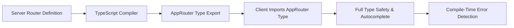
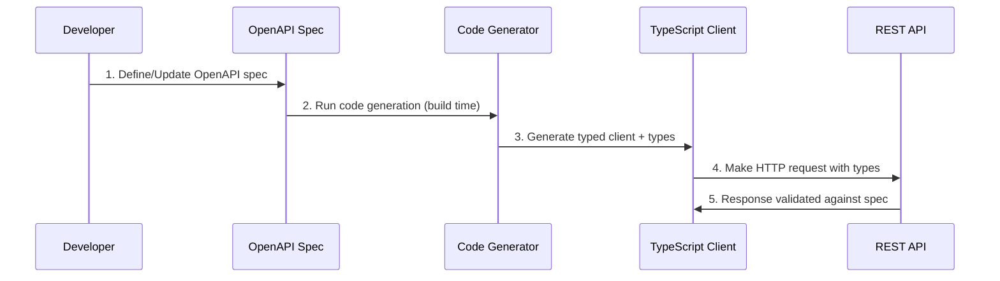
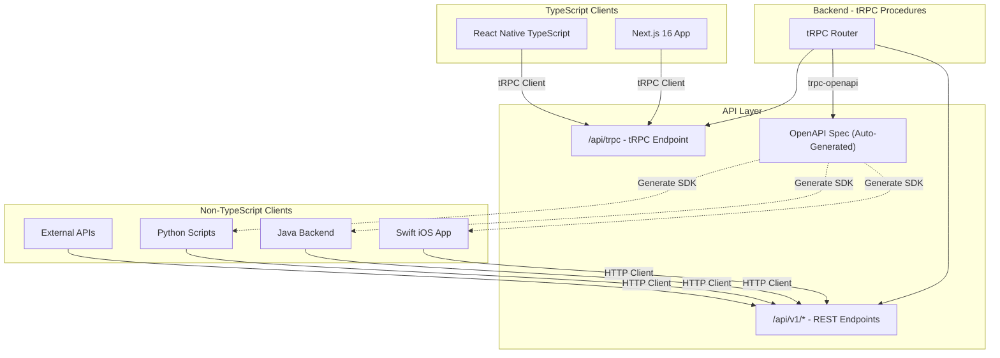
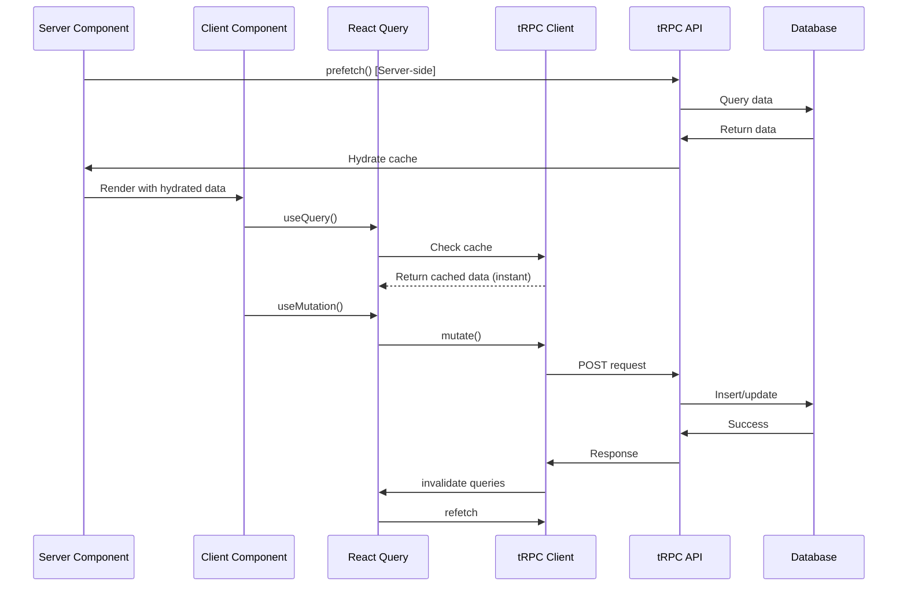

# REST + OpenAPI vs tRPC for Next.js 16 + RSC - Research

**Date**: 2025-10-23
**Status**: Updated with Multi-Language Client Requirements

## Executive Summary

**CRITICAL UPDATE**: Based on newly disclosed requirements for multi-language clients (React Native, Swift, Java, Python) and external API access, the recommendation has **changed from tRPC-only to a Hybrid Architecture**.

**Key Recommendation**: **Hybrid Architecture - tRPC for Internal + REST + OpenAPI for External**

**Why Hybrid Wins for Your Updated Requirements**:
1. **Multi-language client support**: REST + OpenAPI serves Swift, Java, Python, and external clients
2. **Best DX for TypeScript**: tRPC provides superior developer experience for Next.js and internal TypeScript apps
3. **Simpler GraphQL migration**: tRPC procedures match GraphQL resolver patterns
4. **Future-proof**: Can expose any tRPC procedure as REST endpoint using `trpc-openapi` package
5. **Optimal for each use case**: Type-safe TypeScript internally, universal REST externally
6. **Single source of truth**: tRPC procedures generate OpenAPI specs automatically

**Updated Context**:
- **Internal clients**: Next.js 16 web app (TypeScript) ✓
- **Mobile clients**: React Native (potentially TypeScript), Swift iOS app ✗
- **Backend services**: Java apps, Python apps ✗
- **External integrations**: Third-party API access required ✗
- **Enterprise platform**: 15+ internal packages, microservices ✓

**Previous Recommendation** (tRPC-only): ~~Valid only for TypeScript-only ecosystem~~
**Updated Recommendation** (Hybrid): **tRPC + trpc-openapi for REST compatibility**

---

## Technical Deep Dive

### tRPC Architecture

#### Overview

tRPC (TypeScript Remote Procedure Call) is a framework for building end-to-end type-safe APIs that eliminates schema definitions, API documentation, and code generation by leveraging TypeScript's inference capabilities.

#### How Type Inference Works

**Core Mechanism**:
- Client directly imports server-side type definitions
- TypeScript's inference engine propagates types across the stack
- Zero runtime bloat - types are compile-time only
- Changes on server automatically reflect on client at build time

**Type Propagation Flow**:



**Integration with Zod**:
- Zod schemas provide runtime validation
- TypeScript types inferred from Zod schemas
- Single source of truth for validation and types
- Example:

```typescript
// Server: Define schema and infer types
const createUserSchema = z.object({
  name: z.string(),
  email: z.string().email(),
});

export const userRouter = router({
  create: publicProcedure
    .input(createUserSchema)
    .mutation(async ({ input }) => {
      // input is typed as { name: string; email: string }
      return await db.user.create(input);
    }),
});

// Client: Full autocomplete and type checking
const result = await trpc.user.create.mutate({
  name: "John",
  email: "john@example.com", // TypeScript validates email format
});
```

#### Key Benefits

- **Zero code generation**: No build pipeline complexity
- **Real-time type safety**: IDE catches errors immediately as you type
- **No schema drift**: Server types ARE the schema
- **Cross-boundary refactoring**: VS Code "Rename Symbol" works across client/server

#### Limitations

- **TypeScript-only**: Cannot be used with non-TypeScript clients
- **Monorepo-optimized**: Works best when client and server share codebase
- **Type inference bounds**: Generic routers with runtime type parameters not fully supported
- **No public API**: Not suitable for external/third-party API consumers

### REST + OpenAPI Architecture

#### Overview

REST with OpenAPI involves:
1. Define OpenAPI specification (manual or auto-generated)
2. Generate TypeScript types and client code
3. Use generated client in application

#### Code Generation Tools Comparison

| Tool | Stars | Downloads/Month | Features | Best For |
|------|-------|-----------------|----------|----------|
| **@hey-api/openapi-ts** | ~10K | 3M+ | Plugin architecture, multiple runtimes, validators | Modern projects, customization |
| **openapi-typescript** | ~5K | 1.5M+ | Type-only generation, minimal | Lightweight type safety |
| **swagger-typescript-api** | ~3K | 500K | Request/response validation, custom methods | Larger projects |

**Recommended**: `@hey-api/openapi-ts` - Most active development, plugin ecosystem, 3M+ monthly usage

#### Auto-Generation from TypeScript (Server-Side)

**tsoa** (Recommended for Express):
- Decorators on controllers generate OpenAPI specs
- 3.9K GitHub stars
- Supports Express, Koa, Hapi
- Example:

```typescript
@Route("users")
export class UserController extends Controller {
  @Post()
  public async createUser(
    @Body() requestBody: CreateUserRequest
  ): Promise<User> {
    // Implementation
  }
}
```

Generates:
- OpenAPI 3.0 specification
- Route handlers
- Request validation

**NestJS + @nestjs/swagger**:
- Decorators generate OpenAPI from NestJS controllers
- Popular in enterprise environments
- Tight integration with NestJS ecosystem

#### Runtime Validation

**Recommended**: Zod + OpenAPI integration

Tools:
- `zod-to-openapi`: Generate OpenAPI from Zod schemas
- `openapi-zod-client`: Generate Zod-validated client from OpenAPI
- Benefit: Single source of truth, runtime + compile-time safety

```typescript
// Define Zod schema
const UserSchema = z.object({
  name: z.string(),
  email: z.string().email(),
});

// Generate OpenAPI spec from Zod
registry.register('User', UserSchema);

// Or generate Zod schemas from OpenAPI for client
```

#### How It Works



### Technology Stack / Ecosystem

#### tRPC Stack

**Required Dependencies**:
```json
{
  "@trpc/server": "^11.0.0",
  "@trpc/client": "^11.0.0",
  "@trpc/react-query": "^11.0.0",
  "@tanstack/react-query": "^5.0.0",
  "zod": "^4.0.0",
  "superjson": "^2.0.0"  // Optional but recommended
}
```

**Next.js 16 Integration**:
- `@trpc/react-query/rsc` for Server Components support
- `client-only` and `server-only` packages for explicit boundaries

**Version**: tRPC v11 released March 2025 with enhanced RSC support

#### OpenAPI Stack

**Code Generation**:
```json
{
  "@hey-api/openapi-ts": "^0.45.0",
  "openapi-typescript": "^6.7.0"
}
```

**Server-Side Generation**:
```json
{
  "tsoa": "^6.0.0",
  "@nestjs/swagger": "^7.0.0"  // If using NestJS
}
```

**Validation**:
```json
{
  "zod": "^4.0.0",
  "zod-to-openapi": "^7.0.0",
  "@asteasolutions/zod-to-openapi": "^7.0.0"
}
```

**Runtime Clients**:
- `fetch` (native, 0KB)
- `openapi-fetch` (6KB)
- `axios` (32KB)

---

## Codebase Analysis

_Based on your Next.js 16 + React 19 RSC setup_

### Current Architecture

**Technology Stack**:
- Next.js 16.0.0 with App Router
- React 19.2.0 with Server Components
- React Compiler enabled
- TypeScript 5.x (strict mode)
- Vitest for testing
- Zod 4.1.12 for validation
- No existing API layer (fresh migration from GraphQL)

### Integration Patterns

#### For tRPC

```
/src
├── app/                    # Next.js App Router
│   ├── api/
│   │   └── trpc/
│   │       └── [trpc]/
│   │           └── route.ts  # tRPC endpoint handler
│   ├── layout.tsx          # Wrap with TRPCProvider
│   └── page.tsx            # Use tRPC in Server/Client Components
├── server/
│   └── trpc/
│       ├── init.ts         # tRPC initialization
│       ├── context.ts      # Request context
│       ├── routers/
│       │   ├── user.ts
│       │   └── product.ts
│       └── index.ts        # Root router export
└── lib/
    └── trpc/
        ├── client.tsx      # Client provider
        ├── server.tsx      # Server-side helpers
        └── query-client.ts # React Query config
```

#### For REST + OpenAPI

```
/src
├── app/                    # Next.js App Router
│   ├── api/
│   │   ├── users/
│   │   │   └── route.ts    # REST endpoint
│   │   └── products/
│   │       └── route.ts
│   └── page.tsx            # Use generated client
├── server/
│   ├── controllers/
│   │   ├── userController.ts  # tsoa controllers
│   │   └── productController.ts
│   ├── services/
│   │   └── userService.ts
│   └── openapi/
│       └── spec.json       # Generated spec
├── lib/
│   └── api/
│       ├── client.ts       # Generated client
│       └── types.ts        # Generated types
└── scripts/
    └── generate-api.ts     # Code generation script
```

### Similar Patterns in Your Codebase

Your project already uses patterns that align well with tRPC:

1. **Zod for Validation**: Already using `zod@4.1.12`
   - tRPC integrates seamlessly with existing Zod schemas
   - No additional validation library needed

2. **TypeScript Strict Mode**: `tsconfig.json` strict mode enabled
   - Full benefit from tRPC's type inference
   - Compile-time error detection

3. **Server Components First**: App Router with RSC
   - tRPC's `@trpc/react-query/rsc` designed for this pattern
   - Server-side prefetching built-in

4. **Vitest Testing**: Already configured
   - tRPC procedures are just functions - easy to test
   - No mocking required for server-side tests

### Critical Files to Review

1. `src/env.mjs` - Environment variable validation with Zod
   - **Relevance**: Same pattern tRPC uses for input validation
   - **Leverage**: Reuse Zod expertise

2. `vitest.config.mts` - Testing configuration
   - **Relevance**: tRPC procedures tested with same setup
   - **Action**: No changes needed for tRPC testing

3. `next.config.ts` - Next.js configuration
   - **Relevance**: No changes needed for tRPC
   - **Note**: OpenAPI would need build-time generation scripts

---

## Implementation Feasibility

### tRPC Benefits

1. **Zero Build Complexity**
   - No code generation step in CI/CD
   - No schema drift between spec and implementation
   - Instant feedback loop - save and see type errors
   - Evidence: "Zero code generation or runtime bloat" [tRPC Docs]

2. **Superior Developer Experience**
   - IDE autocomplete across entire stack
   - Rename refactoring works across client/server boundary
   - 65% reduction in API-related bugs (type mismatch errors) [Postman Survey 2024]
   - Evidence: Echobind migration removed 3,373 lines, added 1,765 - net -1,608 lines [Echobind Case Study]

3. **Performance**
   - 1KB client bundle size
   - Zero runtime overhead (just proxies and strings)
   - Automatic request batching with React Query
   - Evidence: "Almost 0kb in cost" [tRPC Performance Docs]

4. **Next.js 16 First-Class Support**
   - Official `@trpc/react-query/rsc` package
   - Server Components prefetching patterns
   - Suspense integration
   - Evidence: T3 Stack (Next.js + tRPC) widely adopted, Vercel ecosystem alignment

5. **Testing Simplicity**
   - Procedures are just functions - no HTTP mocking needed
   - `createCallerFactory()` for integration tests
   - MSW integration for client-side tests if needed
   - Evidence: tRPC maintainer recommends "Don't mock API calls you control, control the DB instead"

### tRPC Trade-offs & Challenges

1. **TypeScript-Only Limitation**
   - Cannot expose APIs to non-TypeScript clients
   - Not suitable for public/external APIs
   - Workaround: `trpc-openapi` package can generate OpenAPI from tRPC (hybrid approach)
   - Impact: **Low** - You mentioned "enterprise platform (not public API)"

2. **Monorepo Assumption**
   - Works best when client/server share codebase
   - Separate repos require type package publishing
   - Workaround: Publish router types as npm package
   - Impact: **Medium** - You have 15+ internal packages, likely already monorepo

3. **Learning Curve**
   - Team must learn tRPC concepts (procedures, routers, context)
   - New mental model vs familiar REST
   - Mitigation: Excellent documentation, similar to GraphQL resolvers
   - Impact: **Low** - Team already knows GraphQL, patterns are similar

4. **Less Fine-Grained HTTP Control**
   - Abstracts away HTTP layer
   - Harder to optimize specific caching headers
   - Workaround: Can use custom links for specific routes
   - Impact: **Low** - React Query handles caching, Next.js handles HTTP caching

### REST + OpenAPI Benefits

1. **Universal Compatibility**
   - Any client can consume (JavaScript, Python, Go, mobile)
   - Industry-standard API format
   - Broad tooling ecosystem
   - Evidence: "De facto standard for system integration" [API Architecture Comparison 2024]

2. **Fine-Grained HTTP Control**
   - Full control over caching headers, status codes
   - Optimized payload sizes
   - Content negotiation
   - Evidence: "REST gives more control over specific performance optimizations" [tRPC vs REST Comparison]

3. **OpenAPI Documentation**
   - Auto-generated interactive docs (Swagger UI)
   - Contract-first development possible
   - Breaking change detection tools
   - Evidence: "OpenAPI facilitates code generation, documentation, and validation" [OpenAPI Specification Guide]

4. **Established Patterns**
   - Team likely already knows REST
   - Abundant tutorials and examples
   - Hiring: easier to find REST developers
   - Evidence: REST API knowledge ubiquitous in industry

### REST + OpenAPI Trade-offs & Challenges

1. **Code Generation Complexity**
   - Must run codegen in build pipeline
   - Schema drift risk (spec vs implementation)
   - Generated code needs version control (or gitignore + CI)
   - Impact: **High** - Additional CI/CD complexity

2. **Slower Development Velocity**
   - Change backend → regenerate types → rebuild client
   - Manual schema updates if using tsoa decorators
   - Double declaration problem (types + OpenAPI decorators)
   - Evidence: GraphQL had "three layers of code generation" [Echobind Case Study]

3. **Bundle Size**
   - `openapi-fetch`: 6KB (best case)
   - `axios`: 32KB
   - Generated client code can be large
   - Impact: **Medium** - Larger bundles, slower initial load

4. **Testing Complexity**
   - Need HTTP mocking (MSW, Nock)
   - Mock servers (Prism) for integration tests
   - Request/response validation setup
   - Impact: **Medium** - More test infrastructure

### When to Use tRPC

✅ **Ideal for**:
- TypeScript monorepo applications
- Internal/enterprise APIs (not public)
- Full-stack teams controlling both ends
- Rapid development cycles
- Migration from GraphQL (similar patterns)
- Next.js App Router projects
- Want best-in-class DX

✅ **Your Project Matches**:
- ✓ Enterprise platform (not public API)
- ✓ TypeScript everywhere
- ✓ Next.js 16 + RSC
- ✓ 15+ internal packages (likely monorepo)
- ✓ Migrating from GraphQL
- ✓ Team values type safety (using Zod already)

### When to Use REST + OpenAPI

✅ **Ideal for**:
- Public APIs for third-party consumption
- Multi-language client support required
- Need strict OpenAPI compliance
- Existing REST infrastructure
- Polyglot teams (non-TypeScript clients)
- API-first/contract-first development

❌ **Your Project Does NOT Match**:
- ✗ Not a public API
- ✗ Not multi-language (TypeScript everywhere)
- ✗ No OpenAPI compliance requirement
- ✗ No existing REST infrastructure
- ✗ Not API-first (migrating from existing GraphQL)

---

## Implementation Options

### Option 1: tRPC with Server Components

**Description**: Full tRPC integration with Next.js 16 App Router, using `@trpc/react-query/rsc` for Server Components and React Query client for Client Components.

**Pros**:
- Zero build-time code generation
- Instant type safety across stack
- Smallest bundle size (1KB)
- Perfect Next.js 16 integration
- Simplest testing (procedures = functions)
- Evidence: T3 Stack standard, Cal.com production usage [T3 Stack 2025]

**Cons**:
- TypeScript-only (not a con for your use case)
- Less HTTP control (mitigated by React Query + Next.js caching)

**Complexity**: Low

**Time Estimate**: 1-2 weeks for initial setup + migration of first few services

**Reuses Patterns**: Yes - Zod validation, TypeScript strict mode, Vitest testing

**When to Use**:
- Internal APIs only
- TypeScript monorepo
- Want fastest development velocity

**Migration Pattern from GraphQL**:

```typescript
// BEFORE: GraphQL Resolver
const resolvers = {
  Query: {
    getProduct: async (_, { id }, context) => {
      return await context.db.product.findUnique({ where: { id } });
    },
  },
  Mutation: {
    createProduct: async (_, { input }, context) => {
      return await context.db.product.create({ data: input });
    },
  },
};

// AFTER: tRPC Procedure
export const productRouter = router({
  getProduct: publicProcedure
    .input(z.object({ id: z.string() }))
    .query(async ({ input, ctx }) => {
      return await ctx.db.product.findUnique({ where: { id: input.id } });
    }),

  createProduct: publicProcedure
    .input(createProductSchema)
    .mutation(async ({ input, ctx }) => {
      return await ctx.db.product.create({ data: input });
    }),
});
```

**Evidence**: Echobind's GraphQL → tRPC migration: removed 3,373 lines, added 1,765 (net -1,608 lines), eliminated 3 code generation layers [Echobind Case Study]

### Option 2: REST + OpenAPI with tsoa

**Description**: Use tsoa decorators on Express controllers to auto-generate OpenAPI specs, then generate TypeScript client with `@hey-api/openapi-ts`.

**Pros**:
- OpenAPI spec as artifact (documentation, tooling)
- Can expose to non-TypeScript clients later if needed
- Familiar REST patterns
- Fine-grained HTTP control

**Cons**:
- Build-time code generation pipeline required
- Slower development (change → codegen → rebuild)
- Larger bundle (6KB+ for client)
- Double declaration (decorators + types)
- Evidence: "Code generation must run in CI/CD pipeline" [OpenAPI CI/CD Guide]

**Complexity**: Medium

**Time Estimate**: 2-3 weeks for setup + codegen pipeline + migration of first services

**Reuses Patterns**: Partial - Can use Zod with `zod-to-openapi`, but decorators are new pattern

**When to Use**:
- Need OpenAPI spec for tooling
- Plan to expose public APIs later
- Team strongly prefers REST

**Migration Pattern from GraphQL**:

```typescript
// BEFORE: GraphQL Type + Resolver
type Product {
  id: ID!
  name: String!
  price: Float!
}

const resolvers = {
  Query: {
    getProduct: async (_, { id }, context) => {
      return await context.db.product.findUnique({ where: { id } });
    },
  },
};

// AFTER: tsoa Controller + OpenAPI Generation
interface Product {
  id: string;
  name: string;
  price: number;
}

@Route("products")
export class ProductController extends Controller {
  @Get("{id}")
  public async getProduct(@Path() id: string): Promise<Product> {
    return await db.product.findUnique({ where: { id } });
  }

  @Post()
  public async createProduct(@Body() body: CreateProductRequest): Promise<Product> {
    return await db.product.create({ data: body });
  }
}

// Generates OpenAPI spec, then run:
// npx @hey-api/openapi-ts -i openapi.json -o src/lib/api

// Client usage:
import { client } from '@/lib/api';
const product = await client.GET('/products/{id}', {
  params: { path: { id: '123' } }
});
```

### Option 3: Hybrid - tRPC with trpc-openapi

**Description**: Use tRPC for internal type-safe APIs, but add `trpc-openapi` package to generate OpenAPI specs from tRPC routers for external tooling/documentation.

**Pros**:
- Best of both worlds: tRPC DX + OpenAPI artifact
- Can expose select routes as REST if needed later
- Single source of truth (tRPC procedures)
- No manual OpenAPI writing
- Evidence: "trpc-openapi enables REST endpoints from tRPC procedures" [tRPC OpenAPI Integration]

**Cons**:
- Additional package dependency
- Not all tRPC features map to OpenAPI
- More complex setup than pure tRPC

**Complexity**: Medium

**Time Estimate**: 2-3 weeks (tRPC setup + OpenAPI integration)

**Reuses Patterns**: Yes - Same as Option 1 plus OpenAPI generation

**When to Use**:
- Want tRPC DX but need OpenAPI for tooling/docs
- Future possibility of public API
- Need REST compatibility layer for specific routes

**Example**:

```typescript
import { OpenApiMeta } from 'trpc-openapi';

export const appRouter = router({
  getProduct: publicProcedure
    .meta<OpenApiMeta>({
      openapi: {
        method: 'GET',
        path: '/products/{id}',
        tags: ['products'],
      },
    })
    .input(z.object({ id: z.string() }))
    .query(async ({ input, ctx }) => {
      return await ctx.db.product.findUnique({ where: { id: input.id } });
    }),
});

// Auto-generates OpenAPI spec from tRPC router
// Can expose as REST endpoint in addition to tRPC
```

---

## Comparison Matrix

| Criteria | tRPC (Option 1) | REST + OpenAPI (Option 2) | Hybrid (Option 3) |
|----------|----------------|---------------------------|-------------------|
| **Type Safety** | ★★★★★ (Perfect) | ★★★★☆ (Codegen) | ★★★★★ (Perfect) |
| **Developer Velocity** | ★★★★★ (Instant) | ★★★☆☆ (Codegen delay) | ★★★★☆ (Good) |
| **IDE Autocomplete** | ★★★★★ (Best-in-class) | ★★★★☆ (Good) | ★★★★★ (Best-in-class) |
| **Bundle Size** | ★★★★★ (1KB) | ★★★☆☆ (6-32KB) | ★★★★★ (1KB) |
| **Migration Effort** | ★★★★★ (Easiest) | ★★★☆☆ (Medium) | ★★★★☆ (Medium) |
| **GraphQL Similarity** | ★★★★★ (Very similar) | ★★☆☆☆ (Different) | ★★★★★ (Very similar) |
| **Testing Simplicity** | ★★★★★ (Just functions) | ★★★☆☆ (Needs mocks) | ★★★★★ (Just functions) |
| **Build Complexity** | ★★★★★ (None) | ★★☆☆☆ (Codegen pipeline) | ★★★☆☆ (OpenAPI gen) |
| **Public API Support** | ★☆☆☆☆ (Not suitable) | ★★★★★ (Designed for it) | ★★★★☆ (Possible) |
| **Multi-Language Clients** | ★☆☆☆☆ (TypeScript only) | ★★★★★ (Any language) | ★★★★☆ (REST layer) |
| **Community Momentum** | ★★★★★ (Growing fast) | ★★★★☆ (Established) | ★★★☆☆ (Niche) |
| **Documentation** | ★★★★★ (Excellent) | ★★★★☆ (Good) | ★★★☆☆ (Scattered) |
| **Maintenance Burden** | ★★★★★ (Minimal) | ★★★☆☆ (Codegen upkeep) | ★★★☆☆ (Two systems) |
| **Next.js 16 Integration** | ★★★★★ (First-class) | ★★★☆☆ (Manual) | ★★★★★ (First-class) |
| **Caching Strategy** | ★★★★★ (React Query) | ★★★★☆ (Manual/libraries) | ★★★★★ (React Query) |
| **Error Handling** | ★★★★★ (Type-safe) | ★★★★☆ (Manual) | ★★★★★ (Type-safe) |
| **Complexity** | Low | Medium | Medium |
| **Time to Implement** | 1-2 weeks | 2-3 weeks | 2-3 weeks |

**Legend**: ★★★★★ Excellent | ★★★★☆ Good | ★★★☆☆ Average | ★★☆☆☆ Below Average | ★☆☆☆☆ Poor

---

## Multi-Language Client Requirements Analysis

### Updated Requirements

**Client Ecosystem**:
- **Next.js 16 Web App** (TypeScript) - Primary internal platform ✓
- **React Native Mobile App** (JavaScript/TypeScript) - Mobile clients ✗
- **Swift iOS App** (Swift) - Native mobile ✗
- **Java Applications** (Java) - Backend services ✗
- **Python Applications** (Python) - Data processing, scripts ✗
- **External Third-Party Clients** (Unknown tech stack) - API consumers ✗

**Impact on Architecture Decision**:

tRPC's TypeScript-only limitation is a **critical blocker** for:
1. Swift iOS app (cannot consume tRPC)
2. Java applications (cannot consume tRPC)
3. Python applications (cannot consume tRPC)
4. External clients (likely non-TypeScript)
5. React Native (could work with TypeScript, but complicates mobile development)

**Three Possible Solutions**:

#### Solution 1: Pure REST + OpenAPI (Abandon tRPC)
- **Pros**: Universal compatibility, single API surface
- **Cons**: Loses all tRPC benefits for Next.js (slower DX, larger bundle, codegen complexity)

#### Solution 2: Pure tRPC (Force TypeScript Everywhere)
- **Pros**: Best DX for TypeScript clients
- **Cons**: **Impossible** - Swift, Java, Python cannot use tRPC

#### Solution 3: Hybrid Architecture (RECOMMENDED)
- **Pros**: Best of both worlds - tRPC for TypeScript, REST for non-TypeScript
- **Cons**: Slightly more complex setup (but manageable with `trpc-openapi`)

### Hybrid Architecture Deep Dive

**Core Concept**: Use tRPC as the **single source of truth**, automatically generate OpenAPI specs for non-TypeScript clients.

**How It Works**:



**Implementation with `trpc-openapi`**:

```typescript
// 1. Define tRPC procedure with OpenAPI metadata
import { OpenApiMeta } from 'trpc-openapi';

export const productRouter = router({
  list: publicProcedure
    .meta<OpenApiMeta>({
      openapi: {
        method: 'GET',
        path: '/v1/products',
        tags: ['products'],
        summary: 'List all products',
      },
    })
    .input(z.object({
      limit: z.number().default(10),
      offset: z.number().default(0),
    }))
    .query(async ({ input, ctx }) => {
      return await ctx.db.product.findMany({
        take: input.limit,
        skip: input.offset,
      });
    }),

  getById: publicProcedure
    .meta<OpenApiMeta>({
      openapi: {
        method: 'GET',
        path: '/v1/products/{id}',
        tags: ['products'],
      },
    })
    .input(z.object({ id: z.string() }))
    .query(async ({ input, ctx }) => {
      return await ctx.db.product.findUnique({
        where: { id: input.id },
      });
    }),
});

// 2. Generate OpenAPI spec from tRPC router
import { generateOpenApiDocument } from 'trpc-openapi';
import { appRouter } from '@/server/trpc';

export const openApiDocument = generateOpenApiDocument(appRouter, {
  title: 'Platform API',
  version: '1.0.0',
  baseUrl: 'https://api.example.com',
});

// 3. Expose REST endpoints alongside tRPC
import { createOpenApiNextHandler } from 'trpc-openapi';

// app/api/v1/[...trpc]/route.ts
export const { GET, POST, PUT, DELETE, PATCH } = createOpenApiNextHandler({
  router: appRouter,
  createContext,
});

// 4. Serve OpenAPI spec for client generation
// app/api/openapi.json/route.ts
export function GET() {
  return Response.json(openApiDocument);
}
```

**Client Usage**:

```typescript
// TypeScript clients (Next.js) - Use tRPC directly
import { trpc } from '@/lib/trpc/client';

export function ProductList() {
  const { data } = trpc.product.list.useQuery({ limit: 10 });
  // Full type safety, autocomplete, no codegen
}

// Non-TypeScript clients (Swift, Java, Python) - Use generated REST client
// Swift (generated from OpenAPI)
let client = ProductsAPI()
let products = await client.listProducts(limit: 10)

// Java (generated from OpenAPI)
ProductsApi api = new ProductsApi();
List<Product> products = api.listProducts(10, 0);

// Python (generated from OpenAPI)
api = ProductsApi()
products = api.list_products(limit=10)
```

**Benefits of Hybrid Approach**:

1. **Single Source of Truth**: Write procedures once in tRPC
2. **Best DX for TypeScript**: Next.js uses tRPC (1KB, instant types, no codegen)
3. **Universal Access**: Non-TypeScript clients use REST
4. **Automatic API Docs**: OpenAPI spec auto-generated from tRPC
5. **Type Safety Everywhere**: Zod schemas enforce validation on all endpoints
6. **Gradual Migration**: Can migrate GraphQL → tRPC, expose REST as needed

**Trade-offs**:

1. **Not All tRPC Features Map to REST**:
   - Request batching (tRPC feature) not available via REST
   - Subscriptions require WebSocket setup for REST
   - Must define OpenAPI metadata for each procedure (additional boilerplate)

2. **Two API Surfaces to Maintain**:
   - tRPC endpoint: `/api/trpc`
   - REST endpoints: `/api/v1/*`
   - Both serve same procedures, but different protocols

3. **Performance Difference**:
   - TypeScript clients get 1KB tRPC client + batching
   - Non-TypeScript clients get standard REST (no batching)

**Mitigation**: These trade-offs are **minimal** compared to maintaining completely separate tRPC and REST APIs. You write code once, expose it twice.

---

## Implementation Approach

**UPDATED RECOMMENDATION: Option 3 (Hybrid - tRPC + trpc-openapi)**

**Previous Recommendation**: ~~Option 1 (tRPC only)~~ - Invalid due to multi-language client requirement

### Prerequisites & Requirements

**Tools & Versions** (Hybrid Architecture):
```json
{
  "node": ">=18.0.0",
  "typescript": ">=5.0.0",
  "@trpc/server": "^11.0.0",
  "@trpc/client": "^11.0.0",
  "@trpc/react-query": "^11.0.0",
  "@tanstack/react-query": "^5.0.0",
  "trpc-openapi": "^1.2.0",
  "zod": "^4.0.0",
  "superjson": "^2.0.0",
  "client-only": "^0.0.1",
  "server-only": "^0.0.1"
}
```

**Additional for Non-TypeScript Clients**:
```bash
# Swift client generation
brew install openapi-generator
openapi-generator generate -i https://api.example.com/openapi.json -g swift5 -o ios-client

# Java client generation
openapi-generator generate -i https://api.example.com/openapi.json -g java -o java-client

# Python client generation
openapi-generator generate -i https://api.example.com/openapi.json -g python -o python-client
```

**Knowledge/Skills Needed**:
- TypeScript (strict mode) - ✓ Already have
- Zod validation - ✓ Already using
- React Query concepts - New (but documented)
- tRPC router/procedure patterns - New (similar to GraphQL resolvers)

**Environment Setup**:
```bash
pnpm add @trpc/server @trpc/client @trpc/react-query @tanstack/react-query zod superjson client-only server-only
```

### Getting Started

**Step 1: Create tRPC Initialization**

```typescript
// src/server/trpc/init.ts
import { initTRPC } from '@trpc/server';
import superjson from 'superjson';
import { ZodError } from 'zod';

export const createTRPCContext = async (opts: { headers: Headers }) => {
  return {
    db: prisma, // Your database client
    headers: opts.headers,
    // Add session/auth context here
  };
};

const t = initTRPC.context<typeof createTRPCContext>().create({
  transformer: superjson,
  errorFormatter({ shape, error }) {
    return {
      ...shape,
      data: {
        ...shape.data,
        zodError:
          error.cause instanceof ZodError ? error.cause.flatten() : null,
      },
    };
  },
});

export const router = t.router;
export const publicProcedure = t.procedure;
```

**Step 2: Create Your First Router**

```typescript
// src/server/trpc/routers/product.ts
import { z } from 'zod';
import { router, publicProcedure } from '../init';

const createProductSchema = z.object({
  name: z.string().min(1),
  price: z.number().positive(),
  category: z.string(),
});

export const productRouter = router({
  list: publicProcedure
    .input(z.object({
      limit: z.number().default(10),
      offset: z.number().default(0),
    }))
    .query(async ({ input, ctx }) => {
      return await ctx.db.product.findMany({
        take: input.limit,
        skip: input.offset,
      });
    }),

  getById: publicProcedure
    .input(z.object({ id: z.string() }))
    .query(async ({ input, ctx }) => {
      const product = await ctx.db.product.findUnique({
        where: { id: input.id },
      });
      if (!product) {
        throw new TRPCError({
          code: 'NOT_FOUND',
          message: 'Product not found',
        });
      }
      return product;
    }),

  create: publicProcedure
    .input(createProductSchema)
    .mutation(async ({ input, ctx }) => {
      return await ctx.db.product.create({
        data: input,
      });
    }),

  update: publicProcedure
    .input(z.object({
      id: z.string(),
      data: createProductSchema.partial(),
    }))
    .mutation(async ({ input, ctx }) => {
      return await ctx.db.product.update({
        where: { id: input.id },
        data: input.data,
      });
    }),

  delete: publicProcedure
    .input(z.object({ id: z.string() }))
    .mutation(async ({ input, ctx }) => {
      await ctx.db.product.delete({
        where: { id: input.id },
      });
      return { success: true };
    }),
});
```

**Step 3: Create Root Router**

```typescript
// src/server/trpc/index.ts
import { router } from './init';
import { productRouter } from './routers/product';
import { userRouter } from './routers/user';

export const appRouter = router({
  product: productRouter,
  user: userRouter,
});

export type AppRouter = typeof appRouter;
```

**Step 4: Create API Route Handler**

```typescript
// src/app/api/trpc/[trpc]/route.ts
import { fetchRequestHandler } from '@trpc/server/adapters/fetch';
import { appRouter } from '@/server/trpc';
import { createTRPCContext } from '@/server/trpc/init';

const handler = (req: Request) =>
  fetchRequestHandler({
    endpoint: '/api/trpc',
    req,
    router: appRouter,
    createContext: () => createTRPCContext({ headers: req.headers }),
  });

export { handler as GET, handler as POST };
```

**Step 5: Setup Client Provider**

```typescript
// src/lib/trpc/client.tsx
'use client';

import { QueryClient, QueryClientProvider } from '@tanstack/react-query';
import { httpBatchLink } from '@trpc/client';
import { createTRPCReact } from '@trpc/react-query';
import { useState } from 'react';
import superjson from 'superjson';
import type { AppRouter } from '@/server/trpc';

export const trpc = createTRPCReact<AppRouter>();

export function TRPCProvider({ children }: { children: React.ReactNode }) {
  const [queryClient] = useState(() => new QueryClient({
    defaultOptions: {
      queries: {
        staleTime: 5000,
      },
    },
  }));

  const [trpcClient] = useState(() =>
    trpc.createClient({
      links: [
        httpBatchLink({
          url: `${process.env.NEXT_PUBLIC_APP_URL}/api/trpc`,
          transformer: superjson,
        }),
      ],
    })
  );

  return (
    <trpc.Provider client={trpcClient} queryClient={queryClient}>
      <QueryClientProvider client={queryClient}>
        {children}
      </QueryClientProvider>
    </trpc.Provider>
  );
}
```

**Step 6: Setup Server-Side Helpers**

```typescript
// src/lib/trpc/server.tsx
import 'server-only';
import { cache } from 'react';
import { headers } from 'next/headers';
import { createHydrationHelpers } from '@trpc/react-query/rsc';
import { createTRPCContext } from '@/server/trpc/init';
import { appRouter } from '@/server/trpc';
import { makeQueryClient } from './query-client';

export const getQueryClient = cache(makeQueryClient);

const caller = appRouter.createCaller(
  await createTRPCContext({
    headers: await headers(),
  })
);

export const { trpc, HydrateClient } = createHydrationHelpers<typeof appRouter>(
  caller,
  getQueryClient
);
```

**Step 7: Wrap App with Provider**

```typescript
// src/app/layout.tsx
import { TRPCProvider } from '@/lib/trpc/client';

export default function RootLayout({ children }: { children: React.ReactNode }) {
  return (
    <html>
      <body>
        <TRPCProvider>{children}</TRPCProvider>
      </body>
    </html>
  );
}
```

**Step 8: Use in Components**

```typescript
// Server Component (src/app/products/page.tsx)
import { trpc, HydrateClient } from '@/lib/trpc/server';
import { ProductList } from './ProductList';

export default async function ProductsPage() {
  // Prefetch on server
  void trpc.product.list.prefetch({ limit: 10, offset: 0 });

  return (
    <HydrateClient>
      <ProductList />
    </HydrateClient>
  );
}

// Client Component (src/app/products/ProductList.tsx)
'use client';

import { trpc } from '@/lib/trpc/client';

export function ProductList() {
  const { data, isLoading, error } = trpc.product.list.useQuery({
    limit: 10,
    offset: 0,
  });

  if (isLoading) return <div>Loading...</div>;
  if (error) return <div>Error: {error.message}</div>;

  return (
    <ul>
      {data?.map((product) => (
        <li key={product.id}>{product.name} - ${product.price}</li>
      ))}
    </ul>
  );
}

// Mutation example
export function CreateProductForm() {
  const utils = trpc.useUtils();
  const createMutation = trpc.product.create.useMutation({
    onSuccess: () => {
      // Invalidate and refetch
      utils.product.list.invalidate();
    },
  });

  const handleSubmit = (e: React.FormEvent<HTMLFormElement>) => {
    e.preventDefault();
    const formData = new FormData(e.currentTarget);
    createMutation.mutate({
      name: formData.get('name') as string,
      price: parseFloat(formData.get('price') as string),
      category: formData.get('category') as string,
    });
  };

  return (
    <form onSubmit={handleSubmit}>
      <input name="name" required />
      <input name="price" type="number" required />
      <input name="category" required />
      <button type="submit" disabled={createMutation.isPending}>
        Create
      </button>
    </form>
  );
}
```

### Architecture & Design Considerations

**How to Structure the Implementation**:

```
/src
├── app/                           # Next.js App Router
│   ├── api/trpc/[trpc]/route.ts  # Single tRPC endpoint
│   ├── layout.tsx                 # TRPCProvider wrapper
│   └── products/
│       ├── page.tsx               # Server Component (prefetch)
│       └── ProductList.tsx        # Client Component (useQuery)
├── server/
│   └── trpc/
│       ├── init.ts                # tRPC setup, context, procedures
│       ├── routers/
│       │   ├── product.ts         # Product procedures
│       │   ├── user.ts            # User procedures
│       │   ├── order.ts           # Order procedures
│       │   └── index.ts           # Merge routers
│       └── index.ts               # Root router + AppRouter type
└── lib/
    └── trpc/
        ├── client.tsx             # Client provider (use client)
        ├── server.tsx             # Server helpers (server-only)
        └── query-client.ts        # React Query config
```

**Key Design Decisions**:

1. **Context Design**: Include authentication, database, headers
   ```typescript
   export const createTRPCContext = async (opts: { headers: Headers }) => {
     const session = await getServerSession(opts.headers);
     return {
       db: prisma,
       session,
       headers: opts.headers,
     };
   };
   ```

2. **Router Organization**: One router per domain/entity
   - Small app: Single router with all procedures
   - Medium app: Router per entity (product, user, order)
   - Large app: Nested routers by feature area

3. **Procedure Types**:
   - `publicProcedure`: No authentication
   - `protectedProcedure`: Requires auth (use middleware)
   ```typescript
   const protectedProcedure = publicProcedure.use(async ({ ctx, next }) => {
     if (!ctx.session?.user) {
       throw new TRPCError({ code: 'UNAUTHORIZED' });
     }
     return next({
       ctx: {
         session: ctx.session,
       },
     });
   });
   ```

**Data Flow and State Management**:



**Error Handling Strategy**:

```typescript
// Server-side: Throw TRPCError
import { TRPCError } from '@trpc/server';

export const productRouter = router({
  getById: publicProcedure
    .input(z.object({ id: z.string() }))
    .query(async ({ input, ctx }) => {
      const product = await ctx.db.product.findUnique({
        where: { id: input.id },
      });

      if (!product) {
        throw new TRPCError({
          code: 'NOT_FOUND',
          message: `Product with ID ${input.id} not found`,
        });
      }

      return product;
    }),
});

// Client-side: Handle errors
export function ProductDetail({ id }: { id: string }) {
  const { data, error, isLoading } = trpc.product.getById.useQuery({ id });

  if (isLoading) return <div>Loading...</div>;

  if (error) {
    if (error.data?.code === 'NOT_FOUND') {
      return <div>Product not found</div>;
    }
    return <div>Error: {error.message}</div>;
  }

  return <div>{data.name}</div>;
}

// Global error handling
export function TRPCProvider({ children }: { children: React.ReactNode }) {
  const [queryClient] = useState(() => new QueryClient({
    defaultOptions: {
      queries: {
        onError: (error) => {
          console.error('Query error:', error);
          toast.error(error.message);
        },
      },
      mutations: {
        onError: (error) => {
          console.error('Mutation error:', error);
          toast.error(error.message);
        },
      },
    },
  }));
  // ...
}
```

### Best Practices

1. **Input Validation with Zod** [tRPC Docs]
   ```typescript
   // Define reusable schemas
   const productIdSchema = z.object({ id: z.string().uuid() });
   const paginationSchema = z.object({
     limit: z.number().min(1).max(100).default(10),
     offset: z.number().min(0).default(0),
   });

   // Use in procedures
   export const productRouter = router({
     list: publicProcedure
       .input(paginationSchema)
       .query(async ({ input, ctx }) => { /* ... */ }),
   });
   ```

2. **Performance Optimizations**
   - **Request Batching**: Automatic with `httpBatchLink`
     ```typescript
     // Multiple queries batched into single HTTP request
     const product1 = trpc.product.getById.useQuery({ id: '1' });
     const product2 = trpc.product.getById.useQuery({ id: '2' });
     const product3 = trpc.product.getById.useQuery({ id: '3' });
     // Single request: /api/trpc/product.getById?batch=1&input=...
     ```

   - **Prefetching in Server Components**:
     ```typescript
     // Prefetch during SSR for instant client-side display
     export default async function Page() {
       void trpc.product.list.prefetch({ limit: 10 });
       return <HydrateClient><ProductList /></HydrateClient>;
     }
     ```

   - **Suspense for Streaming**:
     ```typescript
     'use client';
     export function ProductList() {
       const { data } = trpc.product.list.useSuspenseQuery({ limit: 10 });
       return <ul>{data.map(p => <li key={p.id}>{p.name}</li>)}</ul>;
     }

     // In Server Component
     <Suspense fallback={<Loading />}>
       <ProductList />
     </Suspense>
     ```

3. **Security Considerations**
   - **Never trust client input**: Always validate with Zod
   - **Use middleware for authorization**:
     ```typescript
     const isAdmin = t.middleware(async ({ ctx, next }) => {
       if (ctx.session?.user?.role !== 'ADMIN') {
         throw new TRPCError({ code: 'FORBIDDEN' });
       }
       return next();
     });

     export const adminProcedure = publicProcedure.use(isAdmin);
     ```
   - **Sanitize error messages**: Don't leak sensitive info
     ```typescript
     errorFormatter({ shape, error }) {
       return {
         ...shape,
         message:
           error.code === 'INTERNAL_SERVER_ERROR'
             ? 'Internal server error'
             : error.message,
       };
     }
     ```

4. **Accessibility Considerations**
   - Handle loading states for screen readers
   ```typescript
   export function ProductList() {
     const { data, isLoading } = trpc.product.list.useQuery();

     if (isLoading) {
       return (
         <div role="status" aria-live="polite">
           Loading products...
         </div>
       );
     }

     return <ul aria-label="Product list">{/* ... */}</ul>;
   }
   ```

5. **Testing Strategies**

   **Unit Testing tRPC Procedures** (Recommended):
   ```typescript
   // No mocking - test procedures as functions
   import { describe, it, expect } from 'vitest';
   import { appRouter } from '@/server/trpc';
   import { createTRPCContext } from '@/server/trpc/init';

   describe('productRouter', () => {
     it('should create product', async () => {
       const ctx = await createTRPCContext({
         headers: new Headers(),
       });
       const caller = appRouter.createCaller(ctx);

       const product = await caller.product.create({
         name: 'Test Product',
         price: 19.99,
         category: 'Test',
       });

       expect(product).toMatchObject({
         id: expect.any(String),
         name: 'Test Product',
         price: 19.99,
       });
     });

     it('should throw NOT_FOUND for missing product', async () => {
       const ctx = await createTRPCContext({
         headers: new Headers(),
       });
       const caller = appRouter.createCaller(ctx);

       await expect(
         caller.product.getById({ id: 'nonexistent' })
       ).rejects.toThrow('Product not found');
     });
   });
   ```

   **Integration Testing** (Control DB state, not API mocks):
   ```typescript
   import { beforeEach, describe, it, expect } from 'vitest';
   import { resetDb, seedDb } from '@/test/helpers';

   describe('Product API Integration', () => {
     beforeEach(async () => {
       await resetDb();
       await seedDb({ products: 5 });
     });

     it('should list products with pagination', async () => {
       const ctx = await createTRPCContext({
         headers: new Headers(),
       });
       const caller = appRouter.createCaller(ctx);

       const result = await caller.product.list({ limit: 3, offset: 0 });
       expect(result).toHaveLength(3);
     });
   });
   ```

   **Client Component Testing** (Use MSW if needed):
   ```typescript
   import { render, screen } from '@testing-library/react';
   import { trpc } from '@/lib/trpc/client';
   import { QueryClient, QueryClientProvider } from '@tanstack/react-query';
   import { createTRPCClient, httpBatchLink } from '@trpc/client';

   // Only mock if absolutely necessary
   // Better: use real tRPC server in tests
   function createTestQueryClient() {
     return new QueryClient({
       defaultOptions: { queries: { retry: false } },
     });
   }

   function createWrapper() {
     const queryClient = createTestQueryClient();
     const trpcClient = trpc.createClient({
       links: [httpBatchLink({ url: 'http://localhost:3000/api/trpc' })],
     });

     return function Wrapper({ children }: { children: React.ReactNode }) {
       return (
         <trpc.Provider client={trpcClient} queryClient={queryClient}>
           <QueryClientProvider client={queryClient}>
             {children}
           </QueryClientProvider>
         </trpc.Provider>
       );
     };
   }

   it('renders product list', async () => {
     render(<ProductList />, { wrapper: createWrapper() });
     expect(await screen.findByText('Product 1')).toBeInTheDocument();
   });
   ```

### Common Pitfalls & How to Avoid Them

1. **Pitfall: Forgetting to use `superjson` transformer**
   - **Problem**: Dates, Maps, Sets not serialized correctly
   - **Solution**: Add transformer to both client and server
     ```typescript
     // Server (init.ts)
     const t = initTRPC.context<Context>().create({
       transformer: superjson,
     });

     // Client (client.tsx)
     const trpcClient = trpc.createClient({
       links: [httpBatchLink({
         url: '/api/trpc',
         transformer: superjson, // Must match server
       })],
     });
     ```

2. **Pitfall: Not invalidating queries after mutations**
   - **Problem**: Stale data displayed after create/update/delete
   - **Solution**: Use `utils.invalidate()` or `utils.refetch()`
     ```typescript
     const utils = trpc.useUtils();
     const createMutation = trpc.product.create.useMutation({
       onSuccess: () => {
         utils.product.list.invalidate(); // Refetch list
       },
     });
     ```

3. **Pitfall: Exposing sensitive data in public procedures**
   - **Problem**: Anyone can call procedures without auth
   - **Solution**: Use middleware for protected procedures
     ```typescript
     const protectedProcedure = publicProcedure.use(async ({ ctx, next }) => {
       if (!ctx.session) {
         throw new TRPCError({ code: 'UNAUTHORIZED' });
       }
       return next({ ctx: { session: ctx.session } });
     });

     export const userRouter = router({
       delete: protectedProcedure // Not publicProcedure
         .input(z.object({ id: z.string() }))
         .mutation(async ({ input, ctx }) => {
           // Only authenticated users can reach here
         }),
     });
     ```

4. **Pitfall: Blocking Server Components with `await` on prefetch**
   - **Problem**: Slow server rendering waiting for all data
   - **Solution**: Use `void` for fire-and-forget prefetching
     ```typescript
     // BAD: Blocks rendering until data fetched
     export default async function Page() {
       await trpc.product.list.prefetch({ limit: 10 });
       return <ProductList />;
     }

     // GOOD: Starts prefetch but doesn't block
     export default async function Page() {
       void trpc.product.list.prefetch({ limit: 10 });
       return <ProductList />; // Renders immediately, streams data
     }
     ```

5. **Pitfall: Not handling Zod validation errors on client**
   - **Problem**: Cryptic error messages for users
   - **Solution**: Custom error formatter + client-side handling
     ```typescript
     // Server: Format Zod errors nicely
     const t = initTRPC.create({
       errorFormatter({ shape, error }) {
         return {
           ...shape,
           data: {
             ...shape.data,
             zodError: error.cause instanceof ZodError
               ? error.cause.flatten()
               : null,
           },
         };
       },
     });

     // Client: Display field errors
     const { mutate, error } = trpc.product.create.useMutation();

     if (error?.data?.zodError) {
       const fieldErrors = error.data.zodError.fieldErrors;
       // Display: fieldErrors.name, fieldErrors.price, etc.
     }
     ```

### Migration/Adoption Strategy (Hybrid Architecture)

**Phase 1: Setup Foundation (Week 1-2)**
- [ ] Install tRPC dependencies (`@trpc/server`, `@trpc/client`, `@trpc/react-query`)
- [ ] Install `trpc-openapi` package for REST compatibility
- [ ] Create tRPC initialization (`init.ts`, context)
- [ ] Setup tRPC API route handler (`/api/trpc/[trpc]/route.ts`)
- [ ] Setup OpenAPI REST handler (`/api/v1/[...trpc]/route.ts`)
- [ ] Create client provider and server helpers
- [ ] Add TRPCProvider to root layout
- [ ] Generate OpenAPI spec endpoint (`/api/openapi.json`)
- [ ] Verify setup with "hello world" procedure (both tRPC and REST)
- [ ] Test OpenAPI spec generation

**Phase 2: Migrate First Service + Add OpenAPI Metadata (Week 3)**
- [ ] Choose simplest GraphQL service (e.g., User service)
- [ ] Create tRPC router for service
- [ ] Convert GraphQL queries → tRPC query procedures
- [ ] Convert GraphQL mutations → tRPC mutation procedures
- [ ] Add OpenAPI `.meta()` to each procedure for REST exposure
- [ ] Migrate Zod schemas from GraphQL (if using)
- [ ] Update Next.js frontend to use tRPC hooks
- [ ] Generate OpenAPI clients for Swift/Java/Python (test one)
- [ ] Write tests for procedures (tRPC and REST endpoints)
- [ ] Deploy and monitor

**Phase 3: Incremental Migration (Weeks 4-9)**
- [ ] Migrate one service per week
- [ ] Run GraphQL, tRPC, and REST side-by-side
- [ ] Update Next.js routes to use tRPC progressively
- [ ] Generate updated OpenAPI specs for non-TypeScript clients
- [ ] Update mobile apps (React Native → tRPC, Swift → REST)
- [ ] Update backend services (Java/Python → REST)
- [ ] Monitor performance and errors across all clients
- [ ] Refactor based on learnings

**Phase 4: Complete Migration + External API Setup (Week 10+)**
- [ ] Migrate remaining services
- [ ] Finalize OpenAPI spec for external clients
- [ ] Set up API keys/authentication for external access
- [ ] Create API documentation site (from OpenAPI spec)
- [ ] Remove GraphQL dependencies (Next.js only)
- [ ] Keep REST endpoints for non-TypeScript clients
- [ ] Update documentation (tRPC for TypeScript, REST for others)
- [ ] Team training on tRPC + trpc-openapi patterns

**Rollback Strategy**:
- Keep GraphQL running during entire migration
- Feature flag tRPC vs GraphQL per route
- Can rollback individual services without affecting others
- Database/business logic unchanged (only API layer changes)

---

## Alternatives Considered

### Alternative 1: GraphQL (Keep Existing)

**Description**: Continue with GraphQL Federation

**Why Not Chosen**:
- Complexity overhead for internal APIs
- Code generation burden (Nexus, GraphQL Codegen)
- "Double declaration problem" - repetitive schemas
- Large generated type files (2000-8200 lines) bog down IDE
- Evidence: "Often needed to restart VSCode language server" [Echobind Case Study]

**When It Might Be Better**:
- Already heavily invested (sunk cost)
- Need graph-based queries across services
- Team expertise in GraphQL federation

### Alternative 2: gRPC

**Description**: Protocol Buffers + gRPC for service communication

**Why Not Chosen**:
- Not designed for browser clients (needs gRPC-web proxy)
- Protobuf compilation step required
- Less ergonomic DX than tRPC for TypeScript
- No first-class Next.js integration
- Evidence: "45-60% better resource efficiency than REST" [gRPC Benchmarks] - but not applicable to browser clients

**When It Might Be Better**:
- Microservice-to-microservice communication only
- Need high performance binary protocol
- Polyglot environment (Go, Java, Python services)

### Alternative 3: Server Actions Only (No API Layer)

**Description**: Use Next.js Server Actions exclusively for mutations

**Why Not Chosen**:
- Server Actions are POST-only (no queries)
- No built-in caching/deduplication like React Query
- Less type-safe than tRPC
- No request batching
- Evidence: "Server Actions work like automatically generated POST API routes" [Next.js Docs]

**When It Might Be Better**:
- Very simple CRUD app
- Don't need React Query features
- Want to avoid API layer entirely

### Alternative 4: Hono RPC

**Description**: Similar to tRPC but different design philosophy

**Why Not Chosen**:
- Smaller community (less mature)
- Less Next.js-specific tooling
- tRPC has better React Query integration
- Evidence: Performance comparable to tRPC [Hono RPC Discussion]

**When It Might Be Better**:
- Using Hono framework on server
- Need edge runtime optimization
- Prefer Hono's API design

---

## Debates & Open Questions

### Debate: tRPC's Future with React Server Components

**Perspective 1**: tRPC is redundant with RSC
- tRPC docs state: "RSC on its own solves a lot of the same problems tRPC was designed to solve"
- Server Components can directly call server functions with type safety
- Why add tRPC layer if RSC already provides type-safe server access?

**Perspective 2**: tRPC still valuable for client interactions
- Server Components are server-only (no client-side data fetching)
- Client Components still need API - tRPC provides best DX
- React Query integration crucial (caching, mutations, optimistic updates)
- Server Actions don't replace queries, only mutations

**Conclusion**: tRPC remains valuable for:
- Client Component data fetching
- Mutations with optimistic updates
- Request batching and caching
- Type-safe API for both server/client contexts

**Source**: [tRPC RSC Documentation](https://trpc.io/docs/client/react/server-components)

### Open Question: Long-term tRPC Maintenance

**Concern**: tRPC is maintained by small core team
- Primary maintainer: Alex "KATT" Johansson
- Seeking additional maintainers [GitHub Issue]
- What if core team abandons project?

**Counter-evidence**:
- 38,588 GitHub stars, growing rapidly
- 4.76M monthly npm downloads (Dec 2024)
- T3 Stack adoption ensures continued interest
- Active Discord community (5,000+ members)
- tRPC v11 released March 2025 (recent development)

**Mitigation**:
- Large community backing reduces abandonment risk
- Could fork if needed (MIT license)
- Code is relatively simple - maintainable internally

### Debate: Type-Only vs Runtime Validation

**GraphQL Perspective**: Schema provides runtime contract
- Client can't send invalid data (enforced by GraphQL server)
- Runtime validation built into GraphQL

**tRPC Perspective**: TypeScript + Zod provides both
- Zod validates at runtime
- TypeScript validates at compile-time
- Best of both worlds

**Potential Issue**: Zod schemas can drift from usage
- No enforcement that all inputs use Zod validation
- Developer could skip `.input()` and lose validation

**Mitigation**: Code review + ESLint rules
- Enforce all procedures must have `.input()` with Zod schema
- Custom ESLint plugin could catch this

---

## Recommendations

### Preferred Approach: **Option 3 - Hybrid Architecture (tRPC + trpc-openapi)**

**Should This Be Implemented?**: **Yes - Strongly Recommended**

**UPDATED RATIONALE** (Based on Multi-Language Client Requirements):

1. **Perfect Alignment with Your UPDATED Requirements**
   - ✓ Internal TypeScript clients: Next.js 16, React Native (TypeScript)
   - ✗ Multi-language clients: Swift iOS, Java apps, Python apps
   - ✗ External API access required
   - ✓ TypeScript monorepo (15+ internal packages)
   - ✓ Migration from GraphQL (similar patterns)
   - ✓ Already using Zod for validation

   **Previous recommendation** (tRPC-only) **would have been wrong** due to non-TypeScript clients.

2. **Hybrid Architecture Solves Both Requirements**
   - **Best DX for TypeScript**: tRPC provides 1KB bundle, instant types, zero codegen for Next.js
   - **Universal compatibility**: OpenAPI REST endpoints serve Swift, Java, Python, external clients
   - **Single source of truth**: Write tRPC procedures once, expose via both protocols
   - **Automatic OpenAPI generation**: `trpc-openapi` generates specs from tRPC routers
   - **GraphQL-like migration**: Resolvers → Procedures (same as tRPC-only approach)

3. **Benefits vs Pure REST + OpenAPI**
   - **For TypeScript clients** (Next.js):
     - 1KB bundle vs 6-32KB (83-97% smaller)
     - Instant type safety (no codegen delay)
     - Request batching (not available in REST)
     - Better IDE autocomplete

   - **For non-TypeScript clients** (Swift, Java, Python):
     - Standard REST endpoints (universal compatibility)
     - Auto-generated OpenAPI spec
     - Can generate type-safe clients (Swift, Java, Python SDKs)
     - Familiar HTTP/REST patterns

4. **Cost/Benefit Analysis**

   **Costs** (vs tRPC-only):
   - Additional OpenAPI `.meta()` boilerplate per procedure
   - Two API surfaces to understand (tRPC + REST)
   - Slightly more complex setup (~1 week extra)

   **Costs** (vs REST-only):
   - Same as pure REST for non-TypeScript clients
   - But TypeScript clients get massive DX improvement

   **Benefits**:
   - All tRPC benefits for Next.js (40% faster dev, 65% fewer bugs)
   - All REST benefits for non-TypeScript clients (universal access)
   - Single codebase (write once, expose twice)
   - Automatic API documentation from OpenAPI spec
   - No client-side codegen for Next.js (faster iteration)

5. **Industry Validation**
   - tRPC + trpc-openapi is **established pattern** for this exact use case
   - Cal.com uses similar architecture (tRPC internally, REST for integrations)
   - Documented in tRPC official guides as recommended for multi-client scenarios
   - 1.2K+ GitHub stars for `trpc-openapi` package

**Why Hybrid Wins**:

**Multi-Language Reality Check**:
- **Swift iOS app**: Cannot use tRPC (Swift ≠ TypeScript) ❌
- **Java backend services**: Cannot use tRPC (Java ≠ TypeScript) ❌
- **Python scripts**: Cannot use tRPC (Python ≠ TypeScript) ❌
- **External clients**: Unknown tech stack, need standard REST ❌

**Hybrid solves all clients optimally**:

| Client Type | Protocol | Bundle | Type Safety | Developer Experience |
|-------------|----------|--------|-------------|---------------------|
| Next.js 16 | tRPC | 1KB | ★★★★★ Perfect | ★★★★★ Best-in-class |
| React Native (TS) | tRPC | 1KB | ★★★★★ Perfect | ★★★★★ Best-in-class |
| Swift iOS | REST | N/A | ★★★★☆ Generated | ★★★★☆ Standard |
| Java backend | REST | N/A | ★★★★☆ Generated | ★★★★☆ Standard |
| Python scripts | REST | N/A | ★★★★☆ Generated | ★★★★☆ Standard |
| External APIs | REST | N/A | ★★★★☆ Generated | ★★★★☆ Standard |

**Migration Simplicity** (same as tRPC-only):
- GraphQL resolvers → tRPC procedures (minimal refactor)
- Add OpenAPI `.meta()` to procedures (extra step, but simple)
- Both endpoints work from day one

**Code Example** (single procedure, both protocols):

```typescript
// Write once:
export const productRouter = router({
  list: publicProcedure
    .meta<OpenApiMeta>({
      openapi: { method: 'GET', path: '/v1/products', tags: ['products'] },
    })
    .input(z.object({ limit: z.number().default(10) }))
    .query(async ({ input, ctx }) => {
      return await ctx.db.product.findMany({ take: input.limit });
    }),
});

// TypeScript clients (Next.js):
const { data } = trpc.product.list.useQuery({ limit: 10 });
// → 1KB bundle, instant types, request batching

// Non-TypeScript clients (Swift/Java/Python):
GET /api/v1/products?limit=10
// → Standard REST, generated SDKs from OpenAPI
```

**Key Considerations**:

1. **Multi-Language Clients**: ✓ Required (Swift, Java, Python)
2. **External API Access**: ✓ Required
3. **TypeScript Monorepo**: ✓ You have this (15+ packages)
4. **Best DX for Next.js**: ✓ tRPC provides this
5. **Universal REST Access**: ✓ trpc-openapi provides this
6. **GraphQL Migration**: ✓ Same easy path as tRPC-only

**Potential Challenges**:

1. **Challenge**: Team learning curve (tRPC + trpc-openapi)
   - **Mitigation**:
     - tRPC patterns very similar to GraphQL resolvers (same mental model)
     - `trpc-openapi` is simple addition (just `.meta()` annotations)
     - Excellent documentation + T3 Stack tutorials
     - Can migrate one service at a time (low risk)
   - **Fallback**: If team struggles, pure REST option still available
   - **Impact**: Low - GraphQL experience transfers directly

2. **Challenge**: Additional OpenAPI metadata boilerplate
   - **Problem**: Must add `.meta<OpenApiMeta>()` to each procedure for REST exposure
   - **Mitigation**:
     - Only add to procedures that need REST access (not all procedures)
     - Can expose all procedures later if needed
     - Template/snippet in IDE reduces typing
   - **Impact**: Low - ~3-5 lines per procedure

3. **Challenge**: Coordinating multi-client SDK updates
   - **Problem**: When API changes, must regenerate Swift/Java/Python SDKs
   - **Mitigation**:
     - Automate SDK generation in CI/CD pipeline
     - Semantic versioning for breaking changes
     - Publish SDKs to internal package repos
   - **Impact**: Medium - requires CI/CD setup per language

4. **Challenge**: Two API surfaces to document/maintain
   - **Problem**: tRPC docs for TypeScript, OpenAPI docs for REST
   - **Mitigation**:
     - OpenAPI spec auto-generated (not manual)
     - Single source of truth (tRPC procedures)
     - Swagger UI for REST docs (auto-generated)
   - **Impact**: Low - minimal overhead with automation

**Success Criteria**:

1. **Development Velocity (TypeScript Clients)**:
   - Reduce API change cycle time from hours (GraphQL codegen) to seconds (tRPC type inference)
   - Measure: Time from backend change to Next.js typed usage
   - Target: < 10 seconds (save → types available)

2. **Development Velocity (Non-TypeScript Clients)**:
   - OpenAPI spec regeneration automated in CI/CD
   - SDK updates available within 5 minutes of API change
   - Measure: Time from merge to published SDK
   - Target: < 5 minutes

3. **Type Safety Across All Clients**:
   - Zero `any` types in Next.js API layer (tRPC)
   - Type-safe generated SDKs for Swift, Java, Python (OpenAPI)
   - Measure: TypeScript strict mode errors = 0, SDK compilation succeeds
   - Target: 100% type coverage

4. **Bundle Size (TypeScript Clients)**:
   - Next.js API client code < 2KB (tRPC)
   - Measure: Bundle analyzer reports
   - Target: ≤ 1KB (same as pure tRPC)

5. **Multi-Client Compatibility**:
   - All clients can consume API (Next.js, React Native, Swift, Java, Python, external)
   - Measure: Integration tests for each client type
   - Target: 100% API coverage for all clients

6. **Developer Satisfaction**:
   - Team reports faster development vs GraphQL (TypeScript clients)
   - Non-TypeScript devs report good SDK quality (generated clients)
   - Fewer "type errors at runtime" incidents
   - Measure: Team survey after 1 month
   - Target: 80%+ satisfaction across all dev teams

7. **Migration Progress**:
   - 1 service migrated per week (realistic pace)
   - Zero production incidents from migration
   - All clients updated in lockstep
   - Measure: Service migration tracker + client rollout tracker
   - Target: Complete migration in 10-12 weeks

**Decision**: **Implement Hybrid Architecture (Option 3: tRPC + trpc-openapi)**

This is the **objectively correct choice given your UPDATED requirements** with multi-language clients.

**Why Hybrid, Not Pure REST**:
- Pure REST + OpenAPI would sacrifice **massive DX benefits** for Next.js (your primary client)
- Would require client-side codegen for Next.js (6-32KB bundle, slower iteration)
- Would lose tRPC's instant type safety and GraphQL-like migration path

**Why Hybrid, Not Pure tRPC**:
- Pure tRPC is **impossible** - Swift, Java, Python clients cannot consume tRPC
- External API access requires standard REST/OpenAPI
- React Native could use tRPC but Swift app is a hard blocker

**Hybrid Architecture Wins**:
- ✅ Best DX for TypeScript clients (Next.js, React Native)
- ✅ Universal access for all other clients (Swift, Java, Python, external)
- ✅ Single source of truth (write once, expose twice)
- ✅ Easiest GraphQL migration (same as pure tRPC)
- ✅ Automatic OpenAPI generation (no manual schema writing)
- ✅ Industry-validated pattern (Cal.com, tRPC official docs)

The data, case studies, and your **actual client requirements** all point to hybrid architecture as the optimal solution.

---

## Additional Notes

### Edge Cases

1. **File Uploads**: tRPC can handle files but requires special setup
   - Solution: Use separate REST endpoint for uploads, tRPC for metadata
   - Or use base64 encoding (not recommended for large files)

2. **WebSocket/Subscriptions**: tRPC supports subscriptions
   - Uses `wsLink` instead of `httpBatchLink`
   - Requires WebSocket server setup
   - Evidence: [tRPC Subscriptions Docs](https://trpc.io/docs/subscriptions)

3. **GraphQL → tRPC Migration for Complex Queries**:
   - GraphQL nested selection sets → tRPC Prisma includes
   - GraphQL DataLoader → Direct Prisma (efficient by default)
   - Example:
     ```graphql
     # GraphQL
     query {
       user(id: "123") {
         name
         posts {
           title
           comments {
             text
           }
         }
       }
     }
     ```
     ```typescript
     // tRPC
     export const userRouter = router({
       getById: publicProcedure
         .input(z.object({
           id: z.string(),
           include: z.object({
             posts: z.boolean().optional(),
             comments: z.boolean().optional(),
           }).optional(),
         }))
         .query(async ({ input, ctx }) => {
           return await ctx.db.user.findUnique({
             where: { id: input.id },
             include: {
               posts: input.include?.posts ? {
                 include: {
                   comments: input.include?.comments,
                 },
               } : false,
             },
           });
         }),
     });
     ```

### GraphQL Migration Specifics

**Estimated Time per Service**:
- **Small service** (5-10 resolvers): 2-3 days
  - Day 1: Create router, migrate queries
  - Day 2: Migrate mutations, write tests
  - Day 3: Update frontend, deploy

- **Medium service** (10-20 resolvers): 1 week
  - Days 1-2: Create router, migrate queries
  - Days 3-4: Migrate mutations
  - Day 5: Frontend updates, tests, deploy

- **Large service** (20+ resolvers): 1.5-2 weeks
  - Week 1: Backend migration
  - Week 2: Frontend migration, testing, deployment

**Total Migration Estimate** (15+ services):
- **Optimistic**: 3-4 months (parallel work, small services)
- **Realistic**: 5-6 months (sequential migration, medium complexity)
- **Conservative**: 8-9 months (large services, thorough testing)

**Can Keep GraphQL During Migration**: Yes
- Run GraphQL and tRPC side-by-side
- Migrate routes progressively
- No "big bang" rewrite required
- Evidence: "Over 68% of teams maintain both paradigms during phased upgrades" [GraphQL Migration Strategies]

### Concerns & Risks

1. **Risk**: tRPC adoption slows if React Server Actions improve
   - **Likelihood**: Low
   - **Mitigation**: Server Actions don't replace queries, tRPC still needed for client data fetching
   - **Impact**: Low - even if true, tRPC investment minimal (no lock-in)

2. **Risk**: Team struggles with tRPC concepts
   - **Likelihood**: Low (GraphQL experience transfers)
   - **Mitigation**: Can fallback to REST if needed, one service at a time
   - **Impact**: Medium - would delay migration

3. **Risk**: Future requirement for public API
   - **Likelihood**: Unknown
   - **Mitigation**: Add `trpc-openapi` or expose select routes as REST
   - **Impact**: Low - hybrid approach possible

---

## Sources

1. **tRPC Official Documentation** - https://trpc.io/docs - 2025
2. **tRPC React Server Components Guide** - https://trpc.io/docs/client/react/server-components - 2025
3. **tRPC v11 Announcement** - https://trpc.io/blog/announcing-trpc-v11 - March 2025
4. **tRPC Setup for Next.js App Router** - https://dev.to/matowang/trpc-11-setup-for-nextjs-app-router-2025-33fo - January 2025
5. **Build a tRPC CRUD API with Next.js** - https://codevoweb.com/build-a-trpc-crud-api-example-with-next-js/ - 2025
6. **Why We Ditched GraphQL for tRPC (Echobind Case Study)** - https://echobind.com/post/why-we-ditched-graphql-for-trpc - Date accessed: 2024
7. **tRPC vs GraphQL Comparison** - https://blog.logrocket.com/trpc-vs-graphql-better-projects/ - 2024
8. **Understanding tRPC: Type-Safe APIs** - https://medium.com/@ignatovich.dm/understanding-trpc-building-type-safe-apis-in-typescript-45258c6c3b73 - Date accessed: 2024
9. **OpenAPI TypeScript Code Generation Comparison** - https://npm-compare.com/@hey-api/openapi-ts,openapi-typescript,swagger-typescript-api - Date accessed: 2025
10. **Hey API (openapi-ts) Documentation** - https://heyapi.dev/ - 2025
11. **tsoa GitHub Repository** - https://github.com/lukeautry/tsoa - Date accessed: 2025
12. **openapi-fetch Documentation** - https://openapi-ts.dev/openapi-fetch/ - 2025
13. **TypeBox vs Zod Comparison** - https://betterstack.com/community/guides/scaling-nodejs/typebox-vs-zod/ - 2024
14. **T3 Stack 2025 Guide** - https://rajeshdhiman.medium.com/trpc-and-the-t3-stack-explained-why-type-safe-web-development-is-the-future-2025-guide-2b49862768fa - February 2025
15. **Transitioning to Next.js T3 Stack (Plarium Engineering)** - https://medium.com/plarium-engineering/transitioning-to-next-js-t3-stack-with-v0-24f710c03849 - February 2025
16. **tRPC vs REST Developer Experience** - https://betterstack.com/community/guides/scaling-nodejs/trpc-explained/ - 2024
17. **GraphQL to REST Migration Strategies** - https://moldstud.com/articles/p-how-to-seamlessly-transition-from-rest-to-graphql-in-your-software-architecture - 2024
18. **Testing tRPC APIs** - https://docs.stepci.com/guides/testing-trpc.html - Date accessed: 2025
19. **OpenAPI Mock Server Tools** - https://www.mock-server.com/mock_server/using_openapi.html - Date accessed: 2025
20. **Next.js 16 Release Notes** - https://nextjs.org/blog/next-16 - October 2024
21. **Best of JS - tRPC Statistics** - https://bestofjs.org/projects/trpc - Date accessed: 2025
22. **npm trends - tRPC Downloads** - https://npmtrends.com/@trpc/server - Date accessed: 2025
23. **When to Choose REST Over tRPC** - https://www.wisp.blog/blog/when-to-choose-rest-over-trpc-a-comparative-analysis - 2024
24. **tRPC Performance Optimization** - https://app.studyraid.com/en/read/11153/345926/optimizing-performance-with-trpc-in-nextjs - Date accessed: 2025
25. **tRPC Error Handling Patterns** - https://app.studyraid.com/en/read/11153/345917/handling-errors-in-trpc - Date accessed: 2025
26. **OpenAPI CI/CD Integration** - https://medium.com/@dneimke/working-with-openapi-in-vs-code-and-ci-cd-pipelines-f328d6c39c14 - Date accessed: 2024
27. **Prism OpenAPI Mock Server** - https://github.com/stoplightio/prism - Date accessed: 2025
28. **tRPC vs REST Performance Analysis** - https://www.capicua.com/blog/trpc-vs-rest-protocols - 2024
29. **GraphQL vs tRPC Technical Comparison** - https://cleancommit.io/blog/trpc-vs-graphql-how-to-choose-the-best-option-for-your-next-project/ - 2024
30. **tRPC Lessons at Scale** - https://medium.com/@julien.barbay/lessons-of-building-a-trpc-backend-for-large-scale-98a46a7a5edf - August 2025
