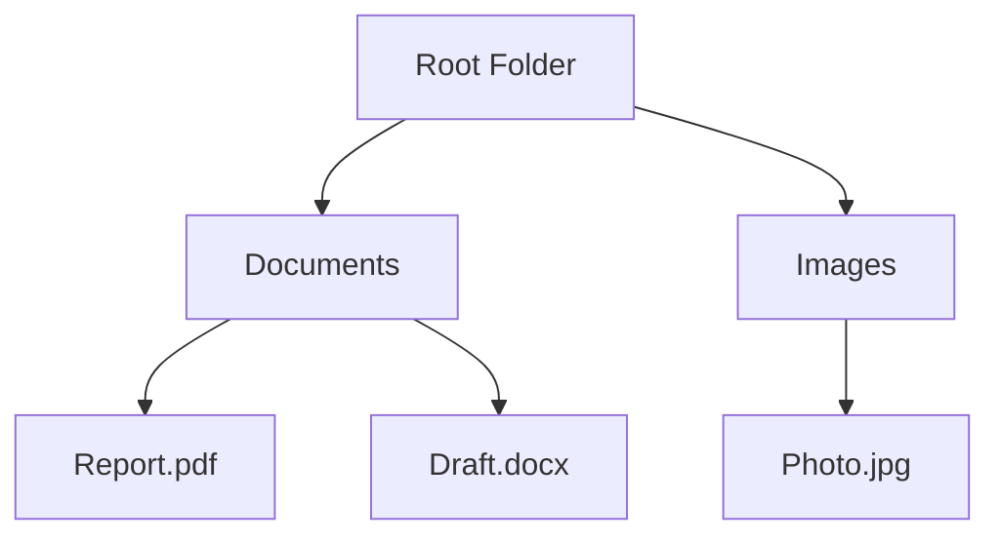
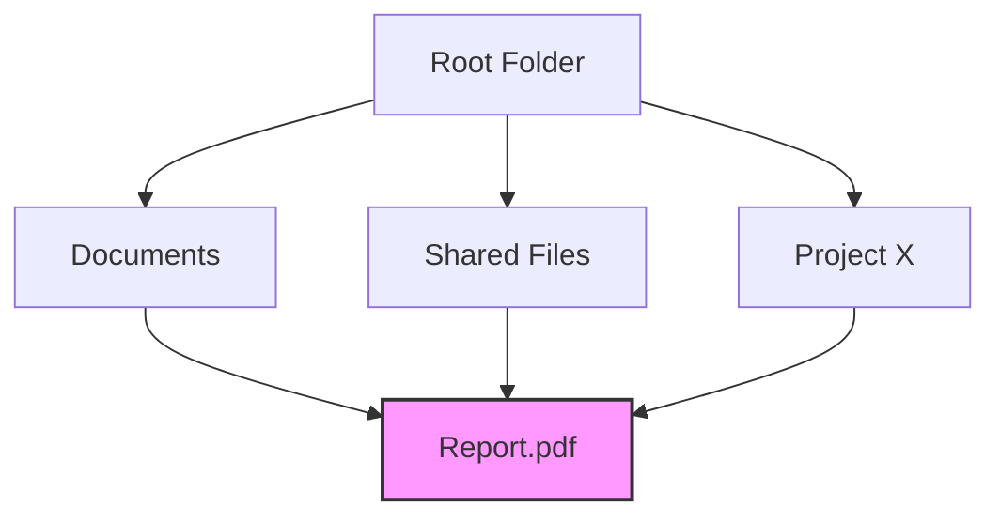
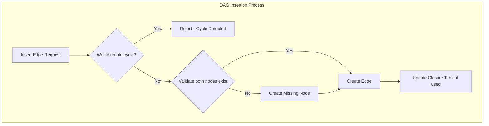
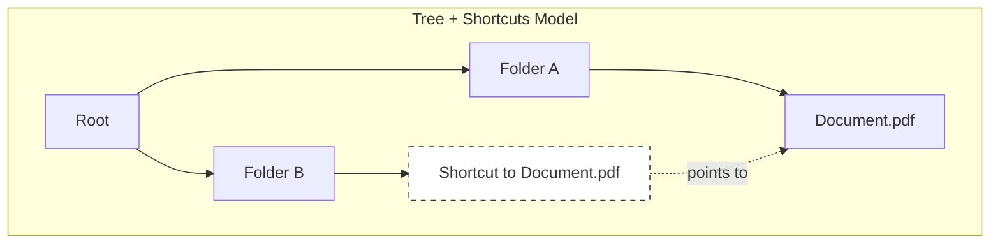
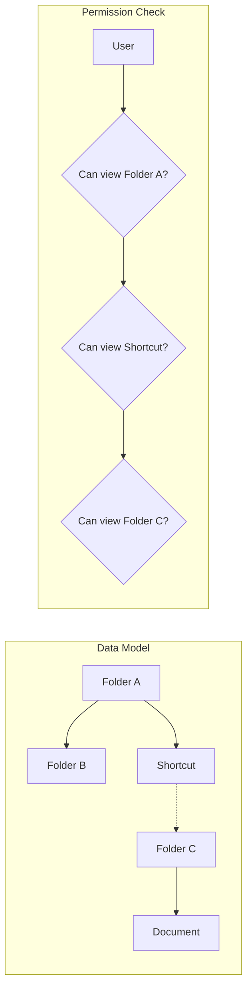

[← Back to Index](../index.md)

# Tree vs DAG (Directed Acyclic Graph) Data Models - Research

**Date**: 2025-12-09
**Status**: Research Complete

## Table of Contents

- [Executive Summary](#executive-summary)
- [Technical Deep Dive](#technical-deep-dive)
- [Technology Stack / Ecosystem](#technology-stack--ecosystem)
- [Codebase Analysis](#codebase-analysis)
- [Implementation Feasibility](#implementation-feasibility)
- [Implementation Options](#implementation-options)
- [Comparison Matrix](#comparison-matrix)
- [Implementation Approach](#implementation-approach)
- [Alternatives Considered](#alternatives-considered)
- [Debates & Open Questions](#debates--open-questions)
- [Recommendations](#recommendations)
- [Additional Notes](#additional-notes)
- [Sources](#sources)

## Executive Summary

Trees and Directed Acyclic Graphs (DAGs) represent two fundamental approaches to modeling hierarchical data, with the key distinction being parent multiplicity: trees enforce single-parent relationships while DAGs allow multiple parents. While DAGs offer greater flexibility for modeling complex relationships (multi-category items, shared resources, dependency graphs), they introduce significant complexity in database schema design, query patterns, authorization propagation, and data integrity enforcement. Industry leaders like Google Drive have notably moved away from DAG-based multi-parent models toward tree structures with shortcuts, citing user confusion and API complexity. **For most folder/document management systems, a tree structure with shortcuts or soft references provides the best balance of flexibility and maintainability.**

## Technical Deep Dive

### Overview

Both trees and DAGs are graph-based data structures for representing hierarchical relationships. The fundamental difference lies in their structural constraints around parent-child relationships and path uniqueness.

### Mathematical Definitions

**Tree**: A connected, acyclic graph where each node (except the root) has exactly one parent. A tree with n nodes has exactly n-1 edges. There exists a unique path between any two nodes.

**DAG (Directed Acyclic Graph)**: A directed graph with no cycles. Nodes can have multiple parents (in-edges) but the graph cannot contain any path that returns to the same node. Multiple paths can exist between two nodes.

```
TREE STRUCTURE                    DAG STRUCTURE
      A                                A
     /|\                              /|\
    B C D                            B C D
   /|   |                           /|\ /|
  E F   G                          E F G H
                                    \|/
                                     I
  (E has one parent: B)        (I has three parents: E, F, G)
```

### Structural Constraints

| Property | Tree | DAG |
|----------|------|-----|
| Parent count per node | Exactly 1 (except root: 0) | 0 to many |
| Edge count | n-1 for n nodes | Variable |
| Paths between nodes | Unique path | Multiple paths possible |
| Root nodes | Exactly 1 | Can have multiple |
| Cycles | Not possible | Not possible |

### How Hierarchical Relationships Work

**Tree Model**:
Each node stores a reference to its single parent. Navigation is deterministic - there's only one path from any node to the root.



**DAG Model**:
Nodes can belong to multiple parents simultaneously. The same document can appear in multiple "locations" without duplication.



### Key Algorithms

**Tree Traversal**: O(n) to visit all nodes using DFS/BFS. Path to root is O(h) where h is height.

**DAG Traversal**: More complex due to multiple paths. Topological sort required for ordered processing. Cycle detection necessary during insertions.



## Technology Stack / Ecosystem

### Database Storage Patterns

Four primary patterns exist for storing hierarchical data in relational databases:

1. **Adjacency List**: Simple parent_id column. Best for trees. O(1) insert, O(n) for subtree queries.

2. **Materialized Path**: Store full ancestry as string (e.g., "/A/B/C"). Fast reads, complex writes for DAGs.

3. **Nested Sets**: Left/right boundary values. Excellent for trees, not suitable for DAGs.

4. **Closure Table**: Separate table storing all ancestor-descendant pairs. Supports DAGs but storage grows quadratically.

### MongoDB-Specific Patterns

MongoDB supports several tree patterns through the `$graphLookup` aggregation operator:

- **Parent References**: `{ parent: ObjectId }`
- **Child References**: `{ children: [ObjectId] }` - Can support DAGs
- **Array of Ancestors**: `{ ancestors: [ObjectId] }` - Path from root
- **Materialized Paths**: `{ path: "/root/child/grandchild" }`

For DAG support, Child References or Closure Table patterns are required.

### Authorization Systems

**OpenFGA/Zanzibar**: Uses graph-based relationship model that naturally supports DAG-like permission inheritance. Permission checks traverse the relationship graph to find paths from user to resource.

```
type folder
  relations
    define parent: [folder]  # Allows folder hierarchy
    define editor: [user] or editor from parent  # Inheritance
```

## Codebase Analysis

### Current Implementation

The folder-server project uses a **tree structure** with OpenFGA for authorization:

**FGA Model** (`model.fga:278-305`):
```
type folder
  relations
    # Hierarchy - polymorphic parent
    define parent: [campus, domain, program, folder]

    # Inherited from parent chain
    define configuration_manager: configuration_manager from parent
    define same_campus_policy: same_campus_policy from parent
```

The `parent` relation is polymorphic but singular - a folder has one parent which can be of different types (campus, domain, program, or another folder). This is a tree structure.

**Schema** (`src/features/folder/folder.schema.ts`):
- Uses MongoDB with `_id` transformation
- No multi-parent fields visible in the schema
- Ancestors tracked via `ancestorSchema` for path display

### Architecture Pattern

```
GraphQL Schema → Generated Zod/Types → Feature Schemas → Resolvers
                                              ↓
                                        OpenFGA Check
                                              ↓
                                         MongoDB
```

Permission inheritance flows through the `parent` relation in OpenFGA, not through database-level multi-parent relationships.

### Critical Files

1. `model.fga:278-305` - Folder type definition with parent relation
2. `src/features/folder/folder.schema.ts` - Folder domain schema
3. `src/features/folder/folder.service.ts` - Business logic including move validation

## Implementation Feasibility

### Benefits of DAG Model

**Multi-location Organization**:
- Items can logically exist in multiple places
- Natural for tagging/categorization systems
- Supports "shared" items without duplication

**Real-World Accuracy**:
- Many domains have natural multi-parent relationships (taxonomy hybrids, shared resources)
- Better models dependencies where multiple things depend on the same item
- Accurate for version control merges (Git)

**Space Efficiency for Shared Structures**:
- Avoid data duplication when items belong to multiple categories
- "The repetition of common terms induced by the tree representation is exponential in the depth of nesting" [1]

### Trade-offs & Challenges

**Database Complexity**:
- Closure tables grow quadratically with depth and breadth
- Materialized paths become complex with multiple paths per node
- Referential integrity harder to enforce with multi-parent relationships

**Query Complexity**:
- No unique path to root - must handle multiple paths
- Aggregate operations need deduplication (counting items across parents)
- Cycle detection required on every edge insertion

**Authorization Complexity**:
- Permission inheritance through multiple paths
- Must decide: Does having ANY parent grant access, or ALL parents?
- Conflicting permissions from different paths
- "Permission propagation... through all nested folders" becomes non-deterministic [2]

**User Mental Model**:
- Users expect hierarchical navigation with single paths
- "Where is this item?" has multiple answers
- Deletion semantics unclear (remove from one parent or all?)

### When to Use

**DAG is appropriate when**:
- Items genuinely belong to multiple categories simultaneously
- Dependency relationships need modeling (task dependencies, package dependencies)
- Version control with merging is required
- Shared resources without duplication is critical

**DAG should be avoided when**:
- Simple hierarchical organization suffices
- Users need intuitive navigation
- Permission models must be simple and auditable
- Performance and simplicity are priorities

## Implementation Options

### Option 1: Pure Tree Structure (Current)

**Description**: Maintain single-parent hierarchy. Each folder has exactly one parent.

**Pros**:
- Simple mental model for users
- Straightforward queries and traversal
- Clear permission inheritance paths
- Current implementation - no migration needed

**Cons**:
- Cannot have item in multiple locations
- May require duplication for shared items
- Less flexible for complex organizational needs

**Complexity**: Low

**Time Estimate**: 0 days (current state)

**Reuses Patterns**: Yes - fully aligned with existing codebase

**When to Use**:
- Traditional folder hierarchies
- When clear ownership is required
- When permission audit trails must be simple

### Option 2: Tree + Shortcuts (Google Drive Model)

**Description**: Maintain tree structure but add "shortcut" or "soft link" entities that reference items in other locations.

**Pros**:
- Items appear in multiple locations without being multi-parented
- Clear primary location for each item
- Permissions tied to actual item, not shortcuts
- Google Drive's chosen approach after abandoning DAG [3]

**Cons**:
- Shortcuts can become stale (target deleted)
- Two types of "items" in the system
- Shortcut permissions may confuse users
- Additional table/collection for shortcuts

**Complexity**: Medium

**Time Estimate**: 1-2 weeks

**Reuses Patterns**: Partial - new entity type needed

**When to Use**:
- Need multi-location appearance without multi-parent complexity
- Want to preserve simple permission model
- Gradual migration from pure tree



### Option 3: Full DAG Implementation

**Description**: Allow folders/documents to have multiple parents through a junction table or array field.

**Pros**:
- True multi-parent relationships
- No data duplication
- Most flexible model

**Cons**:
- Complex permission inheritance logic needed
- Cycle detection on every mutation
- User confusion about "location"
- Significant refactoring of existing code
- OpenFGA model changes required

**Complexity**: High

**Time Estimate**: 4-6 weeks

**Reuses Patterns**: No - requires architectural changes

**When to Use**:
- Domain genuinely requires multi-parent semantics
- Team has expertise in graph databases
- Users understand DAG concepts

**Database Schema Change**:
```typescript
// Current: Single parent
type Folder = {
  id: string;
  parentId: string;  // Single parent
  // ...
}

// DAG: Multiple parents
type Folder = {
  id: string;
  parentIds: string[];  // Multiple parents
  // ...
}

// Or with closure table
type FolderClosure = {
  ancestorId: string;
  descendantId: string;
  depth: number;
}
```

### Option 4: Hybrid Tree + Tags

**Description**: Tree structure for navigation combined with tags/labels for cross-cutting categorization.

**Pros**:
- Clear hierarchy for navigation
- Flexible categorization through tags
- Tags don't affect permissions
- Simple to implement and understand

**Cons**:
- Tags are flat, not hierarchical
- Two systems to maintain
- Less powerful than true DAG

**Complexity**: Low-Medium

**Time Estimate**: 1 week

**Reuses Patterns**: Yes - additive to existing structure

**When to Use**:
- Need categorization without hierarchy complexity
- Users familiar with tagging systems
- Cross-cutting concerns don't need permission implications

## Comparison Matrix

| Criteria | Pure Tree | Tree + Shortcuts | Full DAG | Tree + Tags |
|----------|-----------|------------------|----------|-------------|
| **Complexity** | Low | Medium | High | Low-Medium |
| **Query Performance** | Excellent | Good | Fair | Good |
| **Permission Clarity** | Excellent | Good | Poor | Excellent |
| **Multi-location Support** | None | Good | Excellent | Partial |
| **User Mental Model** | Simple | Moderate | Complex | Simple |
| **Cycle Detection** | N/A | N/A | Required | N/A |
| **Data Integrity** | Simple | Moderate | Complex | Simple |
| **Migration Effort** | None | Medium | High | Low |
| **OpenFGA Compatibility** | Excellent | Good | Fair | Excellent |
| **Reuses Patterns** | Yes | Partial | No | Yes |
| **Time to Implement** | 0 | 1-2 weeks | 4-6 weeks | 1 week |

## Implementation Approach

### Recommended: Tree + Shortcuts (Option 2)

Based on the analysis, the Tree + Shortcuts approach provides the best balance of flexibility and maintainability for a folder/document management system.

### Prerequisites & Requirements

- Existing tree structure (already in place)
- New `shortcut` collection/type in MongoDB
- OpenFGA type for shortcut permissions
- GraphQL schema updates

### Getting Started

1. **Create Shortcut Schema**:
```graphql
type Shortcut {
  id: ID!
  parentId: ID!  # Where the shortcut lives
  targetId: ID!  # What it points to
  targetType: ShortcutTargetType!  # FOLDER or DOCUMENT
  name: String  # Optional override name
  meta: Metadata!
}
```

2. **Add OpenFGA Type**:
```
type shortcut
  relations
    define parent: [folder]
    define target: [folder, document]
    define can_view: can_view from parent
    define can_delete: can_manage_members from parent
```

### Architecture



### Best Practices

1. **Shortcut Creation**: Only users with view access to target can create shortcuts
2. **Shortcut Deletion**: Deleting target doesn't delete shortcuts (they become "broken")
3. **Broken Shortcut Handling**: Periodically clean up or mark broken shortcuts
4. **Display**: Visually distinguish shortcuts from regular items
5. **Permission Flow**: Shortcut viewing follows parent folder; target access checked separately

### Common Pitfalls & How to Avoid Them

1. **Circular Shortcuts**: Prevent shortcuts to ancestors (would create apparent cycle)
2. **Orphaned Shortcuts**: Handle target deletion gracefully
3. **Permission Confusion**: Clear UI indication that shortcut permissions != target permissions
4. **Deep Resolution**: Limit shortcut chains (shortcut to shortcut to shortcut...)

### Migration Strategy

1. **Phase 1**: Add shortcut infrastructure (schema, types, basic CRUD)
2. **Phase 2**: Enable shortcut creation in UI
3. **Phase 3**: Monitor usage and gather feedback
4. **Phase 4**: Iterate on UX based on user needs

## Alternatives Considered

### Alternative 1: Full DAG with Closure Table

- **Description**: Complete multi-parent support using closure table pattern
- **Why not chosen**: Excessive complexity for the use case. Google Drive abandoned this approach.
- **When it might be better**: True dependency graphs (build systems, package managers)

### Alternative 2: Document Duplication

- **Description**: Copy documents to multiple locations instead of sharing
- **Why not chosen**: Data inconsistency, storage waste, update synchronization issues
- **When it might be better**: When items truly need independent lifecycles

### Alternative 3: Virtual Folders / Smart Folders

- **Description**: Folders defined by queries rather than explicit membership
- **Why not chosen**: Complex query management, unclear permissions, performance concerns
- **When it might be better**: Search-heavy applications with dynamic organization needs

## Debates & Open Questions

### Industry Debate: DAG vs Tree for File Systems

Google Drive's 2020 migration from multi-parent (DAG) to single-parent (tree) with shortcuts is a landmark decision:

> "After Sept. 30, 2020, Google began migrating all items in Drive to a one-parent state. Any other parent-child relationships became shortcuts in the former parent folders." [3]

This suggests that even with significant engineering resources, the complexity of DAG-based file organization wasn't worth the benefits.

### Open Questions

1. **Shortcut Limits**: Should there be a maximum number of shortcuts per item?
2. **Shortcut Naming**: Should shortcuts always use target's name or allow custom names?
3. **Recursive Shortcuts**: Can a shortcut point to a folder containing shortcuts?
4. **Permission Caching**: How to handle permission checks efficiently with shortcuts?

### Edge Cases Needing Investigation

- Shortcut to item user can create shortcut to but not view (valid? useful?)
- Moving target folder - do shortcuts need updating?
- Exporting/importing with shortcuts - serialize as shortcuts or expand?

## Recommendations

### Preferred Approach: Tree + Shortcuts (Option 2)

**Should This Be Implemented?**: Yes, if multi-location requirement is confirmed

**Rationale**:
- Proven approach (Google Drive)
- Balances flexibility with simplicity
- Aligns with current tree-based architecture
- OpenFGA can model shortcuts cleanly
- Minimal disruption to existing patterns

**Why**:
1. **User Experience**: Clear mental model - items have a home, shortcuts are references
2. **Permission Clarity**: Permission inheritance follows tree structure
3. **Data Integrity**: No cycle detection needed; referential integrity is simple
4. **Implementation**: Additive change, doesn't require rewriting existing code

**Key Considerations**:
- Confirm actual user need for multi-location items before implementing
- Design shortcut UX carefully (visual distinction, broken shortcut handling)
- Consider starting with read-only shortcut support

**Potential Challenges**:

1. **Broken Shortcuts**: When targets are deleted
   - *Mitigation*: Soft-delete targets or clean up shortcuts on cascade
   - *Fallback*: Display "item no longer available" for broken shortcuts

2. **Permission UX**: Users may expect shortcuts to grant access to targets
   - *Mitigation*: Clear messaging that shortcut != access grant
   - *Fallback*: Option to request access from shortcut

**Success Criteria**:
- Users can "add" items to multiple locations via shortcuts
- No increase in permission-related support tickets
- Query performance remains acceptable (< 100ms for folder listing with shortcuts)
- Clear audit trail for shortcut creation/deletion

## Additional Notes

### Git as DAG Success Story

Git is often cited as successful DAG implementation, but its use case is fundamentally different:
- Commits are immutable - no cycle detection on updates needed
- Merges create new nodes rather than adding parents to existing nodes
- No permission inheritance through the graph
- Users interact through branches (references), not graph traversal

### Zanzibar/OpenFGA DAG Support

OpenFGA's graph model inherently supports DAG-like permission relationships, but with caveats:
- Permission graphs are separate from data hierarchies
- Cycle prevention is implicit in the relation semantics
- Performance optimized for permission checks, not data organization

The project's current OpenFGA model (`model.fga`) uses tree-like parent relations which work well with the recommendation.

### Storage Considerations

For MongoDB, the tree + shortcuts approach requires:
- One additional collection for shortcuts
- Index on `targetId` for finding shortcuts to an item
- Index on `parentId` for listing folder contents including shortcuts

No closure table or complex indexing strategies needed.

## Sources

1. [Directed Acyclic Graph - Wikipedia](https://en.wikipedia.org/wiki/Directed_acyclic_graph) - Mathematical foundations of DAGs
2. [Permission Propagation Guide - Varonis](https://www.varonis.com/blog/permission-propagation) - Permission inheritance in hierarchies
3. [Simplifying Google Drive's Folder Structure - Google Workspace Blog](https://workspace.google.com/blog/product-announcements/simplifying-google-drives-folder-structure-and-sharing-models) - Google's shift from multi-parent to single-parent
4. [Migrate to Single-Parent Model - Google Drive API](https://developers.google.com/drive/api/guides/multi-parenting) - Technical migration details
5. [Model Tree Structures - MongoDB Docs](https://www.mongodb.com/docs/manual/applications/data-models-tree-structures/) - MongoDB hierarchical data patterns
6. [Closure Table Pattern - Towards Data Science](https://towardsdatascience.com/closure-table-pattern-to-model-hierarchies-in-nosql-c1be6a87e05b/) - NoSQL hierarchy storage
7. [OpenFGA Parent-Child Relationships](https://openfga.dev/docs/modeling/parent-child) - Authorization model for hierarchies
8. [Google Zanzibar Paper](https://research.google/pubs/zanzibar-googles-consistent-global-authorization-system/) - Original Zanzibar authorization system
9. [Relational Modeling of Hierarchical Data - PMC](https://pmc.ncbi.nlm.nih.gov/articles/PMC11466226/) - Academic analysis of tree vs DAG in databases
10. [Git Version Control Data Model - MIT](https://missing.csail.mit.edu/2020/version-control/) - Git's DAG implementation
11. [Dependency Resolution in npm](https://medium.com/@aashvijariwala/dependency-resolution-algorithms-in-npm-c9c8b7a3ebca) - Package manager DAG handling
12. [Cycle Detection in PostgreSQL](https://articles.mergify.com/cycle-detection-in-postgresql/) - Database-level cycle prevention
13. [Building with Patterns: The Tree Pattern - MongoDB Blog](https://www.mongodb.com/blog/post/building-with-patterns-the-tree-pattern) - Best practices for MongoDB trees
14. [Understanding Google Zanzibar - AuthZed](https://authzed.com/blog/what-is-google-zanzibar) - Zanzibar performance and architecture
15. [Backward Compatible Database Changes - PlanetScale](https://planetscale.com/blog/backward-compatible-databases-changes) - Schema migration patterns
