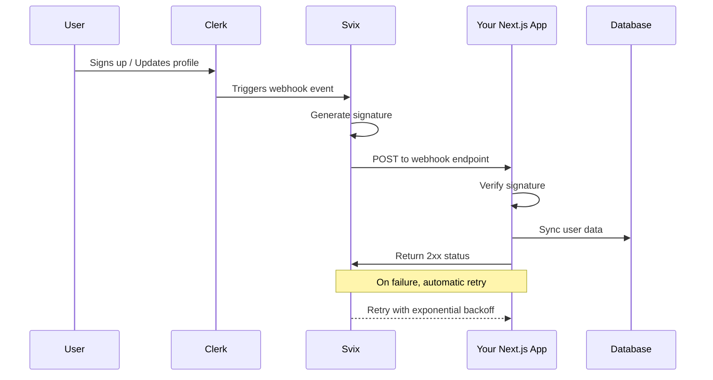
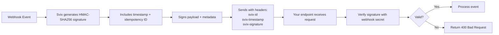
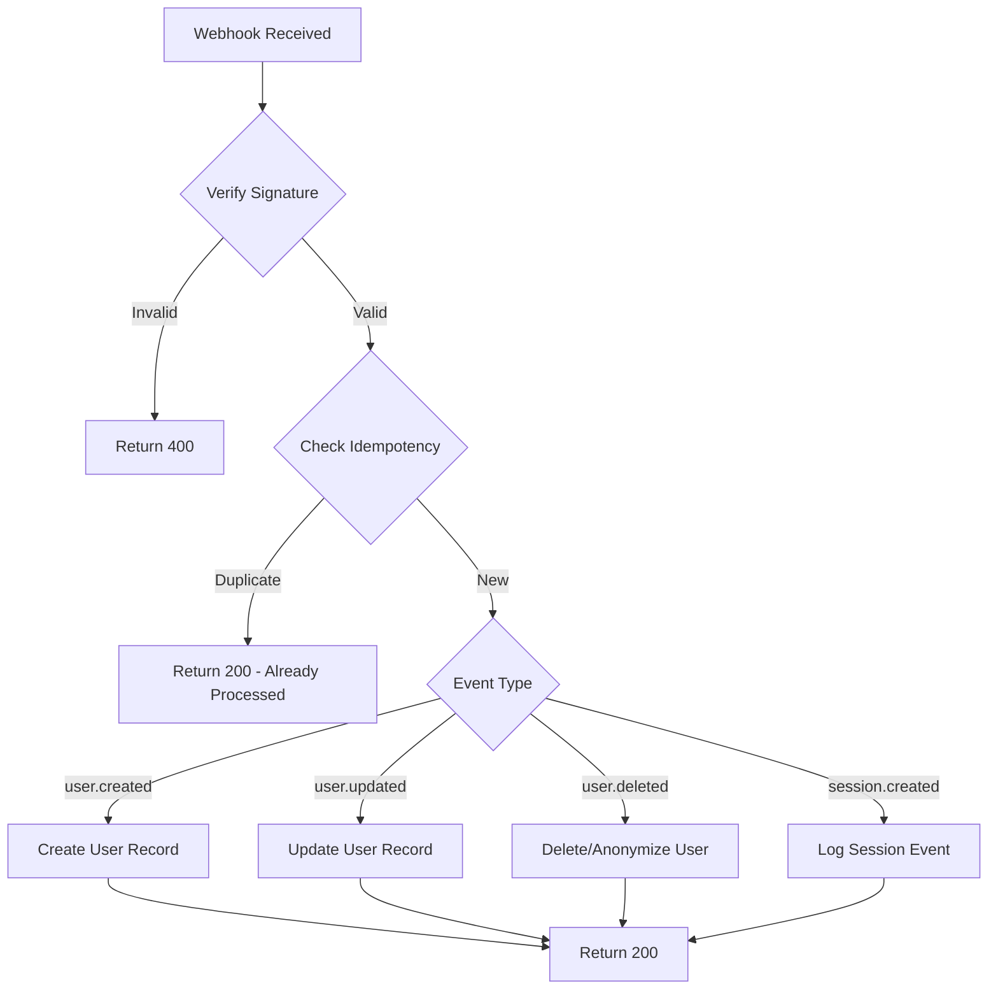
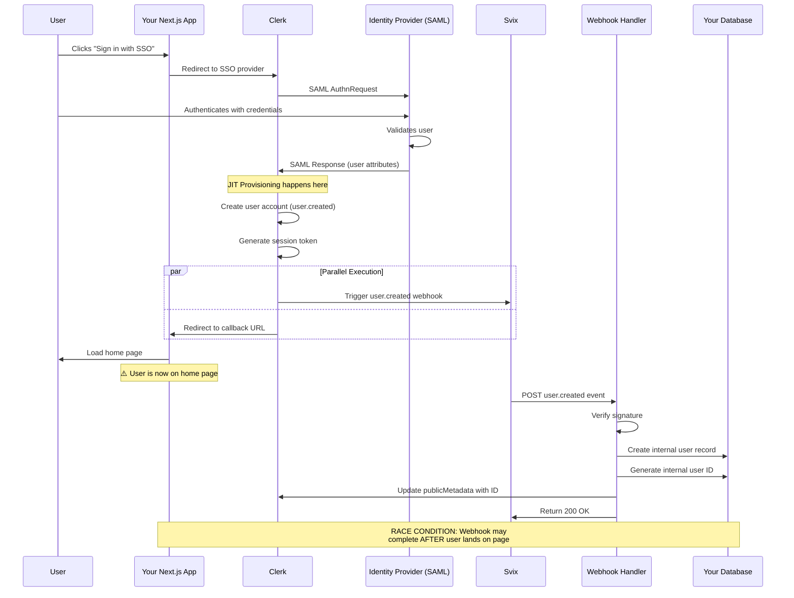
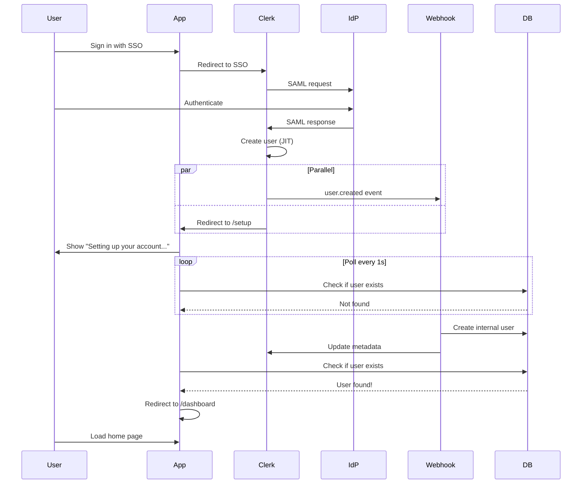
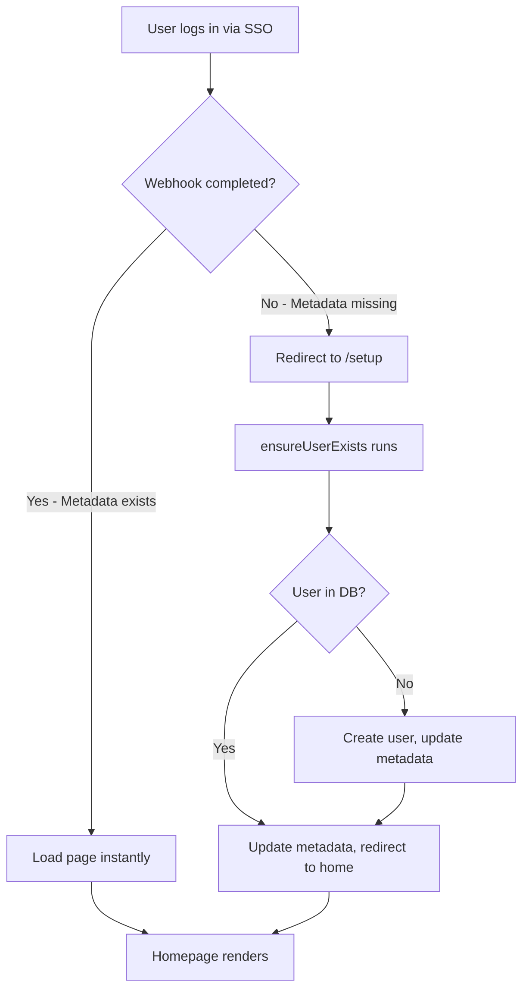

# Clerk Webhooks - Research

**Date**: 2025-10-22
**Status**: Research Complete

## Executive Summary

Clerk webhooks provide an event-driven mechanism for synchronizing user data and responding to authentication events in real-time. Built on Svix infrastructure, they offer reliable delivery with automatic retries, cryptographic signature verification, and comprehensive event types for user lifecycle management. For Next.js applications, webhooks enable database synchronization for social features, audit logging, and integration with third-party services. However, they are asynchronous and not guaranteed for synchronous workflows—making them ideal for notifications and eventual consistency patterns rather than critical path operations.

## Technical Deep Dive

### Overview

Clerk webhooks are HTTP POST callbacks triggered when specific events occur in your Clerk application. Rather than polling for changes, webhooks push data to your server asynchronously, enabling real-time responses to user authentication events, profile updates, and session changes. Clerk leverages **Svix** as its webhook delivery infrastructure, providing enterprise-grade reliability, security, and developer tooling.

### Core Architecture

Webhooks operate on a publisher-subscriber model where Clerk acts as the publisher and your application endpoint acts as the subscriber.

**Event Flow:**



**Key Characteristics:**

- **Asynchronous**: Webhooks deliver events out-of-band; they're not part of the request/response cycle
- **At-least-once delivery**: Messages may be delivered multiple times due to retries
- **Eventually consistent**: Delays can occur between events and webhook processing
- **Not guaranteed**: Network issues or endpoint failures can delay delivery

### Payload Structure

All Clerk webhook payloads follow a consistent structure:

```typescript
{
  "data": {
    // Event-specific payload (User, Session, Organization object, etc.)
  },
  "object": "event",
  "type": "user.created" | "user.updated" | "user.deleted" | "session.created" | ...,
  "timestamp": 1234567890000, // Unix timestamp in milliseconds
  "instance_id": "ins_xxxxxxxxxxxxx" // Your Clerk instance identifier
}
```

**Example: `user.created` Event**

```typescript
{
  "data": {
    "id": "user_xxxxxxxxxxxxx",
    "email_addresses": [
      {
        "id": "idn_xxxxxxxxxxxxx",
        "email_address": "user@example.com",
        "verification": {
          "status": "verified",
          "strategy": "email_link"
        }
      }
    ],
    "primary_email_address_id": "idn_xxxxxxxxxxxxx",
    "first_name": "John",
    "last_name": "Doe",
    "profile_image_url": "https://...",
    "username": null,
    "phone_numbers": [],
    "created_at": 1234567890000,
    "updated_at": 1234567890000,
    "public_metadata": {},
    "private_metadata": {},
    "unsafe_metadata": {}
  },
  "object": "event",
  "type": "user.created",
  "timestamp": 1234567890000,
  "instance_id": "ins_xxxxxxxxxxxxx"
}
```

### User-Related Events

Clerk provides comprehensive webhook events for tracking the complete user lifecycle:

#### Primary User Events

1. **`user.created`**
   - **Triggered**: When a new user signs up or is created via the Dashboard/API
   - **Use cases**:
     - Create corresponding user record in your database
     - Initialize user-specific resources (folders, preferences)
     - Trigger welcome emails or onboarding flows
     - Add user to CRM or marketing automation
   - **Payload**: Complete User object with all properties

2. **`user.updated`**
   - **Triggered**: When user information changes (profile, metadata, email/phone verification, etc.)
   - **Use cases**:
     - Sync profile updates to your database
     - Track user activity for analytics
     - Update search indices or caches
     - Propagate changes to third-party services
   - **Payload**: Updated User object with all current values

3. **`user.deleted`**
   - **Triggered**: When a user account is deleted via Dashboard or API
   - **Use cases**:
     - Remove or anonymize user data (GDPR compliance)
     - Clean up user-owned resources
     - Trigger off-boarding workflows
     - Update analytics and billing systems
   - **Payload**: User object with deletion metadata

#### Session Events

4. **`session.created`**
   - **Triggered**: When a user successfully signs in
   - **Use cases**:
     - Audit logging for security compliance
     - Track user login frequency/patterns
     - Send login notifications
     - Update "last seen" timestamps
   - **Payload**: Session object including user ID, client info, and timestamps

5. **`session.ended`**
   - **Triggered**: When a user logs out or session expires
   - **Use cases**:
     - Session duration analytics
     - Security monitoring
     - Activity tracking
   - **Payload**: Session object with end time

6. **`session.removed`**
   - **Triggered**: When a session is revoked (e.g., admin action, device removal)
   - **Use cases**:
     - Security event logging
     - Force logout tracking
   - **Payload**: Session object

7. **`session.revoked`**
   - **Triggered**: When a session is explicitly revoked via API
   - **Use cases**: Security breach response, session invalidation tracking
   - **Payload**: Session object

#### Email & Phone Events

8. **`email.created`**
   - **Triggered**: When a user adds a new email address
   - **Use cases**: Multi-factor authentication setup, contact list updates

9. **`sms.created`**
   - **Triggered**: When a user adds a phone number
   - **Use cases**: SMS notification preferences, phone verification tracking

#### Organization Events (Multi-Tenancy)

10. **`organization.created`**, **`organization.updated`**, **`organization.deleted`**
    - **Triggered**: Organization lifecycle events
    - **Use cases**: Tenant provisioning, resource allocation, subscription management

11. **`organizationMembership.created`**, **`organizationMembership.updated`**, **`organizationMembership.deleted`**
    - **Triggered**: When users join/leave organizations or roles change
    - **Use cases**: Access control synchronization, team collaboration features

**Note**: The complete list of events is available in the Clerk Dashboard under Webhooks > Event Catalog. Events continue to be added as Clerk expands functionality.

### How Svix Powers Clerk Webhooks

Svix handles the entire webhook infrastructure, providing:

#### Delivery Mechanism

**Retry Schedule** (Exponential Backoff):

1. Immediate delivery attempt
2. 5 seconds after failure
3. 5 minutes after failure
4. 30 minutes after failure
5. 2 hours after failure
6. 5 hours after failure
7. 10 hours after failure
8. 10 hours after failure (final attempt)

**Success Criteria**: Endpoint must return a **2xx status code** (200-299) within **15 seconds**. Any other response (3xx redirects, 4xx client errors, 5xx server errors) or timeout triggers a retry.

**Failure Handling**: After all retry attempts are exhausted, the message is marked as `Failed` and Svix sends a `message.attempt.exhausted` operational webhook to notify you.

**Automatic Endpoint Disabling**: Endpoints that fail consistently for **5 consecutive days** are automatically disabled to prevent resource waste. This only activates after multiple failures within a 24-hour span with at least 12 hours between first and last failure.

#### Reliability Features

- **Payload retention**: Failed messages are retained for manual replay
- **Manual replay**: Dashboard allows replaying individual messages or bulk recovery within date ranges
- **Monitoring**: Real-time delivery status and failure notifications
- **Rate limiting**: Prevents overwhelming your endpoints
- **FIFO endpoints**: Option for ordered delivery when sequence matters

### Security Model

Webhooks present unique security challenges since they originate from external sources. Svix and Clerk implement multiple layers of protection:

#### 1. Signature Verification (REQUIRED)

Every webhook includes cryptographic signatures that prove authenticity and prevent tampering.

**How it works:**



**Critical Requirement**: You must use the **raw request body** for verification. The signature is sensitive to even the slightest change—frameworks that parse JSON then re-stringify will invalidate the signature.

**Headers:**
- `svix-id`: Unique message ID (same across retries for idempotency)
- `svix-timestamp`: Unix timestamp when event was sent
- `svix-signature`: HMAC-SHA256 signature (may contain multiple versions: `v1,signature1 v2,signature2`)

#### 2. Timestamp Validation

Prevent replay attacks by checking the `svix-timestamp` header. Reject requests older than an acceptable window (typically 5 minutes).

#### 3. IP Allowlisting (Optional)

Restrict your webhook endpoint to only accept requests from Svix's published IP ranges. However, this is **insufficient alone** since cloud IPs can be shared or reassigned.

#### 4. HTTPS Only

Always use HTTPS webhook URLs to ensure encrypted transmission and prevent man-in-the-middle attacks.

#### Attack Prevention

| Attack Type | Mitigation |
|------------|------------|
| **Spoofing** | Signature verification with HMAC-SHA256 |
| **Replay Attacks** | Timestamp validation + idempotency checking |
| **SSRF** | Proxy through specialized filters, isolate webhook workers in private subnets |
| **Man-in-the-Middle** | HTTPS URLs only |
| **Token Exposure** | Never use static tokens; rely on cryptographic signatures |

### Technology Stack / Ecosystem

**Required Dependencies:**

```json
{
  "@clerk/nextjs": "^5.0.0",
  "svix": "^1.0.0"
}
```

**Clerk Package**: The `@clerk/nextjs` package provides the `verifyWebhook()` helper function that wraps Svix verification logic for convenience.

**Svix Package**: If not using Clerk's helper, you can use the `svix` npm package directly:

```bash
npm install svix
```

**Environment Configuration:**

```env
# Required: Webhook signing secret from Clerk Dashboard
CLERK_WEBHOOK_SIGNING_SECRET=whsec_xxxxxxxxxxxxxxxxxxxxxxxxxxxxxxxx

# Also needed for Clerk functionality
NEXT_PUBLIC_CLERK_PUBLISHABLE_KEY=pk_test_xxxxx
CLERK_SECRET_KEY=sk_test_xxxxx
```

**Framework Support:**

Svix provides official libraries for:
- JavaScript/Node.js
- TypeScript
- Python
- Go
- Rust
- Java/Kotlin
- Ruby
- C#/.NET
- PHP

**Testing Tools:**

- **ngrok**: Expose local development server for webhook testing
- **Svix CLI**: Test webhook delivery locally (requires sign-in)
- **Clerk Dashboard**: Test webhooks with sample events

## Implementation Feasibility

### Benefits

1. **Real-time Data Synchronization** - Keep your database in sync with Clerk user data without polling [Clerk Docs]
   - Critical for social features where you need to display other users' information
   - Clerk's frontend API only provides data for the currently authenticated user
   - Webhooks enable accessing any user's profile from your database

2. **Event-Driven Architecture** - Build reactive systems that respond to authentication events [Clerk Docs]
   - Decouple Clerk from your business logic
   - Trigger workflows asynchronously (emails, provisioning, analytics)
   - Scale processing independently from authentication

3. **Audit Logging & Compliance** - Track all authentication events for security and regulatory requirements [Clerk Docs]
   - Complete audit trail of user lifecycle (creation, updates, deletions)
   - Session tracking for security monitoring
   - GDPR/CCPA compliance through deletion event handling

4. **Third-Party Integrations** - Connect Clerk to CRM, analytics, marketing tools, and databases [Stack Overflow]
   - Sync users to Salesforce, HubSpot, Intercom
   - Send events to Segment, Mixpanel, Amplitude
   - Mirror user data to Prisma, Supabase, Firebase

5. **Enterprise-Grade Reliability** - Svix infrastructure handles the complexity of webhook delivery [Svix Docs]
   - Automatic retries with exponential backoff (8 attempts over 20+ hours)
   - Manual replay for failed messages
   - Monitoring and alerting for delivery failures
   - 99.9%+ delivery success rates

### Trade-offs & Challenges

1. **Eventual Consistency** - Webhook delivery is asynchronous and not instantaneous [Clerk Docs]
   - Network latency, retries, and processing delays mean data syncing isn't real-time
   - Your database may be briefly out of sync with Clerk's state
   - Applications must tolerate temporary inconsistencies

2. **Not Suitable for Synchronous Flows** - Cannot rely on webhooks for critical path operations [Clerk Docs]
   - Don't use webhooks if you need confirmation before proceeding with user-facing actions
   - Example: Can't depend on webhook completion before showing "Account Created" message
   - Better for background tasks and non-blocking workflows

3. **Idempotency Required** - "At-least-once" delivery means duplicate processing is possible [Svix Docs]
   - Must implement duplicate detection using `svix-id` header
   - Database operations should be idempotent or use unique constraints
   - Requires additional infrastructure (Redis cache or database tracking)

4. **Public Endpoint Exposure** - Webhook endpoints must be publicly accessible [Clerk Docs]
   - Creates potential attack surface if not properly secured
   - Must bypass authentication middleware for webhook routes
   - Requires careful configuration of route protection

5. **Local Development Complexity** - Testing webhooks locally requires additional tooling [ngrok Docs]
   - Need ngrok or similar tunneling service to receive webhooks during development
   - Extra setup step for new developers
   - Potential security concerns with exposing local environment

6. **Data Volume Considerations** - High-traffic applications may receive many webhook events [Svix Docs]
   - Need to handle rate limits and process events efficiently
   - May require queueing systems (SQS, Redis Queue) for high volumes
   - Database write contention if not properly designed

### When to Use

1. **Social Features** - Your app displays information about users other than the current user [Clerk Docs]
   - User directories, member lists, comments with author profiles
   - Messaging systems showing sender information
   - Collaboration tools with user presence

2. **External Database Requirements** - You need to query user data beyond what Clerk provides [Clerk Docs]
   - Storing additional user attributes (>1.2KB metadata limit)
   - Complex queries across user data
   - Full-text search on user profiles

3. **Onboarding Workflows** - Automated processes triggered when users sign up [Common Pattern]
   - Send welcome emails or onboarding sequences
   - Create user-specific resources (folders, workspaces, teams)
   - Provision access to third-party services
   - Initialize user preferences and settings

4. **Audit & Compliance** - Need to track all authentication events [Common Pattern]
   - Security monitoring and anomaly detection
   - Compliance with SOC2, HIPAA, GDPR
   - User activity logging for legal/regulatory purposes

5. **Third-Party Synchronization** - Connecting Clerk to other systems [Stack Overflow]
   - CRM integration (Salesforce, HubSpot)
   - Analytics platforms (Segment, Mixpanel)
   - Support tools (Intercom, Zendesk)
   - Databases (Postgres, MongoDB, Supabase)

6. **Multi-Tenant Applications** - Organization-based access control [Clerk Docs]
   - Sync organization memberships for role-based access
   - Provision tenant-specific resources
   - Track billing per organization

### When to Avoid

1. **Small Applications Without Social Features** - Overhead not justified [Clerk Docs]
   - If you only need current user's data, use Clerk's frontend API directly
   - Avoid complexity of database syncing when unnecessary
   - Session tokens can embed metadata (<1.2KB) for quick access

2. **Synchronous Workflows** - Webhooks are asynchronous and not guaranteed [Clerk Docs]
   - Don't use for operations that must complete before user proceeds
   - Not suitable for transactional consistency requirements
   - Consider Server Actions or API routes instead

3. **Simple Metadata Storage** - Clerk's metadata fields may suffice [Clerk Docs]
   - Public metadata: Accessible from frontend and backend (<1.2KB)
   - Private metadata: Backend only (<1.2KB)
   - Session token embedding for fast access
   - Avoids database queries for simple data

4. **Real-Time Requirements** - Eventual consistency not acceptable [Common Pattern]
   - Financial transactions requiring immediate confirmation
   - Inventory systems where accuracy is critical
   - Real-time multiplayer games with strict consistency

5. **Resource-Constrained Environments** - Webhook processing adds infrastructure [Common Pattern]
   - Serverless cold starts may cause timeouts (15s limit)
   - Free-tier databases may struggle with webhook volume
   - Limited budget for additional services (ngrok, Redis)

## Implementation Options

### Option 1: Next.js App Router with Route Handler

**Description**: Use Next.js Route Handlers (`route.ts`) in the App Router to create a webhook endpoint that verifies signatures and processes events.

**Pros**:
- ✅ **Native Next.js pattern** - Uses standard App Router conventions [Clerk Docs]
- ✅ **Server-side execution** - Runs on the server, not the client
- ✅ **Type-safe** - Full TypeScript support with Clerk types
- ✅ **Clerk helper available** - `verifyWebhook()` simplifies signature verification
- ✅ **Colocated with API routes** - Easy to maintain alongside other endpoints

**Cons**:
- ❌ **Requires explicit public access** - Must configure `clerkMiddleware()` to skip authentication [Clerk Docs]
- ❌ **Raw body handling** - Need to extract unmodified request body for signature verification
- ❌ **Serverless constraints** - Must complete within Vercel's timeout limits (15s for webhook response)

**Complexity**: Low

**Time Estimate**: 1-2 hours (including testing)

**Reuses Patterns**: Yes - follows existing API route patterns in the codebase

**When to Use**:
- Standard webhook implementation for most Next.js apps
- Simple event processing that completes quickly
- Prefer integrated solution over external services

**Example Implementation**:

```typescript
// src/app/api/webhooks/clerk/route.ts
import { headers } from 'next/headers';
import { NextResponse } from 'next/server';
import { Webhook } from 'svix';
import { WebhookEvent } from '@clerk/nextjs/server';

export async function POST(req: Request) {
  // 1. Extract signing secret
  const WEBHOOK_SECRET = process.env.CLERK_WEBHOOK_SIGNING_SECRET;
  if (!WEBHOOK_SECRET) {
    throw new Error('Missing CLERK_WEBHOOK_SIGNING_SECRET');
  }

  // 2. Get headers for verification
  const headerPayload = headers();
  const svixId = headerPayload.get('svix-id');
  const svixTimestamp = headerPayload.get('svix-timestamp');
  const svixSignature = headerPayload.get('svix-signature');

  if (!svixId || !svixTimestamp || !svixSignature) {
    return new NextResponse('Missing svix headers', { status: 400 });
  }

  // 3. Get raw body (critical for signature verification)
  const payload = await req.text();

  // 4. Verify webhook signature
  const wh = new Webhook(WEBHOOK_SECRET);
  let evt: WebhookEvent;

  try {
    evt = wh.verify(payload, {
      'svix-id': svixId,
      'svix-timestamp': svixTimestamp,
      'svix-signature': svixSignature,
    }) as WebhookEvent;
  } catch (err) {
    console.error('Webhook verification failed:', err);
    return new NextResponse('Webhook verification failed', { status: 400 });
  }

  // 5. Process event by type
  const eventType = evt.type;

  switch (eventType) {
    case 'user.created':
      await handleUserCreated(evt.data);
      break;
    case 'user.updated':
      await handleUserUpdated(evt.data);
      break;
    case 'user.deleted':
      await handleUserDeleted(evt.data);
      break;
    case 'session.created':
      await handleSessionCreated(evt.data);
      break;
    // Add other event types as needed
    default:
      console.log(`Unhandled webhook event type: ${eventType}`);
  }

  // 6. Return 2xx to acknowledge receipt
  return new NextResponse('Webhook processed', { status: 200 });
}

async function handleUserCreated(user: any) {
  // Sync user to database
  console.log('User created:', user.id);
  // await db.user.create({ data: { ... } });
}

async function handleUserUpdated(user: any) {
  console.log('User updated:', user.id);
  // await db.user.update({ where: { clerkId: user.id }, data: { ... } });
}

async function handleUserDeleted(user: any) {
  console.log('User deleted:', user.id);
  // await db.user.delete({ where: { clerkId: user.id } });
}

async function handleSessionCreated(session: any) {
  console.log('Session created for user:', session.user_id);
  // Log to audit table, update last_seen, etc.
}
```

**Middleware Configuration** (make webhook endpoint public):

```typescript
// src/middleware.ts
import { clerkMiddleware, createRouteMatcher } from '@clerk/nextjs/server';

const isPublicRoute = createRouteMatcher([
  '/sign-in(.*)',
  '/sign-up(.*)',
  '/api/webhooks/clerk', // Make webhook endpoint public
]);

export default clerkMiddleware(async (auth, request) => {
  if (!isPublicRoute(request)) {
    await auth.protect();
  }
});

export const config = {
  matcher: [
    '/((?!_next|[^?]*\\.(?:html?|css|js(?!on)|jpe?g|webp|png|gif|svg|ttf|woff2?|ico|csv|docx?|xlsx?|zip|webmanifest)).*)',
    '/(api|trpc)(.*)',
  ],
};
```

**Environment Setup**:

```env
# .env.local
CLERK_WEBHOOK_SIGNING_SECRET=whsec_xxxxxxxxxxxxxxxxxxxxxxxxxxxxxxxx
```

### Option 2: Server Action with Database Queue

**Description**: Instead of processing webhooks synchronously, store events in a database queue and process them asynchronously with Server Actions or background workers.

**Pros**:
- ✅ **Fast webhook response** - Immediately acknowledge receipt without processing [Svix Best Practices]
- ✅ **Handles high volume** - Queue absorbs traffic spikes
- ✅ **Retry logic** - Can implement custom retry policies
- ✅ **Observability** - Database provides audit trail of all events
- ✅ **Prevents timeouts** - Processing happens outside webhook request

**Cons**:
- ❌ **Additional complexity** - Requires queue table and worker process
- ❌ **Higher latency** - Processing delayed until worker runs
- ❌ **More infrastructure** - Need background job processor
- ❌ **Database writes** - Every webhook writes to queue table

**Complexity**: Medium

**Time Estimate**: 4-6 hours (including queue setup and worker)

**Reuses Patterns**: Partial - uses Server Actions but requires new queue pattern

**When to Use**:
- High-traffic applications with many webhook events
- Complex processing that may take >10 seconds
- Need guaranteed event processing (durable queue)
- Want to replay or audit webhook events

**Example Implementation**:

```typescript
// src/app/api/webhooks/clerk/route.ts
import { headers } from 'next/headers';
import { NextResponse } from 'next/server';
import { Webhook } from 'svix';
import { db } from '@/lib/db';

export async function POST(req: Request) {
  // 1. Verify signature (same as Option 1)
  const WEBHOOK_SECRET = process.env.CLERK_WEBHOOK_SIGNING_SECRET;
  if (!WEBHOOK_SECRET) {
    throw new Error('Missing CLERK_WEBHOOK_SIGNING_SECRET');
  }

  const headerPayload = headers();
  const svixId = headerPayload.get('svix-id');
  const svixTimestamp = headerPayload.get('svix-timestamp');
  const svixSignature = headerPayload.get('svix-signature');

  if (!svixId || !svixTimestamp || !svixSignature) {
    return new NextResponse('Missing svix headers', { status: 400 });
  }

  const payload = await req.text();
  const wh = new Webhook(WEBHOOK_SECRET);

  try {
    const evt = wh.verify(payload, {
      'svix-id': svixId,
      'svix-timestamp': svixTimestamp,
      'svix-signature': svixSignature,
    });

    // 2. Queue event for processing (idempotent via unique svix-id)
    await db.webhookQueue.upsert({
      where: { webhookId: svixId },
      create: {
        webhookId: svixId,
        eventType: evt.type,
        payload: evt,
        status: 'pending',
        receivedAt: new Date(),
      },
      update: {}, // No-op if already exists (idempotency)
    });

    // 3. Return immediately
    return new NextResponse('Queued', { status: 200 });
  } catch (err) {
    console.error('Webhook verification failed:', err);
    return new NextResponse('Webhook verification failed', { status: 400 });
  }
}
```

**Queue Processor** (runs separately, e.g., via cron or worker):

```typescript
// src/server/webhooks/process-queue.ts
"use server";

import { db } from '@/lib/db';

export async function processWebhookQueue() {
  // Get pending events
  const events = await db.webhookQueue.findMany({
    where: { status: 'pending' },
    orderBy: { receivedAt: 'asc' },
    take: 100,
  });

  for (const event of events) {
    try {
      // Process based on event type
      switch (event.eventType) {
        case 'user.created':
          await handleUserCreated(event.payload.data);
          break;
        case 'user.updated':
          await handleUserUpdated(event.payload.data);
          break;
        // ... other cases
      }

      // Mark as processed
      await db.webhookQueue.update({
        where: { id: event.id },
        data: { status: 'processed', processedAt: new Date() },
      });
    } catch (err) {
      console.error(`Failed to process webhook ${event.webhookId}:`, err);

      // Mark as failed
      await db.webhookQueue.update({
        where: { id: event.id },
        data: {
          status: 'failed',
          error: err.message,
          attempts: { increment: 1 },
        },
      });
    }
  }
}
```

### Option 3: Minimal Metadata Approach (Avoid Webhooks)

**Description**: Instead of syncing all user data via webhooks, store only essential information (<1.2KB) in Clerk's public/private metadata fields and access it from session tokens.

**Pros**:
- ✅ **No webhook infrastructure** - Simplest approach [Clerk Docs]
- ✅ **Fast access** - Metadata embedded in session tokens
- ✅ **No database queries** - Read directly from token
- ✅ **No synchronization lag** - Data always current
- ✅ **Lower complexity** - Fewer moving parts

**Cons**:
- ❌ **Size limitations** - Only 1.2KB per metadata type (public/private)
- ❌ **No social features** - Can't query other users' data
- ❌ **Limited querying** - Can't search or filter users
- ❌ **Token size** - Large metadata increases JWT size

**Complexity**: Low

**Time Estimate**: 30 minutes - 1 hour

**Reuses Patterns**: Yes - uses existing Clerk integration

**When to Use**:
- Simple applications without social features
- Only need current user's data
- Minimal additional user attributes
- Want to avoid database syncing complexity

**Example Implementation**:

```typescript
// Update user metadata via Server Action
"use server";

import { auth, clerkClient } from '@clerk/nextjs/server';

export async function updateUserPreferences(preferences: UserPreferences) {
  const { userId } = await auth();
  if (!userId) throw new Error('Unauthorized');

  // Store in public metadata (accessible from frontend)
  await clerkClient.users.updateUserMetadata(userId, {
    publicMetadata: {
      theme: preferences.theme,
      language: preferences.language,
      notifications: preferences.notifications,
    },
  });
}

// Access metadata from session token (no database query)
import { currentUser } from '@clerk/nextjs/server';

export async function getUserPreferences() {
  const user = await currentUser();
  if (!user) throw new Error('Unauthorized');

  return user.publicMetadata as UserPreferences;
}
```

**Accessing in Client Component**:

```typescript
'use client';

import { useUser } from '@clerk/nextjs';

export function UserPreferencesDisplay() {
  const { user } = useUser();

  const preferences = user?.publicMetadata as UserPreferences;

  return (
    <div>
      <p>Theme: {preferences?.theme}</p>
      <p>Language: {preferences?.language}</p>
    </div>
  );
}
```

## Comparison Matrix

| Criteria | Option 1: Route Handler | Option 2: Queue + Worker | Option 3: Metadata Only |
|----------|-------------------------|--------------------------|-------------------------|
| Complexity | Low | Medium | Low |
| Maintainability | High | Medium | High |
| Performance | Good | Excellent | Excellent |
| Learning Curve | Low | Medium | Low |
| Infrastructure | Webhook endpoint only | Webhook + Database + Worker | None |
| Reuses Patterns | Yes | Partial | Yes |
| Time to Implement | 1-2 hours | 4-6 hours | 30 min - 1 hour |
| Social Features | ✅ Supported | ✅ Supported | ❌ Not supported |
| Scalability | Medium | High | High |
| Database Required | ✅ Yes | ✅ Yes | ❌ No |
| Handles High Volume | ⚠️ May timeout | ✅ Yes | ✅ N/A |
| Event Audit Trail | ❌ Logs only | ✅ Database | ❌ No |
| Idempotency | Manual | Built-in | N/A |
| Cost | Low | Medium | Free |

## Implementation Approach

### Prerequisites & Requirements

**Required Tools:**
- Node.js 18+
- Next.js 15+ with App Router
- TypeScript (strict mode)
- Clerk account with application configured
- Database (if syncing user data)

**Required Packages:**

```bash
pnpm add @clerk/nextjs svix
```

**Environment Variables:**

```env
# From Clerk Dashboard > Webhooks > Endpoints
CLERK_WEBHOOK_SIGNING_SECRET=whsec_xxxxxxxxxxxxxxxxxxxxxxxxxxxxxxxx

# Standard Clerk configuration
NEXT_PUBLIC_CLERK_PUBLISHABLE_KEY=pk_test_xxxxx
CLERK_SECRET_KEY=sk_test_xxxxx
```

**Knowledge/Skills:**
- Next.js App Router and Route Handlers
- TypeScript and async/await
- HTTP request/response handling
- Understanding of webhook security concepts
- Database operations (if syncing data)

### Getting Started

**Step 1: Create Webhook Endpoint in Clerk Dashboard**

1. Navigate to [Clerk Dashboard](https://dashboard.clerk.com)
2. Select your application
3. Go to **Webhooks** in the sidebar
4. Click **Add Endpoint**
5. For local development, use ngrok URL: `https://[your-ngrok-id].ngrok.io/api/webhooks/clerk`
6. For production, use your deployed URL: `https://yourdomain.com/api/webhooks/clerk`
7. Select events to subscribe to (e.g., `user.created`, `user.updated`, `user.deleted`, `session.created`)
8. Click **Create**
9. Copy the **Signing Secret** (starts with `whsec_`)

**Step 2: Configure Environment Variables**

```env
# .env.local
CLERK_WEBHOOK_SIGNING_SECRET=whsec_[copy from dashboard]
```

**Step 3: Create Route Handler**

```typescript
// src/app/api/webhooks/clerk/route.ts
import { headers } from 'next/headers';
import { NextResponse } from 'next/server';
import { Webhook } from 'svix';
import type { WebhookEvent } from '@clerk/nextjs/server';

export async function POST(req: Request) {
  const WEBHOOK_SECRET = process.env.CLERK_WEBHOOK_SIGNING_SECRET;
  if (!WEBHOOK_SECRET) {
    throw new Error('Missing CLERK_WEBHOOK_SIGNING_SECRET');
  }

  const headerPayload = headers();
  const svixId = headerPayload.get('svix-id');
  const svixTimestamp = headerPayload.get('svix-timestamp');
  const svixSignature = headerPayload.get('svix-signature');

  if (!svixId || !svixTimestamp || !svixSignature) {
    return new NextResponse('Missing svix headers', { status: 400 });
  }

  const payload = await req.text();
  const wh = new Webhook(WEBHOOK_SECRET);
  let evt: WebhookEvent;

  try {
    evt = wh.verify(payload, {
      'svix-id': svixId,
      'svix-timestamp': svixTimestamp,
      'svix-signature': svixSignature,
    }) as WebhookEvent;
  } catch (err) {
    console.error('Webhook verification failed:', err);
    return new NextResponse('Webhook verification failed', { status: 400 });
  }

  console.log('Webhook event:', evt.type, evt.data);

  // TODO: Process events

  return new NextResponse('Success', { status: 200 });
}
```

**Step 4: Make Endpoint Public**

```typescript
// src/middleware.ts
import { clerkMiddleware, createRouteMatcher } from '@clerk/nextjs/server';

const isPublicRoute = createRouteMatcher([
  '/sign-in(.*)',
  '/sign-up(.*)',
  '/api/webhooks/clerk', // Add this line
]);

export default clerkMiddleware(async (auth, request) => {
  if (!isPublicRoute(request)) {
    await auth.protect();
  }
});

export const config = {
  matcher: [
    '/((?!_next|[^?]*\\.(?:html?|css|js(?!on)|jpe?g|webp|png|gif|svg|ttf|woff2?|ico|csv|docx?|xlsx?|zip|webmanifest)).*)',
    '/(api|trpc)(.*)',
  ],
};
```

**Step 5: Test with Clerk Dashboard**

1. In Clerk Dashboard > Webhooks > Your Endpoint
2. Click **Testing** tab
3. Select an event type (e.g., `user.created`)
4. Click **Send Example**
5. Check your terminal/logs for the event
6. Verify you see `Webhook event: user.created [data]`

### Architecture & Design Considerations

**Event Processing Strategy:**



**Key Design Decisions:**

1. **Synchronous vs. Asynchronous Processing**
   - **Synchronous**: Process immediately in route handler (simpler, may timeout)
   - **Asynchronous**: Queue events and process with worker (scalable, more complex)
   - **Recommendation**: Start synchronous, migrate to async if timeouts occur

2. **Database Schema**
   ```sql
   -- Users table (synced from Clerk)
   CREATE TABLE users (
     id TEXT PRIMARY KEY,  -- Clerk user ID
     clerk_id TEXT UNIQUE NOT NULL,
     email TEXT NOT NULL,
     first_name TEXT,
     last_name TEXT,
     profile_image_url TEXT,
     created_at TIMESTAMP NOT NULL,
     updated_at TIMESTAMP NOT NULL
   );

   -- Webhook event log (optional, for debugging)
   CREATE TABLE webhook_events (
     id SERIAL PRIMARY KEY,
     webhook_id TEXT UNIQUE NOT NULL,  -- svix-id for idempotency
     event_type TEXT NOT NULL,
     payload JSONB NOT NULL,
     processed_at TIMESTAMP NOT NULL DEFAULT NOW()
   );
   ```

3. **Error Handling Strategy**
   - Return **200** for successfully processed events
   - Return **400** for invalid signatures or malformed payloads
   - Return **500** for transient errors (database unavailable) to trigger retries
   - **Don't throw unhandled errors** - catch and log instead

4. **Idempotency Implementation**
   - Use `svix-id` header as unique event identifier
   - Check if event already processed before handling
   - Use database unique constraints or Redis cache

   ```typescript
   // Idempotency check with database
   const existingEvent = await db.webhookEvent.findUnique({
     where: { webhookId: svixId }
   });

   if (existingEvent) {
     console.log('Event already processed:', svixId);
     return new NextResponse('Already processed', { status: 200 });
   }
   ```

5. **Data Mapping Strategy**
   - Create Zod schemas for validation
   - Map Clerk user object to your database schema
   - Handle missing/optional fields gracefully

   ```typescript
   import { z } from 'zod';

   const UserEventSchema = z.object({
     id: z.string(),
     email_addresses: z.array(z.object({
       email_address: z.string().email(),
     })),
     first_name: z.string().nullable(),
     last_name: z.string().nullable(),
     profile_image_url: z.string().url().nullable(),
     created_at: z.number(),
     updated_at: z.number(),
   });

   // In webhook handler
   const userData = UserEventSchema.parse(evt.data);
   await db.user.upsert({
     where: { clerkId: userData.id },
     create: {
       clerkId: userData.id,
       email: userData.email_addresses[0].email_address,
       firstName: userData.first_name,
       lastName: userData.last_name,
       profileImageUrl: userData.profile_image_url,
       createdAt: new Date(userData.created_at),
       updatedAt: new Date(userData.updated_at),
     },
     update: {
       email: userData.email_addresses[0].email_address,
       firstName: userData.first_name,
       lastName: userData.last_name,
       profileImageUrl: userData.profile_image_url,
       updatedAt: new Date(userData.updated_at),
     },
   });
   ```

### Best Practices

**1. Always Verify Signatures** [Svix Security Docs]
- Never skip signature verification, even in development
- Use raw request body for verification
- Validate timestamp to prevent replay attacks (5-minute window)

**2. Return 2xx Immediately** [Svix Docs]
- Acknowledge receipt within 15 seconds
- Process complex logic asynchronously if needed
- Don't wait for external API calls before responding

**3. Implement Idempotency** [Svix Idempotency Docs]
- Use `svix-id` header to detect duplicates
- Make database operations idempotent (upsert instead of insert)
- Store processed event IDs in cache or database

**4. Handle All Event Types Gracefully** [Clerk Docs]
- Don't error on unrecognized event types
- Log unknown events for monitoring
- Add new event handlers as needed

```typescript
switch (evt.type) {
  case 'user.created':
    await handleUserCreated(evt.data);
    break;
  case 'user.updated':
    await handleUserUpdated(evt.data);
    break;
  default:
    console.log(`Unhandled event type: ${evt.type}`);
    // Still return 200 to prevent retries
}
```

**5. Use Structured Logging** [Best Practice]
- Log webhook events with structured data
- Include event type, user ID, and timestamp
- Make logs searchable for debugging

```typescript
console.log(JSON.stringify({
  message: 'Webhook received',
  eventType: evt.type,
  userId: evt.data.id,
  webhookId: svixId,
  timestamp: new Date().toISOString(),
}));
```

**6. Monitor Webhook Failures** [Svix Docs]
- Set up alerts for failed webhook deliveries
- Use Clerk Dashboard to monitor webhook status
- Check for `message.attempt.exhausted` operational webhooks

**7. Test Locally Before Deploying** [Development Best Practice]
- Use ngrok to test webhooks during development
- Test each event type individually
- Verify idempotency by sending duplicate events

**8. Secure Your Endpoint** [Security Best Practice]
- Use HTTPS URLs only
- Don't log sensitive user data
- Rate limit webhook endpoint to prevent abuse
- Consider IP allowlisting Svix IP ranges

### Common Pitfalls & How to Avoid Them

**1. Forgetting to Make Endpoint Public** [Common Issue]
- **Problem**: Clerk middleware blocks webhook requests
- **Solution**: Add webhook route to `isPublicRoute()` matcher
- **Error**: `401 Unauthorized` or `403 Forbidden` responses

**2. Using Parsed JSON Instead of Raw Body** [Svix Docs]
- **Problem**: Signature verification fails because body was modified
- **Solution**: Use `await req.text()` to get raw body string
- **Error**: `Webhook verification failed` messages

```typescript
// ❌ WRONG - parses JSON
const body = await req.json();

// ✅ CORRECT - keeps raw string
const body = await req.text();
```

**3. Not Handling Duplicate Events** [Svix Idempotency Docs]
- **Problem**: Retries create duplicate database records
- **Solution**: Check `svix-id` before processing or use `upsert`
- **Error**: Unique constraint violations, duplicate user records

**4. Synchronous Processing Timeouts** [Svix Docs]
- **Problem**: Complex processing takes >15 seconds, webhook fails
- **Solution**: Return 200 immediately, process asynchronously
- **Error**: Repeated webhook retries due to timeouts

**5. Throwing Unhandled Errors** [Best Practice]
- **Problem**: Unhandled exceptions return 500, trigger unnecessary retries
- **Solution**: Wrap processing in try/catch, return 200 even on error

```typescript
try {
  await handleUserCreated(evt.data);
} catch (err) {
  console.error('Failed to process user.created:', err);
  // Still return 200 to prevent retries for application errors
  // Only return 500 for transient errors (database down)
}

return new NextResponse('Success', { status: 200 });
```

**6. Missing Environment Variable** [Common Setup Issue]
- **Problem**: `CLERK_WEBHOOK_SIGNING_SECRET` not set in production
- **Solution**: Add to Vercel environment variables, restart deployment
- **Error**: `Missing CLERK_WEBHOOK_SIGNING_SECRET` exception

**7. Testing in Production Without Testing** [Development Issue]
- **Problem**: Deploy webhook handler without local testing
- **Solution**: Test locally with ngrok before deploying
- **Error**: Failed webhooks in production, hard to debug

**8. Forgetting to Handle user.deleted** [GDPR Compliance]
- **Problem**: Deleted users remain in your database
- **Solution**: Implement `user.deleted` handler that removes/anonymizes data
- **Error**: GDPR compliance violations, stale user data

### Migration/Adoption Strategy

**Phase 1: Setup & Validation (Week 1)**
1. Create webhook endpoint with logging only (no processing)
2. Configure Clerk Dashboard webhook
3. Set up ngrok for local testing
4. Verify signature verification works
5. Test each event type in Clerk Dashboard

**Phase 2: Implement Core Events (Week 2)**
1. Add `user.created` handler - create database records
2. Add `user.updated` handler - sync changes
3. Add `user.deleted` handler - clean up data
4. Test idempotency with duplicate events
5. Deploy to staging environment

**Phase 3: Add Session & Organization Events (Week 3)**
1. Add `session.created` for audit logging
2. Add organization membership events if using multi-tenancy
3. Implement monitoring and alerting
4. Load test with high webhook volume

**Phase 4: Production Rollout (Week 4)**
1. Deploy to production
2. Monitor webhook delivery success rate
3. Verify database synchronization
4. Set up dashboards for webhook metrics
5. Document webhook handling for team

**Rollback Strategy:**
- Webhooks are non-blocking - can disable in Clerk Dashboard anytime
- Remove webhook URL from Clerk to stop receiving events
- Keep endpoint code for future re-enablement
- Database changes are separate - can continue using Clerk API directly

## Alternatives Considered

### Alternative 1: Polling Clerk API

**Description**: Instead of webhooks pushing events to you, periodically poll Clerk's API to check for user changes.

**Why it wasn't chosen:**
- Inefficient - wastes API calls checking for changes that may not exist
- Higher latency - changes only detected on next poll interval
- Rate limit concerns - frequent polling consumes API quota
- More complex state management - need to track what's changed since last poll

**When it might be better:**
- Very low webhook volume where polling is simpler
- Existing batch processing system for user sync
- Need to synchronize historical data on initial setup (use API then switch to webhooks)

### Alternative 2: Clerk Backend SDK Direct Calls

**Description**: Query Clerk's API directly when you need user data instead of maintaining a synchronized database.

**Why it wasn't chosen:**
- Performance - API calls add latency to every request
- Rate limits - limited API quota
- Availability - dependent on Clerk's API being accessible
- Can't query across users - no way to list all users with certain attributes
- No offline capability

**When it might be better:**
- Only need current user's data (use Clerk's frontend SDK instead)
- Very small user base (<100 users)
- Don't need to query or search across users
- Want to avoid database infrastructure

### Alternative 3: Clerk Session Tokens with Metadata

**Description**: Embed all needed user data in Clerk's public/private metadata and access from session tokens.

**Why it wasn't chosen:**
- Size limit - only 1.2KB per metadata type
- No social features - can't access other users' data
- Token size - large metadata increases JWT size
- Limited querying - can't search users

**When it might be better:**
- Small amount of user data (<1KB)
- Only need current user's information
- Want simplest possible approach
- No social features or user directories

## Debates & Open Questions

**Debate: Should every app use webhooks?** [Community Discussion]

**Perspective 1**: "Always use webhooks for user sync"
- Ensures data consistency between Clerk and database
- Enables social features and user directories
- Industry standard pattern for authentication providers

**Perspective 2**: "Webhooks add unnecessary complexity"
- Most apps don't need social features
- Session tokens with metadata are simpler and faster
- Adds infrastructure and failure points
- Metadata + direct API calls cover 90% of use cases

**Consensus**: Use webhooks if you need to query across users or build social features. Otherwise, session tokens with metadata are simpler.

---

**Open Question 1**: What's the best way to handle high webhook volume in serverless environments?

**Current approaches:**
- Queue events in database and process with cron job
- Use SQS/Redis Queue with separate worker process
- Increase serverless timeout limits (Vercel Pro: 60s)
- Batch process multiple events together

**Needs investigation**: Optimal queue design for Next.js App Router, benchmarking different queue backends

---

**Open Question 2**: How to handle webhook delivery failures gracefully?

**Challenges:**
- Svix retries for 20+ hours, but eventually gives up
- Manual replay possible but requires monitoring
- No built-in alerting for webhook failures

**Potential solutions:**
- Subscribe to `message.attempt.exhausted` operational webhook
- Set up external monitoring (Sentry, Datadog)
- Implement periodic reconciliation job to detect missed events
- Use Svix dashboard API to check delivery status

---

**Open Question 3**: Should webhook handlers use Server Actions or direct database calls?

**Option A: Server Actions** (separate concerns)
```typescript
case 'user.created':
  await createUserAction(evt.data);
  break;
```

**Option B: Direct Database** (faster, less abstraction)
```typescript
case 'user.created':
  await db.user.create({ data: mapUser(evt.data) });
  break;
```

**Tradeoffs:**
- Server Actions: Better separation, reusable, but slower
- Direct database: Faster, but couples webhook handler to data layer
- Edge case: Server Actions may have restrictions in edge runtime

**Recommendation**: Use Server Actions for consistency unless performance is critical

---

**Open Question 4**: How to test webhooks in CI/CD pipelines?

**Challenges:**
- Can't use ngrok in automated tests
- Need to mock webhook signatures
- Hard to test idempotency and retry logic

**Current approaches:**
- Unit test webhook handler with mocked signatures
- Integration tests with Svix library for signature generation
- E2E tests that hit actual Clerk webhooks (slow, flaky)
- Mock Clerk webhook format and call handler directly

**Needs investigation**: Best practices for webhook testing in Next.js

## Recommendations

### Preferred Approach: Next.js Route Handler with Direct Processing (Option 1)

**Should This Be Implemented?**: Conditional - only if you need social features or cross-user queries

**Rationale**:

1. **Simple and maintainable** - Route Handlers are standard Next.js patterns, easy for team to understand
2. **Fast to implement** - 1-2 hours to basic webhook handling vs. 4-6 hours for queue system
3. **Sufficient for most apps** - Unless you have >1000 webhooks/day, direct processing handles load fine
4. **Matches existing codebase** - Follows patterns in `src/app/api/` and `src/server/` directories
5. **Lower infrastructure costs** - No additional queue or worker services needed

**Why**:

The project uses:
- **Next.js 15 App Router** - Route Handlers are the native pattern for API endpoints
- **Server Actions for mutations** - Webhook handlers can call existing Server Actions for consistency
- **TypeScript strict mode** - Clerk provides strong types for webhook events
- **Organization-based multi-tenancy** - Organization membership events can sync access control

For this codebase, webhook processing complexity is low (user sync, audit logging) and can complete within serverless timeout limits. A queue adds unnecessary complexity unless proven needed by load testing.

**Key Considerations**:

1. **Data model alignment**:
   - Map Clerk user IDs to existing organization members
   - Sync to same database used by Server Actions
   - Use Zod schemas (matching `src/server/organization/organization.schema.ts` pattern)

2. **Idempotency**:
   - Track processed `svix-id` headers in webhook_events table
   - Use `upsert` for database operations to handle retries gracefully

3. **Error handling**:
   - Return 200 for successfully processed events
   - Return 400 for invalid signatures (prevent retries)
   - Return 500 only for transient failures (database down)
   - Log errors but don't throw unhandled exceptions

4. **Testing strategy**:
   - Unit tests for event handlers with mocked payloads
   - Integration tests with Svix signature generation
   - Local testing with ngrok before production deployment
   - Use Clerk Dashboard test events during development

### Potential Challenges & Mitigations

**Challenge 1: Serverless Timeout on Complex Processing**
- **Risk**: If user sync involves multiple database writes or external API calls, may exceed 15s Vercel limit
- **Mitigation**: Start simple, measure processing time, migrate to queue (Option 2) if needed
- **Fallback**: Upgrade to Vercel Pro (60s timeout) or use queue pattern

**Challenge 2: Webhook Delivery Failures**
- **Risk**: Network issues or bugs may cause webhooks to fail silently
- **Mitigation**:
  - Subscribe to `message.attempt.exhausted` operational webhook for alerts
  - Implement periodic reconciliation job (nightly) to detect missed events
  - Monitor webhook delivery rate in Clerk Dashboard

**Challenge 3: Database Synchronization Lag**
- **Risk**: Users created in Clerk may not immediately exist in database
- **Mitigation**:
  - Design UI to tolerate missing user data (show loading state)
  - Fall back to Clerk API if user not in database
  - Set reasonable retry intervals in Svix (5 seconds is usually sufficient)

**Challenge 4: Handling User Deletions**
- **Risk**: `user.deleted` events must comply with GDPR data deletion requirements
- **Mitigation**:
  - Implement soft delete (flag as deleted) initially
  - Schedule hard delete after retention period
  - Test deletion flow thoroughly
  - Document deletion process for compliance

### Success Criteria

**Metrics to Track:**

1. **Webhook Delivery Success Rate**: >99% of webhooks processed successfully
   - Monitor in Clerk Dashboard > Webhooks > [Your Endpoint]
   - Alert if success rate drops below 95%

2. **Processing Latency**: <2 seconds average webhook processing time
   - Log processing duration for each event type
   - Optimize slow handlers or migrate to async processing

3. **Database Sync Accuracy**: 100% of users in Clerk exist in database
   - Run daily reconciliation query comparing counts
   - Alert on mismatches, backfill missing users

4. **Idempotency Effectiveness**: 0 duplicate user records created
   - Monitor unique constraint violations
   - Verify `svix-id` deduplication working

5. **Error Rate**: <1% of webhooks generate errors
   - Track error logs by event type
   - Fix common errors (validation failures, missing data)

**Expected Outcomes:**

1. **Social features enabled** - User directories, member lists, profile search
2. **Audit trail complete** - All authentication events logged for security
3. **Database always in sync** - User data current within 1-2 minutes of changes
4. **System resilience** - Graceful handling of webhook retries and failures
5. **Developer productivity** - Easy to add new event handlers as features expand

## Enterprise SSO First-Time Login Flow & Race Condition Handling

### Overview

When implementing Clerk Enterprise SSO (SAML) with an internal user database, a critical challenge emerges: ensuring that when a user logs in via SSO for the first time, your internal user record exists and contains your custom internal ID **before** the user lands on your application. This section provides a comprehensive analysis of the SSO login flow, timing guarantees, race conditions, and production-ready mitigation strategies.

### The Core Problem

**Your Requirements:**
1. Use your own internal user ID as the primary identifier (not Clerk's user ID)
2. When a user is created in Clerk via SSO login, you need to:
   - Create a user record in your database
   - Generate your own internal user ID
   - Store that ID in Clerk's `publicMetadata` for session token access
3. **GUARANTEE** that when the user lands on the home page, the internal user record exists and the ID is available

**The Race Condition:**
SSO logins trigger asynchronous webhook events (`user.created`) that may not complete before the user is redirected back to your application, creating a race condition where:
- User authenticates via IdP (Identity Provider)
- Clerk creates user account
- User is redirected to your app
- ⚠️ **Webhook may still be in-flight or processing**
- Your app tries to access internal user ID → **NOT FOUND**

### SSO First-Time Login Flow & Timing

Here's the **exact sequence** of events when a new user logs in via enterprise SSO:



### Critical Timing Facts

Based on Clerk documentation and production experience:

1. **User Creation in Clerk**: Happens **immediately** during SSO callback processing (JIT provisioning)
2. **Webhook Trigger**: Fired **immediately** after user creation, but delivery is **asynchronous**
3. **Redirect to Application**: Happens **in parallel** with webhook delivery (NOT after)
4. **Webhook Delivery Time**: Typically 100-500ms in ideal conditions, but can be:
   - 1-5 seconds under normal load
   - 5+ seconds during network issues
   - Minutes or hours if webhook endpoint is down
5. **Session Token Generation**: Happens **before** redirect, using metadata at time of user creation

**Key Insight**: Clerk does **NOT** wait for webhooks to complete before redirecting the user. This is by design—webhooks are fire-and-forget for performance and reliability.

### Webhook Timing & Delivery Guarantees

**What Clerk/Svix DOES Guarantee:**
- ✅ Webhooks will be delivered **eventually** (with up to 8 retry attempts over 20+ hours)
- ✅ Events are delivered **at least once** (may receive duplicates on retries)
- ✅ Signatures ensure authenticity and prevent tampering
- ✅ Manual replay available for failed events

**What Clerk/Svix DOES NOT Guarantee:**
- ❌ Webhooks will complete **before** user redirect
- ❌ Webhooks will complete **within any specific timeframe**
- ❌ Webhooks will complete **at all** (endpoint could be down)
- ❌ Webhooks will complete **in order** (parallel processing possible)

**From Clerk Documentation** [Sync Data Guide]:
> "Webhooks are asynchronous. For example, if you are onboarding a new user, you can't rely on the webhook delivery as part of that flow. Typically the delivery will happen quickly, but it's not guaranteed to be delivered immediately or at all."

> "Syncing data via webhooks is eventually consistent, meaning there can be a delay between when a Clerk event (such as a user being created or updated) occurs and when the corresponding data is reflected in your database."

### Metadata Synchronization Patterns

#### Metadata Types & Usage

Clerk provides three metadata types for storing custom data:

| Type | Accessible From | Writable From | Session Token | Use Case |
|------|----------------|---------------|---------------|----------|
| **publicMetadata** | Frontend + Backend | Backend only | ✅ Can include | Non-sensitive data needed on frontend (user preferences, IDs) |
| **privateMetadata** | Backend only | Backend only | ✅ Can include | Sensitive data not exposed to frontend (Stripe customer ID) |
| **unsafeMetadata** | Frontend + Backend | Frontend + Backend | ✅ Can include | User-modifiable data (onboarding status) |

**Size Limits:**
- **Total metadata**: 8KB maximum per user
- **Session token recommendation**: <1.2KB to avoid cookie size limits (browser limit: 4KB)

**For Internal User IDs:**
- Use **publicMetadata** if frontend needs read access to the ID
- Use **privateMetadata** if ID should remain backend-only
- Store as simple field: `{ internalUserId: "your-id-123" }`

#### Updating Metadata from Webhooks

```typescript
// In user.created webhook handler
import { clerkClient } from '@clerk/nextjs/server';

async function handleUserCreated(clerkUser: any) {
  // 1. Create user in your database
  const internalUser = await db.user.create({
    data: {
      clerkId: clerkUser.id,
      email: clerkUser.email_addresses[0].email_address,
      // ... other fields
    }
  });

  // 2. Store internal ID in Clerk metadata
  await clerkClient.users.updateUserMetadata(clerkUser.id, {
    publicMetadata: {
      internalUserId: internalUser.id,
    },
  });
}
```

**Critical Question: Does updating metadata trigger another webhook?**

**Answer**: YES, updating `publicMetadata` or `privateMetadata` via `clerkClient.users.updateUserMetadata()` **will trigger a `user.updated` webhook**.

**Preventing Infinite Loops:**

```typescript
// Option 1: Check if metadata already exists
async function handleUserUpdated(clerkUser: any) {
  // Only process if internalUserId is missing
  if (!clerkUser.public_metadata?.internalUserId) {
    // Create user and update metadata
  }
}

// Option 2: Use conditional flag
async function handleUserCreated(clerkUser: any) {
  // Set a flag to prevent re-processing
  await clerkClient.users.updateUserMetadata(clerkUser.id, {
    publicMetadata: {
      internalUserId: internalUser.id,
      syncedFromWebhook: true, // Flag to detect webhook-originated updates
    },
  });
}

async function handleUserUpdated(clerkUser: any) {
  // Ignore updates that came from our own webhook handler
  if (clerkUser.public_metadata?.syncedFromWebhook) {
    return; // Skip processing
  }
}

// Option 3: Only update in user.created (RECOMMENDED)
// Don't update metadata in user.updated handler at all
```

**Recommendation**: Only update metadata in the `user.created` webhook handler. This avoids infinite loops and keeps logic simple.

#### Session Token Availability

**When is metadata available in session tokens?**

- Metadata updated **server-side** (via `clerkClient.users.updateUserMetadata()`) is **NOT immediately** available in the current session token
- Session tokens are **regenerated periodically** (default: every 60 seconds)
- To force token refresh after metadata update:

```typescript
// Client-side force refresh
import { useAuth } from '@clerk/nextjs';

const { getToken } = useAuth();
await getToken({ skipCache: true }); // Forces new token with latest metadata
```

```typescript
// Server-side in middleware or Server Component
import { auth } from '@clerk/nextjs/server';

const { userId, sessionClaims } = await auth();
// sessionClaims includes metadata if token is recent
```

**Key Issue**: Even if you update metadata in the webhook handler, the **user's current session token** won't have it until the next automatic refresh (up to 60 seconds).

### Race Condition Mitigation Strategies

Let's analyze each approach in detail:

#### Approach A: Just-In-Time User Creation

**Pattern**: Check if user exists in database on first page load; if not, create synchronously.

```typescript
// src/app/page.tsx (Server Component)
import { currentUser } from '@clerk/nextjs/server';
import { db } from '@/lib/db';
import { clerkClient } from '@clerk/nextjs/server';

export default async function HomePage() {
  const clerkUser = await currentUser();
  if (!clerkUser) redirect('/sign-in');

  // Check if user exists in database
  let internalUser = await db.user.findUnique({
    where: { clerkId: clerkUser.id }
  });

  // If not exists, create NOW (synchronously blocks page load)
  if (!internalUser) {
    internalUser = await db.user.create({
      data: {
        clerkId: clerkUser.id,
        email: clerkUser.emailAddresses[0].emailAddress,
        firstName: clerkUser.firstName,
        lastName: clerkUser.lastName,
      }
    });

    // Update Clerk metadata with internal ID
    await clerkClient.users.updateUserMetadata(clerkUser.id, {
      publicMetadata: {
        internalUserId: internalUser.id,
      },
    });
  }

  return <Dashboard user={internalUser} />;
}
```

**Pros:**
- ✅ **Guarantees user exists** before page renders
- ✅ **Simple implementation** - no complex infrastructure
- ✅ **No race condition** - synchronous execution ensures consistency
- ✅ **Works with Server Components** - natural Next.js pattern
- ✅ **Handles webhook failures gracefully** - creates user even if webhook never fired

**Cons:**
- ❌ **Database query on every page load** (unless cached)
- ❌ **Slower first page load** - blocks rendering while creating user
- ❌ **Duplicate logic** - both webhook and page create users
- ❌ **Potential duplicate creates** - if webhook and page run simultaneously

**Mitigation for Cons:**
- Use database unique constraint on `clerkId` to prevent duplicates
- Cache check in middleware or session metadata after first creation
- Consider lazy-loading user creation only when needed (not on every page)

**When to Use:**
- Small to medium traffic applications
- Simple user model (quick to create)
- Want guaranteed consistency without complex infrastructure
- Acceptable to have slower first page load

**Production Optimization:**

```typescript
// Enhanced version with caching and error handling
export default async function HomePage() {
  const clerkUser = await currentUser();
  if (!clerkUser) redirect('/sign-in');

  // Check session metadata first (fastest)
  const cachedUserId = clerkUser.publicMetadata?.internalUserId;

  if (cachedUserId) {
    // Metadata exists, assume user exists (optimistic)
    const internalUser = await db.user.findUnique({
      where: { id: cachedUserId as string }
    });

    if (internalUser) {
      return <Dashboard user={internalUser} />;
    }
  }

  // Fallback: Check by Clerk ID or create
  let internalUser = await db.user.findUnique({
    where: { clerkId: clerkUser.id }
  });

  if (!internalUser) {
    try {
      internalUser = await db.user.create({
        data: {
          clerkId: clerkUser.id,
          email: clerkUser.emailAddresses[0].emailAddress,
          // ... other fields
        }
      });

      // Update metadata asynchronously (don't wait)
      clerkClient.users.updateUserMetadata(clerkUser.id, {
        publicMetadata: { internalUserId: internalUser.id },
      }).catch(console.error); // Fire and forget

    } catch (error) {
      // Handle unique constraint violation (webhook created user first)
      if (error.code === 'P2002') { // Prisma unique constraint error
        internalUser = await db.user.findUnique({
          where: { clerkId: clerkUser.id }
        });
      } else {
        throw error;
      }
    }
  }

  return <Dashboard user={internalUser} />;
}
```

#### Approach B: Blocking "Setting Up Account" Page

**Pattern**: Redirect SSO users to a loading page, poll until user creation completes, then redirect to home page.



**Implementation:**

```typescript
// src/middleware.ts
import { clerkMiddleware, createRouteMatcher } from '@clerk/nextjs/server';
import { NextResponse } from 'next/server';

const isPublicRoute = createRouteMatcher(['/sign-in(.*)', '/sign-up(.*)', '/setup']);

export default clerkMiddleware(async (auth, request) => {
  const { userId, sessionClaims } = await auth();

  if (!isPublicRoute(request) && userId) {
    // Check if user has internal ID in metadata
    const hasInternalId = sessionClaims?.metadata?.internalUserId;

    if (!hasInternalId && !request.url.includes('/setup')) {
      // Redirect to setup page if internal user not created yet
      return NextResponse.redirect(new URL('/setup', request.url));
    }
  }

  if (!isPublicRoute(request)) {
    await auth.protect();
  }
});
```

```typescript
// src/app/setup/page.tsx
'use client';

import { useEffect, useState } from 'react';
import { useRouter } from 'next/navigation';
import { checkUserSetupComplete } from '@/server/user/user.actions';

export default function SetupPage() {
  const router = useRouter();
  const [attempts, setAttempts] = useState(0);
  const MAX_ATTEMPTS = 30; // 30 seconds max

  useEffect(() => {
    const pollInterval = setInterval(async () => {
      const isComplete = await checkUserSetupComplete();

      if (isComplete) {
        clearInterval(pollInterval);
        router.push('/'); // Redirect to home
      } else {
        setAttempts(prev => prev + 1);

        if (attempts >= MAX_ATTEMPTS) {
          clearInterval(pollInterval);
          // Fallback: Force user creation
          router.push('/'); // Will trigger JIT creation
        }
      }
    }, 1000); // Poll every 1 second

    return () => clearInterval(pollInterval);
  }, [attempts, router]);

  return (
    <div className="flex items-center justify-center min-h-screen">
      <div className="text-center">
        <h1 className="text-2xl font-bold mb-4">Setting up your account...</h1>
        <div className="animate-spin rounded-full h-12 w-12 border-b-2 border-gray-900 mx-auto"></div>
        <p className="mt-4 text-gray-600">This should only take a moment</p>
      </div>
    </div>
  );
}
```

```typescript
// src/server/user/user.actions.ts
"use server";

import { auth } from '@clerk/nextjs/server';
import { db } from '@/lib/db';

export async function checkUserSetupComplete(): Promise<boolean> {
  const { userId } = await auth();
  if (!userId) return false;

  const internalUser = await db.user.findUnique({
    where: { clerkId: userId }
  });

  return !!internalUser;
}
```

**Pros:**
- ✅ **Clean UX** - users see progress instead of errors
- ✅ **Handles webhook delays** - waits for completion
- ✅ **Guaranteed consistency** - won't proceed until user exists
- ✅ **Timeout fallback** - can force creation if webhook fails

**Cons:**
- ❌ **Poor user experience** - adds delay to login flow
- ❌ **Database load** - polling creates repeated queries
- ❌ **Client-side polling** - not ideal for server-first apps
- ❌ **Timeout complexity** - need fallback logic if webhook never completes

**Optimization: Server-Sent Events (SSE)**

Instead of client-side polling, use SSE for real-time updates:

```typescript
// src/app/api/setup/status/route.ts
import { auth } from '@clerk/nextjs/server';
import { db } from '@/lib/db';

export async function GET(request: Request) {
  const { userId } = await auth();
  if (!userId) {
    return new Response('Unauthorized', { status: 401 });
  }

  const encoder = new TextEncoder();
  const stream = new ReadableStream({
    async start(controller) {
      // Poll database every 500ms
      const interval = setInterval(async () => {
        const user = await db.user.findUnique({
          where: { clerkId: userId }
        });

        if (user) {
          controller.enqueue(encoder.encode(`data: ${JSON.stringify({ ready: true })}\n\n`));
          clearInterval(interval);
          controller.close();
        }
      }, 500);

      // Timeout after 30 seconds
      setTimeout(() => {
        clearInterval(interval);
        controller.enqueue(encoder.encode(`data: ${JSON.stringify({ ready: false, timeout: true })}\n\n`));
        controller.close();
      }, 30000);
    },
  });

  return new Response(stream, {
    headers: {
      'Content-Type': 'text/event-stream',
      'Cache-Control': 'no-cache',
      'Connection': 'keep-alive',
    },
  });
}
```

**When to Use:**
- User experience is critical - don't want users to see errors
- Webhook delivery is typically fast (<5 seconds)
- Can tolerate brief setup delay
- Want clear separation between setup and main app

#### Approach C: Clerk Middleware Pattern

**Pattern**: Use Clerk middleware to check/create user before any page loads.

**IMPORTANT UPDATE**: The old `authMiddleware` with `afterAuth` callback has been deprecated. The new `clerkMiddleware()` does **not** provide an `afterAuth` callback.

**Current Pattern with `clerkMiddleware()`:**

```typescript
// src/middleware.ts
import { clerkMiddleware, createRouteMatcher } from '@clerk/nextjs/server';
import { NextResponse } from 'next/server';
import { db } from '@/lib/db';

const isPublicRoute = createRouteMatcher([
  '/sign-in(.*)',
  '/sign-up(.*)',
  '/api/webhooks/clerk',
]);

export default clerkMiddleware(async (auth, request) => {
  const { userId } = await auth();

  if (!isPublicRoute(request)) {
    await auth.protect(); // Require authentication

    if (userId) {
      // Check if user exists in database
      const internalUser = await db.user.findUnique({
        where: { clerkId: userId }
      });

      // If not exists, create user synchronously in middleware
      if (!internalUser) {
        try {
          await db.user.create({
            data: {
              clerkId: userId,
              email: (await auth()).sessionClaims.email,
              // ... other fields from sessionClaims
            }
          });
        } catch (error) {
          // Handle duplicate creation race condition
          if (error.code !== 'P2002') {
            throw error;
          }
        }
      }
    }
  }
});

export const config = {
  matcher: [
    '/((?!_next|[^?]*\\.(?:html?|css|js(?!on)|jpe?g|webp|png|gif|svg|ttf|woff2?|ico|csv|docx?|xlsx?|zip|webmanifest)).*)',
    '/(api|trpc)(.*)',
  ],
};
```

**Pros:**
- ✅ **Runs on every request** - guaranteed to execute before page load
- ✅ **Centralized logic** - one place to handle user creation
- ✅ **Works with Server Components** - transparent to page code
- ✅ **No race condition** - blocks request until user exists

**Cons:**
- ❌ **Database query on EVERY request** - significant performance overhead
- ❌ **Middleware limitations** - restricted runtime (no Node.js APIs in edge runtime)
- ❌ **Slower page loads** - adds latency to every request
- ❌ **Not recommended by Clerk** - middleware should be lightweight

**Optimization with Metadata Caching:**

```typescript
export default clerkMiddleware(async (auth, request) => {
  const { userId, sessionClaims } = await auth();

  if (!isPublicRoute(request)) {
    await auth.protect();

    if (userId) {
      // Check metadata first (no database query!)
      const hasInternalId = sessionClaims?.metadata?.internalUserId;

      // Only create user if metadata is missing
      if (!hasInternalId) {
        // Check database (first-time only)
        let internalUser = await db.user.findUnique({
          where: { clerkId: userId }
        });

        if (!internalUser) {
          // Create user
          internalUser = await db.user.create({
            data: { clerkId: userId, /* ... */ }
          });

          // Update metadata (async, fire-and-forget)
          clerkClient.users.updateUserMetadata(userId, {
            publicMetadata: { internalUserId: internalUser.id },
          }).catch(console.error);
        }
      }
    }
  }
});
```

**When to Use:**
- Small applications with low traffic
- User creation is very fast
- Want guaranteed execution before page load
- Can tolerate slight latency on every request

**Clerk's Recommendation**: Middleware should be **lightweight** and focus on authentication/authorization only. Heavy database operations should be in Server Components or Server Actions.

#### Approach D: Optimistic UI with Fallback

**Pattern**: Let user land on home page, show loading state while checking for user, fall back to Clerk API if not exists.

```typescript
// src/app/page.tsx (Server Component)
import { currentUser } from '@clerk/nextjs/server';
import { db } from '@/lib/db';
import { Suspense } from 'react';

async function UserDashboard() {
  const clerkUser = await currentUser();
  if (!clerkUser) redirect('/sign-in');

  // Optimistically try to load user from database
  const internalUser = await db.user.findUnique({
    where: { clerkId: clerkUser.id }
  });

  if (!internalUser) {
    // User doesn't exist yet - webhook hasn't completed
    // Option 1: Create now (JIT pattern)
    const newUser = await db.user.create({
      data: { clerkId: clerkUser.id, /* ... */ }
    });
    return <Dashboard user={newUser} />;

    // Option 2: Show degraded UI using Clerk data
    return <Dashboard user={{
      id: clerkUser.id,
      email: clerkUser.emailAddresses[0].emailAddress,
      firstName: clerkUser.firstName,
      lastName: clerkUser.lastName,
      // ... use Clerk data as fallback
    }} />;
  }

  return <Dashboard user={internalUser} />;
}

export default function HomePage() {
  return (
    <Suspense fallback={<LoadingSpinner />}>
      <UserDashboard />
    </Suspense>
  );
}
```

**Pros:**
- ✅ **Fast perceived performance** - shows content immediately
- ✅ **Graceful degradation** - uses Clerk data as fallback
- ✅ **Simple implementation** - no complex polling or redirects
- ✅ **Handles webhook failures** - creates user on-demand

**Cons:**
- ❌ **Inconsistent data source** - sometimes database, sometimes Clerk API
- ❌ **Potential UI flicker** - loading state → content
- ❌ **Complex error handling** - need to handle both data sources

**When to Use:**
- Performance is critical - can't tolerate delays
- User data is available from Clerk API as fallback
- Can design UI to handle loading states gracefully
- Traffic is low enough that JIT creation is acceptable

#### Approach E: Queue-Based Synchronous Processing

**Pattern**: Webhook handler queues user creation job, SSO callback polls queue until completion.

**⚠️ NOT FEASIBLE with Clerk** - Clerk's SSO flow is fully managed; you cannot intercept the redirect to poll for completion. This approach would require:
- Custom OAuth flow (not using Clerk's managed SAML)
- Custom callback endpoint that blocks until queue processes
- Complex infrastructure (job queue, workers)

**Why it doesn't work:**
- Clerk handles the entire SAML SSO flow
- Clerk controls the redirect URL (set in Dashboard)
- No way to inject middleware between SAML callback and user redirect
- Blocking the webhook endpoint defeats the purpose (Svix will timeout at 15s)

**Verdict**: **Not recommended** - adds massive complexity with no clear benefit over simpler approaches.

### Production-Ready Implementation: Recommended Approach

After analyzing all options, here's the **recommended production approach**:

**Hybrid Strategy: Metadata-First with JIT Fallback**

Combines the best of multiple approaches:
1. Use metadata caching for fast path (no database query)
2. Webhooks handle normal case (async user creation)
3. JIT creation as fallback for webhook failures

```typescript
// src/middleware.ts
import { clerkMiddleware, createRouteMatcher } from '@clerk/nextjs/server';
import { NextResponse } from 'next/server';

const isPublicRoute = createRouteMatcher([
  '/sign-in(.*)',
  '/sign-up(.*)',
  '/api/webhooks/clerk',
  '/setup', // Setup page is public
]);

export default clerkMiddleware(async (auth, request) => {
  const { userId, sessionClaims } = await auth();

  if (!isPublicRoute(request)) {
    await auth.protect();

    // Check metadata for internal user ID
    const hasInternalId = sessionClaims?.metadata?.internalUserId;

    // If no internal ID and not on setup page, redirect to setup
    if (userId && !hasInternalId && !request.url.includes('/setup')) {
      return NextResponse.redirect(new URL('/setup', request.url));
    }
  }
});
```

```typescript
// src/app/setup/page.tsx
'use client';

import { useEffect } from 'react';
import { useRouter } from 'next/navigation';
import { ensureUserExists } from '@/server/user/user.actions';

export default function SetupPage() {
  const router = useRouter();

  useEffect(() => {
    ensureUserExists().then(() => {
      router.push('/'); // Redirect once user exists
    });
  }, [router]);

  return (
    <div className="flex items-center justify-center min-h-screen">
      <div className="text-center">
        <h1 className="text-2xl font-bold mb-4">Setting up your account...</h1>
        <div className="animate-spin rounded-full h-12 w-12 border-b-2 border-gray-900 mx-auto"></div>
      </div>
    </div>
  );
}
```

```typescript
// src/server/user/user.actions.ts
"use server";

import { auth, clerkClient, currentUser } from '@clerk/nextjs/server';
import { db } from '@/lib/db';
import { revalidatePath } from 'next/cache';

export async function ensureUserExists(): Promise<void> {
  const { userId } = await auth();
  if (!userId) throw new Error('Unauthorized');

  const clerkUser = await currentUser();
  if (!clerkUser) throw new Error('Unauthorized');

  // Check if user already exists
  let internalUser = await db.user.findUnique({
    where: { clerkId: userId }
  });

  if (!internalUser) {
    try {
      // Create user in database
      internalUser = await db.user.create({
        data: {
          clerkId: userId,
          email: clerkUser.emailAddresses[0].emailAddress,
          firstName: clerkUser.firstName,
          lastName: clerkUser.lastName,
        }
      });

      // Update Clerk metadata with internal ID
      await clerkClient.users.updateUserMetadata(userId, {
        publicMetadata: {
          internalUserId: internalUser.id,
        },
      });

      // Force session token refresh
      revalidatePath('/');

    } catch (error) {
      // Handle race condition: webhook created user while we were processing
      if (error.code === 'P2002') {
        internalUser = await db.user.findUnique({
          where: { clerkId: userId }
        });
      } else {
        throw error;
      }
    }
  }
}
```

```typescript
// src/app/api/webhooks/clerk/route.ts
import { headers } from 'next/headers';
import { NextResponse } from 'next/server';
import { Webhook } from 'svix';
import { WebhookEvent } from '@clerk/nextjs/server';
import { createUserFromWebhook } from '@/server/user/user.actions';

export async function POST(req: Request) {
  const WEBHOOK_SECRET = process.env.CLERK_WEBHOOK_SIGNING_SECRET;
  if (!WEBHOOK_SECRET) {
    throw new Error('Missing CLERK_WEBHOOK_SIGNING_SECRET');
  }

  const headerPayload = headers();
  const svixId = headerPayload.get('svix-id');
  const svixTimestamp = headerPayload.get('svix-timestamp');
  const svixSignature = headerPayload.get('svix-signature');

  if (!svixId || !svixTimestamp || !svixSignature) {
    return new NextResponse('Missing svix headers', { status: 400 });
  }

  const payload = await req.text();
  const wh = new Webhook(WEBHOOK_SECRET);
  let evt: WebhookEvent;

  try {
    evt = wh.verify(payload, {
      'svix-id': svixId,
      'svix-timestamp': svixTimestamp,
      'svix-signature': svixSignature,
    }) as WebhookEvent;
  } catch (err) {
    console.error('Webhook verification failed:', err);
    return new NextResponse('Webhook verification failed', { status: 400 });
  }

  if (evt.type === 'user.created') {
    await createUserFromWebhook(evt.data);
  }

  return new NextResponse('Success', { status: 200 });
}
```

```typescript
// src/server/user/user.actions.ts (webhook handler)
"use server";

import { clerkClient } from '@clerk/nextjs/server';
import { db } from '@/lib/db';

export async function createUserFromWebhook(clerkUser: any): Promise<void> {
  try {
    // Create user in database
    const internalUser = await db.user.create({
      data: {
        clerkId: clerkUser.id,
        email: clerkUser.email_addresses[0].email_address,
        firstName: clerkUser.first_name,
        lastName: clerkUser.last_name,
      }
    });

    // Update Clerk metadata with internal ID
    await clerkClient.users.updateUserMetadata(clerkUser.id, {
      publicMetadata: {
        internalUserId: internalUser.id,
      },
    });
  } catch (error) {
    // Ignore duplicate key errors (user already created by JIT)
    if (error.code !== 'P2002') {
      console.error('Failed to create user from webhook:', error);
      throw error; // Re-throw to trigger webhook retry
    }
  }
}
```

**Why This Approach Works:**

1. **Fast Path (99% of cases)**: Webhook completes before user clicks around, metadata is cached in session token, no database query needed
2. **Slow Path (webhook delayed)**: User redirected to /setup page, which calls `ensureUserExists()` to create user synchronously
3. **Webhook Failure Path**: Even if webhook never fires, `/setup` page creates user
4. **Race Condition Handling**: Database unique constraint on `clerkId` prevents duplicates
5. **Session Token**: Metadata update ensures future requests use fast path

**Flow Diagram:**



### Edge Cases & Error Handling

#### Edge Case 1: Webhook Fails Completely

**Scenario**: Network issue prevents webhook from ever delivering.

**Detection:**
- User lands on `/setup` page
- `ensureUserExists()` checks database
- User doesn't exist

**Resolution:**
- JIT creation in `ensureUserExists()` creates user
- Metadata updated
- User redirected to home page
- **No data loss**

#### Edge Case 2: User Exists in Clerk but Not in Database

**Scenario**: Webhook was missed/failed, but user already has Clerk account (e.g., logged in previously when webhooks were down).

**Detection:**
- Middleware checks `sessionClaims.metadata.internalUserId`
- Metadata is missing
- Redirects to `/setup`

**Resolution:**
- `ensureUserExists()` creates user record
- Updates metadata for future logins
- User proceeds normally

#### Edge Case 3: Metadata Update Fails

**Scenario**: User created in database, but `clerkClient.users.updateUserMetadata()` throws error.

**Impact:**
- User exists in database ✅
- Metadata not set ❌
- Next login will hit `/setup` again

**Resolution:**
- `/setup` page calls `ensureUserExists()`
- Finds existing user
- Retries metadata update
- Eventually consistent

**Prevention:**
- Wrap metadata update in try/catch
- Log errors for monitoring
- Implement retry logic with exponential backoff

```typescript
async function updateMetadataWithRetry(userId: string, metadata: any, maxRetries = 3) {
  for (let i = 0; i < maxRetries; i++) {
    try {
      await clerkClient.users.updateUserMetadata(userId, metadata);
      return;
    } catch (error) {
      if (i === maxRetries - 1) throw error;
      await new Promise(resolve => setTimeout(resolve, 1000 * Math.pow(2, i))); // Exponential backoff
    }
  }
}
```

#### Edge Case 4: Duplicate User Creation (Race Condition)

**Scenario**: Webhook and `/setup` page both try to create user simultaneously.

**Detection:**
- Database unique constraint violation error (Prisma code `P2002`)

**Resolution:**
- Catch error in try/catch
- Check error code
- If `P2002`, fetch existing user from database
- Continue normally

```typescript
try {
  internalUser = await db.user.create({ data: { clerkId: userId, /* ... */ } });
} catch (error) {
  if (error.code === 'P2002') {
    // Unique constraint violation - user already exists
    internalUser = await db.user.findUnique({ where: { clerkId: userId } });
  } else {
    throw error; // Unexpected error, re-throw
  }
}
```

#### Edge Case 5: Session Token Not Refreshed

**Scenario**: Metadata updated, but user's session token still has old data.

**Impact:**
- Middleware checks old session token
- Metadata appears missing
- User redirected to `/setup` again

**Resolution:**
- `ensureUserExists()` checks database first
- Finds existing user with metadata
- Returns immediately without recreation
- Eventually token refreshes (max 60s)

**Forced Refresh:**
```typescript
// After metadata update
import { revalidatePath } from 'next/cache';
revalidatePath('/'); // Forces Next.js to refetch session
```

### Reconciliation Strategies

Even with the best implementation, edge cases can cause drift between Clerk and your database. Implement periodic reconciliation:

#### Nightly Reconciliation Job

```typescript
// src/scripts/reconcile-users.ts
import { clerkClient } from '@clerk/backend';
import { db } from '@/lib/db';

async function reconcileUsers() {
  console.log('Starting user reconciliation...');

  // Get all users from Clerk
  const clerkUsers = await clerkClient.users.getUserList({ limit: 1000 });

  for (const clerkUser of clerkUsers.data) {
    // Check if user exists in database
    const internalUser = await db.user.findUnique({
      where: { clerkId: clerkUser.id }
    });

    if (!internalUser) {
      console.log(`Missing user in database: ${clerkUser.id}`);

      // Create missing user
      const newUser = await db.user.create({
        data: {
          clerkId: clerkUser.id,
          email: clerkUser.emailAddresses[0].emailAddress,
          firstName: clerkUser.firstName,
          lastName: clerkUser.lastName,
        }
      });

      // Update metadata
      await clerkClient.users.updateUserMetadata(clerkUser.id, {
        publicMetadata: {
          internalUserId: newUser.id,
        },
      });
    } else {
      // User exists - verify metadata is correct
      const metadataId = clerkUser.publicMetadata?.internalUserId;

      if (!metadataId || metadataId !== internalUser.id) {
        console.log(`Fixing metadata for user: ${clerkUser.id}`);

        await clerkClient.users.updateUserMetadata(clerkUser.id, {
          publicMetadata: {
            internalUserId: internalUser.id,
          },
        });
      }
    }
  }

  // Check for orphaned users (in database but not in Clerk)
  const allInternalUsers = await db.user.findMany();

  for (const internalUser of allInternalUsers) {
    try {
      await clerkClient.users.getUser(internalUser.clerkId);
    } catch (error) {
      if (error.status === 404) {
        console.log(`Orphaned user in database: ${internalUser.clerkId}`);
        // Option 1: Delete from database
        // await db.user.delete({ where: { id: internalUser.id } });

        // Option 2: Mark as deleted
        await db.user.update({
          where: { id: internalUser.id },
          data: { deletedAt: new Date() }
        });
      }
    }
  }

  console.log('Reconciliation complete');
}

// Run via cron job
reconcileUsers();
```

**Schedule with Vercel Cron:**

```json
// vercel.json
{
  "crons": [{
    "path": "/api/cron/reconcile-users",
    "schedule": "0 2 * * *"
  }]
}
```

```typescript
// src/app/api/cron/reconcile-users/route.ts
import { NextResponse } from 'next/server';
import { reconcileUsers } from '@/scripts/reconcile-users';

export async function GET(request: Request) {
  // Verify cron secret
  const authHeader = request.headers.get('authorization');
  if (authHeader !== `Bearer ${process.env.CRON_SECRET}`) {
    return new NextResponse('Unauthorized', { status: 401 });
  }

  await reconcileUsers();
  return NextResponse.json({ success: true });
}
```

### Testing Strategies

#### Unit Testing: Webhook Handler

```typescript
// src/app/api/webhooks/clerk/route.spec.ts
import { describe, it, expect, vi } from 'vitest';
import { POST } from './route';
import { Webhook } from 'svix';

describe('Clerk Webhook Handler', () => {
  it('should create user from user.created event', async () => {
    // Mock webhook signature verification
    const mockVerify = vi.spyOn(Webhook.prototype, 'verify');
    mockVerify.mockReturnValue({
      type: 'user.created',
      data: {
        id: 'user_123',
        email_addresses: [{ email_address: 'test@example.com' }],
        first_name: 'John',
        last_name: 'Doe',
      },
    });

    // Mock database
    const mockDbCreate = vi.fn().mockResolvedValue({
      id: 'internal_123',
      clerkId: 'user_123',
    });

    // Create mock request
    const request = new Request('http://localhost/api/webhooks/clerk', {
      method: 'POST',
      headers: {
        'svix-id': 'msg_123',
        'svix-timestamp': '1234567890',
        'svix-signature': 'v1,signature',
      },
      body: JSON.stringify({ type: 'user.created', data: {} }),
    });

    const response = await POST(request);

    expect(response.status).toBe(200);
    expect(mockDbCreate).toHaveBeenCalledWith(expect.objectContaining({
      data: expect.objectContaining({
        clerkId: 'user_123',
        email: 'test@example.com',
      }),
    }));
  });

  it('should handle duplicate user creation gracefully', async () => {
    // Mock database unique constraint error
    const mockDbCreate = vi.fn().mockRejectedValue({
      code: 'P2002',
      message: 'Unique constraint failed',
    });

    const mockDbFind = vi.fn().mockResolvedValue({
      id: 'internal_123',
      clerkId: 'user_123',
    });

    // ... rest of test
  });
});
```

#### Integration Testing: Full SSO Flow

```typescript
// src/tests/integration/sso-flow.spec.ts
import { describe, it, expect } from 'vitest';
import { clerkClient } from '@clerk/backend';
import { db } from '@/lib/db';

describe('SSO First-Time Login Flow', () => {
  it('should create user via webhook before user lands on page', async () => {
    // 1. Simulate user creation in Clerk
    const clerkUser = await clerkClient.users.createUser({
      emailAddress: ['test@example.com'],
      firstName: 'John',
      lastName: 'Doe',
    });

    // 2. Simulate webhook delivery
    await fetch('http://localhost:3000/api/webhooks/clerk', {
      method: 'POST',
      headers: {
        'svix-id': 'msg_test_123',
        'svix-timestamp': Date.now().toString(),
        'svix-signature': generateSignature({ /* ... */ }),
      },
      body: JSON.stringify({
        type: 'user.created',
        data: clerkUser,
      }),
    });

    // 3. Wait for webhook processing
    await new Promise(resolve => setTimeout(resolve, 1000));

    // 4. Verify user exists in database
    const internalUser = await db.user.findUnique({
      where: { clerkId: clerkUser.id }
    });

    expect(internalUser).toBeDefined();
    expect(internalUser.email).toBe('test@example.com');

    // 5. Verify metadata updated
    const updatedClerkUser = await clerkClient.users.getUser(clerkUser.id);
    expect(updatedClerkUser.publicMetadata.internalUserId).toBe(internalUser.id);

    // Cleanup
    await clerkClient.users.deleteUser(clerkUser.id);
    await db.user.delete({ where: { id: internalUser.id } });
  });

  it('should handle webhook delay with /setup fallback', async () => {
    // 1. Create user in Clerk
    const clerkUser = await clerkClient.users.createUser({
      emailAddress: ['test2@example.com'],
    });

    // 2. DON'T trigger webhook (simulate delay)

    // 3. User navigates to app immediately
    const response = await fetch('http://localhost:3000/', {
      headers: {
        'Cookie': `__session=${generateSessionToken(clerkUser.id)}`,
      },
    });

    // 4. Should redirect to /setup
    expect(response.url).toContain('/setup');

    // 5. Simulate setup page calling ensureUserExists
    await fetch('http://localhost:3000/api/setup/ensure-user', {
      headers: {
        'Cookie': `__session=${generateSessionToken(clerkUser.id)}`,
      },
    });

    // 6. Verify user created
    const internalUser = await db.user.findUnique({
      where: { clerkId: clerkUser.id }
    });

    expect(internalUser).toBeDefined();

    // Cleanup
    await clerkClient.users.deleteUser(clerkUser.id);
    await db.user.delete({ where: { id: internalUser.id } });
  });
});
```

#### End-to-End Testing: Real SSO Flow

```typescript
// src/tests/e2e/sso-login.spec.ts
import { test, expect } from '@playwright/test';

test('SSO first-time login creates user successfully', async ({ page }) => {
  // 1. Navigate to app
  await page.goto('http://localhost:3000');

  // 2. Click SSO login button
  await page.click('text=Sign in with SSO');

  // 3. Fill in IdP login form (if using test IdP)
  await page.fill('input[name=email]', 'test@example.com');
  await page.fill('input[name=password]', 'testpassword');
  await page.click('button[type=submit]');

  // 4. Wait for redirect back to app
  await page.waitForURL('http://localhost:3000/', { timeout: 10000 });

  // 5. Should either:
  //    - Land on homepage immediately (webhook completed fast)
  //    - Show "Setting up account" page then redirect (webhook delayed)

  // Wait for final page
  await page.waitForSelector('text=Welcome', { timeout: 15000 });

  // 6. Verify user is logged in
  const userEmail = await page.locator('[data-testid=user-email]').textContent();
  expect(userEmail).toBe('test@example.com');

  // 7. Verify internal user ID available
  const userId = await page.locator('[data-testid=user-id]').textContent();
  expect(userId).toBeTruthy();
  expect(userId).not.toBe('user_'); // Should be internal ID, not Clerk ID
});
```

### Production Debugging Tips

#### Debugging Webhook Issues

**If webhooks aren't being received:**

1. Check Clerk Dashboard > Webhooks > [Your Endpoint] > Logs
2. Look for delivery attempts and status codes
3. Common issues:
   - Endpoint not publicly accessible (firewall/VPN)
   - Middleware blocking webhook route
   - Invalid HTTPS certificate
   - Webhook secret mismatch

**If signature verification fails:**

```typescript
// Add detailed logging
try {
  evt = wh.verify(payload, headers);
} catch (err) {
  console.error('Signature verification failed:', {
    error: err.message,
    receivedHeaders: {
      svixId,
      svixTimestamp,
      svixSignature: svixSignature?.substring(0, 20) + '...', // Don't log full signature
    },
    payloadLength: payload.length,
    payloadHash: crypto.createHash('sha256').update(payload).digest('hex'),
  });
  return new NextResponse('Verification failed', { status: 400 });
}
```

**Test webhook locally with ngrok:**

```bash
# Start ngrok
ngrok http 3000

# Copy ngrok URL (e.g., https://abc123.ngrok.io)
# Add to Clerk Dashboard as webhook endpoint: https://abc123.ngrok.io/api/webhooks/clerk

# Trigger test event in Clerk Dashboard
# Watch terminal for webhook delivery
```

#### Debugging Metadata Issues

**If metadata not appearing in session token:**

```typescript
// Check metadata freshness
import { currentUser } from '@clerk/nextjs/server';

const user = await currentUser();
console.log('Session metadata:', user?.publicMetadata);
console.log('Session token issued at:', new Date(user?.sessionClaims?.iat * 1000));
console.log('Session token expires at:', new Date(user?.sessionClaims?.exp * 1000));

// If metadata missing, force refresh
import { auth } from '@clerk/nextjs/server';
const { getToken } = auth();
const freshToken = await getToken({ skipCache: true });
```

**If metadata update fails:**

```typescript
try {
  await clerkClient.users.updateUserMetadata(userId, {
    publicMetadata: { internalUserId: 'abc123' },
  });
} catch (error) {
  console.error('Metadata update failed:', {
    error: error.message,
    status: error.status,
    clerkTraceId: error.clerkTraceId, // Clerk support uses this
    userId,
  });
}
```

#### Debugging Race Conditions

**Add timing logs to track execution order:**

```typescript
// Webhook handler
console.log('[WEBHOOK] user.created received', {
  timestamp: new Date().toISOString(),
  userId: clerkUser.id,
});

// Middleware
console.log('[MIDDLEWARE] Checking user existence', {
  timestamp: new Date().toISOString(),
  userId,
  hasMetadata: !!sessionClaims?.metadata?.internalUserId,
});

// Setup page
console.log('[SETUP] ensureUserExists called', {
  timestamp: new Date().toISOString(),
  userId,
});
```

**Monitor webhook delivery timing:**

```typescript
// Track webhook latency
const webhookReceivedAt = new Date();
const eventCreatedAt = new Date(evt.timestamp);
const latencyMs = webhookReceivedAt.getTime() - eventCreatedAt.getTime();

console.log('[WEBHOOK TIMING]', {
  eventType: evt.type,
  latencyMs,
  eventCreatedAt: eventCreatedAt.toISOString(),
  webhookReceivedAt: webhookReceivedAt.toISOString(),
});
```

### Comparison of Approaches

| Approach | Consistency | Performance | Complexity | User Experience | Handles Webhook Failure |
|----------|-------------|-------------|------------|-----------------|------------------------|
| **A: JIT Creation** | ✅ Strong | ⚠️ Slower first load | ✅ Low | ✅ Transparent | ✅ Yes |
| **B: Blocking Setup Page** | ✅ Strong | ⚠️ Delays login | ⚠️ Medium | ⚠️ Loading screen | ✅ Yes (with timeout) |
| **C: Middleware** | ✅ Strong | ❌ Slow every request | ⚠️ Medium | ✅ Transparent | ✅ Yes |
| **D: Optimistic UI** | ⚠️ Eventually | ✅ Fast | ✅ Low | ⚠️ Potential flicker | ✅ Yes |
| **E: Queue-Based** | N/A | N/A | N/A | N/A | ❌ Not feasible |
| **🏆 Hybrid (Recommended)** | ✅ Strong | ✅ Fast (cached) | ⚠️ Medium | ✅ Mostly transparent | ✅ Yes |

### Final Recommendations

**For Most Applications (Recommended):**
- Use **Hybrid Approach** (Metadata-First with JIT Fallback)
- Relies on webhooks for normal case
- Redirects to `/setup` page if metadata missing
- `/setup` page ensures user exists (handles webhook failure)
- Best balance of performance, reliability, and UX

**For Simple/Low-Traffic Apps:**
- Use **Approach A** (JIT Creation in Server Components)
- Simplest implementation
- Acceptable performance for small user base
- No additional infrastructure needed

**For High-Performance Apps:**
- Use **Hybrid Approach** with aggressive metadata caching
- Consider edge caching with Clerk's `publishableKey` per-organization
- Optimize database queries with read replicas
- Monitor webhook delivery and create alerts

**For Apps Requiring Perfect UX:**
- Use **Approach B** (Blocking Setup Page)
- Shows progress instead of errors
- Clear user feedback during account setup
- Acceptable brief delay for better clarity

**Never Use:**
- ❌ **Approach C** (Middleware with database query on every request) - Too slow
- ❌ **Approach E** (Queue-based synchronous) - Not feasible with Clerk's managed flow

### Summary: Critical Takeaways

1. **Webhooks are NOT guaranteed before redirect** - This is the root cause of the race condition
2. **Metadata updates trigger user.updated webhooks** - Beware of infinite loops
3. **Session tokens refresh periodically (60s)** - Metadata updates may not appear immediately
4. **JIT creation is a valid fallback** - Use it to handle webhook failures gracefully
5. **Database unique constraints prevent duplicates** - Essential for handling race conditions
6. **Reconciliation jobs catch edge cases** - Run nightly to detect missed events
7. **Monitor webhook delivery rates** - Set up alerts for failures
8. **Test SSO flow thoroughly** - Include both fast and slow webhook scenarios

## Additional Notes

### Webhook Event Catalog Access

The complete list of webhook events is not publicly documented—you must access it via the Clerk Dashboard:
1. Dashboard > Webhooks > Event Catalog
2. This list grows over time as Clerk adds features
3. Subscribe only to events you need to reduce webhook volume

### Svix vs. Clerk's verifyWebhook()

Clerk provides a `verifyWebhook()` helper in `@clerk/nextjs`, but documentation is sparse. It wraps Svix's verification logic. For maximum control and better documentation, using the `svix` package directly is recommended:

```typescript
// Option 1: Clerk helper (less documented)
import { verifyWebhook } from '@clerk/nextjs/server';
const evt = await verifyWebhook(req);

// Option 2: Svix directly (better documented, more control)
import { Webhook } from 'svix';
const wh = new Webhook(WEBHOOK_SECRET);
const evt = wh.verify(payload, headers);
```

Both approaches work identically; choose based on team familiarity and documentation preference.

### Multi-Tenant Considerations

For organization-based applications (like this project):
- Subscribe to `organizationMembership.created` and `organizationMembership.updated`
- Sync membership changes to maintain access control lists
- Use organization ID as tenant identifier in database
- Webhook handlers should respect tenant isolation

### Production Debugging Tips

**If webhooks aren't arriving:**
1. Check URL is publicly accessible (no firewall/VPN)
2. Verify endpoint returns 200 for test events in Dashboard
3. Check Clerk Dashboard > Webhooks > [Endpoint] > Logs for errors
4. Ensure endpoint isn't rate limited or blocked

**If signature verification fails:**
1. Confirm `CLERK_WEBHOOK_SIGNING_SECRET` matches Dashboard
2. Verify using raw request body (not parsed JSON)
3. Check headers are correctly extracted (`svix-id`, `svix-timestamp`, `svix-signature`)
4. Test with Dashboard test events before debugging production issues

**If processing is slow:**
1. Add timing logs around each operation
2. Identify bottlenecks (database writes, external APIs)
3. Consider async processing for slow operations
4. Optimize database queries with proper indexes

### Resources for Further Learning

- **Svix Documentation**: https://docs.svix.com - comprehensive webhook delivery guide
- **Clerk Webhooks Overview**: https://clerk.com/docs/integrations/webhooks/overview
- **Clerk Sync Data Guide**: https://clerk.com/docs/users/sync-data
- **Clerk Metadata Guide**: https://clerk.com/docs/users/metadata
- **Clerk Custom Onboarding**: https://clerk.com/docs/references/nextjs/add-onboarding-flow
- **Clerk JIT Provisioning**: https://clerk.com/docs/authentication/enterprise-connections/jit-provisioning
- **ngrok Quickstart**: https://ngrok.com/docs/getting-started
- **Stack Overflow Clerk Tag**: https://stackoverflow.com/questions/tagged/clerk - real-world issues

## Sources

1. Clerk Webhooks Overview - https://clerk.com/docs/integrations/webhooks/overview - Accessed 2025-10-22
2. Clerk Sync Data Guide - https://clerk.com/docs/users/sync-data - Accessed 2025-10-22
3. Clerk User Management Overview - https://clerk.com/docs/users/overview - Accessed 2025-10-22
4. Svix Webhook Documentation - https://docs.svix.com/ - Accessed 2025-10-22
5. Svix Webhook Verification Guide - https://docs.svix.com/receiving/verifying-payloads/how - Accessed 2025-10-22
6. Svix Retry Policy Documentation - https://docs.svix.com/retries - Accessed 2025-10-22
7. Svix Security Best Practices - https://docs.svix.com/security - Accessed 2025-10-22
8. Svix Idempotency Guide - https://docs.svix.com/idempotency - Accessed 2025-10-22
9. ngrok Documentation - https://ngrok.com/docs - Accessed 2025-10-22
10. ngrok Getting Started Guide - https://ngrok.com/docs/getting-started - Accessed 2025-10-22
11. Stack Overflow Clerk Questions - https://stackoverflow.com/questions/tagged/clerk - Accessed 2025-10-22
12. Clerk JavaScript SDK Repository - https://github.com/clerk/javascript - Accessed 2025-10-22
13. Clerk User Metadata Documentation - https://clerk.com/docs/users/metadata - Accessed 2025-10-22
14. Clerk Custom Onboarding Flow - https://clerk.com/docs/references/nextjs/add-onboarding-flow - Accessed 2025-10-22
15. Clerk Enterprise SSO Overview - https://clerk.com/docs/authentication/enterprise-connections/overview - Accessed 2025-10-22
16. Clerk JIT Provisioning - https://clerk.com/docs/authentication/enterprise-connections/jit-provisioning - Accessed 2025-10-22
17. Clerk Webhooks vs Backend API - https://clerk.com/blog/webhooks-v-bapi - Accessed 2025-10-22
18. Stack Overflow: Next.js with Clerk Auth - Detect First Sign Up - https://stackoverflow.com/questions/76844758/next-js-with-clerk-auth-how-to-detect-if-a-user-just-signed-up - Accessed 2025-10-22
