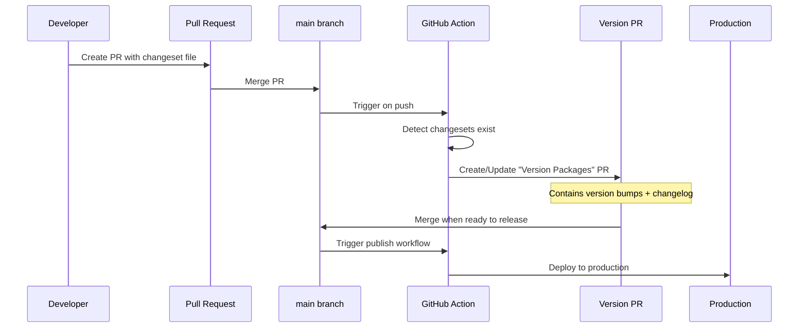
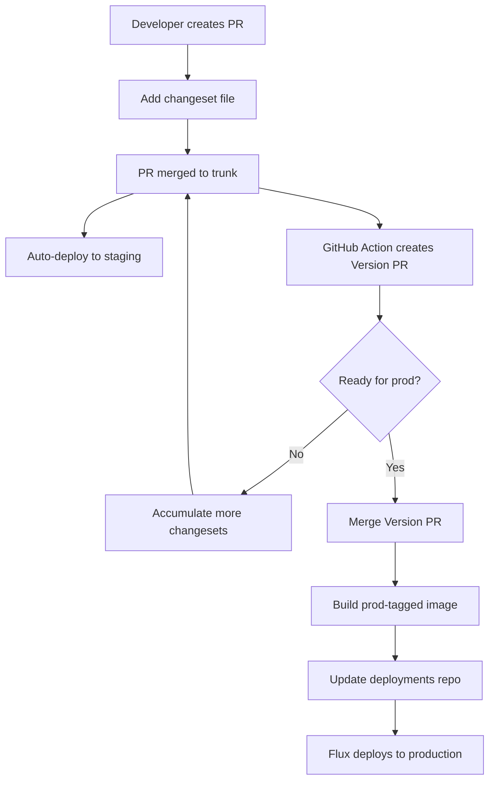
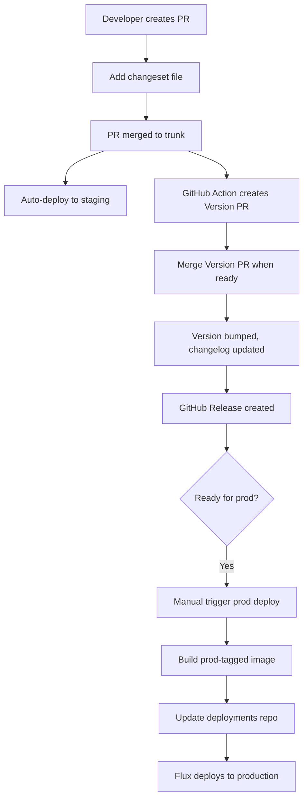
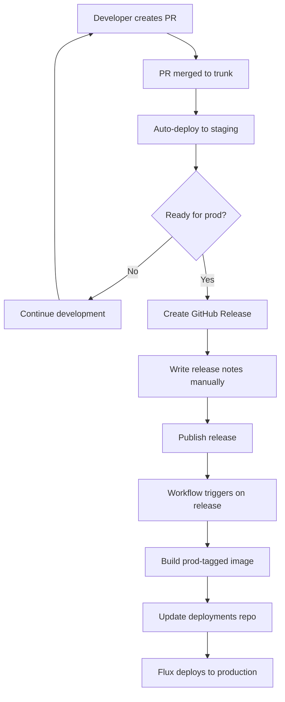
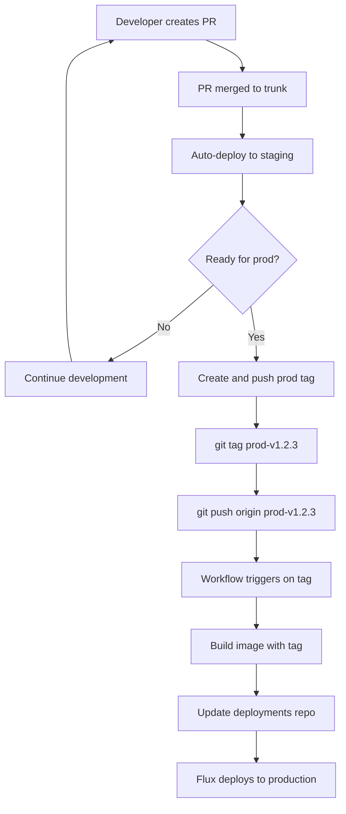
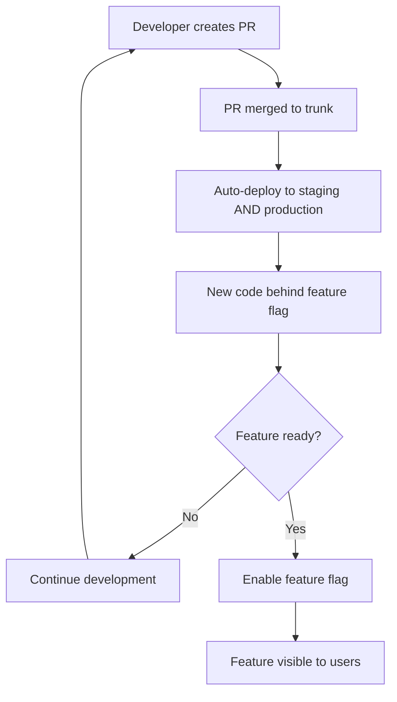
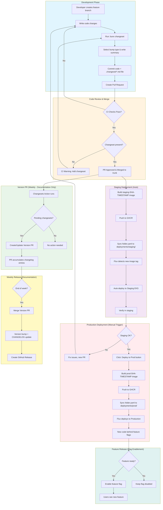
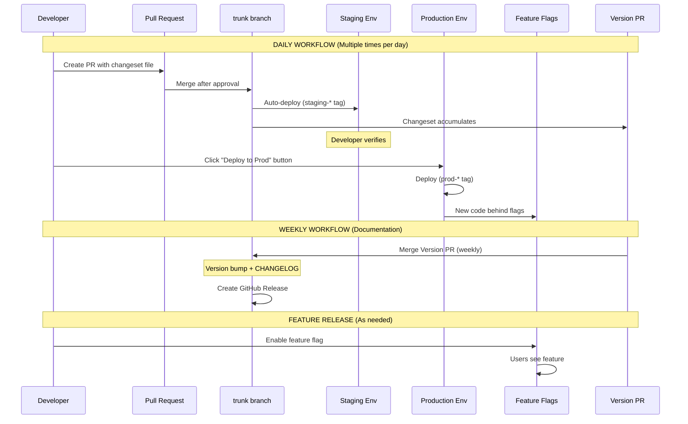
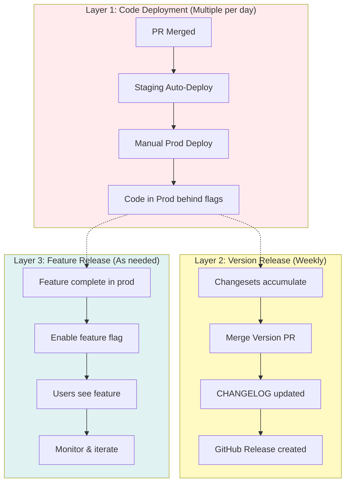
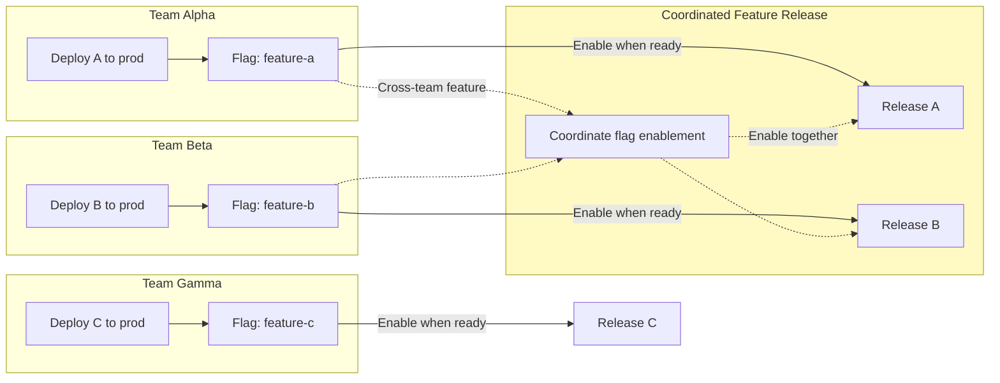

# Changesets as Production Release Gate - Research

**Date**: 2025-12-22
**Status**: Research Complete
**Updated**: 2025-12-22 (Added organizational context)

## Organizational Context

- **Scale**: 10+ microservice repositories
- **Teams**: 6 development teams, ~30 developers total (~3 per team)
- **Stakeholders**: Both internal teams and external users
- **Needs**: Guardrails for consistency + flexibility for velocity
- **Branching**: Trunk-based development across all repos
- **Infrastructure**: Flux GitOps, EKS, GitHub Actions
- **Feature Flags**: Using feature flag platform (LaunchDarkly/Statsig style)
- **Deployment vs Release**: Separated - deploy code behind flags, release by enabling flags
- **Velocity Goal**: Multiple production deploys per day
- **Flag Discipline**: Inconsistent - not all changes behind flags, need gate as safety net

## Table of Contents

- [Executive Summary](#executive-summary)
- [Technical Deep Dive](#technical-deep-dive)
- [Technology Stack / Ecosystem](#technology-stack--ecosystem)
- [Codebase Analysis](#codebase-analysis)
- [Implementation Feasibility](#implementation-feasibility)
- [Implementation Options](#implementation-options)
- [Comparison Matrix](#comparison-matrix)
- [Implementation Approach](#implementation-approach)
- [Alternatives Considered](#alternatives-considered)
- [Debates & Open Questions](#debates--open-questions)
- [Recommendations](#recommendations)
- [Additional Notes](#additional-notes)
- [Sources](#sources)

## Executive Summary

Changesets (@changesets/cli) is a versioning and changelog management tool originally designed for npm monorepos but adaptable for application deployments. For your trunk-based development workflow with Flux GitOps, changesets can provide structured versioning and changelog generation.

**Final Recommendation**: Given the organizational context (feature flags, multiple deploys per day, inconsistent flag discipline), use a **hybrid approach**:

| Concern | Mechanism | Cadence |
|---------|-----------|---------|
| **Deployment Gate** | Manual trigger button (workflow_dispatch) | Multiple per day |
| **Versioning/Changelog** | Changesets + Version PR | Weekly |

**Key Insight**: With feature flags separating deployment from release, the Version PR doesn't need to gate deployments. Instead:

1. **Keep current deployment flow** - staging auto-deploy, manual prod trigger
2. **Add changesets for documentation** - accumulate changelog entries with each PR
3. **Weekly Version PR merge** - creates GitHub Release with accumulated changelog
4. **Feature flags as safety net** - even with inconsistent usage, provides rollback capability

This approach provides:
- ✅ **High velocity** - multiple prod deploys per day via quick button click
- ✅ **Safety gate** - manual trigger prevents accidental deployments
- ✅ **Changelog discipline** - changesets enforce documentation
- ✅ **Audit trail** - weekly releases document all changes
- ✅ **Consistency** - same process across 10+ repos via template repository

## Technical Deep Dive

### Overview

Changesets is a tool that manages versioning and changelogs by having contributors declare their "intent to release" alongside code changes. Multiple intents are combined intelligently - for example, if one PR requests a minor bump and another requests a patch, only a single minor release is made.

### Core Concept: Intent to Release

The fundamental principle is that contributors declare release intent at PR time, not at release time:

```bash
# Developer runs this after making changes
npx changeset

# Interactive prompts:
# 1. Which packages to release?
# 2. What semver bump type (major/minor/patch)?
# 3. Summary of changes (becomes changelog entry)
```

This creates a markdown file in `.changeset/` directory:

```markdown
---
"@org/package-name": minor
---

Added new authentication flow for SSO users
```

### Version and Publish Workflow



### Key Commands

| Command | Purpose |
|---------|---------|
| `changeset init` | Initialize .changeset folder with config |
| `changeset` or `changeset add` | Create a new changeset interactively |
| `changeset version` | Consume changesets, bump versions, update changelogs |
| `changeset publish` | Publish packages to npm |
| `changeset status` | Check pending changesets (useful in CI) |
| `changeset pre enter <tag>` | Enter prerelease mode (alpha/beta/rc) |
| `changeset pre exit` | Exit prerelease mode |

### How Version Calculation Works

Changesets intelligently combine multiple changeset files:

- Multiple patches = single patch bump
- Patch + minor = single minor bump
- Any major = single major bump
- Dependent packages are automatically bumped

### Configuration Options

`.changeset/config.json`:

```json
{
  "$schema": "https://unpkg.com/@changesets/config@3.0.0/schema.json",
  "changelog": "@changesets/cli/changelog",
  "commit": false,
  "fixed": [],
  "linked": [],
  "access": "restricted",
  "baseBranch": "main",
  "updateInternalDependencies": "patch",
  "ignore": [],
  "privatePackages": {
    "version": true,
    "tag": true
  }
}
```

The `privatePackages` option is critical for non-npm deployments - it enables version/tag creation for packages marked `"private": true` in package.json.

## Technology Stack / Ecosystem

### Required Dependencies

```json
{
  "devDependencies": {
    "@changesets/cli": "^2.27.x"
  }
}
```

### GitHub Actions Integration

The official `changesets/action@v1` provides:

- Automatic "Version Packages" PR creation
- PR updates when new changesets merge to main
- Optional automatic publishing on merge
- GitHub Release creation

### Bun Compatibility

Changesets works with Bun. Use `bunx changeset` instead of `npx changeset`.

### Integration with Flux GitOps

Changesets doesn't directly integrate with Flux. The integration pattern would be:

1. Changesets creates version tags (e.g., `v1.2.3`)
2. Separate workflow builds Docker image with tag `prod-v1.2.3`
3. Workflow updates deployments repo manifest
4. Flux detects manifest change and deploys

## Codebase Analysis

### Current Setup

Based on the project context:

- **Runtime**: Bun with Hono/GraphQL Yoga
- **Package Manager**: Bun
- **Current Deployment**: Flux GitOps watching `folder.yaml` in deployments repo
- **Tagging Strategy**: `staging-*` for staging, `prod-*` for production
- **Branching**: Trunk-based development (single main branch)

### Integration Points

1. **package.json**: Already exists, can add `@changesets/cli` as dev dependency
2. **GitHub Actions**: Would need new workflow for changesets
3. **Deployments Repo**: Flux already watches for image tag changes

### Key Patterns

The project already has:

- Automated staging deploys on trunk push
- Manual production deployment trigger
- Clear separation between staging and prod tags

## Implementation Feasibility

### Benefits

1. **Explicit Release Intent**: Developers declare what changes are release-worthy at PR time
2. **Accumulated Changelogs**: Changes are documented as they're made, not reconstructed later
3. **Version History**: Clear semver progression tracked in package.json and git tags
4. **Release PR as Gate**: The "Version Packages" PR serves as a review point before production
5. **Audit Trail**: Git history shows exactly what went into each release

### Trade-offs & Challenges

1. **Added Ceremony**: Every releasable PR needs a changeset file
2. **Not Designed for Apps**: Changesets is npm-package-focused; app deployment requires workarounds
3. **Workflow Trigger Limitations**: GitHub Actions workflows triggered by changesets (using GITHUB_TOKEN) can't trigger other workflows - requires Personal Access Token
4. **Two-Step Release**: Developers must remember to merge Version PR after code changes
5. **Trunk-Based Tension**: Changesets' Version PR model introduces a "release branch" pattern into trunk-based workflow

### When to Use

- Multiple packages/services that need coordinated releases
- Teams wanting explicit control over what goes to production
- Strong changelog/release notes requirements
- Compliance needs requiring documented release decisions

### When to Avoid

- Single-service deployments where overhead exceeds benefit
- Teams preferring continuous deployment (every trunk push goes to prod)
- When staging testing is sufficient gate for production

## Implementation Options

### Option 1: Changesets as Full Release Gate

**Description**: Use changesets to control production deployments. Merging the "Version Packages" PR triggers production deployment.

**Workflow**:



**Pros**:
- Clear separation between staging and production
- Accumulated changelog for releases
- Version PR serves as release review point
- Semantic versioning for the application

**Cons**:
- Added ceremony for every PR
- Two-merge process (code PR + Version PR)
- Requires PAT for workflow chaining
- Changesets designed for npm, not app deployment

**Complexity**: Medium-High

**Time Estimate**: 2-3 days initial setup

**Reuses Patterns**: Partial - builds on existing GitHub Actions

**When to Use**:
- Need structured release notes for stakeholders
- Compliance requirements for release documentation
- Want to batch multiple changes into single production release

### Option 2: Changesets for Changelog Only (Manual Prod Trigger Remains)

**Description**: Use changesets to manage changelogs and version numbers, but keep the existing manual production trigger.

**Workflow**:



**Pros**:
- Get changelog/versioning benefits without changing deploy process
- Decoupled - can release versions without deploying
- Lower risk adoption path

**Cons**:
- Version number may not align with what's in production
- Still added ceremony without full benefit
- Two systems to understand (changesets + manual trigger)

**Complexity**: Medium

**Time Estimate**: 1-2 days

**Reuses Patterns**: Yes - keeps existing manual trigger

**When to Use**:
- Want changelog benefits but not ready to change deployment process
- Gradual adoption path

### Option 3: GitHub Releases as Deployment Gate (No Changesets)

**Description**: Use GitHub Releases directly as the production trigger. Creating a release (with release notes) triggers production deployment.

**Workflow**:



**GitHub Actions trigger**:
```yaml
on:
  release:
    types: [published]
```

**Pros**:
- Simple - uses native GitHub feature
- Release notes written at release time (fresher context)
- No additional dependencies
- Clear audit trail in GitHub Releases
- Can use auto-generated release notes as starting point

**Cons**:
- Manual release notes (no accumulated changelog)
- Less structured than changesets
- No enforced semver bumps

**Complexity**: Low

**Time Estimate**: 0.5-1 day

**Reuses Patterns**: Yes - minimal changes

**When to Use**:
- Simple release notes are sufficient
- Don't need accumulated changelogs
- Want minimal tooling overhead

### Option 4: Git Tags as Deployment Gate

**Description**: Pushing a `prod-*` tag triggers production deployment directly.

**Workflow**:



**Pros**:
- Extremely simple
- No additional tooling
- Git native
- Works with existing `prod-*` tagging convention

**Cons**:
- No release notes unless manually created
- Easy to create tags without documentation
- Less discoverable than GitHub Releases
- No structured changelog

**Complexity**: Very Low

**Time Estimate**: 0.5 day

**Reuses Patterns**: Yes - aligns with existing `prod-*` convention

**When to Use**:
- Minimal overhead is priority
- Team is disciplined about documentation
- Simplicity over ceremony

### Option 5: Feature Flags + Continuous Deployment

**Description**: Deploy every trunk push to production, but gate feature visibility with feature flags.

**Workflow**:



**Pros**:
- True continuous deployment
- Decouple deploy from release
- Instant rollback via flag toggle
- Progressive rollout capability (% of users)

**Cons**:
- Requires feature flag infrastructure (LaunchDarkly, Statsig, etc.)
- Added complexity in code (flag checks)
- Technical debt if flags not cleaned up
- Doesn't fit all change types (DB migrations, API changes)

**Complexity**: High (initial setup)

**Time Estimate**: 1-2 weeks for infrastructure

**Reuses Patterns**: No - new infrastructure

**When to Use**:
- High deployment frequency needed
- Want progressive rollout capability
- Team has experience with feature flags

## Comparison Matrix

| Criteria | Changesets Full | Changesets Changelog | GitHub Releases | Git Tags | Feature Flags |
|----------|-----------------|---------------------|-----------------|----------|---------------|
| **Complexity** | Medium-High | Medium | Low | Very Low | High |
| **Developer Experience** | More ceremony | Moderate | Simple | Simplest | Moderate |
| **Audit Trail** | Excellent | Good | Good | Poor | Good |
| **Changelog Quality** | Excellent | Excellent | Manual | None | N/A |
| **Rollback Ease** | Tag-based | Tag-based | Tag-based | Tag-based | Instant |
| **Flux Integration** | Indirect | Indirect | Good | Good | Direct |
| **Time to Implement** | 2-3 days | 1-2 days | 0.5-1 day | 0.5 day | 1-2 weeks |
| **Ongoing Overhead** | Higher | Moderate | Low | Lowest | Moderate |
| **Fits Trunk-Based** | Tension | Tension | Good | Excellent | Excellent |

## Implementation Approach

### For GitHub Releases (Recommended)

#### Prerequisites & Requirements

- GitHub repository with Actions enabled
- Existing workflow for building Docker images
- Access to update deployments repo

#### Getting Started

1. **Create release workflow** (`.github/workflows/release-production.yml`):

```yaml
name: Release to Production

on:
  release:
    types: [published]

jobs:
  deploy:
    runs-on: ubuntu-latest
    steps:
      - uses: actions/checkout@v4

      - name: Extract version from release
        id: version
        run: echo "version=${GITHUB_REF#refs/tags/}" >> $GITHUB_OUTPUT

      - name: Build and push Docker image
        uses: docker/build-push-action@v5
        with:
          push: true
          tags: |
            ghcr.io/${{ github.repository }}:${{ steps.version.outputs.version }}
            ghcr.io/${{ github.repository }}:prod-${{ steps.version.outputs.version }}

      - name: Update deployments repo
        uses: actions/checkout@v4
        with:
          repository: org/deployments
          token: ${{ secrets.DEPLOY_TOKEN }}
          path: deployments

      - name: Update manifest
        run: |
          cd deployments
          yq -i '.spec.template.spec.containers[0].image = "ghcr.io/${{ github.repository }}:prod-${{ steps.version.outputs.version }}"' folder.yaml
          git add folder.yaml
          git commit -m "Deploy folder-server ${{ steps.version.outputs.version }}"
          git push
```

2. **Create release with auto-generated notes**:
   - Go to Releases > "Draft a new release"
   - Create new tag (e.g., `v1.2.3`)
   - Click "Generate release notes" for auto-generated notes from PRs
   - Edit as needed and publish

#### Best Practices

1. **Tag naming**: Use semver tags (`v1.2.3`) for releases
2. **Auto-generated notes**: Let GitHub generate initial release notes from merged PRs
3. **Categorize PRs**: Use labels (`feature`, `bugfix`, `breaking`) for better auto-notes
4. **Pre-release for testing**: Use pre-release flag for release candidates

### Common Pitfalls & How to Avoid Them

1. **Workflow not triggering**: Ensure workflow listens to `release.published` not `release.created`
2. **Deployments repo access**: Use a PAT or GitHub App token with repo access
3. **Tag vs Release confusion**: Tags are git-native; Releases are GitHub UI layer on top

## Alternatives Considered

### Alternative 1: release-please (Google)

- **Description**: Automated release PRs based on conventional commits
- **Why not chosen**: Requires conventional commit format; less flexible than changesets
- **When it might be better**: If team already uses conventional commits strictly

### Alternative 2: semantic-release

- **Description**: Fully automated versioning from commit messages
- **Why not chosen**: Too automated - removes human gate for production
- **When it might be better**: For library publishing, not app deployment

### Alternative 3: Flux Image Automation

- **Description**: Let Flux automatically update image tags in deployments repo
- **Why not chosen**: Removes human approval step; better for staging than prod
- **When it might be better**: If you want true continuous deployment

## Debates & Open Questions

1. **Changesets for non-npm apps**: The tool works but feels like using a hammer for a screw. The `privatePackages` config is a workaround, not a first-class feature.

2. **Trunk-based + Release PRs**: There's inherent tension between "everything merges to trunk" and "accumulate changes in a Release PR". Some teams resolve this by treating the Release PR as infrastructure, not a code branch.

3. **Version numbers for apps**: Does a GraphQL server need semver? Arguments both ways:
   - Yes: Helps track what's deployed where, correlates with changelogs
   - No: The git SHA is sufficient; versions add ceremony without value

4. **Rollback strategy**: All options except feature flags rely on redeploying a previous image. Consider:
   - Is your image registry retaining old tags?
   - How quickly can you redeploy?
   - Are database migrations reversible?

## Recommendations

### Preferred Approach: Lightweight Gate + Changesets for Documentation

**Should This Be Implemented?**: Yes

**Rationale** (Updated for Feature Flags + High Velocity):

Given the context of feature flags, multiple deploys per day, and inconsistent flag discipline:

1. **Deployment ≠ Release**: Feature flags separate these concerns
2. **Version PR as gate is too heavy**: For multiple deploys/day, merging a PR each time adds friction
3. **Still need a gate**: Inconsistent flag usage means can't fully trust CD
4. **Changesets add value**: Documentation and versioning benefits remain

**The Hybrid Model**:

| Concern | Mechanism | Cadence | Owner |
|---------|-----------|---------|-------|
| Deployment Gate | `workflow_dispatch` button | Multiple per day | Developer deploying |
| Staging Verification | Manual testing | Per deployment | Developer/QA |
| Versioning | Changesets + Version PR | Weekly | Team lead |
| Release Notes | Auto-generated from changesets | Weekly | Automated |
| Feature Release | Flag enablement | As needed | Product/Engineering |

**Why This Over Version PR as Gate**:

| Factor | Version PR Gate | Lightweight Gate + Changesets |
|--------|-----------------|------------------------------|
| Deploys per day | 1-2 (PR merge friction) | Multiple (button click) |
| Changelog quality | Excellent | Excellent |
| Safety | Gate before deploy | Gate + feature flags |
| Developer friction | Higher (PR merge) | Lower (button click) |
| Audit trail | Excellent | Excellent |
| Fits feature flags | Redundant safety | Complementary |

**Implementation Architecture**:

```
┌─────────────────────────────────────────────────────────────┐
│                 Template Repository                          │
├─────────────────────────────────────────────────────────────┤
│  • .changeset/config.json (standardized)                    │
│  • .github/workflows/ (reusable workflows)                  │
│  • PR template (changeset reminder)                         │
│  • Release process documentation                            │
└─────────────────────────────────────────────────────────────┘
                              │
                              ▼ (inherit/sync)
┌─────────────────────────────────────────────────────────────┐
│              Per-Service Repository (x10+)                   │
├─────────────────────────────────────────────────────────────┤
│  • Changesets for versioning/changelog                      │
│  • Auto-deploy to staging on trunk push                     │
│  • Version PR as production gate                            │
│  • Merge Version PR → prod deploy triggered                 │
└─────────────────────────────────────────────────────────────┘
```

**Complete CI/CD Workflow (Hybrid Model)**:



**Daily vs Weekly Workflows**:



**Three-Layer Release Model**:



**Multi-Team Coordination**:



**Key Policy Decisions**:

1. **Changeset Requirement**:
   - Required for all PRs that affect runtime behavior
   - `bunx changeset add --empty` for non-release PRs (docs, deps, CI)
   - CI check warns (not blocks) if changeset missing

2. **Production Deployment**:
   - Manual trigger via `workflow_dispatch` button
   - Developer responsible for staging verification before clicking
   - Multiple deploys per day allowed
   - New code should be behind feature flags when possible

3. **Version PR Merge Cadence**:
   - Weekly merge (e.g., Friday afternoon)
   - Creates GitHub Release with accumulated changelog
   - Does NOT trigger deployment (documentation only)

4. **Feature Flag Discipline** (aspirational):
   - New features behind flags
   - Flags removed within 2 weeks of full rollout
   - Breaking changes require explicit approval

5. **Non-Flag-able Changes** (DB migrations, breaking APIs):
   - Require explicit approval in PR description
   - Deploy during low-traffic window
   - Must have changeset documenting the change

**Potential Challenges**:

1. **Initial adoption friction**: Teams need to learn changeset workflow
   - *Mitigation*: Pilot with 2-3 willing teams first, gather feedback

2. **Changeset fatigue**: Every PR needs a changeset
   - *Mitigation*: Provide `--empty` option, warn but don't block

3. **Version PR neglect**: Teams forget to merge weekly
   - *Mitigation*: Weekly Slack reminder bot, calendar event

4. **Feature flag discipline**: Inconsistent flag usage continues
   - *Mitigation*: Document aspirational standards, improve over time

5. **Non-flag-able changes**: DB migrations still risky
   - *Mitigation*: Explicit approval process, deploy during low-traffic

**Success Criteria**:

- All 10+ repos using identical changeset configuration
- Weekly GitHub Releases with accumulated changelog
- Developers can deploy to prod multiple times per day
- New developer can understand release process within first week
- Release history queryable for compliance audits
- Cross-team visibility via GitHub Releases
- Feature flag usage improving over time (track metrics)

### Implementation Phases

#### Phase 1: Template Repository (Week 1)
- Create template repo with standardized configurations
- Define reusable GitHub Actions workflows
- Document release process and policies
- Create PR templates with changeset reminders

#### Phase 2: Pilot Implementation (Weeks 2-3)
- Roll out to 2-3 willing teams/services
- Gather feedback on workflow friction
- Refine configurations based on real usage
- Document edge cases and solutions

#### Phase 3: Organization-wide Rollout (Weeks 4-6)
- Migrate remaining repos using template
- Training sessions for all teams
- Establish support channels for questions
- Monitor adoption and address issues

#### Phase 4: Optimization (Ongoing)
- Automate template sync across repos
- Build release dashboard for cross-team visibility
- Refine policies based on team feedback
- Consider tooling improvements (bots, notifications)

### Alternative Considered: Monorepo

For 10+ services, monorepo is a valid alternative:

| Factor | Multi-repo + Changesets | Monorepo + Changesets |
|--------|------------------------|----------------------|
| Team autonomy | ✅ High | Medium |
| Code sharing | Harder | ✅ Easy |
| Tooling consistency | Template-based | ✅ Centralized |
| CI/CD complexity | Simpler per-repo | Needs optimization |
| Coordinated releases | Manual | ✅ Built-in |
| Migration effort | Lower | Higher |

**Recommendation**: Start with multi-repo + changesets. Consider monorepo migration later if code sharing becomes a significant pain point.

## Additional Notes

### Rollback Strategy for All Options

With Flux GitOps, rollback is straightforward:

1. **Identify previous working release** from GitHub Releases or tags
2. **Update deployments repo** to reference previous image tag
3. **Flux detects change** and rolls back deployment

For faster rollback without git changes:
```bash
kubectl rollout undo deployment/folder-server -n production
```

### Testing Considerations

For any release gate approach:

1. **Staging must be gated on tests passing**: CI should block staging deploy if tests fail
2. **Production should require staging verification**: Manual verification in staging before prod release
3. **Consider smoke tests post-deploy**: Health checks or basic API tests after production deploy

### Migration Path

If you later decide changesets would be valuable:

1. Install `@changesets/cli`
2. Run `bunx changeset init`
3. Configure `privatePackages: { version: true, tag: true }`
4. Add changeset requirement to PR process
5. Create workflow using `changesets/action`

The GitHub Releases approach doesn't preclude future adoption of changesets.

## Sources

1. [Changesets GitHub Repository](https://github.com/changesets/changesets) - Official documentation and examples
2. [Changesets Action](https://github.com/changesets/action) - GitHub Action for automating releases
3. [Using Changesets with pnpm](https://pnpm.io/next/using-changesets) - Workflow examples
4. [Changesets Documentation](https://changesets-docs.vercel.app/) - Official docs site
5. [Automating Releases of @apollo/client](https://aless.co/automatic-release-management) - Real-world production example
6. [NPM Release Automation Comparison](https://oleksiipopov.com/blog/npm-release-automation/) - Semantic Release vs Release Please vs Changesets
7. [Changesets vs Semantic Release](https://brianschiller.com/blog/2023/09/18/changesets-vs-semantic-release/) - Feature comparison
8. [Flux GitOps Image Updates](https://fluxcd.io/flux/guides/image-update/) - Flux automation documentation
9. [Flux CD Rollouts and Rollbacks](https://www.aviator.co/blog/how-to-manage-rollouts-and-rollbacks-using-flux-cd/) - Rollback strategies
10. [Feature Flags Best Practices](https://docs.statsig.com/feature-flags/best-practices) - Feature flag patterns
11. [Martin Fowler - Feature Toggles](https://martinfowler.com/articles/feature-toggles.html) - Comprehensive feature flag patterns
12. [GitHub Continuous Deployment](https://docs.github.com/en/actions/get-started/continuous-deployment) - GitHub Actions deployment docs
13. [Changesets Versioning Apps](https://github.com/changesets/changesets/blob/main/docs/versioning-apps.md) - Non-npm app versioning
14. [Changesets Docker Publishing Discussion](https://github.com/changesets/changesets/discussions/1230) - Docker image deployment patterns
