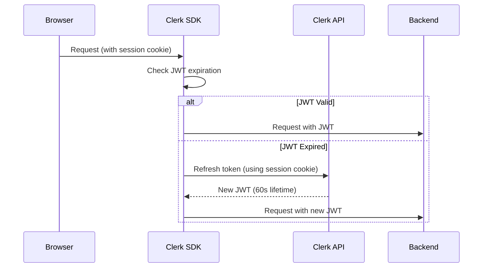
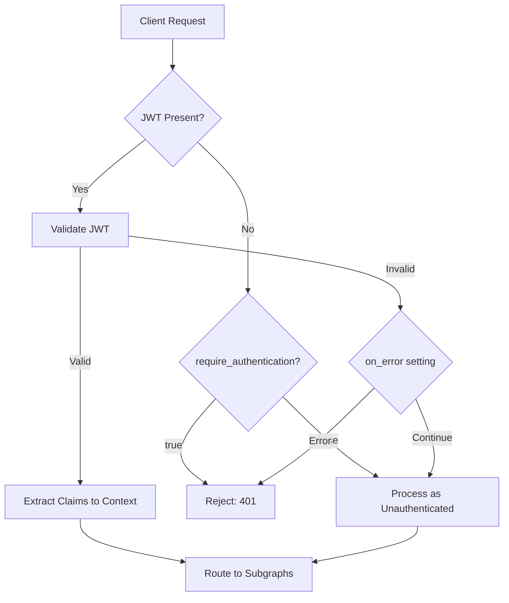
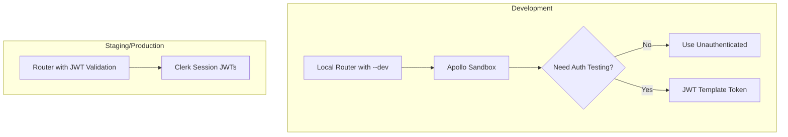

# Clerk JWT + GraphQL GUI Access Alternatives - Research

**Date**: 2025-12-13
**Status**: Research Complete

## Table of Contents

- [Executive Summary](#executive-summary)
- [Technical Deep Dive](#technical-deep-dive)
- [Implementation Feasibility](#implementation-feasibility)
- [Implementation Options](#implementation-options)
- [Comparison Matrix](#comparison-matrix)
- [Implementation Approach](#implementation-approach)
- [Alternatives Considered](#alternatives-considered)
- [Debates & Open Questions](#debates--open-questions)
- [Recommendations](#recommendations)
- [Additional Notes](#additional-notes)
- [Sources](#sources)

## Executive Summary

Clerk's session JWTs have a fixed 60-second lifetime by design for security. For GraphQL GUI access during development, the recommended solution is to use **Clerk JWT Templates** with extended lifetimes (up to 10 years for development). Apollo Studio Explorer's **preflight scripts** can automate token refresh for interactive use. For machine-to-machine scenarios, **Clerk M2M tokens** offer configurable or unlimited lifetimes. Apollo Router's `--dev` mode combined with environment-specific configuration provides the most practical path for local development.

## Technical Deep Dive

### Why Clerk JWTs Are 60 Seconds

Clerk's session tokens expire after 60 seconds by design. This short lifetime provides a security guarantee: authentication state changes (user revocation, permission updates) take effect within 60 seconds maximum.



The SDK handles token refresh automatically in browser contexts as a background task, but this doesn't help with standalone GraphQL GUI tools.

### Clerk JWT Templates

Clerk offers **JWT Templates** that allow creating custom tokens with configurable properties:

- **Token Lifetime**: Configurable (default 60 seconds, maximum 315,360,000 seconds / ~10 years)
- **Clock Skew**: Configurable (default 5 seconds)
- **Custom Claims**: Static or dynamic values using shortcodes

JWT Templates are designed for third-party integrations (Hasura, Supabase, etc.) and API testing scenarios where automatic browser-based refresh isn't available.

### Clerk M2M Tokens

Clerk's Machine-to-Machine (M2M) tokens (GA as of October 2025) are a separate authentication system:

```typescript
// Creating an M2M token
const token = await clerkClient.m2m.createToken({
  secondsUntilExpiration: null, // null = never expires (default)
  claims: { purpose: "graphql-development" }
});

// Verifying an M2M token
const result = await clerkClient.m2m.verifyToken({ token });
```

Key differences from session JWTs:
- **Opaque tokens** by default (not JWTs), requiring API call for verification
- **Configurable expiration**: From seconds to never-expiring
- **Machine identity**: Authenticates machines, not users
- **Revocable**: Can be instantly revoked via Dashboard or API

### Apollo Router Authentication Flow



Apollo Router's JWT validation allows flexible authentication enforcement:
- Requests without JWT proceed by default (unless `require_authentication: true`)
- Invalid JWTs can be rejected or allowed through as unauthenticated
- 60-second grace period for expired tokens (clock skew tolerance)

## Implementation Feasibility

### Benefits of Each Approach

| Approach | Primary Benefit |
|----------|-----------------|
| JWT Templates (Long-lived) | Simple, direct solution for API testing tools |
| M2M Tokens | Production-grade machine authentication |
| Apollo Router --dev mode | Zero configuration for local development |
| Preflight Scripts | Automated refresh in Apollo Studio |
| API Key bypass | Simplest implementation for internal tools |

### Trade-offs & Challenges

| Approach | Challenge |
|----------|-----------|
| JWT Templates (Long-lived) | Security risk if tokens leak; no automatic revocation |
| M2M Tokens | Requires verification endpoint; authenticates machines not users |
| Apollo Router --dev mode | Must not reach production; requires separate configs |
| Preflight Scripts | Apollo Studio specific; requires script maintenance |
| API Key bypass | Custom implementation needed; parallel auth path |

## Implementation Options

### Option 1: Clerk JWT Template with Extended Lifetime

**Description**: Create a dedicated JWT template in Clerk Dashboard for development/testing with a long lifetime.

**Implementation**:

1. Navigate to Clerk Dashboard → JWT Templates → New Template
2. Configure:
   - Name: `graphql-development`
   - Lifetime: `86400` (24 hours) or `2592000` (30 days)
   - Claims: Match your production JWT structure

3. Generate token in your app:
```typescript
import { auth } from '@clerk/nextjs/server';

export async function getDevToken() {
  const { getToken } = await auth();
  return getToken({ template: 'graphql-development' });
}
```

4. Use in GraphQL GUI:
```
Authorization: Bearer <token>
```

**Pros**:
- Works with any GraphQL GUI (Apollo Studio, GraphiQL, Insomnia, Postman)
- Token contains same claims structure as production
- No backend changes required

**Cons**:
- Tokens must be manually regenerated when expired
- Security risk if tokens are shared or leaked
- Requires user session to generate (not truly headless)

**Complexity**: Low
**Time Estimate**: 30 minutes
**Security Risk**: Medium (mitigated by development-only use)

---

### Option 2: Clerk M2M Tokens for Development

**Description**: Use Clerk's M2M token system to create long-lived or never-expiring tokens for development tools.

**Implementation**:

1. Create a Machine in Clerk Dashboard for development purposes
2. Generate M2M token:
```typescript
// server-side script or API route
import { createClerkClient } from '@clerk/backend';

const clerkClient = createClerkClient({
  secretKey: process.env.CLERK_SECRET_KEY
});

const token = await clerkClient.m2m.createToken({
  machineSecretKey: process.env.DEV_MACHINE_SECRET,
  secondsUntilExpiration: null, // Never expires
  claims: {
    sub: 'dev-user-id',
    org_id: 'dev-org-id',
    // Add claims your GraphQL needs
  }
});
```

3. Configure your GraphQL backend to verify M2M tokens:
```typescript
// In your auth middleware/coprocessor
const result = await clerkClient.m2m.verifyToken({ token });
if (result.verified) {
  // Extract claims and proceed
}
```

**Pros**:
- Never-expiring tokens possible
- Instant revocation via Dashboard
- Production-grade security model
- Works for CI/CD pipelines and automated testing

**Cons**:
- Requires backend changes to verify M2M tokens
- Opaque tokens need API call for each verification (unless using JWT mode)
- Authenticates "machine" identity, not user identity

**Complexity**: Medium
**Time Estimate**: 2-4 hours

---

### Option 3: Apollo Router Development Mode + Environment Config

**Description**: Use Apollo Router's `--dev` flag for local development with separate configuration files for different environments.

**Implementation**:

1. Create environment-specific router configs:

```yaml
# router.dev.yaml
sandbox:
  enabled: true
homepage:
  enabled: false
introspection: true
include_subgraph_errors:
  all: true

# Disable JWT requirement for dev
authentication:
  router:
    jwt:
      jwks:
        - url: ${env.CLERK_JWKS_URL}
# Note: No require_authentication in dev
```

```yaml
# router.prod.yaml
sandbox:
  enabled: false
introspection: false
include_subgraph_errors:
  all: false

authentication:
  router:
    jwt:
      jwks:
        - url: ${env.CLERK_JWKS_URL}
authorization:
  require_authentication: true
```

2. Run router with appropriate config:
```bash
# Development
./router --dev --config router.dev.yaml

# Production
./router --config router.prod.yaml
```

3. Access Apollo Sandbox at `http://localhost:4000` without authentication

**Pros**:
- Zero token management for local development
- Built-in Apollo Sandbox explorer
- Clear separation between dev and prod security
- Hot-reload enabled in dev mode

**Cons**:
- Must ensure dev config never reaches production
- Requires access control on router configs
- Doesn't help with testing authenticated user scenarios

**Complexity**: Low
**Time Estimate**: 1 hour

---

### Option 4: Apollo Studio Preflight Scripts

**Description**: Use Apollo Studio Explorer's preflight scripts to automatically refresh tokens before each operation.

**Implementation**:

1. Create an API endpoint that generates fresh Clerk tokens:
```typescript
// pages/api/dev-token.ts or app/api/dev-token/route.ts
import { auth } from '@clerk/nextjs/server';

export async function GET() {
  const { getToken } = await auth();
  const token = await getToken({ template: 'graphql-development' });

  return Response.json({
    access_token: token,
    expires_at: Date.now() + 86400000 // 24 hours
  });
}
```

2. Configure preflight script in Apollo Studio Explorer Settings:
```javascript
// Check if token is expired or missing
const expiresAt = explorer.environment.get('token_expires_at');
if (!expiresAt || Date.now() > expiresAt) {
  const response = await explorer.fetch(
    'http://localhost:3000/api/dev-token',
    {
      method: 'GET',
      credentials: 'include' // Include Clerk session cookie
    }
  );

  const { access_token, expires_at } = await response.json();
  explorer.environment.set('token', access_token);
  explorer.environment.set('token_expires_at', expires_at);
}
```

3. Set Authorization header using environment variable:
```
Authorization: Bearer {{token}}
```

**Pros**:
- Automatic token refresh
- Works with real user sessions
- No manual token copying
- Supports full authentication testing

**Cons**:
- Only works with Apollo Studio Explorer
- Requires local app running (for session cookie)
- CORS configuration needed
- Script maintenance required

**Complexity**: Medium
**Time Estimate**: 2-3 hours

---

### Option 5: Custom API Key Bypass for Development

**Description**: Implement a parallel authentication path that accepts API keys for development environments only.

**Implementation**:

1. Define development API keys in environment:
```bash
# .env.local
DEV_API_KEYS=dev-key-alice,dev-key-bob
DEV_USER_MAPPING='{"dev-key-alice":"user_abc123","dev-key-bob":"user_xyz789"}'
```

2. Create authentication coprocessor or middleware:
```typescript
// coprocessor/auth.ts
export async function authenticate(request: Request) {
  const authHeader = request.headers.get('authorization');

  // Check for API key first (development only)
  if (process.env.NODE_ENV === 'development' && authHeader?.startsWith('ApiKey ')) {
    const apiKey = authHeader.slice(7);
    const validKeys = process.env.DEV_API_KEYS?.split(',') || [];
    const userMapping = JSON.parse(process.env.DEV_USER_MAPPING || '{}');

    if (validKeys.includes(apiKey)) {
      return {
        authenticated: true,
        userId: userMapping[apiKey],
        source: 'api-key'
      };
    }
  }

  // Fall back to JWT validation
  if (authHeader?.startsWith('Bearer ')) {
    // Standard Clerk JWT validation
  }

  return { authenticated: false };
}
```

3. Configure Apollo Router to use coprocessor:
```yaml
# router.yaml
coprocessor:
  url: http://localhost:3001/auth
  router:
    request:
      headers: true
```

**Pros**:
- Simple to use (static key, no expiration)
- Can map to specific test users
- Works with any HTTP client

**Cons**:
- Custom implementation and maintenance
- Risk of API key path reaching production
- Parallel auth logic increases attack surface

**Complexity**: Medium-High
**Time Estimate**: 4-6 hours

---

### Option 6: Disable Authentication for Local Router

**Description**: Run the Apollo Router locally without any authentication requirements.

**Implementation**:

```yaml
# router.local.yaml
sandbox:
  enabled: true
introspection: true

# Simply don't configure authentication
# No JWT validation, no authorization
```

```bash
./router --dev --config router.local.yaml --supergraph ./supergraph.graphql
```

**Pros**:
- Simplest possible approach
- Zero configuration
- Immediate access to GraphQL GUI

**Cons**:
- No authentication testing possible
- Significantly different from production behavior
- May mask auth-related bugs
- Subgraphs must also allow unauthenticated requests

**Complexity**: Very Low
**Time Estimate**: 15 minutes

## Comparison Matrix

| Criteria | JWT Template | M2M Tokens | Router --dev | Preflight Scripts | API Key Bypass | No Auth |
|----------|--------------|------------|--------------|-------------------|----------------|---------|
| **Complexity** | Low | Medium | Low | Medium | Medium-High | Very Low |
| **Security Risk** | Medium | Low | Low | Low | Medium | High |
| **Token Refresh** | Manual | None needed | N/A | Automatic | None needed | N/A |
| **Works Offline** | Yes | No* | Yes | No | Yes | Yes |
| **User Identity** | Yes | No | No | Yes | Configurable | No |
| **Any GUI Tool** | Yes | Yes | Apollo only | Apollo only | Yes | Yes |
| **Production Safe** | If scoped | Yes | No | Yes | No | No |
| **Setup Time** | 30 min | 2-4 hrs | 1 hr | 2-3 hrs | 4-6 hrs | 15 min |

*M2M token verification requires network call unless using JWT mode

## Implementation Approach

### Recommended Setup

For this project (Next.js + Clerk + Apollo Federation), a layered approach provides the best developer experience:



### Phase 1: Quick Local Development (Day 1)

1. Create `router.dev.yaml`:
```yaml
sandbox:
  enabled: true
homepage:
  enabled: false
introspection: true
include_subgraph_errors:
  all: true
```

2. Add npm script:
```json
{
  "scripts": {
    "router:dev": "router --dev --config router.dev.yaml"
  }
}
```

3. Access Apollo Sandbox at `http://localhost:4000`

### Phase 2: Authenticated Testing (Day 2)

1. Create JWT Template in Clerk Dashboard:
   - Name: `graphql-dev`
   - Lifetime: `86400` (24 hours)
   - Claims: `{ "userId": "{{user.id}}", "orgId": "{{org.id}}" }`

2. Create token generation utility:
```typescript
// scripts/get-dev-token.ts
import { createClerkClient } from '@clerk/backend';

const clerk = createClerkClient({
  secretKey: process.env.CLERK_SECRET_KEY!
});

async function main() {
  // This requires a valid session - run from authenticated context
  const { getToken } = await auth();
  const token = await getToken({ template: 'graphql-dev' });
  console.log('\nAuthorization: Bearer', token);
  console.log('\nExpires in 24 hours');
}
```

3. Document the workflow in `CLAUDE.md` or `CONTRIBUTING.md`

### Phase 3: CI/CD Integration (Optional)

For automated testing pipelines, implement M2M tokens:

1. Create a "CI Test Machine" in Clerk Dashboard
2. Store machine secret in CI environment
3. Generate tokens in test setup:
```typescript
// test/setup.ts
beforeAll(async () => {
  const token = await clerkClient.m2m.createToken({
    secondsUntilExpiration: 3600, // 1 hour
    claims: { role: 'test-admin' }
  });
  process.env.TEST_AUTH_TOKEN = token;
});
```

## Alternatives Considered

### Proxy Server with Token Refresh

A local proxy server could intercept requests, refresh expired tokens, and forward requests with valid tokens. While technically feasible, this adds significant complexity for minimal benefit over JWT Templates.

### Clerk Development Mode / Test Mode

Clerk's test mode (using `pk_test_` keys) doesn't change JWT behavior - tokens still expire in 60 seconds. Test mode is for creating test users, not bypassing authentication.

### Browser Extension for Token Injection

A browser extension could automatically inject fresh tokens into requests. This would be complex to build and maintain, and wouldn't work with non-browser clients.

## Debates & Open Questions

### Should M2M Tokens Support JWT Format?

Clerk has announced plans to support JWT format for M2M tokens, which would eliminate the verification API call. This could become the best solution once available, combining long/unlimited lifetimes with standard JWT verification.

### Environment Variable vs Config File for Router Auth

Apollo Router supports both approaches. Environment variables are more secure for secrets but config files are easier to version control. The recommended pattern is to use environment variable substitution within config files.

### Testing Auth vs Testing Business Logic

For most development work, testing without authentication is acceptable since auth is a cross-cutting concern. However, authorization testing (user roles, permissions) requires authenticated requests. Consider which scenarios actually need authentication.

## Recommendations

### Preferred Approach: JWT Template + Router --dev

**Should This Be Implemented?**: Yes

**Rationale**:
1. JWT Templates provide the lowest-friction authenticated access
2. Router --dev mode enables immediate unauthenticated exploration
3. Both solutions require minimal implementation effort
4. Clear separation keeps production security intact

**Implementation Priority**:

1. **Immediate**: Configure `router.dev.yaml` for local development
2. **This Week**: Create `graphql-dev` JWT Template in Clerk Dashboard
3. **As Needed**: Set up M2M tokens for CI/CD pipelines

**Success Criteria**:
- Developers can access Apollo Sandbox without authentication barriers
- Authenticated requests work with 24-hour token lifetime
- Production configuration remains secure with 60-second JWT validation

**Potential Challenges**:

1. **Challenge**: JWT Template tokens still expire (even if after 24 hours)
   - **Mitigation**: Document token refresh process; consider preflight scripts for heavy users

2. **Challenge**: Developers might use production Clerk keys locally
   - **Mitigation**: Use separate Clerk development instance; add environment checks

## Additional Notes

### Clerk Pricing Consideration

M2M tokens are part of Clerk's paid features. Token creation is charged, but verification may have different pricing depending on token type (opaque vs JWT). Verify current pricing before implementing M2M solution at scale.

### Apollo Router Versions

The `--dev` flag and JWT authentication features require Apollo Router v2.0+. Ensure your router version supports these features before implementing.

### Security Audit Trail

For compliance purposes, consider logging which authentication method was used (JWT vs M2M vs API key) in request metadata. This helps identify if development-only auth methods accidentally reach production.

## Sources

1. [Clerk Session Tokens Documentation](https://clerk.com/docs/guides/sessions/session-tokens) - Session token lifetime and refresh behavior
2. [Clerk JWT Templates Documentation](https://clerk.com/docs/guides/sessions/jwt-templates) - Creating custom JWT templates with configurable lifetimes
3. [Clerk Testing with Postman or Insomnia](https://clerk.com/docs/testing/postman-or-insomnia) - Long-lived tokens for API testing
4. [Clerk M2M Tokens GA Announcement](https://clerk.com/changelog/2025-10-14-m2m-ga) - M2M tokens general availability
5. [Clerk createToken() Reference](https://clerk.com/docs/reference/backend/m2m-tokens/create-token) - M2M token creation parameters
6. [Apollo Router JWT Authentication](https://www.apollographql.com/docs/router/configuration/authn-jwt) - Router JWT configuration options
7. [Apollo Router Authorization](https://www.apollographql.com/docs/router/configuration/authorization) - require_authentication setting
8. [Apollo Router Configuration Overview](https://www.apollographql.com/docs/graphos/reference/router/configuration) - Environment-specific configuration
9. [Apollo Studio Preflight Scripts Blog](https://www.apollographql.com/blog/announcement/tooling/automatically-authenticate-with-preflight-scripts-in-apollo-studio-explorer/) - Automatic token refresh in Explorer
10. [Apollo Studio Connecting and Authenticating](https://www.apollographql.com/docs/graphos/explorer/connecting-authenticating/) - Explorer authentication options
11. [API Keys vs JWT Authentication](https://zuplo.com/blog/jwt-vs-api-key-authentication) - Security comparison for M2M auth
12. [Clerk M2M Example Repository](https://github.com/clerk/m2m-example) - Implementation examples
