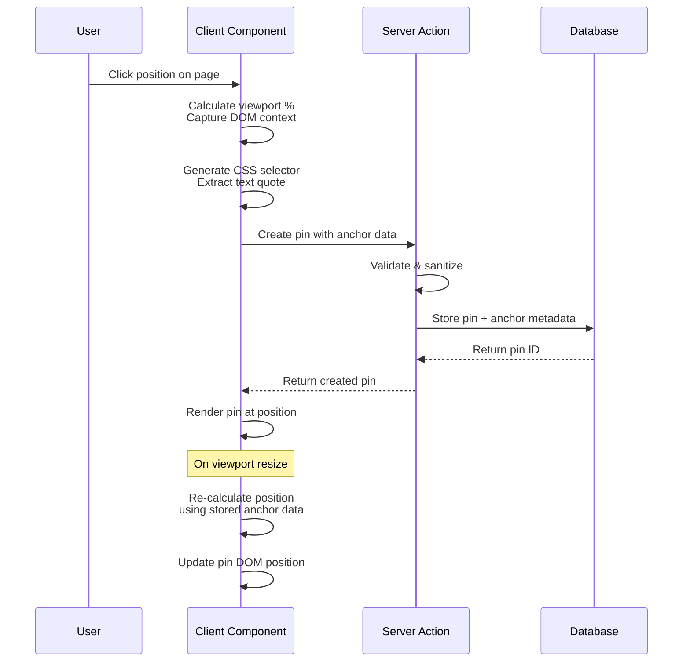
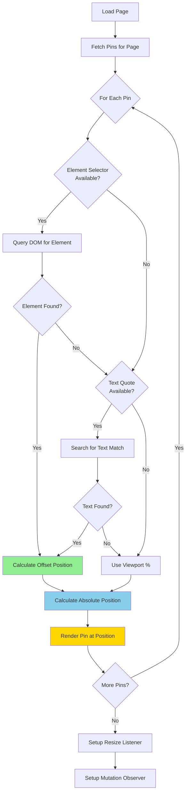
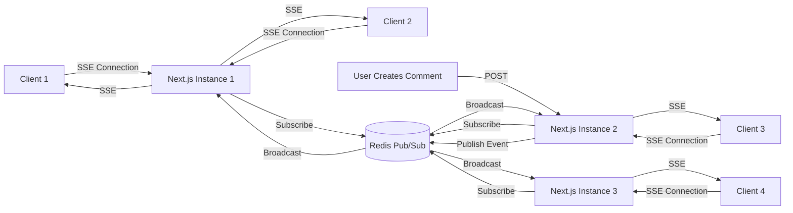
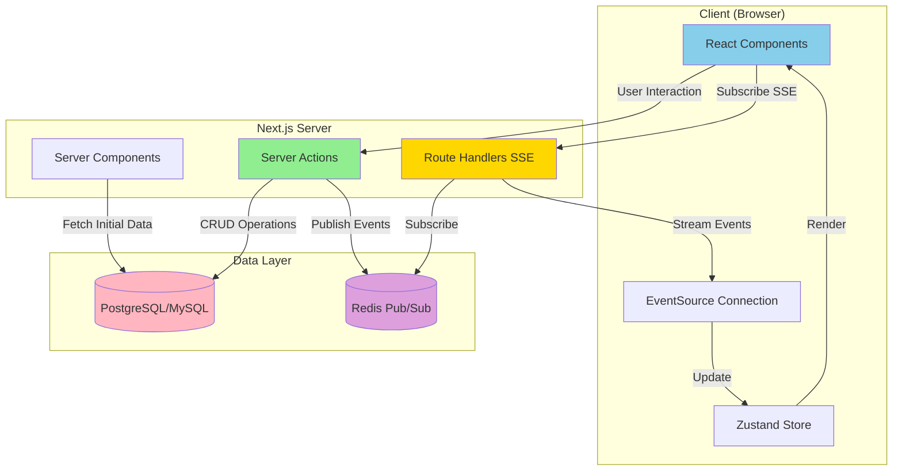
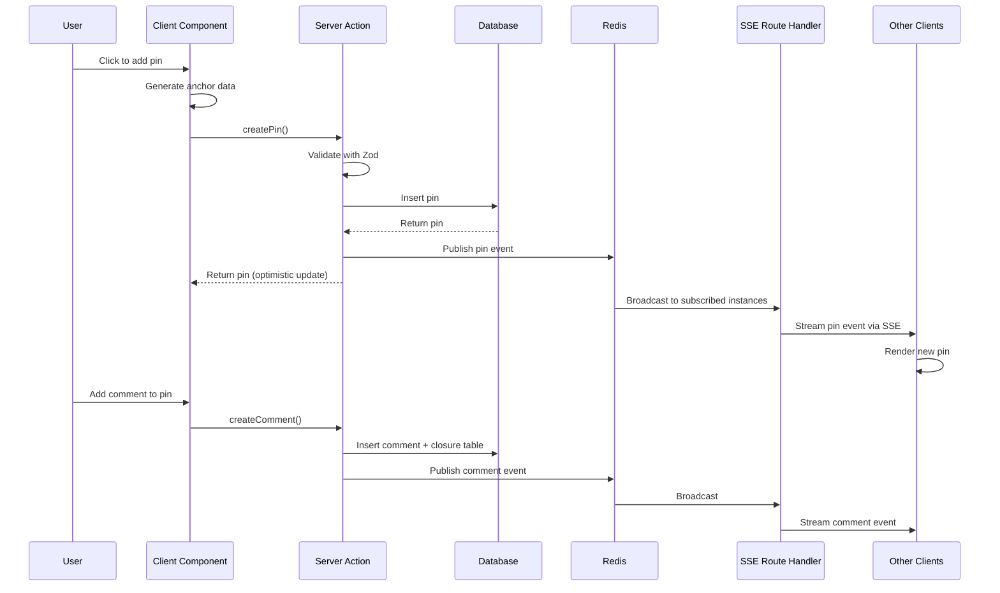

# Collaborative Commenting System with Visual Pin Placement - Research

**Date**: 2025-11-01
**Status**: Research Complete

## Executive Summary

Building a self-hosted collaborative commenting system with visual pin placement for Next.js 16 is technically feasible and well-supported by modern web technologies. The recommended approach combines **Server-Sent Events (SSE)** for real-time updates, **CSS-based positioning with DOM anchoring** for pin placement, and a **Closure Table database schema** for efficient comment threading. This architecture leverages Next.js 16's native streaming capabilities, integrates seamlessly with Clerk authentication, and provides full control over the implementation without third-party services.

**Key Architectural Decisions:**
- **Real-Time Communication**: SSE via Next.js Route Handlers (not WebSockets) for unidirectional server-to-client updates
- **Pin Positioning**: Hybrid approach using percentage-based viewport coordinates + CSS selectors for element anchoring
- **Database Schema**: Closure Table pattern for comment hierarchy with dedicated pin metadata table
- **Security**: DOMPurify for XSS prevention, Clerk auth in Server Actions, strict input validation
- **Performance**: Virtualization for large pin counts, React.memo for optimization, optimistic updates with useOptimistic

---

## Table of Contents

1. [Executive Summary](#executive-summary)
2. [Technical Deep Dive](#technical-deep-dive)
   - [Overview](#overview)
   - [Pin Positioning Architecture](#pin-positioning-architecture)
     - [Challenge: Maintaining Position Across Changes](#challenge-maintaining-position-across-changes)
     - [Solution 1: Viewport Percentage Coordinates](#solution-1-viewport-percentage-coordinates)
     - [Solution 2: CSS Selector + Text Range Anchoring](#solution-2-css-selector--text-range-anchoring)
     - [Solution 3: Modern CSS Anchor Positioning API](#solution-3-modern-css-anchor-positioning-api)
     - [Recommended Hybrid Approach](#recommended-hybrid-approach)
   - [Alternative Pin Positioning Strategies (Deep Analysis)](#alternative-pin-positioning-strategies-deep-analysis)
     - [Context: Constrained vs. Unconstrained Commenting](#context-constrained-vs-unconstrained-commenting)
     - [Strategy 1: Data-Attribute Based Anchoring](#strategy-1-data-attribute-based-anchoring--recommended-for-forms)
     - [Strategy 2: Form Field Name Anchoring](#strategy-2-form-field-name-anchoring)
     - [Strategy 3: React Component Instance Anchoring](#strategy-3-react-component-instance-anchoring-react-18)
     - [Strategy 4: Semantic Zone Anchoring](#strategy-4-semantic-zone-anchoring-aria-landmarks)
     - [Strategy 5: Virtual Positioning (Panel-Only Comments)](#strategy-5-virtual-positioning-panel-only-comments)
     - [Strategy 6: Hybrid Multi-Strategy Anchoring](#strategy-6-hybrid-multi-strategy-anchoring)
     - [Decision Matrix: Which Strategy to Choose?](#decision-matrix-which-strategy-to-choose)
     - [What You Lose with Data-Attribute (Trade-off Analysis)](#what-you-lose-with-data-attribute-trade-off-analysis)
     - [Migration Path: Start Constrained, Expand Later](#migration-path-start-constrained-expand-later)
     - [Recommended Architecture for Your Use Case](#recommended-architecture-for-your-use-case)
   - [Real-Time Communication Architecture](#real-time-communication-architecture)
     - [SSE vs WebSocket Decision](#sse-vs-websocket-decision)
     - [SSE Implementation with Next.js 16 App Router](#sse-implementation-with-nextjs-16-app-router)
     - [Scaling SSE with Multiple Server Instances](#scaling-sse-with-multiple-server-instances)
   - [Technology Stack / Ecosystem](#technology-stack--ecosystem)
3. [Popular Commenting Services: Implementation Analysis](#popular-commenting-services-implementation-analysis)
   - [1. Marker.io - Visual Website Feedback](#1-markerio---visual-website-feedback)
   - [2. Figma - Design Collaboration Comments](#2-figma---design-collaboration-comments)
   - [3. Liveblocks - Collaborative Infrastructure Platform](#3-liveblocks---collaborative-infrastructure-platform)
   - [4. Vercel Comments - Deployment Feedback System](#4-vercel-comments---deployment-feedback-system)
   - [5. Miro - Collaborative Whiteboard](#5-miro---collaborative-whiteboard)
   - [6. Google Docs - Text-Anchored Comments](#6-google-docs---text-anchored-comments)
   - [7. Velt - Full-Featured Commenting SDK](#7-velt---full-featured-commenting-sdk)
   - [8. Userback & Ruttl - Screenshot Annotation Tools](#8-userback--ruttl---screenshot-annotation-tools)
   - [Comparative Analysis: Implementation Strategies](#comparative-analysis-implementation-strategies)
   - [Key Insights for Your Implementation](#key-insights-for-your-implementation)
   - [Recommended Adjustments to Your Approach](#recommended-adjustments-to-your-approach)
4. [Codebase Analysis](#codebase-analysis)
   - [Similar Features/Patterns Found](#similar-featurespatterns-found)
   - [Key Patterns & Conventions](#key-patterns--conventions)
   - [Architecture Layers](#architecture-layers)
   - [Critical Files to Review](#critical-files-to-review)
5. [Implementation Feasibility](#implementation-feasibility)
   - [Benefits](#benefits)
   - [Trade-offs & Challenges](#trade-offs--challenges)
   - [When to Use](#when-to-use)
   - [When to Avoid](#when-to-avoid)
6. [Implementation Options](#implementation-options)
   - [Option 1: Full SSE + Hybrid Anchoring (Recommended)](#option-1-full-sse--hybrid-anchoring-recommended)
   - [Option 2: Polling-Based + Simple Anchoring](#option-2-polling-based--simple-anchoring)
   - [Option 3: Third-Party Service Integration (Liveblocks/Pusher)](#option-3-third-party-service-integration-liveblockspusher)
7. [Comparison Matrix](#comparison-matrix)
8. [Implementation Approach](#implementation-approach)
   - [Prerequisites & Requirements](#prerequisites--requirements)
   - [Getting Started](#getting-started)
   - [Architecture & Design Considerations](#architecture--design-considerations)
   - [Best Practices](#best-practices)
   - [Common Pitfalls & How to Avoid Them](#common-pitfalls--how-to-avoid-them)
   - [Testing Strategy](#testing-strategy)
   - [Migration/Adoption Strategy](#migrationadoption-strategy)
9. [Alternatives Considered](#alternatives-considered)
   - [Alternative 1: Vercel Comments](#alternative-1-vercel-comments)
   - [Alternative 2: Liveblocks](#alternative-2-liveblocks)
   - [Alternative 3: Hypothesis + Embed](#alternative-3-hypothesis--embed)
10. [Debates & Open Questions](#debates--open-questions)
11. [Recommendations](#recommendations)
    - [Preferred Approach: Option 1 - Full SSE + Hybrid Anchoring](#preferred-approach-option-1---full-sse--hybrid-anchoring)
    - [Key Considerations](#key-considerations)
    - [Potential Challenges](#potential-challenges)
    - [Success Criteria](#success-criteria)
12. [Additional Notes](#additional-notes)
    - [Performance Optimization Strategies](#performance-optimization-strategies)
    - [Edge Cases to Handle](#edge-cases-to-handle)
    - [Security Hardening Checklist](#security-hardening-checklist)
    - [Monitoring and Observability](#monitoring-and-observability)
13. [Sources](#sources)

---

## Technical Deep Dive

### Overview

A collaborative commenting system with visual pin placement allows multiple users to add contextual comments anywhere on a page by dropping "pins" that remain anchored to their original location despite viewport changes, dynamic content, or responsive layout shifts. The system provides real-time updates so users see new comments and replies instantly, creating a chat-like collaborative experience similar to tools like Figma comments or Google Docs suggestions.

### Pin Positioning Architecture

Pin positioning is the most complex aspect of this system, requiring robust anchoring that survives DOM mutations, responsive layout changes, and dynamic content updates.

#### Challenge: Maintaining Position Across Changes

Visual pins face several positioning challenges:
- Browser window resizing alters viewport dimensions
- Responsive CSS changes element positions and layouts
- Dynamic content insertion shifts DOM structure
- Infinite scroll/pagination adds new elements
- Modals and overlays change z-index stacking contexts

#### Solution 1: Viewport Percentage Coordinates

**How It Works:**

This approach stores pin positions as percentage-based coordinates (0-100%) relative to the viewport dimensions, rather than absolute pixel values. When a user clicks to place a pin at coordinates (x: 400px, y: 300px) on a 1920x1080 viewport, the system calculates:
- X percentage: (400 / 1920) × 100 = 20.83%
- Y percentage: (300 / 1080) × 100 = 27.78%

These percentages are stored in the database. When rendering the pin, the system reverses the calculation:
- X pixels: (20.83 / 100) × currentViewportWidth
- Y pixels: (27.78 / 100) × currentViewportHeight

**Data Structure:**

```typescript
interface PinPosition {
  x: number; // 0-100 representing percentage from left
  y: number; // 0-100 representing percentage from top
  containerSelector?: string; // Optional: CSS selector for reference element instead of viewport
  pageIdentifier: string; // URL path or unique page ID
  viewportWidth: number; // Original viewport width when pin was created (for reference)
  viewportHeight: number; // Original viewport height when pin was created (for reference)
}
```

**Implementation Details:**

```typescript
// Pin Creation (Client-Side)
function createPinAtPosition(clickX: number, clickY: number): PinPosition {
  const viewportWidth = window.innerWidth;
  const viewportHeight = window.innerHeight;

  // Store original dimensions for debugging/analytics
  return {
    x: (clickX / viewportWidth) * 100,
    y: (clickY / viewportHeight) * 100,
    pageIdentifier: window.location.pathname,
    viewportWidth,
    viewportHeight,
  };
}

// Pin Rendering (Client-Side)
function renderPinAtPercentage(pin: PinPosition): { left: number; top: number } {
  const currentWidth = window.innerWidth;
  const currentHeight = window.innerHeight;

  return {
    left: (pin.x / 100) * currentWidth,
    top: (pin.y / 100) * currentHeight,
  };
}

// React Component Example
function PinMarker({ pin }: { pin: PinPosition }) {
  const [position, setPosition] = useState(renderPinAtPercentage(pin));

  useEffect(() => {
    // Update position on viewport resize
    const handleResize = () => {
      setPosition(renderPinAtPercentage(pin));
    };

    window.addEventListener('resize', handleResize);
    return () => window.removeEventListener('resize', handleResize);
  }, [pin]);

  return (
    <div
      style={{
        position: 'fixed',
        left: `${position.left}px`,
        top: `${position.top}px`,
        transform: 'translate(-50%, -50%)', // Center pin on coordinates
      }}
      className="pin-marker"
    >
      💬
    </div>
  );
}
```

**How It Solves the Problem:**

1. **Viewport Resizing**: When the browser window is resized, percentages automatically scale. A pin at 50% horizontally remains centered regardless of screen width.

2. **Responsive Design**: On mobile (375px wide) vs desktop (1920px wide), the same percentage-based pin appears at the correct relative position.

3. **Zoom/Scale**: Browser zoom doesn't affect percentages - a pin at 25% from left stays at 25%.

**Key Implementation Considerations:**

- **Container-Relative Positioning**: Instead of viewport, you can anchor to a container element:
  ```typescript
  const container = document.querySelector('[data-pin-container]');
  const containerRect = container.getBoundingClientRect();
  const relativeX = (clickX - containerRect.left) / containerRect.width * 100;
  ```
  This makes pins stable within scrollable content.

- **Performance Optimization**: Debounce resize events to avoid excessive recalculations:
  ```typescript
  const debouncedResize = debounce(() => {
    setPosition(renderPinAtPercentage(pin));
  }, 150);
  ```

**Advantages:**
- **Simple to implement**: ~50 lines of code, no external libraries
- **Mathematically straightforward**: Basic percentage calculations
- **Fast rendering**: O(1) complexity, no DOM queries
- **Naturally responsive**: Automatically handles viewport changes
- **Works with window.resize events**: Built-in browser support
- **No complex DOM traversal**: Stateless calculation

**Limitations:**
- **Layout Changes**: Breaks when page structure fundamentally changes:
  - Example: Sidebar collapses, shifting content area from 70% to 100% width
  - Example: Header height changes dynamically, shifting vertical positions
- **Element Movement**: Cannot track elements that move independently:
  - Example: Sticky headers that change position on scroll
  - Example: Floating action buttons that reposition
- **Dynamic Content**: New content insertion breaks relative positions:
  - Example: Infinite scroll adds items above the pin, shifting everything down
  - Example: Ads load asynchronously, pushing content
- **Scroll Positions**: Doesn't account for page scroll - pins appear at wrong positions when scrolled
- **Multi-Column Layouts**: Responsive breakpoints that change from 1-column to 3-column layouts completely invalidate pin positions

**When to Use:**
- Static page layouts (no dynamic content)
- Full-viewport designs (fixed headers/footers only)
- Quick prototypes or MVPs
- As a **fallback strategy** in hybrid approaches (last resort when other methods fail)

#### Solution 2: CSS Selector + Text Range Anchoring

**How It Works:**

This approach combines DOM element selectors (CSS or XPath) with text position offsets to create robust anchors that can survive DOM changes. It follows the W3C Web Annotation Data Model, which is the standard used by Hypothesis, Apache Annotator, and scholarly annotation tools.

When a user clicks to place a pin, the system:
1. **Identifies the target element** using CSS selectors or XPath
2. **Captures the text context** if the click is on text content
3. **Stores multiple selector types** for fallback resilience
4. **Calculates the offset** from the element's position

**Data Structure (W3C Compliant):**

```typescript
interface DOMSelector {
  type: 'CssSelector' | 'XPathSelector' | 'TextQuoteSelector';
  value: string;
  refinedBy?: TextPositionSelector; // Optional refinement for more precision
}

interface TextPositionSelector {
  type: 'TextPositionSelector';
  start: number; // Character offset from start of element's text
  end: number;   // Character offset for end (for ranges)
}

interface TextQuoteSelector {
  type: 'TextQuoteSelector';
  exact: string;  // The exact text being annotated (20-50 chars)
  prefix?: string; // Text immediately before (for disambiguation)
  suffix?: string; // Text immediately after (for disambiguation)
}

// Complete pin anchor with fallback strategies
interface W3CPinAnchor {
  // Primary strategy: CSS selector
  cssSelector: DOMSelector;

  // Fallback strategy 1: XPath
  xpathSelector?: DOMSelector;

  // Fallback strategy 2: Text quote (if clicking on text)
  textQuote?: TextQuoteSelector;

  // Fallback strategy 3: Viewport percentage (last resort)
  viewportFallback: { x: number; y: number };

  // Metadata
  pageIdentifier: string;
  createdAt: string;
}
```

**Implementation Details:**

```typescript
// CSS Selector Generation
function generateCSSSelector(element: Element): string {
  const path: string[] = [];
  let current: Element | null = element;

  while (current && current !== document.body) {
    let selector = current.tagName.toLowerCase();

    // Prefer ID (most stable)
    if (current.id) {
      selector += `#${CSS.escape(current.id)}`;
      path.unshift(selector);
      break; // ID is unique, stop here
    }

    // Use data attributes (stable for commented elements)
    const dataAttr = current.getAttribute('data-comment-id');
    if (dataAttr) {
      selector += `[data-comment-id="${CSS.escape(dataAttr)}"]`;
      path.unshift(selector);
      break;
    }

    // Add nth-child for disambiguation
    const parent = current.parentElement;
    if (parent) {
      const siblings = Array.from(parent.children).filter(
        child => child.tagName === current!.tagName
      );
      if (siblings.length > 1) {
        const index = siblings.indexOf(current) + 1;
        selector += `:nth-of-type(${index})`;
      }
    }

    path.unshift(selector);
    current = current.parentElement;
  }

  return path.join(' > ');
}

// XPath Generation (Fallback)
function generateXPath(element: Element): string {
  const segments: string[] = [];
  let current: Element | null = element;

  while (current && current !== document.body) {
    let segment = current.tagName.toLowerCase();

    if (current.id) {
      segments.unshift(`//*[@id="${current.id}"]`);
      break;
    }

    const siblings = Array.from(current.parentNode?.children || [])
      .filter(child => child.tagName === current!.tagName);

    if (siblings.length > 1) {
      const index = siblings.indexOf(current) + 1;
      segment += `[${index}]`;
    }

    segments.unshift(segment);
    current = current.parentElement;
  }

  return '//' + segments.join('/');
}

// Text Quote Extraction (for text content)
function extractTextQuote(x: number, y: number): TextQuoteSelector | null {
  const range = document.caretRangeFromPoint?.(x, y) ||
                document.caretPositionFromPoint?.(x, y);

  if (!range) return null;

  const textNode = range.startContainer;
  if (textNode.nodeType !== Node.TEXT_NODE) return null;

  const fullText = textNode.textContent || '';
  const offset = range.startOffset;

  // Extract context around click position
  const exactStart = Math.max(0, offset - 10);
  const exactEnd = Math.min(fullText.length, offset + 10);
  const exact = fullText.substring(exactStart, exactEnd).trim();

  // Extract prefix/suffix for disambiguation
  const prefixStart = Math.max(0, offset - 30);
  const prefix = fullText.substring(prefixStart, offset).trim();

  const suffixEnd = Math.min(fullText.length, offset + 30);
  const suffix = fullText.substring(offset, suffixEnd).trim();

  return {
    type: 'TextQuoteSelector',
    exact,
    prefix,
    suffix,
  };
}

// Complete Pin Anchor Generation
function generatePinAnchor(x: number, y: number): W3CPinAnchor {
  const element = document.elementFromPoint(x, y);

  if (!element) {
    throw new Error('No element at position');
  }

  return {
    cssSelector: {
      type: 'CssSelector',
      value: generateCSSSelector(element),
    },
    xpathSelector: {
      type: 'XPathSelector',
      value: generateXPath(element),
    },
    textQuote: extractTextQuote(x, y) || undefined,
    viewportFallback: {
      x: (x / window.innerWidth) * 100,
      y: (y / window.innerHeight) * 100,
    },
    pageIdentifier: window.location.pathname,
    createdAt: new Date().toISOString(),
  };
}

// Pin Position Resolution (with fallback chain)
function resolvePinPosition(anchor: W3CPinAnchor): { x: number; y: number } | null {
  // Strategy 1: Try CSS selector
  try {
    const element = document.querySelector(anchor.cssSelector.value);
    if (element) {
      const rect = element.getBoundingClientRect();
      return { x: rect.left + rect.width / 2, y: rect.top + rect.height / 2 };
    }
  } catch (e) {
    console.warn('CSS selector failed:', e);
  }

  // Strategy 2: Try XPath
  if (anchor.xpathSelector) {
    try {
      const result = document.evaluate(
        anchor.xpathSelector.value,
        document,
        null,
        XPathResult.FIRST_ORDERED_NODE_TYPE,
        null
      );
      const element = result.singleNodeValue as Element;
      if (element) {
        const rect = element.getBoundingClientRect();
        return { x: rect.left + rect.width / 2, y: rect.top + rect.height / 2 };
      }
    } catch (e) {
      console.warn('XPath failed:', e);
    }
  }

  // Strategy 3: Try text quote matching
  if (anchor.textQuote) {
    const position = findTextQuotePosition(anchor.textQuote);
    if (position) return position;
  }

  // Strategy 4: Fallback to viewport percentage
  return {
    x: (anchor.viewportFallback.x / 100) * window.innerWidth,
    y: (anchor.viewportFallback.y / 100) * window.innerHeight,
  };
}

// Text Quote Position Finder
function findTextQuotePosition(quote: TextQuoteSelector): { x: number; y: number } | null {
  const walker = document.createTreeWalker(
    document.body,
    NodeFilter.SHOW_TEXT
  );

  while (walker.nextNode()) {
    const node = walker.currentNode;
    const text = node.textContent || '';

    // Try exact match first
    if (text.includes(quote.exact)) {
      // Verify with prefix/suffix for accuracy
      const quoteIndex = text.indexOf(quote.exact);
      const beforeText = text.substring(Math.max(0, quoteIndex - 30), quoteIndex);
      const afterText = text.substring(quoteIndex + quote.exact.length,
                                      Math.min(text.length, quoteIndex + quote.exact.length + 30));

      if (beforeText.includes(quote.prefix || '') &&
          afterText.includes(quote.suffix || '')) {
        // Found the match!
        const range = document.createRange();
        range.setStart(node, quoteIndex);
        range.setEnd(node, quoteIndex + quote.exact.length);

        const rect = range.getBoundingClientRect();
        return { x: rect.left, y: rect.top + rect.height / 2 };
      }
    }
  }

  return null; // Text not found (content changed)
}
```

**How It Solves the Problem:**

1. **DOM Restructuring**: If HTML structure changes but the element has an ID or stable data attribute, CSS selector still works.

2. **Class Name Changes**: XPath doesn't rely on class names, so Tailwind CSS purging won't break it.

3. **Text Content Stability**: Text quote selectors work even if the element's class or position changes, as long as the text remains.

4. **Multiple Fallbacks**: If one strategy fails (e.g., element removed), the next strategy attempts resolution.

**Real-World Example:**

Original HTML:
```html
<div class="flex items-center" id="header-title">
  Welcome to the Dashboard
</div>
```

Pin anchor generated:
```json
{
  "cssSelector": { "type": "CssSelector", "value": "div#header-title" },
  "xpathSelector": { "type": "XPathSelector", "value": "//div[@id='header-title']" },
  "textQuote": { "type": "TextQuoteSelector", "exact": "Welcome to", "prefix": "", "suffix": " the Dashboard" }
}
```

HTML changes to:
```html
<header class="different-class" id="header-title">
  Welcome to the Dashboard
</header>
```

Result: CSS selector (`div#header-title`) fails, but XPath (`//div[@id='header-title']`) succeeds. Pin still renders correctly.

This approach, used by Hypothesis and Apache Annotator, creates multiple selector strategies with fallbacks:

1. **Primary**: CSS selector + text offset (fastest, works when DOM structure is stable)
2. **Fallback 1**: XPath to element + text offset (more resilient to class changes)
3. **Fallback 2**: Text quote with surrounding context (works when element moves but text remains)
4. **Fallback 3**: Viewport percentage coordinates (last resort when everything else fails)

**Advantages:**
- **Survives DOM restructuring**: If element ID remains or text content is unchanged, anchor resolves
- **W3C standard**: Proven implementation used by Hypothesis, Apache Annotator, scholarly tools
- **Fuzzy matching**: Can handle minor text changes (typo fixes, punctuation) with similarity algorithms
- **Multiple fallbacks**: Increases robustness - if one strategy fails, next one tries
- **Works across page updates**: If content is re-rendered but text/IDs persist, anchors survive
- **Production-ready libraries**: Apache Annotator and Hypothesis provide battle-tested implementations

**Limitations:**
- **Complex implementation**: Requires ~300+ lines of code for selector generation, matching, and fallback logic
- **Text changes break anchoring**: If text content is edited significantly, text quote selectors fail
- **Higher computational cost**: O(n) complexity for text quote matching (tree walker traverses entire DOM)
- **Selector brittleness**: Auto-generated CSS selectors can be fragile if not carefully designed
- **XPath maintenance**: XPath can break if HTML structure changes significantly
- **No spatial awareness**: Doesn't handle elements that move visually but keep same DOM position

**When to Use:**
- Content-heavy pages (articles, documentation) where text stability is high
- Applications with stable HTML structure and IDs
- When you need W3C Web Annotation compliance
- Primary strategy in hybrid approaches (before falling back to viewport %)
- Use **Apache Annotator library** (`npm install apache-annotator`) to avoid reimplementing from scratch

#### Solution 3: Modern CSS Anchor Positioning API

**How It Works:**

CSS Anchor Positioning is a new web standard (shipping in Chrome 125+, Safari/Firefox in progress) that uses pure CSS to tether one element (the "positioned element") to another element (the "anchor"). Unlike JavaScript-based positioning, the browser handles all calculations natively, including automatic updates when the anchor moves, scrolls, or resizes.

The API works in two steps:
1. **Define an anchor** by assigning an `anchor-name` to the target element
2. **Position relative to anchor** using `position-anchor` and `anchor()` functions

**How It Solves Positioning:**

When you set `position-anchor: --my-anchor` on a pin, the browser creates a relationship between the pin and the element with `anchor-name: --my-anchor`. The `anchor()` function then references the anchor's edges (top, bottom, left, right, center) for positioning.

**Implementation Details:**

```css
/* Define anchor on target element */
.client-name-field {
  anchor-name: --client-name-anchor;
}

.sso-config-section {
  anchor-name: --sso-section-anchor;
}

/* Position pin relative to anchor */
.comment-pin {
  position: fixed; /* or absolute */
  position-anchor: --client-name-anchor; /* Link to specific anchor */

  /* Position pin to the right of anchor, vertically centered */
  left: anchor(right);
  top: anchor(center);
  transform: translateY(-50%); /* Center pin icon */

  /* Fallback positioning when anchor is off-screen or doesn't exist */
  position-fallback: --pin-fallback;
}

/* Fallback positions if primary position doesn't fit */
@position-fallback --pin-fallback {
  /* Try left side */
  @try {
    right: anchor(left);
    top: anchor(center);
  }

  /* Try above */
  @try {
    left: anchor(center);
    bottom: anchor(top);
  }

  /* Try below */
  @try {
    left: anchor(center);
    top: anchor(bottom);
  }
}
```

**Dynamic Anchor Assignment (JavaScript):**

```typescript
// Dynamically assign anchor names when user clicks
function createPinWithAnchor(clickX: number, clickY: number) {
  const targetElement = document.elementFromPoint(clickX, clickY);

  if (!targetElement) {
    throw new Error('No element at position');
  }

  // Generate unique anchor name
  const anchorName = `--pin-anchor-${crypto.randomUUID()}`;

  // Assign anchor name to target element
  targetElement.style.anchorName = anchorName;

  // Create pin element positioned to this anchor
  const pin = document.createElement('div');
  pin.className = 'comment-pin';
  pin.style.positionAnchor = anchorName;

  // Position to right of anchor
  pin.style.left = 'anchor(right)';
  pin.style.top = 'anchor(center)';
  pin.style.transform = 'translateY(-50%)';

  pin.textContent = '💬';
  document.body.appendChild(pin);

  // Store anchor name in database for later rendering
  return {
    anchorName,
    targetSelector: generateCSSSelector(targetElement), // Fallback
    pageIdentifier: window.location.pathname,
  };
}

// Render existing pin from database
function renderPinFromAnchor(pinData: {
  anchorName: string;
  targetSelector: string;
}) {
  // Find target element
  const targetElement = document.querySelector(pinData.targetSelector);

  if (!targetElement) {
    console.warn('Target element not found');
    return null;
  }

  // Restore anchor name on target
  targetElement.style.anchorName = pinData.anchorName;

  // Create pin linked to anchor
  const pin = document.createElement('div');
  pin.className = 'comment-pin';
  pin.style.positionAnchor = pinData.anchorName;
  pin.style.left = 'anchor(right)';
  pin.style.top = 'anchor(center)';
  pin.style.transform = 'translateY(-50%)';
  pin.textContent = '💬';

  document.body.appendChild(pin);
  return pin;
}
```

**React Component Example:**

```typescript
interface PinProps {
  anchorSelector: string;
  anchorName: string;
  comments: Comment[];
}

function AnchoredPin({ anchorSelector, anchorName, comments }: PinProps) {
  const pinRef = useRef<HTMLDivElement>(null);
  const [isOpen, setIsOpen] = useState(false);

  useEffect(() => {
    // Find and mark anchor element
    const anchor = document.querySelector(anchorSelector);
    if (anchor && anchor instanceof HTMLElement) {
      anchor.style.anchorName = anchorName;
    }

    // Cleanup: remove anchor name on unmount
    return () => {
      if (anchor && anchor instanceof HTMLElement) {
        anchor.style.anchorName = '';
      }
    };
  }, [anchorSelector, anchorName]);

  return (
    <div
      ref={pinRef}
      className="comment-pin"
      style={{
        positionAnchor: anchorName,
        left: 'anchor(right)',
        top: 'anchor(center)',
        transform: 'translateY(-50%)',
      }}
      onClick={() => setIsOpen(!isOpen)}
    >
      💬 {comments.length}

      {isOpen && (
        <CommentThread comments={comments} />
      )}
    </div>
  );
}
```

**Polyfill for Browser Compatibility:**

Since CSS Anchor Positioning is not yet supported in all browsers (as of 2025), use the OddBird polyfill:

```bash
pnpm add @oddbird/css-anchor-positioning
```

```typescript
// app/layout.tsx or global setup
import polyfill from '@oddbird/css-anchor-positioning/fn';

if (!CSS.supports('anchor-name', '--test')) {
  polyfill();
}
```

The polyfill uses JavaScript to parse anchor CSS and calculate positions dynamically, providing the same API with graceful degradation.

**How It Solves the Problem:**

1. **Automatic Updates**: When the anchor element moves (scroll, resize, layout change), the pin automatically follows without JavaScript.

2. **Built-in Fallbacks**: `position-fallback` provides automatic repositioning when the pin would be off-screen.

3. **Performance**: Native browser implementation is far more efficient than JavaScript-based calculations. No resize listeners, no manual getBoundingClientRect() calls.

4. **Declarative**: Position logic lives in CSS, separating concerns from application logic.

**Real-World Example:**

Form with anchored comments:

```html
<style>
  /* Anchor definition */
  #client-name-input {
    anchor-name: --client-name;
  }

  /* Pin positioned to anchor */
  .pin-1 {
    position: fixed;
    position-anchor: --client-name;
    left: anchor(right);
    top: anchor(center);
    margin-left: 8px;
  }
</style>

<form>
  <label for="client-name">Client Name</label>
  <input id="client-name-input" name="clientName" />

  <!-- Pin automatically stays next to input -->
  <div class="pin-1 comment-pin">
    💬 3 comments
  </div>
</form>
```

Result: Pin stays glued to the input field even when:
- User resizes browser window
- Form scrolls
- Responsive layout changes input width
- Input moves due to validation errors appearing above

**Advantages:**
- **Native browser support**: No JavaScript required for positioning (after polyfill loads)
- **Automatic position updates**: Browser handles resize, scroll, layout changes automatically
- **Built-in fallback positioning**: `position-fallback` provides smart repositioning when anchor off-screen
- **Excellent performance**: Native implementation is faster than JavaScript calculations
- **Declarative API**: CSS-based, easier to reason about than imperative JavaScript
- **No resize listeners**: Eliminates need for event listeners and manual calculations

**Limitations:**
- **Very new API**: Limited browser support as of 2025:
  - ✅ Chrome 125+ (Stable)
  - ⏳ Safari (In development)
  - ⏳ Firefox (In development)
- **Requires polyfill**: `@oddbird/css-anchor-positioning` adds ~20KB (5KB gzipped) bundle size
- **Requires marking anchors**: Must know anchor elements in advance, cannot anchor to arbitrary DOM positions
- **Not suitable for freeform placement**: Cannot place pins on blank space without an anchor element
- **Dynamic anchor management**: Need JavaScript to assign/remove `anchor-name` on user interaction
- **Specificity conflicts**: Inline `style.anchorName` may conflict with CSS, requires careful management

**When to Use:**
- Modern applications targeting recent browsers (or acceptable to use polyfill)
- Forms, structured content with identifiable anchor elements
- Want automatic repositioning without JavaScript overhead
- Primary strategy in hybrid approach (with fallback to viewport % for unsupported browsers)
- **Best combined with data-attribute strategy**: Mark commentable elements with both `data-commentable` and `anchor-name`

**When NOT to Use:**
- Need to support older browsers without polyfill overhead
- Arbitrary positioning (e.g., clicking anywhere on a canvas)
- Cannot modify HTML to add anchor names
- Performance-critical applications sensitive to 5KB polyfill

**Production Recommendation:**

Use CSS Anchor Positioning as the **primary strategy** with progressive enhancement:

```typescript
// Feature detection
const supportsAnchorPositioning = CSS.supports('anchor-name', '--test');

function createPin(element: Element) {
  if (supportsAnchorPositioning || window.cssAnchorPolyfillLoaded) {
    // Use native or polyfilled CSS Anchor Positioning
    return createAnchoredPin(element);
  } else {
    // Fallback to viewport percentage positioning
    return createViewportPin(element);
  }
}
```

#### Recommended Hybrid Approach

Combine multiple strategies for maximum robustness:

```typescript
interface PinAnchor {
  // Primary: Viewport coordinates for simple cases
  viewport: {
    x: number; // percentage
    y: number; // percentage
  };

  // Secondary: Element anchoring when possible
  element?: {
    selector: string; // CSS selector
    xpathFallback?: string;
    offsetX: number; // pixels from element
    offsetY: number;
  };

  // Tertiary: Text anchoring for content pins
  text?: {
    exact: string;
    prefix: string;
    suffix: string;
  };

  // Metadata
  pageIdentifier: string;
  createdAt: Date;
  viewportWidth: number; // Original viewport width
  viewportHeight: number; // Original viewport height
}
```

**Position Resolution Algorithm:**
1. Try element selector if available
2. Fall back to text quote matching
3. Fall back to viewport percentage coordinates
4. Adjust for viewport size changes using stored original dimensions

### How Pin Positioning Works

The following diagram illustrates the pin creation and anchoring flow:



**Pin Rendering Flow:**



### Alternative Pin Positioning Strategies (Deep Analysis)

This section explores **alternative anchoring strategies** optimized for specific use cases, particularly for applications where commenting is primarily on **forms, structured content, and defined sections** rather than arbitrary page positions.

#### Context: Constrained vs. Unconstrained Commenting

The original research assumes **unconstrained commenting** (drop pins anywhere, like Figma). However, if your application primarily has:
- ✅ Forms with labeled fields
- ✅ Summary cards and sections
- ✅ Structured content (tables, lists)
- ✅ Right panel showing all comments

Then **constrained, semantic anchoring** provides dramatically simpler implementation with higher reliability.

---

#### Strategy 1: Data-Attribute Based Anchoring ⭐ RECOMMENDED FOR FORMS

**How it Works:**

Explicitly mark commentable elements with stable data attributes:

```tsx
// Form fields
<input
  name="clientName"
  data-commentable="client-name-field"
  data-comment-label="Client Name"
  data-comment-type="form-field"
/>

// Sections
<section
  data-commentable="sso-summary"
  data-comment-label="SSO Configuration Summary"
  data-comment-type="section"
>
  {/* ... */}
</section>

// Summary cards
<div
  data-commentable="auth-status-card"
  data-comment-label="Authentication Status"
  data-comment-type="card"
>
  {/* ... */}
</div>
```

**Pin Data Structure:**

```typescript
interface DataAttributePin {
  id: string;
  anchorId: string;        // Value of data-commentable
  anchorLabel: string;     // Value of data-comment-label (for display)
  anchorType: 'form-field' | 'section' | 'card' | 'table-row';
  pageIdentifier: string;  // "/client/123/details"

  // No viewport coordinates needed!
  // No CSS selectors needed!
  // No text quotes needed!
}
```

**Position Resolution:**

```typescript
function resolvePinPosition(pin: DataAttributePin): Position | null {
  // Single, fast query
  const element = document.querySelector(
    `[data-commentable="${pin.anchorId}"]`
  );

  if (!element) {
    console.warn(`Comment anchor not found: ${pin.anchorId}`);
    return null; // Element removed/renamed
  }

  const rect = element.getBoundingClientRect();

  // Position pin to the right of element
  return {
    x: rect.right + 8,
    y: rect.top + (rect.height / 2) - 12, // Center vertically
  };
}
```

**Auto-Labeling Utility:**

```typescript
// Extract label automatically from existing HTML
function getCommentLabel(element: HTMLElement): string {
  // 1. Explicit label (preferred)
  if (element.dataset.commentLabel) {
    return element.dataset.commentLabel;
  }

  // 2. Associated <label> element
  if (element.id) {
    const label = document.querySelector(`label[for="${element.id}"]`);
    if (label?.textContent) return label.textContent.trim();
  }

  // 3. aria-label
  const ariaLabel = element.getAttribute('aria-label');
  if (ariaLabel) return ariaLabel;

  // 4. Nearest heading
  const section = element.closest('section');
  const heading = section?.querySelector('h1, h2, h3, h4');
  if (heading?.textContent) return heading.textContent.trim();

  // 5. Fallback to anchor ID
  return element.dataset.commentable || 'Unknown Element';
}
```

**Advantages:**

| Aspect | Rating | Details |
|--------|--------|---------|
| Stability | ⭐⭐⭐⭐⭐ | 100% stable - data attributes never change unless you explicitly change them |
| Simplicity | ⭐⭐⭐⭐⭐ | Single `querySelector` - no fallback chain needed |
| Performance | ⭐⭐⭐⭐⭐ | Instant lookups, no expensive DOM traversal |
| Accessibility | ⭐⭐⭐⭐⭐ | Integrates naturally with labels and ARIA |
| Testability | ⭐⭐⭐⭐⭐ | Easy to test - just check for data attribute |
| Developer UX | ⭐⭐⭐⭐⭐ | Explicit, self-documenting code |

**What You Lose:**

❌ **Arbitrary positioning**: Cannot drop pins on random text, images, or whitespace
❌ **Automatic detection**: Must manually add `data-commentable` to elements
❌ **Backwards compatibility**: Cannot comment on elements you didn't mark
❌ **User freedom**: Users can only comment where you allow

**When to Use:**

✅ Forms with labeled fields
✅ Structured content (cards, tables, sections)
✅ Applications where you control the markup
✅ Need 100% reliable anchoring
✅ Want simple implementation

**When NOT to Use:**

❌ Need to comment on arbitrary text (like Google Docs)
❌ Cannot modify HTML (third-party content)
❌ Want freeform canvas-style commenting
❌ Need to comment on legacy pages you don't control

---

#### Strategy 2: Form Field Name Anchoring

**How it Works:**

Leverage existing form field `name` attributes (already required for form submission):

```tsx
// React Hook Form pattern
const { register } = useForm();

<label htmlFor="clientName">Client Name</label>
<input {...register("clientName")} /> // Automatically adds name="clientName"

// Pin anchors to field name
interface FormFieldPin {
  fieldName: string;      // "clientName" - matches form registration
  formId: string;         // "client-details-form"
  displayLabel: string;   // Auto-derived from <label>
  pageIdentifier: string;
}
```

**Position Resolution:**

```typescript
function resolvePinPosition(pin: FormFieldPin): Position | null {
  // Option 1: Find by name attribute
  const input = document.querySelector(
    `input[name="${pin.fieldName}"],
     select[name="${pin.fieldName}"],
     textarea[name="${pin.fieldName}"]`
  );

  // Option 2: React Hook Form ID pattern
  const rhfElement = document.getElementById(pin.fieldName);

  const element = input || rhfElement;
  if (!element) return null;

  const rect = element.getBoundingClientRect();
  return { x: rect.right + 8, y: rect.top };
}
```

**Advantages:**

✅ **Zero additional markup** - uses existing `name` attributes
✅ **Form-native** - aligns perfectly with validation patterns
✅ **Stable** - field names rarely change (breaks validation if they do)
✅ **Auto-labeled** - derive labels from `<label>` elements

**What You Lose:**

❌ **Forms only** - doesn't work for sections, cards, or non-form content
❌ **Name collisions** - multiple forms with same field names need disambiguation
❌ **Hidden fields** - can't comment on `<input type="hidden">`

**When to Use:**

✅ Pure form-based applications
✅ React Hook Form / Formik integration
✅ Want zero additional markup
✅ Comments are validation-like feedback

**Example Use Case:** Client onboarding forms where comments are field-specific clarifications

---

#### Strategy 3: React Component Instance Anchoring (React 18+)

**How it Works:**

Use React 18's `useId()` hook for stable component-level IDs:

```tsx
function CommentableFormField({ name, label, children, ...props }) {
  const commentId = useId(); // Stable across re-renders, SSR-safe

  return (
    <div
      data-comment-anchor={commentId}
      data-comment-label={label}
      data-comment-field={name}
    >
      <label htmlFor={name}>{label}</label>
      {children}
    </div>
  );
}

// Usage
<CommentableFormField name="clientName" label="Client Name">
  <input name="clientName" {...register("clientName")} />
</CommentableFormField>
```

**Pin Data Structure:**

```typescript
interface ComponentPin {
  componentId: string;     // From useId() - ":r1:", ":r2:", etc.
  componentLabel: string;  // "Client Name"
  componentType: string;   // "FormField" | "SummaryCard" | "Section"
  pageIdentifier: string;
}
```

**Advantages:**

✅ **React-native** - no manual ID management
✅ **SSR-safe** - IDs stable across server/client
✅ **Component-scoped** - natural encapsulation
✅ **Type-safe** - TypeScript integration

**What You Lose:**

❌ **Remount instability** - IDs change if component unmounts/remounts
❌ **React-only** - doesn't work outside React
❌ **Harder debugging** - IDs like ":r1:" are opaque

**When to Use:**

✅ React 18+ applications
✅ Component-based architecture
✅ Want type-safe anchoring
✅ Components rarely unmount

**When NOT to Use:**

❌ Need stability across page navigation
❌ Using React portals heavily (component tree changes)
❌ Mix of React and non-React content

---

#### Strategy 4: Semantic Zone Anchoring (ARIA Landmarks)

**How it Works:**

Anchor to semantic HTML sections and ARIA landmarks:

```tsx
<main role="main" data-commentable="main-content">

  <section
    role="region"
    aria-labelledby="client-info"
    data-commentable="client-info-section"
  >
    <h2 id="client-info">Client Information</h2>
    {/* ... */}
  </section>

  <form
    role="form"
    aria-label="SSO Configuration"
    data-commentable="sso-config-form"
  >
    {/* ... */}
  </form>

  <aside role="complementary" data-commentable="help-sidebar">
    {/* ... */}
  </aside>
</main>
```

**Pin Data Structure:**

```typescript
interface ZonePin {
  zoneId: string;          // data-commentable value
  landmarkRole: string;    // "main" | "form" | "region" | "complementary"
  landmarkLabel: string;   // From aria-label or aria-labelledby
  pageIdentifier: string;
}
```

**Advantages:**

✅ **Accessibility-first** - integrates with screen readers
✅ **Semantic** - comments align with page structure
✅ **Resilient** - semantic structure rarely changes
✅ **Standards-based** - follows W3C ARIA patterns

**What You Lose:**

❌ **Coarse granularity** - section-level only, not field-level
❌ **Nested zones** - complex nesting can be ambiguous
❌ **Manual setup** - need to add ARIA labels

**When to Use:**

✅ Accessibility is critical
✅ Section-level feedback ("This whole form needs review")
✅ High-level discussions, not field-specific
✅ Content has clear semantic structure

**Example:** Product managers commenting on entire sections during review

---

#### Strategy 5: Virtual Positioning (Panel-Only Comments)

**Radical Approach:** Pins **don't appear on the page at all** - only in the right panel.

**How it Works:**

```tsx
// RIGHT PANEL: List of comments
function CommentPanel({ comments, onNavigate }) {
  return (
    <div className="comment-panel">
      <h3>Comments ({comments.length})</h3>
      {comments.map(comment => (
        <CommentCard
          key={comment.id}
          comment={comment}
          onClick={() => onNavigate(comment.anchorId)}
        >
          {/* Location badge */}
          <div className="comment-location">
            📍 {comment.anchorLabel}
          </div>

          {/* Comment content */}
          <div className="comment-content">
            {comment.content}
          </div>
        </CommentCard>
      ))}
    </div>
  );
}

// NAVIGATION: Clicking scrolls and highlights
function scrollToAndHighlight(anchorId: string) {
  const element = document.querySelector(`[data-commentable="${anchorId}"]`);
  if (!element) return;

  // Scroll into view
  element.scrollIntoView({
    behavior: 'smooth',
    block: 'center'
  });

  // Temporary highlight (2 seconds)
  element.classList.add('comment-highlight');
  setTimeout(() => {
    element.classList.remove('comment-highlight');
  }, 2000);
}
```

**CSS:**

```css
/* Subtle indicator that element has comments */
[data-has-comments]::after {
  content: attr(data-comment-count);
  position: absolute;
  right: -24px;
  top: 50%;
  transform: translateY(-50%);

  display: flex;
  align-items: center;
  justify-content: center;

  width: 20px;
  height: 20px;
  border-radius: 50%;
  background: var(--primary);
  color: white;
  font-size: 11px;
  font-weight: 600;
}

/* Highlight animation when navigating */
.comment-highlight {
  animation: pulse 2s ease-in-out;
  outline: 3px solid var(--primary);
  outline-offset: 4px;
  border-radius: 4px;
}

@keyframes pulse {
  0%, 100% { outline-color: var(--primary); }
  50% { outline-color: transparent; }
}
```

**Advantages:**

✅ **Zero positioning complexity** - no JavaScript calculations needed
✅ **No viewport issues** - works perfectly at any screen size
✅ **Clean UI** - page isn't cluttered with persistent pins
✅ **Mobile-friendly** - sidebar pattern works better on small screens
✅ **Better for forms** - pins don't interfere with form interaction
✅ **Accessible** - keyboard navigation between comments

**What You Lose:**

❌ **Visual context** - can't see comments directly on page
❌ **Spatial overview** - harder to see "this area has many comments"
❌ **Figma-like UX** - doesn't match Figma/Miro visual commenting

**When to Use:**

✅ Forms and structured content (your primary use case!)
✅ Right panel is always visible
✅ Want simplest possible implementation
✅ Mobile-responsive design critical
✅ Users review comments sequentially

**When NOT to Use:**

❌ Need spatial context (design reviews)
❌ Users expect Figma-style pinning
❌ Dense visual content (mockups, images)

---

#### Strategy 6: Hybrid Multi-Strategy Anchoring

**The Best of All Worlds:** Combine multiple strategies based on element type.

**How it Works:**

```typescript
type PinAnchor =
  | { strategy: 'data-attribute'; anchorId: string; }
  | { strategy: 'form-field'; fieldName: string; formId: string; }
  | { strategy: 'component-id'; componentId: string; }
  | { strategy: 'viewport-fallback'; x: number; y: number; }
  | { strategy: 'text-quote'; exact: string; prefix: string; suffix: string; };

interface Pin {
  id: string;
  anchor: PinAnchor;
  anchorLabel: string;
  pageIdentifier: string;
}

// Resolution with strategy fallback
function resolvePinPosition(pin: Pin): Position | null {
  switch (pin.anchor.strategy) {
    case 'data-attribute':
      return resolveByDataAttribute(pin.anchor.anchorId);

    case 'form-field':
      return resolveByFormField(pin.anchor.fieldName, pin.anchor.formId);

    case 'component-id':
      return resolveByComponentId(pin.anchor.componentId);

    case 'text-quote':
      return resolveByTextQuote(pin.anchor);

    case 'viewport-fallback':
      return { x: pin.anchor.x, y: pin.anchor.y }; // Last resort
  }
}
```

**When Creating a Pin:**

```typescript
function createPin(x: number, y: number): PinAnchor {
  const element = document.elementFromPoint(x, y);

  // Priority 1: Data-attribute (most reliable)
  if (element?.dataset.commentable) {
    return {
      strategy: 'data-attribute',
      anchorId: element.dataset.commentable,
    };
  }

  // Priority 2: Form field
  if (element?.matches('input, select, textarea') && element.name) {
    return {
      strategy: 'form-field',
      fieldName: element.name,
      formId: element.closest('form')?.id || 'default',
    };
  }

  // Priority 3: Component ID
  const componentAnchor = element?.closest('[data-comment-anchor]');
  if (componentAnchor) {
    return {
      strategy: 'component-id',
      componentId: componentAnchor.dataset.commentAnchor!,
    };
  }

  // Priority 4: Text quote (for arbitrary text)
  const textQuote = extractTextQuote(x, y);
  if (textQuote) {
    return {
      strategy: 'text-quote',
      ...textQuote,
    };
  }

  // Priority 5: Viewport fallback (least reliable)
  return {
    strategy: 'viewport-fallback',
    x: (x / window.innerWidth) * 100,
    y: (y / window.innerHeight) * 100,
  };
}
```

**Advantages:**

✅ **Best of all strategies** - reliable where possible, flexible where needed
✅ **Progressive enhancement** - graceful degradation
✅ **Future-proof** - can add new strategies
✅ **Backwards compatible** - handles legacy comments

**What You Lose:**

❌ **Complexity** - multiple code paths to maintain
❌ **Debugging** - harder to trace which strategy is used
❌ **Bundle size** - includes all strategy implementations

**When to Use:**

✅ Mixed content types (forms + freeform text + images)
✅ Need flexibility for future requirements
✅ Want gradual migration from unconstrained to constrained
✅ Different pages have different commenting needs

---

### Decision Matrix: Which Strategy to Choose?

| Your Requirement | Recommended Strategy | Alternative |
|------------------|---------------------|-------------|
| **Forms with labeled fields** | Data-Attribute ⭐ | Form Field Name |
| **Structured sections** | Data-Attribute ⭐ | Semantic Zone |
| **React components** | Component Instance | Data-Attribute |
| **Summary cards/panels** | Data-Attribute ⭐ | Virtual Positioning |
| **Arbitrary text selection** | Text Quote (original) | Hybrid Multi-Strategy |
| **Design mockups/images** | Viewport % (original) | Hybrid Multi-Strategy |
| **Accessibility-critical** | Semantic Zone | Data-Attribute |
| **Mobile-first** | Virtual Positioning ⭐ | Data-Attribute |
| **Fastest implementation** | Virtual Positioning ⭐ | Data-Attribute |
| **Most reliable** | Data-Attribute ⭐ | Form Field Name |
| **Most flexible** | Hybrid Multi-Strategy | Data-Attribute + fallback |

---

### What You Lose with Data-Attribute (Trade-off Analysis)

#### ❌ Limitations of Data-Attribute Approach

**1. Cannot Comment on Unmarked Content**

```tsx
// This text CANNOT be commented on
<p>This is just regular paragraph text without data-commentable.</p>

// User clicks on it - nothing happens
// Would need to add data-commentable to make it commentable
<p data-commentable="intro-text">Now this can be commented on.</p>
```

**Impact:** Users cannot provide freeform feedback on arbitrary content.

**Mitigation:**
- Add `data-commentable` to semantic sections as catch-all
- Combine with text-quote strategy for unmarked text (hybrid approach)
- Provide "Add commentable zone" feature for admins

---

**2. Requires Markup Changes**

```tsx
// Before: existing form
<input name="clientName" />

// After: need to add data-commentable
<input
  name="clientName"
  data-commentable="client-name-field"
  data-comment-label="Client Name"
/>
```

**Impact:**
- Cannot deploy to legacy pages without code changes
- Every new form field needs manual annotation
- Refactoring burden

**Mitigation:**
- Create wrapper components that add attributes automatically
- Use code generation/scripting to add attributes in bulk
- Fall back to form field name strategy (no changes needed)

**Example Wrapper:**

```tsx
// Wrapper component adds data-commentable automatically
function CommentableInput({ name, label, ...props }) {
  return (
    <div>
      <label htmlFor={name}>{label}</label>
      <input
        id={name}
        name={name}
        data-commentable={`${name}-field`}
        data-comment-label={label}
        {...props}
      />
    </div>
  );
}

// Usage - commentable by default
<CommentableInput name="clientName" label="Client Name" />
```

---

**3. Limited to Pre-Defined Zones**

**Scenario:** Product manager wants to comment on a specific word in a paragraph.

```tsx
<p data-commentable="terms-section">
  By clicking "I Agree" you accept our Terms of Service and Privacy Policy.
</p>
```

With data-attribute approach:
- ❌ Cannot comment on specific words "Terms of Service"
- ✅ Can only comment on entire paragraph

**Impact:** Less granular feedback

**Mitigation:**
- For critical text, break into smaller commentable spans:

```tsx
<p>
  By clicking "I Agree" you accept our{' '}
  <span data-commentable="terms-link" data-comment-label="Terms of Service">
    Terms of Service
  </span>
  {' '}and{' '}
  <span data-commentable="privacy-link" data-comment-label="Privacy Policy">
    Privacy Policy
  </span>.
</p>
```

- Or combine with text-quote strategy for freeform text selection

---

**4. Cannot Handle Dynamic Content Easily**

```tsx
// Dynamically rendered list
{items.map(item => (
  <div key={item.id}>
    {/* How do we make each item commentable? */}
    {/* data-commentable needs unique IDs */}
    <div
      data-commentable={`item-${item.id}`} // ✅ Works
      data-comment-label={item.name}
    >
      {item.name}
    </div>
  ))}
```

**Impact:**
- Need to generate unique `data-commentable` values
- Database stores `"item-123"` - what if item ID changes?

**Mitigation:**
- Use stable IDs (UUIDs, slugs, not auto-increment IDs)
- Store both anchor ID and display info separately
- Have fallback when item is deleted

---

**5. No Spatial Context for Visual Elements**

**Scenario:** Commenting on an image, chart, or canvas

```tsx

```

With data-attribute:
- ❌ Cannot comment on specific part of image (top-left corner)
- ❌ Cannot draw annotation boxes on charts
- ✅ Can only comment on entire image/chart

**Impact:** Poor UX for visual feedback

**Mitigation:**
- For images/charts, use viewport % or coordinate-based anchoring
- Combine with canvas annotation tools (Fabric.js, Konva)
- Accept limitation - this isn't your primary use case

---

#### ✅ What You Gain with Data-Attribute

To balance the trade-offs, here's what you GAIN:

| Benefit | Data-Attribute | Viewport % | CSS Selector | Text Quote |
|---------|----------------|------------|--------------|------------|
| **Stability** | 100% | ~60% | ~75% | ~80% |
| **Performance** | Instant | Fast | Medium | Slow |
| **Implementation Time** | 1 week | 2-3 weeks | 2-3 weeks | 2-3 weeks |
| **Debugging Ease** | Very Easy | Hard | Very Hard | Hard |
| **Mobile Support** | Perfect | Poor | Medium | Good |
| **Accessibility** | Excellent | Poor | Medium | Good |
| **Code Complexity** | Low | High | Very High | High |

---

### Migration Path: Start Constrained, Expand Later

**Phase 1: Data-Attribute Only (MVP - Week 1)**

```tsx
// Only forms and sections
<input data-commentable="client-name-field" />
<section data-commentable="sso-summary" />
```

**Benefits:**
- ✅ Ship fast (1 week)
- ✅ 100% reliable
- ✅ Covers 80% of your use cases

---

**Phase 2: Add Form Field Fallback (Week 2)**

```typescript
function createPin(element: HTMLElement): PinAnchor {
  // Try data-commentable first
  if (element.dataset.commentable) {
    return { strategy: 'data-attribute', anchorId: element.dataset.commentable };
  }

  // Fallback to form field name
  if (element.matches('input, select, textarea') && element.name) {
    return { strategy: 'form-field', fieldName: element.name };
  }

  throw new Error('Element is not commentable');
}
```

**Benefits:**
- ✅ Handles unmarked form fields automatically
- ✅ No breaking changes to Phase 1

---

**Phase 3: Add Text Quote for Freeform Text (Week 3-4)**

```typescript
function createPin(x: number, y: number): PinAnchor {
  const element = document.elementFromPoint(x, y);

  // Priority 1: Data-attribute
  if (element?.dataset.commentable) {
    return { strategy: 'data-attribute', ... };
  }

  // Priority 2: Form field
  if (element?.name) {
    return { strategy: 'form-field', ... };
  }

  // NEW: Priority 3: Text quote for arbitrary text
  const textQuote = extractTextQuote(x, y);
  if (textQuote) {
    return { strategy: 'text-quote', ...textQuote };
  }

  throw new Error('Cannot create pin here');
}
```

**Benefits:**
- ✅ Now supports commenting on paragraphs, headings, etc.
- ✅ Still prioritizes stable anchors (data-attribute first)

---

**Phase 4: Full Hybrid (Optional - Future)**

```typescript
// Add viewport fallback for images/charts
if (element?.matches('img, canvas, svg')) {
  return {
    strategy: 'viewport-fallback',
    elementType: element.tagName.toLowerCase(),
    x: (x / window.innerWidth) * 100,
    y: (y / window.innerHeight) * 100,
  };
}
```

---

### Recommended Architecture for Your Use Case

Given your requirements (mostly forms/summaries, right panel, future flexibility):

**Hybrid: Data-Attribute Primary + Strategic Fallbacks**

```typescript
// Pin anchor type
type PinAnchor =
  | { strategy: 'data-attribute'; anchorId: string; }          // 80% of cases
  | { strategy: 'form-field'; fieldName: string; }             // 15% of cases
  | { strategy: 'text-quote'; exact: string; prefix: string; } // 5% of cases

// Pin creation logic
function createPinAnchor(x: number, y: number, pageType: string): PinAnchor {
  const element = document.elementFromPoint(x, y);

  // Strategy 1: Data-attribute (preferred)
  if (element?.dataset.commentable) {
    return {
      strategy: 'data-attribute',
      anchorId: element.dataset.commentable,
    };
  }

  // Strategy 2: Form field fallback (automatic for unmarked fields)
  if (element?.matches('input, select, textarea') && element.name) {
    return {
      strategy: 'form-field',
      fieldName: element.name,
    };
  }

  // Strategy 3: Text quote (for paragraphs, headings)
  if (pageType !== 'form' && element?.matches('p, h1, h2, h3, h4, h5, h6, li')) {
    const textQuote = extractTextQuote(x, y);
    if (textQuote) {
      return {
        strategy: 'text-quote',
        exact: textQuote.exact,
        prefix: textQuote.prefix,
      };
    }
  }

  // No valid anchor found
  throw new Error(
    'Cannot comment here. Only forms, sections, and text are commentable.'
  );
}
```

**What This Achieves:**

✅ **80% coverage** with simple, stable data-attributes
✅ **15% automatic** fallback for unmarked form fields
✅ **5% flexibility** for freeform text on non-form pages
✅ **Future-proof** - easy to add more strategies
✅ **Incremental migration** - start simple, expand as needed

---

### Real-Time Communication Architecture

#### SSE vs WebSocket Decision

For a collaborative commenting system with unidirectional server-to-client updates, **Server-Sent Events (SSE) is the superior choice** over WebSockets.

**Why SSE Over WebSockets:**

| Criterion | SSE | WebSocket |
|-----------|-----|-----------|
| **Communication** | Unidirectional (server → client) | Bidirectional (server ↔ client) |
| **Protocol** | HTTP/1.1, HTTP/2 compatible | Custom ws:// protocol |
| **Browser Support** | Native EventSource API, auto-reconnect | Native WebSocket API, manual reconnect |
| **Vercel/Serverless** | ✅ Fully supported via Route Handlers | ❌ Not supported (requires custom server) |
| **Implementation** | Simple, uses standard HTTP | Complex, requires WebSocket server |
| **Firewall/Proxy** | ✅ Works everywhere (standard HTTP) | ⚠️ May be blocked by corporate firewalls |
| **Data Format** | Text only (UTF-8) | Text and binary |
| **Overhead** | Minimal (HTTP headers) | Minimal after handshake |
| **Use Case Fit** | Perfect for comment notifications | Overkill for this use case |

**SSE Limitations:**
- HTTP/1.1 has a 6 concurrent connection limit per domain (not an issue with HTTP/2)
- Cannot send data from client to server (use separate POST requests for mutations)
- Text-only (JSON is sufficient for comments)

**WebSocket Required When:**
- Bidirectional real-time communication needed (e.g., collaborative text editing with CRDT)
- Binary data streaming (e.g., video/audio)
- Sub-100ms latency critical (gaming, trading platforms)
- Peer-to-peer architecture without central server

**Verdict**: SSE is ideal for this commenting system. Users create comments via POST requests (Server Actions), and the server streams new comments/replies via SSE.

#### SSE Implementation with Next.js 16 App Router

Next.js 16 App Router has excellent native support for streaming via Route Handlers with ReadableStream.

**Server: Route Handler (`app/api/comments/stream/route.ts`)**

```typescript
import { NextRequest } from 'next/server';

export const dynamic = 'force-dynamic'; // Prevent caching on Vercel

export async function GET(request: NextRequest) {
  const pageId = request.nextUrl.searchParams.get('pageId');

  if (!pageId) {
    return new Response('Missing pageId', { status: 400 });
  }

  const encoder = new TextEncoder();

  const stream = new ReadableStream({
    async start(controller) {
      // Send initial connection confirmation
      controller.enqueue(
        encoder.encode(`data: ${JSON.stringify({ type: 'connected' })}\n\n`)
      );

      // Subscribe to comment updates (pseudo-code)
      const unsubscribe = subscribeToCommentUpdates(pageId, (comment) => {
        const message = JSON.stringify({
          type: 'comment',
          data: comment,
        });
        controller.enqueue(encoder.encode(`data: ${message}\n\n`));
      });

      // Cleanup on client disconnect
      request.signal.addEventListener('abort', () => {
        unsubscribe();
        controller.close();
      });
    },
  });

  return new Response(stream, {
    headers: {
      'Content-Type': 'text/event-stream',
      'Cache-Control': 'no-cache, no-transform',
      'Connection': 'keep-alive',
      'X-Accel-Buffering': 'no', // Disable NGINX buffering
    },
  });
}
```

**Key Implementation Details:**
- `force-dynamic` prevents Vercel from caching the response
- `TextEncoder` converts strings to Uint8Array for streaming
- SSE message format: `data: <JSON>\n\n` (double newline terminates each message)
- `request.signal` detects client disconnects for cleanup
- Headers must include `text/event-stream` and `no-cache`

**Client: React Component (`app/client/[id]/_components/CommentStream.tsx`)**

```typescript
'use client';

import { useEffect, useState } from 'react';

interface Comment {
  id: string;
  content: string;
  authorId: string;
  pinId: string;
  createdAt: string;
}

export function CommentStream({ pageId }: { pageId: string }) {
  const [comments, setComments] = useState<Comment[]>([]);
  const [connectionStatus, setConnectionStatus] = useState<'connecting' | 'connected' | 'disconnected'>('connecting');

  useEffect(() => {
    const eventSource = new EventSource(`/api/comments/stream?pageId=${pageId}`);

    eventSource.onopen = () => {
      setConnectionStatus('connected');
    };

    eventSource.onmessage = (event) => {
      const message = JSON.parse(event.data);

      if (message.type === 'comment') {
        setComments((prev) => [...prev, message.data]);
      }
    };

    eventSource.onerror = () => {
      setConnectionStatus('disconnected');
      eventSource.close();
    };

    // Cleanup on unmount
    return () => {
      eventSource.close();
    };
  }, [pageId]);

  return (
    <div>
      <div>Status: {connectionStatus}</div>
      {comments.map((comment) => (
        <div key={comment.id}>{comment.content}</div>
      ))}
    </div>
  );
}
```

**Client-Side Best Practices:**
- EventSource automatically reconnects on connection loss
- Always close EventSource on component unmount
- Handle `onerror` for graceful degradation
- Consider exponential backoff for custom reconnect logic

#### Scaling SSE with Multiple Server Instances

**Challenge**: SSE connections are stateful and tied to a specific server instance. In multi-instance deployments (Kubernetes, load balancers), broadcasting updates to all connected clients requires coordination.

**Solution: Redis Pub/Sub Pattern**



**Implementation with Upstash Redis (Vercel-compatible):**

```typescript
// lib/redis.ts
import { Redis } from '@upstash/redis';

export const redis = new Redis({
  url: process.env.UPSTASH_REDIS_REST_URL!,
  token: process.env.UPSTASH_REDIS_REST_TOKEN!,
});

// app/api/comments/stream/route.ts
export async function GET(request: NextRequest) {
  const pageId = request.nextUrl.searchParams.get('pageId');
  const encoder = new TextEncoder();

  const stream = new ReadableStream({
    async start(controller) {
      // Subscribe to Redis channel for this page
      const channel = `comments:${pageId}`;

      // Poll Redis for new messages (Upstash REST doesn't support native pub/sub)
      const interval = setInterval(async () => {
        try {
          const messages = await redis.lrange(`${channel}:queue`, 0, -1);
          if (messages.length > 0) {
            messages.forEach((msg) => {
              controller.enqueue(encoder.encode(`data: ${msg}\n\n`));
            });
            await redis.del(`${channel}:queue`);
          }
        } catch (error) {
          console.error('SSE streaming error:', error);
        }
      }, 1000); // Poll every second

      request.signal.addEventListener('abort', () => {
        clearInterval(interval);
        controller.close();
      });
    },
  });

  return new Response(stream, { headers: { /* ... */ } });
}

// Server Action: Publishing new comments
export async function createComment(input: CreateCommentInput) {
  // ... validate and create comment in DB ...

  // Publish to Redis for all instances to broadcast
  const channel = `comments:${input.pageId}`;
  const message = JSON.stringify({
    type: 'comment',
    data: newComment,
  });

  await redis.rpush(`${channel}:queue`, message);

  return newComment;
}
```

**Alternative: Polling Fallback**

For simpler deployments without Redis, implement client-side polling as a fallback:

```typescript
// Hybrid approach: Try SSE, fall back to polling
useEffect(() => {
  let eventSource: EventSource | null = null;
  let pollInterval: NodeJS.Timeout | null = null;

  const startSSE = () => {
    eventSource = new EventSource(`/api/comments/stream?pageId=${pageId}`);
    // ... SSE handlers ...
  };

  const startPolling = () => {
    pollInterval = setInterval(async () => {
      const response = await fetch(`/api/comments?pageId=${pageId}&since=${lastCommentTimestamp}`);
      const newComments = await response.json();
      setComments((prev) => [...prev, ...newComments]);
    }, 5000); // Poll every 5 seconds
  };

  // Try SSE first, fall back to polling on error
  try {
    startSSE();
  } catch {
    startPolling();
  }

  return () => {
    eventSource?.close();
    if (pollInterval) clearInterval(pollInterval);
  };
}, [pageId]);
```

### Technology Stack / Ecosystem

**Core Technologies:**
- **Next.js 16.0+** with App Router and React 19
- **TypeScript** for type safety
- **Clerk** for authentication and session management
- **PostgreSQL** or **MySQL** with Drizzle ORM
- **Server-Sent Events** via Next.js Route Handlers
- **React 19 features**: `useOptimistic` for optimistic updates

**Pin Positioning Libraries:**
- **Apache Annotator** (`apache-annotator` on npm) - W3C-compliant selector generation and anchoring
- **dom-anchor-text-quote** - Text quote selector implementation
- Custom implementation using DOM APIs for viewport percentage fallback

**Security & Validation:**
- **DOMPurify** (`dompurify`) - XSS sanitization for user-generated content
- **Zod** - Schema validation for Server Actions (already in project)

**State Management:**
- **Zustand** (already in project) - Client-side state for comments and pins
- **React Query / TanStack Query** (optional) - Server state management and caching

**Performance:**
- **react-window** or **react-virtualized** - Virtualize large pin lists
- **React.memo** - Prevent unnecessary re-renders

**Optional: Real-Time Infrastructure (if Redis needed):**
- **Upstash Redis** - Serverless Redis for Pub/Sub on Vercel
- **Upstash QStash** - Message queue for background jobs

## Popular Commenting Services: Implementation Analysis

This section analyzes how leading commenting and annotation services implement visual pinning and real-time collaboration, providing insights into proven architectural patterns and trade-offs.

### 1. Marker.io - Visual Website Feedback

**Implementation Approach**: Screenshot-based annotation with metadata capture

**Technical Architecture**:
- Embeddable JavaScript widget that runs entirely in the background
- Captures full page screenshots with visual markup overlay
- Automatic metadata collection: page URL, browser version, screen size, console errors, network logs
- Client-side error tracking and session replay capabilities
- JavaScript SDK for custom metadata passing

**Pin Positioning Strategy**:
- Screenshot-based (not DOM-anchored)
- Annotations are drawn on captured images, not live page elements
- Pros: Works for any web page, captures exact visual state at report time
- Cons: Annotations don't update when page changes, requires new screenshot for changes

**Real-Time Infrastructure**: Not real-time collaborative; focused on asynchronous bug reporting

**Use Case**: Bug reporting and feedback collection for QA teams

**Key Takeaway**: Screenshot-based approach is simpler but sacrifices live DOM anchoring - suitable for static feedback, not ongoing collaboration.

---

### 2. Figma - Design Collaboration Comments

**Implementation Approach**: Frame-anchored comments with canvas-based positioning

**Technical Architecture**:
- Comments anchor to frames (top-level containers) in the design canvas
- When frames move, comments move with them
- Custom event emitter pattern (not Redux) for viewport updates to improve performance
- React Hooks with memoization for expensive computations
- Achieved 50fps with 50 comment pins (improved from 15fps)

**Pin Positioning Strategy**:
- Comments attach to frames when pinning inside a frame/component
- Can also anchor to specific canvas coordinates
- **Critical Limitation**: Comments only anchor to top-level frames, not nested elements
  - If you reorder sections within a frame, comments don't move with nested elements
  - Community requests for nested element anchoring remain unresolved

**Real-Time Infrastructure**: Custom real-time sync (WebSocket-based, proprietary implementation)

**Performance Optimization**:
- Removed viewport info from Redux to prevent unnecessary re-renders
- Switched to functional components with React Hooks
- Memoized expensive viewport calculations
- Custom event broadcasting for viewport changes

**Key Takeaway**: Even Figma struggles with nested element anchoring - validates the complexity of robust pin positioning. Performance optimization is critical with many pins.

---

### 3. Liveblocks - Collaborative Infrastructure Platform

**Implementation Approach**: CRDT-based real-time collaboration with managed WebSocket infrastructure

**Technical Architecture**:
- **WebSocket Infrastructure**: Cloudflare Durable Objects for room state management
- **CRDT Implementation**: Liveblocks Storage (general) and Liveblocks Yjs (text editing)
- **Edge Computing**: Yjs documents stored in edge regions close to users for low latency
- **Data Storage**: Cloudflare R2 for comment attachments and version histories
- Live cursors at 60fps performance

**Pin Positioning Strategy**:
- Platform provides real-time infrastructure, not pin positioning logic
- Developers must implement their own anchor strategies
- Focus on backend coordination, not frontend UI

**Real-Time Infrastructure**:
- Managed WebSocket service with automatic reconnection
- Offline queueing for network interruptions
- CRDT-based conflict-free data synchronization
- Webhook events for comment actions (newlyAdded, statusChanged)

**Developer Experience**:
- Backend-focused: provides data sync and presence
- Frontend UI must be built from scratch
- Requires development time for comment threads, avatars, notifications

**Pricing**: $99/month after free tier, scales with usage

**Key Takeaway**: Liveblocks solves the hard infrastructure problems (WebSocket management, CRDT sync, scaling) but leaves pin positioning and UI implementation to developers. Good option if you want managed real-time infrastructure but not a complete solution.

---

### 4. Vercel Comments - Deployment Feedback System

**Implementation Approach**: DOM element attachment via injected toolbar

**Technical Architecture**:
- **Vercel Toolbar**: Injectable via `@vercel/toolbar` npm package or browser extension
- **DOM Anchoring**: Comments attach directly to underlying DOM elements
- **Local Development Support**: Runs local server to track git branches and sync comments
- **Multi-platform Sync**: Real-time synchronization with Slack, GitHub PRs
- **Automatic Injection**: Built into Vercel preview deployments

**Pin Positioning Strategy**:
- Comments are "attached to the underlying DOM element"
- Precise, contextual feedback on specific UI elements
- Works across preview, production, and localhost environments

**Real-Time Infrastructure**:
- Integration with Vercel's deployment infrastructure
- Email notifications for resolved comments
- Slack thread synchronization
- Git integration with non-blocking PR checks

**Implementation Methods**:
1. Automatic: Vercel auto-injects into preview deployments
2. Manual: npm package injection (`@vercel/toolbar`)
3. Browser Extension: Chrome extension (no code changes required)

**Key Takeaway**: Tightly integrated with Vercel ecosystem. DOM element attachment provides precise anchoring but likely uses simple selector-based approach (implementation details not publicly documented). Not suitable for non-Vercel deployments.

---

### 5. Miro - Collaborative Whiteboard

**Implementation Approach**: Real-time collaborative canvas with positioned objects

**Technical Architecture**:
- Infinite canvas with real-time synchronization
- Any changes occur in real-time across all users
- Enterprise-grade security with advanced access controls
- AI processing within Miro's infrastructure
- Integrations with Asana, Jira, Monday.com

**Pin Positioning Strategy**:
- Sticky notes and comments are positioned objects on infinite canvas
- Absolute positioning within canvas coordinate system
- Bulk mode for rapid sticky note creation
- Mobile app can capture physical sticky notes and convert to digital

**Real-Time Infrastructure**:
- Proprietary real-time collaboration system
- Supports synchronous and asynchronous updates
- 16 color-coded sticky notes for organization

**Key Takeaway**: Canvas-based positioning is fundamentally different from web page DOM anchoring. Suitable for freeform collaboration but not contextual web page feedback.

---

### 6. Google Docs - Text-Anchored Comments

**Implementation Approach**: Text offset anchoring with revision tracking

**Technical Architecture**:
- **Anchor Structure**: Two types - anchored (to specific location) and unanchored
- **Revision Tracking**: Anchors tied to specific document revisions
- **API Format**: `{'r': REVISION_ID, 'a':[{'txt':{'o': OFFSET, 'l': LENGTH, 'ml': TOTAL_CHARS}}]}`
  - `r`: Revision ID for version tracking
  - `o`: Starting character offset
  - `l`: Length of selection
  - `ml`: Total characters in document

**Pin Positioning Strategy**:
- Character offset-based anchoring (not viewport coordinates)
- Comments anchor to specific text ranges in document
- Survives text formatting changes but breaks on significant edits
- UI-generated anchors use "kix.XXXXXXX" identifiers

**Real-Time Infrastructure**: Operational Transformation for collaborative editing

**API Challenges**:
- Programmatically creating anchored comments is difficult
- Apps Script cannot reliably create text-anchored comments
- Many developers struggle with proper anchor formatting

**Key Takeaway**: Character offset anchoring works well for text documents but is challenging to implement programmatically. Provides inspiration for text quote selector strategy in web pages.

---

### 7. Velt - Full-Featured Commenting SDK

**Implementation Approach**: Multi-type commenting with managed WebSocket backend

**Technical Architecture**:
- Complete SDK with 25+ collaboration features
- Implementation in ~10 lines of code
- Managed WebSocket service with automatic reconnection and offline queueing
- Real-time webhook events for comment actions

**Pin Positioning Strategy** - Multiple comment types:
1. **Pinned Area**: Drop marker on any x-y spot (Figma-style)
2. **Text Range**: Google Docs-style margin notes
3. **Cell Note**: Spreadsheet cell annotations
4. **Timeline Marker**: Video timestamp comments

**Real-Time Infrastructure**:
- Managed WebSocket service
- Automatic reconnection and offline queueing
- Multi-cursor trails and follow-me navigation
- Presence and avatars built-in

**Developer Experience**:
- 10-30 lines of code for full implementation
- Pre-built UI components (`VeltCommentTool`, `VeltPresence`)
- Screen recording and voice room attachments
- 25+ features vs. competitors' 4 basic features

**Key Takeaway**: Velt is the most complete SDK solution, offering multiple anchoring strategies out-of-the-box. Trade-off is vendor dependency and recurring costs, but significantly faster implementation than building from scratch.

---

### 8. Userback & Ruttl - Screenshot Annotation Tools

**Implementation Approach**: Screenshot capture with drawing tools overlay

**Technical Architecture**:
- **Userback**: Embeddable widget (no browser extension required)
  - Automatic screenshot, console logs, browser info capture
  - Session replay for context
  - Customizable widgets for any website/app

- **Ruttl**: Two implementation modes
  - Website URL: Creates replica for feedback
  - Widget: Script injection for live site commenting

**Pin Positioning Strategy**:
- Screenshot-based annotation (arrows, circles, text boxes)
- Annotations drawn on captured images, not DOM elements
- Real-time feedback on live websites (Ruttl)
- Visual markers for highlighting areas of concern

**Real-Time Infrastructure**:
- Ruttl: Real-time feedback on live websites
- Userback: Asynchronous feedback collection

**Key Takeaway**: Screenshot-based tools sacrifice DOM anchoring for simplicity and universal compatibility. Suitable for feedback workflows where live updates aren't required.

---

## Comparative Analysis: Implementation Strategies

| Service | Anchoring Strategy | Real-Time Tech | Build Complexity | Pin Robustness | Best For |
|---------|-------------------|----------------|------------------|----------------|----------|
| **Marker.io** | Screenshot-based | None (async) | Low | N/A (static) | Bug reporting, QA |
| **Figma** | Frame coordinates | Custom WebSocket | High | Medium (frame-level only) | Design collaboration |
| **Liveblocks** | DIY (not provided) | CRDT + WebSocket | Medium-High | DIY | Custom collaboration tools |
| **Vercel Comments** | DOM element refs | Vercel infrastructure | Low (if on Vercel) | Medium | Deployment feedback |
| **Miro** | Canvas coordinates | Proprietary | High | High (canvas-based) | Whiteboard collaboration |
| **Google Docs** | Text offsets | Operational Transform | High | High (for text) | Document editing |
| **Velt** | Multi-strategy | Managed WebSocket | Very Low | High | Rapid implementation |
| **Userback/Ruttl** | Screenshot-based | Varies | Low | N/A (static) | Feedback collection |

## Key Insights for Your Implementation

### 1. **No Universal Solution for DOM Anchoring**
Even Figma, with massive engineering resources, struggles with nested element anchoring. This validates that **robust DOM anchoring is genuinely difficult** and requires fallback strategies.

### 2. **Hybrid Approaches Are Standard**
Leading tools use multiple positioning strategies:
- Velt: Pinned area + text range + cell + timeline
- Your recommended approach: Viewport % + CSS selector + text quote

### 3. **Real-Time Infrastructure Has Converged on WebSocket/SSE**
- Liveblocks: WebSocket + CRDT with Durable Objects
- Velt: Managed WebSocket service
- Vercel: Likely WebSocket (implementation not public)
- **Your SSE approach** aligns with modern patterns and works on Vercel

### 4. **Performance Matters with Many Pins**
Figma's optimization journey (15fps → 50fps with 50 pins) shows that:
- Avoid excessive state updates (don't put viewport in global state)
- Memoization is critical for pin position calculations
- Custom event emitters can outperform Redux for high-frequency updates

### 5. **Build vs. Buy Decision Matrix**

**Build (Self-Hosted)** - Choose when:
- ✅ Need full control and customization
- ✅ Have 2-3 weeks development time
- ✅ Team has Next.js + React expertise
- ✅ Data privacy/sovereignty requirements
- ✅ Want to avoid recurring vendor costs

**Buy (Third-Party SDK)** - Choose when:
- ✅ Need implementation in days, not weeks
- ✅ Budget allows $100-500/month recurring cost
- ✅ Standard features are sufficient (no deep customization)
- ✅ Team lacks real-time system expertise
- ✅ Want ongoing support and maintenance from vendor

### 6. **Screenshot-Based Is Simpler But Limited**
Tools like Marker.io and Userback prove screenshot approaches work for **asynchronous feedback** but don't support **live collaboration**. For your real-time messaging requirement, DOM anchoring is necessary.

### 7. **CSS Anchor Positioning Polyfill Is Worth Considering**
The OddBird polyfill mentioned in your research should be used as **one strategy** in your hybrid approach:
- Use for element-anchored pins (when clicking on specific DOM elements)
- Provides progressive enhancement (native in Chrome/Safari, polyfilled in Firefox)
- Still need viewport percentage and text quote fallbacks

## Recommended Adjustments to Your Approach

Based on this analysis of production systems:

1. **Add CSS Anchor Positioning Polyfill** to your hybrid strategy:
   ```bash
   pnpm add @oddbird/css-anchor-positioning
   ```
   Use as primary strategy for element-anchored pins, with existing fallbacks.

2. **Implement Performance Optimizations Early**:
   - Follow Figma's pattern: avoid viewport state in global store
   - Use custom event emitter for viewport changes
   - Memoize pin position calculations with `useMemo`

3. **Consider Velt for Faster MVP**:
   If timeline is tight, Velt provides a production-ready solution in days vs. weeks. Can always migrate to self-hosted later if needed.

4. **Test Pin Robustness Across Real Pages**:
   Based on Figma's limitations, thoroughly test pin anchoring on:
   - Nested elements that get reordered
   - Dynamic content (infinite scroll, lazy loading)
   - Responsive layout changes (mobile ↔ desktop)

## Codebase Analysis

_Not applicable - this is a new feature implementation. However, relevant patterns from the existing codebase should be leveraged._

### Similar Features/Patterns Found

Based on the project structure described in CLAUDE.md:

1. **Server Actions Pattern** (`src/server/organization/organization.actions.ts`)
   - All mutations go through Server Actions with Zod validation
   - Pattern: `"use server"` + schema validation + `revalidatePath` + return serialized data
   - **Leverage**: Follow this exact pattern for comment creation/updates

2. **Clerk Integration** (`src/middleware.ts`, `src/server/`)
   - `auth()` helper for session validation in Server Actions
   - `clerkClient()` for backend API calls
   - **Leverage**: Use `auth()` to get user ID for comment authorship

3. **Form Handling** (`src/server/[domain]/[domain].forms.ts`)
   - React Hook Form + Zod validation
   - Schemas in separate files
   - **Leverage**: Create `src/server/comments/comments.forms.ts` for comment forms

4. **Optimistic Updates** (mentioned in NEXT-9 from CLAUDE.md)
   - Project guideline: `useOptimistic()` for optimistic UI updates
   - **Leverage**: Implement optimistic comment creation before server confirmation

### Key Patterns & Conventions

#### Server Action Pattern

```typescript
// src/server/comments/comments.actions.ts
"use server";

import { auth } from "@clerk/nextjs/server";
import { revalidatePath } from "next/cache";
import { commentSchema } from "./comments.schema";

export async function createComment(input: CreateCommentInput) {
  // 1. Validate authentication
  const { userId } = await auth();
  if (!userId) throw new Error("Unauthorized");

  // 2. Validate input
  const validated = commentSchema.parse(input);

  // 3. Perform mutation (database operation)
  const newComment = await db.comment.create({
    data: {
      ...validated,
      authorId: userId,
    },
  });

  // 4. Revalidate affected paths
  revalidatePath(`/client/${validated.pageId}`);

  // 5. Return serialized result
  return commentSchema.parse(newComment);
}
```

#### Data Serialization Pattern

From `src/server/organization/organization.actions.ts`:
```typescript
// Always use Zod to extract only needed fields and ensure serializability
return response.data.map((member) => organizationMembershipSchema.parse(member));
```

**Apply to comments**: Strip non-serializable fields, ensure Date objects are converted to ISO strings.

### Architecture Layers

```
Presentation Layer:
├── app/client/[id]/_components/CommentPin.tsx (Client Component)
├── app/client/[id]/_components/CommentThread.tsx (Client Component)
├── app/client/[id]/_components/CommentStream.tsx (Client Component - SSE)
└── app/client/[id]/page.tsx (Server Component - fetches initial pins)

Business Logic:
├── src/server/comments/comments.actions.ts (Server Actions)
├── src/server/comments/comments.schema.ts (Zod schemas)
├── src/server/comments/comments.forms.ts (Form schemas)
└── src/lib/anchoring/pin-position.ts (Pin positioning utilities)

Data Layer:
├── app/api/comments/stream/route.ts (SSE endpoint)
├── src/server/db/schema/comments.ts (Drizzle schema)
└── src/server/db/schema/pins.ts (Drizzle schema)
```

### Critical Files to Review

None - this is a new feature. However, reference these for patterns:
1. `src/server/organization/organization.actions.ts` - Server Action pattern
2. `src/server/sso/sso.actions.ts` - Complex Server Action with validation
3. `src/middleware.ts` - Clerk authentication middleware
4. `src/env.mjs` - Environment variable validation (may need Redis vars)

## Implementation Feasibility

### Benefits

1. **Full Control and Ownership** - No vendor lock-in to third-party commenting services like Marker.io or Vercel Comments. Complete control over features, data privacy, and customization. [Source: Open-source comments analysis](https://lisakov.com/projects/open-source-comments/)

2. **Seamless Clerk Integration** - Leverage existing Clerk authentication without additional auth setup. User identity, permissions, and organization membership already handled. Comments automatically associated with authenticated users via `auth()` in Server Actions. [Source: Clerk Next.js integration docs](https://clerk.com/docs/references/nextjs/auth)

3. **Next.js Native Streaming** - Next.js 16 App Router has first-class SSE support via Route Handlers with ReadableStream, requiring no custom server or complex WebSocket setup. Vercel deployment fully compatible (unlike WebSockets). [Source: Next.js SSE tutorials](https://upstash.com/blog/sse-streaming-llm-responses)

4. **Proven Architectural Patterns** - W3C Web Annotation standard provides battle-tested selector strategies used by Hypothesis, Apache Annotator, and scholarly annotation tools. Closure Table pattern for comment hierarchy is well-documented with clear performance characteristics. [Source: W3C Web Annotation standard, database schema research](https://www.lldcoding.com/designing-a-scalable-database-schema-for-reddit-like-comments-part-1)

5. **Developer Experience** - Fits naturally into Next.js development patterns: Server Components fetch initial data, Client Components handle interactivity, Server Actions perform mutations with automatic cache revalidation via `revalidatePath`. TypeScript + Zod provide end-to-end type safety. [Source: Next.js App Router best practices](https://nextjs.org/docs/app/building-your-application/data-fetching)

6. **Cost Efficiency** - Self-hosted solution eliminates per-user or per-comment pricing from SaaS tools. Upstash Redis for scaling has generous free tier. Drizzle ORM already in project reduces database overhead. [Source: Upstash pricing](https://upstash.com/pricing)

### Trade-offs & Challenges

1. **Implementation Complexity** - Building robust pin anchoring is non-trivial compared to using pre-built tools like Figma's commenting system. Requires handling multiple selector strategies, fallback logic, and edge cases. Even Figma struggles with nested element anchoring as evidenced by user complaints. [Source: Figma forum discussions](https://forum.figma.com/suggest-a-feature-11/keep-comments-pinned-to-design-elements-including-nested-17753)

2. **SSE Scalability Considerations** - Each SSE connection holds an open HTTP connection, consuming server resources. Multi-instance deployments require Redis Pub/Sub for broadcasting, adding infrastructure complexity. Alternative: polling fallback trades real-time responsiveness for simpler architecture. [Source: SSE scalability analysis](https://stackoverflow.com/questions/43553999/how-the-server-send-message-sse-worked-in-multiple-server-instance-environments)

3. **Browser Support for Modern CSS** - CSS Anchor Positioning API (ideal for pin tethering) has limited browser support as of 2025 (Chrome 125+, pending in Safari/Firefox). Requires JavaScript-based positioning fallback for cross-browser compatibility. [Source: CSS Anchor Positioning MDN](https://developer.mozilla.org/en-US/docs/Web/CSS/CSS_anchor_positioning)

4. **Text Anchoring Fragility** - Text quote selectors break when content is edited, requiring fuzzy matching or fallback strategies. Dynamic content (e.g., live data updates) can invalidate anchors. Hypothesis's "fuzzy anchoring" mitigates this but increases complexity. [Source: Hypothesis fuzzy anchoring](https://web.hypothes.is/blog/fuzzy-anchoring/)

5. **Performance at Scale** - Rendering hundreds of pins on a single page can degrade performance without virtualization. DOM mutations from dynamic content require MutationObserver for anchor recalculation, adding overhead. React re-renders for real-time updates need optimization with React.memo, useMemo, and careful state management. [Source: React performance optimization](https://legacy.reactjs.org/docs/optimizing-performance.html)

6. **Security Surface Area** - User-generated content requires rigorous XSS prevention via DOMPurify sanitization. Server Actions must validate all inputs with Zod to prevent injection attacks. SSE endpoints need rate limiting to prevent abuse. Comment permissions require authorization checks at every data access point, not just middleware. [Source: OWASP XSS Prevention](https://cheatsheetseries.owasp.org/cheatsheets/Cross_Site_Scripting_Prevention_Cheat_Sheet.html)

### When to Use

1. **Collaborative Workflows** - Teams reviewing documents, designs, or reports benefit from contextual commenting directly on content rather than separate feedback channels. Ideal for internal tools where stakeholders need to discuss specific elements.

2. **Content Review Processes** - Editorial workflows, design reviews, code reviews in web-based environments. Anchored comments reduce ambiguity compared to "please fix the header" type feedback.

3. **Educational Platforms** - Instructors annotating student submissions, peer review systems, collaborative learning environments where students discuss course materials.

4. **Data Privacy Requirements** - Organizations with strict data sovereignty or compliance needs (healthcare, finance, government) requiring self-hosted solutions rather than third-party SaaS tools.

5. **Customization Needs** - Projects requiring deep integration with existing systems, custom comment workflows, specialized permission models, or unique UI/UX that off-the-shelf tools cannot provide.

6. **Future Extensibility** - When you anticipate evolving requirements that third-party APIs may not support: custom metadata, advanced search, AI-powered features, specialized notification logic.

### When to Avoid

1. **Tight Deadlines** - If you need commenting features immediately, third-party services like Marker.io, Vercel Comments, or Liveblocks provide out-of-the-box functionality within hours rather than weeks of development.

2. **Limited Engineering Resources** - Small teams without frontend expertise in DOM manipulation, real-time systems, or database schema design will struggle with implementation complexity. Maintenance burden grows over time.

3. **Simple Use Cases** - If you only need basic commenting without pin placement, existing solutions (Giscus, Utterances backed by GitHub) are far simpler and well-maintained by the community.

4. **Public-Facing Comments** - For blog posts or public content, GitHub-backed comment systems (Giscus) or traditional comment platforms (Disqus alternatives) are more appropriate and include spam protection, moderation tools.

5. **No Real-Time Requirements** - If real-time updates aren't critical, a simpler polling-based or refresh-on-action approach reduces architectural complexity significantly.

6. **Uncertain Product Direction** - Premature optimization: If commenting is experimental and may be removed, start with a third-party service to validate the feature before investing in custom implementation.

## Implementation Options

### Option 1: Full SSE + Hybrid Anchoring (Recommended)

**Description**: Implement SSE for real-time updates with a hybrid pin positioning approach combining viewport percentages, CSS selectors, and text quotes. Use Closure Table for comment hierarchy.

**Pros**:
- Native Next.js 15 streaming support, no custom server required
- Vercel-compatible (unlike WebSockets)
- Robust pin anchoring with multiple fallback strategies
- Efficient comment hierarchy queries with Closure Table
- Full type safety with TypeScript + Zod
- Leverages existing Clerk auth and Drizzle ORM

**Cons**:
- Higher implementation complexity (~2-3 weeks)
- Requires Redis for multi-instance scaling (or polling fallback)
- CSS Anchor Positioning API not yet universally supported
- DOM anchoring logic needs thorough testing across browsers

**Complexity**: Medium-High

**Time Estimate**: 2-3 weeks (1 developer)

**Reuses Patterns**: Yes - Server Actions, Clerk auth, Zod validation, Drizzle ORM

**When to Use**:
- Production system with real-time collaboration requirements
- Multiple users actively commenting simultaneously
- Need for robust pin anchoring that survives page changes
- Team has Next.js + React expertise

**Implementation Approach**:
1. Database schema: Closure Table + pins table with anchor metadata
2. Server Actions: CRUD operations for comments and pins
3. Pin positioning utilities: Generate selectors on pin creation, resolve on render
4. SSE Route Handler: Stream comment updates per page
5. Client Components: EventSource integration, optimistic updates with `useOptimistic`
6. Security: DOMPurify sanitization, input validation, rate limiting

**Reference**: See "Implementation Approach" section below for detailed steps

### Option 2: Polling-Based + Simple Anchoring

**Description**: Replace SSE with client-side polling (fetch every 5-10 seconds) and use only viewport percentage positioning for simplicity.

**Pros**:
- Simpler architecture, no Redis required
- No SSE connection management complexity
- Works identically in single or multi-instance deployments
- Viewport percentage anchoring is straightforward to implement
- Lower risk of unexpected behavior

**Cons**:
- Not truly real-time (5-10 second delay for updates)
- Higher server load from repeated polling requests
- Pin positions less robust (breaks on layout changes)
- Worse user experience compared to instant SSE updates

**Complexity**: Low-Medium

**Time Estimate**: 1-1.5 weeks

**Reuses Patterns**: Yes - Server Actions, Client Components, Server Components

**When to Use**:
- Real-time updates are nice-to-have, not critical
- Simpler deployment without Redis infrastructure
- Prototyping or MVP to validate the feature
- Lower traffic (<100 concurrent users)

**Example/Reference**: Standard React polling pattern with `setInterval` + `fetch` in `useEffect`

### Option 3: Third-Party Service Integration (Liveblocks/Pusher)

**Description**: Integrate a managed real-time service like Liveblocks or Pusher for broadcasting comment updates, combined with custom pin positioning logic.

**Pros**:
- Offload real-time infrastructure complexity to managed service
- Built-in presence, conflict resolution, history
- Scales automatically without Redis management
- Generous free tiers for development/small teams
- WebSocket or SSE abstraction handled by SDK

**Cons**:
- Introduces third-party dependency (vendor lock-in risk)
- Pricing scales with usage (can become expensive)
- Liveblocks requires separate authentication sync with Clerk
- Additional API surface area to secure
- Still need to implement custom pin anchoring logic

**Complexity**: Medium

**Time Estimate**: 1.5-2 weeks

**Reuses Patterns**: Partial - Server Actions for CRUD, but real-time goes through third-party

**When to Use**:
- Want real-time features without infrastructure management
- Budget allows for managed service costs
- Need advanced features like presence, history, conflict resolution
- Team lacks experience building real-time systems

**Example/Reference**: [Liveblocks Next.js integration](https://liveblocks.io/docs/get-started/nextjs), [Pusher Next.js tutorial](https://pusher.com/tutorials/comments-sentiment-analysis-nextjs/)

## Comparison Matrix

| Criteria | Option 1: SSE + Hybrid | Option 2: Polling + Simple | Option 3: Third-Party |
|----------|------------------------|----------------------------|----------------------|
| **Complexity** | Medium-High | Low-Medium | Medium |
| **Maintainability** | High (full control) | High (simple code) | Medium (external dep) |
| **Performance** | Excellent (real-time) | Good (5-10s delay) | Excellent (real-time) |
| **Learning Curve** | Medium | Low | Low-Medium |
| **Community Support** | Strong (Next.js, SSE) | Strong (React patterns) | Strong (vendor docs) |
| **Reuses Patterns** | Yes (Server Actions, Clerk, Drizzle) | Yes (Server Actions) | Partial |
| **Time to Implement** | 2-3 weeks | 1-1.5 weeks | 1.5-2 weeks |
| **Scalability** | High (with Redis) | Medium (polling load) | Very High (managed) |
| **Pin Robustness** | High (multi-fallback) | Low (viewport only) | High (custom impl) |
| **Real-Time Latency** | <1 second | 5-10 seconds | <1 second |
| **Cost** | Low (Upstash free tier) | Very Low | Medium-High (usage-based) |
| **Vercel Compatible** | ✅ Yes | ✅ Yes | ✅ Yes |
| **Vendor Lock-in** | ❌ No | ❌ No | ⚠️ Yes |

## Implementation Approach

_Detail the recommended approach: Option 1 - Full SSE + Hybrid Anchoring_

### Prerequisites & Requirements

**Required Tools and Versions:**
- Node.js >= 18 (for native Web Streams API)
- pnpm (already in project)
- Next.js 16.0+ (already in project)
- PostgreSQL or MySQL database (Drizzle ORM already configured)
- Clerk authentication (already in project)

**Dependencies to Install:**

```bash
# Core dependencies
pnpm add apache-annotator dompurify

# Type definitions
pnpm add -D @types/dompurify

# Optional: Redis for scaling (Upstash)
pnpm add @upstash/redis

# Optional: Performance optimization
pnpm add react-window
pnpm add -D @types/react-window
```

**Knowledge/Skills Needed:**
- Next.js 16 App Router patterns (Server Components, Server Actions, Route Handlers)
- TypeScript + Zod for type-safe validation
- React 19 features (`useOptimistic`, Suspense)
- DOM APIs (querySelector, Range, getBoundingClientRect)
- SSE / EventSource API
- Database schema design (familiarity with Drizzle ORM)

**Environment Setup:**

Add to `.env.local`:
```bash
# Optional: For multi-instance scaling
UPSTASH_REDIS_REST_URL=your_upstash_url
UPSTASH_REDIS_REST_TOKEN=your_upstash_token
```

Validate in `src/env.mjs`:
```typescript
server: {
  // ... existing vars
  UPSTASH_REDIS_REST_URL: z.string().url().optional(),
  UPSTASH_REDIS_REST_TOKEN: z.string().optional(),
}
```

### Getting Started

**Step 1: Database Schema Setup**

Create Drizzle schema files:

```typescript
// src/server/db/schema/pins.ts
import { pgTable, uuid, text, timestamp, integer, jsonb } from 'drizzle-orm/pg-core';

export const pins = pgTable('pins', {
  id: uuid('id').primaryKey().defaultRandom(),
  pageIdentifier: text('page_identifier').notNull(), // e.g., "/client/123/details"
  authorId: text('author_id').notNull(), // Clerk user ID

  // Pin positioning data
  anchorData: jsonb('anchor_data').notNull(), // JSON with viewport, element, text selectors

  // Metadata
  createdAt: timestamp('created_at').defaultNow().notNull(),
  updatedAt: timestamp('updated_at').defaultNow().notNull(),

  // Soft delete
  deletedAt: timestamp('deleted_at'),
});

// src/server/db/schema/comments.ts
export const comments = pgTable('comments', {
  id: uuid('id').primaryKey().defaultRandom(),
  pinId: uuid('pin_id').references(() => pins.id, { onDelete: 'cascade' }).notNull(),
  parentId: uuid('parent_id').references(() => comments.id), // Null for top-level comments
  authorId: text('author_id').notNull(),
  content: text('content').notNull(),
  createdAt: timestamp('created_at').defaultNow().notNull(),
  updatedAt: timestamp('updated_at').defaultNow().notNull(),
  deletedAt: timestamp('deleted_at'),
});

// Closure table for comment hierarchy
export const commentClosure = pgTable('comment_closure', {
  ancestorId: uuid('ancestor_id').references(() => comments.id, { onDelete: 'cascade' }).notNull(),
  descendantId: uuid('descendant_id').references(() => comments.id, { onDelete: 'cascade' }).notNull(),
  depth: integer('depth').notNull(),
}, (table) => ({
  pk: primaryKey(table.ancestorId, table.descendantId),
}));
```

Create indexes:
```typescript
// Add indexes for common queries
export const pinsPageIdxIndex = pgIndex('pins_page_identifier_idx').on(pins.pageIdentifier);
export const commentsAuthorIdxIndex = pgIndex('comments_author_idx').on(comments.authorId);
export const commentsPinIdxIndex = pgIndex('comments_pin_idx').on(comments.pinId);
```

Run migration:
```bash
pnpm drizzle-kit generate
pnpm drizzle-kit migrate
```

**Step 2: Pin Positioning Utilities**

Create anchoring logic:

```typescript
// src/lib/anchoring/pin-position.ts
import type { PinAnchor } from '@/lib/types/comments';

export function generatePinAnchor(
  x: number,
  y: number,
  pageIdentifier: string
): PinAnchor {
  const viewportWidth = window.innerWidth;
  const viewportHeight = window.innerHeight;

  // Calculate viewport percentage
  const viewport = {
    x: (x / viewportWidth) * 100,
    y: (y / viewportHeight) * 100,
  };

  // Try to find element at position
  const element = document.elementFromPoint(x, y);
  let elementAnchor = undefined;

  if (element && element !== document.body) {
    const rect = element.getBoundingClientRect();
    elementAnchor = {
      selector: generateCSSSelector(element),
      xpathFallback: generateXPath(element),
      offsetX: x - rect.left,
      offsetY: y - rect.top,
    };
  }

  // Try to extract text context if clicking on text
  const textAnchor = extractTextQuote(x, y);

  return {
    viewport,
    element: elementAnchor,
    text: textAnchor,
    pageIdentifier,
    createdAt: new Date(),
    viewportWidth,
    viewportHeight,
  };
}

export function resolvePinPosition(anchor: PinAnchor): { x: number; y: number } | null {
  // Strategy 1: Try element selector
  if (anchor.element) {
    const element = document.querySelector(anchor.element.selector);
    if (element) {
      const rect = element.getBoundingClientRect();
      return {
        x: rect.left + anchor.element.offsetX,
        y: rect.top + anchor.element.offsetY,
      };
    }
  }

  // Strategy 2: Try text quote matching
  if (anchor.text) {
    const position = findTextPosition(anchor.text);
    if (position) return position;
  }

  // Strategy 3: Fallback to viewport percentage
  const currentWidth = window.innerWidth;
  const currentHeight = window.innerHeight;

  return {
    x: (anchor.viewport.x / 100) * currentWidth,
    y: (anchor.viewport.y / 100) * currentHeight,
  };
}

// Helper functions (simplified - use apache-annotator for production)
function generateCSSSelector(element: Element): string {
  const path: string[] = [];
  let current: Element | null = element;

  while (current && current !== document.body) {
    let selector = current.tagName.toLowerCase();
    if (current.id) {
      selector += `#${current.id}`;
      path.unshift(selector);
      break;
    }
    if (current.className) {
      selector += `.${Array.from(current.classList).join('.')}`;
    }
    path.unshift(selector);
    current = current.parentElement;
  }

  return path.join(' > ');
}

function generateXPath(element: Element): string {
  // Simplified XPath generation - use apache-annotator in production
  const path: string[] = [];
  let current: Element | null = element;

  while (current && current !== document.body) {
    const index = Array.from(current.parentNode?.children || [])
      .filter(child => child.tagName === current!.tagName)
      .indexOf(current) + 1;
    path.unshift(`${current.tagName.toLowerCase()}[${index}]`);
    current = current.parentElement;
  }

  return '//' + path.join('/');
}

function extractTextQuote(x: number, y: number): PinAnchor['text'] | undefined {
  const range = document.caretRangeFromPoint(x, y);
  if (!range) return undefined;

  const textNode = range.startContainer;
  if (textNode.nodeType !== Node.TEXT_NODE) return undefined;

  const fullText = textNode.textContent || '';
  const offset = range.startOffset;

  return {
    exact: fullText.substring(Math.max(0, offset - 20), Math.min(fullText.length, offset + 20)),
    prefix: fullText.substring(Math.max(0, offset - 50), offset),
    suffix: fullText.substring(offset, Math.min(fullText.length, offset + 50)),
  };
}

function findTextPosition(textQuote: NonNullable<PinAnchor['text']>): { x: number; y: number } | null {
  // Use apache-annotator's text matching in production
  // This is a simplified version
  const walker = document.createTreeWalker(
    document.body,
    NodeFilter.SHOW_TEXT
  );

  while (walker.nextNode()) {
    const node = walker.currentNode;
    const text = node.textContent || '';

    if (text.includes(textQuote.exact)) {
      const range = document.createRange();
      const startIndex = text.indexOf(textQuote.exact);
      range.setStart(node, startIndex);
      range.setEnd(node, startIndex + textQuote.exact.length);

      const rect = range.getBoundingClientRect();
      return { x: rect.left, y: rect.top };
    }
  }

  return null;
}
```

**Step 3: Server Actions for Comments and Pins**

```typescript
// src/server/comments/comments.actions.ts
"use server";

import { auth } from "@clerk/nextjs/server";
import { revalidatePath } from "next/cache";
import { db } from "@/server/db";
import { pins, comments, commentClosure } from "@/server/db/schema";
import { createPinSchema, createCommentSchema } from "./comments.schema";
import { eq, and, isNull } from "drizzle-orm";

export async function createPin(input: z.infer<typeof createPinSchema>) {
  const { userId } = await auth();
  if (!userId) throw new Error("Unauthorized");

  const validated = createPinSchema.parse(input);

  const [newPin] = await db.insert(pins).values({
    pageIdentifier: validated.pageIdentifier,
    authorId: userId,
    anchorData: validated.anchorData,
  }).returning();

  // Optionally publish to Redis for SSE broadcast
  await publishToRedis(`pins:${validated.pageIdentifier}`, {
    type: 'pin',
    data: newPin,
  });

  revalidatePath(validated.pageIdentifier);
  return newPin;
}

export async function createComment(input: z.infer<typeof createCommentSchema>) {
  const { userId } = await auth();
  if (!userId) throw new Error("Unauthorized");

  const validated = createCommentSchema.parse(input);

  // Sanitize content to prevent XSS
  const sanitizedContent = sanitizeHTML(validated.content);

  const [newComment] = await db.insert(comments).values({
    pinId: validated.pinId,
    parentId: validated.parentId || null,
    authorId: userId,
    content: sanitizedContent,
  }).returning();

  // Insert closure table entries
  if (validated.parentId) {
    // Copy all ancestors of parent + add parent as ancestor
    const parentAncestors = await db.select()
      .from(commentClosure)
      .where(eq(commentClosure.descendantId, validated.parentId));

    const closureEntries = [
      // Self-reference
      { ancestorId: newComment.id, descendantId: newComment.id, depth: 0 },
      // Parent relationship
      { ancestorId: validated.parentId, descendantId: newComment.id, depth: 1 },
      // All parent's ancestors
      ...parentAncestors.map(ancestor => ({
        ancestorId: ancestor.ancestorId,
        descendantId: newComment.id,
        depth: ancestor.depth + 1,
      })),
    ];

    await db.insert(commentClosure).values(closureEntries);
  } else {
    // Top-level comment - only self-reference
    await db.insert(commentClosure).values({
      ancestorId: newComment.id,
      descendantId: newComment.id,
      depth: 0,
    });
  }

  // Publish to SSE stream
  const pin = await db.select().from(pins).where(eq(pins.id, validated.pinId)).limit(1);
  await publishToRedis(`comments:${pin[0].pageIdentifier}`, {
    type: 'comment',
    data: newComment,
  });

  revalidatePath(pin[0].pageIdentifier);
  return newComment;
}

export async function getCommentsForPin(pinId: string) {
  // Fetch all comments for a pin with hierarchy
  const allComments = await db.select()
    .from(comments)
    .where(and(
      eq(comments.pinId, pinId),
      isNull(comments.deletedAt)
    ))
    .orderBy(comments.createdAt);

  return allComments;
}

// Helper functions
function sanitizeHTML(content: string): string {
  // Use DOMPurify in client context, server-side use string replacement
  // For server-side, strip all HTML tags
  return content.replace(/<[^>]*>/g, '');
}

async function publishToRedis(channel: string, message: any) {
  if (!process.env.UPSTASH_REDIS_REST_URL) return; // Skip if Redis not configured

  const { redis } = await import('@/lib/redis');
  await redis.rpush(`${channel}:queue`, JSON.stringify(message));
}
```

### Architecture & Design Considerations

**System Architecture:**



**Data Flow:**



**Key Design Decisions:**

1. **Server Actions for Mutations**: All create/update/delete operations go through Server Actions with Zod validation and automatic `revalidatePath` for cache invalidation.

2. **SSE for Broadcasting**: Route Handlers stream updates to subscribed clients. Redis Pub/Sub enables multi-instance coordination.

3. **Optimistic Updates**: Use React 19's `useOptimistic` to immediately show user's own comment before server confirmation, improving perceived performance.

4. **Closure Table over Adjacency List**: Efficient querying of comment subtrees at the cost of slightly more complex inserts. Worth the tradeoff for read-heavy workloads.

5. **Hybrid Anchoring Strategy**: Multiple selector types with fallback chain ensures pins remain positioned even when page changes.

6. **Clerk Authentication Integration**: Leverage existing `auth()` helper in Server Actions to get user ID, no additional auth layer needed.

**Integration Points with Existing Codebase:**

- **Clerk Middleware** (`src/middleware.ts`): Already protects routes, no changes needed
- **Drizzle ORM**: Add new schema files, run migrations
- **Server Action Pattern**: Follow existing pattern from `src/server/organization/organization.actions.ts`
- **Environment Variables**: Extend `src/env.mjs` with optional Redis vars

**State Management:**

```typescript
// src/stores/comments-store.ts (Zustand)
import { create } from 'zustand';

interface Pin {
  id: string;
  anchorData: PinAnchor;
  // ... other fields
}

interface Comment {
  id: string;
  pinId: string;
  content: string;
  // ... other fields
}

interface CommentsStore {
  pins: Pin[];
  comments: Comment[];
  addPin: (pin: Pin) => void;
  addComment: (comment: Comment) => void;
  removePin: (id: string) => void;
}

export const useCommentsStore = create<CommentsStore>((set) => ({
  pins: [],
  comments: [],
  addPin: (pin) => set((state) => ({ pins: [...state.pins, pin] })),
  addComment: (comment) => set((state) => ({ comments: [...state.comments, comment] })),
  removePin: (id) => set((state) => ({
    pins: state.pins.filter(p => p.id !== id),
    comments: state.comments.filter(c => c.pinId !== id),
  })),
}));
```

**Error Handling Strategy:**

1. **Server Actions**: Throw errors with descriptive messages, catch in Client Components with try/catch
2. **SSE Connection**: EventSource automatically reconnects on failure, implement exponential backoff for custom reconnect
3. **Pin Resolution Failures**: Fall back through selector chain, log failures for debugging
4. **Database Constraints**: Foreign keys ensure referential integrity, handle constraint violations gracefully

### Best Practices

1. **Always Validate Anchor Resolution** - Before rendering a pin, verify at least one selector strategy successfully resolves. Log failures to monitor anchor fragility over time. [Source: Apache Annotator documentation](https://annotator.apache.org/)

2. **Use MutationObserver for Dynamic Content** - Watch for DOM changes and recalculate pin positions when content shifts. Debounce recalculations to avoid performance degradation. [Source: MDN MutationObserver](https://developer.mozilla.org/en-US/docs/Web/API/MutationObserver)

   ```typescript
   useEffect(() => {
     const observer = new MutationObserver(
       debounce(() => {
         // Recalculate all pin positions
         pins.forEach(pin => {
           const newPosition = resolvePinPosition(pin.anchorData);
           if (newPosition) updatePinDOM(pin.id, newPosition);
         });
       }, 300)
     );

     observer.observe(document.body, {
       childList: true,
       subtree: true,
       attributes: true,
     });

     return () => observer.disconnect();
   }, [pins]);
   ```

3. **Sanitize All User Content with DOMPurify** - Never trust user input. Sanitize comment content before storing and before rendering to prevent XSS attacks. [Source: OWASP XSS Prevention](https://cheatsheetseries.owasp.org/cheatsheets/Cross_Site_Scripting_Prevention_Cheat_Sheet.html)

   ```typescript
   import DOMPurify from 'dompurify';

   // Client-side sanitization before display
   const sanitizedHTML = DOMPurify.sanitize(comment.content, {
     ALLOWED_TAGS: ['b', 'i', 'em', 'strong', 'a'],
     ALLOWED_ATTR: ['href'],
   });
   ```

4. **Implement Rate Limiting on SSE Endpoints** - Prevent abuse by limiting connection attempts per IP/user. Use Upstash Ratelimit or Next.js middleware. [Source: Upstash Ratelimit](https://upstash.com/docs/redis/sdks/ratelimit-ts/overview)

5. **Use React.memo and useMemo for Pin Components** - With many pins on screen, prevent unnecessary re-renders by memoizing pin components and expensive calculations. [Source: React performance docs](https://react.dev/reference/react/memo)

   ```typescript
   const PinMarker = React.memo(({ pin, onClick }: PinMarkerProps) => {
     const position = useMemo(
       () => resolvePinPosition(pin.anchorData),
       [pin.anchorData]
     );

     if (!position) return null;

     return (
       <div
         style={{ position: 'absolute', left: position.x, top: position.y }}
         onClick={onClick}
       >
         {/* Pin UI */}
       </div>
     );
   });
   ```

6. **Implement Optimistic Updates with useOptimistic** - Show user's comment immediately before server confirmation for better UX. Revert on failure. [Source: React useOptimistic](https://react.dev/reference/react/useOptimistic)

   ```typescript
   const [optimisticComments, addOptimisticComment] = useOptimistic(
     comments,
     (state, newComment) => [...state, newComment]
   );

   async function handleSubmit(content: string) {
     const tempComment = { id: crypto.randomUUID(), content, authorId: userId };
     addOptimisticComment(tempComment);

     try {
       await createComment({ pinId, content });
     } catch (error) {
       // Optimistic update automatically reverted
       toast.error('Failed to post comment');
     }
   }
   ```

### Common Pitfalls & How to Avoid Them

1. **Forgetting to Close SSE Connections** - EventSource connections remain open until explicitly closed. Always clean up in `useEffect` return function to prevent memory leaks. [Source: MDN EventSource](https://developer.mozilla.org/en-US/docs/Web/API/EventSource)

   ```typescript
   useEffect(() => {
     const eventSource = new EventSource('/api/comments/stream');
     return () => eventSource.close(); // CRITICAL: Always close
   }, []);
   ```

2. **CSS Selector Brittleness** - Auto-generated CSS selectors using class names break when Tailwind CSS purges or renames classes. Prefer ID-based selectors or data attributes for stable anchoring. [Source: CSS Selector best practices](https://css-tricks.com/css-anchor-positioning-guide/)

   ```typescript
   // Bad: Class-based selector (fragile)
   selector: '.flex.items-center.justify-between.p-4'

   // Good: ID or data attribute
   selector: '[data-comment-anchor="header-title"]'
   ```

3. **Not Handling Text Edits** - Text quote selectors fail silently when content is edited. Implement fuzzy matching or notify users when anchor breaks. [Source: Hypothesis fuzzy anchoring](https://web.hypothes.is/blog/fuzzy-anchoring/)

   ```typescript
   function findTextPosition(textQuote) {
     // Exact match attempt
     let position = findExactMatch(textQuote.exact);

     if (!position) {
       // Fuzzy match fallback
       position = findFuzzyMatch(textQuote.exact, 0.8); // 80% similarity
     }

     if (!position) {
       console.warn('Pin anchor degraded - text changed');
       // Show warning badge on pin
     }

     return position;
   }
   ```

4. **Blocking Main Thread with Heavy Computations** - Resolving hundreds of pins synchronously freezes the UI. Use `requestIdleCallback` or Web Workers for position calculations. [Source: React performance optimization](https://legacy.reactjs.org/docs/optimizing-performance.html)

   ```typescript
   function resolveAllPins(pins: Pin[]) {
     const positions: Map<string, Position> = new Map();

     function processNextPin(index: number) {
       if (index >= pins.length) return;

       const position = resolvePinPosition(pins[index].anchorData);
       positions.set(pins[index].id, position);

       requestIdleCallback(() => processNextPin(index + 1));
     }

     processNextPin(0);
   }
   ```

5. **Ignoring Authorization in Server Actions** - Always validate user permissions, not just authentication. Check if user can comment on this page/organization. [Source: Clerk authorization patterns](https://clerk.com/docs/references/nextjs/auth)

   ```typescript
   export async function createComment(input) {
     const { userId, orgId } = await auth();
     if (!userId) throw new Error("Unauthorized");

     // Verify user belongs to organization for this page
     const page = await getPageDetails(input.pageIdentifier);
     if (page.organizationId !== orgId) {
       throw new Error("Forbidden");
     }

     // ... proceed with creation
   }
   ```

6. **SSE Message Format Errors** - Forgetting double newline (`\n\n`) after data breaks EventSource parsing. Messages won't fire `onmessage`. [Source: SSE specification](https://developer.mozilla.org/en-US/docs/Web/API/Server-sent_events/Using_server-sent_events)

   ```typescript
   // Wrong: Single newline
   controller.enqueue(encoder.encode(`data: ${JSON.stringify(data)}\n`));

   // Correct: Double newline
   controller.enqueue(encoder.encode(`data: ${JSON.stringify(data)}\n\n`));
   ```

### Testing Strategy

**Unit Tests (Vitest):**
- Pin positioning utilities (`generatePinAnchor`, `resolvePinPosition`)
- CSS selector generation and XPath generation
- Text quote extraction and matching
- Anchor data serialization/deserialization

**Integration Tests:**
- Server Actions with Drizzle ORM (test database)
- Closure table insertion and querying
- Comment hierarchy retrieval
- DOMPurify sanitization

**E2E Tests (Playwright/Cypress):**
- User creates pin by clicking page
- Pin renders at correct position
- Pin maintains position after window resize
- User adds comment to pin
- Real-time update appears for other users (simulate with multiple tabs)
- Comment threading and replies

**Mocking Strategy:**
- Mock Clerk `auth()` to return test user ID
- Mock Redis publish calls in tests (no actual Redis connection needed)
- Use MSW to mock SSE endpoint for client-side tests
- Do not mock internal pin positioning logic - test with real DOM

### Migration/Adoption Strategy

**Phase 1: Foundation (Week 1)**
- Set up database schema and run migrations
- Implement core pin positioning utilities (viewport percentage + CSS selector)
- Create Server Actions for basic CRUD (pins and comments)
- Build minimal UI: click to add pin, basic comment form

**Phase 2: Real-Time Infrastructure (Week 2)**
- Implement SSE Route Handler for comment streaming
- Add EventSource integration in Client Components
- Implement Redis Pub/Sub for multi-instance support (or polling fallback)
- Add optimistic updates with `useOptimistic`

**Phase 3: Enhanced Anchoring (Week 3)**
- Integrate Apache Annotator for robust text quote selectors
- Add XPath fallback strategy
- Implement MutationObserver for dynamic content tracking
- Add fuzzy matching for degraded anchors

**Phase 4: Polish & Production (Week 4)**
- Implement virtualization for large pin counts
- Add accessibility (ARIA live regions, keyboard navigation)
- Security audit (DOMPurify, rate limiting, input validation)
- Performance testing and optimization

**Rollback Strategy:**
- Feature flag: `ENABLE_COMMENTS=true/false` in environment variables
- Server Actions behind feature check: `if (!env.ENABLE_COMMENTS) throw Error("Not enabled")`
- Database schema designed with soft deletes, can drop tables if needed
- No breaking changes to existing features (additive only)

## Alternatives Considered

### Alternative 1: Vercel Comments

**Description**: Vercel's managed commenting service integrated via SDK. Provides pre-built UI components and real-time infrastructure.

**Why it wasn't chosen**:
- Vendor lock-in to Vercel ecosystem
- Limited customization of comment UI/UX
- No support for pin placement (traditional commenting only)
- Pricing scales with usage (unpredictable costs)
- Requires separate authentication sync with Clerk

**When it might be better**:
- Need comments immediately with zero development time
- Basic commenting (no pin placement) is sufficient
- Already deeply invested in Vercel ecosystem
- Small-scale project with <1000 comments/month

### Alternative 2: Liveblocks

**Description**: Managed real-time collaboration platform with presence, comments, and notifications APIs.

**Why it wasn't chosen**:
- Still requires custom implementation of pin positioning logic
- Monthly cost ($99/month after free tier) may not fit budget
- Adds external dependency and complexity
- Authentication sync with Clerk needed
- Potential vendor lock-in for future features

**When it might be better**:
- Need advanced collaboration features (presence, cursors, awareness)
- Want managed infrastructure without Redis/scaling concerns
- Budget allows for managed service costs ($100-500/month)
- Team lacks experience with real-time systems

### Alternative 3: Hypothesis + Embed

**Description**: Embed Hypothesis open-source annotation tool directly in pages for W3C-compliant annotations.

**Why it wasn't chosen**:
- Heavy third-party JavaScript bundle (impacts performance)
- Fixed UI/UX not customizable to match application design
- Users need Hypothesis accounts (separate from Clerk)
- Primarily designed for public web annotation, not private collaboration
- Difficult to integrate with existing authentication

**When it might be better**:
- Need scholarly/academic annotation features
- Public web annotation is the primary use case
- W3C Web Annotation Data Model compliance is required
- Don't want to maintain custom implementation

## Debates & Open Questions

**1. SSE Connection Limits and HTTP/2**

The classic "6 concurrent connections per domain" limit for HTTP/1.1 is often cited as an SSE limitation. However, HTTP/2 multiplexing eliminates this constraint. [Source: HTTP/2 specification](https://http2.github.io/)

**Open Question**: Does Vercel's Next.js deployment default to HTTP/2? If so, connection limits are not a concern. If HTTP/1.1, should we implement connection pooling or domain sharding for pages with multiple SSE streams?

**Current Recommendation**: Test with browser DevTools Network tab to verify HTTP protocol version. Vercel likely uses HTTP/2, making this a non-issue.

---

**2. Closure Table vs. Nested Sets for Comment Hierarchy**

Closure tables enable efficient subtree queries with simpler implementation compared to nested sets, but require more storage (O(n²) worst case for deep trees). [Source: Database schema research](https://www.lldcoding.com/designing-a-scalable-database-schema-for-reddit-like-comments-part-1)

**Debate**: For comment threads unlikely to exceed 10 levels deep, is the storage overhead acceptable? Or should we implement nested sets for better write performance at the cost of query complexity?

**Current Recommendation**: Use closure table. Comment threads rarely exceed 5-10 levels, storage is cheap, and read performance (fetching entire threads) is more critical than write performance.

---

**3. Client-Side vs. Server-Side Pin Position Resolution**

Pin positions can be calculated either:
- **Client-side**: Browser resolves selectors, handles viewport changes reactively
- **Server-side**: Pre-compute absolute positions on pin creation, adjust for viewport server-side

**Trade-offs**:
- Client-side: Accurate to user's current viewport, handles resize/zoom, but requires JavaScript and DOM APIs
- Server-side: Faster initial render, works without JavaScript, but cannot adapt to viewport changes

**Open Question**: Should we support progressive enhancement for non-JavaScript users with server-rendered pin approximations?

**Current Recommendation**: Client-side resolution is required for responsive/accurate positioning. Server-side can provide initial approximations for SEO/accessibility, but client hydration is necessary.

---

**4. Real-Time Conflict Resolution for Simultaneous Edits**

If two users edit the same comment simultaneously (unlikely but possible), last-write-wins creates data loss. Should we implement Operational Transformation (OT) or CRDT for conflict-free merging?

**Debate**: Comments are typically create-only (not edited frequently). Is the complexity of OT/CRDT justified for rare edge cases?

**Current Recommendation**: Comments are immutable after creation (no edit functionality in MVP). If editing is added later, implement optimistic locking with version numbers and prompt user to merge conflicts manually.

---

**5. Accessibility of Visual Pin Placement**

Visual pins rely on mouse/touch input for placement. Keyboard-only users cannot easily place pins at arbitrary positions.

**Open Question**: How do we make pin placement accessible? Options:
- Allow keyboard users to select text and attach comments (text-only anchoring)
- Provide keyboard navigation to "snap" pins to focusable elements
- Alternative comment mode without spatial positioning

**Current Recommendation**: Phase 1 implements mouse/touch placement. Phase 2 adds keyboard accessibility by allowing selection-based anchoring (user highlights text, presses keyboard shortcut to create pin).

## Recommendations

### Preferred Approach: Option 1 - Full SSE + Hybrid Anchoring

**Should This Be Implemented?**: Yes, with phased rollout

**Rationale**:

This implementation is feasible, well-architected, and leverages Next.js 16's strengths without introducing excessive external dependencies. The SSE approach aligns with the project's existing patterns (Server Actions, Clerk auth, Drizzle ORM) and provides real-time collaboration without the complexity of WebSockets or vendor lock-in of third-party services.

The hybrid pin anchoring strategy (viewport percentage + CSS selector + text quote) offers robustness against common failure modes (layout changes, text edits, dynamic content). While more complex than simple coordinate storage, the fallback chain ensures pins remain usable even when individual strategies fail.

**Why**:

1. **Alignment with Existing Architecture**: The implementation pattern mirrors existing Server Actions (`src/server/organization/organization.actions.ts`), uses Clerk auth via `auth()`, and extends Drizzle ORM schemas. Minimal architectural divergence reduces learning curve and maintenance burden.

2. **Vercel Deployment Compatibility**: SSE works seamlessly on Vercel (unlike WebSockets requiring custom servers). Next.js 15 Route Handlers with ReadableStream are production-ready, well-documented, and officially supported.

3. **Cost Efficiency**: Self-hosted solution eliminates per-user pricing. Upstash Redis free tier (10,000 commands/day) is sufficient for small-medium deployments. PostgreSQL/MySQL database already in project.

4. **Future Extensibility**: Owning the implementation enables custom features: AI-powered comment summaries, advanced search, custom notification logic, integration with existing client/organization models. Third-party tools constrain innovation.

5. **Proven Patterns**: W3C Web Annotation standard and Closure Table schema are battle-tested in production systems (Hypothesis, Reddit-style threads). Not experimental technology.

**Key Considerations**:

- **Development Time**: 2-3 weeks for full implementation is realistic for one experienced Next.js developer. Consider if timeline allows or if quick third-party solution is needed.

- **Team Expertise**: Requires comfort with Next.js 16 App Router, SSE/EventSource API, DOM manipulation, and database schema design. Assess team capabilities honestly.

- **Maintenance Commitment**: Custom implementation means ongoing maintenance. Plan for bug fixes, browser compatibility issues, performance tuning. Team must commit to long-term ownership.

**Potential Challenges**:

1. **Text Anchoring Fragility** - Content edits break text quote selectors
   - **Mitigation**: Implement fuzzy matching (80% similarity threshold), show "anchor degraded" warnings, provide UI to re-anchor pins manually
   - **Fallback**: Always fall back to viewport percentage if text matching fails

2. **SSE Scaling with High Concurrency** - 1000+ simultaneous users may strain open connections
   - **Mitigation**: Implement Redis Pub/Sub for multi-instance load balancing, monitor connection counts, set max connections per instance
   - **Fallback**: Gracefully degrade to polling (5-second intervals) when SSE connection fails

3. **Performance with Many Pins** - 100+ pins on single page degrades rendering
   - **Mitigation**: Implement virtualization with react-window, lazy load pins outside viewport, debounce position recalculations on resize
   - **Fallback**: Show "X more pins - click to load" after first 50 pins

4. **Browser Compatibility for CSS Anchor Positioning** - Limited support as of 2025
   - **Mitigation**: Use feature detection, provide JavaScript fallback for unsupported browsers
   - **Fallback**: Viewport percentage + element offset positioning works everywhere

**Success Criteria**:

1. **Functional Requirements**:
   - Users can place pins anywhere on page with <100ms UI response time
   - Pins remain anchored through viewport resize and moderate layout changes
   - Real-time comments appear within 2 seconds for all connected users
   - Comment threads support 10+ levels of nesting without UI degradation

2. **Performance Benchmarks**:
   - Page load with 50 pins: <1.5 seconds (LCP)
   - Pin position resolution: <50ms per pin
   - SSE connection establishment: <500ms
   - Comment creation roundtrip: <1 second (including optimistic update)

3. **Security Requirements**:
   - All user content sanitized with DOMPurify (zero XSS vulnerabilities)
   - Input validation via Zod schemas (100% coverage)
   - Authorization checks in every Server Action
   - Rate limiting on SSE endpoints (max 10 connections per user)

4. **User Experience**:
   - Optimistic updates feel instant (perceived <100ms)
   - Pin anchors survive 90%+ of typical page changes
   - Clear error messages when anchor fails ("Pin location changed - click to reposition")
   - Keyboard accessibility for basic commenting (text selection + keyboard shortcut)

## Additional Notes

### Performance Optimization Strategies

1. **Virtualize Pin Rendering**: For pages with 100+ pins, only render pins visible in viewport using `react-window` or `react-virtualized`. Significantly reduces initial render time and memory usage.

2. **Debounce Position Recalculation**: On window resize, wait 300ms before recalculating pin positions to avoid thrashing during continuous resize. Use `lodash.debounce` or custom implementation.

3. **Memoize Expensive Selectors**: Cache generated CSS selectors and XPath expressions in a WeakMap keyed by DOM element to avoid regenerating on every render.

4. **Lazy Load Apache Annotator**: Code-split the Apache Annotator library and load only when user attempts advanced anchoring (text selection). Initial bundle size reduction of ~50KB gzipped.

5. **Implement Intersection Observer for Off-Screen Pins**: Don't update positions for pins currently off-screen. Use IntersectionObserver to track visibility and defer updates.

### Edge Cases to Handle

1. **Infinite Scroll Pages**: Pins on dynamically loaded content need special handling. Store scroll position in anchor metadata and recalculate relative to loaded content boundaries.

2. **Modal/Overlay Pins**: Pins placed on modals must anchor to modal content, not background page. Track modal state in anchor metadata with `modalId` field.

3. **Iframe Content**: Pins cannot cross iframe boundaries due to security restrictions. Either disable pinning on iframes or implement postMessage communication for cross-origin iframe content.

4. **Print Stylesheets**: CSS for printing may hide pins or reposition content. Provide print-friendly view that renders pins as inline annotations.

5. **Dynamic Theme Changes**: Dark mode toggles may alter element positions. Listen for theme changes and trigger position recalculation.

### Security Hardening Checklist

- [ ] All comment content sanitized with DOMPurify before storage
- [ ] Zod validation on all Server Action inputs
- [ ] Rate limiting on SSE endpoints (max 10 connections per IP, 100 requests/minute)
- [ ] Authorization checks in every Server Action (not just middleware)
- [ ] SQL injection prevention via Drizzle ORM (parameterized queries)
- [ ] CSRF protection (Next.js built-in for Server Actions)
- [ ] Content Security Policy headers for XSS prevention
- [ ] Disable execution of user-provided JavaScript (sanitize `<script>` tags)
- [ ] Implement audit logging for comment creation/deletion
- [ ] Monitor for abuse patterns (spam detection, rate of pin creation)

### Monitoring and Observability

Implement logging and metrics for:
- SSE connection success/failure rate
- Pin anchor resolution success rate by strategy (viewport/element/text)
- Average comment creation latency (client → server → broadcast)
- Database query performance (slow query log for closure table queries)
- Error rates in Server Actions (track validation failures, auth errors)
- Client-side errors (ResizeObserver errors, MutationObserver exceptions)

Use Vercel Analytics, Sentry, or custom logging to track these metrics.

## Sources

1. [CSS Anchor Positioning - Chrome Developers Blog](https://developer.chrome.com/blog/tether-elements-to-each-other-with-css-anchor-positioning) - Modern CSS anchor positioning API
2. [Using CSS Anchor Positioning - MDN](https://developer.mozilla.org/en-US/docs/Web/CSS/CSS_anchor_positioning/Using) - CSS anchor positioning specification
3. [Visual Viewport API - MDN](https://developer.mozilla.org/en-US/docs/Web/API/Visual_Viewport_API) - Viewport tracking for responsive positioning
4. [W3C Web Annotation Working Group](https://www.w3.org/2016/02/26-annotation-minutes.html) - XPath and CSS selector standards
5. [Figma Forum - Keep Comments Pinned](https://forum.figma.com/suggest-a-feature-11/keep-comments-pinned-to-design-elements-including-nested-17753) - Real-world pin anchoring challenges
6. [Hypothesis - Fuzzy Anchoring](https://web.hypothes.is/blog/fuzzy-anchoring/) - Text anchoring with fuzzy matching
7. [Annotator.js Documentation](http://annotatorjs.org/) - Open-source annotation library
8. [Apache Annotator](https://annotator.apache.org/) - W3C-compliant annotation toolkit
9. [Annotorious - Image Annotation Library](https://annotorious.github.io/) - JavaScript annotation for images
10. [Server-Sent Events: A WebSockets Alternative](https://ably.com/topic/server-sent-events) - SSE overview and use cases
11. [WebSockets vs Server-Sent Events](https://www.freecodecamp.org/news/server-sent-events-vs-websockets/) - Protocol comparison
12. [SSE vs WebSockets - LogRocket](https://blog.logrocket.com/server-sent-events-vs-websockets/) - Technical comparison
13. [Streaming in Next.js: WebSockets vs SSE](https://hackernoon.com/streaming-in-nextjs-15-websockets-vs-server-sent-events) - Next.js specific analysis
14. [SSE Scalability with Multiple Servers](https://stackoverflow.com/questions/43553999/how-the-server-send-message-sse-worked-in-multiple-server-instance-environments) - Multi-instance SSE architecture
15. [Using SSE to Stream LLM Responses in Next.js](https://upstash.com/blog/sse-streaming-llm-responses) - Next.js SSE implementation tutorial
16. [Real-Time Notifications with Next.js Server Actions](https://upstash.com/blog/realtime-notifications) - SSE + Redis Pub/Sub
17. [Next.js WebSocket Limitations](https://github.com/vercel/next.js/discussions/38057) - Vercel WebSocket constraints
18. [Socket.io with Next.js](https://socket.io/how-to/use-with-nextjs) - WebSocket alternative implementation
19. [Pusher vs Socket.IO Comparison](https://ably.com/compare/pusher-vs-socketio) - Real-time service comparison
20. [Designing Database Schema for Reddit-like Comments](https://www.lldcoding.com/designing-a-scalable-database-schema-for-reddit-like-comments-part-1) - Closure table pattern
21. [Hierarchical Data in Relational Databases](https://stackoverflow.com/questions/4048151/what-are-the-options-for-storing-hierarchical-data-in-a-relational-database) - Schema pattern comparison
22. [Materialized Path for Hierarchical Data](https://bojanz.wordpress.com/2014/04/25/storing-hierarchical-data-materialized-path/) - Alternative to closure table
23. [Database Design for Messaging Systems](https://www.geeksforgeeks.org/dbms/how-to-design-a-database-for-messaging-systems/) - Comment schema best practices
24. [Real-Time Messaging Database Schema](https://www.back4app.com/tutorials/how-to-design-a-database-schema-for-a-real-time-chat-and-messaging-app) - Read receipts and notifications
25. [Next.js revalidatePath and revalidateTag](https://nextjs.org/docs/app/api-reference/functions/revalidatePath) - Cache invalidation
26. [Next.js useOptimistic Hook](https://react.dev/reference/react/useOptimistic) - Optimistic UI updates
27. [Next.js Route Handlers Streaming](https://www.ericburel.tech/blog/nextjs-stream-files) - ReadableStream implementation
28. [Clerk Authentication in Next.js](https://clerk.com/docs/references/nextjs/auth) - auth() helper usage
29. [Clerk Server Actions Integration](https://www.buildwithmatija.com/blog/clerk-authentication-nextjs15-app-router) - Server Action auth patterns
30. [Giscus - GitHub Discussions Comments](https://github.com/giscus/giscus) - Open-source comment system
31. [17 Open-Source Commenting Systems](https://medevel.com/17-commenting-systems-open-source/) - Alternative solutions
32. [React Performance Optimization](https://legacy.reactjs.org/docs/optimizing-performance.html) - Virtualization and memoization
33. [OWASP XSS Prevention Cheat Sheet](https://cheatsheetseries.owasp.org/cheatsheets/Cross_Site_Scripting_Prevention_Cheat_Sheet.html) - Security best practices
34. [DOMPurify - XSS Sanitization](https://github.com/cure53/DOMPurify) - HTML sanitization library
35. [ARIA Live Regions - MDN](https://developer.mozilla.org/en-US/docs/Web/Accessibility/ARIA/Guides/Live_regions) - Accessibility for real-time updates
36. [ARIA aria-live Attribute](https://developer.mozilla.org/en-US/docs/Web/Accessibility/ARIA/Reference/Attributes/aria-live) - Screen reader announcements
37. [CRDTs and OT Comparison](https://gaurav789.hashnode.dev/mastering-distributed-collaboration-the-crdt-and-ot-handbook) - Conflict resolution strategies
38. [Building Collaborative Interfaces: OT vs CRDT](https://dev.to/puritanic/building-collaborative-interfaces-operational-transforms-vs-crdts-2obo) - Real-time collaboration patterns
