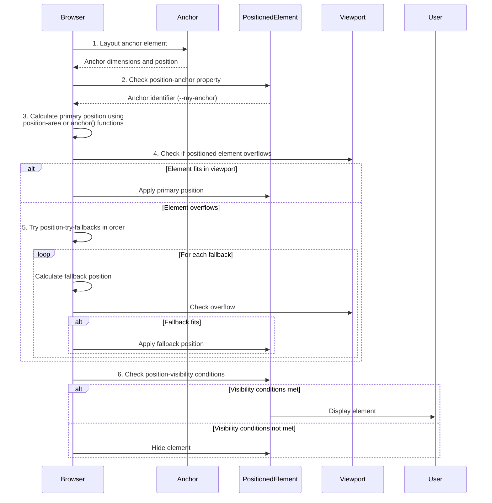
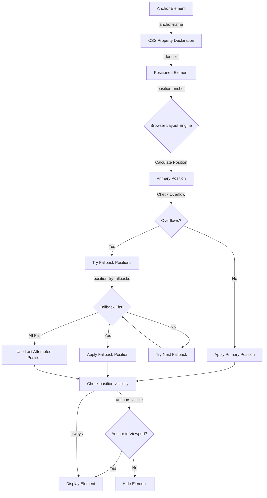

# CSS Anchor Positioning - Research

**Date**: 2025-11-04
**Status**: Research Complete

## Executive Summary

CSS Anchor Positioning is a new CSS feature (Level 1 specification Working Draft published October 2024, Level 2 First Public Working Draft in early 2025) that enables developers to position elements relative to other elements anywhere on the page using pure CSS, without requiring JavaScript. This feature addresses a long-standing pain point in web development: creating tooltips, popovers, dropdowns, and other dynamically positioned UI elements that intelligently avoid viewport edges and handle overflow scenarios.

The feature is part of Interop 2025, ensuring cross-browser implementation and interoperability by end of 2025. Current browser support includes Chrome/Edge 125+ (June 2024), Safari 18+/26+ (September 2025), with Firefox support expected by mid-2025. For browsers without native support, OddBird maintains an actively-developed polyfill supporting browsers back to Firefox 54, Chrome 51, Edge 79, and Safari 10.

CSS Anchor Positioning eliminates the need for JavaScript libraries like Popper.js or Floating UI for basic tooltip/popover positioning, offering better performance through native browser rendering, simpler maintenance through declarative CSS, and intelligent automatic fallback positioning when elements would overflow. However, developers must manually add ARIA attributes to establish semantic relationships for accessibility, as visual positioning alone doesn't convey meaning to assistive technologies.

The feature is production-ready with polyfill support for older browsers, though adoption is currently in early stages with limited publicly documented production case studies. For projects targeting modern browsers or willing to use polyfills, CSS Anchor Positioning provides significant developer experience and performance benefits over JavaScript-based positioning solutions.

## Technical Deep Dive

### Overview

CSS Anchor Positioning allows absolutely or fixed-positioned elements (called "targets" or "positioned elements") to size and position themselves relative to other elements (called "anchors") elsewhere on the page. The anchor and target don't need to be in the same part of the DOM tree - they can be completely separate elements connected through CSS properties.

This solves the traditional problem where tooltips, popovers, and dropdowns would either:
1. Be constrained to their containing element's boundaries
2. Overflow off-screen when placed near viewport edges
3. Require JavaScript to calculate positions and handle edge cases

### Core Properties and Functions

#### `anchor-name`

Designates an element as an anchor by assigning it a custom identifier starting with two dashes (dashed-ident):

```css
.my-anchor {
  anchor-name: --tooltip-anchor;
}
```

**Key behaviors:**
- Must start with two dashes (`--`)
- Multiple elements can share the same anchor name
- When multiple anchors have the same name, positioned elements tether to the last one in document order that is already laid out
- Works with elements in shadow DOM

#### `position-anchor`

Establishes the relationship between a positioned element and its anchor:

```css
.my-tooltip {
  position: absolute; /* or fixed - required */
  position-anchor: --tooltip-anchor;
}
```

**Requirements:**
- Positioned element MUST have `position: absolute` or `position: fixed`
- Anchor must be fully laid out before the positioned element
- Cannot tether to elements in higher layers or absolutely-positioned elements that follow

#### `anchor()` Function

Retrieves positional values from an anchor element for use in inset properties (top, left, bottom, right, and logical equivalents):

```css
.tooltip {
  position: absolute;
  /* Position below the anchor */
  top: anchor(--my-anchor bottom);
  /* Align left edge with anchor's left edge */
  left: anchor(--my-anchor left);
  /* With fallback value if anchor doesn't exist */
  top: anchor(--my-anchor bottom, 100px);
}
```

**Supported anchor side values:**
- Physical: `top`, `bottom`, `left`, `right`, `center`
- Logical: `start`, `end`, `self-start`, `self-end`, `inside`, `outside`
- Percentages: `0%` to `100%` (measuring along the axis)

**Syntax variations:**
```css
/* Implicit anchor (uses position-anchor) */
top: anchor(bottom);

/* Explicit anchor reference */
top: anchor(--specific-anchor bottom);

/* With fallback */
top: anchor(--my-anchor bottom, 50px);
```

#### `anchor-size()` Function

Retrieves dimensional values from an anchor for sizing positioned elements:

```css
.tooltip {
  /* Match anchor's width */
  width: anchor-size(width);
  /* Match anchor's height with fallback */
  max-height: anchor-size(height, 200px);
  /* Use logical dimensions */
  width: anchor-size(inline);
  height: anchor-size(block);
}
```

**Default behavior:**
- `anchor-size()` with no argument defaults to the relevant axis for the property
- Physical values: `width`, `height`
- Logical values: `inline`, `block`, `self-inline`, `self-block`

#### `position-area`

Simplifies positioning by placing elements on a 3×3 grid around the anchor:

```css
.tooltip {
  position: absolute;
  position-anchor: --my-anchor;
  position-area: top;           /* Top-center */
  position-area: bottom left;   /* Bottom-left corner */
  position-area: block-end;     /* Logical: below anchor */
}
```

**Grid structure:**
```
┌─────────┬─────────┬─────────┐
│ top     │  top    │ top     │
│ left    │         │ right   │
├─────────┼─────────┼─────────┤
│ left    │ center  │ right   │
├─────────┼─────────┼─────────┤
│ bottom  │ bottom  │ bottom  │
│ left    │         │ right   │
└─────────┴─────────┴─────────┘
```

**Spanning areas:**
```css
/* Span across multiple grid cells */
position-area: span-top right;           /* Right column, spanning from anchor top */
position-area: block-end span-inline-end; /* Common dropdown pattern */
```

**Physical vs. Logical keywords:**
- Physical: `top`, `bottom`, `left`, `right`, `center`
- Logical: `start`, `end`, `block-start`, `block-end`, `inline-start`, `inline-end`

#### `position-try-fallbacks`

Defines alternative positioning strategies when the primary position causes overflow:

```css
.tooltip {
  position-area: top;
  /* Try these alternatives in order if primary position overflows */
  position-try-fallbacks: bottom, left, right;
}
```

**Built-in flip keywords:**
```css
/* Automatic flipping */
position-try-fallbacks: flip-block;  /* Flip along block axis */
position-try-fallbacks: flip-inline; /* Flip along inline axis */
position-try-fallbacks: flip-block, flip-inline, flip-block flip-inline; /* Try all combinations */
```

**Combining with custom fallbacks:**
```css
position-try-fallbacks:
  --custom-position,
  flip-inline,
  bottom left;
```

**How it works:**
1. Browser attempts primary position
2. If element overflows containing block, tries first fallback
3. Continues through list until finding non-overflowing position
4. Stays with primary position if all fallbacks also overflow

#### `@position-try` At-Rule

Defines custom position fallback rule sets with multiple property changes:

```css
@position-try --smaller-below {
  position-area: bottom;
  width: 150px;
  height: 100px;
  margin-top: 0.5em;
}

.tooltip {
  position-area: top;
  width: 300px;
  height: 200px;
  margin-top: 1em;
  position-try-fallbacks: --smaller-below;
}
```

**Capabilities:**
- Change position properties
- Adjust sizing
- Modify margins and spacing
- Alter any positioning-related CSS properties

#### `position-try-order`

Controls which fallback is selected when multiple options prevent overflow:

```css
.tooltip {
  position-try-fallbacks: flip-block, flip-inline;
  position-try-order: most-height; /* Choose fallback that provides most height */
}
```

**Available values:**
- `normal`: Use order specified in `position-try-fallbacks`
- `most-width`: Select position providing most width
- `most-height`: Select position providing most height
- `most-block-size`: Most space in block dimension
- `most-inline-size`: Most space in inline dimension

#### `position-visibility`

Controls when anchor-positioned elements should be visible:

```css
.tooltip {
  position: fixed;
  position-anchor: --my-anchor;
  position-visibility: anchors-visible; /* Hide if anchor scrolls out of view */
}
```

**Values:**
- `always`: Display regardless of conditions (current browser default)
- `no-overflow`: Hide if positioned element still overflows after trying all fallbacks
- `anchors-visible`: Hide if anchor element leaves the viewport (spec-intended default)

**Current browser behavior:** Browsers default to `always` rather than the spec's intended `anchors-visible`.

#### `anchor-scope`

Limits anchor name matching to specific DOM subtrees, enabling reusable components:

```css
.component {
  anchor-scope: --component-anchor; /* Limit matching to this specific anchor name */
}

.container {
  anchor-scope: all; /* Limit matching for all anchor names to descendants */
}
```

**Use cases:**
- Multiple instances of the same component on a page
- Preventing anchor name collisions
- Component-based architectures

**Behavior:**
- Restricts anchor matching to descendants of the element with `anchor-scope`
- Useful when multiple anchors share the same `anchor-name`

### How It Works: Positioning Flow

The browser follows this process when positioning an anchor-positioned element:



**Coordinate System:**

Anchor positioning uses the CSS inset properties coordinate system:
- `top` / `block-start`: Distance from top edge of containing block
- `left` / `inline-start`: Distance from left edge of containing block
- `bottom` / `block-end`: Distance from bottom edge of containing block
- `right` / `inline-end`: Distance from right edge of containing block

The `anchor()` function returns coordinate values that can be used directly in these properties, automatically accounting for writing modes and text direction when using logical properties.

**Containing Block Considerations:**

The positioned element's containing block (determined by its nearest positioned ancestor or the viewport for `position: fixed`) defines the coordinate space. The anchor can be anywhere in the DOM - it doesn't need to be a descendant or ancestor of the containing block.

### Technology Stack / Ecosystem

**Required Dependencies:**
- None for native implementation in supported browsers
- `@oddbird/css-anchor-positioning` polyfill for older browsers

**Browser Support:**
- **Chrome/Edge:** 125+ (June 2024)
  - `position-area` (formerly `inset-area`): Chrome 129+
  - `position-try-fallbacks` (formerly `position-try-options`): Chrome 128+
  - `anchor-scope`: Chrome 131+
- **Safari:** 18+ (basic support), 26+ (full support, September 2025)
- **Firefox:** In development, expected mid-2025 (supported in Firefox Nightly)

**Polyfill Compatibility:**
- Firefox 54+
- Chrome 51-124
- Edge 79-124
- Safari 10+

**Related Web Platform Features:**
- CSS Positioned Layout (position: absolute/fixed)
- CSS Logical Properties (block/inline direction awareness)
- CSS Box Model (sizing and spacing)
- Popover API (automatic anchor relationships)
- CSS Containment (performance optimizations)

**Integration with Existing Tools:**
- Works seamlessly with CSS frameworks (Tailwind CSS, Bootstrap, etc.)
- Compatible with CSS-in-JS libraries (styled-components, Emotion, etc.)
- Can be progressively enhanced from static positioning
- Pairs with Popover API for enhanced functionality

## Implementation Feasibility

### Benefits

**1. Eliminates JavaScript Dependency for Common UI Patterns** [Chrome Developers Blog]

Native browser support means tooltips, popovers, dropdowns, and contextual menus no longer require JavaScript positioning libraries. This reduces bundle sizes and removes runtime positioning calculations.

**Evidence:** "This API simplifies complex layout requirements for many interface features like menus and submenus, tooltips, selects, labels, cards, settings dialogs, and many more."

**2. Better Performance Through Native Rendering** [Chrome Developers Blog]

Positioning updates occur during CSS layout recalculation rather than through script-driven DOM manipulation, improving performance for dynamic or scrolling interfaces.

**Performance characteristics:**
- No JavaScript recalculation overhead
- Leverages browser's native layout engine
- Positioning updates happen during paint cycle, not after
- No layout thrashing from reading and writing position values

**3. Intelligent Automatic Fallback Positioning** [MDN Web Docs]

Built-in overflow detection and automatic repositioning eliminates manual edge detection:

```css
.tooltip {
  position-area: top;
  /* Automatically tries bottom, then left, then right if top overflows */
  position-try-fallbacks: flip-block, flip-inline;
}
```

**Evidence:** "Pure CSS poppers will get partially cut off or overflow if they're near the edge since there is no dynamic positioning logic. When using [anchor positioning], your popper will always be positioned in the right place without needing manual adjustments."

**4. Simpler, More Maintainable Code** [CSS-Tricks]

Declarative CSS replaces imperative JavaScript positioning logic:

```css
/* Before: Required JavaScript positioning library */
/* Plus event listeners for scroll, resize, etc. */

/* After: Pure CSS */
.tooltip {
  position: absolute;
  position-anchor: --trigger;
  position-area: top;
  position-try-fallbacks: flip-block, flip-inline;
}
```

**5. Top-Layer and Cross-DOM Support** [Chrome Developers Blog]

Works seamlessly with `popover` and `<dialog>` elements in the top layer, allowing positioned elements in separate rendering layers to remain tethered while scrolling naturally:

```css
/* Popover in top layer can anchor to regular element */
#popover {
  position-anchor: --page-element;
  position-area: bottom;
}
```

**6. Responsive to Writing Modes and Text Direction** [MDN Web Docs]

Logical properties automatically adjust positioning based on writing mode and text direction, making internationalization simpler:

```css
/* Automatically positions correctly for RTL/LTR and vertical text */
position-area: block-end inline-start;
```

### Trade-offs & Challenges

**1. Limited Browser Support (Currently)** [Can I Use]

As of early 2025:
- Chrome/Edge: ✅ Full support (125+)
- Safari: ✅ Full support (18+/26+)
- Firefox: ❌ Not yet supported (expected mid-2025)

**Mitigation:** Polyfill provides compatibility back to 2016-era browsers, but adds ~20KB to bundle and has some limitations.

**2. Accessibility Requires Manual ARIA Attributes** [CSS-Tricks, Chrome Developers]

CSS positioning doesn't create semantic relationships - developers must add ARIA attributes:

```html
<button id="btn" aria-describedby="tooltip">Hover me</button>
<div role="tooltip" id="tooltip" style="anchor-name: --btn-anchor">Info</div>
```

**Evidence:** "While the anchor positioning API allows an element to be positioned relative to others, it doesn't inherently create any meaningful semantic relationship between them... Non-visual devices like screen readers are left in the dark about how to interpret two seemingly unrelated elements."

**Mitigation:** Use `aria-describedby`, `aria-details`, or `aria-labelledby` depending on relationship type.

**3. Polyfill Limitations** [OddBird GitHub]

The polyfill has known constraints:
- Doesn't support dynamic anchor/target addition or removal (requires manual re-application)
- Cannot handle anchors and targets in separate shadow roots
- Doesn't support `position-visibility` property
- Limited support for vertical/RTL writing modes
- `position-area` polyfilling requires wrapper element, breaking direct DOM selectors

**Evidence:** "position-area is polyfilled by adding a wrapping element around the target," which breaks selectors relying on direct DOM relationships.

**4. Framework Integration Issues** [OddBird GitHub]

React, Vue, and other frameworks strip unrecognized CSS properties from inline styles:

```jsx
// This won't work in React:
<div style={{ anchorName: '--foo' }} />

// Must use setAttribute or HTML attributes:
<div style="anchor-name: --foo" />
```

**5. Specification Still Evolving** [W3C Working Drafts]

Property names changed during development:
- `inset-area` → `position-area` (Chrome 129)
- `position-try-options` → `position-try-fallbacks` (Chrome 128)

While Level 1 is stable, Level 2 is still in early draft, so expect continued evolution.

**6. Learning Curve for Mental Model** [CSS-Tricks]

Understanding IMCB (Inset-Modified Containing Block) and the relationship between containing blocks, anchors, and positioned elements requires shifting from traditional positioning mental models.

**7. Performance Cost of Polyfill** [OddBird GitHub]

The polyfill's `useAnimationFrame` option enables updates during CSS transforms but at a performance cost:

```javascript
polyfill({
  useAnimationFrame: true // More accurate positioning, higher CPU usage
});
```

### When to Use

**Ideal for tooltips and popovers:**
```css
.tooltip {
  position: absolute;
  position-anchor: --trigger;
  position-area: top;
  position-try-fallbacks: flip-block, flip-inline;
  position-visibility: anchors-visible;
}
```
Perfect for contextual information that needs intelligent positioning without JavaScript.

**Excellent for dropdown menus and submenus:**
```css
.submenu {
  position: absolute;
  position-anchor: --parent-menu-item;
  position-area: right span-bottom;
  position-try-fallbacks: left span-bottom, bottom;
}
```
Automatically repositions when near viewport edges.

**Ideal for form field validation messages:**
```css
.error-message {
  position: absolute;
  position-anchor: --input-field;
  position-area: bottom left;
  max-width: anchor-size(width);
}
```
Message width matches input field width, positioned intelligently.

**Great for annotation systems:**
```css
.annotation {
  position: fixed;
  position-anchor: --annotated-element;
  position-area: right;
  position-visibility: anchors-visible;
}
```
Annotations stay anchored during scrolling, hide when anchor scrolls out of view.

**Useful for dashboard card actions:**
```css
.card-actions {
  position: absolute;
  position-anchor: --card;
  position-area: top right;
  position-try-fallbacks: bottom right, top left;
}
```
Actions menu anchored to card, intelligently repositions in tight layouts.

**Perfect for contextual help systems:**
```css
.help-popup {
  position: absolute;
  position-anchor: --help-trigger;
  position-area: bottom span-right;
  max-height: calc(anchor-size(height) * 3);
}
```
Help content scaled relative to trigger, positioned contextually.

### When to Avoid

**When targeting older browser versions without polyfill:**
If you cannot use the polyfill and must support Firefox or older Safari versions, stick with JavaScript solutions until native support arrives (mid-2025 for Firefox).

**When using frameworks that strip inline CSS:**
React and Vue remove unrecognized CSS properties from inline styles. Use CSS classes or `setAttribute` instead, or wait for framework updates to support these properties.

**When anchors/targets are dynamically added/removed frequently:**
The polyfill doesn't support dynamic updates - you must manually re-apply it after DOM changes. Use JavaScript positioning for highly dynamic UIs.

**When you need complex positioning logic beyond edge detection:**
Anchor positioning handles overflow and viewport edges but doesn't support custom positioning logic like:
- Positioning relative to cursor/mouse position
- Multi-anchor weighted positioning
- Positioning based on available space calculations beyond simple overflow
- Dynamic positioning based on content size or user preferences

Use JavaScript solutions like Floating UI for these advanced cases.

**When accessibility is complex:**
If semantic relationships between anchors and targets are intricate (multiple related elements, hierarchical structures), manually managing ARIA attributes becomes complex. Consider if a different UX pattern might be clearer.

**When working with shadow DOM across boundaries:**
The polyfill cannot handle anchors and targets in separate shadow roots. If your architecture requires cross-shadow-root positioning, use JavaScript solutions.

**When working in components with strict selector requirements:**
The polyfill's wrapper element approach for `position-area` breaks selectors like `.parent > .target`. If your CSS or JavaScript relies on direct child selectors, this limitation matters.

## Implementation Options

### Option 1: Native CSS Only (Modern Browsers)

**Description**: Use CSS Anchor Positioning without polyfills, targeting only browsers with native support (Chrome 125+, Safari 18+, Edge 125+).

**Implementation:**
```css
.anchor {
  anchor-name: --tooltip-anchor;
}

.tooltip {
  position: absolute;
  position-anchor: --tooltip-anchor;
  position-area: top;
  position-try-fallbacks: flip-block, flip-inline;
}
```

**Pros:**
- Zero bundle size impact
- Maximum performance - native browser rendering
- No polyfill limitations or quirks
- Simplest implementation - pure CSS
- Automatic browser optimizations
- No JavaScript required at all

**Cons:**
- Firefox not supported until mid-2025
- Older browser versions completely unsupported
- No fallback for unsupported browsers
- May require progressive enhancement strategy

**Complexity**: Low

**Time Estimate**: 1-2 hours for basic implementation

**Reuses Patterns**: Yes - standard CSS patterns

**When to Use:**
- Building internal tools where you control browser versions
- Progressive web apps targeting modern browsers only
- Projects with >95% Chrome/Safari user base
- Greenfield projects with modern browser requirements
- Developer-facing tools and admin interfaces

**Example:**
Basic tooltip implementation from Chrome for Developers blog:

```css
.anchor-button {
  anchor-name: --anchor-el;
}

.positioned-notice {
  position: absolute;
  position-anchor: --anchor-el;
  bottom: anchor(top);
  justify-self: anchor-center;
}
```

### Option 2: Polyfill for Broad Compatibility

**Description**: Use OddBird's CSS Anchor Positioning polyfill to support older browsers back to Firefox 54, Chrome 51, Edge 79, Safari 10.

**Implementation:**
```javascript
// Auto-load polyfill only when needed
if (!("anchorName" in document.documentElement.style)) {
  import("https://unpkg.com/@oddbird/css-anchor-positioning");
}
```

Or with npm:
```bash
pnpm add @oddbird/css-anchor-positioning
```

```javascript
import polyfill from '@oddbird/css-anchor-positioning/fn';

// Apply polyfill to entire document
await polyfill();

// Or target specific elements
await polyfill({
  elements: document.querySelectorAll('.needs-anchor-positioning'),
});
```

**Pros:**
- Broad browser support (back to 2016)
- Covers ~95%+ of global browser market
- Active maintenance and regular updates (20 releases, latest October 2025)
- Growing adoption (136 dependent projects, ~14K monthly npm downloads)
- Works with shadow DOM (within same root)
- Feature detection built-in

**Cons:**
- Adds ~20KB to bundle size
- Polyfill limitations (no `position-visibility`, no dynamic updates, wrapper element for `position-area`)
- Requires manual re-application after dynamic DOM changes
- Performance overhead vs. native implementation
- Framework integration issues (React/Vue strip inline anchor properties)
- Cannot handle separate shadow roots
- Limited vertical/RTL writing mode support

**Complexity**: Medium

**Time Estimate**: 1-2 days (includes setup, testing across browsers, handling edge cases)

**Reuses Patterns**: Partial - standard polyfill loading patterns

**When to Use:**
- Need to support Firefox before mid-2025 stable release
- Target broader browser compatibility requirements
- Production applications with diverse user base
- Client requirements specify older browser support
- Risk mitigation while waiting for full native support
- Marketing sites with unknown visitor browsers

**Example:**
From OddBird documentation:

```html
<!DOCTYPE html>
<html>
<head>
  <style>
    .anchor { anchor-name: --my-anchor; }
    .target {
      position: absolute;
      position-anchor: --my-anchor;
      position-area: top;
      position-try-fallbacks: flip-block, flip-inline;
    }
  </style>
</head>
<body>
  <div class="anchor">Anchor</div>
  <div class="target">Target</div>

  <script type="module">
    if (!("anchorName" in document.documentElement.style)) {
      import("https://unpkg.com/@oddbird/css-anchor-positioning");
    }
  </script>
</body>
</html>
```

### Option 3: Progressive Enhancement with JavaScript Fallback

**Description**: Use CSS Anchor Positioning for supported browsers, gracefully degrade to static positioning or JavaScript-based positioning (Floating UI) for older browsers.

**Implementation:**
```css
/* Base styles - work everywhere */
.tooltip {
  position: absolute;
  top: 100%;
  left: 0;
}

/* Enhanced positioning for supported browsers */
@supports (anchor-name: --test) {
  .anchor {
    anchor-name: --tooltip-anchor;
  }

  .tooltip {
    position-anchor: --tooltip-anchor;
    position-area: top;
    position-try-fallbacks: flip-block, flip-inline;
    top: auto;
    left: auto;
  }
}
```

With JavaScript fallback:
```javascript
// Check for native support
const supportsAnchor = CSS.supports('anchor-name', '--test');

if (!supportsAnchor) {
  // Load Floating UI or other JS positioning library
  import('https://cdn.jsdelivr.net/npm/@floating-ui/dom').then(({ computePosition }) => {
    // Implement JS positioning
  });
}
```

**Pros:**
- Works in all browsers with appropriate experience for each
- No polyfill limitations for modern browsers
- Smooth migration path as browser support increases
- Can optimize experience per browser capability
- Future-proof architecture
- Smaller bundle size than full polyfill (if using on-demand JS)

**Cons:**
- More complex implementation
- Maintaining two positioning strategies (CSS + JS fallback)
- Testing required across both code paths
- More code to maintain long-term
- Need to ensure feature parity between approaches
- May result in slightly different behavior across browsers

**Complexity**: Medium-High

**Time Estimate**: 3-5 days (CSS implementation + JS fallback + cross-browser testing + ensuring feature parity)

**Reuses Patterns**: Yes - progressive enhancement is established pattern

**When to Use:**
- Building production applications with high quality standards
- Need optimal experience across all browsers
- Want to future-proof codebase for native support
- Have resources to maintain dual implementation
- Users on diverse browsers with varying capabilities
- Performance is critical (want native when available, acceptable fallback elsewhere)

**Example:**
Progressive enhancement pattern:

```html
<!DOCTYPE html>
<html>
<head>
  <style>
    /* Baseline: static positioning */
    .tooltip {
      position: absolute;
      top: 100%;
      left: 50%;
      transform: translateX(-50%);
      margin-top: 8px;
    }

    /* Enhanced: CSS anchor positioning */
    @supports (anchor-name: --test) {
      .anchor {
        anchor-name: --tooltip-anchor;
      }

      .tooltip {
        position-anchor: --tooltip-anchor;
        position-area: top;
        position-try-fallbacks: flip-block, flip-inline;
        transform: none;
        margin-top: 0;
      }
    }
  </style>
</head>
<body>
  <button class="anchor">Hover me</button>
  <div class="tooltip">Tooltip content</div>

  <script type="module">
    // Enhance with JavaScript only if CSS anchor not supported
    if (!CSS.supports('anchor-name', '--test')) {
      // Load and apply Floating UI or similar
      import('./js-positioning-fallback.js');
    }
  </script>
</body>
</html>
```

## Comparison Matrix

| Criteria | Option 1: Native CSS Only | Option 2: Polyfill | Option 3: Progressive Enhancement |
|----------|---------------------------|--------------------|------------------------------------|
| **Complexity** | Low | Medium | Medium-High |
| **Maintainability** | High | Medium | Medium |
| **Performance** | Excellent | Good | Excellent (native), Good (fallback) |
| **Learning Curve** | Low | Medium | High |
| **Community Support** | Growing | Strong (136 projects, 14K monthly downloads) | Strong |
| **Reuses Patterns** | Yes | Partial | Yes |
| **Time to Implement** | 1-2 hours | 1-2 days | 3-5 days |
| **Browser Support** | Chrome 125+, Safari 18+, Edge 125+ | Firefox 54+, Chrome 51+, Edge 79+, Safari 10+ | All browsers |
| **Bundle Size Impact** | 0 KB | ~20 KB | Variable (0 KB native, ~10-20 KB fallback) |
| **Feature Completeness** | 100% | ~80% (polyfill limitations) | 100% native, ~90% fallback |
| **Future-Proof** | Yes | Temporary solution | Yes |
| **Testing Burden** | Low | Medium | High |
| **Production Ready** | Yes (modern browsers only) | Yes (broad compatibility) | Yes (all browsers) |
| **Dynamic Content** | Excellent | Poor (manual re-apply needed) | Good |
| **Shadow DOM Support** | Yes | Partial (same root only) | Yes (with appropriate fallback) |
| **Framework Compatibility** | Excellent | Fair (inline style issues) | Good |

## Implementation Approach

### Prerequisites & Requirements

**Browser Requirements:**
- **Native Support:** Chrome 125+, Edge 125+, Safari 18+
- **Polyfill Support:** Firefox 54+, Chrome 51+, Edge 79+, Safari 10+
- **Progressive Enhancement:** All browsers

**Development Environment:**
- Modern build tool (Vite, Webpack, Rollup, etc.) if using npm packages
- TypeScript support (optional but recommended)
- Testing tools that support modern CSS or polyfill injection

**Knowledge Requirements:**
- CSS positioning fundamentals (absolute/fixed positioning, containing blocks)
- CSS logical properties (for internationalization)
- Understanding of CSS containment and stacking contexts
- ARIA attributes for accessibility
- JavaScript module loading (for polyfill option)

**Dependencies:**
- **Option 1 (Native):** None
- **Option 2 (Polyfill):** `@oddbird/css-anchor-positioning` (~20 KB)
- **Option 3 (Progressive):** Optional `@floating-ui/dom` or similar for fallback (~10-15 KB)

### Getting Started

**Step 1: Feature Detection**

Determine if browser supports CSS Anchor Positioning:

```javascript
const supportsAnchorPositioning = CSS.supports('anchor-name', '--test');

if (supportsAnchorPositioning) {
  console.log('Native CSS Anchor Positioning supported');
} else {
  console.log('Polyfill or fallback needed');
}
```

**Step 2: Choose Implementation Strategy**

Based on browser support requirements:

```javascript
// Auto-load polyfill conditionally
if (!CSS.supports('anchor-name', '--test')) {
  await import('@oddbird/css-anchor-positioning');
}
```

**Step 3: Basic Tooltip Implementation**

Minimal working example:

```html
<!DOCTYPE html>
<html>
<head>
  <style>
    /* Define anchor */
    .button {
      anchor-name: --button-anchor;
    }

    /* Position tooltip relative to anchor */
    .tooltip {
      position: absolute;
      position-anchor: --button-anchor;
      position-area: top;

      /* Automatic fallback if top overflows */
      position-try-fallbacks: flip-block, flip-inline;

      /* Hide when anchor scrolls out of view */
      position-visibility: anchors-visible;

      /* Styling */
      padding: 0.5rem 1rem;
      background: #333;
      color: white;
      border-radius: 4px;
    }
  </style>
</head>
<body>
  <button class="button">Hover me</button>
  <div class="tooltip" hidden>Helpful tooltip text</div>

  <script>
    const button = document.querySelector('.button');
    const tooltip = document.querySelector('.tooltip');

    button.addEventListener('mouseenter', () => {
      tooltip.hidden = false;
    });

    button.addEventListener('mouseleave', () => {
      tooltip.hidden = true;
    });
  </script>
</body>
</html>
```

**Step 4: Add Accessibility**

Establish semantic relationships:

```html
<button
  class="button"
  aria-describedby="tooltip-1">
  Hover me
</button>

<div
  class="tooltip"
  role="tooltip"
  id="tooltip-1"
  hidden>
  Helpful tooltip text
</div>
```

### Architecture & Design Considerations

**Component Structure:**

Organize anchor-positioned elements into logical groups:

```
Component Structure:
├── Anchor Element (triggers positioning)
│   ├── anchor-name: defines identifier
│   └── Interactive behavior (hover, click, focus)
├── Positioned Element (positioned relative to anchor)
│   ├── position: absolute/fixed
│   ├── position-anchor: references anchor
│   ├── position-area or anchor() functions
│   ├── position-try-fallbacks: overflow handling
│   └── position-visibility: scroll behavior
└── Accessibility Layer (ARIA attributes)
    ├── aria-describedby / aria-details
    ├── role="tooltip" / role="dialog"
    └── Keyboard navigation support
```

**Data Flow:**



**State Management:**

For dynamic anchor positioning with state:

```javascript
// React example
function AnchoredTooltip({ anchorId, children }) {
  const [isVisible, setIsVisible] = useState(false);

  return (
    <>
      <button
        style={{ anchorName: `--${anchorId}` }}
        onMouseEnter={() => setIsVisible(true)}
        onMouseLeave={() => setIsVisible(false)}
        aria-describedby={`tooltip-${anchorId}`}>
        Trigger
      </button>

      {isVisible && (
        <div
          className="tooltip"
          style={{
            position: 'absolute',
            positionAnchor: `--${anchorId}`,
            positionArea: 'top'
          }}
          role="tooltip"
          id={`tooltip-${anchorId}`}>
          {children}
        </div>
      )}
    </>
  );
}
```

**Integration Points:**

1. **With Popover API:**
```html
<button popovertarget="my-popover" style="anchor-name: --my-anchor">
  Open Popover
</button>

<div popover id="my-popover" style="position-anchor: --my-anchor; position-area: bottom;">
  Popover content
</div>
```

2. **With Dialog Elements:**
```html
<button style="anchor-name: --dialog-anchor">Open Dialog</button>

<dialog style="position: fixed; position-anchor: --dialog-anchor; position-area: bottom;">
  Dialog content
</dialog>
```

3. **With CSS Transitions:**
```css
.tooltip {
  position: absolute;
  position-anchor: --button;
  position-area: top;

  opacity: 0;
  transition: opacity 0.2s;
}

.tooltip[data-visible] {
  opacity: 1;
}
```

**Error Handling Strategy:**

```javascript
// Graceful degradation
function applyAnchorPositioning() {
  try {
    if (!CSS.supports('anchor-name', '--test')) {
      // Load polyfill
      return import('@oddbird/css-anchor-positioning');
    }
  } catch (error) {
    console.warn('Anchor positioning unavailable, using fallback');
    // Apply static positioning fallback
    applyStaticPositioningFallback();
  }
}

function applyStaticPositioningFallback() {
  // Simple tooltip positioning without anchor positioning
  document.querySelectorAll('.tooltip').forEach(tooltip => {
    tooltip.style.position = 'absolute';
    tooltip.style.top = '100%';
    tooltip.style.left = '50%';
    tooltip.style.transform = 'translateX(-50%)';
  });
}
```

### Best Practices

**1. Use Logical Properties for Internationalization** [MDN Web Docs]

```css
/* Good: Works with RTL and different writing modes */
.tooltip {
  position-area: block-end inline-start;
}

/* Avoid: Fixed to LTR horizontal layout */
.tooltip {
  position-area: bottom left;
}
```

**2. Always Provide Fallback Positions** [Chrome Developers Blog]

```css
.tooltip {
  position-area: top;
  /* Essential for handling edge cases */
  position-try-fallbacks: flip-block, flip-inline, flip-block flip-inline;
}
```

**3. Reset Popover/Dialog Default Styles** [Chrome Developers Blog]

Popover and dialog elements have default centering styles that conflict with anchor positioning:

```css
[popover] {
  /* Reset default centering */
  inset: auto;
  position-anchor: --my-anchor;
  position-area: bottom;
}
```

**4. Use `position-visibility` for Scrolling Content** [MDN Web Docs]

```css
.fixed-tooltip {
  position: fixed;
  position-visibility: anchors-visible;
  /* Hides tooltip when anchor scrolls out of view */
}
```

**5. Establish Semantic Relationships with ARIA** [Chrome Developers Blog, CSS-Tricks]

```html
<!-- For tooltips -->
<button aria-describedby="tooltip-1">Action</button>
<div role="tooltip" id="tooltip-1">Description</div>

<!-- For detailed information -->
<div aria-details="details-1">Summary</div>
<div id="details-1">Detailed content</div>
```

**6. Use `anchor-scope` for Reusable Components** [web.dev]

```css
/* Prevent anchor name collisions in repeated components */
.component {
  anchor-scope: --component-anchor;
}

.component-anchor {
  anchor-name: --component-anchor;
}

.component-tooltip {
  position-anchor: --component-anchor;
}
```

**7. Optimize for Performance** [Chrome Developers Blog]

```css
/* Contain positioning recalculations */
.anchor-container {
  contain: layout style;
}

/* Avoid unnecessary repaints */
.tooltip {
  will-change: auto; /* Don't use will-change: transform for anchor-positioned elements */
}
```

**8. Progressive Enhancement Pattern** [web.dev]

```css
/* Base styles that work everywhere */
.tooltip {
  position: absolute;
  top: 100%;
  left: 0;
}

/* Enhanced positioning for supported browsers */
@supports (anchor-name: --test) {
  .tooltip {
    position-anchor: --trigger;
    position-area: bottom;
    top: auto;
    left: auto;
  }
}
```

**9. Size Positioned Elements Relative to Anchors When Appropriate** [MDN Web Docs]

```css
.dropdown {
  /* Match anchor width */
  min-width: anchor-size(width);
  /* But allow growing */
  max-width: max-content;
}
```

**10. Consider Animation and Transitions** [CSS-Tricks]

Anchor positioning works with CSS transitions, but transitions should be on visual properties, not position-area:

```css
.tooltip {
  position-area: top;
  position-try-fallbacks: flip-block;

  /* Transition visual properties */
  opacity: 0;
  scale: 0.95;
  transition: opacity 0.2s, scale 0.2s;
}

.tooltip[data-visible] {
  opacity: 1;
  scale: 1;
}
```

### Common Pitfalls & How to Avoid Them

**1. Forgetting `position: absolute` or `position: fixed`** [MDN Web Docs, Chrome Developers]

```css
/* Won't work - missing position property */
.tooltip {
  position-anchor: --my-anchor;
  position-area: top;
}

/* Correct */
.tooltip {
  position: absolute; /* Required! */
  position-anchor: --my-anchor;
  position-area: top;
}
```

**2. Anchor Not Laid Out Before Positioned Element** [web.dev]

```html
<!-- Won't work - positioned element comes before anchor in DOM -->
<div style="position: absolute; position-anchor: --my-anchor;">Target</div>
<div style="anchor-name: --my-anchor;">Anchor</div>

<!-- Correct - anchor comes first or ensure laid out first -->
<div style="anchor-name: --my-anchor;">Anchor</div>
<div style="position: absolute; position-anchor: --my-anchor;">Target</div>
```

**3. Using Inline Styles in React/Vue Without setAttribute** [OddBird GitHub]

```jsx
// Won't work - React strips unrecognized properties
<div style={{ anchorName: '--foo' }}>Anchor</div>

// Solution 1: Use CSS classes
<div className="anchor">Anchor</div>

// Solution 2: Use setAttribute in useEffect
useEffect(() => {
  ref.current.style.setProperty('anchor-name', '--foo');
}, []);

// Solution 3: Use dangerouslySetInnerHTML for style attribute
<div dangerouslySetInnerHTML={{ __html: '<style>anchor-name: --foo</style>' }} />
```

**4. Not Providing Fallbacks for Overflow** [CSS-Tricks]

```css
/* Risky - no fallback if tooltip overflows top */
.tooltip {
  position-area: top;
}

/* Better - provides alternatives */
.tooltip {
  position-area: top;
  position-try-fallbacks: flip-block, flip-inline;
}
```

**5. Forgetting to Reset Popover Default Margins** [Chrome Developers Blog]

```css
/* Popover defaults have auto margins that center them */
[popover] {
  /* Must reset to use anchor positioning */
  margin: 0;
  inset: auto;
  position-anchor: --my-anchor;
  position-area: bottom;
}
```

**6. Mixing Physical and Logical Properties Inconsistently** [MDN Web Docs]

```css
/* Confusing - mixes physical and logical */
.tooltip {
  position-area: block-end right;
}

/* Better - use all logical or all physical */
.tooltip {
  position-area: block-end inline-end;
}
```

**7. Not Handling Dynamic Content with Polyfill** [OddBird GitHub]

```javascript
// Won't work - polyfill doesn't auto-update
document.querySelector('.container').innerHTML += `
  <div style="anchor-name: --new">New Anchor</div>
  <div style="position-anchor: --new">New Target</div>
`;

// Correct - reapply polyfill after DOM changes
import polyfill from '@oddbird/css-anchor-positioning/fn';
document.querySelector('.container').innerHTML += /* ... */;
await polyfill(); // Reapply
```

**8. Assuming `position-visibility: anchors-visible` is Default** [CSS-Tricks]

```css
/* Current browsers default to 'always', not 'anchors-visible' */
/* Must explicitly set if you want hiding behavior */
.tooltip {
  position: fixed;
  position-visibility: anchors-visible; /* Explicitly set */
}
```

### Migration/Adoption Strategy

**Phase 1: Evaluation & Planning (Week 1)**

1. Audit existing positioned elements (tooltips, dropdowns, popovers)
2. Identify which use JavaScript positioning libraries
3. Assess browser support requirements
4. Decide on implementation option (Native, Polyfill, or Progressive Enhancement)
5. Create proof-of-concept with 2-3 examples

**Phase 2: Infrastructure Setup (Week 1-2)**

1. Install polyfill if needed: `pnpm add @oddbird/css-anchor-positioning`
2. Set up feature detection
3. Configure build process to handle CSS anchor properties
4. Update linting/formatting tools to recognize new properties
5. Create reusable CSS classes or component patterns

**Phase 3: Incremental Migration (Week 2-4)**

Start with lowest-risk, highest-value components:

```javascript
// Migration priority matrix
const migrationPriority = [
  { component: 'Tooltip', risk: 'low', value: 'high', estimate: '1 day' },
  { component: 'Dropdown menu', risk: 'low', value: 'high', estimate: '2 days' },
  { component: 'Popover', risk: 'medium', value: 'high', estimate: '2 days' },
  { component: 'Context menu', risk: 'medium', value: 'medium', estimate: '3 days' },
  { component: 'Form validation', risk: 'low', value: 'medium', estimate: '1 day' },
];
```

**Example migration:**

```css
/* Before: JavaScript-dependent tooltip */
.tooltip {
  position: absolute;
  /* Position calculated and set via JavaScript */
}
```

```javascript
// JavaScript positioning logic
Popper.createPopper(button, tooltip, {
  placement: 'top',
  modifiers: [{ name: 'flip', enabled: true }]
});
```

```css
/* After: CSS Anchor Positioning */
.tooltip-anchor {
  anchor-name: --tooltip;
}

.tooltip {
  position: absolute;
  position-anchor: --tooltip;
  position-area: top;
  position-try-fallbacks: flip-block, flip-inline;
}
```

**Phase 4: Testing & Validation (Week 3-5)**

1. Test across all supported browsers
2. Validate accessibility with screen readers
3. Test edge cases (small viewports, zooming, different writing modes)
4. Performance testing (compare before/after metrics)
5. Gather user feedback

**Phase 5: Cleanup & Documentation (Week 5-6)**

1. Remove deprecated JavaScript positioning code
2. Update component documentation
3. Create design system guidelines for anchor positioning
4. Share learnings with team
5. Plan for removing polyfill when browser support sufficient

**Rollback Strategy:**

Maintain ability to rollback to JavaScript positioning:

```javascript
// Feature flag for gradual rollout
const USE_CSS_ANCHOR_POSITIONING = process.env.FEATURE_CSS_ANCHOR === 'true';

if (USE_CSS_ANCHOR_POSITIONING && CSS.supports('anchor-name', '--test')) {
  // Use CSS anchor positioning
  applyAnchorPositioningClasses();
} else {
  // Fallback to JavaScript positioning
  initializePopperJS();
}
```

This allows quick rollback if issues discovered in production.

## Alternatives Considered

### Alternative 1: Floating UI (formerly Popper.js)

**Description:**
JavaScript library for positioning floating elements (tooltips, popovers, dropdowns). Floating UI is the successor to Popper.js, offering better tree-shaking, smaller bundle size, and cross-platform support.

**Pros:**
- Mature, battle-tested solution (Popper.js lineage since 2016)
- Works in all browsers (back to IE11 with polyfills)
- More flexible than CSS-only solutions for complex positioning logic
- Cross-platform (works in React Native, Canvas, WebGL)
- Active community (34K+ GitHub stars)
- Advanced features like virtual elements, middleware system

**Cons:**
- Adds ~3KB (Popper.js) to ~5KB (Floating UI core) to bundle
- Requires JavaScript event listeners for scroll, resize, etc.
- Higher complexity than declarative CSS
- Runtime performance cost for calculations
- Requires manual accessibility implementation
- Potential layout thrashing if not carefully implemented

**Why it wasn't chosen:**
CSS Anchor Positioning eliminates JavaScript dependency entirely for common positioning scenarios, offers better performance through native browser rendering, and has simpler declarative syntax. However, Floating UI remains valuable for:
- Complex positioning logic beyond edge detection
- Cursor-relative positioning
- Applications needing broad browser support without polyfills
- Cross-platform needs beyond web browsers

**When it might be better:**
- Need to support browsers where CSS Anchor Positioning polyfill won't work
- Require advanced positioning logic (weighted multi-anchor positioning, cursor tracking)
- Cross-platform requirements (React Native, Canvas apps)
- Already have Floating UI integrated and migration cost isn't justified by benefits

### Alternative 2: JavaScript + CSS Transforms

**Description:**
Custom JavaScript that calculates positions and applies them via CSS transforms (`translate`, `translateX`, `translateY`).

**Pros:**
- Full control over positioning logic
- Works in all browsers
- Can optimize specifically for your use cases
- No external dependencies
- Animations can be smoother with transforms

**Cons:**
- Requires building and maintaining positioning logic
- Manual overflow detection and edge handling
- Event listener management for scroll/resize
- Higher development time
- Easy to introduce bugs
- Harder to maintain across team
- Performance depends on implementation quality

**Why it wasn't chosen:**
CSS Anchor Positioning provides battle-tested positioning logic out of the box with better performance characteristics than custom JavaScript. Writing custom positioning logic is time-consuming and error-prone.

**When it might be better:**
- Very specific positioning requirements not covered by libraries or CSS Anchor Positioning
- Performance-critical applications where you need fine-grained control
- Educational purposes or deepening understanding of positioning algorithms
- Existing codebase with custom positioning that works well

### Alternative 3: Fixed/Absolute Positioning with JavaScript

**Description:**
Traditional CSS `position: absolute` or `position: fixed` with JavaScript calculating and setting `top`, `left`, `bottom`, `right` values.

**Pros:**
- Familiar approach used for years
- Works everywhere
- Simple mental model
- Easy to debug

**Cons:**
- No automatic overflow handling
- Requires JavaScript for dynamic positioning
- Manual viewport edge detection
- Layout thrashing risks from reading/writing DOM
- More verbose code
- Doesn't handle complex fallback scenarios well

**Why it wasn't chosen:**
CSS Anchor Positioning offers automatic overflow handling, fallback positioning, and eliminates JavaScript dependency while providing superior developer experience.

**When it might be better:**
- Extremely simple, static positioning needs
- Legacy codebase with established patterns
- No need for viewport edge handling or fallbacks

### Alternative 4: CSS `position: sticky`

**Description:**
Use `position: sticky` to keep elements in view during scrolling.

**Pros:**
- Native CSS, excellent browser support
- Performant
- Simple for specific scroll-based positioning
- No JavaScript required

**Cons:**
- Only works within containing element
- Cannot position relative to arbitrary elements
- Limited to scroll-based positioning
- Doesn't handle viewport overflow
- Not suitable for tooltips, popovers, dropdowns

**Why it wasn't chosen:**
Sticky positioning solves a different problem (keeping elements in view while scrolling) and cannot position elements relative to arbitrary anchors elsewhere in the DOM.

**When it might be better:**
- Table headers that should stick while scrolling
- Persistent navigation that stays visible
- Section headers in long scrolling content
- Any scroll-relative positioning within containing element

## Debates & Open Questions

**Default Behavior of `position-visibility`** [CSS-Tricks, W3C Issues]

**The debate:** The CSS specification intends `position-visibility: anchors-visible` as the default (hiding positioned elements when anchors scroll out of view), but browsers currently implement `position-visibility: always` as the default.

**Different perspectives:**
- **Spec authors:** `anchors-visible` makes semantic sense - why show a tooltip when its anchor isn't visible?
- **Browser implementers:** Changing defaults mid-implementation could break existing sites; `always` is safer initially
- **Developer community:** Mixed opinions - some want explicit control, others prefer sensible defaults

**Current status:** Developers must explicitly set `position-visibility: anchors-visible` if they want that behavior. This debate may result in spec changes or browser updates.

**Level 2 Specification Direction** [W3C First Public Working Draft]

**Open question:** What additional features should Level 2 include?

**Community requests:**
- Multiple anchor positioning (weighted average of multiple anchor positions)
- Anchor positioning with scroll containers
- Better control over fallback selection logic beyond `position-try-order`
- Percentage-based positioning within anchor bounds
- Integration with CSS animations and view transitions

**Status:** Level 2 is in First Public Working Draft stage (early 2025), so feature set is still evolving based on developer feedback.

**Performance Characteristics of Polyfill** [OddBird GitHub Issues]

**Ongoing discussion:** What's the performance impact of the polyfill vs. native implementation?

**Known considerations:**
- Polyfill requires parsing CSS, building position maps, and applying styles via JavaScript
- `useAnimationFrame` option improves accuracy but increases CPU usage
- Large DOMs with many anchor-positioned elements show more performance delta
- Need more real-world benchmarks and case studies

**Edge case:** How should position-area wrapper elements interact with existing CSS selectors? Current polyfill approach can break direct descendant selectors.

**Shadow DOM Support** [OddBird GitHub]

**Limitation:** Polyfill cannot handle anchors and targets in separate shadow roots, while native implementation is expected to support this.

**Debate:** How should anchor positioning work across shadow boundaries?
- Security/encapsulation concerns with cross-shadow-root references
- Use cases in web component architectures
- Potential solutions: explicit shadow-piercing syntax or shadow-aware scoping

**Status:** Spec doesn't clearly define cross-shadow-root behavior yet; more implementation experience needed.

**Accessibility Best Practices Still Emerging** [Web Accessibility Community]

**Open question:** What are the definitive accessibility patterns for anchor-positioned elements?

**Current guidance:**
- Use `aria-describedby` for tooltips
- Use `aria-details` for supplementary content
- Add `role="tooltip"` or appropriate roles
- Ensure keyboard navigation support

**Debate points:**
- Should anchor-positioned elements automatically establish ARIA relationships?
- How should screen readers announce positioned content vs. anchor?
- What about complex multi-anchor scenarios?

**Status:** Still evolving as accessibility experts gain experience with the feature. ARIA Authoring Practices Guide may add specific patterns.

**React/Vue Framework Support** [OddBird GitHub, React Issues]

**Current pain point:** Frameworks strip unrecognized CSS properties from inline styles.

**Workarounds:**
- Use CSS classes instead of inline styles
- Use `setAttribute` in lifecycle hooks
- Wait for framework updates

**Open question:** Should frameworks recognize and preserve CSS Anchor Positioning properties in inline styles?

**Status:** Framework maintainers are aware; may see updates as CSS Anchor Positioning becomes more mainstream.

## Recommendations

### Preferred Approach: Progressive Enhancement with Polyfill (Option 3 + Option 2 Hybrid)

**Should This Be Implemented?**: Yes - Conditional

**Rationale:**

CSS Anchor Positioning offers compelling benefits for modern web development:

1. **Performance Benefits:** Native browser rendering eliminates JavaScript positioning overhead, reducing main thread work and improving runtime performance for dynamic UIs.

2. **Developer Experience:** Declarative CSS syntax is simpler to write, understand, and maintain compared to imperative JavaScript positioning logic. Reduced code complexity leads to fewer bugs.

3. **Automatic Fallback Handling:** Built-in overflow detection and intelligent repositioning eliminates manual edge case handling that's error-prone and time-consuming with JavaScript solutions.

4. **Future-Proof:** Part of Interop 2025 ensures full cross-browser support by end of 2025. Investing now positions codebase for long-term maintainability as browser support matures.

5. **Progressive Enhancement:** Can implement for modern browsers immediately while providing acceptable fallback for older browsers, avoiding "all or nothing" migration risk.

**Why:**

The combination of performance improvements, simpler code, and reduced maintenance burden makes CSS Anchor Positioning a net positive investment. With polyfill support providing compatibility back to 2016-era browsers, the risk of broken experiences is minimal while modernization benefits are substantial.

**Cost/benefit analysis:**

**Costs:**
- Implementation time: 1-2 weeks for full migration across components
- Learning curve for team: ~2-4 hours for developers to understand
- Polyfill bundle size: ~20KB (mitigated by loading conditionally)
- Testing effort: Cross-browser testing across fallback and native paths

**Benefits:**
- Reduced bundle size long-term: Remove Floating UI/Popper.js (~3-5KB) after migration
- Performance improvement: Eliminate JavaScript positioning calculations and event listeners
- Code simplicity: ~30-50% less code for typical tooltip/popover components
- Maintenance reduction: Less edge case handling, fewer positioning bugs
- Future-proof: Native support expanding throughout 2025

**Key Considerations:**

**1. Browser Support Timeline:**
- Chrome/Edge: Production ready (125+)
- Safari: Production ready (18+/26+)
- Firefox: Wait until mid-2025 for stable release, or use polyfill

**Recommendation:** Use polyfill for Firefox users until native support ships.

**2. Accessibility Requirements:**
- Must manually add ARIA attributes (aria-describedby, role="tooltip", etc.)
- Screen reader testing required for all implementations
- Document accessibility patterns in component library

**Recommendation:** Create reusable component wrappers that include ARIA by default.

**3. Framework Integration:**
- React/Vue strip inline anchor properties
- Need to use CSS classes or setAttribute workarounds

**Recommendation:** Use CSS classes approach for cleaner framework integration.

**Potential Challenges:**

**Challenge 1: Framework Inline Style Limitations**

**Issue:** React and Vue remove unrecognized CSS properties from inline styles:
```jsx
// Doesn't work
<div style={{ anchorName: '--foo' }}>Anchor</div>
```

**Mitigation:**
```jsx
// Solution 1: Use CSS classes (preferred)
<div className="my-anchor">Anchor</div>

// Solution 2: setAttribute in useEffect
useEffect(() => {
  ref.current.style.setProperty('anchor-name', '--foo');
}, []);
```

**Fallback plan:** If framework issues prove too complex, delay adoption until framework updates support these properties natively.

**Challenge 2: Polyfill Doesn't Support Dynamic DOM Changes**

**Issue:** Adding/removing anchors or targets dynamically doesn't automatically update polyfill.

**Mitigation:**
```javascript
import polyfill from '@oddbird/css-anchor-positioning/fn';

// After adding elements dynamically
await polyfill({
  elements: document.querySelectorAll('.newly-added')
});
```

**Fallback plan:** For highly dynamic UIs with frequent DOM updates, consider using native implementation only (Option 1) or maintaining Floating UI for those specific components.

**Success Criteria:**

**1. Functional Success:**
- ✅ All tooltips, popovers, and dropdowns position correctly
- ✅ Automatic fallback positioning works at viewport edges
- ✅ Positioned elements hide when anchors scroll out of view (when using position-visibility)
- ✅ Cross-browser compatibility maintained (via polyfill where needed)

**2. Performance Metrics:**
- ✅ Lighthouse performance score improves or maintains (no regression)
- ✅ Main thread blocking time reduces by removing JavaScript positioning calculations
- ✅ Bundle size reduces by at least 3KB (removing Floating UI, adding conditional polyfill)

**3. Developer Experience:**
- ✅ Component code reduces by 30-50% (fewer event listeners, less positioning logic)
- ✅ New developers can understand and modify positioning without JavaScript expertise
- ✅ Fewer positioning-related bugs reported

**4. Accessibility:**
- ✅ Screen reader testing passes for all anchor-positioned components
- ✅ Keyboard navigation works correctly
- ✅ ARIA relationships properly established

**5. Maintenance:**
- ✅ Positioning bugs decrease by >50%
- ✅ Time to implement new tooltip/popover components reduces
- ✅ Documentation updated with clear patterns

**Expected Outcomes:**

- **Short-term (1-2 months):** Modern browser users experience improved performance and smoother interactions; development velocity increases for new positioned components
- **Medium-term (6 months):** Firefox native support ships, allowing polyfill removal for Firefox users; reduced maintenance burden becomes evident
- **Long-term (12+ months):** Polyfill can be fully removed as browser support reaches critical mass; codebase is fully modernized with declarative positioning

## Additional Notes

### Property Name Changes During Development

Developers should be aware that CSS Anchor Positioning properties were renamed during specification development:

- `inset-area` → `position-area` (Chrome 129+)
- `position-try-options` → `position-try-fallbacks` (Chrome 128+)

**Impact:** Content written before September 2024 may reference old property names. Check publication dates when reading tutorials.

### Popover API Synergy

CSS Anchor Positioning pairs exceptionally well with the Popover API:

```html
<button popovertarget="info" style="anchor-name: --btn">
  Show Info
</button>

<div popover id="info" style="position-anchor: --btn; position-area: bottom;">
  Information content
</div>
```

The Popover API handles:
- Showing/hiding with light dismiss
- Focus management
- Top layer rendering

CSS Anchor Positioning handles:
- Intelligent positioning
- Viewport edge avoidance

Together they provide powerful, zero-JavaScript UI patterns.

### Compatibility with CSS Containment

For performance optimization, consider using CSS containment with anchor positioning:

```css
.anchor-container {
  contain: layout style; /* Isolate layout recalculations */
}
```

However, be cautious with `contain: strict` as it may interfere with positioned elements breaking out of containing blocks.

### Writing Mode Considerations

CSS Anchor Positioning fully supports different writing modes (vertical text, RTL), but the polyfill has limited support. Test thoroughly if your application uses non-standard writing modes.

### Integration with Design Systems

When adding CSS Anchor Positioning to design systems:

1. Create component abstractions that include ARIA attributes by default
2. Provide utility classes for common patterns (tooltip, dropdown, popover)
3. Document fallback behavior for unsupported browsers
4. Include visual regression tests for positioned elements at viewport edges

### Integration with Tailwind CSS

CSS Anchor Positioning properties are too new to have built-in Tailwind utilities, requiring a hybrid approach that combines Tailwind's utility classes with custom CSS for anchor properties.

**The Challenge:**

Tailwind CSS doesn't currently support CSS Anchor Positioning because:
1. Properties are too new (2024-2025)
2. Anchor names use custom identifiers (e.g., `--my-anchor`)
3. Tailwind's utility-first approach doesn't map well to dynamic anchor names

**Recommended Approach: Hybrid Strategy**

Use Tailwind for visual styling (colors, spacing, shadows) and custom CSS for anchor positioning mechanics:

```css
/* In global CSS or component styles */
@layer components {
  .pin-anchor {
    anchor-name: --pin-anchor;
  }

  .pin-marker {
    @apply absolute z-50 pointer-events-auto;
    position-anchor: --pin-anchor;
    top: anchor(top);
    left: anchor(right);
    margin-left: 8px;
  }

  .pin-marker-with-fallback {
    @apply absolute z-50;
    position-anchor: --pin-anchor;
    position-area: top right;
    position-try-fallbacks: flip-block, flip-inline;
  }
}

/* Position fallback definitions */
@position-try --pin-flip-left {
  position-area: top left;
  margin-left: -2rem;
}

@position-try --pin-flip-bottom {
  position-area: bottom right;
  margin-top: 0.5rem;
}
```

**Dynamic Anchor Names with Inline Styles:**

For dynamically generated elements with unique anchor names:

```tsx
export function PinMarker({ pin, className }: PinMarkerProps) {
  const anchorName = `--pin-${pin.id}`;

  return (
    <div
      style={{
        positionAnchor: anchorName,
        positionArea: 'top right',
        positionTryFallbacks: 'flip-block, flip-inline'
      } as React.CSSProperties}
      className={cn(
        "absolute z-50 w-8 h-8",
        "bg-blue-500 hover:bg-blue-600",
        "rounded-full shadow-lg",
        "flex items-center justify-center",
        "cursor-pointer transition-colors",
        className
      )}
    >
      <MessageCircle className="w-4 h-4 text-white" />
    </div>
  );
}
```

**Extending Tailwind Config (Optional):**

Add custom utilities for common anchor positioning patterns:

```javascript
// tailwind.config.js
module.exports = {
  plugins: [
    function({ addUtilities }) {
      addUtilities({
        '.anchor-top-right': {
          'position': 'absolute',
          'position-area': 'top right',
          'position-try-fallbacks': 'flip-block, flip-inline',
        },
        '.anchor-bottom-left': {
          'position': 'absolute',
          'position-area': 'bottom left',
          'position-try-fallbacks': 'flip-block, flip-inline',
        },
      })
    }
  ]
}
```

**Dynamic Anchor Application Pattern:**

Each anchor element needs a unique `anchor-name` applied dynamically:

```typescript
// When creating a pin
function handlePinCreation(event: MouseEvent) {
  const clickedElement = document.elementFromPoint(event.clientX, event.clientY);
  const pinId = crypto.randomUUID();
  const anchorName = `--pin-${pinId}`;

  // Apply anchor-name to clicked element
  clickedElement.style.anchorName = anchorName;

  // Store anchor data
  const pin = {
    id: pinId,
    anchorData: {
      anchorName: anchorName,
      anchorSelector: generateSelector(clickedElement),
      pageIdentifier: window.location.pathname,
      createdAt: new Date()
    }
  };

  await createPin(pin);
}

// When rendering existing pins
function applyAnchorsToExistingPins(pins: Pin[]) {
  pins.forEach(pin => {
    const element = document.querySelector(pin.anchorData.anchorSelector);
    if (element) {
      element.style.anchorName = pin.anchorData.anchorName;
    }
  });
}
```

**Key Points:**

1. **Don't pre-assign anchor names** - Only add `anchor-name` when pins are created
2. **Each pin gets unique anchor name** - Generated from pin ID (e.g., `--pin-abc123`)
3. **Multiple pins can target same element** - Each maintains its own unique anchor
4. **Use Tailwind for styling** - Colors, spacing, shadows, transitions
5. **Use custom CSS for anchor properties** - `anchor-name`, `position-anchor`, `position-area`

**Benefits:**
- Best of both worlds: Tailwind's utilities + CSS Anchor Positioning power
- Type-safe inline styles for dynamic anchors
- Clean separation: Tailwind handles visuals, CSS handles positioning
- Maintainable: Common patterns defined once in `@layer components`
- Future-proof: Easy to migrate when Tailwind adds native support

**Example Component Structure:**

```tsx
// Apply Tailwind classes for styling
<div className={cn(
  "pin-marker", // Custom anchor positioning class
  "w-8 h-8 bg-blue-500 rounded-full shadow-lg", // Tailwind utilities
  "flex items-center justify-center cursor-pointer",
  "hover:bg-blue-600 transition-all duration-200",
  isActive && "bg-blue-600 ring-4 ring-blue-200",
  isOrphaned && "bg-yellow-500"
)}>
  <Icon />
</div>
```

This hybrid approach provides maximum flexibility while maintaining Tailwind's developer experience benefits.

### Future Enhancements (Level 2 Spec)

The CSS Anchor Positioning Level 2 specification is in First Public Working Draft stage and may include:
- Enhanced multi-anchor positioning capabilities
- Better control over fallback selection
- Additional positioning functions
- Improved scroll container integration

Stay informed about Level 2 developments if planning long-term architecture around anchor positioning.

### Testing Recommendations

**Unit Testing:**
- Test that correct CSS classes/properties are applied
- Verify ARIA attributes are present
- Mock viewport dimensions for overflow testing

**Visual Regression Testing:**
- Capture screenshots of positioned elements at various viewport sizes
- Test near edges, corners, and in centered positions
- Verify fallback positions render correctly

**Cross-Browser Testing:**
- Test polyfill behavior in Firefox, older Safari
- Verify native implementation in Chrome, Edge, modern Safari
- Check that progressive enhancement fallback works

**Accessibility Testing:**
- Screen reader testing (NVDA, JAWS, VoiceOver)
- Keyboard navigation verification
- Focus management testing

### Community Resources

- **OddBird's CSS Anchor Positioning Polyfill:** [https://github.com/oddbird/css-anchor-positioning](https://github.com/oddbird/css-anchor-positioning)
- **Awesome Anchor Positioning:** Curated list of resources: [https://github.com/oddbird/awesome-anchor-positioning](https://github.com/oddbird/awesome-anchor-positioning)
- **Chrome for Developers Blog:** [https://developer.chrome.com/blog/anchor-positioning-api](https://developer.chrome.com/blog/anchor-positioning-api)
- **MDN Web Docs:** [https://developer.mozilla.org/en-US/docs/Web/CSS/CSS_anchor_positioning](https://developer.mozilla.org/en-US/docs/Web/CSS/CSS_anchor_positioning)
- **CSS Working Group Specification:** [https://drafts.csswg.org/css-anchor-position-1/](https://drafts.csswg.org/css-anchor-position-1/)

## Sources

1. CSS Anchor Positioning - W3C Working Draft (October 2024) - https://www.w3.org/TR/2024/WD-css-anchor-position-1-20241004/ - Date accessed: 2025-11-04
2. First Public Working Draft: CSS Anchor Positioning Module Level 2 - W3C News (2025) - https://www.w3.org/news/2025/first-public-working-draft-css-anchor-positioning-module-level-2/ - Date accessed: 2025-11-04
3. CSS anchor positioning - MDN Web Docs - https://developer.mozilla.org/en-US/docs/Web/CSS/CSS_anchor_positioning - Date accessed: 2025-11-04
4. Introducing the CSS anchor positioning API - Chrome for Developers - https://developer.chrome.com/blog/anchor-positioning-api - Date accessed: 2025-11-04
5. Anchor Positioning | web.dev - https://web.dev/learn/css/anchor-positioning - Date accessed: 2025-11-04
6. CSS Anchor Positioning Guide - CSS-Tricks - https://css-tricks.com/css-anchor-positioning-guide/ - Date accessed: 2025-11-04
7. GitHub - oddbird/css-anchor-positioning: Polyfill for CSS Anchor Positioning - https://github.com/oddbird/css-anchor-positioning - Date accessed: 2025-11-04
8. @oddbird/css-anchor-positioning - npm - https://www.npmjs.com/package/@oddbird/css-anchor-positioning - Date accessed: 2025-11-04
9. CSS Anchor Positioning Polyfill - OddBird - https://anchor-positioning.oddbird.net/ - Date accessed: 2025-11-04
10. Interop 2025: Anchor Positioning, View Transitions, Storage Access Soon Stable across Browsers - InfoQ - https://www.infoq.com/news/2025/04/interop-2025-key-features/ - Date accessed: 2025-11-04
11. Announcing Interop 2025 - WebKit - https://webkit.org/blog/16458/announcing-interop-2025/ - Date accessed: 2025-11-04
12. Interop 2025: another year of web platform improvements - web.dev Blog - https://web.dev/blog/interop-2025 - Date accessed: 2025-11-04
13. CSS Anchor Positioning - Can I use - https://caniuse.com/css-anchor-positioning - Date accessed: 2025-11-04
14. Popper vs. Floating UI - LogRocket Blog - https://blog.logrocket.com/popper-vs-floating-ui/ - Date accessed: 2025-11-04
15. Fallback options and conditional hiding for overflow - MDN Web Docs - https://developer.mozilla.org/en-US/docs/Web/CSS/CSS_anchor_positioning/Try_options_hiding - Date accessed: 2025-11-04
16. position-try-fallbacks - MDN Web Docs - https://developer.mozilla.org/en-US/docs/Web/CSS/position-try-fallbacks - Date accessed: 2025-11-04
17. CSS Anchor Positioning and the Popover API for a JS-Free Site Menu - CSS { In Real Life } - https://css-irl.info/anchor-positioning-and-the-popover-api/ - Date accessed: 2025-11-04
18. CSS-only tooltip using popover & anchor - DEV Community - https://dev.to/hreuven/css-only-tooltip-using-popover-anchor-2d4o - Date accessed: 2025-11-04
19. Positioning anchored popovers - hidde.blog - https://hidde.blog/positioning-anchored-popovers/ - Date accessed: 2025-11-04
20. CSS Anchor Positioning Explained - OpenReplay Blog - https://blog.openreplay.com/css-anchor-positioning-explained/ - Date accessed: 2025-11-04
