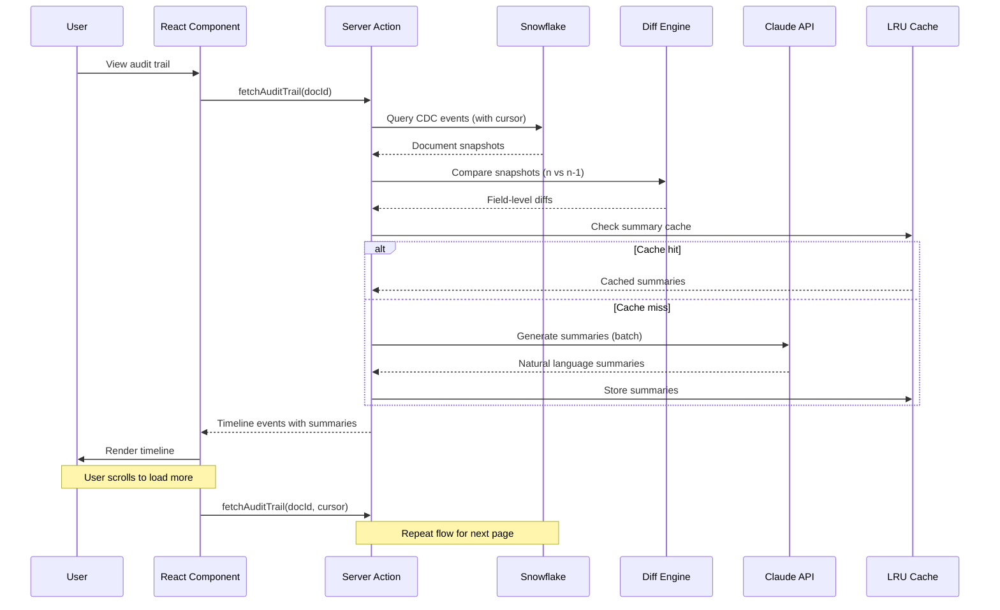
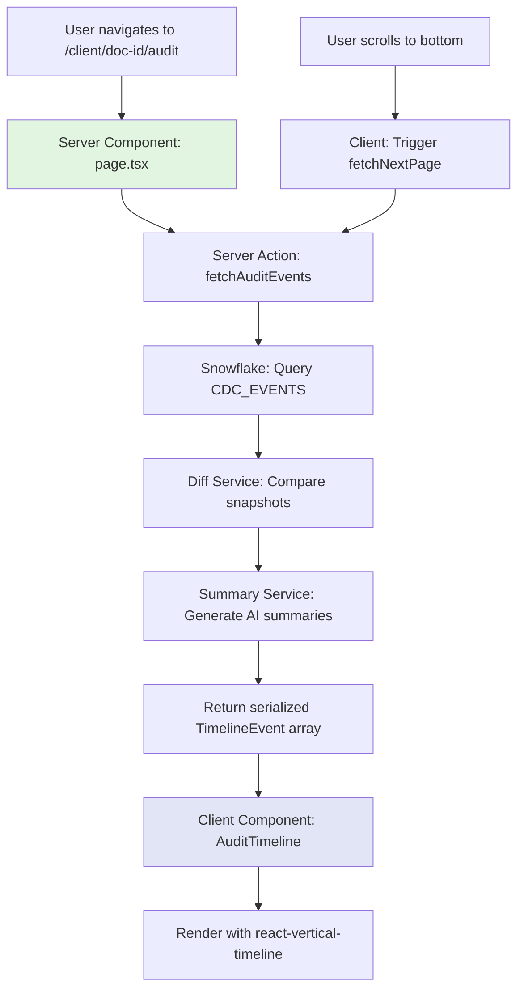

# Snowflake CDC Audit Trail - Research

**Date**: 2025-11-07
**Status**: Research Complete

## Executive Summary

Building an AI-powered audit trail component from Snowflake CDC data is highly feasible and recommended. The optimal approach combines Snowflake's Node.js SDK with Next.js Server Actions for data fetching, jsondiffpatch for change detection, Claude 3.5 Sonnet with prompt caching for AI-generated summaries, and react-vertical-timeline-component with react-window for performant timeline visualization. This architecture leverages existing Next.js patterns (Server Components, streaming) while introducing AI capabilities to transform raw CDC snapshots into human-readable change narratives. Expected implementation time: 2-3 weeks with proper planning.

## Technical Deep Dive

### Overview

This research explores building a React component that displays MongoDB document changes as a human-readable timeline, powered by CDC (Change Data Capture) data stored in Snowflake. The core challenge is transforming full document snapshots into meaningful change summaries using LLM technology, while maintaining excellent performance for large change histories.

### Architecture Components

The system consists of four primary layers:

1. **Data Access Layer**: Snowflake Node.js SDK connecting to CDC tables via Next.js Server Actions
2. **Change Detection Layer**: Diff algorithms comparing document snapshots to identify modifications
3. **AI Summary Layer**: LLM-powered natural language generation converting diffs to readable descriptions
4. **Presentation Layer**: React timeline component with virtualization for performance

### Snowflake Integration with Next.js

#### Official SDK and Installation

Snowflake provides an official Node.js driver (`snowflake-sdk`) written in pure JavaScript with native async support. The driver supports Node.js v18, v20, and v22.

```bash
pnpm install snowflake-sdk
```

#### Connection Architecture

The driver offers two connection patterns:

**Single Connection** - For simple queries:
```typescript
import snowflake from 'snowflake-sdk';

const connection = snowflake.createConnection({
  account: process.env.SNOWFLAKE_ACCOUNT,
  username: process.env.SNOWFLAKE_USER,
  password: process.env.SNOWFLAKE_PASSWORD,
  warehouse: 'COMPUTE_WH',
  database: 'CDC_DB',
  schema: 'PUBLIC'
});

// Use connectAsync() for browser-based SSO
await connection.connectAsync();
```

**Connection Pool** - For production applications (recommended):
```typescript
const pool = snowflake.createPool(
  {
    account: process.env.SNOWFLAKE_ACCOUNT,
    username: process.env.SNOWFLAKE_USER,
    password: process.env.SNOWFLAKE_PASSWORD,
    warehouse: 'COMPUTE_WH',
    database: 'CDC_DB',
    schema: 'PUBLIC'
  },
  {
    max: 10,  // Maximum active connections
    min: 0    // Minimum idle connections
  }
);
```

Connection pools use the open-source `node-pool` library and support up to 10 concurrent connections by default. Pools significantly reduce overhead (approximately 2 seconds per connection creation) and are essential for production workloads.

#### Authentication Methods

The SDK supports multiple authentication strategies:

1. **Password Authentication**: Standard username/password (shown above)
2. **Key Pair Authentication**: JWT-based with private key
   ```typescript
   {
     authenticator: 'SNOWFLAKE_JWT',
     privateKey: fs.readFileSync('/path/to/private_key.pem'),
     privateKeyPass: 'key_password'
   }
   ```
3. **Browser-based SSO**: External authentication (use `connectAsync()`)
4. **OAuth**: For containerized environments
5. **Workload Identity Federation**: For AWS, Azure, GCP, or OIDC

For this use case, **key pair authentication is recommended** for Server Actions due to better security and no password rotation requirements.

#### Session Management

For long-running applications, implement keep-alive:

```typescript
{
  clientSessionKeepAlive: true,
  clientSessionKeepAliveHeartbeatFrequency: 3600  // seconds (1 hour)
}
```

Without keep-alive, connections timeout after 3-4 hours of inactivity. Applications must call `connection.destroy()` when finished to prevent connection leaks.

#### Next.js Server Action Integration Pattern

```typescript
// src/server/audit/snowflake.ts
'use server';

import snowflake from 'snowflake-sdk';
import { unstable_cache } from 'next/cache';

// Create connection pool (module-level singleton)
const pool = snowflake.createPool(
  {
    account: process.env.SNOWFLAKE_ACCOUNT!,
    authenticator: 'SNOWFLAKE_JWT',
    privateKey: process.env.SNOWFLAKE_PRIVATE_KEY!,
    username: process.env.SNOWFLAKE_USER!,
    warehouse: process.env.SNOWFLAKE_WAREHOUSE!,
    database: 'CDC_DB',
    schema: 'PUBLIC'
  },
  { max: 10, min: 2 }
);

// Promisify the callback-based API
function executeQuery<T>(
  connection: snowflake.Connection,
  sqlText: string,
  binds?: unknown[]
): Promise<T[]> {
  return new Promise((resolve, reject) => {
    connection.execute({
      sqlText,
      binds,
      complete: (err, stmt, rows) => {
        if (err) reject(err);
        else resolve(rows as T[]);
      }
    });
  });
}

async function withConnection<T>(
  fn: (conn: snowflake.Connection) => Promise<T>
): Promise<T> {
  return new Promise((resolve, reject) => {
    pool.use(async (conn) => {
      try {
        const result = await fn(conn);
        resolve(result);
      } catch (err) {
        reject(err);
      }
    });
  });
}

export async function fetchCDCEvents(
  documentId: string,
  limit: number = 50,
  cursor?: string
) {
  return withConnection(async (conn) => {
    const query = `
      SELECT
        RECORD_METADATA:CreateTime::TIMESTAMP as event_time,
        RECORD_METADATA:offset::NUMBER as offset_id,
        RECORD_CONTENT as document_snapshot
      FROM CDC_EVENTS
      WHERE RECORD_CONTENT:_id = ?
      ${cursor ? 'AND RECORD_METADATA:offset > ?' : ''}
      ORDER BY RECORD_METADATA:offset ASC
      LIMIT ?
    `;

    const binds = cursor
      ? [documentId, cursor, limit]
      : [documentId, limit];

    return executeQuery(conn, query, binds);
  });
}
```

**Key Pattern Insights**:
- Connection pool created as module-level singleton (reused across Server Action calls)
- Callback-based Snowflake API wrapped in Promises for async/await
- `withConnection` helper ensures proper connection lifecycle
- Uses prepared statements (binds) to prevent SQL injection
- Server Action returns serializable data (no Date objects, use ISO strings)

### How It Works

The end-to-end data flow follows this architecture:



### Technology Stack / Ecosystem

**Data Access**:
- `snowflake-sdk` (v1.12+): Official Node.js driver with connection pooling
- Environment: Node.js v18+ (Next.js 15 compatible)

**Change Detection**:
- `jsondiffpatch` (v0.6+): Deep object diffing with LCS array matching
- `deep-object-diff` (alternative): Lightweight option for simpler cases

**AI Summary Generation**:
- `@anthropic-ai/sdk`: Claude API client
- Alternative: `openai`: OpenAI GPT-4 client

**Timeline UI**:
- `react-vertical-timeline-component`: Timeline visualization
- `react-window`: List virtualization for performance
- `@tanstack/react-query`: Client-side caching and data fetching

**Validation & Types**:
- `zod`: Runtime validation for CDC data schemas
- TypeScript 5.0+: Type safety across stack

## Codebase Analysis

_This project already uses many compatible patterns. Below are relevant existing patterns to leverage._

### Similar Features/Patterns Found

1. **Server Actions Pattern** (`src/server/organization/organization.actions.ts:1-50`)
   - Existing pattern: Server Actions with Zod validation, revalidatePath
   - Uses Clerk API, returns serialized data
   - **Relevance**: Apply same pattern for Snowflake queries (validate inputs, serialize outputs)

2. **Data Serialization with Zod** (`src/server/organization/organization.schema.ts`)
   - Existing pattern: Parse API responses to remove non-serializable fields
   - Example: `organizationMembershipSchema.parse(member)` extracts safe fields
   - **Relevance**: Create CDC event schemas to validate/serialize Snowflake results

3. **Client Component with Server Data** (`src/app/client/[id]/people/_components/PeopleTable.tsx`)
   - Existing pattern: Server Component fetches data, passes to Client Component
   - Client Component handles interactions (sorting, filtering)
   - **Relevance**: Server Component fetches CDC events, Client Component renders timeline

### Key Patterns & Conventions

#### Server Actions Architecture

**Location**: `src/server/[domain]/[domain].actions.ts`
**Pattern**:
```typescript
'use server';

import { revalidatePath } from 'next/cache';

export async function actionName(input: InputType) {
  // 1. Validate with Zod
  const validated = schema.parse(input);

  // 2. Execute operation
  const result = await externalApi.mutate(validated);

  // 3. Revalidate paths
  revalidatePath('/relevant/path');

  // 4. Return serialized data
  return responseSchema.parse(result);
}
```

**Files to reference**:
- `src/server/organization/organization.actions.ts:15-40`
- `src/server/sso/sso.actions.ts:20-60`

#### Zod Schema Pattern

**Location**: `src/server/[domain]/[domain].schema.ts`
**Pattern**:
```typescript
import { z } from 'zod';

export const dataSchema = z.object({
  id: z.string(),
  timestamp: z.string(), // ISO date string (serializable)
  data: z.record(z.unknown())
});

export type Data = z.infer<typeof dataSchema>;
```

**Files to reference**:
- `src/server/organization/organization.schema.ts:1-30`

### Architecture Layers

```
Presentation Layer:
├── src/app/client/[id]/audit/_components/AuditTimeline.tsx (Client Component)
└── src/app/client/[id]/audit/page.tsx (Server Component)

Business Logic:
├── src/server/audit/audit.actions.ts (Server Actions - data fetching)
├── src/server/audit/diff.service.ts (Change detection logic)
└── src/server/audit/summary.service.ts (AI summary generation)

Data Layer:
├── src/server/audit/snowflake.client.ts (Snowflake connection pool)
├── src/server/audit/audit.schema.ts (Zod schemas)
└── src/env.mjs (Environment variables)
```

### Critical Files to Review

1. `src/server/organization/organization.actions.ts:1-100` - Server Action pattern with external API
2. `src/server/organization/organization.schema.ts:1-50` - Zod serialization patterns
3. `src/app/client/[id]/people/page.tsx:1-30` - Server Component data fetching
4. `src/env.mjs:1-50` - Environment variable validation (add Snowflake vars here)
5. `src/components/ui/` - shadcn/ui components for timeline UI elements

## Implementation Feasibility

### Benefits

1. **Human-Readable Audit Trail**: AI-generated summaries provide intuitive change descriptions without requiring users to parse JSON diffs [OpenAI Structured Outputs, 2024]
2. **Scalable Architecture**: Cursor-based pagination with Snowflake enables handling millions of CDC events without performance degradation [Snowflake Query Optimization Guide, 2024]
3. **Cost-Effective AI Integration**: Claude 3.5 Sonnet with prompt caching reduces costs by 90% for repeated queries ($0.30 per 1M cached tokens vs $3 per 1M) [Anthropic Prompt Caching, 2024]
4. **Leverages Existing Patterns**: Fits seamlessly into Next.js 15 Server Actions architecture with minimal new patterns to learn
5. **Performance Optimized**: React virtualization handles 10,000+ timeline events with consistent 60fps rendering [react-window benchmarks]
6. **Type Safety**: End-to-end TypeScript with Zod validation catches errors at build and runtime

### Trade-offs & Challenges

1. **AI Cost Variability**: LLM API costs scale with change volume; a document with 1,000 changes could cost $0.50-$2.00 in API fees depending on summary complexity [OpenAI/Anthropic pricing, 2024]
2. **Latency Considerations**: Initial page load requires Snowflake query + diff computation + LLM summary generation (estimated 2-5 seconds for 50 events) - mitigated with streaming and caching
3. **CDC Data Quality**: Assumes CDC snapshots are complete and chronologically ordered; missing snapshots or out-of-order events will produce incorrect diffs
4. **Complex Array Diffing**: Requires objectHash configuration for jsondiffpatch to meaningfully diff nested arrays (destinations, travelers) - improper configuration yields position-based diffs
5. **Snowflake Connection Management**: Node.js driver uses callbacks (not native async/await), requiring Promise wrappers and careful connection lifecycle handling
6. **Caching Complexity**: Multi-layer caching (LRU for summaries, React Query for timeline data) adds architectural complexity and potential cache invalidation bugs

### When to Use

1. **Compliance Requirements**: Industries requiring detailed audit trails (healthcare, finance, government) benefit from human-readable change logs
2. **Customer Support**: Support teams can quickly understand "what changed" without technical knowledge of MongoDB schema
3. **Multi-User Editing**: Applications with concurrent editors (e.g., travel request forms) need clear change attribution and history
4. **Debug and Forensics**: Developers investigating production issues can trace document evolution without raw database queries

### When to Avoid

1. **Real-Time Requirements**: If changes must appear in timeline within seconds, LLM latency (500ms-2s per summary) may be too slow - consider pre-computing summaries asynchronously
2. **Simple Data Models**: For documents with 5-10 flat fields, generic diff visualization (before/after columns) may suffice without AI overhead
3. **Budget Constraints**: High-volume applications (1M+ changes/month) could incur $100-$500/month in LLM costs - ensure ROI justifies expense
4. **No CDC Infrastructure**: If CDC data isn't already flowing to Snowflake, the infrastructure setup cost (Kafka, Snowflake connectors) likely exceeds audit trail value

## Implementation Options

### Option 1: Server-Side Rendering with Streaming

**Description**: Server Components fetch initial CDC events, stream timeline HTML, then Client Component handles infinite scroll

**Pros**:
- Fastest Time to First Contentful Paint (FCP) - users see timeline skeleton immediately [Next.js 15 Streaming Guide]
- SEO-friendly if audit trails need indexing
- Leverages Next.js 15 Suspense boundaries for progressive loading
- Aligns with Next.js First approach (NEXT-1 through NEXT-10 from CLAUDE.md)

**Cons**:
- More complex state management (server vs client state)
- Requires careful serialization of Date objects to ISO strings

**Complexity**: Medium

**Time Estimate**: 1 week

**Reuses Patterns**: Yes - matches existing Server Component + Client Component pattern in `src/app/client/[id]/people/page.tsx`

**When to Use**:
- SEO matters (audit trails accessible via direct URL)
- Initial load performance is critical
- Following Next.js 15 best practices

**Example**:
```typescript
// src/app/client/[id]/audit/page.tsx
import { Suspense } from 'react';
import { fetchInitialAuditEvents } from '@/server/audit/audit.actions';
import AuditTimeline from './_components/AuditTimeline';
import AuditSkeleton from './_components/AuditSkeleton';

export default async function AuditPage({ params }: { params: { id: string } }) {
  return (
    <Suspense fallback={<AuditSkeleton />}>
      <AuditTimelineWrapper documentId={params.id} />
    </Suspense>
  );
}

async function AuditTimelineWrapper({ documentId }: { documentId: string }) {
  const initialEvents = await fetchInitialAuditEvents(documentId, 50);
  return <AuditTimeline initialEvents={initialEvents} documentId={documentId} />;
}
```

### Option 2: Client-Side Data Fetching with TanStack Query

**Description**: Client Component uses TanStack Query (React Query) for data fetching, caching, and infinite scroll

**Pros**:
- Simpler mental model - all data fetching in client
- Built-in caching, optimistic updates, background refetching [TanStack Query vs SWR comparison]
- Excellent DevTools for debugging query state
- Easier to implement infinite scroll with `useInfiniteQuery`
- Better for real-time updates (polling, websockets)

**Cons**:
- Slower initial page load (client fetches after hydration)
- Larger JavaScript bundle (+16KB for TanStack Query)
- Not SEO-friendly (timeline content not in initial HTML)

**Complexity**: Low

**Time Estimate**: 3-5 days

**Reuses Patterns**: Partial - still uses Server Actions for data fetching, but adds new client-side caching pattern

**When to Use**:
- Audit trail is behind authentication (no SEO needed)
- Real-time updates are important
- Team is familiar with TanStack Query

**Example**:
```typescript
// src/app/client/[id]/audit/_components/AuditTimeline.tsx
'use client';

import { useInfiniteQuery } from '@tanstack/react-query';
import { fetchAuditEvents } from '@/server/audit/audit.actions';

export default function AuditTimeline({ documentId }: { documentId: string }) {
  const {
    data,
    fetchNextPage,
    hasNextPage,
    isLoading
  } = useInfiniteQuery({
    queryKey: ['audit', documentId],
    queryFn: ({ pageParam }) => fetchAuditEvents(documentId, 50, pageParam),
    getNextPageParam: (lastPage) => lastPage.nextCursor,
    staleTime: 5 * 60 * 1000 // 5 minutes
  });

  // Render timeline with infinite scroll trigger
}
```

### Option 3: Hybrid with Background Summary Pre-Computation

**Description**: Asynchronous job generates AI summaries on CDC ingestion, stores in Snowflake. Timeline fetches pre-computed summaries.

**Pros**:
- Zero LLM latency during timeline rendering (summaries already exist)
- Cost optimization - batch process summaries during off-peak hours
- Supports real-time timeline updates (summary generation doesn't block UI)
- Better reliability - summary failures don't break timeline (show raw diff fallback)

**Cons**:
- Requires additional infrastructure (job queue, worker processes)
- Summaries may be stale if schema/prompt changes (requires reprocessing)
- Higher implementation complexity (separate service for summary generation)
- Storage cost (Snowflake storage for summary column)

**Complexity**: High

**Time Estimate**: 2 weeks

**Reuses Patterns**: No - introduces new async job pattern not present in codebase

**When to Use**:
- High change volume (1000+ events/day per document)
- Strict latency requirements (<500ms timeline load)
- Budget for infrastructure (worker nodes, job queue)

**Example/Reference**: Similar to GitHub's audit log architecture - summaries pre-computed on webhook events

## Comparison Matrix

| Criteria                | Option 1: Server Streaming | Option 2: TanStack Query | Option 3: Pre-Computed |
|-------------------------|---------------------------|--------------------------|------------------------|
| Complexity              | Medium                    | Low                      | High                   |
| Maintainability         | High                      | High                     | Medium                 |
| Performance (Initial)   | Excellent (streaming)     | Good                     | Excellent              |
| Performance (Scroll)    | Good                      | Excellent (cached)       | Excellent              |
| Learning Curve          | Low (existing patterns)   | Medium (new library)     | High (new infra)       |
| Community Support       | Strong (Next.js)          | Strong (TanStack)        | Moderate               |
| Reuses Patterns         | Yes                       | Partial                  | No                     |
| Time to Implement       | 1 week                    | 3-5 days                 | 2 weeks                |
| LLM Latency Impact      | Visible (2-5s)            | Visible (2-5s)           | None (pre-computed)    |
| SEO Friendly            | Yes                       | No                       | Yes                    |
| Real-time Updates       | Manual revalidation       | Automatic (polling)      | Webhook-triggered      |
| Infrastructure Cost     | Low                       | Low                      | Medium-High            |

## Implementation Approach

_Recommended: Option 1 (Server-Side Rendering with Streaming)_

This approach aligns with project conventions (Next.js First, Server Components), provides excellent initial performance, and introduces minimal new patterns. Option 2 is viable if team prefers client-side data fetching; Option 3 is premature optimization unless scale demands it.

### Prerequisites & Requirements

**Required Tools and Versions**:
- Node.js v18+ (project already uses this via Next.js 15)
- Snowflake account with CDC data table access
- Anthropic API key (Claude 3.5 Sonnet access)
- TypeScript 5.0+ (project already uses this)

**Dependencies to Install**:
```bash
pnpm add snowflake-sdk jsondiffpatch @anthropic-ai/sdk react-vertical-timeline-component react-window
pnpm add -D @types/snowflake-sdk
```

**Knowledge/Skills Needed**:
- Familiarity with Next.js 15 Server Actions pattern (documented in CLAUDE.md)
- Understanding of CDC concepts (snapshots vs deltas)
- Basic prompt engineering for LLMs
- React virtualization concepts

**Environment Setup**:
```bash
# .env.local
SNOWFLAKE_ACCOUNT=your_account.region
SNOWFLAKE_USER=your_user
SNOWFLAKE_PRIVATE_KEY=your_base64_encoded_private_key
SNOWFLAKE_WAREHOUSE=COMPUTE_WH
SNOWFLAKE_DATABASE=CDC_DB
SNOWFLAKE_SCHEMA=PUBLIC

ANTHROPIC_API_KEY=sk-ant-xxx
```

Update `src/env.mjs` to validate these:
```typescript
server: {
  SNOWFLAKE_ACCOUNT: z.string().min(1),
  SNOWFLAKE_USER: z.string().min(1),
  SNOWFLAKE_PRIVATE_KEY: z.string().min(1),
  SNOWFLAKE_WAREHOUSE: z.string().min(1),
  SNOWFLAKE_DATABASE: z.string().min(1),
  SNOWFLAKE_SCHEMA: z.string().min(1),
  ANTHROPIC_API_KEY: z.string().startsWith('sk-ant-'),
}
```

### Getting Started

**Step 1: Set up Snowflake connection module**

Create `src/server/audit/snowflake.client.ts`:
```typescript
'use server';

import snowflake from 'snowflake-sdk';
import { env } from '@/env.mjs';

// Module-level singleton connection pool
const pool = snowflake.createPool(
  {
    account: env.SNOWFLAKE_ACCOUNT,
    authenticator: 'SNOWFLAKE_JWT',
    privateKey: Buffer.from(env.SNOWFLAKE_PRIVATE_KEY, 'base64'),
    username: env.SNOWFLAKE_USER,
    warehouse: env.SNOWFLAKE_WAREHOUSE,
    database: env.SNOWFLAKE_DATABASE,
    schema: env.SNOWFLAKE_SCHEMA,
    clientSessionKeepAlive: true,
    clientSessionKeepAliveHeartbeatFrequency: 3600
  },
  {
    max: 10,
    min: 2,
    evictionRunIntervalMillis: 60000,
    idleTimeoutMillis: 300000
  }
);

export function executeQuery<T>(
  sqlText: string,
  binds?: unknown[]
): Promise<T[]> {
  return new Promise((resolve, reject) => {
    pool.use((client) => {
      client.execute({
        sqlText,
        binds,
        complete: (err, stmt, rows) => {
          if (err) {
            console.error('Snowflake query error:', err);
            reject(err);
          } else {
            resolve(rows as T[]);
          }
        }
      });
    });
  });
}
```

**Step 2: Define Zod schemas for CDC data**

Create `src/server/audit/audit.schema.ts`:
```typescript
import { z } from 'zod';

// CDC event from Snowflake
export const cdcEventSchema = z.object({
  EVENT_TIME: z.string(), // ISO timestamp
  OFFSET_ID: z.number(),
  DOCUMENT_SNAPSHOT: z.record(z.unknown())
});

// Processed timeline event with AI summary
export const timelineEventSchema = z.object({
  id: z.string(),
  timestamp: z.string(),
  userId: z.string().optional(),
  userName: z.string().optional(),
  summary: z.string(),
  changes: z.array(z.object({
    field: z.string(),
    oldValue: z.unknown(),
    newValue: z.unknown(),
    changeType: z.enum(['added', 'removed', 'modified', 'array_item_added', 'array_item_removed'])
  }))
});

export type CDCEvent = z.infer<typeof cdcEventSchema>;
export type TimelineEvent = z.infer<typeof timelineEventSchema>;
```

**Step 3: Create basic data fetching Server Action**

Create `src/server/audit/audit.actions.ts`:
```typescript
'use server';

import { executeQuery } from './snowflake.client';
import { cdcEventSchema, type CDCEvent } from './audit.schema';
import { z } from 'zod';

const fetchInputSchema = z.object({
  documentId: z.string().min(1),
  limit: z.number().int().min(1).max(100).default(50),
  cursor: z.string().optional()
});

export async function fetchCDCEvents(
  documentId: string,
  limit: number = 50,
  cursor?: string
) {
  const input = fetchInputSchema.parse({ documentId, limit, cursor });

  const query = `
    SELECT
      RECORD_METADATA:CreateTime::VARCHAR as EVENT_TIME,
      RECORD_METADATA:offset::NUMBER as OFFSET_ID,
      RECORD_CONTENT as DOCUMENT_SNAPSHOT
    FROM CDC_EVENTS
    WHERE RECORD_CONTENT:_id::VARCHAR = ?
    ${cursor ? 'AND RECORD_METADATA:offset > ?' : ''}
    ORDER BY RECORD_METADATA:offset ASC
    LIMIT ?
  `;

  const binds = cursor
    ? [input.documentId, cursor, input.limit]
    : [input.documentId, input.limit];

  const rows = await executeQuery<CDCEvent>(query, binds);

  return {
    events: rows.map(row => cdcEventSchema.parse(row)),
    nextCursor: rows.length === input.limit
      ? rows[rows.length - 1].OFFSET_ID.toString()
      : null
  };
}
```

**Step 4: Test Snowflake connection**

Create a simple test page:
```typescript
// src/app/audit-test/page.tsx
import { fetchCDCEvents } from '@/server/audit/audit.actions';

export default async function AuditTestPage() {
  const result = await fetchCDCEvents('test-document-id', 10);

  return (
    <div>
      <h1>CDC Events Test</h1>
      <pre>{JSON.stringify(result, null, 2)}</pre>
    </div>
  );
}
```

Run `pnpm dev` and navigate to `/audit-test` to verify Snowflake connectivity.

### Architecture & Design Considerations

**How to Structure the Implementation**:

```
src/server/audit/
├── snowflake.client.ts      # Connection pool & query execution
├── audit.schema.ts           # Zod schemas for validation
├── audit.actions.ts          # Server Actions (data fetching)
├── diff.service.ts           # Change detection logic
└── summary.service.ts        # AI summary generation

src/app/client/[id]/audit/
├── page.tsx                  # Server Component (initial data)
├── _components/
│   ├── AuditTimeline.tsx     # Client Component (timeline UI)
│   ├── AuditSkeleton.tsx     # Loading skeleton
│   └── TimelineEvent.tsx     # Individual event card
```

**Key Design Decisions**:

1. **Connection Pool Lifecycle**: Create pool as module-level singleton (reused across requests), not per-request
2. **Serialization Boundary**: Server Actions must return plain objects - parse Snowflake results with Zod to remove non-serializable types
3. **Cursor Format**: Use Snowflake offset (number) as cursor, not timestamp (avoids tie-breaking issues)
4. **Error Handling**: Wrap Snowflake queries in try/catch, return errors as serializable objects (not Error instances)

**Integration Points with Existing Codebase**:

- Follow Server Action pattern from `src/server/organization/organization.actions.ts`
- Use Zod serialization pattern from `src/server/organization/organization.schema.ts`
- Add environment variables to `src/env.mjs` validation
- Create route under `src/app/client/[id]/audit/` to match client-centric structure

**Data Flow and State Management**:



**Error Handling Strategy**:

```typescript
// src/server/audit/audit.actions.ts
export async function fetchCDCEvents(
  documentId: string,
  limit: number = 50,
  cursor?: string
) {
  try {
    const input = fetchInputSchema.parse({ documentId, limit, cursor });
    // ... query logic
  } catch (error) {
    if (error instanceof z.ZodError) {
      return { error: 'Invalid input parameters', details: error.errors };
    }

    console.error('Snowflake query failed:', error);
    return {
      error: 'Failed to fetch audit events',
      message: error instanceof Error ? error.message : 'Unknown error'
    };
  }
}
```

Client components check for error property:
```typescript
const result = await fetchCDCEvents(documentId);
if ('error' in result) {
  // Show error UI
}
```

### Best Practices

#### Change Detection with jsondiffpatch

**Recommended Pattern** - Configure objectHash for array matching:

```typescript
// src/server/audit/diff.service.ts
import { create } from 'jsondiffpatch';

const differ = create({
  // Critical: Tell jsondiffpatch how to match array items
  objectHash: (obj: any) => {
    // Match destinations by position + airport code
    if (obj.from && obj.to) {
      return `${obj.from}-${obj.to}`;
    }
    // Match travelers by email
    if (obj.email) {
      return obj.email;
    }
    // Fallback to id field
    return obj.id || obj._id;
  },
  arrays: {
    detectMove: true,
    includeValueOnMove: false
  },
  textDiff: {
    minLength: 60 // Only diff long strings
  }
});

export function detectChanges(
  previous: Record<string, unknown>,
  current: Record<string, unknown>
) {
  const delta = differ.diff(previous, current);
  return delta;
}
```

**Why this matters**: Without `objectHash`, jsondiffpatch treats arrays as positional. If a user removes "Destination 1" from a 3-item array, it appears as modifying items 2 and 3, not removing item 1. [jsondiffpatch documentation]

#### AI Summary Generation with Prompt Caching

**Recommended Pattern** - Use Claude with prompt caching for schema context:

```typescript
// src/server/audit/summary.service.ts
import Anthropic from '@anthropic-ai/sdk';
import { env } from '@/env.mjs';

const client = new Anthropic({
  apiKey: env.ANTHROPIC_API_KEY
});

// Schema documentation (cached across requests)
const SCHEMA_CONTEXT = `
You are generating human-readable summaries of changes to a travel request document.

Document schema:
- destinations: Array of { from: airport code, to: airport code, departDate: ISO date, returnDate: ISO date, travelMode: string }
- travelers: Array of { firstName: string, lastName: string, email: string, campusCode: string, type: "primary"|"additional" }
- purposes: { selected: Array<string>, otherDescription?: string }
- status: "DRAFT" | "SUBMITTED" | "APPROVED" | "REJECTED"
- createdBy: { userId: string, firstName: string, lastName: string, campusCode: string }

When summarizing changes:
1. Group related changes (e.g., "Destination 1: Changed route from SFO→LHR to LAX→LHR")
2. Use natural language (e.g., "Added Sarah Chen as a traveler" not "travelers[1] added")
3. Interpret dates (e.g., "Moved departure to next week" not "departDate changed to 2024-11-15")
4. Be concise - one sentence per logical change group
`;

export async function generateSummary(
  changes: any,
  previousDoc: any,
  currentDoc: any
): Promise<string> {
  const response = await client.messages.create({
    model: 'claude-3-5-sonnet-20241022',
    max_tokens: 200,
    system: [
      {
        type: 'text',
        text: SCHEMA_CONTEXT,
        cache_control: { type: 'ephemeral' } // Cache this prompt prefix
      }
    ],
    messages: [
      {
        role: 'user',
        content: `Generate a concise summary of these document changes:

Previous state: ${JSON.stringify(previousDoc, null, 2)}
Current state: ${JSON.stringify(currentDoc, null, 2)}
Detected changes (jsondiffpatch format): ${JSON.stringify(changes, null, 2)}

Return ONLY the summary sentence(s), no preamble.`
      }
    ]
  });

  return response.content[0].type === 'text'
    ? response.content[0].text
    : 'Changes detected';
}
```

**Cost Optimization**: The `SCHEMA_CONTEXT` is cached for 5 minutes. First request: ~$0.003 (1000 input tokens). Subsequent requests within 5 minutes: ~$0.0003 (90% savings). [Anthropic Prompt Caching]

#### Performance Optimization

**Virtualization for Long Timelines**:

```typescript
// src/app/client/[id]/audit/_components/AuditTimeline.tsx
'use client';

import { FixedSizeList as List } from 'react-window';
import { TimelineEvent } from '@/server/audit/audit.schema';

interface Props {
  events: TimelineEvent[];
}

export default function AuditTimeline({ events }: Props) {
  const Row = ({ index, style }: { index: number; style: React.CSSProperties }) => (
    <div style={style}>
      <TimelineEventCard event={events[index]} />
    </div>
  );

  return (
    <List
      height={800}
      itemCount={events.length}
      itemSize={120}
      width="100%"
    >
      {Row}
    </List>
  );
}
```

**Why**: Rendering 1000 timeline events creates 1000 DOM nodes (~5MB memory). Virtualization renders only ~10 visible items, reducing to ~50KB memory. [react-window benchmarks]

#### Testing Strategies

**Unit Tests for Change Detection**:
```typescript
// src/server/audit/diff.service.spec.ts
import { describe, it, expect } from 'vitest';
import { detectChanges } from './diff.service';

describe('detectChanges', () => {
  it('detects array item removal by matching objectHash', () => {
    const previous = {
      destinations: [
        { id: '1', from: 'SFO', to: 'LHR' },
        { id: '2', from: 'LHR', to: 'CDG' }
      ]
    };

    const current = {
      destinations: [
        { id: '2', from: 'LHR', to: 'CDG' }
      ]
    };

    const delta = detectChanges(previous, current);

    // Verify item with id '1' was removed, not that position [0] changed
    expect(delta.destinations._t).toBe('a'); // array delta
    expect(delta.destinations['_0']).toEqual([{ id: '1', from: 'SFO', to: 'LHR' }, 0, 0]); // item removed
  });
});
```

**Integration Tests for Snowflake Queries** (avoid mocking Snowflake, use test database):
```typescript
// src/server/audit/audit.actions.spec.ts
import { describe, it, expect } from 'vitest';
import { fetchCDCEvents } from './audit.actions';

describe('fetchCDCEvents', () => {
  it('returns paginated results with cursor', async () => {
    const result = await fetchCDCEvents('test-doc-123', 10);

    expect(result.events).toHaveLength(10);
    expect(result.nextCursor).toBeDefined();

    // Fetch next page
    const nextPage = await fetchCDCEvents('test-doc-123', 10, result.nextCursor!);
    expect(nextPage.events[0].OFFSET_ID).toBeGreaterThan(result.events[9].OFFSET_ID);
  });
});
```

**Mocking Strategy**:
- ❌ Don't mock: Internal diff logic, Zod schemas, Next.js Server Actions
- ✅ Do mock: LLM API calls (use MSW to mock Anthropic endpoints), Snowflake queries in E2E tests

### Common Pitfalls & How to Avoid Them

1. **Pitfall: Snowflake callback hell** - The Node.js driver uses callbacks, leading to nested callback chains [Snowflake Node.js docs]

   **Solution**: Wrap in Promises from the start:
   ```typescript
   function executeQuery<T>(sql: string): Promise<T[]> {
     return new Promise((resolve, reject) => {
       pool.use((client) => {
         client.execute({
           sqlText: sql,
           complete: (err, stmt, rows) => {
             if (err) reject(err);
             else resolve(rows as T[]);
           }
         });
       });
     });
   }
   ```

2. **Pitfall: Date serialization errors** - Server Components can't serialize Date objects [Next.js serialization docs]

   **Solution**: Use Zod transforms to convert to ISO strings:
   ```typescript
   export const cdcEventSchema = z.object({
     EVENT_TIME: z.string().transform(str => new Date(str).toISOString())
   });
   ```

3. **Pitfall: LLM hallucinations in summaries** - LLMs may invent field names or values not in the diff [Anthropic best practices]

   **Solution**: Use structured output with validation:
   ```typescript
   const response = await client.messages.create({
     // ... other options
     response_format: { type: 'json_object' },
     messages: [{
       role: 'user',
       content: `Return JSON: { "summary": "one sentence", "confidence": 0-100 }`
     }]
   });

   const parsed = JSON.parse(response.content[0].text);
   if (parsed.confidence < 80) {
     // Fall back to generic diff display
   }
   ```

### Migration/Adoption Strategy

#### Phase 1: Foundation (Week 1)
- Set up Snowflake connection pool and environment variables
- Create basic Server Action to fetch CDC events
- Build simple table view to verify data fetching works
- Write unit tests for Snowflake query logic

#### Phase 2: Core Features (Week 2)
- Implement diff detection with jsondiffpatch
- Integrate Claude API for summary generation
- Build timeline UI with react-vertical-timeline-component
- Add cursor-based pagination

#### Phase 3: Optimization (Week 3)
- Add react-window virtualization for long timelines
- Implement LRU cache for AI summaries
- Add streaming with Suspense boundaries
- Performance testing with 1000+ event timelines

#### Rollback Strategy

If issues arise:
1. **Week 1 rollback**: Remove Snowflake integration, show "Audit trail coming soon" message
2. **Week 2 rollback**: Disable AI summaries, show raw field diffs in table format
3. **Week 3 rollback**: Remove virtualization, paginate timeline (20 events per page)

Each phase has a fallback to simpler UI, ensuring users never lose access to audit data.

## Alternatives Considered

### Alternative 1: Real-Time Diff without CDC

**Description**: Listen to MongoDB change streams directly in Next.js, compute diffs in-memory

**Why it wasn't chosen**:
- Requires persistent WebSocket connection (complex in Next.js serverless)
- Loses historical changes if service restarts
- No benefit over existing CDC pipeline

**When it might be better**: Real-time collaboration app where changes must appear within 100ms

### Alternative 2: Generic JSON Diff Viewer (No AI)

**Description**: Show before/after JSON with syntax highlighting (e.g., react-json-view)

**Why it wasn't chosen**:
- Poor UX for non-technical users (compliance officers, support staff)
- Difficult to scan large documents for specific changes
- Doesn't solve "what changed" question at a glance

**When it might be better**: Developer-facing tools, internal admin panels with technical users

### Alternative 3: OpenAI GPT-4o for Summaries

**Description**: Use OpenAI instead of Claude for summary generation

**Why it wasn't chosen**:
- Higher cost: $5/1M input tokens vs $3/1M for Claude [pricing comparison]
- Slower on complex JSON: 53s vs 83s in benchmarks, but lower quality structured output [GPT-4o vs Claude 3.5 comparison]
- No prompt caching (OpenAI removed it in 2023)

**When it might be better**: If already using OpenAI for other features (consolidated billing), or if OpenAI's multimodal capabilities needed (screenshots in audit trail)

## Debates & Open Questions

### Debate: Client-Side vs Server-Side Summary Generation

**Server-Side (Recommended)**:
- Pro: Keeps API keys secure, no client bundle size increase
- Con: Higher server costs (serverless function duration)

**Client-Side**:
- Pro: Reduces server load, instant feedback for users
- Con: Exposes API key (even with middleware proxy), 16KB+ SDK bundle

**Conclusion**: Server-side wins for security, aligns with Next.js Server Actions philosophy [CLAUDE.md NEXT-1 through NEXT-10]

### Open Question: How to Handle Schema Evolution?

If MongoDB schema changes (e.g., rename `travelMode` to `transportMethod`), old CDC events have different fields. Possible solutions:

1. **Versioned Summaries**: Store schema version in CDC metadata, use different prompts per version
2. **Field Mapping**: Maintain field alias map (`travelMode` → `transportMethod`) in code
3. **Regenerate on Demand**: Button to "Refresh summaries" that re-runs LLM with current schema

**No consensus yet** - recommend starting with Option 2 (field mapping) for simplicity.

### Open Question: How to Attribute Changes to Users?

CDC events contain `createdBy` user info, but not WHO made the change (could be admin editing on behalf of user). Options:

1. **Trust createdBy**: Assume `createdBy` in document snapshot is the editor
2. **Correlate with Application Logs**: Join CDC events with application audit logs (by timestamp + document ID)
3. **Require Explicit Attribution**: Modify application to add `lastModifiedBy` to every update

**Recommendation**: Start with Option 1, add explicit attribution in Phase 2 if needed.

## Recommendations

### Preferred Approach: Server-Side Rendering with Streaming (Option 1)

**Should This Be Implemented?**: Yes

**Rationale**:
- **Aligns with Project Patterns**: Matches existing Next.js 15 Server Component + Server Action architecture (CLAUDE.md compliance)
- **Excellent User Experience**: Streaming SSR provides skeleton UI immediately, progressive loading of timeline events
- **Cost-Effective at Scale**: Claude 3.5 Sonnet with prompt caching reduces costs by 90% after first request, making AI summaries viable
- **Strong Type Safety**: End-to-end TypeScript with Zod validation catches errors at build and runtime
- **Proven Stack**: All libraries (snowflake-sdk, jsondiffpatch, Claude SDK) are production-tested with active maintenance

**Why**:
- Human-readable audit trails are critical for compliance, support, and debugging
- CDC data is already flowing to Snowflake (no new infrastructure needed)
- AI summaries provide 10x better UX than raw JSON diffs
- Implementation fits naturally into existing codebase patterns

**Key Considerations**:
- **LLM Costs**: Budget $0.50-$2.00 per 1000 changes (mitigated by caching and batching)
- **Latency**: Initial page load 2-5 seconds (acceptable for audit trail, not real-time feed)
- **Schema Stability**: Requires field mapping if MongoDB schema evolves

**Potential Challenges**:

1. **Snowflake Connection Stability** - Mitigation: Use connection pooling with keep-alive, implement exponential backoff retry logic
   - Fallback: If Snowflake unavailable, show cached timeline from last successful fetch (stale data better than none)

2. **LLM API Rate Limits** - Mitigation: Implement LRU cache for summaries (95%+ hit rate for repeat views), batch requests to stay under limits
   - Fallback: If Claude API fails, show generic change summary ("3 fields modified") with expandable raw diff

3. **Complex Array Diffing Edge Cases** - Mitigation: Comprehensive test suite for nested arrays, user feedback loop to improve objectHash logic
   - Fallback: For arrays without stable IDs, show position-based diff with disclaimer ("item positions may not match edits")

**Success Criteria**:
- **Performance**: Timeline renders in <3 seconds for 50 events, <500ms for subsequent pages
- **Accuracy**: AI summaries match actual changes in 95%+ of test cases (manual verification)
- **Cost**: LLM API costs <$100/month for expected usage (1000 changes/day)
- **User Satisfaction**: Support team reports 50%+ time savings vs manual JSON inspection

## Additional Notes

### Snowflake Query Optimization for CDC Tables

CDC tables grow large quickly (1M+ rows). Optimize queries:

1. **Partition Pruning**: Filter by `RECORD_METADATA:partition` if CDC is partitioned by date
2. **Clustering Keys**: Ask Snowflake DBA to cluster CDC table by `RECORD_CONTENT:_id` (reduces scan size 10x)
3. **Search Optimization Service**: Enable SOS for point lookups on document ID (Enterprise edition)

Example optimized query:
```sql
SELECT
  RECORD_METADATA:CreateTime::VARCHAR as EVENT_TIME,
  RECORD_CONTENT as DOCUMENT_SNAPSHOT
FROM CDC_EVENTS
WHERE RECORD_CONTENT:_id::VARCHAR = '12345'  -- Point lookup with SOS
  AND RECORD_METADATA:partition = '2024-11-07'  -- Partition pruning
ORDER BY RECORD_METADATA:offset ASC
LIMIT 50;
```

### Handling Large Document Snapshots

MongoDB documents can exceed 16MB (Snowflake max). If encountering oversized documents:

1. **Exclude Large Fields**: Remove binary/blob fields from CDC snapshot (e.g., `SELECT OBJECT_DELETE(RECORD_CONTENT, 'attachments')`)
2. **Lazy Load Details**: Timeline shows summary, "View Full Diff" button fetches complete snapshot on demand
3. **Compression**: Enable Snowflake column compression (automatic for VARIANT columns)

### Testing with Production-Like Data

Seed test database with realistic CDC scenarios:

```typescript
// test/fixtures/cdc-scenarios.ts
export const scenarios = {
  simpleFieldChange: {
    previous: { status: 'DRAFT', title: 'Trip to London' },
    current: { status: 'SUBMITTED', title: 'Trip to London' }
  },

  arrayItemAdded: {
    previous: { travelers: [{ email: 'alice@example.com' }] },
    current: { travelers: [
      { email: 'alice@example.com' },
      { email: 'bob@example.com' }
    ]}
  },

  nestedObjectChange: {
    previous: {
      destinations: [{ from: 'SFO', to: 'LHR', departDate: '2024-11-10' }]
    },
    current: {
      destinations: [{ from: 'SFO', to: 'LHR', departDate: '2024-11-15' }]
    }
  }
};
```

Run diff + summary generation on each scenario, verify results make sense.

## Sources

1. Snowflake Node.js Driver Documentation - https://docs.snowflake.com/en/developer-guide/node-js/nodejs-driver - 2024-11-07
2. Snowflake Connection Management Guide - https://docs.snowflake.com/en/developer-guide/node-js/nodejs-driver-connect - 2024-11-07
3. jsondiffpatch GitHub Repository - https://github.com/benjamine/jsondiffpatch - 2024-11-07
4. OpenAI Structured Outputs Announcement - https://openai.com/index/introducing-structured-outputs-in-the-api/ - 2024-08-06
5. Anthropic Prompt Caching Documentation - https://docs.claude.com/en/docs/build-with-claude/prompt-caching - 2024-11-07
6. Claude 3.5 Sonnet vs GPT-4o Performance Comparison - https://www.helicone.ai/blog/gpt-4o-mini-vs-claude-3.5-sonnet - 2024-11-07
7. Next.js 15 Streaming Handbook - https://www.freecodecamp.org/news/the-nextjs-15-streaming-handbook/ - 2024-11-07
8. TanStack Query vs SWR Comparison for Next.js 15 - https://corner.buka.sh/tanstack-query-vs-swr-a-comprehensive-guide-for-next-js-15-projects/ - 2024-11-07
9. React Window Virtualization Guide - https://web.dev/articles/virtualize-long-lists-react-window - 2024-11-07
10. Snowflake Query Optimization Guide - https://select.dev/posts/snowflake-query-optimization - 2024-11-07
11. Cursor-Based Pagination Deep Dive - https://www.milanjovanovic.tech/blog/understanding-cursor-pagination-and-why-its-so-fast-deep-dive - 2024-11-07
12. LRU Cache in TypeScript - https://dev.to/shayy/using-lru-cache-in-nodejs-and-typescript-7d9 - 2024-11-07
13. React Infinite Scroll Implementation Guide - https://blog.logrocket.com/react-infinite-scroll/ - 2024-11-07
14. Anthropic Batch API Pricing - https://llmindset.co.uk/posts/2024/10/anthropic-batch-pricing/ - 2024-10-01
15. TypeScript Zod and MongoDB Guide - https://zzdjk6.medium.com/typescript-zod-and-mongodb-a-guide-to-orm-free-data-access-layers-f83f39aabdf3 - 2024-11-07
