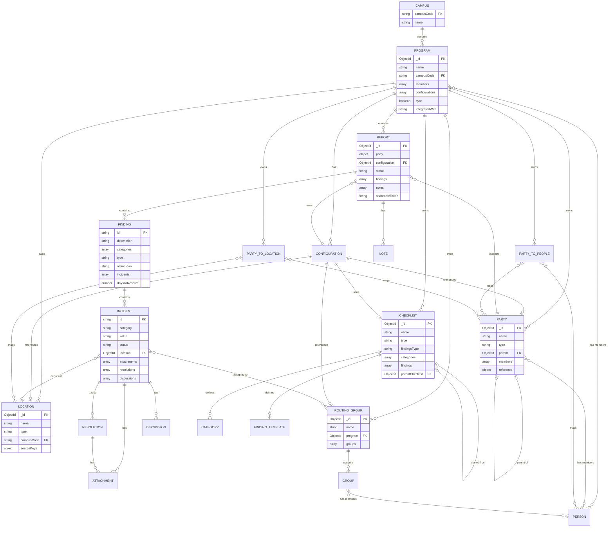
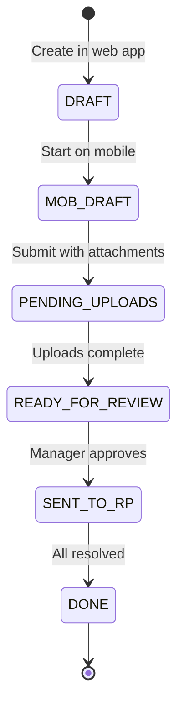
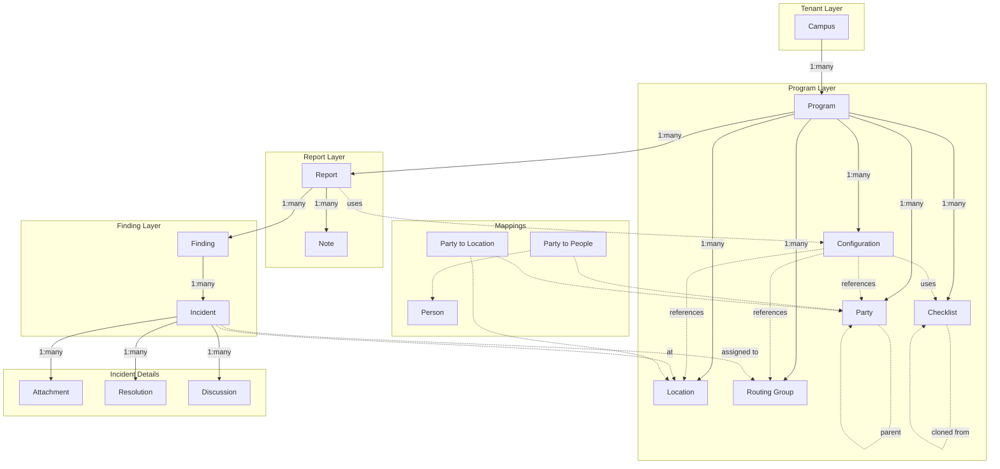
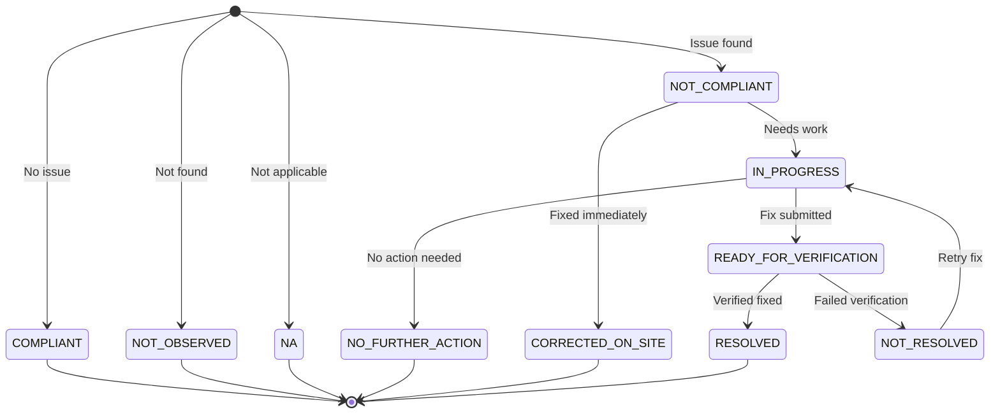

# Inspect Application - Domain Concepts Overview

**Date:** 2025-12-08

## Executive Summary

**Inspect** is an inspection management platform that enables inspectors to track findings and resolutions across physical locations. The system supports offline-first mobile inspections, multi-tenant organizations, role-based workflows, and integration with external ticketing/building management systems.

---

## Domain Diagram

---

## Core Domain Entities

### 1. Campus

The top-level multi-tenant organizational unit.

| Property | Description |
|----------|-------------|
| `campusCode` | Unique identifier for the tenant |
| `name` | Human-readable campus name |

**Role:** Provides tenant isolation. All programs belong to a campus.

---

### 2. Program

The primary container for an inspection program. A program represents a complete inspection initiative with its own configuration, members, and data.

| Property | Description |
|----------|-------------|
| `name` | Program name |
| `campusCode` | Parent campus |
| `members[]` | Users with assigned roles |
| `configurations[]` | Inspection workflow configurations |
| `sync` | External system synchronization flag |
| `integratedWith` | Name of integrated external system |

**Relationships:**
- Contains multiple **Reports**, **Checklists**, **Parties**, **Locations**, and **Routing Groups**
- Members have roles: `INSPECT_ADMIN`, `INSPECT_MANAGER`, `INSPECT_INSPECTOR`, `INSPECT_SUPER_USER`, `INSPECT_ROUTING_GROUP_MANAGER`, `INSPECT_SAFETY_COORDINATOR`

---

### 3. Configuration

Defines how a specific inspection workflow operates within a program.

| Property | Description |
|----------|-------------|
| `checklist` | Which checklist template to use |
| `party` | Default party source |
| `location` | Primary location source |
| `routingGroup` | Incident routing rules |
| `hasReview` | Requires manager review |
| `hasVerification` | Requires resolution verification |
| `ticketingSystem` | Create work orders externally |
| `sendEmail` | Email notification settings |
| `shareableLink` | Enable external sharing |

**Role:** Configures the inspection workflow for different use cases (e.g., fire safety vs. general compliance).

---

### 4. Report

The central document capturing an inspection and its findings.

| Property | Description |
|----------|-------------|
| `party` | Entity being inspected |
| `configuration` | Applied workflow configuration |
| `status` | Current workflow state |
| `findings[]` | Discovered issues |
| `notes[]` | Report-level comments |
| `shareableToken` | External access token |
| `offlineVersion` / `onlineVersion` | Sync versioning |

**Status Workflow:**

- `DRAFT`: Created in web app
- `MOB_DRAFT`: Being worked on mobile (offline-capable)
- `PENDING_UPLOADS`: Waiting for attachments to upload
- `READY_FOR_REVIEW`: Submitted for manager review
- `SENT_TO_RP`: Sent to responsible party for resolution
- `DONE`: All findings resolved, report closed

---

### 5. Finding

An individual compliance issue or observation within a report.

| Property | Description |
|----------|-------------|
| `description` | What was found |
| `categories[]` | Classification categories |
| `type` | Finding type from checklist |
| `actionPlan` | Planned corrective actions |
| `incidents[]` | Specific instances of this finding |
| `daysToResolve` | Expected resolution timeline |

**Role:** Represents a type of issue that may occur at multiple locations/categories.

---

### 6. Incident

A specific instance of a finding at a particular location or category.

| Property | Description |
|----------|-------------|
| `category` | Which category this applies to |
| `location` | Physical location |
| `value` | Compliance value (COMPLIANT, NOT_COMPLIANT, etc.) |
| `status` | Resolution status |
| `correctedOnSite` | Fixed during inspection |
| `attachments[]` | Photos/documents |
| `resolutions[]` | Resolution attempts with tracking |
| `comments[]` / `privateComments[]` | Communication |
| `discussions[]` | Threaded conversations |
| `routingGroups[]` | Responsible teams |
| `workOrderNumber` | External ticket reference |

**Status Values:**
- `NOT_OBSERVED` - Finding not encountered
- `COMPLIANT` - No issue
- `NOT_COMPLIANT` - Issue found
- `CORRECTED_ON_SITE` - Fixed immediately
- `IN_PROGRESS` - Resolution underway
- `READY_FOR_VERIFICATION` - Awaiting verification
- `RESOLVED` - Verified as fixed
- `NOT_RESOLVED` - Deferred/unresolved
- `NO_FURTHER_ACTION` - No action required
- `NA` - Not applicable

---

### 7. Checklist

A reusable template for conducting inspections.

| Property | Description |
|----------|-------------|
| `name` | Checklist name |
| `type` | PUBLIC, PRIVATE, or SHARED |
| `findingsType` | CITE, YES_NO, or NOT_OBSERVED |
| `categories[]` | Inspection categories |
| `findings[]` | Pre-defined findings to check |
| `tags[]` | Classification tags |
| `parentChecklist` | For cloning/inheritance |

**Types:**
- `PUBLIC`: Visible across programs
- `PRIVATE`: Program-specific
- `SHARED`: Cross-program sharing

---

### 8. Party

The entity being inspected (building, department, contractor, etc.).

| Property | Description |
|----------|-------------|
| `name` | Party name |
| `type` | Customizable party type |
| `parent` | Hierarchical parent party |
| `members[]` | Associated people |
| `reference` | External system reference (buildingId, roomId, etc.) |
| `attributes[]` | Additional metadata |

**Role:** Represents who/what is being inspected. Supports hierarchical structures.

---

### 9. Location

A physical place where inspections occur.

| Property | Description |
|----------|-------------|
| `name` | Location name |
| `type` | Currently only ROOM |
| `campusCode` | Campus identifier |
| `sourceKeys` | External system identifiers |
| `reference` | Building/floor/room data |

**Role:** Represents physical spaces, typically synchronized from building management systems.

---

### 10. Routing Group

Defines responsibility assignments for incident resolution.

| Property | Description |
|----------|-------------|
| `name` | Group name |
| `groups[]` | Sub-groups with members |
| `configurations[]` | Associated configurations |

**Role:** Ensures findings are routed to appropriate teams for resolution.

---

### 11. Mapping Entities

#### Party to People
Maps parties to their responsible contacts.

#### Party to Location
Associates parties with their physical locations.

---

### 12. History

Complete audit trail of all entity changes.

| Property | Description |
|----------|-------------|
| `type` | Entity type (REPORT, CHECKLIST, etc.) |
| `action` | CREATE, UPDATE, DELETE |
| `id` | Entity ID |
| `user` | Who made the change |
| `document` | Full state snapshot |

---

## Entity Relationships Summary

---

## Key Workflows

### Inspection Lifecycle

1. **Setup**: Create Program → Configure Checklists → Define Parties/Locations
2. **Create Report**: Select Configuration → Generate Report from Template
3. **Conduct Inspection**: Inspector uses mobile app (offline-capable) → Records findings
4. **Upload**: Sync findings and attachments → Status moves to PENDING_UPLOADS
5. **Review**: Manager reviews → Approves or requests changes
6. **Notify**: Send to Responsible Party → External parties access via shareable link
7. **Resolve**: RP addresses incidents → Uploads proof → Requests verification
8. **Verify**: Inspector verifies resolution → Marks resolved or not resolved
9. **Complete**: All incidents resolved → Report status becomes DONE

### Resolution Flow

---

## External Integrations

| System | Purpose |
|--------|---------|
| People Service | User/contact lookup |
| Locations Service | Building/room hierarchy |
| Groups Service | Organizational groups |
| S3/Drive Service | File storage with scanning |
| Ticketing System | Work order creation |
| Kafka | Event streaming for sync |
| LaunchDarkly | Feature flags |
