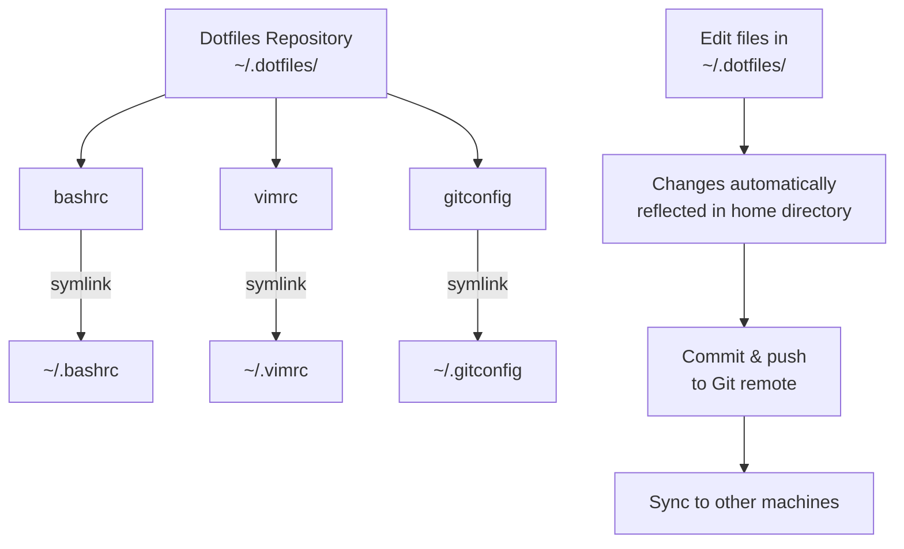
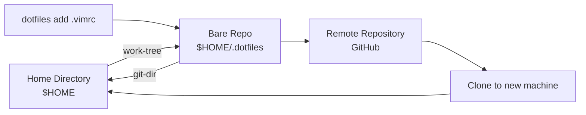
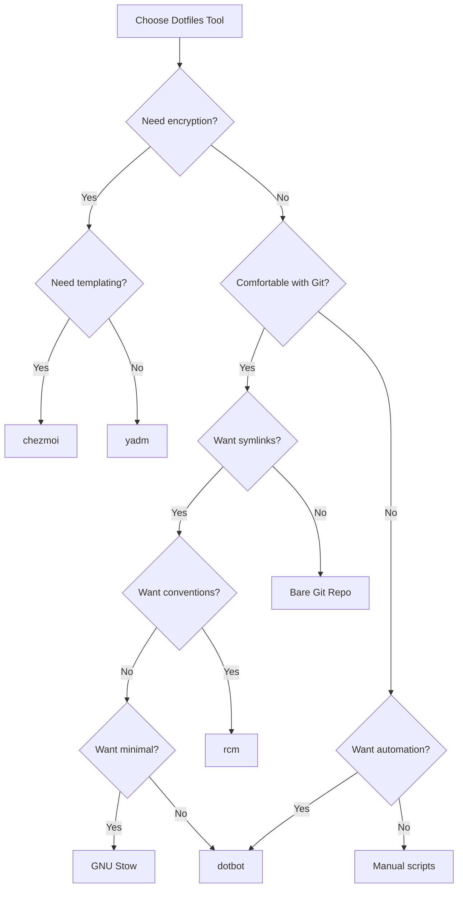

# Dotfiles Management - Research

**Date**: 2025-01-22
**Status**: Research Complete

## Executive Summary

Dotfiles are Unix/Linux configuration files whose names begin with a dot (`.`), making them hidden by default. Managing dotfiles through version control with symlink-based systems has become an industry-standard practice for developers to maintain consistent, portable development environments across machines. The recommended approach involves storing dotfiles in a version-controlled repository (typically Git) and either symlinking them to their proper locations or using a bare Git repository to track them in-place. Popular tools like GNU Stow, chezmoi, and yadm automate this process, with GNU Stow being the most straightforward symlink manager, while chezmoi and yadm offer advanced features like templating and encryption. The practice emerged from Unix's hierarchical filesystem design and has evolved into sophisticated workflows supporting multi-machine setups, secrets management, and automated bootstrapping.

## Technical Deep Dive

### Overview

Dotfiles management is the practice of version-controlling and synchronizing configuration files across development machines. These files control settings for command-line tools (shells, editors, multiplexers) and applications. The dot-prefix convention originated accidentally in Unix 2nd Edition when developers created a quick hack to hide `.` and `..` directory entries in `ls` output, unintentionally hiding all files starting with a dot.

### Historical Context

According to Rob Pike, one of Unix's creators, dotfiles were an **unintended consequence** of implementing the hierarchical filesystem. When adding `.` (current directory) and `..` (parent directory) entries, developers hastily modified `ls` to exclude files starting with a dot, rather than just those exact names. This created the concept of "hidden files" - not through a true hidden attribute (like Windows), but through a display convention.

Rob Pike later acknowledged this as a mistake. In Plan 9, Unix's successor, they avoided dot files entirely, using alternatives like `$HOME/cfg` or `$HOME/lib` instead.

### Core Problems Dotfiles Solve

1. **Environment Consistency**: Maintain identical configurations across multiple machines (work laptop, personal desktop, servers)
2. **Change Tracking**: Version control allows rollback, experimentation, and understanding what changed when
3. **Rapid Setup**: New machine setup reduced from hours to minutes via automated installation
4. **Knowledge Preservation**: Configuration files serve as documentation of your preferred toolchain setup
5. **Collaboration**: Share configurations with team members or the broader community

### Modern Organization: XDG Base Directory Specification

The **XDG Base Directory Specification** (first published August 10, 2003) defines an organized structure for application data, addressing the historical clutter of `$HOME`:

```
$HOME/
├── .config/          # XDG_CONFIG_HOME - User-specific configurations (analogous to /etc)
├── .cache/           # XDG_CACHE_HOME - Non-essential cached data (analogous to /var/cache)
├── .local/
│   ├── share/        # XDG_DATA_HOME - User-specific data files (analogous to /usr/share)
│   └── state/        # XDG_STATE_HOME - State data (logs, history, etc.)
└── .runtime/         # XDG_RUNTIME_DIR - Non-essential runtime data (sockets, pipes)
```

Many modern applications (mpv, neovim, i3) use `~/.config/appname/` for configuration, though legacy applications still use traditional dotfiles.

## Symlink Deep Dive

### What Are Symlinks?

A **symbolic link (symlink)** is a special file type that contains a reference path to another file or directory. When accessed, the operating system automatically follows the link to the target.

```bash
# Create a symlink
ln -s /path/to/original /path/to/link

# Example: Link dotfile from repository to home
ln -s ~/.dotfiles/bashrc ~/.bashrc
```

### How Symlinks Work in Dotfiles Context

The typical workflow:



**Key Behavior**: When you edit `~/.bashrc` (the symlink), you're actually editing `~/.dotfiles/bashrc` (the target). Since the target is version-controlled, changes are immediately tracked by Git.

### Why Use Symlinks Instead of Copying?

| Aspect | Symlinks | Copying Files |
|--------|----------|---------------|
| **Synchronization** | Automatic - edit once, reflects everywhere | Manual - must copy after every change |
| **Version Control** | Changes immediately tracked by Git | Must remember to copy to repo before committing |
| **Disk Space** | Minimal (symlink is just a pointer) | Doubles space (original + copy) |
| **Maintenance** | Low - set up once | High - manual sync required |
| **Workflow** | Seamless - edit dotfiles naturally | Error-prone - easy to forget sync step |

**Example scenario**: You edit `~/.bashrc` to add an alias.
- **With symlinks**: Change is already in your repo, just commit
- **With copying**: Must remember to copy `~/.bashrc` back to `~/.dotfiles/bashrc`, then commit

### Symlinks vs Hard Links vs Copying

#### Symbolic Links (Recommended for Dotfiles)

**Pros**:
- Can cross filesystems (e.g., link from external drive to home directory)
- Can point to directories (hard links cannot)
- Git tracks symlinks as symlinks (stores the link, not contents)
- Visual distinction - you can identify symlinks with `ls -la`
- When source moves, symlink breaks - clear indication of problem

**Cons**:
- Break if source file is moved or renamed
- Slightly slower resolution (must follow pointer)
- Some applications don't handle symlinks correctly (rare)
- Permissions apply to both link and target

#### Hard Links

**Pros**:
- Save space - one file with multiple names
- Survive source deletion - data persists until last link removed
- Faster - no pointer resolution needed
- Won't break if "original" moves

**Cons**:
- **Cannot cross filesystems** (major limitation for dotfiles)
- **Cannot point to directories**
- Many editors (TextEdit, VSCode) break hard links on save (create new file instead of modifying)
- Git doesn't track hard links distinctly - stores full content
- No way to identify which is "original" vs "link"

#### Copying Files

**Pros**:
- Complete independence - no link maintenance
- Universal compatibility
- Isolation - changes don't affect original

**Cons**:
- **Memory intensive** - doubles disk usage
- **Manual synchronization** required after every change
- Error-prone workflow - easy to forget to sync
- Not suitable for dotfiles management

### How GNU Stow Implements Symlinks

GNU Stow is a "symlink farm manager" that automates the symlinking process with a clever directory structure convention.

#### Directory Structure Requirement

Stow requires your dotfiles directory to **mirror the target structure**:

```
~/.dotfiles/          # Stow directory
├── bash/             # Package name
│   └── .bashrc       # Will symlink to ~/.bashrc
├── vim/              # Package name
│   ├── .vimrc        # Will symlink to ~/.vimrc
│   └── .vim/         # Will symlink to ~/.vim/
│       └── colors/
├── git/              # Package name
│   └── .gitconfig    # Will symlink to ~/.gitconfig
└── zsh/              # Package name
    ├── .zshrc        # Will symlink to ~/.zshrc
    └── .zsh/         # Will symlink to ~/.zsh/
```

#### How Stow Works

1. **Target Directory**: By default, the parent of your current directory. If you're in `~/.dotfiles`, target is `~`.

2. **Package Concept**: Each subdirectory in `~/.dotfiles` is a "package". You can stow/unstow them independently.

3. **Stow Command**: From `~/.dotfiles`, run:
   ```bash
   stow bash    # Creates symlinks for bash package
   stow vim     # Creates symlinks for vim package
   stow -D bash # Removes bash symlinks (unstow)
   stow .       # Stows ALL packages (all subdirectories)
   ```

4. **Link Creation**: Stow walks the package directory tree and creates corresponding symlinks in the target.

#### Practical Stow Example

```bash
# Setup
cd ~
mkdir .dotfiles
cd .dotfiles

# Create package structure
mkdir -p bash
echo 'export PS1="\u@\h:\w\$ "' > bash/.bashrc

mkdir -p vim/.vim
echo 'set number' > vim/.vimrc

# Create symlinks
stow bash  # Creates ~/.bashrc -> ~/.dotfiles/bash/.bashrc
stow vim   # Creates ~/.vimrc -> ~/.dotfiles/vim/.vimrc
           #         ~/.vim -> ~/.dotfiles/vim/.vim

# Verify
ls -la ~ | grep bashrc
# Output: .bashrc -> .dotfiles/bash/.bashrc

# Remove symlinks
stow -D bash  # Removes ~/.bashrc symlink
```

#### Stow Target Override

You can override the default target:

```bash
# Stow to a different location
stow -t /usr/local/bin scripts

# Specify both stow and target directories
stow -d ~/.dotfiles -t ~ vim
```

#### Stow Ignore Files

Create `.stow-local-ignore` in your stow directory to exclude files:

```
\.git
README\.md
LICENSE
.*\.org$
misc/
```

**Important**: Custom ignore files override Stow's defaults, so you must re-add common exclusions (`.git`, `README`, etc.).

### Alternative Linking Strategies

While Stow automates symlinking, you can also:

1. **Custom install script** (used by Holman, Mathias Bynens):
   ```bash
   #!/bin/bash
   # bootstrap.sh
   for file in .{bashrc,vimrc,gitconfig}; do
       ln -sf "$PWD/$file" "$HOME/$file"
   done
   ```

2. **Dotbot** - Python-based declarative installer with YAML config:
   ```yaml
   - link:
       ~/.bashrc: bashrc
       ~/.vimrc: vimrc
   ```

3. **rcm** - Thoughtbot's suite with file naming conventions (no leading dot in repo).

### Symlink Tradeoffs

**When symlinks work well**:
- Standard Unix/Linux dotfiles (shell configs, vim, git, tmux)
- Files you edit frequently
- Configurations you want to track changes to
- Multi-machine synchronization

**When symlinks may cause issues**:
- Some GUI applications rewrite config files (may break symlinks)
- Applications that check file ownership/permissions strictly
- Sensitive files (SSH keys) where symlinks may pose security concerns
- Windows environments (symlink support limited)

**Best practice**: Test your specific toolchain's compatibility with symlinks. Most command-line tools handle them flawlessly.

## Version Control Strategies

### Repository Approaches

#### 1. Separate Dotfiles Directory with Symlinks (Most Popular)

**Structure**:
```
~/
├── .dotfiles/        # Git repository
│   ├── .git/
│   ├── bashrc        # No leading dot
│   ├── vimrc
│   ├── gitconfig
│   └── install.sh    # Symlink creation script
├── .bashrc -> .dotfiles/bashrc  # Symlink
├── .vimrc -> .dotfiles/vimrc    # Symlink
└── .gitconfig -> .dotfiles/gitconfig  # Symlink
```

**Advantages**:
- Clear separation between versioned files and home directory
- Easy to see what's tracked (everything in `.dotfiles/`)
- Can use conventional Git workflow
- Works with any symlink manager (Stow, custom script)

**Disadvantages**:
- Requires symlink creation step
- Two locations to think about (repo and home)

**Setup**:
```bash
cd ~
mkdir .dotfiles
cd .dotfiles
git init
# Add dotfiles (without leading dot)
git add bashrc vimrc gitconfig
git commit -m "Initial dotfiles"
```

#### 2. Bare Git Repository (No Symlinks)

**Structure**:
```
~/
├── .dotfiles/        # Bare Git repository (only .git contents)
├── .bashrc           # Tracked directly, no symlink
├── .vimrc            # Tracked directly, no symlink
└── .gitconfig        # Tracked directly, no symlink
```

**How it works**:
```bash
# Setup
git init --bare $HOME/.dotfiles
alias dotfiles='/usr/bin/git --git-dir=$HOME/.dotfiles/ --work-tree=$HOME'
dotfiles config status.showUntrackedFiles no

# Add alias to .bashrc/.zshrc so it persists
echo "alias dotfiles='/usr/bin/git --git-dir=\$HOME/.dotfiles/ --work-tree=\$HOME'" >> ~/.bashrc

# Usage (just like git, but with 'dotfiles' command)
dotfiles status
dotfiles add .vimrc
dotfiles commit -m "Update vimrc"
dotfiles push
```

**Installation on new machine**:
```bash
# Clone as bare repository
git clone --bare https://github.com/username/dotfiles.git $HOME/.dotfiles

# Define alias
alias dotfiles='/usr/bin/git --git-dir=$HOME/.dotfiles/ --work-tree=$HOME'

# Backup existing dotfiles
mkdir -p .dotfiles-backup
dotfiles checkout 2>&1 | grep -E "\s+\." | awk '{print $1}' | xargs -I{} mv {} .dotfiles-backup/{}

# Checkout actual dotfiles
dotfiles checkout

# Hide untracked files
dotfiles config status.showUntrackedFiles no
```

**Visual Flow**:


**Advantages**:
- **No symlinks required** - files in natural locations
- **No extra tooling** beyond Git
- Clean separation - Git metadata in `.dotfiles/`, files in `$HOME`
- Standard Git workflow (via alias)
- Easy replication across machines

**Disadvantages**:
- Non-standard Git usage (alias required)
- Can't use normal `git` commands in `$HOME` (would conflict)
- `git status` can be slow (crawls entire home directory)
- More complex to understand initially
- Difficult to selectively track subdirectories

**Originated from**: A Hacker News comment by user "StreakyCobra" and popularized by Atlassian's tutorial.

#### 3. Home Directory as Git Repo (Not Recommended)

**Structure**:
```
~/
├── .git/            # Directly in home
├── .bashrc
├── .vimrc
└── .gitconfig
```

**Problems**:
- Confuses Git with nested repositories (projects in `~/projects/`)
- `git status` shows entire home directory
- High risk of accidentally committing sensitive files
- No clear boundary between tracked and untracked files

**Mitigation**: Use `.gitignore` with `*` to ignore everything, then manually add files:
```bash
echo '*' > .gitignore
git add -f .bashrc .vimrc .gitconfig
```

**Verdict**: Bare repository approach is superior in every way.

### Multi-Machine Strategies

#### Branch-per-Machine

Maintain separate branches for each machine:

```
master (or main)     # Shared configuration
├── laptop          # Laptop-specific config
├── desktop         # Desktop-specific config
└── work            # Work machine config
```

**Workflow**:
```bash
# On laptop
git checkout laptop
# Edit configs
git commit -am "Update laptop configs"

# Merge shared changes from master
git merge master

# Push shared changes back to master
git checkout master
git merge laptop --no-commit
# Remove machine-specific changes
git reset HEAD laptop-specific-file
git checkout -- laptop-specific-file
git commit -m "Shared changes from laptop"
```

**Advantages**:
- Clear logical separation
- Full Git power (branching, merging, rebasing)
- Easy to see machine-specific changes

**Disadvantages**:
- Complex workflow with constant rebasing
- Risk of merge conflicts
- Overhead of branch management

#### Conditional Logic in Config Files

Use hostname/OS detection in configuration files:

```bash
# .bashrc
if [[ "$(uname)" == "Darwin" ]]; then
    # macOS-specific settings
    export PATH="/usr/local/bin:$PATH"
    alias ls='ls -G'
elif [[ "$(uname)" == "Linux" ]]; then
    # Linux-specific settings
    alias ls='ls --color=auto'
fi

# Hostname-specific
if [[ "$(hostname)" == "work-laptop" ]]; then
    export WORK_ENV=true
fi
```

**Advantages**:
- Single branch for all machines
- No merge complexity
- Clear inline documentation

**Disadvantages**:
- Config files become cluttered
- Less modular
- Must edit all machines' logic in one file

#### Include Files (Recommended)

Most tools support includes for machine-specific configs:

**Git** (`.gitconfig`):
```ini
[include]
    path = ~/.gitconfig.local
```

**Zsh** (`.zshrc`):
```bash
# Load local customizations
[[ -f ~/.zshrc.local ]] && source ~/.zshrc.local
```

**Vim** (`.vimrc`):
```vim
" Load local settings
if filereadable(expand("~/.vimrc.local"))
    source ~/.vimrc.local
endif
```

**Advantages**:
- Clean shared configurations
- Machine-specific files not tracked (add to `.gitignore`)
- Modular and maintainable

**Disadvantages**:
- Must remember to create `.local` files on each machine
- `.local` files not backed up (unless using separate repo)

**Best Practice Pattern**:
```bash
# .gitignore
*.local

# On each machine, create machine-specific file
# ~/.gitconfig.local
[user]
    email = work@company.com

# ~/.zshrc.local
export PATH="/opt/work/bin:$PATH"
```

### Repository Organization Patterns

#### Topical Organization (Zach Holman)

Organize by topic/tool rather than file type:

```
~/.dotfiles/
├── git/
│   ├── gitconfig.symlink
│   ├── gitignore.symlink
│   └── gitmessage.symlink
├── vim/
│   ├── vimrc.symlink
│   └── vim.symlink/
│       ├── colors/
│       └── bundle/
├── zsh/
│   ├── zshrc.symlink
│   ├── prompt.zsh
│   └── aliases.zsh
├── ruby/
│   └── gemrc.symlink
└── bin/
    ├── git-update
    └── update-dotfiles
```

**Conventions**:
- `.symlink` extension: Files to symlink to `$HOME` (without extension)
- `.zsh` files: Auto-sourced by zsh
- `path.zsh`: Loaded first (sets `$PATH`)
- `completion.zsh`: Loaded last (sets up completions)
- `install.sh`: Runs during bootstrap
- `bin/`: Scripts added to `$PATH`

**Philosophy**: "Everything's built around topic areas. If you're adding a new area to your forked dotfiles — say, 'Java' — you can simply add a java directory and put files in there."

#### Flat Organization (Mathias Bynens)

Simple flat structure with leading dots:

```
~/.dotfiles/
├── .bash_profile
├── .bashrc
├── .bash_prompt
├── .aliases
├── .functions
├── .exports
├── .vimrc
├── .gitconfig
├── .inputrc
├── .screenrc
├── .macos
├── bootstrap.sh
└── brew.sh
```

**Installation**: `rsync` copies files to `$HOME`:
```bash
rsync --exclude ".git/" \
      --exclude ".DS_Store" \
      --exclude "bootstrap.sh" \
      --exclude "README.md" \
      -avh --no-perms . ~
```

**Advantages**:
- Simple, easy to understand
- No symlink management
- Direct file inspection

**Disadvantages**:
- Must run `bootstrap.sh` after each change
- No auto-sync (copy-based, not link-based)
- Less modular than topical approach

#### Package-Based (rcm/thoughtbot)

```
~/.dotfiles/
├── host-laptop/        # Laptop-specific configs
│   └── zshrc
├── host-desktop/       # Desktop-specific configs
│   └── zshrc
├── tag-work/           # Work-related configs
│   └── gitconfig
└── tag-personal/       # Personal configs
    └── gitconfig
```

**rcm conventions**:
- Files tracked without leading dot
- `host-*` directories: Host-specific configs
- `tag-*` directories: Tagged groups of configs
- Automatic precedence: `host-*` > `tag-*` > root

**Usage**:
```bash
# On laptop with 'work' tag
rcup -t work

# Creates symlinks with precedence:
# ~/.zshrc -> host-laptop/zshrc (host-specific wins)
# ~/.gitconfig -> tag-work/gitconfig
```

## Tool Ecosystem

### Comparison Matrix

| Tool | Language | Stars | Symlinks | Templating | Encryption | Machine Diff | Bootstrap | Learning Curve |
|------|----------|-------|----------|------------|------------|--------------|-----------|----------------|
| **GNU Stow** | Perl | N/A | Yes (primary) | No | No | Directory-based | Manual script | Low |
| **chezmoi** | Go | 16,334 | No (copies) | Yes (Go templates) | Yes (GPG, age) | Yes | Yes | Medium |
| **yadm** | Shell | 5,965 | No (tracks in-place) | Yes (via tools) | Yes (GPG) | Yes (alt files) | Yes | Low |
| **dotbot** | Python | 7,641 | Yes (config-defined) | No | No | No | Yes | Low |
| **rcm** | Shell | 3,202 | Yes (auto) | No | No | Yes (host/tag) | Yes | Medium |
| **Mackup** | Python | 14,942 | Yes | No | No | No | No (app-focused) | Very Low |
| **vcsh** | Shell | 2,232 | No (multiple repos) | No | No | Yes (branches) | Manual | High |
| **Bare Git** | Native Git | N/A | No (tracks in-place) | No | No | No (manual) | Manual | Medium |
| **homesick** | Ruby | 2,427 | Yes | No | No | No | Yes | Medium |

### Tool Deep Dives

#### GNU Stow

**Philosophy**: Symlink farm manager originally designed for installing software packages, adapted for dotfiles.

**How it works**:
- Directory-based packages
- Mirrors directory structure from stow dir to target
- Creates symlinks automatically based on structure

**Ideal for**:
- Minimalists who want simple automation
- Users comfortable with directory structure requirements
- Those who prefer symlinks
- Users who don't need templating or encryption

**Setup**:
```bash
# Install
brew install stow         # macOS
sudo apt install stow     # Ubuntu/Debian

# Structure
cd ~
mkdir .dotfiles
cd .dotfiles
mkdir bash vim git

# Create configs
echo 'export PS1="$ "' > bash/.bashrc
echo 'set number' > vim/.vimrc

# Stow packages
stow bash vim git

# Unstow (remove symlinks)
stow -D bash
```

**Pros**:
- Extremely simple concept
- No configuration files needed
- Standard package manager installation
- Modular (stow/unstow packages independently)
- Works with any files (not just dotfiles)

**Cons**:
- Requires mirroring directory structure
- No templating (can't customize per-machine)
- No encryption built-in
- Manual bootstrap script needed
- Breaks if structure doesn't match exactly

**Real-world examples**:
- https://github.com/RickCogley/dotfiles
- https://github.com/xero/dotfiles

#### chezmoi

**Philosophy**: Manage dotfiles across multiple diverse machines securely.

**How it works**:
- Source state (templates in `~/.local/share/chezmoi`)
- Target state (actual dotfiles in `$HOME`)
- `chezmoi apply` converts source to target

**Unique features**:
- **Go templates** for machine-specific customization
- **Password manager integration** (1Password, Bitwarden, LastPass)
- **GPG/age encryption** for sensitive files
- **Script execution** (before/after operations)
- **Diff before applying** changes

**Ideal for**:
- Users managing many diverse machines (personal, work, Linux, macOS)
- Those needing encryption for secrets
- Users wanting password manager integration
- Complex multi-machine scenarios

**Setup**:
```bash
# Install
brew install chezmoi      # macOS
sh -c "$(curl -fsLS get.chezmoi.io)"  # Others

# Initialize from existing repo
chezmoi init https://github.com/username/dotfiles.git

# Or start fresh
chezmoi init

# Add a file
chezmoi add ~/.bashrc

# Edit (opens in $EDITOR)
chezmoi edit ~/.bashrc

# See what would change
chezmoi diff

# Apply changes
chezmoi apply -v

# Update and apply
chezmoi update
```

**Template example** (`~/.local/share/chezmoi/dot_gitconfig.tmpl`):
```ini
[user]
    name = {{ .name }}
{{ if eq .chezmoi.hostname "work-laptop" }}
    email = {{ .work_email }}
{{ else }}
    email = {{ .personal_email }}
{{ end }}
```

**Encryption example**:
```bash
# Add encrypted file
chezmoi add --encrypt ~/.ssh/id_rsa

# Edit encrypted file (decrypts, opens editor, re-encrypts)
chezmoi edit ~/.ssh/id_rsa
```

**Pros**:
- Most feature-complete tool
- Excellent documentation
- Active development
- Handles complexity well
- Password manager integration
- Built-in encryption

**Cons**:
- Steeper learning curve
- Go template syntax can be complex
- Copies files (not symlinks) - changes must go through chezmoi
- More moving parts than simple solutions

**Best for**: Power users with complex, multi-machine setups requiring encryption and templating.

#### yadm (Yet Another Dotfiles Manager)

**Philosophy**: Git wrapper designed specifically for dotfiles with encryption and alternate file support.

**How it works**:
- Git wrapper (all git commands work)
- Tracks files in-place (like bare git repo)
- Special features for dotfiles management

**Unique features**:
- **Alternate files** with `##` syntax for OS/hostname variants
- **Encryption** via GPG for sensitive files
- **Bootstrap** script support
- **Jinja2 templates** (via external tools)

**Ideal for**:
- Git-comfortable users wanting dotfiles-specific features
- Those needing encryption without complexity
- Users managing files across different OSes

**Setup**:
```bash
# Install
brew install yadm        # macOS
sudo apt install yadm    # Ubuntu

# Initialize
yadm init

# Add files
yadm add ~/.bashrc ~/.vimrc

# Commit and push (standard git)
yadm commit -m "Initial commit"
yadm remote add origin <url>
yadm push -u origin main

# Clone on new machine
yadm clone <url>
yadm bootstrap  # Runs ~/.config/yadm/bootstrap if exists
```

**Alternate files** (machine-specific configs without templating):
```
~/.config/
├── app/
│   ├── config##os.Darwin      # macOS version
│   ├── config##os.Linux       # Linux version
│   ├── config##hostname.work  # Hostname-specific
│   └── config##class.laptop   # Class-specific (you define classes)
```

**How alternates work**: yadm creates symlinks to the appropriate alternate file based on current system.

**Encryption**:
```bash
# Configure encrypted files
yadm encrypt

# List encrypted files
yadm list -a

# Decrypt
yadm decrypt
```

**Pros**:
- Git-like workflow (familiar)
- Encryption built-in
- Alternate files simpler than templating
- Lightweight (shell script)
- Tracks in-place (no symlinks needed)

**Cons**:
- Templating requires external tools
- Less feature-rich than chezmoi
- Alternate files less flexible than templates
- Shell-script limitations

**Best for**: Git-comfortable users wanting encryption and multi-OS support without learning templating.

#### dotbot

**Philosophy**: Declarative YAML-based installation using plugins.

**How it works**:
- YAML config defines desired state
- Python tool creates symlinks, runs commands, etc.
- Plugins extend functionality

**Setup**:
```bash
# Add as submodule (recommended)
cd ~/.dotfiles
git submodule add https://github.com/anishathalye/dotbot
git submodule update --init --recursive

# Create install script
cat > install << 'EOF'
#!/usr/bin/env bash
CONFIG="install.conf.yaml"
"${BASEDIR}"/dotbot/bin/dotbot -d "${BASEDIR}" -c "${CONFIG}" "${@}"
EOF
chmod +x install
```

**Config example** (`install.conf.yaml`):
```yaml
- clean: ['~']

- link:
    ~/.bashrc: bashrc
    ~/.vimrc: vimrc
    ~/.vim: vim/
    ~/.config/nvim:
      create: true
      path: nvim/

- shell:
  - [git submodule update --init --recursive, Installing submodules]
  - [brew bundle, Installing Homebrew packages]
```

**Pros**:
- Declarative (easy to understand)
- Idempotent (safe to run multiple times)
- Extensible via plugins
- Handles more than symlinks (runs commands)
- YAML is readable

**Cons**:
- Requires Python
- No templating built-in
- Less powerful than chezmoi
- YAML config can become complex

**Best for**: Users wanting declarative, repeatable installation with automation.

#### rcm

**Philosophy**: Thoughtbot's suite of shell scripts with conventions for host/tag-based management.

**How it works**:
- Files in dotfiles repo have no leading dot
- `rcup` creates symlinks with dots
- Host and tag directories for organization

**Commands**:
- `mkrc` - Add file to dotfiles
- `rcup` - Install/update symlinks
- `rcdn` - Remove symlinks
- `lsrc` - List managed files

**Setup**:
```bash
# Install
brew install rcm        # macOS
sudo apt install rcm    # Ubuntu

# Initialize
mkrc ~/.bashrc ~/.vimrc

# This creates:
# ~/.dotfiles/bashrc
# ~/.dotfiles/vimrc
# And symlinks ~/.bashrc -> ~/.dotfiles/bashrc

# Update
rcup

# With host-specific files
mkdir -p ~/.dotfiles/host-$(hostname)
mkrc -o ~/.bashrc  # Moves to host-specific directory
```

**Host-specific structure**:
```
~/.dotfiles/
├── host-laptop/
│   └── bashrc       # Only on laptop
├── host-desktop/
│   └── bashrc       # Only on desktop
├── tag-work/
│   └── gitconfig    # Work-specific
└── vimrc            # Shared
```

**Pros**:
- Shell scripts (no dependencies)
- Clean conventions
- Host/tag organization built-in
- Thoughtbot credibility

**Cons**:
- macOS-specific behaviors sometimes
- Less popular than alternatives
- No templating or encryption
- Learning curve for conventions

**Best for**: Users wanting structured organization with host/tag support without complexity.

#### Mackup

**Philosophy**: Application-focused backup/restore for macOS/Linux application settings.

**How it works**:
- Database of supported applications (~500+)
- Symlinks app configs to cloud storage (Dropbox, iCloud, etc.)
- Not version-controlled (focuses on sync, not history)

**Setup**:
```bash
# Install
brew install mackup

# Configure storage (~/.mackup.cfg)
[storage]
engine = icloud  # or dropbox, google_drive, file_system

# Backup (creates symlinks to cloud storage)
mackup backup

# On new machine (restore from cloud)
mackup restore
```

**Supported apps**: Vim, VS Code, iTerm2, Sublime Text, Atom, git, SSH, many more.

**Pros**:
- Zero configuration for supported apps
- Automatic syncing via cloud storage
- Large app database
- Simple commands

**Cons**:
- Not version controlled
- macOS/Linux GUI app focus (not general dotfiles)
- Limited customization
- Requires cloud storage
- Less control than git-based approaches

**Best for**: macOS users wanting automatic app settings sync without learning Git/dotfiles concepts.

#### Bare Git Repository

**Philosophy**: Use Git's bare repository feature to track files in-place without symlinks.

**Already covered in detail in "Version Control Strategies" section.**

**Pros**:
- No extra tools (pure Git)
- No symlinks
- Full Git power

**Cons**:
- Non-standard workflow
- Alias required
- Can be slow with large home directory

**Best for**: Git experts wanting minimalism without learning new tools.

### Tool Selection Guide



**Decision criteria**:

1. **Encryption required?** → chezmoi or yadm
2. **Templating needed?** → chezmoi
3. **Minimalist?** → GNU Stow or bare Git
4. **Automation/bootstrap?** → dotbot or chezmoi
5. **Multi-OS complexity?** → chezmoi or yadm
6. **Git-based workflow?** → yadm or bare Git
7. **Convention-based structure?** → rcm
8. **macOS app settings?** → Mackup

## Real-World Case Studies

### Zach Holman's Topical Organization

**Repository**: https://github.com/holman/dotfiles (7k+ stars)

**Philosophy**: "Everything's built around topic areas. If you're adding a new area to your forked dotfiles — say, 'Java' — you can simply add a java directory and put files in there."

**Directory Structure**:
```
dotfiles/
├── git/
│   ├── gitconfig.symlink
│   ├── gitignore.symlink
│   └── gitmessage.symlink
├── zsh/
│   ├── zshrc.symlink
│   ├── prompt.zsh
│   ├── completion.zsh
│   ├── aliases.zsh
│   └── path.zsh
├── vim/
│   ├── vimrc.symlink
│   └── vim.symlink/
├── ruby/
│   └── gemrc.symlink
├── bin/
│   ├── git-credit
│   └── cloudapp
└── script/
    ├── bootstrap
    └── install
```

**Key Conventions**:

1. **File extensions trigger behaviors**:
   - `*.symlink`: Symlinked to `$HOME` with leading dot (without `.symlink` extension)
   - `*.zsh`: Auto-loaded by zsh
   - `path.zsh`: Loaded first (sets `$PATH`)
   - `completion.zsh`: Loaded last (completions)
   - `install.sh`: Executed during bootstrap

2. **Bootstrap process** (`script/bootstrap`):
   - Finds all `*.symlink` files
   - Creates symlinks in `$HOME`
   - Backs up existing files to `$HOME/.dotfiles_backup/`
   - Sources all `.zsh` files in correct order

3. **bin/ directory**: Added to `$PATH` for custom scripts

**Installation**:
```bash
git clone https://github.com/holman/dotfiles.git ~/.dotfiles
cd ~/.dotfiles
script/bootstrap
```

**Lessons**:
- **Topical organization scales well** - easy to add new tool areas
- **File extension conventions** automate behavior without complex configs
- **Modular design** - each topic independent
- **Fork-friendly** - users can add topics without understanding entire structure

### Mathias Bynens' macOS Defaults

**Repository**: https://github.com/mathiasbynens/dotfiles (31k+ stars)

**Philosophy**: Sensible hacker defaults for macOS with emphasis on macOS-specific optimizations.

**Structure**: Flat organization with leading dots:
```
dotfiles/
├── .bash_profile
├── .bashrc
├── .bash_prompt
├── .aliases
├── .functions
├── .exports
├── .curlrc
├── .editorconfig
├── .gitconfig
├── .gitattributes
├── .inputrc
├── .screenrc
├── .tmux.conf
├── .vimrc
├── .wgetrc
├── .macos            # macOS system defaults
├── bootstrap.sh      # Installation script
└── brew.sh           # Homebrew installation
```

**Key Features**:

1. **`.macos` script**: Sets hundreds of macOS system preferences:
   ```bash
   # Close any open System Preferences panes
   osascript -e 'tell application "System Preferences" to quit'

   # Disable press-and-hold for keys in favor of key repeat
   defaults write NSGlobalDomain ApplePressAndHoldEnabled -bool false

   # Set a blazingly fast keyboard repeat rate
   defaults write NSGlobalDomain KeyRepeat -int 1
   defaults write NSGlobalDomain InitialKeyRepeat -int 10

   # Finder: show all filename extensions
   defaults write NSGlobalDomain AppleShowAllExtensions -bool true

   # Show hidden files by default
   defaults write com.apple.finder AppleShowAllFiles -bool true
   ```

2. **`brew.sh`**: Installs Homebrew packages:
   ```bash
   # Install command-line tools
   brew install vim --with-override-system-vi
   brew install wget --with-iri
   brew install git
   brew install node

   # Install apps via cask
   brew install --cask firefox
   brew install --cask iterm2
   ```

3. **`bootstrap.sh`**: Uses `rsync` to copy files:
   ```bash
   rsync --exclude ".git/" \
         --exclude ".DS_Store" \
         --exclude "bootstrap.sh" \
         --exclude "README.md" \
         --exclude "LICENSE-MIT.txt" \
         -avh --no-perms . ~
   ```

4. **`.extra` for local customizations**: Not committed to repo:
   ```bash
   # .bash_profile sources .extra if it exists
   if [ -f ~/.extra ]; then
       source ~/.extra
   fi
   ```

**Installation**:
```bash
# Git approach
git clone https://github.com/mathiasbynens/dotfiles.git && cd dotfiles && source bootstrap.sh

# Git-free approach
cd; curl -#L https://github.com/mathiasbynens/dotfiles/tarball/main | tar -xzv --strip-components 1 --exclude={README.md,bootstrap.sh,.osx,LICENSE-MIT.txt}
```

**Lessons**:
- **macOS-first approach** - `.macos` script is legendary
- **Copy-based, not symlinks** - simpler mental model for some users
- **`.extra` pattern** - allows local customizations without forking
- **Brewfile alternative** - `brew.sh` predates Brewfile
- **Documentation** - extensive README explaining choices

### Thoughtbot's Team Dotfiles

**Repository**: https://github.com/thoughtbot/dotfiles (7k+ stars)

**Philosophy**: Shared team dotfiles with rcm for personal overrides.

**Structure**:
```
dotfiles/
├── aliases
├── gitconfig
├── gitignore
├── gvimrc
├── tmux.conf
├── vimrc
├── zshrc
├── rcrc            # rcm configuration
├── laptop          # Setup script
└── hooks/
    ├── post-up
    └── pre-up
```

**Key Features**:

1. **No leading dots in repo** - rcm adds them during symlinking

2. **`rcrc` configuration**:
   ```bash
   EXCLUDES="README.md LICENSE"
   DOTFILES_DIRS="$HOME/.dotfiles $HOME/.dotfiles-local"
   ```

3. **Personal overrides** in `~/.dotfiles-local`:
   - Not tracked in team repo
   - Automatically takes precedence via rcm

4. **`laptop` script**: Automated macOS/Linux setup:
   ```bash
   # Run entire setup
   bash <(curl -s https://raw.githubusercontent.com/thoughtbot/laptop/master/mac)
   ```

5. **Hooks**: `pre-up` and `post-up` scripts for custom logic

**Workflow**:
```bash
# Install team dotfiles
git clone https://github.com/thoughtbot/dotfiles.git ~/.dotfiles
brew install rcm
rcup -v

# Add personal customizations
mkdir ~/.dotfiles-local
mkrc -o ~/.gitconfig  # Moves to personal dotfiles-local

# Update from team repo
cd ~/.dotfiles
git pull
rcup -v
```

**Lessons**:
- **Team + personal coexistence** via rcm's multi-directory support
- **Setup automation** via `laptop` script
- **Convention over configuration** - rcm handles complexity
- **Hooks system** for extensibility

### Notable Patterns from Popular Repositories

#### Paul Irish (Chrome DevTools lead)
**Repository**: https://github.com/paulirish/dotfiles (4k+ stars)

**Unique approach**:
- **`.functions` file**: Heavy use of shell functions instead of aliases
- **Chrome-specific optimizations**: DevTools settings, extensions
- **Symlink script** with setup instructions

#### webpro/dotfiles
**Repository**: https://github.com/webpro/dotfiles (3k+ stars)

**Unique approach**:
- **Scripted installation wizard** - prompts for preferences
- **Dotfiles + system setup** combined
- **macOS Brewfile** for app installation

### Common Patterns Across Popular Dotfiles

1. **Modular sourcing**: Load configs from subdirectories
   ```bash
   # Load all .zsh files
   for file in ~/.zsh/**/*.zsh; do
       source "$file"
   done
   ```

2. **`.local` override pattern**: Allow machine-specific configs
   ```bash
   [ -f ~/.bashrc.local ] && source ~/.bashrc.local
   ```

3. **Aliases files**: Separate shell aliases for readability
   ```bash
   # .aliases
   alias g='git'
   alias ll='ls -lah'
   alias ..='cd ..'
   ```

4. **Functions files**: Complex operations as functions
   ```bash
   # .functions
   mkcd() {
       mkdir -p "$1" && cd "$1"
   }
   ```

5. **`$PATH` management**: Deduplicated, prioritized paths
   ```bash
   # Add to PATH only if not already present
   path_prepend() {
       if [ -d "$1" ] && [[ ":$PATH:" != *":$1:"* ]]; then
           export PATH="$1:$PATH"
       fi
   }
   ```

6. **Package installation scripts**: Brewfile, apt lists, etc.

7. **Color schemes**: Consistent terminal/editor colors

8. **Git configuration**: Extensive git aliases and settings

## macOS-Specific Considerations

### Homebrew Integration

**Brewfile**: Declarative package installation list.

**Creating a Brewfile**:
```bash
# Generate from current installations
brew bundle dump --describe

# Produces Brewfile:
tap "homebrew/bundle"
tap "homebrew/cask"
brew "git"
brew "zsh"
brew "neovim"
brew "tmux"
cask "iterm2"
cask "visual-studio-code"
mas "Xcode", id: 497799835  # Mac App Store apps
```

**Installing from Brewfile**:
```bash
# In directory with Brewfile
brew bundle install

# Or specify file
brew bundle install --file=~/.dotfiles/Brewfile
```

**Cleanup** (removes packages not in Brewfile):
```bash
brew bundle cleanup
```

**Integration with dotfiles**:
```bash
# In bootstrap script
if ! command -v brew &> /dev/null; then
    /bin/bash -c "$(curl -fsSL https://raw.githubusercontent.com/Homebrew/install/HEAD/install.sh)"
fi

brew bundle install --file=~/.dotfiles/Brewfile
```

### Mackup: Application Settings Manager

**What it does**: Backs up/restores macOS/Linux application settings.

**Supported apps** (~500+): Vim, VS Code, iTerm2, Sublime Text, SSH, git, Atom, Alfred, and many more.

**Setup**:
```bash
brew install mackup

# Configure storage (~/.mackup.cfg)
[storage]
engine = icloud  # or dropbox, google_drive

[applications_to_sync]
vim
vscode
iterm2

[applications_to_ignore]
some-app
```

**Usage**:
```bash
# Backup (moves files to cloud, creates symlinks)
mackup backup

# Restore on new machine
mackup restore

# List supported apps
mackup list

# Uninstall (removes symlinks, restores files)
mackup uninstall
```

**How it works**:
1. Moves application config files to cloud storage (e.g., `~/Dropbox/Mackup/`)
2. Creates symlinks from original locations to cloud storage
3. Cloud service syncs across machines
4. On new machine, `mackup restore` creates symlinks

**Integration with dotfiles**:
- **Option 1**: Use Mackup for GUI apps, dotfiles repo for command-line tools
- **Option 2**: Let Mackup handle all configs, use dotfiles for scripts/automation

**Pros**:
- Automatic syncing for supported apps
- No manual configuration needed
- Works with cloud storage

**Cons**:
- Not version controlled
- Less control than Git
- Requires cloud storage
- Limited to supported applications

### `.macos` Script Pattern

macOS system preferences can be scripted using `defaults` command. Popular pattern from Mathias Bynens:

**Structure** (`~/.dotfiles/.macos`):
```bash
#!/usr/bin/env bash

# Close System Preferences to prevent overrides
osascript -e 'tell application "System Preferences" to quit'

# Ask for admin password upfront
sudo -v

# Keep-alive: update sudo timestamp until script finishes
while true; do sudo -n true; sleep 60; kill -0 "$$" || exit; done 2>/dev/null &

###############################################################################
# General UI/UX                                                               #
###############################################################################

# Set computer name
sudo scutil --set ComputerName "YourName-MBP"
sudo scutil --set HostName "YourName-MBP"
sudo scutil --set LocalHostName "YourName-MBP"

# Disable the sound effects on boot
sudo nvram SystemAudioVolume=" "

# Expand save panel by default
defaults write NSGlobalDomain NSNavPanelExpandedStateForSaveMode -bool true

# Disable automatic capitalization
defaults write NSGlobalDomain NSAutomaticCapitalizationEnabled -bool false

###############################################################################
# Trackpad, mouse, keyboard, Bluetooth accessories, and input                #
###############################################################################

# Trackpad: enable tap to click
defaults write com.apple.driver.AppleBluetoothMultitouch.trackpad Clicking -bool true

# Increase sound quality for Bluetooth headphones/headsets
defaults write com.apple.BluetoothAudioAgent "Apple Bitpool Min (editable)" -int 40

# Enable full keyboard access for all controls
defaults write NSGlobalDomain AppleKeyboardUIMode -int 3

# Set keyboard repeat rate
defaults write NSGlobalDomain KeyRepeat -int 1
defaults write NSGlobalDomain InitialKeyRepeat -int 10

###############################################################################
# Finder                                                                      #
###############################################################################

# Show hidden files
defaults write com.apple.finder AppleShowAllFiles -bool true

# Show all filename extensions
defaults write NSGlobalDomain AppleShowAllExtensions -bool true

# Show status bar
defaults write com.apple.finder ShowStatusBar -bool true

# Show path bar
defaults write com.apple.finder ShowPathbar -bool true

# Keep folders on top when sorting by name
defaults write com.apple.finder _FXSortFoldersFirst -bool true

# When performing a search, search the current folder by default
defaults write com.apple.finder FXDefaultSearchScope -string "SCcf"

# Disable the warning when changing a file extension
defaults write com.apple.finder FXEnableExtensionChangeWarning -bool false

# Avoid creating .DS_Store files on network or USB volumes
defaults write com.apple.desktopservices DSDontWriteNetworkStores -bool true
defaults write com.apple.desktopservices DSDontWriteUSBStores -bool true

###############################################################################
# Dock, Dashboard, and hot corners                                           #
###############################################################################

# Set the icon size of Dock items
defaults write com.apple.dock tilesize -int 48

# Minimize windows into their application's icon
defaults write com.apple.dock minimize-to-application -bool true

# Show indicator lights for open applications in the Dock
defaults write com.apple.dock show-process-indicators -bool true

# Speed up Mission Control animations
defaults write com.apple.dock expose-animation-duration -float 0.1

# Don't automatically rearrange Spaces based on most recent use
defaults write com.apple.dock mru-spaces -bool false

# Remove the auto-hiding Dock delay
defaults write com.apple.dock autohide-delay -float 0

# Remove the animation when hiding/showing the Dock
defaults write com.apple.dock autohide-time-modifier -float 0

# Automatically hide and show the Dock
defaults write com.apple.dock autohide -bool true

###############################################################################
# Safari & WebKit                                                             #
###############################################################################

# Privacy: don't send search queries to Apple
defaults write com.apple.Safari UniversalSearchEnabled -bool false
defaults write com.apple.Safari SuppressSearchSuggestions -bool true

# Show the full URL in the address bar
defaults write com.apple.Safari ShowFullURLInSmartSearchField -bool true

# Enable the Develop menu and the Web Inspector
defaults write com.apple.Safari IncludeDevelopMenu -bool true
defaults write com.apple.Safari WebKitDeveloperExtrasEnabledPreferenceKey -bool true

###############################################################################
# Kill affected applications                                                  #
###############################################################################

for app in "Dock" "Finder" "Safari" "SystemUIServer"; do
    killall "${app}" &> /dev/null
done
```

**Running the script**:
```bash
chmod +x ~/.dotfiles/.macos
~/.dotfiles/.macos
```

**Common preferences**:
- Keyboard: Repeat rate, modifiers, shortcuts
- Trackpad: Tap to click, tracking speed
- Dock: Size, position, autohide
- Finder: Show hidden files, extensions, path bar
- Screenshots: Location, format
- Safari: Developer tools, privacy settings

**Discovery**: Find preference keys:
```bash
# Watch for changes
defaults read > before
# Change setting in System Preferences
defaults read > after
diff before after
```

### macOS-Specific File Locations

```
~/Library/Application Support/  # App data
~/Library/Preferences/          # App preferences (.plist files)
~/Library/Caches/               # Cache data
~/.config/                      # XDG-compliant app configs
```

**Tracking preferences**:
- **Option 1**: Mackup (automatic for supported apps)
- **Option 2**: Manual symlinks to specific `.plist` files
- **Option 3**: Export/import via `defaults` commands in bootstrap script

## Security & Secrets Management

### Never Store These in Plain Text

**Critical files to exclude**:
- `~/.ssh/` - SSH private keys
- `~/.gnupg/` - GPG private keys
- `~/.aws/credentials` - AWS access keys
- `~/.netrc` - Network authentication credentials
- API tokens, passwords, auth tokens

**`.gitignore` essentials**:
```
# Secrets
.ssh/id_*
.ssh/*.pem
.gnupg/
.aws/credentials
.netrc
.env
*.key
*.pem

# Local overrides
*.local

# OS files
.DS_Store
Thumbs.db
```

### Encryption Approaches

#### 1. GPG Encryption with git-crypt

**git-crypt**: Transparent encryption in Git repositories.

**Setup**:
```bash
# Install
brew install git-crypt

# Initialize in repo
cd ~/.dotfiles
git-crypt init

# Add GPG key for decryption
git-crypt add-gpg-user YOUR_GPG_KEY_ID

# Configure which files to encrypt (.gitattributes)
echo ".ssh/config filter=git-crypt diff=git-crypt" >> .gitattributes
echo ".netrc filter=git-crypt diff=git-crypt" >> .gitattributes

# Add and commit (automatically encrypted)
git add .ssh/config .gitattributes
git commit -m "Add encrypted SSH config"
```

**On new machine**:
```bash
git clone <repo>
cd dotfiles
git-crypt unlock  # Decrypts using your GPG key
```

**Advantages**:
- Transparent - files appear decrypted locally, encrypted in repo
- Standard Git workflow
- Selective encryption via `.gitattributes`

**Disadvantages**:
- Requires GPG setup on all machines
- Key management complexity
- If you lose GPG key, data is unrecoverable

#### 2. chezmoi's Built-in Encryption

**Uses**: GPG or age for encryption.

**Setup**:
```bash
# Configure GPG recipient
chezmoi init --apply

# Edit ~/.config/chezmoi/chezmoi.toml
[encryption]
  type = "gpg"
  recipient = "your-gpg-key-id"

# Add encrypted file
chezmoi add --encrypt ~/.ssh/config

# Edit (automatically decrypts/re-encrypts)
chezmoi edit ~/.ssh/config

# Apply
chezmoi apply
```

**Stored as**: `~/.local/share/chezmoi/encrypted_dot_ssh/config`

**Advantages**:
- Integrated into chezmoi workflow
- Automatic encryption/decryption
- Per-file encryption

#### 3. yadm's Encryption

**Setup**:
```bash
# Configure files to encrypt (~/.config/yadm/encrypt)
echo '.ssh/id_rsa' >> ~/.config/yadm/encrypt
echo '.ssh/id_ed25519' >> ~/.config/yadm/encrypt
echo '.gnupg/*.key' >> ~/.config/yadm/encrypt

# Encrypt
yadm encrypt

# Creates ~/.local/share/yadm/archive (encrypted tarball)
yadm add ~/.local/share/yadm/archive
yadm commit -m "Update encrypted files"
```

**On new machine**:
```bash
yadm clone <repo>
yadm decrypt  # Prompts for passphrase
```

**Advantages**:
- Simple - one encrypted archive
- No GPG setup required (uses symmetric encryption)

**Disadvantages**:
- All-or-nothing encryption (entire archive)
- Must manually run `yadm encrypt` after changes

#### 4. SOPS (Secrets OPerationS)

**SOPS**: Encrypts values in YAML/JSON/ENV files while keeping keys readable.

**Setup**:
```bash
# Install
brew install sops

# Create .sops.yaml configuration
cat > .sops.yaml << EOF
creation_rules:
  - pgp: 'YOUR_PGP_FINGERPRINT'
EOF

# Encrypt file
sops -e secrets.yaml > secrets.enc.yaml

# Edit (decrypts, opens editor, re-encrypts)
sops secrets.enc.yaml

# Decrypt for use
sops -d secrets.enc.yaml
```

**Example encrypted file**:
```yaml
# secrets.enc.yaml (keys visible, values encrypted)
api_key: ENC[AES256_GCM,data:hQEMA...,iv:...,tag:...,type:str]
db_password: ENC[AES256_GCM,data:vFERA...,iv:...,tag:...,type:str]
```

**Advantages**:
- Partial encryption (keys readable for diffs)
- Supports multiple formats (YAML, JSON, ENV, INI)
- Works with multiple key services (GPG, AWS KMS, GCP KMS, Azure Key Vault)

### Password Manager Integration

#### chezmoi + 1Password

**Setup**:
```bash
# Install 1Password CLI
brew install --cask 1password-cli

# In chezmoi template, reference 1Password
# ~/.local/share/chezmoi/dot_gitconfig.tmpl
[user]
    name = {{ (onepasswordItemFields "GitHub" "notesPlain").value }}
    email = {{ (onepasswordItemFields "GitHub" "email").value }}

[github]
    token = {{ (onepasswordItemFields "GitHub API" "password").value }}
```

**Advantages**:
- No encrypted secrets in repo
- Secrets managed by 1Password
- Templates remain readable

**Disadvantages**:
- Requires 1Password subscription
- 1Password CLI must be installed and authenticated

#### chezmoi + Bitwarden

```bash
# Install Bitwarden CLI
brew install bitwarden-cli

# Login
bw login

# In template
# ~/.local/share/chezmoi/dot_gitconfig.tmpl
[github]
    token = {{ (bitwardenFields "item-id").token.value }}
```

### SSH Key Management

**Best practices**:

1. **Don't track private keys in dotfiles**:
   ```bash
   # .gitignore
   .ssh/id_*
   .ssh/*.pem
   .ssh/github_*
   ```

2. **Track SSH config** (connection settings, not keys):
   ```bash
   # .ssh/config - safe to track
   Host github.com
       HostName github.com
       User git
       IdentityFile ~/.ssh/github_ed25519

   Host work-server
       HostName server.company.com
       User username
       Port 2222
       IdentityFile ~/.ssh/work_ed25519
   ```

3. **Document key generation** in README:
   ```bash
   # Generate SSH key
   ssh-keygen -t ed25519 -C "your_email@example.com" -f ~/.ssh/github_ed25519

   # Add to ssh-agent
   ssh-add ~/.ssh/github_ed25519

   # Copy public key to clipboard
   pbcopy < ~/.ssh/github_ed25519.pub
   ```

4. **Use encrypted backup** for private keys:
   ```bash
   # Encrypt with GPG
   gpg --symmetric --cipher-algo AES256 ~/.ssh/id_ed25519

   # Commit encrypted version
   git add .ssh/id_ed25519.gpg
   ```

### GPG Key Management

**Similar approach to SSH**:

1. **Don't track private keyring**:
   ```bash
   # .gitignore
   .gnupg/private-keys-v1.d/
   .gnupg/*.key
   ```

2. **Export/import via commands**:
   ```bash
   # Export private key (encrypted)
   gpg --export-secret-keys --armor YOUR_KEY_ID > gpg-private.asc

   # Encrypt the export
   gpg --symmetric --cipher-algo AES256 gpg-private.asc

   # Import on new machine
   gpg --decrypt gpg-private.asc.gpg | gpg --import
   ```

3. **Track trust settings**:
   ```bash
   # Export trust database
   gpg --export-ownertrust > ~/.dotfiles/.gnupg/ownertrust.txt

   # Import on new machine
   gpg --import-ownertrust < ~/.dotfiles/.gnupg/ownertrust.txt
   ```

### Environment Variables for Secrets

**Pattern**: Never hardcode secrets, use environment variables.

**Setup**:
```bash
# .bashrc (tracked)
# Load secrets if file exists
[ -f ~/.secrets ] && source ~/.secrets

# .gitignore
.secrets

# On each machine: ~/.secrets (not tracked)
export GITHUB_TOKEN="ghp_xxxxxxxxxxxx"
export AWS_ACCESS_KEY_ID="AKIAXXXXXXXX"
export OPENAI_API_KEY="sk-xxxxxxxxxxxx"
```

**For teams**: Use a secrets management service (AWS Secrets Manager, HashiCorp Vault, 1Password).

### Audit Your Dotfiles

**Before making repo public**:

```bash
# Search for potential secrets
cd ~/.dotfiles
grep -rE '(password|token|key|secret|api[-_]?key)' .

# Check for sensitive values
grep -rE '[A-Za-z0-9]{32,}' .

# Use git-secrets (prevents commits with secrets)
brew install git-secrets
git secrets --install
git secrets --register-aws  # AWS patterns
git secrets --scan  # Check history
```

## Implementation Best Practices

### Bootstrap Script Anatomy

A robust bootstrap/installation script automates dotfiles setup on new machines.

**Essential components**:

```bash
#!/usr/bin/env bash

###############################################################################
# 1. Configuration
###############################################################################

DOTFILES_DIR="$HOME/.dotfiles"
BACKUP_DIR="$HOME/.dotfiles_backup"

###############################################################################
# 2. Helper Functions
###############################################################################

info() {
    printf "\r  [ \033[00;34m..\033[0m ] %s\n" "$1"
}

success() {
    printf "\r\033[2K  [ \033[00;32mOK\033[0m ] %s\n" "$1"
}

fail() {
    printf "\r\033[2K  [\033[0;31mFAIL\033[0m] %s\n" "$1"
    exit 1
}

###############################################################################
# 3. Prerequisite Checks
###############################################################################

check_os() {
    case "$(uname)" in
        Darwin) OS="macos" ;;
        Linux)  OS="linux" ;;
        *)      fail "Unsupported OS: $(uname)" ;;
    esac
    success "Detected OS: $OS"
}

check_git() {
    if ! command -v git &> /dev/null; then
        fail "Git not installed. Install git first."
    fi
    success "Git found: $(git --version)"
}

###############################################################################
# 4. Backup Existing Dotfiles
###############################################################################

backup_dotfile() {
    local file="$1"
    if [ -f "$file" ] || [ -d "$file" ]; then
        info "Backing up existing $(basename "$file")"
        mkdir -p "$BACKUP_DIR"
        mv "$file" "$BACKUP_DIR/"
        success "Backed up to $BACKUP_DIR"
    fi
}

###############################################################################
# 5. Symlink Creation
###############################################################################

link_file() {
    local src="$1"
    local dst="$2"

    # Remove existing file/symlink
    [ -f "$dst" ] || [ -d "$dst" ] || [ -L "$dst" ] && backup_dotfile "$dst"

    # Create symlink
    ln -s "$src" "$dst"
    success "Linked $(basename "$dst")"
}

link_dotfiles() {
    info "Creating symlinks..."

    # Find all *.symlink files
    for src in $(find -H "$DOTFILES_DIR" -maxdepth 2 -name '*.symlink'); do
        dst="$HOME/.$(basename "${src%.*}")"
        link_file "$src" "$dst"
    done
}

###############################################################################
# 6. OS-Specific Setup
###############################################################################

setup_macos() {
    info "macOS-specific setup..."

    # Install Homebrew
    if ! command -v brew &> /dev/null; then
        info "Installing Homebrew..."
        /bin/bash -c "$(curl -fsSL https://raw.githubusercontent.com/Homebrew/install/HEAD/install.sh)"
    fi

    # Install packages from Brewfile
    if [ -f "$DOTFILES_DIR/Brewfile" ]; then
        info "Installing Homebrew packages..."
        brew bundle install --file="$DOTFILES_DIR/Brewfile"
    fi

    # Run .macos script
    if [ -f "$DOTFILES_DIR/.macos" ]; then
        info "Setting macOS defaults..."
        bash "$DOTFILES_DIR/.macos"
    fi
}

setup_linux() {
    info "Linux-specific setup..."

    # Install packages via apt/dnf/pacman
    if command -v apt-get &> /dev/null; then
        sudo apt-get update
        sudo apt-get install -y git vim zsh tmux
    fi
}

###############################################################################
# 7. Shell Configuration
###############################################################################

setup_shell() {
    # Install oh-my-zsh
    if [ ! -d "$HOME/.oh-my-zsh" ]; then
        info "Installing oh-my-zsh..."
        sh -c "$(curl -fsSL https://raw.githubusercontent.com/ohmyzsh/ohmyzsh/master/tools/install.sh)" "" --unattended
    fi

    # Change default shell to zsh
    if [ "$SHELL" != "$(which zsh)" ]; then
        info "Changing default shell to zsh..."
        chsh -s "$(which zsh)"
        success "Shell changed to zsh (restart terminal)"
    fi
}

###############################################################################
# 8. Main Execution
###############################################################################

main() {
    info "Starting dotfiles installation..."

    check_os
    check_git

    # OS-specific setup
    case "$OS" in
        macos) setup_macos ;;
        linux) setup_linux ;;
    esac

    # Link dotfiles
    link_dotfiles

    # Shell setup
    setup_shell

    success "Dotfiles installation complete!"
    info "Please restart your terminal."
}

# Run main function
main "$@"
```

### Idempotency Principles

**Idempotent** = Safe to run multiple times without side effects.

**Key practices**:

1. **Check before acting**:
   ```bash
   # Bad - always installs
   brew install git

   # Good - checks first
   if ! command -v git &> /dev/null; then
       brew install git
   fi
   ```

2. **Symlink safety**:
   ```bash
   # Bad - fails if symlink exists
   ln -s source dest

   # Good - force flag (overwrites)
   ln -sf source dest

   # Better - check first
   if [ ! -L dest ]; then
       ln -s source dest
   fi
   ```

3. **Backup strategy**:
   ```bash
   # Only backup if file exists and isn't already a symlink
   if [ -f "$file" ] && [ ! -L "$file" ]; then
       mv "$file" "$file.backup"
   fi
   ```

4. **Configuration files**:
   ```bash
   # Bad - appends every run
   echo 'source ~/.aliases' >> ~/.bashrc

   # Good - checks first
   if ! grep -q 'source ~/.aliases' ~/.bashrc; then
       echo 'source ~/.aliases' >> ~/.bashrc
   fi
   ```

### Testing Dotfiles

**Use virtual machines or containers**:

```bash
# Dockerfile for testing
FROM ubuntu:22.04

RUN apt-get update && apt-get install -y git sudo

# Create test user
RUN useradd -m -s /bin/bash testuser && \
    echo "testuser ALL=(ALL) NOPASSWD:ALL" >> /etc/sudoers

USER testuser
WORKDIR /home/testuser

# Clone and run dotfiles
RUN git clone https://github.com/yourusername/dotfiles.git .dotfiles
RUN cd .dotfiles && bash install.sh

CMD ["/bin/bash"]
```

**Test script**:
```bash
# Build and test
docker build -t dotfiles-test .
docker run -it dotfiles-test

# Verify
ls -la ~/
cat ~/.bashrc
```

**VM testing with Vagrant**:
```ruby
# Vagrantfile
Vagrant.configure("2") do |config|
  config.vm.box = "ubuntu/jammy64"

  config.vm.provision "shell", privileged: false, inline: <<-SHELL
    git clone https://github.com/yourusername/dotfiles.git ~/.dotfiles
    cd ~/.dotfiles && bash install.sh
  SHELL
end
```

```bash
vagrant up
vagrant ssh
# Test dotfiles
vagrant destroy -f  # Clean up
```

### Multi-Machine Workflow

**Branch strategy example**:
```bash
# On laptop
git checkout laptop
# Make changes
git add .
git commit -m "Add laptop-specific config"

# Merge shared changes to main
git checkout main
git merge laptop --no-ff
# Manually resolve to keep only shared changes

# On desktop
git checkout desktop
git merge main  # Get shared updates
```

**Tag strategy** (simpler):
```bash
# Use include files instead of branches
# .gitignore
*.local

# On each machine
touch ~/.zshrc.local
# Add machine-specific config to .local files
```

### Documentation Standards

**README essentials**:

```markdown
# Dotfiles

My personal dotfiles for macOS/Linux.

## Installation

```bash
git clone https://github.com/username/dotfiles.git ~/.dotfiles
cd ~/.dotfiles
./install.sh
```

## What's Included

- **Shell**: zsh with oh-my-zsh
- **Editor**: vim/neovim configuration
- **Multiplexer**: tmux settings
- **Git**: aliases and configuration
- **macOS**: System preferences script

## Structure

```
.
├── git/          # Git configuration
├── vim/          # Vim configuration
├── zsh/          # Zsh configuration
├── bin/          # Custom scripts
├── .macos        # macOS defaults
├── Brewfile      # Homebrew packages
└── install.sh    # Installation script
```

## Customization

Create `*.local` files for machine-specific overrides:

- `~/.zshrc.local`
- `~/.gitconfig.local`
- `~/.vimrc.local`

These files are gitignored and won't be committed.

## Updating

```bash
cd ~/.dotfiles
git pull
./install.sh  # Re-run to update symlinks
```

## Uninstallation

```bash
cd ~/.dotfiles
./uninstall.sh  # Removes symlinks
```

## Credits

Inspired by:
- [Zach Holman's dotfiles](https://github.com/holman/dotfiles)
- [Mathias Bynens' dotfiles](https://github.com/mathiasbynens/dotfiles)
```

## Recommendations

### Should You Manage Dotfiles?

**Yes, if**:
- You use multiple machines regularly
- You customize your development environment
- You want to preserve configuration knowledge
- You're comfortable with command-line tools
- You value consistency across machines

**Maybe not if**:
- You use only one machine that never changes
- You prefer GUI-only tools
- You don't customize much
- You're just starting programming (wait until you have preferences)

### Recommended Starting Approach

For beginners, start simple and grow:

**Phase 1: Manual Git + Custom Script** (Week 1)
```bash
mkdir ~/.dotfiles
cd ~/.dotfiles
git init

# Add basic configs
cp ~/.bashrc bashrc
cp ~/.vimrc vimrc
git add . && git commit -m "Initial"

# Simple install script
cat > install.sh << 'EOF'
#!/bin/bash
ln -sf ~/.dotfiles/bashrc ~/.bashrc
ln -sf ~/.dotfiles/vimrc ~/.vimrc
EOF
chmod +x install.sh
```

**Phase 2: Add GNU Stow** (Month 1)
```bash
# Reorganize for Stow
mkdir bash vim
mv bashrc bash/.bashrc
mv vimrc vim/.vimrc

# Install with Stow
stow bash vim
```

**Phase 3: Advanced Features** (Month 2+)
- Add Brewfile for package management
- Create `.macos` script for system preferences
- Add encryption for secrets (if needed)
- Consider chezmoi/yadm if templating needed

### Preferred Approach: GNU Stow + Git

**Why this combination wins for most users**:

1. **Simple**: Clear mental model (packages → symlinks)
2. **No dependencies**: Just Git + Stow (both in package managers)
3. **Modular**: Stow/unstow packages independently
4. **Flexible**: Works with any file structure
5. **Transparent**: Easy to see what's happening
6. **Standard tools**: No custom tools to learn

**Recommended structure**:
```
~/.dotfiles/
├── .git/
├── bash/
│   └── .bashrc
├── vim/
│   ├── .vimrc
│   └── .vim/
├── git/
│   └── .gitconfig
├── tmux/
│   └── .tmux.conf
├── bin/
│   └── custom-script
├── Brewfile
├── .macos
├── README.md
└── .stow-local-ignore
```

**Setup**:
```bash
cd ~
git clone https://github.com/username/dotfiles.git .dotfiles
cd .dotfiles
stow */  # Stow all packages
```

### When to Upgrade to chezmoi/yadm

**Signals you need more power**:
- Managing 5+ machines with significant differences
- Need encryption for secrets in repo
- Want password manager integration
- Cross-platform (Windows + macOS + Linux)
- Complex templating requirements

**Don't upgrade if**:
- Simple setup with 1-3 similar machines
- No secrets to encrypt
- Include files handle machine differences fine
- Current approach works

### Avoid These Pitfalls

1. **Over-engineering early**: Start simple, add complexity only when needed
2. **Copying blindly**: Don't copy others' configs without understanding them
3. **No documentation**: Future you won't remember why you did something
4. **Ignoring backups**: Always backup before running install scripts
5. **Public secrets**: Never commit API keys, passwords, SSH private keys
6. **Forgetting .local files**: Create machine-specific files on new machines
7. **No testing**: Test in VM/container before running on main machine
8. **Complex branching**: Branches for machines create merge hell - use includes instead
9. **Tracking everything**: Only track configs you actually customize
10. **No gitignore**: Always ignore secrets, OS files, local overrides

## Debates & Open Questions

### Symlinks vs Copies

**Symlink advocates argue**:
- Changes automatically tracked
- No manual sync step
- Single source of truth

**Copy advocates argue**:
- Simpler mental model
- No risk of breaking symlinks
- Some apps don't handle symlinks well

**Reality**: Most modern tools handle symlinks fine. Copying works but requires discipline.

### Bare Git vs Dotfiles Directory

**Bare Git** (Atlassian method) eliminates symlinks but:
- Non-standard workflow confuses some users
- Can be slow with large home directories
- Alias required for all operations

**Separate directory** (with Stow/scripts):
- Clear separation
- Standard Git workflow
- Requires symlink management

**Community trend**: Separate directory + Stow/chezmoi winning for simplicity.

### Public vs Private Repositories

**Public**:
- Share knowledge with community
- Portfolio piece for developers
- Others can learn from your configs

**Private**:
- No risk of exposing sensitive info
- Can include work-specific configs
- No pressure to maintain for others

**Common approach**: Public repo for general configs, private repo for sensitive/work configs, or encryption for secrets in public repo.

### Tool Proliferation

The ecosystem has 50+ tools, leading to "paradox of choice."

**Emerging consensus**:
- **Beginners**: GNU Stow (simplest) or dotbot (declarative)
- **Power users**: chezmoi (most features) or yadm (Git-based)
- **Minimalists**: Bare Git repo or custom scripts
- **macOS users**: Add Mackup for GUI apps

**Trend**: Consolidation around chezmoi for complex needs, Stow for simplicity.

### XDG Compliance

Many legacy tools still use `~/.*` instead of `~/.config/`.

**Questions**:
- Should dotfiles repos push XDG structure?
- How to handle apps that don't support XDG?
- Worth migrating existing configs?

**Reality**: Mixed adoption. Modern apps (neovim, i3) use XDG; legacy apps (vim, bash) don't. Most users manage both.

## Additional Resources

### Essential Reading

1. **Atlassian Git Tutorials: Dotfiles**
   - https://www.atlassian.com/git/tutorials/dotfiles
   - Explains bare Git repository method

2. **ArchWiki: Dotfiles**
   - https://wiki.archlinux.org/title/Dotfiles
   - Comprehensive overview of all approaches

3. **MIT Missing Semester: Dotfiles**
   - https://missing.csail.mit.edu/2019/dotfiles/
   - Academic perspective on dotfiles management

4. **dotfiles.github.io**
   - https://dotfiles.github.io/
   - Curated resources, tools, and inspiration

### Notable Dotfiles Repositories

**Topical Organization**:
- Zach Holman: https://github.com/holman/dotfiles
- Paul Irish: https://github.com/paulirish/dotfiles

**macOS-Focused**:
- Mathias Bynens: https://github.com/mathiasbynens/dotfiles
- Dries Vints: https://github.com/driesvints/dotfiles

**Team/Enterprise**:
- thoughtbot: https://github.com/thoughtbot/dotfiles

**Tool-Specific Examples**:
- GNU Stow: https://github.com/xero/dotfiles
- chezmoi: https://github.com/twpayne/dotfiles
- rcm: https://github.com/thoughtbot/dotfiles

**Curated Lists**:
- Awesome Dotfiles: https://github.com/webpro/awesome-dotfiles

### Tools Documentation

**Symlink Managers**:
- GNU Stow: https://www.gnu.org/software/stow/
- rcm: https://github.com/thoughtbot/rcm

**Full Solutions**:
- chezmoi: https://www.chezmoi.io/
- yadm: https://yadm.io/
- dotbot: https://github.com/anishathalye/dotbot

**macOS-Specific**:
- Homebrew: https://brew.sh/
- Mackup: https://github.com/lra/mackup

**Encryption**:
- git-crypt: https://github.com/AGWA/git-crypt
- SOPS: https://github.com/mozilla/sops

### Community Resources

**Forums & Discussions**:
- r/dotfiles: https://reddit.com/r/dotfiles
- r/unixporn: https://reddit.com/r/unixporn (ricing)
- Hacker News dotfiles discussions

**Video Tutorials**:
- ThePrimeagen's dotfiles videos
- System Crafters' GNU Stow tutorial

**Articles & Blogs**:
- "Getting Started with Dotfiles" by Dries Vints
- "Dotfiles Management" by Brandon Amos
- "Managing Dotfiles with GNU Stow" by System Crafters

### Standards & Specifications

- **XDG Base Directory Specification**: https://specifications.freedesktop.org/basedir-spec/basedir-spec-latest.html
- **EditorConfig**: https://editorconfig.org/ (standardize editor settings)

## Sources

1. MIT Missing Semester - Dotfiles - https://missing.csail.mit.edu/2019/dotfiles/ - 2025-01-22
2. ArchWiki - Dotfiles - https://wiki.archlinux.org/title/Dotfiles - 2025-01-22
3. Atlassian Git Tutorial - How to Store Dotfiles - https://www.atlassian.com/git/tutorials/dotfiles - 2025-01-22
4. chezmoi - Comparison Table - https://www.chezmoi.io/comparison-table/ - 2025-01-22
5. System Crafters - Using GNU Stow to Manage Dotfiles - https://systemcrafters.net/managing-your-dotfiles/using-gnu-stow/ - 2025-01-22
6. Zach Holman - dotfiles repository - https://github.com/holman/dotfiles - 2025-01-22
7. Mathias Bynens - dotfiles repository - https://github.com/mathiasbynens/dotfiles - 2025-01-22
8. thoughtbot - dotfiles repository - https://github.com/thoughtbot/dotfiles - 2025-01-22
9. dotfiles.github.io - General-purpose utilities - https://dotfiles.github.io/utilities/ - 2025-01-22
10. Linux Audit - How Dot Files Became Hidden Files - https://linux-audit.com/linux-history-how-dot-files-became-hidden-files/ - 2025-01-22
11. Rob Pike on Hacker News - Origin of dotfiles - https://news.ycombinator.com/item?id=4331855 - 2025-01-22
12. Stack Overflow - Difference between symbolic and hard links - https://stackoverflow.com/questions/185899/what-is-the-difference-between-a-symbolic-link-and-a-hard-link - 2025-01-22
13. outcoldman - Keep sensitive data encrypted in dotfiles - https://www.outcoldman.com/en/archive/2015/09/17/keep-sensitive-data-encrypted-in-dotfiles/ - 2025-01-22
14. ArchWiki - XDG Base Directory - https://wiki.archlinux.org/title/XDG_Base_Directory - 2025-01-22
15. Multiple GitHub tutorials on GNU Stow usage - 2025-01-22
