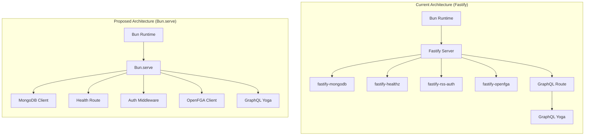
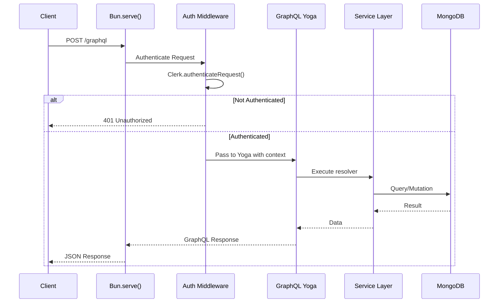

# Fastify to Bun.serve() Migration - Research

**Date**: 2025-12-17
**Updated**: 2025-12-18 (Migration Complete)
**Status**: Complete - Migration Implemented

> **Note**: This research led to the [Hono Migration Spec](../spec/hono-migration-spec.md) which has been fully implemented. The folder-server now uses Hono + Bun.serve() with the `@risk-and-safety/hono-*` middleware packages.

## Table of Contents

- [Executive Summary](#executive-summary)
- [Organizational Standards Context](#organizational-standards-context)
- [Technical Deep Dive](#technical-deep-dive)
- [Plugin Migration Analysis](#plugin-migration-analysis)
- [Codebase Analysis](#codebase-analysis)
- [Implementation Feasibility](#implementation-feasibility)
- [Implementation Options](#implementation-options)
- [Comparison Matrix](#comparison-matrix)
- [Implementation Approach](#implementation-approach)
- [Alternatives Considered](#alternatives-considered)
- [Debates & Open Questions](#debates--open-questions)
- [Recommendations](#recommendations)
- [Additional Notes](#additional-notes)
- [Sources](#sources)

## Executive Summary

**For this existing POC**: Migrating from Fastify to Bun.serve() is technically feasible with moderate effort, but the benefits are marginal. The current architecture uses only 4 Fastify plugins, all replaceable with direct SDK usage. Fastify running on Bun has negligible overhead.

**For organizational standards (greenfield)**: The recommendation changes significantly. For new development, **Bun + Hono + GraphQL Yoga** is the recommended stack. It offers Express-like patterns (easy transition for teams), minimal abstractions, excellent performance, and runtime portability (Bun/Node/Deno/Cloudflare Workers).

**Key insight**: This POC project should continue testing ideas, but the organizational standard for new services should be Hono, not raw Bun.serve() or Fastify.

## Organizational Standards Context

### Background

This project is a POC/incubation for exploring new backend standards. The organization's current stack is **Node.js + Express**. The question is: what should be the standard for new development?

### Stack Options Comparison

| Stack | Performance vs Express | Simplicity | Hiring Pool | Risk | Express Migration Path |
|-------|------------------------|------------|-------------|------|------------------------|
| Node + Express | Baseline | Medium | Huge | Very Low | None |
| Node + Fastify | ~2x | Medium | Large | Low | Easy - similar patterns |
| Bun + Fastify | ~3x | Medium | Medium | Medium | Easy - same Fastify API |
| **Bun + Hono** | ~4x | High | Growing | Medium | Easy - Express-like API |
| Bun + Bun.serve() | ~5x | Highest | Small | Medium-High | Moderate - manual patterns |

### Why Hono for Organizational Standards

1. **Express-like patterns** - Teams familiar with Express will be productive immediately:

   ```typescript
   // Express (current)
   app.use(express.json());
   app.use(authMiddleware);
   app.get("/health", (req, res) => res.json({ ok: true }));

   // Hono (nearly identical)
   app.use("*", authMiddleware);
   app.get("/health", (c) => c.json({ ok: true }));
   ```

2. **Runtime portability** - Same code runs on Bun, Node.js, Deno, Cloudflare Workers. Future-proofs the organization against runtime lock-in.

3. **Minimal but structured** - Provides middleware, routing, and context patterns without heaviness (~14KB).

4. **Growing ecosystem** - 40k+ GitHub stars, very active development, TypeScript-first.

5. **Standards need conventions** - Raw Bun.serve() is too minimal for a standard; every team would reinvent middleware patterns.

### Why NOT Raw Bun.serve() for Standards

- **Too minimal** - No built-in middleware composition, routing, or conventions
- **Reinventing wheels** - Every service would implement auth/logging/error handling differently
- **Harder onboarding** - New developers must learn custom patterns instead of documented framework patterns
- **Best for POCs** - Great for learning fundamentals, not for organizational consistency

### Recommended Organizational Strategy

| Context | Recommendation | Rationale |
|---------|----------------|-----------|
| **New services (2024+)** | Bun + Hono | Modern, simple, fast, portable |
| **Existing Express services** | Stay Express or gradual migration | Don't rewrite working code |
| **High-stakes production** | Node + Fastify (for now) | If Bun risk tolerance is low |
| **POC/Innovation projects** | Bun + Bun.serve() or Hono | Learn fundamentals, test ideas |

### Migration Path from Express

For teams transitioning from Express to Hono:

```typescript
// Express middleware
app.use((req, res, next) => {
  req.startTime = Date.now();
  next();
});

// Hono middleware (same concept)
app.use("*", async (c, next) => {
  c.set("startTime", Date.now());
  await next();
});

// Express route with params
app.get("/users/:id", async (req, res) => {
  const user = await getUser(req.params.id);
  res.json(user);
});

// Hono route (nearly identical)
app.get("/users/:id", async (c) => {
  const user = await getUser(c.req.param("id"));
  return c.json(user);
});
```

### Hono + GraphQL Yoga Integration

```typescript
import { Hono } from "hono";
import { createYoga } from "graphql-yoga";
import { MongoClient } from "mongodb";

const app = new Hono();

// Middleware composition (clean and declarative)
app.use("*", mongoMiddleware());
app.use("*", openFgaMiddleware());
app.use("/graphql", authMiddleware());

// Health endpoint
app.get("/health", (c) => c.json({ status: "ok", version: env.APP_VERSION }));

// GraphQL - Yoga integrates directly
const yoga = createYoga({ schema });
app.on(["GET", "POST"], "/graphql", async (c) => {
  return yoga.fetch(c.req.raw, {
    ctx: {
      auth: c.get("auth"),
      db: c.get("db"),
      openFga: c.get("openFga"),
    },
  });
});

// Bun auto-detects default export
export default app;
```

### What This Means for This POC

This project should:

1. **Continue as-is** for validating Bun runtime stability
2. **Optionally branch** to test Hono integration
3. **Document learnings** about plugin migration patterns
4. **Inform organizational template** - create a "Bun + Hono starter" based on findings

### Why Hono Over Fastify (Beyond Size)

Size (~14KB vs larger) is a minor factor. Here are the real reasons:

#### 1. Web Standards vs Fastify Abstractions

**Hono uses native Web APIs:**
```typescript
// Hono - standard Request/Response
app.get("/user", (c) => {
  const auth = c.req.header("Authorization");  // Standard Headers API
  return c.json({ id: 1 });                    // Returns standard Response
});
```

**Fastify uses its own abstractions:**
```typescript
// Fastify - proprietary request/reply
fastify.get("/user", (request, reply) => {
  const auth = request.headers.authorization;  // Fastify's object
  reply.send({ id: 1 });                       // Fastify's reply
});
```

**Why this matters**: Web standards transfer. Developers learn patterns that work everywhere (browsers, Deno, Cloudflare Workers, service workers). Fastify knowledge is Fastify-only.

#### 2. Runtime Portability

| Runtime | Hono | Fastify |
|---------|------|---------|
| Bun | ✅ | ✅ |
| Node.js | ✅ | ✅ |
| Deno | ✅ | ❌ |
| Cloudflare Workers | ✅ | ❌ |
| Vercel Edge | ✅ | ❌ |
| AWS Lambda@Edge | ✅ | ❌ |

If the organization ever wants edge deployment or multi-runtime support, Hono works. Fastify locks you to Node-compatible runtimes only.

#### 3. Simpler Mental Model

**Fastify has more concepts to learn:**
- Plugins (registration, encapsulation, scoping)
- Decorators (`fastify.decorate`, `request.user`)
- Hooks (`onRequest`, `preHandler`, `preSerialization`, `onSend`, `onResponse`)
- JSON Schema validation (built-in)
- Serialization (built-in)

**Hono is just middleware:**
- `app.use()` - that's the core concept
- Everything is middleware
- Add validation? Use a middleware (Zod, Valibot)
- Add serialization? You're returning Response objects directly

For Express developers, Hono's model is immediately familiar. Fastify requires learning new patterns.

#### 4. Express Migration Path

```typescript
// Express (current org stack)
app.get("/users/:id", async (req, res) => {
  const user = await db.getUser(req.params.id);
  res.json(user);
});

// Hono (nearly identical)
app.get("/users/:id", async (c) => {
  const user = await db.getUser(c.req.param("id"));
  return c.json(user);
});

// Fastify (different patterns)
fastify.get("/users/:id", {
  schema: { params: { id: { type: "string" } } },  // Schema often expected
  handler: async (request, reply) => {
    const user = await db.getUser(request.params.id);
    reply.send(user);
  }
});
```

#### 5. Why Bun.serve() Alone Isn't Enough for Standards

Bun.serve() has no plugin/middleware system - there's no `app.use()`, no hooks, no standardized way to compose functionality. It's just a raw `fetch(request) → Response` handler.

You CAN build reusable auth libraries as plain functions:

```typescript
// This works, but...
import { verifyAuth } from "@your-org/auth";

Bun.serve({
  async fetch(req) {
    const user = await verifyAuth(req);  // Just call a function
    if (!user) return new Response("Unauthorized", { status: 401 });
    // Continue...
  }
});
```

**The problem is composing multiple libraries:**

```typescript
// With Hono - declarative composition
app.use("*", corsMiddleware());
app.use("*", loggingMiddleware());
app.use("*", authMiddleware());
app.use("/graphql", rateLimitMiddleware());

// With raw Bun.serve() - manual orchestration
Bun.serve({
  async fetch(req) {
    // You have to manually orchestrate everything
    const corsResponse = handleCors(req);
    if (corsResponse) return corsResponse;

    logRequest(req);

    const user = await verifyAuth(req);
    if (!user) return new Response("Unauthorized", { status: 401 });

    if (isRateLimited(user)) return new Response("Too Many Requests", { status: 429 });

    // Now finally handle the actual request...
  }
});
```

**Issues with raw Bun.serve() for organizational standards:**

1. **No standardized middleware signature** - Every team invents their own pattern
2. **No context passing convention** - How does auth middleware pass `user` to the next function?
3. **No error boundary convention** - Each service handles errors differently
4. **No lifecycle hooks** - No `onRequest`, `onResponse`, `onError` patterns

Hono provides a thin, standardized interface for building reusable libraries:

```typescript
// Reusable auth library with Hono's standard interface
import { createMiddleware } from "hono/factory";

export const authMiddleware = () => createMiddleware(async (c, next) => {
  const user = await verifyClerkToken(c.req.header("Authorization"));
  if (!user) return c.json({ error: "Unauthorized" }, 401);

  c.set("user", user);  // Standardized context passing
  await next();         // Standardized flow control
});

// Usage across all services - consistent pattern
app.use("*", authMiddleware());
```

#### 6. When Fastify IS Better

To be fair, Fastify wins in some areas:

| Feature | Fastify | Hono |
|---------|---------|------|
| Built-in validation | ✅ JSON Schema | ❌ (use Zod middleware) |
| Built-in serialization | ✅ Fast JSON stringify | ❌ |
| Plugin encapsulation | ✅ Scoped plugins | ❌ |
| Mature ecosystem | ✅ More plugins | Growing |
| Enterprise adoption | ✅ Proven at scale | Newer |

**If you need Fastify's built-in validation/serialization performance**, Fastify is better. But this codebase already uses Zod + GraphQL, so those features provide no additional value.

#### 7. Summary: Hono vs Fastify

| Factor | Hono | Fastify |
|--------|------|---------|
| Learning curve from Express | Low | Medium |
| Web standards alignment | High | Low |
| Runtime flexibility | Any runtime | Node-like only |
| Conceptual complexity | Simple (just middleware) | More complex (plugins, hooks, decorators) |
| Built-in features | Minimal | Rich |
| Reusable library pattern | Standard middleware | Fastify plugins |

**For this organization (Express background, using Zod/GraphQL)**: Hono is a smaller leap and teaches transferable web standards skills.

**If starting from scratch with no Express history**: Fastify's batteries-included approach might be appealing for teams wanting built-in validation and serialization.

## Technical Deep Dive

### Overview

GraphQL Yoga is a cross-platform GraphQL server that works natively with Bun.serve(). The current architecture already uses Yoga, making the GraphQL layer migration straightforward. The complexity lies in replacing Fastify's plugin ecosystem with manual implementations.

### GraphQL Yoga + Bun.serve() Integration

Bun supports the Fetch API as a first-class citizen, making Yoga integration simple:

```typescript
import { createYoga } from 'graphql-yoga'

const yoga = createYoga({ schema })

const server = Bun.serve({
  fetch: (request) => yoga.fetch(request),
  port: 3000
})
```

Direct assignment (`fetch: yoga`) may cause TypeScript errors in newer Bun versions. Wrapping in an arrow function resolves type mismatches.

### Current vs Proposed Architecture



### Request Flow Comparison



### How It Works

**Bun.serve() Request Handling:**

1. Bun.serve() creates an HTTP server using the native Bun runtime
2. The `fetch` handler receives a standard `Request` object
3. Routes are matched manually or via the built-in `routes` option (Bun v1.2.3+)
4. Responses are standard `Response` objects (Web API compliant)

**Key Differences from Fastify:**

| Aspect | Fastify | Bun.serve() |
|--------|---------|-------------|
| Request Object | `FastifyRequest` | Standard `Request` |
| Response Object | `FastifyReply` | Standard `Response` |
| Plugins | Decorator pattern | Manual composition |
| Lifecycle Hooks | `preHandler`, `onRequest`, etc. | Manual middleware chain |
| Validation | JSON Schema built-in | External (Zod, etc.) |
| Logging | Pino built-in | Manual (Pino, console) |

### Technology Stack / Ecosystem

**Required Dependencies (Proposed):**
- `graphql-yoga` - Already in use
- `@apollo/subgraph` - Already in use (Federation v2)
- `mongodb` - Already in use (direct client)
- `@clerk/backend` - Replace `@risk-and-safety/fastify-rss-auth`
- `@openfga/sdk` - Already in use (direct SDK)

**Dependencies to Remove:**
- `fastify` (5.6.2)
- `@fastify/mongodb` (9.0.0)
- `@risk-and-safety/fastify-healthz` (1.0.0)
- `@risk-and-safety/fastify-rss-auth` (0.2.3)
- `@risk-and-safety/fastify-openfga` (0.0.1)

## Plugin Migration Analysis

### 1. @fastify/mongodb -> Direct MongoDB Client

**Current Usage:**
```typescript
await fastify.register(fastifyMongodb, { url: env.MONGO_URL, database: "core" });
// Access via: fastify.mongo.db, fastify.mongo.client
```

**Migration Approach:**
```typescript
import { MongoClient, type Db } from 'mongodb';

let mongoClient: MongoClient;
let db: Db;

async function connectMongo() {
  mongoClient = new MongoClient(env.MONGO_URL);
  await mongoClient.connect();
  db = mongoClient.db("core");
  return { mongoClient, db };
}

async function disconnectMongo() {
  await mongoClient.close();
}
```

**Complexity:** Low
**Risk:** Low - MongoDB driver is already used directly in repositories

### 2. @risk-and-safety/fastify-healthz -> Simple Route

**Current Usage:**
```typescript
await fastify.register(fastifyHealthz, { version: env.APP_VERSION });
// Provides: GET /health
```

**Migration Approach:**
```typescript
// In fetch handler
if (url.pathname === '/health') {
  return Response.json({
    status: 'ok',
    version: env.APP_VERSION,
    timestamp: new Date().toISOString()
  });
}
```

**Complexity:** Trivial
**Risk:** None

### 3. @risk-and-safety/fastify-rss-auth -> @clerk/backend

**Current Usage:**
```typescript
await fastify.register(fastifyRssAuth, {
  clerk: { publishableKey, secretKey },
  rssOAuth: { issuerUrl, authServerUrl }
});
// Provides: req.user, req.server.verifyAuth()
```

**Migration Approach:**
```typescript
import { createClerkClient } from '@clerk/backend';

const clerkClient = createClerkClient({
  secretKey: env.CLERK_SECRET_KEY,
  publishableKey: env.CLERK_PUBLISHABLE_KEY,
});

async function authenticateRequest(request: Request): Promise<AuthUser | null> {
  const requestState = await clerkClient.authenticateRequest(request, {
    authorizedParties: ['https://your-domain.com'],
  });

  if (!requestState.isAuthenticated) {
    return null;
  }

  const auth = requestState.toAuth();
  return {
    userId: auth.userId,
    tenantId: auth.orgId ?? '',
    fullName: auth.sessionClaims?.fullName as string ?? '',
    email: auth.sessionClaims?.email as string ?? '',
  };
}
```

**Complexity:** Medium - Need to understand RSS OAuth handling
**Risk:** Medium - Custom internal plugin may have RSS-specific logic not covered by `@clerk/backend` alone

**Unknown:** The `rssOAuth` configuration suggests custom OAuth handling beyond Clerk. Need to verify if `@clerk/backend` alone can replace this or if additional OAuth logic is required.

### 4. @risk-and-safety/fastify-openfga -> Direct @openfga/sdk

**Current Usage:**
```typescript
await fastify.register(fastifyOpenFga, {
  url: env.OPENFGA_URL,
  storeId: env.OPENFGA_STORE_ID,
  apiToken: env.OPENFGA_KEY,
});
// Provides: fastify.openFga (OpenFgaHelpers)
```

**Migration Approach:**
```typescript
import { OpenFgaClient, CredentialsMethod } from '@openfga/sdk';

const openFgaClient = new OpenFgaClient({
  apiUrl: env.OPENFGA_URL,
  storeId: env.OPENFGA_STORE_ID,
  credentials: {
    method: CredentialsMethod.ApiToken,
    config: { token: env.OPENFGA_KEY },
  },
});

// Initialize once and reuse (best practice per SDK docs)
```

**Complexity:** Low
**Risk:** Low - Need to verify `OpenFgaHelpers` interface matches SDK methods

**Note:** The `OpenFgaHelpers` type from `@risk-and-safety/fastify-openfga` may provide convenience wrappers. Need to examine what methods are used in the codebase.

## Codebase Analysis

### Current Architecture (src/app.ts)

```typescript
export async function buildApp(): Promise<FastifyInstance> {
  const fastify = Fastify({ logger: { level: env.LOG_LEVEL }, disableRequestLogging: true });

  // 4 plugins total
  await fastify.register(fastifyMongodb, { url: env.MONGO_URL, database: "core" });
  await fastify.register(fastifyHealthz, { version: env.APP_VERSION });
  await fastify.register(fastifyRssAuth, { /* config */ });
  await fastify.register(fastifyOpenFga, { /* config */ });

  // Single GraphQL route
  fastify.route({
    url: yoga.graphqlEndpoint,
    method: ["GET", "POST", "OPTIONS"],
    preHandler: async (req, reply) => {
      await req.server.verifyAuth(req, reply);
    },
    handler: (req, reply) => {
      return yoga.handleNodeRequestAndResponse(req, reply, { /* context */ });
    },
  });

  return fastify;
}
```

### Files Affected by Migration

| File | Changes Required |
|------|-----------------|
| `src/app.ts` | Complete rewrite -> `src/server.ts` |
| `src/server.ts` | Merge with app.ts or simplify |
| `src/graphql/context.ts` | Remove Fastify types, update context |
| `src/graphql/yoga.ts` | Minor - remove Node.js specific handling |
| `package.json` | Update dependencies |

### Key Patterns to Preserve

1. **Service Context** - `ServiceContext` interface passes `auth`, `db`, `mongoClient`, `openFga` to resolvers
2. **Graceful Shutdown** - Signal handlers for SIGTERM/SIGINT
3. **Error Handling** - Domain errors (`NotFoundError`, `ValidationError`)
4. **Logging** - Currently uses Fastify's Pino logger

## Implementation Feasibility

### Benefits

1. **Simpler Architecture** - Remove plugin abstraction layer
2. **Fewer Dependencies** - Remove 5 Fastify-related packages
3. **Native Bun Integration** - Use Bun APIs directly
4. **Smaller Bundle** - Less code to ship
5. **Learning Curve** - No need to understand Fastify plugin system for new developers

### Trade-offs & Challenges

1. **Lost Fastify Ecosystem** - No automatic JSON serialization, validation hooks, or lifecycle management
2. **Manual Middleware** - Must implement request/response handling manually
3. **Logging Setup** - Need to configure Pino or alternative manually
4. **Testing Changes** - Current test helpers may rely on Fastify patterns
5. **RSS OAuth Unknown** - The custom auth plugin may have logic beyond Clerk SDK
6. **OpenFgaHelpers** - May need to reimplement convenience wrappers

### When to Migrate

- Building a new service from scratch
- Experiencing Fastify-specific issues
- Need maximum control over request handling
- Team prefers minimal abstractions

### When to Stay

- Current architecture works well
- Plugin ecosystem provides value
- Team is familiar with Fastify patterns
- No concrete performance issues

## Implementation Options

### Option 1: Stay with Fastify (Recommended)

**Description**: Keep current architecture, no changes.

**Pros**:
- Zero migration effort
- Proven, working codebase
- Fastify has negligible overhead on Bun
- Plugin ecosystem handles cross-cutting concerns

**Cons**:
- 5 Fastify dependencies to maintain
- Plugin abstraction adds indirection

**Complexity**: None
**Time Estimate**: 0 days
**Reuses Patterns**: N/A

### Option 2: Minimal Migration (Bun.serve + Keep Structure)

**Description**: Replace Fastify with Bun.serve() but keep similar code organization.

**Pros**:
- Removes Fastify dependency
- Keeps familiar patterns
- Incremental change

**Cons**:
- Still need to implement middleware manually
- May not gain significant benefits

**Complexity**: Medium
**Time Estimate**: 2-3 days
**Reuses Patterns**: Partial

**Example Implementation:**
```typescript
// src/server.ts
import { MongoClient } from 'mongodb';
import { createClerkClient } from '@clerk/backend';
import { OpenFgaClient, CredentialsMethod } from '@openfga/sdk';
import { yoga } from './graphql/yoga.js';
import { env } from './env.js';

// Initialize clients
const mongoClient = new MongoClient(env.MONGO_URL);
const clerkClient = createClerkClient({
  secretKey: env.CLERK_SECRET_KEY,
  publishableKey: env.CLERK_PUBLISHABLE_KEY,
});
const openFgaClient = new OpenFgaClient({
  apiUrl: env.OPENFGA_URL,
  storeId: env.OPENFGA_STORE_ID,
  credentials: {
    method: CredentialsMethod.ApiToken,
    config: { token: env.OPENFGA_KEY },
  },
});

let db: Db;

async function start() {
  await mongoClient.connect();
  db = mongoClient.db('core');

  const server = Bun.serve({
    port: env.PORT,
    async fetch(request) {
      const url = new URL(request.url);

      // Health check
      if (url.pathname === '/health') {
        return Response.json({ status: 'ok', version: env.APP_VERSION });
      }

      // GraphQL endpoint
      if (url.pathname === '/graphql') {
        // Authenticate
        const requestState = await clerkClient.authenticateRequest(request);
        if (!requestState.isAuthenticated) {
          return new Response('Unauthorized', { status: 401 });
        }

        const auth = requestState.toAuth();
        const context = {
          ctx: {
            auth: {
              userId: auth.userId,
              tenantId: auth.orgId ?? '',
              fullName: '',
              email: '',
            },
            db,
            mongoClient,
            openFga: openFgaClient,
          },
        };

        return yoga.fetch(request, context);
      }

      return new Response('Not Found', { status: 404 });
    },
  });

  console.log(`Server running on port ${server.port}`);

  // Graceful shutdown
  const shutdown = async (signal: string) => {
    console.log(`Received ${signal}, shutting down...`);
    await server.stop();
    await mongoClient.close();
    process.exit(0);
  };

  process.on('SIGTERM', () => shutdown('SIGTERM'));
  process.on('SIGINT', () => shutdown('SIGINT'));
}

start();
```

### Option 3: Full Migration with Hono

**Description**: Use Hono framework on Bun for middleware support.

**Pros**:
- Middleware support out of the box
- Better developer experience than raw Bun.serve()
- Still lighter than Fastify

**Cons**:
- Adds new dependency
- Learning new framework
- Not significantly different from Fastify

**Complexity**: Medium-High
**Time Estimate**: 3-4 days
**Reuses Patterns**: Partial

## Comparison Matrix

| Criteria | Option 1: Stay | Option 2: Bun.serve | Option 3: Hono |
|----------|----------------|---------------------|----------------|
| Migration Effort | None | Medium | Medium-High |
| Dependencies | 5 Fastify pkgs | 0 framework pkgs | 1 Hono pkg |
| Performance | Excellent* | Excellent | Excellent |
| Middleware Support | Built-in | Manual | Built-in |
| Logging | Built-in Pino | Manual | Manual |
| Learning Curve | Known | Low | Medium |
| Maintainability | High | Medium | High |
| Time to Implement | 0 days | 2-3 days | 3-4 days |

*Fastify on Bun has negligible overhead compared to native Bun.serve() for this use case.

## Implementation Approach

If Option 2 is chosen, follow these steps:

### Prerequisites & Requirements

- Verify RSS OAuth requirements beyond Clerk
- Understand `OpenFgaHelpers` interface and usage
- Ensure all tests pass before migration

### Migration Steps

1. **Create new server file** alongside existing
2. **Implement MongoDB connection** with graceful shutdown
3. **Add health endpoint** (trivial)
4. **Implement auth middleware** with Clerk SDK
5. **Configure OpenFGA client** directly
6. **Wire up GraphQL Yoga**
7. **Update context types** to remove Fastify
8. **Add logging** (Pino or similar)
9. **Test thoroughly**
10. **Switch over** and remove old files

### Testing Strategy

- Run existing integration tests against new server
- Verify auth flows work correctly
- Load test to confirm no performance regression
- Test graceful shutdown behavior

### Common Pitfalls & How to Avoid

1. **Missing RSS OAuth logic** - Review fastify-rss-auth source before migration
2. **OpenFgaHelpers methods** - Map all used methods to SDK equivalents
3. **Request/Response differences** - Yoga handles this, but verify context passing
4. **Logging gaps** - Add structured logging early

## Alternatives Considered

### Alternative 1: Elysia Framework

- Bun-native framework with plugins
- GraphQL Yoga plugin available
- More similar to Fastify's plugin model
- Rejected: Adds another framework dependency

### Alternative 2: Hono Framework

- Lightweight, multi-runtime
- Good middleware support
- Rejected for Option 2, but valid if middleware is needed

### Alternative 3: Keep Fastify, Remove Unused Plugins

- Review if all 4 plugins are necessary
- Could simplify without full migration
- Worth considering as intermediate step

## Debates & Open Questions

1. **RSS OAuth handling** - Does `@clerk/backend` fully replace `fastify-rss-auth` or is there custom RSS-specific logic?

2. **OpenFgaHelpers** - What convenience methods does the Fastify plugin provide? Are they needed or can we use the SDK directly?

3. **Logging requirements** - Is structured logging with request IDs required for production observability?

4. **Performance claims** - The "3-4x faster" claim for Bun.serve() vs Fastify on Bun needs verification for this specific workload (GraphQL over HTTP).

5. **Bun.serve routing** - The built-in `routes` option (Bun v1.2.3+) doesn't support middleware. Is this a limitation for future features?

## Recommendations

### For This POC: Stay with Fastify (Option 1)

**Should This POC Migrate?**: No

**Rationale**:

1. **Marginal Performance Gains** - Fastify on Bun has negligible overhead for GraphQL workloads.
2. **Working Architecture** - Current setup is clean with only 4 plugins.
3. **POC Purpose** - The value is in validating Bun runtime, not rewriting infrastructure.
4. **Effort vs Benefit** - 2-3 days of migration work for minimal improvement.

### For Organizational Standards: Bun + Hono (NEW)

**Recommended Standard for New Services**: Bun + Hono + GraphQL Yoga

**Rationale**:

1. **Express Migration Path** - Teams know Express; Hono's API is nearly identical, minimizing learning curve.

2. **Right Level of Abstraction** - Raw Bun.serve() is too minimal for standards (every team reinvents patterns). Fastify is more complex than needed. Hono hits the sweet spot.

3. **Runtime Portability** - Hono runs on Bun, Node.js, Deno, and Cloudflare Workers. Avoids lock-in.

4. **Performance** - ~4x Express performance with Bun runtime.

5. **Growing Ecosystem** - 40k+ stars, active development, TypeScript-first, good documentation.

6. **Minimal Overhead** - ~14KB bundle addition vs thousands of lines of framework code.

### Decision Matrix for Stack Choice

| Scenario | Recommendation |
|----------|----------------|
| New service, greenfield | **Bun + Hono** |
| This POC project | Stay Fastify (focus on Bun validation) |
| Existing Express service | Stay Express unless pain point |
| Risk-averse production | Node + Fastify |
| Learning/experimentation | Bun.serve() raw |

### Action Items for Organization

1. **Create Hono starter template** - Based on learnings from this POC
2. **Document middleware patterns** - Auth, logging, error handling for Hono
3. **Port internal plugins** - Convert `fastify-rss-auth` and `fastify-openfga` to Hono middleware
4. **Pilot on new service** - Test Hono stack on next greenfield project

### Success Criteria (for new Hono-based services)

- Express developers productive within 1 day
- Performance meets or exceeds Fastify baseline
- Internal auth/authz middleware works correctly
- Observability (logging, tracing) maintained
- GraphQL Yoga integration seamless

## Additional Notes

1. **Bun Stability** - Bun.serve() API is stable, but some edge cases (like the type mismatch with Yoga) may require workarounds.

2. **GraphQL Yoga** - Works excellently with Bun.serve() since it's designed to be runtime-agnostic.

3. **Future Consideration** - If building new microservices, consider starting with Bun.serve() directly to avoid the migration question later.

4. **Monitoring** - Whichever approach is chosen, ensure Bun-compatible APM/monitoring is in place.

## Sources

### GraphQL Yoga & Bun
1. [GraphQL Yoga Bun Integration](https://the-guild.dev/graphql/yoga-server/docs/integrations/integration-with-bun) - Official documentation
2. [GraphQL Yoga + Bun.serve() Discussion](https://github.com/dotansimha/graphql-yoga/discussions/2644) - Community examples with WebSocket support
3. [Bun HTTP Server API](https://bun.sh/docs/api/http) - Official Bun documentation
4. [Bun Process Signals](https://bun.sh/guides/process/os-signals) - Graceful shutdown patterns

### Hono Framework
5. [Hono Official Documentation](https://hono.dev/) - Framework documentation
6. [Hono + Bun Getting Started](https://hono.dev/docs/getting-started/bun) - Bun-specific setup
7. [Hono GitHub Repository](https://github.com/honojs/hono) - 40k+ stars, active development
8. [Hono Middleware Guide](https://hono.dev/docs/guides/middleware) - Middleware patterns
9. [Hono + Bun Graceful Shutdown](https://github.com/orgs/honojs/discussions/3731) - Shutdown implementation patterns
10. [Hono vs Express Comparison](https://hono.dev/docs/concepts/motivation) - Design philosophy

### Authentication & Authorization
11. [Clerk Backend SDK](https://clerk.com/docs/references/backend/authenticate-request) - authenticateRequest() API
12. [Clerk Backend-Only SDK Guide](https://clerk.com/docs/guides/development/sdk-development/backend-only) - Framework-agnostic usage
13. [OpenFGA JavaScript SDK](https://github.com/openfga/js-sdk) - Direct SDK usage
14. [OpenFGA SDK Setup](https://openfga.dev/docs/getting-started/setup-sdk-client) - Client initialization

### Performance & Benchmarks
15. [Bun vs Fastify Benchmarks](https://news.ycombinator.com/item?id=37800505) - Bun developer on performance
16. [Bun vs Node.js 2025](https://strapi.io/blog/bun-vs-nodejs-performance-comparison-guide) - Performance comparison
17. [Fastify vs Native HTTP](https://medium.com/deno-the-complete-reference/the-hidden-cost-of-using-framework-fastify-vs-native-http-servers-in-node-js-17b364dfccfc) - Framework overhead analysis
18. [Hono Benchmarks](https://hono.dev/docs/concepts/benchmarks) - Hono performance data

### Bun-Specific
19. [Bun Routing Documentation](https://bun.com/docs/runtime/http/routing) - Built-in routes feature
20. [Bun Middleware Feature Request](https://github.com/oven-sh/bun/issues/17608) - Current limitations
