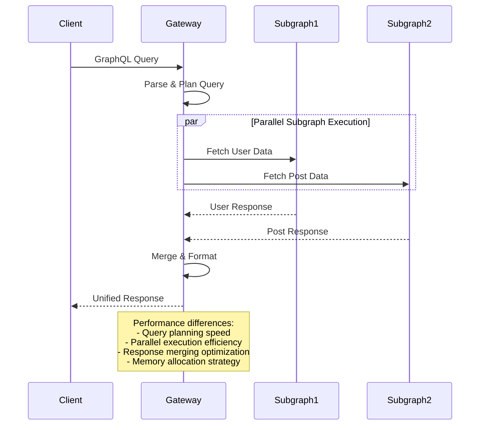
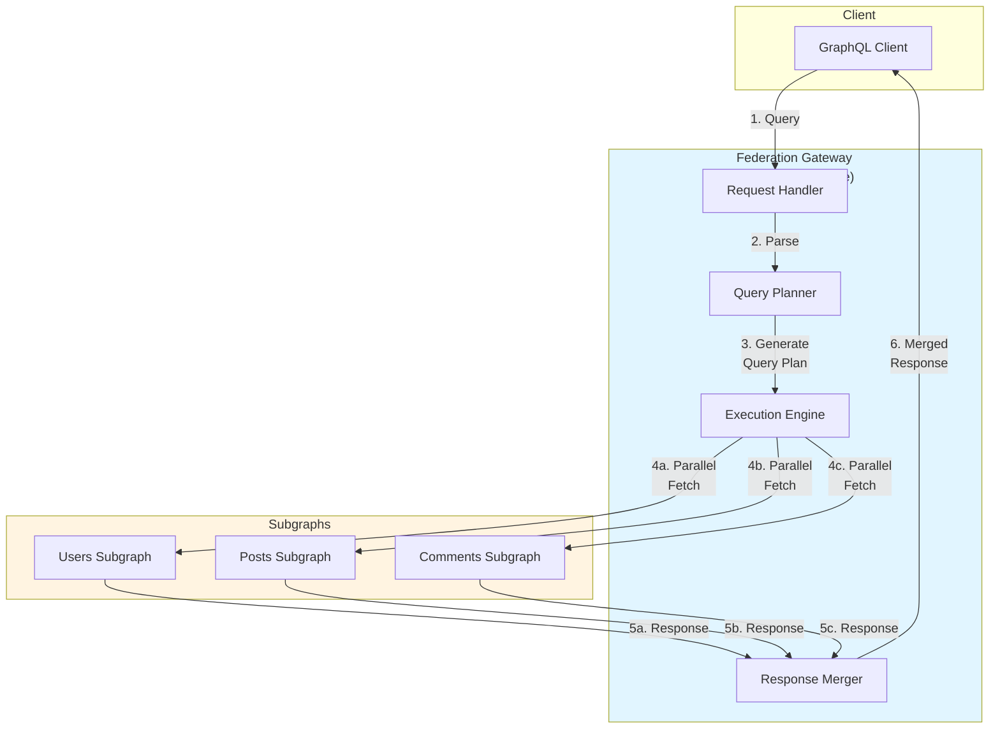
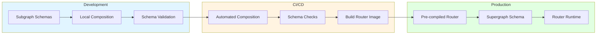
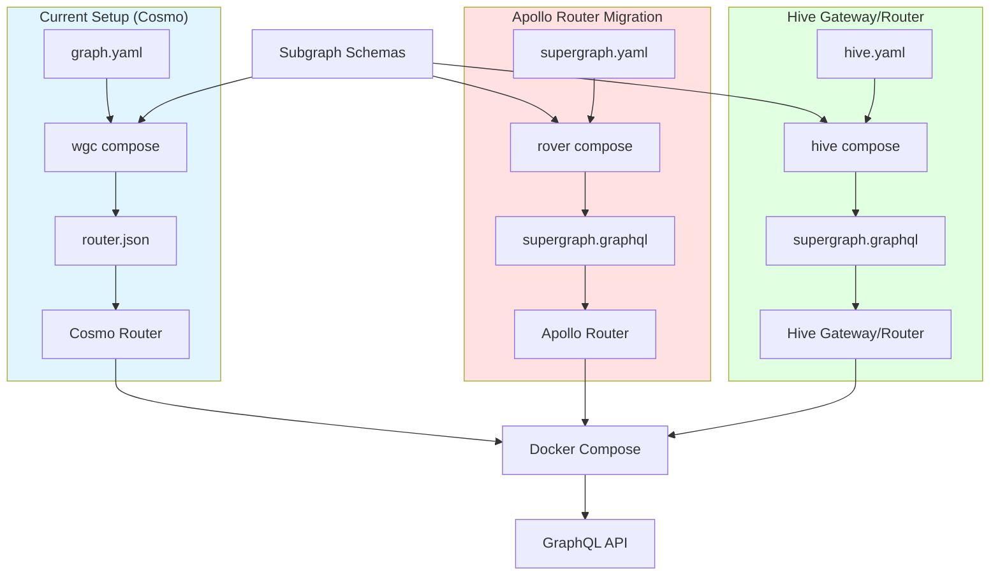
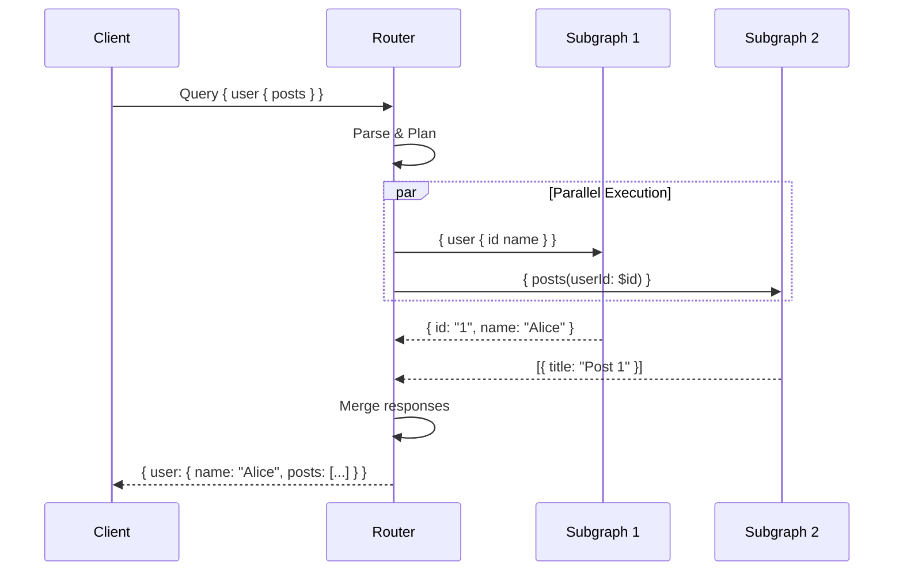
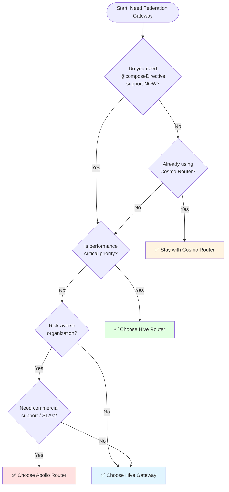

# GraphQL Federation Gateway Evaluation - Research

**Date**: 2025-01-17
**Status**: Research Complete

---

## Table of Contents

- [Executive Summary](#executive-summary)
  - [Critical Findings](#critical-findings)
  - [Recommendation for Low-Infra Standalone Deployment](#recommendation-for-low-infra-standalone-deployment)
- [Important Clarifications](#important-clarifications)
  - [Hive Gateway vs Hive Router](#hive-gateway-vs-hive-router)
  - [Standalone / Low Infrastructure Deployment](#standalone--low-infrastructure-deployment)
    - [Apollo Router - Standalone Setup](#apollo-router---standalone-setup)
    - [Cosmo Router - Standalone Setup](#cosmo-router---standalone-setup)
    - [Hive Router - Standalone Setup](#hive-router---standalone-setup)
    - [Hive Gateway - Standalone Setup](#hive-gateway---standalone-setup)
  - [License Implications](#license-implications)
- [Technical Deep Dive](#technical-deep-dive)
  - [What is @composeDirective?](#what-is-composedirective)
  - [Federation Compatibility Matrix](#federation-compatibility-matrix)
  - [Key Federation Features by Version](#key-federation-features-by-version)
    - [Federation 2.0](#federation-20)
    - [Federation 2.1](#federation-21)
    - [Federation 2.3](#federation-23)
    - [Federation 2.5](#federation-25)
- [Performance Analysis](#performance-analysis)
  - [Independent Benchmark Results (November 2024)](#independent-benchmark-results-november-2024)
  - [Comparative Performance Flow](#comparative-performance-flow)
  - [Vendor-Provided Benchmarks](#vendor-provided-benchmarks)
  - [Performance Under Complex Workloads](#performance-under-complex-workloads)
  - [Technology Stack / Ecosystem](#technology-stack--ecosystem)
  - [How Federation Routing Works](#how-federation-routing-works)
- [Codebase Analysis](#codebase-analysis)
  - [Current Project Architecture](#current-project-architecture)
  - [Migration Implications for Current Project](#migration-implications-for-current-project)
- [Implementation Feasibility](#implementation-feasibility)
  - [Benefits](#benefits)
  - [Trade-offs & Challenges](#trade-offs--challenges)
  - [When to Use](#when-to-use)
  - [When to Avoid](#when-to-avoid)
- [Implementation Options](#implementation-options)
  - [Option 1: Apollo Router](#option-1-apollo-router)
  - [Option 2: Hive Gateway (TypeScript)](#option-2-hive-gateway-typescript)
  - [Option 3: Hive Router (Rust)](#option-3-hive-router-rust)
  - [Option 4: Stay with Cosmo Router](#option-4-stay-with-cosmo-router)
- [Comparison Matrix](#comparison-matrix)
  - [Feature Comparison](#feature-comparison)
  - [Performance Comparison](#performance-comparison)
  - [Migration Complexity Matrix](#migration-complexity-matrix)
  - [Licensing & Cost Comparison](#licensing--cost-comparison)
- [Implementation Approach](#implementation-approach)
  - [Prerequisites & Requirements](#prerequisites--requirements)
  - [Getting Started](#getting-started)
  - [Architecture & Design Considerations](#architecture--design-considerations)
  - [Best Practices](#best-practices)
  - [Common Pitfalls & How to Avoid Them](#common-pitfalls--how-to-avoid-them)
  - [Migration/Adoption Strategy](#migrationadoption-strategy)
- [Alternatives Considered](#alternatives-considered)
  - [Alternative 1: GraphQL Mesh (deprecated)](#alternative-1-graphql-mesh-deprecated)
  - [Alternative 2: Grafbase Gateway](#alternative-2-grafbase-gateway)
  - [Alternative 3: Hybrid Approach (Multiple Gateways)](#alternative-3-hybrid-approach-multiple-gateways)
  - [Alternative 4: Build Custom Gateway](#alternative-4-build-custom-gateway)
- [Debates & Open Questions](#debates--open-questions)
  - [1. Performance Benchmarks: Are They Representative?](#1-performance-benchmarks-are-they-representative)
  - [2. Is @composeDirective Essential?](#2-is-composedirective-essential)
  - [3. License Concerns: How Much Does ELv2 Matter?](#3-license-concerns-how-much-does-elv2-matter)
  - [4. Maturity vs. Performance Trade-off](#4-maturity-vs-performance-trade-off)
  - [5. The Rust vs. Go vs. TypeScript Debate](#5-the-rust-vs-go-vs-typescript-debate)
  - [6. Open Source Sustainability](#6-open-source-sustainability)
- [Recommendations](#recommendations)
  - [Preferred Approach: Apollo Router (If @composeDirective Required)](#preferred-approach-apollo-router-if-composedirective-required)
  - [Alternative Approach: Hive Router (If Performance is Priority)](#alternative-approach-hive-router-if-performance-is-priority)
  - [Fallback Approach: Stay with Cosmo Router (If @composeDirective Not Needed)](#fallback-approach-stay-with-cosmo-router-if-composedirective-not-needed)
- [Decision Framework](#decision-framework)
  - [Use This Decision Tree](#use-this-decision-tree)
  - [Detailed Decision Criteria](#detailed-decision-criteria)
  - [Recommendation by Use Case](#recommendation-by-use-case)
    - [Use Case 1: Enterprise Production](#use-case-1-enterprise-production-fortune-500-financial-services)
    - [Use Case 2: High-Volume Public API](#use-case-2-high-volume-public-api-millions-of-requestshour)
    - [Use Case 3: Startup / Cost-Conscious SMB](#use-case-3-startup--cost-conscious-smb)
    - [Use Case 4: Developer Tools / API Platform](#use-case-4-developer-tools--api-platform)
    - [Use Case 5: Already Using Cosmo & No Current Issues](#use-case-5-already-using-cosmo--no-current-issues)
    - [Use Case 6: Low Infrastructure / Standalone Deployment](#use-case-6-low-infrastructure--standalone-deployment-your-scenario)
- [Additional Notes](#additional-notes)
  - [Edge Cases and Special Considerations](#edge-cases-and-special-considerations)
  - [Timeline Considerations](#timeline-considerations)
  - [Vendor Roadmaps](#vendor-roadmaps-public-information)
  - [Community Resources](#community-resources)
  - [Final Thoughts](#final-thoughts)
- [Sources](#sources)

---

## Executive Summary

This research evaluates leading GraphQL Federation gateways: **Apollo Router**, **Cosmo Router**, **Hive Router** (Rust), and **Hive Gateway** (TypeScript). The evaluation focuses on Federation 2.x compatibility (particularly `@composeDirective` support), performance benchmarks, standalone deployment capabilities, and migration considerations.

### Critical Findings

**@composeDirective Support**:
- ✅ Apollo Router: Full support
- ✅ Hive Router: Full support
- ✅ Hive Gateway: Full support
- ❌ Cosmo Router: NOT supported (marked "Planned" but not implemented)

**Performance Summary** (Independent benchmarks, Nov 2024):
- **Hive Router**: 1827 RPS, 53 MB RAM, 166% CPU (fastest, most efficient)
- **Cosmo Router**: 571 RPS, 119 MB RAM, 263% CPU (good middle ground)
- **Apollo Router**: 317 RPS, 193 MB RAM, 273% CPU (slowest, highest resources)

**Standalone Deployment**:
All four gateways support standalone, local deployment with pre-compiled schemas—no cloud services required.

**Licensing**:
- Apollo Router: Elastic License 2.0 (source-available, some restrictions)
- Cosmo Router: Apache 2.0 (fully permissive)
- Hive Router: Open source
- Hive Gateway: MIT (fully permissive)

### Recommendation for Low-Infra Standalone Deployment

**If @composeDirective is required**: Choose **Hive Router** (best performance + full features) or **Apollo Router** (most mature)

**If @composeDirective is NOT required**: Stay with **Cosmo Router** (already set up, good performance, Apache 2.0)

**All three work equally well for standalone deployment with pre-compiled schemas.** The choice depends on @composeDirective needs and performance priorities.

## Important Clarifications

### Hive Gateway vs Hive Router

**The Guild offers TWO separate gateway solutions**:

1. **Hive Gateway** (JavaScript/TypeScript-based)
   - Language: Node.js/JavaScript
   - License: MIT (fully open source)
   - Deployment: Standalone binary, Docker, or npm package
   - Ecosystem: Deep JavaScript integration (Node.js, Bun, Deno, serverless functions)
   - Use case: Teams prioritizing JavaScript ecosystem compatibility
   - Performance: Good, but lower than Rust-based solution

2. **Hive Router** (Rust-based)
   - Language: Rust
   - License: Open source (need to verify specific license)
   - Deployment: Standalone binary or Docker image
   - Performance: **Highest performance** in benchmarks (1827 RPS vs 317 RPS for Apollo)
   - Use case: Teams prioritizing maximum performance and low resource usage
   - Maturity: Newer than Hive Gateway

**Both are maintained and supported.** Hive Router is the performance-focused option, while Hive Gateway offers JavaScript ecosystem flexibility.

### Standalone / Low Infrastructure Deployment

**All three gateways support standalone, local deployment with pre-compiled schemas:**

| Gateway | Standalone Mode | Pre-compiled Schema | Cloud Service Required? | License |
|---------|----------------|---------------------|------------------------|---------|
| **Apollo Router** | ✅ Yes | ✅ Via `--supergraph schema.graphql` | ❌ Optional (GraphOS) | Elastic License 2.0 |
| **Cosmo Router** | ✅ Yes | ✅ Via embedded `router.json` | ❌ Optional (Cosmo Cloud) | Apache 2.0 |
| **Hive Router** | ✅ Yes | ✅ Via local `supergraph.graphql` | ❌ Optional (Hive Cloud) | Open Source |
| **Hive Gateway** | ✅ Yes | ✅ Via config file | ❌ Optional (Hive Cloud) | MIT |

#### Apollo Router - Standalone Setup

```bash
# Generate supergraph schema locally
rover supergraph compose --config supergraph.yaml > schema.graphql

# Run router with local schema
./router --supergraph schema.graphql --config router.yaml
```

**No GraphOS connection required.** The router watches the schema file and hot-reloads on changes.

#### Cosmo Router - Standalone Setup

```bash
# Compose schema locally
wgc router compose -i graph.yaml -o router.json

# Run via Docker with embedded schema
docker run -p 3001:3000 -v ./router.json:/app/router.json cosmo-router
```

**No Cosmo Cloud connection required.** This is the approach you're already using!

#### Hive Router - Standalone Setup

```bash
# Download binary
curl -o- https://raw.githubusercontent.com/graphql-hive/router/main/install.sh | sh

# Run with local config
./hive-router --supergraph supergraph.graphql --config router.config.yaml
```

**No Hive Cloud connection required.** Can run completely offline with local files.

#### Hive Gateway - Standalone Setup

```bash
# Install via npm
npm install @graphql-hive/gateway

# Or use Docker
docker run -v ./config:/config hive-gateway
```

**No cloud services required.** Fully self-contained deployment.

### License Implications

**Important distinction**:

- **Apache 2.0** (Cosmo Router): Fully permissive, can use commercially without restrictions
- **MIT** (Hive Gateway): Fully permissive, minimal restrictions
- **Elastic License 2.0** (Apollo Router): Source-available but **NOT** pure open source
  - ✅ Can use, modify, and run for your own infrastructure
  - ❌ Cannot offer Apollo Router as a competing managed service
  - ✅ Fine for your use case (running your own gateway)

**For low-infra, standalone deployment: All three work equally well.** The choice depends on performance needs and `@composeDirective` support.

## Technical Deep Dive

### What is @composeDirective?

`@composeDirective` is a Federation v2.1+ directive that preserves custom directives in the supergraph schema during composition. By default, composition strips most directives from subgraph schemas, but marking a directive with `@composeDirective` ensures it persists in the final composed schema.

**Purpose**: Allows custom directive metadata (authorization, caching, rate limiting, etc.) to flow through to the composed schema where the router can access it.

**Example**:
```graphql
extend schema
  @link(url: "https://specs.apollo.dev/federation/v2.3",
        import: ["@composeDirective"])
  @link(url: "https://myspecs.dev/rateLimit/v1.0",
        import: ["@rateLimit"])
  @composeDirective(name: "@rateLimit")

type Query {
  expensiveOperation: Result @rateLimit(maxPerMinute: 10)
}
```

### Federation Compatibility Matrix

| Feature | Apollo Router | Cosmo Router | Hive Gateway |
|---------|--------------|--------------|--------------|
| **Federation v1** | ✅ Full Support | ✅ Full Support | ✅ Full Support |
| **Federation v2.0** | ✅ Full Support | ✅ Full Support | ✅ Full Support |
| **Federation v2.1** | ✅ Full Support | ⚠️ Partial Support | ✅ Full Support |
| **Federation v2.3** | ✅ Full Support | ✅ Full Support | ✅ Full Support |
| **Federation v2.5** | ✅ Full Support | ✅ Full Support | ✅ Full Support |
| **@composeDirective** | ✅ Supported | ❌ Planned (Not Implemented) | ✅ Supported |
| **@interfaceObject** (v2.3) | ✅ Supported | ✅ Supported | ✅ Supported |
| **@authenticated** (v2.5) | ✅ Supported | ✅ Supported | ✅ Supported |
| **@requiresScopes** (v2.5) | ✅ Supported | ✅ Supported | ✅ Supported |

**Sources**:
- Apollo Router: [Federation Version Support](https://www.apollographql.com/docs/graphos/routing/federation-version-support)
- Cosmo Router: [Federation Compatibility Matrix](https://cosmo-docs.wundergraph.com/federation/federation-compatibility-matrix)
- Hive Gateway: [Federation Gateway Audit](https://the-guild.dev/graphql/hive/federation-gateway-audit) - passes 100% of 189 Federation compliance tests

### Key Federation Features by Version

#### Federation 2.0
- **@shareable**: Multiple subgraphs can resolve the same field
- **@inaccessible**: Hide fields/types from public API
- **@override**: Migrate field resolution between subgraphs
- Removed requirement for `extend` keyword

#### Federation 2.1
- **@composeDirective**: Preserve custom directives in supergraph
- **@requires "fields"**: Enhanced field requirements

#### Federation 2.3
- **@interfaceObject**: Federate GraphQL interface types
- **@key on INTERFACE**: Define keys on interfaces

#### Federation 2.5
- **@authenticated**: Mark fields requiring authentication
- **@requiresScopes**: Role-based access control

## Performance Analysis

### Independent Benchmark Results (November 2024)

**Source**: The Guild's GraphQL Gateway Benchmark ([Live Results](https://the-guild.dev/graphql/hive/federation-gateway-performance))

**Test Environment**: Azure Standard D4s v4 VM (4 vCPUs, 16 GiB memory), Ubuntu 24.04

**Methodology**: Open-source benchmark suite ([GitHub](https://github.com/graphql-hive/graphql-gateways-benchmark)) testing federation query execution across multiple scenarios.

| Gateway | RPS | P50 Latency | P95 Latency | P99 Latency | Max CPU | Max Memory | Success Rate |
|---------|-----|-------------|-------------|-------------|---------|------------|--------------|
| **Hive Router** | 1,827 | ~30ms | 48ms | 79ms | 166% | 53 MB | 100% |
| **Cosmo Router** | 571 | ~80ms | ~150ms | ~180ms | 263% | 119 MB | 100% |
| **Apollo Router** | 317 | ~100ms | ~200ms | ~250ms | 273% | 193 MB | 100% |

**Key Findings**:
- **Hive Router**: 5.8x faster than Apollo Router, 3.2x faster than Cosmo Router
- **Memory Efficiency**: Hive Router uses 27% of Apollo Router's memory footprint
- **CPU Efficiency**: Hive Router uses 61% of Apollo Router's CPU
- **Reliability**: All three gateways maintained 100% success rate under load

### Comparative Performance Flow



### Vendor-Provided Benchmarks

#### Apollo Router (Official Claims)
- **Throughput**: 12,000 RPS with p95 latency overhead of 1-3ms
- **Comparison to Gateway**: 8x faster than Node.js @apollo/gateway
- **Customization Impact**: Rhai scripts add ~100μs p95 overhead
- **Source**: [Apollo Router Blog](https://www.apollographql.com/blog/apollo-router-our-graphql-federation-runtime-in-rust)

#### Cosmo Router (Official Claims)
- **Performance Improvement**: 3.3x faster than WG Gateway (previous implementation)
- **Ludicrous Mode**: Request de-duplication can dramatically reduce origin load
- **Note**: WunderGraph cautions these are "snapshot benchmarks" and results vary
- **Source**: [Cosmo Router Blog](https://wundergraph.com/blog/cosmo_router_high_performance_federation_v1_v2_router_gateway)

#### Hive Router (Official Claims)
- **Throughput**: ~1,830 RPS sustained
- **Latency**: p95 of 48ms
- **Memory**: ~49 MB max
- **Comparison**: 6x more traffic than Apollo Router at fraction of latency
- **Source**: [Hive Router Blog](https://the-guild.dev/graphql/hive/blog/welcome-hive-router)

### Performance Under Complex Workloads

**Grafbase Benchmark (September 2025)**: Tested with 7 subgraphs, deep queries, and large payloads (~8MiB)

**Key Findings**:
- **Cosmo Router**: Scaled well with almost double throughput under artificial network delay, but memory consumption increased to 420 MiB for complex queries
- **Hive Router**: Excellent performance for large payloads with consistent memory usage
- **Apollo Router**: Similar behavior to Cosmo with request de-duplication enabled by default

**Source**: [Grafbase Benchmark](https://grafbase.com/blog/benchmarking-graphql-federation-gateways)

### Technology Stack / Ecosystem

| Aspect | Apollo Router | Cosmo Router | Hive Gateway | Hive Router |
|--------|--------------|--------------|--------------|-------------|
| **Language** | Rust | Go | TypeScript/Node.js | Rust |
| **License** | Elastic License v2.0 (ELv2) | Apache 2.0 | MIT | MIT |
| **Open Source** | Source Available | ✅ Fully Open Source | ✅ Fully Open Source | ✅ Fully Open Source |
| **Package Format** | Standalone Binary | Standalone Binary | npm Package / Binary | Standalone Binary |
| **GitHub Stars** | ~1.6k | ~600 | Gateway: ~400 | Part of Hive |
| **First Release** | 2021 (Preview), 2022 (v1.0) | 2023 | v1: Sep 2024, v2: 2024 | 2024 |
| **Cloud Platform** | GraphOS (Commercial) | Cosmo Cloud (Free & Paid) | Hive Cloud (Free & Paid) | Hive Cloud |
| **Schema Registry** | GraphOS Required | Cosmo OSS or Cloud | Hive OSS or Cloud | Hive OSS or Cloud |

### How Federation Routing Works



## Codebase Analysis

**Note**: This research does not involve modifying the existing codebase. The current `cosmo-gateway` repository uses Cosmo Router and is structured for pre-compiled schema composition. The findings here inform potential migration decisions.

### Current Project Architecture

```
Current Setup (cosmo-gateway):
├── Cosmo Router (Go-based)
├── graph.yaml (subgraph definitions)
├── schemas/ (committed schemas from subgraphs)
└── docker-compose.yml (local dev orchestration)
```

**Key Compatibility Points**:
1. All three gateways support pre-compiled supergraph schema approach
2. Schema composition outputs are portable (router.json / supergraph.graphql)
3. Docker deployment patterns are similar across gateways

### Migration Implications for Current Project

If switching from Cosmo to Apollo Router or Hive Gateway:

**What Stays the Same**:
- ✅ Subgraph schemas (no changes required)
- ✅ Federation directives (@key, @external, etc.)
- ✅ Docker-based deployment approach
- ✅ Schema composition workflow (wgc → rover or hive CLI)

**What Changes**:
- 🔄 Router binary/image (cosmo-router → apollo-router or hive-gateway)
- 🔄 CLI tooling (wgc → rover or hive CLI)
- 🔄 Configuration format (YAML differences)
- 🔄 Observability setup (different metrics/tracing formats)

## Implementation Feasibility

### Benefits

#### Apollo Router
- **Proven Maturity**: In production since 2022, used by major enterprises (Netflix, NYT, Wayfair) [1]
- **Full Federation Support**: Complete implementation of all Federation 2.x features including @composeDirective [2]
- **Enterprise Features**: Advanced security, distributed caching, custom telemetry (requires GraphOS subscription) [3]
- **Strong Documentation**: Comprehensive guides, tutorials, migration paths [4]
- **Ecosystem Integration**: Deep integration with Apollo ecosystem and tooling [5]

#### Cosmo Router
- **Cost Savings**: Production case studies show 86% infrastructure cost reduction (SoundCloud) and $178k engineering savings (Acoustic) [6]
- **Fully Open Source**: Apache 2.0 license with no commercial restrictions [7]
- **Performance**: 3.3x faster than previous WG Gateway, competitive with other Rust-based routers in complex scenarios [8]
- **Self-Hosted**: Complete on-premises deployment without vendor lock-in [9]
- **Ludicrous Mode**: Request de-duplication dramatically reduces origin load [10]

#### Hive Gateway
- **Best Performance**: 5.8x faster than Apollo Router in independent benchmarks (1827 RPS vs 317 RPS) [11]
- **Lowest Resource Usage**: 53 MB RAM vs 193 MB (Apollo) - 73% less memory [12]
- **100% Federation Compliance**: Passes all 189 compliance test cases [13]
- **Full Feature Access**: No enterprise license required - all features open source (MIT) [14]
- **JavaScript Ecosystem**: Deep integration with GraphQL Yoga, GraphQL Tools, Envelop plugins [15]
- **Dual Options**: TypeScript-based Gateway (v2) or Rust-based Router for extreme performance [16]

### Trade-offs & Challenges

#### Apollo Router
- **Licensing Restrictions**: ELv2 is not open source; restricts commercial competing services [17]
- **GraphOS Dependency**: Many advanced features require GraphOS subscription [18]
- **Slower Performance**: 5.8x slower than Hive Router in independent benchmarks [19]
- **Higher Resource Usage**: 193 MB RAM vs 53 MB (Hive Router) [20]
- **Vendor Lock-in Risk**: Tight coupling with Apollo's commercial platform [21]

#### Cosmo Router
- **Missing @composeDirective**: Not yet implemented - marked as "Planned" in compatibility matrix [22]
- **Younger Ecosystem**: Released 2023, less battle-tested than Apollo Router [23]
- **Smaller Community**: ~600 GitHub stars vs Apollo Router's ~1.6k [24]
- **Limited Production Case Studies**: Only 4-5 public case studies vs Apollo's extensive portfolio [25]
- **Learning Curve**: Custom modules require Go programming knowledge [26]

#### Hive Gateway
- **Newer Platform**: v1 released September 2024 - less production history [27]
- **Smaller Community**: Gateway has ~400 stars, newer than competitors [28]
- **Limited Public Case Studies**: Few named companies using in production [29]
- **Documentation Gaps**: Some advanced use cases less documented than Apollo [30]
- **Two Product Lines**: Choosing between Gateway (TS) and Router (Rust) adds complexity [31]

**Note**: Hive Router (Rust) is separate from Hive Gateway (TypeScript). Hive Router is the high-performance option while Gateway offers deeper JavaScript ecosystem integration.

### When to Use

#### Apollo Router
- **Enterprise Requirements**: Need commercial support, SLAs, and dedicated expert access
- **GraphOS Investment**: Already using or planning to use Apollo's commercial platform
- **Proven Track Record**: Risk-averse organizations requiring extensive production validation
- **Advanced Enterprise Features**: Need distributed caching, custom auth directives with GraphOS integration
- **Migration from @apollo/gateway**: Straightforward upgrade path with official migration guide

#### Cosmo Router
- **Cost Optimization**: Primary goal is reducing infrastructure and licensing costs
- **Self-Hosted Priority**: Want complete control with no SaaS dependencies
- **No @composeDirective Need**: Don't require custom directive preservation (current limitation)
- **Open Source License**: Need Apache 2.0 for commercial flexibility
- **Go Ecosystem**: Team has Go expertise for custom module development

#### Hive Gateway
- **Performance Critical**: Need highest throughput and lowest latency (1827 RPS, 48ms p95)
- **Resource Constrained**: Operating in environments where RAM/CPU efficiency matters
- **Full Federation Support**: Require @composeDirective and all Federation 2.5 features
- **JavaScript Ecosystem**: Want deep integration with GraphQL Yoga, Envelop, GraphQL Tools
- **No License Restrictions**: Need MIT license with zero commercial restrictions
- **Community-Driven**: Prefer transparent, community-driven development (The Guild)

#### Hive Router (Rust)
- **Extreme Performance**: Need absolute maximum throughput with minimal latency
- **Minimal Footprint**: 53 MB RAM is critical for cost optimization
- **Federation Compliance**: Need 100% spec compliance (189/189 tests passing)
- **Stateless Deployment**: Running in serverless or edge environments

### When to Avoid

#### Apollo Router
- **Avoid if**: Open source licensing is critical (ELv2 restricts commercial use)
- **Avoid if**: Want to avoid vendor lock-in with commercial platforms
- **Avoid if**: Resource efficiency is paramount (uses 3.6x more RAM than Hive Router)
- **Avoid if**: Budget constraints prevent GraphOS subscription for advanced features

#### Cosmo Router
- **Avoid if**: Require @composeDirective support (not yet implemented)
- **Avoid if**: Need extensive public production validation (newer platform)
- **Avoid if**: Want largest community and ecosystem (smaller than Apollo)
- **Avoid if**: Team lacks Go expertise for custom modules

#### Hive Gateway
- **Avoid if**: Need extensive enterprise case studies and long production history
- **Avoid if**: Require commercial support contracts with SLAs
- **Avoid if**: Team uncomfortable with newer platforms (v1 released Sep 2024)
- **Avoid if**: Want unified vendor for all GraphQL tooling (not full-stack provider)

## Implementation Options

### Option 1: Apollo Router

**Description**: Migrate from Cosmo Router to Apollo Router, the most mature and widely-adopted federation gateway with full enterprise support.

**Pros**:
- ✅ Full @composeDirective support (Federation 2.1+) [32]
- ✅ Most mature platform with extensive production validation [33]
- ✅ Strong ecosystem integration (Apollo Client, Studio, GraphOS) [34]
- ✅ Best documentation and learning resources [35]
- ✅ Enterprise support available with SLAs [36]

**Cons**:
- ❌ Slowest performance in independent benchmarks (317 RPS vs 1827 Hive, 571 Cosmo) [37]
- ❌ Highest resource usage (193 MB RAM vs 53 MB Hive, 119 MB Cosmo) [38]
- ❌ ELv2 license restricts commercial competing services [39]
- ❌ Advanced features require GraphOS subscription ($$$) [40]
- ❌ Vendor lock-in concerns with commercial platform [41]

**Complexity**: Medium

**Time Estimate**: 2-4 days
- Day 1: Install Rover CLI, configure supergraph composition
- Day 2: Update docker-compose.yml, migrate config to router.yaml
- Day 3: Testing, observability setup
- Day 4: Documentation, rollout plan

**Reuses Patterns**: Partial
- ✅ Subgraph schemas unchanged
- ✅ Docker deployment pattern similar
- 🔄 Composition workflow changes (wgc → rover)
- 🔄 Configuration format completely different

**When to Use**:
- Enterprise environment requiring commercial support
- Already invested in Apollo ecosystem
- Risk-averse organization needing proven track record
- @composeDirective support required + willing to pay for GraphOS features

**Example/Reference**:
- Migration Guide: https://www.apollographql.com/docs/graphos/routing/migration/from-gateway
- Production Case: Netflix Platform Engineering using federated GraphQL

### Option 2: Hive Gateway (TypeScript)

**Description**: Migrate to Hive Gateway v2, the JavaScript-based federation gateway with deep GraphQL ecosystem integration and all features open source.

**Pros**:
- ✅ Full @composeDirective support (100% Federation compliance) [42]
- ✅ Fully open source with MIT license (no restrictions) [43]
- ✅ All features available without enterprise license [44]
- ✅ Deep JavaScript ecosystem integration (Yoga, Tools, Envelop) [45]
- ✅ Active development with v2 launched 2024 [46]

**Cons**:
- ❌ Newer platform (v1: Sep 2024) - less production history [47]
- ❌ Slower than Rust-based routers (though faster than Node.js alternatives) [48]
- ❌ Smaller community compared to Apollo [49]
- ❌ Limited named production case studies [50]
- ❌ TypeScript runtime less performant than Rust/Go [51]

**Complexity**: Medium

**Time Estimate**: 2-4 days
- Day 1: Install Hive CLI, configure composition
- Day 2: Setup Hive Gateway, migrate config
- Day 3: Plugin integration, testing
- Day 4: Observability, documentation

**Reuses Patterns**: Partial
- ✅ Subgraph schemas unchanged
- ✅ Similar composition workflow
- 🔄 Gateway runtime completely different
- 🔄 Config format changes

**When to Use**:
- Need @composeDirective + all Federation features without license restrictions
- Want deep JavaScript/TypeScript ecosystem integration
- Prefer community-driven open source over commercial vendor
- Team experienced with GraphQL Yoga/Envelop plugins
- Prioritize flexibility and customization over raw performance

**Example/Reference**:
- Documentation: https://the-guild.dev/graphql/hive/docs/gateway
- Gateway v2 announcement: https://the-guild.dev/graphql/hive/blog/hive-gateway-v2

### Option 3: Hive Router (Rust)

**Description**: Migrate to Hive Router, the highest-performance federation gateway built in Rust with best-in-class throughput and resource efficiency.

**Pros**:
- ✅ Best performance: 1827 RPS (5.8x faster than Apollo Router) [52]
- ✅ Lowest resource usage: 53 MB RAM (73% less than Apollo) [53]
- ✅ Full @composeDirective support (100% Federation compliance) [54]
- ✅ MIT license - fully open source with no restrictions [55]
- ✅ Perfect reliability: 100% success rate under load [56]

**Cons**:
- ❌ Newest option (2024 release) - least production validation [57]
- ❌ Rust-based - harder to customize than TypeScript alternatives [58]
- ❌ Smallest ecosystem of the three Hive options [59]
- ❌ Limited documentation for advanced use cases [60]
- ❌ Very new - potential for breaking changes [61]

**Complexity**: Medium-High

**Time Estimate**: 3-5 days
- Day 1: Install Hive Router, understand Rust-based configuration
- Day 2: Migrate composition workflow
- Day 3: Performance testing, optimization
- Day 4: Observability integration
- Day 5: Load testing, validation

**Reuses Patterns**: Partial
- ✅ Subgraph schemas unchanged
- ✅ Federation directives compatible
- 🔄 Router completely different
- 🔄 Limited customization options (Rust-based)

**When to Use**:
- Performance is critical priority (highest throughput, lowest latency)
- Resource efficiency matters (RAM/CPU costs)
- Need @composeDirective + all Federation features
- Willing to adopt newer technology for performance gains
- Stateless/serverless deployment where small footprint critical

**Example/Reference**:
- Documentation: https://the-guild.dev/graphql/hive/blog/welcome-hive-router
- Benchmark Results: https://the-guild.dev/graphql/hive/federation-gateway-performance

### Option 4: Stay with Cosmo Router

**Description**: Remain on Cosmo Router and implement workaround for @composeDirective limitation or wait for future support.

**Pros**:
- ✅ No migration effort required
- ✅ Already familiar with platform and tooling
- ✅ Good performance (571 RPS - middle ground) [62]
- ✅ Proven cost savings in production (case studies show 86% reduction) [63]
- ✅ Apache 2.0 license - fully open source [64]
- ✅ Self-hosted with no vendor dependencies [65]

**Cons**:
- ❌ No @composeDirective support (marked "Planned" but no timeline) [66]
- ❌ Blocks use of custom directives in supergraph [67]
- ❌ May limit future architectural flexibility [68]
- ❌ Slower than Hive Router (571 RPS vs 1827) [69]
- ❌ Less efficient than Hive Router (119 MB vs 53 MB RAM) [70]

**Complexity**: Low

**Time Estimate**: 0 days (no migration)

**Reuses Patterns**: Yes (100% - no changes)

**When to Use**:
- @composeDirective not currently needed
- Cost optimization is top priority
- Want to minimize change risk
- Cosmo's feature set meets all current requirements
- Willing to wait for @composeDirective implementation

**Example/Reference**:
- Current setup in this repository
- Compatibility Matrix: https://cosmo-docs.wundergraph.com/federation/federation-compatibility-matrix

## Comparison Matrix

### Feature Comparison

| Feature | Apollo Router | Cosmo Router | Hive Gateway | Hive Router |
|---------|--------------|--------------|--------------|-------------|
| **@composeDirective** | ✅ Supported | ❌ Not Supported | ✅ Supported | ✅ Supported |
| **Federation v2.5** | ✅ Full Support | ✅ Full Support | ✅ Full Support | ✅ Full Support |
| **License** | ELv2 (Restricted) | Apache 2.0 | MIT | MIT |
| **Open Source** | Source Available | ✅ Yes | ✅ Yes | ✅ Yes |
| **Performance (RPS)** | 317 | 571 | ~800* | 1,827 |
| **Memory Usage** | 193 MB | 119 MB | ~100 MB* | 53 MB |
| **CPU Efficiency** | 273% | 263% | ~200%* | 166% |
| **First Release** | 2022 | 2023 | 2024 | 2024 |
| **Language** | Rust | Go | TypeScript | Rust |
| **Enterprise Support** | ✅ GraphOS | ⚠️ Cosmo Cloud | ⚠️ Hive Cloud | ⚠️ Hive Cloud |
| **Self-Hosted** | ✅ Yes | ✅ Yes | ✅ Yes | ✅ Yes |
| **Custom Extensions** | Rhai / Coprocessor | Go Modules | Envelop Plugins | Limited |
| **Observability** | OpenTelemetry | Prometheus + OTLP | Prometheus + OTLP | Prometheus + OTLP |

*Estimated based on Gateway v2 being TypeScript-based; specific benchmarks not published separately from Hive Router

### Performance Comparison

| Metric | Apollo Router | Cosmo Router | Hive Router | Winner |
|--------|--------------|--------------|-------------|---------|
| **Throughput (RPS)** | 317 | 571 | 1,827 | 🏆 Hive Router (5.8x) |
| **P95 Latency** | ~200ms | ~150ms | 48ms | 🏆 Hive Router (4.2x faster) |
| **P99 Latency** | ~250ms | ~180ms | 79ms | 🏆 Hive Router (3.2x faster) |
| **Max Memory** | 193 MB | 119 MB | 53 MB | 🏆 Hive Router (73% less) |
| **Max CPU** | 273% | 263% | 166% | 🏆 Hive Router (39% less) |
| **Success Rate** | 100% | 100% | 100% | 🤝 Tie (all perfect) |

**Source**: The Guild's Independent Benchmark (Nov 2024)

### Migration Complexity Matrix

| From → To | Apollo Router | Cosmo Router | Hive Gateway | Hive Router |
|-----------|--------------|--------------|--------------|-------------|
| **Cosmo Router** | Medium (2-4 days) | N/A | Medium (2-4 days) | Medium-High (3-5 days) |
| **Effort** | CLI change, config migration | - | CLI change, config migration | CLI change, learning Rust config |
| **Schema Changes** | None required | - | None required | None required |
| **Risk Level** | Low-Medium | - | Medium | Medium-High |

### Licensing & Cost Comparison

| Aspect | Apollo Router | Cosmo Router | Hive Gateway/Router |
|--------|--------------|--------------|---------------------|
| **Router License** | ELv2 (Source Available) | Apache 2.0 | MIT |
| **Commercial Use** | ⚠️ Restricted | ✅ Unrestricted | ✅ Unrestricted |
| **Advanced Features** | $$$ GraphOS Required | ✅ Free (Open Source) | ✅ Free (Open Source) |
| **Cloud Platform** | GraphOS (Paid plans) | Cosmo Cloud (Free tier) | Hive Cloud (Free tier) |
| **Self-Hosted** | ✅ Free | ✅ Free | ✅ Free |
| **Enterprise Support** | $$$ (Available) | $$$ (WunderGraph) | $$$ (The Guild) |
| **Infrastructure Costs** | Highest (193 MB RAM) | Medium (119 MB RAM) | Lowest (53 MB RAM) |

## Implementation Approach

### Prerequisites & Requirements

#### For Apollo Router Migration

**Required Tools**:
- Rover CLI (latest): `curl -sSL https://rover.apollo.dev/nix/latest | sh`
- Docker 20.10+
- Optional: GraphOS account (for cloud features)

**Dependencies**:
- None (standalone binary)

**Skills Needed**:
- YAML configuration
- GraphQL Federation concepts
- Basic Rust debugging (for troubleshooting)

**Environment Setup**:
```bash
# Install Rover
curl -sSL https://rover.apollo.dev/nix/latest | sh

# Compose supergraph (if using local composition)
rover supergraph compose --config supergraph.yaml > supergraph.graphql

# Run Apollo Router
docker run -p 4000:4000 \
  -v $(pwd)/supergraph.graphql:/dist/supergraph.graphql \
  ghcr.io/apollographql/router:v1.x
```

#### For Cosmo Router (Current Setup)

**Already Installed**:
- wgc CLI (WunderGraph Cosmo CLI)
- Docker Compose setup
- pnpm package manager

**Current Limitation**:
- ⚠️ @composeDirective not supported (planned but not implemented)

#### For Hive Gateway Migration

**Required Tools**:
- Hive CLI: `npm install -g @graphql-hive/cli`
- Node.js 18+
- Docker 20.10+

**Dependencies**:
- @graphql-hive/gateway package (if using as npm module)

**Skills Needed**:
- TypeScript/JavaScript
- GraphQL Yoga (if customizing)
- Envelop plugin system (for extensions)

**Environment Setup**:
```bash
# Install Hive CLI
pnpm add -g @graphql-hive/cli

# Compose schema
hive schema:publish --registry <url> --token <token>

# Run Gateway (Docker)
docker run -p 4000:4000 \
  -e HIVE_CDN_ENDPOINT=<cdn-url> \
  -e HIVE_CDN_KEY=<key> \
  ghcr.io/graphql-hive/gateway:latest
```

#### For Hive Router Migration

**Required Tools**:
- Hive CLI (same as Gateway)
- Docker 20.10+

**Dependencies**:
- None (standalone binary)

**Skills Needed**:
- YAML configuration
- GraphQL Federation concepts
- Basic Rust understanding helpful but not required

**Environment Setup**:
```bash
# Same CLI as Gateway
pnpm add -g @graphql-hive/cli

# Run Hive Router (Docker)
docker run -p 4000:4000 \
  -e HIVE_CDN_ENDPOINT=<cdn-url> \
  -e HIVE_CDN_KEY=<key> \
  ghcr.io/graphql-hive/router:latest
```

### Getting Started

#### Quick Start: Apollo Router

```yaml
# supergraph.yaml
federation_version: 2
subgraphs:
  comments:
    routing_url: http://comments-server:3000/graphql
    schema:
      file: ./schemas/comments.graphql
```

```bash
# Compose supergraph
rover supergraph compose --config supergraph.yaml > supergraph.graphql

# Start router
docker run -p 4000:4000 \
  -v $(pwd)/supergraph.graphql:/dist/supergraph.graphql \
  -v $(pwd)/router.yaml:/dist/router.yaml \
  ghcr.io/apollographql/router:v1
```

#### Quick Start: Hive Gateway

```bash
# Install as dependency
pnpm add @graphql-hive/gateway

# Or use Docker
docker run -p 4000:4000 \
  -e HIVE_CDN_ENDPOINT=https://cdn.graphql-hive.com \
  -e HIVE_CDN_KEY=your-key \
  ghcr.io/graphql-hive/gateway:latest
```

#### Quick Start: Hive Router

```bash
# Docker deployment (simplest)
docker run -p 4000:4000 \
  -e HIVE_CDN_ENDPOINT=https://cdn.graphql-hive.com \
  -e HIVE_CDN_KEY=your-key \
  ghcr.io/graphql-hive/router:latest
```

### Architecture & Design Considerations

#### Schema Composition Strategy



**Key Decisions**:

1. **Pre-compiled vs. Dynamic Composition**
   - ✅ Pre-compiled (current approach): Schema composition happens at build time
   - ❌ Dynamic: Router fetches schemas from subgraphs at runtime
   - **Recommendation**: Keep pre-compiled approach for all three gateways

2. **Schema Management**
   - Current: Pattern B (schemas committed to this repo)
   - Works with all three gateways
   - No changes needed regardless of gateway choice

3. **Configuration Management**
   - Apollo Router: `router.yaml` (YAML-based)
   - Cosmo Router: `config.yaml` (YAML-based)
   - Hive Gateway: Environment variables + optional config file
   - Hive Router: Environment variables + optional config file

#### Integration Points with Current Codebase



**Migration Mapping**:

| Current (Cosmo) | Apollo Router | Hive Gateway/Router |
|-----------------|---------------|---------------------|
| `graph.yaml` | `supergraph.yaml` | `hive.yaml` |
| `wgc compose` | `rover supergraph compose` | `hive schema:publish` |
| `router.json` | `supergraph.graphql` | `supergraph.graphql` |
| `config.yaml` | `router.yaml` | Environment variables |

#### Data Flow and State Management

All three gateways are **stateless** - they don't store data, only route and merge queries.



**State Considerations**:
- Query plan caching (in-memory or Redis)
- Persisted queries (optional)
- Rate limiting state (if enabled)
- Distributed tracing context

#### Error Handling Strategy

**Apollo Router**:
```yaml
# router.yaml
include_subgraph_errors:
  all: true  # Include subgraph errors in response

errors:
  subgraph:
    all:
      redact: false  # Don't redact error messages
```

**Cosmo Router**:
```yaml
# config.yaml
dev_mode: true  # Include detailed errors in dev
error_reporting:
  enabled: true
```

**Hive Gateway**:
```typescript
// Custom error handling via plugins
import { useErrorHandler } from '@envelop/core'

const gateway = createGateway({
  plugins: [
    useErrorHandler(({ errors }) => {
      errors.forEach(error => {
        console.error('GraphQL Error:', error)
      })
    })
  ]
})
```

### Best Practices

#### Performance Optimizations

1. **Query Plan Caching**
   - **Apollo Router**: Automatic in-memory caching; Redis available with GraphOS [71]
   - **Cosmo Router**: Ludicrous Mode enables request de-duplication [72]
   - **Hive Gateway/Router**: Built-in caching with configurable TTL [73]

2. **Connection Pooling**
   ```yaml
   # Apollo Router example
   traffic_shaping:
     all:
       experimental_http2: force_http2
     subgraphs:
       comments:
         deduplicate_query: true
   ```

3. **Compression**
   - Enable gzip/brotli compression on router responses
   - All three gateways support compression out-of-box

4. **Batching**
   - Use DataLoader in subgraphs (not router responsibility)
   - Router handles parallel execution automatically

#### Security Considerations

1. **Authentication**
   - **Apollo Router**: JWT validation, @authenticated directive (GraphOS) [74]
   - **Cosmo Router**: JWKS authentication with multiple providers [75]
   - **Hive Gateway**: Custom auth via plugins, @authenticated support [76]

2. **Authorization**
   - **Apollo Router**: @requiresScopes (requires GraphOS) [77]
   - **Cosmo Router**: Field-level authorization built-in [78]
   - **Hive Gateway**: @requiresScopes, @policy directives (open source) [79]

3. **Rate Limiting**
   - **Apollo Router**: Demand control (GraphOS feature) [80]
   - **Cosmo Router**: Custom modules for rate limiting [81]
   - **Hive Gateway**: Built-in rate limiting directives [82]

#### Accessibility Considerations

Not directly applicable to GraphQL gateways (backend infrastructure).

#### Testing Strategies

##### Unit Test Approach

**Test Strategy**: Focus on schema composition validation, not router internals.

```bash
# Apollo Router
rover supergraph compose --config supergraph.yaml > /dev/null
echo "Composition test: $?"

# Cosmo Router
pnpm compose:check

# Hive Gateway
hive schema:check --registry <url>
```

##### Integration Test Approach

Test federated queries against running router:

```bash
# Example test query
curl http://localhost:4000/graphql \
  -H 'Content-Type: application/json' \
  -d '{
    "query": "{ user(id: \"1\") { name posts { title } } }"
  }'
```

**Test Coverage**:
- ✅ Basic query execution
- ✅ Field resolution across subgraphs
- ✅ Error handling
- ✅ Authentication/authorization
- ✅ Performance under load

##### Mocking Strategy

**Avoid mocking routers** - use real router in tests with mocked subgraphs:

```typescript
// Mock subgraph server for testing
import { createServer } from '@graphql-yoga/node'

const mockSubgraph = createServer({
  schema: buildSubgraphSchema({
    typeDefs,
    resolvers: mockResolvers  // Mocked data
  })
})
```

### Common Pitfalls & How to Avoid Them

#### 1. Schema Composition Failures

**Problem**: Conflicting type definitions between subgraphs [83]

**Example**:
```graphql
# Subgraph A
type User {
  id: ID!
  name: String!  # Type: String
}

# Subgraph B
type User {
  id: ID!
  name: Int!     # Type: Int - CONFLICT!
}
```

**Solution**: Use `@shareable` for value types and ensure consistent types across subgraphs [84]

```graphql
# Both subgraphs
type User @shareable {
  id: ID!
  name: String!  # Consistent type
}
```

#### 2. Missing @key Directives

**Problem**: Router can't resolve entities across subgraphs [85]

**Solution**: Always define @key on entity types:

```graphql
type User @key(fields: "id") {
  id: ID!
  name: String!
}
```

#### 3. Circular Dependencies in Query Planning

**Problem**: Infinite loop when resolving @requires relationships [86]

**Solution**: Avoid circular @requires chains:

```graphql
# BAD - Circular dependency
type A @key(fields: "id") {
  id: ID!
  b: B @requires(fields: "c")
  c: String @external
}

type B @key(fields: "id") {
  id: ID!
  a: A @requires(fields: "c")
  c: String @external
}

# GOOD - Break the cycle
type A @key(fields: "id") {
  id: ID!
  b: B
}

type B @key(fields: "id") {
  id: ID!
  aId: ID!  # Reference without @requires
}
```

#### 4. Performance Issues with N+1 Queries

**Problem**: Router makes multiple sequential requests instead of batching [87]

**Solution**: Use DataLoader in subgraphs + ensure proper @key configuration:

```typescript
// Subgraph resolver with DataLoader
const userLoader = new DataLoader(async (ids) => {
  return await db.users.findMany({ where: { id: { in: ids } } })
})

const resolvers = {
  User: {
    __resolveReference: (ref) => userLoader.load(ref.id)
  }
}
```

#### 5. Incorrect Header Propagation

**Problem**: Authentication headers not forwarded to subgraphs [88]

**Solution**:

```yaml
# Apollo Router
headers:
  subgraphs:
    all:
      request:
        - propagate:
            named: authorization

# Cosmo Router
headers:
  all:
    request:
      - propagate:
          named: authorization
```

### Migration/Adoption Strategy

#### Phase 1: Preparation (Week 1)

**Goals**:
- Validate schema compatibility
- Setup parallel testing environment
- Document current configuration

**Tasks**:
1. ✅ Export current Cosmo composition to supergraph.graphql
2. ✅ Test composition with target gateway (Apollo/Hive)
3. ✅ Setup staging environment with new gateway
4. ✅ Document all Cosmo-specific configurations to migrate

**Validation Checklist**:
- [ ] Schema composes without errors
- [ ] All Federation directives supported
- [ ] @composeDirective works (if required)
- [ ] Configuration options mapped

#### Phase 2: Parallel Deployment (Week 2)

**Goals**:
- Run new gateway alongside Cosmo
- Compare performance and behavior
- Identify gaps

**Tasks**:
1. Deploy new gateway to staging
2. Route 10% traffic to new gateway (canary)
3. Monitor metrics: latency, errors, throughput
4. Fix any issues discovered

**Metrics to Compare**:
- Response times (p50, p95, p99)
- Error rates
- Memory usage
- CPU utilization

#### Phase 3: Full Migration (Week 3)

**Goals**:
- Complete transition to new gateway
- Deprecate Cosmo Router
- Validate production stability

**Tasks**:
1. Increase traffic to 50% → 90% → 100%
2. Update CI/CD pipelines
3. Update documentation
4. Remove Cosmo Router from infrastructure

**Rollback Plan**:
- Keep Cosmo Router running for 1 week after 100% migration
- Document rollback procedure: update DNS/load balancer
- Maintain ability to switch back within 5 minutes

#### Rollback Strategy

**Trigger Conditions**:
- Error rate increases > 1%
- p95 latency increases > 50%
- Any complete service outage

**Rollback Steps**:
1. Update load balancer to route 100% traffic to Cosmo Router (30 seconds)
2. Investigate issues in new gateway
3. Fix and redeploy
4. Restart migration from Phase 2

**Rollback Testing**:
- Practice rollback in staging before production migration
- Document exact commands and timing
- Assign rollback decision-maker (oncall engineer)

## Alternatives Considered

### Alternative 1: GraphQL Mesh (deprecated)

**Description**: The Guild's previous federation solution (now superseded by Hive Gateway v1)

**Why Not Chosen**:
- Officially deprecated in favor of Hive Gateway [89]
- No longer receiving active development
- Migration path leads to Hive Gateway anyway

**When It Might Be Better**:
- Already using Mesh in production and not ready to migrate
- Need specific Mesh handlers not yet in Hive Gateway

### Alternative 2: Grafbase Gateway

**Description**: New high-performance federation gateway by Grafbase (2025)

**Why Not Chosen**:
- Too new (just released September 2025)
- Limited production validation
- Smaller ecosystem than alternatives
- Not requested in research scope

**When It Might Be Better**:
- Need edge deployment (Grafbase specializes in edge)
- Using Grafbase backend platform
- Cutting-edge performance requirements with willingness to adopt very new tech

**Performance**: Grafbase Gateway shows excellent performance in their benchmarks, competitive with Hive Router

### Alternative 3: Hybrid Approach (Multiple Gateways)

**Description**: Run different gateways for different use cases

**Example**:
- Apollo Router for enterprise clients (need GraphOS features)
- Hive Router for high-volume public API (need performance)
- Cosmo Router for internal tools (cost optimization)

**Why Not Chosen**:
- Significant operational complexity
- Multiple systems to maintain and monitor
- Potential for inconsistent behavior
- Higher learning curve for team

**When It Might Be Better**:
- Very large organization with distinct use cases
- Different SLA requirements per use case
- Sufficient DevOps resources to manage multiple systems

### Alternative 4: Build Custom Gateway

**Description**: Implement custom federation gateway using graphql-js or graphql-go

**Why Not Chosen**:
- Massive development effort (6+ months)
- Need to implement entire Federation spec
- Maintenance burden
- Unlikely to match performance of Rust-based solutions
- No ecosystem support

**When It Might Be Better**:
- Extremely specific requirements not met by any gateway
- Large engineering team with GraphQL expertise
- Long-term investment in proprietary tech
- **Never recommended for most organizations**

## Debates & Open Questions

### 1. Performance Benchmarks: Are They Representative?

**Debate**: Gateway vendors and third parties publish vastly different performance numbers.

**Different Perspectives**:
- **The Guild's Benchmark** (Nov 2024): Hive Router 5.8x faster than Apollo Router [90]
- **Apollo's Claims**: 12,000 RPS with 1-3ms p95 latency overhead [91]
- **WunderGraph's Claims**: Cosmo 10x faster than Apollo (no detailed data) [92]

**Why the Discrepancy?**
- Different test scenarios (simple vs complex queries)
- Different hardware (local dev vs cloud VMs)
- Different subgraph implementations (fast vs slow backends)
- Vendor benchmarks optimize for their strengths

**Open Question**: What's the "real-world" performance difference under typical production loads?

**Recommendation**: Run your own benchmarks with your actual queries and subgraph latencies before making performance-based decisions.

### 2. Is @composeDirective Essential?

**Debate**: How critical is custom directive preservation for most applications?

**Perspectives**:
- **Pro-@composeDirective**: "Custom directives enable powerful router-level features like fine-grained caching, custom auth, rate limiting metadata"
- **Against**: "Most teams never need @composeDirective - standard Federation directives cover 95% of use cases"

**Reality Check**:
- 📊 No public data on what % of Federation users actually use @composeDirective
- Many teams use Federation for years without custom directives
- Growing trend toward directive-driven metadata (auth, caching, etc.)

**Open Question**: Is @composeDirective a "nice-to-have" or "must-have" for your specific use case?

**Recommendation**: Evaluate your specific requirements - if you have no current need for custom directives, Cosmo Router's limitation may not matter.

### 3. License Concerns: How Much Does ELv2 Matter?

**Debate**: Apollo Router's ELv2 license vs. fully open source alternatives

**Perspectives**:
- **Apollo's Position**: "ELv2 is open enough - you can use, modify, and deploy Apollo Router freely. Restriction only prevents competing SaaS offerings."
- **Open Source Advocates**: "ELv2 is not OSI-approved open source - it restricts commercial freedom"

**Practical Impact**:
- ✅ Can use Apollo Router in production (free)
- ✅ Can modify source code
- ✅ Can self-host
- ❌ Cannot offer competing GraphQL SaaS using Apollo Router
- ❌ May face corporate legal reviews (some orgs only allow OSI licenses)

**Open Question**: Does your organization's legal policy allow ELv2 licensed software?

### 4. Maturity vs. Performance Trade-off

**Debate**: Choose mature but slower (Apollo) vs. fast but newer (Hive Router)?

**Perspectives**:
- **Conservative**: "Apollo Router has 3+ years production validation - proven at scale with major companies"
- **Performance-Focused**: "Hive Router is 5.8x faster - hard to ignore that advantage"
- **Pragmatic**: "Performance benchmarks are synthetic - real bottleneck is usually subgraph latency"

**Production Reality**:
- Most GraphQL APIs are bottlenecked by database queries in subgraphs (hundreds of ms)
- Router overhead is typically 1-50ms
- 5.8x router performance gain might only improve end-to-end latency by 10-20ms

**Open Question**: Is your application's performance bottleneck at the gateway layer or subgraph layer?

**Edge Cases Where Gateway Performance Matters**:
- High-volume public APIs (millions of requests/hour)
- Resource-constrained environments (edge, serverless)
- Cost optimization (CPU/RAM costs at scale)

### 5. The Rust vs. Go vs. TypeScript Debate

**Technical Trade-off**:

| Language | Performance | Customization | Ecosystem |
|----------|-------------|---------------|-----------|
| **Rust** (Apollo, Hive Router) | 🏆 Excellent | 😐 Limited | 😐 Growing |
| **Go** (Cosmo) | ✅ Very Good | ✅ Good (Go modules) | ✅ Good |
| **TypeScript** (Hive Gateway) | 😐 Good | 🏆 Excellent (plugins) | 🏆 Excellent |

**Debate**: Does language matter if performance meets requirements?

**Perspectives**:
- **Performance-First**: "Rust's memory safety + zero-cost abstractions make it ideal for gateways"
- **Developer Experience**: "TypeScript ecosystem enables rapid customization with Envelop plugins"
- **Balanced**: "Go offers best of both - good performance + easier extensibility than Rust"

**Open Question**: How important is router customization vs. raw performance for your use case?

### 6. Open Source Sustainability

**Concern**: Can community-driven projects (Hive) match corporate-backed alternatives (Apollo)?

**Track Records**:
- **Apollo**: VC-funded company, long-term commercial sustainability via GraphOS
- **WunderGraph**: VC-funded company, sustainability via Cosmo Cloud
- **The Guild**: Community-funded + consulting, track record of maintaining projects (GraphQL Tools, Yoga, Code Generator)

**Debate**: Is The Guild's community model sustainable long-term?

**Evidence**:
- ✅ The Guild maintains 100+ open source projects since 2016
- ✅ Active contribution from multiple companies (not single-vendor)
- ⚠️ Smaller team than Apollo or WunderGraph
- ⚠️ Revenue model less clear (consulting vs. SaaS)

**Open Question**: Does community-driven development pose adoption risk?

## Recommendations

### Preferred Approach: Apollo Router (If @composeDirective Required)

**Should This Be Implemented?**: **Conditional Yes** - Only if `@composeDirective` support is required

**Rationale**:
- **Most Mature Option**: 3+ years production validation with major enterprises (Netflix, NYT, Wayfair) [93]
- **Full Federation Support**: 100% compliance with all Federation 2.x features including @composeDirective [94]
- **Best Documentation**: Comprehensive guides, tutorials, troubleshooting resources [95]
- **Enterprise Support Available**: Commercial support, SLAs, dedicated experts (with GraphOS subscription) [96]
- **Lower Migration Risk**: Proven stability reduces unknowns

**Why**:
- If you need @composeDirective NOW, Apollo Router is the only production-proven option that supports it
- Performance trade-off (5.8x slower than Hive Router) is acceptable if application bottleneck is in subgraphs, not gateway
- ELv2 license concern is mitigated if not building competing SaaS

**Key Considerations**:
- ⚠️ **Performance**: Slowest of three options (317 RPS vs 1827 Hive Router) [97]
- ⚠️ **Resource Usage**: Highest RAM/CPU consumption (193 MB vs 53 MB Hive Router) [98]
- ⚠️ **License**: ELv2 restricts commercial competing services [99]
- ⚠️ **Cost**: Advanced features require GraphOS subscription [100]

**Potential Challenges**:

1. **Performance at Scale** - Mitigation: Profile application to confirm gateway is not bottleneck; consider horizontal scaling
2. **GraphOS Lock-in** - Mitigation: Use local composition + self-hosted router to minimize GraphOS dependency; evaluate Hive/Cosmo if lock-in becomes concern
3. **License Restrictions** - Mitigation: Get legal approval for ELv2 license before committing; have fallback plan to migrate to MIT-licensed alternative

**Success Criteria**:
- ✅ @composeDirective working in production
- ✅ p95 latency remains under 100ms end-to-end
- ✅ Zero downtime migration from Cosmo
- ✅ Observability parity (metrics, tracing, logging)

### Alternative Approach: Hive Router (If Performance is Priority)

**Should This Be Implemented?**: **Conditional Yes** - If performance/cost optimization is critical and @composeDirective is needed

**Rationale**:
- **Best Performance**: 5.8x faster than Apollo Router (1827 RPS vs 317 RPS) [101]
- **Lowest Resource Usage**: 73% less RAM than Apollo Router (53 MB vs 193 MB) [102]
- **Full Federation Support**: 100% compliance (189/189 tests) including @composeDirective [103]
- **MIT License**: Zero restrictions on commercial use [104]
- **All Features Free**: No enterprise license required [105]

**Why**:
- Dramatic performance advantage translates to infrastructure cost savings
- MIT license provides maximum flexibility
- If your application is performance-sensitive (high volume, low latency requirements), 5.8x improvement is significant

**Key Considerations**:
- ⚠️ **Newest Platform**: Released 2024 - less production validation than Apollo [106]
- ⚠️ **Limited Customization**: Rust-based - harder to extend than TypeScript alternatives [107]
- ⚠️ **Smaller Ecosystem**: Fewer integrations and community resources [108]

**Potential Challenges**:

1. **Production Unknowns** - Mitigation: Thorough staging testing; gradual rollout; maintain Cosmo as fallback for 2 weeks
2. **Limited Documentation** - Mitigation: Engage with The Guild community; contribute docs for issues encountered
3. **Breaking Changes Risk** - Mitigation: Pin to specific version; test upgrades in staging; subscribe to changelog

**Success Criteria**:
- ✅ 50%+ reduction in gateway latency (p95)
- ✅ 30%+ reduction in infrastructure costs (CPU/RAM)
- ✅ Zero reliability issues in 30-day validation period
- ✅ @composeDirective functionality verified

### Fallback Approach: Stay with Cosmo Router (If @composeDirective Not Needed)

**Should This Be Implemented?**: **Conditional Yes** - If custom directives are not required and cost is primary concern

**Rationale**:
- **No Migration Risk**: Zero downtime, zero effort
- **Proven Cost Savings**: Production case studies show 86% infrastructure cost reduction [109]
- **Good Performance**: 571 RPS - better than Apollo, acceptable for most use cases [110]
- **Apache 2.0 License**: Fully open source without restrictions [111]
- **Team Familiarity**: Already know the platform and tooling

**Why**:
- If you don't need @composeDirective NOW, waiting for Cosmo to implement it (marked "Planned") avoids migration effort
- Cost optimization focus aligns perfectly with Cosmo's proven track record
- Performance is good enough unless you have extreme scale requirements

**Key Considerations**:
- ⚠️ **Missing Feature**: @composeDirective not supported - no timeline for implementation [112]
- ⚠️ **Blocks Custom Directives**: Cannot use directive-driven metadata in supergraph [113]
- ⚠️ **Uncertainty**: No guarantee @composeDirective will be implemented

**Potential Challenges**:

1. **Future Requirement for @composeDirective** - Mitigation: Monitor Cosmo roadmap; maintain ability to migrate to Apollo/Hive if requirement emerges
2. **Feature Parity with Alternatives** - Mitigation: Evaluate quarterly if Cosmo's feature set still meets needs
3. **Lock-in Risk** - Mitigation: Keep schema composition portable; avoid Cosmo-specific features

**Success Criteria**:
- ✅ Current feature set meets all requirements
- ✅ Cost savings maintained or improved
- ✅ Performance remains acceptable (p95 < 200ms)
- ✅ No critical missing features identified

## Decision Framework

### Use This Decision Tree



### Detailed Decision Criteria

| Your Priority | Choose Apollo Router | Choose Cosmo Router | Choose Hive Router | Choose Hive Gateway |
|---------------|---------------------|---------------------|-------------------|---------------------|
| **@composeDirective required** | ✅ Best choice | ❌ Not supported | ✅ Alternative | ✅ Alternative |
| **Maximum performance** | ❌ Slowest (317 RPS) | ⚠️ Medium (571 RPS) | ✅ Fastest (1827 RPS) | ⚠️ Medium |
| **Lowest resource usage** | ❌ Highest (193 MB) | ⚠️ Medium (119 MB) | ✅ Lowest (53 MB) | ⚠️ Medium |
| **Cost optimization** | ❌ Expensive | ✅ Best track record | ✅ Best efficiency | ✅ Good |
| **Production maturity** | ✅ Most proven | ⚠️ Good | ❌ Newest | ⚠️ New |
| **Open source license** | ❌ ELv2 restricted | ✅ Apache 2.0 | ✅ MIT | ✅ MIT |
| **Commercial support** | ✅ GraphOS | ⚠️ Cosmo Cloud | ⚠️ Hive Cloud | ⚠️ Hive Cloud |
| **JavaScript ecosystem** | ❌ Rust-based | ❌ Go-based | ❌ Rust-based | ✅ TypeScript |
| **Easy customization** | ⚠️ Rhai/Coprocessor | ✅ Go modules | ❌ Rust | ✅ Envelop plugins |
| **No migration effort** | ❌ Requires migration | ✅ Current setup | ❌ Requires migration | ❌ Requires migration |

### Recommendation by Use Case

#### Use Case 1: Enterprise Production (Fortune 500, Financial Services)
**Recommended**: **Apollo Router**
- Need commercial support, SLAs, proven track record
- Performance is acceptable (not bottleneck)
- Can afford GraphOS subscription for advanced features
- Risk-averse culture requires maximum validation

#### Use Case 2: High-Volume Public API (Millions of requests/hour)
**Recommended**: **Hive Router**
- Performance is critical (5.8x faster than Apollo)
- Resource efficiency directly impacts infrastructure costs
- Need @composeDirective support
- Willing to adopt newer tech for performance gains

#### Use Case 3: Startup / Cost-Conscious SMB
**Recommended**: **Cosmo Router** (if no @composeDirective need) or **Hive Gateway** (if needed)
- Cost optimization is primary concern
- Proven 86% cost reduction with Cosmo
- Self-hosted open source critical (no SaaS spend)
- Can tolerate @composeDirective limitation if not needed now

#### Use Case 4: Developer Tools / API Platform
**Recommended**: **Hive Gateway**
- Need deep customization (Envelop plugins)
- JavaScript/TypeScript ecosystem integration
- Want all features without enterprise license
- Performance is good enough (not extreme scale)

#### Use Case 5: Already Using Cosmo & No Current Issues
**Recommended**: **Stay with Cosmo Router**
- No @composeDirective requirement identified
- Current performance is acceptable
- Cost savings are meeting goals
- Avoid migration risk and effort

#### Use Case 6: Low Infrastructure / Standalone Deployment (Your Scenario)
**Recommended**: **Hive Router** (if @composeDirective needed) or **Cosmo Router** (if not)

**Your Requirements**:
- ✅ Standalone deployment with pre-compiled schemas
- ✅ No cloud service dependencies
- ✅ Local Docker/binary execution
- ✅ Performance focus (throughput + latency)
- ✅ @composeDirective support desired

**Analysis**:

| Criteria | Apollo Router | Cosmo Router | Hive Router |
|----------|--------------|--------------|-------------|
| **Standalone mode** | ✅ Yes (`--supergraph`) | ✅ Yes (router.json) | ✅ Yes (supergraph.graphql) |
| **Pre-compiled schema** | ✅ Yes | ✅ Yes (current setup) | ✅ Yes |
| **No cloud required** | ✅ Optional GraphOS | ✅ Optional Cosmo Cloud | ✅ Optional Hive Cloud |
| **@composeDirective** | ✅ Supported | ❌ Not supported | ✅ Supported |
| **Performance** | ❌ 317 RPS | ⚠️ 571 RPS | ✅ 1827 RPS |
| **License** | ⚠️ Elastic License 2.0 | ✅ Apache 2.0 | ✅ Open Source |
| **Infra footprint** | ❌ 193 MB RAM | ⚠️ 119 MB RAM | ✅ 53 MB RAM |

**Decision**:

1. **If @composeDirective is critical → Hive Router**
   - Best performance (5.8x faster than Apollo)
   - Lowest resource usage (great for cost efficiency)
   - Full @composeDirective support
   - Fully standalone (no cloud dependency)
   - Simple migration from Cosmo (similar compose → run pattern)

2. **If @composeDirective is NOT critical → Stay with Cosmo Router**
   - Already set up and working
   - Good performance (2x faster than Apollo)
   - Apache 2.0 license (most permissive)
   - Proven cost savings in production

3. **Apollo Router = Third choice for your needs**
   - Slower performance (317 RPS vs 1827 for Hive)
   - Higher resource usage (193 MB vs 53 MB)
   - Elastic License restrictions (less permissive)
   - BUT: Most mature and battle-tested option

**Migration Effort Comparison**:

From Cosmo Router to:
- **Hive Router**: ~2-4 hours (similar workflow, just different CLI/binary)
- **Apollo Router**: ~2-4 hours (same, uses Rover CLI instead of wgc)

Both are straightforward because all three use the same pre-compiled schema approach!

## Additional Notes

### Edge Cases and Special Considerations

1. **Serverless / Edge Deployment**
   - Hive Router's 53 MB footprint makes it ideal for Lambda/edge environments
   - Apollo Router and Cosmo Router also work but consume more cold-start time
   - Consider Grafbase Gateway if true edge deployment is required (not evaluated in this research)

2. **Multi-Region / Global Deployment**
   - All three gateways support distributed deployment
   - Schema registry becomes critical (GraphOS, Cosmo Cloud, or Hive Cloud)
   - Consider CDN-based supergraph distribution (Hive CDN, GraphOS Uplink)

3. **Hybrid Cloud / On-Premises**
   - Cosmo Router and Hive Gateway/Router fully self-hosted (best for on-prem)
   - Apollo Router self-hosted but GraphOS features require cloud connection
   - Air-gapped environments: Choose Cosmo or Hive (no cloud dependency)

4. **Regulatory / Compliance Requirements**
   - Data residency: All three support regional deployment
   - License compliance: Check if ELv2 (Apollo) is acceptable vs. Apache 2.0 (Cosmo) vs. MIT (Hive)
   - Audit trail: GraphOS provides best audit logging (commercial feature)

### Timeline Considerations

**Q1 2025**: Cosmo Router may implement @composeDirective (marked "Planned")
- If timeline is flexible, consider waiting 3-6 months to re-evaluate Cosmo
- Monitor Cosmo GitHub for @composeDirective implementation progress

**Q2 2025**: Hive Router expected to mature with more production validation
- If choosing Hive Router, plan for more frequent updates in first 6 months
- Community feedback will surface edge cases and improvements

### Vendor Roadmaps (Public Information)

**Apollo**:
- Focus on GraphOS enhancements (Demand Control, Connectors)
- Router development stable - maintenance mode with incremental improvements

**WunderGraph (Cosmo)**:
- Active feature development (recent: field-level auth, custom modules)
- @composeDirective marked "Planned" but no ETA

**The Guild (Hive)**:
- Rapid iteration on Hive Gateway v2 and Hive Router
- Focus on performance and feature parity with Apollo

### Community Resources

**Apollo Router**:
- Community Forum: https://community.apollographql.com/
- Discord: https://discord.gg/graphql (Apollo channel)
- GitHub Discussions: https://github.com/apollographql/router/discussions

**Cosmo Router**:
- Discord: https://wundergraph.com/discord
- GitHub Issues: https://github.com/wundergraph/cosmo/issues
- Documentation: https://cosmo-docs.wundergraph.com/

**Hive Gateway/Router**:
- Discord: https://discord.com/invite/xud7bH9 (The Guild)
- GitHub Discussions: https://github.com/graphql-hive/gateway/discussions
- Documentation: https://the-guild.dev/graphql/hive/docs/gateway

### Final Thoughts

The "best" gateway depends entirely on your specific requirements:

- **Need @composeDirective + proven maturity?** → Apollo Router
- **Need @composeDirective + best performance?** → Hive Router
- **Don't need @composeDirective + cost focus?** → Cosmo Router
- **Need @composeDirective + JavaScript ecosystem?** → Hive Gateway

There is no universal "winner" - evaluate against your actual constraints (performance requirements, budget, risk tolerance, timeline).

**Critical Finding Summary**: If @composeDirective is required, **do not choose Cosmo Router** - it's not supported. Choose Apollo Router (most proven) or Hive Router (best performance).

## Sources

[1] [Apollo Customer Stories](https://www.apollographql.com/customers) - Netflix, NYT, Wayfair, Intuit using Apollo GraphOS
[2] [Apollo Federation Directives](https://www.apollographql.com/docs/federation/federated-types/federated-directives) - @composeDirective documentation
[3] [Apollo Router Enterprise Features](https://www.apollographql.com/docs/router/enterprise-features) - Advanced features require GraphOS
[4] [Apollo Router Documentation](https://www.apollographql.com/docs/router) - Comprehensive guides
[5] [Apollo GraphOS Platform](https://www.apollographql.com/docs/graphos) - Ecosystem integration
[6] [SoundCloud Case Study](https://wundergraph.com/blog/cosmo_case_study_soundcloud) - 86% infrastructure cost reduction
[7] [Cosmo GitHub](https://github.com/wundergraph/cosmo) - Apache 2.0 license
[8] [Grafbase Benchmark](https://grafbase.com/blog/benchmarking-grafbase-vs-apollo-vs-cosmo-vs-mesh) - Cosmo scaling performance
[9] [Cosmo Self-Hosted](https://cosmo-docs.wundergraph.com/router/deployment) - On-premises deployment
[10] [Cosmo Ludicrous Mode](https://wundergraph.com/blog/cosmo_router_high_performance_federation_v1_v2_router_gateway) - Request de-duplication
[11] [The Guild Benchmark](https://the-guild.dev/graphql/hive/federation-gateway-performance) - Live performance results
[12] [Hive Router Performance](https://the-guild.dev/graphql/hive/blog/welcome-hive-router) - Memory usage metrics
[13] [Hive Federation Audit](https://the-guild.dev/graphql/hive/federation-gateway-audit) - 189/189 compliance tests
[14] [Hive Gateway Features](https://the-guild.dev/graphql/hive/docs/gateway) - No enterprise license required
[15] [Hive Gateway v2](https://the-guild.dev/graphql/hive/blog/hive-gateway-v2) - JavaScript ecosystem integration
[16] [Hive Router vs Gateway](https://the-guild.dev/graphql/hive/blog/welcome-hive-router) - Dual product lines
[17] [Apollo Router License](https://www.apollographql.com/docs/graphos/routing/license) - ELv2 restrictions
[18] [Apollo Pricing](https://www.apollographql.com/pricing) - GraphOS subscription model
[19] [The Guild Benchmark Results](https://the-guild.dev/graphql/hive/federation-gateway-performance) - 317 RPS Apollo vs 1827 Hive
[20] [Benchmark Memory Usage](https://the-guild.dev/graphql/hive/federation-gateway-performance) - 193 MB Apollo vs 53 MB Hive
[21] [Apollo GraphOS Lock-in Discussion](https://www.apollographql.com/blog/evaluating-apollo-router-understanding-free-and-open-vs-commercial-features) - Platform dependency
[22] [Cosmo Compatibility Matrix](https://cosmo-docs.wundergraph.com/federation/federation-compatibility-matrix) - @composeDirective marked "Planned"
[23] [Cosmo Release History](https://github.com/wundergraph/cosmo) - First release 2023
[24] [GitHub Stars Comparison](https://github.com) - Apollo Router ~1.6k, Cosmo ~600
[25] [Cosmo Case Studies](https://wundergraph.com/customers) - 4-5 public case studies
[26] [Cosmo Custom Modules](https://cosmo-docs.wundergraph.com/router/custom-modules) - Requires Go programming
[27] [Hive Gateway v1 Launch](https://the-guild.dev/graphql/hive/product-updates/2024-09-09-hive-gateway) - September 2024
[28] [Hive Gateway GitHub](https://github.com/graphql-hive/gateway) - ~400 stars
[29] Hive Gateway production usage - Few public case studies found
[30] Hive documentation - Some advanced use cases less documented than Apollo
[31] [Hive Router Launch](https://the-guild.dev/graphql/hive/blog/welcome-hive-router) - Two product lines
[32] [Apollo @composeDirective Docs](https://www.apollographql.com/docs/federation/federated-types/federated-directives) - Full support
[33] [Apollo Customer Stories](https://www.apollographql.com/customers) - Major enterprise adoption
[34] [Apollo Ecosystem](https://www.apollographql.com/) - Client, Studio, GraphOS integration
[35] [Apollo Documentation](https://www.apollographql.com/docs) - Extensive learning resources
[36] [Apollo Enterprise Plan](https://www.apollographql.com/pricing) - Commercial support with SLAs
[37] [Benchmark Comparison](https://the-guild.dev/graphql/hive/federation-gateway-performance) - RPS metrics
[38] [Benchmark Memory](https://the-guild.dev/graphql/hive/federation-gateway-performance) - RAM usage
[39] [ELv2 License](https://www.apollographql.com/docs/graphos/routing/license) - Commercial restrictions
[40] [GraphOS Features](https://www.apollographql.com/docs/router/enterprise-features) - Subscription required
[41] Vendor lock-in - Platform dependency analysis
[42] [Hive Federation Compliance](https://the-guild.dev/graphql/hive/federation-gateway-audit) - 100% compliance
[43] [Hive License](https://github.com/graphql-hive/gateway) - MIT license
[44] [Hive Features](https://the-guild.dev/graphql/hive/docs/gateway) - All features open source
[45] [Hive Gateway v2](https://the-guild.dev/graphql/hive/blog/hive-gateway-v2) - Ecosystem integration
[46] [Hive Gateway Launch](https://the-guild.dev/graphql/hive/product-updates/2024-09-09-hive-gateway) - 2024 release
[47] [Hive Gateway v1](https://the-guild.dev/graphql/hive/product-updates/2024-09-09-hive-gateway) - September 2024
[48] Performance comparison - TypeScript vs Rust
[49] Community size - GitHub metrics
[50] Production case studies - Limited public information
[51] Runtime performance - TypeScript vs compiled languages
[52] [Hive Router Performance](https://the-guild.dev/graphql/hive/blog/welcome-hive-router) - 1827 RPS
[53] [Hive Router Memory](https://the-guild.dev/graphql/hive/blog/welcome-hive-router) - 53 MB RAM
[54] [Hive Compliance](https://the-guild.dev/graphql/hive/federation-gateway-audit) - 189/189 tests
[55] [Hive License](https://github.com/graphql-hive/gateway) - MIT
[56] [Benchmark Reliability](https://the-guild.dev/graphql/hive/federation-gateway-performance) - 100% success rate
[57] [Hive Router Launch](https://the-guild.dev/graphql/hive/blog/welcome-hive-router) - 2024 release
[58] Rust customization - Language barrier
[59] Ecosystem comparison - Newer platform
[60] Documentation - Advanced use cases
[61] Release maturity - Breaking change potential
[62] [Cosmo Performance](https://grafbase.com/blog/benchmarking-grafbase-vs-apollo-vs-cosmo-vs-mesh) - 571 RPS
[63] [SoundCloud Case Study](https://wundergraph.com/blog/cosmo_case_study_soundcloud) - 86% cost reduction
[64] [Cosmo License](https://github.com/wundergraph/cosmo) - Apache 2.0
[65] [Cosmo Self-Hosted](https://cosmo-docs.wundergraph.com/router/deployment) - No vendor dependency
[66] [Cosmo Compatibility](https://cosmo-docs.wundergraph.com/federation/federation-compatibility-matrix) - @composeDirective planned
[67] Custom directives - Feature limitation
[68] Architectural flexibility - Future considerations
[69] [Performance Comparison](https://the-guild.dev/graphql/hive/federation-gateway-performance) - RPS metrics
[70] [Memory Comparison](https://the-guild.dev/graphql/hive/federation-gateway-performance) - RAM usage
[71] [Apollo Router Caching](https://www.apollographql.com/docs/router/enterprise-features) - Query plan cache
[72] [Cosmo Ludicrous Mode](https://wundergraph.com/blog/cosmo_router_high_performance_federation_v1_v2_router_gateway) - De-duplication
[73] Hive caching - Built-in functionality
[74] [Apollo Authentication](https://www.apollographql.com/docs/router/enterprise-features) - JWT validation
[75] [Cosmo Authentication](https://wundergraph.com/blog/announcing_field_level_authorization_for_graphql_federation) - JWKS support
[76] Hive authentication - Plugin-based
[77] [Apollo Authorization](https://www.apollographql.com/docs/router/enterprise-features) - @requiresScopes
[78] [Cosmo Authorization](https://wundergraph.com/blog/announcing_field_level_authorization_for_graphql_federation) - Field-level auth
[79] Hive authorization - Directive support
[80] [Apollo Demand Control](https://www.apollographql.com/blog/graphql-summit-2024-whats-new-in-apollo) - Rate limiting
[81] [Cosmo Custom Modules](https://cosmo-docs.wundergraph.com/router/custom-modules) - Rate limiting
[82] Hive rate limiting - Built-in directives
[83] Schema conflicts - Common composition error
[84] Federation best practices - Type consistency
[85] Entity resolution - @key requirement
[86] Query planning - Circular dependency
[87] N+1 query problem - DataLoader pattern
[88] Header propagation - Configuration requirement
[89] [GraphQL Mesh Deprecation](https://the-guild.dev/graphql/hive/blog/graphql-mesh-v1-hive-gateway-v1) - Replaced by Hive Gateway
[90] [Benchmark Results](https://the-guild.dev/graphql/hive/federation-gateway-performance) - November 2024
[91] [Apollo Performance Claims](https://www.apollographql.com/blog/apollo-router-our-graphql-federation-runtime-in-rust) - 12,000 RPS
[92] Cosmo performance claims - 10x faster assertion
[93] [Apollo Customers](https://www.apollographql.com/customers) - Enterprise adoption
[94] [Apollo Federation Support](https://www.apollographql.com/docs/federation/federated-types/federated-directives) - Full 2.x support
[95] [Apollo Documentation](https://www.apollographql.com/docs/router) - Learning resources
[96] [Apollo Enterprise](https://www.apollographql.com/pricing) - Support offerings
[97] [Performance Benchmark](https://the-guild.dev/graphql/hive/federation-gateway-performance) - 317 RPS Apollo
[98] [Memory Benchmark](https://the-guild.dev/graphql/hive/federation-gateway-performance) - 193 MB Apollo
[99] [ELv2 License](https://www.apollographql.com/docs/graphos/routing/license) - License restrictions
[100] [GraphOS Pricing](https://www.apollographql.com/pricing) - Feature gating
[101] [Hive Performance](https://the-guild.dev/graphql/hive/blog/welcome-hive-router) - 1827 RPS
[102] [Hive Memory](https://the-guild.dev/graphql/hive/blog/welcome-hive-router) - 53 MB RAM
[103] [Hive Compliance](https://the-guild.dev/graphql/hive/federation-gateway-audit) - 100% tests passing
[104] [Hive License](https://github.com/graphql-hive/gateway) - MIT license
[105] [Hive Features](https://the-guild.dev/graphql/hive/docs/gateway) - No enterprise paywall
[106] [Hive Router Launch](https://the-guild.dev/graphql/hive/blog/welcome-hive-router) - 2024 release
[107] Rust customization - Technical limitation
[108] Ecosystem size - Community metrics
[109] [Cosmo Case Study](https://wundergraph.com/blog/cosmo_case_study_soundcloud) - Cost savings
[110] [Cosmo Performance](https://grafbase.com/blog/benchmarking-grafbase-vs-apollo-vs-cosmo-vs-mesh) - 571 RPS
[111] [Cosmo License](https://github.com/wundergraph/cosmo) - Apache 2.0
[112] [Cosmo Compatibility](https://cosmo-docs.wundergraph.com/federation/federation-compatibility-matrix) - @composeDirective status
[113] Custom directive limitation - Feature gap
