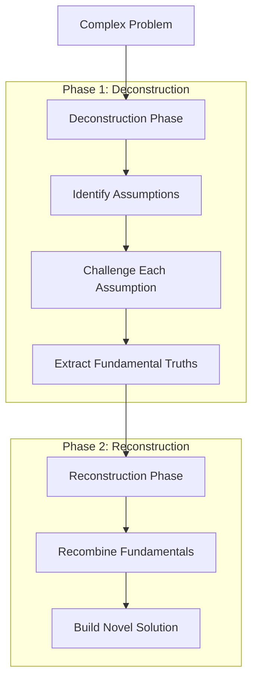
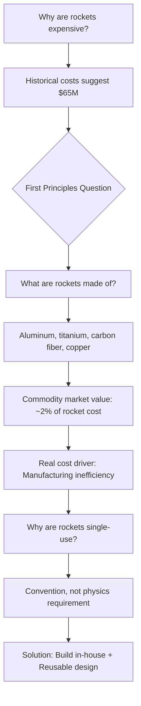
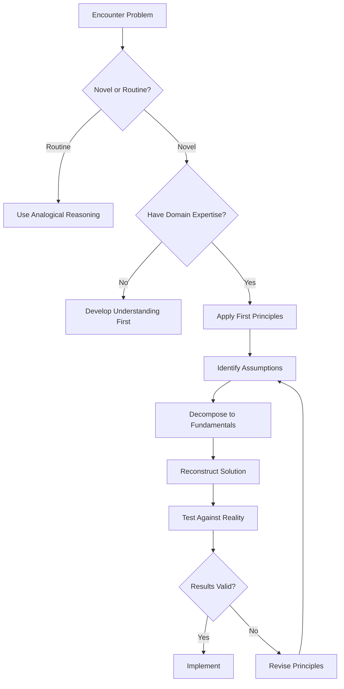

# First Principles Thinking - Research

**Date**: 2025-12-03
**Status**: Research Complete

## Table of Contents

- [Executive Summary](#executive-summary)
- [Technical Deep Dive](#technical-deep-dive)
- [Famous Practitioners](#famous-practitioners)
- [Methodology](#methodology)
- [First Principles vs Analogical Reasoning](#first-principles-vs-analogical-reasoning)
- [Practical Examples and Case Studies](#practical-examples-and-case-studies)
- [Limitations and Criticisms](#limitations-and-criticisms)
- [Applications by Domain](#applications-by-domain)
- [Recommendations](#recommendations)
- [Sources](#sources)

## Executive Summary

First principles thinking is a problem-solving methodology that involves breaking down complex problems into their most fundamental, self-evident truths and then reasoning upward from those foundations to construct solutions. Originating from Aristotle's philosophy over 2,000 years ago, it has been championed by modern innovators like Elon Musk and Charlie Munger as a powerful tool for breakthrough innovation. While more cognitively demanding than reasoning by analogy, first principles thinking enables truly novel solutions by escaping the constraints of conventional assumptions.

## Technical Deep Dive

### Overview

First principles thinking (also called "reasoning from first principles") is a method of inquiry that strips away assumptions and conventional wisdom to identify the foundational elements of any problem. Rather than accepting existing solutions or making incremental improvements, first principles thinkers ask: "What do we know to be fundamentally true, and how can we build from there?"

### Historical Origins: Aristotle and the Concept of Arche

The concept traces back to ancient Greek philosophy, specifically to Aristotle (384-322 BCE). In Greek philosophy, a first principle is called an **arche** (sometimes transcribed as arkhé), meaning "beginning," "origin," or "source of action" [1].

Aristotle articulated the importance of first principles in both his *Metaphysics* and *Physics*:

> "In every systematic inquiry (methodos) where there are first principles, or causes, or elements, knowledge and science result from acquiring knowledge of these." [2]

For Aristotle, first principles possess several essential characteristics:

- **Self-evident**: They are so fundamental that attempting to prove them would be circular
- **Clear and simple**: They do not require derivation from other truths
- **Univocal**: They have one clear meaning
- **Foundational**: All other knowledge builds upon them

The most famous example Aristotle gives is the **Law of Non-Contradiction**, which he calls "the most certain of all principles" in *Metaphysics* Book IV. This principle states that "the same thing cannot at the same time both belong and not belong to the same thing and in the same respect" [3].

### Pre-Socratic Foundations

Before Aristotle formalized the concept, the Pre-Socratic philosophers sought to explain all of nature (physis) in terms of unifying archai:

- **Thales** believed everything was composed of water
- **Anaximander** proposed apeiron (the boundless/infinite)
- **Anaximenes** argued for air as the fundamental substance

These early attempts represent humanity's first systematic efforts to reason from foundational principles [1].

### How First Principles Thinking Works

The methodology involves a two-phase process:

**Phase 1 - Deconstruction**: Breaking down the problem into its most basic, irreducible elements by systematically questioning every assumption until you reach foundational truths that cannot be reduced further.

**Phase 2 - Reconstruction**: Reassembling these fundamental elements in new ways to create solutions unconstrained by conventional thinking.

## Famous Practitioners

### Elon Musk

Musk encountered first principles thinking during his applied physics PhD studies at Stanford (which he later abandoned to pursue business). He describes it as approaching problems "from a physics framework" [4].

> "Physics teaches you to reason from first principles rather than by analogy. So I said, okay, let's look at the first principles. What are the material constituents of the batteries? What is the spot market value of the material constituents?" [5]

Musk has applied this approach to:
- SpaceX (reusable rockets)
- Tesla (battery cost reduction)
- The Boring Company (tunnel construction)
- Neuralink (brain-computer interfaces)

### Charlie Munger

Warren Buffett's longtime partner at Berkshire Hathaway built what he calls a "latticework of mental models" using first principles thinking [6]. Munger emphasizes:

> "The first rule is that you can't really know anything if you just remember isolated facts and try and bang 'em back. If the facts don't hang together on a latticework of theory, you don't have them in a usable form." [7]

Key principles from Munger's approach:
- **Inversion**: Instead of asking how to succeed, ask what would cause failure and avoid it
- **Multi-disciplinary thinking**: Draw first principles from psychology, mathematics, physics, biology, and other fields
- **Compound interest**: Understanding exponential growth as a fundamental principle

### Richard Feynman

The Nobel Prize-winning physicist embodied first principles thinking through his famous approach to learning and problem-solving. His first principle was: "You must not fool yourself, and you are the easiest person to fool" [8].

Feynman's approach:
- Solve problems entirely from scratch rather than relying on expert consensus
- Break problems down to fundamental truths that can be proven
- Question all assumptions and data

The **Feynman Technique** for learning is a practical application: explain concepts as if teaching a child, identify gaps in your understanding, then return to source material [9].

### Johannes Gutenberg

The inventor of the movable-type printing press (c. 1440) exemplifies first principles thinking through technological recombination:

- Deconstructed printing into fundamental components: movable type, paper, ink, and pressing mechanism
- Applied knowledge from goldsmithing (metal alloys for durable type)
- Combined the screw press (used for wine-making) with printing technology
- Result: 3,600 pages per day vs. 40 by hand-printing [10]

## Methodology

### The Socratic Questioning Method

A six-step process derived from Socrates' dialectical approach [11]:

1. **Clarify your thinking**: "Why do I think this? What exactly do I think?"
2. **Challenge assumptions**: "How do I know this is true? What if I thought the opposite?"
3. **Seek evidence**: "How can I back this up? What are the sources?"
4. **Explore alternative perspectives**: "What might others think? How do I know I am correct?"
5. **Examine consequences and implications**: "What if I am wrong? What are the consequences?"
6. **Question the original question**: "Why did I think that? Was I correct? What conclusions can I draw?"

### The Five Whys Technique

A simpler recursive method for reaching first principles [12]:

**Example - Understanding a Business Problem:**

1. **Why** is the product failing? → Customers aren't buying it
2. **Why** aren't customers buying? → It's too expensive compared to alternatives
3. **Why** is it too expensive? → Manufacturing costs are high
4. **Why** are manufacturing costs high? → We're using premium materials and outsourcing production
5. **Why** are we using premium materials? → *This assumption reveals an opportunity to reconsider material choices*

### Elon Musk's Three-Step Framework

1. **Identify and define current assumptions**: List what you believe about the problem
2. **Break down the problem into fundamental principles**: Ask "What are we absolutely sure is true?"
3. **Create new solutions from scratch**: Build upward from verified fundamentals [4]

### The Chef vs. Cook Analogy

Tim Urban's framework distinguishes two types of thinkers [13]:

| The Cook (Analogical) | The Chef (First Principles) |
|----------------------|----------------------------|
| Follows existing recipes | Invents new recipes |
| Works from what's been done | Works from raw ingredients |
| Optimizes within constraints | Questions the constraints |
| Incremental improvement | Potential for breakthrough |
| Lower risk, lower reward | Higher risk, higher reward |

## First Principles vs Analogical Reasoning

### Fundamental Differences

**Analogical Reasoning** (reasoning by analogy):
- Copies or adapts existing solutions
- Faster and less cognitively demanding
- Builds on accumulated wisdom
- Limited by precedent
- Example: "Company X did Y, so we should do something similar"

**First Principles Reasoning**:
- Builds solutions from fundamental truths
- Slower and more cognitively demanding
- Can produce breakthrough innovations
- Unconstrained by precedent
- Example: "What are the fundamental requirements? How can we satisfy them?"

### Cognitive Load Comparison

Analogical reasoning places less strain on working memory because it leverages existing knowledge structures and patterns. First principles thinking requires:

- Maintaining multiple foundational concepts in working memory
- Actively suppressing familiar patterns
- Generating novel combinations
- Evaluating new constructs against fundamental laws [14]

### When to Use Each Approach

| Situation | Best Approach |
|-----------|--------------|
| Routine decisions | Analogical |
| Time-constrained situations | Analogical |
| Well-understood domains | Analogical |
| Innovation required | First Principles |
| Challenging entrenched assumptions | First Principles |
| Novel problem domains | First Principles |
| High stakes with flawed conventional wisdom | First Principles |

## Practical Examples and Case Studies

### SpaceX: Reusable Rockets

**The Problem**: In 2002, aerospace companies quoted rocket costs at $65 million. Space exploration seemed economically impossible for private enterprise [4].

**Conventional Approach**: Accept that rockets are inherently expensive; seek subsidies or government contracts.

**First Principles Analysis**:

**Results**:
- SpaceX reduced launch costs by approximately 10x
- Achieved 70% gross margins
- 85% of Falcon/Dragon built in-house
- Successfully landed and reused rocket boosters [15]

### Tesla: Battery Costs

**The Problem**: Battery packs cost $600+ per kilowatt-hour, making electric vehicles uncompetitive [5].

**First Principles Analysis**:
- What are batteries made of? Carbon, nickel, aluminum, polymers, steel
- What do these materials cost on commodity markets? ~$80/kWh
- The gap ($600 vs $80) represents manufacturing inefficiency, not material constraints

**Solution**: Vertical integration (Gigafactory), new manufacturing processes, economies of scale.

### CD Baby: Business Fundamentals

**The Problem**: How to grow an online business for independent musicians [11].

**First Principles Analysis**: Derek Sivers reduced business requirements to one principle: "happy customers."

**Result**: Eliminated unnecessary expenses (fancy offices, large staff), focused entirely on customer delight, grew to $4 million in monthly revenue.

### BuzzFeed: Content Distribution

**The Problem**: How to succeed in online media [11].

**First Principles Analysis**: Founder Jonah Peretti identified the fundamental principle of online success: "wide distribution."

**Insight**: Rather than optimizing for search algorithms (conventional wisdom), optimize for human sharing behavior.

**Result**: Pioneered viral content creation using A/B testing to measure and enhance shareability.

### Eli Lilly: Pharmaceutical Design

**The Problem**: Developing better drug delivery mechanisms for injectable medications [16].

**First Principles Approach**: Applied the Hagen-Poiseuille equation (fundamental physics of fluid flow) to needle design.

**Solution**: Developed tapered needles that reduce injection force while maintaining patient comfort, solving a fundamental design trade-off through physics-based analysis.

## Limitations and Criticisms

### When First Principles Thinking Fails

#### 1. Wrong or Incomplete Set of Principles

The most dangerous failure mode occurs when you reason from axioms that are individually true but collectively incomplete. As Cedric Chin argues: "In theory, first principles thinking always leads you to the right answer. In practice, it doesn't" [17].

**Example**: A business analysis may be logically rigorous but miss crucial market factors like government subsidies or regulatory advantages.

#### 2. Time and Energy Costs

First principles thinking is significantly more time-consuming and cognitively demanding than analogical reasoning. It requires:
- Careful analysis and decomposition
- Deep subject matter expertise
- Willingness to challenge conventions
- Mental energy to rebuild from fundamentals [18]

#### 3. Wrong Level of Abstraction

First principles analysis can produce conclusions that are logically correct but operationally useless because they address the problem at the wrong conceptual level [17].

#### 4. Oversimplification

Breaking complex systems into fundamental principles can ignore important emergent properties and system interactions that only exist at higher levels of abstraction [18].

#### 5. Social and Organizational Resistance

First principles conclusions often conflict with:
- Established best practices
- Organizational culture
- Expert consensus
- Career incentives tied to status quo [19]

> "In a community-driven and connected world, where we all act on a deep need of belonging and 'fitting in', we are effectively bound by convention. It's effortful, risky and often truly frightening to go against the grain of cultural norms." [19]

#### 6. Missing Tacit Knowledge

Pattern matching and analogical reasoning encode vast amounts of tacit knowledge accumulated through experience. Pure first principles reasoning can miss important considerations that practitioners "just know" but cannot articulate [17].

### When NOT to Use First Principles Thinking

- **Routine decisions**: The cognitive cost outweighs the benefits
- **Time-critical situations**: Speed matters more than optimization
- **Well-established domains**: Existing solutions are already near-optimal
- **Situations requiring buy-in**: Radical departures may face insurmountable resistance
- **When you lack domain expertise**: First principles require deep understanding to identify correctly

### Best Practice: Integrate Both Approaches

Neither first principles nor analogical reasoning is sufficient alone. Effective thinkers:
1. Use pattern matching for routine decisions
2. Apply first principles when innovation is required
3. Validate first principles conclusions against real-world data
4. Remain skeptical: "This analysis seems plausible. Let's wait and see" [17]

## Applications by Domain

### Science and Engineering

- **Physics**: All physical laws derive from first principles (conservation of energy, thermodynamics)
- **Mathematics**: Building from axioms and definitions
- **Engineering**: Using fundamental equations (Hagen-Poiseuille, Navier-Stokes) to solve novel problems

### Business and Entrepreneurship

- Challenging industry assumptions about costs, processes, and customer needs
- Identifying fundamental value propositions
- Building new business models from customer needs rather than existing models

### Investing (Munger's Approach)

- Understanding business fundamentals: "What core customer need does it serve? How much does it cost to operate versus customer willingness to pay?"
- Avoiding superficial assessments
- Using inversion: "What would cause this investment to fail?" [6]

### Personal Decision Making

- Career choices: What do I fundamentally want? What skills are actually required?
- Financial decisions: What are the true costs and benefits?
- Relationship decisions: What do I truly value?

### Education (Feynman Technique)

1. Choose a concept to learn
2. Explain it as if teaching a child
3. Identify gaps in your explanation
4. Return to source material
5. Simplify and use analogies [9]

## Recommendations

### Should You Use First Principles Thinking?

**Yes, when**:
- You're facing a genuinely novel problem
- Conventional solutions have failed
- You suspect hidden assumptions are limiting options
- The stakes justify the cognitive investment
- You have sufficient domain expertise to identify true fundamentals

**No, when**:
- Speed is essential
- The problem is routine and well-understood
- Existing solutions are adequate
- You lack the domain knowledge to identify first principles correctly

### How to Develop First Principles Thinking

1. **Practice Socratic questioning** on everyday assumptions
2. **Study multiple disciplines** to build a latticework of mental models
3. **Read primary sources** rather than summaries
4. **Seek out fundamental equations and laws** in your domain
5. **Challenge "best practices"** by asking "Why is this the best?"
6. **Use the Five Whys** to dig beneath surface explanations
7. **Accept uncertainty**: First principles conclusions are hypotheses, not certainties

### Practical Framework for Application

### Key Takeaways

1. **First principles thinking is a tool, not a universal solution**. Use it strategically for innovation and challenging flawed assumptions.

2. **The method is ancient but powerful**. Aristotle's framework remains relevant because it addresses how knowledge is structured.

3. **Combine with pattern matching**. The best thinkers use both approaches appropriately.

4. **Beware overconfidence**. Logically valid first principles reasoning can still produce wrong answers if premises are incomplete.

5. **Expect resistance**. First principles conclusions often conflict with convention, requiring careful communication and validation.

## Sources

1. [First principle - Wikipedia](https://en.wikipedia.org/wiki/First_principle)
2. [Aristotle's Metaphysics - Stanford Encyclopedia of Philosophy](https://plato.stanford.edu/entries/aristotle-metaphysics/)
3. [Aristotle's Metaphysics (Stanford Encyclopedia)](https://plato.stanford.edu/entries/aristotle-metaphysics/)
4. [First Principles: Elon Musk on the Power of Thinking for Yourself - James Clear](https://jamesclear.com/first-principles)
5. [Elon Musk's "3-Step" First Principles Thinking - Medium](https://medium.com/the-mission/elon-musks-3-step-first-principles-thinking-how-to-think-and-solve-difficult-problems-like-a-ba1e73a9f6c0)
6. [Insights into Charlie Munger's Mental Models for Investing](https://pictureperfectportfolios.com/insights-into-charlie-mungers-mental-models-for-investing/)
7. [How to Think Clearly in Turbulent Times: Lessons from Charlie Munger - BCG Henderson Institute](https://bcghendersoninstitute.com/how-to-think-clearly-in-turbulent-times-lessons-from-charlie-munger/)
8. [Richard Feynman's Principles of Scientific Thinking](https://blog.hptbydts.com/richard-feynmans-principles-of-scientific-thinking)
9. [The Feynman Technique - ModelThinkers](https://modelthinkers.com/mental-model/the-feynman-technique)
10. [Printing press - Wikipedia](https://en.wikipedia.org/wiki/Printing_press)
11. [What is First Principles Thinking? - Farnam Street](https://fs.blog/first-principles/)
12. [First principles - Untools](https://untools.co/first-principles/)
13. [First principles - Lenny's Newsletter](https://www.lennysnewsletter.com/p/first-principles-thinking)
14. [Analogy and Relational Reasoning - UCLA Reasoning Lab](https://reasoninglab.psych.ucla.edu/wp-content/uploads/sites/273/2021/04/Holyoak_2012.pdf)
15. [First Principles Thinking: Elon Musk's Approach to Problem-Solving - InnovatorInd](https://innovatorind.com/first-principles-part-1/)
16. [First Principal Thinking - Case Studies - Brainz Magazine](https://www.brainzmagazine.com/post/first-principal-thinking-case-studies)
17. [How First Principles Thinking Fails - Commoncog](https://commoncog.com/how-first-principles-thinking-fails/)
18. [First Principles Thinking - TechTello](https://www.techtello.com/first-principles-thinking/)
19. [Why "First Principles" thinking is so hard - LinkedIn](https://www.linkedin.com/pulse/why-first-principles-thinking-so-hard-akshat-verma)
20. [First Principles: The Foundations of Innovation](https://www.firstprinciples.ventures/insights/first-principles-the-foundations-of-innovation-and-growth)
