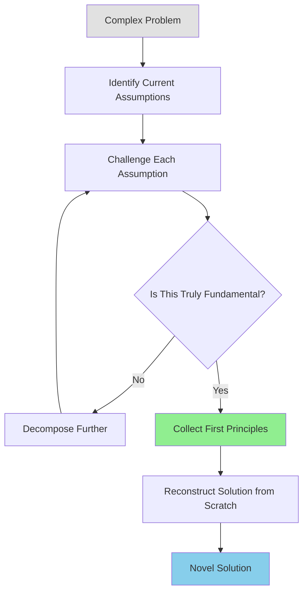
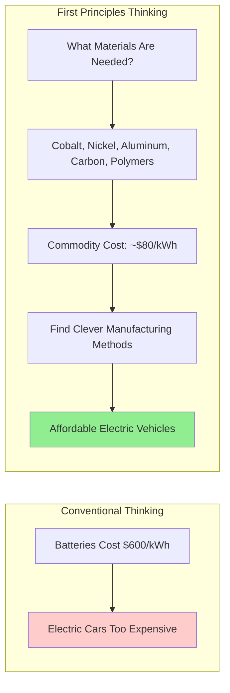
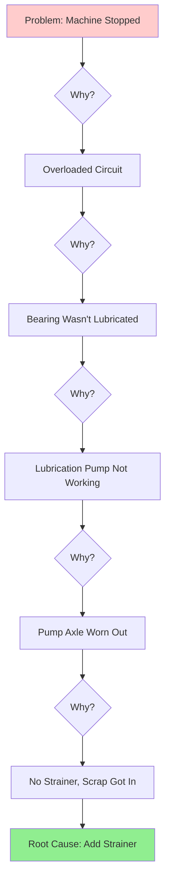
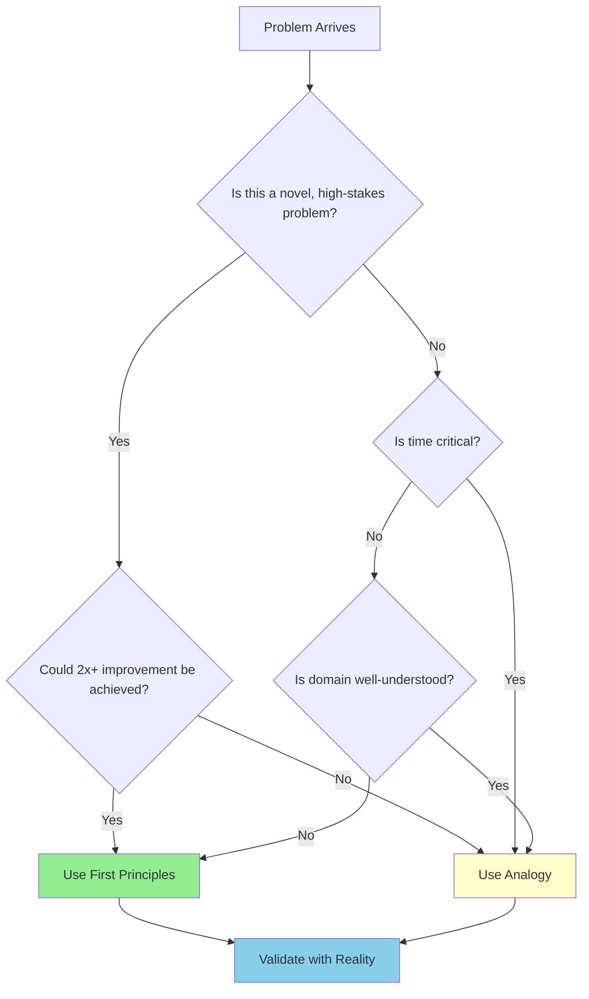

# First Principles Thinking

## Table of Contents

- [Executive Summary](#executive-summary)
- [Technical Deep Dive](#technical-deep-dive)
- [Key Practitioners](#key-practitioners)
- [First Principles vs Reasoning by Analogy](#first-principles-vs-reasoning-by-analogy)
- [Techniques and Frameworks](#techniques-and-frameworks)
- [Applications Across Domains](#applications-across-domains)
- [Limitations and Critiques](#limitations-and-critiques)
- [Skill Development Approach](#skill-development-approach)
- [Recommendations](#recommendations)
- [Additional Notes](#additional-notes)
- [Sources](#sources)

## Executive Summary

First principles thinking is a problem-solving methodology that involves decomposing complex problems into their most fundamental, irreducible truths, then reconstructing solutions from the ground up. Originating with Aristotle over 2,000 years ago and refined by Descartes, this approach has been popularized in modern contexts by Elon Musk, Charlie Munger, and Richard Feynman. While powerful for breakthrough innovation (going "0 to 1"), it is time-consuming and should be balanced with analogical reasoning for everyday decisions.

## Technical Deep Dive

### Definition

A **first principle** is a basic proposition or assumption that cannot be deduced from any other proposition or assumption [1]. Aristotle defined it as "the first basis from which a thing is known" [2].

First principles thinking consists of:

1. Decomposing things down to fundamental axioms
2. Asking which axioms are relevant to the question at hand
3. Cross-referencing conclusions based on chosen axioms
4. Ensuring conclusions don't violate any fundamental laws [3]

> "I think people's thinking process is too bound by convention... You have to build up the reasoning from the ground up." — Elon Musk [4]

### Historical Origins

#### Aristotle (384-322 BCE)

Aristotle was among the first great metaphysicians to articulate the need for first principles. In ancient Greek philosophy, a first principle from which other principles are derived is called an **arche** (Greek: arkhe)—meaning "beginning," "origin," or "source of action" [1].

Key Aristotelian principles:
- First principles should be **clear, simple, self-evident, and univocal**
- The **law of noncontradiction** is "the most certain of all principles"
- One cannot prove a first principle positively because it is so self-evident that denying it would be ludicrous [5]

> "In every systematic inquiry where there are first principles, or causes, or elements, knowledge and science result from acquiring knowledge of these; for we think we know something just in case we acquire knowledge of the primary causes, the primary first principles, all the way to the elements." — Aristotle [6]

#### Rene Descartes (1596-1650)

Descartes developed the **Method of Doubt** in his *Meditations on First Philosophy* (1641). He resolved to systematically doubt all beliefs to build a system consisting only of certainly true beliefs [7].

Key contributions:
- **Cogito ergo sum** ("I think, therefore I am")—the one belief that cannot be doubted
- Fuller formulation: "dubito ergo cogito, cogito ergo sum" (I doubt therefore I think, I think therefore I exist)
- Even an evil demon attempting to deceive him cannot make him doubt his own existence as a thinking thing [8]

> "If I wanted to establish anything in the sciences that was stable and likely to last, I needed—just once in my life—to demolish everything completely and start again from the foundations." — Descartes [7]

### How It Works

The fundamental mechanism involves separating absolute truths from assumptions:

Modern first principles thinking doesn't require absolute universal truths—instead, it identifies elements that are **irreducible within specific contexts** [4].

## Key Practitioners

### Elon Musk

Musk is the most prominent modern advocate of first principles thinking, applying it systematically at SpaceX and Tesla.

#### SpaceX Rockets Example

> "So I said, OK, let's look at the first principles. What is a rocket made of? Aerospace-grade aluminum alloys, plus some titanium, copper, and carbon fiber. And then I asked, what is the value of those materials on the commodity market? It turned out that the materials cost of a rocket was around 2 percent of the typical price—which is a crazy ratio for a large mechanical product." — Elon Musk [9]

**Result**: SpaceX cut the price of launching a rocket by nearly 10x while still making a profit [10].

Musk also questioned why rockets couldn't be reused, leading to the Falcon 9's reusable first stage [11].

#### Tesla Batteries Example

> "Somebody could say, 'battery packs are really expensive and that's just the way they will always be... historically, it has cost $600 per kilowatt hour.' With first principles, you say, 'what are the material constituents of the batteries?' It's got cobalt, nickel, aluminum, carbon, some polymers for separation and a seal can. Break that down on a material basis... It's like $80 per kilowatt hour. So clearly you just need to think of clever ways to take those materials and combine them into the shape of a battery cell and you can have batteries that are much, much cheaper than anyone realizes." — Elon Musk [12]

### Charlie Munger

Munger, Warren Buffett's partner at Berkshire Hathaway, developed the concept of a **"latticework of mental models"**—an interconnected framework drawing from multiple disciplines [13].

> "You've got to have models in your head. And you've got to array your experience—both vicarious and direct—on this latticework of models." — Charlie Munger [14]

Key principles:
- Models must come from **multiple disciplines** (psychology, economics, physics, biology, engineering)
- You need a personal working set of 10-20 models, not all 129+ [15]
- Cross-disciplinary thinking turns complexity into clarity
- First principles thinking helps identify which models apply to fundamental elements [14]

> "All the wisdom in the world is not to be found in one little academic department." — Charlie Munger [16]

### Richard Feynman

Nobel Prize-winning physicist Richard Feynman exemplified first principles thinking through his determination not to fool himself and his practice of working things out from scratch [17].

> "Since then I never pay attention to anything by the 'experts.' I calculate everything myself. When people said the quark theory was pretty good, I got two PhDs... to go through the whole works with me, just so I could check that the thing was giving results that fit fairly well." — Richard Feynman [17]

**The Feynman Problem Solving Algorithm** (humorous but insightful):
1. Write down the problem
2. Think very hard
3. Write down the solution [18]

**The Feynman Technique for Learning**:
1. Select a concept to learn
2. Explain it to an imaginary audience or in writing
3. Identify gaps in your understanding
4. Revisit and refine the explanation [19]

This technique is a practical application of first principles—reducing complex ideas to fundamental explanations that you truly understand.

### Peter Thiel

Thiel's book *Zero to One* emphasizes contrarian thinking that stems from first principles.

**The Contrarian Question**:
> "What important truth do very few people agree with you on?" — Peter Thiel [20]

A good answer takes the form: "Most people believe in X, but the truth is the opposite of X."

> "The single most powerful pattern I have noticed is that successful people find value in unexpected places, and they do this by thinking about business from first principles instead of formulas." — Peter Thiel [21]

**Zero to One vs. One to N**:
- **Horizontal progress** (1 to n): Copying things that work
- **Vertical progress** (0 to 1): Doing new things nobody has ever done [20]

> "The most contrarian thing of all is not to oppose the crowd but to think for yourself." — Peter Thiel [22]

### Jeff Bezos

Bezos applies first principles logic to identify how things could be done better. He questioned why cloud infrastructure was sold in long contracts and built AWS to offer it on-demand [23].

**Key Decision Frameworks**:

| Framework | Description |
|-----------|-------------|
| **Type 1 vs Type 2 Decisions** | Irreversible (one-way door) vs. reversible (two-way door) decisions |
| **70% Rule** | Make decisions with ~70% of desired information; waiting for 90% is too slow |
| **Regret Minimization** | Make decisions that minimize future regret at age 80 |
| **Six-Page Memos** | Narrative thinking forces clear logic over persuasive graphics |

> "Day 2 is stasis. Followed by irrelevance. Followed by excruciating, painful decline. Followed by death. And that is why it is always Day 1." — Jeff Bezos [24]

## First Principles vs Reasoning by Analogy

### The Core Distinction

> "I think it's important to reason from first principles rather than by analogy. So the normal way we conduct our lives is, we reason by analogy. We are doing this because it's like something else that was done, or it is like what other people are doing... with slight iterations on a theme. And it's... mentally easier to reason by analogy rather than from first principles." — Elon Musk [25]

### The Chef vs. Cook Analogy

Tim Urban describes the nuance:
- **Chef** (first principles): A trailblazer who invents recipes, knowing raw ingredients and how to combine them
- **Cook** (analogy): Uses existing recipes, working off some version of what's already out there [26]

If the cook loses the recipe, they're lost. The chef understands flavor profiles at such a fundamental level they don't need a recipe [27].

### Comparison Matrix

| Aspect | First Principles | Reasoning by Analogy |
|--------|-----------------|---------------------|
| **Speed** | Slow, intensive | Fast, efficient |
| **Mental Effort** | High—requires unlearning and rebuilding | Low—leverages existing knowledge |
| **Innovation Type** | Breakthrough (0 to 1) | Incremental (1 to n) |
| **Risk** | May miss practical considerations | May perpetuate suboptimal approaches |
| **Best For** | Novel problems, high-stakes decisions | Well-understood domains, routine decisions |
| **Learning Source** | 80% from cross-industry patterns actually comes from analogy [28] | |

### When to Use Each

**Use First Principles When**:
- You need a deeper understanding by breaking things into core elements
- Existing methods don't make sense upon examination
- You're pursuing vertical/intensive progress (0 to 1)
- The potential improvement is significant (2x or more better) [29]

**Use Analogy When**:
- Enhancing an existing process or belief
- Problems have been extensively studied and understood
- Swift decision-making is essential
- Improvements would be incremental anyway [30]

### Using Both Together

> "First principles and analogy are complementary tools in the design process. First principle thinking improves your ability to analyze the challenge, while analogical thinking improves your ability to synthesize new ideas." [28]

The balanced approach:
1. Use first principles to **analyze** and understand the problem
2. Use analogy to **synthesize** and generate solution ideas
3. Return to first principles to **validate** the proposed solution

## Techniques and Frameworks

### Elon Musk's 3-Step Framework

**Step 1: Identify and Define Current Assumptions**
> "If I had an hour to solve a problem, I'd spend 55 minutes thinking about the problem and 5 minutes thinking about solutions." — Albert Einstein (often quoted in this context) [31]

Write down all beliefs you have about the problem.

**Step 2: Break Down to Fundamentals**
Ask: What is this made of? What are the irreducible components?

Example (rocket): Aerospace-grade aluminum, titanium, copper, carbon fiber. What is the market value of these materials?

**Step 3: Rebuild from the Ground Up**
Using only undeniable truths, construct a new solution. You're no longer iterating on old designs—you're creating something new from source [31].

### The Five Whys

Developed by **Sakichi Toyoda** in the 1930s at Toyota, this technique explores cause-and-effect relationships by asking "why?" repeatedly [32].

**Key Principles**:
1. Accurate and complete statement of the problem
2. Complete honesty in answering
3. Determination to get to the bottom and resolve [33]
4. **Never identify a person as the root cause**—"human error" is not an acceptable answer [34]

**Limitations**: Teruyuki Minoura (former Toyota managing director) criticized it as too basic for highly complex problems with interwoven causes [35].

### Socratic Questioning

Named after Socrates, this method uses disciplined questioning to examine ideas and determine their validity [36].

**Six Types of Socratic Questions**:

| Type | Purpose | Example Questions |
|------|---------|-------------------|
| **Clarification** | Understand thinking origins | "Why do I think this? What exactly do I think?" |
| **Challenging Assumptions** | Test foundations | "How do I know this is true? What if I thought the opposite?" |
| **Evidence** | Seek support | "How can I back this up? What are the sources?" |
| **Alternative Perspectives** | Consider other viewpoints | "What might others think? How do I know I am correct?" |
| **Implications** | Examine consequences | "What if I am wrong? What are the consequences?" |
| **Meta-Questions** | Question the questions | "Why did I think that? What conclusions can I draw?" |

> "The disciplined practice of thoughtful questioning enables the scholar/student to examine ideas and be able to determine the validity of those ideas." — Plato [37]

### The 5-Step Detailed Process

1. **List Assumptions**: Write down all beliefs about the problem
2. **Question Assumptions**: Challenge each to see if it's necessary; remove what isn't
3. **Identify Fundamental Truths**: What do you know for sure—undeniable facts?
4. **Rebuild the Problem**: Using only these truths, reconstruct the task
5. **Innovate**: Think creatively from this new perspective [38]

### Form vs. Function Analysis

A major obstacle to first principles thinking is optimizing **form** (appearance) rather than **function** (purpose) [4].

Example: People ask "Where are flying cars?" while overlooking that airplanes fulfill the transportation function they seek. The attachment is to the *form* (car-shaped flying vehicle), not the *function* (fast aerial transportation) [4].

**Practice**:
1. Identify your functional goal
2. Abandon allegiance to previous forms
3. Reconstruct solutions from fundamental components

## Applications Across Domains

### Engineering and Technology

**SpaceX (Aerospace)**
- Raw material cost analysis revealed 2% material-to-price ratio
- Questioned single-use rocket paradigm
- Result: 10x cost reduction, reusable Falcon 9 [9]

**Tesla (Automotive/Energy)**
- Battery cost analysis from $600/kWh to $80/kWh materials
- Vertical integration via Gigafactories
- Result: Viable electric vehicle market [12]

**Gutenberg's Printing Press (Historical)**
Combined wine-making screw press + movable type + paper + ink—merging unrelated technologies for revolutionary results [39].

**Rolling Suitcase (1970)**
For thousands of years, people carried bags and used wheeled vehicles separately. Bernard Sadow combined these concepts by adding wheels to luggage [39].

### Business Strategy

**Amazon/AWS**
Bezos questioned why cloud infrastructure required long contracts. First principles analysis led to on-demand cloud computing [23].

**BuzzFeed**
Jonah Peretti recognized that online success depends on **distribution**, not just quality content. This fundamental insight shaped their entire strategy around social sharing metrics [4].

**CD Baby**
Derek Sivers reduced business success to its essence: happy customers. This focus eliminated unnecessary expenditures while achieving significant growth [4].

### Science and Research

**Physics (Feynman)**
- Never accept expert claims without verification
- Calculate everything personally
- Work from fundamental laws, not received wisdom [17]

**Pharmaceutical (Eli Lilly)**
Uses first principles in drug design and development to predict and explain why specific circumstances produce certain behaviors [40].

### Personal Problem-Solving

Common assumptions to challenge:
- "Growing my business will cost a lot of money"
- "I have to struggle and starve to become a successful artist"
- "I just can't find enough time to workout and reach my weight loss goals" [41]

When beginning to question everything, you realize most advice treats **symptoms, not root causes**. Productivity and career advice often address symptoms. First principles helps you understand yourself and resolve internal conflicts [41].

## Limitations and Critiques

### Time and Effort Cost

> "First-principles thinking, if you take it to an extreme, can be really inefficient, because we learn by emulating other people—[everything] from learning how to walk, learning how to talk, comes from copying others and modeling others." — Lenny Rachitsky [42]

Key drawbacks:
- **Time-consuming and mentally taxing**: Breaking down complex problems requires significant effort
- **Barrier to swift decision-making**: Intensity can impede fast-paced environments
- **Risk of over-analysis**: Becoming so absorbed in dissecting problems that practical solutions are lost [43]

### Failure Modes

**1. Wrong Set of True Principles**
The most pernicious failure occurs when reasoning from "logically coherent propositions from true and right axioms" yet still producing incorrect conclusions. The problem isn't flawed logic but incomplete foundational assumptions [44].

**2. Missing Critical Information**
> "There was a fact that we didn't adequately understand" — Example of analyzing a market without understanding hidden government grant structures [44].

**3. Abstraction Level Mismatches**
Analysis can be technically sound yet address the wrong level of abstraction, producing conclusions disconnected from practical reality [44].

### When NOT to Use

**Incremental Improvements**
> "If making things twice as good isn't impactful, then it's generally not worth the time investment of first principles thinking—and in practice, most problems won't lend themselves to a 2x better solution." [29]

**Well-Understood Problems**
When dealing with extensively studied problems, relying on existing knowledge leads to more efficient solutions [43].

**Pattern Matching Suffices**
Pattern matching is often fast whereas analysis isn't—better suited for quick decisions [45].

### The Truth vs. Usefulness Tension

> "As the complexity of the environments we seek to understand and control grows, the goals of 'truth' and 'usefulness' tend to diverge. Where this occurs, an obsession with truth can lead to research impotence: we are motivated to validate truths that are already widely accepted, our theory becomes too convoluted to be applied or communicated, and we are prone to becoming infatuated with the nobility of our quest—while others outside of our tight circle cease to care about our activities." [46]

### Practical Lesson

> "Ok, this analysis checks out. It seems plausible. *Let's wait and see.*" — Rather than assuming logical coherence guarantees correctness, outcomes should be validated against reality through effective action [44].

## Skill Development Approach

### Building the Habit

**Daily Practice**:
1. Regularly use the three-step process (identify assumptions -> decompose to truths -> rebuild)
2. Use practical exercises like Five Whys or Socratic questioning
3. Build the mental habit of digging past surface-level answers [47]

**Mindset Shifts**:
- Approach problems with a **beginner's mind**
- Question what people "know" to be true
- Go directly to the source rather than accepting intermediaries [41]

### Developing Mental Models

Following Munger's approach:
1. Build a **personal latticework** of 10-20 key mental models
2. Draw from multiple disciplines (physics, psychology, economics, biology)
3. Learn models deeply enough to use automatically, not just recite [14]

### Overcoming Common Obstacles

**Limiting Beliefs to Challenge**:
- Memory capacity is fixed
- Information overload is unavoidable
- All good ideas are exhausted
- First-mover advantage is essential
- Unprecedented approaches are impossible [4]

**The Competitive Advantage**:
Lies in willingness to challenge status quo—something most people avoid due to mental effort required [4].

### Balancing Approaches

The skill isn't just first principles OR analogy—it's knowing when to use each:

## Recommendations

### Should This Skill Be Developed?

**Yes, with intentional balance**

### Rationale

First principles thinking is a **meta-skill** that enhances problem-solving across all domains. However, it must be balanced with pattern recognition and analogical reasoning for practical effectiveness.

### Implementation Strategy

**Phase 1: Foundation (Weeks 1-4)**
- Study Aristotle's and Descartes' philosophical foundations
- Practice Socratic questioning daily on small decisions
- Apply Five Whys to one problem per week

**Phase 2: Application (Weeks 5-12)**
- Tackle one significant problem using the 3-step framework monthly
- Build a personal mental models latticework (start with 5-10 models)
- Document assumptions challenged and outcomes

**Phase 3: Integration (Ongoing)**
- Develop judgment for when to use first principles vs. analogy
- Validate conclusions through action, not just logic
- Build cross-disciplinary knowledge base

### Key Success Criteria

1. **Assumption Identification**: Can you list 5+ assumptions about any given problem?
2. **Decomposition Skill**: Can you break complex systems to irreducible components?
3. **Reconstruction Ability**: Can you build novel solutions from first principles?
4. **Judgment Development**: Do you correctly identify when to use each approach?
5. **Reality Validation**: Do you test conclusions through action?

### Potential Challenges

| Challenge | Mitigation |
|-----------|------------|
| Analysis paralysis | Set time limits; validate through action |
| Missing hidden factors | Seek diverse perspectives; expect uncertainty |
| Over-application | Reserve for high-stakes, novel problems |
| Mental fatigue | Build stamina gradually; balance with routine tasks |

## Additional Notes

### Key Quotes Collection

> "As to methods, there may be a million... but principles are few." — Harrington Emerson [4]

> "The application of first principles thinking has no bounds. Wherever and whenever there are problems to be solved, one should always analyze the situation by first breaking down what is already known into fundamental truths." [48]

> "Every great business is built around a secret that's hidden from the outside." — Peter Thiel [49]

### Related Concepts

- **Design Thinking**: Human-centered problem-solving (complementary methodology)
- **Systems Thinking**: Understanding interconnections and feedback loops
- **Critical Thinking**: Evaluating information and arguments logically
- **Scientific Method**: Hypothesis formation, testing, and revision
- **Lean Methodology**: Iterative testing and learning (combines both approaches)

### Further Reading

- *Meditations on First Philosophy* by Rene Descartes
- *Zero to One* by Peter Thiel
- *Poor Charlie's Almanack* by Charlie Munger
- *Surely You're Joking, Mr. Feynman!* by Richard Feynman
- Farnam Street Blog (fs.blog) for ongoing mental models content

## Sources

1. [First principle - Wikipedia](https://en.wikipedia.org/wiki/First_principle)
2. [Aristotle and the Importance of First Principles - Medium](https://medium.com/swlh/aristotle-and-the-importance-of-first-principles-9431aa60a7d1)
3. [First Principles Thinking - CIRIS](https://www.ciris.info/learningcenter/first-principles-thinking/)
4. [What is First Principles Thinking? - Farnam Street](https://fs.blog/first-principles/)
5. [Mere Metaphysics Part One: What is a First Principle? - The Socratic Dictum](https://socraticdictum.com/mere-metaphysics-part-one-what-is-a-first-principle/)
6. [Aristotle and Mathematics - Stanford Encyclopedia of Philosophy](https://plato.stanford.edu/entries/aristotle-mathematics/supplement1.html)
7. [Descartes' Epistemology - Stanford Encyclopedia of Philosophy](https://plato.stanford.edu/entries/descartes-epistemology/)
8. [Cartesian doubt - Wikipedia](https://en.wikipedia.org/wiki/Cartesian_doubt)
9. [First Principles: Elon Musk on the Power of Thinking for Yourself - James Clear](https://jamesclear.com/first-principles)
10. [Elon Musk and First Principles Thinking - Supply Chain Today](https://www.supplychaintoday.com/elon-musk-and-first-principles-thinking/)
11. [Why Elon Musk Swears By First Principles Thinking - The Geeky Leader](https://thegeekyleader.com/2025/04/06/why-elon-musk-swears-by-first-principles-thinking-for-innovation/)
12. [Elon Musk's 3-Step First Principles Thinking - Mission.org](https://medium.com/the-mission/elon-musks-3-step-first-principles-thinking-how-to-think-and-solve-difficult-problems-like-a-ba1e73a9f6c0)
13. [Charlie Munger: Latticework of Mental Models - Hamptons Group](https://hamptonsgroup.com/blog/charlie-munger-latticework-of-mental-models)
14. [Munger's Latticework - ModelThinkers](https://modelthinkers.com/mental-model/mungers-latticework)
15. [Mental Model 4: The Mental Latticework - Medium](https://medium.com/@culturesofpain/mental-model-4-the-mental-latticework-how-top-thinkers-connect-ideas-others-miss-e9690309f192)
16. [Charlie Munger Mental Models - Sources of Insight](https://sourcesofinsight.com/charlie-munger-mental-models/)
17. [What Musk, Bezos, Thiel and Feynman teach us about First Principles - Medium](https://medium.com/@ameet/what-musk-bezos-thiel-and-feynman-teach-us-about-first-principles-261967d3e347)
18. [The Feynman Problem Solving Algorithm - Wiki C2](https://wiki.c2.com/?FeynmanAlgorithm=)
19. [The Feynman Technique: How to Learn Anything Quickly - Todoist](https://www.todoist.com/inspiration/feynman-technique)
20. [Zero to One by Peter Thiel: Summary and Notes](https://grahammann.net/book-notes/zero-to-one-peter-thiel)
21. [Eight Things I Learned from Peter Thiel's Zero To One - Farnam Street](https://fs.blog/peter-thiel-zero-to-one/)
22. [Peter Thiel on Entrepreneurship - Chicago Booth Review](https://www.chicagobooth.edu/review/peter-thiel-on-entrepreneurship-three-contrarian-ideas-for-going-from-zero-to-one)
23. [How Bezos thinks - Leading Sapiens](https://www.leadingsapiens.com/bezos-on-failure-decision-making-life/)
24. [Elements of Amazon's Day 1 Culture - AWS Executive Insights](https://aws.amazon.com/executive-insights/content/how-amazon-defines-and-operationalizes-a-day-1-culture/)
25. [First-Principles Thinking vs Reasoning by Analogy - Ahmad Fahmy](https://www.ahmadfahmy.com/blog/2020/7/10/first-principles-thinking-vs-reasoning-by-analogy)
26. [First Principles Thinking - Maray.ai](https://www.maray.ai/posts/first-principles-thinking)
27. [First Principles Thinking and Analysis - Proof Blog](https://blog.useproof.com/first-principles/)
28. [First Principles and Analogy in Design - Medium](https://medium.com/@ncspost/first-principles-analogy-in-design-486cf097f683)
29. [How First Principles Thinking Fails - Commoncog](https://commoncog.com/how-first-principles-thinking-fails/)
30. [When to reason from first principles - Medium](https://medium.com/@jgreze/when-to-reason-from-first-principles-58fdc48f7f20)
31. [First Principles Thinking: A Framework for Solving Problems - Maray.ai](https://www.maray.ai/posts/first-principles-thinking)
32. [Five whys - Wikipedia](https://en.wikipedia.org/wiki/Five_whys)
33. [What are the Five Whys? A Tool For Root Cause Analysis - Tulip](https://tulip.co/glossary/five-whys/)
34. [The power of 5 Whys: analysis and defense - Atlassian](https://www.atlassian.com/incident-management/postmortem/5-whys)
35. [How Toyota Utilizes the 5 Whys Method - Orcalean](https://www.orcalean.com/article/how-toyota-is-using-5-whys-method)
36. [Socratic questioning - Wikipedia](https://en.wikipedia.org/wiki/Socratic_questioning)
37. [The Socratic Method: Fostering Critical Thinking - Colorado State University](https://tilt.colostate.edu/the-socratic-method/)
38. [Reasoning from First Principles - Decision Mastery](https://www.decision-mastery.com/articles/reasoning-from-first-principles)
39. [First Principles: Elon Musk on Thinking for Yourself - James Clear](https://jamesclear.com/first-principles)
40. [Learn From 4 Powerful First Principles Thinking Examples - Engineer Calcs](https://engineercalcs.com/first-principles-thinking-examples/)
41. [What is First Principle Thinking? - Ari Meisel](https://arimeisel.medium.com/first-principle-thinking-ccb0e81f46cb)
42. [First principles thinking - Lenny Rachitsky](https://www.lennysnewsletter.com/p/first-principles-thinking)
43. [First-principles Thinking In A Nutshell - FourWeekMBA](https://fourweekmba.com/first-principles-thinking/)
44. [How First Principles Thinking Fails - Commoncog](https://commoncog.com/how-first-principles-thinking-fails/)
45. [When to reason from first principles - Medium](https://medium.com/@jgreze/when-to-reason-from-first-principles-58fdc48f7f20)
46. [First Principles Thinking as a Tool for Researchers - ResearchGate](https://www.researchgate.net/publication/341100189_First_Principles_Thinking_as_a_Tool_for_Researchers_to_Overcome_the_Challenge_of_Conceptualization)
47. [First Principles Thinking Explained with Examples - Analytics Yogi](https://vitalflux.com/first-principles-thinking-explained-with-examples/)
48. [First Principles: The Foundations of Innovation](https://www.firstprinciples.ventures/insights/first-principles-the-foundations-of-innovation-and-growth)
49. [Zero to One - Peter Thiel on Contrarian Questions](https://athenarium.com/zero-to-one-peter-thiel-contrarian-questions/)
