---
layout: default
title: The Folder Concept (v5)
---

[← Back to Index](../index.md)

# The Folder Concept

**Date:** 2025-12-15 (updated)
**Status:** Concept Document
**Audience:** Technical & Business Stakeholders

---

## Table of Contents

- [Executive Summary](#executive-summary)
- [Why This Matters](#why-this-matters)
- [Core Concepts](#core-concepts)
  - [Folder Types](#1-folder-types-templates-for-configuration)
    - [Folder-Scoped Types & Inheritance](#folder-scoped-types--inheritance)
  - [Folders](#2-folders-instances-of-folder-types)
  - [Multi-Parent Hierarchy](#3-multi-parent-hierarchy-real-world-flexibility)
  - [Property Schema](#4-property-schema-custom-fields-for-each-type)
- [How It Solves Real Problems](#how-it-solves-real-problems)
  - [Use Case 1: INSPECT — Finding Assignment & Notification](#use-case-1-inspect--finding-assignment--notification)
  - [Use Case 2: IIR — Incident Multi-Group Notification](#use-case-2-iir--incident-multi-group-notification)
  - [Use Case 3: WASTE — Type-Based Routing](#use-case-3-waste--type-based-routing)
  - [Use Case 4: Assessment — Multi-Parent Form Requirements](#use-case-4-assessment--multi-parent-form-requirements)
  - [Use Case 5: Exposure Records — Privacy-Appropriate Distribution](#use-case-5-exposure-records--privacy-appropriate-distribution)
  - [Use Case 6: Collections — Hierarchical Oversight & Aggregate Views](#use-case-6-collections--hierarchical-oversight--aggregate-views)
- [Summary](#summary)
- [Appendix: Terminology Mapping](#appendix-terminology-mapping)

---

## Executive Summary

**Every organizational unit gets a Folder.**

A Folder is not the lab, department, or facility itself. A Folder is the **operational record** that holds everything about that unit—who works there, what forms they fill out, what inspections happen, what inventory they manage.

Think of it like a patient chart in healthcare. The chart isn't the patient—it's the comprehensive record that documents everything about their care. Similarly, the Folder documents everything about a Lab's safety operations.

---

## Why This Matters

### The Problem Today

Our clients use different terminology for their organizational structure:

| Client Type | What They Call It |
|-------------|-------------------|
| Universities | Labs, Departments, Research Groups |
| Hospitals | Nursing Units, Wings, Floors |
| Corporations | Business Units, Teams, Divisions |
| Government | Centers of Excellence, Regions |

Without a universal approach, **each new organizational type requires 6+ months of custom development**—new database schemas, new APIs, new UI components, new permission logic.

### The Solution

Build **one Folder system** that can be configured to represent any organizational concept. When a client says "we need Research Centers," the answer is configuration—not custom development.

---

## Core Concepts

### 1. Folder Types: Templates for Configuration

A **Folder Type** is a template that defines what a folder looks like and what it can do. Configuration administrators create folder types to match their organization's structure.

**Example Folder Types:**
- "Program" — High-level organizational unit (Lab Safety, Radiation Safety)
- "Laboratory" — Research facility with inventory, forms, and members
- "Nursing Unit" — Healthcare unit with cost centers and bed counts
- "Project" — Temporary organizational unit for specific initiatives

Each folder type defines:
- **Label** — What users see ("Laboratory", "Nursing Unit")
- **Custom Fields** — Data specific to this type (license number, cost center, hazard types)
- **Roles** — Who can do what (Principal Investigator, Lab Manager, Observer)

#### Folder-Scoped Types & Inheritance

Folder types are **scoped to a folder** in the hierarchy. This enables powerful inheritance:

- **Global-level types** are available to all tenants and folders
- **Tenant-level types** are available within that tenant's subtree
- **Campus-level types** are available only within that campus

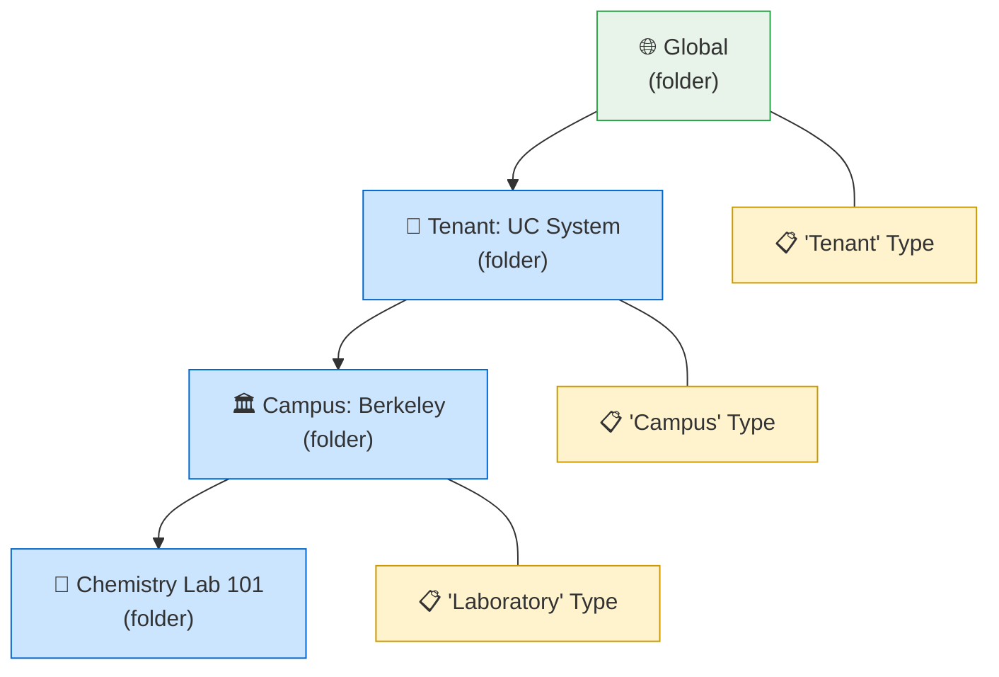
```mermaid
graph TD
    Global["🌐 Global<br/>(folder)"] --> Tenant["🏢 Tenant: UC System<br/>(folder)"]
    Tenant --> Campus["🏛️ Campus: Berkeley<br/>(folder)"]
    Campus --> Lab["📁 Chemistry Lab 101<br/>(folder)"]

    Global --- GlobalType["📋 'Tenant' Type"]
    Tenant --- TenantType["📋 'Campus' Type"]
    Campus --- CampusType["📋 'Laboratory' Type"]

    style Global fill:#e8f4ea,stroke:#28a745
    style Tenant fill:#cce5ff,stroke:#0066cc
    style Campus fill:#cce5ff,stroke:#0066cc
    style Lab fill:#cce5ff,stroke:#0066cc
    style GlobalType fill:#fff3cd,stroke:#cc9900
    style TenantType fill:#fff3cd,stroke:#cc9900
    style CampusType fill:#fff3cd,stroke:#cc9900
```

**Key Behavior: Closest Scope Wins**

When the same folder type key exists at multiple levels, the **closest scope** takes precedence. This enables global standards with local customization.

**Example: College Overrides Campus "Laboratory" Type**

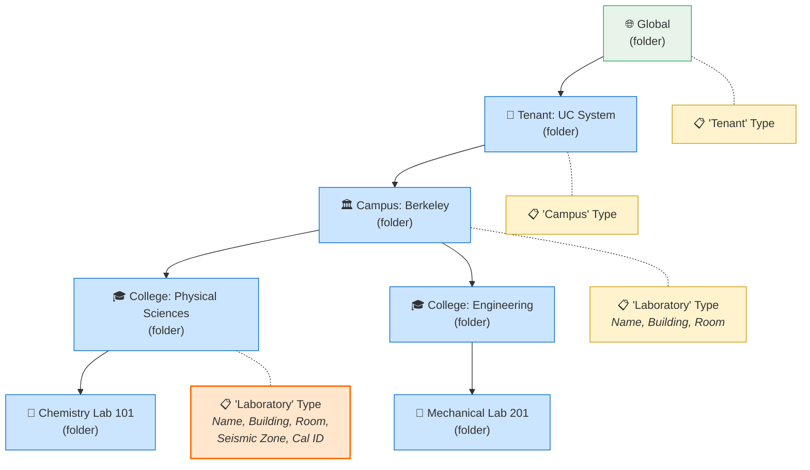
```mermaid
graph TD
    Global["🌐 Global<br/>(folder)"] --> Tenant["🏢 Tenant: UC System<br/>(folder)"]
    Tenant --> Campus["🏛️ Campus: Berkeley<br/>(folder)"]
    Campus --> PhysSci["🎓 College: Physical Sciences<br/>(folder)"]
    Campus --> Engineering["🎓 College: Engineering<br/>(folder)"]
    PhysSci --> ChemLab["📁 Chemistry Lab 101<br/>(folder)"]
    Engineering --> MechLab["📁 Mechanical Lab 201<br/>(folder)"]

    Global -.- TenantType["📋 'Tenant' Type"]
    Tenant -.- CampusType["📋 'Campus' Type"]
    Campus -.- CampusLab["📋 'Laboratory' Type<br/><i>Name, Building, Room</i>"]
    PhysSci -.- PhysSciLab["📋 'Laboratory' Type<br/><i>Name, Building, Room,</i><br/><i>Seismic Zone, Cal ID</i>"]

    style Global fill:#e8f4ea,stroke:#28a745
    style Tenant fill:#cce5ff,stroke:#0066cc
    style Campus fill:#cce5ff,stroke:#0066cc
    style PhysSci fill:#cce5ff,stroke:#0066cc
    style Engineering fill:#cce5ff,stroke:#0066cc
    style ChemLab fill:#cce5ff,stroke:#0066cc
    style MechLab fill:#cce5ff,stroke:#0066cc
    style TenantType fill:#fff3cd,stroke:#cc9900
    style CampusType fill:#fff3cd,stroke:#cc9900
    style CampusLab fill:#fff3cd,stroke:#cc9900
    style PhysSciLab fill:#ffe6cc,stroke:#ff6600,stroke-width:2px
```

**Chemistry Lab 101** (under Physical Sciences):
1. Search: Physical Sciences → Campus → Tenant → Global
2. **Physical Sciences has "Laboratory"** → use it (closest wins)

**Mechanical Lab 201** (under Engineering):
1. Search: Engineering → Campus → Tenant → Global
2. Engineering has no "Laboratory" → continue up
3. **Campus has "Laboratory"** → use it (inherited)

| Creating Lab Under | "Laboratory" Type Used | Fields |
|-------------------|------------------------|--------|
| Physical Sciences | Physical Sciences ✓ (overrides Campus) | Name, Building, Room, Seismic Zone, Cal ID |
| Engineering | Campus ✓ (inherited) | Name, Building, Room |

**Why This Matters:**
- **Complete replacement** — Physical Sciences' type fully replaces Campus's (no field merging)
- **No duplication** — Engineering inherits Campus's type automatically
- **Deterministic** — Closest ancestor always wins
- **Explicit customization** — To add fields, Physical Sciences must redefine all fields they want

**The Win:** Define organization-wide types at global scope, customize them at lower levels when needed—without duplication or conflict.

### 2. Folders: Instances of Folder Types

When a user creates a "Laboratory" folder, they're creating an instance of the Laboratory folder type. That folder then holds:

- **Members** — People with assigned roles
- **Custom Data** — Values for the custom fields defined by the type
- **Documents** — SOPs, protocols, policies
- **Forms** — Assessments, checklists, surveys
- **Inventory** — Equipment and materials
- **Inspections** — Compliance checks and findings

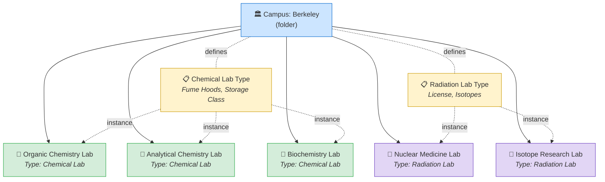
```mermaid
graph TD
    Campus["🏛️ Campus: Berkeley<br/>(folder)"]
    ChemType["📋 Chemical Lab Type<br/><i>Fume Hoods, Storage Class</i>"]
    RadType["📋 Radiation Lab Type<br/><i>License, Isotopes</i>"]

    Chem1["📁 Organic Chemistry Lab<br/><i>Type: Chemical Lab</i>"]
    Chem2["📁 Analytical Chemistry Lab<br/><i>Type: Chemical Lab</i>"]
    Chem3["📁 Biochemistry Lab<br/><i>Type: Chemical Lab</i>"]
    Rad1["📁 Nuclear Medicine Lab<br/><i>Type: Radiation Lab</i>"]
    Rad2["📁 Isotope Research Lab<br/><i>Type: Radiation Lab</i>"]

    Campus -.-|"defines"| ChemType
    Campus -.-|"defines"| RadType

    Campus --> Chem1
    Campus --> Chem2
    Campus --> Chem3
    Campus --> Rad1
    Campus --> Rad2

    ChemType -.->|"instance"| Chem1
    ChemType -.->|"instance"| Chem2
    ChemType -.->|"instance"| Chem3
    RadType -.->|"instance"| Rad1
    RadType -.->|"instance"| Rad2

    style Campus fill:#cce5ff,stroke:#0066cc
    style ChemType fill:#fff3cd,stroke:#cc9900
    style RadType fill:#fff3cd,stroke:#cc9900
    style Chem1 fill:#d4edda,stroke:#28a745
    style Chem2 fill:#d4edda,stroke:#28a745
    style Chem3 fill:#d4edda,stroke:#28a745
    style Rad1 fill:#e2d6f5,stroke:#6f42c1
    style Rad2 fill:#e2d6f5,stroke:#6f42c1
```

**Key Insight:** Folder Types are templates; Folders are instances. One Chemical Lab Type defines the schema for all chemical labs—each instance has its own name, members, and property values.

### 3. Multi-Parent Hierarchy: Real-World Flexibility

**Key Insight:** Organizational units often belong to multiple contexts.

A chemistry lab might need to report to **both** the Lab Safety Program and the Radiation Safety Program. A shared equipment room might serve multiple departments.

Traditional tree structures force a single parent—you have to pick one. The Folder system uses a **multi-parent structure** that mirrors how organizations actually work:

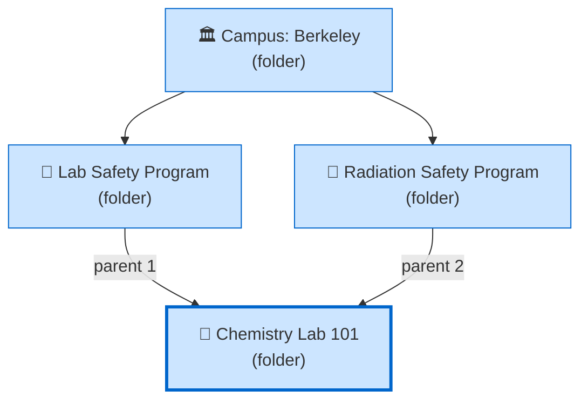
```mermaid
graph TD
    Campus["🏛️ Campus: Berkeley<br/>(folder)"]
    Program1["📁 Lab Safety Program<br/>(folder)"]
    Program2["📁 Radiation Safety Program<br/>(folder)"]
    Lab["📁 Chemistry Lab 101<br/>(folder)"]

    Campus --> Program1
    Campus --> Program2
    Program1 -->|"parent 1"| Lab
    Program2 -->|"parent 2"| Lab

    style Campus fill:#cce5ff,stroke:#0066cc
    style Program1 fill:#cce5ff,stroke:#0066cc
    style Program2 fill:#cce5ff,stroke:#0066cc
    style Lab fill:#cce5ff,stroke:#0066cc,stroke-width:3px
```

**What This Enables:**
- Lab 101 appears in both programs' views
- Both program managers can see the lab's status
- Assessments from both programs show up in the lab's task list
- No data duplication—one folder, multiple organizational contexts

### 4. Property Schema: Custom Fields for Each Type

Different organizational units need to track different data. A Laboratory needs Building, Room, and Hazard Types. A Nursing Unit needs Cost Center and Bed Count. A Pesticide Program needs License Number and Expiration Date.

The **Property Schema** defines what custom fields a folder type has:

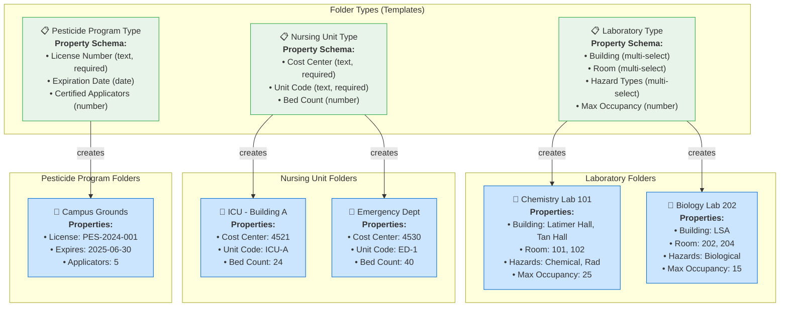
```mermaid
graph TB
    subgraph FolderTypes["Folder Types (Templates)"]
        LabType["📋 Laboratory Type<br/><b>Property Schema:</b><br/>• Building (multi-select)<br/>• Room (multi-select)<br/>• Hazard Types (multi-select)<br/>• Max Occupancy (number)"]
        NursingType["📋 Nursing Unit Type<br/><b>Property Schema:</b><br/>• Cost Center (text, required)<br/>• Unit Code (text, required)<br/>• Bed Count (number)"]
        PesticideType["📋 Pesticide Program Type<br/><b>Property Schema:</b><br/>• License Number (text, required)<br/>• Expiration Date (date)<br/>• Certified Applicators (number)"]
    end

    subgraph LabFolders["Laboratory Folders"]
        Lab1["📁 Chemistry Lab 101<br/><b>Properties:</b><br/>• Building: Latimer Hall, Tan Hall<br/>• Room: 101, 102<br/>• Hazards: Chemical, Rad<br/>• Max Occupancy: 25"]
        Lab2["📁 Biology Lab 202<br/><b>Properties:</b><br/>• Building: LSA<br/>• Room: 202, 204<br/>• Hazards: Biological<br/>• Max Occupancy: 15"]
    end

    subgraph NursingFolders["Nursing Unit Folders"]
        Nursing1["📁 ICU - Building A<br/><b>Properties:</b><br/>• Cost Center: 4521<br/>• Unit Code: ICU-A<br/>• Bed Count: 24"]
        Nursing2["📁 Emergency Dept<br/><b>Properties:</b><br/>• Cost Center: 4530<br/>• Unit Code: ED-1<br/>• Bed Count: 40"]
    end

    subgraph PesticideFolders["Pesticide Program Folders"]
        Pest1["📁 Campus Grounds<br/><b>Properties:</b><br/>• License: PES-2024-001<br/>• Expires: 2025-06-30<br/>• Applicators: 5"]
    end

    LabType -->|"creates"| Lab1
    LabType -->|"creates"| Lab2
    NursingType -->|"creates"| Nursing1
    NursingType -->|"creates"| Nursing2
    PesticideType -->|"creates"| Pest1

    style LabType fill:#e8f4ea,stroke:#28a745
    style NursingType fill:#e8f4ea,stroke:#28a745
    style PesticideType fill:#e8f4ea,stroke:#28a745
    style Lab1 fill:#cce5ff,stroke:#0066cc
    style Lab2 fill:#cce5ff,stroke:#0066cc
    style Nursing1 fill:#cce5ff,stroke:#0066cc
    style Nursing2 fill:#cce5ff,stroke:#0066cc
    style Pest1 fill:#cce5ff,stroke:#0066cc
```

**Key Distinction:**
- **Property Schema** (on Folder Type) — Defines *what* fields exist and their validation rules
- **Properties** (on Folder) — Holds the *actual values* for a specific folder instance

Configuration administrators define the schema once. Every folder of that type then has those fields available, with validation enforced automatically.

---

## How It Solves Real Problems

### Use Case 1: INSPECT — Finding Assignment & Notification

**The Challenge:**
During inspections, findings (like a broken door or expired extinguisher) need to be:
1. **Assigned** to a team that will fix it (e.g., Facilities)
2. **Notified** to people who need awareness (e.g., Lab Manager)

**Folder Structure:**

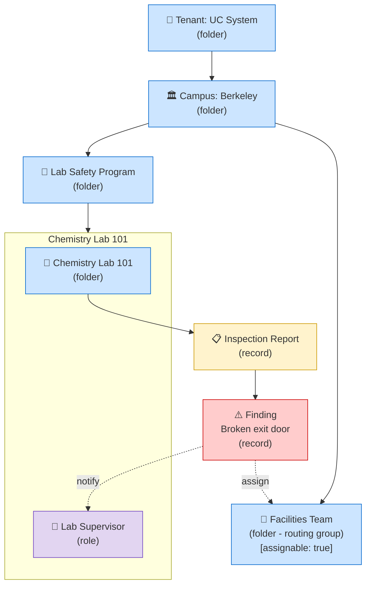
```mermaid
graph TD
    Tenant["🏢 Tenant: UC System<br/>(folder)"]
    Campus["🏛️ Campus: Berkeley<br/>(folder)"]
    CampusRG["📁 Facilities Team<br/>(folder - routing group)<br/>[assignable: true]"]
    Program["📁 Lab Safety Program<br/>(folder)"]

    subgraph LabGroup["Chemistry Lab 101"]
        Lab["📁 Chemistry Lab 101<br/>(folder)"]
        LabRole["👤 Lab Supervisor<br/>(role)"]
    end

    Inspection["📋 Inspection Report<br/>(record)"]
    Finding["⚠️ Finding<br/>Broken exit door<br/>(record)"]

    Tenant --> Campus
    Campus --> CampusRG
    Campus --> Program
    Program --> LabGroup
    Lab --> Inspection
    Inspection --> Finding

    Finding -.->|"notify"| LabRole
    Finding -.->|"assign"| CampusRG

    style Tenant fill:#cce5ff,stroke:#0066cc
    style Campus fill:#cce5ff,stroke:#0066cc
    style CampusRG fill:#cce5ff,stroke:#0066cc
    style Program fill:#cce5ff,stroke:#0066cc
    style Lab fill:#cce5ff,stroke:#0066cc
    style LabRole fill:#e2d5f1,stroke:#6f42c1
    style Inspection fill:#fff3cd,stroke:#cc9900
    style Finding fill:#ffcccc,stroke:#cc0000
```

**Flow:**

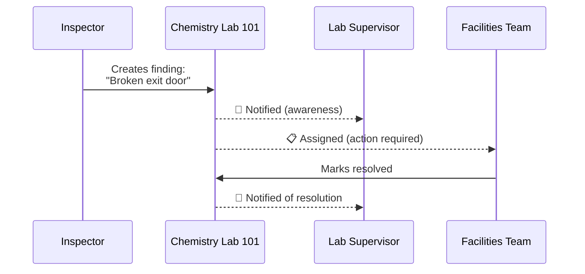
```mermaid
sequenceDiagram
    participant Inspector
    participant Lab as Chemistry Lab 101
    participant LabSup as Lab Supervisor
    participant Facilities as Facilities Team

    Inspector->>Lab: Creates finding:<br/>"Broken exit door"
    Lab-->>LabSup: 🔔 Notified (awareness)
    Lab-->>Facilities: 📋 Assigned (action required)
    Facilities->>Lab: Marks resolved
    Lab-->>LabSup: 🔔 Notified of resolution
```

**The Win:** Define "Facilities Team" once at Campus level. Every lab, every program—all 500 labs—automatically route findings to Facilities without individual configuration.

---

### Use Case 2: IIR — Incident Multi-Group Notification

**The Challenge:**
When an employee is injured (e.g., laser burn), multiple groups need notification based on incident type, severity, and equipment involved.

**Folder Structure:**

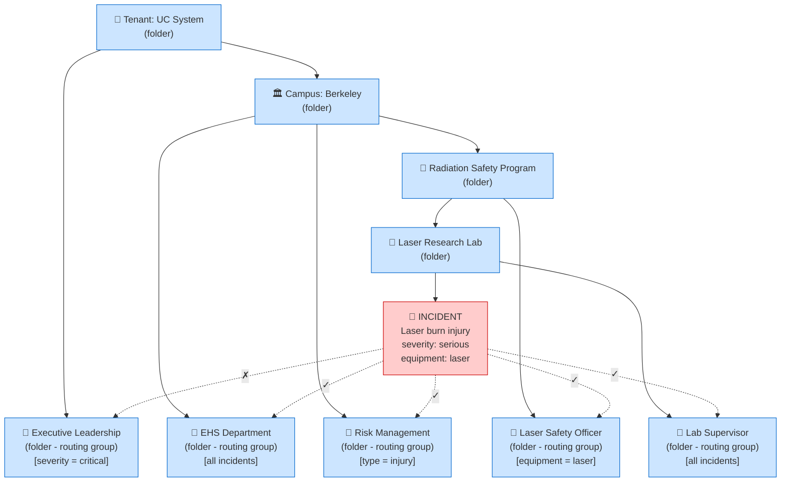
```mermaid
graph TD
    Tenant["🏢 Tenant: UC System<br/>(folder)"]
    TenantRG["📁 Executive Leadership<br/>(folder - routing group)<br/>[severity = critical]"]
    Campus["🏛️ Campus: Berkeley<br/>(folder)"]
    CampusRG1["📁 EHS Department<br/>(folder - routing group)<br/>[all incidents]"]
    CampusRG2["📁 Risk Management<br/>(folder - routing group)<br/>[type = injury]"]
    Program["📁 Radiation Safety Program<br/>(folder)"]
    ProgramRG["📁 Laser Safety Officer<br/>(folder - routing group)<br/>[equipment = laser]"]
    Lab["📁 Laser Research Lab<br/>(folder)"]
    LabRG["📁 Lab Supervisor<br/>(folder - routing group)<br/>[all incidents]"]
    Incident["🚨 INCIDENT<br/>Laser burn injury<br/>severity: serious<br/>equipment: laser"]

    Tenant --> TenantRG
    Tenant --> Campus
    Campus --> CampusRG1
    Campus --> CampusRG2
    Campus --> Program
    Program --> ProgramRG
    Program --> Lab
    Lab --> LabRG
    Lab --> Incident

    Incident -.->|"✓"| LabRG
    Incident -.->|"✓"| ProgramRG
    Incident -.->|"✓"| CampusRG1
    Incident -.->|"✓"| CampusRG2
    Incident -.->|"✗"| TenantRG

    style Tenant fill:#cce5ff,stroke:#0066cc
    style TenantRG fill:#cce5ff,stroke:#0066cc
    style Campus fill:#cce5ff,stroke:#0066cc
    style CampusRG1 fill:#cce5ff,stroke:#0066cc
    style CampusRG2 fill:#cce5ff,stroke:#0066cc
    style Program fill:#cce5ff,stroke:#0066cc
    style ProgramRG fill:#cce5ff,stroke:#0066cc
    style Lab fill:#cce5ff,stroke:#0066cc
    style LabRG fill:#cce5ff,stroke:#0066cc
    style Incident fill:#ffcccc,stroke:#cc0000
```

**Flow:**

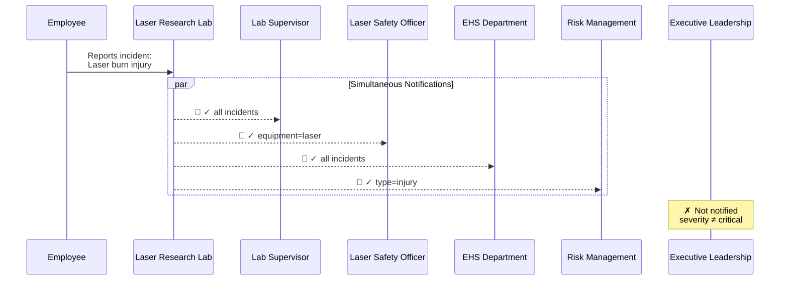
```mermaid
sequenceDiagram
    participant Employee
    participant Lab as Laser Research Lab
    participant LabSup as Lab Supervisor
    participant LSO as Laser Safety Officer
    participant EHS as EHS Department
    participant Risk as Risk Management
    participant Exec as Executive Leadership

    Employee->>Lab: Reports incident:<br/>Laser burn injury

    par Simultaneous Notifications
        Lab-->>LabSup: 🔔 ✓ all incidents
        Lab-->>LSO: 🔔 ✓ equipment=laser
        Lab-->>EHS: 🔔 ✓ all incidents
        Lab-->>Risk: 🔔 ✓ type=injury
    end

    Note over Exec: ✗ Not notified<br/>severity ≠ critical
```

**Extended Pattern: Automatic Investigator Assignment**

Routing groups can do more than notify—they can **assign roles on records**. When an injury occurs in a department, leadership members in the routing group are automatically added as investigators.

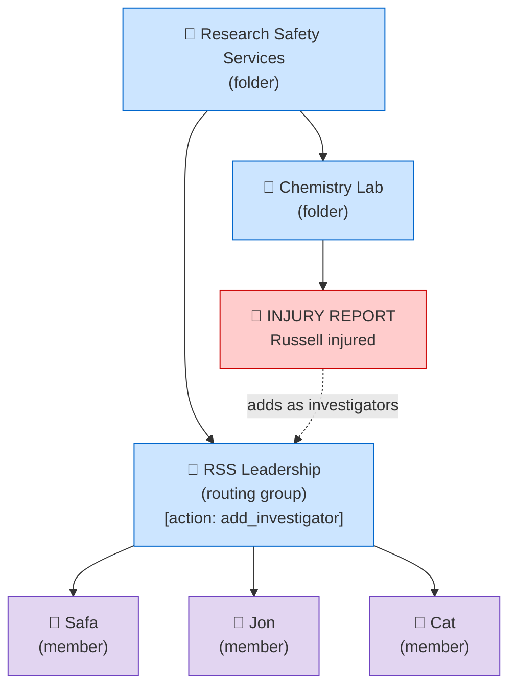
```mermaid
graph TD
    Dept["📁 Research Safety Services<br/>(folder)"]
    RG["📁 RSS Leadership<br/>(routing group)<br/>[action: add_investigator]"]
    Member1["👤 Safa<br/>(member)"]
    Member2["👤 Jon<br/>(member)"]
    Member3["👤 Cat<br/>(member)"]
    Lab["📁 Chemistry Lab<br/>(folder)"]
    Incident["🚨 INJURY REPORT<br/>Russell injured"]

    Dept --> RG
    RG --> Member1
    RG --> Member2
    RG --> Member3
    Dept --> Lab
    Lab --> Incident

    Incident -.->|"adds as investigators"| RG

    style Dept fill:#cce5ff,stroke:#0066cc
    style RG fill:#cce5ff,stroke:#0066cc
    style Lab fill:#cce5ff,stroke:#0066cc
    style Member1 fill:#e2d5f1,stroke:#6f42c1
    style Member2 fill:#e2d5f1,stroke:#6f42c1
    style Member3 fill:#e2d5f1,stroke:#6f42c1
    style Incident fill:#ffcccc,stroke:#cc0000
```

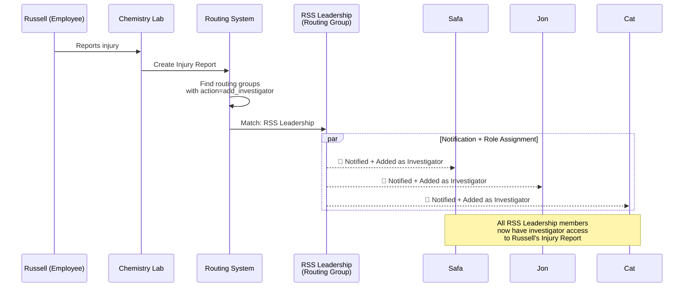
```mermaid
sequenceDiagram
    participant Russell as Russell (Employee)
    participant Lab as Chemistry Lab
    participant System as Routing System
    participant RG as RSS Leadership<br/>(Routing Group)
    participant Safa
    participant Jon
    participant Cat

    Russell->>Lab: Reports injury
    Lab->>System: Create Injury Report
    System->>System: Find routing groups<br/>with action=add_investigator

    System->>RG: Match: RSS Leadership

    par Notification + Role Assignment
        RG-->>Safa: 🔔 Notified + Added as Investigator
        RG-->>Jon: 🔔 Notified + Added as Investigator
        RG-->>Cat: 🔔 Notified + Added as Investigator
    end

    Note over Safa,Cat: All RSS Leadership members<br/>now have investigator access<br/>to Russell's Injury Report
```

**Routing Group Actions:**

| Action | Behavior | Example |
|--------|----------|---------|
| `notify` | Send notification only | Lab Supervisor sees alert |
| `assign` | Assign for resolution | Facilities Team fixes door |
| `add_investigator` | Add as investigator on record | RSS Leadership investigates injury |
| `add_reviewer` | Add as reviewer on record | EHS reviews incident report |

**The Win:** The hierarchy IS the escalation path. Add a new program or lab, and it automatically inherits campus-wide and org-wide notification rules. Routing groups aren't just for notifications—they define **who participates** in records automatically.

---

### Use Case 3: WASTE — Type-Based Routing

**The Challenge:**
Waste pickup requests need to route to different specialized teams based on waste type (chemical, radioactive, biohazard).

**Folder Structure:**

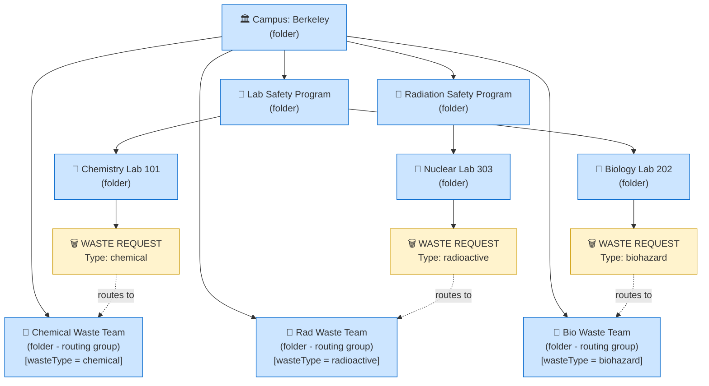
```mermaid
graph TD
    Campus["🏛️ Campus: Berkeley<br/>(folder)"]
    ChemTeam["📁 Chemical Waste Team<br/>(folder - routing group)<br/>[wasteType = chemical]"]
    RadTeam["📁 Rad Waste Team<br/>(folder - routing group)<br/>[wasteType = radioactive]"]
    BioTeam["📁 Bio Waste Team<br/>(folder - routing group)<br/>[wasteType = biohazard]"]
    Program1["📁 Lab Safety Program<br/>(folder)"]
    Program2["📁 Radiation Safety Program<br/>(folder)"]
    Lab1["📁 Chemistry Lab 101<br/>(folder)"]
    Lab2["📁 Biology Lab 202<br/>(folder)"]
    Lab3["📁 Nuclear Lab 303<br/>(folder)"]
    Waste1["🗑️ WASTE REQUEST<br/>Type: chemical"]
    Waste2["🗑️ WASTE REQUEST<br/>Type: biohazard"]
    Waste3["🗑️ WASTE REQUEST<br/>Type: radioactive"]

    Campus --> ChemTeam
    Campus --> RadTeam
    Campus --> BioTeam
    Campus --> Program1
    Campus --> Program2
    Program1 --> Lab1
    Program1 --> Lab2
    Program2 --> Lab3
    Lab1 --> Waste1
    Lab2 --> Waste2
    Lab3 --> Waste3

    Waste1 -.->|"routes to"| ChemTeam
    Waste2 -.->|"routes to"| BioTeam
    Waste3 -.->|"routes to"| RadTeam

    style Campus fill:#cce5ff,stroke:#0066cc
    style ChemTeam fill:#cce5ff,stroke:#0066cc
    style RadTeam fill:#cce5ff,stroke:#0066cc
    style BioTeam fill:#cce5ff,stroke:#0066cc
    style Program1 fill:#cce5ff,stroke:#0066cc
    style Program2 fill:#cce5ff,stroke:#0066cc
    style Lab1 fill:#cce5ff,stroke:#0066cc
    style Lab2 fill:#cce5ff,stroke:#0066cc
    style Lab3 fill:#cce5ff,stroke:#0066cc
    style Waste1 fill:#fff3cd,stroke:#cc9900
    style Waste2 fill:#fff3cd,stroke:#cc9900
    style Waste3 fill:#fff3cd,stroke:#cc9900
```

**Flow:**

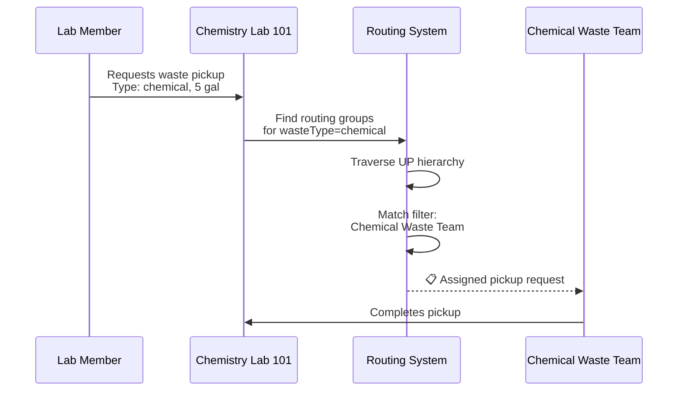
```mermaid
sequenceDiagram
    participant User as Lab Member
    participant Lab as Chemistry Lab 101
    participant System as Routing System
    participant Team as Chemical Waste Team

    User->>Lab: Requests waste pickup<br/>Type: chemical, 5 gal
    Lab->>System: Find routing groups<br/>for wasteType=chemical
    System->>System: Traverse UP hierarchy
    System->>System: Match filter:<br/>Chemical Waste Team
    System-->>Team: 📋 Assigned pickup request
    Team->>Lab: Completes pickup
```

**The Win:** Labs don't configure waste routing—they inherit it from Campus. Add 100 new labs, all automatically route to correct waste teams.

---

### Use Case 4: Assessment — Multi-Parent Form Requirements

**The Challenge:**
A lab works with both chemicals AND radiation. It must complete assessments from BOTH the Lab Safety Program and the Radiation Safety Program. How does the lab see all its required assessments?

**Folder Structure (Multi-Parent):**

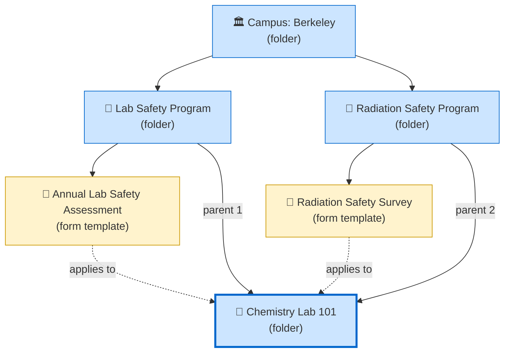
```mermaid
graph TD
    Campus["🏛️ Campus: Berkeley<br/>(folder)"]
    Program1["📁 Lab Safety Program<br/>(folder)"]
    Program2["📁 Radiation Safety Program<br/>(folder)"]
    Form1["📝 Annual Lab Safety Assessment<br/>(form template)"]
    Form2["📝 Radiation Safety Survey<br/>(form template)"]
    Lab["📁 Chemistry Lab 101<br/>(folder)"]

    Campus --> Program1
    Campus --> Program2
    Program1 --> Form1
    Program2 --> Form2
    Program1 -->|"parent 1"| Lab
    Program2 -->|"parent 2"| Lab

    Form1 -.->|"applies to"| Lab
    Form2 -.->|"applies to"| Lab

    style Campus fill:#cce5ff,stroke:#0066cc
    style Program1 fill:#cce5ff,stroke:#0066cc
    style Program2 fill:#cce5ff,stroke:#0066cc
    style Lab fill:#cce5ff,stroke:#0066cc,stroke-width:3px
    style Form1 fill:#fff3cd,stroke:#cc9900
    style Form2 fill:#fff3cd,stroke:#cc9900
```

**Flow:**

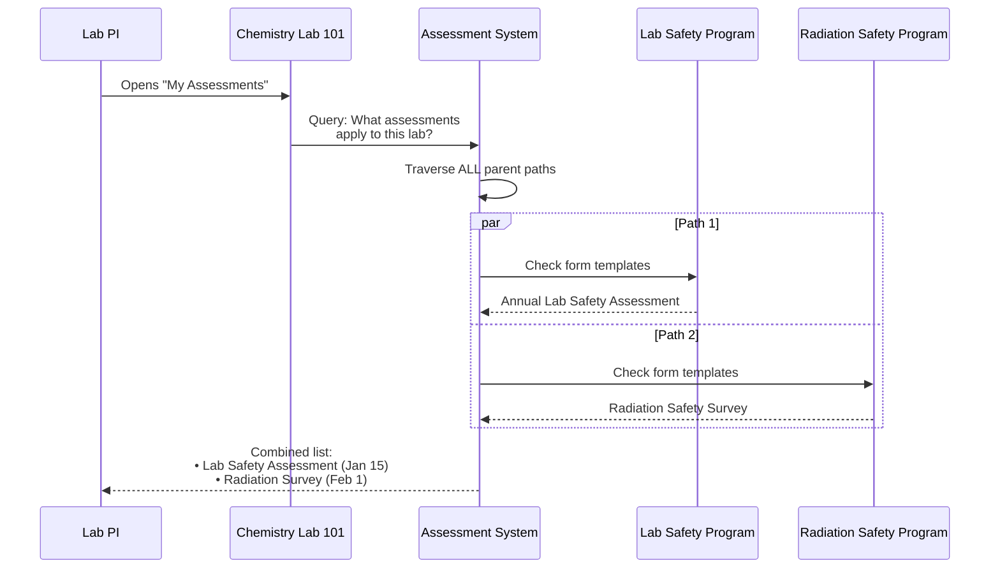
```mermaid
sequenceDiagram
    participant PI as Lab PI
    participant Lab as Chemistry Lab 101
    participant System as Assessment System
    participant LSP as Lab Safety Program
    participant RSP as Radiation Safety Program

    PI->>Lab: Opens "My Assessments"
    Lab->>System: Query: What assessments<br/>apply to this lab?

    System->>System: Traverse ALL parent paths

    par Path 1
        System->>LSP: Check form templates
        LSP-->>System: Annual Lab Safety Assessment
    and Path 2
        System->>RSP: Check form templates
        RSP-->>System: Radiation Safety Survey
    end

    System-->>PI: Combined list:<br/>• Lab Safety Assessment (Jan 15)<br/>• Radiation Survey (Feb 1)
```

**The Win:** No manual tracking of "which labs need which assessments." The multi-parent hierarchy automatically determines requirements. When Lab 101 is added to a third program, its assessments appear automatically.

---

### Use Case 5: Exposure Records — Privacy-Appropriate Distribution

**The Challenge:**
Exposure monitoring records (radiation dosimetry, chemical exposure) need to reach different audiences with different access levels:
- Affected employee sees their own records
- Lab Supervisor sees their lab's records
- Radiation Safety Officer sees radiation exposures only
- Occupational Health sees all exposures campus-wide

**Folder Structure:**

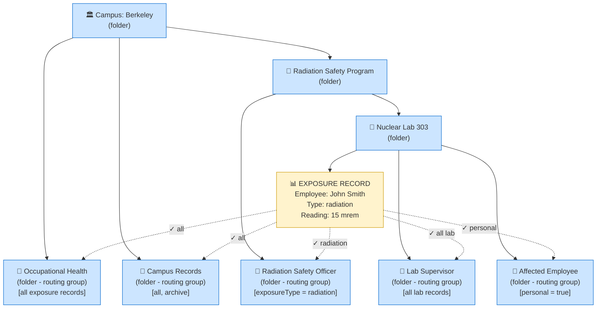
```mermaid
graph TD
    Campus["🏛️ Campus: Berkeley<br/>(folder)"]
    CampusRG1["📁 Occupational Health<br/>(folder - routing group)<br/>[all exposure records]"]
    CampusRG2["📁 Campus Records<br/>(folder - routing group)<br/>[all, archive]"]
    Program["📁 Radiation Safety Program<br/>(folder)"]
    ProgramRG["📁 Radiation Safety Officer<br/>(folder - routing group)<br/>[exposureType = radiation]"]
    Lab["📁 Nuclear Lab 303<br/>(folder)"]
    LabRG1["📁 Lab Supervisor<br/>(folder - routing group)<br/>[all lab records]"]
    LabRG2["📁 Affected Employee<br/>(folder - routing group)<br/>[personal = true]"]
    Record["📊 EXPOSURE RECORD<br/>Employee: John Smith<br/>Type: radiation<br/>Reading: 15 mrem"]

    Campus --> CampusRG1
    Campus --> CampusRG2
    Campus --> Program
    Program --> ProgramRG
    Program --> Lab
    Lab --> LabRG1
    Lab --> LabRG2
    Lab --> Record

    Record -.->|"✓ personal"| LabRG2
    Record -.->|"✓ all lab"| LabRG1
    Record -.->|"✓ radiation"| ProgramRG
    Record -.->|"✓ all"| CampusRG1
    Record -.->|"✓ all"| CampusRG2

    style Campus fill:#cce5ff,stroke:#0066cc
    style CampusRG1 fill:#cce5ff,stroke:#0066cc
    style CampusRG2 fill:#cce5ff,stroke:#0066cc
    style Program fill:#cce5ff,stroke:#0066cc
    style ProgramRG fill:#cce5ff,stroke:#0066cc
    style Lab fill:#cce5ff,stroke:#0066cc
    style LabRG1 fill:#cce5ff,stroke:#0066cc
    style LabRG2 fill:#cce5ff,stroke:#0066cc
    style Record fill:#fff3cd,stroke:#cc9900
```

**Flow:**

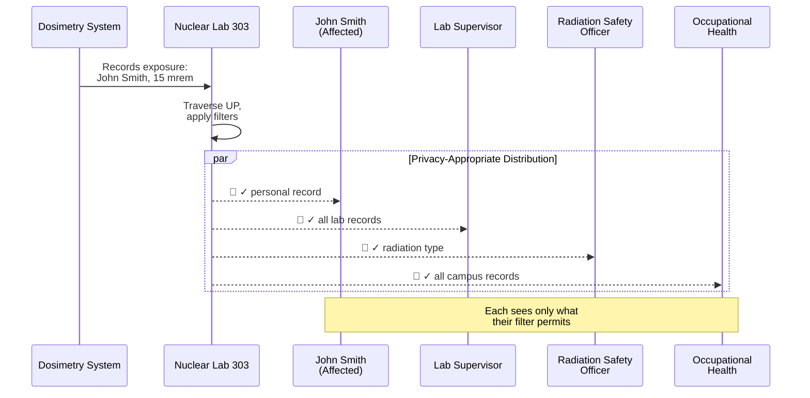
```mermaid
sequenceDiagram
    participant System as Dosimetry System
    participant Lab as Nuclear Lab 303
    participant John as John Smith<br/>(Affected)
    participant Sup as Lab Supervisor
    participant RSO as Radiation Safety<br/>Officer
    participant OH as Occupational<br/>Health

    System->>Lab: Records exposure:<br/>John Smith, 15 mrem

    Lab->>Lab: Traverse UP,<br/>apply filters

    par Privacy-Appropriate Distribution
        Lab-->>John: 🔔 ✓ personal record
        Lab-->>Sup: 🔔 ✓ all lab records
        Lab-->>RSO: 🔔 ✓ radiation type
        Lab-->>OH: 🔔 ✓ all campus records
    end

    Note over John,OH: Each sees only what<br/>their filter permits
```

**The Win:** Privacy rules are encoded in the hierarchy. The Lab Supervisor can't see records from other labs. The Radiation Safety Officer only sees radiation exposures. No complex access control rules to maintain—the structure enforces the policy.

---

### Use Case 6: Collections — Hierarchical Oversight & Aggregate Views

**The Challenge:**
People at different organizational levels need visibility into all folders they oversee—without manually navigating each one. A Department Safety Coordinator needs to see LHAT completion across 5 PIs. A Vice Chancellor needs compliance status across multiple departments. A Nursing Director needs training records across multiple units.

**Folder Structure:**

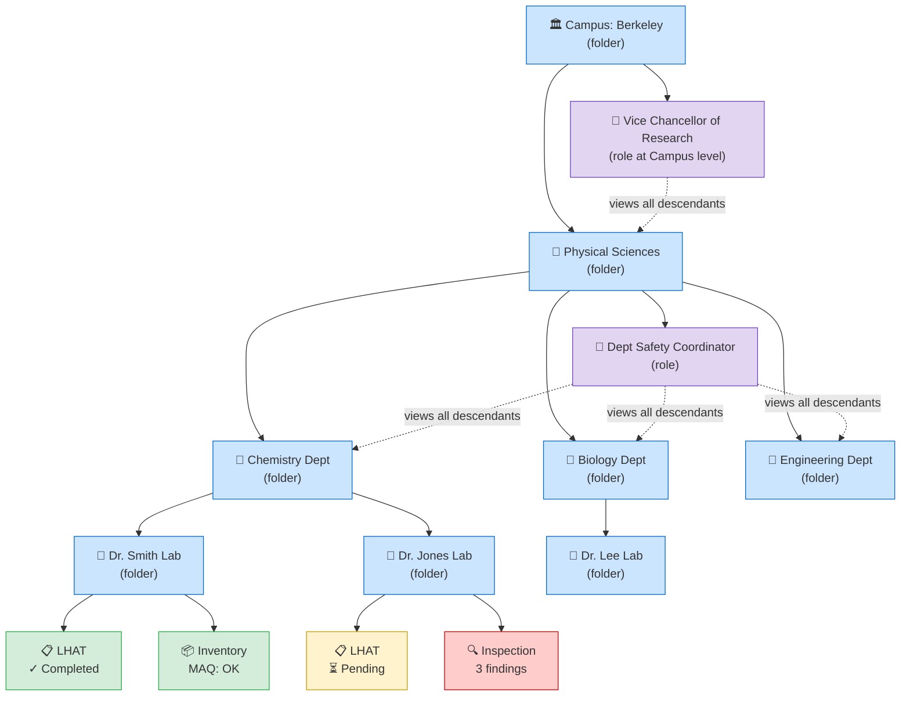
```mermaid
graph TD
    Campus["🏛️ Campus: Berkeley<br/>(folder)"]
    VCR["👤 Vice Chancellor of Research<br/>(role at Campus level)"]
    CollegeFolder["📁 Physical Sciences<br/>(folder)"]
    DSC["👤 Dept Safety Coordinator<br/>(role)"]
    Chem["📁 Chemistry Dept<br/>(folder)"]
    Bio["📁 Biology Dept<br/>(folder)"]
    Eng["📁 Engineering Dept<br/>(folder)"]
    Lab1["📁 Dr. Smith Lab<br/>(folder)"]
    Lab2["📁 Dr. Jones Lab<br/>(folder)"]
    Lab3["📁 Dr. Lee Lab<br/>(folder)"]
    LHAT1["📋 LHAT<br/>✓ Completed"]
    Inv1["📦 Inventory<br/>MAQ: OK"]
    LHAT2["📋 LHAT<br/>⏳ Pending"]
    Insp1["🔍 Inspection<br/>3 findings"]

    Campus --> VCR
    Campus --> CollegeFolder
    CollegeFolder --> DSC
    CollegeFolder --> Chem
    CollegeFolder --> Bio
    CollegeFolder --> Eng
    Chem --> Lab1
    Chem --> Lab2
    Bio --> Lab3
    Lab1 --> LHAT1
    Lab1 --> Inv1
    Lab2 --> LHAT2
    Lab2 --> Insp1

    VCR -.->|"views all descendants"| CollegeFolder
    DSC -.->|"views all descendants"| Chem
    DSC -.->|"views all descendants"| Bio
    DSC -.->|"views all descendants"| Eng

    style Campus fill:#cce5ff,stroke:#0066cc
    style CollegeFolder fill:#cce5ff,stroke:#0066cc
    style Chem fill:#cce5ff,stroke:#0066cc
    style Bio fill:#cce5ff,stroke:#0066cc
    style Eng fill:#cce5ff,stroke:#0066cc
    style Lab1 fill:#cce5ff,stroke:#0066cc
    style Lab2 fill:#cce5ff,stroke:#0066cc
    style Lab3 fill:#cce5ff,stroke:#0066cc
    style VCR fill:#e2d5f1,stroke:#6f42c1
    style DSC fill:#e2d5f1,stroke:#6f42c1
    style LHAT1 fill:#d4edda,stroke:#28a745
    style LHAT2 fill:#fff3cd,stroke:#cc9900
    style Inv1 fill:#d4edda,stroke:#28a745
    style Insp1 fill:#ffcccc,stroke:#cc0000
```

**Flow:**

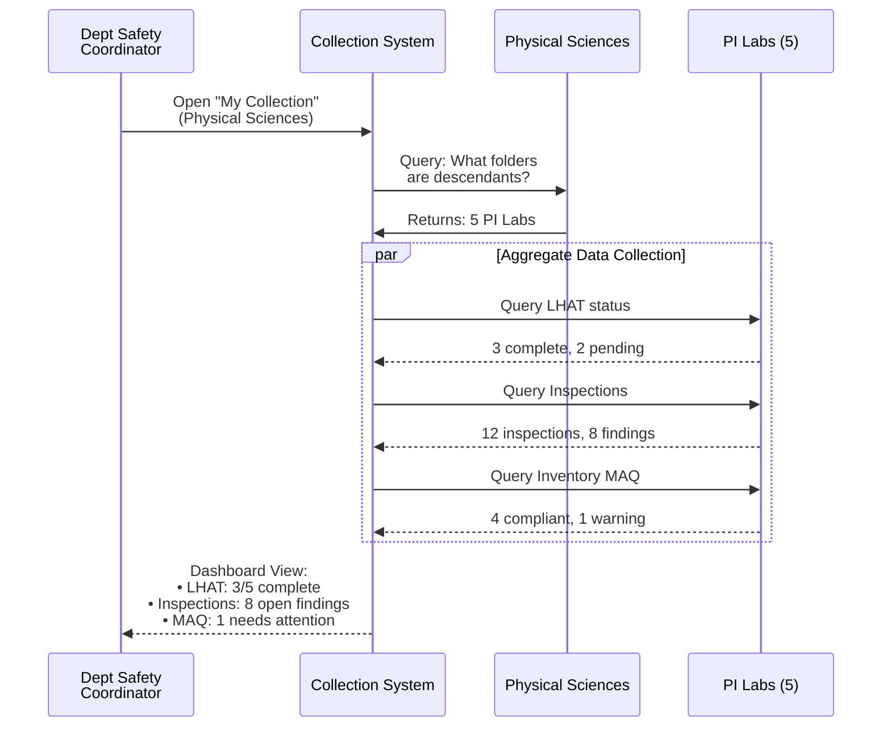
```mermaid
sequenceDiagram
    participant DSC as Dept Safety<br/>Coordinator
    participant System as Collection System
    participant College as Physical Sciences
    participant Labs as PI Labs (5)

    DSC->>System: Open "My Collection"<br/>(Physical Sciences)
    System->>College: Query: What folders<br/>are descendants?
    College->>System: Returns: 5 PI Labs

    par Aggregate Data Collection
        System->>Labs: Query LHAT status
        Labs-->>System: 3 complete, 2 pending
        System->>Labs: Query Inspections
        Labs-->>System: 12 inspections, 8 findings
        System->>Labs: Query Inventory MAQ
        Labs-->>System: 4 compliant, 1 warning
    end

    System-->>DSC: Dashboard View:<br/>• LHAT: 3/5 complete<br/>• Inspections: 8 open findings<br/>• MAQ: 1 needs attention
```

**Healthcare Variant (Kaiser Permanente):**

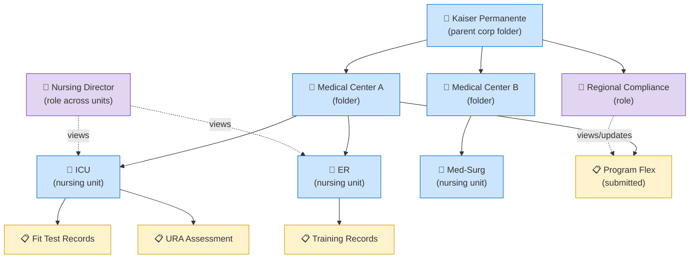
```mermaid
graph TD
    Corp["🏢 Kaiser Permanente<br/>(parent corp folder)"]
    CorpRole["👤 Regional Compliance<br/>(role)"]

    Facility1["🏥 Medical Center A<br/>(folder)"]
    Facility2["🏥 Medical Center B<br/>(folder)"]

    NurseDir["👤 Nursing Director<br/>(role across units)"]

    Unit1["📁 ICU<br/>(nursing unit)"]
    Unit2["📁 ER<br/>(nursing unit)"]
    Unit3["📁 Med-Surg<br/>(nursing unit)"]

    ProgramFlex1["📋 Program Flex<br/>(submitted)"]
    FitTest["📋 Fit Test Records"]
    URA["📋 URA Assessment"]
    Training["📋 Training Records"]

    Corp --> CorpRole
    Corp --> Facility1
    Corp --> Facility2
    Facility1 --> Unit1
    Facility1 --> Unit2
    Facility2 --> Unit3

    Unit1 --> FitTest
    Unit1 --> URA
    Unit2 --> Training
    Facility1 --> ProgramFlex1

    NurseDir -.->|"views"| Unit1
    NurseDir -.->|"views"| Unit2
    CorpRole -.->|"views/updates"| ProgramFlex1

    style Corp fill:#cce5ff,stroke:#0066cc
    style Facility1 fill:#cce5ff,stroke:#0066cc
    style Facility2 fill:#cce5ff,stroke:#0066cc
    style Unit1 fill:#cce5ff,stroke:#0066cc
    style Unit2 fill:#cce5ff,stroke:#0066cc
    style Unit3 fill:#cce5ff,stroke:#0066cc
    style CorpRole fill:#e2d5f1,stroke:#6f42c1
    style NurseDir fill:#e2d5f1,stroke:#6f42c1
    style ProgramFlex1 fill:#fff3cd,stroke:#cc9900
    style FitTest fill:#fff3cd,stroke:#cc9900
    style URA fill:#fff3cd,stroke:#cc9900
    style Training fill:#fff3cd,stroke:#cc9900
```

**What Collections Enable:**

| Role | Scope | Can View |
|------|-------|----------|
| Dept Safety Coordinator | Physical Sciences College | LHAT status, inspections, inventory across all 5 PIs |
| Vice Chancellor of Research | Campus-wide | Compliance dashboards for Biology, Chemistry, Engineering |
| Nursing Director | Multiple nursing units | Training records, Fit Tests, URAs, inspections |
| Regional Compliance | Parent corporation | Program Flexes from all Kaiser facilities |

**The Win:** A user's role placement in the hierarchy automatically determines their "collection"—all descendant folders they can view. No manual configuration of which labs a coordinator can see. Add a new PI to the department, and the coordinator's dashboard automatically includes it.

---

## Summary

The Folder is a **universal container** for organizational units. Instead of building separate systems for Labs, Departments, Programs, and Nursing Units, we build one configurable system that adapts to any structure.

**Four key innovations make this work:**

1. **Multi-Parent Hierarchy** — Organizational units can belong to multiple contexts, reflecting how organizations actually work

2. **Property Schema** — Configuration administrators define custom fields per folder type, no coding required

3. **Folder-Scoped Types with Inheritance** — Folder types can be defined at any level (global, tenant, campus) and are automatically available to all descendants. Closest scope wins when keys overlap, enabling global standards with local customization

4. **Hierarchy-Based Routing** — Notifications and assignments flow through the organizational structure, with inheritance that scales automatically

The result: **Configuration replaces custom development.** New organizational types, new data fields, new routing rules—all achievable without engineering cycles.

---

## Appendix: Terminology Mapping

The system uses internal terms that map to client-facing language:

| Internal Term | What Users See | Example |
|---------------|----------------|---------|
| Folder | (client's term) | "Laboratory", "Nursing Unit" |
| Folder Type | (client's term) + "Type" | "Laboratory Type" |
| Property Schema | "Custom Fields" | "Lab Custom Fields" |
| Parent | "Reports To" / "Under" | "Under Lab Safety Program" |
| Routing Group | "Notification Group" | "Lab Supervisor Group" |
| Scope Folder | "Defined At" | "Defined at Global / Tenant / Campus" |
| Available Types | "Available Templates" | "Templates you can use here" |

Users never see the word "Folder"—they see their organization's terminology.

### Scope Inheritance in Practice

When a user creates a new folder, the system determines which folder types are available:

1. **Walk up ancestors** — From the parent folder up to global
2. **Collect all types** — Types defined at each ancestor scope
3. **Deduplicate by key** — If same key exists at multiple levels, closest wins
4. **Present options** — User sees all available types for this location

This happens automatically—users just see a list of types they can create.
