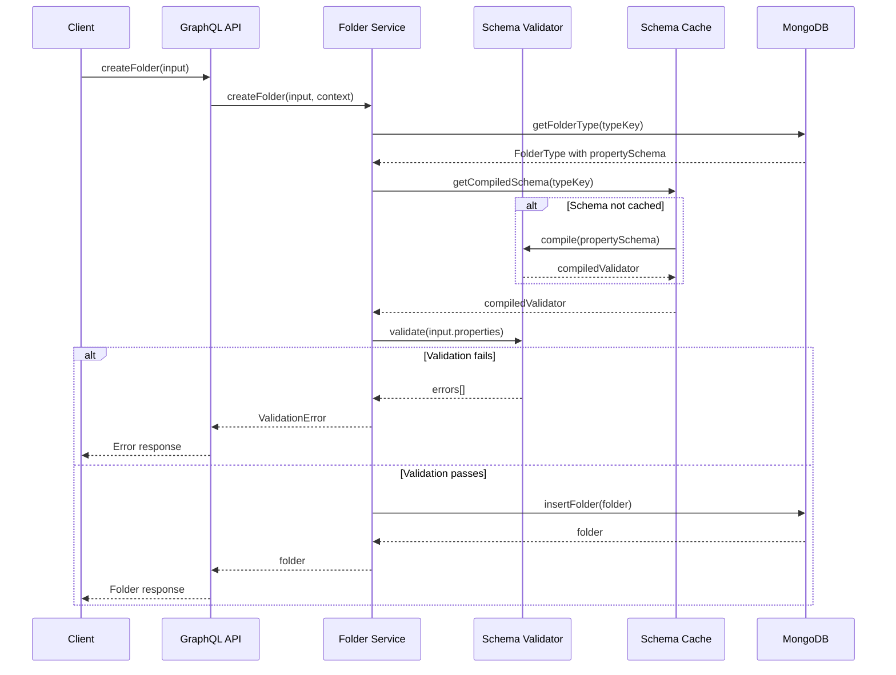
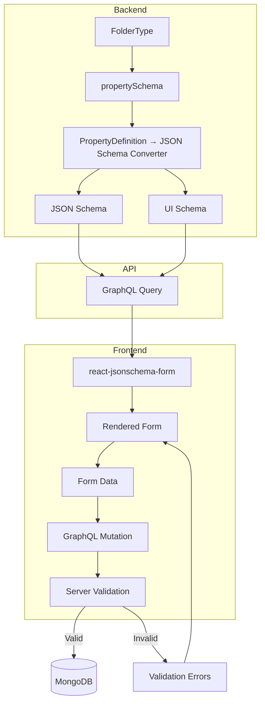

[← Back to Index](../index.md)

# JSON Schema Dynamic Forms - Research

**Date**: 2025-12-08
**Status**: Research Complete → Implementation In Progress (Server-side Complete)

## Table of Contents

- [Executive Summary](#executive-summary)
- [Technical Deep Dive](#technical-deep-dive)
- [Technology Stack / Ecosystem](#technology-stack--ecosystem)
- [Codebase Analysis](#codebase-analysis)
- [Implementation Feasibility](#implementation-feasibility)
- [Implementation Options](#implementation-options)
- [Comparison Matrix](#comparison-matrix)
- [Implementation Approach](#implementation-approach)
- [Concrete Implementation Guide](#concrete-implementation-guide)
- [Alternatives Considered](#alternatives-considered)
- [Debates & Open Questions](#debates--open-questions)
- [Recommendations](#recommendations)
- [Additional Notes](#additional-notes)
- [Live Demos & Real-World Examples](#live-demos--real-world-examples)
- [Sources](#sources)

## Executive Summary

JSON Schema provides an excellent foundation for implementing dynamic forms in the folder management system.

**Recommended Approach (Greenfield):** Store JSON Schema directly in `FolderType.propertySchema`, validate with **Ajv**, render forms with **RJSF + shadcn**, and build a **custom schema builder UI** (shadcn + dnd-kit) that outputs JSON Schema while hiding its complexity from business users.

This approach:
- Uses JSON Schema as the **single source of truth** (no conversion layers)
- Leverages **industry-standard tooling** (Ajv, RJSF)
- Gives **full control over UX** (custom builder, custom form widgets)
- Keeps **Zod for static schemas** (GraphQL inputs), uses **Ajv for dynamic user-defined schemas**

## Technical Deep Dive

### Overview

JSON Schema is a vocabulary for annotating and validating JSON documents. It provides a standardized way to describe data structures, constraints, and validation rules that can be used across different layers of an application (database, API, frontend forms).

### Core Concepts

#### JSON Schema Structure

A JSON Schema defines:
- **Type constraints**: `string`, `number`, `boolean`, `object`, `array`, `null`
- **Validation rules**: `minLength`, `maxLength`, `pattern`, `minimum`, `maximum`, `enum`
- **Structural constraints**: `required`, `properties`, `additionalProperties`
- **Composition**: `oneOf`, `anyOf`, `allOf` for complex types

```json
{
  "$schema": "http://json-schema.org/draft-07/schema#",
  "type": "object",
  "properties": {
    "name": { "type": "string", "minLength": 1, "maxLength": 200 },
    "status": { "type": "string", "enum": ["active", "pending", "closed"] },
    "priority": { "type": "number", "minimum": 1, "maximum": 5 },
    "dueDate": { "type": "string", "format": "date" },
    "tags": {
      "type": "array",
      "items": { "type": "string" },
      "uniqueItems": true
    }
  },
  "required": ["name", "status"]
}
```

#### UI Schema (for Form Rendering)

UI Schema is a secondary schema that controls presentation without modifying the data schema:

```json
{
  "name": { "ui:autofocus": true, "ui:placeholder": "Enter folder name" },
  "status": { "ui:widget": "select" },
  "priority": { "ui:widget": "range" },
  "dueDate": { "ui:widget": "date" },
  "tags": { "ui:options": { "orderable": false } }
}
```

### PropertyDefinition to JSON Schema Mapping

The existing `PropertyDefinition` type maps directly to JSON Schema:

```typescript
// Current PropertyDefinition
type PropertyDefinition = {
  key: string;       // -> property name
  label: string;     // -> title
  type: PropertyType; // -> type + format
  required: boolean; // -> required array
  options?: string[]; // -> enum
  defaultValue?: string; // -> default
};

// PropertyType enum mapping
enum PropertyType {
  TEXT     // -> { "type": "string" }
  NUMBER   // -> { "type": "number" }
  DATE     // -> { "type": "string", "format": "date" }
  SELECT   // -> { "type": "string", "enum": [...] }
  MULTISELECT // -> { "type": "array", "items": { "enum": [...] } }
  BOOLEAN  // -> { "type": "boolean" }
}
```

### How Validation Works



### Form Generation Flow



## Technology Stack / Ecosystem

### Server-Side Validation

| Library | Purpose | Version |
|---------|---------|---------|
| **Ajv** | JSON Schema validation (draft-07, 2019-09, 2020-12) | ^8.x |
| **@dmitryrechkin/json-schema-to-zod** | Runtime JSON Schema to Zod conversion | ^1.x |
| **zod-to-json-schema** | Zod to JSON Schema (if needed) | ^3.x |

### Client-Side Form Generation

| Library | Purpose | Weekly Downloads |
|---------|---------|------------------|
| **@rjsf/core** | Core form generation from JSON Schema | ~460k |
| **@rjsf/shadcn** | Shadcn UI theme for RJSF | New |
| **@rjsf/validator-ajv8** | Ajv8 validator for RJSF | ~460k |

### Schema Building (No-Code)

| Library | Purpose | License |
|---------|---------|---------|
| **react-json-schema-form-builder** | Visual drag-drop schema builder | MIT |
| **SurveyJS Form Builder** | Enterprise-grade visual builder | MIT (core) |
| **Form.io** | Full-stack form platform | MIT (renderers) |

## Codebase Analysis

### Current Schema Structure

**GraphQL Schema** (`src/graphql/folder.schema.graphql:112-120`):
```graphql
type PropertyDefinition @shareable {
  key: String!
  label: String!
  type: PropertyType!
  required: Boolean!
  options: [String!]
  defaultValue: String
}

enum PropertyType {
  TEXT
  NUMBER
  DATE
  SELECT
  MULTISELECT
  BOOLEAN
}
```

**Folder Entity** (`src/graphql/folder.schema.graphql:154-167`):
```graphql
type Folder @key(fields: "id") {
  # ...
  properties: JSON  # Stored as flexible JSON
  # ...
}
```

### Key Patterns & Conventions

#### Validation Pattern
- GraphQL schema uses `@constraint` directives for input validation
- Zod schemas generated from GraphQL via codegen
- Feature schemas extend generated schemas with transformations

#### Data Storage Pattern
- `FolderType.propertySchema: [PropertyDefinition!]!` - Schema definition (configuration)
- `Folder.properties: JSON` - Runtime values (instance data)
- JSON column approach already in use (vs. EAV pattern)

### Architecture Layers

```
Presentation Layer:
├── GraphQL Resolvers (src/graphql/resolvers.ts)
└── Input Validation via Zod

Business Logic:
├── folder.service.ts - Business rules + auth
├── folder-type.service.ts - Type management
└── [NEW] property-validator.service.ts - Dynamic validation

Data Layer:
├── folder.repository.ts - MongoDB operations
├── folder-type.repository.ts - Type storage
└── [NEW] schema-cache.ts - Compiled schema cache
```

### Critical Files to Review

1. `src/features/folder-type/folder-type.schema.ts:36-40` - PropertyDefinition schema export
2. `src/features/folder/folder.service.ts` - Where property validation should be added
3. `src/graphql/folder.schema.graphql:239` - `CreateFolderInput.properties: JSON`

## Implementation Feasibility

### Benefits

- **Type Safety**: JSON Schema provides runtime validation that complements TypeScript static typing
- **Ecosystem Maturity**: Ajv is the fastest JSON Schema validator with 50%+ performance lead over alternatives
- **Form Generation**: Direct schema-to-form mapping eliminates manual form building
- **Schema Reuse**: Same schema validates on server and generates forms on client
- **Business User Empowerment**: Visual builders abstract JSON Schema complexity

### Trade-offs & Challenges

- **Dual Schema Maintenance**: PropertyDefinition and JSON Schema require synchronization
- **MongoDB Limitation**: MongoDB JSON Schema validation (draft-04) doesn't support conditional `if/then/else`
- **Schema Evolution**: Changing property schemas affects existing folder data
- **Performance Overhead**: Schema compilation has cost (mitigated by caching)
- **Learning Curve**: Team needs familiarity with JSON Schema vocabulary

### When to Use

- Configurable entity types with user-defined fields
- Multi-tenant systems where each tenant customizes data structure
- Forms that change frequently without code deployment
- Systems requiring identical validation on client and server

### When to Avoid

- Simple fixed-schema forms (use static Zod schemas)
- High-frequency validation in hot paths (compilation cost)
- Deeply nested conditional validation logic

## Implementation Options

### Option 1: Ajv with PropertyDefinition Converter

**Description**: Build a converter that transforms `PropertyDefinition[]` to JSON Schema, validate with Ajv, compile and cache schemas per FolderType.

**Pros**:
- Minimal schema changes to existing codebase
- Ajv is fastest validator (50%+ faster than alternatives)
- Built-in Fastify integration
- Supports async validation via hooks

**Cons**:
- Custom converter code to maintain
- Two representations of same concept (PropertyDefinition + JSON Schema)

**Complexity**: Medium

**Time Estimate**: 3-4 days

**Reuses Patterns**: Yes - extends existing PropertyDefinition

**When to Use**:
- Want to keep existing GraphQL schema unchanged
- Need maximum validation performance

**Example Implementation**:
```typescript
// src/lib/validation/property-to-json-schema.ts
import type { PropertyDefinition, PropertyType } from "../features/folder-type/folder-type.schema.js";

const typeMapping: Record<PropertyType, object> = {
  TEXT: { type: "string" },
  NUMBER: { type: "number" },
  DATE: { type: "string", format: "date" },
  SELECT: { type: "string" }, // enum added dynamically
  MULTISELECT: { type: "array", items: { type: "string" } },
  BOOLEAN: { type: "boolean" },
};

export function propertyDefinitionsToJsonSchema(
  definitions: PropertyDefinition[]
): object {
  const properties: Record<string, object> = {};
  const required: string[] = [];

  for (const def of definitions) {
    let schema: Record<string, unknown> = {
      ...typeMapping[def.type],
      title: def.label,
    };

    if (def.options?.length) {
      if (def.type === "MULTISELECT") {
        schema.items = { type: "string", enum: def.options };
      } else {
        schema.enum = def.options;
      }
    }

    if (def.defaultValue !== undefined) {
      schema.default = def.defaultValue;
    }

    properties[def.key] = schema;

    if (def.required) {
      required.push(def.key);
    }
  }

  return {
    $schema: "http://json-schema.org/draft-07/schema#",
    type: "object",
    properties,
    required,
    additionalProperties: false,
  };
}
```

### Option 2: Store JSON Schema Directly in FolderType

**Description**: Replace `propertySchema: [PropertyDefinition!]!` with `propertySchema: JSON` containing full JSON Schema.

**Pros**:
- No conversion layer needed
- Full JSON Schema expressiveness (conditionals, patterns, etc.)
- Direct compatibility with all JSON Schema tooling

**Cons**:
- Breaking change to GraphQL schema
- Business users need schema builder UI
- Harder to validate the schema itself
- Migration effort for existing data

**Complexity**: High

**Time Estimate**: 1-2 weeks

**Reuses Patterns**: No - requires schema redesign

**When to Use**:
- Need advanced JSON Schema features (conditionals, cross-field validation)
- Building a general-purpose form builder platform

### Option 3: Hybrid with Zod Runtime Generation

**Description**: Use `@dmitryrechkin/json-schema-to-zod` to convert JSON Schema to Zod at runtime, leveraging existing Zod infrastructure.

**Pros**:
- Consistent validation library (all Zod)
- Better TypeScript integration
- Familiar API for team

**Cons**:
- Additional conversion step (PropertyDef → JSON Schema → Zod)
- Runtime Zod generation is newer/less tested
- Some JSON Schema features may not map perfectly

**Complexity**: Medium

**Time Estimate**: 4-5 days

**Reuses Patterns**: Partial - uses Zod but adds conversion layer

**When to Use**:
- Team strongly prefers Zod over Ajv
- Need Zod's refinements for complex business rules

**Example**:
```typescript
import { JSONSchemaToZod } from "@dmitryrechkin/json-schema-to-zod";
import { propertyDefinitionsToJsonSchema } from "./property-to-json-schema.js";

export function createPropertyValidator(definitions: PropertyDefinition[]) {
  const jsonSchema = propertyDefinitionsToJsonSchema(definitions);
  return JSONSchemaToZod.convert(jsonSchema);
}
```

## Comparison Matrix

| Criteria | Option 1: Converter | Option 2: Store JSON Schema ⭐ | Option 3: Zod Runtime |
|----------|---------------------|-------------------------------|----------------------|
| Complexity | Medium | Medium | Medium |
| Performance | Excellent | Excellent | Good |
| Conversion Layer | Required | **None** | Double conversion |
| Schema Expressiveness | Limited | **Full** | Limited |
| Ecosystem Support | Excellent | **Excellent** | Good |
| Form Generation | Via conversion | **Direct** | Via conversion |
| Future Flexibility | Limited | **Excellent** | Limited |
| Greenfield Fit | Good | **Excellent** | Good |

**⭐ Recommended for greenfield projects** - Option 2 eliminates conversion layers and provides full JSON Schema expressiveness.

## Implementation Approach

### Prerequisites & Requirements

- Ajv v8+ for JSON Schema validation
- Node.js/Bun runtime (already in use)
- Understanding of JSON Schema draft-07

### Getting Started

#### Step 1: Add Dependencies

```bash
bun add ajv ajv-formats
```

#### Step 2: Create Schema Converter

```typescript
// src/lib/validation/property-to-json-schema.ts
// (See Option 1 example above)
```

#### Step 3: Create Schema Cache Service

```typescript
// src/lib/validation/schema-cache.ts
import Ajv from "ajv";
import addFormats from "ajv-formats";
import type { PropertyDefinition } from "../../features/folder-type/folder-type.schema.js";
import { propertyDefinitionsToJsonSchema } from "./property-to-json-schema.js";

const ajv = new Ajv({ allErrors: true, strict: true });
addFormats(ajv);

const compiledSchemas = new Map<string, ReturnType<typeof ajv.compile>>();

export function getOrCompileValidator(
  typeKey: string,
  propertySchema: PropertyDefinition[]
): ReturnType<typeof ajv.compile> {
  const cacheKey = typeKey;

  if (!compiledSchemas.has(cacheKey)) {
    const jsonSchema = propertyDefinitionsToJsonSchema(propertySchema);
    const validator = ajv.compile(jsonSchema);
    compiledSchemas.set(cacheKey, validator);
  }

  return compiledSchemas.get(cacheKey)!;
}

export function invalidateSchema(typeKey: string): void {
  compiledSchemas.delete(typeKey);
}
```

#### Step 4: Integrate into Folder Service

```typescript
// src/features/folder/folder.service.ts
import { getOrCompileValidator } from "../../lib/validation/schema-cache.js";

export async function createFolder(
  input: CreateFolderInput,
  user: User,
  db: Db,
  openFga: OpenFgaClient
): Promise<Folder> {
  // Get folder type
  const folderType = await folderTypeRepo.getFolderTypeByKey(input.typeKey, db);
  if (!folderType) {
    throw new NotFoundError(`FolderType with key ${input.typeKey} not found`);
  }

  // Validate properties against schema
  if (input.properties) {
    const validator = getOrCompileValidator(
      folderType.key,
      folderType.propertySchema
    );
    const valid = validator(input.properties);
    if (!valid) {
      throw new ValidationError(
        "Invalid folder properties",
        validator.errors ?? []
      );
    }
  }

  // ... rest of creation logic
}
```

### Architecture & Design Considerations

```mermaid
flowchart TB
    subgraph "Schema Definition Layer"
        FT[FolderType] --> PS[propertySchema: PropertyDefinition[]]
    end

    subgraph "Conversion Layer"
        PS --> CONV[propertyDefinitionsToJsonSchema]
        CONV --> JS[JSON Schema Object]
    end

    subgraph "Validation Layer"
        JS --> CACHE{Schema Cache}
        CACHE --> |miss| COMPILE[Ajv.compile]
        COMPILE --> CACHE
        CACHE --> |hit| VAL[Compiled Validator]
    end

    subgraph "Runtime"
        INPUT[folder.properties] --> VAL
        VAL --> |valid| PASS[Continue]
        VAL --> |invalid| FAIL[ValidationError]
    end
```

### Best Practices

1. **Compile Once, Validate Many**: Always use schema caching
2. **Invalidate on Type Update**: Clear cache when FolderType.propertySchema changes
3. **Return All Errors**: Configure Ajv with `allErrors: true` for better UX
4. **Use Formats**: Add `ajv-formats` for date, email, uri validation
5. **Strict Mode**: Enable `strict: true` to catch schema errors early

### Common Pitfalls & How to Avoid Them

1. **Memory Leaks from Uncached Compilation**
   - Pitfall: Calling `ajv.compile()` on every request
   - Solution: Use Map-based cache keyed by typeKey

2. **Stale Schema Cache**
   - Pitfall: Updating FolderType but using old compiled validator
   - Solution: Invalidate cache in `updateFolderType` mutation

3. **MongoDB `_id` in JSON Schema**
   - Pitfall: `additionalProperties: false` rejects `_id`
   - Solution: Either don't validate at DB level or exclude `_id` from properties

4. **Date String vs Date Object**
   - Pitfall: JSON Schema validates strings with format, but app uses Date objects
   - Solution: Use `z.coerce.date()` or validate before/after serialization

### Migration/Adoption Strategy

**Phase 1: Schema & Validation Foundation**
1. Update GraphQL schema to store JSON Schema directly
2. Add Ajv dependencies and create validation service
3. Implement schema caching with invalidation
4. Add validation to createFolder/updateFolder mutations

**Phase 2: Form Rendering**
1. Set up RJSF with custom shadcn widgets
2. Create GraphQL query to fetch propertySchema + uiSchema
3. Build FolderPropertiesForm component
4. Implement error display from validation

**Phase 3: Schema Builder UI**
1. Design field type picker (Text, Number, Date, Select, etc.)
2. Build drag-and-drop field list with dnd-kit
3. Create field configuration panel
4. Implement JSON Schema generation from UI state
5. Add live form preview

**Phase 4: Polish & Advanced Features**
1. Add conditional field visibility (if/then in JSON Schema)
2. Implement field groups/sections
3. Add schema versioning strategy
4. Performance optimization and monitoring

---

## Concrete Implementation Guide

### Step 1: Update GraphQL Schema

```graphql
type FolderType @key(fields: "id") {
  id: ID!
  tenantId: String!
  key: String!
  label: String!
  description: String
  scopeTier: Int!
  roleTemplates: [RoleTemplate!]!
  propertySchema: JSON!    # JSON Schema object
  uiSchema: JSON           # Optional RJSF UI hints
  meta: Metadata!
}
```

### Step 2: Server Validation Service

```typescript
// src/lib/validation/property-validator.ts
import Ajv, { type ValidateFunction } from 'ajv';
import addFormats from 'ajv-formats';

const ajv = new Ajv({
  allErrors: true,      // Return all errors, not just first
  strict: true,         // Catch schema errors early
  coerceTypes: false,   // Don't coerce types
});
addFormats(ajv);

// Cache compiled validators by FolderType key
const validatorCache = new Map<string, ValidateFunction>();

export interface ValidationResult {
  valid: boolean;
  errors: FieldError[];
}

export interface FieldError {
  field: string;
  message: string;
}

export function validateProperties(
  typeKey: string,
  schema: object,
  data: unknown
): ValidationResult {
  let validate = validatorCache.get(typeKey);

  if (!validate) {
    validate = ajv.compile(schema);
    validatorCache.set(typeKey, validate);
  }

  const valid = validate(data);

  if (valid) {
    return { valid: true, errors: [] };
  }

  // Transform Ajv errors to user-friendly format
  const errors: FieldError[] = (validate.errors ?? []).map((err) => ({
    field: err.instancePath.replace(/^\//, '') || err.params?.missingProperty || 'unknown',
    message: formatErrorMessage(err),
  }));

  return { valid: false, errors };
}

export function invalidateValidator(typeKey: string): void {
  validatorCache.delete(typeKey);
}

function formatErrorMessage(error: ErrorObject): string {
  switch (error.keyword) {
    case 'required':
      return 'This field is required';
    case 'type':
      return `Expected ${error.params.type}`;
    case 'minLength':
      return `Must be at least ${error.params.limit} characters`;
    case 'maxLength':
      return `Must be at most ${error.params.limit} characters`;
    case 'minimum':
      return `Must be at least ${error.params.limit}`;
    case 'maximum':
      return `Must be at most ${error.params.limit}`;
    case 'enum':
      return `Must be one of: ${error.params.allowedValues.join(', ')}`;
    case 'format':
      return `Invalid ${error.params.format} format`;
    default:
      return error.message ?? 'Invalid value';
  }
}
```

### Step 3: Integrate into Folder Service

```typescript
// src/features/folder/folder.service.ts
import { validateProperties, invalidateValidator } from '../../lib/validation/property-validator.js';

export async function createFolder(
  input: CreateFolderInput,
  auth: AuthUser,
  db: Db,
  openFga: OpenFgaClient
): Promise<Folder> {
  const folderType = await getFolderTypeByKey(input.typeKey, tenantId, db);
  if (!folderType) {
    throw new NotFoundError(`FolderType '${input.typeKey}' not found`);
  }

  // Validate properties against JSON Schema
  if (folderType.propertySchema) {
    const result = validateProperties(
      folderType.key,
      folderType.propertySchema,
      input.properties ?? {}
    );

    if (!result.valid) {
      throw new ValidationError('Invalid folder properties', result.errors);
    }
  }

  // ... rest of creation logic
}

// Don't forget to invalidate cache when schema changes
export async function updateFolderType(
  id: string,
  input: UpdateFolderTypeInput,
  auth: AuthUser,
  db: Db
): Promise<FolderType> {
  const existing = await getFolderTypeById(id, db);
  if (!existing) throw new NotFoundError('FolderType not found');

  // Invalidate validator cache if schema changed
  if (input.propertySchema) {
    invalidateValidator(existing.key);
  }

  // ... rest of update logic
}
```

### Step 4: Schema Builder UI Model

```typescript
// Internal UI model (not stored, just for builder component)
interface FieldConfig {
  id: string;           // Unique ID for drag-and-drop
  key: string;          // Property key in JSON Schema
  label: string;        // Display label
  type: FieldType;      // Simplified type enum
  required: boolean;
  placeholder?: string;
  description?: string;
  options?: string[];   // For select/multiselect
  min?: number;         // For number
  max?: number;         // For number
  minLength?: number;   // For text
  maxLength?: number;   // For text
}

type FieldType = 'text' | 'number' | 'date' | 'select' | 'multiselect' | 'boolean' | 'email' | 'url';

// Convert UI model to JSON Schema
function fieldsToJsonSchema(fields: FieldConfig[]): JSONSchema7 {
  const properties: Record<string, JSONSchema7> = {};
  const required: string[] = [];

  for (const field of fields) {
    properties[field.key] = fieldToSchemaProperty(field);
    if (field.required) {
      required.push(field.key);
    }
  }

  return {
    $schema: 'http://json-schema.org/draft-07/schema#',
    type: 'object',
    properties,
    required: required.length > 0 ? required : undefined,
    additionalProperties: false,
  };
}

function fieldToSchemaProperty(field: FieldConfig): JSONSchema7 {
  const base: JSONSchema7 = { title: field.label };

  if (field.description) base.description = field.description;

  switch (field.type) {
    case 'text':
      return {
        ...base,
        type: 'string',
        minLength: field.minLength,
        maxLength: field.maxLength,
      };
    case 'email':
      return { ...base, type: 'string', format: 'email' };
    case 'url':
      return { ...base, type: 'string', format: 'uri' };
    case 'number':
      return {
        ...base,
        type: 'number',
        minimum: field.min,
        maximum: field.max,
      };
    case 'date':
      return { ...base, type: 'string', format: 'date' };
    case 'boolean':
      return { ...base, type: 'boolean' };
    case 'select':
      return { ...base, type: 'string', enum: field.options };
    case 'multiselect':
      return {
        ...base,
        type: 'array',
        items: { type: 'string', enum: field.options },
        uniqueItems: true,
      };
    default:
      return { ...base, type: 'string' };
  }
}

// Generate UI Schema for RJSF
function fieldsToUiSchema(fields: FieldConfig[]): UiSchema {
  const uiSchema: UiSchema = {};

  for (const field of fields) {
    const fieldUi: UiSchema = {};

    if (field.placeholder) {
      fieldUi['ui:placeholder'] = field.placeholder;
    }

    if (field.type === 'multiselect') {
      fieldUi['ui:widget'] = 'checkboxes';
    }

    if (Object.keys(fieldUi).length > 0) {
      uiSchema[field.key] = fieldUi;
    }
  }

  // Set field order
  uiSchema['ui:order'] = fields.map(f => f.key);

  return uiSchema;
}
```

### Step 5: Form Rendering Component

```tsx
// Client-side form component
import Form from '@rjsf/core';
import validator from '@rjsf/validator-ajv8';
import type { RJSFSchema, UiSchema } from '@rjsf/utils';
// Import custom shadcn widgets (or use @rjsf/shadcn when available)

interface FolderPropertiesFormProps {
  schema: RJSFSchema;
  uiSchema?: UiSchema;
  data: Record<string, unknown>;
  onChange: (data: Record<string, unknown>) => void;
  onSubmit?: () => void;
  errors?: FieldError[];
}

function FolderPropertiesForm({
  schema,
  uiSchema,
  data,
  onChange,
  onSubmit,
  errors,
}: FolderPropertiesFormProps) {
  // Transform server errors to RJSF format
  const extraErrors = errors?.reduce((acc, err) => {
    acc[err.field] = { __errors: [err.message] };
    return acc;
  }, {} as Record<string, { __errors: string[] }>);

  return (
    <Form
      schema={schema}
      uiSchema={uiSchema}
      formData={data}
      validator={validator}
      onChange={({ formData }) => onChange(formData)}
      onSubmit={onSubmit ? ({ formData }) => onSubmit() : undefined}
      extraErrors={extraErrors}
      showErrorList={false}
      // Custom widgets for shadcn styling
      widgets={{
        TextWidget: ShadcnTextInput,
        SelectWidget: ShadcnSelect,
        CheckboxWidget: ShadcnCheckbox,
        // ... other custom widgets
      }}
    />
  );
}
```

## Alternatives Considered

### Alternative 1: MongoDB JSON Schema Validation

**Description**: Apply JSON Schema validation at MongoDB collection level using `$jsonSchema`.

**Why Not Chosen**:
- MongoDB only supports JSON Schema draft-04
- No conditional validation (`if/then/else`)
- Validation errors are generic, not field-specific
- Can't customize error messages
- Application-level validation still needed for GraphQL errors

**When It Might Be Better**:
- Defense-in-depth as secondary validation layer
- Preventing invalid data from any source (migrations, direct DB access)

### Alternative 2: TypeBox for Schema Definition

**Description**: Use TypeBox to define schemas that provide both TypeScript types and JSON Schema.

**Why Not Chosen**:
- Requires changing existing schema definition approach
- Less flexible for dynamic, user-defined schemas
- Better suited for developer-defined schemas

**When It Might Be Better**:
- Starting a new project with TypeScript-first approach
- Schemas are developer-controlled, not user-defined

### Alternative 3: Custom Validation Without JSON Schema

**Description**: Build custom validation logic directly with Zod based on PropertyDefinition type.

**Why Not Chosen**:
- Reinvents JSON Schema concepts
- No ecosystem benefits (form generation, documentation)
- Harder to extend for new property types

**When It Might Be Better**:
- Very simple property types with custom business logic
- Want to avoid JSON Schema learning curve

## Debates & Open Questions

### Where to Store Generated JSON Schema?

**Option A**: Generate on-demand from PropertyDefinition
- Pro: Single source of truth
- Con: Conversion overhead (mitigated by caching)

**Option B**: Store both PropertyDefinition and generated JSON Schema
- Pro: No conversion at runtime
- Con: Risk of desynchronization, storage overhead

**Recommendation**: Option A with aggressive caching

### How to Handle Schema Evolution?

**Open Question**: When a FolderType's propertySchema changes, what happens to existing Folders?

**Approaches**:
1. **Strict**: Reject edits that would invalidate existing data
2. **Lenient**: Only validate new/updated folders, allow legacy data
3. **Migration**: Provide data migration tools for schema changes

**Recommendation**: Start with Lenient (validation on write only), add migration tooling as needed

### Should Form Generation Happen Server-Side or Client-Side?

**Server-Side**: Return fully rendered form HTML
- Pro: Consistent rendering, no RJSF bundle on client
- Con: More server load, less interactive

**Client-Side**: Return JSON Schema, render with RJSF
- Pro: Faster server, better interactivity, ecosystem widgets
- Con: Larger client bundle

**Recommendation**: Client-side with RJSF for interactivity and ecosystem benefits

## Recommendations

### Preferred Approach: Store JSON Schema Directly + Custom Builder UI

**Should This Be Implemented?**: Yes

**Rationale**:
- **Greenfield advantage**: No legacy PropertyDefinition format to maintain
- **Single source of truth**: JSON Schema stored directly, no conversion layers
- **Industry standard**: Full ecosystem compatibility (Ajv, RJSF, MongoDB, OpenAPI)
- **Full UX control**: Custom schema builder hides JSON Schema complexity
- **Future flexibility**: Can add advanced features (conditionals, cross-field validation) without schema changes

### Architecture Overview

```
┌─────────────────────────────────────────────────────────────┐
│              Custom Schema Builder UI                        │
│  • shadcn components + dnd-kit for drag-and-drop            │
│  • Simple field types: Text, Number, Date, Select, etc.    │
│  • User never sees JSON Schema                              │
│  • Outputs JSON Schema when saved                           │
└─────────────────────────────────────────────────────────────┘
                              │
                              ▼
┌─────────────────────────────────────────────────────────────┐
│              JSON Schema (Single Source of Truth)            │
│  • Stored in FolderType.propertySchema: JSON                │
│  • Optional uiSchema for RJSF rendering hints               │
└─────────────────────────────────────────────────────────────┘
                              │
              ┌───────────────┴───────────────┐
              ▼                               ▼
┌──────────────────────┐          ┌──────────────────────┐
│   Server Validation   │          │   Client Rendering   │
│   Ajv (cached)        │          │   RJSF + shadcn      │
└──────────────────────┘          └──────────────────────┘
```

### Technology Stack

| Layer | Technology | Purpose |
|-------|------------|---------|
| Schema Storage | JSON Schema (JSON column) | Single source of truth |
| Server Validation | Ajv + ajv-formats | Fastest validator, cached compilation |
| Client Validation | @rjsf/validator-ajv8 | Same validation logic as server |
| Form Rendering | @rjsf/core + custom shadcn widgets | Generate forms from schema |
| Schema Builder | Custom (shadcn + dnd-kit) | Beautiful, non-technical UI |
| Static Schemas | Zod (existing) | GraphQL inputs, compile-time types |

### Zod vs Ajv: Different Tools for Different Jobs

**Keep both** - they serve different purposes:

| Use Case | Library | Why |
|----------|---------|-----|
| GraphQL input validation | Zod | Developer-defined, compile-time, TypeScript inference |
| Dynamic property validation | Ajv | User-defined, runtime, JSON Schema standard |

```typescript
// Developer-defined (compile-time) - Zod
const createFolderInputSchema = z.object({
  id: z.string().uuid(),
  name: z.string().min(1).max(200),
  typeKey: z.string(),
  properties: z.record(z.unknown()), // Validated separately
});

// User-defined (runtime) - Ajv
const validator = ajv.compile(folderType.propertySchema);
validator(folder.properties); // Validates against user-defined schema
```

### Key Considerations

1. **Schema builder outputs JSON Schema** - Users interact with simple field types, system stores JSON Schema
2. **Cache compiled validators** - Ajv compilation is expensive, cache per FolderType
3. **Invalidate on schema update** - Clear cache when FolderType.propertySchema changes
4. **Error formatting** - Transform Ajv errors to user-friendly, field-specific messages
5. **UI Schema optional** - Store rendering hints (widget types, order) separately from validation schema

### Success Criteria

- Business users can create/edit property schemas without technical knowledge
- Forms render correctly from JSON Schema with consistent styling
- Validation works identically on client and server
- Schema changes don't break existing folder data (lenient validation on read)
- Cache hit rate >99% for compiled validators

## Additional Notes

### Schema Builder UI Design Principles

For the custom schema builder:
1. **Field type picker** - Icons + labels in a popover (like Notion property types)
2. **Drag-and-drop reordering** - Use dnd-kit for smooth interactions
3. **Inline editing** - Click to rename field labels directly
4. **Live preview** - Show rendered form as user builds schema
5. **Validation feedback** - Highlight issues before saving

### Performance Benchmarks

From Ajv documentation:
- Ajv is 50%+ faster than next fastest validator
- Compilation: ~1-10ms per schema (depends on complexity)
- Validation: ~0.01-0.1ms per validation
- With caching: compilation cost is one-time per schema

### Coexistence of Zod and Ajv

The recommended approach uses both libraries for different purposes:

| Schema Type | Library | When Compiled |
|-------------|---------|---------------|
| GraphQL inputs (CreateFolderInput, etc.) | Zod | Build time |
| Dynamic folder properties | Ajv | Runtime (cached) |

This separation is intentional:
- **Zod** excels at developer-defined, compile-time schemas with TypeScript inference
- **Ajv** excels at runtime validation of user-defined JSON Schema

### Dependencies to Add

```bash
# Server
bun add ajv ajv-formats

# Client
bun add @rjsf/core @rjsf/utils @rjsf/validator-ajv8
bun add @dnd-kit/core @dnd-kit/sortable  # For schema builder
```

## Live Demos & Real-World Examples

### Schema Builder UIs (What Business Users See)

These are tools that let non-technical users create form schemas without understanding JSON Schema:

| Tool | Demo URL | Notes |
|------|----------|-------|
| **JSONForms Editor** | [jsonforms-editor.netlify.app](https://jsonforms-editor.netlify.app/) | Drag-and-drop visual schema builder, outputs JSON Schema |
| **Form.io Builder** | [formio.github.io/formio.js/app/builder](https://formio.github.io/formio.js/app/builder) | Full-featured drag-drop builder, very polished, production-ready |
| **React JSON Schema Form Builder** | [ginkgobioworks.github.io/react-json-schema-form-builder](https://ginkgobioworks.github.io/react-json-schema-form-builder/) | Visual editor that outputs RJSF-compatible schemas |
| **Strapi Content-Type Builder** | [Video demo](https://strapi.io/video-library/strapi-conf-2021-content-types-builder-101) | Gold standard for "dynamic fields" UX in CMS systems |

### Form Rendering (What End Users See)

These demonstrate how JSON Schema renders into actual forms:

| Tool | Demo URL | UI Libraries Supported |
|------|----------|------------------------|
| **RJSF Playground** | [rjsf-team.github.io/react-jsonschema-form](https://rjsf-team.github.io/react-jsonschema-form/) | MUI, Chakra, Ant Design, Bootstrap, Semantic UI |
| **JSONForms Examples** | [jsonforms.io/examples/basic](https://jsonforms.io/examples/basic/) | Material UI, Angular Material, Vue |
| **Coltor Form Builder** | [builder.coltorapps.com](https://builder.coltorapps.com/) | Modern shadcn/dnd-kit based, drag-and-drop |

### Modern shadcn/Tailwind Implementations

These have the cleanest, most modern UX:

| Project | URL | Description |
|---------|-----|-------------|
| **nextjs-shadcn-dynamic-form** | [github.com/ansyg/nextjs-shadcn-dynamic-form](https://github.com/ansyg/nextjs-shadcn-dynamic-form) | Next.js + shadcn + React Hook Form + Zod, schema-driven |
| **hashira-studio/form-builder** | [github.com/hashira-studio/form-builder](https://github.com/hashira-studio/form-builder) | shadcn form builder from JSON |
| **v0.app Dynamic Form Builder** | [v0.app/t/JdFczkCH7It](https://v0.app/t/JdFczkCH7It) | AI-generated dynamic form builder example |

### Production Apps to Study for UX Inspiration

These are real products that have mastered the "custom fields" UX pattern:

| Product | URL | What to Notice |
|---------|-----|----------------|
| **Notion** | [notion.so](https://notion.so) | Property type picker, inline editing, clean field configuration modals |
| **Airtable** | [airtable.com](https://airtable.com) | Field type selector, dependent fields, formula builder, lookup/rollup fields |
| **Linear** | [linear.app](https://linear.app) | Clean custom fields UI in issue settings, minimal and focused |
| **Attio** | [attio.com](https://attio.com) | Modern CRM with beautiful attribute configuration |

### Best-in-Class Form Filling UX

| Product | Demo/Link | Why It's Good |
|---------|-----------|---------------|
| **Tally.so** | [Try it](https://tally.so/create) | Notion-like block editor, type to add questions, free |
| **Typeform** | [Templates](https://www.typeform.com/templates/) | One question at a time, smooth animations |
| **Heyflow** | [Templates](https://heyflow.com/templates/) | Multi-step funnels, 40k+ icons, stunning visuals |
| **Feathery** | [Demo](https://login-demo.feathery.io/) | Most flexible layout system, API-driven |
| **Fillout** | [Templates](https://www.fillout.com/templates) | AI theme designer, excellent conditional logic |

### Important: JSON Schema vs Proprietary Formats

Most beautiful consumer products do **NOT** use JSON Schema internally:

| Product | Schema Format | Notes |
|---------|---------------|-------|
| Notion | Proprietary | Their own "property types" format |
| Airtable | Proprietary | Custom field type definitions |
| Linear | Proprietary | Internal custom field model |
| Typeform | Proprietary | Block-based format |
| Tally | Proprietary | Block-based, Notion-inspired |
| Feathery | Proprietary | Their own field definitions |
| **Formio** | **JSON Schema** | ✅ Actually uses JSON Schema |
| **RJSF** | **JSON Schema** | ✅ Built on JSON Schema |
| **JSONForms** | **JSON Schema** | ✅ Built on JSON Schema |

**Key Insight**: Your existing `PropertyDefinition` format is the right abstraction for your UI - it's simpler and more user-friendly than raw JSON Schema. The recommended pattern is:
1. Use `PropertyDefinition` for storage and UI
2. Convert to JSON Schema only at runtime for validation
3. This is exactly what Notion, Airtable, etc. do internally

### Design Inspiration (Dribbble)

For visual inspiration on custom field UIs:
- [Form Builder designs](https://dribbble.com/tags/form_builder) - 212k views on top shots
- [Custom Fields designs](https://dribbble.com/tags/custom_fields) - includes Asana's implementation
- [Multi Step Form](https://dribbble.com/tags/form-fields) - clean input patterns

### Notion-Style Form Builders

Tools that achieve the Notion-like editing experience:

| Tool | URL | Notes |
|------|-----|-------|
| **NoteForms** | [noteforms.com](https://noteforms.com) | Supports all Notion field types, file uploads, signatures |
| **Tally** | [tally.so](https://tally.so) | Block-based like Notion, conditional logic, Stripe payments |
| **Fillout** | [fillout.com](https://fillout.com) | Auto-pulls Notion/Airtable properties, excellent mapping UI |

### Key UX Patterns to Emulate

Based on studying these products:

1. **Field Type Picker**: Use icons + labels in a dropdown/modal (see Notion, Airtable)
2. **Inline Editing**: Click-to-edit field names without modal overhead
3. **Live Preview**: Show form as user builds it (RJSF playground, Form.io)
4. **Drag-and-Drop Reordering**: Essential for field arrangement
5. **Conditional Logic Builder**: Visual "if X then show Y" rules (Fillout, Formio)
6. **Required/Optional Toggle**: Simple switch, not buried in settings
7. **Default Values**: Inline editable, type-appropriate input

### Recommended Exploration Path

1. **Start with [Form.io Builder](https://formio.github.io/formio.js/app/builder)** - Most feature-complete drag-drop experience, see how they handle all field types
2. **Then try [RJSF Playground](https://rjsf-team.github.io/react-jsonschema-form/)** - See how one JSON Schema renders across multiple UI libraries (toggle theme dropdown)
3. **Study [Tally.so](https://tally.so)** - Best-in-class UX for form building, feels modern and approachable
4. **Explore [Notion databases](https://notion.so)** - The gold standard for custom field UX in a productivity app

## Sources

1. [Best Open-Source Form Builders in 2025](https://surveyjs.io/stay-updated/blog/top-5-open-source-form-builders-in-2025) - SurveyJS comparison of form builders
2. [React JSON Schema Form Builder](https://ginkgobioworks.github.io/react-json-schema-form-builder/) - Ginkgo Bioworks visual form builder
3. [JSON Forms](https://jsonforms.io/) - JSONForms official documentation
4. [react-jsonschema-form Documentation](https://rjsf-team.github.io/react-jsonschema-form/docs/) - RJSF official docs
5. [@rjsf/shadcn NPM](https://www.npmjs.com/package/@rjsf/shadcn) - Shadcn theme for RJSF
6. [Ajv JSON Schema Validator](https://ajv.js.org/) - Ajv official documentation
7. [Ajv Managing Schemas](https://ajv.js.org/guide/managing-schemas.html) - Schema caching best practices
8. [Fastify Validation and Serialization](https://fastify.dev/docs/latest/Reference/Validation-and-Serialization/) - Fastify Ajv integration
9. [MongoDB JSON Schema Validation](https://www.mongodb.com/docs/manual/core/schema-validation/specify-json-schema/) - MongoDB schema validation docs
10. [PostgreSQL JSONB vs EAV](https://www.razsamuel.com/postgresql-jsonb-vs-eav-dynamic-data/) - Database pattern comparison
11. [Replacing EAV with JSONB](https://coussej.github.io/2016/01/14/Replacing-EAV-with-JSONB-in-PostgreSQL/) - JSON column benefits
12. [json-schema-to-zod](https://github.com/dmitryrechkin/json-schema-to-zod) - Runtime JSON Schema to Zod conversion
13. [Strapi Custom Fields](https://docs.strapi.io/cms/features/custom-fields) - CMS custom field patterns
14. [Form.io Open Source](https://form.io/open-source/) - Form.io architecture
15. [monday.com API Reference](https://developer.monday.com/api-reference/) - Custom fields API patterns
16. [NocoBase Field Extension](https://deepwiki.com/nocobase/nocobase/3.3-field-extension-plugins) - Plugin architecture for custom fields
17. [HeyForm GitHub](https://github.com/heyform/heyform) - Open-source form builder
18. [Schema Versioning Strategies](https://app.studyraid.com/en/read/12384/399934/schema-versioning-strategies) - JSON schema versioning
19. [Zod JSON Schema](https://zod.dev/json-schema) - Zod v4 native JSON Schema support
20. [NPM Trends: Form Libraries](https://npmtrends.com/jsonforms-vs-react-jsonschema-form-vs-uniforms-vs-winterfell) - Library popularity comparison
