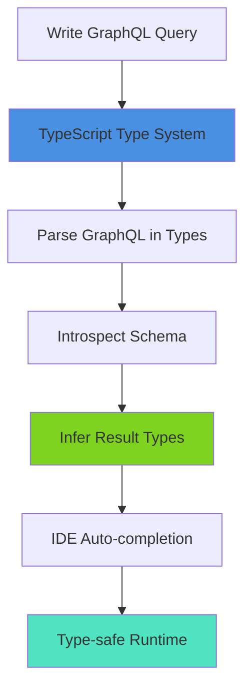
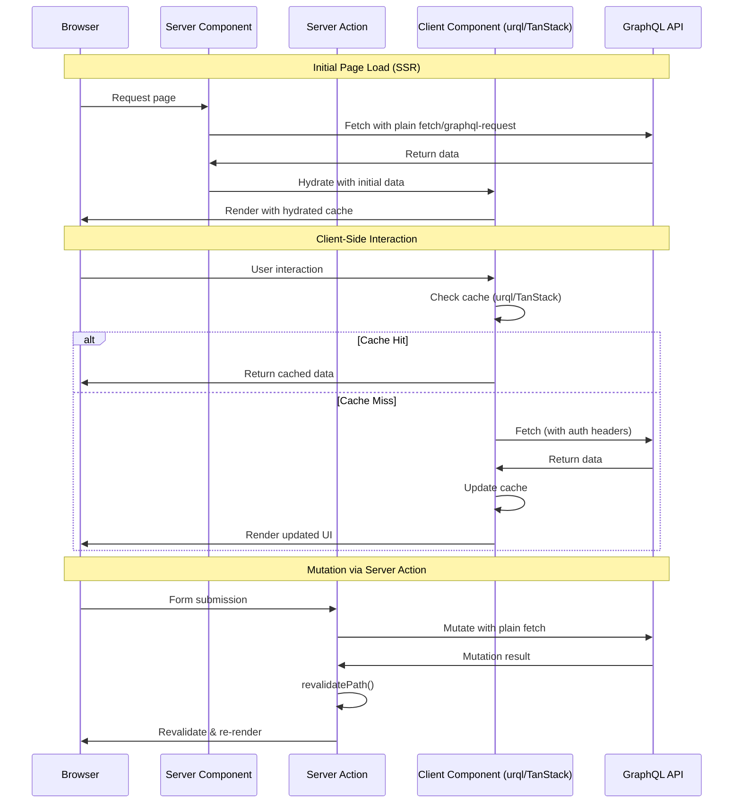
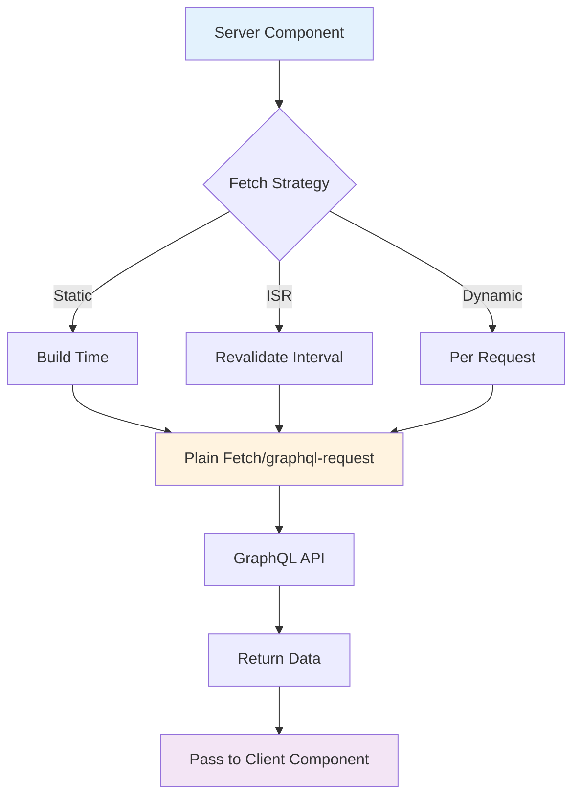

# GraphQL Client Libraries for Next.js 16 with React 19 Server Components - Research

**Date**: 2025-11-15
**Status**: Research Complete

## Executive Summary

For Next.js 16 with React 19 Server Components, the optimal GraphQL strategy involves a hybrid approach: **plain fetch or graphql-request for Server Components/Server Actions**, paired with **urql or TanStack Query for client-side interactivity**. Apollo Client's 30.7KB bundle size and complexity make it unsuitable for modern lightweight applications. The type-safety landscape has shifted dramatically with **gql.tada**, which eliminates code generation by leveraging TypeScript's type system directly, providing on-the-fly type inference with full editor support.

## Technical Deep Dive

### Overview

The GraphQL client ecosystem has evolved significantly for React Server Components. Traditional approaches centered on full-featured clients like Apollo, but the RSC paradigm enables lighter alternatives. Server Components can fetch data directly with minimal tooling, while Client Components benefit from specialized state management libraries that handle caching, optimistic updates, and subscriptions.

### GraphQL Client Architecture Patterns

Modern GraphQL clients fall into four categories based on their architecture and feature set:

#### 1. Minimal Clients (Plain Fetch, graphql-request)

These clients provide simple HTTP transport without advanced features.

**Plain Fetch Pattern:**
```typescript
const { data } = await fetch(process.env.GRAPHQL_API_URL, {
  method: "POST",
  headers: { "Content-Type": "application/json" },
  body: JSON.stringify({
    query: `query GetPosts { posts { id title } }`,
    variables: {}
  }),
  next: { revalidate: 10 }
}).then((res) => res.json());
```

**graphql-request Pattern:**
```typescript
import { request } from 'graphql-request'

const data = await request(
  'https://endpoint.com/graphql',
  `query GetPosts { posts { id title } }`
)
```

**Characteristics:**
- Bundle size: 0KB (fetch) or 5.2KB (graphql-request)
- No caching, no state management
- Ideal for server-side fetching in RSC and Server Actions
- Manual error handling and loading states

#### 2. Lightweight Feature Clients (urql)

Mid-weight clients offering caching and React hooks with modular architecture.

**urql Core Features:**
- Document cache by default (7.1KB base)
- Normalized cache via `@urql/exchange-graphcache` plugin
- Subscriptions support
- Optimistic updates (with Graphcache)
- Exchange-based architecture for customization

**urql with Server Components Pattern:**
```typescript
// Server Component
import { cacheExchange, createClient, fetchExchange } from 'urql/core'

async function ServerComponent() {
  const client = createClient({
    url: 'https://endpoint.com/graphql',
    exchanges: [cacheExchange, fetchExchange],
  })

  const result = await client.query(MyQuery, { variables }).toPromise()

  return <ClientComponent data={result.data} />
}
```

**urql Client Component with SSR Hydration:**
```typescript
'use client'

function ClientComponent({ serverData }) {
  const [client] = useState(() => {
    const ssr = ssrExchange({ initialState: {} })

    // Rehydrate server data
    useMemo(() => {
      ssr.restoreData({
        [result.operation.key]: {
          data: JSON.stringify(serverData),
        },
      })
    }, [serverData])

    return createClient({
      url: 'https://endpoint.com/graphql',
      exchanges: [cacheExchange, ssr, fetchExchange],
    })
  })

  const [result] = useQuery({ query: MyQuery })
  return <div>{result.data}</div>
}
```

#### 3. Server-State Managers with GraphQL Support (TanStack Query)

Originally REST-focused, TanStack Query provides powerful state management for any async data source.

**TanStack Query Approach:**
TanStack Query is backend-agnostic and works via Promise-based fetchers. It excels at server-state management but **does not provide normalized caching**.

**Server Component Prefetch Pattern:**
```typescript
// app/posts/page.tsx (Server Component)
import { QueryClient, dehydrate, HydrationBoundary } from '@tanstack/react-query'
import { request } from 'graphql-request'

export default async function PostsPage() {
  const queryClient = new QueryClient()

  const postsQuery = graphql(`
    query GetPosts { posts { id title } }
  `)

  await queryClient.prefetchQuery({
    queryKey: ['posts'],
    queryFn: async () => request('https://endpoint.com/graphql', postsQuery),
  })

  return (
    <HydrationBoundary state={dehydrate(queryClient)}>
      <Posts />
    </HydrationBoundary>
  )
}
```

**Client Component Consumption:**
```typescript
'use client'
import { useQuery } from '@tanstack/react-query'
import { request } from 'graphql-request'

export function Posts() {
  const { data } = useQuery({
    queryKey: ['posts'],
    queryFn: async () => request('https://endpoint.com/graphql', postsQuery),
  })

  return <div>{data.posts.map(...)}</div>
}
```

**Streaming with Pending Queries (v5.40.0+):**
```typescript
// Don't await - stream to browser faster
const queryClient = new QueryClient()

queryClient.prefetchQuery({
  queryKey: ['posts'],
  queryFn: getPosts,
})

return (
  <HydrationBoundary
    state={dehydrate(queryClient, {
      shouldDehydrateQuery: (query) =>
        defaultShouldDehydrateQuery(query) ||
        query.state.status === 'pending',
    })}
  >
    <Posts />
  </HydrationBoundary>
)
```

#### 4. Full-Featured Clients (Apollo Client)

Enterprise-grade clients with comprehensive features and large bundle sizes.

**Apollo Client Characteristics:**
- 30.7KB minimum bundle size
- Normalized cache built-in
- Complex API surface
- Extensive ecosystem
- **Not recommended** for modern lightweight applications

### Type Safety: The gql.tada Revolution

**gql.tada** represents a paradigm shift in GraphQL type safety by eliminating code generation entirely.

#### How gql.tada Works



**Traditional Approach (Code Generation):**
1. Write GraphQL query
2. Run codegen tool
3. Generate TypeScript types
4. Import generated types
5. Use in components

**gql.tada Approach:**
1. Write GraphQL query with `graphql()` function
2. TypeScript infers types automatically
3. Full IDE support instantly

**gql.tada Example:**
```typescript
import { graphql } from 'gql.tada'

// Type inference happens in TypeScript's type system
const UserQuery = graphql(`
  query GetUser($id: ID!) {
    user(id: $id) {
      id
      name
      email
    }
  }
`)

// result is fully typed without code generation
const result = await request('https://endpoint.com/graphql', UserQuery, {
  id: '123' // TypeScript knows this must be a string
})

// result.user.name - fully typed with autocomplete
```

**Setup:**
```typescript
// gql.tada.d.ts
import { introspection } from './graphql-env.d.ts'

declare module 'gql.tada' {
  interface setupSchema {
    introspection: typeof introspection
  }
}
```

**Benefits:**
- No code generation build step
- Instant type updates as you write queries
- GraphQLSP integration for editor validation
- Works with any GraphQL client (fetch, graphql-request, urql, etc.)
- 2.5KB runtime overhead

### How It Works: GraphQL Data Flow in Next.js



### Technology Stack / Ecosystem

#### urql Ecosystem
- **Core**: `urql` (7.1KB)
- **Normalized Cache**: `@urql/exchange-graphcache`
- **Server-Side**: `urql/core` (for RSC)
- **Next.js Integration**: `next-urql` (note: App Router support requires manual setup)
- **Subscriptions**: Built-in WebSocket support
- **Code Generation**: `@graphql-codegen/typescript-urql`

#### TanStack Query Ecosystem
- **Core**: `@tanstack/react-query` (~10KB)
- **GraphQL Transport**: `graphql-request` (5.2KB)
- **Type Safety**: `gql.tada` or GraphQL Code Generator
- **Devtools**: `@tanstack/react-query-devtools`
- **No GraphQL-specific packages needed** - uses standard fetchers

#### gql.tada Ecosystem
- **Core**: `gql.tada` (2.5KB)
- **Editor Support**: `@0no-co/graphqlsp` (VSCode extension)
- **CLI**: Built-in for schema introspection
- **Works with**: Any GraphQL client (fetch, graphql-request, urql, etc.)

#### Lightweight Clients
- **graphql-request**: 5.2KB, 2 dependencies
- **Plain fetch**: 0KB, native browser/Node.js

## Codebase Analysis

_Not applicable - this research focuses on external library selection rather than existing codebase patterns._

## Implementation Feasibility

### Benefits

**Hybrid Approach (Server fetch + Client state management):**
- **Minimal bundle size**: Server Components use 0-5KB solutions, client components add only what's needed (7-10KB)
- **Framework alignment**: Leverages Next.js built-in fetch caching and revalidation via `next.revalidate`
- **Optimal performance**: Initial render from server is instant, client-side updates are cached and optimized
- **Type safety**: gql.tada provides real-time type checking without build steps
- **Developer experience**: urql and TanStack Query offer excellent DevTools and debugging

**gql.tada Advantages:**
- **No build step**: Types update instantly as queries are written
- **Always accurate**: No stale generated types
- **Editor-first**: Full autocomplete and validation in IDE
- **Framework agnostic**: Works with any GraphQL transport

**TanStack Query Benefits:**
- **Proven ecosystem**: Massive adoption, excellent documentation
- **Powerful caching**: Automatic background refetching, stale-while-revalidate
- **DevTools**: Best-in-class debugging experience
- **Optimistic updates**: Built-in support with rollback
- **Not GraphQL-specific**: Can mix REST and GraphQL easily

**urql Benefits:**
- **Lightweight**: Smallest full-featured GraphQL client
- **Modular**: Add features via exchanges as needed
- **GraphQL-native**: Purpose-built for GraphQL workflows
- **Normalized cache option**: Available when needed via Graphcache
- **Subscriptions**: First-class WebSocket support

### Trade-offs & Challenges

**TanStack Query Limitations:**
- **No normalized cache**: Related entities may be duplicated across queries
- **Not GraphQL-native**: Requires pairing with graphql-request or similar
- **Learning curve**: Concepts like staleTime, cacheTime, refetchInterval require understanding

**urql Challenges:**
- **App Router support**: No official next-urql support for App Router; requires manual setup
- **Suspense requirement**: Using `suspense: true` requires Suspense boundaries or causes infinite renders
- **Smaller ecosystem**: Less third-party tooling compared to Apollo or TanStack Query
- **Subscription + optimistic updates**: Known issues where subscription results can overwrite optimistic updates

**gql.tada Considerations:**
- **Newer library**: Less mature than code generation tools (though backed by strong sponsors)
- **TypeScript requirement**: Only works with TypeScript projects
- **Learning curve**: Different mental model from code generation
- **Schema introspection**: Requires schema file or introspection endpoint

**Plain Fetch Limitations:**
- **No caching**: Every request hits the network
- **Manual everything**: Error handling, loading states, retries all manual
- **No subscriptions**: Only supports query/mutation, not real-time updates
- **Type safety**: Requires pairing with gql.tada or code generation

### When to Use

**Plain fetch (Server Components/Actions):**
- ✅ Simple data fetching in Server Components
- ✅ Server Actions for mutations
- ✅ Pages with no client-side data requirements
- ✅ Statically generated or ISR pages

**graphql-request (Server Components/Actions):**
- ✅ Server-side GraphQL with better DX than plain fetch
- ✅ Node.js scripts or serverless functions
- ✅ When you need typed variables and responses
- ✅ Projects using gql.tada for type safety

**urql (Client Components):**
- ✅ GraphQL-native applications
- ✅ Real-time features requiring subscriptions
- ✅ Applications needing normalized cache
- ✅ Projects wanting minimal bundle size
- ✅ Teams already familiar with GraphQL clients

**TanStack Query + graphql-request (Client Components):**
- ✅ Applications mixing REST and GraphQL
- ✅ Teams already using TanStack Query
- ✅ Projects prioritizing caching and refetching strategies
- ✅ When normalized cache is not required
- ✅ Applications needing powerful DevTools

**gql.tada (Type Safety Layer):**
- ✅ All TypeScript projects
- ✅ Teams wanting instant type feedback
- ✅ Projects avoiding build complexity
- ✅ Codebases with frequently changing schemas

### When to Avoid

**Plain fetch:**
- ❌ Client components needing caching or state management
- ❌ Applications with complex loading/error states
- ❌ Real-time features (subscriptions)

**TanStack Query for GraphQL:**
- ❌ Applications heavily using GraphQL relationships (normalized cache needed)
- ❌ Teams wanting GraphQL-specific tooling and conventions
- ❌ Projects already using urql successfully

**urql:**
- ❌ Applications primarily using REST APIs
- ❌ Projects needing the most mature ecosystem and tooling
- ❌ Teams unfamiliar with GraphQL concepts

**gql.tada:**
- ❌ JavaScript-only projects
- ❌ Teams preferring explicit code generation
- ❌ Projects with tooling that requires generated types

**Apollo Client:**
- ❌ New projects prioritizing bundle size
- ❌ Applications on modern Next.js (RSC-first)
- ❌ Projects wanting minimal complexity

## Implementation Options

### Option 1: Hybrid Approach - Plain Fetch + urql

**Description**: Use native fetch in Server Components and Server Actions for initial data fetching and mutations, with urql in Client Components for interactive features.

**Pros**:
- **Minimal server bundle**: 0KB for server-side GraphQL
- **Lightweight client**: 7.1KB base, ~15KB with Graphcache
- **GraphQL-native DX**: Purpose-built hooks and patterns
- **Subscriptions support**: Built-in WebSocket handling
- **Normalized cache option**: Add Graphcache when needed

**Cons**:
- **App Router setup complexity**: Manual SSR hydration required (no official next-urql support)
- **Smaller ecosystem**: Fewer plugins and examples than TanStack Query
- **Subscription/optimistic update conflicts**: Known issues in certain scenarios

**Complexity**: Medium

**Time Estimate**: 1-2 days for setup and integration

**Reuses Patterns**: Partial (if currently using urql)

**When to Use**:
- GraphQL is primary API protocol
- Real-time features are important
- Bundle size is critical
- Team comfortable with GraphQL concepts

**Example Implementation**:

```typescript
// lib/graphql-server.ts (Server-side)
export async function fetchGraphQL(query: string, variables?: Record<string, any>) {
  const res = await fetch(process.env.GRAPHQL_API_URL!, {
    method: 'POST',
    headers: { 'Content-Type': 'application/json' },
    body: JSON.stringify({ query, variables }),
    next: { revalidate: 60 },
  })

  const json = await res.json()
  if (json.errors) throw new Error(json.errors[0].message)
  return json.data
}

// app/posts/page.tsx (Server Component)
import { fetchGraphQL } from '@/lib/graphql-server'

export default async function PostsPage() {
  const data = await fetchGraphQL(`
    query GetPosts { posts { id title } }
  `)

  return <PostsList initialData={data.posts} />
}

// components/posts-list.tsx (Client Component)
'use client'
import { useQuery } from 'urql'

export function PostsList({ initialData }) {
  const [result] = useQuery({
    query: `query GetPosts { posts { id title } }`,
  })

  const posts = result.data?.posts ?? initialData
  return <div>{posts.map(...)}</div>
}

// app/actions.ts (Server Action)
'use server'
export async function createPost(formData: FormData) {
  const data = await fetchGraphQL(`
    mutation CreatePost($title: String!) {
      createPost(title: $title) { id }
    }
  `, { title: formData.get('title') })

  revalidatePath('/posts')
  return data
}
```

### Option 2: Hybrid Approach - graphql-request + TanStack Query

**Description**: Use graphql-request in Server Components for SSR prefetching, with TanStack Query managing client-side state and caching.

**Pros**:
- **Best-in-class caching**: Powerful stale-while-revalidate patterns
- **Excellent DevTools**: Industry-leading debugging experience
- **Huge ecosystem**: Massive community, plugins, examples
- **Flexible**: Mix REST and GraphQL easily
- **Proven patterns**: Well-established Server Component integration

**Cons**:
- **No normalized cache**: GraphQL relationships may cause data duplication
- **Two libraries**: Requires graphql-request + TanStack Query
- **Not GraphQL-specific**: Doesn't leverage GraphQL-specific optimizations
- **No subscriptions**: Requires additional setup for real-time features

**Complexity**: Low-Medium

**Time Estimate**: 1 day for setup

**Reuses Patterns**: Yes (if familiar with React Query patterns)

**When to Use**:
- Team already uses TanStack Query
- Mixing REST and GraphQL
- Powerful caching/refetching needed
- Normalized cache not required
- Subscriptions not needed

**Example Implementation**:

```typescript
// lib/graphql.ts
import { request } from 'graphql-request'

export const endpoint = process.env.NEXT_PUBLIC_GRAPHQL_API_URL!

export async function fetchGraphQL<T>(query: string, variables?: Record<string, any>): Promise<T> {
  return request(endpoint, query, variables)
}

// app/posts/page.tsx (Server Component)
import { QueryClient, dehydrate, HydrationBoundary } from '@tanstack/react-query'
import { fetchGraphQL } from '@/lib/graphql'

export default async function PostsPage() {
  const queryClient = new QueryClient()

  await queryClient.prefetchQuery({
    queryKey: ['posts'],
    queryFn: () => fetchGraphQL(`query GetPosts { posts { id title } }`),
  })

  return (
    <HydrationBoundary state={dehydrate(queryClient)}>
      <Posts />
    </HydrationBoundary>
  )
}

// components/posts.tsx (Client Component)
'use client'
import { useQuery } from '@tanstack/react-query'
import { fetchGraphQL } from '@/lib/graphql'

export function Posts() {
  const { data } = useQuery({
    queryKey: ['posts'],
    queryFn: () => fetchGraphQL(`query GetPosts { posts { id title } }`),
  })

  return <div>{data.posts.map(...)}</div>
}

// components/create-post.tsx (Client Component with mutation)
'use client'
import { useMutation, useQueryClient } from '@tanstack/react-query'

export function CreatePost() {
  const queryClient = useQueryClient()

  const mutation = useMutation({
    mutationFn: (title: string) =>
      fetchGraphQL(`mutation CreatePost($title: String!) {
        createPost(title: $title) { id title }
      }`, { title }),
    onSuccess: () => {
      queryClient.invalidateQueries({ queryKey: ['posts'] })
    },
  })

  return <form onSubmit={(e) => {
    e.preventDefault()
    mutation.mutate(new FormData(e.currentTarget).get('title'))
  }}>...</form>
}
```

### Option 3: Type-Safe Hybrid with gql.tada

**Description**: Add gql.tada as a type safety layer on top of Option 1 or Option 2, eliminating code generation while providing instant type inference.

**Pros**:
- **No build step**: Types update as you write queries
- **Always accurate**: No stale generated types
- **Editor-first**: Full autocomplete and validation
- **Works with any client**: Fetch, graphql-request, urql, TanStack Query
- **Minimal overhead**: 2.5KB runtime

**Cons**:
- **TypeScript only**: Requires TypeScript project
- **Newer approach**: Less established than code generation
- **Learning curve**: Different mental model
- **Schema required**: Needs introspection file

**Complexity**: Low (add-on to existing setup)

**Time Estimate**: 2-3 hours to integrate with existing setup

**Reuses Patterns**: Yes (enhances existing implementation)

**When to Use**:
- TypeScript project
- Want instant type feedback
- Avoid code generation complexity
- Schema changes frequently

**Example Implementation**:

```typescript
// Setup (one-time)
// gql.tada.d.ts
import { introspection } from './graphql-env.d.ts'

declare module 'gql.tada' {
  interface setupSchema {
    introspection: typeof introspection
  }
}

// Generate introspection
// pnpm gql.tada generate schema https://api.endpoint.com/graphql

// Usage with fetch (Server Component)
import { graphql } from 'gql.tada'

const PostsQuery = graphql(`
  query GetPosts {
    posts {
      id
      title
      author { name }
    }
  }
`)

export default async function PostsPage() {
  const res = await fetch(endpoint, {
    method: 'POST',
    headers: { 'Content-Type': 'application/json' },
    body: JSON.stringify({ query: PostsQuery }),
  })

  const { data } = await res.json()
  // data is fully typed: { posts: Array<{ id: string, title: string, author: { name: string } }> }

  return <div>{data.posts.map(post => post.title)}</div>
}

// Usage with graphql-request + TanStack Query
import { request } from 'graphql-request'
import { useQuery } from '@tanstack/react-query'

const PostQuery = graphql(`
  query GetPost($id: ID!) {
    post(id: $id) {
      id
      title
    }
  }
`)

export function Post({ id }: { id: string }) {
  const { data } = useQuery({
    queryKey: ['post', id],
    queryFn: () => request(endpoint, PostQuery, { id }),
  })

  // data.post is fully typed with autocomplete
  return <h1>{data.post.title}</h1>
}

// Usage with urql
import { useQuery } from 'urql'

const PostsQuery = graphql(`
  query GetPosts {
    posts { id title }
  }
`)

export function Posts() {
  const [result] = useQuery({ query: PostsQuery })
  // result.data.posts is fully typed
  return <div>{result.data.posts.map(...)}</div>
}
```

## Comparison Matrix

| Criteria | Plain Fetch | graphql-request | urql | TanStack Query + graphql-request | Apollo Client |
|----------|-------------|-----------------|------|----------------------------------|---------------|
| **Bundle Size** | 0KB | 5.2KB | 7.1KB (17KB with Graphcache) | ~15KB combined | 30.7KB minimum |
| **Server Components** | Excellent | Excellent | Good (manual setup) | Excellent (HydrationBoundary) | Poor |
| **Client-Side Caching** | None | None | Document (Normalized optional) | Advanced (no normalization) | Normalized |
| **Type Safety** | Manual | Manual | Codegen/gql.tada | Codegen/gql.tada | Codegen |
| **Subscriptions** | No | No | Yes (WebSocket) | No (requires separate) | Yes |
| **Optimistic Updates** | Manual | Manual | Yes (with Graphcache) | Yes (built-in) | Yes |
| **DevTools** | Browser only | Browser only | Basic | Best-in-class | Good |
| **Learning Curve** | Very Low | Very Low | Low-Medium | Medium | High |
| **Complexity** | Minimal | Minimal | Medium | Medium | High |
| **Community** | N/A | Moderate | Moderate | Huge | Huge |
| **Reuses Patterns** | N/A | N/A | Partial | Yes (if using React Query) | No |
| **Time to Implement** | 1 hour | 2 hours | 1-2 days | 1 day | 2-3 days |
| **Maintenance** | Low | Low | Medium | Medium | High |
| **GraphQL-Native** | No | Yes | Yes | No | Yes |
| **Framework Agnostic** | Yes | Yes | Yes | Yes | Yes |
| **RSC-First Design** | Yes | Yes | No | Yes | No |

## Implementation Approach

### Prerequisites & Requirements

**All Approaches:**
- Next.js 16 with App Router
- React 19
- TypeScript (recommended for all options)
- GraphQL endpoint URL
- GraphQL schema (for type generation or gql.tada)

**Option-Specific Requirements:**

**For urql:**
```bash
pnpm add urql graphql
pnpm add -D @graphql-codegen/cli @graphql-codegen/typescript @graphql-codegen/typescript-urql
```

**For TanStack Query:**
```bash
pnpm add @tanstack/react-query graphql-request graphql
pnpm add -D @tanstack/react-query-devtools
```

**For gql.tada:**
```bash
pnpm add gql.tada graphql
pnpm add -D @0no-co/graphqlsp
```

**Environment Variables:**
```env
# Server-side only (not prefixed with NEXT_PUBLIC_)
GRAPHQL_API_URL=https://api.example.com/graphql

# Client-side accessible
NEXT_PUBLIC_GRAPHQL_API_URL=https://api.example.com/graphql
```

### Getting Started

#### Step 1: Choose Your Approach

Based on your requirements:

- **Need real-time (subscriptions)?** → urql
- **Mixing REST + GraphQL?** → TanStack Query
- **Simplest possible?** → Plain fetch or graphql-request
- **Best type safety?** → Add gql.tada to any approach

#### Step 2: Set Up Server-Side GraphQL

**Option A: Plain Fetch Utility**
```typescript
// lib/graphql-server.ts
export async function fetchGraphQL<T = any>(
  query: string,
  variables?: Record<string, any>,
  options?: { revalidate?: number | false }
): Promise<T> {
  const res = await fetch(process.env.GRAPHQL_API_URL!, {
    method: 'POST',
    headers: {
      'Content-Type': 'application/json',
      // Add auth if needed
      // 'Authorization': `Bearer ${token}`,
    },
    body: JSON.stringify({ query, variables }),
    next: { revalidate: options?.revalidate ?? 60 },
  })

  if (!res.ok) {
    throw new Error(`GraphQL request failed: ${res.statusText}`)
  }

  const json = await res.json()

  if (json.errors) {
    throw new Error(json.errors[0].message)
  }

  return json.data
}
```

**Option B: graphql-request Utility**
```typescript
// lib/graphql-server.ts
import { request, RequestDocument } from 'graphql-request'

export async function fetchGraphQL<T>(
  query: RequestDocument,
  variables?: Record<string, any>
): Promise<T> {
  return request<T>(process.env.GRAPHQL_API_URL!, query, variables)
}
```

#### Step 3: Set Up Client-Side (if needed)

**For urql:**
```typescript
// app/providers.tsx
'use client'
import { createClient, cacheExchange, fetchExchange, Provider } from 'urql'

const client = createClient({
  url: process.env.NEXT_PUBLIC_GRAPHQL_API_URL!,
  exchanges: [cacheExchange, fetchExchange],
})

export function Providers({ children }: { children: React.ReactNode }) {
  return <Provider value={client}>{children}</Provider>
}

// app/layout.tsx
import { Providers } from './providers'

export default function RootLayout({ children }) {
  return (
    <html>
      <body>
        <Providers>{children}</Providers>
      </body>
    </html>
  )
}
```

**For TanStack Query:**
```typescript
// app/providers.tsx
'use client'
import { QueryClient, QueryClientProvider } from '@tanstack/react-query'
import { ReactQueryDevtools } from '@tanstack/react-query-devtools'
import { useState } from 'react'

export function Providers({ children }: { children: React.ReactNode }) {
  const [queryClient] = useState(() => new QueryClient({
    defaultOptions: {
      queries: {
        staleTime: 60 * 1000, // 1 minute
      },
    },
  }))

  return (
    <QueryClientProvider client={queryClient}>
      {children}
      <ReactQueryDevtools initialIsOpen={false} />
    </QueryClientProvider>
  )
}

// app/layout.tsx
import { Providers } from './providers'

export default function RootLayout({ children }) {
  return (
    <html>
      <body>
        <Providers>{children}</Providers>
      </body>
    </html>
  )
}
```

#### Step 4: Add Type Safety (Optional but Recommended)

**With gql.tada:**
```bash
# Generate schema introspection
pnpm gql.tada generate schema https://your-api.com/graphql --output ./graphql-env.d.ts

# Or from a local schema file
pnpm gql.tada generate schema ./schema.graphql --output ./graphql-env.d.ts
```

```typescript
// gql.tada.d.ts
import { introspection } from './graphql-env.d.ts'

declare module 'gql.tada' {
  interface setupSchema {
    introspection: typeof introspection
  }
}
```

**With GraphQL Code Generator:**
```yaml
# codegen.yml
schema: https://your-api.com/graphql
documents: 'src/**/*.tsx'
generates:
  src/gql/:
    preset: client
    plugins: []
```

```bash
pnpm add -D @graphql-codegen/cli @graphql-codegen/client-preset
pnpm graphql-codegen
```

### Architecture & Design Considerations

#### Server Component Data Flow



**Key Decisions:**

1. **Where to fetch**: Server Components (default) vs Client Components
   - Server: Better performance, no client bundle, SEO-friendly
   - Client: Real-time updates, user interactions, personalized data

2. **Caching strategy**:
   - Static: `{ cache: 'force-cache' }` (default)
   - Revalidate: `{ next: { revalidate: 60 } }`
   - Dynamic: `{ cache: 'no-store' }`

3. **Error boundaries**: Wrap async Server Components in error.tsx
   - Create `error.tsx` in route segment
   - Handles both server and client errors

#### Client-Side State Management

**With urql:**
- Document cache by default (good for most use cases)
- Add Graphcache for normalized cache (related entities)
- Use `requestPolicy` for cache behavior:
  - `cache-first`: Check cache first (default)
  - `cache-and-network`: Return cache immediately, fetch in background
  - `network-only`: Always fetch fresh
  - `cache-only`: Never fetch, cache only

**With TanStack Query:**
- Configure `staleTime` (how long data is fresh)
- Configure `cacheTime` (how long unused data stays in cache)
- Use `refetchInterval` for polling
- Use `refetchOnWindowFocus` for automatic refresh

#### Authentication & Headers

**Server-Side (Server Components/Actions):**
```typescript
import { cookies } from 'next/headers'

export async function fetchGraphQLAuth<T>(query: string, variables?: any): Promise<T> {
  const cookieStore = await cookies()
  const token = cookieStore.get('auth-token')

  const res = await fetch(process.env.GRAPHQL_API_URL!, {
    method: 'POST',
    headers: {
      'Content-Type': 'application/json',
      'Authorization': token ? `Bearer ${token.value}` : '',
    },
    body: JSON.stringify({ query, variables }),
  })

  const json = await res.json()
  if (json.errors) throw new Error(json.errors[0].message)
  return json.data
}
```

**Client-Side (urql):**
```typescript
import { authExchange } from '@urql/exchange-auth'

const client = createClient({
  url: process.env.NEXT_PUBLIC_GRAPHQL_API_URL!,
  exchanges: [
    authExchange(async (utils) => {
      const token = localStorage.getItem('token')
      return {
        addAuthToOperation(operation) {
          if (!token) return operation
          return utils.appendHeaders(operation, {
            Authorization: `Bearer ${token}`,
          })
        },
        didAuthError(error) {
          return error.graphQLErrors.some(
            (e) => e.extensions?.code === 'UNAUTHENTICATED'
          )
        },
        async refreshAuth() {
          // Refresh token logic
        },
      }
    }),
    cacheExchange,
    fetchExchange,
  ],
})
```

**Client-Side (TanStack Query):**
```typescript
// lib/graphql-client.ts
import { request } from 'graphql-request'

export async function fetchGraphQLClient<T>(
  query: string,
  variables?: any
): Promise<T> {
  const token = localStorage.getItem('token')

  return request<T>(
    process.env.NEXT_PUBLIC_GRAPHQL_API_URL!,
    query,
    variables,
    {
      Authorization: token ? `Bearer ${token}` : '',
    }
  )
}
```

#### Error Handling Strategy

**Server-Side:**
```typescript
// app/posts/page.tsx
import { ErrorBoundary } from '@/components/error-boundary'

export default async function PostsPage() {
  try {
    const data = await fetchGraphQL(`query GetPosts { posts { id title } }`)
    return <PostsList posts={data.posts} />
  } catch (error) {
    // Let error.tsx handle it, or handle inline
    throw error
  }
}

// app/posts/error.tsx
'use client'
export default function Error({
  error,
  reset,
}: {
  error: Error & { digest?: string }
  reset: () => void
}) {
  return (
    <div>
      <h2>Failed to load posts</h2>
      <p>{error.message}</p>
      <button onClick={reset}>Try again</button>
    </div>
  )
}
```

**Client-Side (urql):**
```typescript
const [result] = useQuery({ query: PostsQuery })

if (result.fetching) return <Spinner />
if (result.error) return <Error error={result.error} />

return <div>{result.data.posts.map(...)}</div>
```

**Client-Side (TanStack Query):**
```typescript
const { data, isLoading, error } = useQuery({
  queryKey: ['posts'],
  queryFn: () => fetchGraphQL(`query GetPosts { posts { id title } }`),
  retry: 3,
  retryDelay: (attemptIndex) => Math.min(1000 * 2 ** attemptIndex, 30000),
})

if (isLoading) return <Spinner />
if (error) return <Error error={error} />

return <div>{data.posts.map(...)}</div>
```

### Best Practices

#### Server Components (Plain Fetch / graphql-request)

- **Deduplicate requests**: Next.js automatically deduplicates identical fetch calls in the same render pass
- **Use revalidation**: Set appropriate `next.revalidate` values based on data freshness needs
- **Throw errors**: Let error boundaries catch them rather than returning error states
- **Avoid client state**: Don't pass fetched data to client components that refetch the same data

**Example:**
```typescript
// ✅ Good: Let Next.js dedupe
async function Header() {
  const user = await fetchGraphQL(`query GetUser { user { name } }`)
  return <div>{user.name}</div>
}

async function Sidebar() {
  const user = await fetchGraphQL(`query GetUser { user { name } }`)
  return <div>{user.name}</div>
}

// Next.js only makes one request for both components

// ❌ Bad: Manual caching
const userCache = new Map()
async function getUser() {
  if (userCache.has('user')) return userCache.get('user')
  const user = await fetchGraphQL(`query GetUser { user { name } }`)
  userCache.set('user', user)
  return user
}
```

#### Client Components (urql / TanStack Query)

- **Colocate queries**: Define GraphQL queries near the components that use them
- **Use fragments**: Break complex queries into reusable fragments
- **Avoid overfetching**: Only request fields you actually use
- **Set appropriate cache policies**: Balance freshness vs performance

**Example with gql.tada fragments:**
```typescript
import { graphql } from 'gql.tada'

// Define reusable fragment
const UserFieldsFragment = graphql(`
  fragment UserFields on User {
    id
    name
    email
    avatar
  }
`)

// Use in query
const PostQuery = graphql(`
  query GetPost($id: ID!) {
    post(id: $id) {
      id
      title
      author {
        ...UserFields
      }
    }
  }
`, [UserFieldsFragment])
```

#### Mutations

**Server Actions (Recommended for Mutations):**
```typescript
// app/actions.ts
'use server'
import { revalidatePath } from 'next/cache'

export async function createPost(formData: FormData) {
  const title = formData.get('title') as string

  const result = await fetchGraphQL(`
    mutation CreatePost($title: String!) {
      createPost(title: $title) {
        id
        title
      }
    }
  `, { title })

  // Revalidate the posts page to show new post
  revalidatePath('/posts')

  return result.createPost
}

// components/create-post-form.tsx
'use client'
import { createPost } from '@/app/actions'
import { useFormStatus } from 'react-dom'

export function CreatePostForm() {
  return (
    <form action={createPost}>
      <input name="title" required />
      <SubmitButton />
    </form>
  )
}

function SubmitButton() {
  const { pending } = useFormStatus()
  return <button disabled={pending}>Create</button>
}
```

**Client-Side Mutations (urql):**
```typescript
import { useMutation } from 'urql'

const CreatePostMutation = graphql(`
  mutation CreatePost($title: String!) {
    createPost(title: $title) {
      id
      title
    }
  }
`)

export function CreatePost() {
  const [result, createPost] = useMutation(CreatePostMutation)

  async function handleSubmit(e: React.FormEvent<HTMLFormElement>) {
    e.preventDefault()
    const formData = new FormData(e.currentTarget)
    await createPost({ title: formData.get('title') as string })
  }

  return (
    <form onSubmit={handleSubmit}>
      <input name="title" required />
      <button disabled={result.fetching}>Create</button>
    </form>
  )
}
```

**Client-Side Mutations (TanStack Query):**
```typescript
import { useMutation, useQueryClient } from '@tanstack/react-query'

export function CreatePost() {
  const queryClient = useQueryClient()

  const mutation = useMutation({
    mutationFn: (title: string) =>
      fetchGraphQL(`
        mutation CreatePost($title: String!) {
          createPost(title: $title) { id title }
        }
      `, { title }),
    onSuccess: () => {
      // Invalidate and refetch
      queryClient.invalidateQueries({ queryKey: ['posts'] })
    },
  })

  return (
    <form onSubmit={(e) => {
      e.preventDefault()
      mutation.mutate(new FormData(e.currentTarget).get('title'))
    }}>
      <input name="title" required />
      <button disabled={mutation.isPending}>Create</button>
    </form>
  )
}
```

#### Optimistic Updates

**urql with Graphcache:**
```typescript
import { cacheExchange } from '@urql/exchange-graphcache'

const client = createClient({
  url: endpoint,
  exchanges: [
    cacheExchange({
      optimistic: {
        createPost: (variables, cache, info) => ({
          __typename: 'Post',
          id: 'temp-id',
          title: variables.title,
          createdAt: new Date().toISOString(),
        }),
      },
    }),
    fetchExchange,
  ],
})
```

**TanStack Query:**
```typescript
const mutation = useMutation({
  mutationFn: createPost,
  onMutate: async (newPost) => {
    // Cancel outgoing refetches
    await queryClient.cancelQueries({ queryKey: ['posts'] })

    // Snapshot previous value
    const previousPosts = queryClient.getQueryData(['posts'])

    // Optimistically update
    queryClient.setQueryData(['posts'], (old) => [...old, newPost])

    // Return context with snapshot
    return { previousPosts }
  },
  onError: (err, newPost, context) => {
    // Rollback on error
    queryClient.setQueryData(['posts'], context.previousPosts)
  },
  onSettled: () => {
    // Refetch after error or success
    queryClient.invalidateQueries({ queryKey: ['posts'] })
  },
})
```

#### Subscriptions (urql only)

```typescript
import { subscriptionExchange } from '@urql/exchange-graphcache'
import { createClient as createWSClient } from 'graphql-ws'

const wsClient = createWSClient({
  url: 'wss://your-api.com/graphql',
})

const client = createClient({
  url: 'https://your-api.com/graphql',
  exchanges: [
    cacheExchange,
    subscriptionExchange({
      forwardSubscription: (operation) => ({
        subscribe: (sink) => ({
          unsubscribe: wsClient.subscribe(operation, sink),
        }),
      }),
    }),
    fetchExchange,
  ],
})

// Usage
import { useSubscription } from 'urql'

const NewPostSubscription = graphql(`
  subscription OnPostCreated {
    postCreated {
      id
      title
    }
  }
`)

export function RealtimePosts() {
  const [result] = useSubscription({ query: NewPostSubscription })

  if (result.data) {
    console.log('New post:', result.data.postCreated)
  }

  return <div>...</div>
}
```

### Common Pitfalls & How to Avoid Them

#### 1. **Fetching Same Data in Server and Client Components**

**Problem**: Server Component fetches data, passes to Client Component, which refetches the same data.

**Solution**: Either fetch only on server and pass data, OR only fetch on client and hydrate.

```typescript
// ❌ Bad: Double fetching
// app/posts/page.tsx (Server Component)
async function PostsPage() {
  const posts = await fetchGraphQL(`query GetPosts { posts { id } }`)
  return <PostsList /> {/* Client component fetches again */}
}

// ✅ Good: Server-only
async function PostsPage() {
  const posts = await fetchGraphQL(`query GetPosts { posts { id } }`)
  return <PostsList posts={posts} />
}

// ✅ Good: Client-only with prefetch
async function PostsPage() {
  const queryClient = new QueryClient()
  await queryClient.prefetchQuery({
    queryKey: ['posts'],
    queryFn: () => fetchGraphQL(`query GetPosts { posts { id } }`),
  })

  return (
    <HydrationBoundary state={dehydrate(queryClient)}>
      <PostsList /> {/* Uses hydrated cache */}
    </HydrationBoundary>
  )
}
```

#### 2. **Not Handling GraphQL Errors**

**Problem**: GraphQL returns 200 OK even with errors in `errors` array.

**Solution**: Always check `json.errors` before returning data.

```typescript
// ❌ Bad
async function fetchGraphQL(query: string) {
  const res = await fetch(endpoint, {
    method: 'POST',
    body: JSON.stringify({ query }),
  })
  const json = await res.json()
  return json.data // May be undefined if errors exist!
}

// ✅ Good
async function fetchGraphQL(query: string) {
  const res = await fetch(endpoint, {
    method: 'POST',
    body: JSON.stringify({ query }),
  })

  if (!res.ok) {
    throw new Error(`HTTP ${res.status}: ${res.statusText}`)
  }

  const json = await res.json()

  if (json.errors) {
    throw new Error(json.errors.map(e => e.message).join(', '))
  }

  return json.data
}
```

#### 3. **Infinite Renders with urql and App Router**

**Problem**: Using `useQuery` without Suspense in App Router causes infinite fetching.

**Solution**: Wrap in Suspense boundaries or prefetch server-side.

```typescript
// ❌ Bad: Infinite renders
'use client'
export function Posts() {
  const [result] = useQuery({ query: PostsQuery })
  return <div>{result.data?.posts.map(...)}</div>
}

// ✅ Good: With Suspense
'use client'
import { Suspense } from 'react'

export function PostsPage() {
  return (
    <Suspense fallback={<Spinner />}>
      <Posts />
    </Suspense>
  )
}

function Posts() {
  const [result] = useQuery({ query: PostsQuery })
  return <div>{result.data.posts.map(...)}</div>
}

// ✅ Better: Server prefetch with hydration
// See urql RSC pattern in Implementation Options
```

#### 4. **Using Client-Only APIs in Server Components**

**Problem**: Trying to use `localStorage`, `useQuery` hooks, or other client APIs in Server Components.

**Solution**: Mark components with `'use client'` when using client APIs.

```typescript
// ❌ Bad: Server Component using client APIs
async function Posts() {
  const token = localStorage.getItem('token') // Error!
  const [result] = useQuery({ query: PostsQuery }) // Error!
  return <div>...</div>
}

// ✅ Good: Client Component
'use client'
export function Posts() {
  const token = localStorage.getItem('token')
  const [result] = useQuery({ query: PostsQuery })
  return <div>...</div>
}
```

#### 5. **Not Revalidating After Mutations**

**Problem**: Server Action mutates data but UI doesn't update.

**Solution**: Call `revalidatePath()` or `revalidateTag()` after mutations.

```typescript
// ❌ Bad: UI doesn't update
'use server'
export async function createPost(formData: FormData) {
  const result = await fetchGraphQL(`mutation CreatePost...`, {
    title: formData.get('title'),
  })
  return result
}

// ✅ Good: UI refreshes
'use server'
import { revalidatePath } from 'next/cache'

export async function createPost(formData: FormData) {
  const result = await fetchGraphQL(`mutation CreatePost...`, {
    title: formData.get('title'),
  })

  revalidatePath('/posts')
  return result
}
```

### Testing Strategies

#### Unit Testing GraphQL Utilities

**Test plain fetch wrapper:**
```typescript
// lib/graphql-server.spec.ts
import { describe, it, expect, vi } from 'vitest'
import { fetchGraphQL } from './graphql-server'

describe('fetchGraphQL', () => {
  it('should fetch and return data', async () => {
    global.fetch = vi.fn().mockResolvedValue({
      ok: true,
      json: async () => ({ data: { posts: [] } }),
    })

    const result = await fetchGraphQL('query GetPosts { posts { id } }')

    expect(result).toEqual({ posts: [] })
    expect(fetch).toHaveBeenCalledWith(
      expect.any(String),
      expect.objectContaining({
        method: 'POST',
        body: expect.stringContaining('GetPosts'),
      })
    )
  })

  it('should throw on GraphQL errors', async () => {
    global.fetch = vi.fn().mockResolvedValue({
      ok: true,
      json: async () => ({
        errors: [{ message: 'Not found' }],
      }),
    })

    await expect(fetchGraphQL('query ...')).rejects.toThrow('Not found')
  })
})
```

#### Integration Testing Client Components

**Test urql component:**
```typescript
// components/posts.spec.tsx
import { describe, it, expect } from 'vitest'
import { render, screen } from '@testing-library/react'
import { Provider } from 'urql'
import { fromValue } from 'wonka'
import { Posts } from './posts'

describe('Posts', () => {
  it('should render posts from urql', async () => {
    const mockClient = {
      executeQuery: () => fromValue({
        data: { posts: [{ id: '1', title: 'Test Post' }] },
      }),
    }

    render(
      <Provider value={mockClient}>
        <Posts />
      </Provider>
    )

    expect(await screen.findByText('Test Post')).toBeInTheDocument()
  })
})
```

**Test TanStack Query component:**
```typescript
// components/posts.spec.tsx
import { describe, it, expect } from 'vitest'
import { render, screen } from '@testing-library/react'
import { QueryClient, QueryClientProvider } from '@tanstack/react-query'
import { Posts } from './posts'

describe('Posts', () => {
  it('should render posts from TanStack Query', async () => {
    const queryClient = new QueryClient({
      defaultOptions: {
        queries: { retry: false },
      },
    })

    queryClient.setQueryData(['posts'], {
      posts: [{ id: '1', title: 'Test Post' }],
    })

    render(
      <QueryClientProvider client={queryClient}>
        <Posts />
      </QueryClientProvider>
    )

    expect(await screen.findByText('Test Post')).toBeInTheDocument()
  })
})
```

#### E2E Testing

Use Playwright or Cypress to test the full flow including real GraphQL requests. Mock the GraphQL API at the network level using MSW (Mock Service Worker).

```typescript
// tests/setup.ts
import { setupServer } from 'msw/node'
import { graphql } from 'msw'

export const server = setupServer(
  graphql.query('GetPosts', (req, res, ctx) => {
    return res(
      ctx.data({
        posts: [{ id: '1', title: 'Mocked Post' }],
      })
    )
  })
)

// tests/posts.e2e.spec.ts
import { test, expect } from '@playwright/test'

test('should display posts', async ({ page }) => {
  await page.goto('/posts')
  await expect(page.locator('text=Mocked Post')).toBeVisible()
})
```

### Migration/Adoption Strategy

#### Phase 1: Add Server-Side GraphQL (Week 1)

1. **Set up fetch utility** for Server Components
2. **Migrate static pages** to use Server Components with GraphQL
3. **Add error boundaries** for error handling
4. **Test and validate** server-side rendering works

**Success Criteria:**
- All static/SSR pages use Server Components for data fetching
- Error boundaries properly catch and display errors
- Build completes without warnings

#### Phase 2: Add Type Safety (Week 2)

1. **Choose type safety approach** (gql.tada or codegen)
2. **Generate initial types** from schema
3. **Migrate existing queries** to use types
4. **Set up CI** to validate types on build

**Success Criteria:**
- TypeScript errors for invalid queries
- Autocomplete works in IDE
- CI fails on type errors

#### Phase 3: Add Client-Side State Management (Week 3-4)

1. **Choose client library** (urql or TanStack Query)
2. **Set up providers** in root layout
3. **Migrate interactive components** to use client hooks
4. **Add optimistic updates** for mutations
5. **Configure caching strategies**

**Success Criteria:**
- Client components use hooks for data fetching
- Loading/error states handled properly
- Mutations update UI optimistically
- No unnecessary refetches

#### Phase 4: Optimize and Refine (Ongoing)

1. **Add DevTools** for debugging
2. **Fine-tune cache policies** based on usage
3. **Add subscriptions** if real-time needed (urql)
4. **Monitor bundle size** and optimize imports
5. **Add comprehensive tests**

**Rollback Strategy:**
If issues arise, can easily rollback by:
1. Keep old Apollo/fetch code alongside new code
2. Feature flag new GraphQL approach
3. Gradually migrate page by page
4. Full rollback possible by removing new dependencies

## Alternatives Considered

### Alternative 1: Apollo Client

**Why considered:**
- Industry standard for GraphQL
- Comprehensive feature set
- Large ecosystem and community
- Normalized cache built-in

**Why not chosen:**
- 30.7KB minimum bundle size (2-3x larger than alternatives)
- Complex API with steep learning curve
- Over-engineered for modern Next.js patterns
- Poor integration with React Server Components
- Requires extensive configuration for App Router

**When it might be better:**
- Existing large codebase already using Apollo
- Team expertise heavily in Apollo
- Need for Apollo-specific features (Apollo Federation, Apollo Studio)

### Alternative 2: Relay

**Why considered:**
- Built by Facebook for React
- Extremely performant with compiler optimizations
- Advanced features like pagination cursors
- Colocation of data requirements

**Why not chosen:**
- Very opinionated and rigid patterns
- Requires Relay Compiler build step
- Steep learning curve
- Smaller ecosystem than Apollo or TanStack Query
- Overkill for most applications

**When it might be better:**
- Large-scale applications with complex data requirements
- Team willing to adopt Relay's opinionated patterns
- Performance is absolutely critical
- Using Relay on backend (GraphQL schema designed for Relay)

### Alternative 3: SWR

**Why considered:**
- Created by Vercel (makers of Next.js)
- Simple API
- Good integration with Next.js
- Similar to TanStack Query

**Why not chosen:**
- Less feature-rich than TanStack Query
- Smaller community and ecosystem
- TanStack Query has better DevTools
- Not GraphQL-specific (similar to TanStack Query but less mature)

**When it might be better:**
- Very simple applications
- Already using other Vercel tools
- Prefer Vercel's ecosystem

## Debates & Open Questions

### Normalized Cache vs Document Cache

**Document Cache Advocates Argue:**
- Simpler mental model
- Sufficient for most applications
- Automatic with fetch deduplication in Next.js
- Lower complexity and maintenance

**Normalized Cache Advocates Argue:**
- Prevents data duplication
- Automatic updates across queries
- Better for highly relational data
- Required for offline support

**Current Consensus (2024-2025):**
For Next.js with RSC, document cache is often sufficient because:
1. Server Components refetch on navigation
2. `revalidatePath()` triggers fresh fetches
3. Most apps don't need complex client-side cache synchronization

Use normalized cache (urql Graphcache, Apollo) when:
- Client-side navigation is frequent
- Same entity appears in many queries
- Offline support is required
- Mutations affect many related queries

### Code Generation vs Type Inference (gql.tada)

**Code Generation Proponents:**
- More established and proven
- Generates helper functions and hooks
- Works with any editor
- Can generate additional artifacts (docs, schema SDL)

**gql.tada Proponents:**
- No build step = faster development
- Always in sync (no stale types)
- Better DX with instant feedback
- Simpler tooling setup

**Open Question:**
Will gql.tada's approach become the new standard, or will code generation remain dominant? As of 2024-2025, gql.tada is gaining traction but code generation is still more widely used. Both approaches are valid and the choice depends on team preference and project constraints.

### Server Actions vs Client Mutations

**Server Actions Advantages:**
- No client JavaScript for mutations
- Automatic revalidation with `revalidatePath()`
- Progressive enhancement (works without JS)
- Better security (credentials never exposed)

**Client Mutations Advantages:**
- Optimistic updates easier to implement
- More granular control over cache updates
- Better for real-time feedback
- Can avoid full page revalidation

**Current Best Practice (2024-2025):**
Use Server Actions for most mutations, especially forms. Use client mutations (urql/TanStack Query) when:
- Optimistic updates are critical UX
- Need immediate feedback without network delay
- Mutations are rapid/frequent (typing, dragging)
- Part of complex client-side state machine

### Subscriptions: Worth the Complexity?

**Debate:**
GraphQL subscriptions provide real-time updates via WebSocket, but add complexity:
- Requires separate WebSocket connection
- Additional server infrastructure
- More complex error handling
- Higher resource usage

**Alternatives:**
- Polling with refetchInterval
- Server-Sent Events (SSE)
- HTTP/2 or HTTP/3 long polling
- Third-party services (Pusher, Ably)

**Current Guidance:**
Only implement subscriptions if:
1. Real-time updates are core feature (chat, notifications, live dashboards)
2. Polling interval would be < 5 seconds
3. User expects instant updates
4. Server infrastructure supports WebSockets

For most applications, periodic refetching (30-60 seconds) or revalidation on focus is sufficient.

## Recommendations

### Preferred Approach: Hybrid with gql.tada

**Should This Be Implemented?**: Yes

**Recommended Stack:**
1. **Type Safety**: gql.tada (2.5KB)
2. **Server Components**: graphql-request (5.2KB) or plain fetch
3. **Client Components**: TanStack Query (10KB) + graphql-request OR urql (7-17KB)
4. **Total Bundle**: 15-25KB (vs 30.7KB+ for Apollo)

**Rationale**:

**For Type Safety (gql.tada):**
- Eliminates code generation build step
- Provides instant type feedback as you write queries
- Always accurate (no stale generated types)
- Works with any GraphQL client
- Minimal overhead (2.5KB)
- Strong industry backing (WunderGraph, The Guild, BigCommerce)

**For Server-Side (graphql-request or fetch):**
- Server Components are the default in Next.js 16
- No need for heavy client library server-side
- graphql-request provides better DX than plain fetch (5.2KB)
- Leverages Next.js built-in caching and revalidation
- Perfect for SSR, ISR, and static generation

**For Client-Side Choice:**

**Choose TanStack Query + graphql-request if:**
- ✅ Mixing REST and GraphQL APIs
- ✅ Team already familiar with TanStack Query
- ✅ Want best-in-class DevTools
- ✅ Normalized cache not needed
- ✅ No real-time subscriptions required
- ✅ Prioritize ecosystem size and maturity

**Choose urql if:**
- ✅ GraphQL is primary/only API
- ✅ Need real-time subscriptions
- ✅ Want smallest possible bundle (7.1KB base)
- ✅ May need normalized cache (Graphcache)
- ✅ Prefer GraphQL-native patterns

**Recommended: TanStack Query for your use case because:**
1. **Mature ecosystem**: You mentioned finding Apollo "too heavy" - TanStack Query provides power without bloat
2. **Best DevTools**: Debugging and development experience is superior
3. **Flexibility**: If you later need REST endpoints, no refactor needed
4. **Proven patterns**: Server Component integration is well-documented
5. **Community size**: Larger than urql, more resources and examples

**Why**:

- **Bundle size**: 15-20KB total (TanStack + graphql-request + gql.tada) vs 30.7KB+ for Apollo
- **Performance**: Server Components fetch on server (faster initial render), client hooks manage interactive state
- **DX**: gql.tada provides instant type safety, TanStack Query DevTools make debugging easy
- **Maintainability**: Simpler stack with fewer dependencies and less configuration
- **Framework alignment**: Leverages Next.js 16 RSC patterns instead of fighting them
- **Future-proof**: Aligns with React 19 and Next.js direction (Server Components first)

**Key Considerations**:

1. **Learning curve**: TanStack Query has concepts to learn (staleTime, cacheTime, etc.)
2. **No normalized cache**: If your app has heavily interconnected data, urql Graphcache might be better
3. **Type safety setup**: Requires one-time gql.tada configuration
4. **Migration effort**: Moving from current urql setup will take 1-2 days

**Potential Challenges**:

1. **No normalized cache**: If mutations affect multiple queries, need manual invalidation
   - **Mitigation**: Use queryClient.invalidateQueries with broad query keys
   - **Fallback**: Switch to urql with Graphcache if this becomes problematic

2. **Two libraries for GraphQL**: TanStack Query + graphql-request vs single urql package
   - **Mitigation**: Combined bundle is still smaller than Apollo
   - **Benefit**: Separation of concerns (transport vs state management)

3. **Not GraphQL-native**: TanStack Query doesn't understand GraphQL schema
   - **Mitigation**: gql.tada provides type safety, manual cache keys are explicit
   - **Benefit**: Can easily add REST endpoints without refactoring

**Success Criteria**:

- ✅ Bundle size < 20KB for GraphQL stack
- ✅ Type errors caught at development time (before runtime)
- ✅ Server Components leverage native fetch caching
- ✅ Client Components have loading/error states managed
- ✅ Mutations trigger appropriate UI updates
- ✅ DevTools enable easy debugging of queries and cache
- ✅ No infinite render loops or unnecessary refetches

## Additional Notes

### Next.js 16 Specific Considerations

- **Turbopack compatibility**: As of January 2025, urql has compatibility issues with Turbopack. Use Webpack if using urql, or wait for resolution.
- **Partial Prerendering (PPR)**: When using PPR, ensure GraphQL fetches in Server Components complete before streaming begins, or use Suspense boundaries appropriately.
- **Server Actions**: Strongly typed Server Actions work excellently with gql.tada for mutation type safety.

### React 19 Specific Considerations

- **use() Hook**: React 19's `use()` hook can unwrap promises, enabling patterns like:
  ```typescript
  const data = use(fetchGraphQL(`query ...`))
  ```
  However, Next.js Server Components already handle async/await, so this is mainly useful for client components with Suspense.

- **Automatic Batch Rendering**: React 19 automatically batches all state updates. This benefits TanStack Query and urql when multiple queries resolve simultaneously.

### Performance Monitoring

Consider adding performance monitoring for GraphQL requests:

```typescript
// lib/graphql-server.ts
export async function fetchGraphQL<T>(query: string, variables?: any): Promise<T> {
  const start = performance.now()

  try {
    const result = await fetch(/* ... */)
    const data = await result.json()

    const duration = performance.now() - start

    // Log slow queries
    if (duration > 1000) {
      console.warn(`Slow GraphQL query (${duration}ms):`, query)
    }

    return data
  } catch (error) {
    const duration = performance.now() - start
    console.error(`GraphQL error after ${duration}ms:`, error)
    throw error
  }
}
```

### Schema Management

For larger teams, consider versioning your GraphQL schema:

1. **Schema Registry**: Use Apollo Studio, GraphQL Hive, or similar
2. **Schema Versioning**: Tag schemas with versions
3. **Breaking Change Detection**: CI checks for breaking changes
4. **Client Compatibility**: Ensure client queries work with server schema

### Cost Considerations

**Free / Open Source:**
- All recommended libraries (urql, TanStack Query, graphql-request, gql.tada) are free and open source
- No vendor lock-in

**Paid Options (Optional):**
- **Apollo Studio**: GraphQL schema registry and monitoring ($0-$250/month)
- **GraphQL Hive**: Alternative schema registry (free tier available)
- **Sentry**: Error tracking for GraphQL errors ($0-$26/month)

**Development Time Cost:**
- Initial setup: 1-2 days
- Team training: 2-3 days
- Migration from Apollo: 3-5 days
- Migration from current urql: 1-2 days

## Sources

1. **TanStack Query Official Documentation** - https://tanstack.com/query/latest/docs/framework/react/graphql - Accessed 2025-11-15
2. **gql.tada Official Documentation** - https://gql-tada.0no.co/ - Accessed 2025-11-15
3. **urql GitHub Issues: Next.js App Router Integration** - https://github.com/urql-graphql/urql/issues/3686 - Accessed 2025-11-15
4. **How to Build Bullet-Proof GraphQL Frontends in React in 2025** - https://mingyang-li.medium.com/how-to-build-bullet-proof-graphql-frontends-in-react-in-2025-a3cb0e384c55 - Accessed 2025-11-15
5. **Next.js Official Documentation: Data Fetching Patterns** - https://nextjs.org/docs/14/app/building-your-application/data-fetching/patterns - Accessed 2025-11-15
6. **Hygraph: How to fetch GraphQL data in Next.js** - https://hygraph.com/blog/nextjs-graphql - Accessed 2025-11-15
7. **WunderGraph: NextJS/React SSR Data Fetching Patterns** - https://wundergraph.com/blog/nextjs_and_react_ssr_21_universal_data_fetching_patterns_and_best_practices - Accessed 2025-11-15
8. **GraphQL Request vs urql Developer Experience** - https://www.somethingsblog.com/2024/10/19/top-5-graphql-clients-for-javascript-and-node-js-developers/ - Accessed 2025-11-15
9. **Hasura: Exploring GraphQL Clients Comparison** - https://hasura.io/blog/exploring-graphql-clients-apollo-client-vs-relay-vs-urql - Accessed 2025-11-15
10. **urql Documentation: Cache Updates** - https://nearform.com/open-source/urql/docs/graphcache/cache-updates/ - Accessed 2025-11-15
11. **TanStack Query: Advanced Server Rendering** - https://tanstack.com/query/latest/docs/framework/react/guides/advanced-ssr - Accessed 2025-11-15
12. **Setting up MSW and URQL with Next.js 15** - https://blog.stackademic.com/setting-up-msw-and-urql-with-next-js-15-cbfd374e916a - Accessed 2025-11-15
