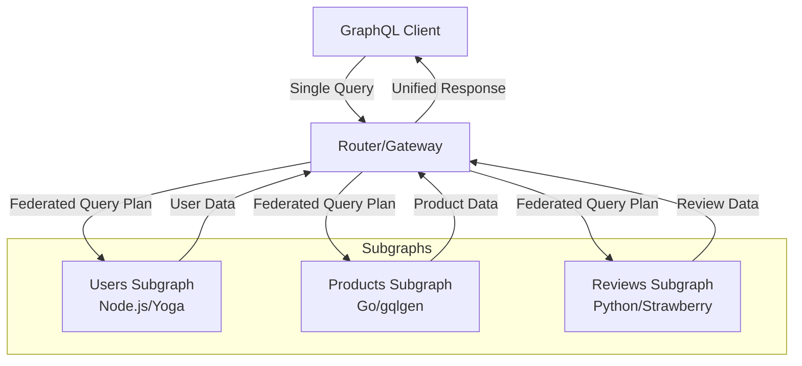
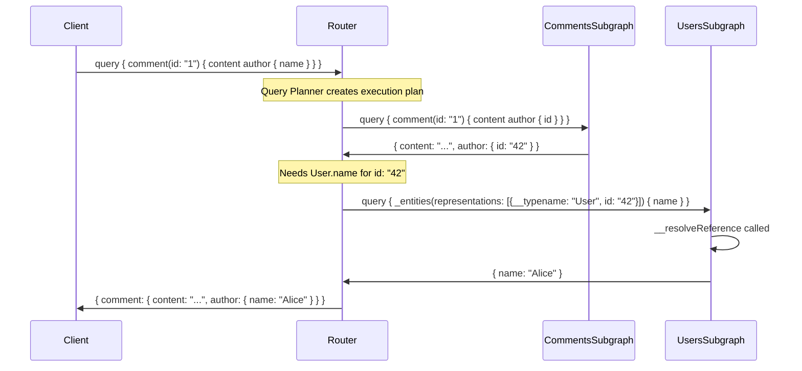
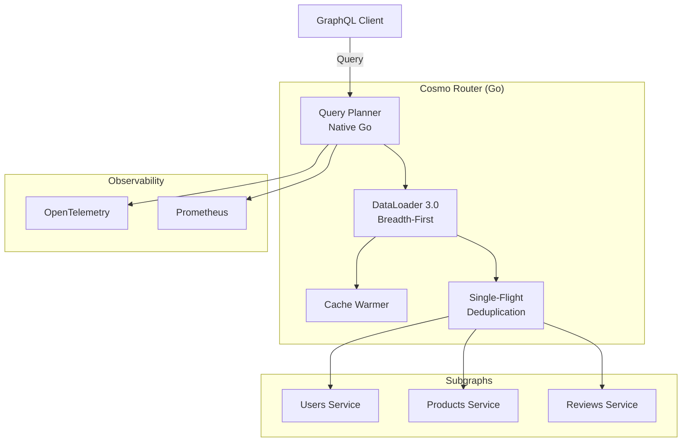
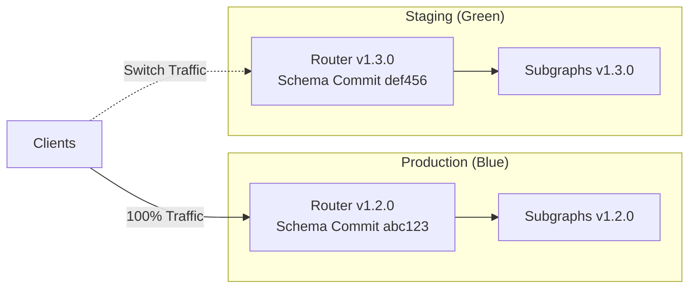
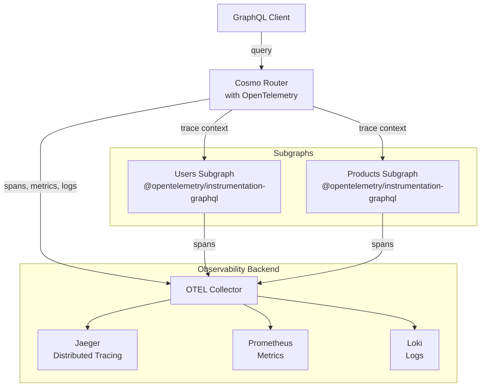
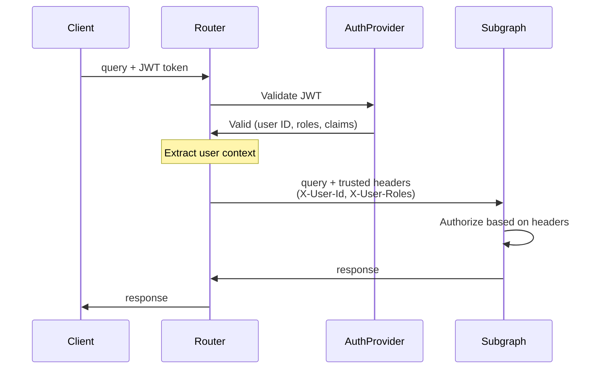
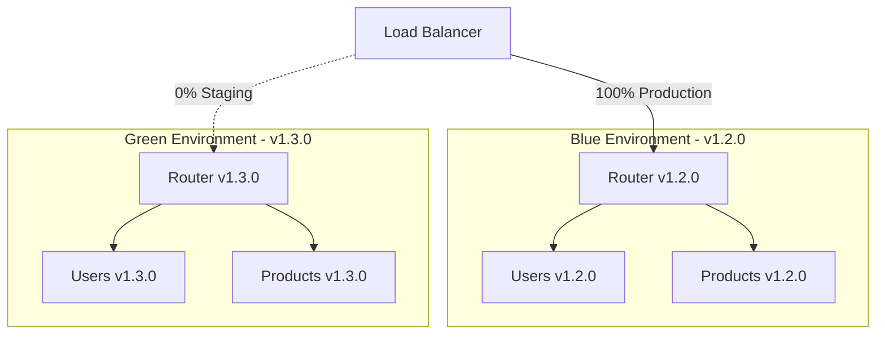
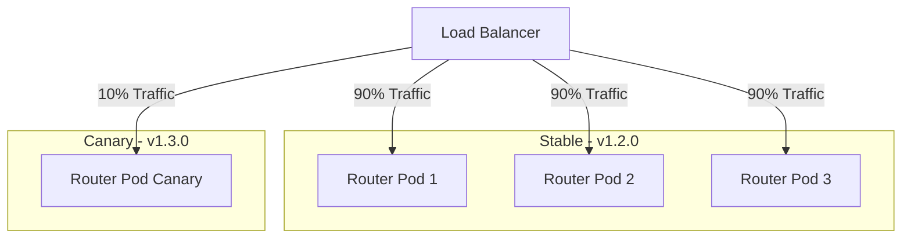
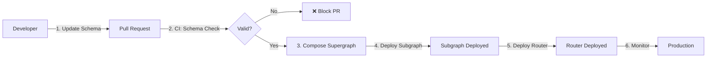
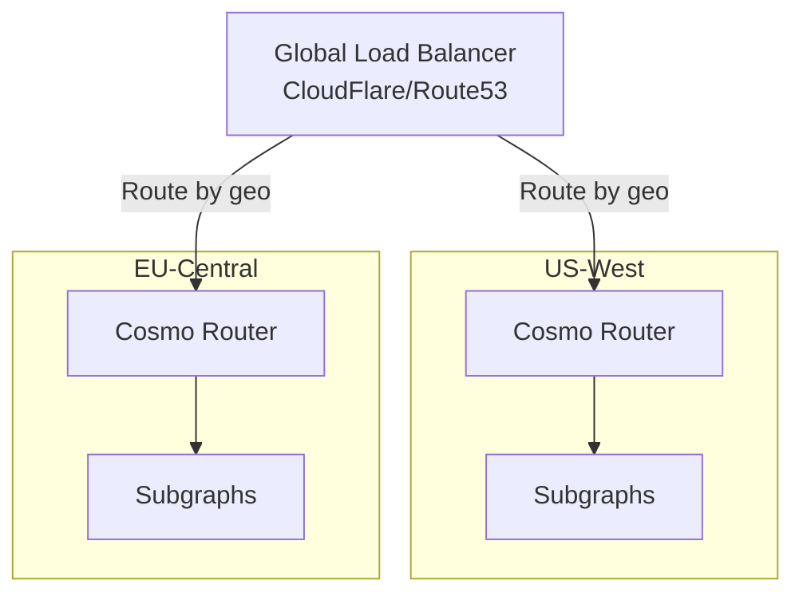

# GraphQL Federation 2 & Cosmos Router - Comprehensive Guide

**Date**: 2025-11-16
**Status**: Research Complete

## Executive Summary

GraphQL Federation 2 is a distributed GraphQL architecture that enables multiple teams to independently build and deploy GraphQL services (subgraphs) that compose into a unified API (supergraph). This guide provides a comprehensive overview for developers with strong GraphQL fundamentals but no prior Federation experience, with specific focus on implementing subgraphs using GraphQL Yoga and deploying with Cosmos Router in a Kubernetes environment.

**Key Takeaways:**

1. **Federation 2 is fundamentally different from monolithic GraphQL**: It shifts from a single schema to distributed schemas that compose at build/runtime, enabling team independence while maintaining a unified client experience.

2. **Entities are the core abstraction**: Understanding `@key` directives and reference resolvers (`__resolveReference`) is essential—entities are like database rows that can be extended across subgraphs.

3. **Pre-compiled schemas reduce runtime overhead**: Using static composition (with tools like Cosmo's `wgc router compose`) moves composition validation into the build pipeline, enabling faster router startup and simpler deployment.

4. **Cosmos Router offers compelling performance and open-source benefits**: With 8x better P99 latency than Apollo Router in some benchmarks, full Federation v1/v2 compatibility, and Apache 2.0 licensing, it's a strong alternative to Apollo GraphOS.

5. **Production success requires investment in tooling and governance**: Schema checks, observability (OpenTelemetry), proper error handling, and deployment strategies (blue-green/canary) are non-negotiable for federated architectures at scale.

---

## Part 1: GraphQL Federation 2 Fundamentals

### What is GraphQL Federation?

GraphQL Federation enables multiple GraphQL APIs to be declaratively combined into a single federated GraphQL API. It serves as an **API orchestration layer** where:

- Clients make a **single GraphQL request** to a unified endpoint
- A **router** coordinates and distributes the request across multiple backend services
- The response appears as if it came from a monolithic API

This preserves GraphQL's efficiency advantage over REST while enabling microservices architecture.

### Core Architecture



**Key Components:**

1. **Router/Gateway**: Single entry point that receives client requests, creates a query plan, orchestrates subgraph requests, and merges results
2. **Subgraphs**: Independent GraphQL services that contribute types and fields to the supergraph
3. **Supergraph Schema**: The composed, unified schema combining all subgraphs

### How Federation 2 Differs from Monolithic GraphQL

| Aspect | Monolithic GraphQL | GraphQL Federation |
|--------|-------------------|-------------------|
| **Schema Location** | Single unified schema | Distributed schemas composed into supergraph |
| **Team Coordination** | All teams share single codebase | Teams own independent subgraphs |
| **Deployment** | Single service deployment | Independent subgraph deployments |
| **Ownership** | Centralized API team | Distributed ownership by domain |
| **Scaling** | Vertical (single service) | Horizontal (multiple services) |
| **Client Interface** | Single GraphQL endpoint | Single GraphQL endpoint (transparent) |
| **Query Planning** | Direct resolver execution | Router creates distributed query plan |

**Key Advantage**: Teams can independently develop, deploy, and scale their services while clients enjoy a unified API—the best of both monolithic and microservices architectures.

### Federation 2 Improvements over Federation 1

Federation 2 is a clean-sheet implementation built in collaboration with the GraphQL community:

- **Shared Types**: First-class support for shared interfaces, enums, and value types
- **Cleaner Syntax**: Common tasks like extending types no longer require special directives/keywords
- **Better Composition**: Enhanced type merging with clearer ownership models
- **Backward Compatible**: Designed for incremental adoption, one subgraph at a time
- **No `@external` for `@key` fields**: Reduces boilerplate significantly

### Key Federation Directives

#### @key - Entity Definition

Designates an object type as an **entity** and specifies unique identifying fields.

```graphql
type Product @key(fields: "id") {
  id: ID!
  name: String!
  price: Int
}

type Product @key(fields: "upc") @key(fields: "sku") {
  upc: String!
  sku: String!
  name: String!
}
```

**Key Points:**
- Entities are the fundamental building blocks of Federation—think of them as database rows
- `@key` fields uniquely identify entity instances across subgraphs
- Supports multiple keys via repeatable directive
- Set `resolvable: false` when a subgraph references an entity but can't resolve it
- Use non-nullable fields in keys to avoid resolution issues

#### @shareable - Field Sharing

Indicates that multiple subgraphs can resolve the same field.

```graphql
type Position @shareable {
  x: Int!
  y: Int!
}

type User @key(fields: "id") {
  id: ID!
  email: String! @shareable  # Multiple subgraphs can resolve this
}
```

**Rules:**
- If marked `@shareable` in any subgraph, must be `@shareable` or `@external` in all subgraphs defining it
- Resolvers for shareable fields must behave identically across subgraphs
- `@key` fields are automatically shareable
- Marking a type `@shareable` makes all fields shareable

#### @override - Field Migration

Migrates field resolution ownership from one subgraph to another.

```graphql
type Product @key(fields: "id") {
  id: ID!
  inStock: Boolean! @override(from: "Products")
}
```

**Progressive Override (v2.7+):**
```graphql
type Product @key(fields: "id") {
  inStock: Boolean! @override(from: "Products", label: "percent(20)")
}
```

Gradually shifts 20% of traffic for this field to the new subgraph—ideal for safe production migrations.

#### @requires - Field Dependencies

Declares that resolving a field requires values from other fields (resolved by other subgraphs).

```graphql
type User @key(fields: "id") {
  id: ID!
  email: String! @external
  isEligibleForDiscount: Boolean! @requires(fields: "email")
}
```

The router ensures `email` is fetched before resolving `isEligibleForDiscount`.

#### @provides - Query Optimization

Router optimization hint specifying fields a subgraph can resolve locally through a particular query path.

```graphql
type Review {
  product: Product! @provides(fields: "name")
}

type Product @key(fields: "id") {
  id: ID!
  name: String! @external
}
```

When fetching `Review.product`, the Reviews subgraph can provide `Product.name` without an additional subgraph call.

**Use Case**: Reduces cross-subgraph network hops when a subgraph already has data it doesn't "own."

#### @inaccessible - Schema Privacy

Omits definitions from the router's public API schema.

```graphql
type InternalMetrics @inaccessible {
  processingTime: Float!
  cacheHitRate: Float!
}

type User @key(fields: "id internalId") {
  id: ID!
  internalId: ID! @inaccessible  # Hidden from clients, used in @key
}
```

**Use Cases:**
- Hide internal fields used in `@key` directives
- Prevent composition errors during staged rollouts
- Keep implementation details private

#### @external - External Field Reference

Marks fields defined in other subgraphs for reference purposes.

```graphql
type User @key(fields: "id") {
  id: ID!
  email: String! @external  # Defined in another subgraph
  emailDomain: String! @requires(fields: "email")
}
```

**Note**: Federation 2 doesn't require `@external` for `@key` fields, but still requires it for `@requires` and `@provides`.

#### @interfaceObject - Interface Entities (v2.3+)

Creates abstractions of entity interfaces across subgraphs.

```graphql
type Product @interfaceObject @key(fields: "id") {
  id: ID!
  price: Int!
}
```

Enables automatic field contribution to all implementing entities during composition.

### Entities: The Heart of Federation

#### What Are Entities?

Entities are **federated data objects** that can be uniquely identified by one or more key fields. Think of them like database rows—each has various fields and can be uniquely identified through specific key field(s).

**Key Characteristics:**
- Can be **extended** across multiple subgraphs
- Different subgraphs contribute different fields
- Uniquely identifiable via `@key` directive
- Enable cross-subgraph relationships

#### Defining an Entity: Two-Step Process

**Step 1: Apply the @key Directive**

```graphql
type Comment @key(fields: "id") {
  id: ID!
  content: String!
  createdAt: DateTime!
}
```

**Step 2: Implement the Reference Resolver**

```typescript
const resolvers = {
  Comment: {
    __resolveReference(reference, context) {
      // reference = { __typename: 'Comment', id: '123' }
      return context.db.comments.findById(reference.id);
    }
  }
}
```

The reference resolver tells the router **how to fetch an entity instance** when given its key fields.

#### Cross-Subgraph Entity Extension

Different subgraphs can contribute different fields to the same entity:

**Users Subgraph:**
```graphql
type Comment @key(fields: "id") {
  id: ID!
  content: String!
  author: User!
}
```

**Moderation Subgraph:**
```graphql
type Comment @key(fields: "id") {
  id: ID!
  moderationStatus: ModerationStatus!
  flaggedAt: DateTime
}
```

**Client sees combined entity:**
```graphql
type Comment {
  id: ID!
  content: String!
  author: User!
  moderationStatus: ModerationStatus!
  flaggedAt: DateTime
}
```

#### Entity Ownership Models

**1. Single Subgraph Ownership**

One subgraph "owns" the entity (defines most fields), others extend it.

- **Best for**: Small projects, clear domain boundaries
- **Pros**: Simple, clear ownership
- **Cons**: Can create bottlenecks as teams scale

**2. Shared Type Ownership**

Multiple subgraphs collaboratively define the entity.

- **Best for**: Large projects, complex domains
- **Pros**: Maximum flexibility, team independence
- **Cons**: Requires strong governance and coordination

#### Entity vs. Value Types vs. Stub Types

**Entity Types:**
- Have `@key` directives
- Can be extended across subgraphs
- Require reference resolvers
- Example: `User`, `Product`, `Comment`

**Value Types:**
- No `@key` directive
- Shared across subgraphs identically
- Marked `@shareable`
- Example: `Position`, `Address`, `Money`

```graphql
type Address @shareable {
  street: String!
  city: String!
  postalCode: String!
}
```

**Stub Types:**
- Reference entities without adding fields
- Provide just enough info to identify the entity
- Set `resolvable: false` in `@key`

```graphql
# Reviews subgraph references User but doesn't extend it
type User @key(fields: "id", resolvable: false) {
  id: ID!
}

type Review {
  author: User!  # Can reference but not query User fields
}
```

---

## Part 2: Building Federation Subgraphs with GraphQL Yoga

### GraphQL Yoga Federation Support

GraphQL Yoga is **fully compliant with the Apollo Federation specification** and supports both Federation v1 and v2. It has been validated to support the latest Federation features including `@composeDirective` and `@interfaceObject`.

**Key Advantages:**
- No extra plugins required for Federation
- Full TypeScript support
- Lightweight and performant
- Works with `@apollo/subgraph` package
- Compatible with any Federation gateway (Cosmo Router, Apollo Router, Hive Gateway)

### Setting Up a Federated Subgraph with GraphQL Yoga

#### 1. Install Dependencies

```bash
pnpm add graphql-yoga graphql @apollo/subgraph
```

#### 2. Define Your Schema with Federation Directives

```typescript
// src/schema.ts
import { parse } from 'graphql';

export const typeDefs = parse(/* GraphQL */ `
  extend schema
    @link(url: "https://specs.apollo.dev/federation/v2.3", import: ["@key", "@shareable"])

  type Query {
    comments: [Comment!]!
    comment(id: ID!): Comment
  }

  type Mutation {
    createComment(input: CreateCommentInput!): Comment!
  }

  type Comment @key(fields: "id") {
    id: ID!
    content: String!
    createdAt: String!
    author: User!
  }

  # Stub type - references User from another subgraph
  type User @key(fields: "id", resolvable: false) {
    id: ID!
  }

  input CreateCommentInput {
    content: String!
    authorId: ID!
  }
`);
```

**Important**: Always import Federation directives via `@link` in Federation 2.

#### 3. Implement Resolvers with Entity Reference Resolver

```typescript
// src/resolvers.ts
import type { Resolvers } from './generated/graphql.js';

export const resolvers: Resolvers = {
  Query: {
    comments: async (_, __, context) => {
      return context.db.comments.findAll();
    },
    comment: async (_, { id }, context) => {
      return context.db.comments.findById(id);
    },
  },

  Mutation: {
    createComment: async (_, { input }, context) => {
      return context.db.comments.create(input);
    },
  },

  // Entity reference resolver - crucial for Federation
  Comment: {
    __resolveReference: async (reference, context) => {
      // reference = { __typename: 'Comment', id: '123' }
      return context.db.comments.findById(reference.id);
    },

    // Regular field resolver
    author: (parent, _, context) => {
      // Return a stub - Router will fetch from Users subgraph
      return { __typename: 'User', id: parent.authorId };
    },
  },
};
```

**Key Points:**
- `__resolveReference` receives the entity representation (key fields + `__typename`)
- Must return all fields this subgraph defines for the entity
- Use DataLoader to prevent N+1 queries (covered later)

#### 4. Build Subgraph Schema and Create Yoga Server

```typescript
// src/server.ts
import { createServer } from 'http';
import { createYoga } from 'graphql-yoga';
import { buildSubgraphSchema } from '@apollo/subgraph';
import { typeDefs } from './schema.js';
import { resolvers } from './resolvers.js';
import { createContext } from './context.js';

// Build federated subgraph schema
const schema = buildSubgraphSchema([{ typeDefs, resolvers }]);

// Create Yoga server
const yoga = createYoga({
  schema,
  context: createContext,
});

const server = createServer(yoga);

server.listen(4001, () => {
  console.log('🚀 Comments subgraph ready at http://localhost:4001/graphql');
});
```

**Critical**: Use `buildSubgraphSchema` from `@apollo/subgraph` to add Federation metadata to your schema.

### Entity Resolution Flow

Understanding how the router resolves entities across subgraphs is crucial:



**Flow:**
1. Router receives query from client
2. Query planner determines which subgraphs to call
3. Comments subgraph resolves comment + returns User stub
4. Router calls Users subgraph's `_entities` query
5. Users subgraph's `__resolveReference` resolves the User
6. Router merges results and returns to client

### Preventing the N+1 Problem with DataLoader

The N+1 problem is **especially critical in Federation** because reference resolvers are often called many times per query.

#### The Problem

```typescript
// ❌ BAD: N+1 queries
Comment: {
  __resolveReference: async (reference, context) => {
    // If router requests 100 comments, this runs 100 separate DB queries
    return context.db.comments.findById(reference.id);
  },
}
```

If a query requests 100 comments, the router calls `__resolveReference` 100 times individually.

#### The Solution: DataLoader

```typescript
// src/dataloaders.ts
import DataLoader from 'dataloader';
import type { Database } from './db.js';

export function createCommentLoader(db: Database) {
  return new DataLoader<string, Comment>(async (ids) => {
    // Single batched query for all IDs
    const comments = await db.comments.findByIds(ids);

    // Return in same order as requested IDs
    const commentMap = new Map(comments.map(c => [c.id, c]));
    return ids.map(id => commentMap.get(id) || null);
  });
}

// src/context.ts
export function createContext() {
  return {
    db,
    loaders: {
      comments: createCommentLoader(db),
    },
  };
}

// src/resolvers.ts
Comment: {
  __resolveReference: async (reference, context) => {
    // ✅ GOOD: Batched via DataLoader
    return context.loaders.comments.load(reference.id);
  },
}
```

**DataLoader Benefits:**
- **Batching**: Collects multiple requests over short period, dispatches single query
- **Caching**: Deduplicates requests within single request context
- **Performance**: Dramatically reduces database round-trips

**Best Practice**: Use DataLoader in **every** reference resolver, even for entities that might seem simple.

### Schema Composition Rules & Conflict Avoidance

#### Type Conflicts

**❌ Conflict: Different field types across subgraphs**

```graphql
# Products subgraph
type Product @key(fields: "id") {
  price: Int!
}

# Inventory subgraph
type Product @key(fields: "id") {
  price: Float!  # ❌ Conflict: Int vs Float
}
```

**✅ Solution: Align types or use different field names**

```graphql
# Products subgraph
type Product @key(fields: "id") {
  priceInCents: Int!
}

# Inventory subgraph
type Product @key(fields: "id") {
  priceInCents: Int!  # ✅ Consistent
}
```

#### Shareable Field Consistency

**Rule**: If a field is `@shareable` in any subgraph, it must be `@shareable` or `@external` in all subgraphs.

```graphql
# Subgraph A
type User @key(fields: "id") {
  email: String! @shareable
}

# Subgraph B - MUST mark as @shareable or @external
type User @key(fields: "id") {
  email: String! @shareable  # ✅ Correct
}
```

#### Enum Consistency

Enums must be **identical** across all subgraphs that define them.

```graphql
# ✅ Consistent across subgraphs
enum OrderStatus {
  PENDING
  PROCESSING
  SHIPPED
  DELIVERED
}
```

### Advanced: Type System Patterns

#### Shared Interfaces

Interfaces can be shared across subgraphs in Federation 2:

```graphql
# Products subgraph
interface Node @shareable {
  id: ID!
}

type Product implements Node @key(fields: "id") {
  id: ID!
  name: String!
}

# Reviews subgraph
interface Node @shareable {
  id: ID!
}

type Review implements Node @key(fields: "id") {
  id: ID!
  rating: Int!
}
```

#### Union Types

Unions **cannot** be extended across subgraphs—they must be completely defined in one subgraph.

```graphql
# ✅ OK: Union defined entirely in one subgraph
union SearchResult = Product | User | Post

type Query {
  search(query: String!): [SearchResult!]!
}
```

---

## Part 3: Cosmos Router Deep Dive

### What is Cosmos Router?

**WunderGraph Cosmo Router** is an open-source, high-performance GraphQL router and API gateway written in Go, designed as an Apollo Router/GraphOS alternative. It's part of the broader Cosmo platform—a comprehensive Lifecycle API Management system for federated GraphQL.

**Key Differentiators:**
- **Open Source**: Apache 2.0 license (no vendor lock-in)
- **High Performance**: Written in Go with native query planner
- **Federation v1 & v2**: Full compatibility with Apollo Federation specification
- **Enterprise Features**: Field-level authorization, rate limiting, caching, observability
- **Deployment Flexibility**: Self-hosted, cloud, or managed service

### Architecture & Performance

#### Core Components



**Technical Highlights:**

1. **Native Go Query Planner**: Highly optimized, no JavaScript runtime overhead
2. **DataLoader 3.0**: Breadth-first execution strategy with ahead-of-time batch optimizations
3. **AST-JSON Result Merging**: Minimal memory usage, high performance
4. **Single-Flight Execution**: Deduplicates identical in-flight requests
5. **Cache Warmer**: Precomputes query plans during traffic surges

#### Performance Benchmarks

| Metric | Cosmo Router | Apollo Router | Apollo Gateway |
|--------|--------------|---------------|----------------|
| **P99 Latency** | 186ms | 1.51s | 9.01s |
| **Requests/Second** | 1,167 | 143 | 91 |
| **Relative Performance** | Baseline | 8x slower | 48x slower |

**Source**: WunderGraph benchmarks (2024). Independent Grafbase benchmarks show competitive performance between Cosmo and Apollo Router, with neither showing definitive 10x advantage in all scenarios.

**Key Takeaway**: Cosmo Router delivers excellent performance, especially for high P99 latency requirements. Real-world performance varies by workload.

### Key Features

#### 1. Federation Compatibility

- Full **Federation v1 and v2** support
- Drop-in replacement for Apollo Gateway and Apollo Router
- Compatible with any Federation-compliant subgraph

#### 2. Security & Authorization

**Field-Level Authorization (2024):**
```yaml
# Authorization via policy-as-code
authorization:
  require_authentication: true
  policies:
    - name: admin_only
      expression: "user.role == 'admin'"
```

**JWT & JWKS Support:**
- Built-in JWT validation
- JWKS endpoint integration
- Custom claims extraction

**Persisted Operations:**
- Trusted document approach
- Operation registration and allowlisting
- Protection against arbitrary queries

#### 3. Performance Optimizations

**Ludicrous Mode (Single-Flight):**
- Read-only requests deduplicated
- Multiple identical in-flight requests share single upstream call
- Dramatically reduces backend load

**Caching:**
- Query result caching
- Partial query caching
- Configurable TTLs

**Rate Limiting:**
- Per-client rate limits
- Token bucket algorithm
- Protects against abuse

#### 4. Observability

**OpenTelemetry Integration:**
- Traces, metrics, and logs
- Distributed tracing across subgraphs
- Custom exporters (Jaeger, Zipkin, Datadog, etc.)

**Prometheus Metrics:**
- Request rates, latencies, error rates
- Query complexity metrics
- Subgraph health monitoring

**Advanced Request Tracing (ART):**
- GraphQL Playground++ integration
- Visualize query plans
- Debug federation issues

### Cosmo vs Apollo Router

| Feature | Cosmo Router | Apollo Router |
|---------|--------------|---------------|
| **License** | Apache 2.0 (Open Source) | Elastic License 2.0 |
| **Language** | Go | Rust |
| **Federation Support** | v1 & v2 | v1 & v2 |
| **Performance** | Excellent (Go-optimized) | Excellent (Rust-optimized) |
| **Extensibility** | Custom Go modules | Rust/Rhai scripts (more complex) |
| **Managed Service** | Optional (WunderGraph) | Apollo GraphOS (primary focus) |
| **Field-Level Auth** | Built-in | Requires GraphOS Enterprise |
| **Cost** | Free (self-hosted) | Free tier + paid GraphOS plans |
| **Vendor Lock-in** | None | Moderate (GraphOS ecosystem) |

**When to Choose Cosmo Router:**
- Prefer open-source with no vendor lock-in
- Need field-level authorization without enterprise pricing
- Go expertise in team for customization
- Want full control over infrastructure

**When to Choose Apollo Router:**
- Already invested in Apollo ecosystem
- Prefer Rust performance characteristics
- Want managed GraphOS features (Studio, Explorer, etc.)
- Need Apollo-specific enterprise support

---

## Part 4: Pre-Compiled Schema Approach

### What is Pre-Compiled Schema Composition?

In Federation, **composition** is the process of combining subgraph schemas into a **supergraph schema**. Pre-compiled (static) composition moves this process **out of runtime and into the build pipeline**.

**Traditional (Dynamic) Composition:**
- Gateway/router fetches subgraph schemas at runtime
- Composition happens when router starts
- Schema updates require router restart or hot-reload

**Pre-Compiled (Static) Composition:**
- Composition happens at build time in CI/CD pipeline
- Router loads pre-generated supergraph schema
- Validation errors caught before deployment
- Faster router startup (no composition overhead)

### Benefits of Pre-Compiled Schemas

#### 1. Reduced Runtime Overhead

**Without Pre-Compilation:**
```
Router Start → Fetch Subgraph Schemas → Compose → Validate → Ready (slow)
```

**With Pre-Compilation:**
```
Router Start → Load Static Config → Ready (fast)
```

Router startup time reduced from seconds to milliseconds.

#### 2. Earlier Error Detection

Schema composition errors caught in CI/CD pipeline, not production:

```bash
# CI/CD pipeline
npx wgc router compose -i compose.yaml -o router.json
# ❌ Composition fails → Deployment blocked
# ✅ Composition succeeds → Deployment proceeds
```

#### 3. Simpler Deployment

- **Single artifact**: Pre-compiled `router.json` bundled with router image
- **No registry dependency**: Router doesn't need to fetch schemas at runtime
- **Immutable deployments**: Each deployment has fixed schema version
- **Faster rollbacks**: Deploy previous router image with its embedded schema

#### 4. Deterministic Composition

Same subgraph schemas always produce same supergraph schema (no runtime variability).

### Trade-offs vs Dynamic Composition

| Aspect | Pre-Compiled | Dynamic |
|--------|--------------|---------|
| **Router Startup** | Fast (ms) | Slower (seconds) |
| **Schema Updates** | Requires redeploy | Hot-reload possible |
| **Error Detection** | Build time (CI/CD) | Runtime (on router start) |
| **Deployment Complexity** | Simple (static file) | Moderate (registry/fetch) |
| **Schema Registry** | Optional | Often required |
| **Flexibility** | Lower (rebuild needed) | Higher (update subgraphs independently) |
| **Best For** | Kubernetes, immutable infra | Managed services, dynamic environments |

**When to Use Pre-Compiled:**
- Kubernetes/Cloud Native deployments
- Prefer infrastructure simplicity
- Want fastest router startup
- Immutable deployment model (containers)
- CI/CD-driven workflows

**When to Use Dynamic:**
- Need independent subgraph schema updates
- Using managed Federation service (GraphOS, Cosmo Cloud)
- Prefer hot-reloading over redeployment
- Centralized schema governance via registry

### Implementing Pre-Compiled Schemas with Cosmo Router

#### 1. Define Subgraph Configuration

Create `compose.yaml` listing all subgraphs:

```yaml
# compose.yaml
version: 1

subgraphs:
  - name: users
    routing_url: http://users-service:4001/graphql
    schema:
      file: ./subgraphs/users/schema.graphql

  - name: products
    routing_url: http://products-service:4002/graphql
    schema:
      file: ./subgraphs/products/schema.graphql

  - name: reviews
    routing_url: http://reviews-service:4003/graphql
    schema:
      file: ./subgraphs/reviews/schema.graphql
```

#### 2. Generate Static Router Configuration

```bash
# Compose subgraphs into static router config
npx wgc router compose -i compose.yaml -o router.json
```

**Output**: `router.json` contains:
- Composed supergraph schema
- Query planner configuration
- Subgraph routing information
- Federation metadata

#### 3. Build Pipeline Integration (CI/CD)

```yaml
# .github/workflows/deploy.yml
name: Deploy Federated Graph

on:
  push:
    branches: [main]

jobs:
  compose-and-deploy:
    runs-on: ubuntu-latest
    steps:
      - uses: actions/checkout@v3

      - name: Install wgc CLI
        run: npm install -g wgc

      - name: Compose supergraph schema
        run: wgc router compose -i compose.yaml -o router.json

      # Composition validates schema compatibility
      # If this fails, deployment is blocked ✅

      - name: Build router Docker image
        run: |
          docker build -t my-router:${{ github.sha }} \
            --build-arg ROUTER_CONFIG=router.json .

      - name: Push to registry
        run: docker push my-router:${{ github.sha }}

      - name: Deploy to Kubernetes
        run: kubectl set image deployment/router router=my-router:${{ github.sha }}
```

#### 4. Router Dockerfile with Static Config

```dockerfile
# Dockerfile
FROM ghcr.io/wundergraph/cosmo/router:latest

# Copy pre-compiled router config
COPY router.json /app/router.json

# Configure router to use static config
ENV EXECUTION_CONFIG_FILE_PATH=/app/router.json

EXPOSE 3002

CMD ["./router"]
```

#### 5. Running Router with Static Config

**Docker:**
```bash
docker run -d \
  -e EXECUTION_CONFIG_FILE_PATH="/config/router.json" \
  -v "$(pwd)/router.json:/config/router.json" \
  -p 3002:3002 \
  ghcr.io/wundergraph/cosmo/router:latest
```

**Direct:**
```bash
./router --config router.json
```

**Kubernetes:**
```yaml
apiVersion: apps/v1
kind: Deployment
metadata:
  name: cosmo-router
spec:
  replicas: 3
  template:
    spec:
      containers:
      - name: router
        image: ghcr.io/wundergraph/cosmo/router:latest
        env:
        - name: EXECUTION_CONFIG_FILE_PATH
          value: /app/router.json
        volumeMounts:
        - name: router-config
          mountPath: /app/router.json
          subPath: router.json
      volumes:
      - name: router-config
        configMap:
          name: router-config
---
apiVersion: v1
kind: ConfigMap
metadata:
  name: router-config
data:
  router.json: |
    <contents of router.json>
```

### Versioning Strategies

#### 1. Schema Version in Git Tags

```bash
# Tag releases with schema version
git tag -a v1.2.0 -m "Schema update: Add Comment.reactions field"
git push origin v1.2.0

# CI/CD uses tag to version router image
docker build -t my-router:v1.2.0 .
```

#### 2. Immutable Deployments (Blue-Green)



**Process:**
1. Deploy new router version (v1.3.0) to Green environment
2. Run smoke tests against Green
3. Switch traffic from Blue to Green (instant cutover)
4. Keep Blue for fast rollback if needed

#### 3. Canary Deployments

```yaml
# Kubernetes Canary with Flagger
apiVersion: flagger.app/v1beta1
kind: Canary
metadata:
  name: cosmo-router
spec:
  targetRef:
    apiVersion: apps/v1
    kind: Deployment
    name: cosmo-router
  service:
    port: 3002
  analysis:
    interval: 1m
    threshold: 5
    maxWeight: 50
    stepWeight: 10
    metrics:
    - name: request-success-rate
      thresholdRange:
        min: 99
    - name: request-duration
      thresholdRange:
        max: 500
```

**Canary Flow:**
1. Deploy new router version
2. Gradually shift traffic (10% → 20% → ... → 100%)
3. Monitor success rate and latency
4. Automatic rollback if metrics fail

### Hybrid Approach: Static Config with Schema Registry

For advanced use cases, combine benefits of both:

```bash
# CI/CD: Publish subgraph to registry
npx wgc subgraph publish users \
  --schema users.graphql \
  --routing-url http://users-service:4001/graphql

# CI/CD: Fetch latest composed config from registry
npx wgc router fetch mygraph -o router.json

# Upload to S3/CDN for router to fetch
aws s3 cp router.json s3://my-bucket/router-configs/latest.json

# Router fetches from S3 at startup
```

**Benefits:**
- Centralized schema governance (registry)
- Fast router startup (pre-compiled config)
- Independent subgraph schema updates
- Hot-reload via S3 polling (optional)

---

## Part 5: Production-Grade Considerations

### Observability: Tracing, Metrics, Logging

#### Why Observability is Critical in Federation

Federation introduces **distributed query execution** where a single client request can trigger:
- Multiple subgraph requests
- Complex query planning
- Cross-service data merging

**Without proper observability**, you cannot:
- Debug slow queries
- Identify which subgraph is causing errors
- Understand query planning decisions
- Monitor system health

#### OpenTelemetry Integration

**Cosmo Router** and **Apollo Router** both provide built-in OpenTelemetry support.

**Architecture:**



**Key Concepts:**

- **Traces**: End-to-end request flow across router and subgraphs
- **Spans**: Individual operations (query planning, subgraph request, resolver execution)
- **Metrics**: Quantitative measurements (latency, request rate, error rate)
- **Logs**: Structured event logs

#### Configuring OpenTelemetry in Cosmo Router

```yaml
# router-config.yaml
telemetry:
  service_name: "cosmo-router"

  tracing:
    enabled: true
    sampling_rate: 1.0  # 100% sampling (reduce in production)
    exporters:
      - type: otlp
        endpoint: http://otel-collector:4317
        protocol: grpc

  metrics:
    enabled: true
    exporters:
      - type: prometheus
        endpoint: /metrics
        port: 9090
      - type: otlp
        endpoint: http://otel-collector:4317

  resource_attributes:
    environment: production
    deployment.region: us-west-2
```

#### Instrumenting GraphQL Yoga Subgraphs

```typescript
// src/server.ts
import { NodeTracerProvider } from '@opentelemetry/sdk-trace-node';
import { registerInstrumentations } from '@opentelemetry/instrumentation';
import { GraphQLInstrumentation } from '@opentelemetry/instrumentation-graphql';
import { OTLPTraceExporter } from '@opentelemetry/exporter-trace-otlp-grpc';
import { Resource } from '@opentelemetry/resources';
import { SemanticResourceAttributes } from '@opentelemetry/semantic-conventions';

// Initialize OpenTelemetry
const provider = new NodeTracerProvider({
  resource: new Resource({
    [SemanticResourceAttributes.SERVICE_NAME]: 'comments-subgraph',
    [SemanticResourceAttributes.DEPLOYMENT_ENVIRONMENT]: 'production',
  }),
});

provider.addSpanProcessor(
  new BatchSpanProcessor(
    new OTLPTraceExporter({
      url: 'http://otel-collector:4317',
    })
  )
);

provider.register();

// Register GraphQL instrumentation
registerInstrumentations({
  instrumentations: [
    new GraphQLInstrumentation({
      // Ignore introspection queries
      ignoreResolveSpans: true,
      // Add custom attributes
      responseHook: (span, data) => {
        if (data.operationName) {
          span.setAttribute('graphql.operation.name', data.operationName);
        }
      },
    }),
  ],
});

// ... rest of Yoga setup
```

**Important**: Subgraphs must install `@opentelemetry/instrumentation-graphql`, but **gateways/routers must NOT** (they have built-in instrumentation).

#### Example Distributed Trace

```
Trace ID: abc123...

├─ Router: ExecuteOperation (150ms)
│  ├─ QueryPlanning (5ms)
│  ├─ SubgraphRequest: users-subgraph (50ms)
│  │  └─ users-subgraph: ResolveField (Query.comment) (48ms)
│  │     └─ Database: findCommentById (45ms)
│  ├─ SubgraphRequest: users-subgraph (90ms)
│  │  └─ users-subgraph: ResolveEntity (User.__resolveReference) (88ms)
│  │     └─ Database: findUsersByIds (85ms)  # DataLoader batched
│  └─ MergeResults (5ms)
```

**Insights from this trace:**
- Total request: 150ms
- Users subgraph entity resolution is slowest (90ms)
- Database query taking 85ms of that time → optimization target

#### Key Metrics to Monitor

**Router-Level Metrics:**

| Metric | Description | Alert Threshold |
|--------|-------------|-----------------|
| `http_requests_total` | Total requests | - |
| `http_request_duration_seconds` | Request latency (P50, P95, P99) | P99 > 1s |
| `http_requests_errors_total` | Error count | > 1% error rate |
| `graphql_query_complexity` | Query complexity score | > 10,000 |
| `subgraph_request_duration_seconds` | Per-subgraph latency | P95 > 500ms |
| `subgraph_request_errors_total` | Per-subgraph errors | > 0.5% |

**Subgraph-Level Metrics:**

| Metric | Description | Alert Threshold |
|--------|-------------|-----------------|
| `graphql_resolver_duration_seconds` | Resolver execution time | P95 > 200ms |
| `graphql_resolver_errors_total` | Resolver errors | > 1% |
| `db_query_duration_seconds` | Database query time | P95 > 100ms |
| `dataloader_batch_size` | DataLoader batch efficiency | Avg < 5 (inefficient) |

#### Logging Best Practices

**Structured Logging:**

```typescript
// Use structured logging with context
import { logger } from './logger.js';

export const resolvers = {
  Mutation: {
    createComment: async (_, { input }, context) => {
      logger.info('Creating comment', {
        userId: context.userId,
        targetId: input.targetId,
        traceId: context.traceId,
      });

      try {
        const comment = await context.db.comments.create(input);

        logger.info('Comment created successfully', {
          commentId: comment.id,
          userId: context.userId,
          traceId: context.traceId,
        });

        return comment;
      } catch (error) {
        logger.error('Failed to create comment', {
          error: error.message,
          stack: error.stack,
          userId: context.userId,
          input,
          traceId: context.traceId,
        });
        throw error;
      }
    },
  },
};
```

**Log Correlation:**
- Include `traceId` in all logs to correlate with distributed traces
- Use consistent log levels (DEBUG, INFO, WARN, ERROR)
- Avoid logging sensitive data (passwords, tokens, PII)

### Security: Authentication & Authorization

#### Authentication Strategy: Centralized at Gateway

**Best Practice**: Authenticate once at the router/gateway, forward identity to subgraphs.



**Router JWT Configuration (Cosmo):**

```yaml
# router-config.yaml
authentication:
  providers:
    - name: auth0
      jwks:
        url: https://your-tenant.auth0.com/.well-known/jwks.json
        refresh_interval: 3600
      issuer: https://your-tenant.auth0.com/
      audience: https://api.example.com

# Extract claims and forward to subgraphs
headers:
  request:
    - name: X-User-Id
      value: "{{ .Token.sub }}"
    - name: X-User-Roles
      value: "{{ .Token.roles }}"
```

#### Authorization: Decentralized in Subgraphs

**Critical Rule**: **Authorization must be enforced in each subgraph**—never trust that upstream queries are safe.

**Why?**
- Prevents privilege escalation
- Defense in depth
- Subgraphs may be accessed by other internal services

**Example: OpenFGA Authorization in Subgraph**

```typescript
// src/resolvers.ts
import { ForbiddenError } from 'graphql-yoga';

export const resolvers = {
  Mutation: {
    deleteComment: async (_, { id }, context) => {
      const userId = context.userId; // From X-User-Id header

      // 1. Check authorization FIRST (prevents IDOR)
      const canDelete = await context.openFga.check({
        user: `user:${userId}`,
        relation: 'can_delete',
        object: `comment:${id}`,
      });

      if (!canDelete) {
        throw new ForbiddenError('Insufficient permissions to delete comment');
      }

      // 2. Perform operation AFTER authorization check
      return context.db.comments.delete(id);
    },
  },
};
```

**Authorization Order:**
1. ✅ **Check permission first** (prevents information leakage)
2. ✅ Then fetch/modify data

❌ **Never** check existence first, then authorization (leaks whether resource exists).

#### Field-Level Authorization with Cosmo Router

Cosmo Router supports **field-level authorization** via directives:

```graphql
type Comment @key(fields: "id") {
  id: ID!
  content: String!
  internalNotes: String! @requiresRole(role: "admin")
  moderationScore: Float! @requiresPermission(permission: "view_moderation_data")
}

directive @requiresRole(role: String!) on FIELD_DEFINITION
directive @requiresPermission(permission: String!) on FIELD_DEFINITION
```

**Router enforces authorization** before calling subgraph—subgraphs never see unauthorized field requests.

#### Securing Subgraph Endpoints

**Problem**: If subgraphs accept unauthenticated traffic, attackers can bypass router security.

**Solutions:**

**1. Network Isolation (Kubernetes)**

```yaml
# NetworkPolicy: Only allow router to access subgraphs
apiVersion: networking.k8s.io/v1
kind: NetworkPolicy
metadata:
  name: subgraph-network-policy
spec:
  podSelector:
    matchLabels:
      app: users-subgraph
  ingress:
  - from:
    - podSelector:
        matchLabels:
          app: cosmo-router
    ports:
    - protocol: TCP
      port: 4001
```

**2. Mutual TLS (mTLS)**

Router and subgraphs authenticate each other via certificates.

**3. Shared Secret Headers**

```typescript
// Subgraph validates shared secret
app.use((req, res, next) => {
  const secret = req.headers['x-subgraph-secret'];
  if (secret !== process.env.SUBGRAPH_SECRET) {
    return res.status(403).json({ error: 'Forbidden' });
  }
  next();
});
```

**Best Practice**: Use network policies in Kubernetes + mTLS for defense-in-depth.

### Error Handling Across Subgraph Boundaries

#### The All-or-Nothing Failure Mode

**Problem**: When one subgraph becomes unhealthy, the entire supergraph can fail with 500 errors for clients.

**Mitigation Strategies:**

**1. Partial Results with `@defer`**

```graphql
query {
  comment(id: "1") {
    content
    author {
      name
    }
    ... @defer {
      reactions {  # If this fails, client still gets comment + author
        emoji
        count
      }
    }
  }
}
```

**2. Nullable Fields for Non-Critical Data**

```graphql
type Comment {
  id: ID!
  content: String!        # Critical - non-null
  reactions: [Reaction!]  # Non-critical - nullable
}
```

If reactions subgraph fails, return `reactions: null` instead of failing entire query.

**3. Circuit Breakers at Router Level**

```yaml
# router-config.yaml
subgraphs:
  - name: analytics
    url: http://analytics-service:4001/graphql
    circuit_breaker:
      enabled: true
      failure_threshold: 5      # Open circuit after 5 failures
      success_threshold: 2      # Close after 2 successes
      timeout: 30s              # Half-open state timeout
```

#### Error Response Patterns

**Business Errors (Expected):**

Use union types to model expected errors:

```graphql
type Comment {
  id: ID!
  content: String!
}

type CommentNotFoundError {
  message: String!
  commentId: ID!
}

type ForbiddenError {
  message: String!
  reason: String!
}

union CreateCommentResult = Comment | ForbiddenError

type Mutation {
  createComment(input: CreateCommentInput!): CreateCommentResult!
}
```

**Technical Errors (Unexpected):**

Return in GraphQL `errors` array:

```json
{
  "data": {
    "comment": null
  },
  "errors": [
    {
      "message": "Database connection failed",
      "extensions": {
        "code": "INTERNAL_SERVER_ERROR",
        "serviceName": "comments-subgraph",
        "traceId": "abc123"
      }
    }
  ]
}
```

#### Error Propagation Best Practices

**In Resolvers:**

```typescript
import { GraphQLError } from 'graphql';

throw new GraphQLError('Comment not found', {
  extensions: {
    code: 'NOT_FOUND',
    commentId: id,
    serviceName: 'comments-subgraph',
  },
});
```

**In Router:**

- Log all errors with trace IDs
- Sanitize error messages for external clients (hide internal details)
- Include `serviceName` to identify failing subgraph
- Monitor error rates per subgraph

### Deployment Strategies

#### Blue-Green Deployments

**Architecture:**



**Process:**

1. **Deploy Green Environment**
   - Deploy router v1.3.0 with new schema
   - Deploy all subgraphs v1.3.0
   - Run smoke tests

2. **Traffic Switch**
   - Update load balancer to route 100% to Green
   - Blue remains idle (for rollback)

3. **Monitor & Rollback**
   - Monitor Green environment metrics
   - If issues detected, switch back to Blue instantly

**Kubernetes Implementation:**

```yaml
# Blue deployment
apiVersion: apps/v1
kind: Deployment
metadata:
  name: cosmo-router-blue
  labels:
    version: v1.2.0
    environment: blue
spec:
  replicas: 3
  template:
    spec:
      containers:
      - name: router
        image: my-router:v1.2.0
---
# Service points to Blue
apiVersion: v1
kind: Service
metadata:
  name: cosmo-router
spec:
  selector:
    environment: blue  # <-- Switch to 'green' for cutover
  ports:
  - port: 3002
```

#### Canary Deployments

**Architecture:**



**Process:**

1. **Deploy Canary (10% traffic)**
2. **Monitor metrics** (error rate, latency)
3. **Gradually increase** (10% → 25% → 50% → 100%)
4. **Automatic rollback** if metrics degrade

**Flagger Configuration:**

```yaml
apiVersion: flagger.app/v1beta1
kind: Canary
metadata:
  name: cosmo-router
spec:
  targetRef:
    apiVersion: apps/v1
    kind: Deployment
    name: cosmo-router
  service:
    port: 3002
  analysis:
    interval: 1m           # Check metrics every minute
    threshold: 5           # Rollback after 5 failed checks
    maxWeight: 50          # Max 50% canary traffic
    stepWeight: 10         # Increase by 10% each step
    metrics:
    - name: request-success-rate
      thresholdRange:
        min: 99            # Require 99% success rate
    - name: request-duration
      thresholdRange:
        max: 500           # Max 500ms P95 latency
  webhooks:
  - name: load-test
    url: http://flagger-loadtester/
    timeout: 5s
    metadata:
      cmd: "hey -z 1m -q 10 -c 2 http://cosmo-router.test:3002/graphql"
```

**Auto-Rollback Conditions:**
- Success rate drops below 99%
- P95 latency exceeds 500ms
- 5 consecutive failed metric checks

#### Schema Change Deployment

**Challenge**: Schema changes can break existing clients if not backward compatible.

**Schema Change Workflow:**



**1. Schema Checks in CI/CD:**

```bash
# Validate schema compatibility
npx wgc subgraph check users \
  --schema users.graphql \
  --graph production

# Checks:
# - Breaking changes detected?
# - Composition succeeds?
# - Existing operations still valid?
```

**2. Breaking vs Safe Changes:**

| Change Type | Breaking? | Example |
|-------------|-----------|---------|
| Add field | ✅ Safe | `type User { email: String! }` |
| Add nullable field | ✅ Safe | `type User { bio: String }` |
| Add optional argument | ✅ Safe | `field(limit: Int = 10)` |
| Remove field | ❌ Breaking | Clients may query it |
| Change field type | ❌ Breaking | `Int!` → `String!` |
| Add required argument | ❌ Breaking | `field(required: ID!)` |
| Remove nullable | ❌ Breaking | `String` → `String!` |

**3. Safe Rollout of Breaking Changes:**

```graphql
# Step 1: Deprecate old field
type User {
  fullName: String! @deprecated(reason: "Use firstName and lastName")
  firstName: String!
  lastName: String!
}

# Step 2: Monitor usage (wait for clients to migrate)

# Step 3: Remove deprecated field (months later)
type User {
  firstName: String!
  lastName: String!
}
```

### High Availability & Failover

#### Router Redundancy

**Minimum Configuration**: 3 router replicas for HA

```yaml
apiVersion: apps/v1
kind: Deployment
metadata:
  name: cosmo-router
spec:
  replicas: 3  # Minimum for HA
  strategy:
    type: RollingUpdate
    rollingUpdate:
      maxSurge: 1
      maxUnavailable: 0  # Zero-downtime deployments
  template:
    spec:
      affinity:
        podAntiAffinity:
          requiredDuringSchedulingIgnoredDuringExecution:
          - labelSelector:
              matchLabels:
                app: cosmo-router
            topologyKey: kubernetes.io/hostname  # Spread across nodes
```

#### Subgraph Resilience

**Health Checks:**

```typescript
// GraphQL Yoga health check endpoint
app.get('/health', (req, res) => {
  const checks = {
    database: db.isConnected(),
    openFga: openFga.isHealthy(),
  };

  const healthy = Object.values(checks).every(Boolean);

  res.status(healthy ? 200 : 503).json({
    status: healthy ? 'healthy' : 'unhealthy',
    checks,
  });
});
```

**Kubernetes Probes:**

```yaml
spec:
  containers:
  - name: users-subgraph
    livenessProbe:
      httpGet:
        path: /health
        port: 4001
      initialDelaySeconds: 30
      periodSeconds: 10
    readinessProbe:
      httpGet:
        path: /health
        port: 4001
      initialDelaySeconds: 5
      periodSeconds: 5
```

#### Multi-Region Deployment



**Benefits:**
- Lower latency (route to nearest region)
- Fault tolerance (region failover)
- Compliance (data residency)

### Performance Monitoring & Query Planning Analysis

#### Query Complexity Limits

Prevent abusive queries:

```yaml
# router-config.yaml
query_complexity:
  enabled: true
  max_depth: 10          # Limit nesting depth
  max_complexity: 1000   # Total complexity score

  # Field costs
  field_costs:
    User.posts: 10       # Expensive field
    Comment.author: 1    # Cheap field
```

**Complexity Calculation:**

```graphql
query {
  users(limit: 100) {        # 100
    posts(limit: 10) {       # 100 * 10 = 1000
      comments(limit: 5) {   # 100 * 10 * 5 = 5000
        author {             # 100 * 10 * 5 * 1 = 5000
          name
        }
      }
    }
  }
}
# Total: 11,100 (exceeds limit of 1000) ❌
```

#### Query Plan Visualization

**Cosmo Advanced Request Tracing (ART):**

```graphql
# Include trace header
query @trace {
  comment(id: "1") {
    content
    author {
      name
    }
  }
}
```

**Response includes query plan:**

```json
{
  "data": { ... },
  "extensions": {
    "trace": {
      "queryPlan": {
        "steps": [
          {
            "subgraph": "comments",
            "query": "{ comment(id: \"1\") { content author { id } } }",
            "duration": 45
          },
          {
            "subgraph": "users",
            "query": "{ _entities(representations: [{__typename: \"User\", id: \"42\"}]) { name } }",
            "duration": 30
          }
        ],
        "totalDuration": 80
      }
    }
  }
}
```

**Analysis**:
- Identify slow subgraphs
- Understand federation overhead
- Optimize query structure

#### Slow Query Detection

**Log slow queries in router:**

```yaml
telemetry:
  slow_query_threshold: 1000  # Log queries > 1s
  logging:
    format: json
    level: info
    fields:
      - query
      - variables
      - operationName
      - duration
      - userId
      - traceId
```

**Alert on slow queries:**

```yaml
# Prometheus alert
- alert: SlowGraphQLQueries
  expr: histogram_quantile(0.95, rate(http_request_duration_seconds_bucket[5m])) > 1
  for: 5m
  annotations:
    summary: "95th percentile query latency > 1s"
```

---

## Part 6: Migration from Monolithic GraphQL to Federation

### Migration Strategy: The Strangler Fig Pattern

The **Strangler Fig pattern** is the recommended approach for migrating from a monolithic GraphQL API to Federation:

1. Place a **facade (router)** in front of your monolith
2. Gradually extract domains into dedicated subgraphs
3. Monolith shrinks over time until fully replaced

```mermaid
graph TB
    subgraph "Phase 1: Initial State"
        Client1[Clients]
        Monolith1[Monolithic GraphQL API]
        Client1 --> Monolith1
    end

    subgraph "Phase 2: Add Router Facade"
        Client2[Clients]
        Router2[Router]
        MonolithSub[Monolith as Subgraph]
        Client2 --> Router2
        Router2 --> MonolithSub
    end

    subgraph "Phase 3: Extract First Domain"
        Client3[Clients]
        Router3[Router]
        MonolithSub3[Monolith Subgraph<br/>(Users removed)]
        UsersSub[Users Subgraph]
        Client3 --> Router3
        Router3 --> MonolithSub3
        Router3 --> UsersSub
    end

    subgraph "Phase 4: Continue Extraction"
        Client4[Clients]
        Router4[Router]
        MonolithSub4[Monolith Subgraph<br/>(Small residual)]
        UsersSub4[Users Subgraph]
        ProductsSub4[Products Subgraph]
        ReviewsSub4[Reviews Subgraph]
        Client4 --> Router4
        Router4 --> MonolithSub4
        Router4 --> UsersSub4
        Router4 --> ProductsSub4
        Router4 --> ReviewsSub4
    end
```

### Step-by-Step Migration

#### Phase 1: Federate the Monolith ("Federated Graph of One")

**Objective**: Make your monolith a Federation-compliant subgraph without changing functionality.

**1. Add Federation Dependencies:**

```bash
pnpm add @apollo/subgraph
```

**2. Add @key Directives to Entities:**

```graphql
# Before
type User {
  id: ID!
  name: String!
  email: String!
}

# After
type User @key(fields: "id") {
  id: ID!
  name: String!
  email: String!
}
```

**3. Implement Reference Resolvers:**

```typescript
const resolvers = {
  User: {
    __resolveReference: (reference) => {
      return getUserById(reference.id);
    },
  },
  // ... existing resolvers
};
```

**4. Build Subgraph Schema:**

```typescript
import { buildSubgraphSchema } from '@apollo/subgraph';

const schema = buildSubgraphSchema([{ typeDefs, resolvers }]);
```

**5. Deploy Router in Front:**

```yaml
# compose.yaml
subgraphs:
  - name: monolith
    routing_url: http://monolith:4000/graphql
    schema:
      file: ./monolith-schema.graphql
```

```bash
npx wgc router compose -i compose.yaml -o router.json
```

**6. Redirect Client Traffic:**

Update clients to point to router instead of monolith:

```
Before: https://api.example.com/graphql (monolith)
After:  https://api.example.com/graphql (router → monolith subgraph)
```

**Result**: Clients see no difference, but infrastructure is Federation-ready.

#### Phase 2: Extract First Domain (e.g., Users)

**1. Create Dedicated Users Subgraph:**

```graphql
# users-subgraph schema
extend schema
  @link(url: "https://specs.apollo.dev/federation/v2.3", import: ["@key"])

type Query {
  user(id: ID!): User
  users: [User!]!
}

type User @key(fields: "id") {
  id: ID!
  name: String!
  email: String!
  createdAt: String!
}
```

**2. Migrate Data Access Layer:**

```typescript
// users-subgraph/src/resolvers.ts
export const resolvers = {
  Query: {
    user: (_, { id }, { db }) => db.users.findById(id),
    users: (_, __, { db }) => db.users.findAll(),
  },

  User: {
    __resolveReference: ({ id }, { db }) => db.users.findById(id),
  },
};
```

**3. Update Monolith to Reference Users:**

```graphql
# monolith schema - User becomes stub type
type User @key(fields: "id", resolvable: false) {
  id: ID!
}

type Post @key(fields: "id") {
  id: ID!
  title: String!
  author: User!  # References Users subgraph
}
```

```typescript
// monolith resolvers
Post: {
  author: (post) => {
    // Return stub - router fetches from Users subgraph
    return { __typename: 'User', id: post.authorId };
  },
}
```

**4. Update Router Composition:**

```yaml
# compose.yaml
subgraphs:
  - name: monolith
    routing_url: http://monolith:4000/graphql
    schema:
      file: ./monolith-schema.graphql

  - name: users  # New subgraph
    routing_url: http://users-subgraph:4001/graphql
    schema:
      file: ./users-schema.graphql
```

**5. Deploy & Test:**

```bash
# Compose and validate
npx wgc router compose -i compose.yaml -o router.json

# Deploy Users subgraph
kubectl apply -f users-subgraph-deployment.yaml

# Deploy updated router
kubectl set image deployment/router router=my-router:v1.1.0
```

**6. Verify Queries Still Work:**

```graphql
query {
  post(id: "1") {
    title
    author {  # Fetched from Users subgraph
      name
      email
    }
  }
}
```

#### Phase 3: Progressive Override for Field Migration

**Use Case**: Migrate `Post.viewCount` from monolith to dedicated Analytics subgraph.

**1. Add Field to Analytics Subgraph:**

```graphql
# analytics-subgraph
type Post @key(fields: "id") {
  id: ID!
  viewCount: Int! @override(from: "monolith", label: "percent(10)")
}
```

**2. Deploy with Progressive Rollout:**

- **10% of traffic** uses Analytics subgraph for `viewCount`
- **90% of traffic** still uses monolith
- Monitor metrics (latency, error rate)

**3. Gradually Increase:**

```graphql
# Increase to 25%
viewCount: Int! @override(from: "monolith", label: "percent(25)")

# Increase to 50%
viewCount: Int! @override(from: "monolith", label: "percent(50)")

# Full migration (100%)
viewCount: Int! @override(from: "monolith")
```

**4. Remove from Monolith:**

Once 100% migration is successful, remove field from monolith schema.

### Incremental Adoption Best Practices

#### 1. Domain-Driven Design (DDD)

Extract subgraphs along **domain boundaries**:

✅ **Good Domain Boundaries:**
- Users & Authentication
- Products & Inventory
- Orders & Payments
- Reviews & Ratings

❌ **Poor Domain Boundaries:**
- "Frontend API" subgraph
- "Backend API" subgraph
- Splitting by technology instead of domain

#### 2. Start with Read-Heavy Domains

Prioritize extracting **query-heavy, low-mutation** domains first:

**Easier to Extract:**
- Product catalog (mostly reads)
- User profiles (mostly reads)
- Content/blog posts (mostly reads)

**Harder to Extract:**
- Payment processing (complex transactions)
- Order management (cross-domain mutations)

#### 3. Maintain Backward Compatibility

**Schema Evolution Rules:**
- Never remove fields without deprecation period
- Add fields as nullable initially
- Use `@deprecated` directive for gradual migrations

```graphql
type User {
  # Old field - deprecated
  fullName: String @deprecated(reason: "Use firstName and lastName")

  # New fields
  firstName: String
  lastName: String
}
```

#### 4. Test Thoroughly Before Traffic Switch

**Testing Checklist:**
- [ ] Schema composition succeeds
- [ ] All existing queries return correct data
- [ ] Performance benchmarks meet SLAs
- [ ] Error rates < 0.1%
- [ ] End-to-end integration tests pass

#### 5. Rollback Plan

**Always have a rollback strategy:**

- Keep monolith running in parallel
- Blue-Green deployment for router
- Ability to redirect traffic back to monolith
- Database migrations must be backward compatible

### Common Migration Pitfalls

#### Pitfall 1: Premature Extraction

**Problem**: Extracting too many domains too quickly without validating each step.

**Solution**: Extract one domain at a time, validate in production, then proceed.

#### Pitfall 2: Ignoring Data Consistency

**Problem**: Migrating service without migrating database leads to distributed transactions.

**Solution**: Keep shared database initially, migrate data layer later (separate project).

#### Pitfall 3: Breaking Client Queries

**Problem**: Schema changes during migration break existing client queries.

**Solution**:
- Run schema checks in CI/CD
- Monitor actual client query usage
- Deprecate before removing fields

#### Pitfall 4: Inadequate Monitoring

**Problem**: No visibility into which queries are slow or failing during migration.

**Solution**:
- Set up OpenTelemetry before migration
- Monitor per-subgraph metrics
- Compare before/after latency distributions

#### Pitfall 5: Tight Coupling Between Subgraphs

**Problem**: Subgraphs calling each other directly (bypassing router).

**Solution**:
- Subgraphs should NEVER call other subgraphs directly
- Use router for all cross-subgraph queries
- Enforce via network policies

---

## Part 7: Step-by-Step Tutorials

### Tutorial 1: Creating Your First Subgraph

**Objective**: Build a Comments subgraph from scratch using GraphQL Yoga and TypeScript.

#### Prerequisites

```bash
pnpm add graphql graphql-yoga @apollo/subgraph
pnpm add -D typescript tsx @types/node
```

#### Step 1: Project Structure

```
comments-subgraph/
├── src/
│   ├── schema.ts
│   ├── resolvers.ts
│   ├── context.ts
│   ├── db.ts
│   └── server.ts
├── tsconfig.json
└── package.json
```

#### Step 2: Define Schema with Federation Directives

```typescript
// src/schema.ts
import { parse } from 'graphql';

export const typeDefs = parse(/* GraphQL */ `
  extend schema
    @link(url: "https://specs.apollo.dev/federation/v2.3", import: ["@key"])

  type Query {
    comment(id: ID!): Comment
    comments(limit: Int = 10): [Comment!]!
  }

  type Mutation {
    createComment(input: CreateCommentInput!): Comment!
  }

  type Comment @key(fields: "id") {
    id: ID!
    content: String!
    createdAt: String!
    author: User!
  }

  # Stub type - references Users subgraph
  type User @key(fields: "id", resolvable: false) {
    id: ID!
  }

  input CreateCommentInput {
    content: String!
    authorId: ID!
  }
`);
```

#### Step 3: Mock Database

```typescript
// src/db.ts
interface Comment {
  id: string;
  content: string;
  createdAt: string;
  authorId: string;
}

let comments: Comment[] = [
  { id: '1', content: 'First comment!', createdAt: '2024-01-01T00:00:00Z', authorId: '101' },
  { id: '2', content: 'GraphQL is awesome', createdAt: '2024-01-02T00:00:00Z', authorId: '102' },
];

export const db = {
  comments: {
    findAll: (limit: number = 10) => comments.slice(0, limit),

    findById: (id: string) => comments.find(c => c.id === id),

    create: (input: { content: string; authorId: string }) => {
      const comment: Comment = {
        id: String(comments.length + 1),
        content: input.content,
        authorId: input.authorId,
        createdAt: new Date().toISOString(),
      };
      comments.push(comment);
      return comment;
    },
  },
};
```

#### Step 4: Implement Resolvers

```typescript
// src/resolvers.ts
import { db } from './db.js';

export const resolvers = {
  Query: {
    comment: (_, { id }) => {
      return db.comments.findById(id);
    },

    comments: (_, { limit }) => {
      return db.comments.findAll(limit);
    },
  },

  Mutation: {
    createComment: (_, { input }) => {
      return db.comments.create(input);
    },
  },

  // Entity reference resolver - crucial for Federation
  Comment: {
    __resolveReference: (reference) => {
      // reference = { __typename: 'Comment', id: '1' }
      return db.comments.findById(reference.id);
    },

    // Return User stub for router to resolve
    author: (parent) => {
      return { __typename: 'User', id: parent.authorId };
    },
  },
};
```

#### Step 5: Create GraphQL Context

```typescript
// src/context.ts
import { db } from './db.js';

export function createContext() {
  return {
    db,
  };
}
```

#### Step 6: Build Server

```typescript
// src/server.ts
import { createServer } from 'http';
import { createYoga } from 'graphql-yoga';
import { buildSubgraphSchema } from '@apollo/subgraph';
import { typeDefs } from './schema.js';
import { resolvers } from './resolvers.js';
import { createContext } from './context.js';

// Build federated subgraph schema
const schema = buildSubgraphSchema([{ typeDefs, resolvers }]);

// Create Yoga server
const yoga = createYoga({
  schema,
  context: createContext,
});

const server = createServer(yoga);

const PORT = 4001;

server.listen(PORT, () => {
  console.log(`🚀 Comments subgraph ready at http://localhost:${PORT}/graphql`);
});
```

#### Step 7: TypeScript Configuration

```json
{
  "compilerOptions": {
    "target": "ES2020",
    "module": "ESNext",
    "moduleResolution": "node",
    "esModuleInterop": true,
    "strict": true,
    "skipLibCheck": true
  },
  "include": ["src"]
}
```

#### Step 8: Run the Subgraph

```bash
tsx src/server.ts
```

**Test Query:**

```graphql
query {
  comments {
    id
    content
    createdAt
  }
}
```

**Verify Federation:**

```graphql
query {
  _service {
    sdl
  }
}
```

Should return the full SDL including `@key` directives.

---

### Tutorial 2: Setting Up Cosmo Router with Pre-Compilation

**Objective**: Configure Cosmo Router to route queries across multiple subgraphs using static composition.

#### Prerequisites

- Comments subgraph running on `localhost:4001`
- Users subgraph running on `localhost:4002` (similar setup)

#### Step 1: Install Cosmo CLI

```bash
npm install -g wgc
```

#### Step 2: Create Subgraph Schemas

**Comments Schema (`comments-schema.graphql`):**

```graphql
extend schema
  @link(url: "https://specs.apollo.dev/federation/v2.3", import: ["@key"])

type Query {
  comment(id: ID!): Comment
  comments(limit: Int = 10): [Comment!]!
}

type Comment @key(fields: "id") {
  id: ID!
  content: String!
  createdAt: String!
  author: User!
}

type User @key(fields: "id", resolvable: false) {
  id: ID!
}
```

**Users Schema (`users-schema.graphql`):**

```graphql
extend schema
  @link(url: "https://specs.apollo.dev/federation/v2.3", import: ["@key"])

type Query {
  user(id: ID!): User
  users: [User!]!
}

type User @key(fields: "id") {
  id: ID!
  name: String!
  email: String!
}
```

#### Step 3: Create Composition Config

```yaml
# compose.yaml
version: 1

subgraphs:
  - name: comments
    routing_url: http://localhost:4001/graphql
    schema:
      file: ./comments-schema.graphql

  - name: users
    routing_url: http://localhost:4002/graphql
    schema:
      file: ./users-schema.graphql
```

#### Step 4: Compose Supergraph Schema

```bash
wgc router compose -i compose.yaml -o router.json
```

**Output**: `router.json` (pre-compiled execution config)

**Expected Output:**

```
✔ Successfully composed federated graph
✔ Wrote router config to router.json
```

#### Step 5: Run Cosmo Router

**Download Router Binary:**

```bash
# macOS ARM64
curl -L https://github.com/wundergraph/cosmo/releases/latest/download/router-darwin-arm64 -o router
chmod +x router

# Linux x64
curl -L https://github.com/wundergraph/cosmo/releases/latest/download/router-linux-amd64 -o router
chmod +x router
```

**Start Router:**

```bash
./router --config router.json
```

**Or with Docker:**

```bash
docker run -d \
  -e EXECUTION_CONFIG_FILE_PATH="/config/router.json" \
  -v "$(pwd)/router.json:/config/router.json" \
  -p 3002:3002 \
  ghcr.io/wundergraph/cosmo/router:latest
```

**Expected Output:**

```
INFO Router started successfully
INFO Listening on http://0.0.0.0:3002
```

#### Step 6: Test Federated Query

**Query:**

```graphql
query {
  comments(limit: 2) {
    id
    content
    author {  # Resolved from Users subgraph
      name
      email
    }
  }
}
```

**Expected Response:**

```json
{
  "data": {
    "comments": [
      {
        "id": "1",
        "content": "First comment!",
        "author": {
          "name": "Alice",
          "email": "alice@example.com"
        }
      },
      {
        "id": "2",
        "content": "GraphQL is awesome",
        "author": {
          "name": "Bob",
          "email": "bob@example.com"
        }
      }
    ]
  }
}
```

**Verification**: Check router logs to see subgraph requests:

```
DEBUG Sending request to subgraph comments
DEBUG Sending request to subgraph users
DEBUG Merged response from 2 subgraphs
```

#### Step 7: Enable OpenTelemetry (Optional)

```yaml
# router-config.yaml
version: 1

telemetry:
  service_name: "my-federated-graph"

  tracing:
    enabled: true
    sampling_rate: 1.0
    exporters:
      - type: stdout  # Print traces to console

  metrics:
    enabled: true
    exporters:
      - type: prometheus
        endpoint: /metrics
        port: 9090

execution_config:
  file:
    path: router.json
```

**Run with config:**

```bash
./router --config router-config.yaml
```

**View Prometheus metrics:**

```bash
curl http://localhost:9090/metrics
```

---

### Tutorial 3: Deploying to Kubernetes

**Objective**: Deploy Cosmo Router and subgraphs to Kubernetes with production-grade configuration.

#### Prerequisites

- Kubernetes cluster (Minikube, GKE, EKS, etc.)
- `kubectl` configured
- Docker images for subgraphs and router

#### Step 1: Build Docker Images

**Comments Subgraph Dockerfile:**

```dockerfile
FROM node:20-alpine

WORKDIR /app

COPY package.json pnpm-lock.yaml ./
RUN npm install -g pnpm && pnpm install --frozen-lockfile

COPY . .

EXPOSE 4001

CMD ["pnpm", "start"]
```

**Build and Push:**

```bash
docker build -t my-registry/comments-subgraph:v1.0.0 .
docker push my-registry/comments-subgraph:v1.0.0
```

**Router Dockerfile:**

```dockerfile
FROM ghcr.io/wundergraph/cosmo/router:latest

COPY router.json /app/router.json

ENV EXECUTION_CONFIG_FILE_PATH=/app/router.json

EXPOSE 3002
```

**Build and Push:**

```bash
docker build -t my-registry/cosmo-router:v1.0.0 .
docker push my-registry/cosmo-router:v1.0.0
```

#### Step 2: Deploy Subgraphs

**Comments Subgraph Deployment:**

```yaml
# k8s/comments-subgraph.yaml
apiVersion: apps/v1
kind: Deployment
metadata:
  name: comments-subgraph
  labels:
    app: comments-subgraph
spec:
  replicas: 2
  selector:
    matchLabels:
      app: comments-subgraph
  template:
    metadata:
      labels:
        app: comments-subgraph
    spec:
      containers:
      - name: comments
        image: my-registry/comments-subgraph:v1.0.0
        ports:
        - containerPort: 4001
        env:
        - name: NODE_ENV
          value: "production"
        resources:
          requests:
            cpu: 100m
            memory: 128Mi
          limits:
            cpu: 500m
            memory: 512Mi
        livenessProbe:
          httpGet:
            path: /health
            port: 4001
          initialDelaySeconds: 30
          periodSeconds: 10
        readinessProbe:
          httpGet:
            path: /health
            port: 4001
          initialDelaySeconds: 5
          periodSeconds: 5
---
apiVersion: v1
kind: Service
metadata:
  name: comments-subgraph
spec:
  type: ClusterIP
  selector:
    app: comments-subgraph
  ports:
  - port: 4001
    targetPort: 4001
```

**Apply:**

```bash
kubectl apply -f k8s/comments-subgraph.yaml
```

**Repeat for Users Subgraph** (change names and image).

#### Step 3: Deploy Cosmo Router

```yaml
# k8s/cosmo-router.yaml
apiVersion: apps/v1
kind: Deployment
metadata:
  name: cosmo-router
  labels:
    app: cosmo-router
spec:
  replicas: 3  # HA setup
  selector:
    matchLabels:
      app: cosmo-router
  template:
    metadata:
      labels:
        app: cosmo-router
    spec:
      containers:
      - name: router
        image: my-registry/cosmo-router:v1.0.0
        ports:
        - containerPort: 3002
        - containerPort: 9090  # Prometheus metrics
        resources:
          requests:
            cpu: 200m
            memory: 256Mi
          limits:
            cpu: 1000m
            memory: 1Gi
        livenessProbe:
          httpGet:
            path: /health
            port: 3002
          initialDelaySeconds: 10
          periodSeconds: 10
        readinessProbe:
          httpGet:
            path: /health
            port: 3002
          initialDelaySeconds: 5
          periodSeconds: 5
      affinity:
        podAntiAffinity:
          requiredDuringSchedulingIgnoredDuringExecution:
          - labelSelector:
              matchLabels:
                app: cosmo-router
            topologyKey: kubernetes.io/hostname
---
apiVersion: v1
kind: Service
metadata:
  name: cosmo-router
spec:
  type: LoadBalancer  # Or ClusterIP + Ingress
  selector:
    app: cosmo-router
  ports:
  - name: graphql
    port: 80
    targetPort: 3002
  - name: metrics
    port: 9090
    targetPort: 9090
```

**Apply:**

```bash
kubectl apply -f k8s/cosmo-router.yaml
```

#### Step 4: Configure Ingress (Optional)

```yaml
# k8s/ingress.yaml
apiVersion: networking.k8s.io/v1
kind: Ingress
metadata:
  name: cosmo-router-ingress
  annotations:
    cert-manager.io/cluster-issuer: letsencrypt-prod
spec:
  tls:
  - hosts:
    - api.example.com
    secretName: api-tls
  rules:
  - host: api.example.com
    http:
      paths:
      - path: /
        pathType: Prefix
        backend:
          service:
            name: cosmo-router
            port:
              number: 80
```

**Apply:**

```bash
kubectl apply -f k8s/ingress.yaml
```

#### Step 5: Network Policies (Security)

**Restrict subgraph access to router only:**

```yaml
# k8s/network-policy.yaml
apiVersion: networking.k8s.io/v1
kind: NetworkPolicy
metadata:
  name: subgraph-policy
spec:
  podSelector:
    matchLabels:
      app: comments-subgraph
  ingress:
  - from:
    - podSelector:
        matchLabels:
          app: cosmo-router
    ports:
    - protocol: TCP
      port: 4001
```

**Apply:**

```bash
kubectl apply -f k8s/network-policy.yaml
```

#### Step 6: Monitoring with Prometheus

**ServiceMonitor (if using Prometheus Operator):**

```yaml
apiVersion: monitoring.coreos.com/v1
kind: ServiceMonitor
metadata:
  name: cosmo-router
spec:
  selector:
    matchLabels:
      app: cosmo-router
  endpoints:
  - port: metrics
    interval: 30s
```

**Grafana Dashboard**: Import Cosmo Router dashboard (ID: TBD from WunderGraph).

#### Step 7: Verify Deployment

```bash
# Check pods
kubectl get pods

# Check services
kubectl get services

# Get router external IP
kubectl get service cosmo-router

# Test GraphQL endpoint
curl -X POST https://api.example.com/graphql \
  -H "Content-Type: application/json" \
  -d '{"query":"{ comments { id content } }"}'
```

---

## Production Checklist

Use this checklist before deploying Federation to production:

### Schema & Composition

- [ ] All entities have `@key` directives
- [ ] All entities have `__resolveReference` resolvers
- [ ] Schema composition succeeds without errors
- [ ] Schema checks run in CI/CD pipeline
- [ ] Breaking change detection enabled
- [ ] Deprecation process defined for schema changes

### Performance

- [ ] DataLoader implemented in all subgraphs
- [ ] Query complexity limits configured
- [ ] N+1 queries eliminated (verified with traces)
- [ ] Database indexes optimized for entity keys
- [ ] Caching strategy defined (router and subgraph level)
- [ ] Rate limiting configured at router

### Observability

- [ ] OpenTelemetry configured for distributed tracing
- [ ] Prometheus metrics exposed from router
- [ ] Slow query logging enabled
- [ ] Error tracking integrated (Sentry, etc.)
- [ ] Dashboards created (Grafana, etc.)
- [ ] Alerts configured for latency, error rate, availability

### Security

- [ ] Authentication enabled at router (JWT validation)
- [ ] Authorization enforced in subgraphs
- [ ] Subgraph endpoints secured (network policies or mTLS)
- [ ] Persisted operations considered for production
- [ ] Field-level authorization implemented (if needed)
- [ ] CORS configured properly

### Deployment

- [ ] Blue-green or canary deployment strategy defined
- [ ] Rollback process documented and tested
- [ ] Pre-compiled schemas used (or registry with hot-reload)
- [ ] Router replicas >= 3 for high availability
- [ ] Pod anti-affinity configured (spread across nodes)
- [ ] Resource requests and limits defined

### Testing

- [ ] Integration tests cover federated queries
- [ ] Performance benchmarks established
- [ ] Chaos engineering tests performed (subgraph failure scenarios)
- [ ] Load testing completed
- [ ] Smoke tests run post-deployment

### Documentation

- [ ] Subgraph ownership documented
- [ ] Schema change process documented
- [ ] Runbooks created for common issues
- [ ] Architecture diagrams up to date
- [ ] Incident response plan defined

---

## Troubleshooting Guide

### Issue: Schema Composition Fails

**Error:**

```
Error: Field "User.email" is defined in multiple subgraphs without @shareable directive
```

**Solution:**

Add `@shareable` to field in all subgraphs:

```graphql
type User @key(fields: "id") {
  id: ID!
  email: String! @shareable
}
```

---

### Issue: Entity Not Resolving

**Error:**

```json
{
  "errors": [{
    "message": "Cannot return null for non-nullable field User.name"
  }]
}
```

**Cause**: `__resolveReference` not implemented or returning null.

**Solution:**

Ensure reference resolver is defined:

```typescript
User: {
  __resolveReference: async (reference, context) => {
    return context.db.users.findById(reference.id);
  },
}
```

---

### Issue: N+1 Query Problem

**Symptom**: Slow queries, many database calls in traces.

**Solution:**

Implement DataLoader:

```typescript
import DataLoader from 'dataloader';

const userLoader = new DataLoader(async (ids) => {
  const users = await db.users.findByIds(ids);
  const userMap = new Map(users.map(u => [u.id, u]));
  return ids.map(id => userMap.get(id));
});

User: {
  __resolveReference: ({ id }, context) => {
    return context.loaders.users.load(id);
  },
}
```

---

### Issue: Router Startup Slow

**Cause**: Dynamic composition fetching subgraph schemas at runtime.

**Solution:**

Use pre-compiled static config:

```bash
wgc router compose -i compose.yaml -o router.json
./router --config router.json
```

---

### Issue: CORS Errors

**Error:**

```
Access to fetch at 'https://api.example.com/graphql' has been blocked by CORS policy
```

**Solution:**

Configure CORS in Yoga:

```typescript
const yoga = createYoga({
  schema,
  cors: {
    origin: ['https://app.example.com'],
    credentials: true,
  },
});
```

---

## Alternatives Considered

### Apollo Router + Apollo GraphOS

**Pros:**
- Mature ecosystem with Studio, Explorer, schema registry
- Excellent documentation and community support
- Rust performance characteristics
- Enterprise support available

**Cons:**
- Elastic License 2.0 (not fully open source)
- GraphOS required for many features (vendor lock-in)
- Enterprise features (field-level auth) require paid plans

**When to Choose**: Already invested in Apollo ecosystem, prefer managed service.

---

### Hive Gateway (The Guild)

**Pros:**
- Open source (MIT license)
- From GraphQL Yoga creators (seamless integration)
- Schema registry (Hive) available

**Cons:**
- Newer project (less battle-tested than Apollo/Cosmo)
- Smaller community
- Fewer enterprise features

**When to Choose**: Prefer TypeScript/JavaScript stack, want full Guild ecosystem.

---

### Grafbase Gateway

**Pros:**
- Excellent performance in benchmarks
- Edge deployment support
- Built-in security features

**Cons:**
- Primarily a managed service
- Less flexible for self-hosted deployments

**When to Choose**: Prefer edge deployment, managed service acceptable.

---

## Debates & Open Questions

### Static vs. Dynamic Composition

**Debate**: Should composition happen at build time (static) or runtime (dynamic)?

**Static Advocates**:
- Faster router startup
- Earlier error detection
- Simpler deployment (no registry dependency)

**Dynamic Advocates**:
- Independent subgraph schema updates
- No redeployment needed for schema changes
- Better for large organizations with many teams

**Consensus**: Static for Kubernetes/Cloud Native, dynamic for managed services. Hybrid approaches (static config fetched from registry) gaining popularity.

---

### Field-Level vs. Subgraph-Level Authorization

**Debate**: Where should authorization logic live?

**Field-Level (Router)**:
- Centralized policy management
- Prevents unauthorized queries from reaching subgraphs
- Requires router support (Cosmo, Apollo Enterprise)

**Subgraph-Level**:
- Defense in depth
- Works with any router
- More redundant code

**Consensus**: Both—router for centralized policy, subgraphs for enforcement (defense in depth).

---

### GraphQL Federation vs. Schema Stitching

**Debate**: Is Federation better than schema stitching?

**Federation Advantages**:
- Standardized spec
- Better composition rules
- Query planning optimization
- Wider ecosystem support

**Schema Stitching Advantages**:
- More flexibility for non-standard use cases
- Easier to integrate non-GraphQL APIs
- No `@key` directive required

**Consensus**: Federation is preferred for greenfield projects and standardized subgraphs. Schema stitching for legacy integration or edge cases.

---

## Recommendations

### Should GraphQL Federation Be Implemented?

**Yes**, if:

- Multiple teams need to own different parts of the graph
- You have or plan to have microservices architecture
- You need independent deployment of API domains
- Organization is scaling beyond a single team

**No**, if:

- Single small team maintains entire API
- Monolithic architecture works well for your use case
- Additional complexity outweighs benefits
- Limited DevOps/infrastructure resources

### Preferred Approach: Cosmo Router with Pre-Compiled Schemas

**Rationale**:

1. **Open Source**: Apache 2.0 license eliminates vendor lock-in
2. **Performance**: Excellent P99 latency and throughput
3. **Kubernetes-Native**: Perfect fit for cloud-native deployments
4. **Pre-Compilation**: Reduces runtime overhead, faster startup, earlier error detection
5. **Enterprise Features**: Field-level auth, rate limiting, caching included (no paid tier)

**Why Pre-Compiled**:

- **Simpler Infrastructure**: No schema registry dependency (optional)
- **Faster Deployments**: Router starts in milliseconds
- **Immutable Deployments**: Perfect for containers/Kubernetes
- **CI/CD Integration**: Schema validation in build pipeline

### Key Considerations

**1. Team Coordination**

- Establish schema governance (naming conventions, deprecation process)
- Define clear domain boundaries (DDD)
- Set up schema check automation in CI/CD

**2. Observability First**

- Deploy OpenTelemetry before going to production
- Set up dashboards and alerts
- Monitor per-subgraph metrics

**3. Incremental Adoption**

- Start with "federated graph of one" (monolith as subgraph)
- Extract one domain at a time
- Validate each step in production before proceeding

**4. Authorization Strategy**

- Authenticate at router (JWT validation)
- Authorize in subgraphs (defense in depth)
- Use OpenFGA or similar for fine-grained permissions

### Potential Challenges

**1. Increased Complexity**

**Mitigation**:
- Invest in tooling (schema checks, monitoring)
- Document architecture and processes
- Train team on Federation concepts

**2. Network Latency**

**Mitigation**:
- Use DataLoader in all subgraphs
- Implement caching at router and subgraph level
- Optimize query planning with `@provides` hints

**3. Schema Conflicts**

**Mitigation**:
- Run schema checks in CI/CD
- Establish naming conventions early
- Use schema linting tools

### Success Criteria

- **Performance**: P95 latency < 500ms for typical queries
- **Reliability**: 99.9% uptime
- **Developer Velocity**: Subgraph deployments take < 15 minutes
- **Error Rate**: < 0.1% of queries fail
- **Team Satisfaction**: Teams can deploy independently without coordination overhead

---

## Additional Notes

### GraphQL Federation Ecosystem (2024)

According to the **State of GraphQL Federation 2024** report:

- **72% of respondents** have over a year of Federation experience
- **87% now use Cosmo** (up from 40% in 2023)
- **Apollo GraphOS usage dropped** from 57% to 28%
- **55% report improved customer experiences**
- **53% cite faster feature delivery**

**Key Insight**: Federation has matured significantly, with strong preference shift toward open-source solutions (Cosmo) over proprietary platforms.

### Composite Schema Specification (CSS)

The GraphQL Foundation's **Composite Schema Working Group** is standardizing federation patterns:

- Similar to Apollo Federation but vendor-neutral
- Introduces "Entity Resolvers" concept
- Goal: Interoperability between different federation implementations

**Implication**: Federation concepts are becoming standardized across the GraphQL ecosystem, reducing vendor lock-in risk.

### Edge Cases

**1. Circular Entity References**

Possible but requires careful planning:

```graphql
type User @key(fields: "id") {
  id: ID!
  posts: [Post!]!
}

type Post @key(fields: "id") {
  id: ID!
  author: User!
}
```

**Solution**: Ensure one side is nullable or implement pagination to prevent infinite loops.

**2. Mutations Across Subgraphs**

Federation does **NOT** provide distributed transaction semantics.

**Best Practice**: Design mutations to be self-contained within one subgraph. If cross-subgraph transactions are needed, implement orchestration at the application layer.

**3. Subscriptions in Federation**

Cosmo Router supports **Event-Driven Federated Subscriptions (EDFS)**.

```graphql
type Subscription {
  commentAdded: Comment!
}
```

**Implementation**: Requires message broker (Kafka, NATS) for event streaming across subgraphs.

---

## Sources

1. **Apollo Federation 2 Official Documentation** - https://www.apollographql.com/docs/federation/ - Accessed 2025-11-16
2. **Apollo Federation Directives Reference** - https://www.apollographql.com/docs/federation/federated-schemas/federated-directives - Accessed 2025-11-16
3. **Introduction to Entities (Apollo)** - https://www.apollographql.com/docs/graphos/schema-design/federated-schemas/entities/intro - Accessed 2025-11-16
4. **GraphQL Yoga Apollo Federation Guide** - https://the-guild.dev/graphql/yoga-server/docs/features/apollo-federation - Accessed 2025-11-16
5. **WunderGraph Cosmo Router** - https://wundergraph.com/router-gateway - Accessed 2025-11-16
6. **WunderGraph Cosmo GitHub Repository** - https://github.com/wundergraph/cosmo - Accessed 2025-11-16
7. **Cosmo Router Documentation** - https://cosmo-docs.wundergraph.com/ - Accessed 2025-11-16
8. **State of GraphQL Federation 2024** - https://wundergraph.com/state-of-graphql-federation/2024 - Accessed 2025-11-16
9. **Benchmarking GraphQL Federation Gateways (Grafbase)** - https://grafbase.com/blog/benchmarking-graphql-federation-gateways - Accessed 2025-11-16
10. **OpenTelemetry in Apollo Federation** - https://www.apollographql.com/docs/graphos/routing/observability/otel - Accessed 2025-11-16
11. **Moving to Apollo Federation 2** - https://www.apollographql.com/docs/graphos/schema-design/federated-schemas/reference/moving-to-federation-2 - Accessed 2025-11-16
12. **Handling the N+1 Problem (Apollo)** - https://www.apollographql.com/docs/graphos/schema-design/guides/handling-n-plus-one - Accessed 2025-11-16
13. **From Monolith to Federation (Apollo Blog)** - https://www.apollographql.com/blog/from-monolith-to-federation - Accessed 2025-11-16
14. **GraphQL Federation Security Considerations (Grafbase)** - https://grafbase.com/blog/security-considerations-in-graphql-federation - Accessed 2025-11-16
15. **Deployment Best Practices (Apollo)** - https://www.apollographql.com/docs/federation/managed-federation/deployment - Accessed 2025-11-16
16. **Value Types in Apollo Federation** - https://www.apollographql.com/docs/federation/federated-types/sharing-types - Accessed 2025-11-16
17. **GraphQL Federation Official Spec** - https://graphql.org/learn/federation/ - Accessed 2025-11-16
18. **Schema Composition (Apollo)** - https://www.apollographql.com/docs/graphos/schema-design/federated-schemas/composition - Accessed 2025-11-16
19. **Kubernetes Quickstart for Apollo Router** - https://www.apollographql.com/docs/router/containerization/kubernetes - Accessed 2025-11-16
20. **New GraphOS Platform APIs for Blue-Green Deployments** - https://www.apollographql.com/blog/new-graphos-platform-apis-enable-blue-green-and-canary-deployments - Accessed 2025-11-16
