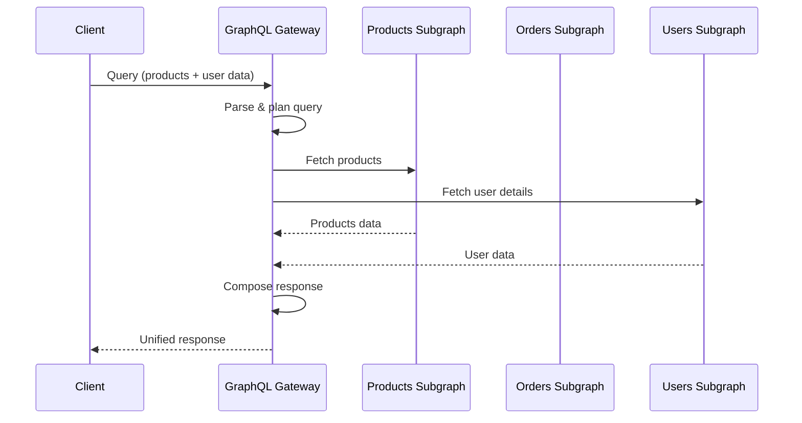
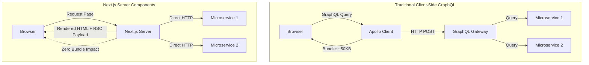
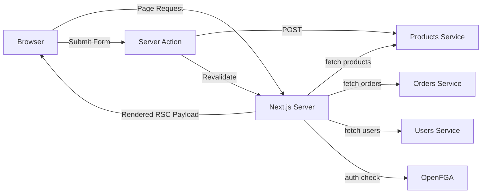
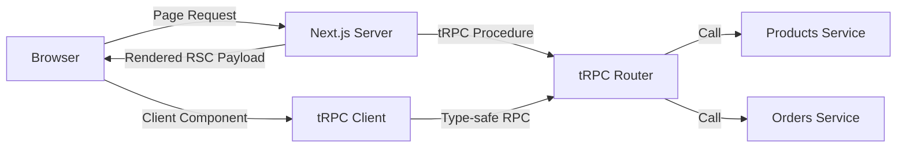
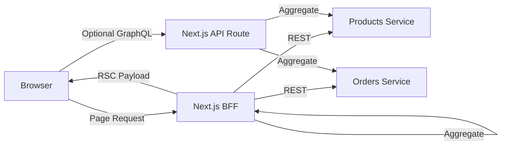
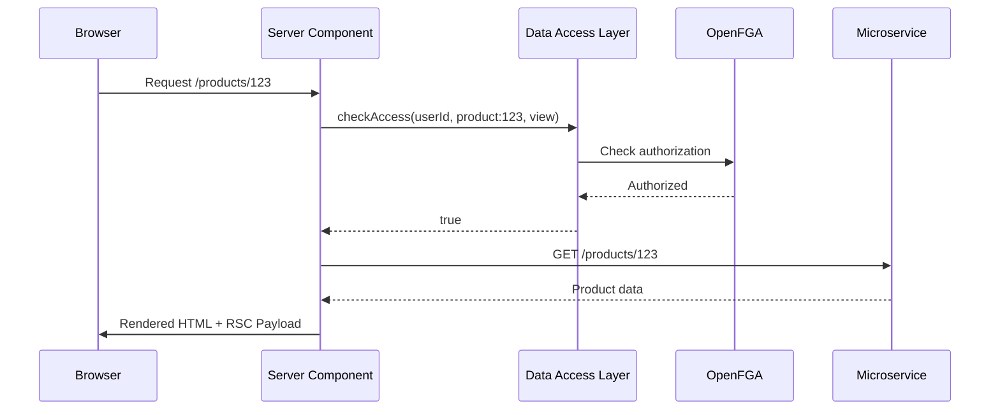

# GraphQL Federation vs Alternatives for Next.js BFF Architecture - Research

**Date**: 2025-10-23
**Status**: Research Complete

## Executive Summary

After comprehensive research into data fetching architectures for Next.js 16 with React Server Components, the evidence strongly suggests **moving away from GraphQL federation** to a **hybrid architecture combining Next.js Server Components with direct REST calls and Server Actions**. For your enterprise platform with 15+ packages and complex microservices, GraphQL federation introduces significant complexity that React Server Components now make largely unnecessary.

**Key Recommendation**: Eliminate client-side GraphQL (URQL) entirely, use Server Components for data fetching with direct REST/HTTP calls to microservices, implement Server Actions for mutations, and use OpenAPI + TypeScript code generation for end-to-end type safety across service boundaries.

## Technical Deep Dive

### Overview

React Server Components fundamentally change the data fetching paradigm in Next.js applications. Unlike traditional client-side architectures where GraphQL clients (like URQL or Apollo) manage data fetching, caching, and state management, Server Components enable direct server-side data access with zero client-side bundle impact. This architectural shift eliminates many use cases that originally justified GraphQL adoption.

### GraphQL Federation in Modern Context

GraphQL federation is a pattern for combining multiple GraphQL services (subgraphs) into a single unified API (supergraph) served through a gateway. While conceptually elegant, this architecture carries substantial operational overhead.

#### How GraphQL Federation Works



**Key Mechanisms**:
- **Schema Composition**: Gateway introspects all subgraphs and composes a unified schema
- **Query Planning**: Gateway decomposes client queries into subgraph-specific queries
- **Entity Resolution**: Subgraphs reference entities from other subgraphs using federation directives (`@key`, `@external`)
- **DataLoader Pattern**: Batching and caching prevent N+1 query problems

**Operational Complexity**:
- Every schema change requires gateway redeployment
- Cross-subgraph queries accumulate latency from multiple network hops
- Gateway becomes a single point of failure and performance bottleneck
- Debugging distributed queries is significantly more complex than REST calls

### React Server Components Architecture

React Server Components (RSC) execute on the server during request time, enabling direct access to databases, internal APIs, and microservices without exposing credentials or adding client-side bundle weight.

#### How Server Components Change Data Fetching



**Key Advantages**:
1. **Zero Client Bundle**: Data fetching logic lives entirely on the server
2. **Direct Access**: No intermediate gateway layer required
3. **Colocation**: Data fetching code sits next to the components that use it
4. **Automatic Deduplication**: Next.js automatically memoizes identical `fetch()` calls within a single render pass
5. **Streaming**: Progressive rendering with Suspense boundaries
6. **Type Safety**: When combined with OpenAPI/TypeScript codegen, full type safety without GraphQL overhead

#### Server Components Data Fetching Pattern

```typescript
// app/products/page.tsx - Server Component
import { productsApi } from '@/lib/api/products'

export default async function ProductsPage() {
  // Direct API call - runs on server only, zero client bundle
  const products = await productsApi.getAll()

  return (
    <div>
      {products.map(product => (
        <ProductCard key={product.id} product={product} />
      ))}
    </div>
  )
}
```

### Technology Stack / Ecosystem

For a Next.js RSC architecture without GraphQL federation, the recommended stack includes:

**Core Framework**:
- Next.js 16 with App Router
- React 19 with Server Components
- TypeScript for end-to-end type safety

**Data Fetching**:
- Native `fetch()` API with Next.js caching extensions
- `@hey-api/openapi-ts` or `openapi-typescript` for type generation from OpenAPI specs
- Optional: React Query/SWR for client-side data fetching in Client Components

**Mutations**:
- Server Actions for form submissions and data mutations
- API Routes for webhooks and external integrations

**Type Safety**:
- OpenAPI specifications from microservices
- Automated TypeScript SDK generation
- Zod for runtime validation

**Authorization**:
- OpenFGA SDK (`@openfga/sdk`) integrated in Server Components
- Data Access Layer (DAL) pattern for centralized auth checks

**Caching & Performance**:
- Next.js built-in Request Memoization
- ISR (Incremental Static Regeneration) for data revalidation
- React `cache()` for database/ORM queries

## Codebase Analysis

_Your codebase currently uses URQL for client-side GraphQL, which would be largely eliminated in the recommended architecture. Here's how patterns would translate:_

### Migration Patterns

#### Current Pattern (URQL Client-Side)
```typescript
// Current approach with URQL
'use client'
import { useQuery } from 'urql'

export function ProductList() {
  const [result] = useQuery({
    query: `
      query Products {
        products {
          id
          name
          price
        }
      }
    `
  })

  if (result.fetching) return <Loading />
  return <div>{/* render */}</div>
}
```

#### Recommended Pattern (Server Component)
```typescript
// New approach with Server Components
import { productsApi } from '@/lib/api/products'

export default async function ProductList() {
  const products = await productsApi.getAll()

  return (
    <Suspense fallback={<ProductListSkeleton />}>
      {products.map(p => <ProductCard key={p.id} product={p} />)}
    </Suspense>
  )
}
```

### Key Patterns & Conventions

#### API Client Generation Pattern

**File Structure**:
```
lib/
├── api/
│   ├── products.ts          # Generated from OpenAPI spec
│   ├── orders.ts             # Generated from OpenAPI spec
│   ├── users.ts              # Generated from OpenAPI spec
│   └── generated/            # Auto-generated types & clients
│       ├── products.types.ts
│       ├── orders.types.ts
│       └── users.types.ts
```

**Type-Safe API Client**:
```typescript
// lib/api/products.ts
import type { Product, ProductsResponse } from './generated/products.types'

export const productsApi = {
  async getAll(): Promise<Product[]> {
    const response = await fetch('https://products-service/api/products', {
      next: { revalidate: 3600 } // Cache for 1 hour
    })
    if (!response.ok) throw new Error('Failed to fetch products')
    return response.json()
  },

  async getById(id: string): Promise<Product> {
    const response = await fetch(`https://products-service/api/products/${id}`)
    if (!response.ok) throw new Error('Product not found')
    return response.json()
  }
}
```

#### Authorization Pattern with OpenFGA

```typescript
// lib/dal.ts - Data Access Layer
import { OpenFgaClient } from '@openfga/sdk'

export async function checkAccess(
  userId: string,
  resource: string,
  relation: 'view' | 'edit' | 'delete'
): Promise<boolean> {
  const fgaClient = new OpenFgaClient({
    apiUrl: process.env.FGA_API_URL,
  })

  const { allowed } = await fgaClient.check({
    user: `user:${userId}`,
    relation,
    object: resource,
  })

  return allowed
}

// app/products/[id]/page.tsx
import { checkAccess } from '@/lib/dal'
import { productsApi } from '@/lib/api/products'

export default async function ProductPage({ params }: { params: { id: string } }) {
  const userId = await getCurrentUserId() // from auth

  // Check authorization before fetching data
  const canView = await checkAccess(userId, `product:${params.id}`, 'view')
  if (!canView) {
    throw new Error('Unauthorized')
  }

  const product = await productsApi.getById(params.id)

  return <ProductDetails product={product} />
}
```

#### Server Actions for Mutations

```typescript
// app/products/actions.ts
'use server'

import { revalidatePath } from 'next/cache'
import { productsApi } from '@/lib/api/products'
import { checkAccess } from '@/lib/dal'

export async function createProduct(formData: FormData) {
  const userId = await getCurrentUserId()

  // Authorization check
  const canCreate = await checkAccess(userId, 'product:*', 'create')
  if (!canCreate) {
    return { error: 'Unauthorized' }
  }

  // Call microservice API
  const product = await productsApi.create({
    name: formData.get('name') as string,
    price: parseFloat(formData.get('price') as string),
  })

  // Revalidate cached data
  revalidatePath('/products')

  return { success: true, product }
}
```

### Architecture Layers

```
Presentation Layer:
├── app/products/page.tsx (Server Component)
├── app/products/[id]/page.tsx (Server Component)
└── components/ProductCard.tsx (Client Component for interactivity)

Business Logic:
├── lib/api/products.ts (API client)
├── lib/api/orders.ts (API client)
└── lib/dal.ts (Authorization logic)

Data Layer:
├── Microservices (Express servers)
├── MongoDB + Redis (via microservices)
└── OpenFGA (Authorization service)

External Services:
├── Products Microservice (port 3001)
├── Orders Microservice (port 3002)
└── Users/Permissions Service (Express)
```

### Critical Files to Review

1. **Current URQL setup** - Identify all `useQuery` and `useMutation` calls that need migration
2. **GraphQL schema files** - Extract types and convert to OpenAPI specs for microservices
3. **Authorization logic** - Review how OpenFGA is currently integrated and ensure it works in Server Components
4. **API client patterns** - Examine current REST API wrappers (if any) for reuse patterns

## Implementation Feasibility

### Benefits

**1. Dramatic Reduction in Complexity**
- Eliminates GraphQL gateway as a single point of failure
- No schema composition conflicts or deployment coordination issues
- Removes entire category of federation-specific bugs and operational overhead
- Source: "GraphQL Federation introduces significant complexity into the architecture...typically, only large organizations with platform teams, robust budgets, and a governing body tend to consider adopting this approach" [BrowserStack Guide]

**2. Improved Performance**
- Zero client-side bundle for data fetching (Apollo Client ~50KB, URQL ~25KB eliminated)
- Reduced latency by eliminating gateway hop (queries spanning multiple subgraphs can accumulate "a few hundred milliseconds" per service [DEV Community])
- Faster page loads through streaming and Suspense
- Next.js automatic request memoization prevents duplicate fetches in single render

**3. Superior Developer Experience**
- Collocated data fetching with components improves code readability
- Type-safe API calls without GraphQL code generation complexity
- Simpler debugging: direct HTTP calls vs distributed GraphQL query planning
- Faster iteration: no gateway redeployment on schema changes

**4. Better Caching Strategy**
- Next.js built-in caching with fetch() API (cache control, revalidation)
- Granular cache control per endpoint vs monolithic GraphQL cache
- ISR for time-based revalidation and on-demand revalidation via Server Actions
- React `cache()` for request-scoped deduplication

**5. Security & Authorization**
- Sensitive API keys and credentials never exposed to client
- OpenFGA authorization checks run server-side before data access
- Reduced attack surface (no public GraphQL introspection)

**6. Ecosystem Alignment**
- Vercel (Next.js creators) recommends Server Components for data fetching as the primary pattern
- React 19 `use` hook and Server Functions designed specifically for this architecture
- Industry trend toward RSC and away from heavy client-side data fetching libraries

### Trade-offs & Challenges

**1. Loss of GraphQL Query Flexibility**
- Clients cannot dynamically request specific fields
- Each data requirement needs a dedicated REST endpoint or careful endpoint design
- Mitigation: For enterprise internal use, specific endpoints are often preferable to overly flexible APIs

**2. Type Safety Requires Tooling**
- OpenAPI specifications must be maintained for all microservices
- TypeScript generation step adds build complexity
- Mitigation: Tools like `openapi-typescript` are mature and well-supported; one-time setup per service

**3. No Built-in Batching/DataLoader**
- REST doesn't natively batch requests like GraphQL DataLoader
- N+1 queries possible if not careful
- Mitigation: Server Components execute on server where N+1 is less problematic; can implement request batching if needed; Promise.all() for parallel fetching

**4. Migration Effort**
- Requires rewriting all URQL queries to Server Components or API calls
- Need to establish OpenAPI specs for all microservices
- Client Components still need data fetching strategy (props from Server Components or React Query)
- Estimated effort: 2-4 weeks for initial setup and patterns, then incremental migration

**5. Learning Curve**
- Team needs to understand Server Components vs Client Components boundary
- New patterns for mutations (Server Actions vs API routes)
- Caching strategies differ from GraphQL normalized cache
- Mitigation: Next.js documentation is excellent; patterns are simpler than GraphQL federation

### When to Use

**This Architecture is Ideal For:**
- Enterprise applications with Server-Side Rendering requirements
- Internal tools where API flexibility is less critical than maintainability
- TypeScript-first teams that value end-to-end type safety
- Applications migrating from client-heavy SPAs to modern RSC architecture
- Teams wanting to reduce operational complexity and infrastructure costs
- Monorepo architectures with multiple Next.js applications sharing type definitions

### When to Avoid

**GraphQL Federation Might Still Make Sense If:**
- You have multiple diverse client types (web, mobile native apps, third-party developers) requiring a unified, flexible API
- Public API access where clients need granular field selection
- Existing large GraphQL investment with dedicated platform team
- Real-time subscriptions are core requirement (GraphQL subscriptions not well-supported in RSC)
- Team expertise is heavily GraphQL-focused with limited TypeScript/REST experience

**For Your Specific Case**: With 15+ internal packages, microservices, and TypeScript adoption, the recommended architecture is strongly preferred over GraphQL federation.

## Implementation Options

### Option 1: Full Server Components with Direct REST Calls

**Description**: Eliminate GraphQL entirely. Use Server Components for all data fetching with direct HTTP calls to microservices, generate TypeScript types from OpenAPI specs, and use Server Actions for mutations.

**Architecture**:


**Pros**:
- Maximum simplicity - no GraphQL infrastructure
- Zero client-side bundle for data fetching
- Full control over caching per endpoint
- Easy to debug and monitor
- OpenAPI + TypeScript codegen provides end-to-end type safety
- Aligns with Vercel/Next.js recommendations

**Cons**:
- Requires OpenAPI specs for all microservices
- No query flexibility (must define endpoints for each use case)
- Migration effort to convert all URQL queries

**Complexity**: Medium

**Time Estimate**: 3-4 weeks (1 week setup + OpenAPI specs, 2-3 weeks migration)

**Reuses Patterns**: Yes - Your team already understands TypeScript, REST, and microservices

**When to Use**:
- Primary recommendation for your use case
- When you want maximum simplicity and maintainability
- When client-side bundle size matters
- When team is comfortable with TypeScript

**Example/Reference**:
- Next.js official documentation pattern
- Vercel's own production applications use this approach
- Cal.com (uses tRPC variant, similar philosophy)

### Option 2: Hybrid - Server Components + tRPC

**Description**: Use tRPC for end-to-end type safety without code generation. Server Components fetch data using tRPC procedures, providing automatic type inference from backend to frontend.

**Architecture**:


**Pros**:
- Seamless end-to-end type safety without code generation
- Better than GraphQL for TypeScript monorepos
- Production-proven (Cal.com, Netflix, others)
- Simpler than GraphQL federation
- Works well with Server Components

**Cons**:
- Additional abstraction layer (tRPC router)
- Not suitable if you need to expose public APIs
- Requires tRPC setup and learning curve
- Adds dependency on tRPC library

**Complexity**: Medium

**Time Estimate**: 2-3 weeks (1 week tRPC setup, 1-2 weeks migration)

**Reuses Patterns**: Partial - New pattern for the team

**When to Use**:
- When you want automatic type safety without OpenAPI specs
- When all clients are TypeScript-based
- When you prefer RPC-style calls over REST conventions
- When you have a TypeScript monorepo

**Example/Reference**:
- Cal.com architecture (250k LOC Next.js app)
- T3 Stack (Next.js + tRPC + Prisma)

### Option 3: Minimal GraphQL - Next.js BFF with Simplified Gateway

**Description**: Keep a lightweight GraphQL layer but simplify federation. Next.js acts as a BFF that aggregates microservices, but uses simpler GraphQL (not federation) or eliminates gateway entirely.

**Architecture**:


**Pros**:
- Smaller migration effort than full rewrite
- Retain some GraphQL benefits for specific use cases
- Gradual migration path from current architecture
- Can keep GraphQL for external clients, RSC for internal

**Cons**:
- Still maintains GraphQL complexity (just reduced)
- Two data fetching patterns to maintain
- Doesn't fully embrace RSC benefits
- Bundle size still includes GraphQL client for some components

**Complexity**: Medium-High

**Time Estimate**: 2-3 weeks (migration of federation to simpler setup)

**Reuses Patterns**: Yes - Team already knows GraphQL

**When to Use**:
- When you must maintain GraphQL for external API consumers
- When team is highly GraphQL-specialized
- As a transitional architecture toward full RSC

**Example/Reference**:
- WunderGraph BFF pattern
- Next.js API routes as aggregation layer

## Comparison Matrix

| Criteria                  | Option 1: Server Components + REST | Option 2: Server Components + tRPC | Option 3: Minimal GraphQL BFF | Current: GraphQL Federation |
|---------------------------|-------------------------------------|-------------------------------------|-------------------------------|------------------------------|
| **Complexity**            | Medium                              | Medium                              | Medium-High                   | High                         |
| **Maintainability**       | Excellent                           | Excellent                           | Good                          | Fair                         |
| **Performance**           | Excellent                           | Excellent                           | Good                          | Fair                         |
| **Learning Curve**        | Low                                 | Medium                              | Low                           | High                         |
| **Type Safety**           | Excellent (with OpenAPI)            | Excellent (automatic)               | Good                          | Good (with codegen)          |
| **Bundle Size**           | Minimal (~0KB)                      | Minimal (~15KB tRPC)                | Medium (~25-50KB)             | Large (~50KB+ Apollo/URQL)   |
| **Client Flexibility**    | Low                                 | Low                                 | High                          | High                         |
| **Debugging**             | Easy                                | Easy                                | Moderate                      | Difficult                    |
| **Operational Overhead**  | Low                                 | Low                                 | Medium                        | High                         |
| **Migration Effort**      | 3-4 weeks                           | 2-3 weeks                           | 2-3 weeks                     | N/A                          |
| **Public API Support**    | Good (REST)                         | Poor                                | Excellent                     | Excellent                    |
| **Caching Strategy**      | Next.js native                      | Next.js native                      | Mixed                         | GraphQL normalized cache     |
| **Real-time Support**     | Limited (SSE/webhooks)              | Limited (SSE)                       | Good (subscriptions)          | Good (subscriptions)         |
| **Reuses Patterns**       | Yes (REST, TypeScript)              | Partial (new RPC pattern)           | Yes (GraphQL)                 | Yes                          |
| **Ecosystem Support**     | Strong (Vercel-recommended)         | Growing (popular in Next.js)        | Mature                        | Mature                       |

## Implementation Approach

### Prerequisites & Requirements

**Required Tools & Versions**:
- Next.js 15+ (or 16 when available) with App Router
- React 19 with Server Components
- TypeScript 5.0+
- Node.js 18+
- pnpm (per project convention)

**Dependencies to Install**:
```json
{
  "dependencies": {
    "@openfga/sdk": "^0.3.0",
    "@hey-api/openapi-ts": "^0.45.0"
  },
  "devDependencies": {
    "openapi-typescript": "^6.7.0"
  }
}
```

**Knowledge/Skills Needed**:
- Understanding of Server Components vs Client Components
- Familiarity with async/await and Promises
- REST API design principles
- OpenAPI specification format
- Next.js caching and revalidation

**Environment Setup**:
- Microservices must expose OpenAPI specs (e.g., `/api/openapi.json`)
- OpenFGA instance configured and accessible
- Environment variables for service URLs

### Getting Started

**Step 1: Set Up OpenAPI Type Generation**

Create a script to generate TypeScript types from your microservices:

```json
// package.json
{
  "scripts": {
    "generate:types": "pnpm run generate:products && pnpm run generate:orders",
    "generate:products": "openapi-ts -i https://products-service/openapi.json -o ./lib/api/generated/products",
    "generate:orders": "openapi-ts -i https://orders-service/openapi.json -o ./lib/api/generated/orders"
  }
}
```

**Step 2: Create Type-Safe API Clients**

```typescript
// lib/api/products.ts
import type { Product } from './generated/products/types'

const PRODUCTS_SERVICE = process.env.PRODUCTS_SERVICE_URL

export const productsApi = {
  async getAll(): Promise<Product[]> {
    const res = await fetch(`${PRODUCTS_SERVICE}/products`, {
      next: { revalidate: 3600 } // Cache for 1 hour
    })
    if (!res.ok) throw new Error('Failed to fetch products')
    return res.json()
  },

  async getById(id: string): Promise<Product> {
    const res = await fetch(`${PRODUCTS_SERVICE}/products/${id}`)
    if (!res.ok) throw new Error('Product not found')
    return res.json()
  }
}
```

**Step 3: Implement Your First Server Component**

```typescript
// app/products/page.tsx
import { productsApi } from '@/lib/api/products'
import { Suspense } from 'react'

export default async function ProductsPage() {
  const products = await productsApi.getAll()

  return (
    <div>
      <h1>Products</h1>
      <Suspense fallback={<ProductsSkeleton />}>
        <ProductsList products={products} />
      </Suspense>
    </div>
  )
}

// components/ProductsList.tsx (Client Component for interactivity)
'use client'

export function ProductsList({ products }) {
  return (
    <div className="grid grid-cols-3 gap-4">
      {products.map(product => (
        <ProductCard key={product.id} product={product} />
      ))}
    </div>
  )
}
```

### Architecture & Design Considerations

**How to Structure the Implementation**:

```
app/
├── products/
│   ├── page.tsx                    # Server Component (data fetching)
│   ├── [id]/page.tsx               # Server Component (single product)
│   └── actions.ts                  # Server Actions (mutations)
├── orders/
│   ├── page.tsx
│   └── actions.ts
└── layout.tsx

components/
├── ProductCard.tsx                 # Client Component (interactive UI)
├── ProductForm.tsx                 # Client Component (form)
└── ui/                             # shadcn/ui components

lib/
├── api/
│   ├── products.ts                 # API client wrapper
│   ├── orders.ts                   # API client wrapper
│   └── generated/                  # Auto-generated from OpenAPI
│       ├── products/
│       │   ├── types.ts
│       │   └── schemas.ts
│       └── orders/
│           ├── types.ts
│           └── schemas.ts
├── dal.ts                          # Data Access Layer (auth)
└── utils.ts
```

**Key Design Decisions**:

1. **Server Component Default**: Make all new components Server Components by default; add `'use client'` only when needed for interactivity

2. **Collocate Data Fetching**: Fetch data in the component that needs it, not in parent layouts (unless truly shared)

3. **Parallel Fetching**: Use `Promise.all()` for parallel data fetching:
```typescript
export default async function Page() {
  const [products, categories] = await Promise.all([
    productsApi.getAll(),
    categoriesApi.getAll()
  ])
  // ...
}
```

4. **Authorization First**: Always check authorization before data fetching:
```typescript
export default async function ProductPage({ params }) {
  const userId = await getCurrentUserId()
  const canView = await checkAccess(userId, `product:${params.id}`, 'view')

  if (!canView) {
    return <UnauthorizedPage />
  }

  const product = await productsApi.getById(params.id)
  return <ProductDetails product={product} />
}
```

**Integration Points with Existing Codebase**:
- OpenFGA authorization checks integrated in DAL
- Existing Express permissions service called from Server Components
- MongoDB/Redis accessed through microservice APIs (not directly)
- Environment configuration using existing `@t3-oss/env-nextjs` setup

**Data Flow and State Management**:



**State Management**:
- **Server State**: Managed by Next.js caching (no additional library needed)
- **Client State**: Use React's `useState`/`useReducer` for UI state in Client Components
- **Global State**: If needed, use Zustand or Context API for Client Component state
- **No GraphQL Cache**: Eliminate normalized cache complexity

**Error Handling Strategy**:

```typescript
// lib/api/products.ts
export class APIError extends Error {
  constructor(
    message: string,
    public statusCode: number,
    public endpoint: string
  ) {
    super(message)
    this.name = 'APIError'
  }
}

export const productsApi = {
  async getAll(): Promise<Product[]> {
    try {
      const res = await fetch(`${PRODUCTS_SERVICE}/products`)

      if (!res.ok) {
        throw new APIError(
          'Failed to fetch products',
          res.status,
          '/products'
        )
      }

      return res.json()
    } catch (error) {
      // Log to monitoring service
      console.error('Products API error:', error)
      throw error
    }
  }
}

// app/products/page.tsx
export default async function ProductsPage() {
  try {
    const products = await productsApi.getAll()
    return <ProductsList products={products} />
  } catch (error) {
    if (error instanceof APIError) {
      return <ErrorPage statusCode={error.statusCode} message={error.message} />
    }
    throw error // Let Next.js error boundary handle it
  }
}
```

### Best Practices

**Recommended Patterns and Approaches**:

1. **Use Next.js Caching Extensions** [Next.js Docs]
```typescript
// Cache for 1 hour, revalidate in background
fetch(url, { next: { revalidate: 3600 } })

// Force dynamic (no caching)
fetch(url, { cache: 'no-store' })

// Cache indefinitely until manually revalidated
fetch(url, { next: { tags: ['products'] } })
```

2. **Implement Request Deduplication** [Next.js Docs]
```typescript
import { cache } from 'react'

// Deduplicate identical calls within a single request
export const getProduct = cache(async (id: string) => {
  const res = await fetch(`${PRODUCTS_SERVICE}/products/${id}`)
  return res.json()
})
```

3. **Use Streaming with Suspense** [Next.js Docs]
```typescript
export default async function Page() {
  return (
    <div>
      <Suspense fallback={<ProductsSkeleton />}>
        <ProductsList />
      </Suspense>

      <Suspense fallback={<ReviewsSkeleton />}>
        <ReviewsList />
      </Suspense>
    </div>
  )
}
```

**Performance Optimizations** [Vercel Blog]:

1. **Parallel Data Fetching**: Always use `Promise.all()` for independent data
2. **Streaming**: Break page into Suspense boundaries for progressive rendering
3. **ISR**: Use Incremental Static Regeneration for semi-static content
4. **Edge Runtime**: Consider Edge runtime for low-latency data fetching (for read-heavy routes)

**Security Considerations**:
- Never expose API keys or secrets to client (Server Components solve this)
- Always validate user authorization before data access
- Use environment variables for service URLs
- Implement rate limiting at API route level if needed
- Validate all inputs with Zod before sending to microservices

**Accessibility Considerations**:
- Ensure loading states have proper ARIA labels
- Maintain focus management during client-side navigation
- Use semantic HTML in Server Components
- Test with screen readers

**Testing Strategies**:

**Unit Test Approach**:
```typescript
// lib/api/products.spec.ts
import { describe, it, expect, vi } from 'vitest'
import { productsApi } from './products'

describe('productsApi', () => {
  it('should fetch all products', async () => {
    global.fetch = vi.fn(() =>
      Promise.resolve({
        ok: true,
        json: () => Promise.resolve([{ id: '1', name: 'Test' }])
      })
    ) as any

    const products = await productsApi.getAll()
    expect(products).toHaveLength(1)
    expect(products[0].name).toBe('Test')
  })
})
```

**Integration Test Approach**:
```typescript
// app/products/page.spec.tsx
import { describe, it, expect } from 'vitest'
import { render, screen } from '@testing-library/react'
import ProductsPage from './page'

// Mock API responses with MSW
describe('ProductsPage', () => {
  it('should render products list', async () => {
    const ProductsPageResolved = await ProductsPage()
    render(ProductsPageResolved)

    expect(screen.getByText('Products')).toBeInTheDocument()
  })
})
```

**Mocking Strategy**:
- Use MSW (Mock Service Worker) for HTTP mocking (per CLAUDE.md guidelines)
- Mock OpenFGA responses for authorization tests
- Avoid mocking internal functions; test with real implementations when possible

### Common Pitfalls & How to Avoid Them

**1. Fetching Data in Client Components** [Next.js Docs]
- **Pitfall**: Using `useEffect` to fetch in Client Components adds client-side bundle and waterfalls
- **Solution**: Fetch in Server Components and pass data as props; use Client Components only for interactivity

**2. Not Using Parallel Fetching**
- **Pitfall**: Sequential `await` calls create waterfalls
- **Solution**: Use `Promise.all()` for independent data:
```typescript
// Bad
const products = await productsApi.getAll()
const categories = await categoriesApi.getAll()

// Good
const [products, categories] = await Promise.all([
  productsApi.getAll(),
  categoriesApi.getAll()
])
```

**3. Over-Caching Static Data**
- **Pitfall**: Caching user-specific data causes stale data or security issues
- **Solution**: Use `cache: 'no-store'` for user-specific data, time-based revalidation for shared data

**4. Not Handling Authorization at Component Level** [Vercel Blog]
- **Pitfall**: Fetching data before checking authorization wastes resources and creates security risk
- **Solution**: Always check authorization first in Data Access Layer pattern

**5. Forgetting Error Boundaries**
- **Pitfall**: Errors in Server Components crash entire page
- **Solution**: Implement `error.tsx` files at route level and use try/catch for expected errors

**6. N+1 Queries in Server Components**
- **Pitfall**: Mapping over items and fetching data in loops
- **Solution**: Fetch all data in parent component before mapping, or implement batching

### Migration/Adoption Strategy

**Phase 1: Foundation (Week 1)**
- Set up OpenAPI type generation for one microservice (Products)
- Create API client wrapper pattern (`lib/api/products.ts`)
- Implement Data Access Layer with OpenFGA integration
- Migrate one simple page to Server Components (e.g., product list)
- Establish testing patterns

**Phase 2: Core Features (Weeks 2-3)**
- Migrate remaining microservices to OpenAPI + TypeScript generation
- Convert all product-related pages to Server Components
- Implement Server Actions for mutations
- Migrate order and user management pages
- Update authorization checks to use DAL pattern

**Phase 3: Refinement (Week 4)**
- Add comprehensive error handling
- Implement caching strategy (ISR, revalidation)
- Performance optimization (streaming, parallel fetching)
- Complete test coverage
- Remove URQL and GraphQL dependencies

**Rollback Strategy**:
- Keep GraphQL infrastructure in place during Phases 1-2
- Feature flag new Server Component pages vs old GraphQL pages
- Monitor performance and error rates
- Can revert individual pages to GraphQL if issues arise
- Only remove GraphQL dependencies after full migration success

## Alternatives Considered

### Alternative 1: Keep GraphQL Federation with RSC Integration

**Brief Description**: Maintain GraphQL federation but integrate it with Server Components, calling GraphQL from server-side instead of client.

**Why it wasn't chosen**:
- Retains all operational complexity of federation (gateway, schema composition, deployment coordination)
- Loses primary benefit of RSC (simplicity and zero-bundle fetching)
- Still requires maintaining GraphQL infrastructure
- No significant advantage over direct REST calls from Server Components

**When it might be better**:
- If you have external clients that absolutely require GraphQL
- If team expertise is exclusively GraphQL and retraining is not feasible
- If migration timeline is extremely constrained (though hybrid adds complexity)

### Alternative 2: Apollo Client with RSC

**Brief Description**: Use Apollo Client's experimental Next.js support (`@apollo/experimental-nextjs-app-support`) to integrate GraphQL with Server Components.

**Why it wasn't chosen**:
- Apollo Client bundle size (~50KB) still impacts client-side performance
- Experimental library with potential instability
- GraphQL normalized cache adds complexity for Server Component patterns
- Doesn't solve federation operational overhead
- Apollo's caching model designed for client-side, awkward fit for server-side

**When it might be better**:
- If you have existing Apollo Client investment and expertise
- If you need GraphQL subscriptions for real-time features
- If public GraphQL API is a hard requirement

### Alternative 3: Pure REST Without TypeScript Code Generation

**Brief Description**: Call REST APIs directly without OpenAPI specs or type generation, using manual TypeScript interfaces.

**Why it wasn't chosen**:
- Loses end-to-end type safety (types can drift from actual API)
- Manual maintenance burden for interface definitions
- No runtime validation
- Higher risk of bugs from API contract changes

**When it might be better**:
- For rapid prototyping or MVP
- When microservices don't expose OpenAPI specs and adding them is infeasible
- For very small projects with few API endpoints

## Debates & Open Questions

**Server Components vs Client Components Data Fetching**:
- The React team recommends fetching in Server Components whenever possible [Next.js Docs]
- Some developers prefer client-side fetching for perceived better UX (instant loading states)
- **Consensus**: Server Components provide better performance and security; use Suspense for loading states

**tRPC vs REST for Type Safety**:
- tRPC provides automatic inference without code generation [betterstack.com]
- REST + OpenAPI + codegen is more standard and flexible
- **Trade-off**: tRPC wins for pure TypeScript monorepos; REST wins for broader ecosystem compatibility

**Caching Strategy in RSC**:
- Next.js 15 changed default caching from aggressive to conservative (uncached by default) [Vercel Blog]
- Developers debate optimal cache duration and revalidation strategies
- **Open Question**: Best practices still emerging; recommend explicit cache control rather than relying on defaults

**Server Actions vs API Routes for Mutations**:
- Server Actions provide simpler DX and automatic type safety [Next.js Docs]
- API Routes offer more control and support for webhooks/external calls
- **Recommendation**: Use Server Actions for internal mutations, API Routes for webhooks/external integrations

**Migration Timing**:
- Should migration happen gradually (page-by-page) or big-bang?
- **Recommendation**: Gradual migration with feature flags reduces risk

## Recommendations

### Preferred Approach: Server Components + Direct REST + OpenAPI TypeScript Generation (Option 1)

**Should This Be Implemented?**: **Yes**

**Rationale**:

**Primary Reason**: GraphQL federation introduces significant operational complexity that React Server Components now make unnecessary. Your enterprise platform would benefit dramatically from eliminating the gateway layer, schema composition conflicts, and distributed query planning overhead.

**Secondary Reason**: Server Components align perfectly with Next.js 16's architecture and represent the industry's direction. Vercel (Next.js creators) explicitly recommends Server Components as the primary data fetching pattern, stating "fetch data on the server with Server Components whenever possible" [Next.js Docs]. This is not an experimental feature but the recommended production pattern.

**Alignment with Project Goals**:
- **TypeScript Adoption**: Your recent TypeScript adoption makes OpenAPI + codegen a natural fit
- **Microservices Architecture**: Direct REST calls simplify microservice integration vs federation
- **Performance**: Zero client-side bundle for data fetching significantly improves page load times
- **Maintainability**: Reduces infrastructure complexity from "High" to "Low"

**Why**:

**Cost/Benefit Analysis**:
- **Cost**: 3-4 weeks migration effort, OpenAPI spec creation for microservices, team learning curve for RSC patterns
- **Benefit**: Eliminate ~50KB client bundle (URQL), remove gateway infrastructure, simplify debugging, reduce latency by 100-300ms per request (no gateway hop), improve developer velocity

**Risk Assessment**:
- **Low Risk**: Next.js RSC is production-proven (used by Vercel, Cal.com, and thousands of production apps)
- **Gradual Migration**: Page-by-page rollout with feature flags minimizes disruption
- **Rollback Capability**: Can revert individual pages if issues arise

**Key Considerations**:

**1. OpenAPI Specification Management**:
- Each microservice must expose an OpenAPI spec (e.g., `/api/openapi.json`)
- Specs should be auto-generated from your Express TypeScript code (use `tsoa`, `express-openapi`, or similar)
- Include spec generation in CI/CD pipeline

**2. Team Training**:
- Invest 2-3 days in team training on Server Components vs Client Components
- Establish clear patterns for when to use each
- Document authorization flow with OpenFGA in Server Components

**3. Monitoring and Observability**:
- Implement structured logging for all API calls
- Add OpenTelemetry tracing to track request flow through microservices
- Monitor error rates during migration

**Potential Challenges**:

**1. OpenAPI Spec Creation**
- **Challenge**: Existing Express services may lack OpenAPI specs
- **Mitigation**: Use `tsoa` or `express-openapi` to auto-generate from TypeScript decorators; allocate 2-3 days per service
- **Fallback**: Manually create specs for services that can't auto-generate (use Swagger Editor)

**2. Client Component Data Needs**
- **Challenge**: Some Client Components may need to fetch data (e.g., infinite scroll, search)
- **Mitigation**: Pass data from Server Component as props when possible; use React Query for truly client-driven fetching; use Server Actions for mutations
- **Fallback**: Implement API routes for specific client-side fetching needs

**3. Real-Time Features**
- **Challenge**: GraphQL subscriptions won't be available
- **Mitigation**: Use Server-Sent Events (SSE) or WebSockets for real-time updates; implement polling for less critical real-time data
- **Fallback**: Keep minimal GraphQL endpoint specifically for subscriptions if absolutely required

**Success Criteria**:

**Implementation Success Metrics**:
- All product-facing pages migrated to Server Components within 4 weeks
- URQL and Apollo Client dependencies removed from client bundle
- Client-side JavaScript bundle reduced by at least 40KB
- Page load time (FCP) improved by at least 20%
- Zero regression in authorization checks (OpenFGA integration working correctly)

**Operational Success Metrics**:
- API response times remain stable or improve (no gateway latency)
- Error rates remain below 0.5%
- Developer velocity increases (measured by feature delivery time)
- Team satisfaction with new patterns (post-migration survey)

**Long-Term Success Indicators**:
- Reduced infrastructure costs (no GraphQL gateway to maintain)
- Faster onboarding for new developers (simpler architecture)
- Higher test coverage (easier to test REST calls than GraphQL queries)
- Improved debugging time (direct HTTP calls vs distributed queries)

## Additional Notes

### Framework Compatibility

Next.js 16 (when released) will likely include further optimizations for Server Components and may introduce new patterns. The recommended architecture is forward-compatible and aligns with React's long-term vision.

### Edge Cases to Consider

**1. File Uploads**: Server Actions support FormData for file uploads; implement progress tracking with Client Components if needed

**2. Optimistic Updates**: Use React's `useOptimistic` hook in Client Components for immediate UI feedback before Server Action completes

**3. Infinite Scroll**: Implement with React Query in Client Component or Server Actions with pagination

**4. Search/Filtering**: Use URL search params with Server Components for SEO-friendly filtering; client-side filtering for instant feedback

### Future Enhancements

**Potential Future Additions**:
- **Edge Runtime**: Move latency-critical routes to Edge runtime for global low-latency
- **Partial Prerendering (PPR)**: Next.js experimental feature for mixing static and dynamic content
- **Server Functions**: React 19's evolution of Server Actions for more flexible server-side operations
- **Streaming with Suspense**: More granular control as React 19 matures

### Community Resources

**Learning Resources**:
- Next.js official docs: https://nextjs.org/docs/app/building-your-application/data-fetching
- Lee Robinson's Next.js tutorials: https://leerob.io
- Vercel's Server Components guide: https://vercel.com/blog/understanding-react-server-components
- OpenAPI TypeScript tools: https://openapi-ts.dev

**Support**:
- Next.js Discord: Active community for troubleshooting
- Vercel Support: Available if deploying on Vercel
- GitHub Discussions: Next.js repo has extensive Q&A

## Sources

1. [Next.js Data Fetching Patterns and Best Practices](https://nextjs.org/docs/app/building-your-application/data-fetching/patterns) - Official Next.js documentation (2024)
2. [GraphQL Federation Guide](https://www.browserstack.com/guide/graphql-federation) - BrowserStack (2024)
3. [Hidden Complexities of Scaling GraphQL Federation](https://dev.to/hackmamba/hidden-complexities-of-scaling-graphql-federation-and-how-to-fix-them-2peg) - DEV Community (2024)
4. [tRPC vs GraphQL: Choosing the Right Tool](https://betterstack.com/community/guides/scaling-nodejs/trpc-vs-graphql/) - Better Stack (2024)
5. [Do I Need GraphQL Now that We Have React Server Components?](https://hackteam.io/blog/do-need-graphql-now-react-server-components/) - Hackteam.io (2024)
6. [The Backend-for-Frontend Pattern Using Next.js](https://wundergraph.com/blog/the-backend-for-frontend-pattern-using-nextjs) - WunderGraph (2024)
7. [Using Apollo Client with Next.js 13](https://www.apollographql.com/blog/how-to-use-apollo-client-with-next-js-13) - Apollo GraphQL Blog (2023)
8. [React Trends in 2025](https://www.robinwieruch.de/react-trends/) - Robin Wieruch (2024)
9. [Server Actions vs API Routes in Next.js](https://www.pronextjs.dev/should-i-use-server-actions-or-apis) - ProNextJS (2024)
10. [Securing Data in Next.js with Okta and OpenFGA](https://vercel.com/blog/securing-data-in-your-next-js-app-with-okta-and-openfga) - Vercel Blog (2024)
11. [OpenAPI TypeScript Generation Tools Comparison](https://www.speakeasy.com/docs/languages/typescript/oss-comparison-ts) - Speakeasy (2024)
12. [Cal.com Tech Stack](https://github.com/calcom/cal.com) - GitHub (2024)
13. [Next.js App Router Data Fetching](https://vercel.com/blog/nextjs-app-router-data-fetching) - Vercel Blog (2024)
14. [GraphQL N+1 Problem and DataLoader](https://wundergraph.com/blog/dataloader_3_0_breadth_first_data_loading) - WunderGraph (2024)
15. [Next.js Caching and Revalidation](https://nextjs.org/docs/app/getting-started/caching-and-revalidating) - Next.js Documentation (2024)
16. [Building Type-Safe APIs with TypeScript and OpenAPI](https://medium.com/@AlexanderObregon/building-type-safe-apis-with-typescript-and-openapi-1f78b4b94ee4) - Medium (2024)
17. [Enterprise Next.js Performance Techniques](https://dev.to/jdavissoftware/enterprise-react-performance-techniques-in-2025-and-the-patterns-that-will-shape-the-future-48nc) - DEV Community (2025)
18. [Next.js 15 and React 19 Data Fetching](https://www.npmix.com/blog/mastering-data-fetching-in-nextjs-15-react-19-with-the-use-hook) - Npmix (2024)
