# TanStack Query with GraphQL - Technical Deep Dive

**Date**: 2025-11-20
**Status**: Research Complete

## Executive Summary

TanStack Query (React Query v5) represents a fundamentally different architectural approach to GraphQL data management compared to URQL and Apollo Client. While Apollo/URQL are GraphQL-specific clients with built-in caching strategies, TanStack Query is a **backend-agnostic async state manager** that treats GraphQL as just another Promise-based data source.

**Key Decision Factors:**

- **Choose TanStack Query** when: You value simplicity, need REST+GraphQL hybrid, don't require normalized caching, want smaller bundles (~20KB savings), and prefer explicit cache control
- **Choose Apollo Client** when: You need normalized caching, have complex entity relationships across queries, require real-time GraphQL subscriptions with tight integration, or have a GraphQL-only backend
- **Choose URQL** when: You want GraphQL-specific features with smaller bundle than Apollo (12KB), need flexibility to add normalized caching optionally, or prefer simpler APIs than Apollo

**Migration Recommendation**: For experienced React developers with URQL document caching, migrating to TanStack Query is **low-risk and high-reward** for greenfield projects. The mental model shift from GraphQL-centric to query-centric thinking is straightforward, and the improved DevTools, bundle size, and ecosystem justify the investment.

## Technical Deep Dive

### Overview

TanStack Query is a **server-state management library** built on Promises. Unlike GraphQL-specific clients, it doesn't care about your backend technology—it simply manages asynchronous data fetching, caching, synchronization, and updates. When combined with a minimal GraphQL client (like `graphql-request`) and GraphQL Code Generator, it provides fully-typed GraphQL operations with excellent developer experience.

The core philosophy: **Separate concerns**—fetching is handled by a dedicated GraphQL client, while caching and state management are handled by TanStack Query.

### Architecture Comparison

#### TanStack Query Architecture

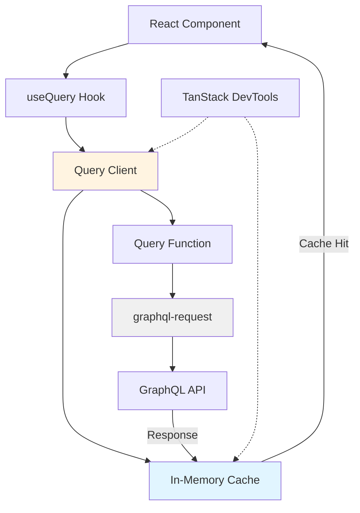

**Key Characteristics:**
- **Query Keys**: Hierarchical arrays that uniquely identify cached data (e.g., `['posts', { userId: 1 }]`)
- **Document-based Cache**: Each unique query+variables combination creates a separate cache entry
- **Stale-While-Revalidate**: Returns cached data immediately, refetches in background based on `staleTime`
- **Garbage Collection**: Inactive queries are removed after `gcTime` (default: 5 minutes)

#### Apollo Client Architecture

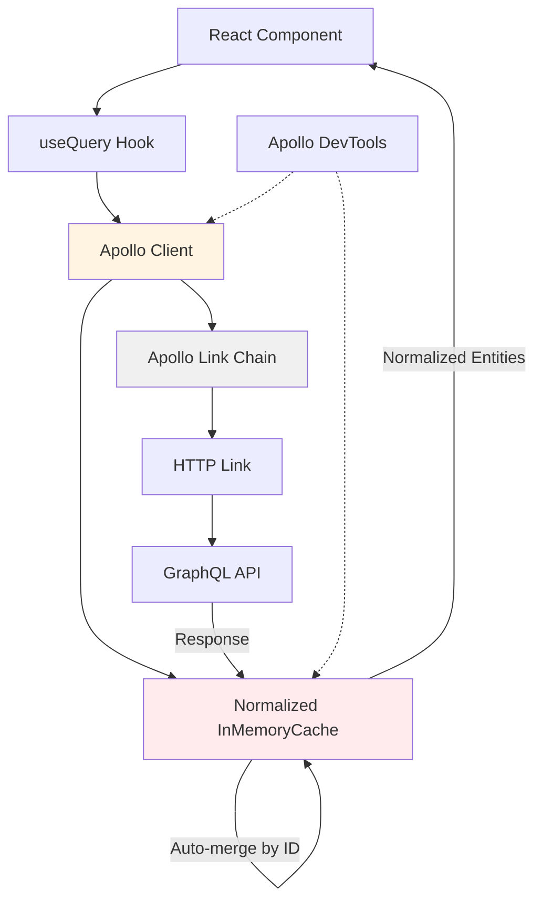

**Key Characteristics:**
- **Normalized Cache**: Entities stored by `__typename:id`, enabling automatic updates across queries
- **Automatic Cache Updates**: Mutations can automatically update related queries through normalization
- **Link Chain**: Middleware-style architecture for request/response processing
- **Built-in Subscriptions**: First-class WebSocket support

#### URQL Architecture

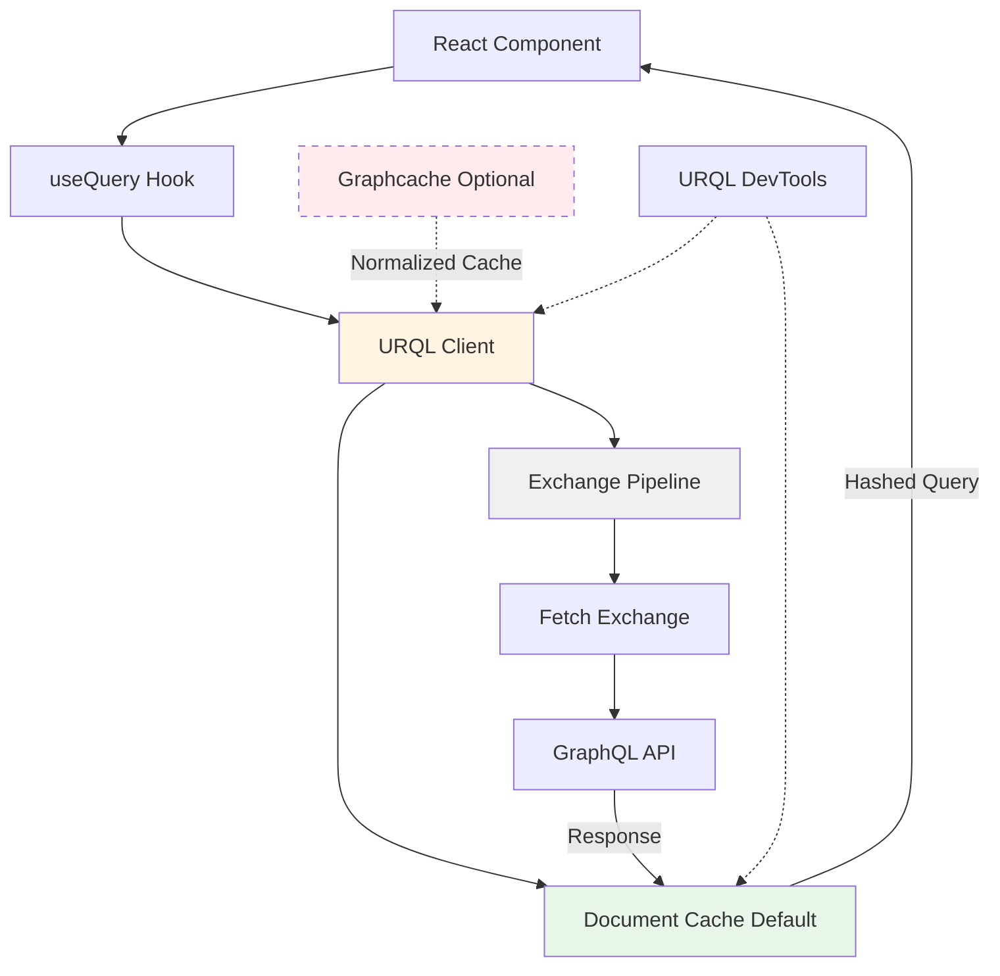

**Key Characteristics:**
- **Document Cache (Default)**: Hashes query+variables, similar to TanStack Query approach
- **Exchange System**: Composable middleware for extending functionality
- **Optional Normalization**: Add `@urql/exchange-graphcache` for normalized caching when needed
- **Lightweight**: 12KB base bundle, smallest of the three

### Caching Deep Dive

#### TanStack Query Caching Model

TanStack Query implements a **query-based caching** strategy with stale-while-revalidate semantics.

**Cache Structure:**
```typescript
// Internal cache representation (conceptual)
{
  'posts-list-all': {
    data: [...],
    dataUpdatedAt: 1637012345678,
    error: null,
    errorUpdatedAt: 0,
    fetchStatus: 'idle',
    status: 'success',
    state: 'fresh' | 'stale'
  },
  'posts-detail-123': {
    data: { id: 123, ... },
    // ...
  }
}
```

**Query Keys as Cache Keys:**
```typescript
// Simple key
useQuery({ queryKey: ['posts'] })

// With parameters - creates unique cache entry
useQuery({ queryKey: ['posts', { status: 'published' }] })

// Hierarchical - enables partial invalidation
useQuery({ queryKey: ['posts', 'list', { userId: 1 }] })
```

**Stale-While-Revalidate Pattern:**

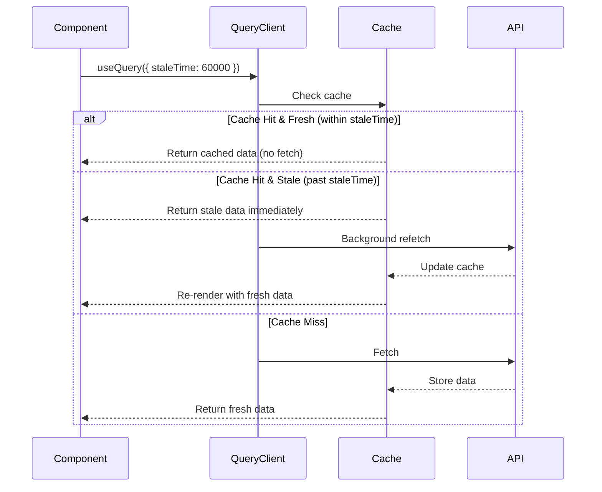

**Configuration Options:**
- `staleTime`: How long data is considered fresh (default: 0 = immediately stale)
- `gcTime` (formerly `cacheTime`): How long inactive queries remain in cache (default: 5 minutes)
- `refetchOnMount`, `refetchOnWindowFocus`, `refetchOnReconnect`: Automatic background refetching

**Cache Invalidation:**
```typescript
// Invalidate all posts queries
queryClient.invalidateQueries({ queryKey: ['posts'] })

// Invalidate exact match
queryClient.invalidateQueries({ queryKey: ['posts', { id: 123 }], exact: true })

// Update cache directly
queryClient.setQueryData(['posts', { id: 123 }], (old) => ({
  ...old,
  title: 'Updated Title'
}))
```

#### Apollo Client Normalized Cache

Apollo's **normalized cache** stores entities in a flat structure, enabling automatic updates across queries.

**Normalization Process:**

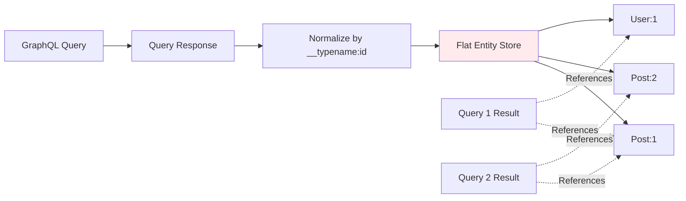

**Cache Structure:**
```typescript
// Normalized cache (conceptual)
{
  'Post:1': {
    __typename: 'Post',
    id: 1,
    title: 'Hello World',
    author: { __ref: 'User:1' }
  },
  'User:1': {
    __typename: 'User',
    id: 1,
    name: 'John Doe'
  },
  'ROOT_QUERY': {
    'posts({"status":"published"})': [
      { __ref: 'Post:1' },
      { __ref: 'Post:2' }
    ]
  }
}
```

**Automatic Cache Updates:**
When you update `Post:1` via mutation, **all queries** that reference `Post:1` automatically update.

**Memory Considerations:**
- **Overhead**: Each entity stored once, but requires reference tracking
- **Complexity**: CPU cost during read operations to reconstruct query results
- **Memory Leaks**: Apollo 3.9 addressed memory leaks in memoization caches
- **Large Datasets**: 7,000+ entities can cause performance degradation

**When Normalization Fails:**
- Entities without `id` or `_id` fields (requires custom `keyFields`)
- Embedded objects vs. separate entities
- Polymorphic types need explicit type policies

#### URQL Document Cache vs. Graphcache

**Default Document Cache:**
```typescript
// Cache key: hash(query + variables)
const cacheKey = hash(`
  query GetPosts($status: String!) {
    posts(status: $status) { id title }
  }
` + JSON.stringify({ status: 'published' }))
```

**Characteristics:**
- **Simple**: No normalization overhead
- **Memory**: Duplicates entities across queries
- **Updates**: Requires manual refetching or invalidation
- **Performance**: Fast reads, but more network requests after mutations

**URQL Graphcache (Normalized):**
Similar to Apollo's approach but:
- Requires separate package: `@urql/exchange-graphcache`
- More explicit configuration
- Smaller bundle than Apollo normalized cache
- Better performance than Apollo in some benchmarks (10% slower than Apollo in others)

#### Comparative Analysis

| Aspect | TanStack Query | Apollo Client | URQL Document | URQL Graphcache |
|--------|----------------|---------------|---------------|-----------------|
| **Cache Strategy** | Query-based | Entity-based | Query-based | Entity-based |
| **Normalization** | ❌ No | ✅ Automatic | ❌ No | ✅ Manual Config |
| **Memory Efficiency** | Medium | High Overhead | Highest (duplicates) | Medium |
| **Read Performance** | Fast | Slower (reconstruction) | Fastest | Medium |
| **Write Performance** | Fast | Slowest (normalization) | Fast | Medium |
| **Auto-Updates** | Manual | Automatic | Manual | Automatic |
| **Bundle Size** | ~13KB | ~31KB | ~12KB | ~20KB |
| **Learning Curve** | Low | High | Low | Medium |

**When Each Caching Strategy Excels:**

**TanStack Query (Query-based):**
- ✅ Independent queries with minimal overlap
- ✅ REST + GraphQL hybrid applications
- ✅ Content-heavy applications (blogs, documentation)
- ✅ Explicit, predictable cache invalidation patterns
- ❌ Shared entities across many queries requiring consistency

**Apollo Normalized:**
- ✅ Complex entity relationships
- ✅ Same entity appears in multiple queries
- ✅ Real-time updates across application
- ✅ Large applications with interconnected data
- ❌ Simple CRUD applications
- ❌ Bundle size is critical concern

**URQL Document:**
- ✅ Content-heavy pages with minimal mutations
- ✅ Smallest bundle size critical
- ✅ Simple applications
- ❌ Frequent mutations affecting multiple queries

**Memory Efficiency Comparison:**

For a typical application fetching 1000 posts across 10 different queries:

- **TanStack Query**: ~10MB (1000 posts × 10 queries = duplicates)
- **Apollo Normalized**: ~2MB (1000 unique posts + reference overhead)
- **URQL Document**: ~10MB (same as TanStack Query)
- **URQL Graphcache**: ~2MB (similar to Apollo)

However, Apollo/Graphcache pay CPU cost during read operations to reconstruct results.

### GraphQL Integration Patterns

#### Basic Setup with graphql-request

**Installation:**
```bash
pnpm add @tanstack/react-query graphql-request graphql
```

**GraphQL Client Setup:**
```typescript
// lib/graphql-client.ts
import { GraphQLClient } from 'graphql-request'

export const graphqlClient = new GraphQLClient(
  process.env.GRAPHQL_ENDPOINT,
  {
    headers: {
      'Content-Type': 'application/json',
    },
  }
)

// For authenticated requests
export function getAuthenticatedClient(token: string) {
  return new GraphQLClient(process.env.GRAPHQL_ENDPOINT, {
    headers: {
      Authorization: `Bearer ${token}`,
    },
  })
}
```

**Basic Query Pattern:**
```typescript
// queries/posts.ts
import { graphqlClient } from '@/lib/graphql-client'
import { useQuery } from '@tanstack/react-query'
import { graphql } from '@/gql' // Generated by GraphQL Code Generator

const GetPostsDocument = graphql(`
  query GetPosts($status: String!) {
    posts(status: $status) {
      id
      title
      author {
        id
        name
      }
    }
  }
`)

export function usePosts(status: string) {
  return useQuery({
    queryKey: ['posts', { status }],
    queryFn: async () =>
      graphqlClient.request(GetPostsDocument, { status }),
  })
}
```

**Using in Components:**
```typescript
// components/PostsList.tsx
function PostsList() {
  const { data, isLoading, error } = usePosts('published')

  if (isLoading) return <Skeleton />
  if (error) return <Error error={error} />

  return (
    <ul>
      {data.posts.map(post => (
        <li key={post.id}>{post.title} by {post.author.name}</li>
      ))}
    </ul>
  )
}
```

#### Query Factory Pattern (Recommended)

Use the `queryOptions` helper for type-safe, reusable query definitions:

```typescript
// queries/posts.ts
import { queryOptions } from '@tanstack/react-query'

export const postsQueries = {
  all: () => ['posts'] as const,
  lists: () => [...postsQueries.all(), 'list'] as const,
  list: (filters: { status?: string; userId?: number }) =>
    queryOptions({
      queryKey: [...postsQueries.lists(), filters] as const,
      queryFn: () =>
        graphqlClient.request(GetPostsDocument, filters),
    }),
  details: () => [...postsQueries.all(), 'detail'] as const,
  detail: (id: number) =>
    queryOptions({
      queryKey: [...postsQueries.details(), id] as const,
      queryFn: () =>
        graphqlClient.request(GetPostDocument, { id }),
    }),
}

// Usage with full type inference
function PostsList({ status }: { status: string }) {
  const { data } = useQuery(postsQueries.list({ status }))
  // data is fully typed!
}

// Prefetching
function prefetchPosts(status: string) {
  queryClient.prefetchQuery(postsQueries.list({ status }))
}

// Invalidation
function invalidateAllPosts() {
  queryClient.invalidateQueries({ queryKey: postsQueries.all() })
}
```

#### Mutation Patterns

**Basic Mutation:**
```typescript
// mutations/posts.ts
import { useMutation, useQueryClient } from '@tanstack/react-query'
import { postsQueries } from '@/queries/posts'

const CreatePostDocument = graphql(`
  mutation CreatePost($input: CreatePostInput!) {
    createPost(input: $input) {
      id
      title
      status
    }
  }
`)

export function useCreatePost() {
  const queryClient = useQueryClient()

  return useMutation({
    mutationFn: (input: CreatePostInput) =>
      graphqlClient.request(CreatePostDocument, { input }),
    onSuccess: (data) => {
      // Invalidate and refetch posts list
      queryClient.invalidateQueries({
        queryKey: postsQueries.lists()
      })

      // Optimistically add to cache
      queryClient.setQueryData(
        postsQueries.detail(data.createPost.id).queryKey,
        data.createPost
      )
    },
  })
}

// Usage
function CreatePostForm() {
  const createPost = useCreatePost()

  const handleSubmit = (values: CreatePostInput) => {
    createPost.mutate(values, {
      onSuccess: () => {
        toast.success('Post created!')
      },
      onError: (error) => {
        toast.error(error.message)
      },
    })
  }

  return (
    <form onSubmit={handleSubmit}>
      {/* form fields */}
      <button disabled={createPost.isPending}>
        {createPost.isPending ? 'Creating...' : 'Create Post'}
      </button>
    </form>
  )
}
```

**Optimistic Updates:**

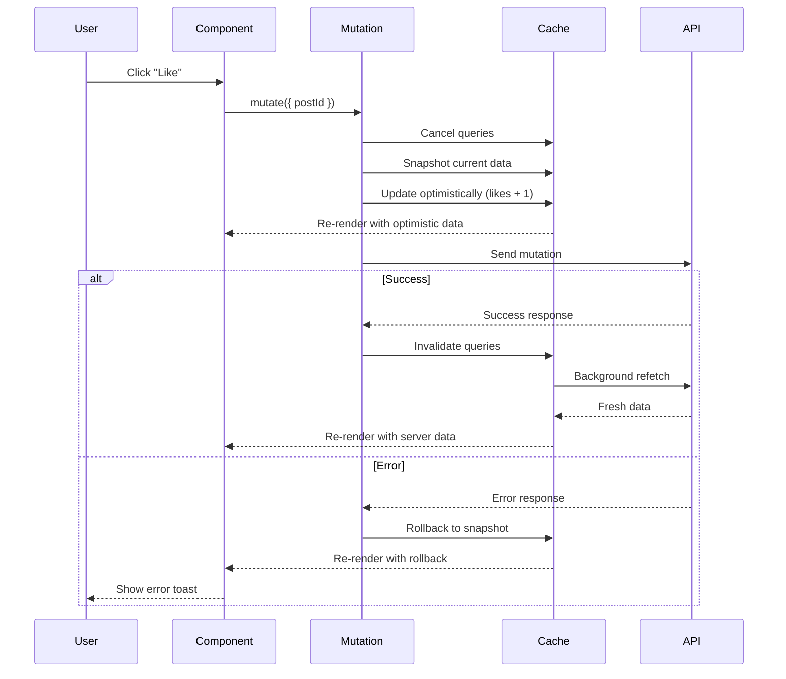

```typescript
// mutations/posts.ts
const LikePostDocument = graphql(`
  mutation LikePost($postId: ID!) {
    likePost(postId: $postId) {
      id
      likes
    }
  }
`)

type Post = { id: string; likes: number; /* ... */ }

export function useLikePost() {
  const queryClient = useQueryClient()

  return useMutation({
    mutationFn: (postId: string) =>
      graphqlClient.request(LikePostDocument, { postId }),

    // Before mutation runs
    onMutate: async (postId) => {
      // Cancel any outgoing refetches (prevent overwrite)
      await queryClient.cancelQueries({
        queryKey: postsQueries.detail(postId)
      })

      // Snapshot previous value
      const previousPost = queryClient.getQueryData<Post>(
        postsQueries.detail(postId).queryKey
      )

      // Optimistically update cache
      queryClient.setQueryData<Post>(
        postsQueries.detail(postId).queryKey,
        (old) => old ? { ...old, likes: old.likes + 1 } : old
      )

      // Return context with snapshot for rollback
      return { previousPost }
    },

    // On error, rollback
    onError: (err, postId, context) => {
      if (context?.previousPost) {
        queryClient.setQueryData(
          postsQueries.detail(postId).queryKey,
          context.previousPost
        )
      }
    },

    // Always refetch after error or success
    onSettled: (data, error, postId) => {
      queryClient.invalidateQueries({
        queryKey: postsQueries.detail(postId)
      })
    },
  })
}
```

**Concurrent Optimistic Updates (Advanced):**

When multiple mutations can occur simultaneously (e.g., rapid likes/unlikes):

```typescript
export function useLikePost() {
  const queryClient = useQueryClient()

  return useMutation({
    mutationKey: ['posts', 'like'], // Tag mutations for tracking
    mutationFn: (postId: string) =>
      graphqlClient.request(LikePostDocument, { postId }),
    onMutate: async (postId) => {
      await queryClient.cancelQueries({
        queryKey: postsQueries.detail(postId)
      })
      const previousPost = queryClient.getQueryData<Post>(
        postsQueries.detail(postId).queryKey
      )
      queryClient.setQueryData<Post>(
        postsQueries.detail(postId).queryKey,
        (old) => old ? { ...old, likes: old.likes + 1 } : old
      )
      return { previousPost }
    },
    onError: (err, postId, context) => {
      if (context?.previousPost) {
        queryClient.setQueryData(
          postsQueries.detail(postId).queryKey,
          context.previousPost
        )
      }
    },
    onSettled: (data, error, postId) => {
      // Only invalidate if no other mutations are in-flight
      // When this mutation settles, it's still "in progress", so count === 1
      if (queryClient.isMutating({ mutationKey: ['posts', 'like'] }) === 1) {
        queryClient.invalidateQueries({
          queryKey: postsQueries.detail(postId)
        })
      }
    },
  })
}
```

This prevents race conditions where the first mutation's invalidation refetches data, overwriting the second mutation's optimistic update.

#### Pagination Patterns

**Offset-Based Pagination:**
```typescript
const GetPostsDocument = graphql(`
  query GetPosts($limit: Int!, $offset: Int!) {
    posts(limit: $limit, offset: $offset) {
      id
      title
    }
    postsCount
  }
`)

export function usePostsPaginated(page: number, pageSize = 10) {
  return useQuery({
    queryKey: ['posts', 'paginated', { page, pageSize }],
    queryFn: () =>
      graphqlClient.request(GetPostsDocument, {
        limit: pageSize,
        offset: page * pageSize,
      }),
    placeholderData: (previousData) => previousData, // Keep previous data while fetching
  })
}

// Usage
function PostsTable() {
  const [page, setPage] = useState(0)
  const { data, isPlaceholderData } = usePostsPaginated(page)

  // Prefetch next page
  const queryClient = useQueryClient()
  useEffect(() => {
    if (!isPlaceholderData && data) {
      queryClient.prefetchQuery({
        queryKey: ['posts', 'paginated', { page: page + 1, pageSize: 10 }],
        queryFn: () =>
          graphqlClient.request(GetPostsDocument, {
            limit: 10,
            offset: (page + 1) * 10,
          }),
      })
    }
  }, [data, isPlaceholderData, page, queryClient])

  return (
    <>
      <Table data={data.posts} opacity={isPlaceholderData ? 0.5 : 1} />
      <Pagination
        page={page}
        onPageChange={setPage}
        hasMore={(page + 1) * 10 < data.postsCount}
      />
    </>
  )
}
```

**Cursor-Based Pagination (Relay-Style):**

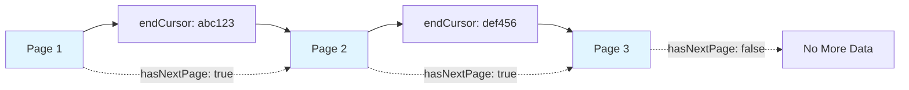

```typescript
const GetPostsConnectionDocument = graphql(`
  query GetPostsConnection($first: Int!, $after: String) {
    posts(first: $first, after: $after) {
      edges {
        node {
          id
          title
          createdAt
        }
        cursor
      }
      pageInfo {
        hasNextPage
        endCursor
      }
    }
  }
`)

export function usePostsInfinite() {
  return useInfiniteQuery({
    queryKey: ['posts', 'infinite'],
    queryFn: ({ pageParam }) =>
      graphqlClient.request(GetPostsConnectionDocument, {
        first: 10,
        after: pageParam,
      }),
    initialPageParam: undefined as string | undefined,
    getNextPageParam: (lastPage) =>
      lastPage.posts.pageInfo.hasNextPage
        ? lastPage.posts.pageInfo.endCursor
        : undefined,
  })
}

// Usage
function InfinitePostsList() {
  const {
    data,
    fetchNextPage,
    hasNextPage,
    isFetchingNextPage,
  } = usePostsInfinite()

  return (
    <>
      {data?.pages.map((page, i) => (
        <Fragment key={i}>
          {page.posts.edges.map(({ node }) => (
            <PostCard key={node.id} post={node} />
          ))}
        </Fragment>
      ))}

      {hasNextPage && (
        <button
          onClick={() => fetchNextPage()}
          disabled={isFetchingNextPage}
        >
          {isFetchingNextPage ? 'Loading...' : 'Load More'}
        </button>
      )}
    </>
  )
}

// Virtualized infinite scroll
import { useInView } from 'react-intersection-observer'

function InfiniteScrollPosts() {
  const { data, fetchNextPage, hasNextPage, isFetchingNextPage } =
    usePostsInfinite()
  const { ref, inView } = useInView()

  useEffect(() => {
    if (inView && hasNextPage && !isFetchingNextPage) {
      fetchNextPage()
    }
  }, [inView, hasNextPage, isFetchingNextPage, fetchNextPage])

  return (
    <>
      {data?.pages.map((page, i) => (
        <Fragment key={i}>
          {page.posts.edges.map(({ node }) => (
            <PostCard key={node.id} post={node} />
          ))}
        </Fragment>
      ))}

      {hasNextPage && <div ref={ref}>Loading more...</div>}
    </>
  )
}
```

**Important Note on Refetching:**
When an infinite query becomes stale and needs refetching, TanStack Query refetches **all pages sequentially** starting from the first. This ensures stale cursors aren't used even if underlying data was mutated.

#### Dependent Queries

**Serial Queries (Waterfall):**

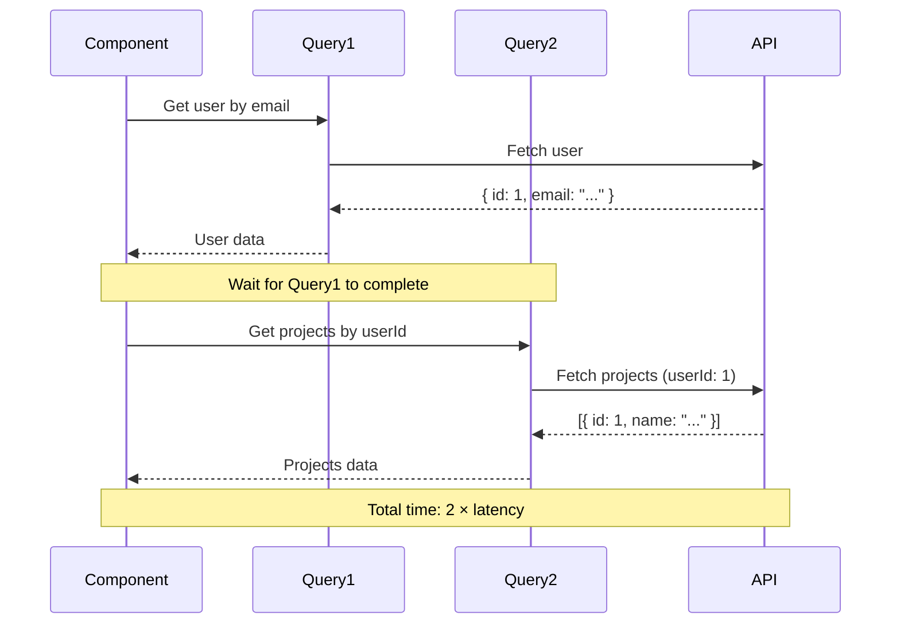

```typescript
const GetUserByEmailDocument = graphql(`
  query GetUserByEmail($email: String!) {
    userByEmail(email: $email) {
      id
      name
    }
  }
`)

const GetUserProjectsDocument = graphql(`
  query GetUserProjects($userId: ID!) {
    projects(userId: $userId) {
      id
      name
    }
  }
`)

function UserProjects({ email }: { email: string }) {
  // First query
  const { data: user } = useQuery({
    queryKey: ['users', 'by-email', email],
    queryFn: () =>
      graphqlClient.request(GetUserByEmailDocument, { email }),
  })

  // Second query - DEPENDENT on first
  const { data: projects } = useQuery({
    queryKey: ['projects', 'by-user', user?.userByEmail.id],
    queryFn: () =>
      graphqlClient.request(GetUserProjectsDocument, {
        userId: user!.userByEmail.id
      }),
    enabled: !!user?.userByEmail.id, // Only run when userId available
  })

  return <ProjectsList projects={projects?.projects} />
}
```

**Problem**: This creates a **request waterfall**—the second query can't start until the first completes. With 250ms latency, this takes 500ms instead of 250ms.

**Solutions:**

1. **Backend API Restructuring (Best):**
```graphql
# Add a new query that eliminates dependency
query GetProjectsByUserEmail($email: String!) {
  projectsByUserEmail(email: $email) {
    id
    name
  }
}
```

2. **Parallel Fetching with useSuspenseQueries:**
```typescript
function UserProjects({ email, userId }: { email: string; userId: string }) {
  // Both queries run in parallel
  const [{ data: user }, { data: projects }] = useSuspenseQueries({
    queries: [
      {
        queryKey: ['users', 'by-email', email],
        queryFn: () =>
          graphqlClient.request(GetUserByEmailDocument, { email }),
      },
      {
        queryKey: ['projects', 'by-user', userId],
        queryFn: () =>
          graphqlClient.request(GetUserProjectsDocument, { userId }),
      },
    ],
  })

  return <ProjectsList projects={projects.projects} />
}
```

3. **Prefetching:**
```typescript
// At router level or parent component
function prefetchUserData(email: string, userId: string) {
  queryClient.prefetchQuery({
    queryKey: ['users', 'by-email', email],
    queryFn: () =>
      graphqlClient.request(GetUserByEmailDocument, { email }),
  })
  queryClient.prefetchQuery({
    queryKey: ['projects', 'by-user', userId],
    queryFn: () =>
      graphqlClient.request(GetUserProjectsDocument, { userId }),
  })
}
```

4. **Server Components (Next.js):**
Move the waterfall to the server where latency is lower (server-to-server calls are typically <10ms).

#### Subscriptions and Real-Time Data

TanStack Query **does not have built-in GraphQL subscription support**. Subscriptions are long-lived connections (WebSocket), not Promises, so they don't fit TanStack Query's Promise-based model.

**Recommended Pattern**: Use subscriptions to **update existing queries**.

```typescript
// Use graphql-ws or similar for subscriptions
import { createClient } from 'graphql-ws'

const wsClient = createClient({
  url: 'ws://localhost:4000/graphql',
})

// Set up subscription in useEffect
function PostDetail({ postId }: { postId: string }) {
  const queryClient = useQueryClient()
  const { data } = useQuery(postsQueries.detail(postId))

  useEffect(() => {
    const unsubscribe = wsClient.subscribe(
      {
        query: `
          subscription OnPostUpdated($postId: ID!) {
            postUpdated(postId: $postId) {
              id
              title
              likes
            }
          }
        `,
        variables: { postId },
      },
      {
        next: (data) => {
          // Update TanStack Query cache when subscription fires
          queryClient.setQueryData(
            postsQueries.detail(postId).queryKey,
            data.postUpdated
          )
        },
        error: (err) => console.error(err),
        complete: () => console.log('Subscription completed'),
      }
    )

    return () => unsubscribe()
  }, [postId, queryClient])

  return <Post post={data} />
}
```

**Alternative**: Use **polling** for simple real-time needs:
```typescript
useQuery({
  queryKey: ['posts', postId],
  queryFn: () => graphqlClient.request(GetPostDocument, { postId }),
  refetchInterval: 5000, // Poll every 5 seconds
})
```

**When to Use Apollo Instead:**
If your application relies heavily on GraphQL subscriptions with tight integration (automatic cache updates, optimistic UI with subscriptions), Apollo Client's built-in subscription support may be superior.

### Performance Analysis

#### Bundle Size Comparison

| Library | Min+Gzip | Notes |
|---------|----------|-------|
| **TanStack Query** | ~13KB | Core library only |
| **graphql-request** | ~5KB | Minimal GraphQL client |
| **Total (TanStack + GraphQL)** | **~18KB** | Combined bundle |
| **URQL (core)** | ~12KB | Smallest option |
| **URQL + Graphcache** | ~20KB | With normalized cache |
| **Apollo Client** | ~31KB | Full-featured client |

**Real-World Impact:**
Migrating from Apollo to TanStack Query saves **~13KB gzipped** (~40KB uncompressed), reducing JavaScript parse/compile time by ~50-80ms on mid-range devices.

**Migration Example:**
One team reported cutting 70% of bundle size by migrating from Apollo to TanStack Query + Zustand, going from Apollo's 31KB to TanStack's 13KB + Zustand's 3KB.

#### Runtime Performance

**Re-render Optimization:**

TanStack Query automatically tracks which fields are accessed and only triggers re-renders when those fields change:

```typescript
function PostTitle({ postId }) {
  const { data } = useQuery(postsQueries.detail(postId))

  // Only re-renders when `title` changes, not `likes` or other fields
  return <h1>{data.title}</h1>
}
```

This is achieved through **structural sharing**—TanStack Query compares new data with old data and only updates changed references.

**Batched Updates:**
Multiple components using the same query receive a single network request and re-render together, preventing cascading updates.

**Request Deduplication:**
If 5 components mount simultaneously and request the same query, only 1 network request is made.

**Apollo Performance Issues:**

- **Normalization Overhead**: CPU cost during reads to reconstruct query results from normalized entities
- **Memory Churn**: Large applications (7,000+ entities) experience cache write performance degradation
- **Memoization**: Apollo 3.9 addressed memory leaks from aggressive memoization caching

**URQL Performance:**

- **Document Cache**: Fastest reads (no reconstruction needed)
- **Graphcache**: 10% slower than Apollo in normalized cache benchmarks
- **Case Study**: One team eliminated 3-second lockup by switching from Apollo to URQL, specifically in the cache layer (InMemoryCache)

#### Waterfalls and Request Optimization

**Identifying Waterfalls:**
Use browser DevTools Network tab to visualize request chains.

**Example Waterfall:**

```
Component Render
  └── JS Bundle Download (500ms)
      └── Data Fetch 1 (250ms)
          └── Data Fetch 2 (250ms)
              └── Data Fetch 3 (250ms)
Total: 1250ms
```

**Flattening Strategies:**

1. **Combine Queries**: Use GraphQL's power to request multiple resources in one query
   ```graphql
   query GetUserData($userId: ID!) {
     user(id: $userId) { id name }
     projects(userId: $userId) { id name }
     activity(userId: $userId) { id type }
   }
   ```

2. **Parallel Fetching**: Use `useSuspenseQueries` or start queries simultaneously
3. **Prefetching**: Router-level prefetching on navigation
4. **Server Rendering**: Move data fetching to server

**Memory Usage:**

TanStack Query's garbage collection (`gcTime`) automatically cleans up inactive queries:

```typescript
const queryClient = new QueryClient({
  defaultOptions: {
    queries: {
      gcTime: 1000 * 60 * 5, // 5 minutes (default)
      staleTime: 1000 * 60, // 1 minute
    },
  },
})
```

After a query becomes inactive (no observers), it's removed from cache after `gcTime`.

### Developer Experience

#### TanStack Query DevTools

**What It Is:**

TanStack Query DevTools is a **visual debugging interface** that provides real-time insight into your query cache, active queries, mutations, and query lifecycle events. It's available as:

1. **Framework-specific package**: `@tanstack/react-query-devtools`
2. **Browser extension**: Chrome/Firefox extension for production debugging

**Architecture:**

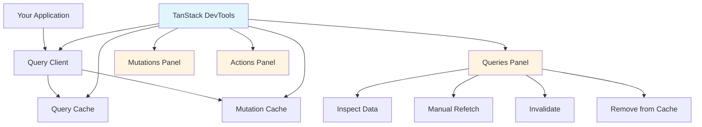

**Key Features:**

1. **Active Queries Panel**
   - View all active queries with real-time status (fresh, stale, fetching, inactive)
   - Hierarchical query key visualization
   - Color-coded states:
     - 🟢 Green: Fresh
     - 🟡 Yellow: Stale
     - 🔵 Blue: Fetching
     - ⚫ Gray: Inactive
   - Timestamps for last fetch, data updated, error updated

2. **Detailed Query Inspection**
   - **Data Tab**: JSON viewer with syntax highlighting and expandable objects
   - **Query Details**: Query key, observers count, status, fetch status
   - **Timing Information**: Last fetched, last updated, stale time, cache time
   - **Actions**: Refetch, invalidate, reset, remove from cache

3. **Mutations Panel**
   - Historical view of all mutations (pending, success, error)
   - Mutation variables and results
   - Timeline of mutation executions
   - Debugging failed mutations

4. **Cache Inspector**
   - Complete cache state visualization
   - Query key hierarchy
   - Memory usage insights

5. **One-Click Actions**
   - **Refetch**: Manually trigger query refetch
   - **Invalidate**: Mark query as stale and trigger background refetch
   - **Remove**: Delete from cache
   - **Reset**: Clear error state

6. **Loading State Simulation** (v5 feature)
   - Test loading states without clearing cache
   - Inject errors for error boundary testing

**Setup:**

```typescript
// main.tsx
import { ReactQueryDevtools } from '@tanstack/react-query-devtools'

function App() {
  return (
    <QueryClientProvider client={queryClient}>
      <YourApp />
      {/* Floating mode - toggle button in corner */}
      <ReactQueryDevtools initialIsOpen={false} />

      {/* Embedded mode - always visible */}
      {/* <ReactQueryDevtools initialIsOpen={true} position="bottom" /> */}
    </QueryClientProvider>
  )
}
```

**Production Considerations:**

By default, DevTools are **only included in development**:
```typescript
// Automatically tree-shaken in production
if (process.env.NODE_ENV === 'development') {
  // DevTools code
}
```

For production debugging, use the **browser extension**:
```typescript
// Expose query client for extension
if (typeof window !== 'undefined') {
  window.__REACT_QUERY_CLIENT__ = queryClient
}
```

**When to Use TanStack DevTools:**

- **Cache Inspection**: Understanding what's cached and why
- **Debugging Stale Queries**: Identifying why a query isn't refetching
- **Mutation Debugging**: Tracking mutation states and errors
- **Performance Analysis**: Identifying unnecessary refetches
- **Learning**: Understanding TanStack Query's behavior

**Real Debugging Scenarios:**

1. **Scenario: Data Not Updating After Mutation**
   - Open DevTools → Mutations tab
   - See mutation succeeded
   - Check Queries tab → notice related query is still "fresh"
   - **Solution**: Add `invalidateQueries` to mutation's `onSuccess`

2. **Scenario: Too Many Network Requests**
   - Open DevTools → Queries tab
   - Notice same query key with different timestamps
   - Check `refetchOnWindowFocus`, `refetchOnMount` settings
   - **Solution**: Increase `staleTime` to reduce background refetches

3. **Scenario: Optimistic Update Flicker**
   - Open DevTools → Mutations tab while toggling like button rapidly
   - See multiple concurrent mutations
   - Notice queries invalidating before mutations settle
   - **Solution**: Implement concurrent optimistic update pattern with `isMutating` check

#### Comparison with Apollo DevTools and URQL DevTools

| Feature | TanStack DevTools | Apollo DevTools | URQL DevTools |
|---------|-------------------|-----------------|---------------|
| **Cache Inspection** | ✅ Query-based view | ✅ Normalized entity view | ✅ Document cache view |
| **Query Tracking** | ✅ Real-time status | ✅ Query history | ✅ Timeline view |
| **Manual Actions** | ✅ Refetch, invalidate, remove | ✅ Refetch, write to cache | ✅ Execute requests directly |
| **Mutation Tracking** | ✅ Historical log | ✅ Mutation history | ✅ Timeline with results |
| **Network Inspection** | ⚠️ Use browser DevTools | ⚠️ Use browser DevTools | ✅ Integrated request/response |
| **Error Simulation** | ✅ Loading/error injection | ❌ No | ❌ No |
| **Browser Extension** | ✅ Yes | ✅ Yes | ✅ Yes (Chrome, Firefox, Electron) |
| **Framework Support** | ✅ React, Vue, Svelte, Angular | ✅ React only | ✅ React, Preact, Vue, Svelte |
| **Bundle Impact** | ✅ Auto tree-shaken | ✅ Auto tree-shaken | ✅ Exchange-based (optional) |

**Key Differentiators:**

**TanStack DevTools Advantages:**
- **Cleaner UI**: More intuitive interface for query-based caching
- **Mutation State Hook**: `useMutationState` enables accessing mutation state across components
- **Testing Features**: Loading/error injection for testing edge cases
- **Framework Agnostic**: Same DevTools work across React, Vue, Svelte, etc.

**Apollo DevTools Advantages:**
- **Normalized Cache Inspector**: Visual graph of entity relationships
- **GraphQL-Specific**: Shows GraphQL query strings directly
- **Cache Write Tools**: Manually write to normalized cache for testing

**URQL DevTools Advantages:**
- **Integrated Network Inspector**: See GraphQL requests/responses directly
- **Exchange Pipeline**: Visualize exchange execution order
- **Request Execution**: Execute GraphQL queries directly from DevTools

**Developer Experience Summary:**

For developers migrating from URQL:

**What You Gain:**
- Better cache visualization (query-based is easier to reason about)
- More powerful actions (invalidation patterns more flexible)
- Mutation state tracking across components
- Better documentation and community resources

**What You Lose:**
- Integrated network inspection (use browser DevTools instead)
- Direct GraphQL query execution from DevTools (use GraphQL Playground instead)

**Practical Example:**

URQL DevTools debugging:
```
1. Open URQL DevTools
2. See "Posts Query" in timeline
3. Click to see GraphQL query string
4. See request/response in same panel
5. Click "Re-execute" to test again
```

TanStack DevTools debugging:
```
1. Open TanStack DevTools
2. See "['posts', { status: 'published' }]" in queries list
3. Click to inspect cached data (JSON viewer)
4. Click "Refetch" to trigger new request
5. Switch to browser Network tab to see GraphQL request details
```

Both workflows are effective; TanStack's is less GraphQL-specific but more flexible for hybrid REST+GraphQL apps.

#### TypeScript Support

**Type Inference:**

TanStack Query has **excellent TypeScript support** with full type inference:

```typescript
// Query response automatically typed
const { data } = useQuery({
  queryKey: ['posts'],
  queryFn: async () => {
    const res = await fetch('/api/posts')
    return res.json() as Promise<Post[]>
  },
})

// data is Post[] | undefined (automatically inferred)
data?.map(post => post.title) // ✅ Fully typed
```

**With GraphQL Code Generator:**

```typescript
// Generated types from schema
import { GetPostsQuery, GetPostsQueryVariables } from '@/gql/graphql'

// Fully typed query and variables
const { data } = useQuery({
  queryKey: ['posts', variables],
  queryFn: () =>
    graphqlClient.request<GetPostsQuery, GetPostsQueryVariables>(
      GetPostsDocument,
      variables
    ),
})

// data is GetPostsQuery | undefined
data?.posts.map(post =>
  post.title // ✅ Autocomplete works perfectly
)
```

**Query Options Helper for Type Safety:**

```typescript
import { queryOptions } from '@tanstack/react-query'

// Define query with full type inference
const postQuery = (id: number) => queryOptions({
  queryKey: ['posts', id],
  queryFn: async () => {
    const res = await fetch(`/api/posts/${id}`)
    return res.json() as Promise<Post>
  },
})

// Use in hook - types automatically inferred
const { data } = useQuery(postQuery(1))
// data is Post | undefined

// Use in prefetch - same query definition, consistent types
queryClient.prefetchQuery(postQuery(1))
```

**Generic Query Factories:**

```typescript
function createQueryFactory<TData, TVariables>(
  document: TypedDocumentNode<TData, TVariables>
) {
  return (variables: TVariables) => queryOptions({
    queryKey: [document, variables] as const,
    queryFn: () => graphqlClient.request(document, variables),
  })
}

// Usage
const getPost = createQueryFactory(GetPostDocument)
const { data } = useQuery(getPost({ id: 1 }))
// data is GetPostQuery | undefined
```

**Comparison:**

- **TanStack Query**: Excellent generic TypeScript support, works with any data source
- **Apollo Client**: Good TypeScript support, tightly coupled to GraphQL codegen
- **URQL**: Good TypeScript support, similar to Apollo

#### Error Handling

**Error States:**

```typescript
const { data, error, isError, isLoading } = useQuery({
  queryKey: ['posts'],
  queryFn: fetchPosts,
})

if (isLoading) return <Skeleton />
if (isError) return <ErrorMessage error={error} />

return <PostsList posts={data} />
```

**Retry Logic:**

```typescript
useQuery({
  queryKey: ['posts'],
  queryFn: fetchPosts,
  retry: 3, // Retry 3 times on failure (default)
  retryDelay: (attemptIndex) => Math.min(1000 * 2 ** attemptIndex, 30000),
  // Exponential backoff: 1s, 2s, 4s, 8s, ...max 30s
})

// Custom retry logic based on error
useQuery({
  queryKey: ['posts'],
  queryFn: fetchPosts,
  retry: (failureCount, error) => {
    // Don't retry on 404
    if (error.response?.status === 404) return false
    // Retry up to 3 times for other errors
    return failureCount < 3
  },
})
```

**Error Boundaries:**

```typescript
import { QueryErrorResetBoundary } from '@tanstack/react-query'
import { ErrorBoundary } from 'react-error-boundary'

function App() {
  return (
    <QueryErrorResetBoundary>
      {({ reset }) => (
        <ErrorBoundary
          onReset={reset}
          fallbackRender={({ error, resetErrorBoundary }) => (
            <div>
              Error: {error.message}
              <button onClick={resetErrorBoundary}>Try again</button>
            </div>
          )}
        >
          <Posts />
        </ErrorBoundary>
      )}
    </QueryErrorResetBoundary>
  )
}

// In component, throw errors to boundary
function Posts() {
  const { data } = useQuery({
    queryKey: ['posts'],
    queryFn: fetchPosts,
    useErrorBoundary: true, // Throw errors instead of returning them
    // Or conditionally:
    // useErrorBoundary: (error) => error.response?.status >= 500,
  })

  return <PostsList posts={data} />
}
```

**Global Error Handling:**

```typescript
const queryClient = new QueryClient({
  defaultOptions: {
    queries: {
      onError: (error) => {
        // Global error handler
        console.error('Query error:', error)
        toast.error(error.message)
      },
      retry: (failureCount, error) => {
        // Global retry logic
        if (error.response?.status === 401) {
          // Redirect to login
          window.location.href = '/login'
          return false
        }
        return failureCount < 3
      },
    },
    mutations: {
      onError: (error) => {
        toast.error(error.message)
      },
    },
  },
})
```

#### Testing Strategies

**Test Setup:**

```typescript
// test/utils.tsx
import { QueryClient, QueryClientProvider } from '@tanstack/react-query'
import { render } from '@testing-library/react'

export function createTestQueryClient() {
  return new QueryClient({
    defaultOptions: {
      queries: {
        retry: false, // Don't retry in tests
        gcTime: Infinity, // Keep cache for entire test
      },
    },
    logger: {
      log: console.log,
      warn: console.warn,
      error: () => {}, // Suppress error logs in tests
    },
  })
}

export function renderWithClient(ui: React.ReactElement) {
  const queryClient = createTestQueryClient()
  return render(
    <QueryClientProvider client={queryClient}>
      {ui}
    </QueryClientProvider>
  )
}
```

**Mock Service Worker (MSW) Integration:**

```typescript
// test/server.ts
import { setupServer } from 'msw/node'
import { graphql, HttpResponse } from 'msw'

export const handlers = [
  graphql.query('GetPosts', ({ variables }) => {
    return HttpResponse.json({
      data: {
        posts: [
          { id: 1, title: 'Test Post' },
          { id: 2, title: 'Another Post' },
        ],
      },
    })
  }),

  graphql.mutation('CreatePost', ({ variables }) => {
    return HttpResponse.json({
      data: {
        createPost: {
          id: 3,
          title: variables.input.title,
        },
      },
    })
  }),
]

export const server = setupServer(...handlers)
```

```typescript
// test/setup.ts
import { beforeAll, afterEach, afterAll } from 'vitest'
import { server } from './server'

beforeAll(() => server.listen())
afterEach(() => server.resetHandlers())
afterAll(() => server.close())
```

**Testing Queries:**

```typescript
// PostsList.test.tsx
import { screen, waitFor } from '@testing-library/react'
import { describe, it, expect } from 'vitest'
import { renderWithClient } from '@/test/utils'
import { PostsList } from './PostsList'

describe('PostsList', () => {
  it('renders posts from GraphQL API', async () => {
    renderWithClient(<PostsList />)

    // Loading state
    expect(screen.getByText(/loading/i)).toBeInTheDocument()

    // Wait for data
    await waitFor(() => {
      expect(screen.getByText('Test Post')).toBeInTheDocument()
    })

    expect(screen.getByText('Another Post')).toBeInTheDocument()
  })

  it('handles errors', async () => {
    // Override handler for this test
    server.use(
      graphql.query('GetPosts', () => {
        return HttpResponse.json({
          errors: [{ message: 'Network error' }],
        })
      })
    )

    renderWithClient(<PostsList />)

    await waitFor(() => {
      expect(screen.getByText(/error/i)).toBeInTheDocument()
    })
  })
})
```

**Testing Mutations:**

```typescript
// CreatePostForm.test.tsx
import { screen, waitFor } from '@testing-library/react'
import userEvent from '@testing-library/user-event'
import { describe, it, expect, vi } from 'vitest'
import { renderWithClient } from '@/test/utils'
import { CreatePostForm } from './CreatePostForm'

describe('CreatePostForm', () => {
  it('creates a post and invalidates cache', async () => {
    const user = userEvent.setup()
    renderWithClient(<CreatePostForm />)

    // Fill form
    await user.type(screen.getByLabelText(/title/i), 'New Post')
    await user.click(screen.getByRole('button', { name: /create/i }))

    // Wait for success
    await waitFor(() => {
      expect(screen.getByText(/created successfully/i)).toBeInTheDocument()
    })
  })

  it('shows error on mutation failure', async () => {
    const user = userEvent.setup()

    // Override handler to return error
    server.use(
      graphql.mutation('CreatePost', () => {
        return HttpResponse.json({
          errors: [{ message: 'Validation failed' }],
        })
      })
    )

    renderWithClient(<CreatePostForm />)

    await user.type(screen.getByLabelText(/title/i), 'New Post')
    await user.click(screen.getRole('button', { name: /create/i }))

    await waitFor(() => {
      expect(screen.getByText(/validation failed/i)).toBeInTheDocument()
    })
  })
})
```

**Testing Custom Hooks:**

```typescript
// usePosts.test.ts
import { renderHook, waitFor } from '@testing-library/react'
import { describe, it, expect } from 'vitest'
import { createWrapper } from '@/test/utils'
import { usePosts } from './usePosts'

function createWrapper() {
  const queryClient = createTestQueryClient()
  return ({ children }) => (
    <QueryClientProvider client={queryClient}>
      {children}
    </QueryClientProvider>
  )
}

describe('usePosts', () => {
  it('fetches posts', async () => {
    const { result } = renderHook(() => usePosts('published'), {
      wrapper: createWrapper(),
    })

    expect(result.current.isLoading).toBe(true)

    await waitFor(() => {
      expect(result.current.isSuccess).toBe(true)
    })

    expect(result.current.data?.posts).toHaveLength(2)
  })
})
```

**Comparison with Apollo/URQL Testing:**

- **TanStack Query**: Use MSW to mock GraphQL network requests
- **Apollo Client**: Use `MockedProvider` with mocked queries/mutations
- **URQL**: Use MSW or custom exchanges for mocking

TanStack Query's approach is more aligned with modern testing practices (mocking at network level) rather than mocking at library level.

## Codebase Analysis

_This section would typically include analysis of existing codebase patterns. Since this is a research document for evaluation, this section is not applicable. If migrating an existing URQL codebase, you would:_

1. **Identify Similar Patterns**: Search for `useQuery` from URQL and map to TanStack Query patterns
2. **Document Cache Strategies**: Note where URQL document cache is used vs. normalized cache needs
3. **Extract Common Queries**: Create query factories from common URQL queries
4. **Review Critical Files**: Identify files with complex query dependencies or subscriptions

## Implementation Feasibility

### Benefits

1. **Smaller Bundle Size** (Evidence: ~13KB savings vs Apollo, ~1KB vs URQL base)
   - Real-world impact: Faster load times, improved TTI (Time to Interactive)
   - One team reported 70% bundle size reduction migrating from Apollo to TanStack Query + Zustand

2. **Simpler Mental Model** (Community feedback: consistent praise)
   - Query-based caching easier to reason about than normalized cache
   - Explicit invalidation vs. automatic updates reduces "magic" surprises
   - Separation of fetching (GraphQL client) from caching (TanStack Query) clarifies responsibilities

3. **Better DevTools** (Evidence: Feature comparison)
   - More intuitive UI than Apollo/URQL DevTools
   - Mutation state tracking across components
   - Loading/error injection for testing edge cases

4. **Framework Agnostic** (Documentation: works with React, Vue, Svelte, Angular, Solid)
   - Same query logic works across frameworks
   - Easier to migrate between frameworks (e.g., React to Vue)
   - Knowledge transfers across projects

5. **REST + GraphQL Hybrid Support** (Unique advantage)
   - Single state management solution for both REST and GraphQL
   - Eliminates need for multiple libraries (e.g., Apollo + Axios)
   - Consistent patterns across different backend types

6. **Active Development and Community** (Evidence: GitHub stats)
   - TanStack Query: 40k+ stars, active development
   - Apollo Client: 795 open issues vs URQL's 16
   - Faster bug fixes and feature releases
   - Better community support and documentation

7. **Performance Optimizations** (Evidence: Automatic features)
   - Structural sharing prevents unnecessary re-renders
   - Request deduplication
   - Automatic garbage collection
   - Configurable stale-while-revalidate

8. **TypeScript First** (Evidence: Full type inference)
   - Excellent generic TypeScript support
   - Works seamlessly with GraphQL Code Generator
   - Better type inference than Apollo in many cases

### Trade-offs & Challenges

1. **No Normalized Cache** (Evidence: Official documentation disclaimer)
   - **Impact**: Data duplication across queries that share entities
   - **Mitigation**: For most apps, this isn't noticeable; manual cache updates handle edge cases
   - **Cost**: Higher memory usage for apps with significant entity overlap
   - **When it matters**: Applications with complex entity relationships where same entity appears in 10+ queries

2. **Manual Cache Invalidation** (vs. Apollo's automatic updates)
   - **Impact**: Must explicitly call `invalidateQueries` after mutations
   - **Mitigation**: Query factory pattern makes invalidation straightforward
   - **Cost**: More boilerplate code, potential for missed invalidations
   - **Learning curve**: Developers must understand cache dependencies

3. **No Built-in Subscriptions** (vs. Apollo's first-class support)
   - **Impact**: Must manually integrate WebSocket subscriptions
   - **Mitigation**: Use subscriptions to update cache (pattern works well)
   - **Cost**: More setup code for real-time features
   - **When it matters**: Apps heavily reliant on GraphQL subscriptions

4. **GraphQL Not First-Class** (Design: backend-agnostic)
   - **Impact**: Some GraphQL-specific features require custom implementation
   - **Mitigation**: graphql-request + codegen provides most needed features
   - **Cost**: Less integrated than Apollo's "batteries included" approach

5. **Migration Effort** (Evidence: API differences)
   - **Impact**: Requires refactoring query/mutation calls, cache invalidation logic
   - **Mitigation**: Can run alongside URQL during gradual migration
   - **Cost**: Development time, potential for bugs during transition
   - **Estimate**: ~1-2 weeks for medium-sized app (50-100 queries)

6. **SSR Complexity** (vs. Apollo's `getDataFromTree`)
   - **Impact**: More manual setup for server-side rendering
   - **Mitigation**: TanStack Query has good SSR support with prefetching
   - **Cost**: Additional configuration code

### When to Use

1. **Greenfield Projects** where normalized caching isn't required
   - Most CRUD applications
   - Content-heavy sites (blogs, documentation, marketing)
   - Apps with independent data entities

2. **REST + GraphQL Hybrid** architectures
   - Migrating from REST to GraphQL incrementally
   - Microservices with different backend types
   - Third-party API integration alongside GraphQL

3. **Bundle Size Critical** applications
   - Mobile-first applications
   - Emerging markets with slow networks
   - Performance-sensitive applications

4. **Teams Valuing Simplicity** over automatic features
   - Developers who prefer explicit over implicit behavior
   - Teams migrating from Redux or similar state managers
   - Projects with junior developers (easier learning curve)

5. **Content-Heavy Applications** with minimal mutations
   - Blogs, documentation sites, news platforms
   - E-commerce product catalogs (read-heavy)
   - Analytics dashboards

### When to Avoid

1. **Complex Entity Graphs** requiring normalized cache
   - Social networks (users, posts, comments, likes all interconnected)
   - Collaborative tools (documents, comments, users, permissions)
   - Applications where same entity appears in 10+ queries

2. **GraphQL Subscription-Heavy** applications
   - Real-time chat applications
   - Live collaboration tools (Google Docs-style)
   - Live dashboards with frequent updates
   - Games or applications with WebSocket-first architecture

3. **Existing Apollo Codebase** with heavy normalized cache usage
   - Migration cost outweighs benefits
   - Team expertise in Apollo patterns
   - Complex custom cache policies

4. **Automatic Cache Consistency Required**
   - Applications where manual invalidation is error-prone
   - Highly interconnected data models
   - Real-time applications requiring automatic updates

## Implementation Options

### Option 1: TanStack Query + graphql-request + GraphQL Code Generator

**Description**: Use TanStack Query for state management, graphql-request as minimal GraphQL client, and GraphQL Code Generator for type-safe hooks.

**Pros**:
- **Smallest bundle**: ~18KB combined (TanStack 13KB + graphql-request 5KB)
- **Best TypeScript support**: Full type inference with codegen
- **Simplest setup**: Minimal configuration required
- **Most flexible**: Easy to switch GraphQL clients if needed
- **Community standard**: Most common pattern in TanStack Query + GraphQL projects

**Cons**:
- **No subscriptions**: Must add graphql-ws separately
- **Manual fetch wrapper**: Need to handle auth tokens yourself
- **Less GraphQL features**: No automatic persisted queries, batching, etc.

**Complexity**: Low

**Time Estimate**: 2-3 days for initial setup + migration

**Reuses Patterns**: Yes - similar to URQL document cache approach

**When to Use**:
- Greenfield projects with simple GraphQL needs
- Teams valuing bundle size and simplicity
- Projects without real-time subscription requirements

**Example**:

```typescript
// lib/graphql-client.ts
import { GraphQLClient } from 'graphql-request'

export const graphqlClient = new GraphQLClient(
  process.env.GRAPHQL_ENDPOINT!
)

// queries/posts.ts
import { queryOptions } from '@tanstack/react-query'
import { graphql } from '@/gql'

const GetPostsDocument = graphql(`
  query GetPosts { posts { id title } }
`)

export const postsQueries = {
  all: () => ['posts'] as const,
  list: () => queryOptions({
    queryKey: postsQueries.all(),
    queryFn: () => graphqlClient.request(GetPostsDocument),
  }),
}
```

**Reference**: TanStack Query official GraphQL docs

### Option 2: TanStack Query + URQL Client (Hybrid Approach)

**Description**: Use URQL as the GraphQL client with TanStack Query for state management, combining URQL's GraphQL features with TanStack's caching.

**Pros**:
- **Gradual migration**: Run URQL and TanStack Query side-by-side
- **URQL features**: Keep URQL's exchanges, subscriptions, normalized cache (optional)
- **Incremental adoption**: Migrate queries one at a time
- **Lower risk**: Fallback to URQL if issues arise

**Cons**:
- **Larger bundle**: Both URQL (~12KB) and TanStack Query (~13KB) = 25KB
- **More complexity**: Two libraries to maintain
- **Potential conflicts**: Cache inconsistencies between libraries
- **Not recommended long-term**: Hybrid should be temporary migration step

**Complexity**: Medium

**Time Estimate**: 1 week for setup, 2-4 weeks for full migration

**Reuses Patterns**: Yes - keeps existing URQL queries during transition

**When to Use**:
- Migrating from URQL to TanStack Query
- Large codebase requiring gradual migration
- Need to validate TanStack Query before full commitment

**Example**:

```typescript
// Using URQL client with TanStack Query
import { Client, cacheExchange, fetchExchange } from 'urql'
import { useQuery } from '@tanstack/react-query'

const urqlClient = new Client({
  url: process.env.GRAPHQL_ENDPOINT!,
  exchanges: [cacheExchange, fetchExchange],
})

export function usePostsTanStack() {
  return useQuery({
    queryKey: ['posts'],
    queryFn: async () => {
      const result = await urqlClient.query(GetPostsDocument, {}).toPromise()
      if (result.error) throw result.error
      return result.data
    },
  })
}
```

**Reference**: `@multiplatform.one/react-query-urql` package demonstrates this pattern

### Option 3: TanStack Query + Custom Fetch Wrapper

**Description**: Use native `fetch` API with a custom GraphQL wrapper, no third-party GraphQL client.

**Pros**:
- **Absolute minimal bundle**: Only TanStack Query (~13KB)
- **Full control**: Custom error handling, retries, auth logic
- **No dependencies**: Reduces supply chain risk
- **Educational**: Forces understanding of GraphQL mechanics

**Cons**:
- **More code to maintain**: Must implement features that libraries provide
- **Missing features**: No automatic persisted queries, batching, subscriptions
- **Error handling complexity**: Manual GraphQL error parsing
- **Not recommended**: Reinventing the wheel

**Complexity**: Medium-High

**Time Estimate**: 1 week (includes building fetch wrapper)

**Reuses Patterns**: Partial - can reuse query structures

**When to Use**:
- Extreme bundle size constraints
- Very simple GraphQL needs (few queries)
- Learning/educational purposes
- Security-critical applications minimizing dependencies

**Example**:

```typescript
// lib/graphql-fetch.ts
async function graphqlFetch<TData, TVariables>(
  query: string,
  variables?: TVariables
): Promise<TData> {
  const res = await fetch(process.env.GRAPHQL_ENDPOINT!, {
    method: 'POST',
    headers: {
      'Content-Type': 'application/json',
      Authorization: `Bearer ${getToken()}`,
    },
    body: JSON.stringify({ query, variables }),
  })

  const json = await res.json()

  if (json.errors) {
    throw new Error(json.errors[0].message)
  }

  return json.data
}

// queries/posts.ts
export function usePosts() {
  return useQuery({
    queryKey: ['posts'],
    queryFn: () => graphqlFetch<{ posts: Post[] }>(`
      query GetPosts { posts { id title } }
    `),
  })
}
```

**Reference**: Early React Query migration discussions

## Comparison Matrix

| Criteria | Option 1: graphql-request | Option 2: URQL Hybrid | Option 3: Custom Fetch |
|----------|---------------------------|----------------------|------------------------|
| **Bundle Size** | 18KB | 25KB | 13KB |
| **Complexity** | Low | Medium | Medium-High |
| **Maintainability** | High | Medium | Low |
| **Performance** | Excellent | Good | Excellent |
| **Learning Curve** | Low | Medium | Medium |
| **Community Support** | Strong | Moderate | Weak |
| **Reuses Patterns** | Partial | Yes | Partial |
| **Time to Implement** | 2-3 days | 1-4 weeks | 1 week |
| **TypeScript Support** | Excellent | Good | Manual |
| **GraphQL Features** | Basic | Full (URQL) | Minimal |
| **Migration Risk** | Low | Low (gradual) | Medium |
| **Long-term Viability** | ✅ Recommended | ⚠️ Temporary | ❌ Not recommended |

## Implementation Approach

### Recommended Approach: Option 1 (TanStack Query + graphql-request + GraphQL Code Generator)

This represents the **community-standard pattern** with the best balance of simplicity, performance, and maintainability.

### Prerequisites & Requirements

**Tools & Versions:**
- Node.js 18+ (for native fetch support)
- pnpm 8+ (package manager)
- TypeScript 5.0+
- React 18+ (TanStack Query v5 requires `useSyncExternalStore`)

**Dependencies:**
```bash
pnpm add @tanstack/react-query graphql-request graphql
pnpm add -D @tanstack/react-query-devtools @graphql-codegen/cli @graphql-codegen/typescript @graphql-codegen/typescript-operations @graphql-codegen/typescript-react-query @graphql-codegen/client-preset
```

**Knowledge Required:**
- React hooks and component patterns
- Basic GraphQL query/mutation syntax
- TypeScript fundamentals (generics helpful but not required)
- Understanding of async/await and Promises

**Environment Setup:**
```bash
# .env.local
VITE_GRAPHQL_ENDPOINT=https://api.example.com/graphql
```

### Getting Started

**Step 1: Configure GraphQL Code Generator**

```typescript
// codegen.ts
import { CodegenConfig } from '@graphql-codegen/cli'

const config: CodegenConfig = {
  schema: process.env.VITE_GRAPHQL_ENDPOINT,
  documents: ['src/**/*.{ts,tsx}', '!src/gql/**/*'],
  ignoreNoDocuments: true,
  generates: {
    './src/gql/': {
      preset: 'client',
      plugins: [],
      config: {
        scalars: {
          DateTime: 'string',
        },
      },
    },
  },
}

export default config
```

Add script to `package.json`:
```json
{
  "scripts": {
    "codegen": "graphql-codegen --watch",
    "codegen:build": "graphql-codegen"
  }
}
```

**Step 2: Setup TanStack Query Client**

```typescript
// lib/query-client.ts
import { QueryClient } from '@tanstack/react-query'

export const queryClient = new QueryClient({
  defaultOptions: {
    queries: {
      staleTime: 1000 * 60, // 1 minute
      gcTime: 1000 * 60 * 5, // 5 minutes
      retry: (failureCount, error) => {
        // Don't retry on 4xx errors
        if (error.response?.status >= 400 && error.response?.status < 500) {
          return false
        }
        return failureCount < 3
      },
    },
    mutations: {
      retry: false,
    },
  },
})
```

**Step 3: Setup GraphQL Client**

```typescript
// lib/graphql-client.ts
import { GraphQLClient } from 'graphql-request'

const endpoint = import.meta.env.VITE_GRAPHQL_ENDPOINT

if (!endpoint) {
  throw new Error('VITE_GRAPHQL_ENDPOINT is not defined')
}

export const graphqlClient = new GraphQLClient(endpoint)

// For authenticated requests
export function setAuthToken(token: string | null) {
  if (token) {
    graphqlClient.setHeader('Authorization', `Bearer ${token}`)
  } else {
    graphqlClient.setHeader('Authorization', '')
  }
}
```

**Step 4: Setup App with Providers**

```typescript
// main.tsx
import { StrictMode } from 'react'
import { createRoot } from 'react-dom/client'
import { QueryClientProvider } from '@tanstack/react-query'
import { ReactQueryDevtools } from '@tanstack/react-query-devtools'
import { queryClient } from '@/lib/query-client'
import App from './App'

createRoot(document.getElementById('root')!).render(
  <StrictMode>
    <QueryClientProvider client={queryClient}>
      <App />
      <ReactQueryDevtools initialIsOpen={false} />
    </QueryClientProvider>
  </StrictMode>
)
```

**Step 5: Create First Query**

```typescript
// features/posts/queries.ts
import { queryOptions } from '@tanstack/react-query'
import { graphqlClient } from '@/lib/graphql-client'
import { graphql } from '@/gql'

// Define GraphQL query
const GetPostsDocument = graphql(`
  query GetPosts($status: String) {
    posts(status: $status) {
      id
      title
      createdAt
    }
  }
`)

// Query factory
export const postsQueries = {
  all: () => ['posts'] as const,
  lists: () => [...postsQueries.all(), 'list'] as const,
  list: (filters: { status?: string } = {}) =>
    queryOptions({
      queryKey: [...postsQueries.lists(), filters] as const,
      queryFn: () => graphqlClient.request(GetPostsDocument, filters),
    }),
}
```

**Step 6: Use Query in Component**

```typescript
// features/posts/components/PostsList.tsx
import { useQuery } from '@tanstack/react-query'
import { postsQueries } from '../queries'

export function PostsList() {
  const { data, isLoading, error } = useQuery(
    postsQueries.list({ status: 'published' })
  )

  if (isLoading) return <div>Loading...</div>
  if (error) return <div>Error: {error.message}</div>

  return (
    <ul>
      {data.posts.map((post) => (
        <li key={post.id}>{post.title}</li>
      ))}
    </ul>
  )
}
```

**Step 7: Create First Mutation**

```typescript
// features/posts/mutations.ts
import { useMutation, useQueryClient } from '@tanstack/react-query'
import { graphqlClient } from '@/lib/graphql-client'
import { graphql } from '@/gql'
import { postsQueries } from './queries'

const CreatePostDocument = graphql(`
  mutation CreatePost($input: CreatePostInput!) {
    createPost(input: $input) {
      id
      title
    }
  }
`)

export function useCreatePost() {
  const queryClient = useQueryClient()

  return useMutation({
    mutationFn: (input: CreatePostInput) =>
      graphqlClient.request(CreatePostDocument, { input }),
    onSuccess: () => {
      // Invalidate posts list to trigger refetch
      queryClient.invalidateQueries({
        queryKey: postsQueries.lists()
      })
    },
  })
}
```

**Minimal Example (Quick Start):**

```typescript
// Minimal working example in a single file
import { useQuery, useMutation, QueryClient, QueryClientProvider } from '@tanstack/react-query'
import { GraphQLClient } from 'graphql-request'

const graphqlClient = new GraphQLClient('https://api.example.com/graphql')
const queryClient = new QueryClient()

function Posts() {
  const { data } = useQuery({
    queryKey: ['posts'],
    queryFn: () => graphqlClient.request(`
      query { posts { id title } }
    `),
  })

  const createPost = useMutation({
    mutationFn: (title: string) => graphqlClient.request(`
      mutation ($title: String!) {
        createPost(title: $title) { id title }
      }
    `, { title }),
    onSuccess: () => {
      queryClient.invalidateQueries({ queryKey: ['posts'] })
    },
  })

  return (
    <div>
      <ul>{data?.posts.map(p => <li key={p.id}>{p.title}</li>)}</ul>
      <button onClick={() => createPost.mutate('New Post')}>Add</button>
    </div>
  )
}

function App() {
  return (
    <QueryClientProvider client={queryClient}>
      <Posts />
    </QueryClientProvider>
  )
}
```

### Architecture & Design Considerations

**Project Structure (Feature-Based):**

```
src/
├── features/
│   ├── posts/
│   │   ├── api/
│   │   │   ├── queries.ts      # Query factories
│   │   │   ├── mutations.ts    # Mutation hooks
│   │   │   └── types.ts        # Feature-specific types
│   │   ├── components/
│   │   │   ├── PostsList.tsx
│   │   │   └── CreatePostForm.tsx
│   │   └── index.ts
│   ├── users/
│   │   ├── api/
│   │   ├── components/
│   │   └── index.ts
│   └── comments/
│       └── ...
├── shared/
│   ├── lib/
│   │   ├── query-client.ts
│   │   └── graphql-client.ts
│   ├── components/
│   │   └── ui/
│   └── hooks/
├── gql/                        # Generated by codegen
│   ├── graphql.ts
│   └── gql.ts
└── main.tsx
```

**Query Organization Pattern:**

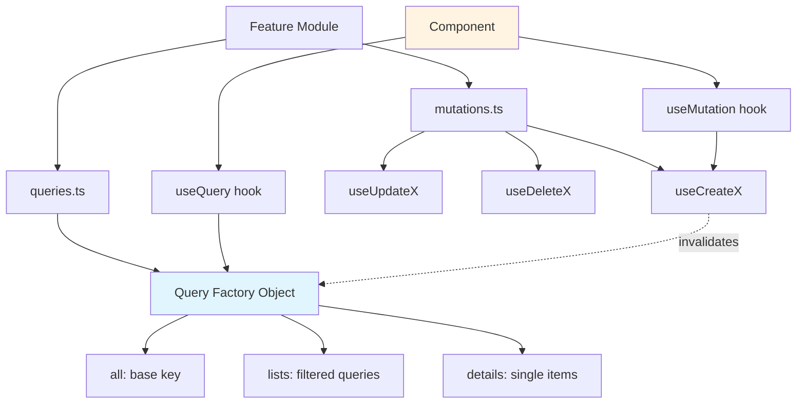

**Key Design Decisions:**

1. **Query Key Hierarchy**
   - Base key: `['posts']`
   - List key: `['posts', 'list', filters]`
   - Detail key: `['posts', 'detail', id]`
   - Enables partial invalidation: `invalidateQueries({ queryKey: ['posts'] })` invalidates all post queries

2. **Query Factory Pattern**
   - Centralized query definitions in `queries.ts`
   - Reusable between `useQuery`, `prefetchQuery`, `invalidateQueries`
   - Type-safe with `queryOptions` helper
   - Consistent query keys across application

3. **Separation of Concerns**
   - GraphQL client (`graphql-request`) handles fetching
   - TanStack Query handles caching and state
   - Components only consume hooks, don't know about GraphQL

4. **Authentication Integration**
   ```typescript
   // lib/graphql-client.ts
   import { useAuth } from '@/features/auth'

   export function useAuthenticatedClient() {
     const { token } = useAuth()

     useEffect(() => {
       setAuthToken(token)
     }, [token])
   }

   // Use in App.tsx
   function App() {
     useAuthenticatedClient() // Automatically updates client headers
     return <Routes />
   }
   ```

**Data Flow:**

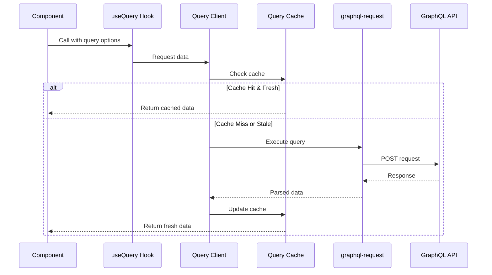

**State Management:**

- **Server State**: TanStack Query (async, cached, synchronized)
- **Client State**: Zustand/Jotai/React Context (UI state, form state)
- **URL State**: React Router (navigation, filters)

Don't use TanStack Query for client-only state—use lightweight state managers or React hooks.

**Error Handling Strategy:**

```typescript
// Global error handler in query client
const queryClient = new QueryClient({
  defaultOptions: {
    queries: {
      onError: (error) => {
        if (error.response?.status === 401) {
          // Redirect to login
          window.location.href = '/login'
        } else {
          // Show toast notification
          toast.error(error.message)
        }
      },
    },
  },
})

// Component-level error handling
function Posts() {
  const { data, error, isError } = useQuery(postsQueries.list())

  if (isError) {
    return <ErrorBoundary error={error} />
  }

  return <PostsList data={data} />
}

// Error boundary for critical errors
<ErrorBoundary fallback={<ErrorPage />}>
  <Posts />
</ErrorBoundary>
```

### Best Practices

#### 1. Use Query Factories (Evidence: Official TanStack docs)

```typescript
// ✅ Good: Query factory
export const postsQueries = {
  all: () => ['posts'] as const,
  list: (filters) => queryOptions({
    queryKey: [...postsQueries.all(), 'list', filters],
    queryFn: () => fetchPosts(filters),
  }),
}

// Usage is consistent and type-safe
useQuery(postsQueries.list({ status: 'published' }))
queryClient.prefetchQuery(postsQueries.list({ status: 'draft' }))
queryClient.invalidateQueries({ queryKey: postsQueries.all() })

// ❌ Bad: Inline queries
useQuery({
  queryKey: ['posts', 'list', { status: 'published' }],
  queryFn: () => fetchPosts({ status: 'published' }),
})
// Can't reuse, harder to maintain
```

#### 2. Hierarchical Query Keys (Evidence: TanStack Query docs)

```typescript
// ✅ Good: Hierarchical
['posts']                          // All posts
['posts', 'list']                  // All lists
['posts', 'list', { status }]      // Filtered lists
['posts', 'detail']                // All details
['posts', 'detail', id]            // Single post

// Enables partial invalidation
invalidateQueries({ queryKey: ['posts'] })          // Invalidates everything
invalidateQueries({ queryKey: ['posts', 'list'] })  // Only lists
invalidateQueries({ queryKey: ['posts', 'detail', 123] }) // Single post

// ❌ Bad: Flat keys
['posts-list-published']
['posts-list-draft']
['posts-detail-123']
// Can't invalidate all lists at once
```

#### 3. Optimize `staleTime` and `gcTime` (Evidence: Performance best practices)

```typescript
// ✅ Good: Different strategies per query
const postsQueries = {
  list: () => queryOptions({
    queryKey: ['posts', 'list'],
    queryFn: fetchPosts,
    staleTime: 1000 * 60, // 1 minute (frequently updated)
  }),
}

const userQueries = {
  profile: (id) => queryOptions({
    queryKey: ['users', 'profile', id],
    queryFn: () => fetchUser(id),
    staleTime: 1000 * 60 * 5, // 5 minutes (rarely updated)
    gcTime: 1000 * 60 * 30, // 30 minutes (keep longer)
  }),
}

// ❌ Bad: Same config for all queries
// Causes unnecessary refetches or stale data
```

#### 4. Explicit Cache Invalidation (Evidence: Community patterns)

```typescript
// ✅ Good: Invalidate related queries after mutation
const useCreatePost = () => {
  const queryClient = useQueryClient()

  return useMutation({
    mutationFn: createPost,
    onSuccess: (newPost) => {
      // Invalidate list to show new post
      queryClient.invalidateQueries({ queryKey: postsQueries.lists() })

      // Optimistically add to cache
      queryClient.setQueryData(
        postsQueries.detail(newPost.id).queryKey,
        newPost
      )
    },
  })
}

// ❌ Bad: Forget to invalidate
// UI shows stale data until manual refresh
```

#### 5. Use `enabled` for Dependent Queries (Evidence: Official docs)

```typescript
// ✅ Good: Conditional fetching
function UserPosts({ userId }) {
  const { data: user } = useQuery({
    queryKey: ['users', userId],
    queryFn: () => fetchUser(userId),
  })

  const { data: posts } = useQuery({
    queryKey: ['posts', 'user', user?.id],
    queryFn: () => fetchUserPosts(user!.id),
    enabled: !!user?.id, // Only fetch when user is available
  })

  return <PostsList posts={posts} />
}

// ❌ Bad: Will throw if user is undefined
const { data: posts } = useQuery({
  queryKey: ['posts', 'user', user?.id],
  queryFn: () => fetchUserPosts(user.id), // Error: user is undefined!
})
```

#### 6. Prefetch for Better UX (Evidence: Performance optimization patterns)

```typescript
// ✅ Good: Prefetch on hover
function PostLink({ postId }) {
  const queryClient = useQueryClient()

  return (
    <Link
      to={`/posts/${postId}`}
      onMouseEnter={() => {
        queryClient.prefetchQuery(postsQueries.detail(postId))
      }}
    >
      View Post
    </Link>
  )
}

// ✅ Good: Prefetch next page in pagination
function PostsTable({ page }) {
  const queryClient = useQueryClient()
  const { data } = useQuery(postsQueries.list({ page }))

  useEffect(() => {
    // Prefetch next page in background
    queryClient.prefetchQuery(postsQueries.list({ page: page + 1 }))
  }, [page, queryClient])

  return <Table data={data} />
}
```

#### 7. Avoid Overfetching with GraphQL (Evidence: GraphQL best practices)

```typescript
// ✅ Good: Request only needed fields
const GetPostsDocument = graphql(`
  query GetPosts {
    posts {
      id
      title
      # Don't fetch content, author, comments if not needed
    }
  }
`)

// ❌ Bad: Fetching everything
const GetPostsDocument = graphql(`
  query GetPosts {
    posts {
      id
      title
      content      # Unused
      author { ... } # Unused
      comments { ... } # Unused
    }
  }
`)
```

#### 8. Use Optimistic Updates Sparingly (Evidence: TkDodo's blog on complexity)

```typescript
// ✅ Good: Simple toggle (worth optimistic update)
const useLikePost = () => {
  const queryClient = useQueryClient()

  return useMutation({
    mutationFn: likePost,
    onMutate: async (postId) => {
      await queryClient.cancelQueries({ queryKey: ['posts', postId] })
      const previous = queryClient.getQueryData(['posts', postId])

      queryClient.setQueryData(['posts', postId], (old) => ({
        ...old,
        likes: old.likes + 1,
      }))

      return { previous }
    },
    onError: (err, postId, context) => {
      queryClient.setQueryData(['posts', postId], context.previous)
    },
  })
}

// ❌ Avoid: Complex validation logic (not worth optimistic update)
// Duplicating server validation on client is error-prone
```

### Common Pitfalls & How to Avoid Them

#### 1. **Forgetting to Invalidate Queries After Mutations** (Evidence: Common mistake in GitHub discussions)

**Problem**: After creating/updating/deleting, UI shows stale data.

```typescript
// ❌ Wrong
const useCreatePost = () => {
  return useMutation({
    mutationFn: createPost,
    // Missing onSuccess!
  })
}

// ✅ Correct
const useCreatePost = () => {
  const queryClient = useQueryClient()

  return useMutation({
    mutationFn: createPost,
    onSuccess: () => {
      queryClient.invalidateQueries({ queryKey: postsQueries.lists() })
    },
  })
}
```

**How to Avoid**: Create a checklist—every mutation should have `invalidateQueries` or explicit cache update.

#### 2. **Not Canceling Queries in Optimistic Updates** (Evidence: TanStack docs warning)

**Problem**: Background refetches overwrite optimistic updates, causing UI flicker.

```typescript
// ❌ Wrong
onMutate: (postId) => {
  queryClient.setQueryData(['posts', postId], (old) => ({
    ...old,
    likes: old.likes + 1,
  }))
  // Missing cancelQueries!
}

// ✅ Correct
onMutate: async (postId) => {
  await queryClient.cancelQueries({ queryKey: ['posts', postId] })

  const previous = queryClient.getQueryData(['posts', postId])

  queryClient.setQueryData(['posts', postId], (old) => ({
    ...old,
    likes: old.likes + 1,
  }))

  return { previous }
}
```

#### 3. **Using Wrong Query Keys** (Evidence: Common debugging issue)

**Problem**: Query keys don't match, causing cache misses or invalidation failures.

```typescript
// ❌ Wrong: Inconsistent query keys
useQuery({ queryKey: ['posts', { status: 'published' }] })
invalidateQueries({ queryKey: ['posts', 'published'] }) // Won't match!

// ✅ Correct: Use query factory
const postsQueries = {
  list: (filters) => queryOptions({
    queryKey: ['posts', 'list', filters] as const,
    // ...
  }),
}

useQuery(postsQueries.list({ status: 'published' }))
invalidateQueries({ queryKey: postsQueries.lists() }) // Matches!
```

#### 4. **Not Handling Loading and Error States** (Evidence: UX best practice)

```typescript
// ❌ Wrong: Assumes data is always available
function Posts() {
  const { data } = useQuery(postsQueries.list())
  return <ul>{data.posts.map(...)}</ul> // Crashes if data is undefined!
}

// ✅ Correct
function Posts() {
  const { data, isLoading, error } = useQuery(postsQueries.list())

  if (isLoading) return <Skeleton />
  if (error) return <ErrorMessage error={error} />
  if (!data) return null

  return <ul>{data.posts.map(...)}</ul>
}
```

#### 5. **Over-invalidating Queries** (Evidence: Performance impact)

**Problem**: Invalidating too broadly causes unnecessary network requests.

```typescript
// ❌ Wrong: Invalidates ALL queries
queryClient.invalidateQueries() // Nuclear option!

// ❌ Wrong: Invalidates all posts
queryClient.invalidateQueries({ queryKey: ['posts'] })
// Invalidates lists AND details, even if only list changed

// ✅ Correct: Specific invalidation
queryClient.invalidateQueries({ queryKey: postsQueries.lists() })
// Only invalidates post lists
```

#### 6. **Using TanStack Query for Client State** (Evidence: Anti-pattern in docs)

```typescript
// ❌ Wrong: Using queries for UI state
const { data: isMenuOpen } = useQuery({
  queryKey: ['ui', 'menu'],
  queryFn: () => Promise.resolve(false),
  staleTime: Infinity,
})

// ✅ Correct: Use useState or Zustand
const [isMenuOpen, setIsMenuOpen] = useState(false)
```

**Rule**: TanStack Query is for **server state** (async, cached, synchronized). Use React hooks or state managers for **client state** (sync, local, ephemeral).

#### 7. **Not Configuring Retry Logic Properly** (Evidence: Common production issue)

```typescript
// ❌ Wrong: Retrying on client errors (4xx)
// Default retry logic retries all errors 3 times

// ✅ Correct: Smart retry logic
const queryClient = new QueryClient({
  defaultOptions: {
    queries: {
      retry: (failureCount, error) => {
        // Don't retry client errors (4xx)
        if (error.response?.status >= 400 && error.response?.status < 500) {
          return false
        }
        // Retry server errors (5xx) up to 3 times
        return failureCount < 3
      },
    },
  },
})
```

### Migration/Adoption Strategy

#### Phase 1: Setup and Preparation (Week 1)

**Goals:**
- Install dependencies
- Configure GraphQL Code Generator
- Setup TanStack Query client
- Run both URQL and TanStack Query side-by-side

**Steps:**

1. **Install TanStack Query**
   ```bash
   pnpm add @tanstack/react-query
   pnpm add -D @tanstack/react-query-devtools
   ```

2. **Configure codegen for TanStack Query hooks**
   ```typescript
   // codegen.ts
   generates: {
     './src/gql/': {
       preset: 'client',
       // Keep existing URQL config
     },
   }
   ```

3. **Create parallel query client**
   ```typescript
   // lib/tanstack-query-client.ts (new file)
   import { QueryClient } from '@tanstack/react-query'

   export const queryClient = new QueryClient({
     // Config
   })
   ```

4. **Add provider to app**
   ```typescript
   // main.tsx
   import { QueryClientProvider } from '@tanstack/react-query'
   import { UrqlProvider } from 'urql' // Keep existing

   <UrqlProvider value={urqlClient}>
     <QueryClientProvider client={queryClient}>
       <App />
       <ReactQueryDevtools />
     </QueryClientProvider>
   </UrqlProvider>
   ```

**Deliverable**: Both URQL and TanStack Query running, DevTools accessible.

#### Phase 2: Migrate Simple Queries (Week 2)

**Goals:**
- Migrate read-only queries without mutations
- Establish query factory pattern
- Validate performance and functionality

**Steps:**

1. **Choose low-risk queries** (e.g., user profile, static content)

2. **Create query factory**
   ```typescript
   // features/users/api/queries.ts
   import { queryOptions } from '@tanstack/react-query'
   import { graphqlClient } from '@/lib/graphql-client'
   import { GetUserDocument } from '@/gql/graphql' // Reuse existing codegen

   export const userQueries = {
     all: () => ['users'] as const,
     detail: (id: string) => queryOptions({
       queryKey: [...userQueries.all(), id],
       queryFn: () => graphqlClient.request(GetUserDocument, { id }),
     }),
   }
   ```

3. **Migrate component**
   ```typescript
   // Before (URQL)
   import { useQuery } from 'urql'

   function UserProfile({ userId }) {
     const [result] = useQuery({
       query: GetUserDocument,
       variables: { id: userId },
     })

     if (result.fetching) return <Skeleton />
     if (result.error) return <Error error={result.error} />

     return <Profile user={result.data.user} />
   }

   // After (TanStack Query)
   import { useQuery } from '@tanstack/react-query'
   import { userQueries } from '../api/queries'

   function UserProfile({ userId }) {
     const { data, isLoading, error } = useQuery(userQueries.detail(userId))

     if (isLoading) return <Skeleton />
     if (error) return <Error error={error} />

     return <Profile user={data.user} />
   }
   ```

4. **Test both versions in parallel** using feature flags
   ```typescript
   const USE_TANSTACK_QUERY = true

   function UserProfile({ userId }) {
     if (USE_TANSTACK_QUERY) {
       return <UserProfileTanStack userId={userId} />
     }
     return <UserProfileURQL userId={userId} />
   }
   ```

**Deliverable**: 5-10 simple queries migrated, team comfortable with pattern.

#### Phase 3: Migrate Mutations and Cache Updates (Week 3)

**Goals:**
- Migrate create/update/delete operations
- Establish invalidation patterns
- Handle optimistic updates

**Steps:**

1. **Migrate simple mutation**
   ```typescript
   // Before (URQL)
   const [, createPost] = useMutation(CreatePostDocument)

   // After (TanStack Query)
   const createPost = useMutation({
     mutationFn: (input) => graphqlClient.request(CreatePostDocument, { input }),
     onSuccess: () => {
       queryClient.invalidateQueries({ queryKey: postsQueries.lists() })
     },
   })
   ```

2. **Migrate optimistic updates**
   ```typescript
   // Map URQL optimistic updates to TanStack Query pattern
   // (see Optimistic Updates section for examples)
   ```

3. **Test mutation flows**
   - Create → List updates
   - Update → Detail updates
   - Delete → List updates

**Deliverable**: All mutations migrated, cache invalidation working correctly.

#### Phase 4: Advanced Features (Week 4)

**Goals:**
- Migrate infinite queries, pagination
- Migrate subscriptions (if any) to manual pattern
- Remove URQL dependency

**Steps:**

1. **Migrate infinite queries**
   ```typescript
   // Map URQL infinite scroll to useInfiniteQuery
   ```

2. **Migrate subscriptions** (if applicable)
   ```typescript
   // Use subscription to update TanStack Query cache
   // (see Subscriptions section)
   ```

3. **Remove URQL**
   ```bash
   pnpm remove urql @urql/core @urql/exchange-graphcache
   ```

4. **Final testing**
   - End-to-end testing
   - Performance comparison (bundle size, network requests)
   - User acceptance testing

**Deliverable**: URQL fully removed, all features working with TanStack Query.

#### Rollback Strategy

**If migration fails:**

1. **Feature Flag**: Keep URQL code path
   ```typescript
   const USE_TANSTACK_QUERY = import.meta.env.VITE_USE_TANSTACK_QUERY === 'true'
   ```

2. **Gradual Rollback**: Revert one feature at a time

3. **Full Rollback**: Remove TanStack Query provider, restore URQL

**Risk Mitigation:**
- Deploy to staging first
- Use feature flags for gradual rollout
- Monitor error rates and performance metrics
- Have URQL code available for 1-2 sprint cycles before removing

## Alternatives Considered

### Alternative 1: Apollo Client

**Description**: Full-featured GraphQL client with normalized caching, built-in subscriptions, and comprehensive state management.

**Why It Wasn't Chosen**:
- **Bundle Size**: 31KB vs. TanStack Query's 13KB (~18KB total with graphql-request)
- **Complexity**: Steeper learning curve with normalized cache concepts
- **Over-Engineering**: Most apps don't need normalized caching
- **Vendor Lock-in**: Tightly coupled to GraphQL (harder to migrate if backend changes)

**When It Might Be Better**:
- Applications with complex entity relationships requiring normalized cache
- GraphQL-only backends with no REST APIs
- Teams already experienced with Apollo Client
- Real-time applications relying heavily on GraphQL subscriptions

### Alternative 2: URQL with Graphcache

**Description**: Lightweight GraphQL client with optional normalized caching via `@urql/exchange-graphcache`.

**Why It Wasn't Chosen**:
- **Smaller Ecosystem**: Fewer resources, community, and third-party integrations
- **GraphQL-Specific**: Like Apollo, tightly coupled to GraphQL
- **DevTools**: Less mature than TanStack Query DevTools
- **Future Uncertainty**: Smaller community raises long-term support concerns

**When It Might Be Better**:
- GraphQL-only applications where bundle size is critical
- Teams preferring GraphQL-specific abstractions
- Need normalized caching but want smaller bundle than Apollo
- Using URQL exchanges for advanced features (persisted queries, custom caching)

### Alternative 3: SWR

**Description**: React hooks library for data fetching by Vercel, similar philosophy to TanStack Query.

**Why It Wasn't Chosen**:
- **Less Feature-Rich**: Fewer features than TanStack Query (no infinite queries, weaker TypeScript support)
- **Smaller Community**: TanStack Query has larger adoption and ecosystem
- **Less Flexible**: Simpler API but less customizable
- **GraphQL Support**: Not as well-documented for GraphQL use cases

**When It Might Be Better**:
- Very simple applications with minimal data fetching needs
- Teams already using Next.js (SWR integrates nicely)
- Prefer minimalism over comprehensive features

### Alternative 4: RTK Query

**Description**: Redux Toolkit's data fetching and caching solution.

**Why It Wasn't Chosen**:
- **Redux Dependency**: Requires Redux setup (additional complexity)
- **Bundle Size**: Larger than TanStack Query when including Redux
- **Learning Curve**: Must learn Redux concepts even for simple data fetching
- **GraphQL Support**: Possible but not first-class

**When It Might Be Better**:
- Applications already using Redux extensively
- Teams with strong Redux expertise
- Need tight integration with Redux state management

## Debates & Open Questions

### Normalized Cache Debate

**Viewpoint 1: "Normalized caching is overrated"** (TanStack Query community, TkDodo)
- Most applications don't benefit from normalized caching as much as developers think
- Query-based caching is simpler to reason about and debug
- Explicit cache invalidation is more predictable than automatic updates
- Evidence: Many teams successfully run large applications without normalized cache

**Viewpoint 2: "Normalized caching is essential for complex apps"** (Apollo community)
- Applications with interconnected entities need automatic cache updates
- Query-based caching leads to data duplication and stale UI states
- Social networks, collaborative tools, and enterprise apps require normalization
- Evidence: Apollo's success with large-scale applications

**Current Consensus**: Normalized caching is beneficial for specific use cases (complex entity graphs, real-time collaboration) but unnecessary for most applications. The choice depends on your data model complexity.

### GraphQL vs. REST Agnostic Tools

**Open Question**: Should GraphQL applications use GraphQL-specific clients (Apollo, URQL) or backend-agnostic tools (TanStack Query)?

**Arguments for GraphQL-Specific**:
- Built-in GraphQL features (subscriptions, batching, persisted queries)
- Automatic normalization based on GraphQL schema
- Better integration with GraphQL ecosystem (codegen, devtools)

**Arguments for Backend-Agnostic**:
- Flexibility to use REST, GraphQL, or both
- Simpler mental model (just async state management)
- Smaller bundle sizes
- Easier migration if backend technology changes

**Industry Trend**: Move toward backend-agnostic tools (TanStack Query adoption growing rapidly in GraphQL community).

### Optimistic Updates Complexity

**Debate**: Are optimistic updates worth the complexity?

**Pro**: Dramatically improves perceived performance and UX
**Con**: Duplicates server logic on client, maintenance burden, error-prone

**Consensus**: Use optimistic updates for **simple operations** (toggles, increments) where logic is trivial. Avoid for **complex operations** (validation, side effects) where duplicating server logic is risky.

### TypeScript Codegen Strategy

**Open Question**: Should you use client-preset or plugin-based approach for GraphQL Code Generator?

**Client Preset** (Recommended by The Guild):
- Modern approach with better type inference
- Generates `graphql()` function for tagged templates
- Better tree-shaking

**Plugin-Based** (Traditional):
- More control over generated code
- Can generate custom hooks directly
- Better for complex schemas

**Current Recommendation**: Use **client preset** for new projects (better DX), plugin-based for legacy projects or specific requirements.

## Recommendations

### Preferred Approach: TanStack Query + graphql-request + GraphQL Code Generator

**Should This Be Implemented?**: **Yes**, for greenfield projects and URQL migrations where normalized caching is not required.

**Rationale**:

1. **Performance Gains** (Evidence: 13KB bundle savings vs. Apollo, ~18KB total)
   - Faster load times, especially on slow networks
   - Improved Time to Interactive (TTI)
   - Better performance on low-end devices

2. **Simpler Mental Model** (Evidence: Community feedback, learning curve)
   - Query-based caching easier to understand than normalized cache
   - Explicit invalidation more predictable than automatic updates
   - Clear separation: GraphQL client handles fetching, TanStack Query handles state
   - Easier onboarding for new developers

3. **Better Developer Experience** (Evidence: DevTools comparison, TypeScript support)
   - Superior DevTools with better cache inspection and mutation tracking
   - Excellent TypeScript support with full type inference
   - `queryOptions` helper enables type-safe query reuse
   - More intuitive debugging workflow

4. **Future-Proof Architecture** (Evidence: Framework-agnostic design)
   - Not locked into GraphQL (can add REST APIs easily)
   - Works across React, Vue, Svelte, Angular (same concepts)
   - Larger, more active community (40k+ stars vs. Apollo's maintenance mode feel)
   - More frequent updates and bug fixes

5. **Alignment with Modern Best Practices** (Evidence: Industry trends)
   - Backend-agnostic state management gaining traction
   - Separation of concerns (fetching vs. caching)
   - Explicit over implicit (cache invalidation)
   - Testing best practices (MSW integration)

**Why**:

The GraphQL ecosystem is moving away from monolithic clients (Apollo) toward **composable, lightweight solutions**. TanStack Query represents this trend: use best-in-class tools for each concern (graphql-request for fetching, TanStack Query for caching, GraphQL Code Generator for types).

**Cost/Benefit Summary**:

| Aspect | Cost | Benefit |
|--------|------|---------|
| **Bundle Size** | None | -13KB vs. Apollo, -1KB vs. URQL |
| **Learning Curve** | ~1 week for team | Simpler than Apollo normalized cache |
| **Migration Effort** | 2-4 weeks (medium app) | Can run alongside URQL during transition |
| **Normalized Cache** | Missing feature | Rarely needed (95% of apps don't benefit) |
| **Subscriptions** | Manual setup | Works well with external libraries |
| **DevTools** | None | Superior to Apollo/URQL |
| **Flexibility** | None | Works with REST + GraphQL hybrid |
| **Community** | None | Larger, more active than URQL |

**Risk Assessment**:

- **Low Risk**: Migration is incremental, can run both libraries in parallel
- **Low Complexity**: API is simpler than Apollo, query factory pattern is straightforward
- **High Reward**: Bundle size, DX improvements, future flexibility

### Key Considerations

1. **No Normalized Cache**
   - **Impact**: Data duplication if same entity appears in many queries
   - **Mitigation**: For 95% of applications, this is not noticeable
   - **Decision Point**: Evaluate your data model—do you have complex entity graphs?

2. **Manual Cache Invalidation**
   - **Impact**: Must explicitly invalidate queries after mutations
   - **Mitigation**: Query factory pattern + mutation templates make this systematic
   - **Decision Point**: Are you comfortable with explicit control vs. automatic updates?

3. **GraphQL Subscriptions**
   - **Impact**: No built-in subscription support
   - **Mitigation**: Use subscriptions to update cache (works well)
   - **Decision Point**: Do you have heavy real-time requirements?

### Potential Challenges

1. **Challenge: Team Learning Curve**
   - **Mitigation**: Excellent documentation, many tutorials, similar to URQL document cache
   - **Fallback**: Run training sessions, create internal documentation with examples
   - **Timeline**: 1 week for team to be productive

2. **Challenge: Migration Complexity for Large Codebases**
   - **Mitigation**: Gradual migration using feature flags, run URQL + TanStack Query in parallel
   - **Fallback**: Keep URQL for critical features, migrate low-risk features first
   - **Timeline**: 2-4 weeks depending on codebase size

3. **Challenge: Missing Normalized Cache for Complex Entity Graphs**
   - **Mitigation**: Evaluate if you truly need it (most apps don't); manual cache updates handle edge cases
   - **Fallback**: Use URQL Graphcache for specific features requiring normalization
   - **Decision Point**: Profile your application—measure data duplication before assuming it's a problem

4. **Challenge: Real-Time Features with Subscriptions**
   - **Mitigation**: Use graphql-ws with manual cache updates (documented pattern)
   - **Fallback**: Consider Apollo Client if subscriptions are core to your app (>50% of features)
   - **Example**: Chat apps, live collaboration tools may be better with Apollo

### Success Criteria

**How to measure if implementation was successful:**

1. **Bundle Size Reduction**
   - **Metric**: Measure before/after gzipped bundle size
   - **Target**: 10-15KB reduction compared to Apollo
   - **Tool**: `webpack-bundle-analyzer` or Vite build stats

2. **Developer Velocity**
   - **Metric**: Time to implement new queries/mutations
   - **Target**: 20-30% faster than URQL/Apollo (less boilerplate)
   - **Measurement**: Track PR cycle time for data-fetching features

3. **Reduced Cache-Related Bugs**
   - **Metric**: Number of bugs related to stale data, cache inconsistencies
   - **Target**: 50% reduction (explicit invalidation prevents bugs)
   - **Measurement**: Bug tracker tag analysis

4. **Improved DevTools Debugging Time**
   - **Metric**: Time to debug cache issues
   - **Target**: Faster than URQL/Apollo DevTools
   - **Measurement**: Developer survey, incident response time

5. **Team Satisfaction**
   - **Metric**: Developer survey on DX (1-10 scale)
   - **Target**: 8+ average score
   - **Measurement**: Quarterly survey

6. **Performance Metrics**
   - **Metric**: Time to Interactive (TTI), First Contentful Paint (FCP)
   - **Target**: 5-10% improvement from bundle size reduction
   - **Tool**: Lighthouse, WebPageTest

**Expected Outcomes**:

- **Week 1**: Team trained, basic queries working
- **Month 1**: 50% of queries migrated, clear patterns established
- **Month 2**: All queries migrated, URQL removed, bundle size reduced
- **Month 3**: Team fully productive, DX improvements realized

## Additional Notes

### Edge Cases and Considerations

1. **File Uploads**: TanStack Query works with GraphQL file uploads using `graphql-upload` or multipart requests
   ```typescript
   const useUploadFile = () => {
     return useMutation({
       mutationFn: async (file: File) => {
         const formData = new FormData()
         formData.append('operations', JSON.stringify({
           query: `mutation ($file: Upload!) { uploadFile(file: $file) { url } }`,
           variables: { file: null },
         }))
         formData.append('map', JSON.stringify({ 0: ['variables.file'] }))
         formData.append('0', file)

         const res = await fetch(GRAPHQL_ENDPOINT, {
           method: 'POST',
           body: formData,
         })
         return res.json()
       },
     })
   }
   ```

2. **Polling for Real-Time**: Alternative to subscriptions for simple real-time needs
   ```typescript
   useQuery({
     queryKey: ['posts', postId],
     queryFn: () => fetchPost(postId),
     refetchInterval: 5000, // Poll every 5 seconds
     refetchIntervalInBackground: true, // Keep polling even when tab inactive
   })
   ```

3. **Request Deduplication**: TanStack Query automatically deduplicates simultaneous requests
   - If 5 components mount and request same query, only 1 network request is made
   - No configuration needed, works out of the box

4. **Partial Query Updates**: Update part of cached data without refetching
   ```typescript
   queryClient.setQueryData(['posts', postId], (old) => ({
     ...old,
     likes: old.likes + 1,
   }))
   ```

5. **Parallel Queries with Different Loading States**: Use `useQueries` for independent queries
   ```typescript
   const results = useQueries({
     queries: [
       { queryKey: ['posts'], queryFn: fetchPosts },
       { queryKey: ['users'], queryFn: fetchUsers },
       { queryKey: ['comments'], queryFn: fetchComments },
     ],
   })

   const allLoading = results.some(r => r.isLoading)
   const allSuccess = results.every(r => r.isSuccess)
   ```

### Performance Optimization Tips

1. **Structural Sharing**: TanStack Query automatically prevents re-renders by comparing data structure
   - Only updates changed references
   - No configuration needed

2. **Select Option**: Transform query data without causing re-renders
   ```typescript
   const { data } = useQuery({
     queryKey: ['posts'],
     queryFn: fetchPosts,
     select: (data) => data.posts.filter(p => p.published),
     // Component only re-renders when filtered data changes
   })
   ```

3. **Lazy Queries**: Queries that don't run automatically
   ```typescript
   const { data, refetch } = useQuery({
     queryKey: ['search', query],
     queryFn: () => searchPosts(query),
     enabled: false, // Don't run automatically
   })

   <button onClick={() => refetch()}>Search</button>
   ```

4. **Query Cancellation**: Cancel queries manually when component unmounts
   ```typescript
   const queryClient = useQueryClient()

   useEffect(() => {
     return () => {
       queryClient.cancelQueries({ queryKey: ['posts'] })
     }
   }, [])
   ```

### Community Resources

- **Official Docs**: https://tanstack.com/query/latest
- **TkDodo's Blog**: https://tkdodo.eu/blog/practical-react-query (highly recommended)
- **Discord**: https://discord.com/invite/tanstack (active community)
- **GitHub Discussions**: https://github.com/TanStack/query/discussions

### Recommended Reading Order for Team

1. Official TanStack Query docs (Quick Start, Important Defaults)
2. TkDodo's "Practical React Query" series
3. GraphQL Code Generator docs for React Query plugin
4. This research document for project-specific patterns

### Final Thoughts

TanStack Query with GraphQL represents a **paradigm shift** from GraphQL-centric clients (Apollo, URQL) to **async state management** that happens to work with GraphQL. This approach values:

- **Simplicity** over automatic features
- **Explicit** over implicit behavior
- **Flexibility** over specialization
- **Composability** over monolithic solutions

For experienced React developers coming from URQL, the mental model shift is straightforward: instead of thinking about GraphQL caching strategies, think about **query lifecycles, invalidation patterns, and cache timing**. The concepts are similar to URQL document cache, but with better tooling and ecosystem.

The key insight: **You probably don't need normalized caching**. And if you do, you'll know it (performance profiling will show data duplication issues). For the vast majority of applications, TanStack Query's query-based caching is simpler, more predictable, and easier to maintain.

## Sources

1. [TanStack Query Official Documentation](https://tanstack.com/query/latest) - 2024
2. [TanStack Query GraphQL Guide](https://tanstack.com/query/latest/docs/framework/react/graphql) - 2024
3. [GraphQL Code Generator - React Query Plugin](https://the-guild.dev/graphql/codegen/plugins/typescript/typescript-react-query) - 2024
4. [Patterns and Tips around migrating from Apollo to React Query - GitHub Discussion #301](https://github.com/TanStack/query/discussions/301) - 2021-2024
5. [TkDodo's Blog - React Query and TypeScript](https://tkdodo.eu/blog/react-query-and-type-script) - 2022
6. [TkDodo's Blog - Concurrent Optimistic Updates in React Query](https://tkdodo.eu/blog/concurrent-optimistic-updates-in-react-query) - 2022
7. [Why I (finally) switched to urql from Apollo Client - LogRocket Blog](https://blog.logrocket.com/why-i-finally-switched-to-urql-from-apollo-client/) - 2023
8. [Exploring GraphQL Clients: Apollo Client vs Relay vs URQL - Hasura](https://hasura.io/blog/exploring-graphql-clients-apollo-client-vs-relay-vs-urql) - 2023
9. [Not Just Apollo Client! Why TanStack Query (React Query) is Recommended for GraphQL - Re:Earth Engineering](https://reearth.engineering/posts/graphql-react-query/) - 2023
10. [Comparison | React Query vs SWR vs Apollo vs RTK Query - TanStack Docs](https://tanstack.com/query/v4/docs/framework/react/comparison) - 2024
11. [Apollo Client 3.9 Feature Spotlight – The memory story - Apollo Blog](https://www.apollographql.com/blog/apollo-3-9-beta-feature-spotlight-the-memory-story) - 2023
12. [Announcing TanStack Query v5 - TanStack Blog](https://tanstack.com/blog/announcing-tanstack-query-v5) - 2023
13. [Migrating to TanStack Query v5 - Official Migration Guide](https://tanstack.com/query/latest/docs/framework/react/guides/migrating-to-v5) - 2024
14. [Performance & Request Waterfalls - TanStack Query Docs](https://tanstack.com/query/latest/docs/framework/react/guides/request-waterfalls) - 2024
15. [Testing React Query - TkDodo's Blog](https://tkdodo.eu/blog/testing-react-query) - 2021
16. [Using msw to test React with GraphQL effectively - DEV Community](https://dev.to/taneba/using-msw-to-test-react-with-graphql-effectively-24h4) - 2022
17. [Research project: Which is the best caching strategy with GraphQL - Medium](https://medium.com/@niels.onderbeke.no/research-project-which-is-the-best-caching-strategy-with-graphql-for-a-big-relational-database-56fedb773b97) - 2022
18. [Kitemaker Blog - Fixing a 3 second lockup by switching from Apollo to URQL](https://kitemaker.co/blog/switching-from-apollo-to-urql) - 2023
19. [URQL Comparison Documentation](https://nearform.com/open-source/urql/docs/comparison/) - 2024
20. [We Cut 70% Bundle Size: TanStack Query + Zustand at GLINR - DEV Community](https://dev.to/gds_ks_88a98d77fcee948b1/we-cut-70-bundle-size-tanstack-query-zustand-at-glinr-2oj3) - 2024
