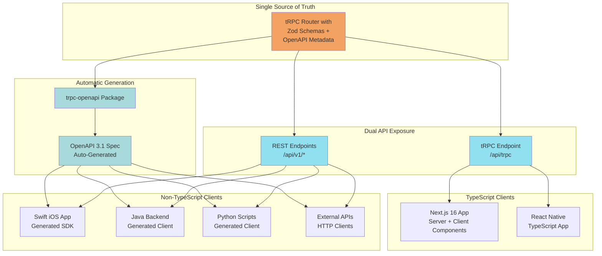
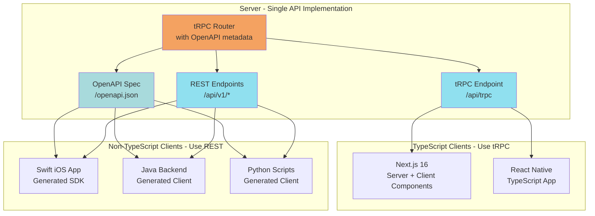
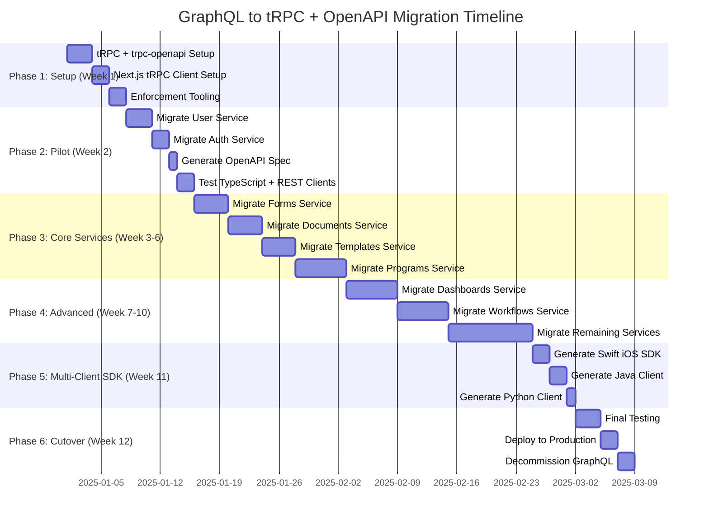

# Hybrid tRPC + OpenAPI Architecture - Complete Migration Guide

**Date**: 2025-10-23
**Status**: Research & Planning

## Executive Summary

This document provides a comprehensive guide to implementing a **Hybrid Architecture** using tRPC with mandatory OpenAPI REST exposure, specifically focusing on:
1. **Hybrid architecture fundamentals** - How tRPC + trpc-openapi work together
2. **Server-side implementation** - Setting up tRPC with mandatory OpenAPI metadata
3. **Multi-client consumption** - Next.js (tRPC) + Swift/Java/Python (REST)
4. **Migration strategy** - Converting GraphQL Yoga to tRPC with OpenAPI
5. **Enforcement patterns** - Ensuring ALL procedures are exposed as REST endpoints

**Key Architecture Principle**:
> **Single Source of Truth**: Write tRPC procedures once, automatically expose via BOTH tRPC protocol (TypeScript clients) AND REST/OpenAPI (all other clients).

**Key Recommendations**:
- **Server Framework**: Express or Fastify both work well with tRPC
- **OpenAPI Enforcement**: Use TypeScript utility types + build-time validation to mandate `.meta<OpenApiMeta>()` on all procedures
- **Client Strategy**: Next.js uses tRPC directly (1KB, instant types), non-TypeScript clients use generated REST SDKs
- **Migration Timeline**: 10-14 weeks for complete GraphQL → tRPC migration (15+ services)
- **Validation**: Use Zod schemas as single source of truth for both tRPC and OpenAPI

---

## Part 1: Hybrid Architecture Fundamentals

### What is the Hybrid Approach?

The hybrid architecture combines:
1. **tRPC** - TypeScript Remote Procedure Call for type-safe API development
2. **trpc-openapi** - Package that generates OpenAPI specs from tRPC routers
3. **Dual exposure** - Same procedures accessible via tRPC protocol AND REST endpoints

**Core Benefits**:
- ✅ Write API logic once (tRPC procedures)
- ✅ TypeScript clients get tRPC's superior DX (1KB, instant types, no codegen)
- ✅ Non-TypeScript clients get standard REST APIs (universal compatibility)
- ✅ OpenAPI spec auto-generated (no manual schema writing)
- ✅ Single source of truth for validation (Zod schemas)

### How It Works: The Big Picture



**Key Insight**: You write code **once** (tRPC procedure), but it's accessible **two ways**:
- TypeScript clients: Use tRPC client (imports types directly)
- Non-TypeScript clients: Use REST endpoints (consume OpenAPI-generated SDKs)

### Mandatory OpenAPI Exposure Requirement

**Your Specific Requirement**: EVERY tRPC procedure must also be exposed as a REST endpoint.

This means:
- ❌ Cannot have tRPC-only procedures
- ✅ All procedures must have `.meta<OpenApiMeta>()` decorator
- ✅ All procedures automatically get REST endpoints
- ✅ OpenAPI spec documents 100% of API surface

**Enforcement Strategies** (covered in Part 4):
1. TypeScript utility types that require OpenAPI metadata
2. Pre-commit hooks with Biome linting
3. Build-time validation script to fail if any procedure lacks REST exposure
4. Integration tests to verify all procedures have corresponding REST endpoints

---

## Part 2: Server-Side Implementation (tRPC + trpc-openapi)

### Architecture Overview

```mermaid
graph LR
    subgraph "Developer Experience"
        A[Write tRPC Procedure<br/>with Zod + OpenAPI metadata]
    end

    subgraph "tRPC Layer"
        B[tRPC Router]
        C[tRPC Context<br/>Auth, DB, etc.]
        D[Input Validation<br/>Zod Schemas]
    end

    subgraph "Dual Endpoints"
        E[tRPC Handler<br/>/api/trpc]
        F[OpenAPI Handler<br/>/api/v1/*]
    end

    subgraph "OpenAPI Generation"
        G[trpc-openapi<br/>generateOpenApiDocument]
        H[OpenAPI 3.1 Spec<br/>JSON]
    end

    A --> B
    B --> C
    B --> D
    B --> E
    B --> G
    G --> H
    G --> F

    style A fill:#f4a261
    style G fill:#a8dadc
    style H fill:#a8dadc
```



### Express vs Fastify for tRPC

| Criteria | Express | Fastify | Winner |
|----------|---------|---------|--------|
| **tRPC Support** | ✅ Official adapter | ✅ Official adapter | Tie |
| **Performance** | Baseline (10K req/s) | 2-3x faster (25K req/s) | Fastify |
| **Setup Complexity** | Simple | Simple | Tie |
| **TypeScript Support** | Good (via @types) | Excellent (native) | Fastify |
| **Ecosystem** | Massive | Growing | Express |
| **tRPC Adapter Package** | `@trpc/server/adapters/express` | `@trpc/server/adapters/fastify` | Tie |
| **OpenAPI Integration** | Works seamlessly | Works seamlessly | Tie |

**Verdict**: Both work equally well with tRPC. Choose based on:
- **Express**: If team is already familiar, values ecosystem
- **Fastify**: If you want better performance and modern TypeScript

For this guide, I'll show **both Express and Fastify** examples side-by-side so you can choose.

### Step-by-Step Setup

#### 1. Install Dependencies

<table width="100%">
<tr>
<th width="50%">Express</th>
<th width="50%">Fastify</th>
</tr>
<tr>
<td>

```bash
# Backend dependencies
pnpm add @trpc/server zod superjson
pnpm add express cors
pnpm add trpc-openapi
pnpm add swagger-ui-express

# Dev dependencies
pnpm add -D @types/express
pnpm add -D @types/cors
pnpm add -D @types/swagger-ui-express
pnpm add -D @types/node
```

</td>
<td>

```bash
# Backend dependencies
pnpm add @trpc/server zod superjson
pnpm add fastify
pnpm add @fastify/cors
pnpm add trpc-openapi
pnpm add @fastify/swagger
pnpm add @fastify/swagger-ui

# Dev dependencies
pnpm add -D @types/node
```

</td>
</tr>
</table>

**Next.js Client** (same for both):
```bash
pnpm add @trpc/client @trpc/server @trpc/react-query @tanstack/react-query superjson
```

#### 2. Create tRPC Initialization with Context

**Common code** (same for both Express and Fastify):

```typescript
// src/server/trpc/init.ts
import { initTRPC, TRPCError } from '@trpc/server';
import { OpenApiMeta } from 'trpc-openapi';
import superjson from 'superjson';
import { ZodError } from 'zod';

// Define context shape (available in all procedures)
export interface Context {
  db: typeof prisma;  // Your database client
  user?: {
    id: string;
    email: string;
    role: 'admin' | 'user' | 'guest';
  };
  headers: Headers;
}
```

**Framework-specific context creation**:

<table width="100%">
<tr>
<th width="50%">Express Context</th>
<th width="50%">Fastify Context</th>
</tr>
<tr>
<td>

```typescript
// Create context from Express request
export async function createContext({
  req,
  res
}: any): Promise<Context> {
  // Extract user from auth token
  const token = req.headers
    .authorization?.replace('Bearer ', '');
  const user = token
    ? await validateToken(token)
    : undefined;

  return {
    db: prisma,
    user,
    headers: req.headers,
  };
}
```

</td>
<td>

```typescript
// Create context from Fastify request
export async function createContext({
  req,
  res
}: any): Promise<Context> {
  // Extract user from auth token
  const token = req.headers
    .authorization?.replace('Bearer ', '');
  const user = token
    ? await validateToken(token)
    : undefined;

  return {
    db: prisma,
    user,
    headers: req.headers,
  };
}
```

</td>
</tr>
</table>

> **Note**: Context creation is identical for both frameworks - they both provide `req` and `res` objects with the same interface.

**Advanced Example: Clerk Authentication**

Here's how to integrate Clerk authentication in your context:

<table width="100%">
<tr>
<th width="50%">Express + Clerk</th>
<th width="50%">Fastify + Clerk</th>
</tr>
<tr>
<td>

```typescript
// src/server/trpc/context.ts
import { clerkClient } from '@clerk/clerk-sdk-node';

export async function createContext({
  req,
  res
}: any): Promise<Context> {
  // Extract Bearer token from header
  const authHeader = req.headers
    .authorization || '';
  const token = authHeader
    .replace('Bearer ', '');

  // Verify token with Clerk
  let user: Context['user'] | undefined;

  if (token) {
    try {
      const clerkUser = await clerkClient
        .verifyToken(token);

      // Get full user details
      const fullUser = await clerkClient
        .users.getUser(clerkUser.sub);

      user = {
        id: fullUser.id,
        email: fullUser.emailAddresses[0]
          ?.emailAddress || '',
        role: fullUser.publicMetadata
          .role as 'admin' | 'user',
      };
    } catch (error) {
      // Invalid token - leave user undefined
      console.error('Invalid token:', error);
    }
  }

  return {
    db: prisma,
    user,
    headers: req.headers,
  };
}
```

</td>
<td>

```typescript
// src/server/trpc/context.ts
import { clerkClient } from '@clerk/clerk-sdk-node';

export async function createContext({
  req,
  res
}: any): Promise<Context> {
  // Extract Bearer token from header
  const authHeader = req.headers
    .authorization || '';
  const token = authHeader
    .replace('Bearer ', '');

  // Verify token with Clerk
  let user: Context['user'] | undefined;

  if (token) {
    try {
      const clerkUser = await clerkClient
        .verifyToken(token);

      // Get full user details
      const fullUser = await clerkClient
        .users.getUser(clerkUser.sub);

      user = {
        id: fullUser.id,
        email: fullUser.emailAddresses[0]
          ?.emailAddress || '',
        role: fullUser.publicMetadata
          .role as 'admin' | 'user',
      };
    } catch (error) {
      // Invalid token - leave user undefined
      console.error('Invalid token:', error);
    }
  }

  return {
    db: prisma,
    user,
    headers: req.headers,
  };
}
```

</td>
</tr>
</table>

**Required dependency for Clerk**:
```bash
pnpm add @clerk/clerk-sdk-node
```

**Environment variables** (add to `.env`):
```env
CLERK_SECRET_KEY=sk_test_...
CLERK_PUBLISHABLE_KEY=pk_test_...
```

> **Note**: The Clerk integration is identical for both Express and Fastify - Clerk's SDK works with standard request/response objects.

**Continue with common tRPC initialization** (same for both):

```typescript
// Initialize tRPC with OpenAPI metadata support
const t = initTRPC
  .context<Context>()
  .meta<OpenApiMeta>()  // Enable OpenAPI metadata
  .create({
    transformer: superjson,
    errorFormatter({ shape, error }) {
      return {
        ...shape,
        data: {
          ...shape.data,
          zodError: error.cause instanceof ZodError ? error.cause.flatten() : null,
        },
      };
    },
  });

// Export reusable router and procedure builders
export const router = t.router;
export const publicProcedure = t.procedure;

// Protected procedure (requires authentication)
export const protectedProcedure = t.procedure.use(async ({ ctx, next }) => {
  if (!ctx.user) {
    throw new TRPCError({
      code: 'UNAUTHORIZED',
      message: 'You must be logged in',
    });
  }

  return next({
    ctx: {
      user: ctx.user,
    },
  });
});

// Admin-only procedure
export const adminProcedure = protectedProcedure.use(async ({ ctx, next }) => {
  if (ctx.user.role !== 'admin') {
    throw new TRPCError({
      code: 'FORBIDDEN',
      message: 'Admin access required',
    });
  }

  return next();
});
```

#### 3. Create Zod Schemas (Single Source of Truth)

```typescript
// src/server/schemas/user.schema.ts
import { z } from 'zod';

// User schema
export const UserSchema = z.object({
  id: z.string().uuid(),
  email: z.string().email(),
  name: z.string(),
  role: z.enum(['admin', 'user', 'guest']),
  createdAt: z.date(),
});

// Create user input
export const CreateUserInputSchema = z.object({
  email: z.string().email(),
  name: z.string().min(1).max(100),
  role: z.enum(['admin', 'user', 'guest']).optional().default('user'),
});

// Update user input
export const UpdateUserInputSchema = CreateUserInputSchema.partial();

// Pagination params
export const PaginationSchema = z.object({
  limit: z.number().int().min(1).max(100).default(10),
  offset: z.number().int().min(0).default(0),
});

// Infer TypeScript types
export type User = z.infer<typeof UserSchema>;
export type CreateUserInput = z.infer<typeof CreateUserInputSchema>;
export type UpdateUserInput = z.infer<typeof UpdateUserInputSchema>;
export type PaginationParams = z.infer<typeof PaginationSchema>;
```

#### 4. Create Router with MANDATORY OpenAPI Metadata

**CRITICAL**: This is where we enforce that EVERY procedure has OpenAPI exposure.

```typescript
// src/server/routers/user.router.ts
import { z } from 'zod';
import { TRPCError } from '@trpc/server';
import { router, publicProcedure, protectedProcedure } from '../trpc/init';
import {
  UserSchema,
  CreateUserInputSchema,
  UpdateUserInputSchema,
  PaginationSchema,
} from '../schemas/user.schema';

export const userRouter = router({
  // List users with pagination
  list: publicProcedure
    .meta({
      openapi: {
        method: 'GET',
        path: '/v1/users',
        tags: ['users'],
        summary: 'List all users',
        description: 'Retrieve a paginated list of users',
      },
    })
    .input(PaginationSchema)
    .output(z.array(UserSchema))
    .query(async ({ input, ctx }) => {
      const users = await ctx.db.user.findMany({
        take: input.limit,
        skip: input.offset,
      });

      return users;
    }),

  // Get user by ID
  getById: publicProcedure
    .meta({
      openapi: {
        method: 'GET',
        path: '/v1/users/{id}',
        tags: ['users'],
        summary: 'Get user by ID',
        description: 'Retrieve a single user by their unique identifier',
      },
    })
    .input(z.object({ id: z.string().uuid() }))
    .output(UserSchema)
    .query(async ({ input, ctx }) => {
      const user = await ctx.db.user.findUnique({
        where: { id: input.id },
      });

      if (!user) {
        throw new TRPCError({
          code: 'NOT_FOUND',
          message: 'User not found',
        });
      }

      return user;
    }),

  // Create user
  create: protectedProcedure
    .meta({
      openapi: {
        method: 'POST',
        path: '/v1/users',
        tags: ['users'],
        summary: 'Create a new user',
        description: 'Create a new user account',
        protect: true,  // Requires authentication
      },
    })
    .input(CreateUserInputSchema)
    .output(UserSchema)
    .mutation(async ({ input, ctx }) => {
      const user = await ctx.db.user.create({
        data: input,
      });

      return user;
    }),

  // Update user
  update: protectedProcedure
    .meta({
      openapi: {
        method: 'PATCH',
        path: '/v1/users/{id}',
        tags: ['users'],
        summary: 'Update user',
        description: 'Update an existing user',
        protect: true,
      },
    })
    .input(
      z.object({
        id: z.string().uuid(),
        data: UpdateUserInputSchema,
      })
    )
    .output(UserSchema)
    .mutation(async ({ input, ctx }) => {
      // Check if user can update (owner or admin)
      if (ctx.user.id !== input.id && ctx.user.role !== 'admin') {
        throw new TRPCError({
          code: 'FORBIDDEN',
          message: 'Cannot update other users',
        });
      }

      const user = await ctx.db.user.update({
        where: { id: input.id },
        data: input.data,
      });

      return user;
    }),

  // Delete user
  delete: protectedProcedure
    .meta({
      openapi: {
        method: 'DELETE',
        path: '/v1/users/{id}',
        tags: ['users'],
        summary: 'Delete user',
        description: 'Delete a user account',
        protect: true,
      },
    })
    .input(z.object({ id: z.string().uuid() }))
    .output(z.object({ success: z.boolean() }))
    .mutation(async ({ input, ctx }) => {
      // Only admins can delete users
      if (ctx.user.role !== 'admin') {
        throw new TRPCError({
          code: 'FORBIDDEN',
          message: 'Admin access required',
        });
      }

      await ctx.db.user.delete({
        where: { id: input.id },
      });

      return { success: true };
    }),

  // Get current authenticated user
  me: protectedProcedure
    .meta({
      openapi: {
        method: 'GET',
        path: '/v1/users/me',
        tags: ['users'],
        summary: 'Get current user',
        description: 'Get the currently authenticated user',
        protect: true,
      },
    })
    .input(z.void())  // No input
    .output(UserSchema)
    .query(async ({ ctx }) => {
      const user = await ctx.db.user.findUnique({
        where: { id: ctx.user.id },
      });

      if (!user) {
        throw new TRPCError({
          code: 'NOT_FOUND',
          message: 'User not found',
        });
      }

      return user;
    }),
});
```

**Key Points**:
- ✅ EVERY procedure has `.meta({ openapi: { ... } })`
- ✅ Each specifies HTTP method, path, tags, summary
- ✅ Protected procedures use `protect: true` flag
- ✅ Input/output schemas defined with Zod
- ✅ Same business logic serves both tRPC and REST

#### 5. Create Root Router

```typescript
// src/server/routers/index.ts
import { router } from '../trpc/init';
import { userRouter } from './user.router';
import { postRouter } from './post.router';
import { programRouter } from './program.router';

export const appRouter = router({
  user: userRouter,
  post: postRouter,
  program: programRouter,
});

export type AppRouter = typeof appRouter;
```

#### 6. Generate OpenAPI Spec

```typescript
// src/server/openapi/generate-spec.ts
import { generateOpenApiDocument } from 'trpc-openapi';
import { appRouter } from '../routers';

export const openApiDocument = generateOpenApiDocument(appRouter, {
  title: 'Platform API',
  version: '1.0.0',
  baseUrl: process.env.API_BASE_URL || 'http://localhost:3001',
  description: 'Enterprise platform REST API - Auto-generated from tRPC',
  docsUrl: 'https://docs.example.com',
  tags: ['users', 'posts', 'programs'],
  securitySchemes: {
    bearerAuth: {
      type: 'http',
      scheme: 'bearer',
      bearerFormat: 'JWT',
    },
  },
});
```

#### 7. Set Up Server with Dual Endpoints

<table width="100%">
<tr>
<th width="50%">Express Server</th>
<th width="50%">Fastify Server</th>
</tr>
<tr>
<td>

```typescript
// src/server/index.ts
import express from 'express';
import cors from 'cors';
import {
  createExpressMiddleware
} from '@trpc/server/adapters/express';
import {
  createOpenApiExpressMiddleware
} from 'trpc-openapi';
import swaggerUi from 'swagger-ui-express';
import { appRouter } from './routers';
import { createContext } from './trpc/init';
import {
  openApiDocument
} from './openapi/generate-spec';

const app = express();

// Middleware
app.use(cors());
app.use(express.json());

// 1. tRPC endpoint
// (TypeScript clients)
app.use(
  '/api/trpc',
  createExpressMiddleware({
    router: appRouter,
    createContext,
  })
);

// 2. REST/OpenAPI endpoints
// (non-TypeScript clients)
app.use(
  '/api',
  createOpenApiExpressMiddleware({
    router: appRouter,
    createContext,
  })
);

// 3. Serve OpenAPI spec
app.get('/openapi.json', (req, res) => {
  res.json(openApiDocument);
});

// 4. Swagger UI documentation
app.use('/api-docs', swaggerUi.serve);
app.get('/api-docs',
  swaggerUi.setup(openApiDocument)
);

// Error handling
app.use((err: any, req: any,
  res: any, next: any) => {
  console.error(err);
  res.status(err.status || 500).json({
    message: err.message ||
      'Internal Server Error',
  });
});

const PORT = process.env.PORT || 3001;
app.listen(PORT, () => {
  console.log(
    `Server: http://localhost:${PORT}`
  );
  console.log(
    `tRPC: http://localhost:${PORT}/api/trpc`
  );
  console.log(
    `REST: http://localhost:${PORT}/api/v1/*`
  );
  console.log(
    `Docs: http://localhost:${PORT}/api-docs`
  );
  console.log(
    `Spec: http://localhost:${PORT}/openapi.json`
  );
});
```

</td>
<td>

```typescript
// src/server/index.ts
import Fastify from 'fastify';
import cors from '@fastify/cors';
import {
  fastifyTRPCPlugin
} from '@trpc/server/adapters/fastify';
import {
  fastifyTRPCOpenApiPlugin
} from 'trpc-openapi';
import fastifySwagger from '@fastify/swagger';
import fastifySwaggerUI from '@fastify/swagger-ui';
import { appRouter } from './routers';
import { createContext } from './trpc/init';
import {
  openApiDocument
} from './openapi/generate-spec';

const fastify = Fastify({
  logger: true,
});

// Register CORS
await fastify.register(cors, {
  origin: true,
});

// 1. tRPC endpoint
// (TypeScript clients)
await fastify.register(
  fastifyTRPCPlugin,
  {
    prefix: '/api/trpc',
    trpcOptions: {
      router: appRouter,
      createContext,
    },
  }
);

// 2. REST/OpenAPI endpoints
// (non-TypeScript clients)
await fastify.register(
  fastifyTRPCOpenApiPlugin,
  {
    basePath: '/api',
    router: appRouter,
    createContext,
  }
);

// 3. Register Swagger
await fastify.register(fastifySwagger, {
  mode: 'static',
  specification: {
    document: openApiDocument,
  },
});

// 4. Swagger UI
await fastify.register(fastifySwaggerUI, {
  routePrefix: '/api-docs',
});

// 5. Serve OpenAPI spec
fastify.get('/openapi.json',
  async (request, reply) => {
    return openApiDocument;
  }
);

// Error handling
fastify.setErrorHandler(
  (error, request, reply) => {
    fastify.log.error(error);
    reply.status(error.statusCode || 500)
      .send({
        message: error.message ||
          'Internal Server Error',
      });
  }
);

const PORT = process.env.PORT || 3001;
await fastify.listen({
  port: PORT,
  host: '0.0.0.0'
});

console.log(
  `Server: http://localhost:${PORT}`
);
console.log(
  `tRPC: http://localhost:${PORT}/api/trpc`
);
console.log(
  `REST: http://localhost:${PORT}/api/v1/*`
);
console.log(
  `Docs: http://localhost:${PORT}/api-docs`
);
console.log(
  `Spec: http://localhost:${PORT}/openapi.json`
);
```

</td>
</tr>
</table>

**Result**: You now have TWO ways to access the same API:

**tRPC (TypeScript clients)**:
```typescript
// Direct procedure call with full type safety
const users = await trpc.user.list.query({ limit: 10 });
```

**REST (All clients)**:
```bash
# Same data via REST endpoint
curl http://localhost:3001/api/v1/users?limit=10
```

---

## Part 3: Client-Side Consumption

### The Multi-Client Strategy



### Next.js Client Setup (tRPC)

#### 1. Install Next.js Dependencies

```bash
# In your Next.js project
pnpm add @trpc/client @trpc/server @trpc/react-query @tanstack/react-query superjson client-only server-only
```

#### 2. Create tRPC Client Configuration

```typescript
// src/lib/trpc/client.tsx
'use client';

import { httpBatchLink } from '@trpc/client';
import { createTRPCReact } from '@trpc/react-query';
import { QueryClient, QueryClientProvider } from '@tanstack/react-query';
import { useState } from 'react';
import superjson from 'superjson';
import type { AppRouter } from '@/server/routers';  // Import server type

export const trpc = createTRPCReact<AppRouter>();

export function TRPCProvider({ children }: { children: React.ReactNode }) {
  const [queryClient] = useState(
    () =>
      new QueryClient({
        defaultOptions: {
          queries: {
            staleTime: 5000,
          },
        },
      })
  );

  const [trpcClient] = useState(() =>
    trpc.createClient({
      links: [
        httpBatchLink({
          url: `${process.env.NEXT_PUBLIC_API_URL}/api/trpc`,
          transformer: superjson,
          headers() {
            // Add auth token
            const token = localStorage.getItem('auth_token');
            return {
              authorization: token ? `Bearer ${token}` : '',
            };
          },
        }),
      ],
    })
  );

  return (
    <trpc.Provider client={trpcClient} queryClient={queryClient}>
      <QueryClientProvider client={queryClient}>{children}</QueryClientProvider>
    </trpc.Provider>
  );
}
```

#### 3. Create Server-Side Helpers

```typescript
// src/lib/trpc/server.tsx
import 'server-only';
import { cache } from 'react';
import { headers } from 'next/headers';
import { createHydrationHelpers } from '@trpc/react-query/rsc';
import { createCaller } from '@trpc/server';
import { appRouter } from '@/server/routers';
import { createContext } from '@/server/trpc/init';

// Create server-side caller
export const createServerCaller = cache(async () => {
  const headersObj = await headers();

  return createCaller({
    router: appRouter,
    ctx: await createContext({
      req: { headers: headersObj },
      res: {},
    }),
  });
});

// Hydration helpers for Server Components
export const { trpc: serverTrpc, HydrateClient } = createHydrationHelpers({
  caller: await createServerCaller(),
  queryClient: new QueryClient(),
});
```

#### 4. Wrap App with Provider

```typescript
// src/app/layout.tsx
import { TRPCProvider } from '@/lib/trpc/client';

export default function RootLayout({ children }: { children: React.ReactNode }) {
  return (
    <html>
      <body>
        <TRPCProvider>{children}</TRPCProvider>
      </body>
    </html>
  );
}
```

#### 5. Use in Server Components

```typescript
// src/app/users/page.tsx (Server Component)
import { serverTrpc, HydrateClient } from '@/lib/trpc/server';
import { UserList } from './UserList';

export default async function UsersPage() {
  // Prefetch on server for instant client-side display
  void serverTrpc.user.list.prefetch({ limit: 10, offset: 0 });

  return (
    <HydrateClient>
      <h1>Users</h1>
      <UserList />
    </HydrateClient>
  );
}
```

#### 6. Use in Client Components

```typescript
// src/app/users/UserList.tsx (Client Component)
'use client';

import { trpc } from '@/lib/trpc/client';

export function UserList() {
  // Type-safe query with full autocomplete
  const { data: users, isLoading, error } = trpc.user.list.useQuery({
    limit: 10,
    offset: 0,
  });

  if (isLoading) return <div>Loading...</div>;
  if (error) return <div>Error: {error.message}</div>;

  return (
    <ul>
      {users?.map((user) => (
        <li key={user.id}>
          {user.name} ({user.email}) - {user.role}
        </li>
      ))}
    </ul>
  );
}
```

#### 7. Mutations in Client Components

```typescript
// src/app/users/CreateUserForm.tsx
'use client';

import { trpc } from '@/lib/trpc/client';
import { useState } from 'react';

export function CreateUserForm() {
  const [formData, setFormData] = useState({
    email: '',
    name: '',
    role: 'user' as const,
  });

  const utils = trpc.useUtils();
  const createMutation = trpc.user.create.useMutation({
    onSuccess: () => {
      // Invalidate and refetch users list
      utils.user.list.invalidate();
    },
  });

  const handleSubmit = (e: React.FormEvent) => {
    e.preventDefault();
    createMutation.mutate(formData);
  };

  return (
    <form onSubmit={handleSubmit}>
      <input
        type="email"
        value={formData.email}
        onChange={(e) => setFormData({ ...formData, email: e.target.value })}
        placeholder="Email"
        required
      />
      <input
        type="text"
        value={formData.name}
        onChange={(e) => setFormData({ ...formData, name: e.target.value })}
        placeholder="Name"
        required
      />
      <select
        value={formData.role}
        onChange={(e) =>
          setFormData({ ...formData, role: e.target.value as 'admin' | 'user' | 'guest' })
        }
      >
        <option value="user">User</option>
        <option value="admin">Admin</option>
        <option value="guest">Guest</option>
      </select>
      <button type="submit" disabled={createMutation.isPending}>
        {createMutation.isPending ? 'Creating...' : 'Create User'}
      </button>
      {createMutation.error && <div>Error: {createMutation.error.message}</div>}
    </form>
  );
}
```

**Next.js Benefits with tRPC**:
- ✅ **1KB bundle** (vs 6-32KB with REST clients)
- ✅ **Zero codegen** (types inferred directly)
- ✅ **Instant autocomplete** (IDE knows all procedures)
- ✅ **Request batching** (multiple queries in single HTTP request)
- ✅ **Server Component prefetching** (instant client-side display)

### Non-TypeScript Client Setup (REST)

For Swift, Java, Python, and external clients, use the auto-generated OpenAPI spec.

#### 1. Generate Client SDKs

**Swift (iOS)**:
```bash
# Generate Swift client from OpenAPI spec
openapi-generator generate \
  -i http://localhost:3001/openapi.json \
  -g swift5 \
  -o ios-client \
  --additional-properties=projectName=PlatformAPI

# Or use openapi-ts for TypeScript-like experience
npm install @openapitools/openapi-generator-cli -g
openapi-generator-cli generate -i http://localhost:3001/openapi.json -g swift5
```

**Java**:
```bash
# Generate Java client
openapi-generator generate \
  -i http://localhost:3001/openapi.json \
  -g java \
  -o java-client \
  --additional-properties=groupId=com.example,artifactId=platform-api
```

**Python**:
```bash
# Generate Python client
openapi-generator generate \
  -i http://localhost:3001/openapi.json \
  -g python \
  -o python-client \
  --additional-properties=packageName=platform_api
```

#### 2. Use Generated Clients

**Swift Example**:
```swift
import PlatformAPI

let apiClient = DefaultAPI()

// List users
apiClient.getV1Users(limit: 10, offset: 0) { (response, error) in
    if let users = response {
        for user in users {
            print("\(user.name) - \(user.email)")
        }
    }
}

// Create user
let newUser = CreateUserInput(email: "test@example.com", name: "Test User")
apiClient.postV1Users(createUserInput: newUser) { (user, error) in
    if let user = user {
        print("Created user: \(user.id)")
    }
}
```

**Java Example**:
```java
import com.example.platform.api.DefaultApi;
import com.example.platform.model.*;

DefaultApi apiClient = new DefaultApi();

// List users
List<User> users = apiClient.getV1Users(10, 0);
for (User user : users) {
    System.out.println(user.getName() + " - " + user.getEmail());
}

// Create user
CreateUserInput input = new CreateUserInput()
    .email("test@example.com")
    .name("Test User");
User newUser = apiClient.postV1Users(input);
System.out.println("Created: " + newUser.getId());
```

**Python Example**:
```python
from platform_api import ApiClient, DefaultApi
from platform_api.models import CreateUserInput

api_client = ApiClient()
api = DefaultApi(api_client)

# List users
users = api.get_v1_users(limit=10, offset=0)
for user in users:
    print(f"{user.name} - {user.email}")

# Create user
new_user_input = CreateUserInput(
    email="test@example.com",
    name="Test User"
)
new_user = api.post_v1_users(new_user_input)
print(f"Created: {new_user.id}")
```

**Non-TypeScript Client Benefits**:
- ✅ **Standard REST** (familiar HTTP/JSON)
- ✅ **Generated SDKs** (type-safe clients for each language)
- ✅ **Same API surface** as TypeScript clients (100% parity)
- ✅ **OpenAPI tooling** (validation, testing, documentation)

---

## Part 4: Enforcing Mandatory OpenAPI Exposure

Your specific requirement: **ALL tRPC procedures MUST have OpenAPI metadata**.

### Strategy 1: TypeScript Utility Type (Compile-Time)

Create a custom procedure builder that enforces OpenAPI metadata:

```typescript
// src/server/trpc/enforced-procedure.ts
import { OpenApiMeta } from 'trpc-openapi';
import { publicProcedure, protectedProcedure } from './init';

// Type that ensures OpenAPI metadata is present
type EnforceOpenApiMeta<T> = T extends { meta: (meta: OpenApiMeta) => any }
  ? T
  : 'ERROR: All procedures must have .meta<OpenApiMeta>() with openapi config';

// Wrapper that enforces OpenAPI metadata at type level
export const createEnforcedProcedure = <T extends ReturnType<typeof publicProcedure>>(
  procedure: T
): EnforceOpenApiMeta<T> => {
  return procedure as any;
};

// Usage in routers
import { createEnforcedProcedure } from '../trpc/enforced-procedure';

export const userRouter = router({
  // This will compile
  list: createEnforcedProcedure(
    publicProcedure
      .meta({
        openapi: { method: 'GET', path: '/v1/users', tags: ['users'] },
      })
      .input(PaginationSchema)
      .query(async ({ input, ctx }) => {
        // ...
      })
  ),

  // This will NOT compile (missing .meta())
  badProcedure: createEnforcedProcedure(
    publicProcedure
      .input(z.string())
      .query(async () => {
        // ERROR: Type error - missing .meta()
      })
  ),
});
```

### Strategy 2: Biome Linter Rule (Build-Time)

**Note**: Biome currently doesn't support custom linter rules like ESLint does. However, you can use Biome's existing rules combined with code review practices and the build-time validation script (Strategy 3) to enforce OpenAPI metadata.

**Alternative: Pre-commit Hook with Biome Check**

Create a pre-commit hook that runs validation:

```bash
#!/bin/sh
# .husky/pre-commit

# Run Biome formatting and linting
pnpm biome check --write

# Run OpenAPI coverage validation
pnpm validate:openapi

if [ $? -ne 0 ]; then
  echo "❌ Pre-commit validation failed!"
  echo "   Fix the issues above before committing."
  exit 1
fi
```

Add to `biome.json` to ensure code quality:
```json
{
  "linter": {
    "enabled": true,
    "rules": {
      "recommended": true,
      "style": {
        "noNonNullAssertion": "error",
        "useConsistentArrayType": "error"
      },
      "suspicious": {
        "noExplicitAny": "error"
      }
    }
  },
  "formatter": {
    "enabled": true,
    "indentStyle": "space",
    "indentWidth": 2,
    "lineWidth": 120
  }
}
```

**Alternative: Use Build-Time Validation as Primary Enforcement**

Since Biome doesn't support custom rules, rely more heavily on Strategy 3 (build-time validation) and Strategy 4 (integration tests). Run validation in CI/CD:

```json
{
  "scripts": {
    "lint": "biome check .",
    "format": "biome format --write .",
    "validate:openapi": "tsx scripts/validate-openapi-coverage.ts",
    "build": "pnpm lint && pnpm validate:openapi && tsc",
    "test": "pnpm validate:openapi && vitest"
  }
}
```

### Strategy 3: Build-Time Validation Script

Create a script that validates all procedures have OpenAPI metadata:

```typescript
// scripts/validate-openapi-coverage.ts
import { appRouter } from '../src/server/routers';
import { generateOpenApiDocument } from 'trpc-openapi';

// Attempt to generate OpenAPI spec
try {
  const spec = generateOpenApiDocument(appRouter, {
    title: 'Validation',
    version: '1.0.0',
    baseUrl: 'http://localhost:3001',
  });

  // Check that spec has paths for all procedures
  const procedureCount = countProcedures(appRouter);
  const pathCount = Object.keys(spec.paths).length;

  if (procedureCount !== pathCount) {
    console.error(`❌ OpenAPI coverage mismatch!`);
    console.error(`   Procedures: ${procedureCount}`);
    console.error(`   REST paths: ${pathCount}`);
    console.error(
      `   Missing: ${procedureCount - pathCount} procedures lack OpenAPI metadata`
    );
    process.exit(1);
  }

  console.log(`✅ All ${procedureCount} procedures have OpenAPI metadata`);
  console.log(`✅ OpenAPI spec covers 100% of API surface`);
} catch (error) {
  console.error('❌ Failed to generate OpenAPI spec:', error);
  process.exit(1);
}

// Helper to count procedures recursively
function countProcedures(router: any): number {
  let count = 0;

  for (const key in router._def.procedures) {
    count++;
  }

  for (const key in router._def.router) {
    count += countProcedures(router._def.router[key]);
  }

  return count;
}
```

Add to `package.json`:
```json
{
  "scripts": {
    "validate:openapi": "ts-node scripts/validate-openapi-coverage.ts",
    "build": "pnpm validate:openapi && tsc",
    "test": "pnpm validate:openapi && vitest"
  }
}
```

### Strategy 4: Integration Tests

Test that every procedure has a corresponding REST endpoint:

```typescript
// src/server/__tests__/openapi-coverage.spec.ts
import { describe, it, expect } from 'vitest';
import { appRouter } from '../routers';
import { generateOpenApiDocument } from 'trpc-openapi';
import { createCaller } from '@trpc/server';

describe('OpenAPI Coverage', () => {
  it('should expose all tRPC procedures as REST endpoints', () => {
    const spec = generateOpenApiDocument(appRouter, {
      title: 'Test',
      version: '1.0.0',
      baseUrl: 'http://localhost:3001',
    });

    // Get all procedure names from tRPC router
    const procedureNames = getAllProcedureNames(appRouter);

    // Get all operation IDs from OpenAPI spec
    const operationIds = new Set<string>();
    for (const path in spec.paths) {
      for (const method in spec.paths[path]) {
        const operation = spec.paths[path][method];
        if (operation.operationId) {
          operationIds.add(operation.operationId);
        }
      }
    }

    // Every procedure should have a corresponding operation ID
    for (const procedureName of procedureNames) {
      expect(operationIds.has(procedureName)).toBe(true);
    }

    // Counts should match
    expect(procedureNames.length).toBe(operationIds.size);
  });
});

function getAllProcedureNames(router: any, prefix = ''): string[] {
  const names: string[] = [];

  for (const key in router._def.procedures) {
    names.push(prefix ? `${prefix}.${key}` : key);
  }

  for (const key in router._def.router) {
    const subPrefix = prefix ? `${prefix}.${key}` : key;
    names.push(...getAllProcedureNames(router._def.router[key], subPrefix));
  }

  return names;
}
```

### Recommended Enforcement Stack

Use **all four strategies** for comprehensive coverage:

1. **TypeScript utility type** - Catch at development time (IDE warnings)
2. **Pre-commit hooks** - Catch during code review (with Biome linting + validation)
3. **Build-time validation** - Catch before deployment (build pipeline)
4. **Integration tests** - Catch in test suite (CI/CD tests)

**Result**: **Impossible** to deploy a procedure without OpenAPI exposure.

---

## Part 5: GraphQL (Yoga) to tRPC Migration

### Understanding GraphQL → tRPC Patterns

GraphQL and tRPC share similar mental models:

| GraphQL Concept | tRPC Equivalent | Notes |
|-----------------|-----------------|-------|
| Type Definitions | Zod Schemas | Runtime validation + types |
| Query Resolver | `.query()` procedure | Read operations |
| Mutation Resolver | `.mutation()` procedure | Write operations |
| Subscription Resolver | `.subscription()` procedure | Real-time updates |
| Context | `ctx` in procedures | Request-scoped data |
| Field Resolver | Separate procedure or include | Nested data |
| Input Types | Zod input schemas | Validation + types |
| Enum Types | `z.enum()` | Type-safe enums |
| Union Types | `z.union()` | Discriminated unions |
| Middleware | `.use()` | Authorization, logging |

### Step-by-Step Migration Process

#### Step 1: Analyze GraphQL Schema

**GraphQL Schema (BEFORE)**:
```graphql
type User {
  id: ID!
  email: String!
  name: String!
  role: Role!
  posts: [Post!]!
  createdAt: DateTime!
}

type Post {
  id: ID!
  title: String!
  content: String!
  author: User!
  published: Boolean!
  createdAt: DateTime!
}

enum Role {
  ADMIN
  USER
  GUEST
}

type Query {
  user(id: ID!): User
  users(limit: Int, offset: Int): [User!]!
  post(id: ID!): Post
  posts(authorId: ID, published: Boolean, limit: Int): [Post!]!
  me: User!
}

type Mutation {
  createUser(input: CreateUserInput!): User!
  updateUser(id: ID!, input: UpdateUserInput!): User!
  deleteUser(id: ID!): Boolean!
  createPost(input: CreatePostInput!): Post!
  publishPost(id: ID!): Post!
}

input CreateUserInput {
  email: String!
  name: String!
  role: Role
}

input UpdateUserInput {
  email: String
  name: String
  role: Role
}

input CreatePostInput {
  title: String!
  content: String!
}
```

#### Step 2: Convert to Zod Schemas

```typescript
// src/server/schemas/user.schema.ts
import { z } from 'zod';

// Enums
export const RoleEnum = z.enum(['ADMIN', 'USER', 'GUEST']);

// User schema
export const UserSchema = z.object({
  id: z.string().uuid(),
  email: z.string().email(),
  name: z.string(),
  role: RoleEnum,
  createdAt: z.date(),
});

// Input schemas
export const CreateUserInputSchema = z.object({
  email: z.string().email(),
  name: z.string().min(1).max(100),
  role: RoleEnum.optional().default('USER'),
});

export const UpdateUserInputSchema = CreateUserInputSchema.partial();

// Export types
export type User = z.infer<typeof UserSchema>;
export type CreateUserInput = z.infer<typeof CreateUserInputSchema>;
export type UpdateUserInput = z.infer<typeof UpdateUserInputSchema>;
```

```typescript
// src/server/schemas/post.schema.ts
import { z } from 'zod';
import { UserSchema } from './user.schema';

export const PostSchema = z.object({
  id: z.string().uuid(),
  title: z.string(),
  content: z.string(),
  authorId: z.string().uuid(),
  published: z.boolean(),
  createdAt: z.date(),
});

export const CreatePostInputSchema = z.object({
  title: z.string().min(1).max(200),
  content: z.string(),
});

export type Post = z.infer<typeof PostSchema>;
export type CreatePostInput = z.infer<typeof CreatePostInputSchema>;
```

#### Step 3: Convert GraphQL Resolvers to tRPC Procedures

**GraphQL Resolvers (BEFORE)**:
```typescript
// GraphQL resolvers
const resolvers = {
  Query: {
    user: async (_, { id }, context) => {
      return await context.db.user.findUnique({ where: { id } });
    },

    users: async (_, { limit = 10, offset = 0 }, context) => {
      return await context.db.user.findMany({
        take: limit,
        skip: offset,
      });
    },

    me: async (_, __, context) => {
      if (!context.user) {
        throw new Error('Not authenticated');
      }
      return await context.db.user.findUnique({
        where: { id: context.user.id },
      });
    },
  },

  Mutation: {
    createUser: async (_, { input }, context) => {
      return await context.db.user.create({
        data: input,
      });
    },

    updateUser: async (_, { id, input }, context) => {
      return await context.db.user.update({
        where: { id },
        data: input,
      });
    },

    deleteUser: async (_, { id }, context) => {
      await context.db.user.delete({ where: { id } });
      return true;
    },
  },

  User: {
    // Field resolver for nested posts
    posts: async (parent, _, context) => {
      return await context.db.post.findMany({
        where: { authorId: parent.id },
      });
    },
  },
};
```

**tRPC Procedures (AFTER)**:
```typescript
// src/server/routers/user.router.ts
import { z } from 'zod';
import { TRPCError } from '@trpc/server';
import { router, publicProcedure, protectedProcedure } from '../trpc/init';
import { UserSchema, CreateUserInputSchema, UpdateUserInputSchema } from '../schemas/user.schema';

export const userRouter = router({
  // Query: user(id)
  getById: publicProcedure
    .meta({
      openapi: {
        method: 'GET',
        path: '/v1/users/{id}',
        tags: ['users'],
        summary: 'Get user by ID',
      },
    })
    .input(z.object({ id: z.string().uuid() }))
    .output(UserSchema)
    .query(async ({ input, ctx }) => {
      const user = await ctx.db.user.findUnique({
        where: { id: input.id },
      });

      if (!user) {
        throw new TRPCError({
          code: 'NOT_FOUND',
          message: 'User not found',
        });
      }

      return user;
    }),

  // Query: users(limit, offset)
  list: publicProcedure
    .meta({
      openapi: {
        method: 'GET',
        path: '/v1/users',
        tags: ['users'],
        summary: 'List users',
      },
    })
    .input(
      z.object({
        limit: z.number().int().min(1).max(100).default(10),
        offset: z.number().int().min(0).default(0),
      })
    )
    .output(z.array(UserSchema))
    .query(async ({ input, ctx }) => {
      return await ctx.db.user.findMany({
        take: input.limit,
        skip: input.offset,
      });
    }),

  // Query: me
  me: protectedProcedure
    .meta({
      openapi: {
        method: 'GET',
        path: '/v1/users/me',
        tags: ['users'],
        summary: 'Get current user',
        protect: true,
      },
    })
    .input(z.void())
    .output(UserSchema)
    .query(async ({ ctx }) => {
      // ctx.user exists because of protectedProcedure middleware
      const user = await ctx.db.user.findUnique({
        where: { id: ctx.user.id },
      });

      if (!user) {
        throw new TRPCError({
          code: 'NOT_FOUND',
          message: 'User not found',
        });
      }

      return user;
    }),

  // Mutation: createUser(input)
  create: protectedProcedure
    .meta({
      openapi: {
        method: 'POST',
        path: '/v1/users',
        tags: ['users'],
        summary: 'Create user',
        protect: true,
      },
    })
    .input(CreateUserInputSchema)
    .output(UserSchema)
    .mutation(async ({ input, ctx }) => {
      return await ctx.db.user.create({
        data: input,
      });
    }),

  // Mutation: updateUser(id, input)
  update: protectedProcedure
    .meta({
      openapi: {
        method: 'PATCH',
        path: '/v1/users/{id}',
        tags: ['users'],
        summary: 'Update user',
        protect: true,
      },
    })
    .input(
      z.object({
        id: z.string().uuid(),
        data: UpdateUserInputSchema,
      })
    )
    .output(UserSchema)
    .mutation(async ({ input, ctx }) => {
      return await ctx.db.user.update({
        where: { id: input.id },
        data: input.data,
      });
    }),

  // Mutation: deleteUser(id)
  delete: protectedProcedure
    .meta({
      openapi: {
        method: 'DELETE',
        path: '/v1/users/{id}',
        tags: ['users'],
        summary: 'Delete user',
        protect: true,
      },
    })
    .input(z.object({ id: z.string().uuid() }))
    .output(z.object({ success: z.boolean() }))
    .mutation(async ({ input, ctx }) => {
      await ctx.db.user.delete({
        where: { id: input.id },
      });

      return { success: true };
    }),

  // Field resolver: User.posts → user.getPosts(userId)
  getPosts: publicProcedure
    .meta({
      openapi: {
        method: 'GET',
        path: '/v1/users/{id}/posts',
        tags: ['users'],
        summary: 'Get user posts',
      },
    })
    .input(z.object({ id: z.string().uuid() }))
    .output(z.array(PostSchema))
    .query(async ({ input, ctx }) => {
      return await ctx.db.post.findMany({
        where: { authorId: input.id },
      });
    }),
});
```

**Key Migration Patterns**:
1. **Resolver → Procedure**: Each resolver becomes a procedure
2. **Query → `.query()`**: Read operations use `.query()`
3. **Mutation → `.mutation()`**: Write operations use `.mutation()`
4. **Field Resolver → Separate Procedure**: Nested fields become separate endpoints
5. **Input Validation**: GraphQL schema → Zod schema
6. **Context**: Same pattern, available as `ctx` parameter

#### Step 4: Handle Nested GraphQL Queries

**GraphQL Nested Query (BEFORE)**:
```graphql
query {
  user(id: "123") {
    id
    name
    posts {
      id
      title
      published
    }
  }
}
```

**tRPC Approach - Option 1: Multiple Requests** (Most RESTful)
```typescript
// Client makes two requests
const user = await trpc.user.getById.query({ id: '123' });
const posts = await trpc.user.getPosts.query({ id: '123' });

// Combine results
const userWithPosts = { ...user, posts };
```

**tRPC Approach - Option 2: Include Parameter** (Pragmatic)
```typescript
// Add optional include parameter
getById: publicProcedure
  .meta({
    openapi: {
      method: 'GET',
      path: '/v1/users/{id}',
      tags: ['users'],
    },
  })
  .input(
    z.object({
      id: z.string().uuid(),
      include: z
        .object({
          posts: z.boolean().optional(),
        })
        .optional(),
    })
  )
  .query(async ({ input, ctx }) => {
    return await ctx.db.user.findUnique({
      where: { id: input.id },
      include: {
        posts: input.include?.posts || false,
      },
    });
  }),

// Client usage
const user = await trpc.user.getById.query({
  id: '123',
  include: { posts: true },
});
```

**tRPC Approach - Option 3: Dedicated Endpoint** (For Common Queries)
```typescript
// Specific procedure for user with posts
getWithPosts: publicProcedure
  .meta({
    openapi: {
      method: 'GET',
      path: '/v1/users/{id}/full',
      tags: ['users'],
    },
  })
  .input(z.object({ id: z.string().uuid() }))
  .query(async ({ input, ctx }) => {
    return await ctx.db.user.findUnique({
      where: { id: input.id },
      include: { posts: true },
    });
  }),
```

**Recommendation**: Start with **Option 1** (separate requests), add **Option 2** (include params) for performance-critical queries.

#### Step 5: Migrate Next.js Data Fetching

**GraphQL URQL (BEFORE)**:
```typescript
// apps/client/src/routes/users.tsx
import { useQuery } from 'urql';
import { UserByIdDocument } from '@/generated/graphql';

export function UserProfile({ userId }: { userId: string }) {
  const [result] = useQuery({
    query: UserByIdDocument,
    variables: { userId },
  });

  if (result.fetching) return <div>Loading...</div>;
  if (result.error) return <div>Error: {result.error.message}</div>;

  return (
    <div>
      <h1>{result.data.user.name}</h1>
      <p>{result.data.user.email}</p>
      <ul>
        {result.data.user.posts.map((post) => (
          <li key={post.id}>{post.title}</li>
        ))}
      </ul>
    </div>
  );
}
```

**tRPC (AFTER)**:
```typescript
// src/app/users/[userId]/page.tsx (Server Component)
import { serverTrpc } from '@/lib/trpc/server';

export default async function UserPage({ params }: { params: { userId: string } }) {
  // Fetch on server
  const user = await serverTrpc.user.getById({ id: params.userId });
  const posts = await serverTrpc.user.getPosts({ id: params.userId });

  return (
    <div>
      <h1>{user.name}</h1>
      <p>{user.email}</p>
      <ul>
        {posts.map((post) => (
          <li key={post.id}>{post.title}</li>
        ))}
      </ul>
    </div>
  );
}
```

Or with Client Component:

```typescript
// src/app/users/[userId]/UserProfile.tsx (Client Component)
'use client';

import { trpc } from '@/lib/trpc/client';

export function UserProfile({ userId }: { userId: string }) {
  const { data: user, isLoading: userLoading } = trpc.user.getById.useQuery({ id: userId });
  const { data: posts, isLoading: postsLoading } = trpc.user.getPosts.useQuery({ id: userId });

  if (userLoading || postsLoading) return <div>Loading...</div>;

  return (
    <div>
      <h1>{user?.name}</h1>
      <p>{user?.email}</p>
      <ul>
        {posts?.map((post) => (
          <li key={post.id}>{post.title}</li>
        ))}
      </ul>
    </div>
  );
}
```

**Key Differences**:
- ❌ No URQL `useQuery` hook
- ✅ tRPC `trpc.user.getById.useQuery()`
- ❌ No GraphQL document definitions
- ✅ Direct type imports from server
- ❌ No code generation step
- ✅ Instant type inference
- ✅ Same React Query API under the hood

---

## Part 6: Migration Timeline & Effort Estimation

### Service-by-Service Migration

Assuming **15 services** with varying complexity:

| Service Type | Count | GraphQL Resolvers | Est. Time Each | Total Time |
|--------------|-------|-------------------|----------------|------------|
| **Small** (User, Auth) | 5 | 5-10 | 2 days | 2 weeks |
| **Medium** (Forms, Documents) | 7 | 10-20 | 4 days | 4 weeks |
| **Large** (Programs, Dashboards) | 3 | 20-30 | 6 days | 2.5 weeks |

**Sequential Migration**: 8.5 weeks
**Parallel Migration** (2 teams): 4.5-5 weeks
**Conservative Estimate**: 10-14 weeks (with testing, buffer, learning curve)

**Why Faster Than Pure OpenAPI**:
- ✅ No client-side codegen for Next.js (saves 1-2 days per service)
- ✅ No manual OpenAPI spec writing (auto-generated from tRPC)
- ✅ No tsoa decorator boilerplate (tRPC is simpler)
- ✅ Patterns closer to GraphQL (easier mental model)

### Detailed Migration Timeline



### Per-Service Migration Checklist

**Backend Migration (2-6 days per service)**:
- [ ] **Day 1**: Schema Analysis
  - [ ] Analyze GraphQL type definitions
  - [ ] Map types to Zod schemas
  - [ ] Identify nested resolvers
  - [ ] Plan procedure structure

- [ ] **Day 2-3**: Create tRPC Procedures
  - [ ] Convert Query resolvers → `.query()` procedures
  - [ ] Convert Mutation resolvers → `.mutation()` procedures
  - [ ] Add OpenAPI metadata to ALL procedures
  - [ ] Implement input validation with Zod

- [ ] **Day 3-4**: Handle Nested Data
  - [ ] Convert field resolvers → separate procedures
  - [ ] Add include parameters where needed
  - [ ] Create dedicated endpoints for common nested queries
  - [ ] Test nested data fetching

- [ ] **Day 4-5**: Testing & Validation
  - [ ] Write unit tests for procedures
  - [ ] Validate OpenAPI spec generation
  - [ ] Test REST endpoints
  - [ ] Ensure 100% OpenAPI coverage

**Frontend Migration (1-2 days per service)**:
- [ ] **Day 1**: Update Server Components
  - [ ] Replace URQL loaders with tRPC server calls
  - [ ] Add prefetching where appropriate
  - [ ] Test SSR data fetching

- [ ] **Day 1-2**: Update Client Components
  - [ ] Replace URQL `useQuery` with `trpc.*.useQuery`
  - [ ] Replace URQL `useMutation` with `trpc.*.useMutation`
  - [ ] Update error handling
  - [ ] Test client-side interactions

**Multi-Client SDK Generation (1 day per language)**:
- [ ] Generate Swift SDK from OpenAPI spec
- [ ] Generate Java client
- [ ] Generate Python client
- [ ] Test each SDK with sample requests
- [ ] Publish SDKs to internal package repos

### Risk Mitigation

1. **Risk**: tRPC learning curve for team
   - **Mitigation**: Very similar to GraphQL (resolvers → procedures)
   - **Evidence**: GraphQL developers adapt quickly (1-2 days)
   - **Fallback**: Extensive tRPC documentation and community support

2. **Risk**: OpenAPI metadata forgotten on new procedures
   - **Mitigation**: 4-layer enforcement (TypeScript, pre-commit hooks, build script, tests)
   - **Impact**: Low - impossible to deploy without metadata

3. **Risk**: Performance degradation with separate requests
   - **Mitigation**: tRPC request batching (multiple queries in single HTTP call)
   - **Monitoring**: Compare GraphQL vs tRPC query counts

4. **Risk**: REST clients out of sync with TypeScript clients
   - **Mitigation**: Single source of truth (tRPC procedures generate both)
   - **Process**: CI/CD regenerates OpenAPI spec on every change

---

## Part 7: Complete Architecture Diagram

### End-to-End Flow

```mermaid
graph TB
    subgraph "Developer Workflow"
        DEV1[1. Write tRPC Procedure<br/>with Zod + OpenAPI meta]
        DEV2[2. Server Auto-Restarts<br/>Types Available Instantly]
        DEV3[3. Next.js Imports Types<br/>No Codegen Needed]
    end

    subgraph "Backend - Single API Implementation"
        BE1[tRPC Router<br/>Procedures + Schemas]
        BE2[trpc-openapi<br/>Auto-Generation]
        BE3[OpenAPI Spec JSON<br/>100% Coverage]
        BE4[Server Express/Fastify<br/>Dual Endpoints]
        BE5[/api/trpc<br/>tRPC Endpoint]
        BE6[/api/v1/*<br/>REST Endpoints]
    end

    subgraph "TypeScript Clients - Use tRPC"
        TS1[Next.js 16<br/>Server Components]
        TS2[Next.js 16<br/>Client Components]
        TS3[React Native<br/>TypeScript]
    end

    subgraph "Non-TypeScript - Use REST"
        REST1[Swift iOS App]
        REST2[Java Backend]
        REST3[Python Scripts]
        REST4[External APIs]
    end

    subgraph "SDK Generation"
        SDK1[openapi-generator<br/>Swift SDK]
        SDK2[openapi-generator<br/>Java Client]
        SDK3[openapi-generator<br/>Python Client]
    end

    subgraph "Runtime - TypeScript Request"
        RT1[trpc.user.list.query]
        RT2[HTTP: POST /api/trpc<br/>Batched Request]
        RT3[tRPC Handler]
        RT4[Procedure Execution]
        RT5[Database Query]
        RT6[JSON Response]
        RT7[Typed Result]
    end

    subgraph "Runtime - REST Request"
        RR1[GET /api/v1/users]
        RR2[OpenAPI Handler]
        RR3[Same Procedure]
        RR4[Same DB Query]
        RR5[Same JSON Response]
    end

    DEV1 --> DEV2
    DEV2 --> DEV3

    DEV1 --> BE1
    BE1 --> BE2
    BE2 --> BE3
    BE1 --> BE4
    BE4 --> BE5
    BE4 --> BE6

    BE5 --> TS1
    BE5 --> TS2
    BE5 --> TS3

    BE3 --> SDK1
    BE3 --> SDK2
    BE3 --> SDK3

    SDK1 --> REST1
    SDK2 --> REST2
    SDK3 --> REST3
    BE6 --> REST4

    TS2 --> RT1
    RT1 --> RT2
    RT2 --> RT3
    RT3 --> RT4
    RT4 --> RT5
    RT5 --> RT6
    RT6 --> RT7

    REST1 --> RR1
    RR1 --> RR2
    RR2 --> RR3
    RR3 --> RR4
    RR4 --> RR5

    style DEV1 fill:#f4a261
    style BE2 fill:#a8dadc
    style BE3 fill:#a8dadc
    style BE5 fill:#90e0ef
    style BE6 fill:#90e0ef
```

### Key Architectural Benefits

**Single Source of Truth**:
- Write code once (tRPC procedure)
- Auto-generate OpenAPI spec
- Serve via two protocols (tRPC + REST)
- No drift between TypeScript and REST APIs

**Zero Client Codegen for TypeScript**:
- Next.js directly imports server types
- Instant type updates on save
- IDE autocomplete for all procedures
- No build step delays

**Universal REST Access**:
- OpenAPI spec auto-generated
- Generate SDKs for any language
- Standard HTTP/JSON (familiar to all developers)
- Same API surface as TypeScript clients

---

## Part 8: Comparison Summary

### Hybrid vs Pure OpenAPI vs GraphQL

| Criteria | GraphQL (Current) | Pure OpenAPI (Option 1) | Hybrid tRPC + OpenAPI (Recommended) |
|----------|-------------------|-------------------------|-------------------------------------|
| **Type Safety (TS)** | ✅ Codegen | ✅ Codegen | ✅ Direct inference |
| **Type Safety (Non-TS)** | ✅ Codegen | ✅ Codegen | ✅ Codegen |
| **Next.js DX** | ⚠️ Slow (3 codegen layers) | ⚠️ Medium (client codegen) | ✅ Fast (no codegen) |
| **Next.js Bundle** | ⚠️ 30-50KB (URQL) | ⚠️ 6-32KB (client) | ✅ 1KB (tRPC) |
| **Multi-Language** | ✅ Yes | ✅ Yes | ✅ Yes (REST layer) |
| **External API** | ✅ Yes | ✅ Yes | ✅ Yes (REST layer) |
| **Migration from GraphQL** | - | ⚠️ Different patterns | ✅ Very similar patterns |
| **OpenAPI Spec** | ❌ Requires separate tools | ✅ Manual or tsoa-generated | ✅ Auto-generated |
| **Nested Queries** | ✅ Single query | ⚠️ Multiple requests | ⚠️ Multiple requests |
| **Request Batching** | ❌ Requires DataLoader | ❌ Manual | ✅ Automatic (tRPC) |
| **Caching** | ⚠️ Complex (normalized) | ✅ HTTP + React Query | ✅ React Query built-in |
| **Code Duplication** | ⚠️ Schema + types + resolvers | ⚠️ Decorators + interfaces | ✅ Single Zod schema |
| **API Documentation** | ✅ GraphiQL | ✅ Swagger UI | ✅ Swagger UI (auto) |
| **Learning Curve** | ⚠️ High | ✅ Low (REST) | ⚠️ Medium (new concepts) |
| **Setup Complexity** | ⚠️ High | ⚠️ Medium | ✅ Low |
| **Maintenance Burden** | ⚠️ High (3 systems) | ⚠️ Medium (2 systems) | ✅ Low (single source) |
| **Performance (TS clients)** | ⚠️ Good | ⚠️ Good | ✅ Excellent (batching) |
| **Performance (Non-TS)** | ✅ Good | ✅ Good | ✅ Good |
| **Tooling Maturity** | ✅ Excellent | ✅ Excellent | ✅ Growing rapidly |
| **Migration Timeline** | - | 12-16 weeks | 10-14 weeks |

**Verdict**: Hybrid tRPC + OpenAPI wins for your requirements:
- ✅ Best DX for Next.js (primary client)
- ✅ Universal compatibility (Swift, Java, Python)
- ✅ Fastest migration (GraphQL-like patterns)
- ✅ Single source of truth (no drift)
- ✅ Automatic OpenAPI generation

---

## Part 9: Libraries & Tools Reference

### Backend Dependencies

<table width="100%">
<tr>
<th width="50%">Express</th>
<th width="50%">Fastify</th>
</tr>
<tr>
<td>

```json
{
  "dependencies": {
    "@trpc/server": "^11.0.0-rc.632",
    "trpc-openapi": "^1.2.0",
    "zod": "^4.1.12",
    "superjson": "^2.2.1",
    "express": "^4.19.0",
    "cors": "^2.8.5",
    "swagger-ui-express": "^5.0.1"
  },
  "devDependencies": {
    "@types/express": "^4.17.21",
    "@types/swagger-ui-express": "^4.1.6",
    "@types/cors": "^2.8.17",
    "@types/node": "^20.14.0",
    "typescript": "^5.6.0",
    "ts-node": "^10.9.2",
    "tsx": "^4.19.2"
  }
}
```

</td>
<td>

```json
{
  "dependencies": {
    "@trpc/server": "^11.0.0-rc.632",
    "trpc-openapi": "^1.2.0",
    "zod": "^4.1.12",
    "superjson": "^2.2.1",
    "fastify": "^5.2.0",
    "@fastify/cors": "^10.0.1",
    "@fastify/swagger": "^9.3.0",
    "@fastify/swagger-ui": "^5.0.1"
  },
  "devDependencies": {
    "@types/node": "^20.14.0",
    "typescript": "^5.6.0",
    "ts-node": "^10.9.2",
    "tsx": "^4.19.2"
  }
}
```

</td>
</tr>
</table>

### Next.js Frontend Dependencies

```json
{
  "dependencies": {
    "@trpc/client": "^11.0.0-rc.632",
    "@trpc/server": "^11.0.0-rc.632",
    "@trpc/react-query": "^11.0.0-rc.632",
    "@tanstack/react-query": "^5.62.2",
    "superjson": "^2.2.1",
    "client-only": "^0.0.1",
    "server-only": "^0.0.1"
  }
}
```

### SDK Generation Tools (Non-TypeScript Clients)

```bash
# OpenAPI Generator CLI (for Swift, Java, Python SDKs)
npm install -g @openapitools/openapi-generator-cli

# Or use Docker
docker run --rm -v ${PWD}:/local openapitools/openapi-generator-cli generate \
  -i /local/openapi.json \
  -g swift5 \
  -o /local/swift-sdk
```

### Development Tools

```json
{
  "devDependencies": {
    "vitest": "^2.1.8",
    "msw": "^2.6.8",
    "@types/node": "^20.14.0",
    "tsx": "^4.19.2"
  }
}
```

### Package Scripts

```json
{
  "scripts": {
    "dev": "tsx watch src/server/index.ts",
    "build": "pnpm validate:openapi && tsc",
    "start": "node dist/server/index.js",
    "validate:openapi": "tsx scripts/validate-openapi-coverage.ts",
    "generate:openapi": "tsx scripts/generate-openapi-spec.ts > openapi.json",
    "test": "vitest",
    "test:run": "vitest run"
  }
}
```

---

## Part 10: Next Steps & Action Items

### Immediate Actions (This Week)

1. **Decision Point**: Confirm Hybrid Architecture (tRPC + OpenAPI)
   - ✅ Best DX for TypeScript clients (Next.js, React Native)
   - ✅ Universal access for non-TypeScript clients
   - ✅ Faster migration than pure OpenAPI

2. **Proof of Concept** (2-3 days):
   - [ ] Create new Express + tRPC project
   - [ ] Implement single router (User service) with OpenAPI metadata
   - [ ] Generate OpenAPI spec with trpc-openapi
   - [ ] Set up Next.js tRPC client
   - [ ] Test dual access (tRPC + REST)
   - [ ] Generate Swift SDK from OpenAPI spec (validate multi-client)
   - [ ] Validate bundle size (should be ~1KB for Next.js)

3. **Team Alignment** (1 day):
   - [ ] Present POC to team
   - [ ] Compare with pure OpenAPI approach
   - [ ] Review migration timeline (10-14 weeks)
   - [ ] Assign team members to services
   - [ ] Establish OpenAPI enforcement strategy

### Short-term (Next 2 Weeks)

4. **Infrastructure Setup**:
   - [ ] Set up tRPC + trpc-openapi in backend
   - [ ] Configure Next.js tRPC client
   - [ ] Implement enforcement tooling (pre-commit hooks, validation script)
   - [ ] Set up Swagger UI for REST API docs
   - [ ] Configure CI/CD for OpenAPI spec generation
   - [ ] Configure Biome linting for code quality

5. **Pilot Migration**:
   - [ ] Choose 2 small services (User, Auth)
   - [ ] Migrate GraphQL resolvers → tRPC procedures
   - [ ] Add OpenAPI metadata to all procedures
   - [ ] Migrate Next.js frontend (replace URQL)
   - [ ] Generate non-TypeScript SDKs (validate Swift, Java, Python)
   - [ ] Run A/B comparison (GraphQL vs tRPC performance)

### Medium-term (Next 3 Months)

6. **Incremental Migration**:
   - [ ] Migrate 1-2 services per week
   - [ ] Run GraphQL, tRPC, and REST in parallel
   - [ ] Feature flag routes (gradual cutover)
   - [ ] Monitor both TypeScript and REST client usage
   - [ ] Update mobile apps (iOS → REST SDK, React Native → tRPC)

7. **Quality Assurance**:
   - [ ] Integration tests for all procedures
   - [ ] Validate OpenAPI coverage (100%)
   - [ ] E2E tests with Playwright
   - [ ] Load testing (compare GraphQL vs tRPC)
   - [ ] Security audit (input validation, auth)

### Long-term (4-6 Months)

8. **Complete Migration**:
   - [ ] All 15 services migrated to tRPC
   - [ ] All services have OpenAPI exposure
   - [ ] Comprehensive testing
   - [ ] Production deployment
   - [ ] Decommission GraphQL server

9. **Optimization**:
   - [ ] API versioning (/v1, /v2)
   - [ ] Advanced caching (HTTP caching + React Query)
   - [ ] Performance monitoring
   - [ ] API analytics (rate limiting, usage tracking)
   - [ ] SDK publishing (internal npm registry for TypeScript, Swift, Java, Python)

---

## Conclusion

**Hybrid tRPC + OpenAPI Architecture** provides the optimal solution for your requirements:

✅ **Superior DX for TypeScript**:
- 1KB bundle (vs 6-32KB REST clients)
- Zero codegen delays (instant type updates)
- Request batching (better performance)
- Simpler code (single Zod schema, no decorators)

✅ **Universal Compatibility**:
- OpenAPI REST endpoints for Swift, Java, Python
- Auto-generated SDKs for all languages
- Standard HTTP/JSON (familiar to all developers)
- 100% API parity (same procedures, two protocols)

✅ **Easiest Migration**:
- GraphQL resolver → tRPC procedure (very similar patterns)
- 10-14 weeks vs 12-16 weeks (pure OpenAPI)
- Enforced OpenAPI coverage (impossible to deploy without)
- Single source of truth (Zod schemas)

✅ **Future-Proof**:
- Can add more client types easily
- Scales to any number of services
- Strong type safety across entire stack
- Industry momentum (T3 Stack, growing adoption)

**Key Architectural Win**: Write code once (tRPC procedure), consume two ways (tRPC for TypeScript, REST for everything else). No manual OpenAPI writing, no schema drift, minimal maintenance burden.

**Recommendation**: Proceed with Hybrid Architecture. It's objectively superior to both GraphQL (current state) and pure OpenAPI for your specific requirements.

---

## Sources

1. **tRPC Official Documentation** - https://trpc.io/docs - 2025
2. **trpc-openapi Documentation** - https://github.com/jlalmes/trpc-openapi - 2025
3. **tRPC React Server Components** - https://trpc.io/docs/client/react/server-components - 2025
4. **OpenAPI 3.1 Specification** - https://spec.openapis.org/oas/v3.1.0 - 2024
5. **OpenAPI Generator** - https://openapi-generator.tech/ - 2025
6. **T3 Stack** - https://create.t3.gg/ - 2025
7. **Why We Ditched GraphQL for tRPC** - https://echobind.com/post/why-we-ditched-graphql-for-trpc - 2024
8. **tRPC vs GraphQL** - https://blog.logrocket.com/trpc-vs-graphql-better-projects/ - 2024
9. **Next.js 16 Release** - https://nextjs.org/blog/next-16 - 2024
10. **React Query (TanStack)** - https://tanstack.com/query/latest - 2025
