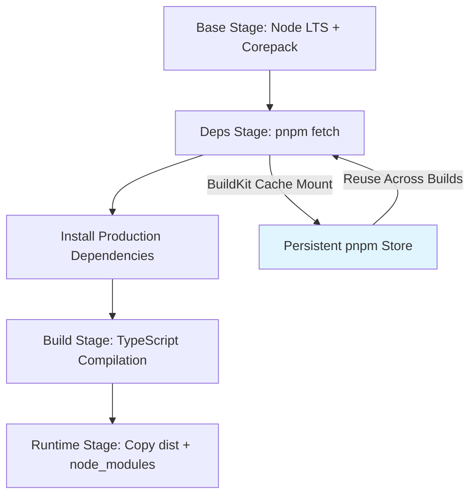
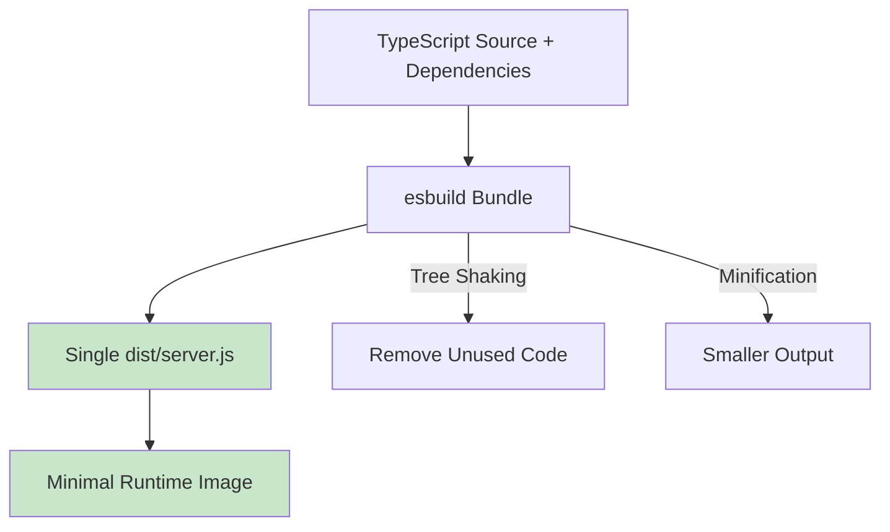
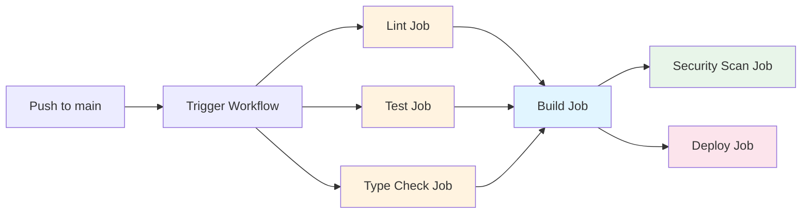
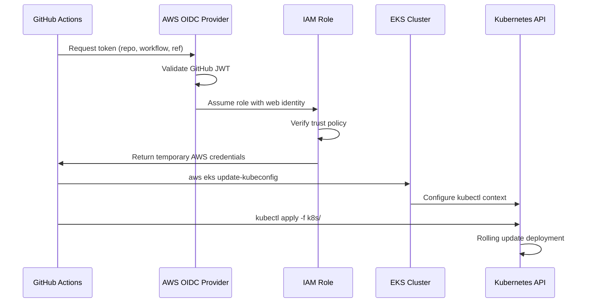
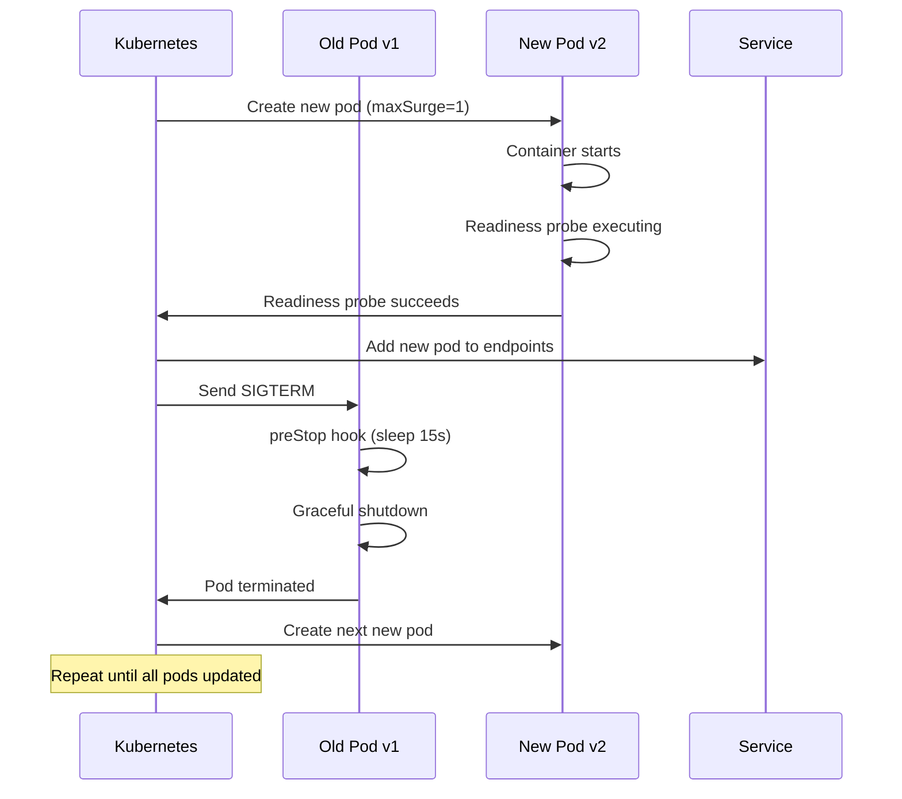
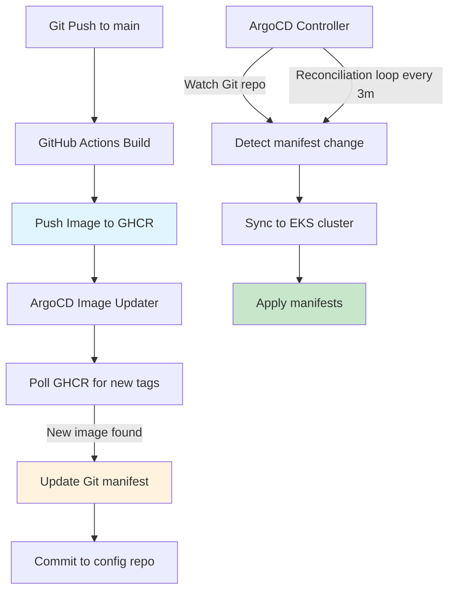
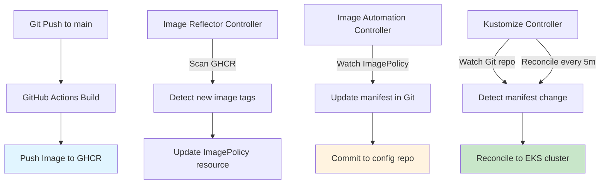
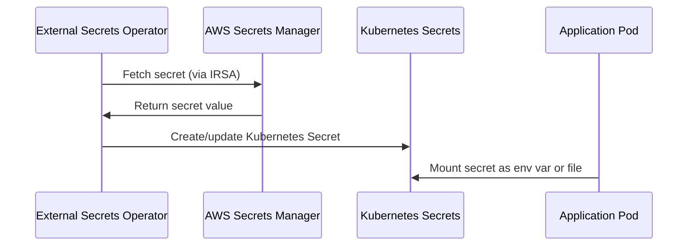
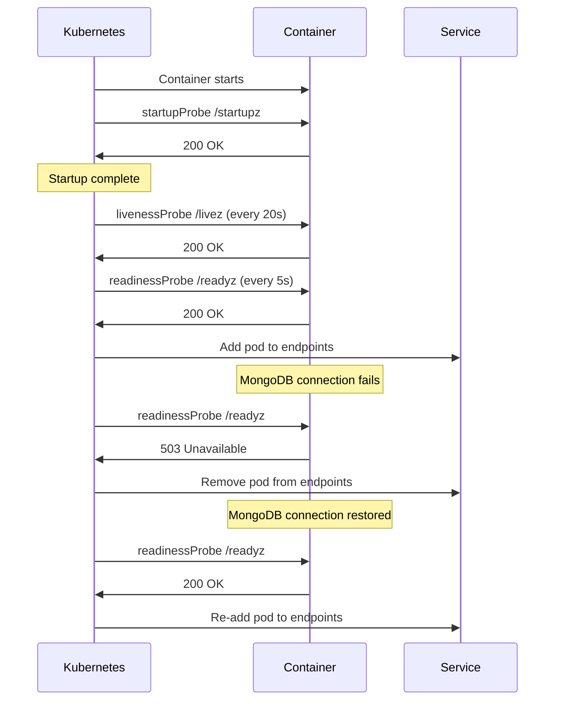

# Kubernetes Deployment Strategies for GraphQL Yoga Service - Research

**Date**: 2025-11-21
**Status**: Research Complete

## Table of Contents

- [Executive Summary](#executive-summary)
- [Container Build Strategies (Technical Deep Dive)](#container-build-strategies-technical-deep-dive)
- [CI/CD Pipeline Design](#cicd-pipeline-design)
- [EKS Deployment Methods](#eks-deployment-methods)
- [Integration with Existing EKS Infrastructure](#integration-with-existing-eks-infrastructure)
- [Production-Ready Patterns](#production-ready-patterns)
- [Recommended Implementation Roadmap](#recommended-implementation-roadmap)
- [Sources](#sources)

## Executive Summary

This research evaluates containerization and deployment strategies for a TypeScript GraphQL Yoga federated subgraph targeting AWS EKS, prioritizing build speed optimization and Vercel-like deployment automation.

**Key Recommendations:**

1. **Container Strategy**: Multi-stage Docker build with pnpm optimization + BuildKit cache mounts (NOT bundling due to MongoDB native dependencies)
2. **CI/CD**: GitHub Actions with OIDC authentication, GitHub Container Registry, parallel jobs, and type=gha cache backend
3. **Deployment**: Dual approach - Direct kubectl for immediate rollouts + ArgoCD for GitOps with Image Updater automation
4. **Image Tagging**: Git SHA + semantic version tags for traceability
5. **Build Time Target**: Sub-60 second cached builds, 2-3 minute cold builds

**Critical Finding**: While bundling (esbuild/ncc) can achieve smaller images and faster builds, the MongoDB Node.js driver contains native dependencies that prevent reliable bundling. The recommended approach uses optimized multi-stage builds achieving 50-70% size reduction vs unbundled approaches while maintaining compatibility.

---

## Container Build Strategies (Technical Deep Dive)

### Overview

Container build optimization focuses on three key metrics: build speed, image size, and maintainability. For Node.js TypeScript services, multiple strategies exist with significant trade-offs.

### Approach 1: Multi-Stage Docker Build with pnpm Optimization

**Description**: Traditional multi-stage approach leveraging pnpm's efficient dependency management and BuildKit cache mounts.

#### How It Works



**Optimized Dockerfile Structure**:

```dockerfile
# Stage 1: Base with pnpm
FROM node:20-slim AS base
RUN corepack enable
ENV PNPM_HOME="/pnpm"
ENV PATH="$PNPM_HOME:$PATH"

# Stage 2: Dependencies
FROM base AS deps
WORKDIR /app
COPY pnpm-lock.yaml ./
RUN --mount=type=cache,id=pnpm,target=/pnpm/store \
    pnpm fetch --frozen-lockfile

COPY package.json pnpm-lock.yaml ./
RUN --mount=type=cache,id=pnpm,target=/pnpm/store \
    pnpm install --frozen-lockfile --prod --offline

# Stage 3: Build
FROM base AS build
WORKDIR /app
COPY pnpm-lock.yaml package.json ./
RUN --mount=type=cache,id=pnpm,target=/pnpm/store \
    pnpm install --frozen-lockfile

COPY . .
RUN pnpm build

# Stage 4: Runtime
FROM node:20-slim AS runtime
WORKDIR /app
RUN addgroup --system --gid 1001 nodejs && \
    adduser --system --uid 1001 nodejs
USER nodejs

COPY --from=deps --chown=nodejs:nodejs /app/node_modules ./node_modules
COPY --from=build --chown=nodejs:nodejs /app/dist ./dist
COPY --from=build --chown=nodejs:nodejs /app/package.json ./

CMD ["node", "dist/server.js"]
```

**Key Optimization Techniques**:

1. **pnpm fetch**: Pre-populates pnpm store from lockfile without installing, enabling efficient layer caching
2. **BuildKit Cache Mounts**: `--mount=type=cache` persists pnpm store across builds (managed by BuildKit)
3. **Two-Step Installation**: Separate `pnpm install --prod` for runtime vs full install for build
4. **Layer Ordering**: Copy lockfile first to maximize cache hits

**Performance Benchmarks**:
- **First Build**: 2-3 minutes (full dependency download)
- **Cached Build (no changes)**: 30-45 seconds
- **Cached Build (code changes only)**: 45-60 seconds
- **Image Size**: 180-220 MB (with node:20-slim base)

**Pros**:
- Compatible with all native dependencies (MongoDB driver, etc.)
- Battle-tested, well-documented approach
- Excellent layer caching with pnpm
- BuildKit cache mounts dramatically improve rebuild speed
- No special bundling complexity

**Cons**:
- Larger image size compared to bundled approaches (but 50% smaller than naive node_modules copy)
- Slower cold builds compared to bundling
- Ships full node_modules directory

**When to Use**:
- Services with native dependencies (MongoDB, bcrypt, sharp, etc.)
- Teams prioritizing stability over extreme optimization
- When debugging requires full node_modules access

**pnpm-Specific Benefits**:
- Virtual store eliminates duplicate packages
- Hardlinks reduce disk usage
- `pnpm fetch` enables perfect layer cache separation

---

### Approach 2: Bundling with esbuild (Single Executable)

**Description**: Bundle all application code and dependencies into a single JavaScript file, eliminating node_modules.

#### How It Works



**esbuild Configuration for Node.js Backend**:

```javascript
// build.mjs
import * as esbuild from 'esbuild';

await esbuild.build({
  entryPoints: ['src/server.ts'],
  bundle: true,
  platform: 'node',
  target: 'node20',
  format: 'esm',
  outfile: 'dist/server.js',
  minify: true,
  sourcemap: true,
  external: [
    // CRITICAL: External native dependencies
    'mongodb',
    '@aws-sdk/client-kms',
    // Mark problematic packages as external
  ],
  banner: {
    js: "import { createRequire } from 'module';const require = createRequire(import.meta.url);",
  },
});
```

**Dockerfile with Bundling**:

```dockerfile
FROM node:20-slim AS build
WORKDIR /app
COPY package.json pnpm-lock.yaml ./
RUN corepack enable && pnpm install --frozen-lockfile
COPY . .
RUN pnpm build  # Runs esbuild

FROM node:20-slim AS runtime
WORKDIR /app
RUN addgroup --system --gid 1001 nodejs && \
    adduser --system --uid 1001 nodejs
USER nodejs

# Copy only bundled output + externalized dependencies
COPY --from=build --chown=nodejs:nodejs /app/dist/server.js ./
COPY --from=build --chown=nodejs:nodejs /app/node_modules/mongodb ./node_modules/mongodb

CMD ["node", "server.js"]
```

**Performance Benchmarks**:
- **First Build**: 1-2 minutes (esbuild is 10-100x faster than webpack)
- **Cached Build**: 15-30 seconds
- **Image Size**: 90-120 MB (50-60% reduction vs multi-stage)
- **Build Speed**: esbuild is **10-100x faster** than webpack

**Pros**:
- **Fastest build times**: esbuild leverages Go parallelism and caching
- **Smallest image size**: 50-90% reduction from baseline
- **Faster bootup**: Single file load vs hundreds of modules
- **Reduced attack surface**: No unnecessary dependencies in production

**Cons**:
- **Native dependency incompatibility**: MongoDB driver, bcrypt, etc. contain `.node` binaries that cannot be bundled
- **Workaround complexity**: Must mark native deps as `external`, then manually copy their node_modules
- **Debugging challenges**: Stack traces reference bundled code
- **GraphQL schema handling**: Requires loader plugin (`@luckycatfactory/esbuild-graphql-loader`)
- **Reflection issues**: TypeScript decorators need special handling

**Critical Limitation for This Project**:

The MongoDB Node.js driver includes native bindings (`.node` files) compiled for specific platforms. esbuild cannot bundle these, requiring them to be marked as external:

```javascript
external: ['mongodb', '@mongodb-js/zstd', 'kerberos', 'snappy']
```

This defeats much of the bundling benefit and introduces complexity in tracking which packages need externalization.

**When to Use**:
- Pure JavaScript services without native dependencies
- Serverless deployments (Lambda, Cloud Functions)
- When image size is critical (IoT, edge computing)
- Services that don't use reflection or decorators

**When to Avoid**:
- **Services with native dependencies** (MongoDB, PostgreSQL drivers, image processing libraries)
- GraphQL servers using schema-first approaches with decorators
- When debugging production issues is frequent

---

### Approach 3: Bundling with @vercel/ncc (Webpack Wrapper)

**Description**: Vercel's zero-config bundler specifically designed for Node.js, wrapping webpack with sensible defaults.

**ncc Characteristics**:
- Compiles Node.js project into single file
- Supports TypeScript, binary addons, dynamic requires
- **Designed** for Node.js (vs esbuild's general-purpose approach)
- Slower than esbuild but more compatible

**Performance Comparison**:
- **Build Speed**: esbuild is **significantly faster** than ncc (10x+)
- **npm Downloads**: esbuild (66M weekly) vs ncc (616K weekly)
- **Image Size**: Similar to esbuild (90-120 MB)

**Pros**:
- Better handling of dynamic `require()` statements
- Simpler configuration than webpack
- Designed specifically for Node.js backend bundling

**Cons**:
- **Much slower than esbuild** (uses webpack internally)
- **Same native dependency limitations** as esbuild
- Less active development (last major update 10 days ago vs esbuild's continuous updates)
- Smaller community

**Verdict**: For this project, ncc offers no advantages over esbuild (similar native dependency issues) while being significantly slower. Not recommended.

---

### Comparison Matrix

| Criteria                  | Multi-Stage (pnpm) | esbuild Bundle | ncc Bundle |
|---------------------------|-------------------|----------------|------------|
| **Build Time (Cold)**     | 2-3 min           | 1-2 min        | 2-3 min    |
| **Build Time (Cached)**   | 45-60 sec         | 15-30 sec      | 45-60 sec  |
| **Image Size**            | 180-220 MB        | 90-120 MB      | 90-120 MB  |
| **Native Deps Compatible**| ✅ Yes            | ⚠️ Partial     | ⚠️ Partial |
| **Complexity**            | Low               | Medium-High    | Medium     |
| **Debugging**             | Easy              | Harder         | Harder     |
| **GraphQL Compatible**    | ✅ Yes            | ⚠️ Plugin Req  | ⚠️ Limited |
| **Production Battle-Tested** | ✅ Industry Standard | ⚠️ Emerging | ⚠️ Niche |
| **Maintenance Burden**    | Low               | Medium         | Medium     |

**Key**:
- ✅ Full support
- ⚠️ Requires workarounds or has limitations
- ❌ Not supported

---

### Build Caching Strategies

#### BuildKit Cache Mounts

BuildKit cache mounts persist across builds and are managed by BuildKit, NOT Docker layers.

**Syntax**:
```dockerfile
RUN --mount=type=cache,id=pnpm,target=/pnpm/store \
    pnpm install --frozen-lockfile
```

**Benefits**:
- Cache survives even if Dockerfile changes
- Shared across different builds on same host
- No manual cache management needed

#### GitHub Actions Cache Integration

GitHub Actions provides a `type=gha` cache backend that stores cache in GitHub's Cache service (10 GB limit per repo).

**Example Workflow**:

```yaml
- name: Build and push Docker image
  uses: docker/build-push-action@v5
  with:
    context: .
    push: true
    tags: ${{ env.IMAGE_TAG }}
    cache-from: type=gha
    cache-to: type=gha,mode=max
```

**Performance**: One implementation reduced build time from **3m 15s to 38s** with GitHub Actions cache.

**Limitations**:
- 10 GB shared limit across all caches in repo
- Cache eviction after 7 days of inactivity

#### Remote Cache: ECR vs GitHub Container Registry

**Amazon ECR Remote Cache**:
- Native BuildKit support (Docker 25.0.0+ required)
- Must set `image-manifest=true` (ECR doesn't support OCI image index)
- Persistent storage, no time limits
- Best for AWS-heavy workflows

**GitHub Container Registry**:
- Free for public repos, unlimited bandwidth for public images
- Tight integration with GitHub Actions
- No pull rate limits (unlike Docker Hub)
- Best for GitHub-centric workflows

**Performance**: Both ECR and GHCR provide similar performance for remote caching. ECR is preferred when EKS pulls images frequently from same region (free data transfer).

**Recommendation for This Project**: Use **GitHub Container Registry with type=gha cache backend** for optimal GitHub Actions integration and cost (free for OSS).

---

### Technology Stack / Ecosystem

**Core Build Tools**:
- **Docker BuildKit**: Required for cache mounts and advanced features
- **docker/build-push-action@v5**: Official GitHub Action with BuildKit support
- **pnpm 9.x**: Fast, efficient package manager with excellent Docker support
- **Node.js 20 LTS**: Long-term support, native ESM support

**Optional Bundling Tools** (if pursued):
- **esbuild 0.20+**: Ultra-fast bundler
- **@luckycatfactory/esbuild-graphql-loader**: GraphQL file import support

**Registry Options**:
- **GitHub Container Registry (ghcr.io)**: Recommended for this project
- **Amazon ECR**: Alternative for AWS-centric deployments

---

### Recommended Approach for This Project

**Use Multi-Stage Docker Build with pnpm Optimization**

**Rationale**:
1. **MongoDB Compatibility**: Native dependencies in MongoDB driver prevent reliable bundling
2. **Stability**: Battle-tested approach with extensive documentation
3. **Debugging**: Full node_modules access simplifies production troubleshooting
4. **Team Velocity**: Lower complexity allows team to focus on features vs build optimization
5. **Good-Enough Performance**: 45-60 second cached builds meet speed requirements

**Implementation Steps**:
1. Adopt the optimized Dockerfile structure above
2. Configure GitHub Actions with BuildKit and type=gha cache
3. Use GitHub Container Registry for image hosting
4. Monitor build times and adjust cache strategies if needed

**Future Optimization Path**:
If native dependency issues are resolved or isolated to separate services, revisit esbuild bundling for faster builds and smaller images.

---

## CI/CD Pipeline Design

### Overview

GitHub Actions provides the foundation for automated builds, tests, and deployments. The pipeline must achieve sub-60 second builds (cached) and maintain high reliability.

### Build Optimization Strategies

#### Parallel Job Execution



**Parallel Execution Example**:

```yaml
jobs:
  lint:
    runs-on: ubuntu-latest
    steps:
      - uses: actions/checkout@v4
      - uses: pnpm/action-setup@v3
      - name: Lint
        run: pnpm lint

  test:
    runs-on: ubuntu-latest
    steps:
      - uses: actions/checkout@v4
      - uses: pnpm/action-setup@v3
      - name: Test
        run: pnpm test

  type-check:
    runs-on: ubuntu-latest
    steps:
      - uses: actions/checkout@v4
      - uses: pnpm/action-setup@v3
      - name: Type Check
        run: pnpm type-check

  build:
    needs: [lint, test, type-check]
    runs-on: ubuntu-latest
    # ... Docker build steps
```

**Benefits**:
- Jobs run concurrently (lint, test, type-check in parallel)
- Fail fast (build doesn't run if tests fail)
- Optimizes GitHub Actions runner usage

#### Matrix Strategy for Multi-Architecture Builds

For multi-platform support (AMD64 + ARM64):

```yaml
jobs:
  build:
    runs-on: ubuntu-latest
    strategy:
      matrix:
        platform:
          - linux/amd64
          - linux/arm64
    steps:
      - name: Set up QEMU
        uses: docker/setup-qemu-action@v3

      - name: Set up Docker Buildx
        uses: docker/setup-buildx-action@v3

      - name: Build and push by digest
        uses: docker/build-push-action@v5
        with:
          platforms: ${{ matrix.platform }}
          cache-from: type=gha
          cache-to: type=gha,mode=max
```

**Performance Optimization**: Use native runners per architecture (ARM runners for ARM builds, x86 for x86) to avoid QEMU emulation slowdown. This can reduce build times from **2 hours to 20 minutes**.

**Note**: For EKS on x86, multi-arch builds are optional. Include only if supporting ARM-based EKS nodes (Graviton).

---

### Image Tagging Strategy

**Recommended Multi-Tag Approach**:

```yaml
tags: |
  ghcr.io/${{ github.repository }}:${{ github.sha }}
  ghcr.io/${{ github.repository }}:${{ github.ref_name }}
  ghcr.io/${{ github.repository }}:latest
```

**Tag Types**:

1. **Git SHA Tag** (`abc123def`): Immutable, traceable to exact commit
2. **Branch/Semantic Version Tag** (`v1.2.3`, `main`): Human-readable reference
3. **Environment Tag** (`production`, `staging`): Current deployed version
4. **`latest` Tag**: Convenience (avoid in production, use explicit versions)

**Best Practices**:
- **Never reuse tags**: Enable tag immutability in registry
- **Production deployments**: Use Git SHA tags for exact traceability
- **Semantic versioning**: Trigger on Git tags matching `v*` pattern
- **Multiple tags**: Push same image with multiple tags for flexibility

**Example with Semantic Versioning**:

```yaml
- name: Docker meta
  id: meta
  uses: docker/metadata-action@v5
  with:
    images: ghcr.io/${{ github.repository }}
    tags: |
      type=ref,event=branch
      type=ref,event=pr
      type=semver,pattern={{version}}
      type=semver,pattern={{major}}.{{minor}}
      type=sha,prefix={{branch}}-

- name: Build and push
  uses: docker/build-push-action@v5
  with:
    tags: ${{ steps.meta.outputs.tags }}
    labels: ${{ steps.meta.outputs.labels }}
```

**Output Tags**:
- `ghcr.io/user/repo:main-abc123d` (branch + SHA)
- `ghcr.io/user/repo:1.2.3` (exact version)
- `ghcr.io/user/repo:1.2` (minor version)
- `ghcr.io/user/repo:1` (major version)

---

### Image Security Scanning

**Recommended Tools**:

1. **Trivy** (Open Source, comprehensive)
2. **Snyk** (Commercial, developer-friendly)

**Trivy Integration**:

```yaml
- name: Run Trivy vulnerability scanner
  uses: aquasecurity/trivy-action@0.28.0
  with:
    image-ref: ghcr.io/${{ github.repository }}:${{ github.sha }}
    format: 'sarif'
    output: 'trivy-results.sarif'
    severity: 'CRITICAL,HIGH'
    exit-code: '1'  # Fail build on vulnerabilities

- name: Upload Trivy results to GitHub Security
  uses: github/codeql-action/upload-sarif@v3
  if: always()
  with:
    sarif_file: 'trivy-results.sarif'
```

**Features**:
- Scans OS packages and application dependencies
- Configurable severity filters (CRITICAL, HIGH, MEDIUM, LOW)
- Integrates with GitHub Security tab
- Fast (minimal resource usage)
- Caches vulnerability database

**Snyk Integration**:

```yaml
- name: Run Snyk to check for vulnerabilities
  uses: snyk/actions/docker@master
  env:
    SNYK_TOKEN: ${{ secrets.SNYK_TOKEN }}
  with:
    image: ghcr.io/${{ github.repository }}:${{ github.sha }}
    args: --severity-threshold=high
```

**Combined Approach**: Use Trivy for OS-level scanning and Snyk for application dependency insights with remediation suggestions.

---

### Complete CI/CD Workflow Example

```yaml
name: Build and Deploy

on:
  push:
    branches: [main]
    tags: ['v*']
  pull_request:
    branches: [main]

env:
  REGISTRY: ghcr.io
  IMAGE_NAME: ${{ github.repository }}

jobs:
  lint-test:
    runs-on: ubuntu-latest
    strategy:
      matrix:
        task: [lint, test, type-check]
    steps:
      - uses: actions/checkout@v4

      - uses: pnpm/action-setup@v3
        with:
          version: 9

      - uses: actions/setup-node@v4
        with:
          node-version: 20
          cache: 'pnpm'

      - run: pnpm install --frozen-lockfile

      - name: Run ${{ matrix.task }}
        run: pnpm ${{ matrix.task }}

  build-push:
    needs: lint-test
    runs-on: ubuntu-latest
    permissions:
      contents: read
      packages: write
    outputs:
      image-tag: ${{ steps.meta.outputs.tags }}
    steps:
      - uses: actions/checkout@v4

      - name: Set up Docker Buildx
        uses: docker/setup-buildx-action@v3

      - name: Log in to Container Registry
        uses: docker/login-action@v3
        with:
          registry: ${{ env.REGISTRY }}
          username: ${{ github.actor }}
          password: ${{ secrets.GITHUB_TOKEN }}

      - name: Extract metadata
        id: meta
        uses: docker/metadata-action@v5
        with:
          images: ${{ env.REGISTRY }}/${{ env.IMAGE_NAME }}
          tags: |
            type=ref,event=branch
            type=semver,pattern={{version}}
            type=sha,prefix={{branch}}-

      - name: Build and push
        uses: docker/build-push-action@v5
        with:
          context: .
          push: true
          tags: ${{ steps.meta.outputs.tags }}
          labels: ${{ steps.meta.outputs.labels }}
          cache-from: type=gha
          cache-to: type=gha,mode=max

      - name: Run Trivy scanner
        uses: aquasecurity/trivy-action@0.28.0
        with:
          image-ref: ${{ steps.meta.outputs.tags }}
          format: 'sarif'
          output: 'trivy-results.sarif'
          severity: 'CRITICAL,HIGH'

      - name: Upload Trivy results
        uses: github/codeql-action/upload-sarif@v3
        if: always()
        with:
          sarif_file: 'trivy-results.sarif'

  deploy:
    needs: build-push
    if: github.ref == 'refs/heads/main'
    uses: ./.github/workflows/deploy-eks.yml
    with:
      image-tag: ${{ needs.build-push.outputs.image-tag }}
    secrets: inherit
```

---

### Reusable Workflows and Composite Actions

**When to Use Each**:

| Pattern | Use Case | Invocation Level | Secrets Access |
|---------|----------|------------------|----------------|
| **Reusable Workflow** | Complete jobs (build, deploy) | Job level | Via `secrets: inherit` |
| **Composite Action** | Grouped steps (docker build, security scan) | Step level | Via inputs |

**Example Composite Action** (`.github/actions/docker-build/action.yml`):

```yaml
name: 'Docker Build and Push'
description: 'Builds and pushes Docker image with caching'
inputs:
  registry:
    description: 'Container registry URL'
    required: true
  image-name:
    description: 'Image name'
    required: true
  github-token:
    description: 'GitHub token'
    required: true

runs:
  using: 'composite'
  steps:
    - name: Set up Docker Buildx
      uses: docker/setup-buildx-action@v3
      shell: bash

    - name: Log in to registry
      uses: docker/login-action@v3
      with:
        registry: ${{ inputs.registry }}
        username: ${{ github.actor }}
        password: ${{ inputs.github-token }}
      shell: bash

    - name: Build and push
      uses: docker/build-push-action@v5
      with:
        context: .
        push: true
        tags: ${{ inputs.registry }}/${{ inputs.image-name }}:${{ github.sha }}
        cache-from: type=gha
        cache-to: type=gha,mode=max
      shell: bash
```

**Usage in Workflow**:

```yaml
- uses: ./.github/actions/docker-build
  with:
    registry: ghcr.io
    image-name: ${{ github.repository }}
    github-token: ${{ secrets.GITHUB_TOKEN }}
```

**Best Practices**:
- Store composite actions in `.github/actions/`
- Store reusable workflows in `.github/workflows/`
- Use reusable workflows for cross-repo patterns
- Use composite actions for step grouping within same repo

---

## EKS Deployment Methods

### Overview

Two deployment approaches are recommended: Direct kubectl for immediate control and GitOps for automated, auditable deployments. Both can coexist.

### Approach A: Direct kubectl Deployment

Direct kubectl deployment uses GitHub Actions to authenticate with EKS and apply Kubernetes manifests immediately.

#### Architecture



#### AWS Authentication with OIDC

**Why OIDC over Static Credentials**:
- No long-lived AWS access keys stored in GitHub Secrets
- Short-lived tokens (1 hour expiration)
- Scoped to specific GitHub repo/workflow/branch
- Improved security posture, eliminates credential rotation

**Setup Steps**:

1. **Create OIDC Provider in AWS** (one-time setup):

```bash
aws iam create-open-id-connect-provider \
  --url https://token.actions.githubusercontent.com \
  --client-id-list sts.amazonaws.com \
  --thumbprint-list 6938fd4d98bab03faadb97b34396831e3780aea1
```

2. **Create IAM Role with Trust Policy**:

```json
{
  "Version": "2012-10-17",
  "Statement": [
    {
      "Effect": "Allow",
      "Principal": {
        "Federated": "arn:aws:iam::ACCOUNT_ID:oidc-provider/token.actions.githubusercontent.com"
      },
      "Action": "sts:AssumeRoleWithWebIdentity",
      "Condition": {
        "StringEquals": {
          "token.actions.githubusercontent.com:aud": "sts.amazonaws.com",
          "token.actions.githubusercontent.com:sub": "repo:USERNAME/REPO:ref:refs/heads/main"
        }
      }
    }
  ]
}
```

**Key Conditions**:
- `sub`: Restricts to specific repo and branch (e.g., `repo:org/comments-server:ref:refs/heads/main`)
- `aud`: Audience must be `sts.amazonaws.com`

3. **Attach IAM Policies to Role**:

```json
{
  "Version": "2012-10-17",
  "Statement": [
    {
      "Effect": "Allow",
      "Action": [
        "eks:DescribeCluster"
      ],
      "Resource": "arn:aws:eks:REGION:ACCOUNT_ID:cluster/CLUSTER_NAME"
    }
  ]
}
```

4. **Configure EKS Access Entry** (EKS RBAC):

```bash
aws eks create-access-entry \
  --cluster-name my-cluster \
  --principal-arn arn:aws:iam::ACCOUNT_ID:role/GitHubActionsEKSRole \
  --type STANDARD \
  --kubernetes-groups system:masters
```

**Note**: Granting `system:masters` provides full cluster access. For production, create custom RBAC roles scoped to specific namespaces.

#### GitHub Actions Workflow

```yaml
name: Deploy to EKS

on:
  workflow_call:
    inputs:
      image-tag:
        required: true
        type: string
      environment:
        required: true
        type: string

permissions:
  id-token: write  # Required for OIDC
  contents: read

jobs:
  deploy:
    runs-on: ubuntu-latest
    environment: ${{ inputs.environment }}
    steps:
      - uses: actions/checkout@v4

      - name: Configure AWS credentials
        uses: aws-actions/configure-aws-credentials@v4
        with:
          role-to-assume: ${{ secrets.AWS_ROLE_ARN }}
          aws-region: us-east-1

      - name: Update kubeconfig
        run: |
          aws eks update-kubeconfig \
            --name ${{ secrets.EKS_CLUSTER_NAME }} \
            --region us-east-1

      - name: Update image in manifests
        run: |
          cd k8s
          kustomize edit set image \
            comments-server=${{ inputs.image-tag }}

      - name: Deploy to EKS
        run: |
          kubectl apply -k k8s/overlays/${{ inputs.environment }}

      - name: Wait for rollout
        run: |
          kubectl rollout status deployment/comments-server \
            -n ${{ inputs.environment }} \
            --timeout=5m

      - name: Verify deployment
        run: |
          kubectl get pods -n ${{ inputs.environment }} \
            -l app=comments-server
```

#### Zero-Downtime Deployment Configuration

**Deployment Manifest**:

```yaml
apiVersion: apps/v1
kind: Deployment
metadata:
  name: comments-server
spec:
  replicas: 3
  strategy:
    type: RollingUpdate
    rollingUpdate:
      maxSurge: 1        # Create 1 extra pod during update
      maxUnavailable: 0  # Keep all old pods running until new ones ready
  selector:
    matchLabels:
      app: comments-server
  template:
    metadata:
      labels:
        app: comments-server
    spec:
      containers:
      - name: comments-server
        image: ghcr.io/user/comments-server:latest
        ports:
        - containerPort: 3000

        # Readiness probe: When is pod ready to receive traffic?
        readinessProbe:
          httpGet:
            path: /readyz
            port: 3000
          initialDelaySeconds: 5
          periodSeconds: 5
          successThreshold: 1
          failureThreshold: 3

        # Liveness probe: When should pod be restarted?
        livenessProbe:
          httpGet:
            path: /livez
            port: 3000
          initialDelaySeconds: 15
          periodSeconds: 20
          successThreshold: 1
          failureThreshold: 3

        # Lifecycle: Graceful shutdown
        lifecycle:
          preStop:
            exec:
              command: ["/bin/sh", "-c", "sleep 15"]
```

**RollingUpdate Process**:



**Key Parameters**:
- `maxSurge: 1`: Temporarily create 1 extra pod (total 4 pods during rollout)
- `maxUnavailable: 0`: Never reduce below 3 ready pods
- `preStop` hook: Delay termination by 15s to ensure service updated endpoints

#### Rollback Strategy

**Manual Rollback**:

```bash
# View rollout history
kubectl rollout history deployment/comments-server -n production

# Rollback to previous version
kubectl rollout undo deployment/comments-server -n production

# Rollback to specific revision
kubectl rollout undo deployment/comments-server -n production --to-revision=3
```

**Automated Rollback in GitHub Actions**:

```yaml
- name: Deploy to EKS
  id: deploy
  run: kubectl apply -k k8s/overlays/production

- name: Wait for rollout
  id: rollout
  run: |
    kubectl rollout status deployment/comments-server \
      -n production --timeout=5m
  continue-on-error: true

- name: Rollback on failure
  if: steps.rollout.outcome == 'failure'
  run: |
    echo "Deployment failed, rolling back..."
    kubectl rollout undo deployment/comments-server -n production

- name: Verify rollback
  if: steps.rollout.outcome == 'failure'
  run: |
    kubectl rollout status deployment/comments-server \
      -n production --timeout=3m
```

**Using GitHub Actions Rollback Action**:

```yaml
- name: Rollback on failure
  if: failure()
  uses: smartlyio/kubernetes-rollback-action@v1
  with:
    kubeconfig: ${{ secrets.KUBECONFIG_DATA }}
    namespace: production
    deployment: comments-server
```

#### Pros and Cons

**Pros**:
- ✅ Immediate feedback (deployment happens in same workflow run)
- ✅ Full control over timing
- ✅ Simple mental model (imperative commands)
- ✅ Easy to understand for kubectl-familiar teams
- ✅ No additional tools to install (ArgoCD/Flux)

**Cons**:
- ❌ No audit trail beyond GitHub Actions logs
- ❌ No drift detection (manual kubectl changes not reverted)
- ❌ Harder to manage multiple clusters/environments at scale
- ❌ Secrets management requires GitHub Secrets or External Secrets Operator

**When to Use**:
- Fast iteration during development
- Small teams with single cluster
- Deploying to dev/staging environments
- When immediate rollouts are priority

---

### Approach B: GitOps with ArgoCD

ArgoCD is a declarative, GitOps continuous delivery tool for Kubernetes with a web UI, RBAC, and automated image updates.

#### Architecture



#### Setup and Installation

**Install ArgoCD on EKS**:

```bash
# Create namespace
kubectl create namespace argocd

# Install ArgoCD
kubectl apply -n argocd -f \
  https://raw.githubusercontent.com/argoproj/argo-cd/stable/manifests/install.yaml

# Install ArgoCD Image Updater
kubectl apply -n argocd -f \
  https://raw.githubusercontent.com/argoproj-labs/argocd-image-updater/stable/manifests/install.yaml

# Access ArgoCD UI (get initial password)
kubectl -n argocd get secret argocd-initial-admin-secret \
  -o jsonpath="{.data.password}" | base64 -d

# Port forward to access UI
kubectl port-forward svc/argocd-server -n argocd 8080:443
```

#### Repository Structure for GitOps

**Option 1: Monorepo** (application code + k8s manifests)

```
comments-server/
├── src/
├── k8s/
│   ├── base/
│   │   ├── deployment.yaml
│   │   ├── service.yaml
│   │   └── kustomization.yaml
│   └── overlays/
│       ├── dev/
│       ├── staging/
│       └── production/
└── .github/workflows/
```

**Option 2: Separate Config Repo** (recommended for production)

```
comments-server/          # Application code
└── .github/workflows/

comments-config/          # Kubernetes manifests
├── apps/
│   └── comments-server/
│       ├── base/
│       └── overlays/
└── README.md
```

**Why Separate Repos**:
- ✅ Privilege separation (different teams, different access)
- ✅ ArgoCD only watches config repo (not triggered by code changes)
- ✅ Easier to manage across multiple environments
- ✅ Clear separation of concerns

**Recommended Structure**: **Separate config repo** for production, monorepo acceptable for small teams/dev environments.

#### ArgoCD Application Manifest

```yaml
apiVersion: argoproj.io/v1alpha1
kind: Application
metadata:
  name: comments-server
  namespace: argocd
  annotations:
    argocd-image-updater.argoproj.io/image-list: comments-server=ghcr.io/user/comments-server
    argocd-image-updater.argoproj.io/comments-server.update-strategy: semver
    argocd-image-updater.argoproj.io/comments-server.allow-tags: regexp:^v[0-9]+\.[0-9]+\.[0-9]+$
    argocd-image-updater.argoproj.io/write-back-method: git
spec:
  project: default
  source:
    repoURL: https://github.com/user/comments-config
    targetRevision: main
    path: apps/comments-server/overlays/production
  destination:
    server: https://kubernetes.default.svc
    namespace: production
  syncPolicy:
    automated:
      prune: true      # Delete resources not in Git
      selfHeal: true   # Revert manual kubectl changes
    syncOptions:
      - CreateNamespace=true
    retry:
      limit: 5
      backoff:
        duration: 5s
        factor: 2
        maxDuration: 3m
```

**Key Features**:
- **Image Updater**: Automatically updates image tags when new versions published
- **Automated Sync**: Applies Git changes within 3 minutes (default reconciliation)
- **Self-Heal**: Reverts manual kubectl changes (drift detection)
- **Prune**: Removes resources deleted from Git

#### Image Automation with ArgoCD Image Updater

**How It Works**:

1. ArgoCD Image Updater polls GHCR every 2 minutes (configurable)
2. Detects new image tags matching `allow-tags` regex
3. Updates image in Git manifest (commits to config repo)
4. ArgoCD detects Git change and syncs to cluster

**Update Strategies**:

- `semver`: Semantic versioning (e.g., `v1.2.3` → `v1.2.4`)
- `latest`: Always use latest tag
- `name`: Alphanumeric sorting
- `digest`: Use image digest (immutable)

**Example with GitHub Container Registry**:

```yaml
annotations:
  argocd-image-updater.argoproj.io/image-list: comments-server=ghcr.io/user/comments-server
  argocd-image-updater.argoproj.io/comments-server.update-strategy: semver
  argocd-image-updater.argoproj.io/comments-server.pull-secret: pullsecret:argocd/github-registry-creds
```

**GitHub Registry Authentication**:

```bash
# Create secret for GHCR access
kubectl create secret docker-registry github-registry-creds \
  -n argocd \
  --docker-server=ghcr.io \
  --docker-username=USERNAME \
  --docker-password=GITHUB_TOKEN
```

#### Web UI and Observability

ArgoCD's standout feature is its **rich web UI** for visualizing applications and deployments:

- Live resource tree showing all Kubernetes objects
- Sync status, health status, deployment history
- Diff view showing Git vs cluster state
- Manual sync, rollback, and parameter override capabilities
- RBAC integration (SSO with GitHub, Google, LDAP)

**Access UI**:

```bash
# Get admin password
kubectl -n argocd get secret argocd-initial-admin-secret \
  -o jsonpath="{.data.password}" | base64 -d

# Access via port-forward
kubectl port-forward svc/argocd-server -n argocd 8080:443

# Or expose via Ingress (production)
```

#### Pros and Cons

**Pros**:
- ✅ **Web UI**: Visual application management, approval workflows
- ✅ **Audit trail**: Full Git history of all changes
- ✅ **Drift detection**: Self-healing reverts manual changes
- ✅ **Multi-cluster**: Manage multiple EKS clusters from single ArgoCD instance
- ✅ **RBAC**: Fine-grained access control per app/namespace
- ✅ **Image automation**: Automatic updates when new images pushed
- ✅ **Rollback**: Easy rollback via UI or CLI to any Git commit

**Cons**:
- ❌ **Additional complexity**: Requires ArgoCD installation and maintenance
- ❌ **Learning curve**: Team must learn ArgoCD concepts (Application, Project, AppProject)
- ❌ **Sync delay**: 3-minute default reconciliation (vs immediate with kubectl)
- ❌ **Image updater limitations**: Requires careful tag strategy and regex configuration

**When to Use**:
- Production environments requiring audit trails
- Multi-cluster/multi-environment deployments
- Teams wanting GitOps discipline and drift prevention
- When developer self-service UI is valuable

---

### Approach C: GitOps with Flux CD

Flux CD is a Kubernetes-native GitOps engine built entirely around controllers and CRDs, with no UI (command-line first).

#### Architecture



#### Setup and Installation

**Install Flux CLI**:

```bash
# macOS
brew install fluxcd/tap/flux

# Linux
curl -s https://fluxcd.io/install.sh | sudo bash
```

**Bootstrap Flux on EKS**:

```bash
# Export GitHub token
export GITHUB_TOKEN=<your-token>

# Bootstrap Flux (creates repo, installs controllers)
flux bootstrap github \
  --owner=USER \
  --repository=comments-config \
  --branch=main \
  --path=clusters/production \
  --personal
```

**What This Does**:
1. Creates `comments-config` repo (or uses existing)
2. Installs Flux controllers in `flux-system` namespace
3. Configures Git repository as source
4. Sets up auto-sync from Git to cluster

#### Image Automation Configuration

**1. Create ImageRepository** (scan GHCR):

```yaml
apiVersion: image.toolkit.fluxcd.io/v1beta2
kind: ImageRepository
metadata:
  name: comments-server
  namespace: flux-system
spec:
  image: ghcr.io/user/comments-server
  interval: 5m
  secretRef:
    name: github-registry-creds
```

**2. Create ImagePolicy** (which tags to use):

```yaml
apiVersion: image.toolkit.fluxcd.io/v1beta2
kind: ImagePolicy
metadata:
  name: comments-server
  namespace: flux-system
spec:
  imageRepositoryRef:
    name: comments-server
  policy:
    semver:
      range: '>=1.0.0'  # Only consider semver tags >= 1.0.0
```

**3. Mark Manifest for Auto-Update**:

```yaml
apiVersion: apps/v1
kind: Deployment
metadata:
  name: comments-server
spec:
  template:
    spec:
      containers:
      - name: comments-server
        image: ghcr.io/user/comments-server:1.0.0 # {"$imagepolicy": "flux-system:comments-server"}
```

**The comment `# {"$imagepolicy": "..."}` tells Flux which ImagePolicy to use for this field.**

**4. Create ImageUpdateAutomation** (commit to Git):

```yaml
apiVersion: image.toolkit.fluxcd.io/v1beta1
kind: ImageUpdateAutomation
metadata:
  name: comments-server
  namespace: flux-system
spec:
  interval: 10m
  sourceRef:
    kind: GitRepository
    name: flux-system
  git:
    checkout:
      ref:
        branch: main
    commit:
      author:
        email: fluxcdbot@users.noreply.github.com
        name: fluxcdbot
      messageTemplate: |
        Update image to {{range .Updated.Images}}{{println .}}{{end}}
    push:
      branch: main
  update:
    path: ./apps/comments-server
    strategy: Setters
```

**How It Works**:
1. Image Reflector scans GHCR every 5 minutes
2. Image Policy determines latest tag matching semver range
3. Image Automation updates manifest comment-marked field
4. Commits change to Git with message like "Update image to ghcr.io/user/comments-server:1.2.3"
5. Kustomize Controller detects Git change and syncs to cluster

#### Kustomize Integration

Flux has **native Kustomize support** via Kustomize Controller:

```yaml
apiVersion: kustomize.toolkit.fluxcd.io/v1
kind: Kustomization
metadata:
  name: comments-server
  namespace: flux-system
spec:
  interval: 5m
  path: ./apps/comments-server/overlays/production
  prune: true
  sourceRef:
    kind: GitRepository
    name: flux-system
  healthChecks:
    - apiVersion: apps/v1
      kind: Deployment
      name: comments-server
      namespace: production
```

**Features**:
- Reconciles Kustomize overlays every 5 minutes
- Prunes resources removed from Git
- Health checks ensure deployment is healthy before marking as ready

#### Monitoring and Observability

Flux is **CLI-first**, but visualization available via:

**1. Weave GitOps (Open Source UI)**:

```bash
# Install Weave GitOps
flux install \
  --components-extra=image-reflector-controller,image-automation-controller

kubectl apply -f https://github.com/weaveworks/weave-gitops/releases/latest/download/gitops-run.yaml

# Access UI
kubectl port-forward svc/weave-gitops -n flux-system 9001:9001
```

**2. Flux CLI**:

```bash
# Check reconciliation status
flux get kustomizations

# Check image automation
flux get images all

# Reconcile immediately (don't wait for interval)
flux reconcile kustomization comments-server --with-source

# View logs
flux logs --level=info
```

#### Pros and Cons

**Pros**:
- ✅ **Kubernetes-native**: Everything is a CRD, follows K8s patterns
- ✅ **Modular**: Fine-grained control over reconciliation intervals per component
- ✅ **Native Kustomize/Helm**: First-class support for both
- ✅ **Low resource usage**: Lightweight controllers
- ✅ **CNCF project**: Active community, backed by CNCF (despite Weaveworks shutdown)
- ✅ **Multi-tenancy**: Better isolation via namespaced resources

**Cons**:
- ❌ **No native UI**: CLI-first (Weave GitOps UI is basic)
- ❌ **Steeper learning curve**: Must understand CRDs and reconciliation loops
- ❌ **Less discoverable**: Harder to onboard non-Kubernetes experts
- ❌ **Image automation complexity**: Requires multiple CRDs (ImageRepository, ImagePolicy, ImageUpdateAutomation)
- ❌ **Weaveworks shutdown concern**: Main sponsor shut down (Feb 2024), though project continues under CNCF

**When to Use**:
- Teams deep in Kubernetes preferring CRD-based workflows
- Multi-tenant environments requiring namespace isolation
- When low resource overhead is critical
- Teams comfortable with CLI-first tooling

---

### ArgoCD vs Flux: Decision Matrix

| Criteria | ArgoCD | Flux CD | Winner |
|----------|--------|---------|--------|
| **Web UI** | ✅ Rich, built-in | ⚠️ Basic (Weave GitOps) | **ArgoCD** |
| **User Onboarding** | Easy (visual) | Harder (CLI/CRDs) | **ArgoCD** |
| **Multi-Cluster** | ✅ Native support | ✅ Via CRDs | Tie |
| **RBAC** | ✅ Native, SSO | ⚠️ K8s RBAC only | **ArgoCD** |
| **Image Automation** | ✅ Image Updater addon | ✅ Native controllers | Tie |
| **Kubernetes-Native** | ⚠️ Custom API | ✅ All CRDs | **Flux** |
| **Resource Usage** | Medium | Low | **Flux** |
| **Reconciliation Control** | Global setting | Per-resource | **Flux** |
| **Learning Curve** | Moderate | Steep | **ArgoCD** |
| **Production Maturity** | ✅ Battle-tested | ✅ Battle-tested | Tie |
| **Community Health (2024)** | ✅ Strong | ⚠️ Weaveworks shutdown | **ArgoCD** |
| **Progressive Delivery** | ✅ Argo Rollouts | ⚠️ Flagger (separate) | **ArgoCD** |

**Recommendation for This Project**: **ArgoCD**

**Rationale**:
1. **User experience**: Advanced user still benefits from UI for troubleshooting, approvals
2. **Team scalability**: Easier onboarding for future team members
3. **RBAC**: Native support for GitHub SSO, role-based access
4. **Image Updater**: Simpler annotation-based configuration vs Flux's multi-CRD approach
5. **Community momentum**: ArgoCD has stronger momentum post-Weaveworks shutdown

**When Flux Might Be Better**: If team is already deep in Kubernetes CRDs, prefers CLI workflows, or requires per-resource reconciliation control.

---

### Hybrid Approach: Direct kubectl + ArgoCD

**Use Both**:
- **Dev/Staging**: Direct kubectl from GitHub Actions (fast iteration)
- **Production**: ArgoCD with automated image updates (audit trail, drift prevention)

**Workflow**:

```yaml
deploy-dev:
  if: github.ref == 'refs/heads/develop'
  uses: ./.github/workflows/deploy-kubectl.yml
  with:
    environment: dev

deploy-staging:
  if: github.ref == 'refs/heads/main'
  uses: ./.github/workflows/deploy-kubectl.yml
  with:
    environment: staging

deploy-production:
  if: startsWith(github.ref, 'refs/tags/v')
  runs-on: ubuntu-latest
  steps:
    - name: Tag production image
      run: |
        # ArgoCD Image Updater will detect this and auto-deploy
        docker tag ghcr.io/user/comments-server:${{ github.sha }} \
                   ghcr.io/user/comments-server:${{ github.ref_name }}
        docker push ghcr.io/user/comments-server:${{ github.ref_name }}
```

**Benefits**:
- Fast feedback loop in dev/staging
- Production safety with GitOps
- Gradual team adoption of ArgoCD

---

## Integration with Existing EKS Infrastructure

### Ingress Controller Integration

#### AWS ALB Ingress Controller vs NGINX

**AWS Load Balancer Controller** (formerly ALB Ingress Controller):

**Strengths**:
- Native AWS integration (ACM for SSL, WAF, Shield)
- Managed by AWS (no maintenance burden for LB itself)
- Automatic scaling based on traffic
- L7 routing (path, header, hostname based)

**Limitations**:
- AWS-exclusive (vendor lock-in)
- Subject to ALB limits (target groups per ALB)
- Less flexible advanced routing vs NGINX

**NGINX Ingress Controller**:

**Strengths**:
- Cloud-agnostic (multi-cloud, on-prem)
- Advanced routing (URL rewrites, regex, custom logic)
- Full control over configuration
- Can be fronted by NLB for AWS integration

**Drawbacks**:
- Requires maintenance, patching, scaling
- No native ACM integration (must manage certs separately)

**Recommendation**: **AWS Load Balancer Controller** for EKS deployments prioritizing operational simplicity and AWS-native features. Use NGINX if multi-cloud or advanced routing is required.

**Installation** (AWS LBC):

```bash
# Install AWS Load Balancer Controller via Helm
helm repo add eks https://aws.github.io/eks-charts
helm install aws-load-balancer-controller eks/aws-load-balancer-controller \
  -n kube-system \
  --set clusterName=my-cluster \
  --set serviceAccount.create=false \
  --set serviceAccount.name=aws-load-balancer-controller
```

**Ingress Example**:

```yaml
apiVersion: networking.k8s.io/v1
kind: Ingress
metadata:
  name: comments-server
  annotations:
    alb.ingress.kubernetes.io/scheme: internet-facing
    alb.ingress.kubernetes.io/target-type: ip
    alb.ingress.kubernetes.io/certificate-arn: arn:aws:acm:...
    alb.ingress.kubernetes.io/listen-ports: '[{"HTTPS":443}]'
spec:
  ingressClassName: alb
  rules:
  - host: api.example.com
    http:
      paths:
      - path: /graphql
        pathType: Prefix
        backend:
          service:
            name: comments-server
            port:
              number: 3000
```

---

### Secrets Management: External Secrets Operator

**Problem**: Storing secrets in Git is insecure. Kubernetes Secrets are base64-encoded (not encrypted).

**Solution**: External Secrets Operator syncs secrets from AWS Secrets Manager to Kubernetes Secrets.

#### Architecture



#### Setup

**1. Install External Secrets Operator**:

```bash
helm repo add external-secrets https://charts.external-secrets.io
helm install external-secrets \
  external-secrets/external-secrets \
  -n external-secrets-system \
  --create-namespace
```

**2. Create IAM Role for IRSA**:

```json
{
  "Version": "2012-10-17",
  "Statement": [
    {
      "Effect": "Allow",
      "Action": [
        "secretsmanager:GetSecretValue",
        "secretsmanager:DescribeSecret"
      ],
      "Resource": "arn:aws:secretsmanager:REGION:ACCOUNT:secret:comments-server/*"
    }
  ]
}
```

**3. Create ServiceAccount with IRSA**:

```yaml
apiVersion: v1
kind: ServiceAccount
metadata:
  name: external-secrets
  namespace: production
  annotations:
    eks.amazonaws.com/role-arn: arn:aws:iam::ACCOUNT:role/ExternalSecretsRole
```

**4. Create ClusterSecretStore**:

```yaml
apiVersion: external-secrets.io/v1beta1
kind: ClusterSecretStore
metadata:
  name: aws-secrets-manager
spec:
  provider:
    aws:
      service: SecretsManager
      region: us-east-1
      auth:
        jwt:
          serviceAccountRef:
            name: external-secrets
            namespace: production
```

**5. Create ExternalSecret**:

```yaml
apiVersion: external-secrets.io/v1beta1
kind: ExternalSecret
metadata:
  name: comments-server-secrets
  namespace: production
spec:
  refreshInterval: 1h
  secretStoreRef:
    kind: ClusterSecretStore
    name: aws-secrets-manager
  target:
    name: comments-server-secrets
    creationPolicy: Owner
  data:
  - secretKey: MONGODB_URI
    remoteRef:
      key: comments-server/mongodb-uri
  - secretKey: OPENFGA_API_URL
    remoteRef:
      key: comments-server/openfga-api-url
```

**6. Use in Deployment**:

```yaml
apiVersion: apps/v1
kind: Deployment
spec:
  template:
    spec:
      containers:
      - name: comments-server
        envFrom:
        - secretRef:
            name: comments-server-secrets
```

**Benefits**:
- ✅ Secrets never stored in Git
- ✅ Centralized secret management in AWS Secrets Manager
- ✅ Automatic rotation support
- ✅ Fine-grained IAM permissions via IRSA
- ✅ Secrets synced every 1 hour (configurable)

---

### Monitoring and Observability

#### CloudWatch Container Insights

**Installation** (EKS Add-on):

```bash
aws eks create-addon \
  --cluster-name my-cluster \
  --addon-name amazon-cloudwatch-observability
```

**What It Provides**:
- Pod-level CPU, memory, network metrics
- Container logs aggregation
- Performance dashboards in CloudWatch
- Integration with CloudWatch Alarms

**Pros**:
- ✅ Fully managed by AWS
- ✅ Zero-configuration with EKS addon
- ✅ Native integration with CloudWatch alerts

**Cons**:
- ❌ CloudWatch costs can scale with log volume
- ❌ Less flexible visualization vs Grafana

#### Prometheus + Grafana Stack

**Installation**:

```bash
helm repo add prometheus-community https://prometheus-community.github.io/helm-charts
helm install prometheus prometheus-community/kube-prometheus-stack \
  -n monitoring --create-namespace
```

**What It Includes**:
- Prometheus Operator (metric collection)
- Grafana (visualization)
- AlertManager (alerting)
- Pre-built dashboards for Kubernetes
- Node exporters, kube-state-metrics

**Access Grafana**:

```bash
kubectl port-forward svc/prometheus-grafana -n monitoring 3000:80
# Default login: admin / prom-operator
```

**Key Dashboards**:
- Kubernetes cluster overview
- Node metrics (CPU, memory, disk)
- Pod metrics
- Persistent volume usage

**Pros**:
- ✅ Rich, customizable dashboards
- ✅ Industry-standard metrics format (Prometheus)
- ✅ Free, open-source
- ✅ Better long-term cost vs CloudWatch for high volume

**Cons**:
- ❌ Requires maintenance (upgrades, storage management)
- ❌ Need to manage Prometheus storage

#### Hybrid Approach (Recommended)

**Use Both**:
- **CloudWatch Container Insights**: Cluster-wide logs and basic metrics
- **Prometheus + Grafana**: Application-specific metrics, custom dashboards

**Why**:
- CloudWatch provides baseline observability with zero config
- Prometheus/Grafana for deep-dive application metrics (GraphQL query latency, MongoDB connection pool, etc.)

**Custom Metrics for GraphQL Server**:

```javascript
// src/metrics.ts
import { register, Counter, Histogram } from 'prom-client';

export const graphqlQueryDuration = new Histogram({
  name: 'graphql_query_duration_seconds',
  help: 'GraphQL query duration in seconds',
  labelNames: ['operation', 'status'],
});

export const graphqlErrors = new Counter({
  name: 'graphql_errors_total',
  help: 'Total GraphQL errors',
  labelNames: ['operation', 'error_type'],
});

// Expose metrics endpoint
app.get('/metrics', async (req, res) => {
  res.set('Content-Type', register.contentType);
  res.end(await register.metrics());
});
```

**ServiceMonitor for Prometheus**:

```yaml
apiVersion: monitoring.coreos.com/v1
kind: ServiceMonitor
metadata:
  name: comments-server
  namespace: monitoring
spec:
  selector:
    matchLabels:
      app: comments-server
  endpoints:
  - port: http
    path: /metrics
    interval: 30s
```

---

### MongoDB Connection from Pods

#### Connection Pooling Best Practices

**Node.js MongoDB Driver Connection Pool**:

```javascript
// src/lib/mongodb.ts
import { MongoClient } from 'mongodb';

const client = new MongoClient(process.env.MONGODB_URI, {
  maxPoolSize: 10,           // Max connections per replica set member
  minPoolSize: 2,            // Min connections to keep alive
  maxIdleTimeMS: 60000,      // Close idle connections after 60s
  serverSelectionTimeoutMS: 5000,
  socketTimeoutMS: 45000,
  connectTimeoutMS: 10000,
});

await client.connect();
export const db = client.db('comments');
```

**Pool Sizing Calculation**:

```
Total Connections = maxPoolSize × replica_set_members × pod_count
```

Example:
- `maxPoolSize: 10`
- Replica set: 3 members
- Pods: 3 replicas
- **Total**: 10 × 3 × 3 = **90 connections**

**MongoDB Atlas Connection Limits**: Default is 500 connections. Monitor connection usage:

```bash
# In MongoDB shell
db.serverStatus().connections
```

**Recommendations**:
- Set `maxPoolSize` based on expected concurrency per pod (typically 5-20)
- Use `minPoolSize` to reduce connection latency for first requests
- Monitor connection pool exhaustion (log warnings when pool is saturated)

#### Environment Variables Configuration

**Using ConfigMap + External Secrets**:

```yaml
# ConfigMap for non-sensitive config
apiVersion: v1
kind: ConfigMap
metadata:
  name: comments-server-config
data:
  NODE_ENV: production
  PORT: "3000"
  LOG_LEVEL: info

---
# External Secret for sensitive data
apiVersion: external-secrets.io/v1beta1
kind: ExternalSecret
metadata:
  name: comments-server-secrets
spec:
  # ... (as shown in Secrets Management section)

---
# Deployment using both
apiVersion: apps/v1
kind: Deployment
spec:
  template:
    spec:
      containers:
      - name: comments-server
        envFrom:
        - configMapRef:
            name: comments-server-config
        - secretRef:
            name: comments-server-secrets
```

#### DNS Service Discovery

**If MongoDB is in same EKS cluster**:

```yaml
# MongoDB StatefulSet Service
apiVersion: v1
kind: Service
metadata:
  name: mongodb
  namespace: database
spec:
  clusterIP: None  # Headless service
  selector:
    app: mongodb
  ports:
  - port: 27017
```

**Connection String**:

```bash
MONGODB_URI=mongodb://mongodb-0.mongodb.database.svc.cluster.local:27017,\
mongodb-1.mongodb.database.svc.cluster.local:27017,\
mongodb-2.mongodb.database.svc.cluster.local:27017/comments?replicaSet=rs0
```

**If MongoDB is external (Atlas, managed service)**:

Store full connection string in AWS Secrets Manager, reference via External Secrets Operator.

---

## Production-Ready Patterns

### Health Check Endpoints

#### Implementation in Fastify

```typescript
// src/lib/health.ts
import type { FastifyInstance } from 'fastify';
import { db } from './mongodb';

export function registerHealthChecks(app: FastifyInstance) {
  // Readiness: Is app ready to receive traffic?
  app.get('/readyz', async (req, reply) => {
    try {
      // Check MongoDB connection
      await db.admin().ping();

      return { status: 'ok', timestamp: new Date().toISOString() };
    } catch (error) {
      reply.code(503);
      return { status: 'unavailable', error: error.message };
    }
  });

  // Liveness: Should container be restarted?
  app.get('/livez', async (req, reply) => {
    // Simple check: is server responding?
    // Avoid complex checks (DB down shouldn't restart container)
    return { status: 'ok', timestamp: new Date().toISOString() };
  });

  // Startup: Has application finished initialization?
  app.get('/startupz', async (req, reply) => {
    // Used for slow-starting apps
    return { status: 'ok', timestamp: new Date().toISOString() };
  });
}
```

**Best Practices**:
- ✅ **Readiness**: Check dependencies (DB, downstream services) - failures remove pod from service
- ✅ **Liveness**: Simple check (HTTP 200) - failures restart container
- ❌ **Don't**: Check external dependencies in liveness probe (DB down shouldn't restart all pods)
- ✅ **Format**: Use `/livez` `/readyz` `/startupz` naming (Kubernetes convention)

#### Kubernetes Probe Configuration

```yaml
apiVersion: apps/v1
kind: Deployment
spec:
  template:
    spec:
      containers:
      - name: comments-server
        ports:
        - containerPort: 3000
          name: http

        startupProbe:
          httpGet:
            path: /startupz
            port: http
          initialDelaySeconds: 0
          periodSeconds: 5
          failureThreshold: 30  # 30 × 5s = 150s max startup time

        livenessProbe:
          httpGet:
            path: /livez
            port: http
          initialDelaySeconds: 15
          periodSeconds: 20
          failureThreshold: 3  # Restart after 3 × 20s = 60s of failures

        readinessProbe:
          httpGet:
            path: /readyz
            port: http
          initialDelaySeconds: 5
          periodSeconds: 5
          failureThreshold: 3  # Remove from service after 3 × 5s = 15s
          successThreshold: 1  # Add to service after 1 success
```

**Probe Flow**:



---

### Graceful Shutdown

#### Signal Handling in Node.js

**Problem**: Kubernetes sends SIGTERM when terminating pod. Node.js must gracefully close connections before exit.

**Implementation**:

```typescript
// src/server.ts
import Fastify from 'fastify';
import closeWithGrace from 'close-with-grace';

const app = Fastify({ logger: true });

// Register routes, plugins, etc.
await app.listen({ port: 3000, host: '0.0.0.0' });

// Graceful shutdown handler
closeWithGrace({ delay: 15000 }, async ({ signal, err }) => {
  app.log.info({ signal, err }, 'Shutting down gracefully');

  // Stop accepting new requests (readiness probe will fail)
  await app.close();

  // Close MongoDB connections
  await mongoClient.close();

  app.log.info('Shutdown complete');
});
```

**Using `close-with-grace` Package**:

```bash
pnpm add close-with-grace
```

**Key Features**:
- Listens for SIGTERM, SIGINT
- Configurable delay (matches Kubernetes `preStop` hook)
- Ensures all connections drained before exit

**Alternative: Manual Signal Handling**:

```typescript
let isShuttingDown = false;

const shutdown = async () => {
  if (isShuttingDown) return;
  isShuttingDown = true;

  app.log.info('Received shutdown signal');

  // Mark as unready
  app.addHook('onRequest', async (req, reply) => {
    if (isShuttingDown) {
      reply.code(503).send({ error: 'Service is shutting down' });
      return;
    }
  });

  // Wait for in-flight requests (15s)
  await new Promise(resolve => setTimeout(resolve, 15000));

  await app.close();
  await mongoClient.close();

  process.exit(0);
};

process.on('SIGTERM', shutdown);
process.on('SIGINT', shutdown);
```

#### Kubernetes preStop Hook

**Problem**: Service might route traffic to terminating pod before it's marked unready.

**Solution**: `preStop` hook delays termination, giving service time to update endpoints.

```yaml
apiVersion: apps/v1
kind: Deployment
spec:
  template:
    spec:
      containers:
      - name: comments-server
        lifecycle:
          preStop:
            exec:
              command: ["/bin/sh", "-c", "sleep 15"]
```

**Shutdown Timeline**:

```mermaid
gantt
    title Graceful Shutdown Timeline
    dateFormat SS
    axisFormat %S

    section Kubernetes
    Send SIGTERM           :milestone, 00, 0s
    Wait for termination   :01, 45s
    SIGKILL (force kill)   :milestone, 45, 45s

    section Pod
    preStop hook (sleep 15s) :02, 0s, 15s
    Receive SIGTERM          :milestone, 15, 15s
    Drain connections        :03, 15s, 15s
    Close gracefully         :04, 30s, 5s
    Exit                     :milestone, 35, 35s

    section Service
    Remove from endpoints    :05, 5s, 10s
    No more traffic          :milestone, 15, 15s
```

**Key Points**:
1. `preStop` hook executes immediately (0s)
2. SIGTERM sent after `preStop` completes (15s)
3. Service removes pod from endpoints (~5-10s after SIGTERM)
4. Application drains connections, then exits
5. Total termination grace period: 30s (default `terminationGracePeriodSeconds`)

**Best Practices**:
- Set `preStop` sleep to readiness probe interval × 3 (e.g., 5s × 3 = 15s)
- Ensure `terminationGracePeriodSeconds` > total shutdown time
- Log shutdown events for debugging

---

### Horizontal Pod Autoscaler (HPA)

#### Configuration for GraphQL Server

```yaml
apiVersion: autoscaling/v2
kind: HorizontalPodAutoscaler
metadata:
  name: comments-server
  namespace: production
spec:
  scaleTargetRef:
    apiVersion: apps/v1
    kind: Deployment
    name: comments-server
  minReplicas: 3
  maxReplicas: 20
  metrics:
  - type: Resource
    resource:
      name: cpu
      target:
        type: Utilization
        averageUtilization: 70  # Scale when avg CPU > 70%
  - type: Resource
    resource:
      name: memory
      target:
        type: Utilization
        averageUtilization: 80  # Scale when avg memory > 80%
  behavior:
    scaleDown:
      stabilizationWindowSeconds: 300  # Wait 5m before scaling down
      policies:
      - type: Percent
        value: 50  # Scale down max 50% of pods at once
        periodSeconds: 60
    scaleUp:
      stabilizationWindowSeconds: 0  # Scale up immediately
      policies:
      - type: Percent
        value: 100  # Double pods if needed
        periodSeconds: 30
      - type: Pods
        value: 4  # Or add 4 pods at once (whichever is higher)
        periodSeconds: 30
      selectPolicy: Max
```

**Key Parameters**:
- **minReplicas: 3**: Minimum for high availability (survive 1-2 failures)
- **maxReplicas: 20**: Prevent runaway scaling
- **CPU target: 70%**: Conservative (leaves headroom for spikes)
- **stabilizationWindowSeconds**: Prevents flapping (rapid scale up/down)
- **scaleUp policies**: Aggressive (respond quickly to load)
- **scaleDown policies**: Conservative (avoid premature scale down)

#### HPA with Custom Metrics

**Example: Scale based on GraphQL query rate**:

```yaml
apiVersion: autoscaling/v2
kind: HorizontalPodAutoscaler
metadata:
  name: comments-server
spec:
  scaleTargetRef:
    apiVersion: apps/v1
    kind: Deployment
    name: comments-server
  minReplicas: 3
  maxReplicas: 20
  metrics:
  - type: Pods
    pods:
      metric:
        name: graphql_queries_per_second
      target:
        type: AverageValue
        averageValue: "100"  # Scale when avg > 100 QPS per pod
```

**Requires**: Prometheus Adapter or KEDA for custom metrics.

#### Node.js Resource Tuning for HPA

**Set Resource Requests/Limits**:

```yaml
resources:
  requests:
    cpu: 500m      # 0.5 CPU core
    memory: 512Mi
  limits:
    cpu: 1000m     # 1 CPU core
    memory: 1Gi
```

**Node.js Heap Size**:

```dockerfile
CMD ["node", "--max-old-space-size=768", "dist/server.js"]
```

**Why `--max-old-space-size=768`**:
- Container memory limit: 1 Gi = 1024 Mi
- V8 heap: ~75% of limit = 768 Mi
- Leaves 256 Mi for native memory, buffers, etc.

**Best Practices**:
- Set `requests = limits` for Guaranteed QoS class
- Use `--max-old-space-size` to prevent V8 from exceeding memory limit
- Monitor actual usage with `kubectl top pods`
- Adjust based on real traffic patterns

---

### Pod Disruption Budget (PDB)

**Purpose**: Ensure minimum availability during voluntary disruptions (node drains, cluster upgrades).

```yaml
apiVersion: policy/v1
kind: PodDisruptionBudget
metadata:
  name: comments-server
  namespace: production
spec:
  minAvailable: 2  # Always keep at least 2 pods running
  selector:
    matchLabels:
      app: comments-server
```

**Alternative: `maxUnavailable`**:

```yaml
spec:
  maxUnavailable: 1  # At most 1 pod can be unavailable
  selector:
    matchLabels:
      app: comments-server
```

**Choosing Between `minAvailable` and `maxUnavailable`**:

| Scenario | Recommendation | Example |
|----------|----------------|---------|
| Fixed replica count | `minAvailable` | 3 replicas → `minAvailable: 2` |
| Variable replicas (HPA) | `maxUnavailable` | HPA 3-20 → `maxUnavailable: 1` |
| Critical service | `minAvailable` (strict) | Database → `minAvailable: 3` |
| Less critical | `maxUnavailable` (flexible) | Cache → `maxUnavailable: 50%` |

**Best Practices**:
- ✅ **Always use PDB in production** for high availability
- ✅ **Set realistically**: `minAvailable: 100%` blocks all drains
- ✅ **Combine with HPA**: Use `maxUnavailable` for autoscaling deployments
- ✅ **Test drains**: Verify PDB works as expected (`kubectl drain --dry-run`)

**Testing PDB**:

```bash
# Attempt to drain node (should respect PDB)
kubectl drain NODE_NAME --ignore-daemonsets --delete-emptydir-data

# Check PDB status
kubectl get pdb comments-server -n production

# Output:
# NAME              MIN AVAILABLE   MAX UNAVAILABLE   ALLOWED DISRUPTIONS   AGE
# comments-server   2               N/A               1                     5d
```

---

### Multi-Environment Strategy

#### Kustomize Overlays Approach

**Directory Structure**:

```
k8s/
├── base/
│   ├── deployment.yaml
│   ├── service.yaml
│   ├── hpa.yaml
│   ├── pdb.yaml
│   └── kustomization.yaml
└── overlays/
    ├── dev/
    │   ├── kustomization.yaml
    │   ├── namespace.yaml
    │   └── patch-replicas.yaml
    ├── staging/
    │   ├── kustomization.yaml
    │   ├── namespace.yaml
    │   └── patch-replicas.yaml
    └── production/
        ├── kustomization.yaml
        ├── namespace.yaml
        ├── patch-replicas.yaml
        └── patch-resources.yaml
```

**Base Deployment** (`k8s/base/deployment.yaml`):

```yaml
apiVersion: apps/v1
kind: Deployment
metadata:
  name: comments-server
spec:
  replicas: 3  # Overridden by overlays
  selector:
    matchLabels:
      app: comments-server
  template:
    metadata:
      labels:
        app: comments-server
    spec:
      containers:
      - name: comments-server
        image: ghcr.io/user/comments-server:latest
        resources:
          requests:
            cpu: 500m
            memory: 512Mi
          limits:
            cpu: 1000m
            memory: 1Gi
```

**Dev Overlay** (`k8s/overlays/dev/kustomization.yaml`):

```yaml
apiVersion: kustomize.config.k8s.io/v1beta1
kind: Kustomization

namespace: dev

resources:
- ../../base
- namespace.yaml

replicas:
- name: comments-server
  count: 1  # Single replica for dev

patches:
- path: patch-resources.yaml
  target:
    kind: Deployment
    name: comments-server

commonLabels:
  environment: dev

configMapGenerator:
- name: comments-server-config
  literals:
  - NODE_ENV=development
  - LOG_LEVEL=debug
```

**Dev Resource Patch** (`k8s/overlays/dev/patch-resources.yaml`):

```yaml
apiVersion: apps/v1
kind: Deployment
metadata:
  name: comments-server
spec:
  template:
    spec:
      containers:
      - name: comments-server
        resources:
          requests:
            cpu: 100m     # Smaller for dev
            memory: 256Mi
          limits:
            cpu: 500m
            memory: 512Mi
```

**Production Overlay** (`k8s/overlays/production/kustomization.yaml`):

```yaml
apiVersion: kustomize.config.k8s.io/v1beta1
kind: Kustomization

namespace: production

resources:
- ../../base
- namespace.yaml

replicas:
- name: comments-server
  count: 3  # Minimum 3 for HA

commonLabels:
  environment: production

configMapGenerator:
- name: comments-server-config
  literals:
  - NODE_ENV=production
  - LOG_LEVEL=info

# Use production image tag
images:
- name: ghcr.io/user/comments-server
  newTag: v1.2.3  # Updated by ArgoCD Image Updater or CI
```

**Deploy to Environment**:

```bash
# Preview changes
kubectl kustomize overlays/production

# Apply to cluster
kubectl apply -k overlays/production
```

**Benefits**:
- ✅ DRY: Base manifests shared across environments
- ✅ Environment-specific config: Overlays customize as needed
- ✅ Version control: All changes tracked in Git
- ✅ Preview: `kubectl kustomize` shows final YAML before apply

---

## Recommended Implementation Roadmap

### Phase 1: Foundation (Week 1-2)

**Goal**: Establish baseline CI/CD with direct kubectl deployment to dev environment.

**Tasks**:

1. **Create Optimized Dockerfile**
   - [ ] Implement multi-stage build with pnpm optimization
   - [ ] Add BuildKit cache mounts
   - [ ] Configure non-root user
   - [ ] Test build locally

2. **Setup GitHub Actions CI**
   - [ ] Create workflow for lint, test, type-check (parallel)
   - [ ] Configure Docker buildx with BuildKit
   - [ ] Setup GitHub Container Registry (GHCR) authentication
   - [ ] Implement type=gha cache backend
   - [ ] Add Trivy security scanning

3. **Configure Image Tagging**
   - [ ] Use docker/metadata-action for multi-tag strategy
   - [ ] Tag with Git SHA, branch name, semantic version

4. **Setup AWS OIDC Authentication**
   - [ ] Create OIDC provider in AWS
   - [ ] Create IAM role with EKS permissions
   - [ ] Configure trust policy for GitHub repo
   - [ ] Create EKS access entry with RBAC

5. **Create Kubernetes Manifests (Kustomize)**
   - [ ] Base deployment, service, configmap
   - [ ] Dev overlay (1 replica, smaller resources)
   - [ ] Health check endpoints in application (`/livez`, `/readyz`)
   - [ ] Configure readiness/liveness probes

6. **Deploy to Dev**
   - [ ] Create deploy workflow using kubectl
   - [ ] Test deployment end-to-end
   - [ ] Verify health checks working

**Success Criteria**:
- ✅ Push to `develop` branch triggers build and deploys to dev
- ✅ Build time < 60s (cached), < 3m (cold)
- ✅ Image size < 220 MB
- ✅ Health checks passing in EKS

---

### Phase 2: Production Patterns (Week 3-4)

**Goal**: Add production-ready features for staging environment.

**Tasks**:

1. **Graceful Shutdown**
   - [ ] Implement signal handling with `close-with-grace`
   - [ ] Add preStop hook to deployment
   - [ ] Test shutdown behavior (verify no dropped requests)

2. **Resource Management**
   - [ ] Set CPU/memory requests and limits
   - [ ] Configure `--max-old-space-size` for Node.js
   - [ ] Monitor resource usage with `kubectl top pods`
   - [ ] Adjust based on actual usage

3. **Horizontal Pod Autoscaler**
   - [ ] Create HPA resource (CPU 70%, memory 80%)
   - [ ] Set minReplicas: 2, maxReplicas: 10 for staging
   - [ ] Load test to verify scaling behavior

4. **Pod Disruption Budget**
   - [ ] Create PDB with `maxUnavailable: 1`
   - [ ] Test node drain to verify PDB respected

5. **Staging Environment**
   - [ ] Create staging overlay (2 replicas, production-like resources)
   - [ ] Deploy workflow for `main` branch → staging
   - [ ] Staging-specific ConfigMap (environment variables)

6. **Secrets Management**
   - [ ] Install External Secrets Operator on EKS
   - [ ] Create IAM role for IRSA
   - [ ] Store secrets in AWS Secrets Manager
   - [ ] Create ClusterSecretStore and ExternalSecret
   - [ ] Reference secrets in deployment

7. **Monitoring**
   - [ ] Install CloudWatch Container Insights addon
   - [ ] Expose `/metrics` endpoint in application (Prometheus)
   - [ ] Optional: Install Prometheus + Grafana stack
   - [ ] Create basic dashboards (pod metrics, request rate)

**Success Criteria**:
- ✅ Staging environment deployed on push to `main`
- ✅ HPA scales pods under load
- ✅ Graceful shutdown prevents dropped requests
- ✅ Secrets loaded from AWS Secrets Manager
- ✅ Metrics visible in CloudWatch/Grafana

---

### Phase 3: GitOps Production (Week 5-6)

**Goal**: Deploy production environment with GitOps using ArgoCD.

**Tasks**:

1. **Install ArgoCD**
   - [ ] Deploy ArgoCD to EKS cluster
   - [ ] Install ArgoCD Image Updater
   - [ ] Access ArgoCD UI, configure admin password
   - [ ] Optional: Setup SSO with GitHub

2. **Create GitOps Config Repository**
   - [ ] Create separate `comments-config` repo (or monorepo structure)
   - [ ] Move Kustomize manifests to config repo
   - [ ] Create production overlay (3 replicas, full resources)

3. **Configure ArgoCD Application**
   - [ ] Create Application manifest
   - [ ] Configure automated sync, prune, self-heal
   - [ ] Setup Image Updater with semver strategy

4. **Production Deployment**
   - [ ] Deploy production application via ArgoCD
   - [ ] Configure production-specific secrets
   - [ ] Setup production HPA (3-20 replicas)
   - [ ] Create production PDB (minAvailable: 2)

5. **Image Automation**
   - [ ] Tag release with `vX.Y.Z` (semantic version)
   - [ ] GitHub Actions pushes tagged image to GHCR
   - [ ] ArgoCD Image Updater detects new tag
   - [ ] Verify auto-update and deployment

6. **Ingress Configuration**
   - [ ] Install AWS Load Balancer Controller (if not installed)
   - [ ] Create Ingress resource with ALB annotations
   - [ ] Configure ACM certificate for HTTPS
   - [ ] Test GraphQL endpoint via public URL

7. **Observability**
   - [ ] Configure custom Prometheus metrics (GraphQL query duration)
   - [ ] Create Grafana dashboard for application metrics
   - [ ] Setup CloudWatch alarms (high error rate, high latency)

**Success Criteria**:
- ✅ Production deployed via ArgoCD, synced from Git
- ✅ New release tagged `v1.0.0` auto-deploys to production
- ✅ Rolling updates complete with zero downtime
- ✅ Ingress exposes service via HTTPS
- ✅ Custom metrics visible in Grafana
- ✅ Alerts fire correctly

---

### Phase 4: Optimization & Hardening (Week 7-8)

**Goal**: Optimize build speed, improve security, add advanced patterns.

**Tasks**:

1. **Build Optimization**
   - [ ] Benchmark current build times
   - [ ] Experiment with Docker layer ordering
   - [ ] Consider multi-arch builds (if needed for Graviton nodes)
   - [ ] Measure cache hit rates, adjust cache strategy

2. **Security Hardening**
   - [ ] Enable image scanning in CI (fail on CRITICAL vulnerabilities)
   - [ ] Scan base images, update to patched versions
   - [ ] Run containers as non-root (already configured)
   - [ ] Enable Kubernetes Pod Security Standards (restricted)
   - [ ] Review RBAC permissions (least privilege)

3. **Network Policies**
   - [ ] Create NetworkPolicy to restrict pod-to-pod traffic
   - [ ] Allow only necessary egress (MongoDB, OpenFGA, DNS)
   - [ ] Deny all other traffic by default

4. **Advanced GitOps**
   - [ ] Setup multi-environment promotion (dev → staging → production)
   - [ ] Implement approval gates for production deployments
   - [ ] Configure Argo Rollouts for canary deployments (optional)

5. **Disaster Recovery**
   - [ ] Document rollback procedures
   - [ ] Test rollback to previous version (via ArgoCD or kubectl)
   - [ ] Backup critical resources (ConfigMaps, Secrets metadata)
   - [ ] Test cluster failover (if multi-cluster)

6. **Documentation**
   - [ ] Document deployment process (README)
   - [ ] Runbook for common issues (pod crashes, scaling issues)
   - [ ] Onboarding guide for new team members

**Success Criteria**:
- ✅ Build time optimized (target: <45s cached, <2m cold)
- ✅ No CRITICAL vulnerabilities in production images
- ✅ Network policies enforce least privilege
- ✅ Rollback tested and documented
- ✅ Team can deploy independently following documentation

---

### Ongoing: Maintenance & Monitoring

**Weekly**:
- Review ArgoCD sync status
- Check for failed deployments, investigate errors
- Review security scan results, update dependencies

**Monthly**:
- Review resource usage (CPU, memory), adjust requests/limits
- Analyze HPA scaling patterns, tune thresholds
- Update base images (Node.js patches)
- Review and rotate secrets

**Quarterly**:
- Review overall architecture, identify improvements
- Evaluate new Kubernetes features (e.g., VPA, Gateway API)
- Conduct disaster recovery drills
- Update documentation

---

## Sources

### Container Build Strategies

1. [Optimal Dockerfile for Node.js with pnpm | Depot Documentation](https://depot.dev/docs/container-builds/how-to-guides/optimal-dockerfiles/node-pnpm-dockerfile)
2. [Optimized multi-stage Docker builds with TurboRepo and PNPM for NodeJS microservices in a monorepo | by fintlabs | Medium](https://fintlabs.medium.com/optimized-multi-stage-docker-builds-with-turborepo-and-pnpm-for-nodejs-microservices-in-a-monorepo-c686fdcf051f)
3. [Working with Docker | pnpm](https://pnpm.io/docker)
4. [Caching PNPM Modules in Docker Builds in GitHub Actions - DEV Community](https://dev.to/henryjw/caching-pnpm-modules-in-docker-builds-in-github-actions-mj7)
5. [Optimize NodeJS Docker image build with BuildKit and pnpm](https://blog.crafteo.io/2023/07/16/169/)
6. [Compile a single executable from your Node app with Node.js 20 and ESBuild - DEV Community](https://dev.to/chad_r_stewart/compile-a-single-executable-from-your-node-app-with-nodejs-20-and-esbuild-210j)
7. [Compiling a Apollo Federated Graph with esBuild - DEV Community](https://dev.to/harbolaez/compiling-a-apollo-federated-graph-with-esbuild-24b2)
8. [GitHub - vercel/ncc: Compile a Node.js project into a single file](https://github.com/vercel/ncc)
9. [@vercel/ncc vs esbuild vs webpack | npm trends](https://npmtrends.com/@vercel/ncc-vs-esbuild-vs-parcel-bundler-vs-rollup-vs-vite-vs-webpack)
10. [Support for native `.node` modules · Issue #1051 · evanw/esbuild](https://github.com/evanw/esbuild/issues/1051)
11. [Choosing the best Node.js Docker image | Snyk](https://snyk.io/blog/choosing-the-best-node-js-docker-image/)
12. [Docker Image Size Optimization For Your Node.js App](https://webbylab.com/blog/minimal-size-docker-image-for-your-nodejs-app/)
13. [Node.js Docker Optimization 2025: Shrink Images 70% with Next-Gen Multi-Stage Builds | Markaicode](https://markaicode.com/nodejs-docker-optimization-2025/)

### CI/CD and Caching

14. [Cache management with GitHub Actions - Docker Build](https://docs.docker.com/build/ci/github-actions/cache/)
15. [GitHub Actions cache | Docker Docs](https://docs.docker.com/build/cache/backends/gha/)
16. [How to use cache mounts to speed up Docker builds](https://depot.dev/blog/how-to-use-cache-mount-to-speed-up-docker-builds)
17. [How to Optimize Docker Builds with Cache Management in GitHub Actions | CICube](https://cicube.io/blog/optimize-docker-builds-github-actions-cache/)
18. [Faster CI Builds with Docker Layer Caching and BuildKit | TestDriven.io](https://testdriven.io/blog/faster-ci-builds-with-docker-cache/)
19. [The matrix strategy in GitHub Actions - RunsOn](https://runs-on.com/github-actions/the-matrix-strategy/)
20. [How to leverage GitHub Actions matrix strategy](https://depot.dev/blog/github-actions-matrix-strategy)
21. [Matrix Builds with GitHub Actions | Blacksmith](https://www.blacksmith.sh/blog/matrix-builds-with-github-actions)

### Container Registries and Tagging

22. [Amazon ECR vs GitHub Container Registry | cloudonaut](https://cloudonaut.io/versus/container-registry/ecr-vs-github-container-registry/)
23. [Docker Hub, or GHCR, or ECR: Lazy man's guide | by Jove Zhong | DevOps.dev](https://blog.devops.dev/docker-hub-or-ghcr-or-ecr-lazy-mans-guide-4da1d943d26e)
24. [Container Image Versioning - Container Registry](https://container-registry.com/posts/container-image-versioning/)
25. [Best Practices for Versioning and Tagging Docker Images in Production | BinaryScripts](https://binaryscripts.com/docker/2025/02/28/best-practices-for-versioning-and-tagging-docker-images-in-production.html)
26. [Docker Tagging Strategies for Deploying to Production - NashTech Blog](https://blog.nashtechglobal.com/docker-tagging-strategies-for-deploying-to-production/)
27. [Docker image tagging: best practices in a CI pipeline](https://www.augmentedmind.de/2022/05/15/docker-image-tag-best-practices/)

### Security Scanning

28. [GitHub - aquasecurity/trivy-action: Runs Trivy as GitHub action](https://github.com/aquasecurity/trivy-action)
29. [Container Security: A Complete Overview of GitHub Actions Integrated Image Scanning Tools | by Anshumaan Singh | Medium](https://medium.com/@anshumaansingh10jan/container-security-a-complete-overview-of-github-actions-integrated-image-scanning-tools-832e6406ec23)
30. [Securing a GitHub Actions Pipeline with Trivy, Snyk, and Cosign | by FATIMA AFLOUS | Medium](https://medium.com/@aflousfatima/securing-a-github-actions-pipeline-with-trivy-snyk-and-cosign-ff8dc2710e52)
31. [Github: security scanning built into GitHub Actions image build | Fabian Lee](https://fabianlee.org/2024/09/23/github-security-scanning-built-into-github-actions-image-build/)

### EKS Deployment - Direct kubectl

32. [Securely access Amazon EKS with GitHub Actions and OpenID Connect - DEV Community](https://dev.to/aws-builders/securely-access-amazon-eks-with-github-actions-and-openid-connect-2im2)
33. [Complete CI/CD on EKS Cluster using GitHub Actions and Authenticate using RBAC and OIDC Provider](https://bhaskar422.hashnode.dev/complete-cicd-on-eks-cluster-using-github-actions-and-authenticate-using-rbac-and-oidc-provider)
34. [Build a Secure CI/CD Pipeline for Amazon EKS Using GitHub Actions and AWS OIDC - DEV Community](https://dev.to/dhayv/build-a-secure-cicd-pipeline-for-amazon-eks-using-github-actions-and-aws-oidc-3b0m)
35. [Use IAM roles to connect GitHub Actions to actions in AWS | Amazon Web Services](https://aws.amazon.com/blogs/security/use-iam-roles-to-connect-github-actions-to-actions-in-aws/)
36. [Identity and Access Management - EKS Best Practices Guides](https://aws.github.io/aws-eks-best-practices/security/docs/iam/)
37. [kubectl-aws-eks · Actions · GitHub Marketplace](https://github.com/marketplace/actions/kubectl-aws-eks)
38. [Simplify Amazon EKS Deployments with GitHub Actions and AWS CodeBuild | AWS DevOps Blog](https://aws.amazon.com/blogs/devops/simplify-amazon-eks-deployments-with-github-actions-and-aws-codebuild/)

### Zero-Downtime Deployment

39. [Mastering Zero Downtime Deployment with Kubernetes: Best Practices - WafaTech Blogs](https://wafatech.sa/blog/devops/kubernetes/mastering-zero-downtime-deployment-with-kubernetes-best-practices/)
40. [Zero-Downtime Rolling Updates With Kubernetes - Sebastian Daschner](https://blog.sebastian-daschner.com/entries/zero-downtime-updates-kubernetes)
41. [Zero-Downtime Deployments on Kubernetes (Step-by-Step) - DEV Community](https://dev.to/kazeem_mohammed/zero-downtime-deployments-on-kubernetes-step-by-step-10c)
42. [Configure Liveness, Readiness and Startup Probes | Kubernetes](https://kubernetes.io/docs/tasks/configure-pod-container/configure-liveness-readiness-startup-probes/)

### Rollback Strategies

43. [How to Automate Kubernetes Deployments in 2024? | by Romaric Philogène | Medium](https://medium.com/@rphilogene/how-to-automate-kubernetes-deployments-in-2024-151fa1359303)
44. [Rollback Kubernetes Deployment | Octopus Documentation](https://octopus.com/docs/kubernetes/tutorials/kubernetes-rollbacks)
45. [Complete Guide On Kubernetes Rollback Deployment | Zeet.co](https://zeet.co/blog/kubernetes-rollback-deployment)
46. [Argo Rollouts | Argo](https://argoproj.github.io/rollouts/)
47. [GitHub - smartlyio/kubernetes-rollback-action](https://github.com/smartlyio/kubernetes-rollback-action)

### GitOps - ArgoCD vs Flux

48. [Argo CD vs Flux CD: The Complete GitOps Comparison for Kubernetes](https://devtron.ai/blog/gitops-tool-selection-argo-cd-or-flux-cd/)
49. [Flux vs Argo CD: Which GitOps tool fits your Kubernetes workflows best? | Northflank](https://northflank.com/blog/flux-vs-argo-cd)
50. [ArgoCD vs Flux: Which is the Best GitOps Tool for Your Kubernetes?](https://akuity.io/blog/argo-cd-flux-comparison)
51. [Argo CD vs. Flux: 6 Key Differences and How to Choose | Codefresh](https://codefresh.io/learn/argo-cd/argo-cd-vs-flux-6-key-differences-and-how-to-choose/)
52. [GitOps on Kubernetes: Deciding Between Argo CD and Flux - The New Stack](https://thenewstack.io/gitops-on-kubernetes-deciding-between-argo-cd-and-flux/)
53. [Argo CD vs Flux CD: Best GitOps Tool for Kubernetes in 2025](https://www.zignuts.com/blog/argo-cd-vs-flux-cd--comparison)

### ArgoCD Implementation

54. [GitHub - argoproj-labs/argocd-image-updater: Automatic container image update for Argo CD](https://github.com/argoproj-labs/argocd-image-updater)
55. [Argo CD Image Updater](https://argocd-image-updater.readthedocs.io/)
56. [Automating Continuous Delivery with ArgoCD Image Updater | by CloudifyOps | Medium](https://medium.com/@CloudifyOps/automating-continuous-delivery-with-argocd-image-updater-bcd4a84ff858)
57. [Mastering Argo CD image updater with Helm: a complete configuration guide | CNCF](https://www.cncf.io/blog/2024/11/05/mastering-argo-cd-image-updater-with-helm-a-complete-configuration-guide/)

### Flux CD Implementation

58. [Automate image updates to Git | Flux](https://fluxcd.io/flux/guides/image-update/)
59. [Image Update Automations | Flux](https://fluxcd.io/flux/components/image/imageupdateautomations/)
60. [GitHub - fluxcd/image-automation-controller: GitOps Toolkit controller](https://github.com/fluxcd/image-automation-controller)
61. [Configure Image Automation with Flux - DEV Community](https://dev.to/azure/configure-image-automation-with-fluxcd-1ecc)

### GitOps Repository Structure

62. [Ways of structuring your repositories | Flux](https://fluxcd.io/flux/guides/repository-structure/)
63. [Design Strategies for GitOps Repositories | by Denilson Nastacio | Medium](https://dnastacio.medium.com/gitops-repositories-the-right-way-part-1-mapping-strategies-6409dff758b5)
64. [The GitOps Repository Structure: Monorepo vs. Polyrepo and Best Practices | by Rahul Kumar Singh | Medium](https://medium.com/google-cloud/the-gitops-repository-structure-monorepo-vs-polyrepo-and-best-practices-17399ae6f3f4)
65. [GitOps - Choosing the right Git repository structure](https://blog.stderr.at/gitopscollection/2023-12-28-gitops-repostructure/)

### EKS Integration

66. [Advanced Ingress Strategies for AWS EKS: ALB vs. Istio vs. NGINX | by Rehmanabdul | Medium](https://medium.com/@rehmanabdul166/advanced-ingress-strategies-for-aws-eks-alb-vs-istio-vs-nginx-93aa3ae423dd)
67. [Exposing Kubernetes Applications, Part 3: Ingress-Nginx Controller | Amazon Web Services](https://aws.amazon.com/blogs/containers/exposing-kubernetes-applications-part-3-nginx-ingress-controller/)
68. [Demystifying Kubernetes Ingress: ALB vs. Nginx | by Yakuphan | Medium](https://medium.com/@yakuphanbilgic3/demystifying-kubernetes-ingress-alb-vs-nginx-56db64962e93)
69. [Route application and HTTP traffic with Application Load Balancers - Amazon EKS](https://docs.aws.amazon.com/eks/latest/userguide/alb-ingress.html)

### External Secrets Operator

70. [External Secrets Operator | EKS Workshop](https://www.eksworkshop.com/docs/security/secrets-management/secrets-manager/external-secrets)
71. [AWS Secrets Manager - External Secrets Operator](https://external-secrets.io/latest/provider/aws-secrets-manager/)
72. [Leverage AWS secrets stores from EKS Fargate with External Secrets Operator | AWS Containers](https://aws.amazon.com/blogs/containers/leverage-aws-secrets-stores-from-eks-fargate-with-external-secrets-operator/)
73. [External Secrets Operator Setup for EKS using Secrets Manager](https://devopscube.com/kubernetes-external-secrets-operator/)

### Monitoring

74. [AWS EKS and Kubernetes Container Insights | Grafana Labs](https://grafana.com/grafana/dashboards/16028-aws-eks-and-kubernetes-container-insights/)
75. [Prometheus monitoring on Amazon EKS - AWS Prescriptive Guidance](https://docs.aws.amazon.com/prescriptive-guidance/latest/implementing-logging-monitoring-cloudwatch/prometheus-monitoring-eks.html)
76. [Monitoring Kubernetes with Prometheus and Grafana on Amazon EKS | by Prasad Midde | Medium](https://medium.com/@prasad.midde3/monitoring-kubernetes-with-prometheus-and-grafana-on-amazon-eks-18f2371f2597)
77. [Container Insights Prometheus metrics monitoring - Amazon CloudWatch](https://docs.amazon.com/AmazonCloudWatch/latest/monitoring/ContainerInsights-Prometheus.html)

### MongoDB Connection

78. [Connect to a MongoDB Database Resource from Inside Kubernetes - MongoDB Docs](https://www.mongodb.com/docs/kubernetes-operator/master/tutorial/connect-from-inside-k8s/)
79. [Tuning Your Connection Pool Settings - MongoDB Docs](https://www.mongodb.com/docs/manual/tutorial/connection-pool-performance-tuning/)

### Production Patterns

80. [Graceful shutdown with Node.js and Kubernetes - RisingStack Engineering](https://blog.risingstack.com/graceful-shutdown-node-js-kubernetes/)
81. [fastify-graceful-shutdown - npm](https://www.npmjs.com/package/fastify-graceful-shutdown)
82. [GitHub - godaddy/terminus: Graceful shutdown and Kubernetes readiness / liveness checks](https://github.com/godaddy/terminus)
83. [Solving Node.js Kubernetes Graceful Shutdown Problem | by Salim bin usman | Medium](https://salimbinusman.medium.com/solving-node-js-kubernetes-graceful-shutdown-problem-written-by-human-f1be47ad2951)

### Health Checks

84. [How to Configure Kubernetes Health Checks with Watt | Platformatic](https://docs.platformatic.dev/docs/guides/deployment/k8s-readiness-liveness)
85. [Health Checks - nodeshift/nodejs-reference-architecture](https://github.com/nodeshift/nodejs-reference-architecture/blob/main/docs/operations/healthchecks.md)
86. [Liveness, Readiness, and Startup Probes | Kubernetes](https://kubernetes.io/docs/concepts/configuration/liveness-readiness-startup-probes/)

### HPA

87. [Horizontal Pod Autoscaling | Kubernetes](https://kubernetes.io/docs/tasks/run-application/horizontal-pod-autoscale/)
88. [HorizontalPodAutoscaler Walkthrough | Kubernetes](https://kubernetes.io/docs/tasks/run-application/horizontal-pod-autoscale-walkthrough/)
89. [Kubernetes HPA [Horizontal Pod Autoscaler] Guide](https://spacelift.io/blog/kubernetes-hpa-horizontal-pod-autoscaler)
90. [Kubernetes HPA: Custom Metrics for Effective CPU & Memory Scaling | by Caio Barbieri | Medium](https://caiolombello.medium.com/kubernetes-hpa-custom-metrics-for-effective-cpu-memory-scaling-23526bba9b4)

### PDB

91. [Specifying a Disruption Budget for your Application | Kubernetes](https://kubernetes.io/docs/tasks/run-application/configure-pdb/)
92. [Understanding Pod Disruption Budgets: A Hands-On Guide with Examples](https://www.cloudbolt.io/kubernetes-pod-scheduling/pod-disruption-budgets/)
93. [Pod Disruption Budget: Benefits, Example & Best Practices](https://scaleops.com/blog/pod-disruption-budget/)
94. [Pod Disruption Budgets (PDB) in Kubernetes: A Complete Guide](https://zesty.co/finops-glossary/k8s-pod-disruption-budgets/)

### Resource Management

95. [NodeJs kubernetes request and limits best practices - Stack Overflow](https://stackoverflow.com/questions/76852911/nodejs-kubernetes-request-and-limits-best-practices)
96. [Kubernetes requests vs limits | Google Cloud Blog](https://cloud.google.com/blog/products/containers-kubernetes/kubernetes-best-practices-resource-requests-and-limits)
97. [Operating Node.js in Kubernetes at scale at BlaBlaCar | by Guillaume Wuip | Medium](https://medium.com/blablacar/operating-node-js-in-kubernetes-at-scale-at-blablacar-3afb6d5d4299)
98. [Kubernetes Resource Limits and Requests: Practical Tuning Tips | by Vasanthan K | Medium](https://medium.com/@vasanthancomrads/kubernetes-resource-limits-and-requests-practical-tuning-tips-d7d0ac0f0127)

### Kustomize and Multi-Environment

99. [Multiple environments (Staging, QA, production, etc) with Kubernetes - Stack Overflow](https://stackoverflow.com/questions/43212836/multiple-environments-staging-qa-production-etc-with-kubernetes)
100. [Managing Multi-Environment Deployments with Kustomize](https://www.gocodeo.com/post/managing-multi-environment-deployments-with-kustomize)
101. [How to manage k8s yaml manifests for multiple environments with kustomize?](https://sureshdsk.dev/how-to-manage-k8s-yaml-manifests-for-multiple-environments-with-kustomize)
102. [Environment based Kubernetes manifests with Kustomize](https://medium.com/@dangreenlee_/environment-based-kubernetes-manifests-with-kustomize-96d920929d4e)

### GitHub Actions Advanced

103. [🧩 GitHub Actions Composite vs Reusable Workflows - DEV Community](https://dev.to/hkhelil/github-actions-composite-vs-reusable-workflows-4bih)
104. [Using Composite GitHub Actions to make your Workflows smaller and more reusable - James Wallis](https://wallis.dev/blog/composite-github-actions)
105. [Docker Build GitHub Actions](https://docs.docker.com/build/ci/github-actions/)

### Remote Cache

106. [AWS Introduces Remote Build Cache in ECR to Accelerate Docker Image Builds - InfoQ](https://www.infoq.com/news/2025/11/aws-remote-build-cache-docker/)
107. [Announcing remote cache support in Amazon ECR for BuildKit clients | AWS Containers](https://aws.amazon.com/blogs/containers/announcing-remote-cache-support-in-amazon-ecr-for-buildkit-clients/)
108. [Push, Cache, Repeat: Amazon ECR as a remote Docker cache for GitHub Actions | Blacksmith](https://www.blacksmith.sh/blog/push-cache-repeat-amazon-ecr-as-a-remote-docker-cache-for-github-actions)
