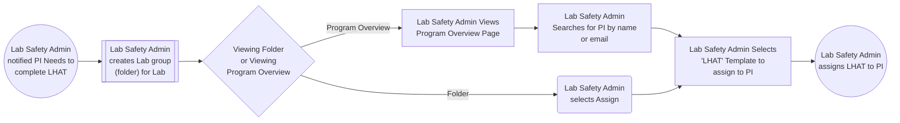
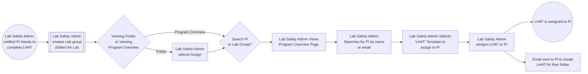
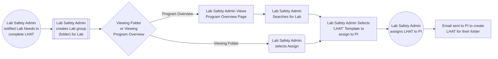

# LHAT Assignment Workflows

## 1. Ergo Evaluation: Ergo Admin assigns Ergonomist to complete Ergo Eval on Subject

## 2. Ergo Self-Assessment: Ergonomist Assigns Self-Assessment to Employee

## 3. LHAT: Lab Safety Admin needs to assign LHAT to PI

## 4. LHAT: Lab Safety Admin needs to assign LHAT to Lab Group

