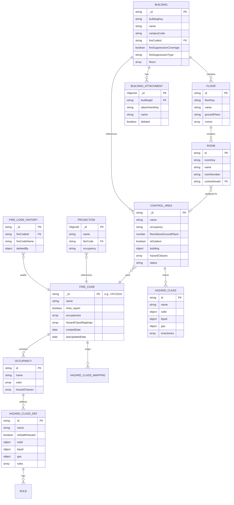
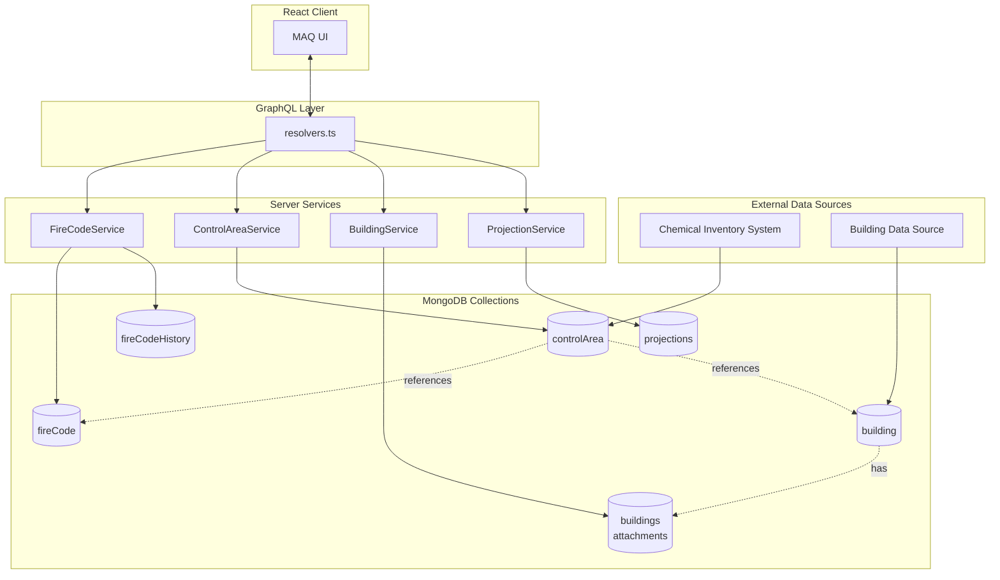
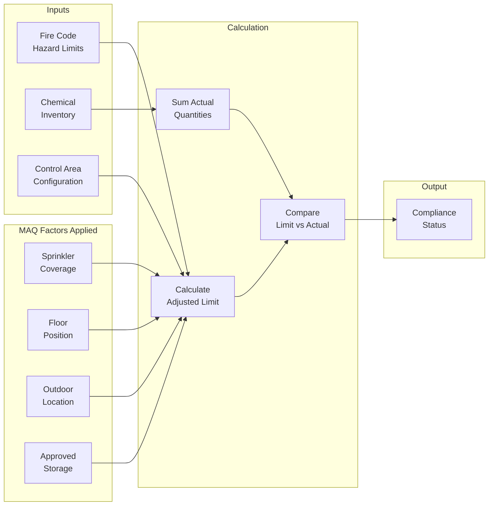
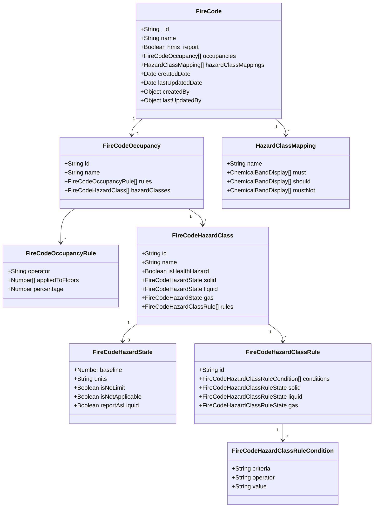
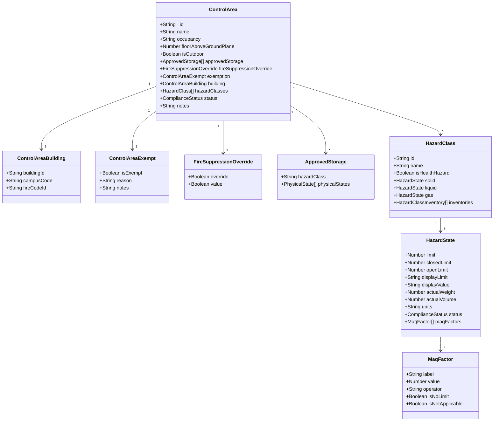
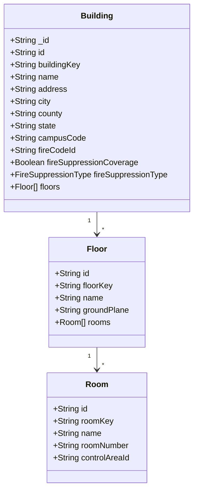
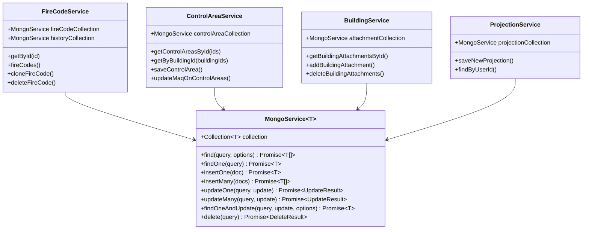

# MAQ MongoDB Database Structure

This document maps out the MongoDB collections, schemas, and relationships used in the MAQ (Maximum Allowable Quantity) application.

## Collections Overview

| Collection | Purpose | Primary Service |
|------------|---------|-----------------|
| `fireCode` | Fire code regulations with hazard class limits | `FireCodeService.ts` |
| `controlArea` | Building zones with MAQ calculations | `ControlAreaService.ts` |
| `building` | Building/floor/room hierarchy | External data source |
| `buildings` | Building attachments (files) | `BuildingService.ts` |
| `projections` | User-saved fire code projections | `ProjectionService.ts` |
| `fireCodeHistory` | Audit trail for deleted fire codes | `FireCodeService.ts` |

## Entity Relationship Diagram



## Data Flow Diagram



## MAQ Calculation Flow



## Collection Schemas

### 1. `fireCode`



### 2. `controlArea`



### 3. `building`



## Data Access Layer

All collections use `MongoService` abstraction:

**Location:** `packages/server/src/utils/mongo/MongoService.ts`



## Auto-Added Fields

All documents automatically receive these fields via MongoService:

| Field | Type | Description |
|-------|------|-------------|
| `createdDate` | Date | Document creation timestamp |
| `lastUpdatedDate` | Date | Last modification timestamp |
| `createdBy` | `{ userId: string }` | User who created the document |
| `lastUpdatedBy` | `{ userId: string }` | User who last modified |
| `meta.testId` | string (optional) | Test identifier for cleanup |

## Seed Data Locations

| Collection | Fixture File |
|------------|--------------|
| fireCode | `packages/common/src/fixtures/internal/firecodes.ts` |
| controlArea | `packages/common/src/fixtures/internal/controlareas.ts` |
| building | `packages/common/src/fixtures/external/buildings.ts` |

## Key Enums

```typescript
// Compliance status for control areas
type ComplianceStatus = 'COMPLIANT' | 'NON_COMPLIANT' | 'UNKNOWN'

// Fire suppression types
type FireSuppressionType = 'FULL' | 'PARTIAL' | 'NONE'

// Physical states for hazard tracking
type PhysicalState = 'SOLID' | 'LIQUID' | 'GAS'

// Rule operators for MAQ calculations
type RuleOperator = 'MULTIPLY' | 'EQUALS' | 'OVERRIDE' | 'REPORT_AS_LIQUID'

// Rule criteria for conditional limits
type RuleCriteria = 'APPROVED_STORAGE' | 'OUTDOOR' | 'SPRINKLER' | ...
```
