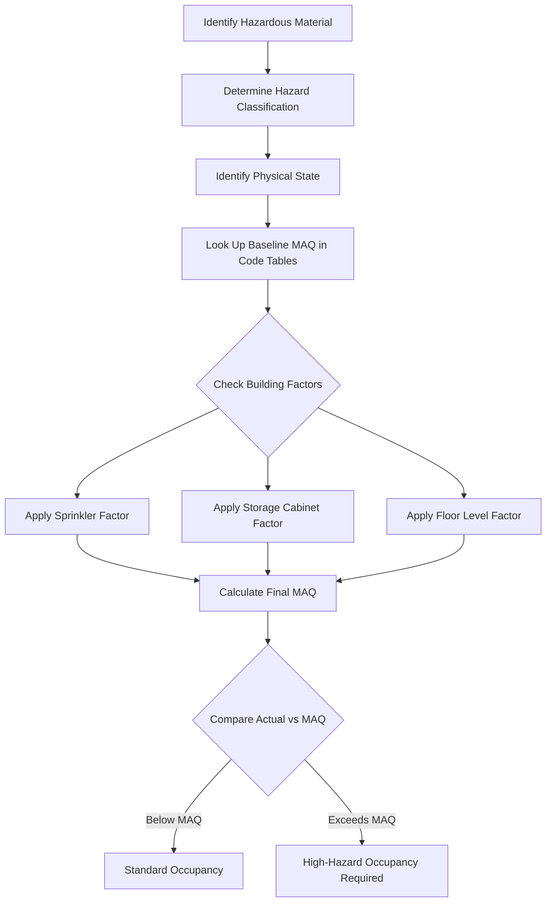
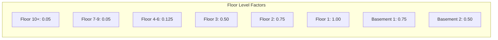

# MAQ Fire Code Compliance Validation

## Table of Contents

- [Executive Summary](#executive-summary)
- [Technical Deep Dive](#technical-deep-dive)
- [Fire Code Standards Framework](#fire-code-standards-framework)
- [MAQ Calculation Formula Validation](#maq-calculation-formula-validation)
- [Floor Level Reduction Analysis](#floor-level-reduction-analysis)
- [Sprinkler and Storage Factors](#sprinkler-and-storage-factors)
- [Physical State Handling](#physical-state-handling)
- [Control Area Rules](#control-area-rules)
- [Compliance Threshold Analysis](#compliance-threshold-analysis)
- [Implementation Validation Matrix](#implementation-validation-matrix)
- [Discrepancies and Concerns](#discrepancies-and-concerns)
- [Recommendations](#recommendations)
- [Sources](#sources)

## Executive Summary

The MAQ application's implementation approach is fundamentally aligned with International Fire Code (IFC) and California Fire Code (CFC) requirements. The formula structure (Baseline x Factors) is correct, and the 2x multiplier for sprinklers matches the code's 100% increase provision. However, several implementation details require validation against specific code tables, particularly the floor level reduction percentages and the 80% "near threshold" warning level which appears to be an institutional policy rather than a code requirement.

## Technical Deep Dive

### Overview

Maximum Allowable Quantity (MAQ) is a fire code concept that limits the amount of hazardous materials permitted in a control area before triggering high-hazard occupancy classification (Group H) and associated construction requirements. The MAQ system balances practical chemical storage needs against fire and life safety risks.

### Authoritative Fire Code Standards

The MAQ framework is defined in several interconnected codes:

1. **International Fire Code (IFC)** - Primary source for MAQ tables and requirements
   - Tables 5003.1.1(1) through 5003.1.1(4) - MAQ per control area
   - Table 5003.8.3.2 - Floor level percentages and control area limits
   - Section 5003.9.10 - Approved storage requirements

2. **International Building Code (IBC)** - Building occupancy classification
   - Table 414.2.2 - Control area design and number limitations
   - Section 307.1 - High-hazard group H definitions

3. **California Fire Code (CFC)** - California-specific adoption of IFC with amendments
   - Chapter 3, Section 307.1 - MAQ tables for physical and health hazards

4. **NFPA 1 Fire Code** - Alternative code framework
   - Chapter 60 - Hazardous materials
   - Table 60.4.2.2.1 - Control area limits

5. **NFPA 30** - Flammable and Combustible Liquids Code
   - Defines liquid classifications (Class IA, IB, IC, II, IIIA, IIIB)

6. **NFPA 400** - Hazardous Materials Code
   - Oxidizer classifications (Class 1-4)
   - Specific material requirements

### How MAQ Determination Works



## Fire Code Standards Framework

### IFC Table Structure

The IFC uses four primary tables for MAQ determination:

| Table | Content |
|-------|---------|
| 5003.1.1(1) | Indoor storage/use - Physical hazards |
| 5003.1.1(2) | Indoor storage/use - Health hazards |
| 5003.1.1(3) | Outdoor storage/use - Physical hazards |
| 5003.1.1(4) | Outdoor storage/use - Health hazards |

### Hazard Categories

**Physical Hazards (44 classes)**:
- Combustible liquids (Class II, IIIA, IIIB)
- Flammable liquids (Class IA, IB, IC)
- Flammable solids
- Pyrophoric materials
- Oxidizers (Class 1-4)
- Organic peroxides
- Unstable/reactive materials
- Water-reactive materials
- Explosives

**Health Hazards (3 classes)**:
- Corrosives
- Toxics
- Highly toxics

### Physical State Units

| State | Primary Unit | Alternate Units |
|-------|--------------|-----------------|
| Solid | Pounds (lb) | Cubic feet (ft³) |
| Liquid | Gallons (gal) | Pounds (lb) |
| Gas | Cubic feet (ft³) | - |

The code specifies: "Where the weight of the liquid is not available, a conversion of 10 pounds per gallon shall be used" [1].

## MAQ Calculation Formula Validation

### Implementation Formula

```
Final MAQ = Baseline × Sprinkler Factor × Floor Level Factor × Approved Storage Factor
```

### Code-Based Validation

**The multiplicative approach is CORRECT.** The IFC uses footnotes that specify increases are applied cumulatively:

> "Where Note d also applies, the increase for both notes shall be applied accumulatively." [1]

**Example from IFC documentation:**
- Base MAQ for Class IB flammable liquid: 120 gallons
- With sprinkler system (+100%): 240 gallons
- With approved storage cabinet (+100%): 480 gallons

This confirms the formula: 120 × 2 × 2 = 480 gallons

### Factor Application Order

The code does not specify a required order for factor application. Since multiplication is commutative, the implementation's order is mathematically equivalent to any other order.

## Floor Level Reduction Analysis

### IBC Table 414.2.2 - Official Values

**Above Grade Plane:**

| Floor Level | % of MAQ | Control Areas | Fire Rating |
|-------------|----------|---------------|-------------|
| Higher than 9 | 5% | 1 | 2 hours |
| 7-9 | 5% | 2 | 2 hours |
| 6 | 12.5% | 2 | 2 hours |
| 5 | 12.5% | 2 | 2 hours |
| 4 | 12.5% | 2 | 2 hours |
| 3 | 50% | 2 | 1 hour |
| 2 | 75% | 3 | 1 hour |
| 1 (ground) | 100% | 4 | 1 hour |

**Below Grade Plane:**

| Floor Level | % of MAQ | Control Areas | Fire Rating |
|-------------|----------|---------------|-------------|
| 1 below | 75% | 3 | 1 hour |
| 2 below | 50% | 2 | 1 hour |
| Lower than 2 | Not Allowed | - | - |

### Implementation Comparison

The implementation should verify these exact percentages are used:



### Key Validation Points

1. **Ground plane determination** - Floor 1 is the reference floor at grade
2. **Basement handling** - Floors below grade have their own reduction schedule
3. **Maximum depth** - Code prohibits control areas more than 2 levels below grade
4. **Outdoor locations** - Should NOT apply floor level reductions (implementation correctly handles this)

## Sprinkler and Storage Factors

### Sprinkler Factor Validation

**Implementation:** 2x multiplier when building has fire suppression

**Code Requirement:**
> "Maximum allowable quantities shall be increased 100 percent in buildings equipped throughout with an approved automatic sprinkler system in accordance with Section 903.3.1.1" [1]

**Validation:** The 2x factor is CORRECT (100% increase = 2x multiplier)

**Critical Requirements:**
- Must be NFPA 13 compliant system
- Building must be protected "throughout"
- NFPA 13R and 13D systems do NOT qualify for the increase

### Implementation's Fire Suppression Logic

```
FULL coverage → all floors sprinklered
BASEMENT_ONLY → only floors < 0 (below ground) sprinklered
NONE → no sprinklers
```

**Validation Concern:** The BASEMENT_ONLY option may need clarification. The IFC requires the building to be protected "throughout" for the sprinkler increase. Partial sprinkler coverage (basement only) would NOT qualify for the 100% increase on any floor.

### Approved Storage Factor Validation

**Implementation:** 2x multiplier for approved storage

**Code Requirement:**
> "Maximum allowable quantities shall be increased 100 percent when stored in approved storage cabinets, day boxes, gas cabinets, gas rooms or exhausted enclosures or in listed safety cans" [1]

**Validation:** The 2x factor is CORRECT

**Cabinet Requirements per IFC 5003.9.10:**
- Double-walled construction with 1.5" airspace
- Riveted or welded joints
- Labeled "HAZARDOUS—KEEP FIRE AWAY"

## Physical State Handling

### Implementation

- **Solid**: pounds (lbs)
- **Liquid**: gallons (gal)
- **Gas**: cubic feet (ft³)

### Code Alignment

This matches the IFC table structure which uses:
- Pounds and cubic feet for solids
- Gallons for liquids (with 10 lb/gal conversion available)
- Cubic feet for gases

### Unit Conversions

**Implementation values:**
- Solid: grams → pounds: 0.0022046226
- Liquid: liters → gallons: 0.2641720524
- Gas: liters → cubic feet: 0.0353146667

**Validation:**
- 1 gram = 0.00220462 pounds (CORRECT)
- 1 liter = 0.264172 gallons (CORRECT)
- 1 liter = 0.0353147 cubic feet (CORRECT)

### Liquefied Gases

The code distinguishes between:
- **Nonliquefied compressed gases** - entirely gaseous at 68°F
- **Liquefied compressed gases** - partially liquid at 68°F under pressure

For liquefied gases, the physical state is typically reported as "gas" for MAQ purposes, measuring in cubic feet at standard conditions.

## Control Area Rules

### Definition

A control area is "a space within a building where quantities of hazardous materials not exceeding the maximum allowable quantities per control area are stored, dispensed, used, or handled" [2].

### Indoor Control Area Limits by Floor

| Floor | Maximum Control Areas |
|-------|----------------------|
| Ground (1) | 4 |
| 2 | 3 |
| 3 | 2 |
| 4-6 | 2 |
| 7-9 | 2 |
| 10+ | 1 |
| 1 below grade | 3 |
| 2 below grade | 2 |

### Separation Requirements

Control areas must be separated by fire-resistance rated construction:
- 1-hour rating for floors 1-3 and basement levels 1-2
- 2-hour rating for floors 4 and above

### Outdoor Control Areas

Outdoor control areas have separate MAQ tables (5003.1.1(3) and 5003.1.1(4)) and are NOT subject to floor level reductions. The implementation correctly handles this by skipping floor level reductions for outdoor locations.

### Exemptions

Certain conditions may exempt materials from MAQ calculations:
- Consumer products in original packaging
- Pharmaceuticals
- Certain laboratory chemicals under specific conditions
- Materials in transit

The implementation's exemption handling should follow local jurisdiction interpretations.

## Compliance Threshold Analysis

### Implementation Thresholds

```
COMPLIANT: actual < 80% of limit
NEAR_THRESHOLD: 80% ≤ actual < 100% of limit
OVER_THRESHOLD: actual ≥ limit
NL (No Limit): always compliant
N/A: not applicable for that physical state
```

### Code-Based Analysis

**The 80% "near threshold" warning is NOT a fire code requirement.** The fire codes define compliance as a binary state:
- Below MAQ = Standard occupancy permitted
- At or above MAQ = High-hazard occupancy required OR non-compliance

The 80% threshold appears to be an **institutional policy** or **best practice** for proactive management rather than a code mandate. This is common at universities and research institutions.

**Validation Notes:**
- The 80% threshold is reasonable as an early warning system
- It allows time for corrective action before actual violation
- Institutions like UC Davis, UCI, and SFSU use similar warning systems

### Enforcement Actions

When MAQ is exceeded:
1. Chemical order approvals blocked for that control area
2. Non-compliance reported to Office of the State Fire Marshal (OSFM)
3. Potential shutdown of laboratory or building
4. Building occupancy reclassification to Group H required

## Implementation Validation Matrix

| Feature | Implementation | Fire Code Requirement | Status |
|---------|---------------|----------------------|--------|
| Formula structure | Baseline × Factors | Multiplicative/cumulative | CORRECT |
| Sprinkler factor | 2x | 100% increase | CORRECT |
| Approved storage factor | 2x | 100% increase | CORRECT |
| Physical states | Solid/Liquid/Gas | Solid/Liquid/Gas | CORRECT |
| Unit conversions | g→lb, L→gal, L→ft³ | Standard conversions | CORRECT |
| Outdoor floor skip | Yes | Outdoor tables separate | CORRECT |
| 80% threshold | Warning level | N/A (institutional policy) | ACCEPTABLE |
| NL handling | Always compliant | No Limit = unlimited | CORRECT |
| N/A handling | Not applicable | Per material/state | CORRECT |
| Floor reductions | Percentage factors | See IBC Table 414.2.2 | VERIFY VALUES |
| Basement sprinkler logic | BASEMENT_ONLY option | Requires "throughout" | CLARIFY |
| Occupancy types | A,B,E,F,H,I,M,R,S,U | Standard IBC groups | CORRECT |

## Discrepancies and Concerns

### 1. Floor Level Percentage Values

**Concern:** The implementation's floor level factors should be verified against IBC Table 414.2.2 exact values.

**Specific values to verify:**
- Floors 4-6: Should be 12.5% (0.125), not a different value
- Floor 3: Should be 50% (0.50)
- Basement 1: Should be 75% (0.75)
- Basement 2: Should be 50% (0.50)

### 2. BASEMENT_ONLY Sprinkler Logic

**Concern:** The IFC requires sprinklers "throughout" the building for the 100% MAQ increase. A building with basement-only sprinklers would NOT qualify for any sprinkler increase under strict code interpretation.

**Recommendation:** Clarify with Authority Having Jurisdiction (AHJ) how partial sprinkler coverage should be handled. Options:
- Apply sprinkler factor only to sprinklered floors
- Apply no sprinkler factor anywhere if not "throughout"
- Use a modified factor for partial coverage

### 3. Storage vs. Use-Open vs. Use-Closed

**Concern:** The IFC differentiates between three usage conditions with different MAQ limits:
- **Storage**: Closed containers, sealed
- **Use-Closed**: In use but vapors contained
- **Use-Open**: Vapors exposed to atmosphere (most restrictive)

**The Three Categories Explained:**

| Category | Description | Typical MAQ |
|----------|-------------|-------------|
| **Storage** | Materials in sealed, closed containers not being actively used | Highest limits |
| **Use-Closed** | Materials being dispensed/used but vapors are contained (closed system, fume hood) | Usually equals storage |
| **Use-Open** | Materials exposed to atmosphere (open beakers, pouring, mixing) | **Most restrictive** |

**Example - Flammable Liquid Class IA:**
```
Storage MAQ (baseline):     30 gallons
Use-Closed:                 30 gallons
Use-Open:                   10 gallons  ← 1/3 of storage!
```

**Current Implementation Analysis:**

The MAQ application handles this distinction in two places:

1. **Main MAQ Table (`calculateLimitByState`):** Shows a single "MAQ" limit per hazard class/physical state. This limit represents the **storage** MAQ only.

2. **HMIS Export (`getOpenAndClosedMaqLimit`):** Calculates separate open and closed limits using hardcoded values per hazard class (lines 400-727 in `maq-compliance.helper.ts`). These values differ significantly from storage limits.

**The Compliance Gap:**

A control area could be **compliant for storage** but **non-compliant for use-open**:

```
Example scenario:
Control Area has 25 gallons of Flammable Liquid IA

Storage MAQ:    60 gal (30 × 2 sprinkler)  → ✅ COMPLIANT (25 < 60)
Use-Open MAQ:   20 gal (10 × 2 sprinkler)  → ❌ OVER_THRESHOLD (25 > 20)
```

If someone is actively using 25 gallons in open containers, they're technically over the use-open limit, but the main MAQ table would show them as compliant because it only displays storage limits.

**Recommendation:** Consider whether the main UI should:
- Show whether containers are "in use" vs "in storage"
- Flag when use-open limits are exceeded even if storage limits aren't
- Track aggregate quantities (storage + use combined)

This would require knowing not just *how much* of each chemical is present, but also *how it's being used* (stored vs. open use vs. closed use) - which may come from the chemical inventory system.

### 4. Aggregate Quantity Rule

**Concern:** IFC footnote b states: "The aggregate quantity in use and in storage shall not exceed the quantity listed for storage."

**Recommendation:** Verify the implementation enforces this aggregate limit when materials are both stored and in use simultaneously.

### 5. Flammable Liquid Combination Limits

**Concern:** For flammable liquids, IFC limits the combination of Class IA, IB, and IC:
- Combined limit: 120 gallons
- Class IA individual limit: 30 gallons within that total

**Recommendation:** Verify the implementation handles this unique combination rule.

## Recommendations

### Preferred Approach: Validate Implementation Against Specific Code Tables

**Should This Be Implemented?**: The current implementation framework is fundamentally correct. Specific values need verification.

**Rationale:**
- The multiplicative formula approach matches code requirements
- Factor values (2x for sprinkler, 2x for storage) are correct
- Physical state handling and unit conversions are accurate
- Floor level factors need value verification

### Priority Actions

1. **High Priority - Verify Floor Level Percentages**
   - Compare implementation values against IBC Table 414.2.2
   - Ensure all 10+ levels are handled (including deep basements not allowed)

2. **High Priority - Clarify BASEMENT_ONLY Logic**
   - Consult with AHJ on partial sprinkler interpretation
   - Consider removing or modifying this option

3. **Medium Priority - Storage/Use Distinction**
   - Review if implementation separates storage, use-closed, use-open
   - Verify correct MAQ limits applied to each condition

4. **Medium Priority - Aggregate Quantity Enforcement**
   - Verify storage+use quantities don't exceed storage MAQ

5. **Low Priority - Flammable Liquid Combinations**
   - Add validation for Class IA/IB/IC combination limits

### Potential Challenges

1. **Jurisdictional Variations** - Different AHJs may interpret codes differently
   - Mitigation: Make calculations configurable per jurisdiction

2. **Code Version Updates** - IFC updates every 3 years
   - Mitigation: Version fire code tables and support multiple editions

3. **Local Amendments** - California and other states modify IFC
   - Mitigation: Support CFC-specific tables alongside IFC

### Success Criteria

- All floor level percentages match IBC Table 414.2.2
- Sprinkler logic aligns with AHJ interpretation
- Storage/use conditions properly differentiated
- Aggregate quantities enforced
- Fire code administrators can validate calculations

## Additional Notes

### Open vs. Closed Container Multipliers for HMIS

The HMIS (Hazardous Materials Inventory Statement) requires separate reporting for:
- Storage quantities
- Use-closed quantities
- Use-open quantities

The implementation's handling of open vs. closed containers should align with these reporting requirements. The code typically applies different MAQ limits:
- Storage: Baseline MAQ
- Use-Closed: Often equals storage MAQ
- Use-Open: Typically lower (e.g., 1/4 or 1/3 of storage for some materials)

### Implementation Details: `getOpenAndClosedMaqLimit()`

The MAQ application includes a dedicated function for calculating open/closed limits in `packages/common/src/utils/maq-compliance.helper.ts` (lines 400-727). This function:

1. **Uses hardcoded baseline values** per hazard class (not derived from fire code database)
2. **Applies sprinkler factor** (2x if sprinklered)
3. **Applies approved storage factor** where applicable
4. **Does NOT apply floor level reductions** to open/closed limits

**Key Implementation Values (with sprinkler factor applied):**

| Hazard Class | Use-Closed | Use-Open | Ratio |
|--------------|------------|----------|-------|
| Flammable Liquid: IA | 60 gal | 20 gal | 3:1 |
| Flammable Liquid: IB, IC | 240 gal | 60 gal | 4:1 |
| Combustible Liquid: II | 240 gal | 60 gal | 4:1 |
| Flammable Solid | 250 lb | 50 lb | 5:1 |
| Corrosive (solid) | 10,000 lb | 2,000 lb | 5:1 |
| Corrosive (liquid) | 1,000 gal | 200 gal | 5:1 |
| Toxic (solid/liquid) | 1,000 lb | 250 lb | 4:1 |
| Highly Toxic (solid/liquid) | 20 lb | 6 lb | ~3:1 |
| Oxidizer: 2 (solid/liquid) | 500 lb | 100 lb | 5:1 |
| Pyrophoric (solid/liquid) | 2 lb | 0 lb | N/A |

**Note:** Pyrophoric materials have a use-open limit of 0, meaning open use is never permitted regardless of quantity.

### Baseline MAQ Examples (from IFC Table 5003.1.1)

| Material | Storage | Use-Closed | Use-Open |
|----------|---------|------------|----------|
| Corrosive solids | 5,000 lb | 5,000 lb | 1,000 lb |
| Corrosive liquids | 500 gal | 500 gal | 100 gal |
| Corrosive gases | 810 ft³ | 810 ft³ | 810 ft³ |
| Flammable liquid (IB/IC) | 120 gal | 120 gal | 30 gal |
| Flammable liquid (IA) | 30 gal | 30 gal | 10 gal |
| Oxidizer Class 3 solid | 10 lb | 10 lb | 10 lb |

Note: These values are for non-sprinklered buildings without approved storage. Apply 2x for each applicable factor.

## Sources

1. [ICC Building Safety Journal - 2024 IFC Tables 5003.1.1(1) and 5003.1.1(2): Maximum Allowable Quantities](https://www.iccsafe.org/building-safety-journal/bsj-technical/code-corner-2024-international-fire-code-tables-5003-1-11-and-5003-1-12-maximum-allowable-quantities/) - Accessed 2025-12-27

2. [UpCodes - IBC Table 414.2.2 Control Areas](https://up.codes/s/control-areas) - Accessed 2025-12-27

3. [UpCodes - Table 3806.2.1 Percentage of MAQ Per Control Area](https://up.codes/s/percentage-of-maximum-allowable-quantities-per-control-area) - Accessed 2025-12-27

4. [National Fire Sprinkler Association - Hazardous Materials and the IBC II](https://nfsa.org/2022/11/17/hazardous-materials-and-the-international-code/) - Accessed 2025-12-27

5. [Dalkita - MAQs (Maximum Allowable Quantities)](https://dalkita.com/maqs-maximum-allowable-quantities/) - Accessed 2025-12-27

6. [Risk & Safety Solutions - Maximum Allowable Quantities](https://riskandsafety.com/index.php/white-papers/MAQ) - Accessed 2025-12-27

7. [UC Irvine EHS - Maximum Allowable Quantities](https://ehs.uci.edu/maq/index.php) - Accessed 2025-12-27

8. [UC Davis Safety Services - Understanding MAQ](https://safetyservices.ucdavis.edu/units/fire-prevention/understanding-maximum-allowable-quantities-maq) - Accessed 2025-12-27

9. [SFSU EHS - MAQ Compliance](https://ehs.sfsu.edu/maximum-allowable-quantity-maq-compliance) - Accessed 2025-12-27

10. [NFPA - Occupancy Classifications When Hazardous Materials Are Present](https://www.nfpa.org/news-blogs-and-articles/blogs/2022/08/12/nfpa-and-ibc-occupancy-classifications-when-hazardous-materials-are-present) - Accessed 2025-12-27

11. [NFPA - Determining the MAQ of a Hazardous Material](https://www.nfpa.org/News-and-Research/Publications-and-media/Blogs-Landing-Page/NFPA-Today/Blog-Posts/2022/07/08/Determining-the-Maximum-Allowable-Quantity-MAQ-of-a-Hazardous-Material) - Accessed 2025-12-27

12. [Justrite - IFC Safety Cabinets MAQ](https://www.justrite.com/ifcsafetycabinetsmaq) - Accessed 2025-12-27

13. [UCOP - Storage vs. In-Use](https://www.ucop.edu/safety-and-loss-prevention/environmental/program-resources/chemical-management-safety/maq/storage-vs-in-use.html) - Accessed 2025-12-27

14. [ICC Digital Codes - 2024 IFC Section 5003.1.1](https://codes.iccsafe.org/s/IFC2024P1/part-v-hazardous-materials/IFC2024P1-Pt05-Ch50-Sec5003.1.1) - Accessed 2025-12-27

15. [Carl A. Nelson & Co. - Hazardous Materials 102: Control Areas](https://www.carlanelsoncoconstruction.com/hazardous-materials-102-control-areas.html) - Accessed 2025-12-27
