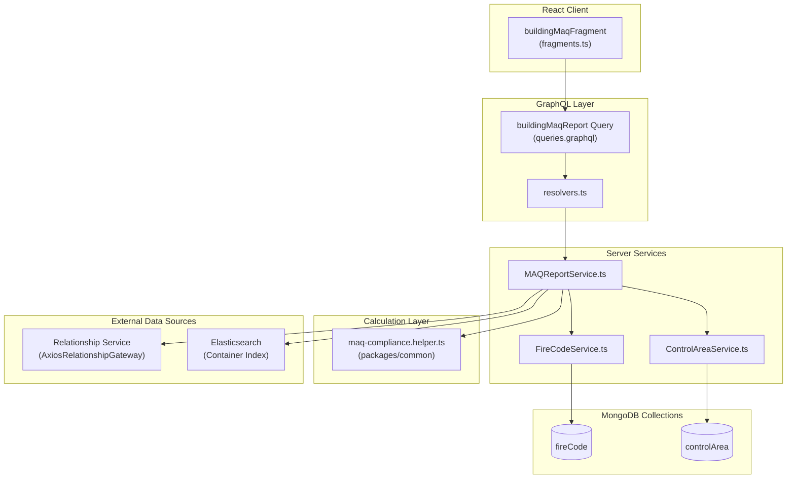
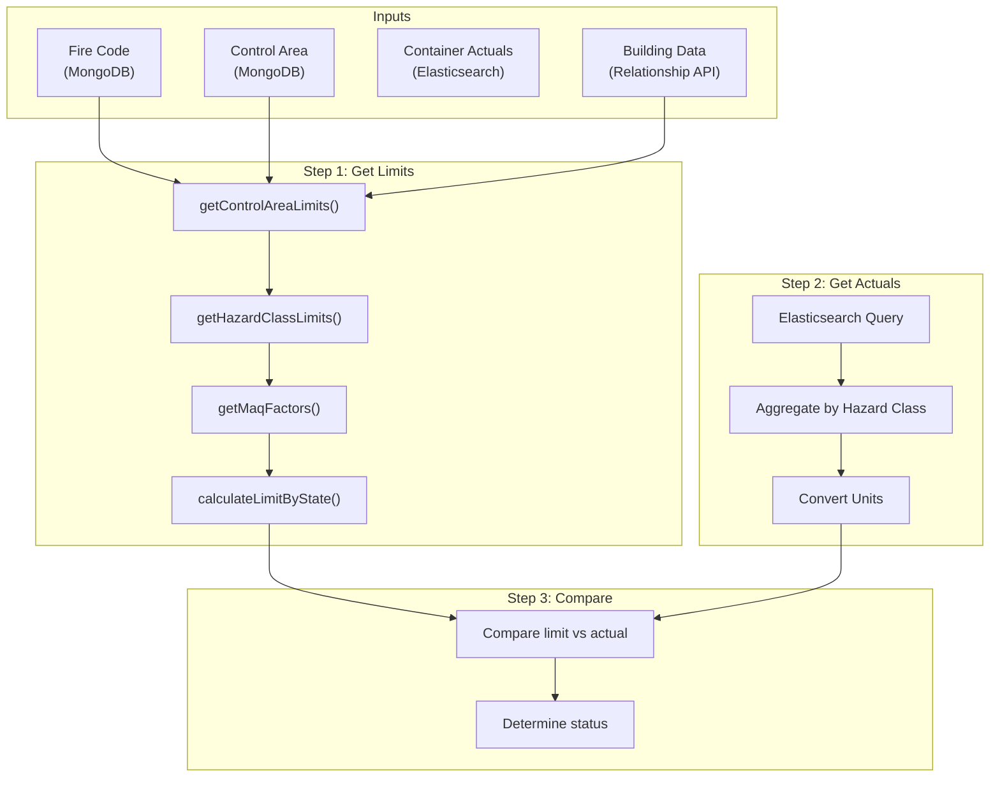

# MAQ Report: Top-Down Data Trace

This document traces every data point in the MAQ Report from the UI rendering all the way down to the source data, documenting exactly how each value is derived.

## Overview

The MAQ Report (`BuildingMaqReport`) is the central view that displays building compliance data. This trace starts from the GraphQL response and works down through each layer.



---

## BuildingMaqReport Fields

### Field-by-Field Trace

| UI Field | GraphQL Field | Source Location | Derivation |
|----------|---------------|-----------------|------------|
| Building ID | `id` | Relationship Service | Direct from `building.id` |
| Building Name | `name` | Relationship Service | Direct from `building.name` |
| Campus Code | `campusCode` | Relationship Service | Direct from `building.campusCode` |
| Address | `address` | Relationship Service | Direct from `building.address` |
| Fire Code ID | `fireCodeId` | Relationship Service | Direct from `building.fireCodeId` |
| Fire Code Name | `fireCodeName` | MongoDB: `fireCode` | Direct from `fireCode.name` |
| Fire Suppression Coverage | `fireSuppressionCoverage` | **Calculated** | `fireSuppressionType === 'FULL'` |
| Fire Suppression Type | `fireSuppressionType` | Relationship Service | Direct from `building.fireSuppressionType` |
| Fire Code Occupancies | `fireCodeOccupancies` | MongoDB: `fireCode` | Direct from `fireCode.occupancies` |
| Floors | `floors` | Relationship Service | Direct from `building.floors` |
| Overall Status | `status` | **Calculated** | `getOverallComplianceStatus(controlAreas)` |
| Control Areas | `controlAreas` | **Calculated** | Complex - see below |

---

## Detailed Field Traces

### 1. `id` (Building ID)

```
Source: Relationship Service (External GraphQL API)
Path: AxiosRelationshipGateway.fetchById(buildingId) → result.data.data.building.id
File: packages/server/src/utils/axiosGateway/AxiosRelationshipGateway.ts:179-218
```

### 2. `name` (Building Name)

```
Source: Relationship Service (External GraphQL API)
Path: AxiosRelationshipGateway.fetchById(buildingId) → result.data.data.building.name
File: packages/server/src/utils/axiosGateway/AxiosRelationshipGateway.ts:179-218
```

### 3. `campusCode`

```
Source: Relationship Service (External GraphQL API)
Path: AxiosRelationshipGateway.fetchById(buildingId) → result.data.data.building.campusCode
File: packages/server/src/utils/axiosGateway/AxiosRelationshipGateway.ts:179-218
```

### 4. `address`

```
Source: Relationship Service (External GraphQL API)
Path: AxiosRelationshipGateway.fetchById(buildingId) → result.data.data.building.address
File: packages/server/src/utils/axiosGateway/AxiosRelationshipGateway.ts:179-218
```

### 5. `fireCodeId`

```
Source: Relationship Service (External GraphQL API)
Path: AxiosRelationshipGateway.fetchById(buildingId) → result.data.data.building.fireCodeId
File: packages/server/src/utils/axiosGateway/AxiosRelationshipGateway.ts:179-218

Fallback: If null/missing, defaults to appConfig.defaultFireCodeId (CFC 2022)
File: packages/server/src/building/MAQReportService.ts:176-202
```

### 6. `fireCodeName`

```
Source: MongoDB Collection: fireCode
Path: FireCodeService.getById(fireCodeId) → fireCode.name
File: packages/server/src/fire-code/FireCodeService.ts:86-88
```

### 7. `fireSuppressionCoverage` (CALCULATED)

```
Source: CALCULATED from building.fireSuppressionType
Formula: fireSuppressionType === FireSuppressionType.Full
File: packages/server/src/building/MAQReportService.ts:93-95

calculateFireSuppressionCoverage(fireSuppressionType: FireSuppressionType): boolean {
  return fireSuppressionType === FireSuppressionType.Full;
}
```

### 8. `fireSuppressionType`

```
Source: Relationship Service (External GraphQL API)
Path: AxiosRelationshipGateway.fetchById(buildingId) → result.data.data.building.fireSuppressionType
Values: 'FULL' | 'PARTIAL' | 'BASEMENT_ONLY' | 'NONE'
File: packages/server/src/utils/axiosGateway/AxiosRelationshipGateway.ts:179-218
```

### 9. `fireCodeOccupancies`

```
Source: MongoDB Collection: fireCode
Path: FireCodeService.getById(fireCodeId) → fireCode.occupancies
File: packages/server/src/fire-code/FireCodeService.ts:86-88

Structure:
- id: string
- name: string
- rules: FireCodeOccupancyRule[]
- hazardClasses: FireCodeHazardClass[]
```

### 10. `floors`

```
Source: Relationship Service (External GraphQL API)
Path: AxiosRelationshipGateway.fetchById(buildingId) → result.data.data.building.floors
File: packages/server/src/utils/axiosGateway/AxiosRelationshipGateway.ts:179-218

Structure:
- id: string
- name: string
- groundPlane: string (floor position relative to ground, e.g., "-1", "0", "1")
- rooms: Room[]
  - id: string
  - name: string
  - roomNumber: string
  - controlAreaId: string (link to control area)
```

### 11. `status` (Overall Building Status) - CALCULATED

```
Source: CALCULATED from all control area statuses
File: packages/common/src/utils/maq-compliance.helper.ts:21-35

getOverallComplianceStatus(areas: ControlArea[]):
  IF no areas → ComplianceStatus.Incomplete
  IF any area has OverThreshold → ComplianceStatus.OverThreshold
  IF any area has NearThreshold → ComplianceStatus.NearThreshold
  ELSE → ComplianceStatus.Compliant

Values: 'COMPLIANT' | 'NEAR_THRESHOLD' | 'OVER_THRESHOLD' | 'INCOMPLETE' | 'EXEMPT'
```

---

## Control Area Data Trace

Each control area in `controlAreas[]` contains the following fields:

### Control Area Direct Fields

| Field | Source | Path |
|-------|--------|------|
| `id` | MongoDB: controlArea | `controlArea._id` |
| `name` | MongoDB: controlArea | `controlArea.name` |
| `occupancy` | MongoDB: controlArea | `controlArea.occupancy` |
| `notes` | MongoDB: controlArea | `controlArea.notes` |
| `floorAboveGroundPlane` | MongoDB: controlArea | `controlArea.floorAboveGroundPlane` (defaults to 1 if null) |
| `isOutdoor` | MongoDB: controlArea | `controlArea.isOutdoor` |
| `approvedStorage` | MongoDB: controlArea | `controlArea.approvedStorage[]` |
| `exemption` | MongoDB: controlArea | `controlArea.exemption` |
| `fireSuppressionOverride` | MongoDB: controlArea | `controlArea.fireSuppressionOverride` |

### Control Area Calculated Fields

| Field | Source | Calculation |
|-------|--------|-------------|
| `status` | CALCULATED | `getControlAreaCompliance(hazardClasses)` |
| `hazardClasses` | CALCULATED | `getControlAreaMaq(building, controlArea, fireCode, actuals)` |

---

## Control Area Status Calculation

```
File: packages/common/src/utils/maq-compliance.helper.ts:59-80

getControlAreaCompliance(hazardClasses: HazardClass[]):
  FOR each hazardClass:
    IF solid.status OR liquid.status OR gas.status === OverThreshold:
      RETURN ComplianceStatus.OverThreshold (immediately)
    IF solid.status OR liquid.status OR gas.status === NearThreshold:
      SET status = ComplianceStatus.NearThreshold (continue checking)
  RETURN status (Compliant if no threshold issues found)

Special case:
  IF controlArea.exemption.isExempt === true:
    RETURN ComplianceStatus.Exempt
  (File: packages/common/src/utils/maq-compliance.helper.ts:902)
```

---

## Hazard Class Data Trace

Each hazard class in a control area's `hazardClasses[]` is **entirely calculated**.

### Hazard Class Calculation Flow



### HazardClass Field Trace

| Field | Source | Derivation |
|-------|--------|------------|
| `name` | Fire Code | `fireCode.occupancies[].hazardClasses[].name` |
| `isHealthHazard` | Fire Code | `fireCode.occupancies[].hazardClasses[].isHealthHazard` |
| `solid.limit` | CALCULATED | See Limit Calculation below |
| `solid.displayLimit` | CALCULATED | Formatted limit value |
| `solid.actualWeight` | Elasticsearch | Raw value in grams |
| `solid.actualVolume` | Elasticsearch | Raw value in liters |
| `solid.displayValue` | CALCULATED | `sigFigDecimal(convertedActual)` |
| `solid.status` | CALCULATED | `getComplianceStatus(limit, actual)` |
| `solid.maqFactors` | CALCULATED | Array of factors applied |
| `liquid.*` | Same pattern as solid | |
| `gas.*` | Same pattern as solid | |

---

## Limit Calculation (Critical Path)

### Entry Point

```
File: packages/common/src/utils/maq-compliance.helper.ts:855-905

getControlAreaMaq(building, controlArea, fireCode, actuals):
  1. hazardClassLimits = getControlAreaLimits(building, controlArea, fireCode)
  2. FOR each hazardClassLimit:
     - Find matching actual from Elasticsearch
     - Convert actuals to display units
     - Calculate status
  3. RETURN { status, hazardClasses }
```

### Step 1: Get Control Area Limits

```
File: packages/common/src/utils/maq-compliance.helper.ts:787-828

getControlAreaLimits(building, area, fireCode):
  1. Find occupancy in fire code: fireCode.occupancies.find(o => o.name === area.occupancy)
  2. Find floor with rooms in this control area
  3. Calculate floorAboveGroundPlane from floor.groundPlane
  4. Determine fireSuppressionType:
     IF area.fireSuppressionOverride.override:
       type = override.value ? 'FULL' : 'NONE'
     ELSE:
       type = building.fireSuppressionType || (building.fireSuppressionCoverage ? 'FULL' : 'NONE')
  5. FOR each hazardClass in occupancy:
     CALL getHazardClassLimits(hazardClass, maqFactors, occupancyRules, hmis_report)
```

### Step 2: Get Hazard Class Limits

```
File: packages/common/src/utils/maq-compliance.helper.ts:729-783

getHazardClassLimits(fireCodeHazardClass, maqFactors, occupancyRules, hasHMIS):
  IF maqFactors.exemption.isExempt:
    RETURN exemptLimits (all limits = null, isNoLimit = true)

  FOR each physicalState in ['solid', 'liquid', 'gas']:
    limit = calculateLimitByState(fireCodeHazardClass, physicalState, maqFactors, occupancyRules)

    displayLimit:
      IF isNoLimit → 'NL'
      IF isNotApplicable → 'N/A'
      ELSE → limit.value as string

    maqFactors = getMaqFactors(...) // Get breakdown of factors

    IF hasHMIS AND limit.value:
      Calculate openLimit and closedLimit separately
```

### Step 3: Calculate Limit By State

```
File: packages/common/src/utils/maq-compliance.helper.ts:358-398

calculateLimitByState(fireCodeHazardClass, physicalState, maqFactors, occupancyRules):
  IF fireCodeHazardClass[physicalState].isNotApplicable:
    RETURN { value: null, isNotApplicable: true }

  [baseline, ...factors] = getMaqFactors(...)

  IF baseline.value === null:
    RETURN baseline

  // Apply multiplier factors
  RETURN factors.reduce((acc, cur) => {
    IF cur.operator === 'MULTIPLY':
      IF acc.value === 0 OR cur.value === 0:
        RETURN { ...acc, value: 0 }
      RETURN { ...acc, value: acc.value * cur.value }
    RETURN acc
  }, { value: baseline.value, isNoLimit: baseline.isNoLimit, ... })
```

### Step 4: Get MAQ Factors (Rule Application)

```
File: packages/common/src/utils/maq-compliance.helper.ts:221-356

getMaqFactors(fireCodeHazardClass, occupancyRules, physicalState, fireSuppressionType, approvedStorage, isOutdoor, floorAboveGroundPlane):

  // Handle gas reportAsLiquid special case
  IF physicalState === 'gas' AND fireCodeHazardClass.gas.reportAsLiquid:
    Start with liquid baseline, apply 'Report as Liquid' factor
  ELSE:
    Start with baseline from fireCodeHazardClass[physicalState].baseline

  maqFactors = [{
    label: 'Baseline',
    value: baseline,
    isNoLimit: fireCodeHazardClass[physicalState].isNoLimit,
    operator: ''
  }]

  // Apply hazard class rules
  FOR each rule in fireCodeHazardClass.rules:
    IF ruleApplies(rule, physicalState, ...conditions):
      IF rule.isNotApplicable OR rule.operator === 'OVERRIDE' OR rule.isNoLimit:
        maqFactors = [rule] // Replace all with this single factor
        BREAK
      ELSE IF rule.operator === 'EQUALS':
        maqFactors[0] = rule // Replace baseline
      ELSE:
        maqFactors.push(rule) // Add as multiplier

  // Apply floor level factors (if not outdoor)
  IF NOT isOutdoor:
    maqFactors.concat(getFloorMaqFactors(occupancyRules, floorAboveGroundPlane))

  RETURN maqFactors (filtering out factors with value === 1)
```

### Step 5: Rule Application Logic

```
File: packages/common/src/utils/maq-compliance.helper.ts:132-181

ruleApplies(rule, physicalState, fireCodeHazardClass, fireSuppressionType, approvedStorage, isOutdoor, floorAboveGroundPlane):
  RETURN rule.conditions.every(condition => conditionApplies(...))

conditionApplies(condition, ...):
  SWITCH condition.criteria:
    CASE 'SPRINKLER_BASEMENT_ONLY':
      RETURN (condition.value === 'true') === (fireSuppressionType === 'BASEMENT_ONLY')

    CASE 'SPRINKLER':
      RETURN (condition.value === 'true') === isControlAreaSprinklered(fireSuppressionType, floorAboveGroundPlane)

    CASE 'APPROVED_STORAGE':
      RETURN (condition.value === 'true') === approvedStorage.some(
        h => h.hazardClass === fireCodeHazardClass.name AND
             h.physicalStates.includes(physicalState)
      )

    CASE 'OUTDOOR':
      RETURN (condition.value === 'true') === isOutdoor

    CASE 'BASEMENT':
      RETURN (condition.value === 'true') === (floorAboveGroundPlane < 0)

isControlAreaSprinklered(fireSuppressionType, floorAboveGroundPlane):
  IF fireSuppressionType === 'FULL': RETURN true
  IF fireSuppressionType === 'BASEMENT_ONLY': RETURN floorAboveGroundPlane < 0
  RETURN false
```

### Step 6: Floor Level Factors

```
File: packages/common/src/utils/maq-compliance.helper.ts:183-219

getFloorMaqFactors(fireCodeOccupancyRules, floorAboveGroundPlane):
  floorMaqFactors = []

  // Get floors with 'is equal to' operator (exact floor matches)
  equalFloors = rules
    .filter(r => r.operator === 'is equal to')
    .flatMap(r => r.appliedToFloors)

  FOR each rule:
    IF (rule.operator === 'is equal to' AND rule.appliedToFloors.includes(floorAboveGroundPlane))
    OR (rule.operator === 'is greater than' AND floorAboveGroundPlane > rule.appliedToFloors[0] AND NOT equalFloors.includes(floorAboveGroundPlane))
    OR (rule.operator === 'is less than' AND floorAboveGroundPlane < rule.appliedToFloors[0] AND NOT equalFloors.includes(floorAboveGroundPlane)):
      floorMaqFactors.push({
        label: 'Floor Level',
        value: rule.percentage / 100,
        operator: 'MULTIPLY'
      })

  RETURN floorMaqFactors
```

---

## Actual Values Calculation

### Source: Elasticsearch Container Index

```
File: packages/server/src/building/MAQReportService.ts:405-542

fetchActuals(controlAreasWoutHazardClasses, building, fireCode, elastic):
  FOR each controlArea:
    1. Build hazard class filters from fire code mappings
    2. Get rooms in this control area from building.floors
    3. Query Elasticsearch:
       - Index: 'container'
       - Filter: rooms in control area, active, not exempted
       - Aggregate: sum of normalizedSize.gram and normalizedSize.liter per hazard class per physical state
```

### Elasticsearch Query Structure

```javascript
// File: packages/server/src/building/MAQReportService.ts:455-505
{
  index: 'container',
  body: {
    size: 0,
    query: {
      bool: {
        must: [{ terms: { 'location.roomId': roomIds } }],
        must_not: [
          { script: { script: "doc['exemption.keyword'].size() > 0 && doc['exemption.keyword'].value.length() > 0" } },
          { term: { active: false } }
        ]
      }
    },
    aggs: {
      FamilyBands: {
        filters: { filters: hazardClassFilters }, // Built from fire code mappings
        aggs: {
          container_state: {
            terms: { field: 'family.formAtNtp.keyword' }, // solid, liquid, gas
            aggs: {
              containers_sum_gram: { sum: { field: 'normalizedSize.gram' } },
              containers_sum_liter: { sum: { field: 'normalizedSize.liter' } }
            }
          }
        }
      }
    }
  }
}
```

### Hazard Class Filter Building

```
File: packages/server/src/building/MAQReportService.ts:376-402

buildHazardClassFilters(occupancy, fireCode):
  Find occupancy in fireCode
  FOR each hazardClass in occupancy:
    Find hazardClassMapping in fireCode.hazardClassMappings where name matches
    IF mapping has must/should/mustNot bands:
      Build Elasticsearch bool query:
        must: terms query for must band IDs
        should: terms query for should band IDs
        must_not: terms query for mustNot band IDs
  RETURN filters object keyed by hazard class name
```

### Report As Liquid Handling

```
File: packages/server/src/building/MAQReportService.ts:513-529

// When aggregating Elasticsearch results:
IF physicalState === 'gas' AND fireCodeHazardClass.gas.reportAsLiquid:
  targetKey = 'liquid' // Gas values go to liquid bucket
ELSE:
  targetKey = physicalState
```

---

## Unit Conversions

### Conversion Constants

```
File: packages/common/src/utils/maq-compliance.helper.ts:830-853

literToGallon = 0.2641720524
literToCubicFeet = 0.0353146667
gramToPound = 0.0022046226
```

### Conversion Application

```
File: packages/common/src/utils/maq-compliance.helper.ts:855-900

// In getControlAreaMaq():
solidActual = convertNormalizedAmount(actual.solid.actualWeight, 'gramToPound')

liquidActual = SWITCH liquidUnits:
  CASE 'gal': convertNormalizedAmount(actual.liquid.actualVolume, 'literToGallon')
  CASE 'ft3': convertNormalizedAmount(actual.liquid.actualVolume, 'literToCubicFeet')
  DEFAULT: convertNormalizedAmount(actual.liquid.actualWeight, 'gramToPound')

gasActual = convertNormalizedAmount(actual.gas.actualVolume, 'literToCubicFeet')
```

---

## Status Calculation

```
File: packages/common/src/utils/maq-compliance.helper.ts:38-57

getComplianceStatus(limit: number | null, actual: number):
  IF limit === null:
    RETURN ComplianceStatus.Compliant  // No limit means always compliant

  IF limit === 0 AND actual === 0:
    RETURN ComplianceStatus.Compliant

  IF actual >= limit:
    RETURN ComplianceStatus.OverThreshold

  IF actual >= limit * 0.8:  // 80% threshold for "near"
    RETURN ComplianceStatus.NearThreshold

  RETURN ComplianceStatus.Compliant
```

---

## Display Value Formatting

```
File: packages/common/src/utils/misc.ts:14-25

sigFigDecimal(value: number):
  IF value === 0: RETURN '0.00'
  IF value < 0.0001: RETURN '< 0.0001'
  IF value < 0.01: RETURN value.toFixed(4)
  RETURN value.toFixed(2)
```

---

## Complete Data Source Summary

| Data Point | Primary Source | Collection/API | Key Field |
|------------|---------------|----------------|-----------|
| Building info | Relationship Service | External GraphQL | `building(buildingId)` |
| Fire code definitions | MongoDB | `fireCode` | `_id`, `occupancies`, `hazardClassMappings` |
| Control area config | MongoDB | `controlArea` | `_id`, `occupancy`, `approvedStorage`, etc. |
| Container quantities | Elasticsearch | `container` index | `normalizedSize.gram`, `normalizedSize.liter` |
| Chemical bands | Elasticsearch | `family` index | `bands.name`, `bands.class` |
| User permissions | Relationship Service | External GraphQL | `profileWithRelationships` |

---

## Calculation Summary Table

| Calculated Field | Formula Location | Key Function |
|-----------------|------------------|--------------|
| fireSuppressionCoverage | MAQReportService.ts:93-95 | `fireSuppressionType === 'FULL'` |
| Building status | maq-compliance.helper.ts:21-35 | `getOverallComplianceStatus()` |
| Control area status | maq-compliance.helper.ts:59-80 | `getControlAreaCompliance()` |
| Hazard class limit | maq-compliance.helper.ts:358-398 | `calculateLimitByState()` |
| MAQ factors | maq-compliance.helper.ts:221-356 | `getMaqFactors()` |
| Floor factors | maq-compliance.helper.ts:183-219 | `getFloorMaqFactors()` |
| Actual values | MAQReportService.ts:405-542 | `fetchActuals()` (Elasticsearch) |
| Unit conversion | maq-compliance.helper.ts:830-853 | `convertNormalizedAmount()` |
| Display value | misc.ts:14-25 | `sigFigDecimal()` |
| Compliance status | maq-compliance.helper.ts:38-57 | `getComplianceStatus()` |

---

## Appendix: MAQ Factor Operators

```typescript
// File: packages/common/src/generated/graphql.ts

enum RuleOperators {
  MULTIPLY = 'MULTIPLY',      // Multiply baseline by value
  EQUALS = 'EQUALS',          // Replace baseline with value
  OVERRIDE = 'OVERRIDE',      // Override entire calculation
  REPORT_AS_LIQUID = 'REPORT_AS_LIQUID'  // Gas reported as liquid
}

enum RuleCriteria {
  SPRINKLER = 'SPRINKLER',
  SPRINKLER_BASEMENT_ONLY = 'SPRINKLER_BASEMENT_ONLY',
  APPROVED_STORAGE = 'APPROVED_STORAGE',
  OUTDOOR = 'OUTDOOR',
  BASEMENT = 'BASEMENT'
}
```

---

## Appendix: Hardcoded Open/Closed Limits (HMIS Report)

For HMIS reports, certain hazard classes have hardcoded open and closed limits:

```
File: packages/common/src/utils/maq-compliance.helper.ts:400-727

Example: 'Flammable Liquid: IA'
  IF physicalState === 'liquid':
    closedLimit = 30 * fireSuppressionFactor
    openLimit = 10 * fireSuppressionFactor

Where:
  fireSuppressionFactor = isControlAreaSprinklered ? 2 : 1
  approvedStorageFactor = hasApprovedStorageForHazardClass ? 2 : 1
```

See `getOpenAndClosedMaqLimit()` for all hazard class-specific calculations.
