# MAQ Report Visual Data Map

This document provides a visual representation of the Control Area Detail page and MAQ Table, with each data point linked to its complete derivation chain from UI to database.

> **Note:** This document includes both ASCII diagrams (for universal compatibility) and Mermaid diagrams (for enhanced rendering in supported viewers like GitHub, VS Code, etc.).

---

## Quick Navigation

- [Page Layout Overview](#page-layout-overview)
- [Control Area Detail Section](#control-area-detail-section)
- [MAQ Table Section](#maq-table-section)
- [Data Point Reference](#data-point-reference)

---

## Page Layout Overview

### ASCII Version

```
┌─────────────────────────────────────────────────────────────────────────────────────────┐
│  CONTROL AREA DETAIL PAGE                                                                │
│  ControlAreaDetail.tsx                                                                   │
├─────────────────────────────────────────────────────────────────────────────────────────┤
│                                                                                          │
│  ┌─────────────────────────────────────────────────────────────────────────────────┐    │
│  │  GENERAL INFO SECTION                                                            │    │
│  │  ┌─────────────────┐ ┌─────────────────┐ ┌─────────────────┐ ┌────────────────┐ │    │
│  │  │ [A] Occupancy   │ │ [B] Outdoor     │ │ [C] Floor Level │ │ [D] Fire Suppr.│ │    │
│  │  │     "B"         │ │     "No"        │ │     "0"         │ │    "Yes"       │ │    │
│  │  └─────────────────┘ └─────────────────┘ └─────────────────┘ └────────────────┘ │    │
│  └─────────────────────────────────────────────────────────────────────────────────┘    │
│                                                                                          │
│  ┌─────────────────────────────────────────────────────────────────────────────────┐    │
│  │  EXEMPTIONS SECTION                                                              │    │
│  │  ┌───────────────────────┐ ┌───────────────────────┐ ┌────────────────────────┐ │    │
│  │  │ [E] Exemption Reason  │ │ [F] Exemption Notes   │ │ [G] Approved Storage   │ │    │
│  │  │     "N/A"             │ │     "N/A"             │ │     "Flammable: solid" │ │    │
│  │  └───────────────────────┘ └───────────────────────┘ └────────────────────────┘ │    │
│  └─────────────────────────────────────────────────────────────────────────────────┘    │
│                                                                                          │
│  ┌─────────────────────────────────────────────────────────────────────────────────┐    │
│  │  PHYSICAL HAZARDS TABLE (MaqTable.tsx)                                           │    │
│  │  ┌──────────────────┬────────────────────┬────────────────────┬────────────────┐│    │
│  │  │                  │       SOLID        │       LIQUID       │       GAS      ││    │
│  │  │    [H] Material  ├──────┬──────┬──────┼──────┬──────┬──────┼──────┬─────┬───┤│    │
│  │  │                  │ [I]  │ [J]  │ [K]  │ [L]  │ [M]  │ [N]  │ [O]  │ [P] │[Q]││    │
│  │  │                  │Actual│ MAQ  │Units │Actual│ MAQ  │Units │Actual│ MAQ │Unt││    │
│  │  ├──────────────────┼──────┼──────┼──────┼──────┼──────┼──────┼──────┼─────┼───┤│    │
│  │  │ Flammable Liq:IA │ 0.00 │  60  │ gal  │ 5.23 │  60  │ gal  │ 0.00 │ N/A │ft³││    │
│  │  │ Combustible Liq  │ 0.00 │ 120  │ lbs  │12.50 │ 240  │ gal  │ 0.00 │ N/A │ft³││    │
│  │  │ Oxidizer: 1      │ 2.10 │ 500  │ lbs  │ 0.00 │ 500  │ gal  │ 0.00 │ NL  │ft³││    │
│  │  └──────────────────┴──────┴──────┴──────┴──────┴──────┴──────┴──────┴─────┴───┘│    │
│  └─────────────────────────────────────────────────────────────────────────────────┘    │
│                                                                                          │
│  ┌─────────────────────────────────────────────────────────────────────────────────┐    │
│  │  HEALTH HAZARDS TABLE (MaqTable.tsx) - includes [R] Liquefied column            │    │
│  │  (Same structure as Physical Hazards, plus Liquefied state column)              │    │
│  └─────────────────────────────────────────────────────────────────────────────────┘    │
│                                                                                          │
└─────────────────────────────────────────────────────────────────────────────────────────┘
```

### Mermaid Version

```mermaid
flowchart TB
    subgraph PAGE["CONTROL AREA DETAIL PAGE<br/>ControlAreaDetail.tsx"]
        subgraph GENERAL["GENERAL INFO SECTION"]
            A["[A] Occupancy<br/>'B'"]
            B["[B] Outdoor<br/>'No'"]
            C["[C] Floor Level<br/>'0'"]
            D["[D] Fire Suppression<br/>'Yes'"]
        end

        subgraph EXEMPTIONS["EXEMPTIONS SECTION"]
            E["[E] Exemption Reason<br/>'N/A'"]
            F["[F] Exemption Notes<br/>'N/A'"]
            G["[G] Approved Storage<br/>'Flammable: solid'"]
        end

        subgraph PHYSICAL["PHYSICAL HAZARDS TABLE<br/>MaqTable.tsx"]
            H["[H] Material Names"]
            SOLID["SOLID<br/>[I] Actual | [J] MAQ | [K] Units"]
            LIQUID["LIQUID<br/>[L] Actual | [M] MAQ | [N] Units"]
            GAS["GAS<br/>[O] Actual | [P] MAQ | [Q] Units"]
        end

        subgraph HEALTH["HEALTH HAZARDS TABLE<br/>MaqTable.tsx"]
            HEALTH_NOTE["Same structure + [R] Liquefied column"]
        end
    end

    GENERAL --> EXEMPTIONS
    EXEMPTIONS --> PHYSICAL
    PHYSICAL --> HEALTH
```

---

## Control Area Detail Section

### ASCII Version

```
┌─────────────────────────────────────────────────────────────────────────────────┐
│  GENERAL                                                                         │
│  ┌─────────────────────────────────────────────────────────────────────────────┐│
│  │ Occupancy: B ─────────────────────────────────────────► [A-OCCUPANCY]       ││
│  │ Outdoor: No ──────────────────────────────────────────► [B-OUTDOOR]         ││
│  │ Floor Level: 0 ───────────────────────────────────────► [C-FLOOR-LEVEL]     ││
│  │ Fire Suppression Coverage: Yes ───────────────────────► [D-FIRE-SUPPRESSION]││
│  └─────────────────────────────────────────────────────────────────────────────┘│
│                                                                                  │
│  EXEMPTIONS                                                                      │
│  ┌─────────────────────────────────────────────────────────────────────────────┐│
│  │ Exemption Reason: N/A ────────────────────────────────► [E-EXEMPTION]       ││
│  │ Exemption Notes: N/A ─────────────────────────────────► [F-EXEMPTION-NOTES] ││
│  │ Approved Storage: Flammable Liquid: solid ────────────► [G-APPROVED-STORAGE]││
│  └─────────────────────────────────────────────────────────────────────────────┘│
└─────────────────────────────────────────────────────────────────────────────────┘
```

### Mermaid Version

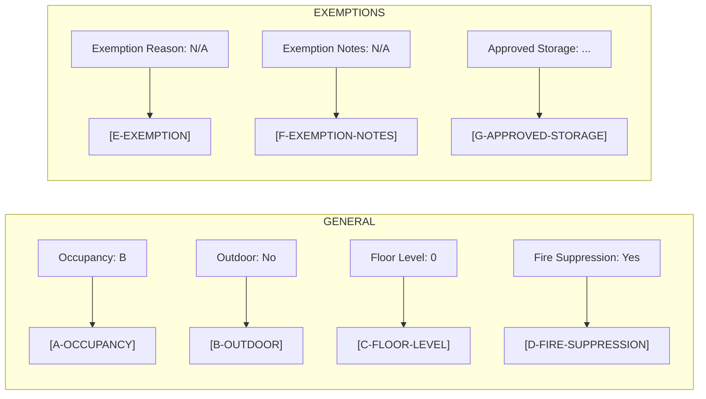

---

## MAQ Table Section

### ASCII Version

```
┌─────────────────────────────────────────────────────────────────────────────────────────────────────┐
│  PHYSICAL HAZARDS                                                                                    │
├───────────────────────┬─────────────────────────────┬─────────────────────────────┬─────────────────┤
│                       │           SOLID             │          LIQUID             │       GAS       │
│       Material        ├─────────┬─────────┬─────────┼─────────┬─────────┬─────────┼────────┬────────┤
│     [H-MATERIAL]      │  Actual │   MAQ   │  Units  │  Actual │   MAQ   │  Units  │ Actual │  MAQ   │
│                       │[I-SOLID]│[J-LIMIT]│[K-UNITS]│[L-LIQUID│[M-LIMIT]│[N-UNITS]│[O-GAS] │[P-LIMIT│
├───────────────────────┼─────────┼─────────┼─────────┼─────────┼─────────┼─────────┼────────┼────────┤
│ Flammable Liquid: IA  │  0.00   │   60    │   gal   │  5.23   │   60    │   gal   │  0.00  │  N/A   │
│                       │         │  ┌──────┴──────┐  │         │  ┌──────┴──────┐  │        │        │
│                       │         │  │ HOVER SHOWS │  │         │  │ HOVER SHOWS │  │        │        │
│                       │         │  │ [S-FACTORS] │  │         │  │ [S-FACTORS] │  │        │        │
│                       │         │  │ Baseline:30 │  │         │  │ Baseline:30 │  │        │        │
│                       │         │  │ ×Sprinkler:2│  │         │  │ ×Sprinkler:2│  │        │        │
│                       │         │  └─────────────┘  │         │  └─────────────┘  │        │        │
├───────────────────────┼─────────┼─────────┼─────────┼─────────┼─────────┼─────────┼────────┼────────┤
│ Combustible Liquid    │  0.00   │  120    │   lbs   │ 12.50   │  240    │   gal   │  0.00  │  N/A   │
├───────────────────────┼─────────┼─────────┼─────────┼─────────┼─────────┼─────────┼────────┼────────┤
│ Oxidizer: 1           │  2.10   │  500    │   lbs   │  0.00   │  500    │   gal   │  0.00  │   NL   │
└───────────────────────┴─────────┴─────────┴─────────┴─────────┴─────────┴─────────┴────────┴────────┘

LEGEND:
  Red text = [T-STATUS] OVER_THRESHOLD (actual >= limit)
  Warning icon = NEAR_THRESHOLD (actual >= 80% of limit)
  NL = No Limit
  N/A = Not Applicable
```

### Mermaid Version

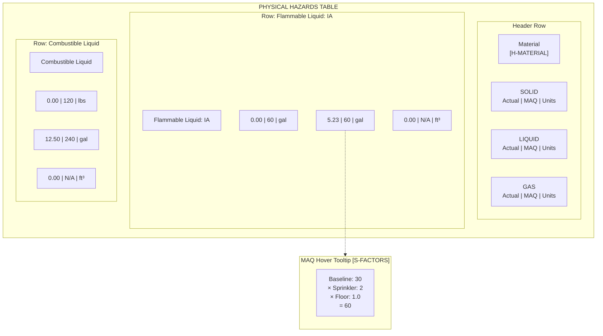

### Table Cell Data Point Mapping

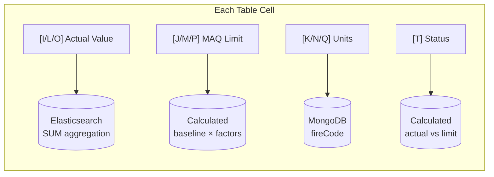

### Legend

| Display | Status | Meaning |
|---------|--------|---------|
| Red text | `OVER_THRESHOLD` | actual >= limit |
| Warning icon | `NEAR_THRESHOLD` | actual >= 80% of limit |
| Gray text | `COMPLIANT` | actual < 80% of limit |
| NL | No Limit | No regulatory limit |
| N/A | Not Applicable | State not tracked |

---

## Data Point Reference

Click any section letter to jump to the detailed derivation:

| ID | Data Point | Quick Source |
|----|------------|--------------|
| [A](#a-occupancy) | Occupancy | MongoDB: `controlArea.occupancy` |
| [B](#b-outdoor) | Outdoor | MongoDB: `controlArea.isOutdoor` |
| [C](#c-floor-level) | Floor Level | External: `building.floors[].groundPlane` |
| [D](#d-fire-suppression-coverage) | Fire Suppression | Calculated OR MongoDB override |
| [E](#e-exemption-reason) | Exemption Reason | MongoDB: `controlArea.exemption.reason` |
| [F](#f-exemption-notes) | Exemption Notes | MongoDB: `controlArea.exemption.notes` |
| [G](#g-approved-storage) | Approved Storage | MongoDB: `controlArea.approvedStorage[]` |
| [H](#h-material-name) | Material Name | MongoDB: `fireCode.occupancies[].hazardClasses[].name` |
| [I](#i-actual-value) | Actual Value | Elasticsearch: `SUM(container.normalizedSize)` |
| [J](#j-maq-limit) | MAQ Limit | **CALCULATED**: baseline × factors |
| [K](#k-units) | Units | MongoDB: `fireCode...hazardClasses[].solid.units` |
| [S](#s-maq-factors) | MAQ Factors | **CALCULATED**: getMaqFactors() |
| [T](#t-compliance-status) | Compliance Status | **CALCULATED**: getComplianceStatus() |

---

# Detailed Derivation Chains

---

## A. Occupancy

**UI Location:** `ControlAreaDetail.tsx` line 52
**Display:** `"Occupancy: {controlArea.occupancy}"`

### Derivation Chain (ASCII)

```
┌─────────────────────────────────────────────────────────────────────────────────┐
│  UI LAYER                                                                        │
│  ControlAreaDetail.tsx:52                                                        │
│  <p>Occupancy: {controlArea.occupancy}</p>                                       │
└─────────────────────────────────────────────────────────────────────────────────┘
                                          │
                                          ▼
┌─────────────────────────────────────────────────────────────────────────────────┐
│  GRAPHQL RESPONSE                                                                │
│  buildingMaqReport.controlAreas[].occupancy                                      │
│  Fragment: buildingMaqFragment (fragments.ts)                                    │
└─────────────────────────────────────────────────────────────────────────────────┘
                                          │
                                          ▼
┌─────────────────────────────────────────────────────────────────────────────────┐
│  SERVER LAYER                                                                    │
│  MAQReportService.calculateMAQByBuilding():335-336                               │
│  controlArea.occupancy (passed through from MongoDB)                             │
└─────────────────────────────────────────────────────────────────────────────────┘
                                          │
                                          ▼
┌─────────────────────────────────────────────────────────────────────────────────┐
│  DATA LAYER                                                                      │
│  ControlAreaService.getByBuildingId():36-41                                      │
│  MongoDB Query: find({ 'building.buildingId': { $in: buildingIds } })            │
└─────────────────────────────────────────────────────────────────────────────────┘
                                          │
                                          ▼
┌─────────────────────────────────────────────────────────────────────────────────┐
│  DATABASE                                                                        │
│  ═══════════════════════════════════════════════════════════════════════════════ │
│  Collection: controlArea                                                         │
│  Field: occupancy                                                                │
│  Type: String                                                                    │
│  Values: 'A', 'B', 'E', 'F', 'H', 'I', 'M', 'R', 'S', 'U'                        │
│  ═══════════════════════════════════════════════════════════════════════════════ │
└─────────────────────────────────────────────────────────────────────────────────┘
```

### Derivation Chain (Mermaid)

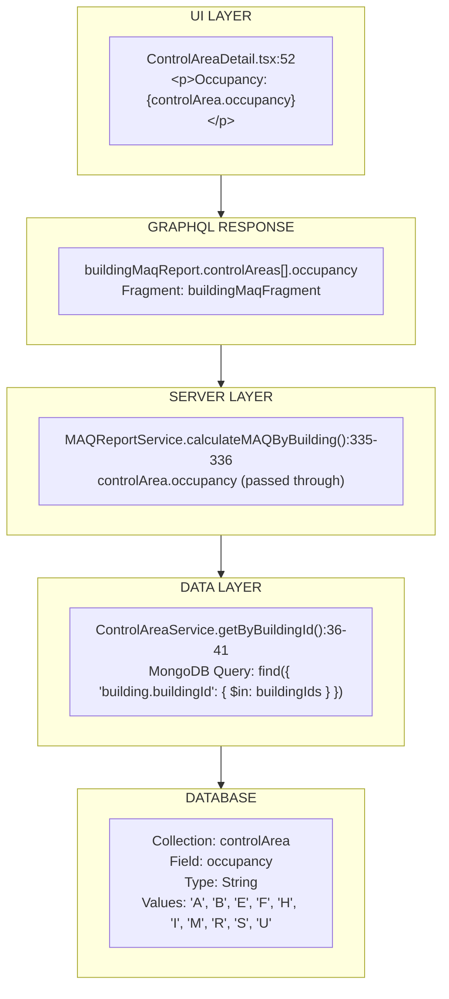

### Impact on Calculations

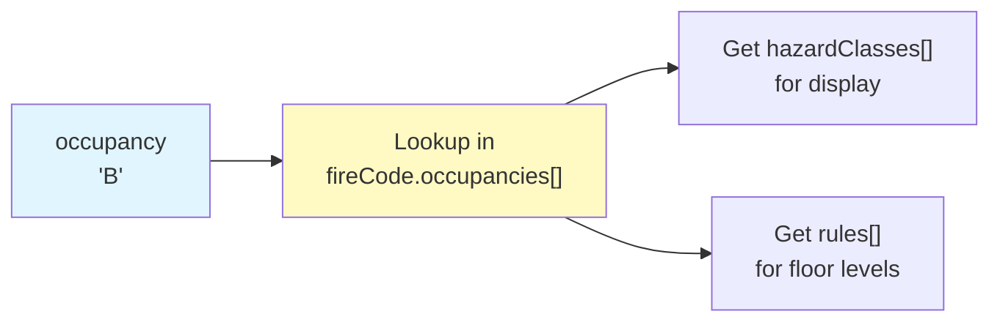

```javascript
// maq-compliance.helper.ts:788
const fireCodeOccupancy = fireCode.occupancies.find(o => o.name === area.occupancy);
```

---

## B. Outdoor

**UI Location:** `ControlAreaDetail.tsx` line 53
**Display:** `"Outdoor: Yes/No"`

### Derivation Chain (ASCII)

```
┌─────────────────────────────────────────────────────────────────────────────────┐
│  UI LAYER                                                                        │
│  ControlAreaDetail.tsx:53                                                        │
│  <p>Outdoor: {controlArea.isOutdoor ? 'Yes' : 'No'}</p>                          │
└─────────────────────────────────────────────────────────────────────────────────┘
                                          │
                                          ▼
┌─────────────────────────────────────────────────────────────────────────────────┐
│  GRAPHQL RESPONSE                                                                │
│  buildingMaqReport.controlAreas[].isOutdoor                                      │
└─────────────────────────────────────────────────────────────────────────────────┘
                                          │
                                          ▼
┌─────────────────────────────────────────────────────────────────────────────────┐
│  DATABASE                                                                        │
│  ═══════════════════════════════════════════════════════════════════════════════ │
│  Collection: controlArea                                                         │
│  Field: isOutdoor                                                                │
│  Type: Boolean                                                                   │
│  Default: false                                                                  │
│  ═══════════════════════════════════════════════════════════════════════════════ │
└─────────────────────────────────────────────────────────────────────────────────┘
```

### Derivation Chain (Mermaid)

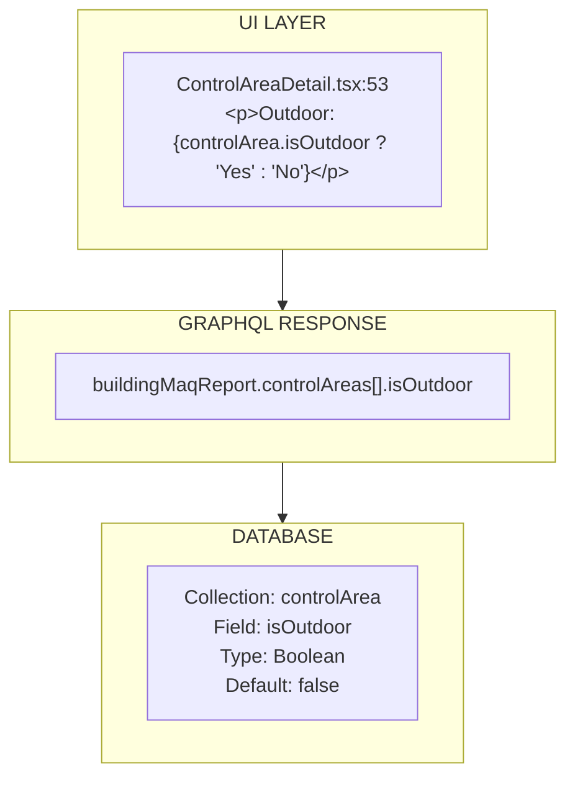

### Impact on Calculations

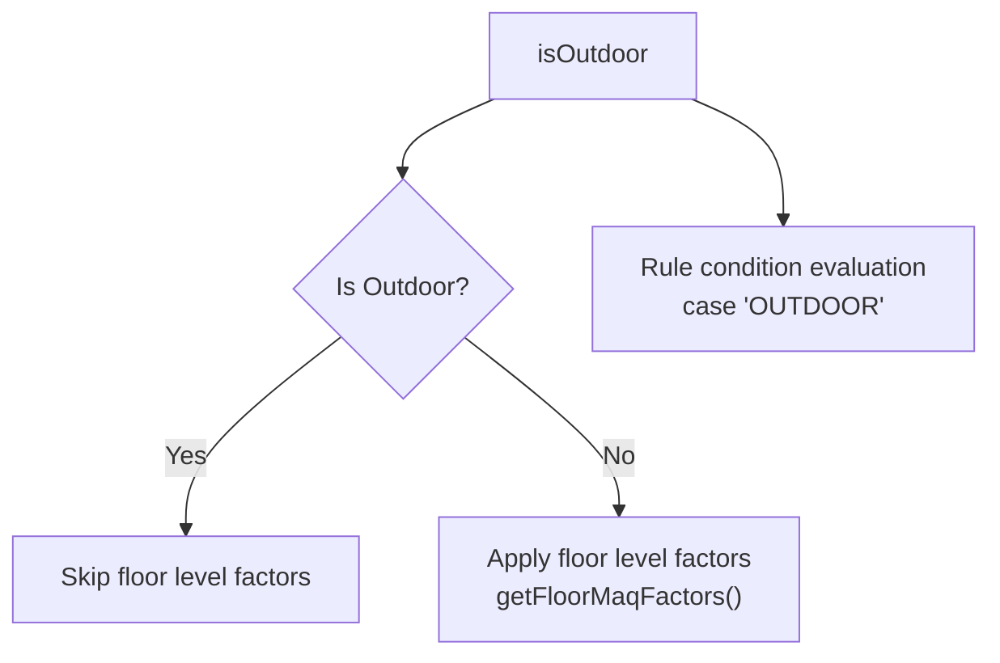

```javascript
// maq-compliance.helper.ts:351
if (!isOutdoor) {
    maqFactors = maqFactors.concat(getFloorMaqFactors(occupancyRules, floorAboveGroundPlane));
}

// maq-compliance.helper.ts:156 - Rule condition evaluation
case 'OUTDOOR':
    return isTrue(value) === isOutdoor;
```

---

## C. Floor Level

**UI Location:** `ControlAreaDetail.tsx` line 54
**Display:** `"Floor Level: {groundPlane}"`

### Derivation Chain (ASCII)

```
┌─────────────────────────────────────────────────────────────────────────────────┐
│  UI LAYER                                                                        │
│  ControlAreaDetail.tsx:29-33                                                     │
│  const floor = floors.reduce((acc, cur) =>                                       │
│      Math.abs(stringToInt(cur.groundPlane)) > Math.abs(stringToInt(acc.groundPlane))│
│          ? cur : acc                                                             │
│  );                                                                              │
└─────────────────────────────────────────────────────────────────────────────────┘
                                          │
                                          ▼
┌─────────────────────────────────────────────────────────────────────────────────┐
│  GRAPHQL RESPONSE                                                                │
│  buildingMaqReport.floors[].groundPlane                                          │
│  (filtered by rooms with matching controlAreaId)                                 │
└─────────────────────────────────────────────────────────────────────────────────┘
                                          │
                                          ▼
┌─────────────────────────────────────────────────────────────────────────────────┐
│  SERVER LAYER                                                                    │
│  MAQReportService.getMAQReportByBuildingId()                                     │
│  building.floors from RelationshipGateway                                        │
└─────────────────────────────────────────────────────────────────────────────────┘
                                          │
                                          ▼
┌─────────────────────────────────────────────────────────────────────────────────┐
│  EXTERNAL SERVICE                                                                │
│  ═══════════════════════════════════════════════════════════════════════════════ │
│  Service: Relationship Service (External GraphQL API)                            │
│  Query: AxiosRelationshipGateway.fetchById(buildingId)                           │
│  Path: result.data.data.building.floors[].groundPlane                            │
│  Type: String (parsed to Int: "-2", "-1", "0", "1", "2", etc.)                   │
│  ═══════════════════════════════════════════════════════════════════════════════ │
└─────────────────────────────────────────────────────────────────────────────────┘
```

### Derivation Chain (Mermaid)

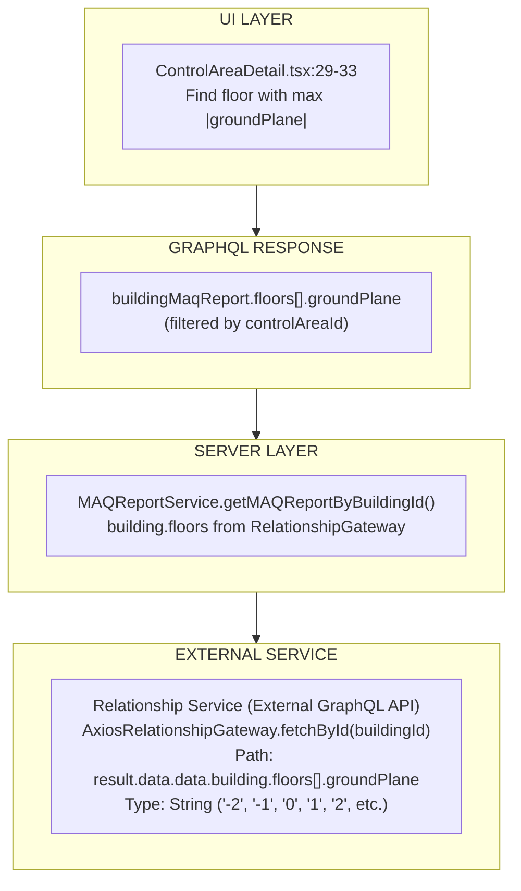

### Impact on Calculations

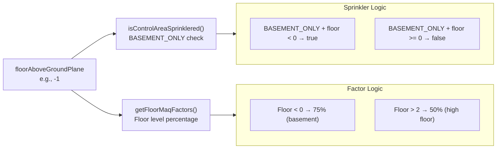

```javascript
// maq-compliance.helper.ts:183-219 - Floor level factors
getFloorMaqFactors(fireCodeOccupancyRules, floorAboveGroundPlane):
    // Rules like: "Floor is less than 0 → 75%" (basement reduction)
    // or "Floor is greater than 2 → 50%" (high floor reduction)

// maq-compliance.helper.ts:122-130 - Sprinkler determination for BASEMENT_ONLY
isControlAreaSprinklered(fireSuppressionType, floorAboveGroundPlane):
    if (fireSuppressionType === 'BASEMENT_ONLY') {
        return floorAboveGroundPlane < 0;  // Only basements are sprinklered
    }
```

---

## D. Fire Suppression Coverage

**UI Location:** `ControlAreaDetail.tsx` lines 55-59
**Display:** `"Fire Suppression Coverage: Yes/No"` (only if override exists)

### Derivation Chain (ASCII)

```
┌─────────────────────────────────────────────────────────────────────────────────┐
│  UI LAYER                                                                        │
│  ControlAreaDetail.tsx:55-59                                                     │
│  {controlArea.fireSuppressionOverride?.override && (                             │
│      <p>Fire Suppression Coverage:                                               │
│          {controlArea.fireSuppressionOverride.value ? 'Yes' : 'No'}              │
│      </p>                                                                        │
│  )}                                                                              │
└─────────────────────────────────────────────────────────────────────────────────┘
                                          │
              ┌───────────────────────────┴───────────────────────────┐
              ▼                                                       ▼
┌─────────────────────────────────┐           ┌─────────────────────────────────────┐
│  IF OVERRIDE EXISTS             │           │  IF NO OVERRIDE                     │
│  MongoDB: controlArea           │           │  CALCULATED from building           │
│  .fireSuppressionOverride       │           │  .fireSuppressionType               │
│  {                              │           │                                     │
│    override: true,              │           │  isControlAreaSprinklered(          │
│    value: true/false            │           │    buildingFireSuppressionType,     │
│  }                              │           │    floorAboveGroundPlane            │
│                                 │           │  )                                  │
└─────────────────────────────────┘           └─────────────────────────────────────┘
                                                              │
                                                              ▼
                                   ┌─────────────────────────────────────────────────┐
                                   │  CALCULATION: maq-compliance.helper.ts:122-130  │
                                   │  isControlAreaSprinklered():                    │
                                   │    FULL → true                                  │
                                   │    BASEMENT_ONLY + floor < 0 → true             │
                                   │    BASEMENT_ONLY + floor >= 0 → false           │
                                   │    NONE → false                                 │
                                   └─────────────────────────────────────────────────┘
```

### Derivation Chain (Mermaid)

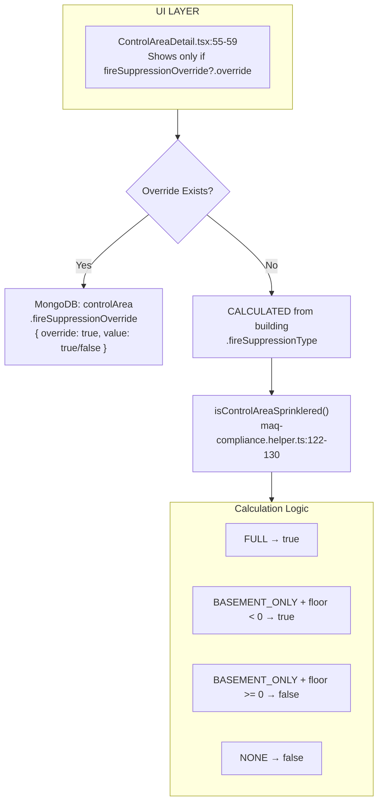

### Database Sources

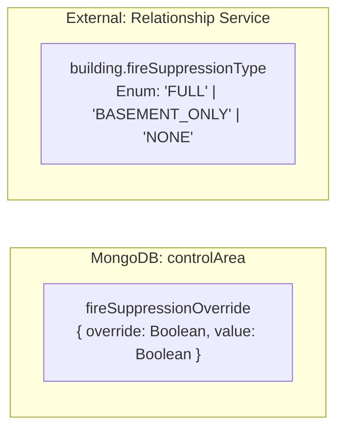

---

## E. Exemption Reason

**UI Location:** `ControlAreaDetail.tsx` lines 68-70
**Display:** `"Exemption Reason: {reason}"`

### Derivation Chain (ASCII)

```
┌─────────────────────────────────────────────────────────────────────────────────┐
│  UI LAYER                                                                        │
│  ControlAreaDetail.tsx:68-70                                                     │
│  <p>Exemption Reason: {controlArea.exemption?.reason ?? 'N/A'}</p>               │
└─────────────────────────────────────────────────────────────────────────────────┘
                                          │
                                          ▼
┌─────────────────────────────────────────────────────────────────────────────────┐
│  DATABASE                                                                        │
│  ═══════════════════════════════════════════════════════════════════════════════ │
│  Collection: controlArea                                                         │
│  Field: exemption.reason                                                         │
│  Type: String | null                                                             │
│  ═══════════════════════════════════════════════════════════════════════════════ │
└─────────────────────────────────────────────────────────────────────────────────┘
```

### Derivation Chain (Mermaid)

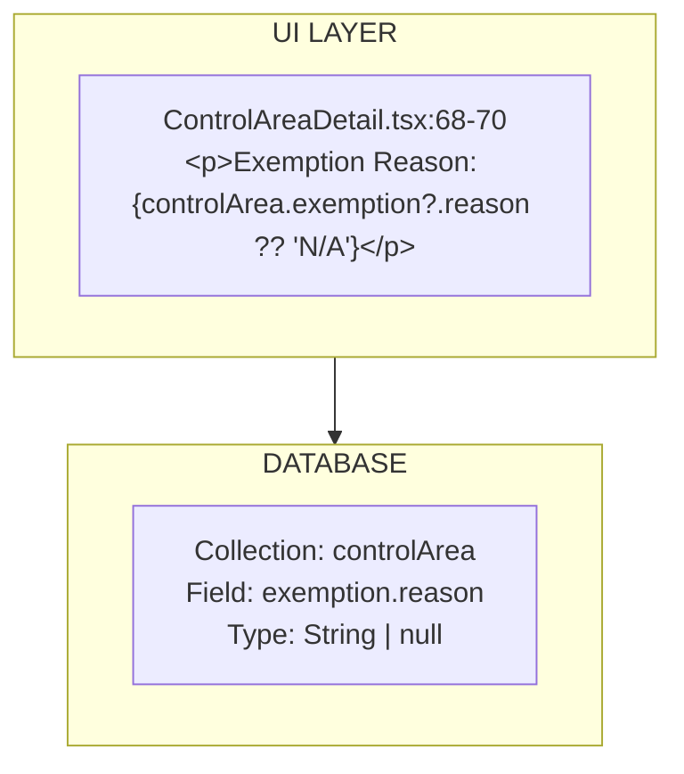

### Impact on Calculations

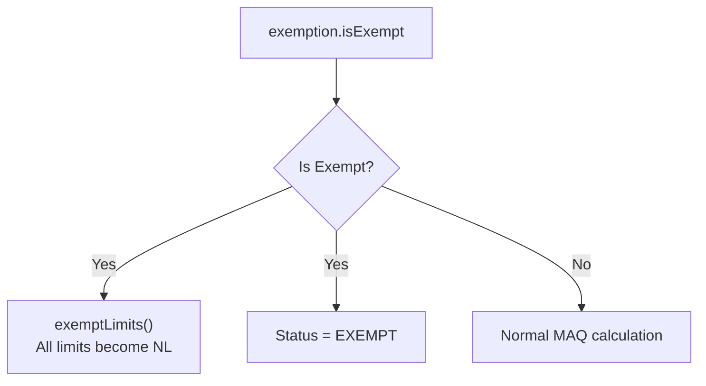

```javascript
// maq-compliance.helper.ts:735-737
if (maqFactors.exemption?.isExempt) {
    return exemptLimits(fireCodeHazardClass);  // All limits become NL
}

// maq-compliance.helper.ts:902
status: controlArea.exemption.isExempt
    ? ComplianceStatus.Exempt
    : getControlAreaCompliance(maq)
```

---

## F. Exemption Notes

**UI Location:** `ControlAreaDetail.tsx` lines 71-73
**Display:** `"Exemption Notes: {notes}"`

### Derivation Chain (ASCII)

```
┌─────────────────────────────────────────────────────────────────────────────────┐
│  DATABASE                                                                        │
│  ═══════════════════════════════════════════════════════════════════════════════ │
│  Collection: controlArea                                                         │
│  Field: exemption.notes                                                          │
│  Type: String | null                                                             │
│  ═══════════════════════════════════════════════════════════════════════════════ │
└─────────────────────────────────────────────────────────────────────────────────┘
```

### Derivation Chain (Mermaid)

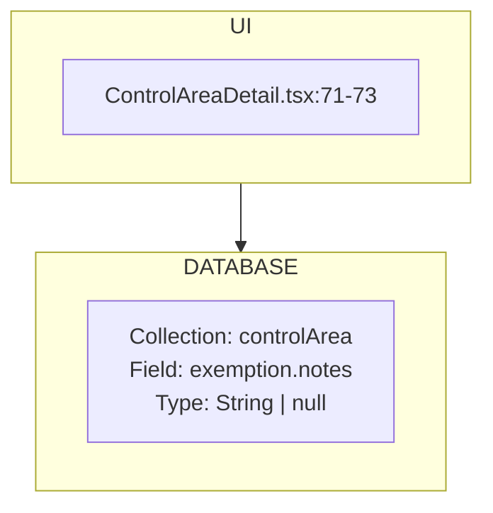

---

## G. Approved Storage

**UI Location:** `ControlAreaDetail.tsx` lines 74-78
**Display:** `displayApprovedStorage(approvedStorage, selectedOccupancy)`

### Derivation Chain (ASCII)

```
┌─────────────────────────────────────────────────────────────────────────────────┐
│  UI LAYER                                                                        │
│  ControlAreaDetail.tsx:74-78                                                     │
│  displayApprovedStorage() formats as:                                            │
│  "Flammable Liquid: solid, liquid" or "N/A"                                      │
└─────────────────────────────────────────────────────────────────────────────────┘
                                          │
                                          ▼
┌─────────────────────────────────────────────────────────────────────────────────┐
│  DATABASE                                                                        │
│  ═══════════════════════════════════════════════════════════════════════════════ │
│  Collection: controlArea                                                         │
│  Field: approvedStorage                                                          │
│  Type: Array of {                                                                │
│    hazardClass: String,           // e.g., "Flammable Liquid: IA"                │
│    physicalStates: [String]       // e.g., ["solid", "liquid"]                   │
│  }                                                                               │
│  ═══════════════════════════════════════════════════════════════════════════════ │
└─────────────────────────────────────────────────────────────────────────────────┘
```

### Derivation Chain (Mermaid)

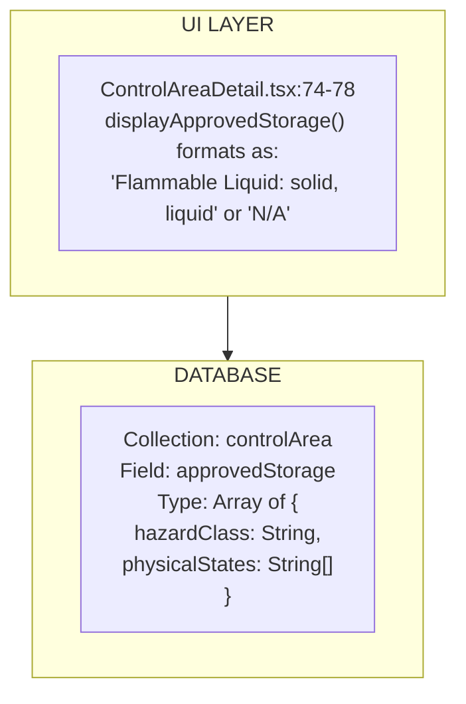

### Impact on Calculations

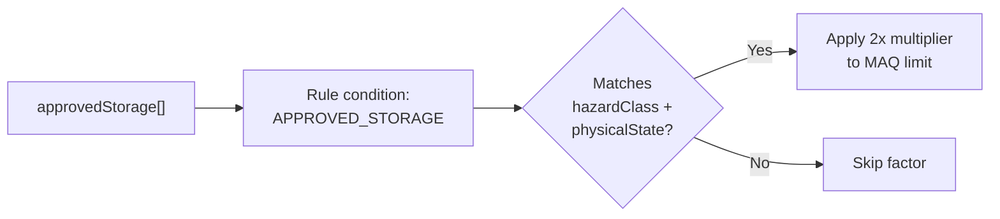

```javascript
// maq-compliance.helper.ts:150-155
case 'APPROVED_STORAGE':
    return isTrue(condition.value) === approvedStorage.some(
        h => h.hazardClass === fireCodeHazardClass.name &&
             h.physicalStates.includes(physicalState)
    );

// When matched, typically applies 2x multiplier to MAQ limit
```

---

## H. Material Name

**UI Location:** `MaqTable.tsx` line 127
**Display:** Hazard class name in Material column

### Derivation Chain (ASCII)

```
┌─────────────────────────────────────────────────────────────────────────────────┐
│  UI LAYER                                                                        │
│  MaqTable.tsx:127-129                                                            │
│  { Header: 'Material', accessor: 'name', Cell: renderHazardCell }                │
│  Displays: row.original.name                                                     │
└─────────────────────────────────────────────────────────────────────────────────┘
                                          │
                                          ▼
┌─────────────────────────────────────────────────────────────────────────────────┐
│  GRAPHQL RESPONSE                                                                │
│  buildingMaqReport.controlAreas[].hazardClasses[].name                           │
└─────────────────────────────────────────────────────────────────────────────────┘
                                          │
                                          ▼
┌─────────────────────────────────────────────────────────────────────────────────┐
│  CALCULATION LAYER                                                               │
│  maq-compliance.helper.ts:874-875                                                │
│  getControlAreaMaq() → hazardClassLimit.name                                     │
│  (copied from fire code hazard class)                                            │
└─────────────────────────────────────────────────────────────────────────────────┘
                                          │
                                          ▼
┌─────────────────────────────────────────────────────────────────────────────────┐
│  DATABASE                                                                        │
│  ═══════════════════════════════════════════════════════════════════════════════ │
│  Collection: fireCode                                                            │
│  Path: occupancies[].hazardClasses[].name                                        │
│  Type: String                                                                    │
│  Examples: "Flammable Liquid: IA", "Combustible Liquid: II", "Oxidizer: 1"       │
│  ═══════════════════════════════════════════════════════════════════════════════ │
└─────────────────────────────────────────────────────────────────────────────────┘
```

### Derivation Chain (Mermaid)

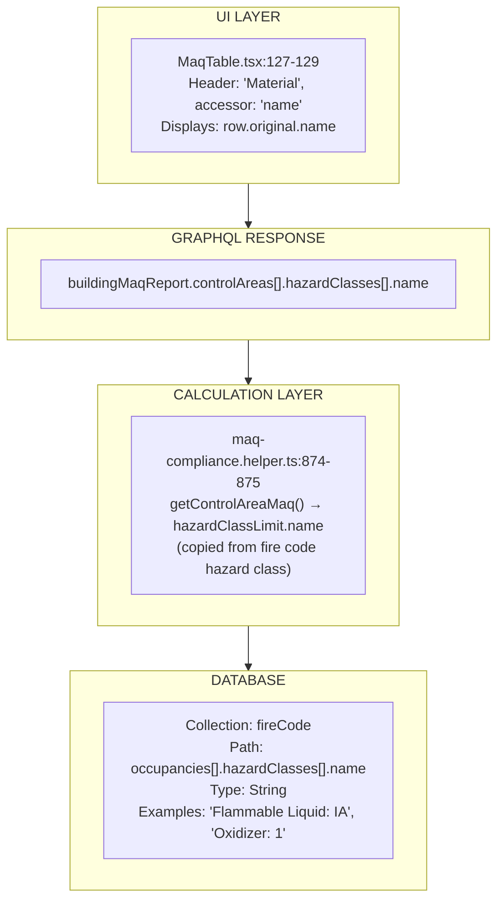

---

## I. Actual Value

**UI Location:** `MaqTable.tsx` line 51
**Display:** Actual quantity in control area (e.g., "5.23")

### Complete Derivation Chain (ASCII)

```
┌─────────────────────────────────────────────────────────────────────────────────┐
│  UI LAYER                                                                        │
│  MaqTable.tsx:45-52                                                              │
│  {value.displayValue || '0'}                                                     │
│  Red text if value?.status === ComplianceStatus.OverThreshold                    │
└─────────────────────────────────────────────────────────────────────────────────┘
                                          │
                                          ▼
┌─────────────────────────────────────────────────────────────────────────────────┐
│  GRAPHQL RESPONSE                                                                │
│  hazardClass.solid.displayValue                                                  │
│  hazardClass.solid.actualWeight (raw grams)                                      │
│  hazardClass.solid.actualVolume (raw liters)                                     │
└─────────────────────────────────────────────────────────────────────────────────┘
                                          │
                                          ▼
┌─────────────────────────────────────────────────────────────────────────────────┐
│  CALCULATION: Display Formatting                                                 │
│  maq-compliance.helper.ts:881                                                    │
│  sigFigDecimal(solidActual)                                                      │
│  ┌─────────────────────────────────────────────────────────────────────────────┐│
│  │ misc.ts:14-25                                                                ││
│  │ if (value === 0) → '0.00'                                                    ││
│  │ if (value < 0.0001) → '< 0.0001'                                             ││
│  │ if (value < 0.01) → value.toFixed(4)                                         ││
│  │ else → value.toFixed(2)                                                      ││
│  └─────────────────────────────────────────────────────────────────────────────┘│
└─────────────────────────────────────────────────────────────────────────────────┘
                                          │
                                          ▼
┌─────────────────────────────────────────────────────────────────────────────────┐
│  CALCULATION: Unit Conversion                                                    │
│  maq-compliance.helper.ts:859                                                    │
│  solidActual = convertNormalizedAmount(actualWeight, 'gramToPound')              │
│  ┌─────────────────────────────────────────────────────────────────────────────┐│
│  │ Conversion Constants (maq-compliance.helper.ts:830-852)                      ││
│  │ gramToPound = 0.0022046226                                                   ││
│  │ literToGallon = 0.2641720524                                                 ││
│  │ literToCubicFeet = 0.0353146667                                              ││
│  └─────────────────────────────────────────────────────────────────────────────┘│
└─────────────────────────────────────────────────────────────────────────────────┘
                                          │
                                          ▼
┌─────────────────────────────────────────────────────────────────────────────────┐
│  SERVER: Elasticsearch Aggregation                                               │
│  MAQReportService.fetchActuals():455-505                                         │
│                                                                                  │
│  Query:                                                                          │
│  {                                                                               │
│    index: 'container',                                                           │
│    query: {                                                                      │
│      bool: {                                                                     │
│        must: [{ terms: { 'location.roomId': [roomIds] } }],                      │
│        must_not: [                                                               │
│          { script: "exemption check" },                                          │
│          { term: { active: false } }                                             │
│        ]                                                                         │
│      }                                                                           │
│    },                                                                            │
│    aggs: {                                                                       │
│      FamilyBands: {                                                              │
│        filters: { filters: hazardClassFilters },                                 │
│        aggs: {                                                                   │
│          container_state: {                                                      │
│            terms: { field: 'family.formAtNtp.keyword' },                         │
│            aggs: {                                                               │
│              containers_sum_gram: { sum: { field: 'normalizedSize.gram' } },     │
│              containers_sum_liter: { sum: { field: 'normalizedSize.liter' } }    │
│            }                                                                     │
│          }                                                                       │
│        }                                                                         │
│      }                                                                           │
│    }                                                                             │
│  }                                                                               │
└─────────────────────────────────────────────────────────────────────────────────┘
                                          │
                                          ▼
┌─────────────────────────────────────────────────────────────────────────────────┐
│  DATABASE: Elasticsearch Container Index                                         │
│  ═══════════════════════════════════════════════════════════════════════════════ │
│  Index: container                                                                │
│  ───────────────────────────────────────────────────────────────────────────────│
│  Fields Used:                                                                    │
│  • normalizedSize.gram (float) - Pre-computed weight in grams                    │
│  • normalizedSize.liter (float) - Pre-computed volume in liters                  │
│  • family.formAtNtp (keyword) - Physical state: 'solid'/'liquid'/'gas'           │
│  • family.bands._id (keyword) - Chemical band IDs for hazard class matching      │
│  • location.roomId (keyword) - Room association                                  │
│  • exemption (keyword) - If non-empty, container excluded from MAQ               │
│  • active (boolean) - If false, container excluded                               │
│  ═══════════════════════════════════════════════════════════════════════════════ │
└─────────────────────────────────────────────────────────────────────────────────┘
                                          │
                                          ▼
┌─────────────────────────────────────────────────────────────────────────────────┐
│  Hazard Class Mapping (for Elasticsearch filter)                                 │
│  ═══════════════════════════════════════════════════════════════════════════════ │
│  Collection: fireCode                                                            │
│  Field: hazardClassMappings[]                                                    │
│  Structure:                                                                      │
│  {                                                                               │
│    name: "Flammable Liquid: IA",                                                 │
│    must: [{ id: "band-uuid-1", displayName: "Flammable Liquid Cat 1" }],         │
│    should: [{ id: "band-uuid-2", displayName: "..." }],                          │
│    mustNot: [{ id: "band-uuid-3", displayName: "..." }]                          │
│  }                                                                               │
│  ═══════════════════════════════════════════════════════════════════════════════ │
└─────────────────────────────────────────────────────────────────────────────────┘
```

### Complete Derivation Chain (Mermaid)

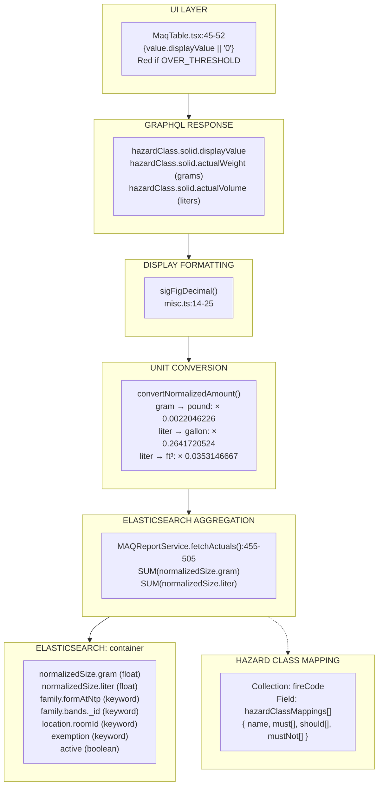

### Elasticsearch Query Structure (Mermaid)

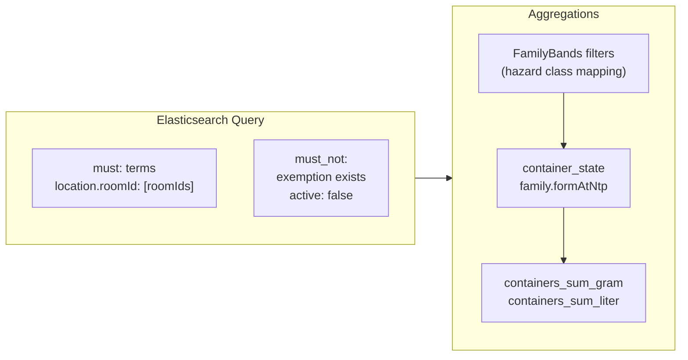

---

## J. MAQ Limit

**UI Location:** `MaqTable.tsx` line 65 via `DisplayMaqFormulae` component
**Display:** MAQ limit value (e.g., "60", "NL", "N/A")

### Complete Derivation Chain (ASCII)

```
┌─────────────────────────────────────────────────────────────────────────────────┐
│  UI LAYER                                                                        │
│  MaqTable.tsx:65-75                                                              │
│  value === 'N/A' || value === 'NL' ? value : <DisplayMaqFormulae ... />          │
└─────────────────────────────────────────────────────────────────────────────────┘
                                          │
                                          ▼
┌─────────────────────────────────────────────────────────────────────────────────┐
│  GRAPHQL RESPONSE                                                                │
│  hazardClass.solid.displayLimit                                                  │
│  hazardClass.solid.limit (numeric value or null)                                 │
└─────────────────────────────────────────────────────────────────────────────────┘
                                          │
                                          ▼
┌─────────────────────────────────────────────────────────────────────────────────┐
│  CALCULATION: Display Formatting                                                 │
│  maq-compliance.helper.ts:743-750                                                │
│  let displayLimit = `${limit.value}`;                                            │
│  if (isNoLimit) displayLimit = 'NL';                                             │
│  if (isNotApplicable) displayLimit = 'N/A';                                      │
└─────────────────────────────────────────────────────────────────────────────────┘
                                          │
                                          ▼
┌─────────────────────────────────────────────────────────────────────────────────┐
│  CALCULATION: Limit Value                                                        │
│  maq-compliance.helper.ts:358-398 calculateLimitByState()                        │
│                                                                                  │
│  [baseline, ...factors] = getMaqFactors(...)                                     │
│                                                                                  │
│  // Apply multiplier factors                                                     │
│  return factors.reduce((acc, cur) => {                                           │
│    if (cur.operator === 'MULTIPLY') {                                            │
│      return { ...acc, value: acc.value * cur.value }                             │
│    }                                                                             │
│    return acc;                                                                   │
│  }, { value: baseline.value, ... })                                              │
│                                                                                  │
│  FORMULA: finalLimit = baseline × factor1 × factor2 × ...                        │
└─────────────────────────────────────────────────────────────────────────────────┘
                                          │
                          ┌───────────────┴───────────────┐
                          ▼                               ▼
┌─────────────────────────────────────┐   ┌─────────────────────────────────────┐
│  BASELINE VALUE                     │   │  MULTIPLIER FACTORS                 │
│  MongoDB: fireCode                  │   │  See [S-MAQ-FACTORS]                │
│  occupancies[].hazardClasses[]      │   │  • Sprinkler: 2x if sprinklered     │
│  .solid.baseline                    │   │  • Approved Storage: 2x if matched  │
│  Type: Float                        │   │  • Floor Level: 0.5-1.0x            │
│  Example: 30                        │   │                                     │
└─────────────────────────────────────┘   └─────────────────────────────────────┘
```

### Complete Derivation Chain (Mermaid)

```mermaid
flowchart TB
    subgraph UI["UI LAYER"]
        UI_CODE["MaqTable.tsx:65-75<br/>value === 'N/A' || value === 'NL'<br/>? value : &lt;DisplayMaqFormulae /&gt;"]
    end

    subgraph GQL["GRAPHQL RESPONSE"]
        GQL_PATH["hazardClass.solid.displayLimit<br/>hazardClass.solid.limit (numeric or null)"]
    end

    subgraph FORMAT["DISPLAY FORMATTING"]
        FORMAT_CODE["maq-compliance.helper.ts:743-750<br/>displayLimit = limit.value<br/>if isNoLimit → 'NL'<br/>if isNotApplicable → 'N/A'"]
    end

    subgraph CALC["LIMIT CALCULATION"]
        CALC_CODE["calculateLimitByState()<br/>maq-compliance.helper.ts:358-398<br/>finalLimit = baseline × factor1 × factor2 × ..."]
    end

    UI --> GQL --> FORMAT --> CALC

    CALC --> BASELINE["BASELINE<br/>MongoDB: fireCode<br/>hazardClasses[].solid.baseline"]
    CALC --> FACTORS["FACTORS<br/>See [S-MAQ-FACTORS]"]
```

### Example Calculation (Mermaid)

```mermaid
flowchart LR
    BASE["Baseline: 30 gal<br/>fireCode.occupancies[B]<br/>.hazardClasses[].liquid.baseline"] --> MULT1["× 2<br/>Sprinkler Rule<br/>(FULL coverage)"]
    MULT1 --> MULT2["× 1.0<br/>Floor Level<br/>(ground floor)"]
    MULT2 --> RESULT["= 60 gal<br/>Final MAQ"]

    style BASE fill:#e8f5e9
    style RESULT fill:#ffecb3
```

### Example Calculation (Text)

```
Flammable Liquid: IA (Liquid state)
├── Baseline: 30 gal (from fireCode.occupancies[B].hazardClasses[].liquid.baseline)
├── Sprinkler Rule: × 2 (building has FULL fire suppression)
├── Floor Level: × 1.0 (ground floor, no reduction)
└── Final MAQ: 30 × 2 × 1.0 = 60 gal
```

---

## K. Units

**UI Location:** `MaqTable.tsx` line 77
**Display:** Unit of measurement (e.g., "lbs", "gal", "ft³")

### Derivation Chain (ASCII)

```
┌─────────────────────────────────────────────────────────────────────────────────┐
│  UI LAYER                                                                        │
│  MaqTable.tsx:77                                                                 │
│  { Header: 'Units', accessor: `${state}.units` }                                 │
└─────────────────────────────────────────────────────────────────────────────────┘
                                          │
                                          ▼
┌─────────────────────────────────────────────────────────────────────────────────┐
│  DATABASE                                                                        │
│  ═══════════════════════════════════════════════════════════════════════════════ │
│  Collection: fireCode                                                            │
│  Path: occupancies[].hazardClasses[].solid.units                                 │
│  Path: occupancies[].hazardClasses[].liquid.units                                │
│  Path: occupancies[].hazardClasses[].gas.units                                   │
│  Type: String                                                                    │
│  Values: 'lbs', 'gal', 'ft3'                                                     │
│  ═══════════════════════════════════════════════════════════════════════════════ │
└─────────────────────────────────────────────────────────────────────────────────┘
```

### Derivation Chain (Mermaid)

```mermaid
flowchart TB
    subgraph UI["UI LAYER"]
        UI_CODE["MaqTable.tsx:77<br/>{ Header: 'Units', accessor: state.units }"]
    end

    subgraph DB["DATABASE"]
        DB_FIELD["Collection: fireCode<br/>Path: occupancies[].hazardClasses[]<br/>  .solid.units<br/>  .liquid.units<br/>  .gas.units<br/>Type: String<br/>Values: 'lbs', 'gal', 'ft3'"]
    end

    UI --> DB
```

---

## S. MAQ Factors

**UI Location:** `DisplayMaqFormulae.tsx` (tooltip on hover over MAQ value)
**Display:** Table showing calculation breakdown

### Visual Representation (ASCII)

```
┌─────────────────────────────────────────────────────────────────────────────────┐
│  HOVER TOOLTIP (DisplayMaqFormulae.tsx:55-68)                                    │
│  ┌─────────────────────────────────────────────────────────────────────────────┐│
│  │ Baseline │ Sprinkler │ Floor Level │                                        ││
│  ├──────────┼───────────┼─────────────┤                                        ││
│  │    30    │    × 2    │    × 0.75   │  = 45 gal                              ││
│  └──────────┴───────────┴─────────────┘                                        ││
└─────────────────────────────────────────────────────────────────────────────────┘
```

### Visual Representation (Mermaid)

```mermaid
flowchart TB
    subgraph TOOLTIP["Hover Tooltip"]
        HEADER["Baseline | Sprinkler | Floor Level"]
        VALUES["30 | × 2 | × 0.75"]
        RESULT["= 45 gal"]
    end
```

### Complete Derivation Chain (ASCII)

```
┌─────────────────────────────────────────────────────────────────────────────────┐
│  GRAPHQL RESPONSE                                                                │
│  hazardClass.solid.maqFactors[]                                                  │
│  { label: String, value: Float, operator: String, isNoLimit: Bool, ... }         │
└─────────────────────────────────────────────────────────────────────────────────┘
                                          │
                                          ▼
┌─────────────────────────────────────────────────────────────────────────────────┐
│  CALCULATION: getMaqFactors()                                                    │
│  maq-compliance.helper.ts:221-356                                                │
│                                                                                  │
│  Step 1: Start with Baseline                                                     │
│  maqFactors = [{                                                                 │
│    label: 'Baseline',                                                            │
│    value: fireCodeHazardClass[physicalState].baseline,                           │
│    operator: ''                                                                  │
│  }]                                                                              │
│                                                                                  │
│  Step 2: Apply Hazard Class Rules                                                │
│  for (rule of fireCodeHazardClass.rules) {                                       │
│    if (ruleApplies(rule, ...)) {                                                 │
│      // Add or replace factors based on operator                                 │
│    }                                                                             │
│  }                                                                               │
│                                                                                  │
│  Step 3: Apply Floor Level Factors (if not outdoor)                              │
│  if (!isOutdoor) {                                                               │
│    maqFactors.concat(getFloorMaqFactors(...))                                    │
│  }                                                                               │
└─────────────────────────────────────────────────────────────────────────────────┘
                                          │
                          ┌───────────────┼───────────────┐
                          ▼               ▼               ▼
┌─────────────────────────────┐ ┌─────────────────────────────┐ ┌─────────────────┐
│  HAZARD CLASS RULES         │ │  FLOOR LEVEL RULES          │ │  RULE CONDITIONS│
│  MongoDB: fireCode          │ │  MongoDB: fireCode          │ │  Evaluated by   │
│  .occupancies[]             │ │  .occupancies[].rules[]     │ │  ruleApplies()  │
│  .hazardClasses[].rules[]   │ │                             │ │                 │
│                             │ │  Example:                   │ │  • SPRINKLER    │
│  Example:                   │ │  {                          │ │  • APPROVED_    │
│  {                          │ │    operator: 'is less than',│ │    STORAGE      │
│    conditions: [{           │ │    appliedToFloors: [0],    │ │  • OUTDOOR      │
│      criteria: 'SPRINKLER', │ │    percentage: 75           │ │  • BASEMENT     │
│      operator: 'is',        │ │  }                          │ │                 │
│      value: 'true'          │ │  → Floor < 0 gets 0.75x     │ │                 │
│    }],                      │ │                             │ │                 │
│    solid: {                 │ │                             │ │                 │
│      value: 2,              │ │                             │ │                 │
│      operator: 'MULTIPLY'   │ │                             │ │                 │
│    }                        │ │                             │ │                 │
│  }                          │ │                             │ │                 │
└─────────────────────────────┘ └─────────────────────────────┘ └─────────────────┘
```

### Complete Derivation Chain (Mermaid)

```mermaid
flowchart TB
    subgraph GQL["GRAPHQL RESPONSE"]
        GQL_STRUCT["hazardClass.solid.maqFactors[]<br/>{ label, value, operator, isNoLimit, ... }"]
    end

    subgraph CALC["getMaqFactors() - maq-compliance.helper.ts:221-356"]
        STEP1["Step 1: Start with Baseline<br/>{ label: 'Baseline', value: baseline, operator: '' }"]
        STEP2["Step 2: Apply Hazard Class Rules<br/>for (rule of hazardClass.rules)"]
        STEP3["Step 3: Apply Floor Level Factors<br/>if (!isOutdoor) getFloorMaqFactors()"]
    end

    GQL --> CALC
    STEP1 --> STEP2 --> STEP3

    subgraph SOURCES["Data Sources"]
        HC_RULES["Hazard Class Rules<br/>fireCode.occupancies[]<br/>.hazardClasses[].rules[]"]
        FLOOR_RULES["Floor Level Rules<br/>fireCode.occupancies[].rules[]"]
        CONDITIONS["Rule Conditions<br/>SPRINKLER, APPROVED_STORAGE<br/>OUTDOOR, BASEMENT"]
    end

    STEP2 --> HC_RULES
    STEP3 --> FLOOR_RULES
    STEP2 --> CONDITIONS
```

### Rule Operators

| Operator | Effect |
|----------|--------|
| `MULTIPLY` | Multiply current value by rule value |
| `EQUALS` | Replace baseline with rule value |
| `OVERRIDE` | Replace entire calculation with rule value |

---

## T. Compliance Status

**UI Location:** `MaqTable.tsx` lines 49, 105-118
**Display:** Red text color and/or warning/error icon

### Derivation Chain (ASCII)

```
┌─────────────────────────────────────────────────────────────────────────────────┐
│  UI LAYER                                                                        │
│  MaqTable.tsx:49 - Cell text color                                               │
│  value?.status === ComplianceStatus.OverThreshold ? 'text-red-500' : '...'       │
│                                                                                  │
│  MaqTable.tsx:116 - Row icon                                                     │
│  {status !== ComplianceStatus.Compliant && <ComplianceIcon status={status} />}   │
└─────────────────────────────────────────────────────────────────────────────────┘
                                          │
                                          ▼
┌─────────────────────────────────────────────────────────────────────────────────┐
│  GRAPHQL RESPONSE                                                                │
│  hazardClass.solid.status                                                        │
│  Values: 'COMPLIANT' | 'NEAR_THRESHOLD' | 'OVER_THRESHOLD'                       │
└─────────────────────────────────────────────────────────────────────────────────┘
                                          │
                                          ▼
┌─────────────────────────────────────────────────────────────────────────────────┐
│  CALCULATION: getComplianceStatus()                                              │
│  maq-compliance.helper.ts:38-57                                                  │
│                                                                                  │
│  getComplianceStatus(limit: number | null, actual: number):                      │
│    if (limit === null) → COMPLIANT        // NL = always compliant               │
│    if (limit === 0 && actual === 0) → COMPLIANT                                  │
│    if (actual >= limit) → OVER_THRESHOLD                                         │
│    if (actual >= limit * 0.8) → NEAR_THRESHOLD   // 80% threshold                │
│    else → COMPLIANT                                                              │
└─────────────────────────────────────────────────────────────────────────────────┘
```

### Derivation Chain (Mermaid)

```mermaid
flowchart TB
    subgraph UI["UI LAYER"]
        COLOR["MaqTable.tsx:49<br/>OVER_THRESHOLD → 'text-red-500'"]
        ICON["MaqTable.tsx:116<br/>!COMPLIANT → &lt;ComplianceIcon /&gt;"]
    end

    subgraph GQL["GRAPHQL RESPONSE"]
        STATUS["hazardClass.solid.status<br/>'COMPLIANT' | 'NEAR_THRESHOLD' | 'OVER_THRESHOLD'"]
    end

    subgraph CALC["getComplianceStatus() - maq-compliance.helper.ts:38-57"]
        LOGIC["if (limit === null) → COMPLIANT<br/>if (actual >= limit) → OVER_THRESHOLD<br/>if (actual >= limit × 0.8) → NEAR_THRESHOLD<br/>else → COMPLIANT"]
    end

    UI --> GQL --> CALC
```

### Visual Status Indicators

| Status | Text Color | Icon | Condition |
|--------|------------|------|-----------|
| COMPLIANT | Gray | None | actual < 80% of limit |
| NEAR_THRESHOLD | Gray | Warning | 80% <= actual < 100% of limit |
| OVER_THRESHOLD | Red | Error | actual >= limit |
| EXEMPT | Gray | Exempt | controlArea.exemption.isExempt |

---

## Complete Data Flow Architecture

### Mermaid Version

```mermaid
flowchart TB
    subgraph CLIENT["Client Layer"]
        UI["React Components<br/>ControlAreaDetail.tsx<br/>MaqTable.tsx"]
    end

    subgraph GRAPHQL["GraphQL Layer"]
        QUERY["buildingMaqReportQuery<br/>fragments.ts"]
    end

    subgraph SERVER["Server Layer"]
        SERVICE["MAQReportService<br/>calculateMAQByBuilding()"]
        CALC_HELPER["maq-compliance.helper.ts<br/>getControlAreaMaq()<br/>getMaqFactors()<br/>calculateLimitByState()"]
    end

    subgraph DATA["Data Sources"]
        MONGO["MongoDB<br/>controlArea<br/>fireCode"]
        ES["Elasticsearch<br/>container index"]
        EXTERNAL["External Service<br/>Relationship Service"]
    end

    UI --> QUERY --> SERVICE
    SERVICE --> CALC_HELPER
    SERVICE --> MONGO
    SERVICE --> ES
    SERVICE --> EXTERNAL
```

### ASCII Version

```
┌─────────────────────────────────────────────────────────────────────────────────┐
│                              CLIENT LAYER                                        │
│  ┌───────────────────────────────────────────────────────────────────────────┐  │
│  │  React Components: ControlAreaDetail.tsx, MaqTable.tsx                     │  │
│  └───────────────────────────────────────────────────────────────────────────┘  │
└─────────────────────────────────────────────────────────────────────────────────┘
                                          │
                                          ▼
┌─────────────────────────────────────────────────────────────────────────────────┐
│                             GRAPHQL LAYER                                        │
│  ┌───────────────────────────────────────────────────────────────────────────┐  │
│  │  buildingMaqReportQuery, fragments.ts                                      │  │
│  └───────────────────────────────────────────────────────────────────────────┘  │
└─────────────────────────────────────────────────────────────────────────────────┘
                                          │
                                          ▼
┌─────────────────────────────────────────────────────────────────────────────────┐
│                              SERVER LAYER                                        │
│  ┌───────────────────────────────────────────────────────────────────────────┐  │
│  │  MAQReportService.calculateMAQByBuilding()                                 │  │
│  │  maq-compliance.helper.ts (getControlAreaMaq, getMaqFactors, etc.)         │  │
│  └───────────────────────────────────────────────────────────────────────────┘  │
└─────────────────────────────────────────────────────────────────────────────────┘
                                          │
                    ┌─────────────────────┼─────────────────────┐
                    ▼                     ▼                     ▼
┌─────────────────────────┐ ┌─────────────────────────┐ ┌─────────────────────────┐
│       MongoDB           │ │     Elasticsearch       │ │   External Service      │
│  • controlArea          │ │  • container index      │ │  • Relationship Service │
│  • fireCode             │ │                         │ │  • Building data        │
└─────────────────────────┘ └─────────────────────────┘ └─────────────────────────┘
```

---

## Complete Data Source Reference

### MongoDB Collections

| Collection | Key Fields | Used For |
|------------|------------|----------|
| `fireCode` | `occupancies[]`, `hazardClassMappings[]` | MAQ baselines, rules, hazard class definitions |
| `controlArea` | `occupancy`, `isOutdoor`, `exemption`, `approvedStorage`, `fireSuppressionOverride` | Control area configuration |

### Elasticsearch Indices

| Index | Key Fields | Used For |
|-------|------------|----------|
| `container` | `normalizedSize.gram`, `normalizedSize.liter`, `family.formAtNtp`, `location.roomId` | Actual quantities |

### External Services

| Service | Key Fields | Used For |
|---------|------------|----------|
| Relationship Service | `building.fireSuppressionType`, `building.floors[].groundPlane`, `building.floors[].rooms[].controlAreaId` | Building data, floor levels |

---

## File Reference

| File | Purpose |
|------|---------|
| `packages/client/src/app/building-maq/control-area/ControlAreaDetail.tsx` | Control area page layout |
| `packages/client/src/app/building-maq/control-area/MaqTable.tsx` | MAQ table rendering |
| `packages/client/src/app/building-maq/control-area/DisplayMaqFormulae.tsx` | MAQ factor tooltip |
| `packages/common/src/utils/maq-compliance.helper.ts` | All MAQ calculations |
| `packages/server/src/building/MAQReportService.ts` | Server-side data orchestration |

---

*Document generated: December 2024*
