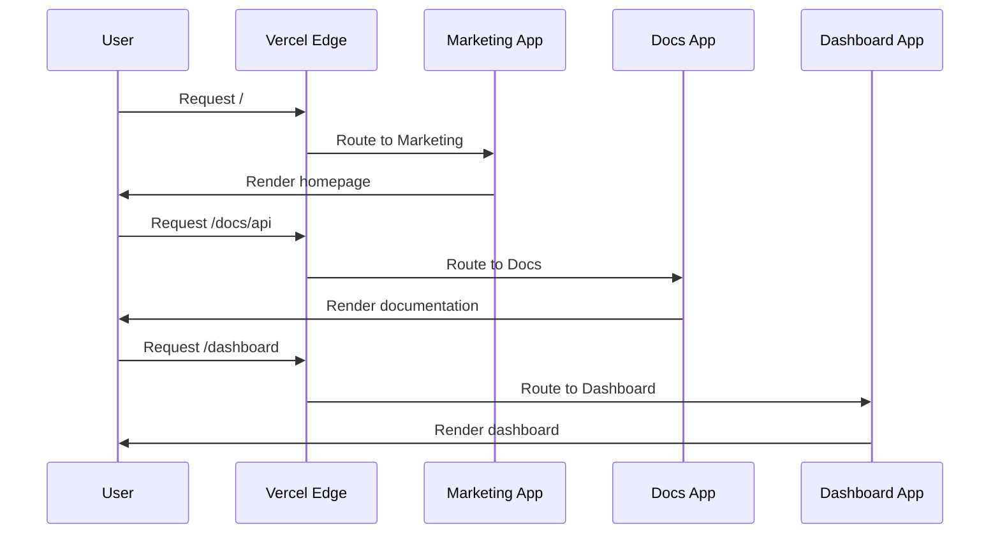
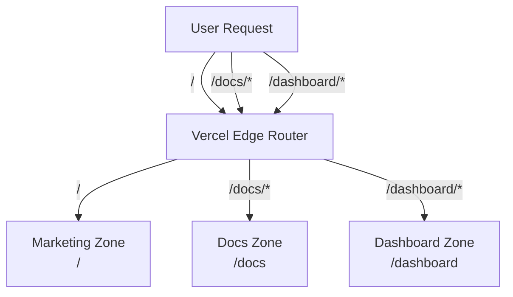
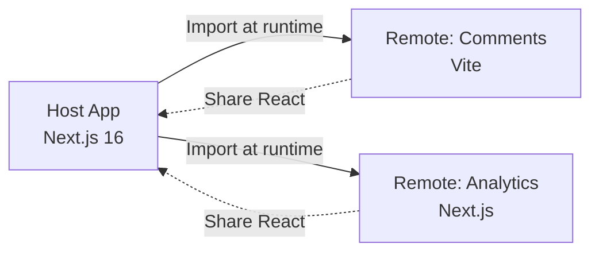
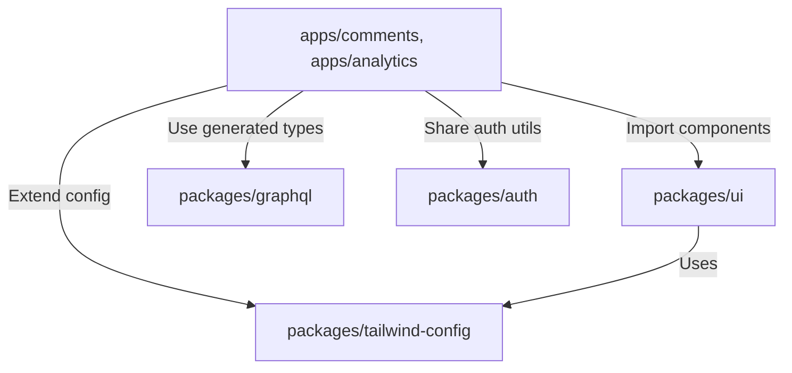
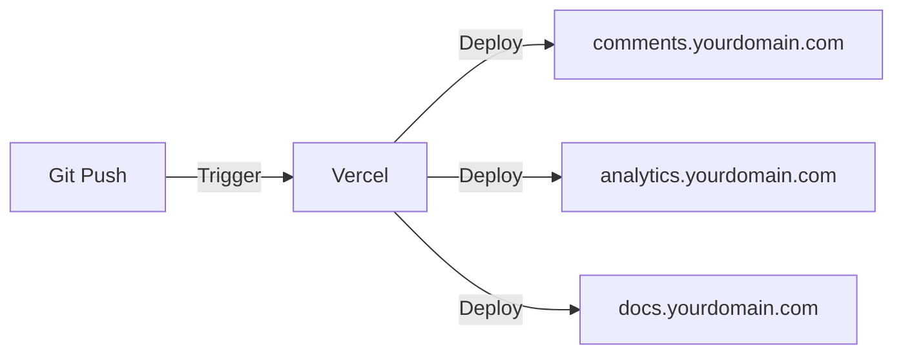

# Microfrontend Architecture - Research

**Date**: 2025-11-18
**Status**: Research Complete

## Executive Summary

**Should This Be Implemented?**: Conditional - NO for current team size, potentially YES if team grows to 15+ developers across 3+ independent teams

Based on this research, microfrontends are **NOT recommended** for your current context. Here's why:

1. **Single front-end team**: Microfrontends solve organizational scaling problems (multiple independent teams), not technical ones. With one team, you'll introduce significant complexity without corresponding benefits.

2. **Better alternatives exist**: For mixing Next.js 16 and Vite applications while maintaining design system consistency, a **Turborepo monorepo** with shared packages offers 90% of the benefits with 10% of the complexity.

3. **Industry correction**: Microfrontend adoption dropped from 75.4% to 23.6% in 2025. Research shows 85% of implementations address the wrong problem category, with teams under 15 developers introducing unnecessary infrastructure overhead.

**Recommended Path**: Start with a well-architected Turborepo monorepo that allows you to:
- Run Next.js 16 and Vite apps side-by-side
- Share shadcn/ui components and Tailwind configuration
- Deploy independently to Vercel
- Migrate from Vite to Next.js incrementally
- Scale to microfrontends later if team structure demands it

## Technical Deep Dive

### Overview

Microfrontends extend microservices principles to frontend development, splitting large applications into independently deployable units. Each microfrontend is owned by a distinct team, uses potentially different technologies, and deploys autonomously. At runtime or build time, these fragments compose into a unified user experience.

The architecture addresses Conway's Law: organizations design systems mirroring their communication structure. When multiple teams work on a monolithic frontend, coordination overhead grows exponentially. Microfrontends reduce coupling by establishing clear boundaries aligned with team ownership.

### Core Architectural Patterns

#### 1. Vertical Split (Route-Based)

Each application owns complete user journeys based on URL paths. This is Vercel's recommended approach for Next.js.

**Characteristics**:
- Marketing pages (e.g., `/`, `/about`, `/pricing`) → Marketing app
- Documentation (e.g., `/docs/*`) → Docs app
- Dashboard (e.g., `/dashboard/*`) → Dashboard app
- Clean separation by business domain
- Minimal cross-application navigation
- Simpler testing and debugging than horizontal splits

**Next.js Implementation**: Multi-Zones feature

#### 2. Horizontal Split (Component-Based)

Multiple applications render on the same page, each providing specific features or UI sections.

**Characteristics**:
- Header, footer, sidebar from different apps
- Widget-based composition
- Higher complexity due to runtime coordination
- Requires robust communication mechanisms
- More challenging state synchronization

**Implementation**: Module Federation, single-spa

#### 3. Build-Time Integration

Microfrontends are assembled during the build process, producing a single deployable artifact.

**Characteristics**:
- NPM packages for shared components
- Monorepo with multiple apps
- Type safety across boundaries
- Simpler runtime (no dynamic loading)
- Less flexible deployment independence

### How Multi-Zones Work (Vercel Recommended)

Next.js Multi-Zones enable multiple Next.js applications to merge on the same domain using edge-level routing.



**Configuration Pattern**:

Each zone configures:
1. **assetPrefix**: Prevents static file conflicts
2. **rewrites**: Routes requests to other zones
3. **basePath** (optional): Namespace routes within zone

Example `next.config.js` for main app:
```javascript
module.exports = {
  async rewrites() {
    return [
      {
        source: '/docs',
        destination: `${process.env.DOCS_URL}/docs`,
      },
      {
        source: '/docs/:path*',
        destination: `${process.env.DOCS_URL}/docs/:path*`,
      },
    ];
  },
};
```

Example `next.config.js` for docs zone:
```javascript
module.exports = {
  assetPrefix: '/docs-static',
  basePath: '/docs',
};
```

**Key Considerations**:
- Use `<a>` tags for cross-zone navigation (NOT `<Link>` - it attempts prefetch/soft navigation)
- Next.js 15+ automatically handles asset rewrites (older versions need explicit configuration)
- Each zone deploys independently to Vercel
- Edge routing connects them seamlessly

### Technology Stack / Ecosystem

#### Vercel Multi-Zones
- **Purpose**: Vertical microfrontends for Next.js
- **Deployment**: Native Vercel support
- **Complexity**: Low
- **Framework Support**: Next.js only

#### Module Federation (Webpack 5)
- **Purpose**: Runtime code sharing across applications
- **Plugin**: `@module-federation/nextjs-mf` for Next.js
- **Plugin**: `@originjs/vite-plugin-federation` or `@module-federation/vite` for Vite
- **Complexity**: High
- **Framework Support**: React, Vue, Angular, Svelte
- **Cross-framework**: Can share components between Next.js and Vite

**Important**: Module Federation support for Next.js may end after late 2026, making Multi-Zones the more future-proof choice for Next.js-only architectures.

#### single-spa
- **Purpose**: Meta-framework for horizontal composition
- **Complexity**: Medium
- **Framework Support**: Framework-agnostic orchestration
- **Use Case**: Legacy migration, mixing frameworks on same page

#### Turborepo
- **Purpose**: Monorepo build system
- **Features**: Remote caching, parallel execution, dependency graph
- **Complexity**: Low-Medium
- **Best for**: Shared packages, coordinated development

## Codebase Analysis

### Current Project Context

**Technology Stack**:
- Next.js 16.0.1 with React 19.2.0
- React Server Components (default)
- React Compiler enabled
- shadcn/ui with Tailwind CSS 4
- pnpm package manager
- Vitest for testing
- Biome for linting/formatting
- Clerk for authentication
- GraphQL with code generation

**Architecture Characteristics**:
- Server Components first (async, no 'use client' by default)
- Direct data fetching in Server Components
- Environment variable validation via `@t3-oss/env-nextjs`
- Component caching and cache lifecycle configuration
- GraphQL code generation workflow

### Similar Features/Patterns Found

1. **Modular Environment Configuration** (`src/env.mjs`)
   - Centralized validation with Zod schemas
   - Server/client variable separation
   - Runtime environment validation
   - Pattern: Could extend to cross-app environment sharing in monorepo

2. **Component Organization**
   - shadcn/ui components in project
   - Tailwind CSS for styling
   - Pattern: Ready for extraction to shared UI package

3. **Server Component Architecture**
   - Async data fetching at component level
   - No client-side data waterfalls
   - Pattern: Each microfrontend could adopt same pattern independently

### Key Patterns & Conventions

#### Server-First Architecture
- Components default to Server Components
- Client boundaries explicitly marked with `'use client'`
- Direct data fetching eliminates client-side state management complexity
- Aligns well with vertical microfrontend splits (each zone maintains same pattern)

#### Design System (shadcn/ui + Tailwind)
- Copy-paste component model (not NPM dependencies)
- Tailwind utility classes
- Radix UI primitives
- Pattern: In monorepo, components could live in shared `packages/ui`

#### Type Safety
- TypeScript throughout
- GraphQL code generation for type-safe queries
- Zod for runtime validation
- Pattern: Shared types package in monorepo for cross-app contracts

### Architecture Layers

```
Presentation Layer:
├── Server Components (default)
└── Client Components ('use client' boundaries)

Business Logic:
├── Server Actions
├── GraphQL queries (generated types)
└── Environment-validated configuration

Data Layer:
├── GraphQL API integration
├── MongoDB (via GraphQL backend)
└── Clerk authentication

Infrastructure:
├── Next.js 16 framework
├── Vercel deployment
└── React Compiler optimizations
```

### Critical Files to Review

1. `/next.config.ts:3-14` - Next.js configuration including React Compiler and caching
2. `/package.json:17-39` - Dependencies reveal shadcn/ui, Tailwind, Clerk, GraphQL stack
3. `/CLAUDE.md:1-48` - Project architecture principles and constraints
4. `src/env.mjs` (not read, but referenced) - Environment variable validation pattern

### Integration Points for Microfrontends

If migrating to microfrontends:

1. **Shared Authentication**: Clerk session could be shared via cookies across zones
2. **Design System**: Extract shadcn/ui components to `packages/ui` in monorepo
3. **GraphQL Client**: Share generated types via `packages/graphql`
4. **Environment Config**: Extend `@t3-oss/env-nextjs` pattern to monorepo root
5. **Tailwind Config**: Share configuration from `packages/tailwind-config`

## Implementation Feasibility

### Benefits

1. **Independent Deployments**
   - Teams deploy without coordination
   - Faster iteration cycles
   - Reduced deployment risk (blast radius)
   - Source: Vercel's 40% improvement in preview build times

2. **Technology Diversity**
   - Next.js 16 for new features
   - Vite for lightweight SPAs
   - Different React versions per app (if needed)
   - Gradual framework migration
   - Source: Module Federation enables cross-framework composition

3. **Team Autonomy**
   - Clear ownership boundaries
   - Reduced merge conflicts
   - Independent technology choices
   - Parallel development
   - Source: Conway's Law alignment reduces coordination overhead

4. **Incremental Migration**
   - Migrate legacy apps route-by-route
   - Run old and new side-by-side
   - Low-risk feature flag rollouts
   - Source: Vercel's incremental migration strategy

5. **Performance Optimization**
   - Load only needed code per route
   - Smaller bundle sizes per zone
   - Parallel loading of resources
   - Source: Vercel's Core Web Vitals improvements (LCP, INP)

### Trade-offs & Challenges

1. **Increased Complexity**
   - Multiple build pipelines
   - Complex routing configuration
   - Cross-app testing challenges
   - Debugging distributed systems
   - Source: Research shows 85% of teams adopt for wrong reasons

2. **Bundle Duplication**
   - React loaded multiple times
   - Duplicate utility libraries
   - Increased total page weight
   - No tree-shaking with Module Federation
   - Source: LogRocket Module Federation analysis

3. **Design System Fragmentation**
   - Version drift across apps
   - Inconsistent UX if not carefully managed
   - CSS conflicts without isolation
   - Coordination needed for updates
   - Source: CSS in Micro Frontends challenges

4. **Hard Navigation Costs**
   - Full page reloads between zones
   - Lost client-side state
   - Performance impact vs SPA
   - Mitigated by: prefetching, prerendering, Speculation Rules
   - Source: Vercel's Multi-Zones documentation

5. **Operational Overhead**
   - Multiple deployment pipelines
   - Cross-app monitoring/debugging
   - Increased infrastructure costs
   - DevOps complexity
   - Source: AWS EKS vs Vercel comparison

6. **Team Size Threshold**
   - Only beneficial with 15+ developers
   - Requires 3+ independent teams
   - Single team = unnecessary complexity
   - Source: 2025 industry reality check

### When to Use

1. **Large Organizations**
   - 15+ frontend developers
   - 3+ independent product teams
   - Clear business domain separation
   - Strong DevOps capabilities

2. **Technology Migration**
   - Gradual framework upgrades
   - Running legacy and modern code side-by-side
   - Reducing "big bang" rewrite risks

3. **Independent Release Cycles**
   - Teams need different deployment schedules
   - Features must ship without coordination
   - Regulatory/compliance requires isolation

4. **Organizational Scaling**
   - Conway's Law creates communication bottlenecks
   - Monolithic codebase blocks parallel work
   - Teams blocked by others' changes

### When to Avoid

1. **Small Teams** (< 15 developers)
   - Overhead exceeds benefits
   - Better served by monorepo with feature flags
   - Coordination is easy with small groups

2. **Tightly Coupled Features**
   - Shared state across domains
   - Cross-cutting user journeys
   - Frequent inter-feature communication

3. **Limited DevOps Resources**
   - Can't manage multiple pipelines
   - Insufficient monitoring/observability
   - No experience with distributed systems

4. **Solving Code Architecture Problems**
   - Bad abstractions in monolith
   - Technical debt
   - Performance issues
   - Use refactoring, not distribution

5. **Premature Optimization**
   - "We might need it later"
   - Anticipating future team growth
   - Start simple, migrate when needed

## Implementation Options

### Option 1: Turborepo Monorepo (Recommended)

**Description**: Single repository with multiple Next.js/Vite apps sharing common packages. Each app deploys independently to Vercel. No runtime composition - apps are separate but share code.

**Architecture**:
```
monorepo/
├── apps/
│   ├── marketing/          # Next.js 16 app
│   ├── docs/              # Next.js 16 app
│   ├── dashboard/         # Vite app (migrate to Next.js later)
│   └── admin/             # Vite app
├── packages/
│   ├── ui/                # Shared shadcn/ui components
│   ├── tailwind-config/   # Shared Tailwind setup
│   ├── typescript-config/ # Shared TS configuration
│   ├── graphql/           # Shared GraphQL types/client
│   └── auth/              # Shared Clerk utilities
├── package.json
├── turbo.json
└── pnpm-workspace.yaml
```

**Pros**:
- Simple mental model - just multiple apps
- Type safety across packages (TypeScript references)
- Shared code with zero runtime overhead
- Turborepo caching speeds up builds (40% improvement)
- Easy to adopt incrementally
- No vendor lock-in
- Works perfectly with Vercel (native support)
- Can migrate to true microfrontends later if needed

**Cons**:
- Apps can't share dependencies at runtime (each bundles React separately)
- Shared package changes require rebuilding dependent apps
- Not "true" microfrontends (no runtime composition)
- Teams must coordinate on major shared package changes

**Complexity**: Low

**Time Estimate**: 1-2 weeks to set up infrastructure

**Reuses Patterns**: Yes - maintains current Next.js 16, Server Components, shadcn/ui patterns

**When to Use**:
- Single team managing multiple apps
- Want code sharing without runtime complexity
- Need independent deployments
- Planning gradual migration (Vite → Next.js)

**Example/Reference**:
- [Turborepo shadcn/ui starter](https://github.com/dan5py/turborepo-shadcn-ui)
- [Vercel's own architecture](https://vercel.com/blog/how-vercel-adopted-microfrontends) uses this pattern

**Implementation Steps**:
1. Create Turborepo: `pnpm dlx create-turbo@latest`
2. Move current project to `apps/comments`
3. Create `packages/ui` with `shadcn init --monorepo`
4. Extract shared Tailwind config to `packages/tailwind-config`
5. Configure Vercel projects (one per app in `apps/`)
6. Set up Turbo remote caching

### Option 2: Next.js Multi-Zones (Microfrontends Lite)

**Description**: Multiple Next.js apps deployed independently to Vercel, composed at edge level via rewrites. Each zone owns specific routes. True microfrontend architecture but Next.js-only.

**Architecture**:


**Pros**:
- True independent deployments
- No hard navigation within zones (Next.js routing works)
- Vercel handles composition automatically
- Share code via NPM packages or monorepo
- Each zone can use different Next.js versions
- Moderate complexity (simpler than Module Federation)

**Cons**:
- Next.js only (can't mix Vite)
- Hard navigation between zones (full page reload)
- Must use `<a>` tags for cross-zone links (not `<Link>`)
- Cookie/session sharing requires configuration
- Duplicate React bundles across zones
- Not suitable for Vite apps

**Complexity**: Medium

**Time Estimate**: 1 week to set up zones, 2-3 weeks to migrate existing app

**Reuses Patterns**: Yes - Next.js 16, Server Components, existing architecture

**When to Use**:
- All apps will be Next.js (not mixing Vite)
- Need true independent deployments
- Team growing to 10-15 developers
- Clear route-based separation

**Example/Reference**:
- [Vercel Multi-Zones template](https://vercel.com/templates/next.js/microfrontends-multi-zones)
- [GitHub example](https://github.com/vercel-labs/microfrontends-nextjs-app-multi-zone)

**Configuration Example**:

Main app `next.config.js`:
```javascript
module.exports = {
  async rewrites() {
    return [
      {
        source: '/docs',
        destination: `${process.env.DOCS_URL}/docs`,
      },
      {
        source: '/docs/:path*',
        destination: `${process.env.DOCS_URL}/docs/:path*`,
      },
    ];
  },
};
```

Docs zone `next.config.js`:
```javascript
module.exports = {
  assetPrefix: '/docs-static',
  basePath: '/docs',
};
```

### Option 3: Module Federation (Full Framework Flexibility)

**Description**: Runtime code sharing between Next.js and Vite apps using Webpack 5 Module Federation or Vite federation plugins. Apps dynamically load components from each other at runtime.

**Architecture**:


**Pros**:
- Mix Next.js 16 and Vite in same app
- Share dependencies at runtime (single React instance)
- True framework flexibility
- Load remotes on demand
- Smaller individual bundles

**Cons**:
- High complexity (hardest to debug)
- Module Federation support for Next.js may end after 2026
- SSR + CSR mixing is challenging
- Version conflicts difficult to resolve
- No tree-shaking for shared modules
- Type safety across remotes is manual
- Difficult to test cross-app integration
- Requires deep Webpack/Vite knowledge

**Complexity**: High

**Time Estimate**: 3-4 weeks for setup, ongoing maintenance burden

**Reuses Patterns**: Partial - requires refactoring for federation boundaries

**When to Use**:
- Must mix Next.js and Vite on same page
- Horizontal composition needed (multiple apps per route)
- Strong DevOps team available
- Willing to accept high complexity

**Example/Reference**:
- [Module Federation Next.js guide](https://module-federation.io/guide/framework/nextjs.html)
- [Vite plugin federation](https://github.com/originjs/vite-plugin-federation)

**Configuration Example**:

Next.js host with `next.config.js`:
```javascript
const { NextFederationPlugin } = require('@module-federation/nextjs-mf');

module.exports = {
  webpack(config, options) {
    config.plugins.push(
      new NextFederationPlugin({
        name: 'host',
        remotes: {
          comments: 'comments@http://localhost:3001/remoteEntry.js',
        },
        shared: {
          react: { singleton: true },
          'react-dom': { singleton: true },
        },
      })
    );
    return config;
  },
};
```

Vite remote with `vite.config.ts`:
```typescript
import federation from '@originjs/vite-plugin-federation';

export default defineConfig({
  plugins: [
    federation({
      name: 'comments',
      filename: 'remoteEntry.js',
      exposes: {
        './CommentWidget': './src/components/CommentWidget',
      },
      shared: ['react', 'react-dom'],
    }),
  ],
});
```

## Comparison Matrix

| Criteria                    | Turborepo Monorepo | Next.js Multi-Zones | Module Federation |
| --------------------------- | ------------------ | ------------------- | ----------------- |
| Complexity                  | Low                | Medium              | High              |
| Maintainability             | High               | Medium              | Low               |
| Performance                 | Excellent          | Good                | Good              |
| Learning Curve              | Low                | Medium              | High              |
| Community Support           | Strong             | Strong              | Moderate          |
| Reuses Patterns             | Yes                | Yes                 | Partial           |
| Time to Implement           | 1-2 weeks          | 1 week              | 3-4 weeks         |
| Framework Flexibility       | Any                | Next.js only        | Any               |
| Runtime Composition         | No                 | No (edge routing)   | Yes               |
| Type Safety Across Apps     | Excellent          | Good                | Manual            |
| Bundle Duplication          | Yes                | Yes                 | Minimal           |
| Independent Deployments     | Yes                | Yes                 | Yes               |
| Debugging Difficulty        | Low                | Medium              | High              |
| Works with Vercel           | Native             | Native              | Yes (complex)     |
| Suitable for Single Team    | Yes                | Conditional         | No                |
| Suitable for 15+ Team       | Yes                | Yes                 | Yes               |
| Long-term Viability (2026+) | Excellent          | Excellent           | Uncertain         |

## Implementation Approach

**Recommended: Start with Turborepo Monorepo**

This approach provides the right balance of flexibility and simplicity for your context.

### Prerequisites & Requirements

**Tools & Versions**:
- Node.js 18+ (for Next.js 16)
- pnpm 9+ (current package manager)
- Turborepo 2.x
- Vercel CLI (for deployments)

**Knowledge/Skills**:
- Monorepo concepts (workspaces, dependency graph)
- Next.js 16 and Vite build configurations
- Vercel deployment and project configuration
- Tailwind CSS configuration inheritance

**Environment Setup**:
- Vercel account with team access
- Git repository (already have)
- CI/CD pipeline (Vercel handles this)

### Getting Started

**Step 1: Initialize Turborepo**

```bash
cd /Users/little/Projects/
pnpm dlx create-turbo@latest frontend-monorepo
cd frontend-monorepo
```

Select:
- Package manager: pnpm
- Template: blank (we'll add apps manually)

**Step 2: Configure Workspace**

Create `pnpm-workspace.yaml`:
```yaml
packages:
  - 'apps/*'
  - 'packages/*'
```

Update root `package.json`:
```json
{
  "name": "frontend-monorepo",
  "private": true,
  "scripts": {
    "dev": "turbo dev",
    "build": "turbo build",
    "lint": "turbo lint",
    "test": "turbo test"
  },
  "devDependencies": {
    "turbo": "^2.3.0"
  }
}
```

**Step 3: Move Existing Project**

```bash
# Create apps directory
mkdir -p apps

# Copy current project to apps/comments
cp -r /Users/little/Projects/comments-client-rsc apps/comments

# Update package.json name
cd apps/comments
# Edit package.json: "name": "@repo/comments"
```

**Step 4: Create Shared UI Package**

```bash
# Create packages/ui
mkdir -p packages/ui
cd packages/ui

# Initialize shadcn for monorepo
pnpm dlx shadcn@canary init

# Select:
# - Style: new-york
# - Base color: (your choice)
# - CSS variables: yes
# - Monorepo: yes
```

Create `packages/ui/package.json`:
```json
{
  "name": "@repo/ui",
  "version": "0.0.0",
  "private": true,
  "exports": {
    "./button": "./src/components/ui/button.tsx",
    "./card": "./src/components/ui/card.tsx"
  },
  "scripts": {
    "lint": "biome check --write",
    "type-check": "tsc --noEmit"
  },
  "peerDependencies": {
    "react": "^19",
    "react-dom": "^19"
  },
  "devDependencies": {
    "@types/react": "^19",
    "typescript": "^5"
  }
}
```

**Step 5: Create Shared Tailwind Config**

```bash
mkdir -p packages/tailwind-config
```

Create `packages/tailwind-config/package.json`:
```json
{
  "name": "@repo/tailwind-config",
  "version": "0.0.0",
  "private": true,
  "main": "index.js"
}
```

Create `packages/tailwind-config/index.js`:
```javascript
/** @type {import('tailwindcss').Config} */
module.exports = {
  content: [],
  theme: {
    extend: {
      // Shared theme configuration
    },
  },
  plugins: [],
};
```

**Step 6: Configure Turbo Pipeline**

Create `turbo.json`:
```json
{
  "$schema": "https://turbo.build/schema.json",
  "tasks": {
    "build": {
      "dependsOn": ["^build"],
      "outputs": [".next/**", "dist/**"]
    },
    "dev": {
      "cache": false,
      "persistent": true
    },
    "lint": {
      "dependsOn": ["^lint"]
    },
    "test": {
      "dependsOn": ["^build"]
    }
  }
}
```

**Step 7: Add New Vite App (Example)**

```bash
cd apps
pnpm create vite@latest analytics --template react-ts
cd analytics
```

Update `package.json`:
```json
{
  "name": "@repo/analytics",
  "dependencies": {
    "@repo/ui": "workspace:*",
    "@repo/tailwind-config": "workspace:*"
  }
}
```

Import shared UI:
```typescript
import { Button } from '@repo/ui/button';

export default function App() {
  return <Button>Click me</Button>;
}
```

### Architecture & Design Considerations

**Monorepo Structure**:
```
frontend-monorepo/
├── apps/
│   ├── comments/          # Existing Next.js 16 app
│   ├── analytics/         # New Vite app
│   └── docs/              # Future Next.js app
├── packages/
│   ├── ui/                # shadcn components
│   │   ├── src/
│   │   │   └── components/
│   │   │       └── ui/    # Button, Card, etc.
│   │   ├── package.json
│   │   └── tsconfig.json
│   ├── tailwind-config/   # Shared Tailwind
│   ├── typescript-config/ # Shared TS config
│   ├── graphql/           # Shared GraphQL types
│   └── auth/              # Shared Clerk utilities
├── package.json
├── turbo.json
└── pnpm-workspace.yaml
```

**Data Flow**:


**Deployment Flow**:


**Key Design Decisions**:

1. **Package Exports Strategy**
   - Use granular exports (`"./button"`) not barrel exports (`"."`)
   - Enables better tree-shaking
   - Clear dependency tracking

2. **Version Management**
   - Workspace protocol: `"@repo/ui": "workspace:*"`
   - Ensures all apps use same package version
   - Simplifies updates

3. **Tailwind Configuration Inheritance**
   ```javascript
   // apps/comments/tailwind.config.js
   import baseConfig from '@repo/tailwind-config';

   export default {
     ...baseConfig,
     content: [
       './src/**/*.{js,ts,jsx,tsx}',
       '../../packages/ui/src/**/*.{js,ts,jsx,tsx}', // Include shared UI
     ],
     theme: {
       extend: {
         ...baseConfig.theme.extend,
         // App-specific overrides
       },
     },
   };
   ```

4. **Authentication Sharing**
   - Clerk middleware in each app
   - Shared `packages/auth` with utility functions
   - Session cookies work across subdomains

5. **GraphQL Type Sharing**
   - Run codegen in `packages/graphql`
   - Apps import generated types
   - Single source of truth for schema

**State Management**:
- **No shared runtime state** between apps (they're separate bundles)
- Use URL params for cross-app navigation state
- Shared session via Clerk cookies
- Each app manages own client state (Zustand, React state)

**Error Handling**:
- Each app has independent error boundaries
- Shared error tracking (e.g., Sentry) configured in each app
- Turborepo logs aggregated in CI/CD

### Best Practices

**1. Component Sharing Pattern**

✅ **DO**: Create atomic, composable components
```typescript
// packages/ui/src/components/ui/button.tsx
import { cn } from '@repo/ui/lib/utils';

export function Button({ className, ...props }) {
  return (
    <button
      className={cn(
        'inline-flex items-center justify-center rounded-md',
        className
      )}
      {...props}
    />
  );
}
```

❌ **DON'T**: Create app-specific components in shared package
```typescript
// packages/ui/src/components/CommentForm.tsx - TOO SPECIFIC
// This belongs in apps/comments, not shared UI
```

**2. Dependency Management**

✅ **DO**: Use workspace protocol and peer dependencies
```json
{
  "dependencies": {
    "@repo/ui": "workspace:*"
  },
  "peerDependencies": {
    "react": "^19"
  }
}
```

❌ **DON'T**: Duplicate dependencies across packages
- Leads to multiple React instances
- Increases bundle size
- Causes hook errors

**3. Tailwind Isolation**

✅ **DO**: Use prefix for app-specific utilities
```javascript
// apps/analytics/tailwind.config.js
export default {
  prefix: 'analytics-', // Prevents conflicts if embedding
  content: ['./src/**/*.{js,ts,jsx,tsx}'],
};
```

Only needed if:
- Apps might embed in each other
- Using iframes
- Sharing CSS across apps

**4. Type Safety**

✅ **DO**: Configure TypeScript references
```json
// packages/ui/tsconfig.json
{
  "compilerOptions": {
    "composite": true,
    "declaration": true
  }
}

// apps/comments/tsconfig.json
{
  "references": [
    { "path": "../../packages/ui" }
  ]
}
```

**5. Turborepo Caching**

Set up remote caching for team:
```bash
pnpm dlx turbo login
pnpm dlx turbo link
```

Configure `.turbo/config.json`:
```json
{
  "teamId": "team_your_team_id",
  "apiUrl": "https://vercel.com/api"
}
```

**6. Testing Shared Packages**

```bash
# packages/ui/package.json
{
  "scripts": {
    "test": "vitest"
  },
  "devDependencies": {
    "vitest": "^4.0.0",
    "@testing-library/react": "^16.0.0"
  }
}
```

Test in isolation:
```typescript
// packages/ui/src/components/ui/button.spec.tsx
import { render } from '@testing-library/react';
import { Button } from './button';

test('renders button', () => {
  const { getByText } = render(<Button>Click</Button>);
  expect(getByText('Click')).toBeInTheDocument();
});
```

**7. Vercel Deployment**

Deploy each app separately:
```bash
# Link apps/comments
cd apps/comments
vercel link
# Select project or create new

# Deploy
vercel --prod

# Repeat for each app
```

Configure `vercel.json` in each app:
```json
{
  "buildCommand": "cd ../.. && pnpm turbo build --filter=@repo/comments",
  "outputDirectory": ".next"
}
```

**8. Environment Variables**

Shared variables in root `.env`:
```bash
# Root .env
GRAPHQL_ENDPOINT=https://api.example.com/graphql
```

App-specific in app directory:
```bash
# apps/comments/.env.local
NEXT_PUBLIC_APP_NAME=Comments
```

### Common Pitfalls & How to Avoid Them

#### 1. Multiple React Instances

**Problem**: Two copies of React loaded, causing "Invalid hook call" errors.

**Cause**:
- Shared package has React in `dependencies` instead of `peerDependencies`
- Inconsistent React versions across apps

**Solution**:
```json
// packages/ui/package.json
{
  "peerDependencies": {
    "react": "^19",
    "react-dom": "^19"
  },
  "devDependencies": {
    "react": "^19",        // For development only
    "react-dom": "^19"
  }
}
```

Source: [Module Federation documentation](https://webpack.js.org/concepts/module-federation/)

#### 2. Circular Dependencies

**Problem**: App imports package, package imports app - build fails.

**Cause**: Poor boundary design.

**Solution**:
- Dependency graph must be acyclic: `apps → packages` only
- Never import from apps in packages
- Use dependency inversion (callbacks, context) if needed

```typescript
// ❌ BAD: packages/ui imports from app
import { useCommentContext } from '@repo/comments/context';

// ✅ GOOD: Accept context as prop
export function CommentButton({ onComment }: { onComment: () => void }) {
  return <button onClick={onComment}>Comment</button>;
}
```

#### 3. Tailwind Purging Issues

**Problem**: Shared components styled in package not styled in app.

**Cause**: Tailwind doesn't scan package directory.

**Solution**:
```javascript
// apps/comments/tailwind.config.js
export default {
  content: [
    './src/**/*.{js,ts,jsx,tsx}',
    '../../packages/ui/src/**/*.{js,ts,jsx,tsx}', // ← Add this
  ],
};
```

Source: [Tailwind CSS documentation](https://tailwindcss.com/docs/content-configuration)

#### 4. Stale Cache Issues

**Problem**: Changes to shared package don't reflect in app.

**Cause**: Turborepo cached old build.

**Solution**:
```bash
# Force rebuild
pnpm turbo build --force

# Or clear cache
pnpm turbo clean
rm -rf node_modules/.cache
```

#### 5. Type Errors After Package Update

**Problem**: TypeScript can't find updated types from package.

**Cause**: TypeScript doesn't watch packages by default.

**Solution**:
```json
// apps/comments/tsconfig.json
{
  "references": [
    { "path": "../../packages/ui" }
  ]
}
```

Then run:
```bash
pnpm tsc --build --watch
```

#### 6. Vercel Build Failures

**Problem**: Build works locally but fails on Vercel.

**Cause**: Vercel builds from app directory, can't find workspace packages.

**Solution**:

Configure root directory in Vercel:
- Project Settings → General → Root Directory: `apps/comments`
- Build Command: `cd ../.. && pnpm turbo build --filter=@repo/comments`
- Install Command: `pnpm install`

Source: [Vercel Turborepo guide](https://vercel.com/docs/monorepos/turborepo)

#### 7. GraphQL Codegen Race Condition

**Problem**: App builds before GraphQL types are generated.

**Cause**: No dependency order.

**Solution**:

Configure build order in `turbo.json`:
```json
{
  "tasks": {
    "build": {
      "dependsOn": ["^build"],  // Wait for dependencies
      "outputs": [".next/**", "dist/**"]
    },
    "codegen": {
      "outputs": ["src/generated/**"]
    }
  }
}
```

Update package scripts:
```json
// packages/graphql/package.json
{
  "scripts": {
    "build": "graphql-codegen"
  }
}

// apps/comments/package.json
{
  "scripts": {
    "build": "pnpm codegen && next build"
  },
  "dependencies": {
    "@repo/graphql": "workspace:*"
  }
}
```

### Migration/Adoption Strategy

**Phase 1: Setup Infrastructure (Week 1)**

- [ ] Create Turborepo monorepo
- [ ] Move existing project to `apps/comments`
- [ ] Create `packages/ui` with shadcn
- [ ] Create `packages/tailwind-config`
- [ ] Configure Turborepo pipeline
- [ ] Set up Vercel project for comments app
- [ ] Verify existing app works unchanged

**Phase 2: Extract Shared Code (Week 2)**

- [ ] Move shadcn components to `packages/ui`
- [ ] Update imports in comments app
- [ ] Extract Tailwind config to shared package
- [ ] Create `packages/typescript-config`
- [ ] Test build and dev commands
- [ ] Deploy to Vercel

**Phase 3: Add New Apps (Ongoing)**

For each new app:
- [ ] Create app in `apps/` directory (Vite or Next.js)
- [ ] Configure to use shared packages
- [ ] Set up Vercel project
- [ ] Deploy independently
- [ ] Monitor performance

**Phase 4: Migrate Vite Apps (If Needed)**

For each Vite app to migrate:
- [ ] Create new Next.js app in `apps/`
- [ ] Copy components route-by-route
- [ ] Convert to Server Components where beneficial
- [ ] Run both apps side-by-side initially
- [ ] Feature flag switch to Next.js version
- [ ] Deprecate Vite app after validation

**Rollback Strategy**:
- Each app deploys independently - rollback is per-app
- Git tags for releases
- Vercel supports instant rollback to previous deployment
- Shared packages versioned via git commits (monorepo)

## Alternatives Considered

### Alternative 1: Keep Monolithic Next.js App

**Description**: Continue with single Next.js application, add Vite apps as separate projects (no integration).

**Why it wasn't chosen**:
- No code sharing for design system
- Duplicate shadcn components across apps
- No unified developer experience
- Version drift inevitable

**When it might be better**:
- Apps are completely unrelated
- No shared design system needed
- Very small team (< 5 developers)

### Alternative 2: Full Microfrontends with Module Federation

**Description**: Implement horizontal microfrontends with runtime composition.

**Why it wasn't chosen**:
- Massive complexity increase
- Single team doesn't need this level of independence
- Module Federation support for Next.js uncertain after 2026
- Debugging and testing significantly harder
- No clear organizational benefit

**When it might be better**:
- Multiple teams with different release cycles
- Need to mix frameworks on same page
- Strong DevOps capabilities
- 15+ developers across 3+ teams

### Alternative 3: Separate Repositories (Multi-Repo)

**Description**: Each app in its own repository, shared code via NPM packages.

**Why it wasn't chosen**:
- Slower iteration on shared components (publish → update → test cycle)
- Version coordination challenges
- More complex CI/CD setup
- Lost atomic commits across apps and packages
- Harder to refactor across boundaries

**When it might be better**:
- Apps maintained by completely separate organizations
- Need strict versioning and release processes
- Public-facing component libraries
- Very large scale (dozens of apps)

### Alternative 4: Nx Monorepo

**Description**: Use Nx instead of Turborepo for monorepo tooling.

**Why it wasn't chosen**:
- Turborepo simpler mental model
- Better Vercel integration
- Nx adds features (code generation, etc.) we don't need
- Turborepo sufficient for this scale

**When it might be better**:
- Need code generators and scaffolding
- Prefer opinionated tooling
- Using Angular (Nx has better support)
- Want integrated testing tools

## Debates & Open Questions

### 1. Module Federation Viability Long-Term

**Debate**: Module Federation support for Next.js may end after late 2026 according to GitHub discussions.

**Perspectives**:
- **Pro-MF**: Provides unmatched runtime flexibility and cross-framework composition
- **Anti-MF**: Vercel is not investing in it, Multi-Zones is the recommended path
- **Reality**: For Next.js-only architectures, Multi-Zones is safer long-term bet

**Source**: [GitHub Discussion #77862](https://github.com/vercel/next.js/discussions/77862)

### 2. Server Components in Microfrontends

**Open Question**: How do React Server Components work across microfrontend boundaries?

**Current Understanding**:
- Server Components are app-scoped (each Next.js zone has its own)
- Cannot share Server Components across zones at runtime
- Must serialize to client components at zone boundaries
- Research ongoing: [React RFC on distributed Server Components](https://github.com/reactjs/rfcs)

**Implication**: Vertical splits (Multi-Zones) work well; horizontal splits with Server Components are problematic

### 3. Optimal Bundle Sharing Strategy

**Debate**: Should frameworks be shared at runtime or duplicated per app?

**Perspectives**:
- **Share (Module Federation)**: Single React instance, smaller total bundle
- **Duplicate (Multi-Zones)**: Independent deployments, no version conflicts, simpler debugging
- **Hybrid (Turborepo)**: Share code at build time, duplicate at runtime

**Data**:
- Vercel chose duplication for simplicity (40% build time improvement outweighed bundle size)
- Module Federation can save bandwidth but adds complexity cost

**Source**: [Vercel blog post](https://vercel.com/blog/how-vercel-adopted-microfrontends)

### 4. Tailwind CSS Isolation

**Debate**: How to prevent Tailwind conflicts in microfrontends?

**Options**:
1. **Prefixing**: `prefix: 'app-'` in config (DX hit, verbose classes)
2. **Shadow DOM**: True isolation but breaks some libraries
3. **Separate bundles**: Each app purges independently (duplication)
4. **Shared config**: Works if apps don't embed in each other (Vercel's choice)

**Edge Case**: If apps ever need to embed in same page (iframes, horizontal composition), prefixing or Shadow DOM required.

**Source**: [Tailwind CSS discussions](https://github.com/tailwindlabs/tailwindcss/discussions/6829)

### 5. Authentication Across Microfrontends

**Open Question**: Best pattern for sharing auth state?

**Options**:
1. **Shared cookies**: Works for same domain (e.g., `*.yourdomain.com`)
2. **Token passing**: URL params or postMessage for cross-domain
3. **SSO redirect**: Central auth service, redirects back
4. **BFF pattern**: Backend-for-Frontend handles auth server-side

**Recommendation**: For Vercel Multi-Zones on same domain, Clerk cookies work automatically. For cross-domain, use SSO redirect.

**Source**: [Microfrontend auth patterns](https://dev.to/kleeut/how-do-you-share-authentication-in-micro-frontends-5glc)

### 6. When Does Team Size Justify Microfrontends?

**Debate**: What's the minimum team size?

**Industry Data**:
- **Research**: 15+ developers across 3+ teams
- **Vercel**: Started microfrontends with ~20 frontend engineers
- **2025 Reality Check**: 75% → 23% adoption decline suggests most teams adopted too early

**Threshold**:
- < 10 devs: Definitely too small
- 10-15 devs: Maybe, if clear team boundaries
- 15+ devs: Likely beneficial if organizational need exists

**Source**: [Microfrontends in 2025: Reality Check](https://dev.to/vitalii_petrenko_dev/microfrontends-in-2025-a-reality-check-from-the-trenches-1nj2)

## Recommendations

### Preferred Approach: Turborepo Monorepo

**Should This Be Implemented?**: Yes, but NOT as true microfrontends

**Rationale**:

1. **Right complexity level for single team**
   - Get independent deployments without runtime composition overhead
   - Share code efficiently via workspace packages
   - Maintain type safety across apps
   - Vercel-native support (no custom config needed)

2. **Enables gradual Vite → Next.js migration**
   - Run Vite apps and Next.js apps side-by-side
   - Migrate route-by-route or app-by-app
   - Share design system during transition
   - No "big bang" rewrite

3. **Preserves existing architecture patterns**
   - Keep Next.js 16 with Server Components
   - Maintain shadcn/ui + Tailwind approach
   - Continue using pnpm, Biome, Vitest
   - No breaking changes to current app

4. **Sets up future microfrontend migration**
   - If team grows to 15+ developers
   - Can switch to Multi-Zones without major refactor
   - Shared packages already extracted
   - Deployment infrastructure ready

**Why**:
- **Cost/Benefit**: 90% of microfrontend benefits, 10% of complexity
- **Risk**: Low - incremental adoption, easy rollback per app
- **Team size**: Perfect for single team managing multiple apps
- **Technology diversity**: Supports Next.js + Vite + future frameworks
- **Design system**: Natural home for shared shadcn/ui components

### Key Considerations

**1. Design System Strategy**

Extract shadcn/ui to shared package:
```
packages/ui/
├── src/
│   ├── components/
│   │   └── ui/          # Button, Card, Input, etc.
│   └── lib/
│       └── utils.ts
├── package.json
├── tsconfig.json
└── tailwind.config.js
```

Apps import granularly:
```typescript
import { Button } from '@repo/ui/button';
import { Card } from '@repo/ui/card';
```

**Benefits**:
- Single source of truth for design system
- Updates propagate instantly (no publish cycle)
- Type-safe across all apps
- Tailwind purging works correctly

**2. Deployment Strategy**

One Vercel project per app:
- `comments.yourdomain.com` → `apps/comments`
- `analytics.yourdomain.com` → `apps/analytics`
- `docs.yourdomain.com` → `apps/docs`

OR use Vercel domains feature:
- `yourdomain.com/comments` → `apps/comments`
- `yourdomain.com/analytics` → `apps/analytics`

Independent deployments:
- Each app deploys on merge to main (filtered by path)
- Preview deployments for PRs
- Instant rollback per app

**3. Vite Migration Plan**

For each Vite app:

**Option A: Keep as Vite (If Low Complexity)**
- Use Vite for simple SPAs
- Share UI package
- Deploy to Vercel (static export)

**Option B: Migrate to Next.js (If Need SSR/RSC)**
- Create new Next.js app in `apps/`
- Convert components route-by-route
- Run both initially, feature flag switch
- Deprecate Vite version

**Criteria**:
- Need SSR/RSC? → Migrate
- Pure SPA? → Keep Vite
- Complex routing? → Next.js App Router
- Simple single page? → Stay with Vite

**4. Authentication Approach**

Continue using Clerk:
- Install in each app
- Shared session via cookies (same domain)
- Create `packages/auth` for utilities:

```typescript
// packages/auth/src/index.ts
export { getAuthUser } from './get-auth-user';
export { requireAuth } from './require-auth';
export type { AuthUser } from './types';
```

Apps import:
```typescript
import { getAuthUser } from '@repo/auth';

export default async function DashboardPage() {
  const user = await getAuthUser();
  return <div>Welcome, {user.name}</div>;
}
```

**5. GraphQL Strategy**

Centralize GraphQL in package:
```
packages/graphql/
├── schema/
│   └── supergraph.graphql
├── src/
│   └── generated/        # Codegen output
├── codegen.ts
└── package.json
```

Apps import types:
```typescript
import type { Comment, User } from '@repo/graphql';
```

### Potential Challenges

#### 1. Initial Setup Time

**Challenge**: Converting existing app to monorepo structure takes 1-2 weeks.

**Mitigation**:
- Do it incrementally (app still works during transition)
- Extract one shared package at a time
- Test each step before proceeding
- Use feature flags if needed

**Fallback**: If setup blocks development, keep current app, start new apps in monorepo, migrate later.

#### 2. Turborepo Learning Curve

**Challenge**: Team needs to learn monorepo concepts and Turborepo CLI.

**Mitigation**:
- Turborepo has excellent docs and tutorials
- Simpler than alternatives (Nx, Lerna)
- Most commands are familiar: `pnpm dev`, `pnpm build`
- `turbo.json` is small and intuitive

**Fallback**: If Turborepo is problematic, can use plain pnpm workspaces (less optimized but functional).

#### 3. Vercel Configuration Complexity

**Challenge**: Deploying monorepo apps to Vercel requires per-app configuration.

**Mitigation**:
- Vercel has native Turborepo support
- Use project linking in Vercel dashboard
- Each app gets own Vercel project (simple)
- Example configs available in docs

**Fallback**: Deploy apps as separate repos initially, migrate to monorepo later.

#### 4. Shared Package Breaking Changes

**Challenge**: Breaking change in `packages/ui` affects all apps simultaneously.

**Mitigation**:
- Version shared packages using changeset tags
- Test all apps before merging shared package changes
- Use Turborepo affected detection: `turbo build --filter=[origin/main]`
- Coordinate updates (single team makes this easier)

**Fallback**: If coordination becomes burden, publish shared packages to npm with semver (adds complexity but decouples).

### Success Criteria

**Technical Metrics**:
- [ ] All apps deploy independently to Vercel
- [ ] Build time < 2 minutes per app (Turborepo caching)
- [ ] Shared UI package imported in 2+ apps
- [ ] Type errors caught across app boundaries
- [ ] No duplicate React instances (peer dependencies configured)

**Developer Experience**:
- [ ] New app setup < 30 minutes
- [ ] Shared component update propagates instantly
- [ ] Local dev experience unchanged (fast refresh, etc.)
- [ ] Clear documentation for adding apps/packages

**Business Outcomes**:
- [ ] Can experiment with Vite and Next.js simultaneously
- [ ] Design system consistency across all apps
- [ ] New features deployable independently
- [ ] Migration path from Vite to Next.js validated

**Measurement**:
- Track build times (Turborepo logs)
- Monitor deployment frequency (Vercel analytics)
- Developer survey on experience (quarterly)
- Count shared package usage (imports)

### Implementation Timeline

**Week 1-2: Foundation**
- Set up Turborepo monorepo
- Move current app to `apps/comments`
- Create `packages/ui` with shadcn
- Extract Tailwind config
- Deploy to Vercel (verify no regression)

**Week 3-4: First New App**
- Add Vite app to `apps/analytics`
- Configure shared UI imports
- Test design system consistency
- Deploy to Vercel

**Month 2: Polish**
- Extract GraphQL types to package
- Create auth utilities package
- Set up Turborepo remote caching
- Documentation for adding apps

**Month 3+: Scale**
- Add apps as needed
- Migrate Vite apps to Next.js (if beneficial)
- Evaluate if team size justifies Multi-Zones

## Additional Notes

### Vercel vs AWS EKS Comparison

**Vercel** (Recommended):
- **Pros**: Zero-config Next.js deployment, automatic edge routing, instant rollbacks, preview deployments, serverless functions
- **Cons**: Vendor lock-in, proprietary features, costs scale with traffic, less control

**AWS EKS**:
- **Pros**: Full control, portable (Kubernetes), multi-cloud support, predictable costs at scale
- **Cons**: DevOps complexity, manual configuration, slower deployments, no automatic edge routing
- **Cost**: ~$73/month per cluster + EC2/Fargate costs

**Decision**: Stick with Vercel unless:
- Need multi-cloud portability
- Have strong DevOps team
- Scale requires cost optimization (very high traffic)
- Require fine-grained infrastructure control

For single team with existing Vercel setup, switching to EKS adds complexity without clear benefit.

### Edge Cases

**1. Mixing Server Components and Client Components Across Apps**

If using Multi-Zones, each zone has its own Server Component boundary:
- Cannot pass Server Components from one zone to another
- Hard navigation resets server/client state
- Use URL params or cookies for state transfer

**2. Shared Component Uses Different React Version**

With workspace packages:
- Use `peerDependencies` to require app's React
- Test shared package with oldest and newest supported React version
- Document supported React versions

**3. App Needs Framework-Specific Feature**

Example: Next.js app needs Vite plugin:
- Don't try to mix build tools in one app
- Create separate apps if need different tooling
- Share only source code (components, utils), not build artifacts

**4. Development Server Conflicts**

Multiple apps on same port:
- Use different ports: `next dev -p 3000`, `vite dev --port 3001`
- Turborepo can run all: `turbo dev` (configured in `turbo.json`)
- Use Vercel dev for testing multi-zone routing locally

### Future Considerations

**If Team Grows to 15+ Developers**:

Revisit microfrontends decision:
1. Evaluate if teams have become independent (separate domains, release cycles)
2. If yes, migrate to Multi-Zones:
   - Already have apps separated in monorepo
   - Configure rewrites for edge routing
   - Update deployment strategy
   - Add cross-zone navigation patterns

**If Need Horizontal Composition**:

Only if must mix apps on same page:
1. Evaluate Module Federation (high complexity)
2. Consider iframes (simple but limited)
3. Consider single-spa (framework-agnostic)
4. Ensure strong DevOps capabilities

**If Vercel Lock-In Becomes Concern**:

Exit strategy:
1. Use Next.js standard features (avoid Vercel-specific)
2. Keep rewrites simple (standard Next.js config)
3. Package apps as containers (Docker)
4. Deploy to AWS EKS or similar when needed

**Emerging Patterns (2025-2026)**:

- **Server Components across boundaries**: React team exploring distributed Server Components
- **Edge-side composition**: Vercel Edge Middleware enables new patterns
- **AI-assisted architecture**: Tools analyze codebase to suggest boundaries

Monitor these developments but don't adopt prematurely.

## Sources

1. How Vercel adopted microfrontends - https://vercel.com/blog/how-vercel-adopted-microfrontends - 2025-11-18
2. Vercel Microfrontends Documentation - https://vercel.com/docs/microfrontends - 2025-11-18
3. Microfrontends in 2025: A Reality Check from the Trenches - https://dev.to/vitalii_petrenko_dev/microfrontends-in-2025-a-reality-check-from-the-trenches-1nj2 - 2025-01-02
4. Next.js Multi-Zones Guide - https://nextjs.org/docs/pages/guides/multi-zones - 2025-11-18
5. Module Federation Documentation - https://module-federation.io/guide/framework/nextjs.html - 2024
6. Turborepo shadcn/ui Guide - https://turborepo.com/docs/guides/tools/shadcn-ui - 2025-11-18
7. Tailwind CSS in Microfrontends Discussion - https://github.com/tailwindlabs/tailwindcss/discussions/6829 - 2024
8. CSS in Micro Frontends - https://dev.to/florianrappl/css-in-micro-frontends-4jai - 2024
9. Solving Micro-frontend Challenges with Module Federation - https://blog.logrocket.com/solving-micro-frontend-challenges-module-federation/ - 2024
10. Microfrontend Authentication Patterns - https://dev.to/kleeut/how-do-you-share-authentication-in-micro-frontends-5glc - 2024
11. Top 10 Micro Frontend Anti-Patterns - https://dev.to/florianrappl/top-10-micro-frontend-anti-patterns-3809 - 2024
12. A Catalog of Micro Frontends Anti-patterns - https://arxiv.org/html/2411.19472v1 - 2024-11
13. Migrating from Vite to Next.js - https://nextjs.org/docs/app/guides/migrating/from-vite - 2025-11-18
14. Vercel vs Kubernetes Architecture - https://vercel.com/resources/when-to-add-serverless-to-your-kubernetes-architecture - 2024
15. Understanding Module Federation - https://thefrontendarchitect.com/understanding-module-federation-breaking-the-monolith-in-frontend-development/ - 2024
16. State Management in Micro-Frontends - https://medium.com/sysco-labs/state-management-in-micro-frontends-ee273830f95f - 2024
17. Vite Plugin Federation - https://github.com/originjs/vite-plugin-federation - 2024
18. Module Federation v1 for Vite - https://www.learnbydo.ing/blog/2024-09-23-module-federation-vite-v1 - 2024-09-23
19. You Probably Don't Need Microfrontends - https://blog.scottlogic.com/2021/02/17/probably-dont-need-microfrontends.html - 2021-02-17
20. Vercel Using Monorepos - https://vercel.com/docs/monorepos - 2025-11-18
