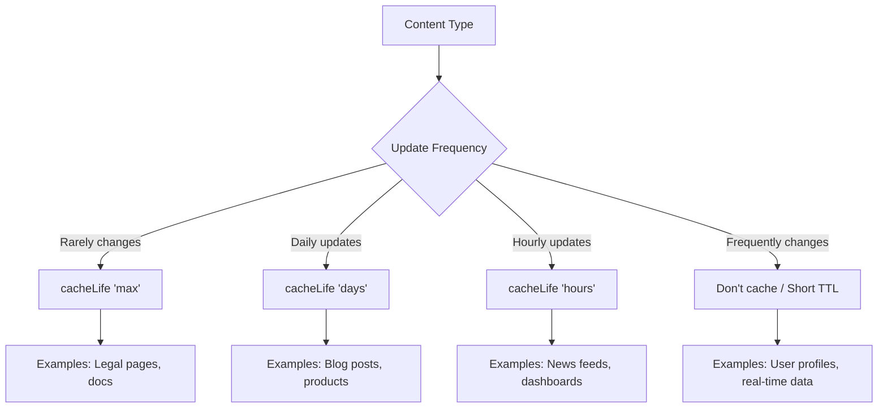
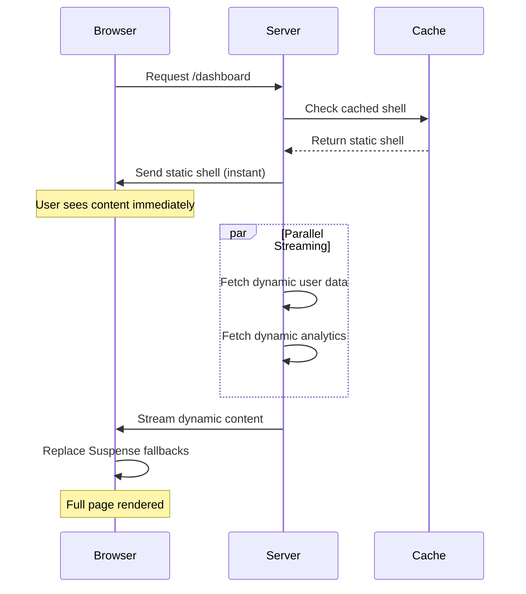

# Next.js 16 Best Practices and Architectural Patterns - Research

**Date**: 2025-10-25
**Status**: Research Complete

## Executive Summary

Next.js 16, released October 21, 2025, introduces a fundamental shift in how applications handle caching, rendering, and performance optimization. The release centers around **Cache Components**, which implement Partial Pre-Rendering (PPR) as production-ready infrastructure, and make caching entirely opt-in. Combined with Turbopack as the default bundler, stable React Compiler support, and refined data fetching patterns, Next.js 16 enables developers to build highly performant applications with responsive UX through explicit, fine-grained control over rendering and caching behavior.

This research document is organized by **Server Components vs Client Components** to help developers understand which patterns apply to which component type, as this is the fundamental architectural decision in Next.js 16.

## Overview

Next.js 16 represents a paradigm shift from implicit caching to explicit, opt-in caching strategies. The major changes include:

1. **Cache Components** - New model using PPR and `"use cache"` directive
2. **Turbopack (Stable)** - Default bundler with 5-10x faster Fast Refresh and 2-5x faster builds
3. **React Compiler (Stable)** - Automatic optimization reducing need for manual memoization
4. **Opt-in Caching** - All dynamic code executes at request time by default unless explicitly cached

## Table of Contents

### Part 1: Fundamentals
- [Understanding Server vs Client Components](#understanding-server-vs-client-components)
  - [Server Components (Default)](#server-components-default)
  - [Client Components](#client-components)
  - [When to Use Each](#when-to-use-each)
  - [Server-Client Component Composition (Donut Pattern)](#server-client-component-composition-donut-pattern)

### Part 2: Server Component Patterns
- [Data Fetching in Server Components](#data-fetching-in-server-components)
  - [Component-Level Data Fetching - Colocation Pattern](#component-level-data-fetching-colocation-pattern)
  - [Parallel vs Sequential Data Fetching (Waterfall Anti-Pattern)](#parallel-vs-sequential-data-fetching-waterfall-anti-pattern)
  - [Data Preloading Pattern](#data-preloading-pattern)
  - [Colocation with Data](#colocation-with-data)
- [Caching in Server Components](#caching-in-server-components)
  - [The "use cache" Directive](#the-use-cache-directive)
  - [cacheLife Profiles](#cachelife-profiles)
  - [cacheTag for Granular Revalidation](#cachetag-for-granular-revalidation)
  - [revalidateTag for Stale-While-Revalidate](#revalidatetag-for-stale-while-revalidate)
  - [Migration from Previous Versions](#migration-from-previous-versions)
- [Partial Pre-Rendering (PPR / Static Shell Pattern)](#partial-pre-rendering-ppr--static-shell-pattern)
  - [What It Is](#what-it-is)
  - [How It Works](#how-it-works)
  - [Implementation](#implementation)
  - [When to Use PPR](#when-to-use-ppr)
  - [When to Avoid](#when-to-avoid)
- [Server Component Composition](#server-component-composition)
  - [Avoiding Prop Drilling](#avoiding-prop-drilling)
  - [Layouts and Nested Layouts](#layouts-and-nested-layouts)
- [Authentication in Server Components](#authentication-in-server-components)
  - [Data Access Layer (DAL / Repository Pattern)](#data-access-layer-dal--repository-pattern-recommended)
  - [Layout Authentication Caveat](#layout-authentication-caveat)
  - [Streaming Authentication Pattern](#streaming-authentication-pattern)
- [Performance Optimization for Server Components](#performance-optimization-for-server-components)
  - [Request Deduplication](#request-deduplication)
  - [Image and Font Optimization](#image-and-font-optimization)

### Part 3: Client Component Patterns
- [When to Use Client Components](#when-to-use-client-components)
- [Data Fetching in Client Components](#data-fetching-in-client-components)
  - [Streaming with use() Hook (Promise Unwrapping)](#streaming-with-use-hook-promise-unwrapping)
  - [Avoiding Prop Drilling in Client Components](#avoiding-prop-drilling-in-client-components)
  - [Client-Side Data Fetching Libraries](#client-side-data-fetching-libraries)
  - [Optimistic Updates](#optimistic-updates)
- [Form Handling in Client Components](#form-handling-in-client-components)
  - [Using useActionState](#using-useactionstate)
  - [Progressive Enhancement](#progressive-enhancement-server-components)
- [Client-Side Performance Optimization](#client-side-performance-optimization)
  - [React Compiler Integration](#react-compiler-integration)
  - [Code Splitting with next/dynamic](#code-splitting-with-nextdynamic)
- [Event Handlers & Client Invocation](#event-handlers--client-invocation)

### Part 4: Shared Patterns (Both Server & Client)
- [Suspense Boundaries](#suspense-boundaries)
  - [Suspense Boundaries Placement](#suspense-boundaries-placement)
  - [Best Practices](#best-practices)
  - [Key Prop for Re-Suspension](#key-prop-for-re-suspension)
  - [Nested Suspense for Progressive Loading](#nested-suspense-for-progressive-loading)
- [Server Actions (Called from Both)](#server-actions-called-from-both)
  - [Form Handling Patterns](#form-handling-patterns)
  - [Error Handling](#error-handling)
  - [Revalidation Patterns](#revalidation-patterns)
  - [Authorization in Multiple Layers](#authorization-in-multiple-layers)
  - [Cookie Management](#cookie-management)
- [Component Composition](#component-composition)
  - [Compound Components](#compound-components-for-tightly-coupled-ui)
- [Error Handling Patterns](#error-handling-patterns)
  - [Error Boundary Pattern (error.tsx)](#error-boundary-pattern-errortsx)
  - [Not Found Pattern (not-found.tsx)](#not-found-pattern-not-foundtsx)
  - [Navigation Pattern (redirect/notFound)](#navigation-pattern-redirectnotfound)
- [File-Based Patterns](#file-based-patterns)
  - [Template Pattern (template.tsx)](#template-pattern-templatetsx)
  - [Loading UI Evolution (loading.tsx with PPR)](#loading-ui-evolution-loadingtsx-with-ppr)
  - [generateStaticParams Pattern](#generatestaticparams-pattern)
  - [Metadata Generation Pattern](#metadata-generation-pattern)
- [Navigation Patterns](#navigation-patterns)
  - [Client-Side Navigation (useRouter/Link)](#client-side-navigation-userouterlink)
  - [Link Prefetching Strategies](#link-prefetching-strategies)
- [Route Organization](#route-organization)
  - [App Router Best Practices](#app-router-best-practices)
  - [Route Groups](#route-groups)
  - [Parallel Routes](#parallel-routes)
  - [Intercepting Routes](#intercepting-routes)

### Part 5: Implementation Options
- [Option 1: Incremental Adoption with Minimal Changes](#option-1-incremental-adoption-with-minimal-changes)
- [Option 2: Full PPR Implementation with Streaming](#option-2-full-ppr-implementation-with-streaming)
- [Option 3: Hybrid Approach with Strategic PPR (RECOMMENDED)](#option-3-hybrid-approach-with-strategic-ppr-recommended)

### Part 6: Best Practices Summary
- [Server Component Best Practices](#server-component-best-practices)
- [Client Component Best Practices](#client-component-best-practices)
- [Shared Best Practices](#shared-best-practices)

### Part 7: Common Pitfalls & How to Avoid Them
- [Server Component Pitfalls](#server-component-pitfalls)
- [Client Component Pitfalls](#client-component-pitfalls)
- [Shared Pitfalls](#shared-pitfalls)

### Part 8: Migration Guide
- [Prerequisites](#prerequisites)
- [Phase 1: Preparation](#phase-1-preparation)
- [Phase 2: Upgrade](#phase-2-upgrade)
- [Phase 3: Incremental Migration](#phase-3-incremental-migration)
- [Phase 4: Optimization](#phase-4-optimization)

### Part 9: Infrastructure & APIs
- [Proxy (formerly Middleware)](#proxy-formerly-middleware)
  - [Breaking Change: middleware.ts → proxy.ts](#breaking-change-middlewarets--proxyts)
  - [Proxy Patterns](#proxy-patterns)
- [connection() API](#connection-api)
  - [Forcing Dynamic Rendering](#forcing-dynamic-rendering)
  - [Migration from unstable_noStore](#migration-from-unstable_nostore)
- [Instrumentation & Observability](#instrumentation--observability)
  - [register() Function](#register-function)
  - [onRequestError for Error Tracking](#onrequesterror-for-error-tracking)
- [Route Handler Patterns](#route-handler-patterns)
  - [CORS Configuration](#cors-configuration)
  - [Webhook Handling](#webhook-handling)
  - [Streaming Responses](#streaming-responses)
  - [Static Route Handlers](#static-route-handlers)

### Part 10: Security & Internationalization
- [Content Security Policy (CSP)](#content-security-policy-csp)
  - [Nonces with Proxy](#nonces-with-proxy)
  - [Accessing Nonces in Components](#accessing-nonces-in-components)
- [Draft Mode for CMS Preview](#draft-mode-for-cms-preview)
  - [Enabling Draft Mode](#enabling-draft-mode)
  - [Using Draft Mode in Pages](#using-draft-mode-in-pages)
- [Internationalization (i18n)](#internationalization-i18n)
  - [Locale Detection in Proxy](#locale-detection-in-proxy)
  - [Dynamic Route Segments for Locales](#dynamic-route-segments-for-locales)

### Part 11: Third-Party Integration
- [@next/third-parties Package](#nextthird-parties-package)
  - [Google Tag Manager](#google-tag-manager)
  - [Google Analytics](#google-analytics)
  - [YouTube Embeds](#youtube-embeds)
- [Script Component Strategies](#script-component-strategies)
  - [Loading Strategies](#loading-strategies)
  - [Inline Scripts with Nonces](#inline-scripts-with-nonces)

### Part 12: TypeScript & Configuration
- [PageProps and LayoutProps Type Helpers](#pageprops-and-layoutprops-type-helpers)
  - [Typed Route Parameters](#typed-route-parameters)
  - [Typed Search Parameters](#typed-search-parameters)
- [Turbopack Configuration](#turbopack-configuration)
  - [Webpack Loader Compatibility](#webpack-loader-compatibility)
  - [Resolve Aliases and Extensions](#resolve-aliases-and-extensions)
- [Static Export Configuration](#static-export-configuration)
  - [Enabling Static Export](#enabling-static-export)
  - [Unsupported Features](#unsupported-features)
- [ISR with unstable_cache](#isr-with-unstable_cache)
  - [Caching Database Queries](#caching-database-queries)
  - [Cache Tags and Revalidation](#cache-tags-and-revalidation)

### Part 13: Testing Patterns
- [Vitest Configuration for Next.js 16](#vitest-configuration-for-nextjs-16)
  - [Setup and Configuration](#setup-and-configuration)
  - [Mocking Next.js APIs](#mocking-nextjs-apis)
- [Playwright E2E Testing](#playwright-e2e-testing)
  - [Configuration with Next.js Dev Server](#configuration-with-nextjs-dev-server)
  - [Testing Navigation and Interactions](#testing-navigation-and-interactions)

### Appendix
- [Quick Reference](#appendix-quick-reference)
  - [Server Component Checklist](#server-component-checklist)
  - [Client Component Checklist](#client-component-checklist)
  - [When to Use Which](#when-to-use-which)
- [Sources](#sources)

---

# Part 1: Fundamentals - Server vs Client Components

## Understanding Server vs Client Components

### Server Components (Default)

**What They Are:**
- Components that render ONLY on the server
- No JavaScript sent to the client for the component logic
- Can directly access server-side resources (databases, file system, environment variables)
- Default in Next.js App Router - no directive needed

**Characteristics:**
```typescript
// Server Component (default)
export default async function ProductsPage() {
  // ✅ Can be async
  const products = await db.query.products.findMany()

  // ✅ Can access environment variables directly
  const apiKey = process.env.SECRET_API_KEY

  // ✅ Can import server-only libraries
  import { db } from '@/lib/database'

  return <ProductsList products={products} />
}
```

**Benefits:**
- Zero client JavaScript for component logic
- Direct access to server resources (databases, APIs, secrets)
- Better security (sensitive data never exposed to client)
- Automatic request deduplication for data fetching
- Can use server-only libraries without bundle bloat

**Limitations:**
- ❌ Cannot use React hooks (`useState`, `useEffect`, etc.)
- ❌ Cannot use browser APIs (`window`, `localStorage`, etc.)
- ❌ Cannot have event handlers (`onClick`, `onChange`, etc.)
- ❌ Cannot use Context Providers (server-side only)

### Client Components

**What They Are:**
- Components that render on both server (initial HTML) and client (hydration + interactivity)
- Marked with `"use client"` directive at the top of the file
- Contain interactive elements, state, or browser APIs

**Characteristics:**
```typescript
// Client Component
'use client'

import { useState, useEffect } from 'react'

export default function Counter() {
  // ✅ Can use React hooks
  const [count, setCount] = useState(0)

  // ✅ Can use browser APIs
  useEffect(() => {
    localStorage.setItem('count', count.toString())
  }, [count])

  // ✅ Can have event handlers
  return (
    <button onClick={() => setCount(count + 1)}>
      Count: {count}
    </button>
  )
}
```

**Benefits:**
- Full React features (hooks, state, effects)
- Browser API access
- Event handlers and interactivity
- Context Providers for shared state

**Limitations:**
- ❌ Cannot directly access server-only resources
- ❌ Adds JavaScript bundle size
- ❌ Cannot be async functions
- ❌ Must use API routes or Server Actions for data mutations

### When to Use Each

**Use Server Components When:**
- Fetching data from databases or APIs
- Accessing server-only resources (environment variables, file system)
- Rendering static content (no interactivity)
- Want to minimize client-side JavaScript
- Processing sensitive data that shouldn't be exposed

**Use Client Components When:**
- Need interactivity (onClick, onChange, etc.)
- Using React hooks (useState, useEffect, useContext, etc.)
- Accessing browser APIs (localStorage, window, etc.)
- Using third-party libraries that require browser environment
- Need real-time updates from client-side events

**The Boundary:**
```typescript
// Server Component (page.tsx)
export default function Page() {
  return (
    <>
      {/* Server Component - static content */}
      <Header />

      {/* Client Component - interactive */}
      <SearchBar />

      {/* Server Component - data fetching */}
      <ProductList />
    </>
  )
}
```

### Server-Client Component Composition (Donut Pattern)

**Pattern: Pass Server Components to Client Components as Children**

```typescript
// Server Component (page.tsx)
export default function Page() {
  return (
    <ClientModal>
      <ServerRenderedCart /> {/* Server Component as children */}
    </ClientModal>
  )
}

// Client Component (client-modal.tsx)
'use client'
export function ClientModal({ children }) {
  const [isOpen, setIsOpen] = useState(false)

  return (
    <Dialog open={isOpen} onOpenChange={setIsOpen}>
      {children}  {/* Server-rendered content */}
    </Dialog>
  )
}

// Server Component (server-rendered-cart.tsx)
async function ServerRenderedCart() {
  const items = await db.select().from(cartItems)
  return <ul>{items.map(item => <li key={item.id}>{item.name}</li>)}</ul>
}
```

**Why It's Called the "Donut Pattern":**

Like a donut, you have Server Components on the outside (the dough), a Client Component in the middle (the ring), and Server Components back on the inside (the hole).

```
Server Component (outer) 🍩
  → Client Component (middle - interactive wrapper)
    → Server Component (inner - can access server resources)
```

**Why This Works:**
- Client Component receives pre-rendered HTML from Server Component children
- Inner Server Component can access database directly (stays on server)
- Client Component provides interactivity (modal open/close, state, events)
- Avoids "tainting" the inner Server Component with client-side constraints
- Best of both worlds - server power + client interactivity

---

# Part 2: Server Component Patterns

## Data Fetching in Server Components

### Component-Level Data Fetching - Colocation Pattern

**Philosophy**: Push data fetching down to the components that need it. Don't pass data through intermediate components as props.

**Why It's Called "Colocation Pattern":** Data fetching logic is colocated (placed together) with the component that uses the data, rather than centralized at the top level. This keeps related code together and makes components self-sufficient.

**Why This Works**: React extends `fetch` to automatically memoize data requests. Next.js deduplicates requests made during a single render pass, so multiple components can safely call the same data-fetching function without performance penalties.

```typescript
// ❌ AVOID: Prop drilling pattern
export default async function Page() {
  const user = await getUser()
  const posts = await getPosts()

  return (
    <Layout>
      <Header user={user} />
      <Sidebar user={user} />
      <MainContent posts={posts} user={user} />
    </Layout>
  )
}

// ✅ RECOMMENDED: Component-level fetching
export default function Page() {
  return (
    <Layout>
      <Header /> {/* Fetches user internally */}
      <Sidebar /> {/* Fetches user internally */}
      <MainContent /> {/* Fetches posts internally */}
    </Layout>
  )
}

// Each component fetches its own data
async function Header() {
  const user = await getUser() // Deduplicated automatically
  return <header>{user.name}</header>
}

async function Sidebar() {
  const user = await getUser() // Same request, deduplicated
  return <aside>{user.role}</aside>
}
```

**Using React's `cache` for Non-Fetch Requests:**

```typescript
// lib/db.ts
import { cache } from 'react'
import { db, posts } from './schema'

export const getPost = cache(async (id: string) => {
  const post = await db.query.posts.findFirst({
    where: eq(posts.id, parseInt(id)),
  })
  return post
})
```

### Parallel vs Sequential Data Fetching (Waterfall Anti-Pattern)

**What's a "Waterfall"?** Sequential data fetching where each request waits for the previous one to complete, creating a "waterfall" effect in network timelines. This is an anti-pattern that drastically increases page load time.

**Sequential Pattern (Waterfall - Avoid):**

```typescript
// ❌ AVOID: Sequential waterfall
async function Page() {
  const artist = await getArtist(username) // Wait...
  const albums = await getAlbums(username) // Then wait again

  return (
    <>
      <Artist data={artist} />
      <Albums data={albums} />
    </>
  )
}
```

**Parallel Pattern (Recommended):**

```typescript
// ✅ RECOMMENDED: Parallel fetching
async function Page() {
  const artistData = getArtist(username)
  const albumsData = getAlbums(username)

  // Both requests initiated, now await together
  const [artist, albums] = await Promise.all([
    artistData,
    albumsData,
  ])

  return (
    <>
      <Artist data={artist} />
      <Albums data={albums} />
    </>
  )
}
```

**Streaming Pattern (Best UX):**

```typescript
// ✅ BEST: Streaming with Suspense
export default function Page() {
  return (
    <>
      {/* Both components fetch in parallel, stream independently */}
      <Suspense fallback={<ArtistSkeleton />}>
        <Artist />
      </Suspense>

      <Suspense fallback={<AlbumsSkeleton />}>
        <Albums />
      </Suspense>
    </>
  )
}

async function Artist() {
  const artist = await getArtist(username)
  return <div>{artist.name}</div>
}

async function Albums() {
  const albums = await getAlbums(username)
  return <ul>{albums.map(album => <li key={album.id}>{album.title}</li>)}</ul>
}
```

### Data Preloading Pattern

Eagerly initiate data fetching before rendering components that need it:

```typescript
// lib/data.ts
import { cache } from 'react'

export const preload = (id: string) => {
  void getItem(id) // Fire and forget
}

export const getItem = cache(async (id: string) => {
  const item = await db.query.items.findFirst({
    where: eq(items.id, parseInt(id)),
  })
  return item
})

// app/item/[id]/page.tsx
import { preload, getItem } from '@/lib/data'

export default async function ItemPage({ params }) {
  preload(params.id) // Start fetching early

  // Can do other work here...

  const item = await getItem(params.id) // Will likely be cached
  return <div>{item.name}</div>
}
```

### Colocation with Data

**Principle**: Keep components close to the data they use. Don't centralize all data fetching at the top level.

```typescript
// ❌ AVOID: Centralized data fetching
// app/dashboard/page.tsx
export default async function Dashboard() {
  const user = await getUser()
  const posts = await getPosts()
  const analytics = await getAnalytics()
  const notifications = await getNotifications()

  return (
    <>
      <UserProfile user={user} />
      <PostsList posts={posts} />
      <AnalyticsDashboard analytics={analytics} />
      <NotificationBell notifications={notifications} />
    </>
  )
}

// ✅ RECOMMENDED: Colocated data fetching
// app/dashboard/page.tsx
export default function Dashboard() {
  return (
    <>
      <UserProfile />      {/* Fetches user data */}
      <PostsList />        {/* Fetches posts data */}
      <AnalyticsDashboard /> {/* Fetches analytics data */}
      <NotificationBell /> {/* Fetches notifications data */}
    </>
  )
}
```

**Benefits:**
- Better code organization and maintainability
- Easier to understand component dependencies
- Natural code splitting boundaries
- Simpler testing (mock data at component level)

## Caching in Server Components

### The "use cache" Directive

Unlike previous versions with implicit caching, Next.js 16 makes caching **entirely opt-in**. All dynamic code executes at request time by default.

**Basic Usage:**

```typescript
// app/products/page.tsx
export default async function ProductsPage() {
  'use cache'
  cacheLife('hours')

  const products = await db.query.products.findMany()

  return (
    <ul>
      {products.map(product => (
        <li key={product.id}>{product.name}</li>
      ))}
    </ul>
  )
}
```

**Function-Level Caching:**

```typescript
async function getProducts() {
  'use cache'
  cacheLife('hours')

  return await db.query.products.findMany()
}

export default async function ProductsPage() {
  const products = await getProducts()
  return <ul>{products.map(p => <li key={p.id}>{p.name}</li>)}</ul>
}
```

**Key Constraints:**

- Arguments must be serializable (no class instances or functions)
- Cannot use runtime APIs (`cookies()`, `headers()`, `searchParams`) inside cached components
- Avoid passing dynamic inputs unless not introspecting them

### cacheLife Profiles

Defines how long cached content persists before requiring regeneration.

**Built-in Profiles:**

```typescript
'use cache'
cacheLife('max')    // Indefinite caching
cacheLife('hours')  // Short-term caching
cacheLife('days')   // Long-term caching
```

**Custom Profiles:**

```typescript
// next.config.ts
const nextConfig: NextConfig = {
  cacheComponents: true,
  cacheLife: {
    'blog-posts': {
      stale: 60,        // 60 seconds
      revalidate: 900,  // 15 minutes
      expire: 86400,    // 24 hours
    },
  },
}

// Usage
export async function BlogPost({ slug }) {
  'use cache'
  cacheLife('blog-posts')

  const post = await getPost(slug)
  return <article>{post.content}</article>
}
```

**Cache Duration Strategy:**



### cacheTag for Granular Revalidation

Tag cached data for selective invalidation:

```typescript
// lib/cart.ts
export async function getCart(userId: string) {
  'use cache'
  cacheTag('cart', `user-${userId}`)

  return await db.query.cart.findFirst({
    where: eq(cart.userId, userId),
  })
}

// app/actions.ts
'use server'
import { updateTag } from 'next/cache'

export async function addToCart(userId: string, itemId: string) {
  await db.insert(cartItems).values({ userId, itemId })

  // Immediately invalidate cache
  updateTag(`user-${userId}`)
}
```

### revalidateTag for Stale-While-Revalidate

**Breaking Change in Next.js 16**: `revalidateTag()` now requires a `cacheLife` profile as the second argument.

```typescript
import { revalidateTag } from 'next/cache'

// Stale-while-revalidate with background refresh
revalidateTag('blog-posts', 'max')    // Long-lived content
revalidateTag('news-feed', 'hours')   // Medium-lived content
revalidateTag('analytics', 'days')    // Daily refresh
```

**Recommendation**: Use `'max'` for most cases as it enables background revalidation for long-lived content.

### Migration from Previous Versions

| Old Pattern | Next.js 16 Replacement |
|------------|----------------------|
| `dynamic = 'force-dynamic'` | Remove (now default behavior) |
| `dynamic = 'force-static'` | `'use cache'` directive |
| `revalidate = 3600` | `cacheLife('hours')` or custom profile |
| `fetchCache = 'force-cache'` | Wrap with `'use cache'` |
| `experimental.ppr = true` | `cacheComponents = true` |

**Note**: `runtime = 'edge'` is not supported with Cache Components.

## Partial Pre-Rendering (PPR / Static Shell Pattern)

### What It Is

Partial Pre-Rendering is now production-ready in Next.js 16, integrated through Cache Components. PPR enables developers to mark specific data and UI parts as cacheable, which includes them in the pre-render pass. This eliminates the dichotomy between fully static and fully dynamic pages.

**Why It's Also Called "Static Shell Pattern":** PPR sends a static HTML "shell" (layout, navigation, static content) immediately to the browser, then streams dynamic content into it. The shell loads instantly while dynamic parts fill in progressively.

**Key Concept**: PPR sends a static shell containing cached content for fast initial load, while dynamic sections wrapped in Suspense boundaries display fallback UI and stream in parallel.

### How It Works



### Implementation

**Enable Cache Components:**

```typescript
// next.config.ts
import type { NextConfig } from 'next'

const nextConfig: NextConfig = {
  cacheComponents: true,
}

export default nextConfig
```

**Note**: Next.js 16 removes the experimental `experimental.ppr` flag. PPR is now enabled via `cacheComponents`.

**Using Suspense for PPR:**

```typescript
// app/dashboard/page.tsx
export default function DashboardPage() {
  return (
    <>
      {/* Static shell - pre-rendered */}
      <h1>Dashboard</h1>
      <nav>
        <Link href="/profile">Profile</Link>
      </nav>

      {/* Dynamic content - streams in */}
      <Suspense fallback={<UserCardSkeleton />}>
        <UserCard />
      </Suspense>

      <Suspense fallback={<AnalyticsSkeleton />}>
        <Analytics />
      </Suspense>
    </>
  )
}
```

**Three Suspense Patterns:**

1. **Suspense for Runtime Data** - Wrap components using `cookies()`, `headers()`, `searchParams` so the rest of the page can be pre-rendered
2. **Suspense for Dynamic Data** - For non-user-specific dynamic content like `fetch` calls or database queries
3. **Suspense with "use cache"** - Combine with `cacheLife()` for expiration control

### When to Use PPR

- **E-commerce product pages** - Static product info with dynamic inventory/pricing
- **Blog posts** - Static content with dynamic comments/recommendations
- **Dashboards** - Static layout with streaming user-specific data
- **Marketing pages** - Static hero/content with dynamic personalization

### When to Avoid

- **Fully static pages** - No benefit over standard static generation
- **Fully dynamic pages** - Better to render everything dynamically without shell overhead
- **Real-time applications** - Where all content must be fresh on every request

## Server Component Composition

### Avoiding Prop Drilling

**Problem**: Passing data through multiple component layers creates coupling and maintenance burden.

**Solution 1: Component-Level Data Fetching** (Recommended)

```typescript
// ❌ AVOID: Props drilling through layout
export default async function Layout({ children }) {
  const user = await getUser()

  return (
    <>
      <Header user={user} />
      <Sidebar user={user} />
      {children}
    </>
  )
}

// ✅ RECOMMENDED: Each component fetches its own data
export default function Layout({ children }) {
  return (
    <>
      <Header />     {/* Calls getUser() internally */}
      <Sidebar />    {/* Calls getUser() internally */}
      {children}
    </>
  )
}

// Requests automatically deduplicated by React
async function Header() {
  const user = await getUser()
  return <header>{user.name}</header>
}

async function Sidebar() {
  const user = await getUser() // Same data, no extra request
  return <aside>{user.role}</aside>
}
```

**Solution 2: Server Component Composition (Donut Pattern)**

Pass Server Components as props to Client Components:

```typescript
// Server Component
export default function Page() {
  return (
    <ClientModal>
      <ServerRenderedCart />
    </ClientModal>
  )
}

// Client Component
'use client'
export function ClientModal({ children }) {
  const [isOpen, setIsOpen] = useState(false)

  return (
    <Dialog open={isOpen} onOpenChange={setIsOpen}>
      {children}  {/* Server-rendered content */}
    </Dialog>
  )
}

// Server Component (can access database)
async function ServerRenderedCart() {
  const items = await db.select().from(cartItems)
  return <ul>{items.map(item => <li key={item.id}>{item.name}</li>)}</ul>
}
```

**Note:** This is known as the "Donut Pattern" - Server Components wrap around a Client Component (outer layer), which receives Server Components as children (inner layer). See [Server-Client Component Composition (Donut Pattern)](#server-client-component-composition-donut-pattern) for detailed explanation.

### Layouts and Nested Layouts

**Use layouts to share UI across routes:**

```typescript
// app/layout.tsx (Root layout)
export default function RootLayout({ children }) {
  return (
    <html>
      <body>
        <Header />
        {children}
        <Footer />
      </body>
    </html>
  )
}

// app/dashboard/layout.tsx (Nested layout)
export default function DashboardLayout({ children }) {
  return (
    <div className="dashboard-container">
      <Sidebar />
      <main>{children}</main>
    </div>
  )
}

// app/dashboard/page.tsx
export default function DashboardPage() {
  return <h1>Dashboard</h1>
  // Wrapped by both RootLayout and DashboardLayout
}
```

**Important**: Layouts don't re-render on navigation. Be cautious when doing authentication checks in layouts - they won't be checked on every route change. Instead, do checks close to your data source or in the component that will be conditionally rendered.

## Authentication in Server Components

### Data Access Layer (DAL / Repository Pattern) (Recommended)

**Critical Security Update**: Following CVE-2025-29927, middleware is no longer considered safe as the sole authentication mechanism.

**Also Known As "Repository Pattern":** In software architecture, this is a variant of the Repository Pattern, where all data access is centralized through a dedicated layer that handles authentication, authorization, and data retrieval.

**Pattern**: Centralize all data access logic with authentication checks at every access point.

```typescript
// lib/dal.ts
import 'server-only'
import { cookies } from 'next/headers'
import { decrypt } from '@/lib/session'
import { cache } from 'react'

export const verifySession = cache(async () => {
  const cookie = (await cookies()).get('session')?.value
  const session = await decrypt(cookie)

  if (!session?.userId) {
    return { isAuth: false }
  }

  return { isAuth: true, userId: session.userId }
})

export async function getUser() {
  const session = await verifySession()

  if (!session.isAuth) {
    return null
  }

  try {
    const user = await db.query.users.findFirst({
      where: eq(users.id, session.userId),
    })

    return user
  } catch (error) {
    console.error('Failed to fetch user:', error)
    return null
  }
}

export async function getUserPosts(userId: string) {
  const session = await verifySession()

  // Verify user can access these posts
  if (!session.isAuth || session.userId !== userId) {
    throw new Error('Unauthorized')
  }

  const posts = await db.query.posts.findMany({
    where: eq(posts.userId, userId),
  })

  return posts
}
```

**Usage in Server Components:**

```typescript
// app/dashboard/page.tsx
import { getUser } from '@/lib/dal'
import { redirect } from 'next/navigation'

export default async function DashboardPage() {
  const user = await getUser()

  if (!user) {
    redirect('/login')
  }

  return <h1>Welcome, {user.name}</h1>
}
```

### Layout Authentication Caveat

**Problem**: Layouts don't re-render on navigation, so authentication checks won't run on every route change.

```typescript
// ❌ AVOID: Auth check in layout
// app/dashboard/layout.tsx
export default async function DashboardLayout({ children }) {
  const user = await getUser()

  if (!user) {
    redirect('/login') // Only runs on initial load!
  }

  return <div>{children}</div>
}

// ✅ RECOMMENDED: Auth check close to data source
// app/dashboard/page.tsx
export default async function DashboardPage() {
  const user = await getUser()

  if (!user) {
    redirect('/login')
  }

  return <Dashboard user={user} />
}

// Or in the component itself
async function UserProfile() {
  const user = await getUser()

  if (!user) {
    return null
  }

  return <div>{user.name}</div>
}
```

### Streaming Authentication Pattern

**Performance Optimization**: Load page shell while authentication processes in parallel.

```typescript
// app/dashboard/page.tsx
export default function DashboardPage() {
  return (
    <>
      {/* Static shell - renders immediately */}
      <h1>Dashboard</h1>
      <nav>
        <Link href="/dashboard/analytics">Analytics</Link>
        <Link href="/dashboard/settings">Settings</Link>
      </nav>

      {/* User-specific content - streams after auth check */}
      <Suspense fallback={<UserProfileSkeleton />}>
        <UserProfile />
      </Suspense>

      <Suspense fallback={<RecentActivitySkeleton />}>
        <RecentActivity />
      </Suspense>
    </>
  )
}

async function UserProfile() {
  const user = await getUser()

  if (!user) {
    redirect('/login')
  }

  return <div>Welcome, {user.name}</div>
}
```

**Benefit**: 30-40% improvement in perceived performance compared to blocking authentication checks.

## Performance Optimization for Server Components

### Request Deduplication

React automatically deduplicates `fetch` requests during a single render pass. For non-fetch data access, use React's `cache`:

```typescript
import { cache } from 'react'

export const getUser = cache(async () => {
  const session = await verifySession()
  if (!session.isAuth) return null

  return await db.query.users.findFirst({
    where: eq(users.id, session.userId),
  })
})

// Multiple components can call getUser() - only 1 DB query
function Component1() {
  const user = await getUser() // DB query
  return <div>{user.name}</div>
}

function Component2() {
  const user = await getUser() // Uses cached result
  return <div>{user.email}</div>
}
```

### Image and Font Optimization

**Font Optimization with `next/font`:**

```typescript
// app/layout.tsx
import { Inter, Roboto_Mono } from 'next/font/google'

const inter = Inter({
  subsets: ['latin'],
  display: 'swap',
  variable: '--font-inter',
})

const robotoMono = Roboto_Mono({
  subsets: ['latin'],
  display: 'swap',
  variable: '--font-roboto-mono',
})

export default function RootLayout({ children }) {
  return (
    <html className={`${inter.variable} ${robotoMono.variable}`}>
      <body>{children}</body>
    </html>
  )
}
```

**Benefits:**
- Downloads font files at build time and hosts with static assets
- No external network requests for fonts
- Zero layout shift using CSS `size-adjust` property
- Variable fonts recommended for best performance and flexibility

**Image Optimization with `next/image`:**

```typescript
import Image from 'next/image'

export default function ProductCard({ product }) {
  return (
    <Image
      src={product.imageUrl}
      alt={product.name}
      width={500}
      height={300}
      placeholder="blur"
      blurDataURL={product.blurDataUrl}
      sizes="(max-width: 768px) 100vw, (max-width: 1200px) 50vw, 33vw"
    />
  )
}
```

**Automatic Optimizations:**
- Size optimization - correctly sized images for each device
- Modern formats - WebP and AVIF when browser supports it
- Lazy loading by default
- Prevents layout shift automatically
- Responsive images with `sizes` prop

---

# Part 3: Client Component Patterns

## When to Use Client Components

**Use Client Components When You Need:**

1. **Interactivity**
   - Event handlers (`onClick`, `onChange`, `onSubmit`, etc.)
   - User input and form controls
   - Interactive UI elements (dropdowns, modals, tooltips)

2. **React Hooks**
   - `useState` for local state
   - `useEffect` for side effects
   - `useContext` for shared context
   - `useReducer` for complex state
   - Custom hooks

3. **Browser APIs**
   - `localStorage` / `sessionStorage`
   - `window` object
   - Geolocation, notifications, etc.
   - DOM manipulation

4. **Third-Party Libraries Requiring Browser**
   - Chart libraries (that use canvas/SVG rendering)
   - Animation libraries
   - Browser-specific SDKs

**Example:**

```typescript
'use client'

import { useState, useEffect } from 'react'

export default function SearchBar() {
  const [query, setQuery] = useState('')

  // Browser API access
  useEffect(() => {
    const saved = localStorage.getItem('lastSearch')
    if (saved) setQuery(saved)
  }, [])

  // Event handler
  const handleSubmit = (e) => {
    e.preventDefault()
    localStorage.setItem('lastSearch', query)
    // Perform search...
  }

  return (
    <form onSubmit={handleSubmit}>
      <input
        type="text"
        value={query}
        onChange={(e) => setQuery(e.target.value)}
      />
      <button type="submit">Search</button>
    </form>
  )
}
```

## Data Fetching in Client Components

### Streaming with `use()` Hook (Promise Unwrapping)

**Also Known As "Promise Unwrapping Pattern":** The `use()` hook "unwraps" a promise to access its resolved value in a Client Component. This enables streaming data from Server to Client Components.

Pass promises from Server Components to Client Components:

```typescript
// app/posts/page.tsx (Server Component)
export default function PostsPage() {
  const posts = getPosts() // Don't await - pass promise

  return (
    <Suspense fallback={<div>Loading...</div>}>
      <PostsList posts={posts} />
    </Suspense>
  )
}

// components/posts-list.tsx (Client Component)
'use client'
import { use } from 'react'

export default function PostsList({ posts }) {
  const allPosts = use(posts) // Unwrap promise in Client Component

  return (
    <ul>
      {allPosts.map(post => (
        <li key={post.id}>{post.title}</li>
      ))}
    </ul>
  )
}
```

### Avoiding Prop Drilling in Client Components

**Problem**: When multiple client components need the same data, you often end up threading props through intermediate components that don't use the data themselves - this is prop drilling.

**Solution**: Use the `use()` hook pattern to pass promises through the component tree, allowing any component to unwrap the data where it's actually needed.

**How It Works:**

1. Server Component initiates data fetch and passes the **promise** (not the awaited data)
2. Promise passes through intermediate client components as a prop
3. Client Component that needs the data uses `use()` to unwrap the promise
4. Suspense boundary handles loading state

**Traditional Approach (Prop Drilling - Avoid):**

```typescript
// ❌ AVOID: Prop drilling through client components

// Server Component
export default async function DashboardPage() {
  const user = await getUser()

  return (
    <ClientLayout user={user}>
      <ClientContent user={user} />
    </ClientLayout>
  )
}

// Client Component - doesn't use user, just passes it down
'use client'
function ClientLayout({ user, children }) {
  const [isOpen, setIsOpen] = useState(false)

  return (
    <div>
      <Sidebar user={user} /> {/* Prop drilling */}
      {children}
    </div>
  )
}

// Client Component - doesn't use user, just passes it down
'use client'
function Sidebar({ user }) {
  return (
    <nav>
      <UserMenu user={user} /> {/* Prop drilling */}
    </nav>
  )
}

// Client Component - finally uses the data
'use client'
function UserMenu({ user }) {
  return <div>Welcome, {user.name}</div>
}
```

**Recommended Approach (Promise Passing with `use()`):**

```typescript
// ✅ RECOMMENDED: Pass promise, unwrap with use()

// Server Component - passes promise, not awaited data
export default function DashboardPage() {
  const userPromise = getUser() // Don't await!

  return (
    <Suspense fallback={<DashboardSkeleton />}>
      <ClientLayout userPromise={userPromise}>
        <ClientContent />
      </ClientLayout>
    </Suspense>
  )
}

// Client Component - just passes promise, doesn't unwrap
'use client'
function ClientLayout({ userPromise, children }) {
  const [isOpen, setIsOpen] = useState(false)

  return (
    <div>
      <Sidebar userPromise={userPromise} /> {/* Just passing promise */}
      {children}
    </div>
  )
}

// Client Component - just passes promise, doesn't unwrap
'use client'
function Sidebar({ userPromise }) {
  return (
    <nav>
      <UserMenu userPromise={userPromise} /> {/* Just passing promise */}
    </nav>
  )
}

// Client Component - unwraps promise where data is needed
'use client'
import { use } from 'react'

function UserMenu({ userPromise }) {
  const user = use(userPromise) // Unwrap promise here!
  return <div>Welcome, {user.name}</div>
}
```

**Even Better - Skip Intermediate Props:**

```typescript
// ✅ BEST: Use React Context to avoid passing promise through every level

// context/user-context.tsx
'use client'
import { createContext, useContext, use } from 'react'

const UserContext = createContext<Promise<User> | null>(null)

export function UserProvider({
  userPromise,
  children
}: {
  userPromise: Promise<User>
  children: React.ReactNode
}) {
  return (
    <UserContext.Provider value={userPromise}>
      {children}
    </UserContext.Provider>
  )
}

export function useUser() {
  const userPromise = useContext(UserContext)
  if (!userPromise) throw new Error('useUser must be used within UserProvider')
  return use(userPromise) // Unwrap promise
}

// Server Component
export default function DashboardPage() {
  const userPromise = getUser()

  return (
    <Suspense fallback={<DashboardSkeleton />}>
      <UserProvider userPromise={userPromise}>
        <ClientLayout>
          <ClientContent />
        </ClientLayout>
      </UserProvider>
    </Suspense>
  )
}

// Client Component - no user prop needed!
'use client'
function ClientLayout({ children }) {
  const [isOpen, setIsOpen] = useState(false)

  return (
    <div>
      <Sidebar /> {/* No props! */}
      {children}
    </div>
  )
}

// Client Component - no user prop needed!
'use client'
function Sidebar() {
  return (
    <nav>
      <UserMenu /> {/* No props! */}
    </nav>
  )
}

// Client Component - uses context to get data
'use client'
import { useUser } from '@/context/user-context'

function UserMenu() {
  const user = useUser() // Gets data from context, unwraps promise
  return <div>Welcome, {user.name}</div>
}
```

**Benefits:**

1. **No Prop Drilling** - Intermediate components don't need to know about data they don't use
2. **Type Safety** - Promise type carries through, unwrap where needed
3. **Streaming** - Data streams to client, Suspense handles loading
4. **Flexibility** - Any component in tree can access data via context
5. **Cleaner Code** - Components only receive props they actually use

**Key Points:**

- Server Component creates promise but doesn't await
- Promise can be passed as prop or via Context
- `use()` hook unwraps promise in Client Component
- Suspense boundary must wrap the tree for loading states
- Multiple components can `use()` the same promise safely

### Client-Side Data Fetching Libraries

```typescript
'use client'
import useSWR from 'swr'

const fetcher = (url) => fetch(url).then(res => res.json())

export default function Posts() {
  const { data, error, isLoading } = useSWR('/api/posts', fetcher)

  if (isLoading) return <div>Loading...</div>
  if (error) return <div>Error loading posts</div>

  return <ul>{data.map(post => <li key={post.id}>{post.title}</li>)}</ul>
}
```

**When to Use:**
- Need client-side data refetching
- Real-time data updates
- Client-side caching and revalidation
- Optimistic updates

### Optimistic Updates

```typescript
'use client'
import { useState, useOptimistic } from 'react'
import { incrementLike } from './actions'

export default function LikeButton({ postId, initialLikes }) {
  const [likes, setLikes] = useState(initialLikes)
  const [optimisticLikes, addOptimisticLike] = useOptimistic(
    likes,
    (current, amount) => current + amount
  )

  async function handleLike() {
    // Immediately update UI
    addOptimisticLike(1)

    // Send to server
    const newLikes = await incrementLike(postId)

    // Update with real value
    setLikes(newLikes)
  }

  return (
    <button onClick={handleLike}>
      👍 {optimisticLikes}
    </button>
  )
}
```

## Form Handling in Client Components

### Using useActionState

```typescript
// app/posts/actions.ts (Server Action)
'use server'

export async function createPost(formData: FormData) {
  const title = formData.get('title')
  const content = formData.get('content')

  // Validation
  if (!title || !content) {
    return { error: 'Title and content are required' }
  }

  // Database mutation
  await db.insert(posts).values({
    title: title.toString(),
    content: content.toString(),
  })

  // Revalidate and redirect
  revalidatePath('/posts')
  redirect('/posts')
}

// app/posts/new/page.tsx (Client Component)
'use client'
import { createPost } from '../actions'
import { useActionState } from 'react'

export default function NewPostPage() {
  const [state, formAction, isPending] = useActionState(createPost, null)

  return (
    <form action={formAction}>
      <input type="text" name="title" required />
      <textarea name="content" required />

      <button type="submit" disabled={isPending}>
        {isPending ? 'Creating...' : 'Create Post'}
      </button>

      {state?.error && <p className="error">{state.error}</p>}
    </form>
  )
}
```

### Progressive Enhancement (Server Components)

Forms work without JavaScript using Server Actions:

```typescript
// app/posts/actions.ts
'use server'

export async function createPost(formData: FormData) {
  const title = formData.get('title')
  const content = formData.get('content')

  // Validation
  if (!title || !content) {
    return { error: 'Title and content are required' }
  }

  // Database mutation
  await db.insert(posts).values({
    title: title.toString(),
    content: content.toString(),
  })

  // Revalidate and redirect
  revalidatePath('/posts')
  redirect('/posts')
}

// app/posts/new/page.tsx (Server Component - works without JS)
import { createPost } from '../actions'

export default function NewPostPage() {
  return (
    <form action={createPost}>
      <input type="text" name="title" required />
      <textarea name="content" required />
      <button type="submit">Create Post</button>
    </form>
  )
}
```

**Key Feature**: Form submits even if JavaScript hasn't loaded or is disabled.

## Client-Side Performance Optimization

### React Compiler Integration

**Status**: Stable in Next.js 16 (promoted from experimental).

**What It Does**: Automatically memoizes components, reducing unnecessary re-renders with zero manual code changes. Reduces need for `useMemo`, `useCallback`, and `React.memo`.

**Enabling:**

```bash
npm install -D babel-plugin-react-compiler
```

```typescript
// next.config.ts
const nextConfig: NextConfig = {
  reactCompiler: true,
}

export default nextConfig
```

**Performance Considerations:**

- Next.js uses custom SWC optimization that only applies the compiler to relevant files (those with JSX or React Hooks)
- Avoids unnecessary compilation of all project files
- Builds may be slightly slower compared to default Rust-based compiler, but impact is small and localized
- Not enabled by default as Next.js continues gathering build performance data

**Opt-In Mode (Annotation-Based):**

```typescript
// next.config.ts
const nextConfig: NextConfig = {
  reactCompiler: {
    compilationMode: 'annotation',
  },
}

// Component with annotation
export default function ProductCard() {
  'use memo' // Opt in to React Compiler optimization

  return <div>...</div>
}

// Component explicitly excluded
export default function Analytics() {
  'use no memo' // Opt out of React Compiler

  return <div>...</div>
}
```

### Code Splitting with next/dynamic

**Component-Level Splitting:**

```typescript
import dynamic from 'next/dynamic'

// Basic usage
const DynamicHeader = dynamic(() => import('../components/header'), {
  loading: () => <p>Loading...</p>,
})

// Disable SSR for client-only components
const DynamicMap = dynamic(() => import('../components/map'), {
  ssr: false,
  loading: () => <MapSkeleton />,
})

// Named exports
const DynamicChart = dynamic(
  () => import('../components/charts').then((mod) => mod.BarChart),
  { loading: () => <ChartSkeleton /> }
)
```

**When to Use Dynamic Imports:**

- **Heavy components** - Large third-party libraries (charts, maps, editors)
- **Rarely used components** - Modals, dialogs, tooltips not always visible
- **Device-specific components** - UI that differs between mobile and desktop
- **Conditional UI** - Features behind feature flags or user permissions

**Important Constraints:**

- The import path can't be a template string or variable
- The `import()` must be inside the `dynamic()` call for Next.js to match webpack bundles
- Next.js will preload dynamic imports before rendering

```typescript
// ❌ INVALID
const componentPath = './components/header'
const Dynamic = dynamic(() => import(componentPath))

// ✅ VALID
const Dynamic = dynamic(() => import('./components/header'))
```

## Event Handlers & Client Invocation

```typescript
'use client'
import { savePreferences } from './actions'

export function SettingsPanel() {
  async function handleSave() {
    const result = await savePreferences({
      theme: 'dark',
      notifications: true,
    })

    if (result.success) {
      toast.success('Preferences saved')
    }
  }

  return (
    <button onClick={handleSave}>
      Save Preferences
    </button>
  )
}
```

---

# Part 4: Shared Patterns (Both Server & Client)

## Suspense Boundaries

Suspense works with both Server and Client Components for loading states and streaming.

### Suspense Boundaries Placement

**Strategy**: Place Suspense boundaries at the granularity that matches your loading UX requirements.

```typescript
// ✅ OPTION 1: Page-level (one loading state)
export default function Page() {
  return (
    <Suspense fallback={<PageSkeleton />}>
      <AsyncPage />
    </Suspense>
  )
}

// ✅ OPTION 2: Component-level (granular loading states)
export default function Page() {
  return (
    <>
      <h1>Dashboard</h1>

      <Suspense fallback={<UserSkeleton />}>
        <UserCard />
      </Suspense>

      <Suspense fallback={<ChartSkeleton />}>
        <AnalyticsChart />
      </Suspense>

      <Suspense fallback={<TableSkeleton />}>
        <RecentActivity />
      </Suspense>
    </>
  )
}

// ✅ OPTION 3: Section-level (grouped loading states)
export default function Page() {
  return (
    <>
      <h1>Dashboard</h1>

      {/* Critical above-the-fold content */}
      <Suspense fallback={<PrimarySkeleton />}>
        <PrimaryContent />
      </Suspense>

      {/* Less critical below-the-fold content */}
      <Suspense fallback={<SecondarySkeleton />}>
        <SecondaryContent />
      </Suspense>
    </>
  )
}
```

### Best Practices

1. **Nested boundaries** create loading sequences - each fills in as content becomes available
2. **Key prop** on Suspense triggers re-suspension when values change (e.g., URL params)
3. **Avoid jarring transitions** - use `startTransition` for updates that replace visible UI
4. **Combine with error boundaries** for components with fallible operations
5. **Higher in hierarchy** - Suspense must be higher than the data-fetching component

### Key Prop for Re-Suspension

```typescript
// Without key - changing productId doesn't show loading state again
<Suspense fallback={<Loading />}>
  <ProductDetails id={productId} />
</Suspense>

// With key - changing productId triggers loading state
<Suspense key={productId} fallback={<Loading />}>
  <ProductDetails id={productId} />
</Suspense>
```

### Nested Suspense for Progressive Loading

```typescript
export default function Page() {
  return (
    <Suspense fallback={<PageSkeleton />}>
      {/* Level 1 - Main content loads */}
      <MainContent />

      <Suspense fallback={<RelatedSkeleton />}>
        {/* Level 2 - Related content loads after */}
        <RelatedContent />

        <Suspense fallback={<CommentsSkeleton />}>
          {/* Level 3 - Comments load last */}
          <Comments />
        </Suspense>
      </Suspense>
    </Suspense>
  )
}
```

## Server Actions (Called from Both)

Server Actions can be invoked from both Server and Client Components.

### Form Handling Patterns

**Progressive Enhancement (Server Components):**

```typescript
// app/posts/actions.ts
'use server'

export async function createPost(formData: FormData) {
  const title = formData.get('title')
  const content = formData.get('content')

  // Validation
  if (!title || !content) {
    return { error: 'Title and content are required' }
  }

  // Database mutation
  await db.insert(posts).values({
    title: title.toString(),
    content: content.toString(),
  })

  // Revalidate and redirect
  revalidatePath('/posts')
  redirect('/posts')
}

// app/posts/new/page.tsx
import { createPost } from '../actions'

export default function NewPostPage() {
  return (
    <form action={createPost}>
      <input type="text" name="title" required />
      <textarea name="content" required />
      <button type="submit">Create Post</button>
    </form>
  )
}
```

**Key Feature**: Form submits even if JavaScript hasn't loaded or is disabled.

### Error Handling

```typescript
'use server'

export async function deletePost(postId: string) {
  try {
    await db.delete(posts).where(eq(posts.id, postId))

    revalidatePath('/posts')
    return { success: true }
  } catch (error) {
    console.error('Failed to delete post:', error)
    return { error: 'Failed to delete post. Please try again.' }
  }
}

// Client usage
'use client'
export function DeleteButton({ postId }) {
  const [error, setError] = useState(null)

  async function handleDelete() {
    const result = await deletePost(postId)

    if (result.error) {
      setError(result.error)
    }
  }

  return (
    <>
      <button onClick={handleDelete}>Delete</button>
      {error && <p className="error">{error}</p>}
    </>
  )
}
```

### Revalidation Patterns

```typescript
'use server'
import { revalidatePath, revalidateTag } from 'next/cache'

// Revalidate specific path
export async function createPost(formData: FormData) {
  // ... create post

  revalidatePath('/posts')           // Single path
  revalidatePath('/posts', 'layout') // All nested routes
  revalidatePath('/posts', 'page')   // Only this page
}

// Revalidate by tag
export async function updateProduct(productId: string) {
  // ... update product

  revalidateTag('products')
  revalidateTag(`product-${productId}`)
}
```

### Authorization in Multiple Layers

**1. Server Components:**

```typescript
// Conditional rendering based on role
export default async function AdminPanel() {
  const user = await getUser()

  if (!user) {
    redirect('/login')
  }

  if (user.role !== 'admin') {
    return <div>Unauthorized</div>
  }

  return <AdminDashboard />
}
```

**2. Server Actions:**

```typescript
'use server'
import { verifySession } from '@/lib/dal'
import { revalidatePath } from 'next/cache'

export async function deletePost(postId: string) {
  const session = await verifySession()

  if (!session.isAuth) {
    throw new Error('Unauthorized')
  }

  // Verify ownership
  const post = await db.query.posts.findFirst({
    where: eq(posts.id, postId),
  })

  if (post.userId !== session.userId) {
    throw new Error('Unauthorized')
  }

  await db.delete(posts).where(eq(posts.id, postId))
  revalidatePath('/posts')
}
```

**3. Route Handlers:**

```typescript
// app/api/posts/route.ts
import { verifySession } from '@/lib/dal'
import { NextResponse } from 'next/server'

export async function GET() {
  const session = await verifySession()

  if (!session.isAuth) {
    return NextResponse.json({ error: 'Unauthorized' }, { status: 401 })
  }

  const posts = await db.query.posts.findMany({
    where: eq(posts.userId, session.userId),
  })

  return NextResponse.json({ posts })
}
```

**4. Middleware (Initial Validation Only):**

```typescript
// middleware.ts
import { NextResponse } from 'next/server'
import type { NextRequest } from 'next/server'
import { decrypt } from '@/lib/session'

export async function middleware(request: NextRequest) {
  const cookie = request.cookies.get('session')?.value
  const session = await decrypt(cookie)

  // Redirect to login if no session
  if (!session?.userId && request.nextUrl.pathname.startsWith('/dashboard')) {
    return NextResponse.redirect(new URL('/login', request.url))
  }

  return NextResponse.next()
}

export const config = {
  matcher: ['/dashboard/:path*'],
}
```

**Important**: Middleware should only be used for initial validation. The bulk of security checks must be in the DAL.

### Cookie Management

```typescript
'use server'
import { cookies } from 'next/headers'

export async function setUserPreference(theme: string) {
  const cookieStore = await cookies()

  // Set cookie (triggers server-side re-render)
  cookieStore.set('theme', theme, {
    httpOnly: true,
    secure: process.env.NODE_ENV === 'production',
    sameSite: 'lax',
    maxAge: 60 * 60 * 24 * 365, // 1 year
  })

  return { success: true }
}

export async function getUserPreference() {
  const cookieStore = await cookies()
  const theme = cookieStore.get('theme')?.value ?? 'light'

  return { theme }
}
```

## Component Composition

### Compound Components (For tightly-coupled UI)

```typescript
// Accordion implementation without prop drilling
export function Accordion({ children }) {
  return <div className="accordion">{children}</div>
}

Accordion.Item = function AccordionItem({ children, value }) {
  return <div data-value={value}>{children}</div>
}

Accordion.Trigger = function AccordionTrigger({ children }) {
  return <button>{children}</button>
}

Accordion.Content = function AccordionContent({ children }) {
  return <div>{children}</div>
}

// Usage - components communicate without prop drilling
<Accordion>
  <Accordion.Item value="item-1">
    <Accordion.Trigger>What is Next.js?</Accordion.Trigger>
    <Accordion.Content>A React framework...</Accordion.Content>
  </Accordion.Item>
</Accordion>
```

## Error Handling Patterns

### Error Boundary Pattern (error.tsx)

**Purpose**: Gracefully handle errors in Server and Client Components with automatic recovery.

**How It Works**: `error.tsx` automatically wraps a route segment and its children in a React Error Boundary. When an error is thrown, the error UI is shown while the rest of the app remains interactive.

**Implementation:**

```typescript
// app/dashboard/error.tsx
'use client' // Error boundaries must be Client Components

export default function DashboardError({
  error,
  reset,
}: {
  error: Error & { digest?: string }
  reset: () => void
}) {
  return (
    <div className="error-container">
      <h2>Something went wrong in the dashboard!</h2>
      <p>{error.message}</p>
      <button onClick={reset}>Try again</button>
    </div>
  )
}
```

**Server Component with Error:**

```typescript
// app/dashboard/page.tsx
export default async function DashboardPage() {
  const data = await getData()

  if (!data) {
    throw new Error('Failed to load dashboard data')
  }

  return <Dashboard data={data} />
}
```

**Error Hierarchy:**

```
app/
├── error.tsx              # Catches errors in all routes
├── dashboard/
│   ├── error.tsx          # Catches errors in /dashboard/*
│   ├── page.tsx
│   └── analytics/
│       ├── error.tsx      # Catches errors in /dashboard/analytics
│       └── page.tsx
```

**Key Points:**

- Error boundaries do NOT catch errors in:
  - The same `layout.tsx` (use `global-error.tsx` for layout errors)
  - Server Actions or Route Handlers (handle with try/catch)
  - Errors thrown in the error boundary itself
- `reset()` function re-renders the error boundary's children
- Error digest is available in production for debugging

**Global Error Boundary:**

```typescript
// app/global-error.tsx
'use client'

export default function GlobalError({
  error,
  reset,
}: {
  error: Error & { digest?: string }
  reset: () => void
}) {
  return (
    <html>
      <body>
        <h2>Application Error</h2>
        <p>{error.message}</p>
        <button onClick={reset}>Try again</button>
      </body>
    </html>
  )
}
```

### Not Found Pattern (not-found.tsx)

**Purpose**: Handle 404 errors gracefully with custom UI instead of default Next.js 404 page.

**Using notFound() Function:**

```typescript
// app/posts/[id]/page.tsx
import { notFound } from 'next/navigation'

export default async function PostPage({ params }: { params: { id: string } }) {
  const post = await getPost(params.id)

  if (!post) {
    notFound() // Triggers nearest not-found.tsx
  }

  return <Post data={post} />
}
```

**Custom Not Found UI:**

```typescript
// app/posts/[id]/not-found.tsx
export default function PostNotFound() {
  return (
    <div>
      <h2>Post Not Found</h2>
      <p>The post you're looking for doesn't exist.</p>
      <Link href="/posts">← Back to all posts</Link>
    </div>
  )
}
```

**Not Found Hierarchy:**

```
app/
├── not-found.tsx              # Root 404 (any route)
├── posts/
│   ├── not-found.tsx          # /posts/* not found
│   └── [id]/
│       ├── not-found.tsx      # /posts/[id] not found
│       └── page.tsx
```

**When to Use:**

- **notFound()** - When resource doesn't exist (database query returns null)
- **redirect()** - When resource exists but user should go elsewhere
- **error.tsx** - When something breaks unexpectedly

### Navigation Pattern (redirect/notFound)

**Pattern**: Use Next.js navigation functions to control flow in Server Components and Server Actions.

**redirect() - Temporary Redirect (307)**

```typescript
// app/dashboard/page.tsx
import { redirect } from 'next/navigation'

export default async function DashboardPage() {
  const user = await getUser()

  if (!user) {
    redirect('/login') // 307 Temporary Redirect
  }

  return <Dashboard user={user} />
}
```

**permanentRedirect() - Permanent Redirect (308)**

```typescript
// app/old-about/page.tsx
import { permanentRedirect } from 'next/navigation'

export default function OldAboutPage() {
  permanentRedirect('/about') // 308 Permanent Redirect
}
```

**redirect() in Server Actions (303)**

```typescript
// app/posts/actions.ts
'use server'
import { redirect } from 'next/navigation'

export async function createPost(formData: FormData) {
  const post = await db.insert(posts).values({
    title: formData.get('title'),
  })

  redirect(`/posts/${post.id}`) // 303 See Other (for POST requests)
}
```

**Combined Pattern: Auth Check + Conditional Redirect**

```typescript
// app/organization/[id]/page.tsx
import { redirect, notFound } from 'next/navigation'

export default async function OrganizationPage({
  params
}: {
  params: { id: string }
}) {
  const user = await getUser()
  const org = await getOrganization(params.id)

  // Resource doesn't exist
  if (!org) {
    notFound()
  }

  // Not authorized
  if (!user || !org.members.includes(user.id)) {
    redirect('/login')
  }

  // Org exists but inactive - redirect to billing
  if (!org.active) {
    redirect(`/orgs/${params.id}/billing`)
  }

  return <Organization data={org} />
}
```

**Important Constraints:**

- Must be called **outside try/catch blocks** (throws error internally)
- Only works in Server Components and Server Actions
- For Client Components, use `useRouter()` hook

```typescript
// ❌ WRONG: Inside try/catch
try {
  const data = await fetchData()
  if (!data) redirect('/error') // Won't work!
} catch (error) {
  // redirect error gets caught here
}

// ✅ CORRECT: Outside try/catch
const data = await fetchData()
if (!data) {
  redirect('/error') // Works correctly
}
```

## File-Based Patterns

### Template Pattern (template.tsx)

**Purpose**: Re-render UI on every navigation (unlike layouts which persist state).

**Also Known As**: The "Re-Rendering Wrapper Pattern" - templates wrap content like layouts but create a new instance on every navigation.

**When to Use Templates vs Layouts:**

| Feature | Layout | Template |
|---------|--------|----------|
| Persists across routes | ✅ Yes | ❌ No |
| Maintains state | ✅ Yes | ❌ No |
| DOM elements recreated | ❌ No | ✅ Yes |
| useEffect runs on nav | ❌ No | ✅ Yes |
| Suspense shows on nav | ❌ No | ✅ Yes |

**Use Layout When:**
- Persistent UI (header, footer, navigation)
- Maintaining state (user auth status, theme)
- Shared components that shouldn't reset

**Use Template When:**
- Page view tracking (useEffect on every navigation)
- Per-page feedback forms (reset state)
- Animations that should replay
- Suspense fallbacks that should show on every route change

**Implementation:**

```typescript
// app/dashboard/template.tsx
'use client'
import { useEffect } from 'react'

export default function DashboardTemplate({
  children,
}: {
  children: React.ReactNode
}) {
  // Runs on EVERY navigation to /dashboard/*
  useEffect(() => {
    console.log('Page view tracked')
    trackPageView()
  }, [])

  return (
    <div className="dashboard-template">
      {children}
    </div>
  )
}

// app/dashboard/layout.tsx
export default function DashboardLayout({
  children,
}: {
  children: React.ReactNode
}) {
  // Persists across navigation
  return (
    <div className="dashboard-layout">
      <Sidebar /> {/* Doesn't re-render on navigation */}
      {children}
    </div>
  )
}
```

**Example: Per-Page Feedback Form**

```typescript
// app/blog/template.tsx
'use client'
import { useState } from 'react'

export default function BlogTemplate({ children }) {
  // State resets on every blog post navigation
  const [feedback, setFeedback] = useState('')

  return (
    <>
      {children}

      <div className="page-feedback">
        <p>Was this page helpful?</p>
        <input
          value={feedback}
          onChange={(e) => setFeedback(e.target.value)}
          placeholder="Your feedback..."
        />
        <button>Submit</button>
      </div>
    </>
  )
}
```

**Example: Suspense That Shows On Every Navigation**

```typescript
// app/products/template.tsx
import { Suspense } from 'react'

export default function ProductsTemplate({ children }) {
  return (
    <Suspense fallback={<ProductsSkeleton />}>
      {/* Suspense fallback shows on EVERY product navigation */}
      {children}
    </Suspense>
  )
}
```

**Render Order:**

```
<Layout>
  <Template>
    <Page />
  </Template>
</Layout>
```

When navigating from `/blog/post-1` to `/blog/post-2`:
- Layout: ❌ Doesn't re-render
- Template: ✅ Re-renders completely
- Page: ✅ Re-renders (new route)

### Loading UI Evolution (loading.tsx with PPR)

**Status**: `loading.tsx` behavior changes with Partial Pre-Rendering (PPR).

**Traditional loading.tsx (Pre-PPR):**

```typescript
// app/dashboard/loading.tsx
export default function DashboardLoading() {
  return <DashboardSkeleton />
}

// Automatically wraps page in Suspense:
// <Suspense fallback={<DashboardLoading />}>
//   <DashboardPage />
// </Suspense>
```

**With PPR Enabled (`cacheComponents: true`):**

```typescript
// ⚠️ loading.tsx behavior changes

// app/dashboard/page.tsx
export default function DashboardPage() {
  return (
    <>
      {/* Static shell - renders immediately */}
      <h1>Dashboard</h1>
      <Navigation />

      {/* Manual Suspense for granular loading */}
      <Suspense fallback={<UserCardSkeleton />}>
        <UserCard />
      </Suspense>

      <Suspense fallback={<AnalyticsSkeleton />}>
        <Analytics />
      </Suspense>
    </>
  )
}
```

**Key Differences:**

| Without PPR | With PPR |
|-------------|----------|
| `loading.tsx` shows while entire page loads | Static shell shows immediately |
| Automatic Suspense wrapper | Manual Suspense boundaries recommended |
| Single loading state for whole page | Granular loading per component |
| All-or-nothing rendering | Progressive rendering |

**Migration Strategy:**

```typescript
// Before PPR (using loading.tsx)
// app/products/loading.tsx
export default function ProductsLoading() {
  return <ProductsPageSkeleton />
}

// After PPR (manual Suspense)
// app/products/page.tsx
export default function ProductsPage() {
  return (
    <>
      {/* Static header - shows immediately */}
      <ProductsHeader />
      <ProductsFilters />

      {/* Dynamic product list - streams in */}
      <Suspense fallback={<ProductGridSkeleton />}>
        <ProductGrid />
      </Suspense>

      {/* Dynamic recommendations - streams in parallel */}
      <Suspense fallback={<RecommendationsSkeleton />}>
        <Recommendations />
      </Suspense>
    </>
  )
}
```

**Best Practice with PPR:**

- Don't rely on `loading.tsx` for granular loading states
- Use manual `<Suspense>` boundaries for better UX
- Identify what can be static shell vs dynamic content
- Place Suspense at component level, not page level

### generateStaticParams Pattern

**Purpose**: Pre-render dynamic routes at build time for better performance.

**Also Known As**: "Static Path Generation Pattern" - generates static pages for dynamic routes at build time instead of on-demand.

**How It Works:**

```typescript
// app/posts/[slug]/page.tsx

// Generate static params at build time
export async function generateStaticParams() {
  const posts = await db.query.posts.findMany()

  return posts.map((post) => ({
    slug: post.slug,
  }))
}

// This page will be statically generated for each slug
export default async function PostPage({
  params,
}: {
  params: { slug: string }
}) {
  const post = await getPost(params.slug)

  return <Post data={post} />
}
```

**Multiple Dynamic Segments:**

```typescript
// app/[lang]/posts/[slug]/page.tsx

export async function generateStaticParams() {
  const posts = await db.query.posts.findMany()
  const languages = ['en', 'es', 'fr']

  // Generate all combinations
  return languages.flatMap((lang) =>
    posts.map((post) => ({
      lang,
      slug: post.slug,
    }))
  )
}

export default async function PostPage({
  params,
}: {
  params: { lang: string; slug: string }
}) {
  const post = await getPost(params.slug, params.lang)
  return <Post data={post} />
}
```

**Partial Static Generation:**

```typescript
// Generate only popular posts at build time
export async function generateStaticParams() {
  const popularPosts = await db.query.posts.findMany({
    where: { views: { gte: 1000 } },
    limit: 100,
  })

  return popularPosts.map((post) => ({
    slug: post.slug,
  }))
}

// Other posts will be generated on-demand (ISR)
```

**With Cache Components:**

```typescript
// app/products/[id]/page.tsx
export async function generateStaticParams() {
  const products = await db.query.products.findMany()

  return products.map((product) => ({
    id: product.id.toString(),
  }))
}

export default async function ProductPage({
  params,
}: {
  params: { id: string }
}) {
  'use cache' // Cache the entire page
  cacheLife('days')

  const product = await getProduct(params.id)

  return <Product data={product} />
}
```

**When to Use:**

- **E-commerce** - Pre-generate product pages
- **Blog** - Pre-generate popular posts
- **Documentation** - Pre-generate all doc pages
- **Marketing** - Pre-generate landing pages

**Performance Impact:**

- Build time increases (generating all pages)
- Runtime performance improves (pages already built)
- Reduced server load (no on-demand generation)

### Metadata Generation Pattern

**Purpose**: Generate dynamic SEO metadata with shared caching between page and metadata.

**Basic Usage:**

```typescript
// app/posts/[slug]/page.tsx
import type { Metadata } from 'next'

export async function generateMetadata({
  params,
}: {
  params: { slug: string }
}): Promise<Metadata> {
  const post = await getPost(params.slug)

  return {
    title: post.title,
    description: post.excerpt,
    openGraph: {
      title: post.title,
      description: post.excerpt,
      images: [post.coverImage],
    },
  }
}

export default async function PostPage({
  params,
}: {
  params: { slug: string }
}) {
  const post = await getPost(params.slug)

  return <Post data={post} />
}
```

**Shared Cache Pattern (Deduplication):**

```typescript
// lib/data.ts
import { cache } from 'react'

// Wrap in React.cache for automatic deduplication
export const getPost = cache(async (slug: string) => {
  return await db.query.posts.findFirst({
    where: eq(posts.slug, slug),
  })
})

// app/posts/[slug]/page.tsx
import { getPost } from '@/lib/data'

export async function generateMetadata({ params }) {
  const post = await getPost(params.slug) // Cached

  return {
    title: post.title,
  }
}

export default async function PostPage({ params }) {
  const post = await getPost(params.slug) // Uses cached result!

  return <Post data={post} />
}
```

**With 'use cache' Directive:**

```typescript
// lib/data.ts
async function getPost(slug: string) {
  'use cache'
  cacheLife('hours')

  return await db.query.posts.findFirst({
    where: eq(posts.slug, slug),
  })
}

// Both metadata and page use the same cached data
export async function generateMetadata({ params }) {
  const post = await getPost(params.slug)
  return { title: post.title }
}

export default async function PostPage({ params }) {
  const post = await getPost(params.slug)
  return <Post data={post} />
}
```

**Dynamic Metadata with User Data:**

```typescript
// ❌ WRONG: Using cookies() in metadata without dynamic page

export async function generateMetadata() {
  const session = (await cookies()).get('session')
  return { title: `Welcome ${session?.value}` }
}

export default async function Page() {
  return <div>Static page</div> // Error: metadata is dynamic, page is static
}

// ✅ CORRECT: Make entire page dynamic

export async function generateMetadata() {
  const session = (await cookies()).get('session')
  return { title: `Welcome ${session?.value}` }
}

export default async function Page() {
  const session = (await cookies()).get('session') // Also dynamic
  return <div>Hello {session?.value}</div>
}
```

**generateViewport for Viewport Metadata:**

```typescript
// app/layout.tsx
import type { Viewport } from 'next'

export const viewport: Viewport = {
  width: 'device-width',
  initialScale: 1,
  maximumScale: 1,
}

// Or dynamic:
export async function generateViewport({ params }) {
  const theme = await getTheme(params.id)

  return {
    themeColor: theme.primaryColor,
  }
}
```

## Navigation Patterns

### Client-Side Navigation (useRouter/Link)

**Pattern**: Use Next.js navigation APIs for client-side routing without page reloads.

**Link Component (Recommended):**

```typescript
// Automatic prefetching and optimized navigation
import Link from 'next/link'

export default function Navigation() {
  return (
    <nav>
      <Link href="/about">About</Link>
      <Link href="/blog">Blog</Link>
      <Link href={`/posts/${post.slug}`}>
        Read More
      </Link>
    </nav>
  )
}
```

**useRouter Hook (Client Components):**

```typescript
'use client'
import { useRouter } from 'next/navigation'

export default function LoginForm() {
  const router = useRouter()

  async function handleSubmit(e) {
    e.preventDefault()

    const success = await login(formData)

    if (success) {
      router.push('/dashboard') // Navigate programmatically
      router.refresh() // Refresh Server Components
    }
  }

  return (
    <form onSubmit={handleSubmit}>
      <button type="submit">Login</button>
      <button type="button" onClick={() => router.back()}>
        Cancel
      </button>
    </form>
  )
}
```

**useRouter API:**

```typescript
'use client'
import { useRouter } from 'next/navigation'

export default function Example() {
  const router = useRouter()

  // Navigate to new route
  router.push('/dashboard')
  router.push('/dashboard', { scroll: false }) // Don't scroll to top

  // Replace current route (no back button entry)
  router.replace('/login')

  // Navigate back
  router.back()

  // Navigate forward
  router.forward()

  // Refresh Server Components data
  router.refresh()

  // Prefetch route
  router.prefetch('/dashboard')
}
```

**Conditional Navigation Pattern:**

```typescript
'use client'
import { useRouter } from 'next/navigation'
import { deletePost } from './actions'

export default function DeleteButton({ postId, userId }) {
  const router = useRouter()

  async function handleDelete() {
    const result = await deletePost(postId)

    if (result.success) {
      router.push('/posts') // Redirect to list
    } else {
      router.refresh() // Refresh to show error
    }
  }

  return <button onClick={handleDelete}>Delete</button>
}
```

**Important Notes:**

- `useRouter` only works in Client Components
- For Server Components, use `redirect()` instead
- `router.refresh()` re-fetches data for Server Components
- Use `Link` for navigation when possible (better UX)

### Link Prefetching Strategies

**Pattern**: Control how and when Next.js prefetches routes for faster navigation.

**Default Behavior (Next.js 16):**

```typescript
import Link from 'next/link'

// Automatically prefetches when link is in viewport
<Link href="/about">About</Link>

// Prefetches:
// - Shared layouts
// - 30 seconds of 'use cache' content (if PPR enabled)
// - Loading UI state
```

**Disable Prefetching:**

```typescript
// Don't prefetch until user hovers
<Link href="/heavy-page" prefetch={false}>
  Heavy Page
</Link>
```

**Force Prefetching:**

```typescript
// Prefetch immediately on page load
<Link href="/dashboard" prefetch={true}>
  Dashboard
</Link>
```

**Programmatic Prefetching:**

```typescript
'use client'
import { useRouter } from 'next/navigation'
import { useEffect } from 'react'

export default function Page() {
  const router = useRouter()

  useEffect(() => {
    // Prefetch likely next route
    router.prefetch('/checkout')
  }, [router])

  return <div>Product Page</div>
}
```

**Conditional Prefetching Pattern:**

```typescript
'use client'
import Link from 'next/link'

export default function ProductCard({ product, isPremium }) {
  // Only prefetch for premium users
  return (
    <Link
      href={`/products/${product.id}`}
      prefetch={isPremium}
    >
      {product.name}
    </Link>
  )
}
```

**Prefetch Strategies by Route Type:**

| Route Type | Prefetch Strategy |
|------------|-------------------|
| Static pages | Prefetch everything |
| Dynamic with `'use cache'` | Prefetch layout + 30s of cache |
| Dynamic with `cookies()`/`headers()` | Prefetch layout only |
| Heavy routes (lots of JS) | `prefetch={false}` |
| Critical user flows | `prefetch={true}` |

**Performance Optimization Pattern:**

```typescript
// Only prefetch critical routes on initial load
export default function Navigation() {
  return (
    <nav>
      {/* Critical - prefetch immediately */}
      <Link href="/dashboard" prefetch={true}>
        Dashboard
      </Link>

      {/* Common - default prefetch */}
      <Link href="/profile">
        Profile
      </Link>

      {/* Rare - don't prefetch */}
      <Link href="/settings/advanced" prefetch={false}>
        Advanced Settings
      </Link>
    </nav>
  )
}
```

## Route Organization

### App Router Best Practices

**File-System Based Routing:**

```
app/
├── layout.tsx          # Root layout (required)
├── page.tsx            # Home page (/)
├── about/
│   └── page.tsx        # /about
├── blog/
│   ├── page.tsx        # /blog
│   ├── layout.tsx      # Blog layout
│   └── [slug]/
│       └── page.tsx    # /blog/[slug]
└── dashboard/
    ├── layout.tsx      # Dashboard layout
    ├── page.tsx        # /dashboard
    ├── analytics/
    │   └── page.tsx    # /dashboard/analytics
    └── settings/
        └── page.tsx    # /dashboard/settings
```

**Special Files:**

- `layout.tsx` - Shared UI for a segment and its children
- `page.tsx` - Unique UI of a route, makes path publicly accessible
- `loading.tsx` - Loading UI for a segment and its children
- `error.tsx` - Error UI for a segment and its children
- `not-found.tsx` - Not found UI for a segment and its children
- `route.ts` - API endpoint (Route Handler)
- `template.tsx` - Re-rendered layout UI

### Route Groups

**Purpose**: Organize routes without affecting URL path.

**Syntax**: Wrap folder name in parentheses `(folderName)`.

```
app/
├── (marketing)/
│   ├── layout.tsx      # Marketing layout
│   ├── about/
│   │   └── page.tsx    # /about
│   └── contact/
│       └── page.tsx    # /contact
├── (shop)/
│   ├── layout.tsx      # Shop layout
│   ├── products/
│   │   └── page.tsx    # /products
│   └── cart/
│       └── page.tsx    # /cart
└── (auth)/
    ├── login/
    │   └── page.tsx    # /login
    └── signup/
        └── page.tsx    # /signup
```

**Use Cases:**

1. **Organize by team/feature** - Logical grouping without URL impact
2. **Multiple root layouts** - Different layouts for different sections
3. **Selective layout sharing** - Some routes use shared layout, others don't

**Constraints:**

- **URL conflicts** - Routes in different groups can't resolve to same URL
- **Full page reloads** - Navigating between different root layouts triggers reload
- **Home route requirement** - Without root `layout.tsx`, home `/` must be in a route group

### Parallel Routes

**Purpose**: Render multiple pages simultaneously within the same layout with independent navigation.

**Syntax**: Use `@folder` convention to define named slots.

```
app/
├── layout.tsx
├── page.tsx
├── @analytics/
│   ├── page.tsx
│   └── views/
│       └── page.tsx
└── @team/
    ├── page.tsx
    └── members/
        └── page.tsx
```

**Implementation:**

```typescript
// app/layout.tsx
export default function DashboardLayout({
  children,
  analytics,
  team,
}: {
  children: React.ReactNode
  analytics: React.ReactNode
  team: React.ReactNode
}) {
  return (
    <div className="dashboard-grid">
      <div className="main">{children}</div>
      <div className="sidebar-left">{analytics}</div>
      <div className="sidebar-right">{team}</div>
    </div>
  )
}
```

**Use Cases:**

1. **Dashboards** - Multiple independent data views
2. **Conditional routes** - Different UI based on user role
3. **Tab groups** - Independent navigation per section
4. **Modals with deep linking** - Share URL while preserving context

### Intercepting Routes

**Purpose**: Load a route from another part of the application within current layout while masking the URL.

**Syntax**: Relative path-like notation.

- `(.)` - Same level
- `(..)` - One level above
- `(..)(..)` - Two levels above
- `(...)` - From root

```
app/
├── feed/
│   ├── page.tsx
│   └── (..)photo/
│       └── [id]/
│           └── page.tsx   # Intercepts /photo/[id] when navigating from /feed
└── photo/
    └── [id]/
        └── page.tsx        # Direct access to /photo/[id]
```

**Common Pattern: Modal with Deep Linking**

```typescript
// app/feed/page.tsx
export default function FeedPage() {
  return (
    <div className="photo-grid">
      {photos.map(photo => (
        <Link key={photo.id} href={`/photo/${photo.id}`}>
          
        </Link>
      ))}
    </div>
  )
}

// app/feed/(..)photo/[id]/page.tsx (Intercepted route - modal)
export default function PhotoModal({ params }) {
  return (
    <Modal>
      <Photo id={params.id} />
    </Modal>
  )
}

// app/photo/[id]/page.tsx (Direct route - full page)
export default function PhotoPage({ params }) {
  return (
    <div className="photo-page">
      <Photo id={params.id} />
    </div>
  )
}
```

**Behavior:**

- **Soft navigation** (client-side from `/feed`) → Intercepts, shows modal
- **Hard navigation** (direct URL access) → Shows full page
- **Refresh** → Shows full page (preserves context)
- **Back navigation** → Closes modal instead of previous route
- **Forward navigation** → Reopens modal

---

# Part 5: Implementation Options

## Option 1: Incremental Adoption with Minimal Changes

**Description**: Adopt Next.js 16 with minimal architectural changes. Use new features selectively without full refactor.

**Approach**:
1. Upgrade to Next.js 16
2. Keep existing patterns initially
3. Selectively apply `'use cache'` to performance-critical routes
4. Enable Turbopack for development speed
5. Leave React Compiler disabled initially

**Pros**:
- Lowest risk and complexity
- Immediate benefit from Turbopack performance improvements
- Gradual learning curve for team
- Can migrate caching patterns incrementally
- Easy rollback if issues arise

**Cons**:
- Doesn't leverage full potential of Next.js 16
- May miss performance optimization opportunities
- Still requires understanding new caching model for any caching needs
- Partial feature adoption may create inconsistent patterns

**Complexity**: Low

**Time Estimate**: 1-2 days for upgrade + ongoing incremental adoption

**When to Use**:
- Large existing Next.js applications with working caching
- Teams with limited Next.js 16 expertise initially
- Applications where current performance is acceptable
- Risk-averse environments requiring gradual changes

## Option 2: Full PPR Implementation with Streaming

**Description**: Fully embrace PPR pattern with Suspense boundaries, streaming, and granular caching.

**Approach**:
1. Upgrade to Next.js 16 with `cacheComponents: true`
2. Refactor pages to use PPR pattern (static shell + Suspense boundaries)
3. Implement component-level data fetching (eliminate prop drilling)
4. Apply granular `'use cache'` with `cacheTag` for invalidation
5. Enable React Compiler for automatic optimization
6. Use streaming patterns for optimal perceived performance

**Pros**:
- Maximum performance optimization
- Best user experience with instant page loads + streaming
- Modern architecture following Next.js 16 best practices
- Eliminates prop drilling with component-level fetching
- Leverages automatic React Compiler optimizations
- Fine-grained cache control with tags

**Cons**:
- High complexity and learning curve
- Requires significant refactoring of existing code
- Build time may increase with React Compiler
- Team needs solid understanding of Server Components, Suspense, PPR
- More moving parts to debug and maintain

**Complexity**: High

**Time Estimate**: 2-4 weeks (depending on application size)

**When to Use**:
- New applications starting fresh with Next.js 16
- Performance-critical applications where optimization is priority
- Applications with mixture of static and dynamic content
- Teams with strong Next.js expertise
- Projects where development time investment is acceptable

## Option 3: Hybrid Approach with Strategic PPR (RECOMMENDED)

**Description**: Balanced approach applying PPR to high-traffic routes while keeping simpler patterns for less critical pages.

**Approach**:
1. Upgrade to Next.js 16 with `cacheComponents: true`
2. Identify high-traffic, performance-critical routes for PPR implementation
3. Apply full PPR pattern (Suspense, streaming) to those routes only
4. Use simpler caching (`'use cache'` without Suspense) for other routes
5. Enable React Compiler with annotation mode for selective optimization
6. Implement DAL pattern for authentication across all routes

**Pros**:
- Balanced complexity vs. benefit
- Focuses optimization effort on high-impact routes
- Easier team adoption than full PPR everywhere
- Allows learning and iteration
- Reuses existing patterns where appropriate
- Provides clear performance wins on critical paths

**Cons**:
- Inconsistent patterns across application (by design)
- Requires careful route-by-route analysis
- May need refactoring later as traffic patterns change
- Team must understand both simple and complex patterns

**Complexity**: Medium

**Time Estimate**: 1-2 weeks

**When to Use**:
- Applications with identifiable high-traffic pages (homepage, product pages, dashboards)
- Teams wanting performance benefits without full refactor
- Medium-sized applications where selective optimization makes sense
- Projects with limited time for migration but clear performance goals

---

# Part 6: Best Practices Summary

## Server Component Best Practices

1. **Component-Level Fetching (Colocation Pattern)** - Fetch data where it's needed, not at top level
2. **Use `cache()` for Deduplication** - Wrap non-fetch data access in React's `cache`
3. **Parallel Data Fetching** - Use `Promise.all` to avoid waterfalls (anti-pattern)
4. **Apply `"use cache"` Strategically** - Cache stable content with appropriate `cacheLife`
5. **Tag Cached Content** - Use `cacheTag` for granular invalidation
6. **DAL Pattern for Auth** - Verify authentication at every data access point
7. **Avoid Auth in Layouts** - Place auth checks in pages/components that re-render
8. **Use PPR for Mixed Content** - Static shell + Suspense for dynamic parts

## Client Component Best Practices

1. **Minimize Client Components** - Only use when interactivity is needed
2. **Use `"use client"` Sparingly** - Place directive as low in tree as possible
3. **Streaming with `use()` (Promise Unwrapping)** - Pass promises from Server to Client for streaming
4. **Code Split Heavy Components** - Use `next/dynamic` for large libraries
5. **Enable React Compiler** - Use annotation mode for selective optimization
6. **Optimistic Updates** - Use `useOptimistic` for immediate UI feedback
7. **Progressive Enhancement** - Use Server Actions for forms that work without JS

## Shared Best Practices

1. **Suspense Granularity** - Match loading states to UX requirements (page/section/component)
2. **Key Prop on Suspense** - Use `key` to trigger re-suspension on param changes
3. **Error Boundaries** - Use error.tsx for graceful error handling with reset functionality
4. **Not Found Pattern** - Use notFound() for missing resources, redirect() for auth failures
5. **Server Actions Security** - Always verify auth and validate input
6. **Revalidation Strategy** - Use `revalidatePath` for paths, `revalidateTag` for tagged content
7. **Template vs Layout** - Use template.tsx when state should reset on navigation
8. **Loading UI with PPR** - Prefer manual Suspense boundaries over loading.tsx with PPR enabled
9. **generateStaticParams** - Pre-render dynamic routes at build time for better performance
10. **Metadata Caching** - Share cached data between generateMetadata and page component
11. **Navigation APIs** - Use redirect()/notFound() in Server Components, useRouter in Client Components
12. **Link Prefetching** - Control prefetch behavior based on route importance and type
13. **Performance Monitoring** - Track Core Web Vitals and cache hit rates

---

# Part 7: Common Pitfalls & How to Avoid Them

## Server Component Pitfalls

### 1. Using Runtime APIs Inside Cached Components

```typescript
// ❌ WRONG: Runtime APIs inside 'use cache'
export default async function Page() {
  'use cache'

  const cookieStore = await cookies() // Error!
  const theme = cookieStore.get('theme')

  return <div className={theme}>...</div>
}

// ✅ CORRECT: Wrap runtime-dependent parts in Suspense
export default function Page() {
  return (
    <>
      <StaticShell /> {/* Can be cached */}

      <Suspense fallback={<div>Loading...</div>}>
        <DynamicThemeContent /> {/* Uses cookies */}
      </Suspense>
    </>
  )
}
```

### 2. Sequential Data Fetching (Waterfall Anti-Pattern)

**Why It's Called "Waterfall":** Each request cascades down like a waterfall - one must complete before the next begins, creating a cascading delay in network timeline visualizations.

```typescript
// ❌ WRONG: Sequential waterfall
async function Page() {
  const user = await getUser()      // Wait...
  const posts = await getPosts()    // Then wait...

  return <Dashboard user={user} posts={posts} />
}

// ✅ CORRECT: Parallel fetching
async function Page() {
  const [user, posts] = await Promise.all([
    getUser(),
    getPosts(),
  ])

  return <Dashboard user={user} posts={posts} />
}
```

### 3. Relying on Layout for Authentication

```typescript
// ❌ WRONG: Auth check in layout (doesn't re-run on navigation)
export default async function DashboardLayout({ children }) {
  const user = await getUser()
  if (!user) redirect('/login') // Only runs on initial load!
  return <div>{children}</div>
}

// ✅ CORRECT: Auth check in page
export default async function DashboardPage() {
  const user = await getUser()
  if (!user) redirect('/login') // Runs on every navigation
  return <Dashboard user={user} />
}
```

## Client Component Pitfalls

### 4. Overusing Client Components

```typescript
// ❌ WRONG: Making entire page a Client Component
'use client'

export default function Page() {
  const [theme, setTheme] = useState('light')

  return (
    <>
      <Header />
      <StaticContent />
      <ThemeToggle theme={theme} setTheme={setTheme} />
    </>
  )
}

// ✅ CORRECT: Only interactive parts are Client Components
export default function Page() {
  return (
    <>
      <Header /> {/* Server Component */}
      <StaticContent /> {/* Server Component */}
      <ThemeToggle /> {/* Client Component */}
    </>
  )
}
```

## Shared Pitfalls

### 5. Forgetting Suspense Key Prop for URL Changes

```typescript
// ❌ WRONG: Changing productId doesn't show loading state
<Suspense fallback={<Loading />}>
  <ProductDetails id={productId} />
</Suspense>

// ✅ CORRECT: Key triggers re-suspension on change
<Suspense key={productId} fallback={<Loading />}>
  <ProductDetails id={productId} />
</Suspense>
```

### 6. Forgetting revalidateTag Second Argument

```typescript
// ❌ WRONG: Missing cacheLife profile (breaking change in Next.js 16)
revalidateTag('posts') // Error!

// ✅ CORRECT: Include cacheLife profile
revalidateTag('posts', 'max')
```

### 7. Not Using DAL for Server Actions

```typescript
// ❌ WRONG: No authentication check
'use server'
export async function deletePost(postId: string) {
  await db.delete(posts).where(eq(posts.id, postId))
  revalidatePath('/posts')
}

// ✅ CORRECT: Verify auth and ownership
'use server'
import { verifySession } from '@/lib/dal'

export async function deletePost(postId: string) {
  const session = await verifySession()
  if (!session.isAuth) throw new Error('Unauthorized')

  const post = await db.query.posts.findFirst({
    where: eq(posts.id, postId),
  })

  if (post.userId !== session.userId) {
    throw new Error('Unauthorized')
  }

  await db.delete(posts).where(eq(posts.id, postId))
  revalidatePath('/posts')
}
```

---

# Part 8: Migration Guide

## Prerequisites

- Node.js 18.18 or later
- Next.js 16.0.0 or later
- React 19 or later
- TypeScript 5.0 or later (recommended)

## Phase 1: Preparation

1. **Audit current patterns**
   - Identify routes using `dynamic = 'force-static'`, `revalidate`, `fetchCache`
   - Map all Server vs Client Component boundaries
   - Document data fetching patterns

2. **Set up testing**
   - Create staging environment
   - Set up E2E tests for critical flows
   - Document baseline performance

## Phase 2: Upgrade

1. **Install Next.js 16**
   ```bash
   npm install next@latest react@latest react-dom@latest
   ```

2. **Enable Cache Components**
   ```typescript
   // next.config.ts
   const nextConfig: NextConfig = {
     cacheComponents: true,
   }
   ```

3. **Implement DAL**
   - Create `lib/dal.ts` with `verifySession()`
   - Wrap data access with auth checks
   - Update Server Actions

## Phase 3: Incremental Migration

1. **Start with low-traffic routes**
   - Apply `'use cache'` with appropriate `cacheLife`
   - Test in staging
   - Monitor in production

2. **Migrate high-value routes**
   - Implement PPR for homepage, product pages
   - Add Suspense boundaries
   - Apply component-level fetching

## Phase 4: Optimization

1. **Enable React Compiler** (optional)
   - Use annotation mode
   - Monitor build times

2. **Add cache tags**
   - Tag content for invalidation
   - Set up `updateTag` / `revalidateTag`

---

# Part 9: Infrastructure & APIs

## Proxy (formerly Middleware)

### Breaking Change: middleware.ts → proxy.ts

**⚠️ CRITICAL BREAKING CHANGE**: Next.js 16 renamed `middleware.ts` to `proxy.ts`. This is a fundamental change that affects all applications using middleware.

```typescript
// ❌ OLD (Next.js 15 and earlier): middleware.ts
// This file name is NO LONGER RECOGNIZED in Next.js 16

// ✅ NEW (Next.js 16): proxy.ts
import { NextResponse, type NextRequest } from 'next/server'

export function proxy(request: NextRequest) {
  // Request handling logic
  return NextResponse.next()
}

export const config = {
  matcher: ['/((?!api|_next/static|_next/image|favicon.ico).*)'],
}
```

**Why the change**: The rename better reflects the actual functionality - proxying and transforming requests before they reach your application routes.

### Proxy Patterns

**Basic Request Modification:**
```typescript
// proxy.ts
import { NextResponse, type NextRequest } from 'next/server'

export function proxy(request: NextRequest) {
  // Add custom headers to all requests
  const response = NextResponse.next({
    headers: {
      'x-custom-header': 'my-value',
    },
  })

  return response
}
```

**Conditional Redirects:**
```typescript
export function proxy(request: NextRequest) {
  const { pathname } = request.nextUrl

  // Redirect old URLs to new ones
  if (pathname.startsWith('/old-blog')) {
    return NextResponse.redirect(
      new URL(pathname.replace('/old-blog', '/blog'), request.url)
    )
  }

  // Rewrite URLs (internal, URL doesn't change for user)
  if (pathname.startsWith('/api/v1')) {
    return NextResponse.rewrite(
      new URL(pathname.replace('/api/v1', '/api/v2'), request.url)
    )
  }

  return NextResponse.next()
}
```

**Authentication Check:**
```typescript
import { NextResponse, type NextRequest } from 'next/server'

export function proxy(request: NextRequest) {
  const token = request.cookies.get('auth-token')?.value

  if (!token && request.nextUrl.pathname.startsWith('/dashboard')) {
    return NextResponse.redirect(new URL('/login', request.url))
  }

  return NextResponse.next()
}

export const config = {
  matcher: ['/dashboard/:path*', '/admin/:path*'],
}
```

**Matcher Configuration:**
```typescript
export const config = {
  matcher: [
    // Match all paths except static files
    '/((?!api|_next/static|_next/image|favicon.ico).*)',

    // Or specific paths
    '/dashboard/:path*',
    '/api/protected/:path*',

    // With regex
    '/(about|contact|pricing)',
  ],
}
```

---

## connection() API

### Forcing Dynamic Rendering

The `connection()` function is the stable replacement for the deprecated `unstable_noStore`. It explicitly opts a route into dynamic rendering, ensuring the component always executes at request time.

```typescript
import { connection } from 'next/server'

export default async function DynamicPage() {
  // Force this entire route to be dynamic
  await connection()

  // Everything below will execute at request time
  const currentTime = new Date().toISOString()
  const randomValue = Math.random()

  return (
    <div>
      <p>Current time: {currentTime}</p>
      <p>Random: {randomValue}</p>
    </div>
  )
}
```

### Migration from unstable_noStore

```typescript
// ❌ OLD (deprecated)
import { unstable_noStore as noStore } from 'next/cache'

export default async function Page() {
  noStore()
  // ...
}

// ✅ NEW (Next.js 16)
import { connection } from 'next/server'

export default async function Page() {
  await connection()
  // ...
}
```

**When to use `connection()`:**
- Reading cookies or headers that shouldn't be cached
- Displaying user-specific data that must be fresh
- Showing real-time information (timestamps, random values)
- Accessing request-specific context

**Relationship with PPR:**
When using PPR, `connection()` marks the boundary where dynamic rendering begins. Content before `connection()` can be prerendered, while content after executes at request time.

---

## Instrumentation & Observability

### register() Function

Create an `instrumentation.ts` file in the root of your project (or inside `src/` if using that folder) to run code once when the Next.js server starts.

```typescript
// instrumentation.ts
import type { Instrumentation } from 'next'

export const register: Instrumentation['register'] = async () => {
  // This runs once when the server starts
  console.log('Next.js server initialized')

  // Initialize monitoring, logging, or other services
  if (process.env.NODE_ENV === 'production') {
    await initializeMonitoring()
  }
}

async function initializeMonitoring() {
  // Example: Initialize OpenTelemetry, Sentry, etc.
}
```

**Important notes:**
- `register()` is called once per process (development may call it twice due to hot reload)
- Use conditional logic for development vs production setup
- Keep initialization fast to avoid slow server startup

### onRequestError for Error Tracking

The `onRequestError` export allows you to track and report server-side errors with full request context.

```typescript
// instrumentation.ts
import type { Instrumentation } from 'next'

export const onRequestError: Instrumentation.onRequestError = async (
  err,
  request,
  context
) => {
  // err: The actual error that was thrown
  // request: { path, method, headers }
  // context: { routerKind, routePath, routeType, renderSource, revalidateReason }

  await fetch('https://your-error-service.com/report', {
    method: 'POST',
    headers: { 'Content-Type': 'application/json' },
    body: JSON.stringify({
      message: err.message,
      digest: err.digest,
      stack: err.stack,
      request: {
        path: request.path,
        method: request.method,
      },
      context: {
        routerKind: context.routerKind, // 'Pages Router' | 'App Router'
        routePath: context.routePath,   // The route pattern, e.g., '/blog/[slug]'
        routeType: context.routeType,   // 'render' | 'route' | 'action' | 'middleware'
      },
    }),
  })
}
```

**Integration with Error Services:**
```typescript
// instrumentation.ts
import * as Sentry from '@sentry/nextjs'

export const onRequestError: Instrumentation.onRequestError = async (
  err,
  request,
  context
) => {
  Sentry.captureException(err, {
    tags: {
      routerKind: context.routerKind,
      routeType: context.routeType,
    },
    extra: {
      routePath: context.routePath,
      requestPath: request.path,
    },
  })
}
```

---

## Route Handler Patterns

### CORS Configuration

```typescript
// app/api/data/route.ts
const corsHeaders = {
  'Access-Control-Allow-Origin': '*', // Or specific origin
  'Access-Control-Allow-Methods': 'GET, POST, PUT, DELETE, OPTIONS',
  'Access-Control-Allow-Headers': 'Content-Type, Authorization',
}

// Handle preflight requests
export async function OPTIONS() {
  return new Response(null, { headers: corsHeaders })
}

export async function GET() {
  const data = await fetchData()

  return Response.json(data, { headers: corsHeaders })
}

export async function POST(request: Request) {
  const body = await request.json()
  const result = await processData(body)

  return Response.json(result, {
    status: 201,
    headers: corsHeaders,
  })
}
```

**Environment-aware CORS:**
```typescript
const allowedOrigins = [
  'https://myapp.com',
  'https://staging.myapp.com',
  process.env.NODE_ENV === 'development' && 'http://localhost:3000',
].filter(Boolean) as string[]

function getCorsHeaders(origin: string | null) {
  const headers: HeadersInit = {
    'Access-Control-Allow-Methods': 'GET, POST, PUT, DELETE, OPTIONS',
    'Access-Control-Allow-Headers': 'Content-Type, Authorization',
  }

  if (origin && allowedOrigins.includes(origin)) {
    headers['Access-Control-Allow-Origin'] = origin
  }

  return headers
}

export async function GET(request: Request) {
  const origin = request.headers.get('origin')
  const data = await fetchData()

  return Response.json(data, { headers: getCorsHeaders(origin) })
}
```

### Webhook Handling

```typescript
// app/api/webhooks/stripe/route.ts
import crypto from 'crypto'

export async function POST(request: Request) {
  const signature = request.headers.get('stripe-signature')
  const body = await request.text()

  // Verify webhook signature
  const expectedSignature = crypto
    .createHmac('sha256', process.env.STRIPE_WEBHOOK_SECRET!)
    .update(body)
    .digest('hex')

  if (signature !== `sha256=${expectedSignature}`) {
    return new Response('Invalid signature', { status: 401 })
  }

  // Process webhook
  const event = JSON.parse(body)

  switch (event.type) {
    case 'checkout.session.completed':
      await handleCheckoutComplete(event.data.object)
      break
    case 'customer.subscription.updated':
      await handleSubscriptionUpdate(event.data.object)
      break
    default:
      console.log(`Unhandled event type: ${event.type}`)
  }

  return new Response('OK', { status: 200 })
}
```

### Streaming Responses

```typescript
// app/api/stream/route.ts
export async function GET() {
  const encoder = new TextEncoder()

  const stream = new ReadableStream({
    async start(controller) {
      const data = ['Hello', 'World', 'Streaming', 'Response']

      for (const chunk of data) {
        controller.enqueue(
          encoder.encode(`data: ${JSON.stringify({ message: chunk })}\n\n`)
        )
        await new Promise(resolve => setTimeout(resolve, 500))
      }

      controller.close()
    },
  })

  return new Response(stream, {
    headers: {
      'Content-Type': 'text/event-stream',
      'Cache-Control': 'no-cache',
      'Connection': 'keep-alive',
    },
  })
}
```

**Server-Sent Events (SSE) Pattern:**
```typescript
// app/api/sse/route.ts
export async function GET(request: Request) {
  const encoder = new TextEncoder()

  const stream = new ReadableStream({
    async start(controller) {
      // Send initial connection message
      controller.enqueue(encoder.encode('event: connected\ndata: {}\n\n'))

      // Simulate real-time updates
      let counter = 0
      const interval = setInterval(() => {
        counter++
        controller.enqueue(
          encoder.encode(`event: update\ndata: {"count": ${counter}}\n\n`)
        )

        if (counter >= 10) {
          clearInterval(interval)
          controller.close()
        }
      }, 1000)

      // Handle client disconnect
      request.signal.addEventListener('abort', () => {
        clearInterval(interval)
        controller.close()
      })
    },
  })

  return new Response(stream, {
    headers: {
      'Content-Type': 'text/event-stream',
      'Cache-Control': 'no-cache, no-transform',
      'Connection': 'keep-alive',
    },
  })
}
```

### Static Route Handlers

Route handlers can be statically generated at build time using `generateStaticParams`:

```typescript
// app/api/products/[id]/route.ts
export async function generateStaticParams() {
  const products = await getProducts()

  return products.map((product) => ({
    id: product.id,
  }))
}

export async function GET(
  request: Request,
  { params }: { params: Promise<{ id: string }> }
) {
  const { id } = await params
  const product = await getProduct(id)

  return Response.json(product)
}
```

---

# Part 10: Security & Internationalization

## Content Security Policy (CSP)

### Nonces with Proxy

Generate a unique nonce for each request to allow inline scripts while maintaining security:

```typescript
// proxy.ts
import { NextResponse, type NextRequest } from 'next/server'

export function proxy(request: NextRequest) {
  const nonce = Buffer.from(crypto.randomUUID()).toString('base64')

  const cspHeader = `
    default-src 'self';
    script-src 'self' 'nonce-${nonce}' 'strict-dynamic';
    style-src 'self' 'nonce-${nonce}';
    img-src 'self' blob: data:;
    font-src 'self';
    object-src 'none';
    base-uri 'self';
    form-action 'self';
    frame-ancestors 'none';
    upgrade-insecure-requests;
  `.replace(/\s{2,}/g, ' ').trim()

  const response = NextResponse.next({
    headers: {
      'x-nonce': nonce,
    },
  })

  // Only set CSP in production
  if (process.env.NODE_ENV === 'production') {
    response.headers.set('Content-Security-Policy', cspHeader)
  }

  return response
}
```

### Accessing Nonces in Components

```typescript
// app/layout.tsx
import { headers } from 'next/headers'
import Script from 'next/script'

export default async function RootLayout({
  children,
}: {
  children: React.ReactNode
}) {
  const headersList = await headers()
  const nonce = headersList.get('x-nonce') ?? undefined

  return (
    <html lang="en">
      <body>
        {children}
        <Script
          src="https://analytics.example.com/script.js"
          nonce={nonce}
          strategy="afterInteractive"
        />
      </body>
    </html>
  )
}
```

**Inline Scripts with Nonce:**
```typescript
import { headers } from 'next/headers'
import Script from 'next/script'

export default async function Page() {
  const headersList = await headers()
  const nonce = headersList.get('x-nonce') ?? undefined

  return (
    <>
      <h1>Page with Inline Script</h1>
      <Script
        id="inline-script"
        nonce={nonce}
        dangerouslySetInnerHTML={{
          __html: `console.log('This script is allowed by CSP')`,
        }}
      />
    </>
  )
}
```

---

## Draft Mode for CMS Preview

### Enabling Draft Mode

Create a route handler to enable draft mode, typically called from your CMS preview URL:

```typescript
// app/api/draft/route.ts
import { draftMode } from 'next/headers'
import { redirect } from 'next/navigation'

export async function GET(request: Request) {
  const { searchParams } = new URL(request.url)
  const secret = searchParams.get('secret')
  const slug = searchParams.get('slug')

  // Validate the secret token
  if (secret !== process.env.DRAFT_SECRET) {
    return new Response('Invalid token', { status: 401 })
  }

  // Optionally verify the slug exists in your CMS
  const post = await getPreviewPost(slug)
  if (!post) {
    return new Response('Post not found', { status: 404 })
  }

  // Enable draft mode
  const draft = await draftMode()
  draft.enable()

  // Redirect to the post
  redirect(slug ?? '/')
}
```

**Disable Draft Mode:**
```typescript
// app/api/draft/disable/route.ts
import { draftMode } from 'next/headers'
import { redirect } from 'next/navigation'

export async function GET() {
  const draft = await draftMode()
  draft.disable()
  redirect('/')
}
```

### Using Draft Mode in Pages

```typescript
// app/blog/[slug]/page.tsx
import { draftMode } from 'next/headers'

async function getPost(slug: string, isDraft: boolean) {
  // Fetch draft or published content based on mode
  const endpoint = isDraft
    ? `${CMS_URL}/posts/${slug}?preview=true`
    : `${CMS_URL}/posts/${slug}`

  const res = await fetch(endpoint, {
    headers: isDraft ? { 'X-Preview-Token': process.env.CMS_TOKEN! } : {},
  })

  return res.json()
}

export default async function BlogPost({
  params,
}: {
  params: Promise<{ slug: string }>
}) {
  const { slug } = await params
  const { isEnabled } = await draftMode()

  const post = await getPost(slug, isEnabled)

  return (
    <article>
      {isEnabled && (
        <div className="bg-yellow-100 p-4 mb-4">
          <p>Draft Mode Enabled</p>
          <a href="/api/draft/disable">Exit Preview</a>
        </div>
      )}
      <h1>{post.title}</h1>
      <div dangerouslySetInnerHTML={{ __html: post.content }} />
    </article>
  )
}
```

---

## Internationalization (i18n)

### Locale Detection in Proxy

```typescript
// proxy.ts
import { NextResponse, type NextRequest } from 'next/server'
import { match } from '@formatjs/intl-localematcher'
import Negotiator from 'negotiator'

const locales = ['en', 'de', 'fr', 'es'] as const
const defaultLocale = 'en'

type Locale = (typeof locales)[number]

function getLocale(request: NextRequest): Locale {
  const negotiator = new Negotiator({
    headers: {
      'accept-language': request.headers.get('accept-language') ?? '',
    },
  })

  const languages = negotiator.languages()

  try {
    return match(languages, locales, defaultLocale) as Locale
  } catch {
    return defaultLocale
  }
}

export function proxy(request: NextRequest) {
  const { pathname } = request.nextUrl

  // Check if pathname already has a locale
  const pathnameHasLocale = locales.some(
    (locale) => pathname.startsWith(`/${locale}/`) || pathname === `/${locale}`
  )

  if (pathnameHasLocale) {
    return NextResponse.next()
  }

  // Redirect to locale-prefixed path
  const locale = getLocale(request)
  request.nextUrl.pathname = `/${locale}${pathname}`

  return NextResponse.redirect(request.nextUrl)
}

export const config = {
  matcher: [
    // Skip static files and API routes
    '/((?!api|_next/static|_next/image|favicon.ico).*)',
  ],
}
```

### Dynamic Route Segments for Locales

```typescript
// app/[lang]/layout.tsx
import type { Locale } from '@/lib/i18n'

export async function generateStaticParams() {
  return [{ lang: 'en' }, { lang: 'de' }, { lang: 'fr' }, { lang: 'es' }]
}

export default async function LocaleLayout({
  children,
  params,
}: {
  children: React.ReactNode
  params: Promise<{ lang: Locale }>
}) {
  const { lang } = await params

  return (
    <html lang={lang}>
      <body>{children}</body>
    </html>
  )
}
```

**Dictionary Loading Pattern:**
```typescript
// lib/dictionaries.ts
import 'server-only'

const dictionaries = {
  en: () => import('@/dictionaries/en.json').then((m) => m.default),
  de: () => import('@/dictionaries/de.json').then((m) => m.default),
  fr: () => import('@/dictionaries/fr.json').then((m) => m.default),
  es: () => import('@/dictionaries/es.json').then((m) => m.default),
}

export type Locale = keyof typeof dictionaries

export async function getDictionary(locale: Locale) {
  return dictionaries[locale]()
}

// app/[lang]/page.tsx
import { getDictionary, type Locale } from '@/lib/dictionaries'

export default async function HomePage({
  params,
}: {
  params: Promise<{ lang: Locale }>
}) {
  const { lang } = await params
  const dict = await getDictionary(lang)

  return (
    <div>
      <h1>{dict.home.title}</h1>
      <p>{dict.home.description}</p>
    </div>
  )
}
```

---

# Part 11: Third-Party Integration

## @next/third-parties Package

The `@next/third-parties` package provides optimized components for loading common third-party scripts with better performance than standard script tags.

```bash
pnpm add @next/third-parties
```

### Google Tag Manager

```typescript
// app/layout.tsx
import { GoogleTagManager } from '@next/third-parties/google'

export default function RootLayout({
  children,
}: {
  children: React.ReactNode
}) {
  return (
    <html lang="en">
      <GoogleTagManager gtmId="GTM-XXXXX" />
      <body>{children}</body>
    </html>
  )
}
```

**With DataLayer Events:**
```typescript
// app/layout.tsx
import { GoogleTagManager, sendGTMEvent } from '@next/third-parties/google'

export default function RootLayout({ children }) {
  return (
    <html lang="en">
      <GoogleTagManager gtmId="GTM-XXXXX" />
      <body>{children}</body>
    </html>
  )
}

// In a Client Component
'use client'
import { sendGTMEvent } from '@next/third-parties/google'

export function PurchaseButton() {
  return (
    <button
      onClick={() => sendGTMEvent({ event: 'purchase', value: 99.99 })}
    >
      Buy Now
    </button>
  )
}
```

### Google Analytics

```typescript
// app/layout.tsx
import { GoogleAnalytics } from '@next/third-parties/google'

export default function RootLayout({
  children,
}: {
  children: React.ReactNode
}) {
  return (
    <html lang="en">
      <body>
        {children}
        <GoogleAnalytics gaId="G-XXXXX" />
      </body>
    </html>
  )
}
```

**Send Custom Events:**
```typescript
'use client'
import { sendGAEvent } from '@next/third-parties/google'

export function NewsletterForm() {
  const handleSubmit = () => {
    sendGAEvent('event', 'newsletter_signup', {
      category: 'engagement',
      label: 'footer_form',
    })
  }

  return <form onSubmit={handleSubmit}>{/* form fields */}</form>
}
```

### YouTube Embeds

The YouTube embed component lazy-loads the YouTube player, significantly reducing initial page load:

```typescript
import { YouTubeEmbed } from '@next/third-parties/google'

export default function VideoPage() {
  return (
    <div>
      <h1>Product Demo</h1>
      <YouTubeEmbed
        videoid="dQw4w9WgXcQ"
        height={400}
        params="controls=0"
      />
    </div>
  )
}
```

---

## Script Component Strategies

### Loading Strategies

```typescript
import Script from 'next/script'

export default function Page() {
  return (
    <>
      {/*
        beforeInteractive: Load before page hydration
        Use for critical scripts that must run before page is interactive
        ⚠️ Use sparingly - blocks hydration
      */}
      <Script
        src="/critical-polyfill.js"
        strategy="beforeInteractive"
      />

      {/*
        afterInteractive (default): Load after page becomes interactive
        Best for analytics, ads, and most third-party scripts
      */}
      <Script
        src="https://analytics.example.com/script.js"
        strategy="afterInteractive"
      />

      {/*
        lazyOnload: Load during browser idle time
        Use for low-priority scripts like chat widgets
      */}
      <Script
        src="https://chat-widget.example.com/widget.js"
        strategy="lazyOnload"
      />

      {/*
        worker (experimental): Load in a web worker
        Use for heavy computation scripts
      */}
      <Script
        src="https://heavy-computation.example.com/script.js"
        strategy="worker"
      />
    </>
  )
}
```

### Inline Scripts with Nonces

```typescript
import Script from 'next/script'
import { headers } from 'next/headers'

export default async function Page() {
  const headersList = await headers()
  const nonce = headersList.get('x-nonce') ?? undefined

  return (
    <>
      {/* Inline script with nonce for CSP compliance */}
      <Script
        id="analytics-init"
        nonce={nonce}
        strategy="afterInteractive"
        dangerouslySetInnerHTML={{
          __html: `
            window.dataLayer = window.dataLayer || [];
            function gtag(){dataLayer.push(arguments);}
            gtag('js', new Date());
            gtag('config', 'G-XXXXX');
          `,
        }}
      />

      {/* Script with onLoad callback */}
      <Script
        src="https://maps.googleapis.com/maps/api/js"
        onLoad={() => {
          console.log('Google Maps loaded')
        }}
        onError={(e) => {
          console.error('Script failed to load', e)
        }}
      />
    </>
  )
}
```

---

# Part 12: TypeScript & Configuration

## PageProps and LayoutProps Type Helpers

Next.js 16 provides globally available TypeScript helpers for typed route parameters.

### Typed Route Parameters

```typescript
// app/blog/[slug]/page.tsx
// PageProps automatically types params based on the route pattern
export default async function BlogPost(props: PageProps<'/blog/[slug]'>) {
  const { slug } = await props.params
  // slug is typed as string

  const post = await getPost(slug)
  return <article>{post.title}</article>
}

// app/shop/[category]/[product]/page.tsx
export default async function ProductPage(
  props: PageProps<'/shop/[category]/[product]'>
) {
  const { category, product } = await props.params
  // Both category and product are typed as string

  return <ProductDetails category={category} product={product} />
}

// Catch-all routes
// app/docs/[...slug]/page.tsx
export default async function DocsPage(props: PageProps<'/docs/[...slug]'>) {
  const { slug } = await props.params
  // slug is typed as string[]

  return <Documentation path={slug.join('/')} />
}
```

### Typed Search Parameters

```typescript
// app/search/page.tsx
export default async function SearchPage(props: PageProps<'/search'>) {
  const searchParams = await props.searchParams

  // searchParams is typed with standard URLSearchParams-like interface
  const query = searchParams.q as string | undefined
  const page = searchParams.page ? parseInt(searchParams.page as string) : 1

  const results = await search(query, page)
  return <SearchResults results={results} />
}
```

**LayoutProps for Layouts:**
```typescript
// app/[lang]/layout.tsx
export default async function LocaleLayout(
  props: LayoutProps<'/[lang]'>
) {
  const { lang } = await props.params
  // lang is typed as string

  return (
    <html lang={lang}>
      <body>{props.children}</body>
    </html>
  )
}
```

---

## Turbopack Configuration

Turbopack is the default bundler in Next.js 16, offering significantly faster builds and hot reload.

### Webpack Loader Compatibility

```typescript
// next.config.ts
import type { NextConfig } from 'next'

const config: NextConfig = {
  turbopack: {
    rules: {
      // Use SVGR for SVG imports
      '*.svg': {
        loaders: ['@svgr/webpack'],
        as: '*.js',
      },
      // Use raw-loader for .txt files
      '*.txt': {
        loaders: ['raw-loader'],
        as: '*.js',
      },
      // GraphQL loader
      '*.graphql': {
        loaders: ['graphql-tag/loader'],
        as: '*.js',
      },
    },
  },
}

export default config
```

### Resolve Aliases and Extensions

```typescript
// next.config.ts
import type { NextConfig } from 'next'

const config: NextConfig = {
  turbopack: {
    // Alias modules
    resolveAlias: {
      // Replace underscore with lodash
      underscore: 'lodash',

      // Conditional aliasing for browser/server
      mocha: {
        browser: 'mocha/browser-entry.js',
      },

      // Map to local files
      '@components': './src/components',
    },

    // Add custom file extensions
    resolveExtensions: [
      '.mdx',
      '.tsx',
      '.ts',
      '.jsx',
      '.js',
      '.mjs',
      '.json',
    ],
  },
}

export default config
```

---

## Static Export Configuration

### Enabling Static Export

```typescript
// next.config.ts
import type { NextConfig } from 'next'

const config: NextConfig = {
  output: 'export',

  // Optional: Change output directory (default: 'out')
  distDir: 'dist',

  // Required for static export with images
  images: {
    unoptimized: true,
  },

  // Optional: Add trailing slashes
  trailingSlash: true,

  // Optional: Skip trailing slash for certain paths
  skipTrailingSlashRedirect: true,
}

export default config
```

### Unsupported Features

The following features are **not supported** with static export:

| Feature | Reason |
|---------|--------|
| Dynamic Routes without `generateStaticParams` | Requires server-side rendering |
| Route Handlers using Request object | Requires request-time execution |
| `cookies()` | Requires server-side access |
| `headers()` | Requires server-side access |
| `draftMode()` | Requires runtime state |
| Incremental Static Regeneration (ISR) | Requires runtime revalidation |
| Proxy (formerly Middleware) rewrites/redirects | Requires edge runtime |
| Image Optimization (unless `unoptimized: true`) | Requires optimization server |

**Generating Static Params for Dynamic Routes:**
```typescript
// app/blog/[slug]/page.tsx
export async function generateStaticParams() {
  const posts = await getAllPosts()

  return posts.map((post) => ({
    slug: post.slug,
  }))
}

export default async function BlogPost({
  params,
}: {
  params: Promise<{ slug: string }>
}) {
  const { slug } = await params
  const post = await getPost(slug)

  return <article>{post.content}</article>
}
```

---

## ISR with unstable_cache

### Caching Database Queries

`unstable_cache` allows caching data from sources other than `fetch`, such as ORMs and database clients:

```typescript
import { unstable_cache } from 'next/cache'
import { db } from '@/lib/database'

// Cache a database query
const getCachedUser = unstable_cache(
  async (userId: string) => {
    return db.user.findUnique({
      where: { id: userId },
      include: { posts: true },
    })
  },
  ['user-data'], // Cache key prefix
  {
    revalidate: 3600, // Revalidate every hour
    tags: ['users'], // Cache tags for targeted invalidation
  }
)

export default async function UserProfile({
  params,
}: {
  params: Promise<{ id: string }>
}) {
  const { id } = await params
  const user = await getCachedUser(id)

  return <Profile user={user} />
}
```

### Cache Tags and Revalidation

```typescript
import { unstable_cache } from 'next/cache'
import { revalidateTag } from 'next/cache'

// Multiple cache tags for granular invalidation
const getProduct = unstable_cache(
  async (productId: string) => {
    return db.product.findUnique({ where: { id: productId } })
  },
  ['products'],
  {
    revalidate: 3600,
    tags: ['products', 'inventory'], // Multiple tags
  }
)

// Server Action to invalidate cache
'use server'
export async function updateProduct(productId: string, data: ProductData) {
  await db.product.update({
    where: { id: productId },
    data,
  })

  // Invalidate all product caches
  revalidateTag('products')
}

// Invalidate specific product cache
export async function updateInventory(productId: string) {
  await updateStock(productId)

  // Only invalidate inventory-related caches
  revalidateTag('inventory')
}
```

**Dynamic Cache Keys:**
```typescript
const getCachedData = unstable_cache(
  async (category: string, page: number) => {
    return db.product.findMany({
      where: { category },
      skip: (page - 1) * 20,
      take: 20,
    })
  },
  // Dynamic cache key based on arguments
  ['products-by-category'],
  {
    revalidate: 1800, // 30 minutes
    tags: ['products'],
  }
)
```

---

# Part 13: Testing Patterns

## Vitest Configuration for Next.js 16

### Setup and Configuration

```typescript
// vitest.config.ts
import { defineConfig } from 'vitest/config'
import react from '@vitejs/plugin-react'
import tsconfigPaths from 'vite-tsconfig-paths'

export default defineConfig({
  plugins: [react(), tsconfigPaths()],
  test: {
    environment: 'jsdom',
    setupFiles: ['./vitest.setup.ts'],
    include: ['**/*.spec.{ts,tsx}'],
    exclude: ['**/node_modules/**', '**/e2e/**'],
    globals: true,
    coverage: {
      provider: 'v8',
      reporter: ['text', 'json', 'html'],
      exclude: ['**/*.spec.{ts,tsx}', '**/node_modules/**'],
    },
  },
})
```

```typescript
// vitest.setup.ts
import '@testing-library/jest-dom/vitest'
import { vi } from 'vitest'

// Mock next/navigation
vi.mock('next/navigation', () => ({
  useRouter: () => ({
    push: vi.fn(),
    replace: vi.fn(),
    back: vi.fn(),
    forward: vi.fn(),
    refresh: vi.fn(),
    prefetch: vi.fn(),
  }),
  useSearchParams: () => new URLSearchParams(),
  usePathname: () => '/',
  useParams: () => ({}),
  redirect: vi.fn(),
  notFound: vi.fn(),
}))

// Mock next/headers
vi.mock('next/headers', () => ({
  cookies: () => ({
    get: vi.fn(),
    set: vi.fn(),
    delete: vi.fn(),
  }),
  headers: () => new Headers(),
  draftMode: () => ({ isEnabled: false }),
}))
```

### Mocking Next.js APIs

**Testing Server Components:**
```typescript
// components/user-profile.tsx
import { db } from '@/lib/database'

export async function UserProfile({ userId }: { userId: string }) {
  const user = await db.user.findUnique({ where: { id: userId } })

  if (!user) return <div>User not found</div>

  return (
    <div>
      <h1>{user.name}</h1>
      <p>{user.email}</p>
    </div>
  )
}

// components/user-profile.spec.tsx
import { describe, it, expect, vi } from 'vitest'
import { render, screen } from '@testing-library/react'
import { UserProfile } from './user-profile'

vi.mock('@/lib/database', () => ({
  db: {
    user: {
      findUnique: vi.fn(),
    },
  },
}))

import { db } from '@/lib/database'

describe('UserProfile', () => {
  it('renders user data', async () => {
    vi.mocked(db.user.findUnique).mockResolvedValue({
      id: '1',
      name: 'John Doe',
      email: 'john@example.com',
    })

    const Component = await UserProfile({ userId: '1' })
    render(Component)

    expect(screen.getByText('John Doe')).toBeInTheDocument()
    expect(screen.getByText('john@example.com')).toBeInTheDocument()
  })

  it('shows not found for missing user', async () => {
    vi.mocked(db.user.findUnique).mockResolvedValue(null)

    const Component = await UserProfile({ userId: 'invalid' })
    render(Component)

    expect(screen.getByText('User not found')).toBeInTheDocument()
  })
})
```

**Testing Client Components:**
```typescript
// components/counter.tsx
'use client'
import { useState } from 'react'

export function Counter() {
  const [count, setCount] = useState(0)

  return (
    <div>
      <p>Count: {count}</p>
      <button onClick={() => setCount(c => c + 1)}>Increment</button>
    </div>
  )
}

// components/counter.spec.tsx
import { describe, it, expect } from 'vitest'
import { render, screen, fireEvent } from '@testing-library/react'
import { Counter } from './counter'

describe('Counter', () => {
  it('increments count on button click', () => {
    render(<Counter />)

    expect(screen.getByText('Count: 0')).toBeInTheDocument()

    fireEvent.click(screen.getByText('Increment'))

    expect(screen.getByText('Count: 1')).toBeInTheDocument()
  })
})
```

---

## Playwright E2E Testing

### Configuration with Next.js Dev Server

```typescript
// playwright.config.ts
import { defineConfig, devices } from '@playwright/test'

export default defineConfig({
  testDir: './e2e',
  fullyParallel: true,
  forbidOnly: !!process.env.CI,
  retries: process.env.CI ? 2 : 0,
  workers: process.env.CI ? 1 : undefined,
  reporter: 'html',

  use: {
    baseURL: 'http://localhost:3000',
    trace: 'on-first-retry',
    screenshot: 'only-on-failure',
  },

  webServer: {
    command: 'pnpm dev',
    url: 'http://localhost:3000',
    reuseExistingServer: !process.env.CI,
    timeout: 120000,
  },

  projects: [
    {
      name: 'chromium',
      use: { ...devices['Desktop Chrome'] },
    },
    {
      name: 'firefox',
      use: { ...devices['Desktop Firefox'] },
    },
    {
      name: 'webkit',
      use: { ...devices['Desktop Safari'] },
    },
    {
      name: 'Mobile Chrome',
      use: { ...devices['Pixel 5'] },
    },
  ],
})
```

### Testing Navigation and Interactions

```typescript
// e2e/navigation.spec.ts
import { test, expect } from '@playwright/test'

test.describe('Navigation', () => {
  test('navigates between pages', async ({ page }) => {
    await page.goto('/')

    // Check homepage loaded
    await expect(page).toHaveTitle(/Home/)

    // Navigate to about page
    await page.click('text=About')
    await expect(page).toHaveURL('/about')
    await expect(page.locator('h1')).toContainText('About Us')

    // Navigate back
    await page.goBack()
    await expect(page).toHaveURL('/')
  })

  test('handles form submission', async ({ page }) => {
    await page.goto('/contact')

    // Fill out form
    await page.fill('input[name="name"]', 'John Doe')
    await page.fill('input[name="email"]', 'john@example.com')
    await page.fill('textarea[name="message"]', 'Hello!')

    // Submit form
    await page.click('button[type="submit"]')

    // Check success message
    await expect(page.locator('.success-message')).toBeVisible()
    await expect(page.locator('.success-message')).toContainText('Thank you')
  })

  test('loads dynamic content', async ({ page }) => {
    await page.goto('/blog')

    // Wait for posts to load (SSR or streaming)
    await expect(page.locator('article')).toHaveCount.greaterThan(0)

    // Click on first post
    await page.click('article:first-child a')

    // Verify dynamic route
    await expect(page).toHaveURL(/\/blog\/[\w-]+/)
    await expect(page.locator('article h1')).toBeVisible()
  })
})
```

**Testing Authentication Flows:**
```typescript
// e2e/auth.spec.ts
import { test, expect } from '@playwright/test'

test.describe('Authentication', () => {
  test('redirects unauthenticated users to login', async ({ page }) => {
    await page.goto('/dashboard')

    // Should redirect to login
    await expect(page).toHaveURL('/login?redirect=/dashboard')
  })

  test('allows login and access to protected routes', async ({ page }) => {
    await page.goto('/login')

    await page.fill('input[name="email"]', 'test@example.com')
    await page.fill('input[name="password"]', 'password123')
    await page.click('button[type="submit"]')

    // Should redirect to dashboard after login
    await expect(page).toHaveURL('/dashboard')
    await expect(page.locator('h1')).toContainText('Dashboard')
  })

  test('logs out and redirects to home', async ({ page }) => {
    // First login
    await page.goto('/login')
    await page.fill('input[name="email"]', 'test@example.com')
    await page.fill('input[name="password"]', 'password123')
    await page.click('button[type="submit"]')

    // Then logout
    await page.click('button:has-text("Logout")')

    // Should redirect to home
    await expect(page).toHaveURL('/')

    // Dashboard should now redirect to login
    await page.goto('/dashboard')
    await expect(page).toHaveURL('/login?redirect=/dashboard')
  })
})
```

---

# Appendix: Quick Reference

## Server Component Checklist

- ✅ Can be async functions
- ✅ Direct database/API access
- ✅ Can use `'use cache'` directive
- ✅ Can use `cacheTag` and `cacheLife`
- ✅ Automatic request deduplication
- ❌ Cannot use React hooks
- ❌ Cannot have event handlers
- ❌ Cannot use browser APIs
- ❌ Cannot use `cookies()`/`headers()` inside `'use cache'`

## Client Component Checklist

- ✅ Can use React hooks
- ✅ Can have event handlers
- ✅ Can use browser APIs
- ✅ Can call Server Actions
- ✅ Can use `useActionState`
- ✅ Can receive Server Components as children
- ❌ Cannot be async functions
- ❌ Cannot directly access server resources
- ❌ Cannot use `'use cache'` directive
- ❌ Adds to JavaScript bundle

## When to Use Which

**Server Component When:**
- Fetching data
- No interactivity needed
- Minimize JavaScript
- Access server resources

**Client Component When:**
- Interactivity (clicks, inputs)
- React hooks needed
- Browser APIs needed
- Third-party interactive libraries

**Both:**
- Suspense boundaries
- Error boundaries
- Server Actions
- Component composition

**File-Based Patterns:**
- **layout.tsx** - Persistent UI that maintains state across routes
- **template.tsx** - UI that re-renders on every navigation (analytics, forms that reset)
- **error.tsx** - Error boundaries for graceful error handling
- **not-found.tsx** - Custom 404 pages
- **loading.tsx** - Deprecated with PPR, use manual Suspense instead

**Navigation Functions:**
- **redirect()** - Server Components/Actions only, 307 (page) or 303 (Server Action)
- **permanentRedirect()** - Server Components/Actions only, 308
- **notFound()** - Server Components only, triggers not-found.tsx
- **useRouter()** - Client Components only, programmatic navigation
- **Link** - Both Server/Client, automatic prefetching

**Static Generation:**
- **generateStaticParams** - Pre-render dynamic routes at build time
- **generateMetadata** - Dynamic SEO metadata with shared caching
- **generateViewport** - Dynamic viewport metadata

## Sources

### Core Documentation
1. [Next.js 16 Release Blog Post](https://nextjs.org/blog/next-16) - October 21, 2025
2. [Next.js Cache Components Documentation](https://nextjs.org/docs/app/getting-started/cache-components)
3. [Next.js Data Fetching Guide](https://nextjs.org/docs/app/getting-started/fetching-data)
4. [Server Actions and Mutations Documentation](https://nextjs.org/docs/app/building-your-application/data-fetching/server-actions-and-mutations)
5. [React Server Components](https://react.dev/blog/2023/03/22/react-labs-what-we-have-been-working-on-march-2023#react-server-components)

### Infrastructure & APIs (Part 9)
7. [Next.js Proxy (formerly Middleware) Documentation](https://nextjs.org/docs/app/building-your-application/routing/middleware)
8. [Next.js Instrumentation Documentation](https://nextjs.org/docs/app/building-your-application/optimizing/instrumentation)
9. [Next.js Route Handlers Documentation](https://nextjs.org/docs/app/building-your-application/routing/route-handlers)
10. [connection() API Reference](https://nextjs.org/docs/app/api-reference/functions/connection)

### Security & Internationalization (Part 10)
11. [Next.js Content Security Policy Guide](https://nextjs.org/docs/app/building-your-application/configuring/content-security-policy)
12. [Next.js Draft Mode Documentation](https://nextjs.org/docs/app/building-your-application/configuring/draft-mode)
13. [Next.js Internationalization Guide](https://nextjs.org/docs/app/building-your-application/routing/internationalization)

### Third-Party Integration (Part 11)
14. [@next/third-parties Package Documentation](https://nextjs.org/docs/app/building-your-application/optimizing/third-party-libraries)
15. [Next.js Script Component Documentation](https://nextjs.org/docs/app/building-your-application/optimizing/scripts)

### TypeScript & Configuration (Part 12)
16. [Next.js TypeScript Documentation](https://nextjs.org/docs/app/building-your-application/configuring/typescript)
17. [Turbopack Configuration Guide](https://nextjs.org/docs/app/api-reference/next-config-js/turbopack)
18. [Next.js Static Exports Documentation](https://nextjs.org/docs/app/building-your-application/deploying/static-exports)
19. [unstable_cache API Reference](https://nextjs.org/docs/app/api-reference/functions/unstable_cache)

### Testing (Part 13)
20. [Next.js Testing Documentation](https://nextjs.org/docs/app/building-your-application/testing)
21. [Setting up Vitest with Next.js](https://nextjs.org/docs/app/building-your-application/testing/vitest)
22. [Setting up Playwright with Next.js](https://nextjs.org/docs/app/building-your-application/testing/playwright)

### Additional Research
23. Web search results for Next.js 16 features and best practices - Accessed October 25, 2025
24. Next.js Official LLM Documentation (llms.txt) - Accessed December 2025
