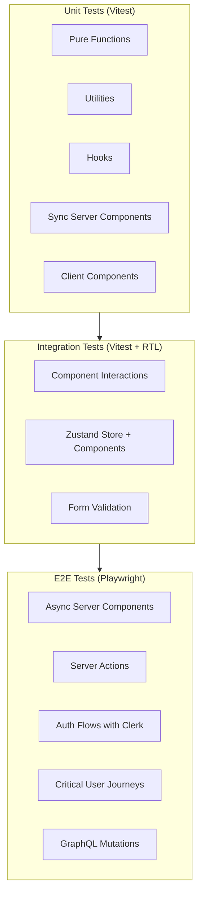
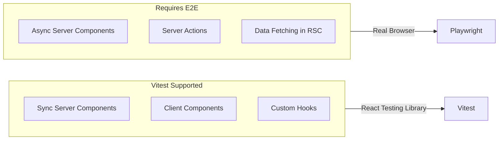
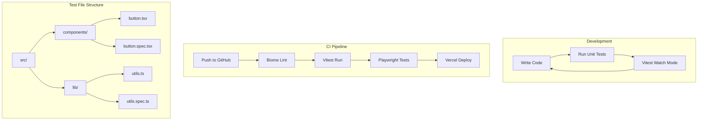

# Next.js 16 Testing Strategy - Research

**Date**: 2025-12-18
**Status**: Research Complete

## Table of Contents

- [Executive Summary](#executive-summary)
- [Technical Deep Dive](#technical-deep-dive)
- [Technology Stack / Ecosystem](#technology-stack--ecosystem)
- [Codebase Analysis](#codebase-analysis)
- [Implementation Feasibility](#implementation-feasibility)
- [Implementation Options](#implementation-options)
- [Comparison Matrix](#comparison-matrix)
- [Implementation Approach](#implementation-approach)
- [Alternatives Considered](#alternatives-considered)
- [Debates & Open Questions](#debates--open-questions)
- [Recommendations](#recommendations)
- [Additional Notes](#additional-notes)
- [Sources](#sources)

## Executive Summary

For this Next.js 16 + Bun + React 19 project, the recommended testing stack is **Vitest** for unit/integration tests and **Playwright** for E2E tests. Vitest offers the best balance of speed, features, and Next.js compatibility when run with Bun as the runtime. Playwright provides superior cross-browser support and excellent Clerk authentication integration. Async React Server Components should be tested via E2E tests only, as unit testing support is not yet mature.

## Technical Deep Dive

### Overview

Testing modern Next.js applications with App Router requires a layered approach due to the distinct runtime environments (server vs client) and the introduction of React Server Components. The testing ecosystem has evolved significantly, with Vitest emerging as the preferred unit test runner for its speed and Vite compatibility, while Playwright dominates E2E testing with its cross-browser capabilities.

### Test Types for Next.js 16



### React Server Components Testing Challenge

React Server Components (RSC) present a unique testing challenge because async components cannot be reliably tested with traditional unit testing approaches:



**Key Limitation**: Since async Server Components are new to the React ecosystem, Vitest currently does not support them. The official Next.js documentation recommends E2E testing for async components.

### Server Actions Testing

Server Actions can be tested in two ways:

1. **Unit testing the function directly** (if exported separately):
   ```typescript
   // Direct function invocation
   const result = await serverAction(formData)
   expect(result).toEqual(expected)
   ```

2. **E2E testing through form submission** (recommended for form-bound actions):
   ```typescript
   // Playwright test
   await page.fill('input[name="email"]', 'test@example.com')
   await page.click('button[type="submit"]')
   await expect(page.locator('.success')).toBeVisible()
   ```

## Technology Stack / Ecosystem

### Core Testing Stack

| Tool | Purpose | Version |
|------|---------|---------|
| Vitest | Unit/Integration test runner | Latest (2.x) |
| @vitejs/plugin-react | React support for Vitest | Latest |
| @testing-library/react | Component testing utilities | Latest |
| @testing-library/dom | DOM testing utilities | Latest |
| Playwright | E2E testing | Latest (1.x) |
| @clerk/testing | Clerk auth testing helpers | Latest |
| MSW | GraphQL/API mocking | 2.x |
| happy-dom or jsdom | DOM environment for Vitest | Latest |

### Dependencies to Install

```bash
# Unit/Integration Testing
bun add -D vitest @vitejs/plugin-react @testing-library/react @testing-library/dom @testing-library/jest-dom vite-tsconfig-paths jsdom

# E2E Testing
bun add -D @playwright/test @clerk/testing

# API Mocking (optional, for GraphQL)
bun add -D msw
```

### Integration Points

```mermaid
graph TB
    subgraph Runtime["Bun Runtime"]
        PM[Package Manager]
        Exec[Script Execution]
    end

    subgraph UnitTests["Unit Test Stack"]
        Vitest --> RTL[React Testing Library]
        RTL --> JSDOM[jsdom/happy-dom]
    end

    subgraph E2ETests["E2E Test Stack"]
        Playwright --> ClerkTest[@clerk/testing]
        Playwright --> Browsers[Chromium/Firefox/WebKit]
    end

    subgraph Mocking["API Mocking"]
        MSW --> GraphQL[GraphQL Handlers]
        MSW --> REST[REST Handlers]
    end

    Runtime --> UnitTests
    Runtime --> E2ETests
    MSW --> UnitTests
    MSW --> E2ETests
```

## Codebase Analysis

### Current Project State

- **Framework**: Next.js 16.0.10 with App Router
- **React**: 19.2.1 with React Compiler enabled
- **Runtime**: Bun
- **Auth**: Clerk (`@clerk/nextjs`)
- **State**: Zustand 5.0.9
- **Forms**: @tanstack/react-form 1.27.3
- **Styling**: Tailwind CSS v4
- **Backend**: Apollo Federation GraphQL (via graphql-request)
- **Current Tests**: None - greenfield setup

### Key Patterns to Consider

1. **Protected Routes**: All routes under `(auth)/` require authentication via Clerk middleware
2. **Server Components**: Default in App Router, async data fetching patterns
3. **Client Components**: Interactive components with Zustand state
4. **GraphQL**: Using `graphql-request` for data fetching, generated types via codegen

### Testing Boundaries

Based on project structure and user's testing philosophy (from CLAUDE.md):

| What to Test | Testing Approach |
|--------------|------------------|
| Business logic, validations | Unit tests (Vitest) |
| Custom hooks with logic | Unit tests with renderHook |
| Form validation (Zod schemas) | Unit tests |
| Component user interactions | Integration tests (RTL) |
| Authentication flows | E2E tests (Playwright + Clerk) |
| GraphQL mutations | E2E tests or MSW mocking |
| Async Server Components | E2E tests only |

### What NOT to Test (per CLAUDE.md)

- Library/framework behavior
- TypeScript type guarantees
- Simple pass-through code
- Echo tests (input === output)
- Server Component rendering (let E2E cover this)

## Implementation Feasibility

### Benefits

- **Vitest + Bun**: Near-instant test startup, native TypeScript/JSX support
- **Playwright**: Official Clerk support, cross-browser testing, reliable async handling
- **Colocated Tests**: `*.spec.ts` pattern aligns with project conventions
- **MSW**: Seamless GraphQL mocking for unit tests without actual network calls

### Trade-offs & Challenges

| Challenge | Mitigation |
|-----------|------------|
| Async RSC unit testing not supported | Use E2E for async components |
| Bun test runner lacks some features | Use Vitest with Bun runtime instead |
| Clerk auth in tests adds complexity | Use @clerk/testing with saved auth state |
| GraphQL mocking setup overhead | Use MSW with generated types from codegen |

### When to Use Each Approach

**Unit Tests (Vitest)**:
- Pure utility functions
- Zod validation schemas
- Custom hooks with business logic
- Synchronous components with logic
- Zustand store selectors

**E2E Tests (Playwright)**:
- User authentication flows
- Form submissions with Server Actions
- Full user journeys (signup, data creation)
- Async Server Components
- GraphQL mutation flows

## Implementation Options

### Option 1: Vitest + Playwright (Recommended)

**Description**: Use Vitest for unit/integration tests with Bun runtime, Playwright for E2E tests.

**Pros**:
- Official Next.js documentation support
- Best performance with Bun runtime
- Full feature set (coverage, watch mode, snapshots)
- Excellent IDE integration (VS Code Vitest extension)
- Playwright has official Clerk testing support

**Cons**:
- Two test runners to configure
- Vitest doesn't support async RSC

**Complexity**: Medium

**Time Estimate**: 2-3 hours initial setup

**Reuses Patterns**: Yes - aligns with Next.js official examples

**When to Use**:
- Production applications
- Teams needing comprehensive testing
- Projects requiring cross-browser E2E tests

### Option 2: Bun Test Runner Only

**Description**: Use Bun's built-in test runner for all tests.

**Pros**:
- Fastest raw performance (266 tests faster than Jest prints version)
- Zero configuration for TypeScript/JSX
- Single tool for runtime and testing
- Jest-compatible API

**Cons**:
- Missing fake timers implementation
- No test isolation between suites (can cause flaky tests)
- Less mature ecosystem
- No browser mode for component tests
- Limited IDE integration

**Complexity**: Low

**Time Estimate**: 1-2 hours initial setup

**Reuses Patterns**: Partial

**When to Use**:
- Simple projects with minimal testing needs
- Internal tools or prototypes
- When raw speed is paramount

### Option 3: Jest + Playwright

**Description**: Traditional Jest setup with Playwright for E2E.

**Pros**:
- Most mature ecosystem
- Extensive documentation
- Familiar to most developers

**Cons**:
- Slowest option
- More configuration required
- Doesn't leverage Bun's speed advantages
- Next.js recommends Vitest for new projects

**Complexity**: Medium-High

**Time Estimate**: 3-4 hours initial setup

**Reuses Patterns**: No - legacy approach

**When to Use**:
- Migrating from existing Jest setup
- Teams with extensive Jest expertise
- Projects requiring Jest-specific plugins

## Comparison Matrix

| Criteria | Vitest + Playwright | Bun Test Only | Jest + Playwright |
|----------|---------------------|---------------|-------------------|
| Setup Complexity | Medium | Low | Medium-High |
| Test Speed | Excellent | Best | Good |
| Feature Completeness | Full | Limited | Full |
| Async RSC Support | E2E only | E2E only | E2E only |
| IDE Integration | Excellent | Limited | Excellent |
| Next.js Official Support | Yes | Partial | Yes |
| Clerk Integration | Full | Manual | Full |
| Test Isolation | Full | Weak | Full |
| Community Support | Growing | Small | Large |
| Bun Synergy | High | Highest | Low |
| Time to Implement | 2-3 hours | 1-2 hours | 3-4 hours |

## Implementation Approach

### Prerequisites & Requirements

- Bun 1.x (already installed)
- Node.js 18+ (for Playwright browsers)
- VS Code with Vitest extension (recommended)

### Getting Started

#### 1. Install Dependencies

```bash
# Unit/Integration testing
bun add -D vitest @vitejs/plugin-react @testing-library/react @testing-library/dom @testing-library/jest-dom vite-tsconfig-paths jsdom

# E2E testing
bun add -D @playwright/test @clerk/testing

# Install Playwright browsers
bunx playwright install --with-deps chromium
```

#### 2. Create Vitest Configuration

**`vitest.config.mts`**:
```typescript
import react from '@vitejs/plugin-react'
import tsconfigPaths from 'vite-tsconfig-paths'
import { defineConfig } from 'vitest/config'

export default defineConfig({
  plugins: [tsconfigPaths(), react()],
  test: {
    environment: 'jsdom',
    globals: true,
    setupFiles: ['./src/test/setup.ts'],
    include: ['src/**/*.spec.{ts,tsx}'],
    coverage: {
      provider: 'v8',
      include: ['src/**/*.{ts,tsx}'],
      exclude: [
        'src/**/*.spec.{ts,tsx}',
        'src/test/**',
        'src/app/**/layout.tsx',
        'src/app/**/loading.tsx',
        'src/app/**/error.tsx',
      ],
      reporter: ['text', 'html', 'json'],
      reportsDirectory: './coverage',
    },
  },
})
```

#### 3. Create Test Setup File

**`src/test/setup.ts`**:
```typescript
import '@testing-library/jest-dom/vitest'
import { cleanup } from '@testing-library/react'
import { afterEach } from 'vitest'

// Cleanup after each test
afterEach(() => {
  cleanup()
})
```

#### 4. Create Playwright Configuration

**`playwright.config.ts`**:
```typescript
import { clerkSetup } from '@clerk/testing/playwright'
import { defineConfig, devices } from '@playwright/test'

export default defineConfig({
  testDir: './e2e',
  fullyParallel: true,
  forbidOnly: !!process.env.CI,
  retries: process.env.CI ? 2 : 0,
  workers: process.env.CI ? 1 : undefined,
  reporter: 'html',
  use: {
    baseURL: 'http://localhost:3000',
    trace: 'on-first-retry',
  },
  projects: [
    {
      name: 'setup',
      testMatch: /global\.setup\.ts/,
    },
    {
      name: 'chromium',
      use: { ...devices['Desktop Chrome'] },
      dependencies: ['setup'],
    },
  ],
  webServer: {
    command: 'bun run build && bun run start',
    url: 'http://localhost:3000',
    reuseExistingServer: !process.env.CI,
  },
})
```

#### 5. Create Playwright Global Setup

**`e2e/global.setup.ts`**:
```typescript
import { clerkSetup } from '@clerk/testing/playwright'
import { test as setup } from '@playwright/test'

setup.describe.configure({ mode: 'serial' })

setup('global setup', async ({}) => {
  await clerkSetup()
})
```

#### 6. Update package.json Scripts

```json
{
  "scripts": {
    "test": "vitest",
    "test:run": "vitest run",
    "test:coverage": "vitest run --coverage",
    "test:e2e": "playwright test",
    "test:e2e:ui": "playwright test --ui"
  }
}
```

### Architecture & Design Considerations



### Best Practices

1. **Colocate Tests**: Place `*.spec.ts` files next to source files per project convention
2. **Test User Behavior**: Focus on what users see and do, not implementation details
3. **Minimize Mocking**: Only mock external dependencies (APIs, auth)
4. **Use Testing Tokens**: Clerk's `@clerk/testing` provides bot detection bypass
5. **Save Auth State**: Store authenticated state to speed up E2E tests
6. **Parallel E2E**: Use Playwright sharding for CI

### Common Pitfalls & How to Avoid Them

1. **Testing Async RSC with Vitest**
   - Pitfall: Attempting to unit test async Server Components
   - Solution: Use E2E tests for async components; only unit test sync components

2. **Zustand State Leaking Between Tests**
   - Pitfall: Store state persists across tests causing flaky tests
   - Solution: Reset store in `beforeEach` or use Zustand's testing utilities

3. **Running `bun test` Instead of `bun run test`**
   - Pitfall: `bun test` runs Bun's test runner, not Vitest
   - Solution: Always use `bun run test` for Vitest

4. **Clerk Bot Detection in E2E**
   - Pitfall: Tests fail with "Bot traffic detected"
   - Solution: Use `setupClerkTestingToken()` from `@clerk/testing`

5. **Slow E2E Tests Due to Repeated Auth**
   - Pitfall: Each test logs in separately
   - Solution: Save auth state and load in subsequent tests

### Testing Strategy by Component Type

| Component Type | Testing Approach | Example |
|----------------|------------------|---------|
| Utility functions | Unit test with Vitest | Validation helpers, formatters |
| Zod schemas | Unit test validators | Form validation schemas |
| Custom hooks | `renderHook` with RTL | `useFormSubmit`, `useAuth` |
| Client Components | RTL render + user events | Buttons, forms, modals |
| Sync Server Components | RTL render | Static content components |
| Async Server Components | Playwright E2E | Data-fetching pages |
| Server Actions | E2E via form submission | Form handlers |
| Auth flows | Playwright + @clerk/testing | Sign in, sign up, protected routes |

## Alternatives Considered

### Alternative 1: Cypress

- **Description**: Popular E2E testing framework with component testing
- **Why Not Chosen**: No Safari/WebKit support, slower than Playwright, less advanced parallel execution
- **When Better**: If team has existing Cypress expertise or needs Cypress Dashboard features

### Alternative 2: Bun Test Runner as Primary

- **Description**: Use Bun's native test runner for everything
- **Why Not Chosen**: Missing fake timers, weak test isolation, less mature tooling
- **When Better**: Simple projects, internal tools, maximum speed priority

### Alternative 3: Testing Library Only (No Vitest/Jest)

- **Description**: Use Testing Library with Bun test runner
- **Why Not Chosen**: Requires more manual setup, less ecosystem support
- **When Better**: When minimizing dependencies is critical

## Debates & Open Questions

1. **Async RSC Testing**: The React/Testing Library ecosystem doesn't have a consensus on how to properly unit test async Server Components. Current recommendation is E2E, but this may change.

2. **Vitest Browser Mode**: Vitest offers experimental browser mode for running tests in real browsers. This could bridge the gap between unit and E2E tests but is still maturing.

3. **React 19 Testing**: Some React 19 features may require updated testing patterns. Monitor Testing Library releases for updates.

4. **MSW in Server Components**: Mocking network requests in RSC context requires different setup than client-side. Playwright's request interception may be more reliable.

## Recommendations

### Preferred Approach: Vitest + Playwright

**Should This Be Implemented?**: Yes

**Rationale**:
- Official Next.js documentation support for both tools
- Best performance when Vitest runs on Bun runtime
- Playwright has native Clerk integration
- Aligns with project's testing philosophy (test real behavior, avoid over-testing)
- Mature ecosystem with active development

**Key Considerations**:
1. Start with E2E tests for critical user flows (auth, data mutations)
2. Add unit tests incrementally for business logic
3. Skip unit tests for simple components (per CLAUDE.md philosophy)
4. Use colocated `*.spec.ts` pattern

**Potential Challenges**:
1. **Initial Setup Time**: ~2-3 hours for complete setup
   - Mitigation: Use provided configuration templates
2. **Clerk Testing Token Management**: Need to handle securely in CI
   - Mitigation: Use GitHub Actions secrets, follow Clerk documentation

**Success Criteria**:
- Unit tests run in <5 seconds locally
- E2E tests complete in <2 minutes in CI
- No flaky tests after 10 consecutive runs
- Coverage maintained at 80%+ for business logic

### Implementation Priority

1. **Phase 1**: Set up Vitest with basic configuration (Day 1)
2. **Phase 2**: Set up Playwright with Clerk integration (Day 1)
3. **Phase 3**: Add first E2E test for auth flow (Day 1)
4. **Phase 4**: Add unit tests for existing business logic (Day 2)
5. **Phase 5**: Configure CI pipeline (Day 2)

## Additional Notes

### Vercel + Bun Runtime (October 2025)

Vercel now supports Bun runtime natively. When deploying:
- Add `"bunVersion": "1.x"` to `vercel.json`
- Tests can run faster in CI with Bun's performance benefits
- Internal Vercel testing shows 28% latency reduction for CPU-bound Next.js rendering

### GitHub Actions CI Workflow Example

```yaml
name: Test Suite
on:
  push:
    branches: [trunk]
  pull_request:
    branches: [trunk]

jobs:
  unit-tests:
    runs-on: ubuntu-latest
    steps:
      - uses: actions/checkout@v4
      - uses: oven-sh/setup-bun@v2
      - run: bun install
      - run: bun run test:run
      - run: bun run test:coverage
      - uses: actions/upload-artifact@v4
        with:
          name: coverage-report
          path: coverage/

  e2e-tests:
    runs-on: ubuntu-latest
    strategy:
      matrix:
        shardIndex: [1, 2]
        shardTotal: [2]
    steps:
      - uses: actions/checkout@v4
      - uses: oven-sh/setup-bun@v2
      - run: bun install
      - run: bunx playwright install --with-deps chromium
      - run: bun run test:e2e --shard=${{ matrix.shardIndex }}/${{ matrix.shardTotal }}
        env:
          CLERK_SECRET_KEY: ${{ secrets.CLERK_SECRET_KEY }}
          NEXT_PUBLIC_CLERK_PUBLISHABLE_KEY: ${{ vars.NEXT_PUBLIC_CLERK_PUBLISHABLE_KEY }}
      - uses: actions/upload-artifact@v4
        if: failure()
        with:
          name: playwright-report-${{ matrix.shardIndex }}
          path: playwright-report/
```

## Sources

1. [Next.js Testing Guide](https://nextjs.org/docs/app/guides/testing) - Official documentation
2. [Next.js Vitest Setup](https://nextjs.org/docs/app/guides/testing/vitest) - Official Vitest integration guide
3. [Vitest Configuration](https://vitest.dev/config/) - Vitest documentation
4. [Playwright Documentation](https://playwright.dev/docs/intro) - Official Playwright docs
5. [Playwright Test Sharding](https://playwright.dev/docs/test-sharding) - Parallel test execution
6. [Clerk Testing with Playwright](https://clerk.com/docs/testing/playwright/overview) - Official Clerk testing docs
7. [Clerk Playwright Next.js Example](https://github.com/clerk/clerk-playwright-nextjs) - Official example repo
8. [A Practical Guide to Testing Clerk Next.js Applications](https://clerk.com/blog/testing-clerk-nextjs) - Clerk blog (April 2025)
9. [Bun Test Runner Documentation](https://bun.sh/docs/test) - Official Bun testing docs
10. [Using Testing Library with Bun](https://bun.sh/guides/test/testing-library) - Bun + RTL guide
11. [Comparing JavaScript Test Frameworks](https://dev.to/kcsujeet/your-tests-are-slow-you-need-to-migrate-to-bun-9hh) - Jest vs Vitest vs Bun comparison
12. [Zustand Testing Guide](https://zustand.docs.pmnd.rs/guides/testing) - Official Zustand testing docs
13. [MSW GraphQL Mocking](https://mswjs.io/docs/api/graphql/) - Mock Service Worker documentation
14. [Vitest Code Coverage](https://vitest.dev/guide/coverage) - Coverage configuration guide
15. [GitHub Actions Cache](https://github.com/actions/cache) - CI caching strategies
16. [Vercel Bun Runtime Support](https://bun.com/blog/vercel-adds-native-bun-support) - Bun on Vercel (October 2025)
