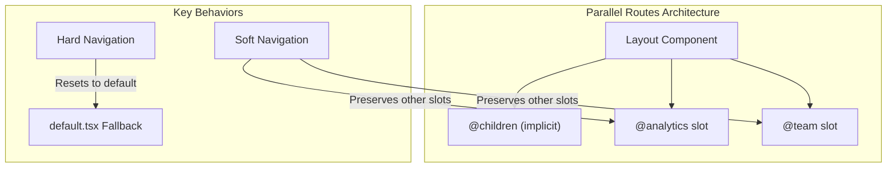
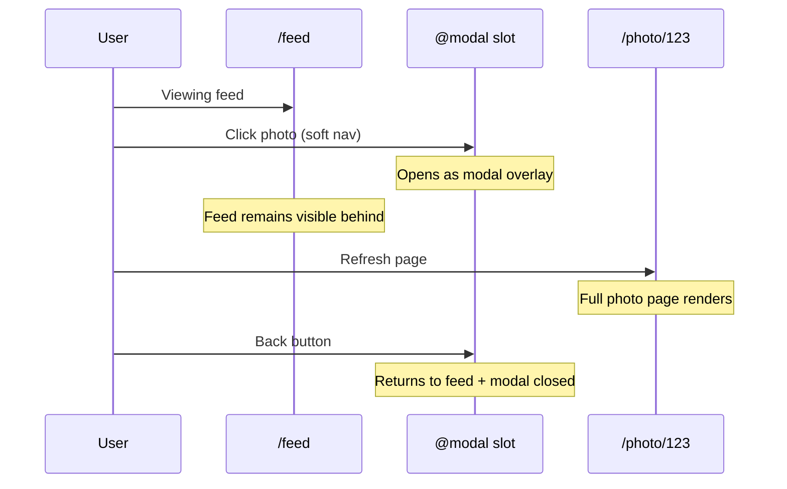
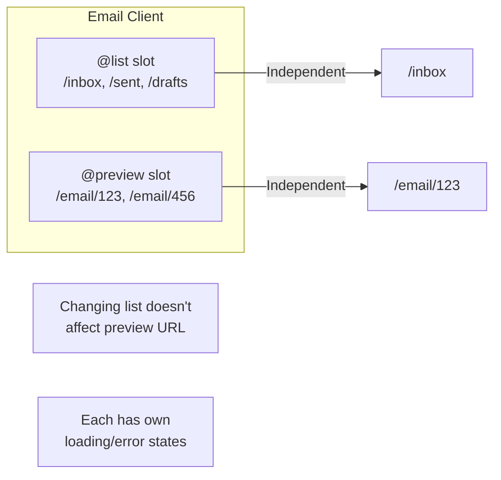
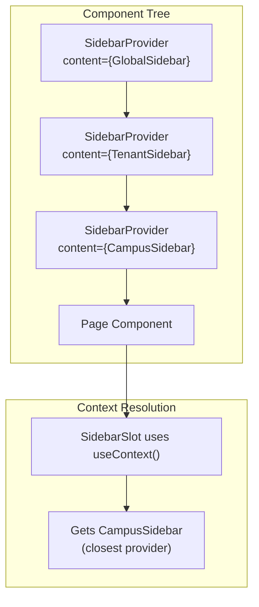
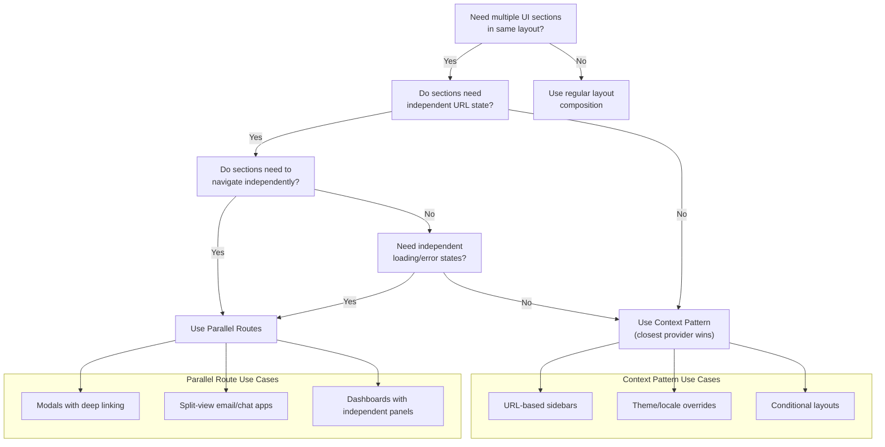

# Parallel Routes vs. Alternative Patterns for UI Composition - Research

**Date**: 2025-12-20
**Status**: Research Complete

## Table of Contents

- [Executive Summary](#executive-summary)
- [Technical Deep Dive](#technical-deep-dive)
- [When Parallel Routes Are Essential](#when-parallel-routes-are-essential)
- [When Parallel Routes Are Overkill](#when-parallel-routes-are-overkill)
- [Context-Based Pattern Analysis](#context-based-pattern-analysis)
- [Decision Framework](#decision-framework)
- [Performance & DX Considerations](#performance--dx-considerations)
- [Codebase Analysis](#codebase-analysis)
- [Recommendations](#recommendations)
- [Sources](#sources)

## Executive Summary

Parallel routes solve a specific problem: **independent navigation and rendering of multiple UI sections within the same layout**. They excel when slots need their own URL state, loading/error boundaries, and can navigate independently. However, for simpler use cases like context-aware sidebars where content changes based on URL hierarchy (not independent navigation), the context-based "closest provider wins" pattern is simpler, more maintainable, and equally performant. The refactoring from 15+ files to 5 files validates this assessment.

## Technical Deep Dive

### What Parallel Routes Actually Are

Parallel routes are created using named slots with the `@folder` convention. Slots are passed as props to the parent layout and render simultaneously or conditionally within the same URL.

```
app/
├── layout.tsx         # Receives @analytics and @team as props
├── @analytics/
│   └── page.tsx
├── @team/
│   └── page.tsx
└── page.tsx           # Implicit @children slot
```

```tsx
// layout.tsx
export default function Layout({
  children,
  analytics,
  team,
}: {
  children: React.ReactNode;
  analytics: React.ReactNode;
  team: React.ReactNode;
}) {
  return (
    <>
      {children}
      {analytics}
      {team}
    </>
  );
}
```

### Core Mechanics



**Soft Navigation (Client-side)**:
- Next.js performs partial render
- Maintains other slots' active subpages even if they don't match current URL
- Slots can navigate independently

**Hard Navigation (Full-page load/refresh)**:
- Next.js cannot determine active state for unmatched slots
- Renders `default.tsx` for unmatched slots, or 404 if missing

### The `default.tsx` Requirement

The complexity often comes from the `default.tsx` requirement. For every route that doesn't have a matching segment in a parallel slot, you need either:

1. A `default.tsx` that returns `null` or fallback content
2. A catch-all route `[...catchAll]/page.tsx`
3. Accept a 404 error

This is why the sidebar parallel route implementation required 15+ files - each URL path needed corresponding files in the `@sidebar` slot.

## When Parallel Routes Are Essential

### 1. Modals with Deep Linking (Primary Use Case)

The canonical use case that justifies parallel routes' complexity:



**Why parallel routes are essential here**:
- Modal URL is shareable (`/photo/123`)
- Context (feed) is preserved on refresh via `default.tsx`
- Back button closes modal instead of navigating away
- Forward navigation reopens modal

```typescript
// app/@modal/(.)photo/[id]/page.tsx - Intercepts /photo/[id]
export default function PhotoModal({ params }) {
  return (
    <Modal>
      <Photo id={params.id} />
    </Modal>
  );
}
```

### 2. Independent Navigation in Split Views

When two panes need truly independent URL state:



**Why parallel routes work here**:
- Each pane can navigate without affecting the other
- Each pane has independent loading and error states
- URL can encode state for both panes

### 3. Conditional Rendering Based on Auth/Role

When entire UI sections should swap based on user state:

```tsx
export default function Layout({ admin, user }) {
  const role = checkUserRole();
  return role === "admin" ? admin : user;
}
```

**Why it works**: The `@admin` and `@user` slots are completely independent codebases that can have different data fetching, error handling, and navigation.

### 4. Dashboard with Independent Loading States

When different sections have vastly different data fetching times:

```tsx
// Each slot streams independently with its own Suspense boundary
export default function DashboardLayout({ analytics, team, activity }) {
  return (
    <div className="grid grid-cols-3">
      {analytics}  {/* Might take 2s */}
      {team}       {/* Might take 500ms */}
      {activity}   {/* Might take 5s */}
    </div>
  );
}
```

## When Parallel Routes Are Overkill

### 1. URL-Hierarchy-Based Content (Your Sidebar Case)

When content changes based on which URL segment you're in, not independent navigation:

| URL | Sidebar Content |
|-----|-----------------|
| `/` | Global nav |
| `/tenants/[id]` | Tenant nav |
| `/tenants/[id]/campuses/[id]` | Campus nav |

**Why parallel routes are overkill**:
- Sidebar never navigates independently
- No need for sidebar-specific URL state
- Content is purely a function of the current route
- No independent loading/error requirements

### 2. Static Conditional Rendering

If you just need to show different content based on a prop or route:

```tsx
// Overkill: Parallel route with @admin and @user slots
// Better: Simple conditional in layout
function Layout({ children, isAdmin }) {
  return (
    <>
      {isAdmin ? <AdminSidebar /> : <UserSidebar />}
      {children}
    </>
  );
}
```

### 3. Shared Data/Context Requirements

When slots need to share data or communicate:

> "Layouts and pages may be rendered separately, at different times and with different information. They can't share a context. They must initialize it individually." [1]

If your UI sections need to share state, parallel routes add complexity because each slot is isolated.

### Signs You Don't Need Parallel Routes

1. The slot content is determined by the current URL, not independent navigation
2. You don't need the slot to have its own URL state
3. Slots don't need independent loading/error boundaries
4. You find yourself creating many `default.tsx` files that return `null`
5. The slot never changes URL without the main content also changing

## Context-Based Pattern Analysis

### How "Closest Provider Wins" Works

React Context searches upward and uses the first matching provider:



```tsx
// Nested providers override outer providers
<SidebarProvider content={<GlobalSidebar />}>      {/* Outer */}
  <SidebarProvider content={<TenantSidebar />}>    {/* Inner - wins for descendants */}
    <SidebarProvider content={<CampusSidebar />}>  {/* Innermost - wins for its descendants */}
      <SidebarSlot />  {/* Renders CampusSidebar */}
    </SidebarProvider>
  </SidebarProvider>
</SidebarProvider>
```

### Implementation Pattern

```tsx
// sidebar-context.tsx (19 lines)
"use client";
const SidebarContentContext = createContext<ReactNode>(null);

export function SidebarProvider({ children, content }) {
  return (
    <SidebarContentContext.Provider value={content}>
      {children}
    </SidebarContentContext.Provider>
  );
}

export function SidebarSlot() {
  return useContext(SidebarContentContext);
}
```

```tsx
// Root layout - sets global default
<SidebarProvider content={<GlobalSidebarContent />}>
  {children}
</SidebarProvider>

// Tenant layout - overrides for tenant routes
<SidebarProvider content={<TenantSidebarContent tenantId={tenantId} />}>
  {children}
</SidebarProvider>

// Campus layout - overrides for campus routes
<SidebarProvider content={<CampusSidebarContent tenantId={tenantId} campusId={campusId} />}>
  {children}
</SidebarProvider>
```

### Advantages Over Parallel Routes

| Aspect | Parallel Routes | Context Pattern |
|--------|-----------------|-----------------|
| Files required | 15+ (with defaults) | 5 |
| Mental model | Slots + matching segments | Providers + override |
| Server Components | Mixed (slot content) | Content can be RSC |
| Data sharing | Isolated | Shared context tree |
| URL coupling | Required for matching | None |
| Nesting support | Same level only [2] | Any depth |

### Limitations of Context Pattern

1. **No Independent Navigation**: Sidebar cannot have its own URL state
2. **No Independent Loading/Error**: Cannot define per-sidebar loading or error boundaries
3. **Client Component Required**: The `SidebarSlot` must be a client component (though content can be server-rendered)
4. **No Soft Navigation Benefits**: Doesn't preserve sidebar state during navigation (though rarely needed for sidebars)

## Decision Framework



### Quick Decision Questions

1. **Can you describe the slot's behavior purely as "when at URL X, show content Y"?**
   - Yes -> Context Pattern
   - No, slot navigates independently -> Parallel Routes

2. **Does the slot need its own URL that can be shared/bookmarked?**
   - Yes -> Parallel Routes
   - No -> Context Pattern

3. **If user refreshes, does the slot need to preserve its independent state?**
   - Yes -> Parallel Routes
   - No -> Context Pattern

4. **Do you find yourself creating many `default.tsx` files that return `null`?**
   - Yes -> You're fighting the pattern; consider Context
   - No -> Parallel Routes are appropriate

## Performance & DX Considerations

### Performance

**Parallel Routes**:
- Independent streaming per slot
- Can cause redundant RSC fetches (N fetches for N slots on navigation) [3]
- If one slot is dynamic, all slots at that level become dynamic [4]

**Context Pattern**:
- Single render pass
- No redundant fetches
- Content components can still be Server Components
- Partial rendering works (layout doesn't re-render)

### Developer Experience

**Parallel Routes Pain Points**:
- `default.tsx` proliferation for unmatched routes
- Debugging slot matching is difficult
- Nested directories don't work as expected [2]
- Documentation/behavior mismatches reported [5]
- Server Action redirects can break routes [6]

**Context Pattern Benefits**:
- Familiar React pattern
- Works at any nesting level
- Easy to understand and debug
- No special file conventions

## Codebase Analysis

### Previous Implementation (Parallel Routes)

From `docs/prototype-mapping.md`, the parallel route approach required:

```
@sidebar/
├── default.tsx                                    # Global fallback
├── tenants/
│   ├── [tenantId]/
│   │   ├── default.tsx                           # Tenant fallback
│   │   ├── campuses/
│   │   │   └── [campusId]/
│   │   │       └── default.tsx                   # Campus fallback
│   │   ├── folder-types/
│   │   │   └── page.tsx (or default.tsx)
│   │   ├── roles/
│   │   │   └── page.tsx (or default.tsx)
│   │   └── ... (more routes)
```

**Result**: 15+ files, complex matching, difficult to maintain

### Current Implementation (Context Pattern)

```
_components/
├── sidebar-context.tsx         # 19 lines - the pattern
├── global-sidebar-content.tsx  # Global nav
├── tenant-sidebar-content.tsx  # Tenant nav
├── campus-sidebar-content.tsx  # Campus nav
└── sidebar-shell.tsx           # Shared wrapper

layouts:
├── layout.tsx                  # SidebarProvider + GlobalSidebarContent
├── tenants/[tenantId]/
│   └── layout.tsx              # SidebarProvider + TenantSidebarContent
└── tenants/[tenantId]/campuses/[campusId]/
    └── layout.tsx              # SidebarProvider + CampusSidebarContent
```

**Result**: 5 meaningful files, clear hierarchy, easy to extend

### Why Context Was the Right Choice

The sidebar's behavior is purely: "At URL depth X, show sidebar variant Y"

- No independent sidebar navigation
- No sidebar-specific URL state
- No need for sidebar loading/error boundaries
- Sidebar changes are always tied to page navigation

## Recommendations

### For This Codebase: Context Pattern is Correct

The refactoring from parallel routes to context was the right decision because:

1. **Sidebar is URL-determined**: Content is purely a function of URL hierarchy
2. **No independent navigation**: Sidebar never navigates separately from main content
3. **Simpler maintenance**: 5 files vs 15+ files
4. **Natural nesting**: Each layout naturally overrides the sidebar for its subtree
5. **Server Component compatible**: Sidebar content components are Server Components

### When to Consider Parallel Routes in This Codebase

Consider parallel routes if you add:

1. **Modal system with deep linking**: Photo/document preview modals that should be shareable
2. **Split-pane editors**: If folders or folder types need side-by-side editing with independent navigation
3. **Dashboard panels**: If the overview pages need independently updating panels with their own routes

### Implementation Checklist for Parallel Routes (If Needed)

If you do add parallel routes later:

1. Ensure the slot genuinely needs independent URL state
2. Create `default.tsx` returning `null` for all unmatched segments
3. Consider catch-all routes for cleaner fallbacks
4. Test hard navigation (refresh) at all possible URLs
5. Document which URLs should match which slot content

## Sources

1. [Next.js Parallel Routes Documentation](https://nextjs.org/docs/app/api-reference/file-conventions/parallel-routes) - Official documentation covering slots, default.js, and modal patterns
2. [GitHub Discussion #48927 - Parallel Routes from Nested Directories](https://github.com/vercel/next.js/discussions/48927) - Community discussion on nesting limitations
3. [GitHub Issue #65878 - Parallel Routes cause redundant RSC fetches](https://github.com/vercel/next.js/issues/65878) - Performance issue with multiple slots
4. [Next.js 14 Parallel Routes Guide](https://www.builder.io/blog/nextjs-14-parallel-routes) - Builder.io comprehensive guide
5. [GitHub Discussion #68528 - Problems with Parallel Routes](https://github.com/vercel/next.js/discussions/68528) - Community pain points and issues
6. [GitHub Issue #65411 - Server Action redirect breaks parallel routes](https://github.com/vercel/next.js/issues/65411) - Known issue with redirects
7. [React useContext Documentation](https://react.dev/reference/react/useContext) - Official React docs on context and provider nesting
8. [LogRocket - Advanced Next.js Routing](https://blog.logrocket.com/exploring-advanced-next-js-routing-conventions/) - Comparison of routing patterns
9. [This Dot Labs - Parallel and Intercepting Routes](https://www.thisdot.co/blog/maximizing-routing-flexibility-with-next-js-parallel-and-intercepting-routes) - Real-world implementation examples
10. [Dev.to - Troubleshooting Parallel Routing](https://dev.to/zmzlois/troubleshooting-parallel-routing-in-nextjs-pdo) - Common problems and workarounds
