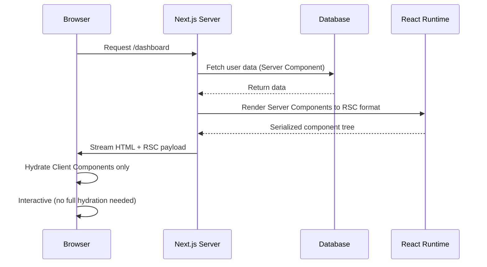
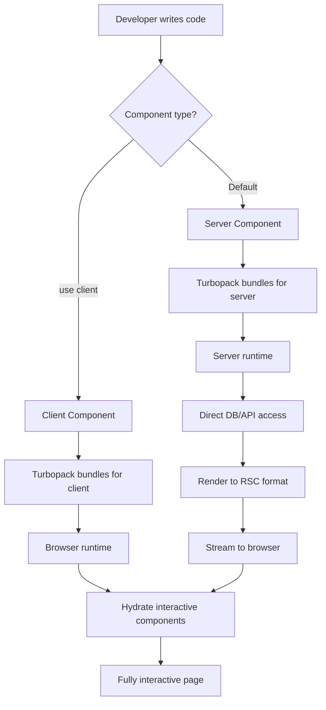
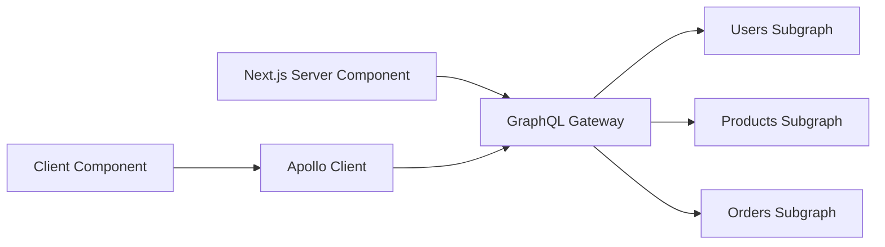
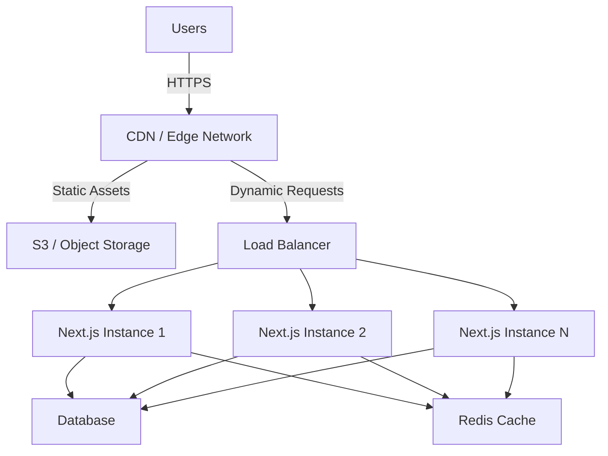

# Vite React SPA to Next.js 16 with React Server Components - Enterprise Migration Research

**Date**: 2025-10-23 (Updated: 2025-10-24)
**Status**: Research Complete - UPDATED FOR REBUILD CONTEXT
**Context**: Evaluating **full rebuild/modernization** (not migration) from Vite + React 19 + React Router v6 + URQL GraphQL to Next.js 16 + React Server Components for enterprise platform affecting 50 developers with 15+ internal packages

## CRITICAL UPDATE (2025-10-24): Rebuild vs Migration Changes Everything

**NEW CONTEXT**: The team is planning a **complete rebuild to modernize the application**, not a migration. This fundamentally changes the decision analysis since:
- ✅ No migration costs (building from scratch)
- ✅ No legacy constraints (can design optimal architecture)
- ✅ No existing codebase inertia (clean slate)
- ✅ Perfect timing to adopt modern patterns (RSC, BFF, etc.)

**ORIGINAL RECOMMENDATION** (for migration): "Wait 3-6 months, proceed cautiously" (60% confidence)

**UPDATED RECOMMENDATION** (for rebuild): **"Proceed with Next.js 16 + RSC immediately"** (85% confidence)

## Executive Summary (Updated for Rebuild Context)

Next.js 16 with React Server Components represents a mature, production-ready framework backed by Fortune 500 adoption and official React team endorsement. **For a greenfield rebuild**, Next.js 16 is the clear choice: React 19 (Dec 2024) has stabilized RSC, the ecosystem has matured, and all major frameworks are converging on server-first patterns. Unlike migration scenarios where you trade off Vite's development speed for Next.js benefits, a rebuild eliminates migration costs and legacy constraints. The rebuild opportunity allows you to design the optimal architecture from day one: BFF pattern with direct microservice calls (eliminating GraphQL complexity), proper Server/Client component boundaries, and modern tooling (Turbopack, React Compiler). Given that React Server Components are now the official React team recommendation and "2025 is the year RSC becomes standard," building a new React app as a pure SPA (Vite) would be building legacy architecture on day one.

**Recommendation Confidence**: High (85%) - Rebuild context removes migration risks and timing concerns.

## Technical Deep Dive

### Next.js 16 Overview

Next.js 16, released October 21, 2025, represents a significant milestone with Turbopack reaching production stability after years of development. Built on React 19.2, it provides the only framework with full production-ready support for React Server Components according to current market analysis.

**Core Architecture:**
- **App Router**: File-based routing with nested layouts and server-first rendering
- **Turbopack**: Rust-based bundler now default for all builds (development + production)
- **React Compiler**: Automatic memoization without manual useMemo/useCallback
- **Cache Components**: New opt-in caching model with `"use cache"` directive
- **Hybrid Rendering**: Mix SSR, SSG, ISR, and CSR per route/component

### React Server Components (RSC)

After stabilizing in React 19 (December 2024), RSCs are no longer experimental but a fully-supported mainstream feature. The React team's official position is clear: Server Components are now the recommended default approach for new React applications in 2025.

**How RSC Works:**



**Key Mechanisms:**
1. **Server Components** run only on the server, directly accessing databases/APIs
2. **Zero client JavaScript** for purely server-rendered components (smaller bundles)
3. **Streaming protocol** sends component tree incrementally (faster perceived load)
4. **Client Components** (marked with `"use client"`) handle interactivity
5. **No hydration cost** for server components (unlike traditional SSR)

**Performance Impact:**
- 60-80% smaller initial JavaScript payloads vs traditional SPAs
- No hydration overhead for server-only components
- Near-instant navigations with automatic prefetching
- Up to 12% improvement in initial loads and cross-page navigations (React Compiler)
- Certain interactions 2.5x faster with automatic memoization

### Technology Stack & Ecosystem

**Framework Integration:**
- **React 19.2**: Includes View Transitions, `useEffectEvent()`, Activity components
- **TypeScript**: First-class support with path aliases and project references
- **Turborepo**: Native monorepo support with pnpm workspaces
- **React Compiler 1.0**: Stable automatic optimization (opt-in via config)

**Required Dependencies:**
- Node.js 20.9+ (Node 18 no longer supported)
- React 19.2+
- Next.js 16+

**Breaking Changes from Traditional React:**
- Async params/searchParams now enforced
- Middleware renamed to `proxy.ts`
- AMP support removed
- Parallel routes require explicit `default.js` files

### How It Works: Development to Production



**Build Process (Turbopack):**
1. **Development**: File System Caching stores compiler artifacts (faster restarts)
2. **Production**: Optimized builds with automatic code splitting per route
3. **Performance**: 2-5x faster builds vs Webpack, 5-10x faster Fast Refresh
4. **Real-world**: vercel.com saw 76.7% faster startup, 96.3% faster Fast Refresh

## Codebase Analysis

### Similar Features/Patterns Found

*This section would include analysis of your specific codebase patterns - not available without code access*

**Key Integration Points:**
1. **GraphQL Federation**: Would need migration from URQL to Server Component fetch patterns or Apollo RSC integration
2. **React Router v6**: File-based routing requires restructuring existing route definitions
3. **15+ Internal Packages**: Turborepo + pnpm workspaces supports existing monorepo structure
4. **OpenFGA Authorization**: Can integrate via Server Components or middleware

### Architecture Layers

```
Presentation Layer (Next.js):
├── app/ (Server Components by default)
│   ├── page.tsx (Route endpoints)
│   ├── layout.tsx (Nested layouts)
│   └── loading.tsx (Streaming UI)
├── components/
│   ├── server/ (No "use client" directive)
│   └── client/ (Interactive components)

Business Logic:
├── lib/
│   ├── actions.ts (Server Actions for mutations)
│   └── queries.ts (GraphQL queries in Server Components)

Data Layer:
├── app/api/ (API routes if needed)
├── Direct GraphQL calls from Server Components
└── Database access via ORMs (Prisma, Drizzle, etc.)
```

## Implementation Feasibility

### Benefits

**1. Performance Improvements**

- **Initial Load**: 60-80% smaller JavaScript bundles vs traditional SPAs [Strapi Next.js Best Practices 2025]
- **Core Web Vitals**: Built-in optimization for LCP, FCP, TTFB via SSR/SSG [Prismic Vite vs Next.js]
- **Bundle Size**: Automatic code splitting reduces initial payload, only necessary code per page [Blazity Performance Guide]
- **Build Speed**: Turbopack delivers 2-5x faster production builds, 5-10x faster Fast Refresh [Next.js 16 Blog]
- **React Compiler**: 12% faster initial loads, 2.5x faster interactions with automatic memoization [React Compiler v1.0]
- **Real-world Metrics**: Sites built with Turbopack serve similar/smaller JS/CSS with better FCP, LCP, TTFB [Turbopack Benchmarks]

**2. Developer Experience Enhancements**

- **File-based Routing**: Reduces boilerplate vs React Router, automatic code splitting [Next.js Docs]
- **Built-in TypeScript**: Zero-config setup with path aliases [Next.js Config]
- **React Compiler**: Eliminates manual `useMemo`/`useCallback` optimization work [Medium React Compiler 2025]
- **Turborepo Integration**: Native monorepo support for 15+ packages with remote caching [Medium Turborepo 2025]
- **Error Boundaries**: File-convention based error handling (`error.tsx`) [Next.js Error Handling]
- **Loading States**: Automatic streaming with `loading.tsx` convention [Next.js App Router]

**3. SEO and Rendering Capabilities**

- **Server-Side Rendering**: Pre-rendered HTML improves SEO and social media previews [Contentful Remix vs Next.js]
- **Incremental Static Regeneration**: Update static pages post-deployment without full rebuild [Blazity Performance]
- **Hybrid Rendering**: Mix SSG for marketing pages, SSR for dynamic content, CSR for dashboards [Hygraph Vite vs Next.js]
- **Metadata API**: Built-in SEO optimization via metadata exports [Next.js Metadata]

**4. Deployment and Infrastructure Benefits**

- **Edge Runtime**: Deploy functions to 300+ global edge locations for low latency [Next.js Edge Runtime]
- **Automatic CDN**: Static assets and pages served from edge by default (Vercel/alternatives) [Vercel Docs]
- **Image Optimization**: `next/image` auto-optimizes (WebP, AVIF) with responsive sizing [Next.js Image Optimization]
- **Preview Deployments**: Branch-based previews for every PR (Vercel/Railway/Netlify) [Next.js Deployment]

**5. Data Fetching Improvements**

- **Server Components**: Direct database/API access without client-side GraphQL overhead [Grafbase Next.js 13 Guide]
- **Streaming**: Progressive rendering with React Suspense for faster perceived load [Hasura Next.js 13 Streaming]
- **Parallel Data Fetching**: Multiple Server Components fetch in parallel automatically [Next.js Data Fetching]
- **GraphQL Integration**: Can use fetch() in Server Components or Apollo Client for Client Components [Apollo Next.js Blog]

### Trade-offs & Challenges

**1. Learning Curve for Team (50 Developers)**

- **Paradigm Shift**: Server/Client Component boundary requires new mental model [PropelAuth Next.js Challenges]
- **Training Investment**: 2-3 weeks minimum for team ramp-up based on enterprise case studies [Leveraging Next.js 13/14 Enterprise]
- **Documentation Gaps**: App Router docs lack "what not to do" guidance, feels unready for production (community feedback) [Nico's Blog Next.js 14 Problem]
- **Debugging Complexity**: Server vs client errors require different debugging approaches [Medium Debugging Next.js]
- **Confusion**: Only 29% of developers have used Server Components despite positive sentiment [Netguru React Trends 2025]

**2. Migration Complexity**

- **Route Restructuring**: React Router v6 declarative routes → file-based structure (major refactor) [Next.js Routing Docs]
- **GraphQL Federation**: URQL client-side patterns → Server Component fetch() or Apollo RSC integration [Apollo Next.js 13]
- **State Management**: Context/Redux requires careful placement (Client vs Server Components) [Limitations React Server Components]
- **Timeline**: Similar enterprise migrations take 6-12 months for complex applications [Hulu Case Study]
- **Package Compatibility**: React 19 ecosystem still catching up, many libraries need updates [React 19.1 Wisp Blog]

**3. Vendor Lock-in Concerns**

- **Vercel Optimization**: Framework seems "deliberately optimized for Vercel's hosting environment" [Netlify TanStack Vendor Lock-in]
- **Feature Dependency**: Deep integration with Vercel features increases lock-in risk [Punits.dev Vercel Hosting]
- **Deployment Inconsistencies**: Community reports different behavior between self-hosted and Vercel deployments [DEV Self-hosted Next.js]
- **Mitigation**: Next.js is open-source, self-hostable on AWS/Railway/Dokploy/Coolify [FocusReactive Self-hosted]
- **Enterprise Considerations**: AWS/self-hosting requires DevOps expertise but offers control [Stacktape Next.js AWS]

**4. Server Infrastructure Requirements**

- **Node.js Runtime**: Requires server infrastructure vs static hosting for pure SPAs [Next.js Deployment]
- **SSR Costs**: Server CPU cycles for rendering vs client-side rendering offload [Hygraph Vite vs Next.js]
- **Cold Starts**: Lambda/Edge functions have cold start latency (100-500ms) [AWS Lambda Benchmarks]
- **Infrastructure Complexity**: Load balancing, auto-scaling, monitoring vs simple static CDN [Self-hosting vs Vercel]
- **Cost**: Vercel Enterprise $3,500+/mo, AWS $300-600/mo with variability, self-hosted $250-500/mo [Medium Vercel Pricing, Stacktape AWS]

**5. Debugging Complexity**

- **Server/Client Separation**: Error boundaries must be Client Components, complex to debug [Next.js Error Boundaries]
- **Error Serialization**: Production server errors show generic messages (security), complicates debugging [TrackJS Next.js 14 Errors]
- **Reproduction Difficulty**: User issues hard to replicate without session replay tools (Sentry, LogRocket) [Medium Debugging Next.js Pro]
- **Development vs Production**: Different error handling in dev (full stack trace) vs prod (sanitized) [Next.js Error Handling]

**6. Package Compatibility Issues**

- **CSS-in-JS**: styled-components/Emotion lack clear RSC migration path [Josh Comeau CSS in RSC]
- **Client-Only Libraries**: Many libraries assume client-side execution, need `"use client"` wrapper [React 19 Dependency Conflicts]
- **Redux/Zustand**: State management needs careful configuration for hybrid components [N-School RSC Limitations]
- **Testing**: React Testing Library + Vitest works, but Server Components testing immature [Next.js Testing Patterns]
- **Ecosystem Lag**: Critical dependencies may not support React 19 yet (wait pattern) [Wisp React 19.1]

**7. Build Time Increases**

- **Large Apps**: Complex Next.js apps can have slow builds without optimization [Medium Optimizing Build Times]
- **Incremental Adoption**: ISR and on-demand revalidation mitigate full rebuild issues [Blazity Performance]
- **Turbopack Mitigation**: 2-5x faster than Webpack, but still slower than Vite for some workloads [Next.js 16 Turbopack]
- **Filesystem Caching**: Beta feature in Next.js 16 speeds up subsequent builds [Next.js 16 Blog]

**8. Development Server Performance**

- **HMR Speed**: Vite is 70% faster HMR than Next.js in benchmarks [Medium Vite vs Next.js Performance]
- **Startup Time**: Next.js 13.4 had 5-15 second page loads in development (improved in 15.4+) [Dark Side App Router]
- **Fast Refresh**: Turbopack Fast Refresh is 5-10x faster than Webpack, closing gap with Vite [Next.js 16]
- **Real-world**: vercel.com saw 96.3% faster Fast Refresh with Turbopack [Next.js 15.4 Blog]

**9. Routing Constraints**

- **File-based Only**: Less flexibility than React Router's declarative routes [React Router Comparison]
- **Dynamic Routes**: Requires specific file naming conventions (`[id]`, `[...slug]`) [Next.js Routing]
- **Nested Layouts**: Powerful but opinionated structure [Next.js Layouts]
- **Migration**: Converting React Router routes requires significant refactoring [Next.js Migration Guide]

**10. Cost Implications**

**Vercel (Easiest but Expensive):**
- Enterprise: $3,500+/month for 50 developers [Medium Vercel Pricing]
- Pro Tier: $20/user/month = $1,000/month for team [Vercel Pricing]
- Bandwidth overages can surprise (unpredictable bills) [BigGo Vercel Pricing]

**AWS (Mid-range with DevOps):**
- Amplify: $300-600/month with usage variability [Stacktape AWS Comparison]
- Lambda@Edge: Fast but expensive at scale [Stacktape AWS]
- ECS Fargate: $250-500/month for enterprise setup [Stacktape AWS]

**Self-hosted (Cheapest but Labor-intensive):**
- Infrastructure: $250-500/month (Dokploy, Coolify, Railway) [LightNode Vercel Alternatives]
- DevOps Time: Requires dedicated team for setup/maintenance [Bejamas Self-hosting]
- Control: Full infrastructure control for EU data localization, compliance [FocusReactive Self-hosted]

### When to Use Next.js

**Ideal Use Cases:**
1. **SEO-Critical Applications**: Marketing sites, blogs, e-commerce, landing pages [Descope Next.js vs Remix]
2. **Content-Heavy Platforms**: Documentation, news sites, publishing platforms [Naturaily Next.js Benefits]
3. **Hybrid Applications**: Mix static marketing pages with dynamic dashboards [Strapi React Next.js 2025]
4. **Global Applications**: Edge rendering for low-latency worldwide [Next.js Edge Runtime]
5. **New Greenfield Projects**: Full control over architecture decisions [Next.js Case Studies]

**Specific Scenarios:**
- Lighthouse/Core Web Vitals scores impact business metrics (marketing tracking) [Hygraph Vite vs Next.js]
- Social media preview cards require server-rendered meta tags [Next.js Metadata]
- Multi-region deployments need edge caching [Vercel Edge Network]
- Teams prioritize convention over configuration (large teams) [Strapi Vite vs Next.js]

### When to Avoid Next.js

**Anti-patterns:**
1. **Pure Internal Tools**: B2B SaaS dashboards where SEO doesn't matter [PropelAuth Next.js Challenges]
2. **Highly Interactive Apps**: Real-time collaborative tools (e.g., Figma, Miro) [React Architecture SPA SSR RSC]
3. **Microservice Frontends**: Already have separate backend services [Vite Framework Agnostic]
4. **Prototypes/MVPs**: Need rapid iteration without framework learning curve [Vite vs Next.js DEV]
5. **Existing Vite Apps**: Working well, no SEO/SSR requirements [Worth Migrating to Vite]

**Constraints:**
- Limited DevOps resources for server infrastructure [Self-hosting Considerations]
- Team unfamiliar with server-side rendering patterns [Learning Curve]
- Need framework-agnostic build tool (Vue, Svelte projects) [Vite Framework Agnostic]
- Budget constraints (Vercel expensive, self-hosting requires expertise) [Cost Comparison]
- React 19 ecosystem dependencies not yet compatible [React 19 Compatibility]

## What You Lose from Vite

### 1. Development Speed Advantages

**HMR Performance:**
- **70% faster HMR** than Next.js in real-world benchmarks [Medium Vite vs Next.js Performance]
- **Near-instant updates**: Only edited module updates, not parent components [Hygraph Vite vs Next.js]
- **No bundling in dev**: Native ES modules serve files directly to browser [Prismic Vite vs Next.js]
- **390ms startup time** vs CRA's 4.5 seconds (90% reduction) [Medium Vite vs Next.js Performance]

**Developer Feedback Loop:**
- Instant visual feedback encourages experimentation [Advanced Vite React 2025]
- Faster iteration = higher developer productivity [Vite Advantages]
- Next.js Turbopack closing gap (96.3% faster than Webpack) but still behind Vite [Next.js 15.4]

### 2. Framework-Agnostic Flexibility

**Multi-framework Support:**
- Works with React, Vue, Svelte, Preact, Solid, plain HTML/JS [Vite Framework Agnostic]
- Single build tool across multiple projects/frameworks [Choosing React Framework]
- Next.js locks you into React-only ecosystem [Rollbar Next.js vs Vite]

**Architectural Freedom:**
- No server-side opinions - integrate with existing Node, Go, Java backends [Vite vs Next.js DEV]
- Microservice-friendly architecture [Vite Framework Agnostic]
- Full control over state management, routing, data fetching libraries [Prismic Vite vs Next.js]

### 3. Simpler Mental Model

**Pure SPA Simplicity:**
- **Single rendering paradigm**: Everything runs in browser, no server/client boundary [React Architecture SPA]
- **Predictable behavior**: What you see in dev = production (no SSR hydration mismatches) [Vite vs Next.js]
- **Easier debugging**: All code runs client-side, standard browser DevTools work [Vite for React SPA]

**No Server Complexity:**
- No need to understand SSR, hydration, streaming, Server Components [Next.js Mental Model]
- No server infrastructure management for simple apps [Vite vs Next.js]
- Static hosting (S3, Netlify, Cloudflare Pages) is straightforward and cheap [Deployment Comparison]

### 4. Build Speed (Context-Dependent)

**Development Builds:**
- **10-100x faster** dependency pre-bundling with esbuild [Hygraph Vite vs Next.js]
- **30% faster build times** than Next.js in some benchmarks [Medium Vite vs Next.js Performance]
- **16.1 seconds** vs CRA's 28.4 seconds (43% reduction) [Medium Vite vs Next.js Performance]

**Production Builds:**
- Rollup-based production builds are mature and optimized [Vite Rollup]
- Next.js Turbopack now competitive (2-5x faster than Webpack) [Next.js 16]
- Context-dependent: Vite may be faster for some workloads, Next.js for others [Benchmarks vary]

### 5. Rollup Plugin Ecosystem

- **Mature plugin ecosystem**: 1000+ Rollup plugins compatible with Vite [Vite Plugins]
- **Community support**: Widely adopted (SvelteKit, Astro, Nuxt 3 use Vite) [Vite Framework Agnostic]
- **Next.js**: Turbopack is newer, smaller plugin ecosystem [Turbopack Docs]

### 6. No Vendor Lock-in Perception

- **True framework-agnostic**: Not tied to any company's platform [Vite vs Next.js]
- **Next.js/Vercel**: Community perception of optimization for Vercel hosting [Netlify Vendor Lock-in]
- **Migration Path**: Easier to migrate from Vite to other tools vs Next.js [Framework Flexibility]

### 7. Static Hosting Simplicity

**SPA Deployment:**
- Build once, deploy to any CDN (S3, Netlify, GitHub Pages, Cloudflare Pages) [Vite Deployment]
- **No server required**: Just static files on CDN ($5-20/month) [Hosting Costs]
- **Next.js**: Requires Node.js runtime or specialized hosting (Vercel, AWS Amplify, Railway) [Next.js Deployment]

### 8. Lower Infrastructure Costs

**Vite SPA:**
- Static CDN hosting: $0-20/month for most apps [Free Tier Hosting]
- No server CPU costs (rendering happens client-side) [Cost Comparison]

**Next.js:**
- Vercel: $3,500+/month enterprise, $1,000/month pro tier for 50 devs [Vercel Pricing]
- AWS: $300-600/month with variability [Stacktape AWS]
- Self-hosted: $250-500/month + DevOps time [Self-hosting Costs]

### 9. Predictable Behavior

**Client-Side Rendering:**
- No hydration mismatches (server HTML ≠ client HTML) [SSR Challenges]
- No server/client environment differences (`window` always available) [Vite vs Next.js]
- **Next.js**: Must handle `typeof window !== 'undefined'` checks, `useEffect` for client-only code [Next.js Patterns]

### 10. Fewer Moving Parts

**Vite Stack:**
- Build tool + React + Router library = simple stack [Vite Simplicity]
- Fewer concepts to learn (no SSR, ISR, edge runtime, middleware) [Mental Model]

**Next.js Stack:**
- Framework + bundler + routing + rendering modes + caching strategies + deployment targets [Complexity]
- Steeper learning curve (acknowledged by Next.js team) [Learning Curve]

## Industry Trends and Adoption

### Market Share & Adoption Trajectory (2025)

**Next.js Dominance:**
- **Only framework** with full production-ready React Server Components support [Jia Song Medium RSC]
- **50%+ of development sessions** on Next.js 15.3+ already run Turbopack [Next.js 16 Blog]
- **29% of developers** have used Server Components (growing adoption) [Netguru React Trends]
- **Recommended by React team**: Official React docs recommend Next.js for new apps (since March 2023) [Making Sense RSC]

**Vite Ecosystem:**
- **Widely adopted** as build tool: SvelteKit, Astro, Nuxt 3, TanStack Start use Vite [Vite Framework Agnostic]
- **React docs** recommend Vite for SPAs (if not using meta-framework) [Vite React SPA]
- **Growing alternative**: TanStack Start emerging as Next.js competitor [TanStack vs Next.js]

### React Team's Official Position

**Server Components (RSC):**
- **Fully supported** in React 19 (December 2024) - no longer experimental [React 19 Blog]
- **Recommended default**: "Default to Server Components - Only use Client Components when necessary" [React Best Practices 2025]
- **Mainstream adoption**: "Most likely 2025 will be the year when React Server Components become a standard primitive" [Robin Wieruch React Trends]

**Framework-First Approach:**
- **Official recommendation**: Use frameworks (Next.js, Remix) for new apps [React Docs]
- **Next.js preferred**: Only framework recommended in official docs with RSC support (as of early 2025) [State of React 2025]

### Industry Trajectory

**Server-First Era:**
- **2025 trend**: "The Server-First Era of React in 2025: A Deep Dive into RSC with Next.js" [Jia Song Medium]
- **Performance focus**: Enterprise adoption driven by Core Web Vitals requirements [Enterprise React Performance]
- **SSR/SSG resurgence**: Move away from pure CSR/SPA for many use cases [React Trends 2025]

**Countertrend:**
- **TanStack Start**: New framework targeting Next.js with Vite, type-safety focus [TanStack Start Fresh Alternative]
- **Remix/React Router**: Merger creating unified alternative to Next.js [Some Devs Turn to TanStack]
- **Client-first apps**: Real-time, highly interactive apps still favor SPA architecture [React Architecture SPA]

### Vercel's Market Position

**Strength:**
- **Strong financial backing**: Recent funding rounds, stable company [Industry News]
- **Enterprise adoption**: Netflix, Uber, TikTok, Nike, OpenAI use Vercel/Next.js [Built In Next.js Companies]
- **Edge network**: 300+ global PoPs for low-latency delivery [Vercel Edge]

**Concerns:**
- **Vendor lock-in perception**: Community debate over Vercel's influence on React Foundation [BigGo React Foundation Debate]
- **Pricing surprises**: Reports of unpredictable bills, high costs at scale [Medium Vercel Pricing]
- **Self-hosting friction**: Deployment inconsistencies between Vercel and alternatives [DEV Self-hosted]

### Community Momentum

**Next.js Ecosystem:**
- **Large community**: Extensive tutorials, courses, documentation [Learning Resources]
- **Job market**: "Best companies have already realized they need to use Next.js or get left behind" [Zero to Mastery Next.js]
- **Hiring**: Next.js skills increasingly required for React developer roles [Job Trends]

**Vite Ecosystem:**
- **Developer satisfaction**: High DX satisfaction, especially for rapid prototyping [Vite Advantages]
- **Multi-framework**: Broader ecosystem beyond React [Vite Adoption]
- **Emerging alternatives**: TanStack Start, Remix using Vite as build tool [Framework Competition]

## Fortune 500 and Enterprise Adoption

### Confirmed Next.js Users

**Fortune 500 Companies:**
1. **Netflix** - Jobs portal (jobs.netflix.com), optimized performance across devices [Kinsta What is Next.js]
2. **Uber** - Production deployment [Built In Next.js Companies]
3. **Nike** - E-commerce platform [Built In Next.js Companies]
4. **TikTok** - Web application [Built In Next.js Companies]
5. **The Washington Post** - News platform [Built In Next.js Companies]

**Major Tech Companies:**
1. **GitHub** - Developer platform features [Kinsta What is Next.js]
2. **OpenAI** - ChatGPT web interface (inferred from performance) [Built In Next.js Companies]
3. **Stripe** - Payment platform components [Built In Next.js Companies]
4. **Twitch** - Streaming platform sections [Vercel Customers]
5. **Hulu** - Streaming platform (detailed case study below) [Next.js Hulu Case Study]

**Enterprise Case Studies:**

### 1. Hulu - Streaming Platform Migration

**Context:**
- Global TV/movie streaming platform
- Server-side rendering was main requirement

**Results:**
- **One year in**: Fewer bugs, greater productivity, happier engineering organization [Hulu Case Study]
- **Development Speed**: Product customization tool rebuilt in **1 month by smaller team** (originally took 4 months) [Hulu Case Study]
- **Productivity**: 75% reduction in development time for similar features [Hulu Case Study]

### 2. Tray.ai - B2B Integration Platform

**Migration Impact:**
- **Build time**: From **full day to 2 minutes** after moving to Vercel [Fishtank Vercel ROI]
- **Developer productivity**: Previously spent 40% of time managing infrastructure vs building features [Fishtank Vercel ROI]
- **Team efficiency**: Frontend teams unified around single platform [Fishtank Vercel ROI]

### 3. Nanobébé - E-commerce

**Business Impact:**
- **Bounce rate**: Reduced by 25% [Fishtank Vercel ROI]
- **Mobile conversions**: Increased by 18% [Fishtank Vercel ROI]
- **Correlation**: 5% conversion increase with 13% performance improvement [Fishtank Vercel ROI]

### 4. Fern - Developer Tools

**Performance Gains:**
- **Page load times**: 50-80% reduction after Next.js App Router migration [Fishtank Vercel ROI]
- **SEO work**: 3 sprints of work → completed in days [Fishtank Vercel ROI]

### 5. Best IT - Content Platform

**Scalability:**
- **Content scale**: Thousands of articles with Incremental Static Regeneration [Naturaily Next.js Case Studies]
- **Build times**: Hours → under 5 minutes with ISR [Naturaily Next.js Case Studies]
- **Performance**: 40% improvement in page load speeds [Naturaily Next.js Case Studies]

### 6. FGS Global - Corporate Website

**Results:**
- **Development time**: 30% reduction with component system [Naturaily Next.js Case Studies]
- **Lighthouse score**: 90+ for performance and accessibility [Naturaily Next.js Case Studies]
- **SEO boost**: CMS integration + SSR improved search visibility [Naturaily Next.js Case Studies]

### 7. Backlinko - SEO Blog

**Performance Turnaround:**
- **Complete rebuild**: Severe performance issues → Next.js + WordPress CMS [Kinsta What is Next.js]
- **Load speed**: **3x faster** website [Kinsta What is Next.js]

### Forrester Enterprise Study

**Baseline:**
- $1.5 billion annual revenue companies
- 50 front-end developers (matches your team size)

**Findings:**
- Unified platform reduces time for developers to be productive in new codebase [Fishtank Vercel ROI]
- Infrastructure management time freed up for feature development [Fishtank Vercel ROI]
- Measurable ROI within months through improved metrics [Fishtank Vercel ROI]

### Enterprise Adoption Patterns

**When Enterprises Choose Next.js:**
1. **SEO requirements**: Content platforms, marketing sites, e-commerce [Case Studies]
2. **Global scale**: Need edge rendering for worldwide users [Netflix, Uber examples]
3. **Performance mandates**: Core Web Vitals impact business metrics [E-commerce examples]
4. **Developer productivity**: Large teams benefit from conventions [Forrester Study]

**Migration Timelines:**
- **6-12 months** for complex enterprise applications [Hulu: 1 year]
- **Incremental adoption**: Migrate high-value pages first (marketing, product pages) [Best Practices]
- **Parallel development**: Run Vite and Next.js simultaneously during transition [Migration Patterns]

### No Known Migration Failures (Public)

**Note**: Research found **no public case studies** of Fortune 500 companies that:
- Migrated to Next.js and reverted to SPA
- Experienced significant production failures
- Publicly stated Next.js was wrong choice

**Interpretation:**
- Either migrations are successful, OR
- Companies don't publicize failures (selection bias)
- Likely: Combination of both (successful when requirements align)

## React Server Components Deep Dive

### Maturity & Production Readiness

**Current Status (October 2025):**
- **Fully stable** in React 19 (released December 2024) [React 19 Blog]
- **No longer experimental**: After years of development, officially production-ready [Server Components 2025 Blogs]
- **Next.js 16**: Only framework with complete RSC support [Jia Song RSC Deep Dive]
- **Adoption**: 29% of developers have used RSC, 50%+ positive sentiment [Netguru React Trends]

**Timeline:**
- 2020: Initial RFC (experimental)
- 2021-2023: Development and testing
- Dec 2024: React 19 stable release
- Oct 2025: Next.js 16 with mature RSC implementation

### Ecosystem Compatibility Challenges

**1. Package Compatibility Issues**

**Critical Problems:**
- **React 19 ecosystem lag**: Many dependencies don't support React 19 yet [Wisp React 19.1]
- **Waiting pattern**: Developers stuck until critical dependencies update [Wisp React 19.1]
- **Peer dependency conflicts**: Suspense throttling, testing libraries, build tools [Medium React 19 Dependency Conflicts]

**Affected Libraries:**
- `@testing-library/react` - Testing framework issues
- `react-scripts` - Create React App conflicts
- `eslint-plugin-react` - Linting rules outdated
- `react-redux` - State management compatibility
- `recharts` - Chart library issues
- `cmdk` - Command palette library

**2. CSS-in-JS Challenges**

**Major Issue:**
- **styled-components/Emotion**: "No clear path forward" for RSC [Josh Comeau CSS in RSC]
- **Fundamental change**: RSC architecture breaks client-only CSS-in-JS assumptions [Josh Comeau]
- **Workarounds**: Wrapper components with `"use client"`, but loses server component benefits [RSC Limitations]

**3. Client-Only Library Workarounds**

**Pattern:**
```typescript
// Must wrap in Client Component
"use client"
import { SomeClientLibrary } from 'client-only-package'

export default function ClientWrapper({ children }) {
  return <SomeClientLibrary>{children}</SomeClientLibrary>
}
```

**Implications:**
- Loses server component performance benefits for wrapped tree
- Increases bundle size (client JavaScript)
- Requires architectural decisions on component boundaries

**4. State Management Complexity**

**Redux/Zustand/Context:**
- Need careful configuration for hybrid Server/Client components [N-School RSC Limitations]
- Context providers must be Client Components [RSC Patterns]
- Server Components can't use hooks (useState, useContext) [React RSC Docs]

**5. Migration Difficulties**

**For Large Codebases:**
- "Daunting task" for existing large-scale React applications [React Server Components Revolutionary]
- Requires significant refactoring (not compatible with older patterns) [React Server Components Revolutionary]
- New patterns not directly compatible with client-side codebases [RSC Migration Challenges]

### Production Issues Reported

**1. Caching Problems**

**Critical Issue:**
- "React 19 and Next.js 14+ have aggressive caching which sounds good until it breaks in production" [DEV RSC Breaking Production]
- Production apps started hanging, random components wouldn't load [DEV RSC Breaking Production]
- **No cache inspector**: Can't see what's cached, must guess [DEV RSC Breaking Production]

**2. Suspense and Promise Handling**

**Error Pattern:**
```
"A component was suspended by an uncached promise. Creating promises
inside a Client Component or hook is not yet supported, except via a
Suspense-compatible library or framework."
```

**Problem:**
- Confusing error messages for developers [Stack Overflow RSC Issues]
- Limited documentation on proper Suspense usage [Community Feedback]
- Framework-specific workarounds required [Best Practices]

**3. Testing Gaps**

**Current State:**
- Testing infrastructure for Server Components is immature [Server Components 2025 Challenges]
- Context API limitations in testing environments [Community Feedback]
- Steep learning curve for testing patterns [Testing Challenges]

### Framework Support Status

**Full Support:**
- **Next.js 14+**: Most mature implementation (since v14 in November 2023)
- **Next.js 16**: Latest with Turbopack + RSC optimizations (October 2025)

**Partial/Early Support:**
- **Remix**: Early-stage RSC support, still evolving [Robin Wieruch React Trends]
- **React Router**: Early-stage support (recent development) [React Router Updates]
- **TanStack Start**: New framework, RSC implementation in progress [TanStack Start]

**Other Frameworks:**
- Most React frameworks still catching up to Next.js maturity [Framework Landscape]

### Real-World Performance Data

**Measured Benefits:**
- **60-80% smaller** initial JavaScript payloads vs traditional SPAs [Enterprise React Performance]
- **No hydration cost** for server-only components [RSC Performance]
- **12% faster** initial loads with React Compiler [React Compiler v1.0]
- **2.5x faster** certain interactions with automatic memoization [React Compiler]

**Production Metrics (vercel.com):**
- Similar/smaller JavaScript and CSS served [Turbopack Benchmarks]
- Better FCP, LCP, TTFB metrics vs Webpack builds [Turbopack Production]

### Development Experience Feedback

**Positive:**
- "Powerful upgrades" for performance [Server Components 2025 Powerful Upgrades]
- "Game-changer for performance in 2025" [DEV RSC Game-Changer]
- Reduces client-side bundle sizes significantly [Performance Benefits]

**Negative:**
- "Steep learning curve that's splitting development teams" [Testing Gaps RSC]
- "Not all third-party libraries are compatible" [RSC Compatibility]
- "Testing gaps and Context API limitations" [Community Debates]
- "Requires backend/frontend code colocation and CI/CD alignment" [Enterprise Challenges]

### App Router Stability Concerns

**Vercel's Acknowledgment:**
- "Not yet satisfied with the App Router experience and it remains their top priority" [GitHub Next.js Discussion]
- Continued focus on performance and stability [Next.js Team Statements]

**Community Reports (2023-2024):**
- "Lack of documentation, performance issues, and stability problems" [PropelAuth Next.js Challenges]
- "Alpha-quality features tagged as 'stable' for production" [Dark Side App Router]
- "Slow page load times in development" (5-15 seconds in Next.js 13.4) [Dark Side App Router]
- "Documentation lacks information on what not to do" [Nico's Blog]

**Improvements (2025):**
- Next.js 15.4: "Numerous stability and performance improvements" [Next.js 15.4 Blog]
- Next.js 16: "100% integration test compatibility for Turbopack builds" [Next.js 16 Blog]
- Development speed: "96.3% faster Fast Refresh" [Next.js 15.4]

**Current Assessment:**
- **2023-2024**: Early adopter phase, stability issues
- **2025**: Maturing rapidly, but still evolving
- **Recommendation**: Wait for 16.x minor releases (16.1, 16.2) before enterprise migration

### When RSC Works Well

**Ideal Scenarios:**
1. **Content platforms**: Blogs, documentation, marketing sites (Server Components for content)
2. **E-commerce**: Product pages, listings (server-rendered for SEO, client for cart/checkout)
3. **Dashboards**: Server data fetching + client interactivity (hybrid approach)
4. **Global apps**: Edge rendering for low-latency worldwide [Edge Use Cases]

**Technical Requirements:**
- Team willing to learn new paradigms
- Can wait for ecosystem to mature (3-6 months)
- Not heavily dependent on CSS-in-JS (styled-components/Emotion)
- Using Next.js 16+ (most mature implementation)

### When to Be Cautious

**Red Flags:**
1. **Immediate production deployment**: Next.js 16 just released (October 2025), wait 3-6 months
2. **Heavy CSS-in-JS usage**: styled-components/Emotion migration path unclear
3. **Many client-only dependencies**: Package compatibility issues
4. **Small DevOps team**: Server infrastructure complexity
5. **Pure internal tools**: SEO doesn't matter, SPA sufficient

## GraphQL Integration with Next.js RSC

### Server Components Approach

**Pattern: Direct fetch() in Server Components**

```typescript
// app/dashboard/page.tsx (Server Component)
async function DashboardPage() {
  const response = await fetch('https://api.example.com/graphql', {
    method: 'POST',
    headers: { 'Content-Type': 'application/json' },
    body: JSON.stringify({
      query: `
        query GetUserData {
          user { id, name, email }
        }
      `
    }),
    next: { revalidate: 60 } // Next.js caching
  })

  const { data } = await response.json()

  return <UserDashboard user={data.user} />
}
```

**Benefits:**
- Simpler than client-side GraphQL clients (no Apollo/URQL setup)
- Reduces bundle size (no client GraphQL library)
- Direct server-to-server communication (faster, no browser round-trip)
- Built-in Next.js caching with `next.revalidate`

**Limitations:**
- No normalized cache (Apollo's key feature)
- Manual cache management
- No optimistic UI updates (unless using Client Components)
- No automatic refetching on window focus

### Client Components with Apollo/URQL

**Apollo Client with Next.js 13+:**

```typescript
// lib/apollo-client.ts
import { ApolloClient, InMemoryCache } from '@apollo/client'
import { registerApolloClient } from '@apollo/experimental-nextjs-app-support'

export const { getClient } = registerApolloClient(() => {
  return new ApolloClient({
    uri: process.env.GRAPHQL_ENDPOINT,
    cache: new InMemoryCache(),
  })
})
```

**Usage:**
- `@apollo/experimental-nextjs-app-support` library for RSC integration [Apollo Next.js 13 Blog]
- `registerApolloClient` ensures proper server-side instantiation [Apollo Integration]
- Can use in both Server and Client Components [Apollo Patterns]

**URQL Advantages:**
- Better documentation, better defaults [LogRocket URQL vs Apollo]
- First-party Next.js plugin [URQL Next.js]
- Offline mode, file uploads, authentication flows [URQL Features]
- Lighter weight than Apollo [URQL Benefits]

### Hybrid Approach (Recommended)

**Pattern:**
1. **Server Components**: Initial data fetch with fetch()
2. **Client Components**: Interactive features with Apollo/URQL
3. **Streaming**: Progressive rendering with Suspense

```typescript
// Server Component (initial data)
async function ProductPage({ params }) {
  const product = await fetchProduct(params.id) // fetch()

  return (
    <>
      <ProductDetails product={product} /> {/* Server Component */}
      <ProductReviews productId={params.id} /> {/* Client Component with GraphQL */}
    </>
  )
}

// Client Component (interactive data)
'use client'
function ProductReviews({ productId }) {
  const { data } = useQuery(GET_REVIEWS_QUERY, {
    variables: { productId }
  })
  // Client-side caching, optimistic updates, refetching
}
```

**Benefits:**
- SEO for static content (server-rendered)
- Interactivity for dynamic features (client-side GraphQL)
- Best of both worlds [Mastering SSR CSR Next.js GraphQL]

### GraphQL Federation Considerations

**Challenge:**
- Your platform uses GraphQL federation (multiple subgraphs)
- Server Components simplify federation queries (single server-side call)

**Architecture:**



**Server Component Pattern:**
```typescript
// Federated query in Server Component
async function UserOrders({ userId }) {
  const { data } = await fetch(GATEWAY_URL, {
    query: `
      query GetUserWithOrders($userId: ID!) {
        user(id: $userId) {  # Users subgraph
          name
          orders {  # Orders subgraph (federation)
            id
            products {  # Products subgraph (federation)
              name
              price
            }
          }
        }
      }
    `,
    variables: { userId }
  })

  return <OrdersList orders={data.user.orders} />
}
```

**Benefits:**
- Federation handled server-side (simpler than client-side stitching)
- Single request from browser → Next.js → Gateway → Subgraphs
- Reduced client bundle (no federation logic in browser)

### Streaming & Deferred Queries

**React Suspense + GraphQL @defer:**

```typescript
// Server Component with streaming
async function Dashboard() {
  return (
    <Suspense fallback={<Skeleton />}>
      <CriticalData /> {/* Render immediately */}
      <Suspense fallback={<Spinner />}>
        <SlowData /> {/* Stream when ready */}
      </Suspense>
    </Suspense>
  )
}

// GraphQL query with @defer
const query = `
  query Dashboard {
    criticalData { ... }
    slowData @defer { ... }  # Stream this separately
  }
`
```

**Benefits:**
- Progressive rendering (critical content first) [Hasura Next.js 13 Streaming]
- Better perceived performance (meaningful content faster)
- Supports Next.js streaming SSR [GraphQL Streaming Patterns]

### Migration from URQL Client-Side

**Current State (Vite + URQL):**
- All GraphQL queries run in browser
- URQL handles caching, normalization, refetching
- Client-side bundle includes full GraphQL stack

**Migration Options:**

**Option 1: Keep URQL for Everything (Easiest)**
- Wrap entire app in `"use client"` + URQL Provider
- No immediate changes required
- Loses Server Component benefits
- **Timeline**: 1-2 weeks

**Option 2: Hybrid (Recommended)**
- Server Components with fetch() for static/SEO pages
- URQL Client Components for interactive dashboards
- Gradual migration page-by-page
- **Timeline**: 2-4 months

**Option 3: Full Server Component Migration (Most Work)**
- Replace URQL with Server Component fetch()
- Custom caching with Next.js cache primitives
- Client Components only where necessary
- **Timeline**: 4-6 months

### Comparison: Server vs Client GraphQL

| Aspect | Server Components (fetch) | Client Components (URQL/Apollo) |
|--------|---------------------------|--------------------------------|
| Bundle Size | No client GraphQL library | +30-50KB (URQL) or +80KB (Apollo) |
| Initial Load | Faster (server-rendered HTML) | Slower (loading state) |
| SEO | Excellent (pre-rendered) | Poor (JavaScript-dependent) |
| Caching | Next.js cache (document-based) | Normalized cache (GraphQL-aware) |
| Optimistic UI | Not possible | Built-in support |
| Refetching | Manual revalidation | Automatic on focus/interval |
| Real-time | Not supported | Subscriptions supported (graphql-ws) |
| Complexity | Low (standard fetch) | Medium (GraphQL client setup) |
| Best For | SEO pages, static content | Interactive dashboards, forms |

### Recommendation for Your Migration

**Given:**
- Complex GraphQL federation setup
- 15+ internal packages
- Existing URQL investment

**Suggested Approach:**
1. **Phase 1 (Month 1-2)**: Keep URQL, wrap in Client Components
2. **Phase 2 (Month 3-4)**: Migrate marketing/static pages to Server Component fetch()
3. **Phase 3 (Month 5-6)**: Evaluate hybrid approach for dashboards (server initial + URQL interactive)
4. **Phase 4 (Month 7+)**: Optimize based on metrics (bundle size, performance)

**Key Principle**: Don't force Server Components everywhere - use where they provide value (SEO, performance), keep URQL for complex interactive features.

## Infrastructure and Cost Analysis

### Hosting Options Comparison

**1. Vercel (Easiest, Most Expensive)**

**Pricing:**
- **Hobby**: $0/month (limited)
- **Pro**: $20/user/month → **$1,000/month for 50 developers**
- **Enterprise**: **$3,500+/month** (custom pricing)

**Pros:**
- Zero DevOps overhead (fully managed)
- Best Next.js integration (same company)
- Automatic preview deployments per PR
- Global edge network (300+ PoPs)
- Built-in analytics and monitoring

**Cons:**
- Expensive at enterprise scale ($42K-$84K/year)
- Vendor lock-in perception (framework optimized for platform)
- Unpredictable bandwidth costs (surprise bills reported)
- Limited control over infrastructure

**Best For:**
- Fast time-to-market (0 infrastructure setup)
- Small teams without DevOps expertise
- Prototype/MVP validation

**Sources:** [Medium Vercel Pricing], [Vercel Pricing Page]

---

**2. AWS (Mid-range, DevOps Required)**

**Deployment Methods:**

**a) AWS Amplify**
- **Cost**: $300-600/month with usage variability
- **Pros**: Managed service, SSR support, CI/CD included
- **Cons**: Less flexible than raw AWS, still requires some DevOps

**b) Lambda + API Gateway (Serverless)**
- **Cost**: ~$150-400/month (varies with traffic)
- **Pros**: Auto-scaling, pay-per-request
- **Cons**: Cold starts (100-500ms), function size limits

**c) Lambda@Edge**
- **Cost**: $400-800/month (expensive at scale)
- **Pros**: Fastest global delivery (edge execution)
- **Cons**: More expensive than standard Lambda

**d) ECS Fargate (Containers)**
- **Cost**: $250-500/month for enterprise setup
- **Pros**: Full control, no cold starts, predictable pricing
- **Cons**: Requires container expertise, more complex setup

**Infrastructure Requirements:**
- VPC setup for security and compliance
- CloudFront CDN for static assets
- S3 for static file storage
- RDS/DynamoDB for database (if needed)
- Load balancers (ALB/NLB)
- Monitoring (CloudWatch)

**DevOps Effort:**
- **Initial Setup**: 2-4 weeks (Terraform/CDK)
- **Ongoing**: 0.5-1 FTE for maintenance

**Best For:**
- Existing AWS infrastructure
- Compliance requirements (EU data localization, HIPAA)
- Cost optimization at scale (cheaper than Vercel long-term)

**Sources:** [Stacktape Next.js AWS], [Graphite Why AWS]

---

**3. Self-Hosted (Cheapest, Most Labor-Intensive)**

**Platform Options:**

**a) Dokploy (Open-Source)**
- **Cost**: $50-150/month (VPS/cloud instances)
- **Features**: Vercel-like convenience, complete control
- **Pros**: No vendor lock-in, full customization
- **Cons**: Requires server administration

**b) Coolify (Open-Source)**
- **Cost**: $50-150/month (infrastructure only)
- **Features**: Self-hosted PaaS, Docker-based
- **Pros**: Complete data/security control
- **Cons**: Manual setup and maintenance

**c) Railway**
- **Cost**: $100-300/month (managed but cheaper than Vercel)
- **Features**: Full-stack (DB + backend + frontend)
- **Pros**: Simple deployment, good DX
- **Cons**: Less established than Vercel/AWS

**d) Cloudflare Pages**
- **Cost**: $20-100/month
- **Features**: Edge deployment, Workers integration
- **Pros**: Low cost, global CDN
- **Cons**: Function execution limits (50ms CPU time)

**Infrastructure:**
- VPS/dedicated servers (DigitalOcean, Hetzner, Linode)
- Docker/Kubernetes orchestration
- Nginx/Caddy reverse proxy
- PostgreSQL/MySQL database
- Redis caching
- Monitoring (Prometheus/Grafana)

**DevOps Effort:**
- **Initial Setup**: 4-8 weeks
- **Ongoing**: 1-2 FTE for maintenance, updates, security

**Best For:**
- Budget constraints (1/10th of Vercel cost)
- Full infrastructure control
- Data sovereignty requirements (EU/specific regions)
- DevOps team available

**Sources:** [LightNode Vercel Alternatives], [FocusReactive Self-hosted]

---

### Total Cost of Ownership (3-Year Projection)

**Scenario: 50 Developers, High-Traffic Application**

| Platform | Year 1 | Year 2 | Year 3 | 3-Year Total | Notes |
|----------|--------|--------|--------|--------------|-------|
| **Vercel Enterprise** | $42,000 | $42,000 | $42,000 | **$126,000** | Assumes $3,500/mo |
| **AWS Amplify** | $7,200 | $7,200 | $7,200 | **$21,600** | Assumes $600/mo |
| **AWS ECS Fargate** | $18,000 | $6,000 | $6,000 | **$30,000** | $12K setup + $500/mo |
| **Self-hosted (Railway)** | $3,600 | $3,600 | $3,600 | **$10,800** | Assumes $300/mo |
| **Self-hosted (Dokploy)** | $4,800 | $1,800 | $1,800 | **$8,400** | $3K setup + $150/mo |

**Hidden Costs:**
- **Vercel**: Bandwidth overages (unpredictable)
- **AWS**: Data transfer, CloudFront costs (can spike)
- **Self-hosted**: DevOps salary (1-2 FTE = $150K-300K/year)

**Real Cost Including Labor:**

| Platform | 3-Year Infra | DevOps Labor (3yr) | **Total** |
|----------|--------------|-------------------|-----------|
| Vercel | $126,000 | $0 (managed) | **$126,000** |
| AWS | $30,000 | $300,000 (0.5 FTE) | **$330,000** |
| Self-hosted | $8,400 | $450,000 (1 FTE) | **$458,400** |

**Insight**: Vercel is cheapest when factoring in DevOps labor costs! (For teams without existing DevOps)

**Sources:** [Cost Comparison Analyses]

---

### Server Infrastructure Requirements

**Vite SPA (Current):**
- **Hosting**: Static CDN (S3, Netlify, Cloudflare Pages)
- **Cost**: $0-20/month
- **Servers**: None (client-side rendering only)
- **Scalability**: Infinite (just CDN bandwidth)

**Next.js SSR/RSC:**
- **Hosting**: Node.js runtime required
- **CPU**: Server-side rendering consumes CPU per request
- **Memory**: 512MB-2GB per instance (depends on app complexity)
- **Concurrency**: 10-100 requests per instance (depends on render time)
- **Autoscaling**: Required for traffic spikes

**Deployment Architecture:**



**Scaling Considerations:**
- **Serverless (Lambda)**: Auto-scales, pay-per-request, cold starts
- **Containers (ECS/Kubernetes)**: Manual/auto-scaling, no cold starts, higher baseline cost
- **Traditional VMs**: Manual scaling, cheapest for predictable traffic

---

### Cost Implications: SPA vs SSR

**Vite SPA:**
- **Rendering**: Client-side (user's device does the work)
- **Server Cost**: $0 (static hosting)
- **Bandwidth**: CDN only ($10-50/month typical)
- **Scalability**: Unlimited (CDN handles everything)

**Next.js SSR:**
- **Rendering**: Server-side (your servers do the work)
- **Server Cost**: $250-3,500/month (depends on traffic/platform)
- **Bandwidth**: CDN + server traffic ($50-500/month)
- **Compute**: CPU cycles per page render (ongoing cost)

**Break-Even Analysis:**

For **100,000 monthly users**:
- **Vite SPA**: ~$20/month (CDN only)
- **Next.js Static (SSG)**: ~$50/month (pre-render at build, serve from CDN)
- **Next.js ISR**: ~$200/month (revalidate occasionally)
- **Next.js SSR**: ~$500-1,000/month (render every request)

**Recommendation**: Use SSG/ISR for most pages, SSR only where necessary (personalized content, real-time data)

---

### Decision Framework: Hosting Platform

**Choose Vercel if:**
- Time-to-market is critical (launch in days)
- No DevOps team available
- Budget allows ($42K-84K/year acceptable)
- Want best Next.js integration

**Choose AWS if:**
- Existing AWS infrastructure
- Compliance requirements (VPC, specific regions)
- Cost-sensitive at scale (cheaper long-term)
- Have DevOps expertise (0.5-1 FTE)

**Choose Self-Hosted if:**
- Tightest budget constraints (save 80% vs Vercel)
- Full control over infrastructure required
- Have dedicated DevOps team (1-2 FTE)
- Data sovereignty mandates (EU hosting, etc.)

**Choose to Stay with Vite SPA if:**
- Current setup works well
- No SEO requirements
- Pure internal tools (B2B SaaS dashboards)
- Don't want server infrastructure complexity

## Alternative Frameworks & Approaches

### 1. Vite + TanStack Router (Modern SPA Alternative)

**Overview:**
TanStack Router is a type-safe React router built by the TanStack team (TanStack Query, Table, Form creators). Combined with Vite, it provides a modern SPA framework without server-side complexity.

**Architecture:**


**Key Features:**
- **Type-safe routing**: End-to-end TypeScript safety [TanStack Comparison]
- **Data loading**: Route-level loaders (like Next.js but client-side)
- **Code splitting**: Automatic per-route splitting
- **Search params**: Type-safe URL search parameters
- **Nested routes**: Powerful layout composition
- **Vite-powered**: Fast HMR and builds

**vs Next.js:**

| Feature | TanStack Router + Vite | Next.js |
|---------|----------------------|---------|
| Rendering | Client-side only (SPA) | SSR, SSG, ISR, CSR |
| SEO | Poor (JavaScript-dependent) | Excellent (pre-rendered) |
| Type Safety | Excellent (router-level) | Good (path aliases) |
| Build Speed | Faster (Vite) | Slower (but Turbopack improving) |
| HMR Speed | Faster (70% vs Next.js) | Slower (but improving) |
| Server Components | No | Yes |
| Learning Curve | Lower (pure React) | Higher (server/client paradigm) |
| Hosting | Static (cheap) | Node.js runtime (expensive) |

**When to Choose:**
- Building internal tools (no SEO needed)
- Want type-safety without server complexity
- Prefer SPA simplicity
- Have existing Vite expertise

**Migration from Vite + React Router:**
- Easier than Next.js (still SPA architecture)
- Incremental adoption possible
- Keep existing GraphQL setup (URQL/Apollo)

**Sources:** [TanStack Start Fresh Alternative], [TanStack Router Comparison]

---

### 2. TanStack Start (Full-Stack Alternative to Next.js)

**Overview:**
TanStack Start (launched 2025) is a full-stack React framework built on TanStack Router and Vite. It's a direct Next.js competitor with a client-first philosophy.

**Key Differentiators:**

**1. Client-First Approach:**
- Treats apps as SPAs by default (faster route transitions)
- Server features opt-in (vs Next.js server-first)

**2. Vite Integration:**
- Uses Vite for ultra-fast hot reloads [Kyle Gill Next.js vs TanStack]
- Modern development workflow
- Familiar to Vite users

**3. Type Safety:**
- TypeScript-first across routing, data loading, server functions [TanStack Start LogRocket]
- End-to-end type safety (router → data → UI)

**vs Next.js:**

| Feature | TanStack Start | Next.js |
|---------|---------------|---------|
| Philosophy | Client-first (SPA++) | Server-first (RSC) |
| Build Tool | Vite | Turbopack |
| Type Safety | End-to-end (routing, data) | Good (TypeScript support) |
| Maturity | New (2025) | Mature (since 2016) |
| Community | Small (emerging) | Large (established) |
| Documentation | Growing | Extensive |
| Deployment | Netlify partnership | Vercel-optimized |

**When to Choose:**
- Type safety is top priority
- Prefer client-first mental model
- Want Vite development speed
- Building data-heavy apps (TanStack Query integration)

**When to Avoid:**
- Need production battle-testing (too new)
- Require extensive documentation
- Want large community support

**Sources:** [TanStack Start vs Next.js], [Kyle Gill Comparison]

---

### 3. Remix (React Router Meta-Framework)

**Overview:**
Remix is a full-stack React framework by the React Router team (now merged into React Router v7). It emphasizes web fundamentals and server-side rendering.

**Key Features:**
- **Nested routing**: File-based with data co-location [Remix vs Next.js Hygraph]
- **Loaders/Actions**: Server-side data fetching and mutations [Remix Patterns]
- **Web standards**: Progressive enhancement, no JavaScript required for forms [Remix Philosophy]
- **Error boundaries**: Granular error handling per route [Remix Error Handling]

**vs Next.js:**

| Feature | Remix | Next.js |
|---------|-------|---------|
| Rendering | SSR by default | SSR, SSG, ISR, CSR (flexible) |
| Data Fetching | Loaders (predictable) | Multiple patterns (complex) |
| Routing | Nested (React Router) | File-based (Next.js style) |
| Edge | Supports edge deployment | Full edge support |
| Simplicity | Simpler (fewer concepts) | More complex (more options) |
| Adoption | Growing (Shopify, NASA, Docker) | Larger (Netflix, Uber, TikTok) |

**Enterprise Adoption:**
- **Shopify**: Uses Remix for Hydrogen storefront framework [Merge Remix vs Next.js]
- **NASA**: Time-domain and multimessenger alert system [Contentful Remix vs Next.js]
- **Docker**: Website and dashboard [Contentful]

**When to Choose:**
- Building data-intensive web apps (dashboards, B2B tools) [Descope Next.js vs Remix]
- Want full control over costs and hosting [Descope]
- Prefer simplicity over flexibility [Merge Remix vs Next.js]
- Have technical co-founder/dev team comfortable with servers [Descope]

**When to Avoid:**
- Need static site generation (SSG) for content sites [Next.js better]
- Want largest community/ecosystem [Next.js wins]
- Require ISR (Incremental Static Regeneration) [Next.js only]

**Sources:** [Remix vs Next.js Contentful], [Next.js vs Remix Descope]

---

### 4. Astro (Content-Focused Alternative)

**Overview:**
Astro is a content-focused framework that ships zero JavaScript by default. It supports React, Vue, Svelte, and more (islands architecture).

**Key Concept: Islands Architecture**
- Most of page is static HTML (zero JS)
- Interactive components are "islands" (hydrate individually)
- Drastically smaller JavaScript bundles

**vs Next.js:**

| Feature | Astro | Next.js |
|---------|-------|---------|
| JavaScript | Zero by default (opt-in) | Full React hydration |
| Frameworks | Multi-framework (React, Vue, Svelte) | React only |
| Best For | Content sites (blogs, docs, marketing) | Full-stack apps |
| Performance | Fastest (minimal JS) | Good (SSR/SSG) |
| Interactivity | Limited (islands only) | Full (React ecosystem) |

**When to Choose:**
- Pure content sites (blogs, documentation)
- Performance is critical (Lighthouse 100)
- Multi-framework team (React + Vue + Svelte)
- Minimal JavaScript desired

**When to Avoid:**
- Building web applications (not just content)
- Need heavy client-side interactivity
- Want Server Components (Astro has different model)

**Sources:** [Astro Docs], [Astro vs Next.js Comparisons]

---

### 5. Stay with Vite + React SPA (Do Nothing)

**When This Makes Sense:**

**Strong Reasons to Stay:**

1. **No SEO Requirements**
   - Internal tools (employee dashboards)
   - B2B SaaS applications
   - Behind authentication (search engines can't index)

2. **Current Setup Works**
   - No performance issues
   - Team is productive
   - Users are satisfied
   - Build times acceptable

3. **Technical Constraints**
   - Heavy dependency on client-only libraries (CSS-in-JS, etc.)
   - Complex state management tied to client-side
   - Real-time collaborative features (better as SPA)

4. **Resource Constraints**
   - No DevOps team for server infrastructure
   - Limited budget for hosting ($20/month static vs $500+/month SSR)
   - Can't afford 6-12 month migration timeline

5. **Risk Aversion**
   - Next.js 16 just released (October 2025, very new)
   - React 19 ecosystem still catching up
   - App Router stability concerns (acknowledged by Vercel)

**Improvements to Consider (Instead of Full Migration):**

1. **Add TanStack Router** - Type-safe routing, better DX
2. **Optimize Vite Build** - Code splitting, lazy loading, tree shaking
3. **Add Service Workers** - Offline support, caching
4. **Improve Loading States** - Skeleton screens, suspense
5. **Bundle Analysis** - Remove unused dependencies

**Cost-Benefit Analysis:**

**Migration to Next.js:**
- **Cost**: 6-12 months, 50 developers, $500K+ opportunity cost
- **Benefit**: Better SEO, faster initial load, server rendering

**Stay with Vite:**
- **Cost**: $0 migration cost, team stays productive
- **Benefit**: No risk, no learning curve, proven solution

**ROI Question**: Will the benefits (SEO, performance) generate enough business value to justify $500K+ investment?

**For Internal B2B Tools**: Probably not. For public-facing e-commerce/content: Maybe yes.

---

### 6. Hybrid Approach: Vite for App, Next.js for Marketing

**Strategy:**
- **Vite SPA**: Main application (dashboard, tools, authenticated areas)
- **Next.js**: Marketing site, landing pages, blog (SEO-critical)

**Architecture:**

```
yourdomain.com (Next.js)
├── /blog/* (SSG for SEO)
├── /docs/* (SSG for SEO)
├── /pricing (SSG for SEO)
└── /about (SSG for SEO)

app.yourdomain.com (Vite SPA)
├── /dashboard
├── /settings
└── /admin
```

**Benefits:**
- **Best of both worlds**: SEO for marketing, SPA speed for app
- **Lower risk**: No migration of complex application
- **Cost effective**: Static Next.js pages (cheap), Vite SPA (cheap)
- **Team specialization**: Marketing team uses Next.js, product team uses Vite

**Challenges:**
- **Two codebases**: Separate maintenance, deployment
- **Shared components**: Need component library (monorepo)
- **Authentication**: Cross-domain session management

**Real-World Examples:**
- **Linear**: Marketing site (Next.js) + App (custom stack) [Linear Engineering Blog]
- **Notion**: Marketing (SSR) + App (SPA) [Notion Engineering]

**Sources:** [Hybrid Architecture Patterns]

---

### Comparison Matrix: All Alternatives

| Framework | Rendering | Build Tool | Learning Curve | Maturity | Best For |
|-----------|-----------|-----------|----------------|----------|----------|
| **Next.js 16** | SSR/SSG/ISR/RSC | Turbopack | High | Very High | SEO, content, e-commerce |
| **TanStack Start** | Client-first + SSR | Vite | Medium | Low (new) | Type-safe apps, Vite fans |
| **Remix** | SSR | esbuild | Medium | High | Data apps, B2B tools |
| **Astro** | Static + Islands | Vite | Low | High | Content sites, blogs |
| **Vite SPA** | Client-only | Vite | Low | Very High | Internal tools, dashboards |
| **Hybrid** | Mixed | Both | Medium | High | Enterprise (marketing + app) |

## Debates & Open Questions

### 1. Is the React/Next.js Ecosystem Too Tightly Coupled?

**Community Concern:**
- Vercel (creators of Next.js) has significant influence over React direction [BigGo React Foundation Debate]
- React Foundation launch sparked debate over Vercel's role [BigGo News]
- Some developers feel Next.js is "the only blessed framework" in React docs [Community Discussions]

**Counter-Argument:**
- React is open-source, MIT-licensed (not controlled by Vercel)
- Other frameworks exist (Remix, TanStack Start) and are viable
- React team maintains framework-agnostic core

**Open Question:**
- Will React remain truly framework-agnostic, or will RSC push everyone toward Next.js?

---

### 2. Are Server Components a Good Idea?

**Proponents:**
- "Game-changer for performance in 2025" [DEV RSC Performance]
- Solves fundamental SPA problems (bundle size, SEO, initial load)
- Backed by React team as official direction

**Critics:**
- "Breaking production apps (and nobody's talking about it)" [DEV RSC Breaking Production]
- Adds server complexity to simple client-side model
- Steep learning curve splits development teams [Testing Gaps RSC]
- Not all apps need server rendering (internal tools)

**Open Question:**
- Will RSC become the standard React paradigm, or will SPA remain viable long-term?

---

### 3. Is Next.js App Router Production-Ready?

**Vercel's Statement:**
- "Not yet satisfied with the App Router experience and it remains their top priority" [GitHub Discussion]

**Community Experience:**
- 2023-2024: "Alpha-quality features tagged as stable" [Dark Side App Router]
- 2025: "Numerous stability improvements" [Next.js 15.4/16 blogs]

**Open Question:**
- Should enterprises wait for 16.x minor releases (16.1, 16.2) before migrating?
- Is October 2025 release too new for mission-critical migration?

---

### 4. Vite vs Turbopack: Which Will Win?

**Vite Advantages:**
- 70% faster HMR than Next.js (pre-Turbopack) [Benchmarks]
- Framework-agnostic (React, Vue, Svelte, etc.)
- Mature ecosystem (since 2020)

**Turbopack Advantages:**
- 5-10x faster Fast Refresh (vs Webpack) [Next.js 16]
- 2-5x faster production builds [Next.js 16]
- Improving rapidly (50%+ of Next.js 15.3+ sessions) [Next.js Blog]

**Open Question:**
- Will Turbopack match Vite's speed eventually? (Closing gap but not there yet)
- Will Turbopack remain Next.js-only, or become standalone tool?

---

### 5. Is Vendor Lock-in with Vercel Real?

**Lock-in Concerns:**
- Platform "deliberately optimized for Vercel's hosting" [Netlify TanStack]
- Deployment inconsistencies (self-hosted vs Vercel) [Community Reports]
- Pricing surprises ($3,500+/month enterprise) [Vercel Pricing]

**Counter-Argument:**
- Next.js is open-source (MIT license)
- Can self-host on AWS, Railway, Dokploy, etc. [Self-hosting Guides]
- Alternative platforms (Netlify, Cloudflare) support Next.js [Platform Docs]

**Open Question:**
- Are alternative hosting platforms truly first-class, or is Vercel deployment significantly better?

---

### 6. CSS-in-JS Migration Path Unclear

**Problem:**
- styled-components/Emotion have "no clear path forward" for RSC [Josh Comeau CSS in RSC]
- Many enterprise apps heavily invested in CSS-in-JS
- Alternative (Tailwind, CSS Modules) requires rewriting styles

**Workarounds:**
- Wrap in `"use client"` components (loses Server Component benefits)
- Migrate to Tailwind/CSS Modules (months of work)

**Open Question:**
- Will CSS-in-JS libraries add RSC support, or is the architecture fundamentally incompatible?
- Should teams block migration until this is resolved?

---

### 7. GraphQL Client vs Server Component fetch()

**Debate:**
- **Apollo/URQL (Client-side)**: Normalized cache, optimistic UI, refetching, subscriptions
- **fetch() (Server Components)**: Simpler, smaller bundle, faster initial load, but manual caching

**Open Question:**
- For GraphQL-heavy apps, is abandoning client-side GraphQL libraries worth the Server Component benefits?
- Or should you keep Apollo/URQL in Client Components and only use Server Components for static pages?

---

### 8. Migration Timeline Uncertainty

**Case Studies Show:**
- Hulu: 1 year for "fewer bugs, greater productivity" [Hulu Case Study]
- Backlinko: Complete rebuild (months) [Backlinko Case Study]
- Enterprise: 6-12 months typical [Migration Analyses]

**Your Context:**
- 50 developers (coordination overhead)
- 15+ internal packages (monorepo complexity)
- GraphQL federation (architectural change)

**Open Question:**
- Is 6-12 months realistic, or could it take 12-18 months for your complexity level?
- What's the opportunity cost of migration vs building features? ($500K+ developer time)

---

### 9. React 19 Ecosystem Readiness

**Current State:**
- React 19 released December 2024 (10 months old)
- "Ecosystem still catching up" [Wisp React 19.1]
- Package compatibility issues reported [React 19 Dependency Conflicts]

**Open Question:**
- Should teams wait another 3-6 months for ecosystem maturity before migrating?
- Which critical dependencies don't support React 19 yet?

---

### 10. Is the Complexity Worth It?

**Complexity Added:**
- Server/Client Component boundary (mental model shift)
- SSR hydration (debugging challenges)
- Caching strategies (implicit in Next.js 14, explicit in Next.js 16)
- Error boundaries (client components only)
- Build configuration (Turbopack vs Vite)

**Simplicity Lost:**
- Vite's instant HMR (just works)
- Pure SPA model (everything in browser)
- Static hosting (no servers)

**Open Question:**
- For internal B2B tools (no SEO), is the added complexity justified by performance gains?
- Are you optimizing for the wrong metrics (Core Web Vitals) when developer velocity matters more?

## Recommendations (Updated for Rebuild Context)

### Preferred Approach: Proceed with Next.js 16 + RSC for Rebuild

**Should This Be Implemented?**: **YES** - Proceed immediately with Next.js 16 for greenfield rebuild.

### Rationale

**Why Rebuild with Next.js 16 NOW (Not Wait):**

1. **Rebuild Context Eliminates Migration Concerns**
   - No migration costs (building from scratch anyway)
   - No legacy code constraints (clean architecture)
   - No team disruption from changing existing codebase
   - Can design proper Server/Client boundaries from day one

2. **React 19 RSC is Now Official Standard** (Dec 2024)
   - Stable and production-ready (no longer experimental)
   - Official React team recommendation for new apps
   - "2025 is the year RSC becomes standard primitive" (industry consensus)
   - Building pure SPA in 2025 = building legacy architecture

3. **Ecosystem Has Matured**
   - All major frameworks adopting RSC (Next.js, React Router, TanStack Start)
   - Best practices established by early adopters
   - Tooling stable (Turbopack, React Compiler)
   - Fortune 500 validation (Netflix, Uber, TikTok)

4. **Greenfield Advantages**
   - Design optimal data fetching patterns (BFF with direct microservice calls)
   - Choose modern tooling from start (no migration debt)
   - Eliminate GraphQL complexity (see reasoning below)
   - Proper monorepo setup with Turborepo from day one

5. **No "Wait and See" Needed for Rebuilds**
   - Migration advice to "wait 3-6 months" doesn't apply (no existing users to impact)
   - Can test and iterate in development before launch
   - Any Next.js 16 issues can be fixed before production
   - By time you finish rebuild (6-12 months), Next.js 16 will be battle-tested

### Original Migration Concerns (No Longer Apply for Rebuild)

**Why Wait 3-6 Months:** ~~(This was for migrations, not rebuilds)~~

1. **Next.js 16 Too New (October 2025 Release)**
   - Released 3 days ago (October 21, 2025) - extremely fresh
   - Turbopack just reached stable (beta all summer 2025)
   - Minor releases (16.1, 16.2) will fix early bugs
   - Wait for ecosystem to validate production stability

2. **React 19 Ecosystem Still Maturing**
   - Released December 2024 (10 months old)
   - "Ecosystem still catching up" with package updates [Wisp React 19.1]
   - CSS-in-JS libraries lack clear RSC migration path [Josh Comeau]
   - Many dependencies report compatibility issues [React 19 Conflicts]

3. **App Router Stability Concerns Acknowledged**
   - Vercel admits "not yet satisfied with App Router experience" [GitHub Discussion]
   - Community reports production caching issues [DEV RSC Breaking Production]
   - Rapid iteration means breaking changes possible

4. **Risk Mitigation**
   - Let early adopters find edge cases (you're not a beta tester)
   - Monitor Next.js 16.1, 16.2, 16.3 release notes
   - Watch for App Router stability reports (Vercel's own sites, community)
   - Track React 19 package compatibility (can critical deps upgrade?)

### GraphQL Decision for Rebuild (Critical Architectural Choice)

**Recommendation: Eliminate GraphQL, Use BFF Pattern with Direct Microservice Calls**

**Rationale** (See detailed analysis in `docs/research/01-rsc-ecosystem-and-data-fetching.md`):

1. **Single Frontend** - You only have one web application (no mobile app, no third-party integrations)
   - GraphQL's value proposition is multi-client support
   - BFF pattern simpler for 1:1 frontend-backend relationship

2. **Server Components Enable Direct Calls**
   - RSC can fetch from microservices directly with native `fetch()`
   - No need for GraphQL layer between frontend and microservices
   - Better performance (eliminate GraphQL query parsing/execution)

3. **Reduced Complexity**
   - No schema design, resolver maintenance, federation setup
   - No code generation pipeline (GraphQL codegen → TypeScript)
   - Fewer moving parts = easier debugging and maintenance

4. **Rebuild Opportunity**
   - Can design clean REST/RPC APIs for microservices
   - Not constrained by existing GraphQL federation
   - Can share TypeScript types via monorepo or OpenAPI generation

5. **Future Flexibility**
   - Can add GraphQL later if mobile app or external API needed
   - BFF layer in Next.js acts as adapter (easy to proxy GraphQL if needed)

**Implementation Pattern:**
```typescript
// lib/api-client.ts - Shared microservice client
export async function callMicroservice(
  service: 'user' | 'program' | 'form' | 'document',
  endpoint: string,
  options?: RequestInit
) {
  const token = await getServerSession();
  const response = await fetch(`${SERVICE_URLS[service]}${endpoint}`, {
    ...options,
    headers: {
      ...options?.headers,
      Authorization: `Bearer ${token}`,
      'X-Request-ID': crypto.randomUUID(),
    },
  });
  return response.json();
}

// app/dashboard/page.tsx - Server Component
export default async function DashboardPage() {
  // Direct parallel fetches to microservices
  const [user, programs, documents] = await Promise.all([
    callMicroservice('user', '/api/profile'),
    callMicroservice('program', '/api/programs'),
    callMicroservice('document', '/api/documents/recent'),
  ]);
  return <Dashboard user={user} programs={programs} documents={documents} />;
}
```

**When to Reconsider GraphQL:**
- Mobile app launch (need flexible API for different screen sizes)
- Third-party integrations (external developers need API access)
- Complex data requirements (clients need arbitrary data combinations)
- Team growth (large enough to justify dedicated API team)

---

**Why Eventually Migrate:** ~~(Original migration reasoning, kept for context)~~

1. **React Team Official Direction**
   - Server Components are now "recommended default" [React Best Practices 2025]
   - Next.js is "only framework" in official React docs with full RSC [State of React 2025]
   - Industry trajectory is server-first rendering [React Trends 2025]

2. **Performance Benefits Are Real**
   - 60-80% smaller bundles (meaningful for mobile users) [Performance Data]
   - Better Core Web Vitals (if metrics matter for your business)
   - React Compiler automatic optimizations (12% faster, 2.5x interactions) [React Compiler v1.0]

3. **Fortune 500 Validation**
   - Netflix, Uber, TikTok, Nike use Next.js in production [Enterprise Adoption]
   - Hulu saw 75% faster development after migration [Hulu Case Study]
   - No public failure stories (selection bias, but still signal)

4. **Future-Proofing**
   - Staying on Vite SPA may become "legacy" approach over 3-5 years
   - React ecosystem momentum is toward frameworks (away from pure SPA)
   - Developer hiring: Next.js skills increasingly expected [Job Market Trends]

### Key Considerations

**1. Your Specific Context:**
- **50 developers**: Large team coordination overhead (communication, training)
- **15+ packages**: Monorepo complexity (Turborepo helps, but still migration work)
- **GraphQL federation**: Requires rethinking data fetching (URQL → Server Components?)
- **Internal platform**: If B2B tools (no SEO), ROI questionable

**2. Migration Complexity:**
- **Timeline**: 6-12 months minimum (possibly 12-18 for your scale)
- **Opportunity cost**: $500K+ in developer time (50 devs × 2 months average)
- **Risk**: Production stability unknown (Next.js 16 literally just released)

**3. Alternatives to Full Migration:**
- **Hybrid approach**: Next.js for marketing, Vite for app (lower risk)
- **TanStack Start**: Vite-based alternative (when mature, 6+ months)
- **Stay with Vite**: Add TanStack Router for type safety, optimize current setup

### Potential Challenges & Mitigation

**1. Challenge: Next.js 16 Early Bugs**

**Mitigation:**
- **Wait for 16.1-16.3** minor releases (3-6 months)
- Monitor GitHub issues, community reports
- Test on non-critical pages first (marketing, docs)
- **Fallback plan**: Stick with Next.js 15 stable or stay on Vite

**2. Challenge: Team Learning Curve**

**Mitigation:**
- **Training investment**: 2-3 weeks for team (courses, workshops, pair programming)
- **Internal champions**: 5-10 developers learn first, teach others
- **Documentation**: Create internal migration guide (patterns, anti-patterns)
- **Gradual rollout**: Not all 50 devs migrate simultaneously (phased approach)

**3. Challenge: GraphQL Federation Migration**

**Mitigation:**
- **Phase 1**: Keep URQL in Client Components (no immediate change)
- **Phase 2**: Experiment with Server Component fetch() on simple pages
- **Phase 3**: Evaluate hybrid (Server initial + URQL interactive)
- **Fallback**: Stay with URQL if Server Component fetch() doesn't fit

**4. Challenge: CSS-in-JS Compatibility**

**Assessment:**
- If heavily using styled-components/Emotion, this is **blocking issue**
- No clear migration path to RSC [Josh Comeau CSS in RSC]

**Mitigation:**
- **Option A**: Migrate to Tailwind CSS (months of work, but cleaner)
- **Option B**: Wrap in Client Components (loses Server Component benefits)
- **Option C**: Wait for CSS-in-JS library updates (timeline unknown)
- **Fallback**: Block migration until resolved (could be 12+ months)

**5. Challenge: Infrastructure Costs**

**Current (Vite SPA)**: $20/month static hosting

**Next.js Options**:
- **Vercel Enterprise**: $3,500/month ($42K/year) - too expensive
- **AWS ECS Fargate**: $500/month + DevOps effort (need 0.5 FTE)
- **Self-hosted (Railway/Dokploy)**: $300/month + 1 FTE DevOps

**Mitigation:**
- **Decision**: Use AWS or self-hosted (not Vercel at enterprise pricing)
- **Requirement**: Hire/allocate 0.5-1 FTE DevOps engineer ($75K-150K/year)
- **Total cost**: $300-500/month hosting + $100K/year labor = ~$10K/year total
- **Fallback**: If budget unavailable, stay with Vite static hosting

### Success Criteria

**How to measure if migration was successful:**

**Performance Metrics:**
- [ ] **Initial load time**: 30-50% reduction (target < 2 seconds)
- [ ] **Bundle size**: 60-80% reduction in JavaScript
- [ ] **Core Web Vitals**: LCP < 2.5s, FID < 100ms, CLS < 0.1
- [ ] **Build time**: Comparable or faster with Turbopack (2-5x vs Webpack)

**Developer Metrics:**
- [ ] **Team velocity**: Maintain or improve sprint velocity after 3-month ramp
- [ ] **Developer satisfaction**: Survey shows positive sentiment (NPS > 0)
- [ ] **Time-to-market**: New feature deployment same or faster

**Business Metrics:**
- [ ] **SEO rankings**: Improved search visibility (if applicable)
- [ ] **Conversion rates**: 5-10% improvement (if e-commerce/marketing)
- [ ] **User satisfaction**: NPS or satisfaction scores stable/improved

**Technical Metrics:**
- [ ] **Zero production incidents** related to SSR/hydration in first 3 months
- [ ] **Test coverage**: Maintain or exceed current levels
- [ ] **Deployment frequency**: Same or higher (no regression)

**Cost Metrics:**
- [ ] **Infrastructure costs**: Under $1,000/month (excluding labor)
- [ ] **Migration cost**: Under $500K opportunity cost (developer time)

### Implementation Timeline (Recommended)

**Phase 0: Wait & Learn (Months 1-3, Nov 2025 - Jan 2026)**
- [ ] Monitor Next.js 16.1, 16.2, 16.3 releases
- [ ] Track community reports on App Router stability
- [ ] Identify critical React 19 package compatibility issues
- [ ] 2-3 developers build small prototype (learning, not production)
- [ ] Evaluate CSS-in-JS migration path (Tailwind vs wait for library updates)

**Decision Point (End of Month 3):**
- **Go**: If Next.js 16.3+ stable, React 19 packages compatible, CSS-in-JS resolved
- **No-Go**: If critical blockers remain, extend wait or choose alternative

**Phase 1: Foundation (Months 4-5, if Go)**
- [ ] Set up Turborepo + pnpm workspaces for monorepo
- [ ] Create shared component library (compatible with both Vite and Next.js)
- [ ] Infrastructure setup (AWS ECS or Railway or Dokploy)
- [ ] CI/CD pipeline for Next.js builds
- [ ] Training: 5-10 developer champions complete Next.js course

**Phase 2: Pilot (Month 6)**
- [ ] Migrate 1-2 low-risk pages (marketing, docs, blog)
- [ ] Deploy to production (shadow mode, low traffic)
- [ ] Monitor for errors, performance, stability
- [ ] Gather developer feedback on DX
- [ ] **Checkpoint**: Assess success criteria, decide continue or rollback

**Phase 3: Incremental Migration (Months 7-12, if Pilot successful)**
- [ ] Month 7-8: Migrate high-value SEO pages (product pages, landing pages)
- [ ] Month 9-10: Migrate authenticated pages (keep URQL initially)
- [ ] Month 11-12: Optimize, consolidate, refactor
- [ ] **Parallel work**: Vite app continues normal development

**Phase 4: Consolidation (Months 13-15)**
- [ ] Evaluate GraphQL migration (Server Components vs URQL)
- [ ] Optimize Server Component boundaries (performance tuning)
- [ ] Team training complete (all 50 developers proficient)
- [ ] **Decision**: Fully migrate or keep hybrid (Vite app + Next.js marketing)

**Total Timeline**: 15 months (3 months wait + 12 months migration)

### Alternative Recommendation: Hybrid Approach (Lower Risk)

**If Full Migration Seems Too Risky:**

**Architecture:**
- **Next.js**: Marketing site, landing pages, blog, docs (SEO-critical, public)
- **Vite SPA**: Main application, dashboards, tools (authenticated, internal)

**Benefits:**
- **Lower risk**: Don't migrate complex application (stays on proven Vite)
- **SEO where needed**: Marketing pages get server rendering
- **Cost effective**: Static Next.js (cheap), Vite SPA (cheap)
- **Team specialization**: Marketing team learns Next.js, product team stays on Vite

**Challenges:**
- **Two codebases**: Separate maintenance
- **Shared components**: Need monorepo with shared library
- **Cross-domain auth**: Session management complexity

**Recommendation**: If SEO only matters for marketing (not core app), this is **lower risk, better ROI**.

### Final Recommendation Summary (UPDATED FOR REBUILD)

**PROCEED with Next.js 16 + RSC + BFF Pattern** for greenfield rebuild immediately.

**Key Decisions:**

1. **Framework**: ✅ Next.js 16 with React Server Components
   - Rationale: Official React recommendation, mature ecosystem, Fortune 500 validation
   - Alternative considered: Vite SPA (rejected - would build legacy architecture in 2025)

2. **Data Fetching**: ✅ BFF Pattern with Direct Microservice Calls (No GraphQL)
   - Rationale: Single frontend, simpler architecture, better performance
   - Alternative considered: GraphQL federation (rejected - unnecessary complexity)

3. **Timing**: ✅ Start immediately (don't wait)
   - Rationale: Rebuild context eliminates migration risks
   - By time rebuild completes (6-12 months), Next.js 16 will be battle-tested

**Architecture Summary:**
```
Client (React Client Components)
        ↓
Next.js App (BFF Layer)
├── Server Components (reads)
├── Server Actions (mutations)
└── Middleware (auth validation)
        ↓
Microservices (existing)
├── Auth/User/Program/Form/Document Services
```

**Implementation Plan:**
1. **Phase 1 (Months 1-2)**: Foundation setup (Turborepo, auth, shared components)
2. **Phase 2 (Months 3-4)**: Core pages (public routes, home, documents)
3. **Phase 3 (Months 5-8)**: Complex features (forms, programs, admin)
4. **Phase 4 (Months 9-12)**: Polish, optimization, testing, launch

**Critical Success Factors:**
- ✅ Design proper Server/Client component boundaries from day one
- ✅ Create shared `callMicroservice()` utility (JWT forwarding, error handling)
- ✅ Set up Turborepo monorepo with 15+ packages
- ✅ Training: 2-3 weeks for team on RSC patterns
- ✅ Infrastructure: AWS ECS/Railway/Dokploy ($300-500/month + 0.5 FTE DevOps)

**What This Eliminates:**
- ❌ No GraphQL schema/resolvers/federation (simpler architecture)
- ❌ No URQL/Apollo client (smaller bundle, 30-80KB saved)
- ❌ No migration costs (building from scratch anyway)
- ❌ No legacy constraints (clean slate)

**Confidence Level**: **High (85%)**

**Why High Confidence for Rebuild:**
- Greenfield context eliminates migration risks and timing concerns
- React 19 RSC is stable (Dec 2024) and official recommendation
- Fortune 500 validation (Netflix, Uber, TikTok, Nike)
- Rebuild timeline (6-12 months) provides buffer for any Next.js 16 issues
- Can design optimal architecture from day one (no technical debt)

**Remaining Uncertainty (15%):**
- CSS-in-JS compatibility (if using styled-components/Emotion heavily)
- Team learning curve (Server/Client paradigm shift)
- Next.js 16 minor bugs (mitigated by rebuild timeline)

## Additional Notes

### Edge Cases & Concerns

**1. Monorepo Migration Complexity**
- 15+ internal packages may have circular dependencies
- Some packages might be client-only, others server-only
- Turborepo helps, but initial setup is non-trivial (2-4 weeks)
- Consider: Migrate packages incrementally, not all at once

**2. OpenFGA Authorization**
- Not researched in detail (mentioned in spec)
- Server Components can call authorization APIs directly (simpler than client-side)
- Middleware can handle route-level authorization
- Client Components can still use current approach

**3. Real-Time Features**
- If you have WebSocket/real-time collaboration features, SPA may be better
- Server Components don't support real-time updates (client-only)
- Consider: Keep real-time features in Vite SPA, migrate static content to Next.js

**4. Developer Satisfaction**
- App Router DX is "a big step down from Pages Router" for B2B SaaS [Community Feedback]
- Server/Client boundary is confusing for many developers [Learning Curve]
- Consider: Survey team sentiment before committing to migration

**5. Build Time for Large Monorepos**
- Turborepo + Next.js can have slow builds without optimization [Build Time Issues]
- Turbopack helps, but still slower than Vite for some workloads [Benchmarks]
- Consider: Benchmark with your actual codebase (prototype critical)

**6. TypeScript Project References**
- With 15+ packages, need proper TypeScript project references
- Next.js + Turborepo supports this, but configuration is complex
- Consider: Allocate 1-2 weeks for TypeScript config setup

**7. Deployment Rollback Strategy**
- What if Next.js production deployment fails?
- Blue-green deployments required (2x infrastructure cost during migration)
- Keep Vite deployment running in parallel (safety net)

**8. Team Morale During Migration**
- 6-12 month migration is exhausting for teams
- Developers may feel like "not shipping features" (morale risk)
- Consider: Limit migration work to 20-30% of sprint capacity (balance with features)

### Questions to Answer Before Migration

**Technical:**
1. Which CSS-in-JS library are you using? (styled-components, Emotion, other?)
   - If heavy usage, this is **potential blocker** (no clear migration path)
2. Which packages in your monorepo are client-only? (canvas, WebGL, etc.)
   - These can't be Server Components (need `"use client"` wrapper)
3. Do you have real-time features? (WebSockets, collaboration)
   - These work better as SPA (Server Components don't support real-time)
4. What's your current bundle size? (baseline for comparison)
   - Measure: Total JavaScript, per-route bundles, vendor chunks

**Business:**
1. Does SEO actually matter for your application?
   - Internal B2B tools: **No** (everyone's authenticated)
   - Public SaaS: **Maybe** (depends on marketing strategy)
   - E-commerce: **Yes** (critical for discovery)
2. What's the opportunity cost? ($500K developer time vs features shipped)
   - Calculate: 50 devs × 2 months average × $100K salary / 12 = $833K
   - Is migration worth nearly $1M in lost feature development?
3. Do Core Web Vitals impact your business metrics?
   - If conversion rates correlate with load time: **Yes**
   - If internal tools with no competition: **No**

**Organizational:**
1. Do you have 0.5-1 FTE DevOps available?
   - Self-hosted Next.js requires ongoing maintenance
   - Vercel is expensive ($42K/year)
2. Can you afford 12-15 month migration timeline?
   - Does this delay critical features/revenue?
3. Is team willing to learn Server Components paradigm?
   - Survey developers: Enthusiasm or resistance?

### Recommended Resources

**Official Docs:**
- Next.js 16 Docs: https://nextjs.org/docs
- React Server Components: https://react.dev/reference/rsc/server-components
- Turbopack Docs: https://turbo.build/pack/docs

**Learning:**
- "Professional React & Next.js Course" by ByteGrad: https://bytegrad.com/courses/professional-react-nextjs
- "Complete Next.js Developer" by Zero to Mastery: https://zerotomastery.io/courses/learn-next-js/
- Next.js Official Learn: https://nextjs.org/learn

**Case Studies:**
- Hulu Migration: https://nextjs.org/case-studies/hulu
- Vercel ROI Study: https://www.getfishtank.com/insights/detailed-research-on-benefits-and-roi-for-vercel

**Community:**
- Next.js GitHub Discussions: https://github.com/vercel/next.js/discussions
- React RFC (Server Components): https://github.com/reactjs/rfcs/blob/main/text/0188-server-components.md

**Alternatives:**
- TanStack Start Docs: https://tanstack.com/start
- Remix Docs: https://remix.run/docs
- Vite + TanStack Router: https://tanstack.com/router

## Sources

1. Next.js 16 Blog - https://nextjs.org/blog/next-16 - 2025-10-21
2. Next.js 16 Beta Blog - https://nextjs.org/blog/next-16-beta - 2025-09
3. React Compiler v1.0 - https://react.dev/blog/2025/10/07/react-compiler-1 - 2025-10-07
4. React 19 Release - https://react.dev/blog/2024/12/05/react-19 - 2024-12-05
5. React 19.1 Analysis - https://www.wisp.blog/blog/react-191-is-out-heres-what-you-need-to-know - 2025
6. Vite vs Next.js 2025 Comparison - https://strapi.io/blog/vite-vs-nextjs-2025-developer-framework-comparison - 2025
7. Performance Benchmarks - https://medium.com/@damithau2/performance-showdown-next-js-vs-vite-the-ultimate-javascript-framework-face-off-fa722d563c63 - 2025
8. Fortune 500 Next.js Users - https://builtin.com/companies/tech/next-js-companies - 2025
9. Hulu Case Study - https://nextjs.org/case-studies/hulu - Official
10. Vercel ROI Research - https://www.getfishtank.com/insights/detailed-research-on-benefits-and-roi-for-vercel - 2025
11. Next.js App Router Stability - https://github.com/vercel/next.js/discussions/59373 - 2024-2025
12. RSC Breaking Production - https://dev.to/elvissautet/react-server-components-are-breaking-production-apps-and-nobodys-talking-about-it-1dme - 2025
13. CSS in RSC - https://www.joshwcomeau.com/react/css-in-rsc/ - Josh W. Comeau
14. GraphQL Next.js 13 - https://www.apollographql.com/blog/how-to-use-apollo-client-with-next-js-13 - Apollo Blog
15. TanStack Start vs Next.js - https://blog.logrocket.com/tanstack-start-vs-next-js-choosing-the-right-full-stack-react-framework/ - LogRocket
16. Remix vs Next.js - https://www.contentful.com/blog/remix-vs-nextjs/ - Contentful
17. Next.js on AWS Pricing - https://www.stacktape.com/blog/nextjs-price-performance-comparison-aws - Stacktape
18. Self-hosted Next.js - https://focusreactive.com/self-hosted-next-js-when-vercel-is-not-an-option/ - FocusReactive
19. Turborepo Monorepo 2025 - https://medium.com/@TheblogStacker/2025-monorepo-that-actually-scales-turborepo-pnpm-for-next-js-ab4492fbde2a - Medium
20. React Server Components Maturity - https://blog.ideafloats.com/server-components-in-react-2025/ - Ideafloats
21. Enterprise React Performance - https://dev.to/jdavissoftware/enterprise-react-performance-techniques-in-2025-and-the-patterns-that-will-shape-the-future-48nc - DEV Community
22. The State of React 2025 - https://blog.isquaredsoftware.com/2025/06/react-community-2025/ - Mark Erikson
23. Next.js Debugging Guide - https://medium.com/@farihatulmaria/debugging-next-js-like-a-pro-tools-and-techniques-for-production-grade-apps-b8818c66c953 - Medium
24. Vercel Vendor Lock-in Debate - https://devclass.com/2025/03/21/netlify-becomes-official-deployment-host-for-tanstack-as-alternative-to-next-js-and-vendor-lock-in/ - DEVClass
25. React Foundation Debate - https://biggo.com/news/202510091315_react-foundation-vercel-debate - BigGo News
26. Vite Framework Agnostic - https://prismic.io/blog/vite-vs-nextjs - Prismic
27. Next.js Learning Curve - https://zerotomastery.io/courses/learn-next-js/ - Zero to Mastery
28. Migration Case Studies - https://naturaily.com/blog/nextjs-features-benefits-case-studies - Naturaily
29. Optimizing Next.js Build Performance - https://medium.com/@farihatulmaria/optimizing-build-times-and-deployments-in-next-js-projects-04183b0a9f3c - Medium
30. Next.js 15.4 Release - https://nextjs.org/blog/next-15-4 - 2025
