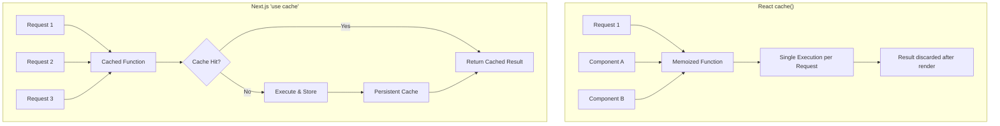
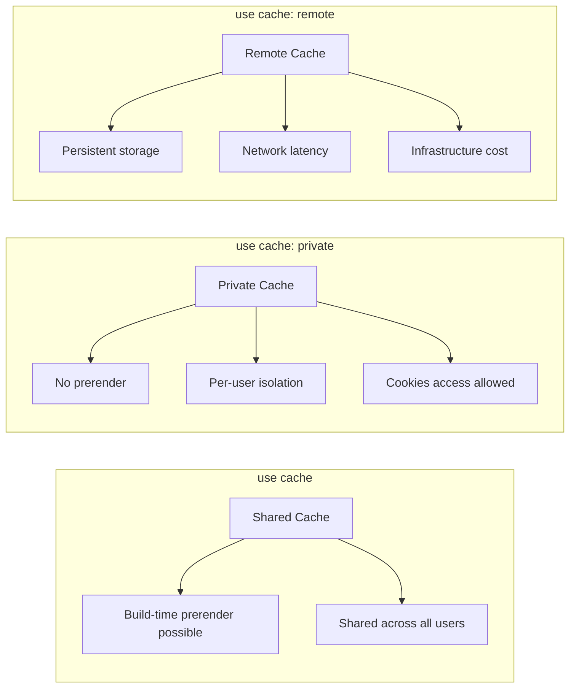
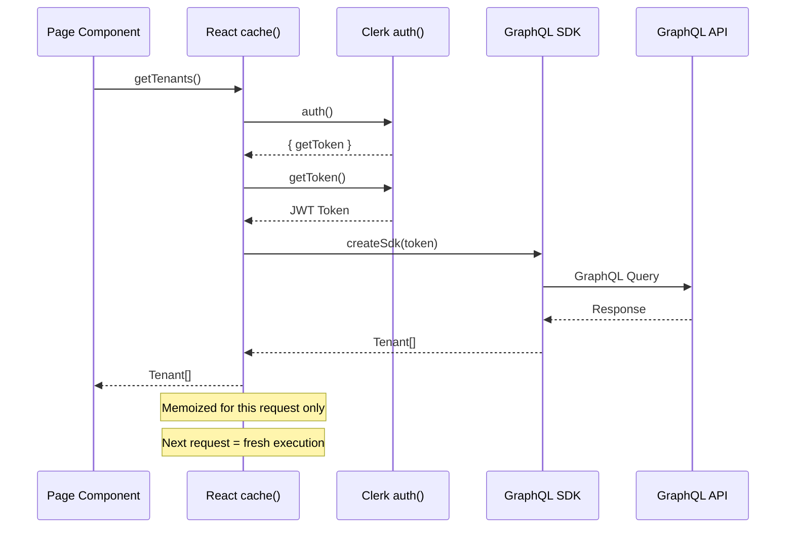
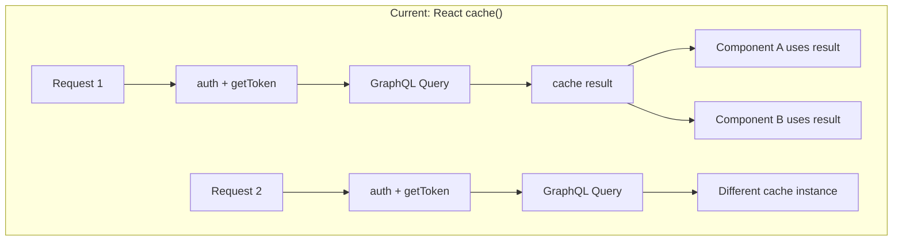
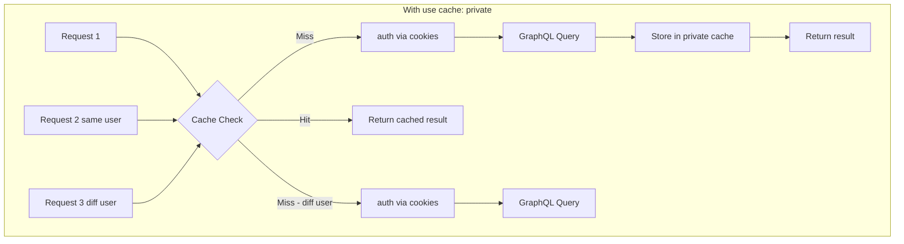

# Next.js 16 "use cache" with JWT Authentication - Research

**Date**: 2025-12-13
**Status**: Research Complete

## Table of Contents

- [Executive Summary](#executive-summary)
- [Technical Deep Dive](#technical-deep-dive)
- [Technology Stack / Ecosystem](#technology-stack--ecosystem)
- [Codebase Analysis](#codebase-analysis)
- [Implementation Feasibility](#implementation-feasibility)
- [Implementation Options](#implementation-options)
- [Comparison Matrix](#comparison-matrix)
- [Implementation Approach](#implementation-approach)
- [Alternatives Considered](#alternatives-considered)
- [Debates & Open Questions](#debates--open-questions)
- [Recommendations](#recommendations)
- [Additional Notes](#additional-notes)
- [Sources](#sources)

## Executive Summary

Next.js 16's `"use cache"` directive provides powerful caching capabilities but has fundamental restrictions when working with authenticated endpoints. The directive cannot directly access runtime APIs like `cookies()` or `headers()`, which means JWT tokens cannot be retrieved inside cached functions. The recommended patterns involve either: (1) using `"use cache: private"` for per-user caching with cookie access, (2) passing user identifiers as arguments to create user-scoped cache keys, or (3) continuing to use React's `cache()` for request-scoped memoization of authenticated calls. For your current implementation with Clerk + GraphQL, the most practical approach is to keep using React's `cache()` for request deduplication and consider `"use cache: private"` for persistent per-user caching when the feature stabilizes.

## Technical Deep Dive

### Overview

Next.js 16 introduces a new explicit caching model centered around the `"use cache"` directive. Unlike previous versions where caching was often implicit and automatic, Next.js 16 makes caching entirely opt-in. All dynamic code executes at request time by default, and developers must explicitly mark what should be cached.

### How "use cache" Works

The `"use cache"` directive is a JavaScript string literal that signals the Next.js compiler to cache the output of a function or component. It can be applied at three levels:

1. **File level** - All exports from the file are cached
2. **Component level** - Just that component's output is cached
3. **Function level** - The function's return value is cached

```typescript
// Function-level caching
async function getData(id: string) {
  'use cache'
  const data = await fetch(`/api/data/${id}`)
  return data.json()
}
```

### Cache Key Generation

Cache keys are automatically generated by the compiler using:

1. **Build ID** - Unique per build, invalidates all entries on new deployment
2. **Function ID** - Secure hash of the function's location and signature
3. **Serializable arguments** - Props for components or function arguments
4. **Closure variables** - Any variables captured from outer scopes

```typescript
async function Component({ userId }: { userId: string }) {
  const getData = async (filter: string) => {
    'use cache'
    // Cache key includes: userId (closure) + filter (argument)
    return fetch(`/api/users/${userId}/data?filter=${filter}`)
  }
  return getData('active')
}
```

### The Core Problem: Runtime API Restrictions

The fundamental challenge is that `"use cache"` cannot directly access:

- `cookies()`
- `headers()`
- `searchParams`

This is by design. The Next.js team explains: "This is not supported because it would make the cache invalidated by every request which is probably not what you intended."

For JWT authentication, this creates a catch-22:

```typescript
// This WILL NOT work
async function getTenants() {
  'use cache'
  const { getToken } = await auth()  // Error: Cannot access cookies()
  const token = await getToken()
  // ...
}
```

### How It Differs from React's cache()



| Feature | React `cache()` | Next.js `"use cache"` |
|---------|----------------|----------------------|
| **Scope** | Single request/render pass | Across multiple requests |
| **Persistence** | Request lifetime only | Persistent with revalidation |
| **Key Generation** | Manual (reference equality) | Automatic (compiler analysis) |
| **Runtime APIs** | Allowed (runs per request) | Not allowed (cached across requests) |
| **Use Case** | Dedupe within one render | Share results across users/requests |

### Cache Directive Variants

Next.js 16 provides three caching directives:

1. **`"use cache"`** - Standard caching, no runtime API access, can be pre-rendered
2. **`"use cache: private"`** - Per-user caching, allows `cookies()` access, not pre-rendered
3. **`"use cache: remote"`** - Remote cache storage (Redis, etc.), network roundtrip required



## Technology Stack / Ecosystem

### Required Dependencies

For `"use cache"` functionality:

```javascript
// next.config.ts
const nextConfig: NextConfig = {
  cacheComponents: true,  // Required for "use cache"
  // Optional for dynamicIO behavior
  experimental: {
    dynamicIO: true,
  },
}
```

### Related APIs

- **`cacheLife()`** - Control cache duration and revalidation
- **`cacheTag()`** - Tag cache entries for selective invalidation
- **`revalidateTag()`** - Invalidate tagged cache entries
- **`updateTag()`** - Invalidate tags within the same request (new in Next.js 16)

### Integration with Clerk

Clerk's `auth()` function internally accesses `cookies()` to read the session. This means:

- `auth()` cannot be called inside `"use cache"` functions
- `getToken()` cannot be called inside `"use cache"` functions
- The `userId` can be extracted outside and passed as an argument

```typescript
// Clerk auth() flow
import { auth } from '@clerk/nextjs/server'

// This accesses cookies internally
const { userId, getToken } = await auth()
```

## Codebase Analysis

### Current Implementation

The project currently uses React's `cache()` for request deduplication:

**`/Users/little/Projects/folder-client-rsc/src/server/tenants/tenants.actions.ts`**

```typescript
export const getTenants = cache(async (): Promise<Tenant[]> => {
  const { getToken } = await auth();
  const token = await getToken();
  if (!token) throw new Error("Authentication required. Please sign in.");

  const sdk = createSdk(token);
  const { folders } = await sdk.GetTenants();
  return folders;
});
```

### Current Architecture Flow



### Key Patterns & Conventions

1. **Server Actions with "use server"** - Data fetching functions are server actions
2. **React cache() wrapper** - Each function is wrapped for request deduplication
3. **Zod validation** - Input validation using schema
4. **Clerk auth()** - Authentication via Clerk's server-side helpers
5. **GraphQL SDK** - Type-safe GraphQL client generation

### Critical Files

1. `/src/server/tenants/tenants.actions.ts` - Current data fetching implementation
2. `/src/lib/graphql/client.ts` - SDK creation with JWT token
3. `/src/app/(auth)/page.tsx` - Page using Suspense boundaries
4. `/next.config.ts` - Would need `cacheComponents: true` for "use cache"

## Implementation Feasibility

### Benefits of "use cache"

- **Automatic cache key generation** - No manual key management
- **Compiler-verified dependencies** - Prevents cache key mistakes
- **Persistent caching** - Results survive across requests
- **Fine-grained control** - `cacheLife()` and `cacheTag()` for precise management
- **Security** - Private cache variant prevents cross-user data leakage

### Trade-offs & Challenges

- **Cannot access cookies/headers directly** - Requires architectural changes
- **JWT token in cache key concerns** - Passing token as argument makes it part of cache key
- **Token expiration** - Cached data becomes invalid when token expires
- **Per-user caching overhead** - Private caches don't benefit from cross-user sharing
- **Experimental status** - `"use cache: private"` is still evolving

### When to Use "use cache"

- Static or semi-static data shared across users
- Data that can be identified by stable keys (not tokens)
- Long-lived cache entries that benefit from persistence
- Components where build-time prerendering is valuable

### When to Avoid "use cache"

- User-specific data that changes frequently
- Data requiring fresh JWT tokens per request
- Real-time or highly volatile data
- When the overhead of cache management exceeds benefits

## Implementation Options

### Option 1: Keep React cache() (Current Approach)

**Description**: Continue using React's `cache()` for request-scoped memoization without persistent caching.

```typescript
// No changes needed - current implementation
export const getTenants = cache(async (): Promise<Tenant[]> => {
  const { getToken } = await auth();
  const token = await getToken();
  if (!token) throw new Error("Authentication required. Please sign in.");

  const sdk = createSdk(token);
  const { folders } = await sdk.GetTenants();
  return folders;
});
```

**Pros**:
- Already implemented and working
- Full access to runtime APIs (cookies, headers)
- No architectural changes needed
- Request deduplication prevents redundant API calls

**Cons**:
- No persistent caching across requests
- Each request re-executes the full fetch
- No cache sharing between users

**Complexity**: Low

**Time Estimate**: Already done

**Reuses Patterns**: Yes

**When to Use**:
- Data changes frequently
- Security is paramount
- Simplicity is preferred

### Option 2: "use cache: private" with userId Scoping

**Description**: Use the private cache directive with user identifier for per-user persistent caching.

```typescript
import { cacheLife, cacheTag } from 'next/cache'
import { cookies } from 'next/headers'

async function getTenants() {
  'use cache: private'
  cacheLife({ stale: 60, revalidate: 300 })
  cacheTag('tenants')

  // cookies() is allowed in private cache
  const sessionId = (await cookies()).get('__session')?.value
  if (!sessionId) throw new Error("Authentication required")

  // Need to verify session and get token via alternative method
  const token = await getTokenFromSession(sessionId)
  const sdk = createSdk(token)
  const { folders } = await sdk.GetTenants()
  return folders
}
```

**Pros**:
- Persistent per-user caching
- Allows cookies() access
- Automatic cache key per user
- Reduces API calls for same user

**Cons**:
- Still experimental
- Cannot access headers() (only cookies)
- Requires session-to-token mapping
- Minimum 30-second cache duration required
- No static prerendering possible

**Complexity**: Medium

**Time Estimate**: 1-2 days

**Reuses Patterns**: Partial

**When to Use**:
- User-specific data with acceptable staleness
- Reducing API load per user is important
- Cookie-based authentication

### Option 3: Hybrid Pattern - Extract User ID, Cache by ID

**Description**: Extract user identifier outside cache, pass as argument to create user-scoped cache entries.

```typescript
import { auth } from '@clerk/nextjs/server'
import { cacheLife, cacheTag } from 'next/cache'

// Cached function - receives userId as argument
async function getCachedTenants(userId: string, token: string) {
  'use cache'
  cacheLife('minutes')
  cacheTag(`tenants-${userId}`)

  const sdk = createSdk(token)
  const { folders } = await sdk.GetTenants()
  return folders
}

// Wrapper that extracts auth info
export async function getTenants(): Promise<Tenant[]> {
  const { userId, getToken } = await auth()
  if (!userId) throw new Error("Authentication required")

  const token = await getToken()
  if (!token) throw new Error("No token available")

  return getCachedTenants(userId, token)
}
```

**Pros**:
- Per-user cache isolation via userId
- Can use standard "use cache" directive
- Token passed as argument (becomes cache key part)
- Works with existing auth pattern

**Cons**:
- Token becomes part of cache key (security consideration)
- Cache invalidated on token refresh (short JWT lifetimes = low hit rate)
- Token in cache key may expose it in logs/debugging
- Two-function pattern adds complexity

**Complexity**: Medium

**Time Estimate**: 1 day

**Reuses Patterns**: Partial

**When to Use**:
- When token lifetime is long enough for cache hits
- When per-user caching is more important than token security
- For non-sensitive data

### Option 4: Separate Data Layer with Server-Side Token

**Description**: Create an internal API layer that authenticates the app (not user) and caches shared data.

```typescript
// Internal API route that handles auth server-side
// app/api/internal/tenants/route.ts
import { auth } from '@clerk/nextjs/server'

export async function GET() {
  const { userId } = await auth()
  if (!userId) return new Response('Unauthorized', { status: 401 })

  // App-level authentication to backend
  const appToken = process.env.APP_SERVICE_TOKEN
  const sdk = createSdk(appToken)
  const { folders } = await sdk.GetTenants()

  // Filter by user permissions
  const userTenants = filterByUserAccess(folders, userId)
  return Response.json(userTenants)
}

// Cached fetch from internal API
async function getTenants() {
  'use cache'
  cacheLife('hours')
  cacheTag('tenants')

  const res = await fetch('/api/internal/tenants')
  return res.json()
}
```

**Pros**:
- True shared caching (not per-user)
- No token in cache key
- Clear separation of concerns
- Can use aggressive caching

**Cons**:
- Requires backend changes (app-level auth)
- Additional network hop
- Permission filtering moves to Next.js layer
- More infrastructure complexity

**Complexity**: High

**Time Estimate**: 1-2 weeks

**Reuses Patterns**: No

**When to Use**:
- Data is truly shared across users
- Backend supports app-level authentication
- Reducing backend load is critical

## Comparison Matrix

| Criteria | Option 1: React cache() | Option 2: use cache: private | Option 3: Hybrid userId | Option 4: Data Layer |
|----------|------------------------|------------------------------|------------------------|---------------------|
| Complexity | Low | Medium | Medium | High |
| Implementation Time | Done | 1-2 days | 1 day | 1-2 weeks |
| Persistent Cache | No | Yes (per-user) | Yes (per-user) | Yes (shared) |
| Cross-User Sharing | No | No | No | Yes |
| Token Security | Best | Good | Concern | Best |
| Runtime API Access | Full | Cookies only | None in cache | N/A |
| Cache Hit Rate | N/A | Medium | Low (token expiry) | High |
| Reuses Patterns | Yes | Partial | Partial | No |
| Production Ready | Yes | Experimental | Experimental | Yes |

## Implementation Approach

### Recommended: Phased Adoption

Given the experimental status of `"use cache"` features and your current working implementation, a phased approach is recommended:

#### Phase 1: Keep Current Implementation (Now)

Continue using React's `cache()` for request deduplication. This provides:
- Immediate deduplication within a single render
- Full access to Clerk's auth APIs
- No risk from experimental features

```typescript
// Current - no changes
export const getTenants = cache(async (): Promise<Tenant[]> => {
  const { getToken } = await auth();
  const token = await getToken();
  // ...
});
```

#### Phase 2: Enable cacheComponents (When Ready)

When you want to experiment with `"use cache"`:

```typescript
// next.config.ts
const nextConfig: NextConfig = {
  reactCompiler: true,
  cacheComponents: true,  // Enable "use cache" support
}
```

#### Phase 3: Add "use cache" to Non-Auth Functions

Start with functions that don't require authentication:

```typescript
async function getPublicConfig() {
  'use cache'
  cacheLife('days')
  return fetch('/api/config').then(r => r.json())
}
```

#### Phase 4: Evaluate "use cache: private" (Future)

When the feature stabilizes, consider for user-specific cached data:

```typescript
async function getUserPreferences() {
  'use cache: private'
  cacheLife({ stale: 60 })
  const session = await cookies()
  // ...
}
```

### Best Practices

1. **Always validate in wrapper functions**
   ```typescript
   export async function getTenants() {
     const { userId } = await auth()
     if (!userId) throw new Error("Auth required")
     return getCachedTenants(userId)
   }
   ```

2. **Use cacheTag for invalidation**
   ```typescript
   async function getCachedTenants(userId: string) {
     'use cache'
     cacheTag(`user-${userId}`, 'tenants')
     // ...
   }

   // In mutation
   export async function updateTenant() {
     await db.update(...)
     revalidateTag('tenants')
   }
   ```

3. **Set appropriate cache lifetimes**
   ```typescript
   cacheLife({
     stale: 60,      // Serve stale for 60s
     revalidate: 300, // Revalidate every 5 min
     expire: 3600    // Hard expire at 1 hour
   })
   ```

4. **Never pass sensitive data as cache arguments**
   - User IDs: OK (stable, non-sensitive)
   - JWT tokens: Avoid (sensitive, expires)
   - Passwords/secrets: Never

### Common Pitfalls

1. **Trying to access cookies() in "use cache"**
   - Error: "Cannot access request-specific data"
   - Solution: Use "use cache: private" or pass data as arguments

2. **Token expiration causing cache misses**
   - JWTs typically expire in minutes
   - If token is in cache key, each expiry = cache miss
   - Solution: Use userId instead of token in cache key

3. **Forgetting cache invalidation**
   - Cached data becomes stale after mutations
   - Solution: Always call revalidateTag() after data changes

4. **Over-caching user-specific data**
   - Caching per-user data doesn't reduce backend load much
   - Solution: Only cache data that's truly reusable

## Alternatives Considered

### Alternative 1: unstable_cache

- Previous approach before "use cache"
- Still works but deprecated in favor of "use cache"
- Requires manual cache key specification
- Will be replaced when "use cache" stabilizes

### Alternative 2: In-Memory LRU Cache (node-cache)

- Simple key-value caching in Node.js memory
- Works with authenticated data
- Lost on server restart
- Good for short-lived memoization

### Alternative 3: External Cache (Redis)

- Persistent cache outside Next.js
- Works with any authentication pattern
- Requires additional infrastructure
- Consider "use cache: remote" instead when stable

### Alternative 4: SWR/React Query on Client

- Client-side caching and revalidation
- Works well for user-specific data
- Shifts load to client
- Not applicable for RSC-first architecture

## Debates & Open Questions

### Open GitHub Discussions

1. **Cookies/Headers in "use cache"** - Community requests allowing these, but Next.js team maintains it would defeat caching purpose. `"use cache: private"` is the answer, but doesn't support headers yet.

2. **Token Security in Cache Keys** - Passing JWT tokens as arguments makes them part of cache keys. The security implications are debated - tokens could appear in logs or debugging tools.

3. **Multi-Tenant Caching** - Using dynamic params (like tenant ID from URL) with "use cache" is challenging. `generateStaticParams` can help but requires knowing all tenants at build time.

4. **Cache Hit Rate with Short-Lived JWTs** - If tokens expire frequently and are part of cache keys, hit rates will be very low. No official guidance on optimal patterns for this scenario.

### Unresolved Questions

- Will `"use cache: private"` support `headers()` in the future?
- How should tenant-scoped data be cached in multi-tenant apps?
- What's the recommended pattern for GraphQL with authenticated caching?
- How does "use cache" interact with Apollo Client's normalized cache?

## Recommendations

### Preferred Approach: Keep React cache() + Prepare for Private Cache

**Should This Be Implemented?**: Not now - wait for feature stabilization

**Rationale**:

1. **Current implementation works** - React `cache()` provides request deduplication
2. **"use cache: private" is experimental** - Known issues with client navigation
3. **JWT in cache key is problematic** - Short token lifetimes = poor hit rates
4. **Clerk integration untested** - No official patterns for Clerk + "use cache"

**Recommended Actions**:

1. **Keep current implementation** - React `cache()` is sufficient for now
2. **Enable cacheComponents flag** - Prepare for future adoption
3. **Add "use cache" to non-auth functions** - Test with static/public data
4. **Monitor "use cache: private" development** - Adopt when stable

**Why**:

- Risk/reward ratio favors waiting
- Current architecture is sound
- Experimental features have known bugs
- No urgent performance need identified

**Key Considerations**:

- React `cache()` still provides value (request deduplication)
- GraphQL client doesn't auto-memoize like fetch
- Authentication adds inherent dynamism
- Per-user caching has limited benefit without cross-user sharing

**Potential Challenges**:

1. **Feature API changes** - `"use cache: private"` API may change
   - Mitigation: Keep implementation behind feature flag

2. **Performance debugging** - Understanding cache behavior is complex
   - Mitigation: Add logging/metrics before full rollout

**Success Criteria**:

- Cache hit rate > 50% for targeted functions
- No security incidents from cached auth data
- Measurable reduction in GraphQL API calls
- No increase in user-reported stale data issues

## Additional Notes

### Current Behavior Summary

Your current implementation with React `cache()`:



### What "use cache: private" Would Provide



### Clerk-Specific Considerations

1. **JWKS Caching** - Clerk caches JWKS keys, so token verification is 1-2ms after warm-up
2. **Session Token vs Custom JWT** - `getToken()` can return custom templates; consider which to use
3. **`userId` vs `sessionId`** - `userId` is stable across sessions; better for cache keys
4. **Auth object is async** - `await auth()` must be called outside cached functions

### GraphQL-Specific Considerations

1. **graphql-request doesn't auto-memoize** - Unlike fetch, no built-in deduplication
2. **Apollo Client has its own cache** - If using Apollo, consider its normalized cache
3. **Request-scoped SDK** - Current `createSdk(token)` creates new instance per call
4. **Consider DataLoader pattern** - For batching multiple GraphQL queries

## Sources

1. [Next.js "use cache" Directive Documentation](https://nextjs.org/docs/app/api-reference/directives/use-cache)
2. [Next.js "use cache: private" Documentation](https://nextjs.org/docs/app/api-reference/directives/use-cache-private)
3. [Next.js Cache Components Guide](https://nextjs.org/docs/app/getting-started/cache-components)
4. [Next.js cacheLife Function](https://nextjs.org/docs/app/api-reference/functions/cacheLife)
5. [Next.js cacheTag Function](https://nextjs.org/docs/app/api-reference/functions/cacheTag)
6. [Next.js Composable Caching Blog Post](https://nextjs.org/blog/composable-caching)
7. [Next.js Our Journey with Caching](https://nextjs.org/blog/our-journey-with-caching)
8. [Next.js 16 Release Blog](https://nextjs.org/blog/next-16)
9. [GitHub Discussion: Cache fetch with Authorization headers](https://github.com/vercel/next.js/discussions/51279)
10. [GitHub Discussion: Allow cookies/headers in "use cache"](https://github.com/vercel/next.js/discussions/82873)
11. [GitHub Discussion: Cache Components with params and Multi-Tenant](https://github.com/vercel/next.js/discussions/85239)
12. [GitHub Discussion: Having cache() semantics parallel to "use cache"](https://github.com/vercel/next.js/discussions/75834)
13. [Clerk auth() Documentation](https://clerk.com/docs/references/nextjs/auth)
14. [Clerk getToken() Documentation](https://clerk.com/docs/references/backend/sessions/get-token)
15. [Clerk Complete Authentication Guide for Next.js App Router 2025](https://clerk.com/articles/complete-authentication-guide-for-nextjs-app-router)
16. [Auth0: What's New in Next.js 16 for Authentication](https://auth0.com/blog/whats-new-nextjs-16/)
17. [Mastering Next.js 15 Caching: dynamicIO and "use cache"](https://strapi.io/blog/mastering-nextjs-15-caching-dynamic-io-and-the-use-cache)
18. [React cache() API Documentation](https://react.dev/reference/react/cache)
19. [Apollo Client with Next.js 13+](https://www.apollographql.com/blog/using-apollo-client-with-next-js-13-releasing-an-official-library-to-support-the-app-router)
20. [InfoQ: Next.js 16 Release Analysis](https://www.infoq.com/news/2025/12/nextjs-16-release/)
