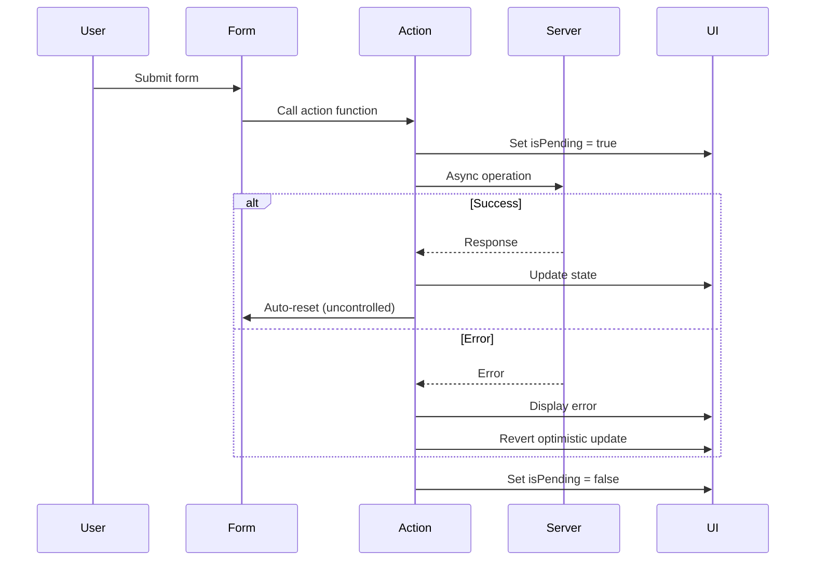
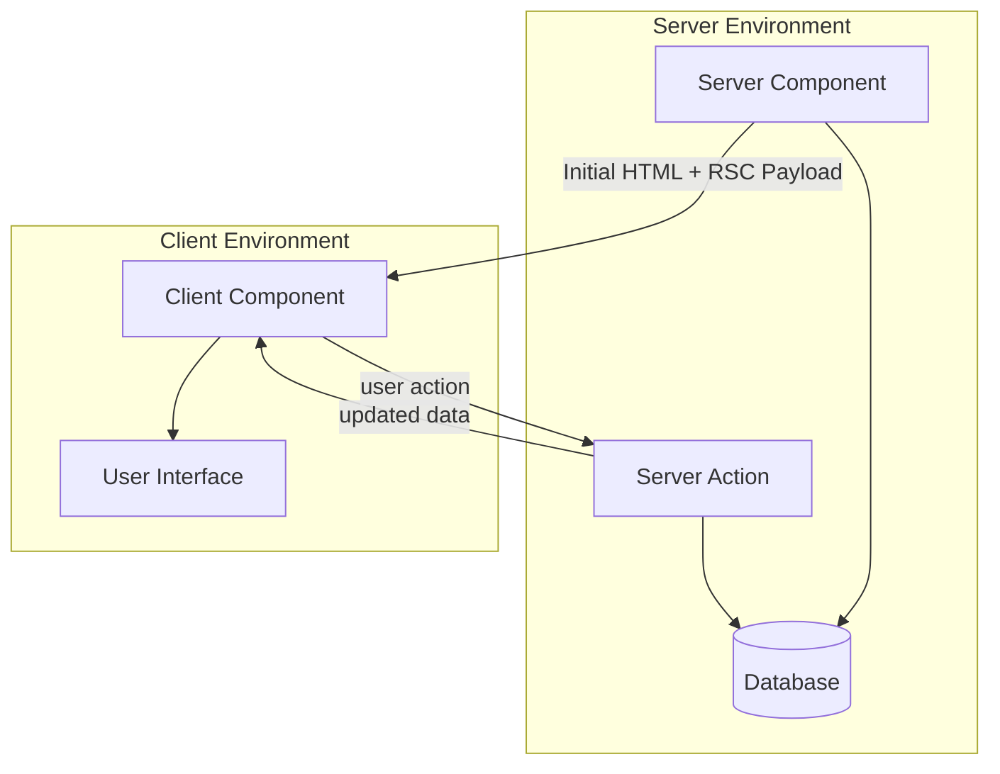
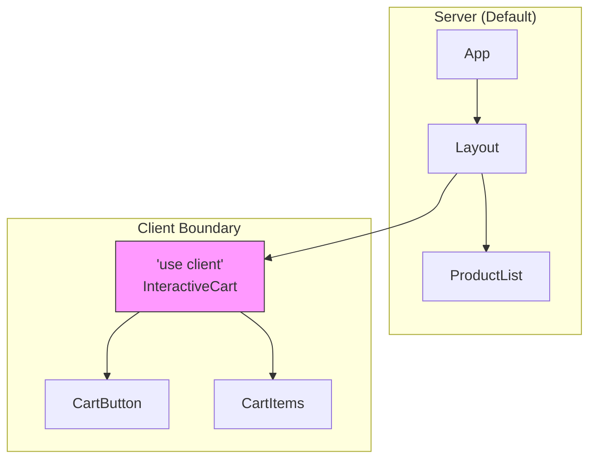
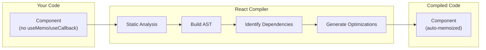
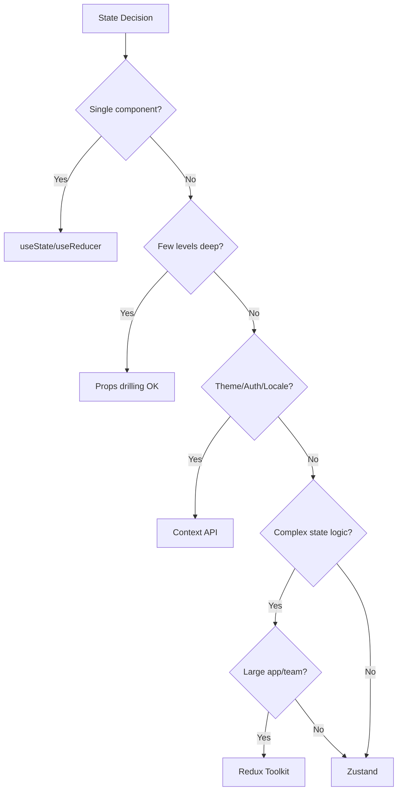
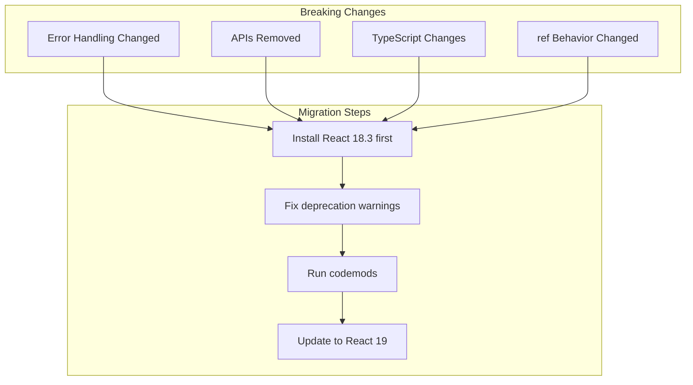

# React 19 Best Practices and Anti-Patterns - Research

**Date**: 2025-12-19
**Status**: Research Complete

## Table of Contents

- [Executive Summary](#executive-summary)
- [React 19 New Features and Patterns](#react-19-new-features-and-patterns)
  - [Actions and Form Handling](#actions-and-form-handling)
  - [New Hooks](#new-hooks)
  - [Server Components and Server Functions](#server-components-and-server-functions)
  - [React Compiler](#react-compiler)
  - [ref as a Prop](#ref-as-a-prop)
  - [Document Metadata](#document-metadata)
  - [Other Improvements](#other-improvements)
- [General React Best Practices](#general-react-best-practices)
  - [Component Design Patterns](#component-design-patterns)
  - [State Management Guidelines](#state-management-guidelines)
  - [Hooks Best Practices](#hooks-best-practices)
  - [Performance Optimization](#performance-optimization)
- [Comprehensive Anti-Patterns Section](#comprehensive-anti-patterns-section)
  - [useEffect Anti-Patterns](#useeffect-anti-patterns)
  - [State Management Anti-Patterns](#state-management-anti-patterns)
  - [Performance Anti-Patterns](#performance-anti-patterns)
  - [Key Prop Anti-Patterns](#key-prop-anti-patterns)
  - [Context API Anti-Patterns](#context-api-anti-patterns)
  - [Memoization Anti-Patterns](#memoization-anti-patterns)
  - [Memory Leak Anti-Patterns](#memory-leak-anti-patterns)
  - [Stale Closure Anti-Patterns](#stale-closure-anti-patterns)
  - [Component Structure Anti-Patterns](#component-structure-anti-patterns)
  - [Event Handler Anti-Patterns](#event-handler-anti-patterns)
  - [Error Boundary Anti-Patterns](#error-boundary-anti-patterns)
  - [Patterns Made Obsolete by React 19](#patterns-made-obsolete-by-react-19)
- [Migration Guide from React 18](#migration-guide-from-react-18)
  - [Breaking Changes](#breaking-changes)
  - [Removed APIs](#removed-apis)
  - [TypeScript Changes](#typescript-changes)
  - [Migration Steps](#migration-steps)
- [Quick Reference Checklists](#quick-reference-checklists)
- [Sources](#sources)

---

## Executive Summary

React 19, released in December 2024, introduces significant improvements including Actions for simplified async operations, new hooks (`useActionState`, `useFormStatus`, `useOptimistic`, `use`), Server Components stability, and the React Compiler for automatic optimizations. This research provides comprehensive guidance on best practices and, critically, documents extensive anti-patterns that developers must avoid. The anti-patterns section is the most detailed, covering everything from useEffect misuse to stale closures, with specific code examples showing what NOT to do and the correct alternatives.

---

## React 19 New Features and Patterns

### Actions and Form Handling

React 19 introduces "Actions" - async functions in transitions that automatically handle pending states, errors, forms, and optimistic updates.

#### How Actions Work



#### Form Actions Example

```jsx
// React 19 - Forms with Actions
function UpdateNameForm() {
  const [error, submitAction, isPending] = useActionState(
    async (previousState, formData) => {
      const error = await updateName(formData.get("name"));
      if (error) return error;
      redirect("/profile");
      return null;
    },
    null
  );

  return (
    <form action={submitAction}>
      <input type="text" name="name" />
      {error && <p className="error">{error}</p>}
      <button type="submit" disabled={isPending}>
        {isPending ? "Updating..." : "Update"}
      </button>
    </form>
  );
}
```

**Key Benefits:**
- Automatic pending state management
- Built-in error handling
- Automatic form reset for uncontrolled components
- No need for `event.preventDefault()` when passing functions

### New Hooks

#### useActionState

Manages state for form actions, replacing the previous `useFormState`.

```jsx
const [state, formAction, isPending] = useActionState(
  async (prevState, formData) => {
    // Process form data
    return newState;
  },
  initialState
);
```

**Returns:**
- `state`: Current state value
- `formAction`: Action to pass to form's `action` prop
- `isPending`: Whether the action is in progress

#### useFormStatus

Access form submission status without prop drilling.

```jsx
function SubmitButton() {
  const { pending, data, method, action } = useFormStatus();

  return (
    <button type="submit" disabled={pending}>
      {pending ? "Submitting..." : "Submit"}
    </button>
  );
}
```

**Must be used inside a `<form>` element** - reads status from parent form.

#### useOptimistic

Show optimistic updates while async operations complete.

```jsx
function MessageList({ messages, sendMessage }) {
  const [optimisticMessages, addOptimisticMessage] = useOptimistic(
    messages,
    (state, newMessage) => [...state, { ...newMessage, sending: true }]
  );

  async function handleSend(formData) {
    const message = formData.get("message");
    addOptimisticMessage({ text: message, id: Date.now() });
    await sendMessage(message);
  }

  return (
    <>
      {optimisticMessages.map((msg) => (
        <Message key={msg.id} message={msg} />
      ))}
      <form action={handleSend}>
        <input name="message" />
        <button type="submit">Send</button>
      </form>
    </>
  );
}
```

#### use() API

Read resources (promises and context) in render. Unlike hooks, can be called conditionally.

```jsx
// Reading a promise
function Comments({ commentsPromise }) {
  const comments = use(commentsPromise); // Suspends until resolved
  return comments.map((c) => <Comment key={c.id} comment={c} />);
}

// Reading context conditionally
function Theme({ showTheme }) {
  if (showTheme) {
    const theme = use(ThemeContext);
    return <div className={theme}>...</div>;
  }
  return null;
}
```

### Server Components and Server Functions

React 19 stabilizes Server Components for production use.



#### Server Components

```jsx
// No 'use client' directive - runs on server
async function ProductList() {
  const products = await db.query("SELECT * FROM products");

  return (
    <ul>
      {products.map((product) => (
        <li key={product.id}>{product.name}</li>
      ))}
    </ul>
  );
}
```

#### Server Actions

```jsx
// actions.ts
"use server";

export async function createTodo(formData: FormData) {
  const title = formData.get("title");
  await db.insert({ title });
  revalidatePath("/todos");
}
```

```jsx
// Client Component using Server Action
"use client";

import { createTodo } from "./actions";

function TodoForm() {
  return (
    <form action={createTodo}>
      <input name="title" />
      <button type="submit">Add Todo</button>
    </form>
  );
}
```

#### Client Boundaries



**Key Insight:** When you add `'use client'`, you create a "client boundary". All components within that boundary become Client Components implicitly.

### React Compiler

The React Compiler (formerly "React Forget") automatically optimizes React applications by adding memoization.



#### What the Compiler Does

1. **Analyzes** your component code and builds an AST
2. **Identifies** variables used during rendering
3. **Builds** a graph of relationships between them
4. **Generates** memoization blocks automatically

```jsx
// Your code
function ProductCard({ product, onAddToCart }) {
  const discountedPrice = product.price * 0.9;

  return (
    <div>
      <h2>{product.name}</h2>
      <p>${discountedPrice}</p>
      <button onClick={() => onAddToCart(product)}>Add</button>
    </div>
  );
}

// Compiler automatically adds memoization similar to:
// useMemo for discountedPrice, useCallback for onClick handler
```

#### What the Compiler Does NOT Replace

- Proper state architecture
- Virtualization for long lists
- Suspense/streaming patterns
- Network optimization
- Code splitting

### ref as a Prop

React 19 eliminates the need for `forwardRef`.

```jsx
// Before React 19
const MyInput = forwardRef((props, ref) => (
  <input ref={ref} {...props} />
));

// React 19
function MyInput({ ref, ...props }) {
  return <input ref={ref} {...props} />;
}
```

#### Ref Cleanup Functions

React 19 allows returning cleanup functions from ref callbacks:

```jsx
<input
  ref={(node) => {
    // Setup
    node?.focus();

    // Return cleanup function
    return () => {
      // Cleanup when unmounting
    };
  }}
/>
```

### Document Metadata

Native support for `<title>`, `<meta>`, and `<link>` tags in components.

```jsx
function BlogPost({ post }) {
  return (
    <article>
      <title>{post.title}</title>
      <meta name="description" content={post.excerpt} />
      <meta name="keywords" content={post.tags.join(", ")} />
      <link rel="canonical" href={post.url} />

      <h1>{post.title}</h1>
      <p>{post.content}</p>
    </article>
  );
}
```

**Key Benefits:**
- Automatic hoisting to `<head>`
- Works with SSR and Server Components
- No need for `react-helmet` for simple cases

### Other Improvements

#### Context as Provider

```jsx
// Before
<ThemeContext.Provider value="dark">
  {children}
</ThemeContext.Provider>

// React 19
<ThemeContext value="dark">
  {children}
</ThemeContext>
```

#### useDeferredValue with initialValue

```jsx
const deferredSearch = useDeferredValue(searchQuery, ""); // "" is initial
```

#### Stylesheet Management

```jsx
<link rel="stylesheet" href="styles.css" precedence="default" />
<link rel="stylesheet" href="theme.css" precedence="high" />
```

#### Improved Error Handling

```jsx
createRoot(container, {
  onCaughtError: (error, errorInfo) => {
    // Errors caught by Error Boundaries
  },
  onUncaughtError: (error, errorInfo) => {
    // Errors not caught by Error Boundaries
  },
  onRecoverableError: (error) => {
    // Hydration mismatches, etc.
  },
});
```

---

## General React Best Practices

### Component Design Patterns

#### 1. Function Components as Default

Function components are the standard for modern React development.

```jsx
// Preferred
function UserProfile({ user }) {
  return (
    <div>
      <h1>{user.name}</h1>
      <p>{user.email}</p>
    </div>
  );
}
```

#### 2. Compound Components Pattern

For complex, related components that share state:

```jsx
function Accordion({ children }) {
  const [activeIndex, setActiveIndex] = useState(null);

  return (
    <AccordionContext.Provider value={{ activeIndex, setActiveIndex }}>
      {children}
    </AccordionContext.Provider>
  );
}

function AccordionItem({ index, title, children }) {
  const { activeIndex, setActiveIndex } = useContext(AccordionContext);
  const isOpen = activeIndex === index;

  return (
    <div>
      <button onClick={() => setActiveIndex(isOpen ? null : index)}>
        {title}
      </button>
      {isOpen && <div>{children}</div>}
    </div>
  );
}

// Usage
<Accordion>
  <AccordionItem index={0} title="Section 1">Content 1</AccordionItem>
  <AccordionItem index={1} title="Section 2">Content 2</AccordionItem>
</Accordion>
```

#### 3. Custom Hooks for Reusable Logic

```jsx
function useLocalStorage(key, initialValue) {
  const [storedValue, setStoredValue] = useState(() => {
    try {
      const item = window.localStorage.getItem(key);
      return item ? JSON.parse(item) : initialValue;
    } catch (error) {
      return initialValue;
    }
  });

  const setValue = (value) => {
    try {
      setStoredValue(value);
      window.localStorage.setItem(key, JSON.stringify(value));
    } catch (error) {
      console.error(error);
    }
  };

  return [storedValue, setValue];
}
```

#### 4. Container/Presentational Pattern

Separate data logic from UI rendering:

```jsx
// Container - handles data
function UserListContainer() {
  const { data: users, isLoading } = useQuery("users", fetchUsers);

  if (isLoading) return <Loading />;
  return <UserList users={users} />;
}

// Presentational - pure UI
function UserList({ users }) {
  return (
    <ul>
      {users.map((user) => (
        <li key={user.id}>{user.name}</li>
      ))}
    </ul>
  );
}
```

### State Management Guidelines



#### When to Use What

| Solution | Use Case |
|----------|----------|
| `useState` | Simple, component-local state |
| `useReducer` | Complex state with multiple sub-values |
| Context API | Theme, auth, locale - rarely changing global values |
| Zustand | Medium apps, simple global state, prototypes |
| Redux Toolkit | Large apps, complex state, strict patterns needed |

#### Best Practices

1. **Keep state local** - Only lift state when truly needed
2. **Derive don't store** - Calculate values from existing state rather than storing them
3. **Single source of truth** - Avoid duplicating state across components

### Hooks Best Practices

#### Rules of Hooks

1. Only call hooks at the top level (not in loops, conditions, or nested functions)
2. Only call hooks from React functions (components or custom hooks)

#### useState Best Practices

```jsx
// Use functional updates when new state depends on old
setCount((prev) => prev + 1);

// Initialize expensive state lazily
const [data, setData] = useState(() => computeExpensiveValue());
```

#### useEffect Best Practices

```jsx
// Single responsibility - separate concerns into different effects
useEffect(() => {
  // Subscription logic
  return () => cleanup();
}, [dependency]);

useEffect(() => {
  // Different concern
}, [otherDependency]);

// Always include all dependencies
// Use ESLint plugin to catch missing ones
```

### Performance Optimization

#### 1. List Virtualization

For long lists, only render visible items:

```jsx
import { FixedSizeList } from "react-window";

function VirtualizedList({ items }) {
  return (
    <FixedSizeList
      height={400}
      itemCount={items.length}
      itemSize={35}
      width="100%"
    >
      {({ index, style }) => (
        <div style={style}>{items[index].name}</div>
      )}
    </FixedSizeList>
  );
}
```

#### 2. Code Splitting

```jsx
const HeavyComponent = lazy(() => import("./HeavyComponent"));

function App() {
  return (
    <Suspense fallback={<Loading />}>
      <HeavyComponent />
    </Suspense>
  );
}
```

#### 3. Debounce/Throttle Expensive Operations

```jsx
function SearchInput() {
  const [query, setQuery] = useState("");
  const debouncedQuery = useDeferredValue(query);

  // Use debouncedQuery for expensive operations
  const results = useMemo(
    () => searchItems(debouncedQuery),
    [debouncedQuery]
  );

  return <input value={query} onChange={(e) => setQuery(e.target.value)} />;
}
```

---

## Comprehensive Anti-Patterns Section

### useEffect Anti-Patterns

This is the most critical section. Many React bugs stem from useEffect misuse.

#### Anti-Pattern 1: Using useEffect for Derived State

**The Problem:** Extra render cycles and unnecessary complexity.

```jsx
// BAD - Causes double render
function UserGreeting({ firstName, lastName }) {
  const [fullName, setFullName] = useState("");

  useEffect(() => {
    setFullName(`${firstName} ${lastName}`);
  }, [firstName, lastName]);

  return <h1>Hello, {fullName}</h1>;
}

// GOOD - Calculate during render
function UserGreeting({ firstName, lastName }) {
  const fullName = `${firstName} ${lastName}`;
  return <h1>Hello, {fullName}</h1>;
}
```

#### Anti-Pattern 2: Caching with useEffect Instead of useMemo

```jsx
// BAD
function TodoList({ todos, filter }) {
  const [filteredTodos, setFilteredTodos] = useState([]);

  useEffect(() => {
    setFilteredTodos(todos.filter((t) => t.status === filter));
  }, [todos, filter]);

  return filteredTodos.map((todo) => <Todo key={todo.id} todo={todo} />);
}

// GOOD
function TodoList({ todos, filter }) {
  const filteredTodos = useMemo(
    () => todos.filter((t) => t.status === filter),
    [todos, filter]
  );

  return filteredTodos.map((todo) => <Todo key={todo.id} todo={todo} />);
}
```

#### Anti-Pattern 3: Event Logic in useEffect

```jsx
// BAD - Logic runs on every product change, not just purchases
function ProductPage({ product, addToCart }) {
  useEffect(() => {
    if (product.isInCart) {
      showNotification(`Added ${product.name} to cart!`);
    }
  }, [product]);

  return <button onClick={() => addToCart(product)}>Add to Cart</button>;
}

// GOOD - Logic in event handler
function ProductPage({ product, addToCart }) {
  function handleAddToCart() {
    addToCart(product);
    showNotification(`Added ${product.name} to cart!`);
  }

  return <button onClick={handleAddToCart}>Add to Cart</button>;
}
```

#### Anti-Pattern 4: Resetting State with useEffect

```jsx
// BAD - Extra render after mount
function ProfilePage({ userId }) {
  const [comment, setComment] = useState("");

  useEffect(() => {
    setComment("");
  }, [userId]);

  return <textarea value={comment} onChange={(e) => setComment(e.target.value)} />;
}

// GOOD - Use key to reset component
function ProfilePageWrapper({ userId }) {
  return <ProfilePage key={userId} userId={userId} />;
}

function ProfilePage({ userId }) {
  const [comment, setComment] = useState("");
  return <textarea value={comment} onChange={(e) => setComment(e.target.value)} />;
}
```

#### Anti-Pattern 5: Effect Chains (Waterfalls)

```jsx
// BAD - Multiple sequential renders
function Game() {
  const [card, setCard] = useState(null);
  const [goldCount, setGoldCount] = useState(0);
  const [round, setRound] = useState(1);

  useEffect(() => {
    if (card?.isGold) {
      setGoldCount((c) => c + 1);
    }
  }, [card]);

  useEffect(() => {
    if (goldCount >= 3) {
      setRound((r) => r + 1);
      setGoldCount(0);
    }
  }, [goldCount]);

  // This creates: render -> effect 1 -> render -> effect 2 -> render
}

// GOOD - All logic in event handler
function Game() {
  const [card, setCard] = useState(null);
  const [goldCount, setGoldCount] = useState(0);
  const [round, setRound] = useState(1);

  function handlePlayCard(newCard) {
    setCard(newCard);

    if (newCard.isGold) {
      if (goldCount >= 2) {
        setGoldCount(0);
        setRound((r) => r + 1);
      } else {
        setGoldCount((c) => c + 1);
      }
    }
  }
}
```

#### Anti-Pattern 6: Notifying Parent from useEffect

```jsx
// BAD - Double update cycle
function Toggle({ onChange }) {
  const [isOn, setIsOn] = useState(false);

  useEffect(() => {
    onChange(isOn);
  }, [isOn, onChange]);

  return <button onClick={() => setIsOn(!isOn)}>{isOn ? "On" : "Off"}</button>;
}

// GOOD - Update both in event handler
function Toggle({ onChange }) {
  const [isOn, setIsOn] = useState(false);

  function handleToggle() {
    const newValue = !isOn;
    setIsOn(newValue);
    onChange(newValue);
  }

  return <button onClick={handleToggle}>{isOn ? "On" : "Off"}</button>;
}

// BEST - Fully controlled component
function Toggle({ isOn, onChange }) {
  return <button onClick={() => onChange(!isOn)}>{isOn ? "On" : "Off"}</button>;
}
```

#### Anti-Pattern 7: Missing Cleanup

```jsx
// BAD - Memory leak
useEffect(() => {
  const interval = setInterval(() => {
    setCount((c) => c + 1);
  }, 1000);
  // No cleanup!
}, []);

// GOOD
useEffect(() => {
  const interval = setInterval(() => {
    setCount((c) => c + 1);
  }, 1000);

  return () => clearInterval(interval);
}, []);
```

#### Anti-Pattern 8: Async Without Cleanup

```jsx
// BAD - State update on unmounted component
useEffect(() => {
  async function fetchData() {
    const response = await fetch(`/api/user/${userId}`);
    const data = await response.json();
    setUser(data); // May run after unmount!
  }
  fetchData();
}, [userId]);

// GOOD - With AbortController
useEffect(() => {
  const controller = new AbortController();

  async function fetchData() {
    try {
      const response = await fetch(`/api/user/${userId}`, {
        signal: controller.signal,
      });
      const data = await response.json();
      setUser(data);
    } catch (error) {
      if (error.name !== "AbortError") {
        setError(error);
      }
    }
  }

  fetchData();

  return () => controller.abort();
}, [userId]);
```

#### Anti-Pattern 9: Empty Dependency Array When Dependencies Exist

```jsx
// BAD - Stale closure
function Counter({ step }) {
  const [count, setCount] = useState(0);

  useEffect(() => {
    const interval = setInterval(() => {
      setCount((c) => c + step); // `step` is stale!
    }, 1000);
    return () => clearInterval(interval);
  }, []); // Missing `step`
}

// GOOD
useEffect(() => {
  const interval = setInterval(() => {
    setCount((c) => c + step);
  }, 1000);
  return () => clearInterval(interval);
}, [step]);
```

### State Management Anti-Patterns

#### Anti-Pattern 1: Mutating State Directly

```jsx
// BAD - React won't detect changes
function TodoList() {
  const [todos, setTodos] = useState([{ id: 1, text: "Learn React" }]);

  function addTodo(text) {
    todos.push({ id: Date.now(), text }); // Mutation!
    setTodos(todos);
  }
}

// GOOD - Create new array
function TodoList() {
  const [todos, setTodos] = useState([{ id: 1, text: "Learn React" }]);

  function addTodo(text) {
    setTodos([...todos, { id: Date.now(), text }]);
  }
}
```

#### Anti-Pattern 2: Using Variables Instead of State

```jsx
// BAD - Variable resets on every render
function Counter() {
  let count = 0; // Will always be 0!

  return <button onClick={() => count++}>{count}</button>;
}

// GOOD
function Counter() {
  const [count, setCount] = useState(0);

  return <button onClick={() => setCount(count + 1)}>{count}</button>;
}
```

#### Anti-Pattern 3: Derived State as Separate State

```jsx
// BAD - Two sources of truth
function ProductList({ products }) {
  const [items, setItems] = useState(products);
  const [total, setTotal] = useState(0);

  useEffect(() => {
    setTotal(items.reduce((sum, item) => sum + item.price, 0));
  }, [items]);
}

// GOOD - Derive total during render
function ProductList({ products }) {
  const [items, setItems] = useState(products);
  const total = items.reduce((sum, item) => sum + item.price, 0);
}
```

#### Anti-Pattern 4: Storing Props in State

```jsx
// BAD - State becomes stale when props change
function UserProfile({ user }) {
  const [userData, setUserData] = useState(user);

  // If parent passes new user, userData is still old!
}

// GOOD - Use props directly, or sync with key
function UserProfile({ user }) {
  // Use user directly, or if you need local modifications:
  return <UserProfileInner key={user.id} initialUser={user} />;
}
```

### Performance Anti-Patterns

#### Anti-Pattern 1: Creating Components Inside Render

**This is one of the worst performance killers.**

```jsx
// BAD - Component remounts on every render
function ParentComponent() {
  // New component definition on every render!
  function ChildComponent() {
    const [count, setCount] = useState(0);
    return <button onClick={() => setCount(count + 1)}>{count}</button>;
  }

  return <ChildComponent />;
}

// GOOD - Define components outside
function ChildComponent() {
  const [count, setCount] = useState(0);
  return <button onClick={() => setCount(count + 1)}>{count}</button>;
}

function ParentComponent() {
  return <ChildComponent />;
}
```

**Why it's bad:**
- Component remounts completely on every parent render
- All state is lost
- All effects run again
- Massive performance impact

#### Anti-Pattern 2: Object/Array Literals in Props

```jsx
// BAD - New object on every render
function Parent() {
  return <Child style={{ color: "red" }} items={[1, 2, 3]} />;
}

// GOOD - Stable references
const style = { color: "red" };
const items = [1, 2, 3];

function Parent() {
  return <Child style={style} items={items} />;
}

// OR with useMemo if values depend on state
function Parent({ color }) {
  const style = useMemo(() => ({ color }), [color]);
  return <Child style={style} />;
}
```

#### Anti-Pattern 3: Inline Functions Breaking Memoization

```jsx
// BAD - New function reference breaks memo
const Child = memo(function Child({ onClick }) {
  console.log("Child rendered");
  return <button onClick={onClick}>Click</button>;
});

function Parent() {
  const [count, setCount] = useState(0);

  return (
    <>
      <p>{count}</p>
      <Child onClick={() => console.log("clicked")} /> {/* New fn every time */}
    </>
  );
}

// GOOD - Stable function reference
function Parent() {
  const [count, setCount] = useState(0);

  const handleClick = useCallback(() => {
    console.log("clicked");
  }, []);

  return (
    <>
      <p>{count}</p>
      <Child onClick={handleClick} />
    </>
  );
}
```

#### Anti-Pattern 4: Over-Reliance on State

```jsx
// BAD - State for everything causes re-renders
function Form() {
  const [name, setName] = useState("");
  const [email, setEmail] = useState("");
  const [phone, setPhone] = useState("");
  const [address, setAddress] = useState("");
  const [city, setCity] = useState("");
  // ... many more fields, each causing re-render
}

// BETTER - Use refs for non-rendered values or form libraries
function Form() {
  const formRef = useRef();

  function handleSubmit(e) {
    e.preventDefault();
    const formData = new FormData(formRef.current);
    // Process form data
  }

  return (
    <form ref={formRef} onSubmit={handleSubmit}>
      <input name="name" />
      <input name="email" />
      {/* No re-renders on input! */}
    </form>
  );
}
```

### Key Prop Anti-Patterns

#### Anti-Pattern 1: Using Array Index as Key

```jsx
// BAD - Causes issues when list changes
function TodoList({ todos }) {
  return (
    <ul>
      {todos.map((todo, index) => (
        <TodoItem key={index} todo={todo} /> {/* Index changes when items reorder! */}
      ))}
    </ul>
  );
}

// GOOD - Use stable unique identifier
function TodoList({ todos }) {
  return (
    <ul>
      {todos.map((todo) => (
        <TodoItem key={todo.id} todo={todo} />
      ))}
    </ul>
  );
}
```

**Problems with index keys:**
- State gets mixed up when items reorder
- Inputs retain wrong values
- Animations break
- Performance suffers

#### Anti-Pattern 2: Using Random Values as Keys

```jsx
// BAD - New key = new component instance
{items.map((item) => (
  <Item key={Math.random()} data={item} /> // Remounts every render!
))}

// BAD - Unstable keys
{items.map((item) => (
  <Item key={Date.now()} data={item} />
))}
```

#### Anti-Pattern 3: Using Objects as Keys

```jsx
// BAD - Objects stringify to "[object Object]"
{items.map((item) => (
  <Item key={item} data={item} /> // All keys are "[object Object]"!
))}

// GOOD
{items.map((item) => (
  <Item key={item.id} data={item} />
))}
```

#### Anti-Pattern 4: Missing Keys Entirely

```jsx
// BAD - React warns and performance suffers
{items.map((item) => (
  <Item data={item} /> // No key!
))}
```

### Context API Anti-Patterns

#### Anti-Pattern 1: Single Giant Context

```jsx
// BAD - Any change re-renders all consumers
const AppContext = createContext();

function AppProvider({ children }) {
  const [user, setUser] = useState(null);
  const [theme, setTheme] = useState("light");
  const [notifications, setNotifications] = useState([]);
  const [cart, setCart] = useState([]);

  return (
    <AppContext.Provider value={{ user, theme, notifications, cart, /* setters */ }}>
      {children}
    </AppContext.Provider>
  );
}

// A component only using `theme` re-renders when `cart` changes!
```

```jsx
// GOOD - Separate contexts for different concerns
const UserContext = createContext();
const ThemeContext = createContext();
const NotificationContext = createContext();
const CartContext = createContext();

function AppProvider({ children }) {
  return (
    <UserProvider>
      <ThemeProvider>
        <NotificationProvider>
          <CartProvider>{children}</CartProvider>
        </NotificationProvider>
      </ThemeProvider>
    </UserProvider>
  );
}
```

#### Anti-Pattern 2: Not Memoizing Context Value

```jsx
// BAD - New object on every render
function ThemeProvider({ children }) {
  const [theme, setTheme] = useState("light");

  return (
    <ThemeContext.Provider value={{ theme, setTheme }}>
      {children}
    </ThemeContext.Provider>
  );
}

// GOOD - Memoized value
function ThemeProvider({ children }) {
  const [theme, setTheme] = useState("light");

  const value = useMemo(() => ({ theme, setTheme }), [theme]);

  return <ThemeContext.Provider value={value}>{children}</ThemeContext.Provider>;
}
```

#### Anti-Pattern 3: Business Logic in Context Provider

```jsx
// BAD - Complex logic loaded for every consumer
function DataProvider({ children }) {
  const [data, setData] = useState([]);

  // Heavy processing in provider
  const processedData = data.map(complexTransformation);
  const filteredData = processedData.filter(complexFilter);
  const sortedData = filteredData.sort(complexSort);

  return (
    <DataContext.Provider value={sortedData}>{children}</DataContext.Provider>
  );
}

// GOOD - Move logic to hooks or services
function useProcessedData() {
  const rawData = useContext(RawDataContext);

  return useMemo(() => {
    return rawData
      .map(complexTransformation)
      .filter(complexFilter)
      .sort(complexSort);
  }, [rawData]);
}
```

### Memoization Anti-Patterns

#### Anti-Pattern 1: Premature useMemo/useCallback

```jsx
// BAD - Unnecessary memoization
function Component({ name }) {
  const greeting = useMemo(() => `Hello, ${name}`, [name]); // Overkill!

  const handleClick = useCallback(() => {
    console.log("clicked");
  }, []); // No child receiving this, useless

  return <button onClick={handleClick}>{greeting}</button>;
}

// GOOD - Just use direct values
function Component({ name }) {
  const greeting = `Hello, ${name}`;

  return <button onClick={() => console.log("clicked")}>{greeting}</button>;
}
```

**When useMemo IS useful:**
- Expensive calculations (>1ms)
- Values passed to memoized children
- Dependencies of other hooks

**When useCallback IS useful:**
- Functions passed to memoized children
- Functions in effect dependency arrays

#### Anti-Pattern 2: Wrong Dependency Arrays

```jsx
// BAD - Object in dependencies changes every render
function Component({ user }) {
  const userInfo = useMemo(() => {
    return formatUser(user);
  }, [{ ...user }]); // New object every time!
}

// GOOD - Use primitive or stable reference
function Component({ user }) {
  const userInfo = useMemo(() => {
    return formatUser(user);
  }, [user.id, user.name, user.email]);
}
```

#### Anti-Pattern 3: Memoizing Everything "Just in Case"

The React Compiler in React 19 makes manual memoization largely unnecessary. Before React 19, the guidance was:

> "You can probably remove 90% of all useMemo and useCallbacks in your app right now, and the app will be fine and might even become slightly faster."

### Memory Leak Anti-Patterns

#### Anti-Pattern 1: Uncleared Intervals/Timeouts

```jsx
// BAD
function Timer() {
  const [time, setTime] = useState(0);

  useEffect(() => {
    setInterval(() => {
      setTime((t) => t + 1);
    }, 1000);
    // Interval never cleared!
  }, []);
}

// GOOD
function Timer() {
  const [time, setTime] = useState(0);

  useEffect(() => {
    const interval = setInterval(() => {
      setTime((t) => t + 1);
    }, 1000);

    return () => clearInterval(interval);
  }, []);
}
```

#### Anti-Pattern 2: Unremoved Event Listeners

```jsx
// BAD
useEffect(() => {
  window.addEventListener("resize", handleResize);
  // Never removed!
}, []);

// GOOD
useEffect(() => {
  window.addEventListener("resize", handleResize);
  return () => window.removeEventListener("resize", handleResize);
}, []);
```

#### Anti-Pattern 3: Uncancelled Subscriptions

```jsx
// BAD
useEffect(() => {
  const subscription = dataSource.subscribe(handleData);
  // Never unsubscribed!
}, []);

// GOOD
useEffect(() => {
  const subscription = dataSource.subscribe(handleData);
  return () => subscription.unsubscribe();
}, []);
```

### Stale Closure Anti-Patterns

#### Anti-Pattern 1: Timer with Stale State

```jsx
// BAD - count is always 0 in the interval
function Counter() {
  const [count, setCount] = useState(0);

  useEffect(() => {
    const interval = setInterval(() => {
      console.log(count); // Always 0!
      setCount(count + 1); // Always sets to 1!
    }, 1000);

    return () => clearInterval(interval);
  }, []); // count not in deps
}

// GOOD - Use functional update
function Counter() {
  const [count, setCount] = useState(0);

  useEffect(() => {
    const interval = setInterval(() => {
      setCount((c) => c + 1); // Always uses latest
    }, 1000);

    return () => clearInterval(interval);
  }, []);
}
```

#### Anti-Pattern 2: Event Handler with Stale Props

```jsx
// BAD - onClick captures stale userId
function UserButton({ userId }) {
  useEffect(() => {
    document.addEventListener("click", () => {
      console.log(userId); // May be stale!
    });
  }, []); // userId not in deps
}

// GOOD - Use ref for latest value
function UserButton({ userId }) {
  const userIdRef = useRef(userId);

  useEffect(() => {
    userIdRef.current = userId;
  }, [userId]);

  useEffect(() => {
    function handleClick() {
      console.log(userIdRef.current); // Always current
    }

    document.addEventListener("click", handleClick);
    return () => document.removeEventListener("click", handleClick);
  }, []);
}
```

### Component Structure Anti-Patterns

#### Anti-Pattern 1: God Components

```jsx
// BAD - Everything in one component
function Dashboard() {
  // 500 lines of hooks, handlers, and JSX
  const [users, setUsers] = useState([]);
  const [products, setProducts] = useState([]);
  const [orders, setOrders] = useState([]);
  // ... 20 more useState calls

  // ... 30 event handlers

  return (
    <div>
      {/* 300 lines of JSX */}
    </div>
  );
}

// GOOD - Compose smaller components
function Dashboard() {
  return (
    <DashboardLayout>
      <UserSection />
      <ProductSection />
      <OrderSection />
    </DashboardLayout>
  );
}
```

#### Anti-Pattern 2: Prop Drilling Through Many Levels

```jsx
// BAD - Props passed through 5+ levels
function App() {
  const [user, setUser] = useState(null);
  return <Layout user={user} setUser={setUser} />;
}

function Layout({ user, setUser }) {
  return <Sidebar user={user} setUser={setUser} />;
}

function Sidebar({ user, setUser }) {
  return <UserPanel user={user} setUser={setUser} />;
}

// Continue for more levels...
```

```jsx
// GOOD - Use Context for deeply nested data
const UserContext = createContext();

function App() {
  const [user, setUser] = useState(null);

  return (
    <UserContext.Provider value={{ user, setUser }}>
      <Layout />
    </UserContext.Provider>
  );
}

function UserPanel() {
  const { user, setUser } = useContext(UserContext);
  // Use directly
}
```

#### Anti-Pattern 3: Over-Nesting Components

```jsx
// BAD - Hard to trace data flow
<A>
  <B>
    <C>
      <D>
        <E>
          <F>
            <ActualContent />
          </F>
        </E>
      </D>
    </C>
  </B>
</A>

// GOOD - Flatter structure with composition
function Page() {
  return (
    <Layout>
      <Header />
      <MainContent />
      <Footer />
    </Layout>
  );
}
```

### Event Handler Anti-Patterns

#### Anti-Pattern 1: Arrow Functions in Class Components (Legacy)

```jsx
// BAD (Class components) - New function every render
class Button extends Component {
  render() {
    return (
      <button onClick={() => this.handleClick()}>
        Click
      </button>
    );
  }
}

// GOOD - Bind in constructor or use class field
class Button extends Component {
  handleClick = () => {
    // ...
  };

  render() {
    return <button onClick={this.handleClick}>Click</button>;
  }
}
```

#### Anti-Pattern 2: Inline Handlers with Expensive Children

```jsx
// BAD - MemoizedChild re-renders due to new function
function Parent() {
  return (
    <MemoizedChild onClick={() => doSomething()} />
  );
}

// GOOD - Stable function reference
function Parent() {
  const handleClick = useCallback(() => doSomething(), []);
  return <MemoizedChild onClick={handleClick} />;
}
```

### Error Boundary Anti-Patterns

#### Anti-Pattern 1: Single Global Error Boundary

```jsx
// BAD - One error breaks entire app
function App() {
  return (
    <ErrorBoundary>
      <Header />
      <Sidebar />
      <MainContent />
      <Footer />
    </ErrorBoundary>
  );
}

// GOOD - Granular error boundaries
function App() {
  return (
    <>
      <Header /> {/* If this fails, rest still works */}
      <ErrorBoundary fallback={<SidebarError />}>
        <Sidebar />
      </ErrorBoundary>
      <ErrorBoundary fallback={<MainContentError />}>
        <MainContent />
      </ErrorBoundary>
      <Footer />
    </>
  );
}
```

#### Anti-Pattern 2: No Error Logging

```jsx
// BAD - Error silently caught
class ErrorBoundary extends Component {
  state = { hasError: false };

  static getDerivedStateFromError() {
    return { hasError: true };
  }

  render() {
    if (this.state.hasError) {
      return <p>Something went wrong</p>;
    }
    return this.props.children;
  }
}

// GOOD - Log errors
class ErrorBoundary extends Component {
  state = { hasError: false };

  static getDerivedStateFromError() {
    return { hasError: true };
  }

  componentDidCatch(error, errorInfo) {
    // Log to error tracking service
    errorTrackingService.log(error, errorInfo);
  }

  render() {
    if (this.state.hasError) {
      return <ErrorFallback onRetry={() => this.setState({ hasError: false })} />;
    }
    return this.props.children;
  }
}
```

### Patterns Made Obsolete by React 19

#### 1. Manual forwardRef

```jsx
// OBSOLETE
const Input = forwardRef((props, ref) => (
  <input ref={ref} {...props} />
));

// REACT 19
function Input({ ref, ...props }) {
  return <input ref={ref} {...props} />;
}
```

#### 2. Context.Provider Syntax

```jsx
// OBSOLETE
<ThemeContext.Provider value={theme}>
  {children}
</ThemeContext.Provider>

// REACT 19
<ThemeContext value={theme}>
  {children}
</ThemeContext>
```

#### 3. Manual Memoization (With React Compiler)

```jsx
// OFTEN OBSOLETE (React Compiler handles this)
const MemoizedComponent = memo(function Component({ data }) {
  const processed = useMemo(() => expensiveProcess(data), [data]);
  const handler = useCallback(() => doSomething(), []);
  return <Child onClick={handler}>{processed}</Child>;
});

// REACT 19 + COMPILER
function Component({ data }) {
  const processed = expensiveProcess(data);
  const handler = () => doSomething();
  return <Child onClick={handler}>{processed}</Child>;
}
// Compiler adds memoization automatically
```

#### 4. useFormState (Renamed)

```jsx
// OBSOLETE
import { useFormState } from "react-dom";

// REACT 19
import { useActionState } from "react";
```

#### 5. String Refs

```jsx
// REMOVED IN REACT 19
class Component extends React.Component {
  componentDidMount() {
    this.refs.input.focus(); // String ref
  }
  render() {
    return <input ref="input" />;
  }
}

// USE INSTEAD
class Component extends React.Component {
  inputRef = createRef();
  componentDidMount() {
    this.inputRef.current.focus();
  }
  render() {
    return <input ref={this.inputRef} />;
  }
}
```

#### 6. ReactDOM.render

```jsx
// REMOVED IN REACT 19
import { render } from "react-dom";
render(<App />, document.getElementById("root"));

// USE INSTEAD
import { createRoot } from "react-dom/client";
const root = createRoot(document.getElementById("root"));
root.render(<App />);
```

---

## Migration Guide from React 18

### Breaking Changes



### Removed APIs

| Removed API | Replacement | Codemod |
|-------------|-------------|---------|
| `ReactDOM.render` | `createRoot().render()` | `react/19/replace-reactdom-render` |
| `ReactDOM.hydrate` | `hydrateRoot()` | `react/19/replace-reactdom-render` |
| `unmountComponentAtNode` | `root.unmount()` | `react/19/replace-reactdom-render` |
| `findDOMNode` | Refs | Manual |
| String refs | Callback refs | `react/19/replace-string-ref` |
| `propTypes` | TypeScript | `react/prop-types-typescript` |
| `defaultProps` | ES6 defaults | Manual |
| `createFactory` | JSX | Manual |
| Legacy Context | `createContext` | Manual |
| `react-test-renderer/shallow` | `react-shallow-renderer` | Install package |
| `act` from `react-dom/test-utils` | `act` from `react` | `react/19/replace-act-import` |

### TypeScript Changes

#### ref Callback Return Type

```tsx
// BEFORE - Implicit return (error in React 19)
<div ref={current => (instance = current)} />

// AFTER - Explicit block
<div ref={current => { instance = current }} />
```

#### useRef Requires Argument

```tsx
// BEFORE
const ref = useRef();

// AFTER
const ref = useRef(undefined);
// or
const ref = useRef<HTMLDivElement>(null);
```

#### ReactElement Props Type

```tsx
// BEFORE
type Props = ReactElement["props"]; // any

// AFTER
type Props = ReactElement["props"]; // unknown
```

### Migration Steps

1. **Upgrade to React 18.3 First**
   ```bash
   npm install react@18.3 react-dom@18.3
   ```
   This version adds deprecation warnings for APIs removed in 19.

2. **Fix All Deprecation Warnings**
   Address each warning before proceeding.

3. **Run Codemods**
   ```bash
   npx codemod@latest react/19/migration-recipe
   ```

4. **Upgrade to React 19**
   ```bash
   npm install react@19 react-dom@19
   ```

5. **Update TypeScript Types**
   ```bash
   npm install @types/react@19 @types/react-dom@19
   npx types-react-codemod@latest preset-19 ./path-to-app
   ```

---

## Quick Reference Checklists

### useEffect Checklist

- [ ] Am I using useEffect for derived state? **Remove it, calculate directly**
- [ ] Am I using useEffect in response to a user event? **Move to event handler**
- [ ] Am I using useEffect to sync state with props? **Consider key prop or direct calculation**
- [ ] Do I have chained useEffects? **Consolidate into single event handler**
- [ ] Am I missing cleanup for subscriptions/timers? **Add cleanup function**
- [ ] Am I handling async operations without AbortController? **Add abort handling**
- [ ] Are all dependencies in my dependency array? **Use ESLint plugin**

### Component Design Checklist

- [ ] Am I defining components inside other components? **Move outside**
- [ ] Am I passing object/array literals as props? **Memoize or move outside**
- [ ] Do I have a single component with 300+ lines? **Split into smaller components**
- [ ] Am I prop drilling through 4+ levels? **Consider Context or composition**
- [ ] Am I using array index as key? **Use stable unique ID**

### State Management Checklist

- [ ] Am I mutating state directly? **Use immutable updates**
- [ ] Am I storing derived values in state? **Calculate during render**
- [ ] Am I storing props in state? **Use props directly or key prop**
- [ ] Am I using too many useState calls? **Consider useReducer or form refs**
- [ ] Is my Context value creating unnecessary re-renders? **Memoize or split context**

### Performance Checklist

- [ ] Am I rendering large lists without virtualization? **Use react-window**
- [ ] Am I using useMemo/useCallback everywhere "just in case"? **Remove unnecessary ones**
- [ ] Am I creating new objects in render that break memoization? **Stabilize references**
- [ ] Have I profiled to find actual bottlenecks? **Use React DevTools Profiler**

### React 19 Migration Checklist

- [ ] Upgraded to React 18.3 first?
- [ ] Fixed all deprecation warnings?
- [ ] Replaced ReactDOM.render with createRoot?
- [ ] Replaced string refs with callback refs?
- [ ] Updated propTypes to TypeScript?
- [ ] Moved act import from react-dom/test-utils to react?
- [ ] Updated ref callback to use explicit block (not implicit return)?
- [ ] Updated useRef calls to include argument?

---

## Sources

1. [React v19 Official Release](https://react.dev/blog/2024/12/05/react-19) - React Team, December 2024
2. [React 19 Upgrade Guide](https://react.dev/blog/2024/04/25/react-19-upgrade-guide) - React Team, April 2024
3. [You Might Not Need an Effect](https://react.dev/learn/you-might-not-need-an-effect) - React Official Documentation
4. [React Server Components](https://react.dev/reference/rsc/server-components) - React Official Documentation
5. [Server Functions](https://react.dev/reference/rsc/server-functions) - React Official Documentation
6. [React Anti-Patterns and Best Practices](https://www.perssondennis.com/articles/react-anti-patterns-and-best-practices-dos-and-donts) - Dennis Persson
7. [How to useMemo and useCallback: you can remove most of them](https://www.developerway.com/posts/how-to-use-memo-use-callback) - Developer Way
8. [When to useMemo and useCallback](https://kentcdodds.com/blog/usememo-and-usecallback) - Kent C. Dodds
9. [React re-renders guide: everything, all at once](https://www.developerway.com/posts/react-re-renders-guide) - Developer Way
10. [Be Aware of Stale Closures when Using React Hooks](https://dmitripavlutin.com/react-hooks-stale-closures/) - Dmitri Pavlutin
11. [Making Sense of React Server Components](https://www.joshwcomeau.com/react/server-components/) - Josh W. Comeau
12. [Pitfalls of overusing React Context](https://blog.logrocket.com/pitfalls-of-overusing-react-context/) - LogRocket Blog
13. [React State Management in 2025](https://www.developerway.com/posts/react-state-management-2025) - Developer Way
14. [Understanding useMemo and useCallback](https://www.joshwcomeau.com/react/usememo-and-usecallback/) - Josh W. Comeau
15. [Overreacted](https://overreacted.io/) - Dan Abramov's Blog
16. [Epic React](https://www.epicreact.dev/) - Kent C. Dodds
17. [React Hooks Anti-Patterns](https://techinsights.manisuec.com/reactjs/react-hooks-antipatterns/) - Tech Insights
18. [6 React Anti-Patterns to Avoid](https://oozou.com/blog/6-react-anti-patterns-to-avoid-206) - OOZOU
19. [React Design Patterns and Best Practices for 2025](https://www.telerik.com/blogs/react-design-patterns-best-practices) - Telerik
20. [Indexes as a Key is an Anti-pattern](https://reactpatterns.js.org/docs/indexes-as-a-key-is-an-anti-pattern/) - React Patterns
