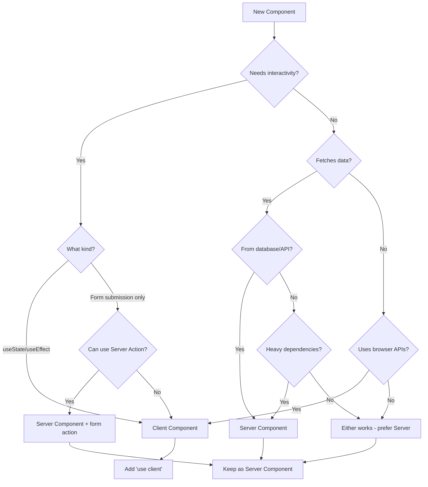

# React Anti-Patterns Comprehensive Guide

**Date**: 2025-12-19
**Status**: Research Complete

## Table of Contents

- [Executive Summary](#executive-summary)
- [React 19 Specific Anti-patterns](#react-19-specific-anti-patterns)
  - [React Compiler Anti-patterns](#react-compiler-anti-patterns)
  - [Server Components Anti-patterns](#server-components-rsc-anti-patterns)
  - [Actions and Server Actions Anti-patterns](#actions-and-server-actions-anti-patterns)
  - [use() Hook Anti-patterns](#use-hook-anti-patterns)
  - [Ref Changes Anti-patterns](#ref-changes-anti-patterns)
  - [New Hooks Anti-patterns](#new-hooks-anti-patterns)
- [General React Anti-patterns](#general-react-anti-patterns)
  - [State Management Anti-patterns](#state-management-anti-patterns)
  - [useEffect Anti-patterns](#useeffect-anti-patterns)
  - [Component Design Anti-patterns](#component-design-anti-patterns)
  - [Hooks Rules Violations](#hooks-rules-violations)
  - [Performance Anti-patterns](#performance-anti-patterns)
  - [Context API Anti-patterns](#context-api-anti-patterns)
  - [Error Handling Anti-patterns](#error-handling-anti-patterns)
  - [Key Prop Anti-patterns](#key-prop-anti-patterns)
- [App Router Specific Anti-patterns](#app-router-specific-anti-patterns)
- [React 19 Migration Pitfalls](#react-19-migration-pitfalls)
- [React Compiler Compatibility Checklist](#react-compiler-compatibility-checklist)
- [Server Components Decision Tree](#server-components-decision-tree)
- [Sources](#sources)

---

## Executive Summary

This comprehensive guide documents React anti-patterns with a focus on React 19's new features (Compiler, Server Components, Actions, use() hook) and ongoing patterns critical in 2024-2025. Key findings:

1. **React Compiler**: Code that relies on "memoization-for-correctness" will break; the compiler skips non-compliant code silently
2. **Server Components**: The `"use client"` directive creates a boundary - all imports become client code; avoid placing it too high in the tree
3. **useEffect remains the most error-prone hook**: Race conditions, missing dependencies, and using effects for derived state are the top issues
4. **Performance optimization is often premature**: React 19's Compiler eliminates most need for manual `useMemo`/`useCallback`

---

## React 19 Specific Anti-patterns

### React Compiler Anti-patterns

The React Compiler (stable in v1.0, October 2025) automatically memoizes components and hooks. However, certain patterns break optimization or cause runtime issues.

#### Memoization-for-Correctness Pattern

The main way React Compiler breaks apps is when code relies on specific values being memoized to work correctly.

```tsx
// DON'T: Rely on referential equality for correctness
function Component({ data }) {
  const processed = processData(data);

  useEffect(() => {
    // This effect assumes 'processed' maintains reference
    // when data hasn't changed. Compiler may memoize differently.
    doSomething(processed);
  }, [processed]);

  return <Child data={processed} />;
}
```

```tsx
// DO: Design without depending on memoization for correctness
function Component({ data }) {
  const processed = useMemo(() => processData(data), [data]);

  useEffect(() => {
    doSomething(processed);
  }, [processed]);

  return <Child data={processed} />;
}

// Or better: let the Compiler handle it, but ensure your
// effect doesn't break if memoization changes
```

**Impact**: Effects over-firing, infinite loops, missing updates, inconsistent state

#### Interior Mutability Pattern

Objects or functions that keep hidden state while maintaining the same reference.

```tsx
// DON'T: Mutate objects that the compiler tracks
function Component() {
  const cache = useRef({ hits: 0 });

  // Interior mutation - compiler can't track this
  cache.current.hits++;

  return <Display count={cache.current.hits} />;
}
```

```tsx
// DO: Use state for values that affect rendering
function Component() {
  const [hits, setHits] = useState(0);

  const handleHit = () => setHits(h => h + 1);

  return <Display count={hits} onHit={handleHit} />;
}
```

**Impact**: Compiler skips memoization (de-opts), falls back to full render

#### Throw Inside Try/Catch for Control Flow

```tsx
// DON'T: Use exceptions for control flow
function Component() {
  try {
    const data = fetchData();
    if (!data) throw new NotFoundError(); // Control flow via exception
    return <Display data={data} />;
  } catch {
    return <Fallback />;
  }
}
```

```tsx
// DO: Use explicit conditionals
function Component() {
  const data = fetchData();

  if (!data) {
    return <Fallback />;
  }

  return <Display data={data} />;
}
```

**Impact**: Compiler incompatibility, weird re-render loops

#### Non-deterministic Values in Render

```tsx
// DON'T: Use non-deterministic values during render
function Component() {
  const timestamp = Date.now(); // Changes every render
  const id = Math.random(); // Different every render

  return <Display id={id} time={timestamp} />;
}
```

```tsx
// DO: Generate stable values once
function Component() {
  const [id] = useState(() => crypto.randomUUID());
  const mountTime = useRef(Date.now());

  return <Display id={id} time={mountTime.current} />;
}
```

**Impact**: Compiler purity analysis fails, optimization skipped

#### Debugging Compiler Issues

Use `"use no memo"` to isolate compiler-related issues:

```tsx
function ProblematicComponent() {
  "use no memo"; // Skip compilation for this component
  // ... rest of component
}
```

If the issue disappears with `"use no memo"`, it's compiler-related and likely a Rules of React violation.

---

### Server Components (RSC) Anti-patterns

#### Overusing "use client" Directive

```tsx
// DON'T: Mark everything as client component
"use client"; // Placed at page level

export default function Page() {
  return (
    <div>
      <Header /> {/* Now client component */}
      <Content /> {/* Now client component */}
      <Footer /> {/* Now client component */}
    </div>
  );
}
```

```tsx
// DO: Only mark interactive components
// page.tsx - Server Component by default
export default function Page() {
  return (
    <div>
      <Header />
      <InteractiveSearch /> {/* Only this needs "use client" */}
      <Content />
    </div>
  );
}

// InteractiveSearch.tsx
"use client";
export function InteractiveSearch() {
  const [query, setQuery] = useState("");
  return <input value={query} onChange={e => setQuery(e.target.value)} />;
}
```

**Impact**: Larger client bundle, loss of Server Component benefits, unnecessary hydration

#### Misunderstanding the Client Boundary

Once a file is marked with `"use client"`, all its imports and child components become part of the client bundle.

```tsx
// DON'T: Import server-only code in client components
"use client";

import { getSecretKey } from "@/lib/secrets"; // Server-only!
import { HeavyLibrary } from "heavy-library"; // Bundled to client

export function Dashboard() {
  const key = getSecretKey(); // Security risk!
  return <HeavyLibrary />;
}
```

```tsx
// DO: Keep server code in server components
// page.tsx (Server Component)
import { getSecretKey } from "@/lib/secrets";
import { Dashboard } from "./Dashboard";

export default async function Page() {
  const data = await fetchWithKey(getSecretKey());
  return <Dashboard data={data} />;
}

// Dashboard.tsx (Client Component)
"use client";
export function Dashboard({ data }) {
  // Only receives serializable props
  return <Display data={data} />;
}
```

**Impact**: Security vulnerabilities, bloated client bundles

#### Using Interactive APIs in Server Components

```tsx
// DON'T: Use hooks in Server Components
export default function Page() {
  const [count, setCount] = useState(0); // Error!

  useEffect(() => { // Error!
    console.log("Mounted");
  }, []);

  return <div>{count}</div>;
}
```

```tsx
// DO: Compose with Client Components for interactivity
// page.tsx (Server Component)
import { Counter } from "./Counter";

export default function Page() {
  return <Counter initialCount={0} />;
}

// Counter.tsx (Client Component)
"use client";
export function Counter({ initialCount }) {
  const [count, setCount] = useState(initialCount);
  return <button onClick={() => setCount(c => c + 1)}>{count}</button>;
}
```

**Impact**: Build errors, runtime crashes

#### Incorrect Nesting: Server Inside Client

```tsx
// DON'T: Import Server Component into Client Component
"use client";
import { ServerComponent } from "./ServerComponent"; // Becomes client!

export function ClientComponent() {
  return <ServerComponent />; // Loses server benefits
}
```

```tsx
// DO: Pass Server Components as children (composition)
"use client";
export function ClientComponent({ children }) {
  const [isOpen, setIsOpen] = useState(false);
  return (
    <div>
      <button onClick={() => setIsOpen(!isOpen)}>Toggle</button>
      {isOpen && children} {/* Server Component passed as prop */}
    </div>
  );
}

// page.tsx (Server Component)
import { ClientComponent } from "./ClientComponent";
import { ServerContent } from "./ServerContent";

export default function Page() {
  return (
    <ClientComponent>
      <ServerContent /> {/* Stays as Server Component */}
    </ClientComponent>
  );
}
```

**Impact**: Loss of server-side benefits, larger bundles

#### Passing Non-serializable Props to Client Components

```tsx
// DON'T: Pass functions or non-serializable data
// page.tsx (Server Component)
export default function Page() {
  const handleClick = () => console.log("clicked"); // Not serializable!
  const date = new Date(); // Object with methods

  return <ClientButton onClick={handleClick} date={date} />;
}
```

```tsx
// DO: Pass only serializable data
// page.tsx (Server Component)
export default function Page() {
  const dateString = new Date().toISOString();

  return <ClientButton dateString={dateString} />;
}

// ClientButton.tsx
"use client";
export function ClientButton({ dateString }) {
  const handleClick = () => console.log("clicked");
  const date = new Date(dateString);

  return <button onClick={handleClick}>{date.toLocaleDateString()}</button>;
}
```

**Impact**: Serialization errors, hydration mismatches

---

### Actions and Server Actions Anti-patterns

#### Using useActionState and useFormStatus in Same Component

```tsx
// DON'T: Use both hooks in same component
"use client";
import { useActionState } from "react";
import { useFormStatus } from "react-dom";

export function Form({ action }) {
  const [state, formAction, isPending] = useActionState(action, null);
  const { pending } = useFormStatus(); // Won't work correctly!

  return (
    <form action={formAction}>
      <button disabled={pending}>Submit</button>
    </form>
  );
}
```

```tsx
// DO: Extract submit button to child component
"use client";
import { useActionState } from "react";
import { useFormStatus } from "react-dom";

function SubmitButton() {
  const { pending } = useFormStatus(); // Now works!
  return <button disabled={pending}>Submit</button>;
}

export function Form({ action }) {
  const [state, formAction] = useActionState(action, null);

  return (
    <form action={formAction}>
      <SubmitButton />
    </form>
  );
}
```

**Impact**: `useFormStatus` returns incorrect pending state

#### useFormStatus Outside Form Context

```tsx
// DON'T: Use useFormStatus outside a form
"use client";
export function StandaloneButton() {
  const { pending } = useFormStatus(); // Always returns default values!
  return <button disabled={pending}>Submit</button>;
}

// Rendered outside any form:
<StandaloneButton />
```

```tsx
// DO: Ensure component is child of a form
"use client";
export function Form({ action }) {
  return (
    <form action={action}>
      <SubmitButton /> {/* Now inside form context */}
    </form>
  );
}

function SubmitButton() {
  const { pending } = useFormStatus();
  return <button disabled={pending}>Submit</button>;
}
```

**Impact**: `pending` always false, no form state access

#### Forgetting to Revalidate After Server Actions

```tsx
// DON'T: Mutate without revalidating
"use server";

export async function createItem(formData: FormData) {
  await db.items.create({ data: { name: formData.get("name") } });
  // Data is stale! Page still shows old data
}
```

```tsx
// DO: Revalidate after mutations
"use server";
import { revalidatePath, revalidateTag } from "next/cache";

export async function createItem(formData: FormData) {
  await db.items.create({ data: { name: formData.get("name") } });
  revalidatePath("/items"); // Or revalidateTag("items")
}
```

**Impact**: Stale data, UI not reflecting mutations

#### Using redirect() Inside try/catch

```tsx
// DON'T: Wrap redirect in try/catch
"use server";
import { redirect } from "next/navigation";

export async function login(formData: FormData) {
  try {
    await authenticate(formData);
    redirect("/dashboard"); // Throws internally!
  } catch (error) {
    return { error: "Login failed" }; // Catches redirect too!
  }
}
```

```tsx
// DO: Call redirect outside try/catch
"use server";
import { redirect } from "next/navigation";

export async function login(formData: FormData) {
  let success = false;

  try {
    await authenticate(formData);
    success = true;
  } catch (error) {
    return { error: "Login failed" };
  }

  if (success) {
    redirect("/dashboard");
  }
}
```

**Impact**: Redirect gets caught as error, navigation fails

#### Server Actions Security Issues

```tsx
// DON'T: Trust client data without validation
"use server";

export async function updateUser(formData: FormData) {
  const userId = formData.get("userId");
  const isAdmin = formData.get("isAdmin") === "true";

  // Client can send any userId and isAdmin!
  await db.users.update({ where: { id: userId }, data: { isAdmin } });
}
```

```tsx
// DO: Validate and authorize server-side
"use server";
import { auth } from "@/lib/auth";
import { z } from "zod";

const schema = z.object({
  name: z.string().min(1).max(100),
});

export async function updateUser(formData: FormData) {
  const session = await auth();
  if (!session?.user?.id) throw new Error("Unauthorized");

  const parsed = schema.safeParse({ name: formData.get("name") });
  if (!parsed.success) throw new Error("Invalid input");

  // Only update current user's allowed fields
  await db.users.update({
    where: { id: session.user.id },
    data: { name: parsed.data.name },
  });
}
```

**Impact**: Authorization bypass, data tampering, security vulnerabilities

---

### use() Hook Anti-patterns

#### Creating Promises in Client Components

```tsx
// DON'T: Create promises during render in client components
"use client";

function Comments({ postId }) {
  // New promise on every render - causes infinite suspense loop!
  const comments = use(fetchComments(postId));
  return <CommentList comments={comments} />;
}
```

```tsx
// DO: Create promises in Server Components, pass to Client
// page.tsx (Server Component)
import { Comments } from "./Comments";

export default async function Page({ params }) {
  const commentsPromise = fetchComments(params.postId);
  return <Comments commentsPromise={commentsPromise} />;
}

// Comments.tsx (Client Component)
"use client";
function Comments({ commentsPromise }) {
  const comments = use(commentsPromise); // Stable promise
  return <CommentList comments={comments} />;
}
```

**Impact**: Infinite suspense loops, degraded performance

#### Using use() in try-catch Blocks

```tsx
// DON'T: Wrap use() in try-catch
"use client";

function DataDisplay({ dataPromise }) {
  try {
    const data = use(dataPromise); // Can't be in try-catch!
    return <Display data={data} />;
  } catch (error) {
    return <ErrorMessage error={error} />;
  }
}
```

```tsx
// DO: Use Error Boundaries or .catch()
"use client";
import { ErrorBoundary } from "react-error-boundary";

function DataDisplay({ dataPromise }) {
  const data = use(dataPromise);
  return <Display data={data} />;
}

// Wrap in Error Boundary
<ErrorBoundary fallback={<ErrorMessage />}>
  <Suspense fallback={<Loading />}>
    <DataDisplay dataPromise={dataPromise} />
  </Suspense>
</ErrorBoundary>

// Or handle with .catch()
const safePromise = dataPromise.catch(err => ({ error: err }));
const result = use(safePromise);
if (result.error) return <ErrorMessage error={result.error} />;
```

**Impact**: Unhandled promise rejections, crashes

#### Using async/await Instead of use() in Server Components

```tsx
// DON'T: Use use() when async/await is cleaner
// page.tsx (Server Component)
import { use } from "react";

export default function Page() {
  const data = use(fetchData()); // Works but not idiomatic
  return <Display data={data} />;
}
```

```tsx
// DO: Use async/await in Server Components
// page.tsx (Server Component)
export default async function Page() {
  const data = await fetchData(); // Cleaner, more idiomatic
  return <Display data={data} />;
}
```

**Impact**: Unnecessary complexity, `use()` re-renders vs `await` continues from await point

---

### Ref Changes Anti-patterns

#### Continuing to Use forwardRef

```tsx
// DON'T: Use forwardRef (deprecated in React 19)
import { forwardRef } from "react";

const Input = forwardRef<HTMLInputElement, InputProps>((props, ref) => {
  return <input {...props} ref={ref} />;
});
```

```tsx
// DO: Accept ref as a regular prop
interface InputProps {
  placeholder?: string;
  ref?: React.Ref<HTMLInputElement>;
}

function Input({ placeholder, ref }: InputProps) {
  return <input placeholder={placeholder} ref={ref} />;
}
```

**Impact**: Deprecated code, extra wrapper, unnecessary complexity

#### Implicit Returns in Ref Callbacks

```tsx
// DON'T: Implicit return in ref callback (TypeScript error in React 19)
<div ref={current => (instance = current)} />
// Returns the assignment result, interpreted as cleanup function
```

```tsx
// DO: Use block statement for ref callbacks
<div ref={current => { instance = current; }} />

// Or with cleanup
<input
  ref={(element) => {
    if (element) {
      element.focus();
    }
    return () => {
      // Cleanup when element unmounts
    };
  }}
/>
```

**Impact**: TypeScript errors, incorrect cleanup behavior

#### Not Using Ref Cleanup Functions

```tsx
// DON'T: Manual cleanup with useEffect
function Component() {
  const ref = useRef<HTMLInputElement>(null);

  useEffect(() => {
    const element = ref.current;
    element?.addEventListener("focus", handleFocus);
    return () => element?.removeEventListener("focus", handleFocus);
  }, []);

  return <input ref={ref} />;
}
```

```tsx
// DO: Use ref callback cleanup (React 19)
function Component() {
  return (
    <input
      ref={(element) => {
        if (element) {
          element.addEventListener("focus", handleFocus);
          return () => element.removeEventListener("focus", handleFocus);
        }
      }}
    />
  );
}
```

**Impact**: More boilerplate, potential for memory leaks if effect deps are wrong

---

### New Hooks Anti-patterns

#### useOptimistic: Not Handling Rollback

```tsx
// DON'T: Assume server call succeeds
"use client";

function LikeButton({ liked, onLike }) {
  const [optimisticLiked, setOptimisticLiked] = useOptimistic(liked);

  async function handleLike() {
    setOptimisticLiked(!liked); // Optimistic update
    await onLike(); // What if this fails?
  }

  return <button onClick={handleLike}>{optimisticLiked ? "Unlike" : "Like"}</button>;
}
```

```tsx
// DO: Handle errors and rollback
"use client";
import { useTransition } from "react";

function LikeButton({ liked, onLike }) {
  const [optimisticLiked, setOptimisticLiked] = useOptimistic(liked);
  const [isPending, startTransition] = useTransition();
  const [error, setError] = useState<string | null>(null);

  async function handleLike() {
    setError(null);
    startTransition(async () => {
      setOptimisticLiked(!liked);
      try {
        await onLike();
      } catch (e) {
        setError("Failed to update. Please try again.");
        // Optimistic state auto-reverts when transition completes
      }
    });
  }

  return (
    <>
      <button onClick={handleLike} disabled={isPending}>
        {optimisticLiked ? "Unlike" : "Like"}
      </button>
      {error && <span className="error">{error}</span>}
    </>
  );
}
```

**Impact**: Inconsistent UI state, poor user experience on failures

#### useTransition: Wrapping Controlled Inputs

```tsx
// DON'T: Use startTransition with controlled input state
"use client";

function SearchInput() {
  const [query, setQuery] = useState("");
  const [isPending, startTransition] = useTransition();

  function handleChange(e: React.ChangeEvent<HTMLInputElement>) {
    startTransition(() => {
      setQuery(e.target.value); // Input feels laggy!
    });
  }

  return <input value={query} onChange={handleChange} />;
}
```

```tsx
// DO: Keep input state immediate, defer expensive work
"use client";

function SearchInput() {
  const [query, setQuery] = useState("");
  const [results, setResults] = useState([]);
  const [isPending, startTransition] = useTransition();

  function handleChange(e: React.ChangeEvent<HTMLInputElement>) {
    const value = e.target.value;
    setQuery(value); // Immediate update

    startTransition(() => {
      setResults(searchItems(value)); // Deferred expensive work
    });
  }

  return (
    <>
      <input value={query} onChange={handleChange} />
      {isPending ? <Spinner /> : <ResultsList results={results} />}
    </>
  );
}
```

**Impact**: Laggy input, poor user experience

#### useTransition: Async Inside startTransition

```tsx
// DON'T: Use await inside startTransition without wrapping updates
"use client";

function Component() {
  const [isPending, startTransition] = useTransition();
  const [data, setData] = useState(null);

  async function handleClick() {
    startTransition(async () => {
      const result = await fetchData(); // await loses transition context!
      setData(result); // Not marked as transition!
    });
  }
}
```

```tsx
// DO: Wrap each update after await in startTransition
"use client";

function Component() {
  const [isPending, startTransition] = useTransition();
  const [data, setData] = useState(null);

  async function handleClick() {
    startTransition(async () => {
      const result = await fetchData();
      startTransition(() => {
        setData(result); // Now properly marked as transition
      });
    });
  }
}
```

**Impact**: Updates not treated as transitions, `isPending` incorrect

---

## General React Anti-patterns

### State Management Anti-patterns

#### Derived State: Copying Props to State

```tsx
// DON'T: Copy props to state and try to sync
function EmailInput({ email }) {
  const [value, setValue] = useState(email);

  // This loses user input when parent re-renders!
  useEffect(() => {
    setValue(email);
  }, [email]);

  return <input value={value} onChange={e => setValue(e.target.value)} />;
}
```

```tsx
// DO: Use key to reset, or make fully controlled
// Option 1: Fully controlled
function EmailInput({ email, onChange }) {
  return <input value={email} onChange={e => onChange(e.target.value)} />;
}

// Option 2: Uncontrolled with key
function EmailInput({ defaultEmail }) {
  const [value, setValue] = useState(defaultEmail);
  return <input value={value} onChange={e => setValue(e.target.value)} />;
}

// Parent resets with key:
<EmailInput key={userId} defaultEmail={user.email} />
```

**Impact**: Lost user input, stale state, synchronization bugs

#### Storing Derived/Computed Values in State

```tsx
// DON'T: Store computed values in state
function FilteredList({ items, filter }) {
  const [filteredItems, setFilteredItems] = useState([]);

  useEffect(() => {
    setFilteredItems(items.filter(item => item.name.includes(filter)));
  }, [items, filter]);

  return <List items={filteredItems} />;
}
```

```tsx
// DO: Compute during render (or useMemo for expensive operations)
function FilteredList({ items, filter }) {
  // Simple: compute inline
  const filteredItems = items.filter(item => item.name.includes(filter));

  // Or if expensive: useMemo
  const filteredItems = useMemo(
    () => items.filter(item => item.name.includes(filter)),
    [items, filter]
  );

  return <List items={filteredItems} />;
}
```

**Impact**: Unnecessary re-renders, stale data on first render, complexity

#### State Defined as Variables (Not Hooks)

```tsx
// DON'T: Declare state as regular variables
function Counter() {
  let count = 0; // Redeclared every render!

  function increment() {
    count++; // Doesn't trigger re-render
  }

  return <button onClick={increment}>{count}</button>; // Always 0
}
```

```tsx
// DO: Use useState hook
function Counter() {
  const [count, setCount] = useState(0);

  function increment() {
    setCount(c => c + 1);
  }

  return <button onClick={increment}>{count}</button>;
}
```

**Impact**: State resets every render, no re-renders on changes

---

### useEffect Anti-patterns

#### Missing Dependency Array

```tsx
// DON'T: Omit dependency array
function Component({ userId }) {
  useEffect(() => {
    fetchUser(userId); // Runs after EVERY render!
  }); // No dependency array
}
```

```tsx
// DO: Always specify dependencies
function Component({ userId }) {
  useEffect(() => {
    fetchUser(userId);
  }, [userId]); // Runs when userId changes
}
```

**Impact**: Performance issues, excessive API calls, potential infinite loops

#### Incomplete Dependencies (Stale Closures)

```tsx
// DON'T: Omit dependencies from array
function ChatRoom({ roomId }) {
  const [serverUrl, setServerUrl] = useState("https://localhost:1234");

  useEffect(() => {
    const connection = createConnection(serverUrl, roomId);
    connection.connect();
    return () => connection.disconnect();
  }, []); // Missing: serverUrl, roomId
}
```

```tsx
// DO: Include all reactive values
function ChatRoom({ roomId }) {
  const [serverUrl, setServerUrl] = useState("https://localhost:1234");

  useEffect(() => {
    const connection = createConnection(serverUrl, roomId);
    connection.connect();
    return () => connection.disconnect();
  }, [serverUrl, roomId]);
}
```

**Impact**: Stale closures, bugs when props/state change

#### Object/Function Dependencies That Change Every Render

```tsx
// DON'T: Create objects/functions in component body used as deps
function ChatRoom({ roomId }) {
  const options = { // New object every render!
    serverUrl: "https://localhost:1234",
    roomId: roomId,
  };

  useEffect(() => {
    const connection = createConnection(options);
    connection.connect();
    return () => connection.disconnect();
  }, [options]); // Effect runs every render!
}
```

```tsx
// DO: Move object creation inside effect
function ChatRoom({ roomId }) {
  useEffect(() => {
    const options = {
      serverUrl: "https://localhost:1234",
      roomId: roomId,
    };
    const connection = createConnection(options);
    connection.connect();
    return () => connection.disconnect();
  }, [roomId]); // Only primitive dependency
}
```

**Impact**: Infinite loops, excessive effect executions

#### Race Conditions in Data Fetching

```tsx
// DON'T: Fetch without handling race conditions
function UserProfile({ userId }) {
  const [user, setUser] = useState(null);

  useEffect(() => {
    fetchUser(userId).then(data => {
      setUser(data); // May be stale if userId changed!
    });
  }, [userId]);
}
```

```tsx
// DO: Use cleanup flag to cancel stale requests
function UserProfile({ userId }) {
  const [user, setUser] = useState(null);

  useEffect(() => {
    let cancelled = false;

    fetchUser(userId).then(data => {
      if (!cancelled) {
        setUser(data);
      }
    });

    return () => {
      cancelled = true;
    };
  }, [userId]);
}

// Or use AbortController
function UserProfile({ userId }) {
  const [user, setUser] = useState(null);

  useEffect(() => {
    const controller = new AbortController();

    fetch(`/api/users/${userId}`, { signal: controller.signal })
      .then(res => res.json())
      .then(setUser)
      .catch(err => {
        if (err.name !== "AbortError") throw err;
      });

    return () => controller.abort();
  }, [userId]);
}
```

**Impact**: Showing stale data, memory leaks, state updates on unmounted components

#### Using Effects for Derived Data

```tsx
// DON'T: Use effect to compute derived values
function FullName({ firstName, lastName }) {
  const [fullName, setFullName] = useState("");

  useEffect(() => {
    setFullName(`${firstName} ${lastName}`);
  }, [firstName, lastName]);

  return <span>{fullName}</span>; // Empty on first render!
}
```

```tsx
// DO: Calculate during render
function FullName({ firstName, lastName }) {
  const fullName = `${firstName} ${lastName}`;
  return <span>{fullName}</span>;
}
```

**Impact**: Unnecessary re-renders, stale data on initial render

#### Effects That Should Be Event Handlers

```tsx
// DON'T: Use effect for user actions
function Form() {
  const [submitted, setSubmitted] = useState(false);

  useEffect(() => {
    if (submitted) {
      sendAnalytics("form_submitted");
      setSubmitted(false);
    }
  }, [submitted]);

  return <button onClick={() => setSubmitted(true)}>Submit</button>;
}
```

```tsx
// DO: Handle in event handler
function Form() {
  function handleSubmit() {
    sendAnalytics("form_submitted");
  }

  return <button onClick={handleSubmit}>Submit</button>;
}
```

**Impact**: Unnecessary complexity, delayed execution, edge case bugs

#### Suppressing the Linter

```tsx
// DON'T: Disable the exhaustive-deps rule
useEffect(() => {
  doSomething(count);
  // eslint-disable-next-line react-hooks/exhaustive-deps
}, []); // Lying about dependencies
```

```tsx
// DO: Fix the code structure instead
// If you truly need to run once, ensure it's correct:
useEffect(() => {
  const initialValue = count; // Capture at mount
  doSomething(initialValue);
}, []); // Now correctly has no reactive deps

// Or properly include dependencies:
useEffect(() => {
  doSomething(count);
}, [count]);
```

**Impact**: Stale closures, subtle bugs, maintenance nightmares

---

### Component Design Anti-patterns

#### Prop Drilling (Vertical)

```tsx
// DON'T: Pass props through many layers
function App() {
  const [user, setUser] = useState(null);
  return <Layout user={user} setUser={setUser} />;
}

function Layout({ user, setUser }) {
  return <Sidebar user={user} setUser={setUser} />;
}

function Sidebar({ user, setUser }) {
  return <UserMenu user={user} setUser={setUser} />;
}

function UserMenu({ user, setUser }) {
  return <div>{user?.name}</div>;
}
```

```tsx
// DO: Use Context for deeply shared data
const UserContext = createContext(null);

function App() {
  const [user, setUser] = useState(null);
  return (
    <UserContext value={{ user, setUser }}>
      <Layout />
    </UserContext>
  );
}

function UserMenu() {
  const { user, setUser } = use(UserContext);
  return <div>{user?.name}</div>;
}
```

**Impact**: Tightly coupled components, hard to refactor, excessive re-renders

#### Props Plowing (Horizontal / Prop Explosion)

```tsx
// DON'T: Pass many individual props
<UserCard
  firstName={user.firstName}
  lastName={user.lastName}
  email={user.email}
  avatar={user.avatar}
  bio={user.bio}
  joinDate={user.joinDate}
  isVerified={user.isVerified}
  followerCount={user.followerCount}
/>
```

```tsx
// DO: Pass the object or use composition
// Option 1: Pass object
<UserCard user={user} />

// Option 2: Use composition
<UserCard>
  <UserAvatar src={user.avatar} />
  <UserInfo name={`${user.firstName} ${user.lastName}`} email={user.email} />
  <UserStats followers={user.followerCount} />
</UserCard>
```

**Impact**: Verbose code, hard to maintain, difficult refactoring

#### God Components

```tsx
// DON'T: Put everything in one component
function Dashboard() {
  const [users, setUsers] = useState([]);
  const [posts, setPosts] = useState([]);
  const [comments, setComments] = useState([]);
  const [filter, setFilter] = useState("");
  const [sort, setSort] = useState("date");
  const [page, setPage] = useState(1);
  // ... 20 more state variables

  useEffect(() => { /* fetch users */ }, []);
  useEffect(() => { /* fetch posts */ }, []);
  useEffect(() => { /* fetch comments */ }, []);
  // ... many more effects

  const filteredUsers = users.filter(/* ... */);
  const sortedPosts = posts.sort(/* ... */);
  // ... many more computations

  return (
    <div>
      {/* 500 lines of JSX */}
    </div>
  );
}
```

```tsx
// DO: Split into focused components with custom hooks
function Dashboard() {
  return (
    <div>
      <UserSection />
      <PostSection />
      <CommentSection />
    </div>
  );
}

function UserSection() {
  const { users, filter, setFilter } = useUsers();
  return <UserList users={users} filter={filter} onFilterChange={setFilter} />;
}

function useUsers() {
  const [users, setUsers] = useState([]);
  const [filter, setFilter] = useState("");

  useEffect(() => {
    fetchUsers().then(setUsers);
  }, []);

  const filteredUsers = useMemo(
    () => users.filter(u => u.name.includes(filter)),
    [users, filter]
  );

  return { users: filteredUsers, filter, setFilter };
}
```

**Impact**: Hard to test, maintain, and understand; poor performance

#### Creating Components Inside Render

```tsx
// DON'T: Define components during render
function Parent() {
  // New component on every render - always remounts!
  const Child = () => <div>I remount every time Parent renders</div>;

  return <Child />;
}
```

```tsx
// DO: Define components outside or use useMemo for dynamic ones
const Child = () => <div>I persist across renders</div>;

function Parent() {
  return <Child />;
}

// If truly dynamic:
function Parent({ config }) {
  const Child = useMemo(() => createDynamicComponent(config), [config]);
  return <Child />;
}
```

**Impact**: Lost state, performance degradation, DOM thrashing

---

### Hooks Rules Violations

#### Conditional Hook Calls

```tsx
// DON'T: Call hooks conditionally
function Component({ showDetails }) {
  const [name, setName] = useState("");

  if (showDetails) {
    const [age, setAge] = useState(0); // Breaks Rules of Hooks!
  }

  return <div>{name}</div>;
}
```

```tsx
// DO: Always call hooks at top level
function Component({ showDetails }) {
  const [name, setName] = useState("");
  const [age, setAge] = useState(0); // Always called

  return (
    <div>
      {name}
      {showDetails && <span>Age: {age}</span>}
    </div>
  );
}
```

**Impact**: Runtime errors, inconsistent state

#### Hooks in Loops

```tsx
// DON'T: Call hooks in loops
function ItemList({ items }) {
  const states = items.map(item => {
    const [checked, setChecked] = useState(false); // Violates rules!
    return { item, checked, setChecked };
  });
}
```

```tsx
// DO: Extract to child component
function ItemList({ items }) {
  return items.map(item => <Item key={item.id} item={item} />);
}

function Item({ item }) {
  const [checked, setChecked] = useState(false);
  return <Checkbox checked={checked} onChange={setChecked} label={item.name} />;
}
```

**Impact**: React can't track hook state correctly, crashes

#### False Hook Naming

```tsx
// DON'T: Name functions with "use" prefix if they're not hooks
function useFormatDate(date: Date): string {
  // No hooks used inside!
  return date.toLocaleDateString();
}
```

```tsx
// DO: Only use "use" prefix for actual hooks
function formatDate(date: Date): string {
  return date.toLocaleDateString();
}

// This IS a hook (uses useState):
function useDateFormatter() {
  const [locale, setLocale] = useState("en-US");

  const format = useCallback((date: Date) => {
    return date.toLocaleDateString(locale);
  }, [locale]);

  return { format, setLocale };
}
```

**Impact**: Misleading code, violations of rules of hooks expectations

---

### Performance Anti-patterns

#### Premature useMemo/useCallback

```tsx
// DON'T: Memoize everything "just in case"
function Component({ items }) {
  const sortedItems = useMemo(() => [...items].sort(), [items]);
  const handleClick = useCallback(() => console.log("clicked"), []);
  const style = useMemo(() => ({ color: "red" }), []);

  return <div style={style} onClick={handleClick}>{sortedItems.length}</div>;
}
```

```tsx
// DO: Only memoize when there's measurable benefit
function Component({ items }) {
  // Simple sort - probably fine without memo
  const sortedItems = [...items].sort();

  // Inline handler - React handles this efficiently
  return <div onClick={() => console.log("clicked")}>{sortedItems.length}</div>;
}

// Memoize when:
// 1. Passed to memo'd child that would re-render otherwise
// 2. Used as effect dependency
// 3. Expensive computation (measure first!)
function ExpensiveComponent({ items, onItemClick }) {
  const processedItems = useMemo(
    () => items.map(expensiveTransform),
    [items]
  );

  return <MemoizedList items={processedItems} onItemClick={onItemClick} />;
}
```

**Impact**: Added complexity, marginal overhead, harder to read

> **Note**: With React 19's Compiler, most manual memoization becomes unnecessary.

#### React.memo Without Stable Props

```tsx
// DON'T: Use memo when props always change
const MemoizedChild = memo(function Child({ onClick, data }) {
  return <div onClick={onClick}>{data.name}</div>;
});

function Parent() {
  const data = { name: "test" }; // New object every render
  const handleClick = () => {}; // New function every render

  // memo is useless - props always different!
  return <MemoizedChild onClick={handleClick} data={data} />;
}
```

```tsx
// DO: Ensure stable props when using memo
const MemoizedChild = memo(function Child({ onClick, data }) {
  return <div onClick={onClick}>{data.name}</div>;
});

function Parent() {
  const [data] = useState({ name: "test" });
  const handleClick = useCallback(() => {}, []);

  return <MemoizedChild onClick={handleClick} data={data} />;
}

// Or: Don't use memo if you can't stabilize props
function Parent() {
  return <Child onClick={() => {}} data={{ name: "test" }} />;
}
```

**Impact**: False sense of optimization, wasted comparison overhead

#### Inline Object/Function Props

```tsx
// DON'T: Create new objects/functions in JSX (when passing to memo'd components)
function Parent() {
  return (
    <MemoizedChild
      style={{ marginTop: 10 }} // New object every render
      onClick={() => handleClick()} // New function every render
      config={{ timeout: 1000, retry: true }} // New object every render
    />
  );
}
```

```tsx
// DO: Hoist stable values or use hooks
const style = { marginTop: 10 };
const config = { timeout: 1000, retry: true };

function Parent() {
  const handleClick = useCallback(() => {
    // handle click
  }, []);

  return <MemoizedChild style={style} onClick={handleClick} config={config} />;
}
```

**Impact**: Unnecessary re-renders of memoized children

---

### Context API Anti-patterns

#### Context for Frequently Changing Data

```tsx
// DON'T: Put rapidly changing state in context
const MouseContext = createContext({ x: 0, y: 0 });

function App() {
  const [position, setPosition] = useState({ x: 0, y: 0 });

  useEffect(() => {
    const handler = (e) => setPosition({ x: e.clientX, y: e.clientY });
    window.addEventListener("mousemove", handler);
    return () => window.removeEventListener("mousemove", handler);
  }, []);

  // All consumers re-render on every mouse move!
  return (
    <MouseContext value={position}>
      <App />
    </MouseContext>
  );
}
```

```tsx
// DO: Use refs or state colocation for frequent updates
function useMousePosition() {
  const [position, setPosition] = useState({ x: 0, y: 0 });

  useEffect(() => {
    const handler = (e) => setPosition({ x: e.clientX, y: e.clientY });
    window.addEventListener("mousemove", handler);
    return () => window.removeEventListener("mousemove", handler);
  }, []);

  return position;
}

// Only components that need it subscribe:
function MouseFollower() {
  const { x, y } = useMousePosition();
  return <div style={{ left: x, top: y }}>Cursor</div>;
}
```

**Impact**: Performance degradation, unnecessary re-renders across entire tree

#### Using Context Without Provider

```tsx
// DON'T: Rely on context default value for production use
const ThemeContext = createContext("light"); // Default used if no provider

function ThemedButton() {
  const theme = use(ThemeContext);
  // Works but silently uses default - often a bug!
  return <button className={theme}>Click</button>;
}
```

```tsx
// DO: Make missing provider explicit
const ThemeContext = createContext<string | null>(null);

function useTheme() {
  const theme = use(ThemeContext);
  if (theme === null) {
    throw new Error("useTheme must be used within ThemeProvider");
  }
  return theme;
}

function ThemedButton() {
  const theme = useTheme(); // Throws if provider missing
  return <button className={theme}>Click</button>;
}
```

**Impact**: Silent bugs, unexpected behavior

#### Context for Global State

```tsx
// DON'T: Use context as a global store
const GlobalContext = createContext({});

function App() {
  const [users, setUsers] = useState([]);
  const [posts, setPosts] = useState([]);
  const [comments, setComments] = useState([]);
  const [notifications, setNotifications] = useState([]);
  // ... everything in one context

  return (
    <GlobalContext value={{ users, posts, comments, notifications, /* ... */ }}>
      <App />
    </GlobalContext>
  );
}
```

```tsx
// DO: Split contexts by update frequency and domain
const UserContext = createContext(null);
const NotificationContext = createContext(null);

function App() {
  return (
    <UserProvider>
      <NotificationProvider>
        <App />
      </NotificationProvider>
    </UserProvider>
  );
}

// Or use a proper state management solution for complex global state
```

**Impact**: All consumers re-render on any state change

---

### Error Handling Anti-patterns

#### Missing Error Boundaries

```tsx
// DON'T: Let errors crash entire app
function App() {
  return (
    <div>
      <Header />
      <UnstableComponent /> {/* Error here crashes everything */}
      <Footer />
    </div>
  );
}
```

```tsx
// DO: Wrap risky sections in error boundaries
import { ErrorBoundary } from "react-error-boundary";

function App() {
  return (
    <div>
      <Header />
      <ErrorBoundary fallback={<div>Something went wrong</div>}>
        <UnstableComponent />
      </ErrorBoundary>
      <Footer />
    </div>
  );
}
```

**Impact**: White screen of death, poor UX

#### Expecting Error Boundaries to Catch Async/Event Errors

```tsx
// DON'T: Expect error boundaries to catch event handler errors
function Component() {
  const handleClick = async () => {
    throw new Error("This won't be caught!"); // Escapes error boundary
  };

  return <button onClick={handleClick}>Click</button>;
}
```

```tsx
// DO: Handle async/event errors explicitly
import { useErrorBoundary } from "react-error-boundary";

function Component() {
  const { showBoundary } = useErrorBoundary();

  const handleClick = async () => {
    try {
      await riskyOperation();
    } catch (error) {
      showBoundary(error); // Manually trigger error boundary
    }
  };

  return <button onClick={handleClick}>Click</button>;
}
```

**Impact**: Unhandled errors, crashes, poor UX

---

### Key Prop Anti-patterns

#### Using Index as Key

```tsx
// DON'T: Use array index as key for dynamic lists
function TodoList({ todos }) {
  return (
    <ul>
      {todos.map((todo, index) => (
        <TodoItem key={index} todo={todo} /> // Anti-pattern!
      ))}
    </ul>
  );
}
```

```tsx
// DO: Use stable, unique identifiers
function TodoList({ todos }) {
  return (
    <ul>
      {todos.map((todo) => (
        <TodoItem key={todo.id} todo={todo} />
      ))}
    </ul>
  );
}
```

**When index as key IS acceptable**:
- Static lists that never reorder
- Lists without add/remove operations
- No component state in list items

**Impact**: Lost state on reorder, incorrect updates, performance issues

#### Generating Keys During Render

```tsx
// DON'T: Generate random keys during render
function List({ items }) {
  return items.map(item => (
    <Item key={crypto.randomUUID()} item={item} /> // New key every render!
  ));
}
```

```tsx
// DO: Generate keys once, before render
// In data layer:
const itemsWithIds = items.map(item => ({
  ...item,
  id: item.id ?? crypto.randomUUID(),
}));

function List({ items }) {
  return items.map(item => <Item key={item.id} item={item} />);
}
```

**Impact**: Components remount every render, lost state, poor performance

---

## App Router Specific Anti-patterns

### Using Route Handlers for Server-to-Server Calls

```tsx
// DON'T: Server Component calling its own Route Handler
// app/page.tsx (Server Component)
export default async function Page() {
  const res = await fetch("http://localhost:3000/api/data");
  const data = await res.json();
  return <Display data={data} />;
}
```

```tsx
// DO: Call the data source directly
// app/page.tsx (Server Component)
import { getData } from "@/lib/data";

export default async function Page() {
  const data = await getData();
  return <Display data={data} />;
}
```

**Impact**: Unnecessary network hop, worse performance

### Incorrect Suspense Boundary Placement

```tsx
// DON'T: Place Suspense inside async component
async function BlogPosts() {
  const posts = await fetchPosts();
  return (
    <Suspense fallback={<Loading />}> {/* Wrong placement! */}
      <PostList posts={posts} />
    </Suspense>
  );
}
```

```tsx
// DO: Wrap async component with Suspense
// page.tsx
export default function Page() {
  return (
    <Suspense fallback={<Loading />}>
      <BlogPosts />
    </Suspense>
  );
}

async function BlogPosts() {
  const posts = await fetchPosts();
  return <PostList posts={posts} />;
}
```

**Impact**: No loading state, blocking render

### Using Hooks for Request Data in Server Components

```tsx
// DON'T: Use useSearchParams in Server Components
export default function Page() {
  const searchParams = useSearchParams(); // Error in Server Component!
  return <div>{searchParams.get("query")}</div>;
}
```

```tsx
// DO: Use props in Server Components
export default function Page({
  searchParams,
}: {
  searchParams: Promise<{ query?: string }>;
}) {
  const { query } = await searchParams;
  return <div>{query}</div>;
}
```

**Impact**: Build errors, runtime crashes

### Layout/Template Error Handling

```tsx
// DON'T: Expect error.tsx to catch layout errors
// app/dashboard/layout.tsx
export default function Layout({ children }) {
  throw new Error("Layout error"); // Not caught by error.tsx!
}

// app/dashboard/error.tsx
export default function Error() {
  return <div>Error!</div>; // Won't catch parent layout error
}
```

```tsx
// DO: Handle layout errors at parent level
// app/error.tsx or app/global-error.tsx
"use client";
export default function GlobalError({ error, reset }) {
  return (
    <html>
      <body>
        <h2>Something went wrong!</h2>
        <button onClick={() => reset()}>Try again</button>
      </body>
    </html>
  );
}
```

**Impact**: Unhandled errors, blank screens

### Sequential Data Fetching (Waterfalls)

```tsx
// DON'T: Await sequentially when not needed
async function Page() {
  const user = await getUser(); // Wait...
  const posts = await getPosts(); // Then wait...
  const comments = await getComments(); // Then wait...

  return <Dashboard user={user} posts={posts} comments={comments} />;
}
```

```tsx
// DO: Fetch in parallel when possible
async function Page() {
  const [user, posts, comments] = await Promise.all([
    getUser(),
    getPosts(),
    getComments(),
  ]);

  return <Dashboard user={user} posts={posts} comments={comments} />;
}

// Or use Suspense for progressive loading
export default function Page() {
  return (
    <Suspense fallback={<UserSkeleton />}>
      <UserSection />
    </Suspense>
    <Suspense fallback={<PostsSkeleton />}>
      <PostsSection />
    </Suspense>
  );
}
```

**Impact**: Slow page loads, poor user experience

### Placing Context Providers Incorrectly

```tsx
// DON'T: Inline providers in layout (breaks Server Component benefits)
// layout.tsx
export default function Layout({ children }) {
  return (
    <ThemeProvider> {/* If ThemeProvider is client-only... */}
      {children}
    </ThemeProvider>
  );
}
```

```tsx
// DO: Extract providers to separate client file
// providers.tsx
"use client";
export function Providers({ children }) {
  return <ThemeProvider>{children}</ThemeProvider>;
}

// layout.tsx (Server Component)
import { Providers } from "./providers";

export default function Layout({ children }) {
  return <Providers>{children}</Providers>;
}
```

**Impact**: Entire subtree becomes client, larger bundles

### Reading cookies/headers in Layouts

```tsx
// DON'T: Read dynamic data in layouts (forces all pages dynamic)
// layout.tsx
export default async function Layout({ children }) {
  const cookieStore = cookies();
  const theme = cookieStore.get("theme")?.value;

  return <div className={theme}>{children}</div>;
}
```

```tsx
// DO: Read in pages or use middleware
// Or accept theme via Client Component that reads cookie
"use client";
function ThemeWrapper({ children }) {
  const [theme, setTheme] = useState("light");

  useEffect(() => {
    const savedTheme = document.cookie.match(/theme=(\w+)/)?.[1];
    if (savedTheme) setTheme(savedTheme);
  }, []);

  return <div className={theme}>{children}</div>;
}
```

**Impact**: Disables static generation, no PPR benefits

---

## React 19 Migration Pitfalls

### Breaking Changes to Watch

| Change | Old Pattern | New Pattern | Action Required |
|--------|-------------|-------------|-----------------|
| `ref` as prop | `forwardRef(Component)` | `function Component({ ref })` | Update component signatures |
| Ref callbacks | Can return anything | Must return cleanup fn or undefined | Add block statements |
| Context Provider | `<Context.Provider>` | `<Context>` | Update JSX |
| `useFormState` | `useFormState()` | `useActionState()` | Rename imports |

### Ref Callback Migration

```tsx
// Before (implicit return - now TypeScript error)
<div ref={current => (instance = current)} />

// After (explicit block statement)
<div ref={current => { instance = current; }} />
```

### forwardRef Removal

```tsx
// Before
const Input = forwardRef<HTMLInputElement, Props>((props, ref) => (
  <input ref={ref} {...props} />
));

// After
function Input({ ref, ...props }: Props & { ref?: Ref<HTMLInputElement> }) {
  return <input ref={ref} {...props} />;
}
```

### Context.Provider to Context

```tsx
// Before
<ThemeContext.Provider value="dark">{children}</ThemeContext.Provider>

// After
<ThemeContext value="dark">{children}</ThemeContext>
```

---

## React Compiler Compatibility Checklist

Use this checklist to verify your code is compatible with React Compiler:

### Code Patterns

- [ ] **No interior mutability**: Objects don't have hidden mutable state
- [ ] **No memoization-for-correctness**: Code works without any memoization
- [ ] **Pure render functions**: No side effects during render
- [ ] **No non-deterministic values**: No `Date.now()`, `Math.random()` in render
- [ ] **No exceptions for control flow**: No `throw` for non-error cases
- [ ] **Proper effect dependencies**: All reactive values in dependency arrays
- [ ] **No mutating props**: Props treated as immutable
- [ ] **No reading mutable refs during render**: Refs only read in effects/handlers

### Tooling

- [ ] **ESLint plugin updated**: Using `eslint-plugin-react-hooks@latest`
- [ ] **Running recommended rules**: `reactHooks.configs.flat.recommended`
- [ ] **No suppressed lint warnings**: Removed all `eslint-disable` for hooks rules
- [ ] **Testing with "use no memo"**: Verified components work without memoization

### Testing

- [ ] **End-to-end tests**: Comprehensive E2E test coverage
- [ ] **Effect behavior tests**: Tests verify effects fire correctly
- [ ] **Version pinned**: Using exact version (`1.0.0` not `^1.0.0`)

---

## Server Components Decision Tree

Use this decision tree to determine whether a component should be Server or Client:



### Quick Reference

| Use Case | Component Type | Reason |
|----------|---------------|--------|
| Data fetching from DB | Server | Direct access, no client exposure |
| User input (forms, clicks) | Client | Needs useState, event handlers |
| Heavy npm dependencies | Server | Keep out of client bundle |
| Browser APIs (localStorage, geolocation) | Client | Only available in browser |
| Sensitive operations | Server | Security, keep on server |
| Real-time updates (WebSocket) | Client | Needs persistent connection |
| Static content | Server | Best performance |
| Animations/transitions | Client | Needs useEffect, animation libraries |

---

## Sources

### React Official Documentation
1. [React v19 Release Notes](https://react.dev/blog/2024/12/05/react-19)
2. [React Compiler v1.0 Announcement](https://react.dev/blog/2025/10/07/react-compiler-1)
3. [React Compiler Debugging Guide](https://react.dev/learn/react-compiler/debugging)
4. [useEffect Reference](https://react.dev/reference/react/useEffect)
5. [use() API Reference](https://react.dev/reference/react/use)
6. [useActionState Reference](https://react.dev/reference/react/useActionState)
7. [useTransition Reference](https://react.dev/reference/react/useTransition)
8. [Server Components Reference](https://react.dev/reference/rsc/server-components)
9. [Server Functions Reference](https://react.dev/reference/rsc/server-functions)
10. [forwardRef Reference](https://react.dev/reference/react/forwardRef)
11. [memo Reference](https://react.dev/reference/react/memo)

### Next.js / Vercel
12. [Common Mistakes with Next.js App Router](https://vercel.com/blog/common-mistakes-with-the-next-js-app-router-and-how-to-fix-them)
13. [Next.js Data Fetching Patterns](https://nextjs.org/docs/14/app/building-your-application/data-fetching/patterns)
14. [Next.js Error Handling](https://nextjs.org/docs/14/app/building-your-application/routing/error-handling)
15. [Next.js Caching Journey](https://nextjs.org/blog/our-journey-with-caching)
16. [Next.js Server and Client Components](https://nextjs.org/docs/app/getting-started/server-and-client-components)

### Expert Articles
17. [You Probably Don't Need Derived State - React Blog](https://legacy.reactjs.org/blog/2018/06/07/you-probably-dont-need-derived-state.html)
18. [5 Tips to Avoid React Hooks Pitfalls - Kent C. Dodds](https://kentcdodds.com/blog/react-hooks-pitfalls)
19. [Simplifying useEffect - TkDodo](https://tkdodo.eu/blog/simplifying-use-effect)
20. [5 Misconceptions about React Server Components - Builder.io](https://www.builder.io/blog/nextjs-react-server-components)
21. [React useTransition: Performance or Not? - Developerway](https://www.developerway.com/posts/use-transition)
22. [I Tried React Compiler Today - Developerway](https://www.developerway.com/posts/i-tried-react-compiler)
23. [React Compiler's Silent Failures - acusti.ca](https://acusti.ca/blog/2025/12/16/react-compiler-silent-failures-and-how-to-fix-them/)

### Community Resources
24. [React Antipatterns](https://reactantipatterns.com/)
25. [Indexes as Key is an Anti-pattern - React Patterns](https://reactpatterns.js.org/docs/indexes-as-a-key-is-an-anti-pattern/)
26. [Props in Initial State is an Anti-pattern - React Patterns](https://reactpatterns.js.org/docs/props-in-initial-state-is-an-anti-pattern/)
27. [React Hooks Anti-Patterns - Tech Insights](https://techinsights.manisuec.com/reactjs/react-hooks-antipatterns/)
28. [6 Common React Anti-Patterns - ITNEXT](https://itnext.io/6-common-react-anti-patterns-that-are-hurting-your-code-quality-904b9c32e933)
29. [10 Next.js Anti-Patterns - JavaScript Plain English](https://javascript.plainenglish.io/10-next-js-anti-patterns-to-avoid-as-a-next-js-developer-f7828bf569d4)
30. [Avoid Using React's useFormStatus - Allan Lasser](https://allanlasser.com/posts/2024-01-26-avoid-using-reacts-useformstatus)
31. [How to Handle Errors in React - Developerway](https://www.developerway.com/posts/how-to-handle-errors-in-react)
32. [Avoiding Race Conditions in useEffect - Max Rozen](https://maxrozen.com/race-conditions-fetching-data-react-with-useeffect)
33. [React Error Handling with react-error-boundary - LogRocket](https://blog.logrocket.com/react-error-handling-react-error-boundary/)
34. [React 19 Ref Updates - Saeloun](https://blog.saeloun.com/2025/03/24/react-19-ref-as-prop/)
35. [React Performance Pitfalls - DigitalOcean](https://www.digitalocean.com/community/tutorials/how-to-avoid-performance-pitfalls-in-react-with-memo-usememo-and-usecallback)
36. [React 19 Memoization Dead? - isitdev](https://isitdev.com/react-19-compiler-usememo-usecallback-dead-2025/)
