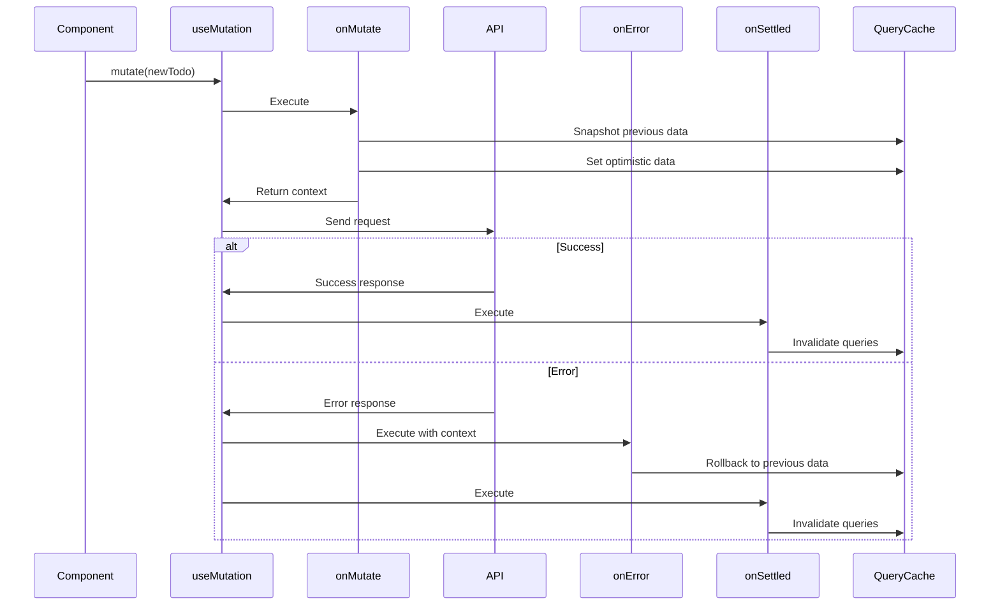
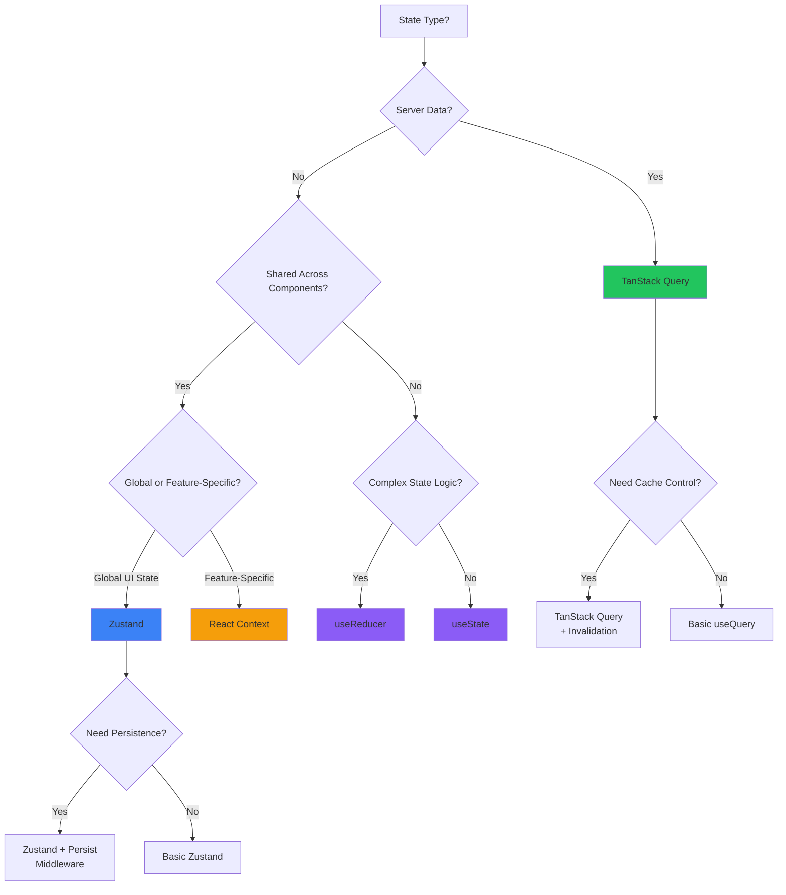
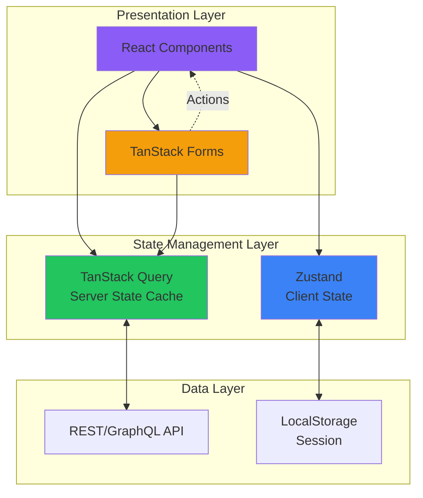
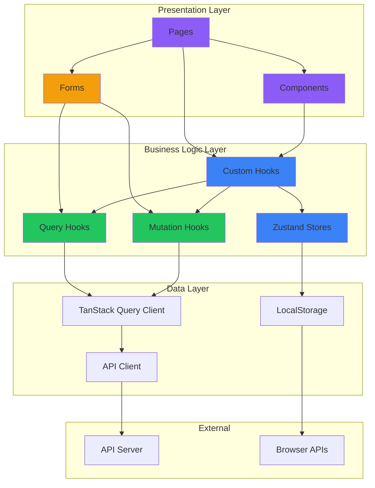

# React 19 SPA Patterns - Research

**Date**: 2025-11-19
**Status**: Research Complete

## Table of Contents

- [Executive Summary](#executive-summary)
- [Technical Deep Dive](#technical-deep-dive)
  - [React 19 Overview](#react-19-overview)
  - [Actions and Form Handling](#actions-and-form-handling)
  - [useActionState Hook](#useactionstate-hook)
  - [The use() API](#the-use-api)
  - [useOptimistic Hook](#useoptimistic-hook)
  - [useFormStatus Hook](#useformstatus-hook)
  - [Improvements to Existing Patterns](#improvements-to-existing-patterns)
  - [Concurrent Rendering Patterns](#concurrent-rendering-patterns)
  - [Resource Management](#resource-management)
  - [Server Components and Actions (SPA Considerations)](#server-components-and-actions-spa-considerations)
  - [Breaking Changes from React 18](#breaking-changes-from-react-18)
- [TanStack Query v5 Patterns](#tanstack-query-v5-patterns)
  - [Overview](#overview)
  - [Major Breaking Changes](#major-breaking-changes)
  - [New Features in v5](#new-features-in-v5)
  - [Query Invalidation Patterns](#query-invalidation-patterns)
  - [Mutations and Error Handling](#mutations-and-error-handling)
  - [Infinite Queries and Pagination](#infinite-queries-and-pagination)
  - [React 19 Integration](#react-19-integration)
  - [Query Key Management](#query-key-management)
  - [Best Practices](#best-practices)
- [TanStack Form Patterns](#tanstack-form-patterns)
  - [Overview](#overview-1)
  - [Core Validation Concepts](#core-validation-concepts)
  - [Synchronous Field Validation](#synchronous-field-validation)
  - [Timing-Based Validation Strategy](#timing-based-validation-strategy)
  - [Error Accessibility](#error-accessibility)
  - [Asynchronous Validation](#asynchronous-validation)
  - [Form-Level Validation](#form-level-validation)
  - [Schema Library Integration](#schema-library-integration)
  - [Submission Control](#submission-control)
  - [Custom Error Objects](#custom-error-objects)
  - [React 19 Integration](#react-19-integration-1)
  - [TanStack Query Integration](#tanstack-query-integration)
  - [Async Validation with TanStack Query](#async-validation-with-tanstack-query)
  - [Best Practices](#best-practices-1)
- [Zustand State Management Patterns](#zustand-state-management-patterns)
  - [Overview](#overview-2)
  - [Basic Store Creation](#basic-store-creation)
  - [Selection Strategies](#selection-strategies)
  - [State Updates](#state-updates)
  - [Async Actions](#async-actions)
  - [Non-Reactive Store Access](#non-reactive-store-access)
  - [Middleware Patterns](#middleware-patterns)
  - [TypeScript Patterns](#typescript-patterns)
  - [Slice Pattern](#slice-pattern)
  - [Performance: Transient Updates](#performance-transient-updates)
  - [Vanilla Store (Non-React)](#vanilla-store-non-react)
  - [React 19 Integration](#react-19-integration-2)
  - [TanStack Query Integration](#tanstack-query-integration-1)
  - [Best Practices](#best-practices-2)
- [Integration Strategies](#integration-strategies)
  - [State Management Decision Tree](#state-management-decision-tree)
  - [React 19 + TanStack Query + Zustand Architecture](#react-19--tanstack-query--zustand-architecture)
  - [Data Flow Architecture](#data-flow-architecture)
  - [Common Patterns](#common-patterns)
  - [Avoiding Common Pitfalls](#avoiding-common-pitfalls)
- [Architecture Recommendations](#architecture-recommendations)
  - [Project Structure](#project-structure)
  - [Code Organization Patterns](#code-organization-patterns)
  - [Separation of Concerns](#separation-of-concerns)
  - [Best Practices Summary](#best-practices-summary)
- [Common Pitfalls and Anti-patterns](#common-pitfalls-and-anti-patterns)
  - [React State Management](#react-state-management)
  - [TanStack Query Anti-patterns](#tanstack-query-anti-patterns)
  - [TanStack Form Anti-patterns](#tanstack-form-anti-patterns)
  - [Zustand Anti-patterns](#zustand-anti-patterns)
  - [Integration Anti-patterns](#integration-anti-patterns)
- [Actionable Recommendations](#actionable-recommendations)
  - [Immediate Next Steps](#immediate-next-steps)
  - [Medium-Term Goals](#medium-term-goals)
  - [Long-Term Considerations](#long-term-considerations)
- [Complete Bibliography](#complete-bibliography)

## Executive Summary

React 19, officially released December 5, 2024, introduces significant improvements for building modern Single Page Applications with a focus on form handling, async operations, and concurrent rendering. The ecosystem has matured with TanStack Query v5, TanStack Form, and Zustand providing complementary solutions for server state, form management, and client state respectively.

**Key Takeaways:**

- **React 19**: Actions simplify async data mutations with automatic pending states, optimistic updates, and error handling. The new `use()` hook enables promise resolution with Suspense, while `ref` as prop eliminates the need for `forwardRef`.

- **TanStack Query v5**: 20% smaller than v4 with simplified API requiring single object signature. New suspense hooks (`useSuspenseQuery`) ensure data is never undefined. Simplified optimistic updates using mutation variables.

- **TanStack Form**: Provides headless, type-safe form management with flexible validation timing (onChange, onBlur, onSubmit). Supports Standard Schema specification (Zod, Valibot, ArkType).

- **Zustand**: Minimal, hooks-first state management using simplified flux principles. Ideal for client state (UI preferences, form state) while TanStack Query handles server state.

- **Integration Strategy**: Separate concerns - TanStack Query for server state, Zustand for client state, TanStack Form for form logic. Combine React 19 Actions with TanStack Query mutations for robust form submissions.

## Technical Deep Dive

### React 19 Overview

React 19 represents a major evolution in how developers handle forms, asynchronous operations, and state management in React applications. Released officially on December 5, 2024 (beta on April 25, 2024), it makes concurrent rendering the default behavior for all apps.

### Actions and Form Handling

Actions are async functions used in transitions to handle pending states, errors, forms, and optimistic updates automatically. Functions that use async transitions are called "Actions."

**Key Capabilities:**

- **Automatic state management**: Pending state starts at the beginning of a request and automatically resets when the final state update is committed
- **Optimistic updates**: Support the `useOptimistic` hook for instant user feedback
- **Error handling**: Display Error Boundaries when requests fail and revert optimistic updates automatically
- **Sequential requests**: Managed automatically by the framework

**Form Integration:**

Forms now accept function props for `action` and `formAction` attributes. React automatically resets uncontrolled forms after successful submissions.

```jsx
<form action={submitAction}>
  <input name="username" />
  <button type="submit">Submit</button>
</form>
```

### useActionState Hook

`useActionState` wraps async functions and returns three values: the action result, the wrapped action function, and a pending state.

**Signature:**

```javascript
const [error, submitAction, isPending] = useActionState(
  async (previousState, formData) => {
    const error = await updateName(formData.get("name"));
    return error || null;
  },
  null // initial state
);
```

**Benefits:**

- **Simplified state management**: Consolidates form state, loading state, and error handling into a single hook
- **Built-in async handling**: Natively supports asynchronous actions, automatically managing transitions
- **Automatic UI updates**: Updates the UI based on form state without manual DOM manipulation
- **FormData integration**: Receives FormData as the second argument by default

### The use() API

A new API for reading resources during render, enabling promise resolution with Suspense and conditional context reading.

**Reading Promises:**

```javascript
function Comments({commentsPromise}) {
  const comments = use(commentsPromise);
  return comments.map(comment => <p key={comment.id}>{comment.text}</p>);
}

function Page() {
  return (
    <Suspense fallback={<Loading />}>
      <Comments commentsPromise={fetchComments()} />
    </Suspense>
  );
}
```

**Key Characteristics:**

- **Can be called conditionally**: Unlike hooks, `use()` can be called inside `if` statements and loops
- **Only callable in render**: Must be called inside a Component or a Hook
- **Suspense integration**: Throws the promise if unresolved, triggering Suspense
- **Error boundary integration**: If promise rejects, React looks for Error Boundary
- **Context reading**: Can read context after early returns (something `useContext` cannot do)

**Important Limitation:**

The `use()` API does not support promises created in render. Promises must be created outside the component or passed as props.

```mermaid
sequenceDiagram
    participant Component
    participant use() API
    participant Suspense
    participant ErrorBoundary

    Component->>use() API: use(promise)
    alt Promise Pending
        use() API->>Suspense: Throw promise
        Suspense->>Component: Render fallback
    else Promise Resolved
        use() API->>Component: Return value
    else Promise Rejected
        use() API->>ErrorBoundary: Throw error
        ErrorBoundary->>Component: Render error UI
    end
```

### useOptimistic Hook

Provides immediate UI feedback during async operations. Returns an optimistic version that automatically reverts if the operation fails.

```javascript
const [optimisticState, addOptimistic] = useOptimistic(
  currentState,
  (state, optimisticValue) => {
    // Merge optimistic value into state
    return [...state, optimisticValue];
  }
);

// In mutation
addOptimistic(newItem);
await saveTodo(newItem); // If fails, automatically reverts
```

### useFormStatus Hook

Provides access to parent form state from deeply nested components without prop drilling.

```javascript
function SubmitButton() {
  const { pending } = useFormStatus();
  return <button disabled={pending}>Submit</button>;
}
```

### Improvements to Existing Patterns

**ref as prop:**

Function components now accept refs directly, eliminating the need for `forwardRef`:

```javascript
// Before
const Input = forwardRef((props, ref) => {
  return <input ref={ref} {...props} />;
});

// After (React 19)
function Input({ ref, ...props }) {
  return <input ref={ref} {...props} />;
}
```

**Cleanup functions for refs:**

Refs can return cleanup functions executed on unmount:

```javascript
<input
  ref={(ref) => {
    // Setup
    ref.focus();

    // Cleanup
    return () => {
      console.log('cleanup');
    };
  }}
/>
```

**Context as provider:**

Use `<Context>` instead of `<Context.Provider>`:

```javascript
// Before
<ThemeContext.Provider value={theme}>
  <App />
</ThemeContext.Provider>

// After (React 19)
<ThemeContext value={theme}>
  <App />
</ThemeContext>
```

**useDeferredValue initialValue:**

New option for setting initial render values:

```javascript
const deferredValue = useDeferredValue(value, initialValue);
```

### Concurrent Rendering Patterns

React 19 makes concurrent rendering the default behavior (previously opt-in in React 18). Concurrent rendering allows React to work on multiple tasks at once, improving performance and user experience.

**How It Works:**

- Allows React to prioritize important updates without blocking the main thread
- Ensures user interactions like typing or clicking happen smoothly
- Prioritizes critical updates and holds less important tasks
- Drives seamless user interactions during heavy rendering workloads

**Integration with Forms:**

React 19 provides deeper integration into Concurrent Rendering on the Client and Streaming Rendering on the Server with built-in support for stylesheets.

### Resource Management

React 19 provides native support for:

- **Document metadata**: `<title>`, `<meta>`, `<link>` can be rendered anywhere in component tree
- **Stylesheet precedence**: Control CSS loading order with `precedence` attribute
- **Async scripts**: Automatic deduplication and optimal loading
- **Preloading APIs**: `preload()`, `prefetchDNS()`, `preinit()` for resource optimization

### Server Components and Actions (SPA Considerations)

React 19 stabilizes Server Components for ahead-of-time rendering and Server Actions via the `"use server"` directive. While primarily for frameworks like Next.js, SPAs can benefit from understanding these patterns for future migration or hybrid approaches.

**For SPAs:**

- Server Components are not directly applicable to client-only SPAs
- Server Actions patterns can inspire API design
- Understanding these features aids in framework migration decisions

### Breaking Changes from React 18

**Removed APIs:**

1. **PropTypes**: PropType checks removed from React package, using them will be silently ignored
2. **defaultProps**: Removed from function components (use ES6 default parameters instead)
3. **Legacy Context**: `contextTypes` and `getChildContext` completely removed
4. **String refs**: No longer supported (use `useRef` or callback refs)
5. **ReactDOM.render**: Must use `ReactDOM.createRoot` instead
6. **ReactDOM.hydrate**: Must use `ReactDOM.hydrateRoot` for SSR
7. **UMD builds**: No longer provided (use ESM-based CDNs like esm.sh)
8. **react-test-renderer**: Deprecated

**TypeScript Changes:**

- Cleaned up types based on removed APIs
- Some removed types moved to more relevant packages
- Must update `@types/react` and `@types/react-dom` to 19.x

**Migration Strategy:**

1. Upgrade to React 18.3 first (includes warnings for deprecated APIs)
2. Run codemods from `react-codemod` repo to automate updates
3. Update TypeScript types to 19.x
4. Test thoroughly, especially error handling and concurrent features

## TanStack Query v5 Patterns

### Overview

TanStack Query v5 is approximately 20% smaller than v4 and provides a more intuitive API. Released in 2024, it represents a significant evolution in React server state management.

### Major Breaking Changes

**1. Single Object Signature**

The biggest breaking change is requiring single object parameter for all hooks and methods:

```tsx
// v4 (multiple overloads)
useQuery(key, fn, options)

// v5 (single object)
useQuery({ queryKey, queryFn, ...options })
```

This applies to:
- All hooks: `useQuery`, `useMutation`, `useInfiniteQuery`, `useQueries`
- QueryClient methods: `fetchQuery`, `prefetchQuery`, `invalidateQueries`, etc.

**2. Status and Loading State Changes**

```tsx
// v4
status: 'loading'
isLoading

// v5
status: 'pending'
isPending

// New isLoading flag
isLoading = isPending && isFetching
```

This distinction clarifies:
- `isPending`: No data yet (initial state)
- `isFetching`: Network request in progress
- `isLoading`: Both pending AND fetching (new data being loaded)

**3. Cache Time to GC Time**

```tsx
// v4
cacheTime: 5 * 60 * 1000

// v5
gcTime: 5 * 60 * 1000 // "garbage collection time"
```

More descriptive naming for when unused queries are removed from cache.

**4. Callback Removal from Queries**

`onSuccess`, `onError`, and `onSettled` removed from queries (mutations still have them):

```tsx
// v4
useQuery({
  queryKey: ['todos'],
  queryFn: fetchTodos,
  onSuccess: (data) => { /* side effect */ }
})

// v5 - Use alternative patterns
useQuery({
  queryKey: ['todos'],
  queryFn: fetchTodos,
})

// Side effects in component
useEffect(() => {
  if (data) {
    // Handle success
  }
}, [data])
```

**5. Infinite Query Changes**

```tsx
// v5 requires explicit initialPageParam
useInfiniteQuery({
  queryKey: ['projects'],
  queryFn: fetchProjects,
  initialPageParam: 0, // Required
  getNextPageParam: (lastPage, pages) => lastPage.nextCursor,
  getPreviousPageParam: (firstPage, pages) => firstPage.prevCursor,
})
```

- `initialPageParam` is now required
- Return `null` or `undefined` from `getNextPageParam` to indicate no more pages
- `refetchPage` replaced by `maxPages` option

**6. Removed Features**

- `.remove()` method on useQuery (use `queryClient.removeQueries()`)
- `isDataEqual` option (use `structuralSharing` instead)
- `keepPreviousData` flag (use `placeholderData` with identity function)
- Custom `context` prop (pass custom `queryClient` directly)

**7. Hydration API Changes**

```tsx
// v4
import { Hydrate } from '@tanstack/react-query'

<Hydrate state={dehydratedState}>
  <App />
</Hydrate>

// v5
import { HydrationBoundary } from '@tanstack/react-query'

<HydrationBoundary state={dehydratedState}>
  <App />
</HydrationBoundary>
```

**8. Server-Side Defaults**

On the server, `retry` now defaults to `0` instead of `3`, ensuring queries with suspense enabled don't retry on the server.

**9. TypeScript Error Type**

Default error type changed from `unknown` to `Error`:

```tsx
// v4
useQuery<Data, unknown>

// v5
useQuery<Data, Error>
```

### New Features in v5

**1. Suspense Hooks**

Dedicated suspense hooks ensure data is never `undefined`:

```tsx
const { data: post } = useSuspenseQuery({
  queryKey: ['post', postId],
  queryFn: () => fetchPost(postId),
})
// `post` is guaranteed to be defined (no undefined type)
```

Available hooks:
- `useSuspenseQuery`
- `useSuspenseInfiniteQuery`
- `useSuspenseQueries`

**2. Simplified Optimistic Updates**

Leverage returned `variables` from mutations:

```tsx
function Todos() {
  const addTodoMutation = useMutation({
    mutationFn: (newTodo: string) => axios.post('/api/data', { text: newTodo }),
  })

  return (
    <ul>
      {todosQuery.data.map(todo => (
        <li key={todo.id}>{todo.text}</li>
      ))}
      {addTodoMutation.isPending && (
        <li key={String(addTodoMutation.submittedAt)} style={{ opacity: 0.5 }}>
          {addTodoMutation.variables}
        </li>
      )}
    </ul>
  )
}
```

**3. MaxPages for Infinite Queries**

Limit stored pages to reduce memory and improve refetch performance:

```tsx
useInfiniteQuery({
  queryKey: ['projects'],
  queryFn: fetchProjects,
  initialPageParam: 0,
  getNextPageParam: (lastPage) => lastPage.nextCursor,
  maxPages: 3, // Keep only the most recent 3 pages
})
```

**4. Mutation State Hook**

Access state of all mutations across components:

```tsx
const mutationState = useMutationState({
  filters: { mutationKey: ['todos'], status: 'pending' },
  select: (mutation) => mutation.state.variables,
})
```

### Query Invalidation Patterns

Query invalidation marks queries as stale and triggers background refetching. This overrides any `staleTime` configurations.

**Basic Invalidation:**

```tsx
// Invalidate all queries
queryClient.invalidateQueries()

// Invalidate by prefix
queryClient.invalidateQueries({ queryKey: ['todos'] })
// Invalidates both ['todos'] and ['todos', { page: 1 }]
```

**Exact Matching:**

```tsx
queryClient.invalidateQueries({
  queryKey: ['todos'],
  exact: true,
})
// Only ['todos'] is invalidated, not ['todos', { type: 'done' }]
```

**Specific Variables:**

```tsx
queryClient.invalidateQueries({
  queryKey: ['todos', { type: 'done' }],
})
```

**Predicate Functions:**

For complex logic:

```tsx
queryClient.invalidateQueries({
  predicate: (query) =>
    query.queryKey[0] === 'todos' && query.queryKey[1]?.version >= 10,
})
```

**Best Practices:**

- Use invalidation after mutations for data consistency
- Prefer prefix matching for related queries
- Use predicates for complex conditions
- Invalidation supersedes configured `staleTime`

### Mutations and Error Handling

**Mutation States:**

A mutation progresses through:
- **Idle**: Fresh or reset state
- **Pending**: Currently executing
- **Error**: Failed with error details
- **Success**: Completed with data

**Basic Usage:**

```tsx
const mutation = useMutation({
  mutationFn: (newTodo) => axios.post('/todos', newTodo),
  onSuccess: async () => {
    // Invalidate and refetch
    await queryClient.invalidateQueries({ queryKey: ['todos'] })
  },
  onError: (error) => {
    // Handle error
    console.error(error)
  },
})

// Trigger mutation
mutation.mutate({ title: 'Do Laundry' })
```

**Lifecycle Callbacks:**

- `onMutate`: Executes before mutation (ideal for optimistic updates)
- `onSuccess`: Fires after successful completion
- `onError`: Handles failures
- `onSettled`: Runs regardless of outcome

**Callback Execution Order:**

```tsx
useMutation({
  mutationFn: addTodo,
  onSuccess: async () => { /* fires first */ },
  onSettled: async () => { /* fires second */ },
})

mutation.mutate(todo, {
  onSuccess: () => { /* fires third (component-specific) */ }
})
```

**Retry Behavior:**

By default, mutations don't retry on error:

```tsx
const mutation = useMutation({
  mutationFn: addTodo,
  retry: 3, // Retry 3 times on failure
})
```

Options:
- `false`: No retry
- `true`: Retry infinitely
- `number`: Retry N times

**Optimistic Updates Pattern:**

```tsx
const mutation = useMutation({
  mutationFn: updateTodo,
  onMutate: async (newTodo) => {
    // Cancel outgoing refetches
    await queryClient.cancelQueries({ queryKey: ['todos'] })

    // Snapshot previous value
    const previousTodos = queryClient.getQueryData(['todos'])

    // Optimistically update
    queryClient.setQueryData(['todos'], (old) => [...old, newTodo])

    // Return context for rollback
    return { previousTodos }
  },
  onError: (err, newTodo, context) => {
    // Rollback on error
    queryClient.setQueryData(['todos'], context.previousTodos)
  },
  onSettled: () => {
    // Refetch to ensure consistency
    queryClient.invalidateQueries({ queryKey: ['todos'] })
  },
})
```



### Infinite Queries and Pagination

**Infinite Queries:**

For "load more" or infinite scroll patterns:

```tsx
const {
  data,
  fetchNextPage,
  hasNextPage,
  isFetchingNextPage,
} = useInfiniteQuery({
  queryKey: ['projects'],
  queryFn: ({ pageParam = 0 }) => fetchProjects(pageParam),
  initialPageParam: 0,
  getNextPageParam: (lastPage, allPages) => lastPage.nextCursor,
  getPreviousPageParam: (firstPage, allPages) => firstPage.prevCursor,
  maxPages: 5, // Limit memory usage
})

// Access data
data.pages.flatMap(page => page.results)
```

**Pagination with placeholderData:**

```tsx
const [page, setPage] = useState(0)

const { data, isPlaceholderData } = useQuery({
  queryKey: ['projects', page],
  queryFn: () => fetchProjects(page),
  placeholderData: (previousData) => previousData, // Keep previous data while fetching
})

// Prefetch next page
useEffect(() => {
  if (!isPlaceholderData && data?.hasMore) {
    queryClient.prefetchQuery({
      queryKey: ['projects', page + 1],
      queryFn: () => fetchProjects(page + 1),
    })
  }
}, [data, isPlaceholderData, page, queryClient])
```

**Prefetching Infinite Queries:**

```tsx
await queryClient.prefetchInfiniteQuery({
  queryKey: ['projects'],
  queryFn: ({ pageParam = 0 }) => fetchProjects(pageParam),
  initialPageParam: 0,
  pages: 3, // Prefetch 3 pages
})
```

### React 19 Integration

**Actions with TanStack Query:**

```tsx
function TodoForm() {
  const queryClient = useQueryClient()

  const mutation = useMutation({
    mutationFn: createTodo,
    onSuccess: () => {
      queryClient.invalidateQueries({ queryKey: ['todos'] })
    },
  })

  const [error, submitAction, isPending] = useActionState(
    async (previousState, formData) => {
      try {
        await mutation.mutateAsync({
          title: formData.get('title'),
        })
        return null
      } catch (err) {
        return err.message
      }
    },
    null
  )

  return (
    <form action={submitAction}>
      <input name="title" />
      <button disabled={isPending}>Add Todo</button>
      {error && <p>{error}</p>}
    </form>
  )
}
```

**Suspense Integration:**

```tsx
function TodoList() {
  const { data } = useSuspenseQuery({
    queryKey: ['todos'],
    queryFn: fetchTodos,
  })

  return (
    <ul>
      {data.map(todo => (
        <li key={todo.id}>{todo.title}</li>
      ))}
    </ul>
  )
}

function App() {
  return (
    <ErrorBoundary fallback={<Error />}>
      <Suspense fallback={<Loading />}>
        <TodoList />
      </Suspense>
    </ErrorBoundary>
  )
}
```

### Query Key Management

**Factory Pattern:**

For larger applications, use a query key factory:

```tsx
// queryKeys.ts
export const todoKeys = {
  all: ['todos'] as const,
  lists: () => [...todoKeys.all, 'list'] as const,
  list: (filters: string) => [...todoKeys.lists(), { filters }] as const,
  details: () => [...todoKeys.all, 'detail'] as const,
  detail: (id: number) => [...todoKeys.details(), id] as const,
}

// Usage
useQuery({
  queryKey: todoKeys.detail(1),
  queryFn: () => fetchTodo(1),
})

// Invalidation
queryClient.invalidateQueries({ queryKey: todoKeys.lists() })
```

**Community Library:**

`@lukemorales/query-key-factory` provides typesafe query key management with auto-completion:

```tsx
import { createQueryKeyStore } from '@lukemorales/query-key-factory'

export const queries = createQueryKeyStore({
  todos: {
    all: null,
    detail: (todoId: number) => ({
      queryKey: [todoId],
      queryFn: () => fetchTodo(todoId),
    }),
  },
})

// Usage with auto-complete
useQuery(queries.todos.detail(1))
```

### Best Practices

1. **Query defaults with increasing specificity**: Generic → Specific
   ```tsx
   queryClient.setQueryDefaults(['todos'], { staleTime: 10 * 1000 })
   queryClient.setQueryDefaults(['todos', 'detail'], { staleTime: 60 * 1000 })
   ```

2. **Use `placeholderData` for pagination**: Replaces deprecated `keepPreviousData`
   ```tsx
   placeholderData: (previousData) => previousData
   ```

3. **Explicitly define `initialPageParam`**: Required in v5 for infinite queries

4. **Use suspense hooks when data must exist**: No need to handle undefined state

5. **Leverage optimistic updates with variables**: Simpler than manual cache updates

6. **Pass custom `queryClient` for isolation**: Useful in microfrontends

7. **Server-side queries use `retry: 0`**: Default in v5, prevents excessive retries

## TanStack Form Patterns

### Overview

TanStack Form is a headless, type-safe, and framework-agnostic form library supporting React, Angular, Vue, Solid, and Lit. It provides highly customizable validation with flexible timing control.

### Core Validation Concepts

**Three Primary Mechanisms:**

1. **Timing Control**: Validators run on specific events (onChange, onBlur, onSubmit)
2. **Scope Flexibility**: Validation at field or form level
3. **Execution Type**: Synchronous or asynchronous validation

### Synchronous Field Validation

Basic validation within validator callbacks:

```tsx
<form.Field
  name="age"
  validators={{
    onChange: ({ value }) =>
      value < 13 ? 'Minimum age requirement not met' : undefined,
  }}
>
  {(field) => (
    <>
      <input
        value={field.state.value}
        onChange={(e) => field.handleChange(e.target.valueAsNumber)}
      />
      {!field.state.meta.isValid && (
        <em>{field.state.meta.errors.join(', ')}</em>
      )}
    </>
  )}
</form.Field>
```

### Timing-Based Validation Strategy

Different validations execute at distinct lifecycle moments:

```tsx
validators={{
  onChange: ({ value }) =>
    value < 13 ? 'Must be at least 13' : undefined,
  onBlur: ({ value }) =>
    value < 0 ? 'Cannot be negative' : undefined,
  onSubmit: ({ value }) =>
    value > 120 ? 'Invalid age' : undefined,
}}
```

**Timing Options:**

- `onChange`: Validates on every value change (immediate feedback)
- `onChangeAsync`: Async validation on change (with debouncing)
- `onBlur`: Validates when field loses focus
- `onBlurAsync`: Async validation on blur
- `onSubmit`: Validates on form submission
- `onSubmitAsync`: Async validation on submission

### Error Accessibility

**Array-based approach** (all active errors):

```tsx
{field.state.meta.errors.join(', ')}
```

**Map-based approach** (error by validation trigger):

```tsx
{field.state.meta.errorMap['onChange']}
{field.state.meta.errorMap['onBlur']}
```

### Asynchronous Validation

Network requests and database checks with built-in debouncing:

```tsx
validators={{
  onChangeAsync: async ({ value }) => {
    const isAvailable = await checkUsernameAvailability(value)
    return !isAvailable ? 'Username taken' : undefined
  },
  onChangeAsyncDebounceMs: 500, // Prevents excessive requests
}}
```

**Execution Order:**

- Synchronous validators run first
- Async validators run only if sync validators pass
- Use `asyncAlways: true` to run async validators regardless

### Form-Level Validation

Define validation affecting multiple fields:

```tsx
const form = useForm({
  validators: {
    onChange({ value }) {
      if (value.password !== value.confirmPassword) {
        return {
          fields: {
            confirmPassword: 'Passwords must match'
          }
        }
      }
    },
  },
})
```

**Server-Side Validation:**

Populate field errors from server response:

```tsx
onSubmitAsync: async ({ value }) => {
  const serverErrors = await validateOnServer(value)
  if (serverErrors) {
    return {
      fields: {
        'details.email': 'Email already registered',
        'socials[0].url': 'Invalid URL',
      },
    }
  }
}
```

### Schema Library Integration

TanStack Form supports Standard Schema specification:

**Zod Integration:**

```tsx
import { z } from 'zod'

const schema = z.object({
  age: z.number().gte(13, 'Minimum age not met'),
  email: z.string().email('Invalid email'),
})

const form = useForm({
  validators: {
    onChange: schema,
  },
})
```

**Supported Libraries:**

- Zod
- Valibot
- ArkType
- Effect/Schema

**Per-Field Schema:**

Unlike many libraries, TanStack Form applies schemas per-field:

```tsx
<form.Field
  name="email"
  validators={{
    onChange: z.string().email(),
  }}
>
  {/* ... */}
</form.Field>
```

### Submission Control

The form tracks `canSubmit` flag preventing invalid submissions:

```tsx
<form.Subscribe
  selector={(state) => [state.canSubmit, state.isPristine]}
  children={([canSubmit, isPristine]) => (
    <button disabled={!canSubmit || isPristine}>
      Submit
    </button>
  )}
/>
```

**Form State Properties:**

- `canSubmit`: Form has no errors and is ready to submit
- `isPristine`: Form has not been modified
- `isSubmitting`: Form is currently submitting
- `isSubmitted`: Form has been submitted at least once
- `isValidating`: Form is running validation
- `errors`: Array of form-level errors
- `errorMap`: Map of errors by validation trigger

### Custom Error Objects

Return structured error objects for granular error tracking:

```tsx
onChange: ({ value }) =>
  value < 13
    ? { code: 'AGE_MINIMUM', severity: 'error', message: 'Too young' }
    : undefined
```

### React 19 Integration

**With Actions:**

```tsx
function MyForm() {
  const form = useForm({
    defaultValues: {
      username: '',
    },
    onSubmit: async ({ value }) => {
      await saveUser(value)
    },
  })

  const [error, submitAction, isPending] = useActionState(
    async (previousState, formData) => {
      try {
        await form.handleSubmit()
        return null
      } catch (err) {
        return err.message
      }
    },
    null
  )

  return (
    <form action={submitAction}>
      <form.Field name="username">
        {(field) => (
          <input
            value={field.state.value}
            onChange={(e) => field.handleChange(e.target.value)}
          />
        )}
      </form.Field>
      <button disabled={isPending}>Submit</button>
      {error && <p>{error}</p>}
    </form>
  )
}
```

### TanStack Query Integration

**Official Pattern:**

```tsx
function UserForm({ userId }) {
  const queryClient = useQueryClient()

  // Fetch initial data
  const { data: user } = useQuery({
    queryKey: ['user', userId],
    queryFn: () => fetchUser(userId),
  })

  // Save mutation
  const saveMutation = useMutation({
    mutationFn: (data) => saveUser(userId, data),
    onSuccess: () => {
      queryClient.invalidateQueries({ queryKey: ['user', userId] })
    },
  })

  const form = useForm({
    defaultValues: {
      name: user?.name ?? '',
      email: user?.email ?? '',
    },
    onSubmit: async ({ value }) => {
      await saveMutation.mutateAsync(value)
      form.reset() // Reset form after success
    },
  })

  return (
    <form onSubmit={(e) => {
      e.preventDefault()
      form.handleSubmit()
    }}>
      {/* Fields */}
    </form>
  )
}
```

**Known Challenges:**

- Using `mutateAsync` works but may show "Uncaught promise" in console
- Using `mutate` doesn't properly set `form.state.isSubmitSuccessful` on failure
- Integration is functional but may require additional error handling

**Recommended Pattern:**

```tsx
onSubmit: async ({ value }) => {
  try {
    await saveMutation.mutateAsync(value)
    // Success handling
  } catch (error) {
    // Error handling
    throw error // Re-throw for form error state
  }
}
```

### Async Validation with TanStack Query

Use queries for async validation:

```tsx
const form = useForm({
  // ...
})

<form.Field
  name="username"
  validators={{
    onChangeAsync: async ({ value }) => {
      // Use a query for validation
      const result = await queryClient.fetchQuery({
        queryKey: ['username-check', value],
        queryFn: () => checkUsername(value),
        staleTime: 10000, // Cache validation results
      })
      return result.available ? undefined : 'Username taken'
    },
    onChangeAsyncDebounceMs: 500,
  }}
>
  {/* ... */}
</form.Field>
```

### Best Practices

1. **Validate at appropriate times**: Use `onChange` for immediate feedback, `onBlur` for format validation, `onSubmit` for final checks

2. **Debounce async validation**: Always set `onChangeAsyncDebounceMs` for network requests

3. **Use schema libraries for complex validation**: Zod, Valibot provide better error messages and TypeScript inference

4. **Separate client and server validation**: Client for UX, server for security

5. **Leverage form-level validation for cross-field logic**: Password confirmation, date ranges, etc.

6. **Cache async validation results**: Use TanStack Query for validation requests

7. **Provide clear error messages**: Use error map for granular feedback

8. **Control submit button state**: Combine `canSubmit` and `isPristine`

## Zustand State Management Patterns

### Overview

Zustand is "a small, fast and scalable bearbones state-management solution using simplified flux principles." It uses React hooks without requiring context providers.

### Basic Store Creation

```javascript
import { create } from 'zustand'

const useBearStore = create((set) => ({
  bears: 0,
  increasePopulation: () => set((state) => ({ bears: state.bears + 1 })),
  removeAllBears: () => set({ bears: 0 }),
}))
```

**Consumption:**

```javascript
// Single value
const bears = useBearStore((state) => state.bears)

// Action
const increasePopulation = useBearStore((state) => state.increasePopulation)
```

### Selection Strategies

**Single Values:**

Use atomic selections for efficiency with strict equality checks:

```javascript
const bears = useBearStore((state) => state.bears)
```

**Multiple Values:**

The `useShallow` utility prevents unnecessary re-renders:

```javascript
import { useShallow } from 'zustand/react/shallow'

const { nuts, honey } = useBearStore(
  useShallow((state) => ({ nuts: state.nuts, honey: state.honey }))
)
```

**Custom Equality:**

For advanced control:

```javascript
import { createWithEqualityFn } from 'zustand/traditional'
import { shallow } from 'zustand/shallow'

const useStore = createWithEqualityFn(
  (set) => ({ /* state */ }),
  shallow
)
```

### State Updates

**Direct Merge (default):**

```javascript
set({ bears: 5 })
```

**Functional Update:**

```javascript
set((state) => ({ bears: state.bears + 1 }))
```

**Replace Entire State:**

```javascript
set({}, true) // Use sparingly
```

### Async Actions

Async operations work naturally without special handling:

```javascript
const useFishStore = create((set) => ({
  fishies: {},
  fetch: async (pond) => {
    const response = await fetch(pond)
    set({ fishies: await response.json() })
  },
}))
```

### Non-Reactive Store Access

The store exposes utility methods for reading/writing outside components:

```javascript
// Read
const paw = useBearStore.getState().paw

// Write
useBearStore.setState({ paw: false })

// Subscribe
const unsub = useBearStore.subscribe((state, prevState) => {
  console.log('State changed', state)
})
unsub() // Cleanup
```

### Middleware Patterns

**Persist Middleware:**

```javascript
import { create } from 'zustand'
import { persist } from 'zustand/middleware'

const useStore = create(
  persist(
    (set) => ({
      bears: 0,
      increase: () => set((state) => ({ bears: state.bears + 1 })),
    }),
    {
      name: 'bear-storage', // localStorage key
      storage: createJSONStorage(() => localStorage),
    }
  )
)
```

**DevTools Middleware:**

```javascript
import { devtools } from 'zustand/middleware'

const useStore = create(
  devtools((set) => ({
    // state
  }))
)
```

**Immer Middleware:**

```javascript
import { immer } from 'zustand/middleware/immer'

const useStore = create(
  immer((set) => ({
    bears: 0,
    increase: () => set((state) => {
      state.bears++ // Mutate draft state
    }),
  }))
)
```

**Combining Middleware:**

```javascript
const useStore = create(
  devtools(
    persist(
      immer((set) => ({
        // state
      })),
      { name: 'my-store' }
    )
  )
)
```

**Important**: Apply middleware in the combined store, not individual slices.

### TypeScript Patterns

**Basic TypeScript:**

```typescript
import { create } from 'zustand'

interface BearState {
  bears: number
  increase: (by: number) => void
}

const useBearStore = create<BearState>()((set) => ({
  bears: 0,
  increase: (by) => set((state) => ({ bears: state.bears + by })),
}))
```

**Note the double call**: `create<BearState>()((set) => ...)` instead of `create<BearState>((set) => ...)`

### Slice Pattern

For larger stores, divide into smaller slices:

```typescript
// slices/bearSlice.ts
export interface BearSlice {
  bears: number
  addBear: () => void
  eatFish: () => void
}

export const createBearSlice: StateCreator<
  BearSlice & FishSlice,
  [],
  [],
  BearSlice
> = (set) => ({
  bears: 0,
  addBear: () => set((state) => ({ bears: state.bears + 1 })),
  eatFish: () => set((state) => ({ fish: state.fish - 1 })),
})

// slices/fishSlice.ts
export interface FishSlice {
  fish: number
  addFish: () => void
}

export const createFishSlice: StateCreator<
  BearSlice & FishSlice,
  [],
  [],
  FishSlice
> = (set) => ({
  fish: 0,
  addFish: () => set((state) => ({ fish: state.fish + 1 })),
})

// store.ts
import { create } from 'zustand'
import { createBearSlice, BearSlice } from './slices/bearSlice'
import { createFishSlice, FishSlice } from './slices/fishSlice'

const useStore = create<BearSlice & FishSlice>()((...a) => ({
  ...createBearSlice(...a),
  ...createFishSlice(...a),
}))
```

**TypeScript Challenges:**

Using slice pattern with TypeScript is very tricky, especially with 15-20 slices. Community created `zustand-slices` library for TypeScript-friendly slice pattern.

**Alternative: zustand-slices library:**

```typescript
import { createSlice } from 'zustand-slices'

const bearSlice = createSlice({
  name: 'bear',
  value: 0,
  actions: {
    increase: (value) => value + 1,
  },
})

const useStore = create(bearSlice)
```

### Performance: Transient Updates

For high-frequency state changes, use subscriptions instead of hooks:

```javascript
const scratchRef = useRef(useScratchStore.getState().scratches)

useEffect(() =>
  useScratchStore.subscribe(
    state => (scratchRef.current = state.scratches)
  ), []
)
```

This prevents re-renders on every update.

### Vanilla Store (Non-React)

For use outside React:

```javascript
import { createStore } from 'zustand/vanilla'

const store = createStore((set) => ({
  bears: 0,
  increase: () => set((state) => ({ bears: state.bears + 1 })),
}))

const { getState, setState, subscribe } = store
```

Bind to React later:

```javascript
import { useStore } from 'zustand'

const useBoundStore = (selector) => useStore(vanillaStore, selector)
```

### React 19 Integration

Zustand's subscription-based model complements React 19's concurrent features:

**With Actions:**

```tsx
const useFormStore = create((set) => ({
  formData: {},
  setFormData: (data) => set({ formData: data }),
  submitForm: async (data) => {
    set({ isSubmitting: true })
    try {
      await saveData(data)
      set({ isSubmitting: false, formData: {} })
    } catch (error) {
      set({ isSubmitting: false, error })
    }
  },
}))

function MyForm() {
  const { formData, setFormData, submitForm } = useFormStore()

  const [error, submitAction, isPending] = useActionState(
    async (previousState, formData) => {
      try {
        await submitForm(formData)
        return null
      } catch (err) {
        return err.message
      }
    },
    null
  )

  return (
    <form action={submitAction}>
      {/* form fields */}
    </form>
  )
}
```

**With Suspense:**

Zustand works seamlessly with Suspense boundaries:

```tsx
function App() {
  return (
    <Suspense fallback={<Loading />}>
      <UserProfile />
    </Suspense>
  )
}

function UserProfile() {
  const user = useUserStore((state) => state.user)
  // Zustand updates don't interfere with Suspense
  return <div>{user.name}</div>
}
```

### TanStack Query Integration

**Separation of Concerns:**

- **Zustand**: Client state (UI preferences, form state, app settings)
- **TanStack Query**: Server state (API data, cache, synchronization)

**Combined Pattern:**

```typescript
// Client state in Zustand
const useUIStore = create((set) => ({
  sidebarOpen: true,
  theme: 'light',
  toggleSidebar: () => set((state) => ({ sidebarOpen: !state.sidebarOpen })),
  setTheme: (theme) => set({ theme }),
}))

// Server state in TanStack Query
function useTodos() {
  return useQuery({
    queryKey: ['todos'],
    queryFn: fetchTodos,
  })
}

// Component uses both
function TodoList() {
  const { sidebarOpen, toggleSidebar } = useUIStore()
  const { data: todos } = useTodos()

  return (
    <div>
      <button onClick={toggleSidebar}>Toggle Sidebar</button>
      {/* render todos */}
    </div>
  )
}
```

**When to Use What:**

| State Type | Use Zustand | Use TanStack Query |
|------------|-------------|-------------------|
| User preferences | ✅ | ❌ |
| Form state | ✅ | ❌ |
| Modal open/closed | ✅ | ❌ |
| Theme settings | ✅ | ❌ |
| API data | ❌ | ✅ |
| Cached responses | ❌ | ✅ |
| Paginated lists | ❌ | ✅ |
| Real-time sync | ❌ | ✅ |

**Coordinating Updates:**

```typescript
const useAppStore = create((set) => ({
  selectedTodoId: null,
  setSelectedTodoId: (id) => set({ selectedTodoId: id }),
}))

function TodoDetail() {
  const selectedTodoId = useAppStore((state) => state.selectedTodoId)

  const { data: todo } = useQuery({
    queryKey: ['todo', selectedTodoId],
    queryFn: () => fetchTodo(selectedTodoId),
    enabled: !!selectedTodoId, // Only fetch when ID selected
  })

  return <div>{todo?.title}</div>
}
```

### Best Practices

1. **Use selectors wisely**: Extract specific state slices to prevent unnecessary re-renders

2. **Maintain immutability**: Create new state objects rather than modifying existing state

3. **Apply middleware in combined store**: Not individual slices

4. **Use `useShallow` for multiple values**: Prevents re-renders from object reference changes

5. **Leverage subscriptions for high-frequency updates**: Avoid component re-renders

6. **Separate client and server state**: Use Zustand for client, TanStack Query for server

7. **Use slice pattern for large stores**: Improve code organization and maintainability

8. **Persist only necessary state**: Be selective with persist middleware

9. **Use TypeScript for type safety**: Define state and action interfaces

10. **Test stores independently**: Stores are vanilla JS, easy to unit test

## Integration Strategies

### State Management Decision Tree



### React 19 + TanStack Query + Zustand Architecture

**Complete Example:**

```typescript
// 1. Zustand for Client State
const useUIStore = create(
  persist(
    (set) => ({
      theme: 'light',
      sidebarCollapsed: false,
      toggleTheme: () => set((state) => ({
        theme: state.theme === 'light' ? 'dark' : 'light'
      })),
      toggleSidebar: () => set((state) => ({
        sidebarCollapsed: !state.sidebarCollapsed
      })),
    }),
    { name: 'ui-settings' }
  )
)

// 2. TanStack Query for Server State
function useTodos() {
  return useQuery({
    queryKey: ['todos'],
    queryFn: fetchTodos,
    staleTime: 30000,
  })
}

function useCreateTodo() {
  const queryClient = useQueryClient()

  return useMutation({
    mutationFn: createTodo,
    onMutate: async (newTodo) => {
      await queryClient.cancelQueries({ queryKey: ['todos'] })
      const previous = queryClient.getQueryData(['todos'])

      queryClient.setQueryData(['todos'], (old) =>
        [...(old ?? []), { ...newTodo, id: 'temp', createdAt: new Date() }]
      )

      return { previous }
    },
    onError: (err, newTodo, context) => {
      queryClient.setQueryData(['todos'], context.previous)
    },
    onSuccess: () => {
      queryClient.invalidateQueries({ queryKey: ['todos'] })
    },
  })
}

// 3. TanStack Form for Form Logic
function TodoForm() {
  const createTodo = useCreateTodo()

  const form = useForm({
    defaultValues: {
      title: '',
      description: '',
    },
    validators: {
      onChange: z.object({
        title: z.string().min(1, 'Required'),
        description: z.string(),
      }),
    },
    onSubmit: async ({ value }) => {
      await createTodo.mutateAsync(value)
      form.reset()
    },
  })

  // 4. React 19 Actions
  const [error, submitAction, isPending] = useActionState(
    async (previousState, formData) => {
      try {
        await form.handleSubmit()
        return null
      } catch (err) {
        return err.message
      }
    },
    null
  )

  return (
    <form action={submitAction}>
      <form.Field name="title">
        {(field) => (
          <div>
            <input
              value={field.state.value}
              onChange={(e) => field.handleChange(e.target.value)}
              placeholder="Todo title"
            />
            {field.state.meta.errors && (
              <span>{field.state.meta.errors.join(', ')}</span>
            )}
          </div>
        )}
      </form.Field>

      <form.Field name="description">
        {(field) => (
          <textarea
            value={field.state.value}
            onChange={(e) => field.handleChange(e.target.value)}
            placeholder="Description"
          />
        )}
      </form.Field>

      <form.Subscribe selector={(state) => [state.canSubmit]}>
        {([canSubmit]) => (
          <button disabled={!canSubmit || isPending}>
            {isPending ? 'Creating...' : 'Create Todo'}
          </button>
        )}
      </form.Subscribe>

      {error && <p style={{ color: 'red' }}>{error}</p>}
    </form>
  )
}

// 5. Component using all libraries
function TodoApp() {
  const { theme, toggleTheme } = useUIStore()
  const { data: todos, isLoading } = useTodos()

  return (
    <div className={theme}>
      <header>
        <h1>Todo App</h1>
        <button onClick={toggleTheme}>
          Toggle Theme
        </button>
      </header>

      <ErrorBoundary fallback={<Error />}>
        <Suspense fallback={<Loading />}>
          <TodoForm />
          <TodoList todos={todos} />
        </Suspense>
      </ErrorBoundary>
    </div>
  )
}
```

### Data Flow Architecture



### Common Patterns

**1. Form Submission with Optimistic Updates:**

```typescript
function TodoForm() {
  const queryClient = useQueryClient()
  const [optimisticTodo, addOptimistic] = useOptimistic([])

  const mutation = useMutation({
    mutationFn: createTodo,
    onSuccess: () => {
      queryClient.invalidateQueries({ queryKey: ['todos'] })
    },
  })

  const form = useForm({
    onSubmit: async ({ value }) => {
      addOptimistic(value) // React 19 optimistic update
      await mutation.mutateAsync(value)
    },
  })

  return <form>{/* fields */}</form>
}
```

**2. Persisted UI State with Server Data:**

```typescript
const useAppStore = create(
  persist(
    (set) => ({
      viewMode: 'grid',
      filters: {},
      setViewMode: (mode) => set({ viewMode: mode }),
      setFilters: (filters) => set({ filters }),
    }),
    { name: 'app-preferences' }
  )
)

function ProductList() {
  const { viewMode, filters } = useAppStore()

  const { data: products } = useQuery({
    queryKey: ['products', filters],
    queryFn: () => fetchProducts(filters),
  })

  return (
    <div className={viewMode}>
      {products?.map(product => <ProductCard key={product.id} {...product} />)}
    </div>
  )
}
```

**3. Async Validation with TanStack Query:**

```typescript
function SignupForm() {
  const queryClient = useQueryClient()

  const form = useForm({
    defaultValues: { username: '', email: '' },
    validators: {
      onChangeAsync: async ({ value }) => {
        if (value.username) {
          const available = await queryClient.fetchQuery({
            queryKey: ['username-check', value.username],
            queryFn: () => checkUsername(value.username),
            staleTime: 60000, // Cache for 1 minute
          })
          if (!available) {
            return { fields: { username: 'Username taken' } }
          }
        }
      },
      onChangeAsyncDebounceMs: 500,
    },
  })

  return <form>{/* fields */}</form>
}
```

**4. Suspense with Error Boundaries:**

```typescript
function App() {
  return (
    <ErrorBoundary fallback={<ErrorPage />}>
      <Suspense fallback={<PageLoader />}>
        <Router />
      </Suspense>
    </ErrorBoundary>
  )
}

function TodoPage() {
  // useSuspenseQuery ensures data is always defined
  const { data: todos } = useSuspenseQuery({
    queryKey: ['todos'],
    queryFn: fetchTodos,
  })

  // No need to check for undefined
  return (
    <ul>
      {todos.map(todo => <TodoItem key={todo.id} {...todo} />)}
    </ul>
  )
}
```

### Avoiding Common Pitfalls

**1. Duplicate State:**

❌ **Don't store server data in Zustand:**

```typescript
// Bad
const useStore = create((set) => ({
  todos: [],
  fetchTodos: async () => {
    const todos = await fetch('/api/todos')
    set({ todos })
  },
}))
```

✅ **Use TanStack Query for server data:**

```typescript
// Good
const useTodos = () => useQuery({
  queryKey: ['todos'],
  queryFn: fetchTodos,
})
```

**2. Stale Cache:**

❌ **Don't manually sync cache:**

```typescript
// Bad
mutation.mutate(newTodo, {
  onSuccess: () => {
    const todos = queryClient.getQueryData(['todos'])
    queryClient.setQueryData(['todos'], [...todos, newTodo])
  },
})
```

✅ **Invalidate queries:**

```typescript
// Good
mutation.mutate(newTodo, {
  onSuccess: () => {
    queryClient.invalidateQueries({ queryKey: ['todos'] })
  },
})
```

**3. Props in Initial State:**

❌ **Don't use props for useState initial value:**

```typescript
// Bad - doesn't update when props change
function Component({ initialValue }) {
  const [value, setValue] = useState(initialValue)
  // ...
}
```

✅ **Use props directly or sync with useEffect:**

```typescript
// Good - controlled component
function Component({ value, onChange }) {
  return <input value={value} onChange={onChange} />
}

// Or if you need local state
function Component({ defaultValue }) {
  const [value, setValue] = useState(defaultValue)

  useEffect(() => {
    setValue(defaultValue)
  }, [defaultValue])
}
```

**4. Missing Dependencies:**

❌ **Don't omit dependencies:**

```typescript
// Bad
useEffect(() => {
  fetchData(id)
}, []) // Missing 'id'
```

✅ **Include all dependencies:**

```typescript
// Good
useEffect(() => {
  fetchData(id)
}, [id])
```

**5. Over-using Context:**

❌ **Don't use Context for everything:**

```typescript
// Bad - too much in context
const AppContext = createContext({
  user: null,
  todos: [],
  theme: 'light',
  notifications: [],
  // ... 20 more things
})
```

✅ **Separate concerns:**

```typescript
// Good
const useUser = () => useQuery({ queryKey: ['user'], queryFn: fetchUser })
const useTodos = () => useQuery({ queryKey: ['todos'], queryFn: fetchTodos })
const useTheme = () => useUIStore((state) => state.theme)
```

## Architecture Recommendations

### Project Structure

**Recommended folder structure for React 19 SPA with TanStack Query, TanStack Form, and Zustand:**

```
src/
├── components/           # Reusable UI components
│   ├── common/          # Generic components (Button, Input, Modal)
│   ├── forms/           # Form components (LoginForm, SignupForm)
│   └── layouts/         # Layout components (Header, Sidebar, Footer)
│
├── features/            # Feature-based modules
│   ├── auth/
│   │   ├── api/        # API calls for auth
│   │   ├── components/ # Auth-specific components
│   │   ├── hooks/      # Custom hooks (useAuth, useLogin)
│   │   ├── queries/    # TanStack Query hooks
│   │   └── store/      # Zustand slices for auth state
│   │
│   ├── todos/
│   │   ├── api/
│   │   ├── components/
│   │   ├── hooks/
│   │   ├── queries/
│   │   └── types.ts
│   │
│   └── profile/
│       └── ...
│
├── lib/                 # Third-party library configurations
│   ├── queryClient.ts  # TanStack Query client setup
│   ├── api.ts          # API client (axios/fetch)
│   └── validation.ts   # Shared validation schemas
│
├── stores/              # Global Zustand stores
│   ├── ui.ts           # UI state (theme, sidebar, modals)
│   ├── app.ts          # App-level state
│   └── index.ts        # Combined store exports
│
├── hooks/               # Shared custom hooks
│   ├── useDebounce.ts
│   ├── useLocalStorage.ts
│   └── useMediaQuery.ts
│
├── utils/               # Utility functions
│   ├── format.ts
│   ├── validation.ts
│   └── helpers.ts
│
├── types/               # Global TypeScript types
│   ├── api.ts
│   ├── models.ts
│   └── index.ts
│
├── pages/               # Page components (if using routing)
│   ├── HomePage.tsx
│   ├── TodosPage.tsx
│   └── ProfilePage.tsx
│
├── App.tsx              # Root component
├── main.tsx             # Entry point
└── router.tsx           # React Router setup (optional)
```

**Alternative Feature-First Structure (for larger apps):**

```
src/
├── features/
│   ├── auth/
│   │   ├── components/
│   │   │   ├── LoginForm.tsx
│   │   │   └── SignupForm.tsx
│   │   ├── api/
│   │   │   └── authApi.ts
│   │   ├── hooks/
│   │   │   ├── useAuth.ts
│   │   │   ├── useLogin.ts
│   │   │   └── useSignup.ts
│   │   ├── store/
│   │   │   └── authSlice.ts
│   │   ├── types.ts
│   │   └── index.ts         # Public exports
│   │
│   └── todos/
│       ├── components/
│       │   ├── TodoList.tsx
│       │   ├── TodoItem.tsx
│       │   └── TodoForm.tsx
│       ├── api/
│       │   └── todosApi.ts
│       ├── hooks/
│       │   ├── useTodos.ts
│       │   ├── useCreateTodo.ts
│       │   └── useUpdateTodo.ts
│       ├── queries/
│       │   └── todoQueries.ts  # Query key factory
│       ├── types.ts
│       └── index.ts
│
├── shared/              # Shared across features
│   ├── components/
│   ├── hooks/
│   ├── utils/
│   └── types/
│
├── core/                # Core app setup
│   ├── providers/
│   │   ├── QueryProvider.tsx
│   │   └── ThemeProvider.tsx
│   ├── router/
│   │   └── Router.tsx
│   └── config/
│       └── queryClient.ts
│
└── app/
    ├── App.tsx
    └── main.tsx
```

### Code Organization Patterns

**1. Query Key Factory Pattern:**

```typescript
// features/todos/queries/todoQueries.ts
export const todoQueries = {
  all: ['todos'] as const,
  lists: () => [...todoQueries.all, 'list'] as const,
  list: (filters: TodoFilters) => [...todoQueries.lists(), filters] as const,
  details: () => [...todoQueries.all, 'detail'] as const,
  detail: (id: number) => [...todoQueries.details(), id] as const,
}

// Usage
export function useTodos(filters: TodoFilters) {
  return useQuery({
    queryKey: todoQueries.list(filters),
    queryFn: () => fetchTodos(filters),
  })
}

export function useTodo(id: number) {
  return useQuery({
    queryKey: todoQueries.detail(id),
    queryFn: () => fetchTodo(id),
  })
}

// Invalidation
queryClient.invalidateQueries({ queryKey: todoQueries.lists() })
```

**2. Zustand Slice Pattern:**

```typescript
// stores/slices/uiSlice.ts
export interface UISlice {
  theme: 'light' | 'dark'
  sidebarOpen: boolean
  toggleTheme: () => void
  toggleSidebar: () => void
}

export const createUISlice: StateCreator<UISlice> = (set) => ({
  theme: 'light',
  sidebarOpen: true,
  toggleTheme: () => set((state) => ({
    theme: state.theme === 'light' ? 'dark' : 'light'
  })),
  toggleSidebar: () => set((state) => ({
    sidebarOpen: !state.sidebarOpen
  })),
})

// stores/index.ts
import { create } from 'zustand'
import { persist } from 'zustand/middleware'
import { createUISlice, UISlice } from './slices/uiSlice'

type StoreState = UISlice // & OtherSlices

export const useStore = create<StoreState>()(
  persist(
    (...a) => ({
      ...createUISlice(...a),
      // ...createOtherSlice(...a),
    }),
    { name: 'app-storage' }
  )
)

// Convenience hooks
export const useTheme = () => useStore((state) => state.theme)
export const useSidebar = () => useStore((state) => state.sidebarOpen)
```

**3. Custom Hook Patterns:**

```typescript
// features/todos/hooks/useTodos.ts
export function useTodos(filters?: TodoFilters) {
  return useQuery({
    queryKey: todoQueries.list(filters ?? {}),
    queryFn: () => fetchTodos(filters),
    staleTime: 30000,
  })
}

// features/todos/hooks/useCreateTodo.ts
export function useCreateTodo() {
  const queryClient = useQueryClient()

  return useMutation({
    mutationFn: createTodo,
    onSuccess: () => {
      queryClient.invalidateQueries({ queryKey: todoQueries.lists() })
    },
  })
}

// features/todos/hooks/useUpdateTodo.ts
export function useUpdateTodo() {
  const queryClient = useQueryClient()

  return useMutation({
    mutationFn: ({ id, data }: { id: number; data: TodoUpdate }) =>
      updateTodo(id, data),
    onMutate: async ({ id, data }) => {
      // Optimistic update
      await queryClient.cancelQueries({ queryKey: todoQueries.detail(id) })
      const previous = queryClient.getQueryData(todoQueries.detail(id))

      queryClient.setQueryData(todoQueries.detail(id), (old: Todo) => ({
        ...old,
        ...data,
      }))

      return { previous }
    },
    onError: (err, { id }, context) => {
      queryClient.setQueryData(todoQueries.detail(id), context.previous)
    },
    onSettled: (data, error, { id }) => {
      queryClient.invalidateQueries({ queryKey: todoQueries.detail(id) })
      queryClient.invalidateQueries({ queryKey: todoQueries.lists() })
    },
  })
}
```

**4. Form Component Pattern:**

```typescript
// features/todos/components/TodoForm.tsx
import { useForm } from '@tanstack/react-form'
import { z } from 'zod'
import { useCreateTodo } from '../hooks/useCreateTodo'

const todoSchema = z.object({
  title: z.string().min(1, 'Required'),
  description: z.string(),
  priority: z.enum(['low', 'medium', 'high']),
})

export function TodoForm({ onSuccess }: { onSuccess?: () => void }) {
  const createTodo = useCreateTodo()

  const form = useForm({
    defaultValues: {
      title: '',
      description: '',
      priority: 'medium' as const,
    },
    validators: {
      onChange: todoSchema,
    },
    onSubmit: async ({ value }) => {
      await createTodo.mutateAsync(value)
      form.reset()
      onSuccess?.()
    },
  })

  return (
    <form onSubmit={(e) => {
      e.preventDefault()
      form.handleSubmit()
    }}>
      <form.Field name="title">
        {(field) => (
          <div>
            <label htmlFor="title">Title</label>
            <input
              id="title"
              value={field.state.value}
              onChange={(e) => field.handleChange(e.target.value)}
            />
            {field.state.meta.errors && (
              <span className="error">
                {field.state.meta.errors.join(', ')}
              </span>
            )}
          </div>
        )}
      </form.Field>

      {/* Other fields */}

      <form.Subscribe selector={(state) => [state.canSubmit]}>
        {([canSubmit]) => (
          <button disabled={!canSubmit || createTodo.isPending}>
            {createTodo.isPending ? 'Creating...' : 'Create Todo'}
          </button>
        )}
      </form.Subscribe>
    </form>
  )
}
```

### Separation of Concerns

**Layer Architecture:**



**Responsibilities:**

- **Presentation Layer**: UI rendering, user interactions, layout
- **Business Logic Layer**: State management, data transformations, side effects
- **Data Layer**: API communication, caching, persistence

### Best Practices Summary

**React 19:**

1. Use Actions for form submissions with async operations
2. Leverage `use()` hook for promise resolution with Suspense
3. Remove `forwardRef` - use `ref` as prop directly
4. Use `useOptimistic` for immediate UI feedback
5. Wrap components with ErrorBoundary + Suspense for declarative error/loading states

**TanStack Query:**

1. Use single object signature for all hooks/methods
2. Implement query key factories for consistency
3. Use `useSuspenseQuery` when data must exist
4. Invalidate queries after mutations
5. Leverage optimistic updates with mutation variables
6. Set `initialPageParam` for infinite queries
7. Use `placeholderData` for pagination (replaces `keepPreviousData`)

**TanStack Form:**

1. Validate at appropriate timing (onChange/onBlur/onSubmit)
2. Debounce async validation to reduce network requests
3. Use schema libraries (Zod, Valibot) for complex validation
4. Separate client and server validation
5. Cache async validation results with TanStack Query
6. Use form-level validation for cross-field logic

**Zustand:**

1. Use Zustand for client state, TanStack Query for server state
2. Select specific state slices to prevent re-renders
3. Apply middleware in combined store, not slices
4. Use `useShallow` when selecting multiple values
5. Leverage slice pattern for large stores
6. Persist only necessary state
7. Use subscriptions for high-frequency updates

**Integration:**

1. Separate concerns: client state vs server state
2. Avoid duplicate state across libraries
3. Invalidate queries, don't manually sync cache
4. Use query key factories for consistency
5. Coordinate state updates between libraries
6. Combine React 19 Actions with TanStack Query mutations

## Common Pitfalls and Anti-patterns

### React State Management

**1. Directly Mutating State**

❌ **Anti-pattern:**

```typescript
// Bad - directly mutating state
const [todos, setTodos] = useState([])

function addTodo(todo) {
  todos.push(todo) // Direct mutation
  setTodos(todos)  // React won't detect change
}
```

✅ **Correct:**

```typescript
// Good - immutable update
function addTodo(todo) {
  setTodos([...todos, todo])
}

// Or with Immer in Zustand
const useStore = create(
  immer((set) => ({
    todos: [],
    addTodo: (todo) => set((state) => {
      state.todos.push(todo) // Mutation on draft is OK with Immer
    }),
  }))
)
```

**2. Using Props in Initial State**

❌ **Anti-pattern:**

```typescript
// Bad - doesn't update when props change
function Counter({ initialCount }) {
  const [count, setCount] = useState(initialCount)
  return <div>{count}</div>
}
```

✅ **Correct:**

```typescript
// Good - controlled component
function Counter({ count, onCountChange }) {
  return (
    <div>
      {count}
      <button onClick={() => onCountChange(count + 1)}>+</button>
    </div>
  )
}

// Or sync with useEffect if needed
function Counter({ defaultCount }) {
  const [count, setCount] = useState(defaultCount)

  useEffect(() => {
    setCount(defaultCount)
  }, [defaultCount])

  return <div>{count}</div>
}
```

**3. Missing Dependencies in Hooks**

❌ **Anti-pattern:**

```typescript
// Bad - missing dependencies
useEffect(() => {
  fetchData(userId)
}, []) // Missing userId

useCallback(() => {
  doSomething(value)
}, []) // Missing value
```

✅ **Correct:**

```typescript
// Good - all dependencies included
useEffect(() => {
  fetchData(userId)
}, [userId])

const memoizedCallback = useCallback(() => {
  doSomething(value)
}, [value])
```

**4. Creating New Objects/Arrays on Every Render**

❌ **Anti-pattern:**

```typescript
// Bad - creates new object every render
function Component() {
  const options = { foo: 'bar' } // New reference each render

  useEffect(() => {
    configure(options)
  }, [options]) // Effect runs every render
}
```

✅ **Correct:**

```typescript
// Good - stable reference
function Component() {
  const options = useMemo(() => ({ foo: 'bar' }), [])

  useEffect(() => {
    configure(options)
  }, [options]) // Effect runs once

  // Or even better - move outside component if static
}

const OPTIONS = { foo: 'bar' }

function Component() {
  useEffect(() => {
    configure(OPTIONS)
  }, []) // No dependency needed for constant
}
```

**5. Nested Component Definitions**

❌ **Anti-pattern:**

```typescript
// Bad - component definition inside component
function Parent() {
  function Child() { // Re-created every render
    return <div>Child</div>
  }

  return <Child />
}
```

✅ **Correct:**

```typescript
// Good - component outside parent
function Child() {
  return <div>Child</div>
}

function Parent() {
  return <Child />
}
```

**6. Overusing State Hooks**

❌ **Anti-pattern:**

```typescript
// Bad - unnecessary state for derived values
function Component({ todos }) {
  const [completedCount, setCompletedCount] = useState(0)

  useEffect(() => {
    setCompletedCount(todos.filter(t => t.completed).length)
  }, [todos])

  return <div>Completed: {completedCount}</div>
}
```

✅ **Correct:**

```typescript
// Good - derive during render
function Component({ todos }) {
  const completedCount = todos.filter(t => t.completed).length

  return <div>Completed: {completedCount}</div>
}
```

**7. Context API Overuse**

❌ **Anti-pattern:**

```typescript
// Bad - everything in one giant context
const AppContext = createContext({
  user: null,
  todos: [],
  theme: 'light',
  notifications: [],
  settings: {},
  // ... 20 more things
})

// Every state change re-renders all consumers
```

✅ **Correct:**

```typescript
// Good - separate contexts by concern
const UserContext = createContext(null)
const ThemeContext = createContext('light')

// Or use appropriate state management
const useUser = () => useQuery({ queryKey: ['user'], queryFn: fetchUser })
const useTheme = () => useUIStore((state) => state.theme)
```

### TanStack Query Anti-patterns

**8. Storing Server Data in Client State**

❌ **Anti-pattern:**

```typescript
// Bad - duplicating server state
const [todos, setTodos] = useState([])

useEffect(() => {
  fetchTodos().then(setTodos)
}, [])
```

✅ **Correct:**

```typescript
// Good - use TanStack Query for server state
const { data: todos } = useQuery({
  queryKey: ['todos'],
  queryFn: fetchTodos,
})
```

**9. Manual Cache Synchronization**

❌ **Anti-pattern:**

```typescript
// Bad - manually updating cache
mutation.mutate(newTodo, {
  onSuccess: (savedTodo) => {
    const todos = queryClient.getQueryData(['todos'])
    queryClient.setQueryData(['todos'], [...todos, savedTodo])
  },
})
```

✅ **Correct:**

```typescript
// Good - invalidate and refetch
mutation.mutate(newTodo, {
  onSuccess: () => {
    queryClient.invalidateQueries({ queryKey: ['todos'] })
  },
})

// Or use optimistic updates properly
mutation.mutate(newTodo, {
  onMutate: async (newTodo) => {
    await queryClient.cancelQueries({ queryKey: ['todos'] })
    const previous = queryClient.getQueryData(['todos'])
    queryClient.setQueryData(['todos'], old => [...old, newTodo])
    return { previous }
  },
  onError: (err, newTodo, context) => {
    queryClient.setQueryData(['todos'], context.previous)
  },
  onSettled: () => {
    queryClient.invalidateQueries({ queryKey: ['todos'] })
  },
})
```

**10. Not Using Query Keys Consistently**

❌ **Anti-pattern:**

```typescript
// Bad - inconsistent query keys
useQuery({ queryKey: ['todos'], queryFn: fetchTodos })
useQuery({ queryKey: ['todo-list'], queryFn: fetchTodos })
useQuery({ queryKey: ['todos', 'all'], queryFn: fetchTodos })
```

✅ **Correct:**

```typescript
// Good - query key factory
const todoKeys = {
  all: ['todos'] as const,
  lists: () => [...todoKeys.all, 'list'] as const,
  list: (filters) => [...todoKeys.lists(), filters] as const,
  details: () => [...todoKeys.all, 'detail'] as const,
  detail: (id) => [...todoKeys.details(), id] as const,
}

useQuery({ queryKey: todoKeys.list(filters), queryFn: () => fetchTodos(filters) })
```

**11. Fetching in useEffect Instead of TanStack Query**

❌ **Anti-pattern:**

```typescript
// Bad - manual fetching
function Component() {
  const [data, setData] = useState(null)
  const [loading, setLoading] = useState(false)
  const [error, setError] = useState(null)

  useEffect(() => {
    setLoading(true)
    fetch('/api/data')
      .then(res => res.json())
      .then(setData)
      .catch(setError)
      .finally(() => setLoading(false))
  }, [])

  if (loading) return <div>Loading...</div>
  if (error) return <div>Error: {error.message}</div>
  return <div>{data}</div>
}
```

✅ **Correct:**

```typescript
// Good - use TanStack Query
function Component() {
  const { data, isLoading, error } = useQuery({
    queryKey: ['data'],
    queryFn: () => fetch('/api/data').then(res => res.json()),
  })

  if (isLoading) return <div>Loading...</div>
  if (error) return <div>Error: {error.message}</div>
  return <div>{data}</div>
}
```

### TanStack Form Anti-patterns

**12. Not Debouncing Async Validation**

❌ **Anti-pattern:**

```typescript
// Bad - validates on every keystroke
<form.Field
  name="username"
  validators={{
    onChangeAsync: async ({ value }) => {
      const available = await checkUsername(value) // API call every keystroke
      return available ? undefined : 'Taken'
    },
  }}
/>
```

✅ **Correct:**

```typescript
// Good - debounced async validation
<form.Field
  name="username"
  validators={{
    onChangeAsync: async ({ value }) => {
      const available = await checkUsername(value)
      return available ? undefined : 'Taken'
    },
    onChangeAsyncDebounceMs: 500, // Wait 500ms after typing stops
  }}
/>
```

**13. Mixing Controlled and Uncontrolled Inputs**

❌ **Anti-pattern:**

```typescript
// Bad - mixing approaches
<form.Field name="title">
  {(field) => (
    <input defaultValue={field.state.value} /> // Uncontrolled
  )}
</form.Field>

<form.Field name="description">
  {(field) => (
    <input
      value={field.state.value}  // Controlled
      onChange={(e) => field.handleChange(e.target.value)}
    />
  )}
</form.Field>
```

✅ **Correct:**

```typescript
// Good - consistently controlled
<form.Field name="title">
  {(field) => (
    <input
      value={field.state.value}
      onChange={(e) => field.handleChange(e.target.value)}
    />
  )}
</form.Field>

<form.Field name="description">
  {(field) => (
    <input
      value={field.state.value}
      onChange={(e) => field.handleChange(e.target.value)}
    />
  )}
</form.Field>
```

### Zustand Anti-patterns

**14. Not Using Selectors**

❌ **Anti-pattern:**

```typescript
// Bad - subscribes to entire store
function Component() {
  const store = useStore() // Re-renders on ANY state change
  return <div>{store.user.name}</div>
}
```

✅ **Correct:**

```typescript
// Good - select specific values
function Component() {
  const userName = useStore((state) => state.user.name) // Only re-renders when name changes
  return <div>{userName}</div>
}
```

**15. Creating New Objects in Selectors**

❌ **Anti-pattern:**

```typescript
// Bad - creates new object every time
const userData = useStore((state) => ({
  name: state.user.name,
  email: state.user.email,
})) // New object reference = always re-renders
```

✅ **Correct:**

```typescript
// Good - use useShallow
import { useShallow } from 'zustand/react/shallow'

const userData = useStore(
  useShallow((state) => ({
    name: state.user.name,
    email: state.user.email,
  }))
)
```

**16. Applying Middleware to Slices**

❌ **Anti-pattern:**

```typescript
// Bad - middleware in slice
export const createUserSlice = (set) =>
  persist((set) => ({ // Don't apply middleware here
    user: null,
    setUser: (user) => set({ user }),
  }), { name: 'user' })
```

✅ **Correct:**

```typescript
// Good - middleware in combined store
export const createUserSlice = (set) => ({
  user: null,
  setUser: (user) => set({ user }),
})

// Apply middleware when combining
const useStore = create(
  persist(
    (...a) => ({
      ...createUserSlice(...a),
      ...createOtherSlice(...a),
    }),
    { name: 'app-store' }
  )
)
```

### Integration Anti-patterns

**17. Duplicating State Across Libraries**

❌ **Anti-pattern:**

```typescript
// Bad - same data in multiple places
const { data: todos } = useQuery({
  queryKey: ['todos'],
  queryFn: fetchTodos,
})

const todosInZustand = useStore((state) => state.todos) // Duplicate!
```

✅ **Correct:**

```typescript
// Good - single source of truth
const { data: todos } = useQuery({
  queryKey: ['todos'],
  queryFn: fetchTodos,
})

// Only use Zustand for client state
const selectedTodoId = useStore((state) => state.selectedTodoId)
```

**18. Not Separating Client and Server State**

❌ **Anti-pattern:**

```typescript
// Bad - mixing concerns
const useStore = create((set) => ({
  todos: [], // Server state
  theme: 'light', // Client state
  sidebarOpen: true, // Client state
  fetchTodos: async () => { // Server operation
    const todos = await fetch('/api/todos')
    set({ todos })
  },
}))
```

✅ **Correct:**

```typescript
// Good - separate concerns
const useUIStore = create((set) => ({
  theme: 'light',
  sidebarOpen: true,
  toggleSidebar: () => set((state) => ({ sidebarOpen: !state.sidebarOpen })),
}))

const useTodos = () => useQuery({
  queryKey: ['todos'],
  queryFn: fetchTodos,
})
```

## Actionable Recommendations

### Immediate Next Steps

1. **Set up TanStack Query v5**
   ```bash
   pnpm add @tanstack/react-query
   ```
   - Configure QueryClient with appropriate defaults
   - Add QueryClientProvider to app root
   - Set up devtools for development

2. **Set up TanStack Form**
   ```bash
   pnpm add @tanstack/react-form
   pnpm add zod # For validation
   ```
   - Create form validation schemas with Zod
   - Build reusable form components

3. **Set up Zustand**
   ```bash
   pnpm add zustand
   ```
   - Create UI state store (theme, sidebar, modals)
   - Set up persist middleware for user preferences

4. **Adopt React 19 patterns gradually**
   - Start using Actions for form submissions
   - Replace forwardRef with ref as prop
   - Implement Suspense + ErrorBoundary for data fetching

### Medium-Term Goals

1. **Establish project structure**
   - Organize by features with dedicated folders
   - Implement query key factory pattern
   - Set up Zustand slice pattern for scalability

2. **Create custom hook library**
   - Build hooks for common queries and mutations
   - Create form hooks with validation
   - Develop utility hooks (useDebounce, useMediaQuery)

3. **Implement consistent patterns**
   - Use suspense hooks for guaranteed data
   - Apply optimistic updates for better UX
   - Set up error boundaries for graceful failures

4. **Optimize performance**
   - Use proper selector strategies
   - Implement prefetching for common navigation paths
   - Leverage React 19 concurrent rendering

### Long-Term Considerations

1. **Testing strategy**
   - Test custom hooks independently
   - Mock TanStack Query for component tests
   - Test Zustand stores as vanilla JS

2. **Documentation**
   - Document query key conventions
   - Create examples for common patterns
   - Maintain architecture decision records (ADRs)

3. **Performance monitoring**
   - Track query cache size
   - Monitor re-render patterns
   - Measure Time to Interactive (TTI)

4. **Future migration paths**
   - Consider Server Components when ready
   - Evaluate framework adoption (Next.js, Remix)
   - Plan for potential state management evolution

## Complete Bibliography

### Official Documentation

1. React v19 – React. https://react.dev/blog/2024/12/05/react-19 (Accessed 2025-11-19)
2. React 19 Upgrade Guide – React. https://react.dev/blog/2024/04/25/react-19-upgrade-guide (Accessed 2025-11-19)
3. Suspense – React. https://react.dev/reference/react/Suspense (Accessed 2025-11-19)
4. TanStack Query Documentation. https://tanstack.com/query/latest (Accessed 2025-11-19)
5. Migrating to TanStack Query v5. https://tanstack.com/query/latest/docs/framework/react/guides/migrating-to-v5 (Accessed 2025-11-19)
6. Query Invalidation | TanStack Query. https://tanstack.com/query/latest/docs/framework/react/guides/query-invalidation (Accessed 2025-11-19)
7. Mutations | TanStack Query. https://tanstack.com/query/latest/docs/framework/react/guides/mutations (Accessed 2025-11-19)
8. TanStack Form Documentation. https://tanstack.com/form/latest/docs/overview (Accessed 2025-11-19)
9. Form and Field Validation | TanStack Form. https://tanstack.com/form/v1/docs/framework/react/guides/validation (Accessed 2025-11-19)
10. Zustand Documentation. https://github.com/pmndrs/zustand (Accessed 2025-11-19)
11. Slices Pattern - Zustand. https://zustand.docs.pmnd.rs/guides/slices-pattern (Accessed 2025-11-19)

### Articles and Guides (2024-2025)

12. React 19 : New Features and Updates - GeeksforGeeks. https://www.geeksforgeeks.org/reactjs/react-19-new-features-and-updates/ (Accessed 2025-11-19)
13. React 19 – New Hooks Explained with Examples - freeCodeCamp. https://www.freecodecamp.org/news/react-19-new-hooks-explained-with-examples/ (Accessed 2025-11-19)
14. Announcing TanStack Query v5. https://tanstack.com/blog/announcing-tanstack-query-v5 (Accessed 2025-11-19)
15. Tanstack Query v5 migration made easy - Dreamix. https://dreamix.eu/insights/tanstack-query-v5-migration-made-easy-key-aspects-breaking-changes/ (Accessed 2025-11-19)
16. React 19 Suspense Deep Dive - DEV Community. https://dev.to/a1guy/react-19-suspense-deep-dive-data-fetching-streaming-and-error-handling-like-a-pro-3k74 (Accessed 2025-11-19)
17. State Management in 2025: When to Use Context, Redux, Zustand, or Jotai. https://dev.to/hijazi313/state-management-in-2025-when-to-use-context-redux-zustand-or-jotai-2d2k (Accessed 2025-11-19)
18. React State Management in 2024 - DEV Community. https://dev.to/nguyenhongphat0/react-state-management-in-2024-5e7l (Accessed 2025-11-19)

### Integration Patterns

19. Zustand and TanStack Query: The Dynamic Duo. https://javascript.plainenglish.io/zustand-and-tanstack-query-the-dynamic-duo-that-simplified-my-react-state-management-e71b924efb90 (Accessed 2025-11-19)
20. Modernizing Your React Applications - Makepath. https://makepath.com/modernizing-your-react-applications-from-redux-to-zustand-tanstack-query-and-redux-toolkit/ (Accessed 2025-11-19)
21. TanStack Form: All-in-one Form Handling for React. https://blog.openreplay.com/tanstack-form--all-in-one-form-handling-for-react/ (Accessed 2025-11-19)
22. TanStack Form Tutorial - Leonardo Montini. https://leonardomontini.dev/tanstack-form-setup-validation/ (Accessed 2025-11-19)

### Project Structure and Architecture

23. React Folder Structure in 5 Steps [2025]. https://www.robinwieruch.de/react-folder-structure/ (Accessed 2025-11-19)
24. How To Structure React Projects From Beginner To Advanced. https://blog.webdevsimplified.com/2022-07/react-folder-structure/ (Accessed 2025-11-19)
25. Folder Structure for SPA Applications - DEV Community. https://dev.to/diogoneves07/folder-structure-for-spa-applications-angular-react-vue--546k (Accessed 2025-11-19)
26. Popular React Folder Structures and Screaming Architecture. https://profy.dev/article/react-folder-structure (Accessed 2025-11-19)

### Best Practices and Anti-patterns

27. React patterns to avoid common pitfalls - LogRocket. https://blog.logrocket.com/react-patterns-common-pitfalls-local-state-management/ (Accessed 2025-11-19)
28. 6 React Anti-Patterns to Avoid | OOZOU. https://oozou.com/blog/6-react-anti-patterns-to-avoid-206 (Accessed 2025-11-19)
29. Avoiding 5 React Anti-Patterns - Java Code Geeks. https://www.javacodegeeks.com/2024/07/avoiding-5-react-anti-patterns-for-a-cleaner-codebase.html (Accessed 2025-11-19)
30. Advanced React Hooks Patterns & Best Practices. https://www.angularminds.com/blog/advanced-react-hooks-patterns-and-best-practices (Accessed 2025-11-19)

### Community Tools

31. Query Key Factory - @lukemorales/query-key-factory. https://github.com/lukemorales/query-key-factory (Accessed 2025-11-19)
32. zustand-slices - A slice utility for Zustand. https://github.com/zustandjs/zustand-slices (Accessed 2025-11-19)
33. React 18 to 19 Migration - Codemod.com. https://docs.codemod.com/guides/migrations/react-18-19 (Accessed 2025-11-19)
