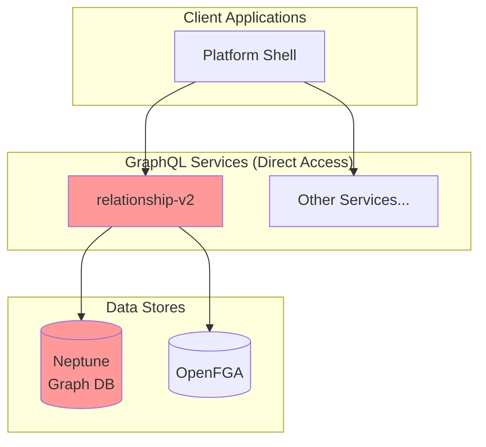
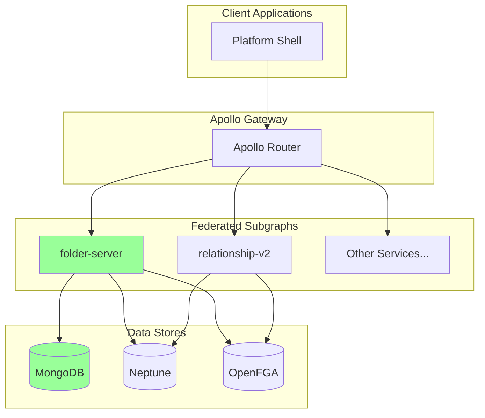
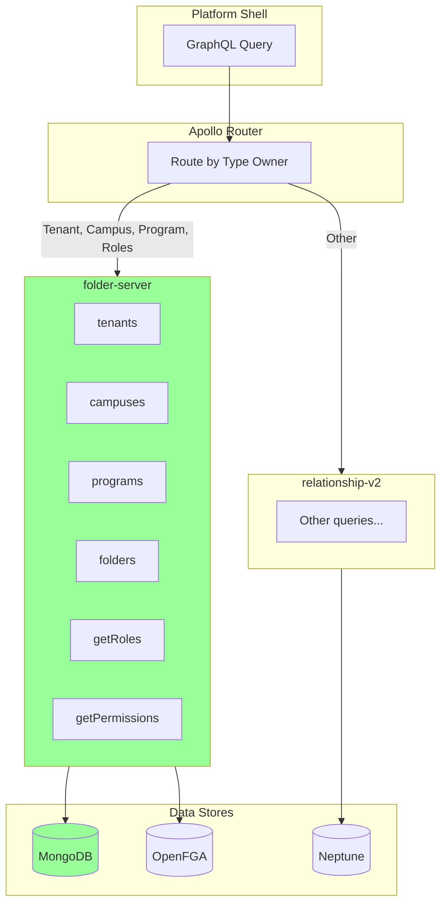
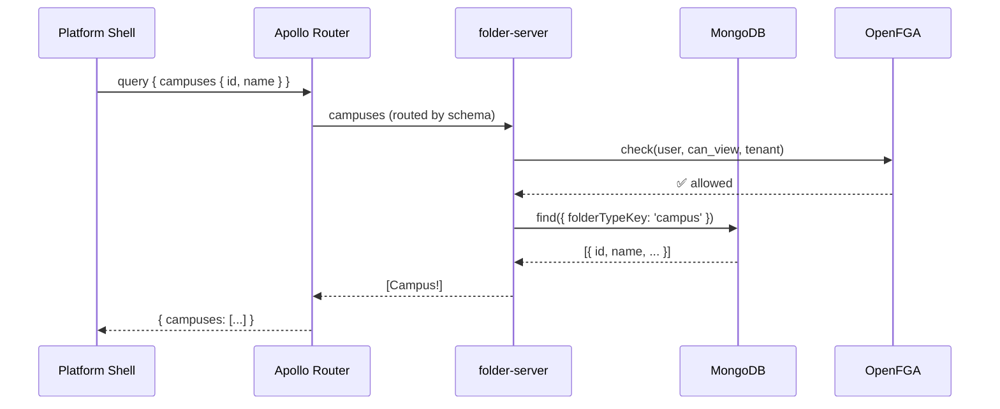
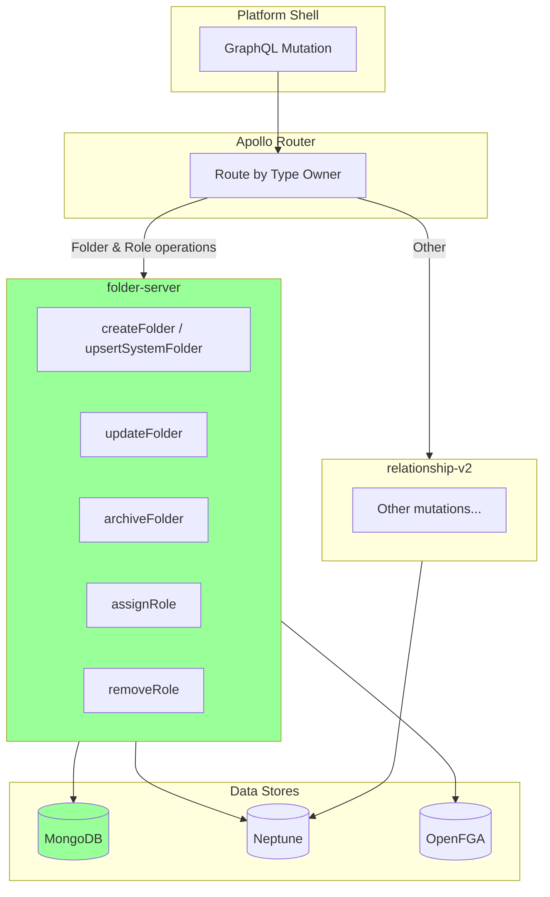
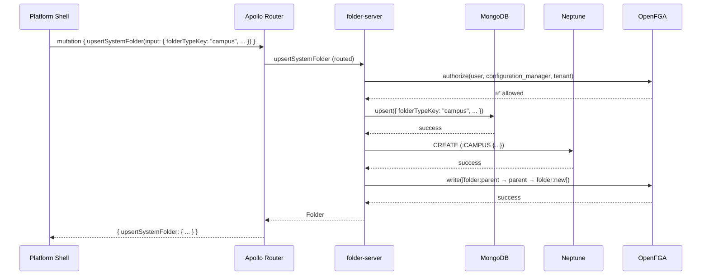
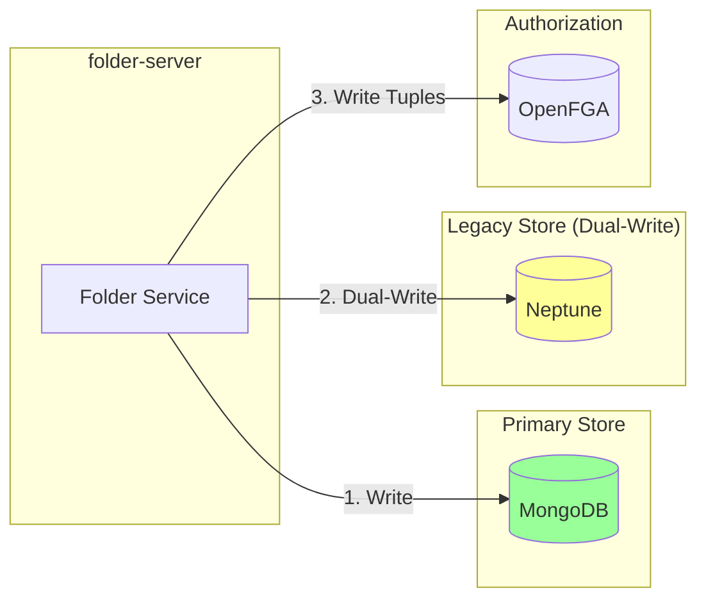
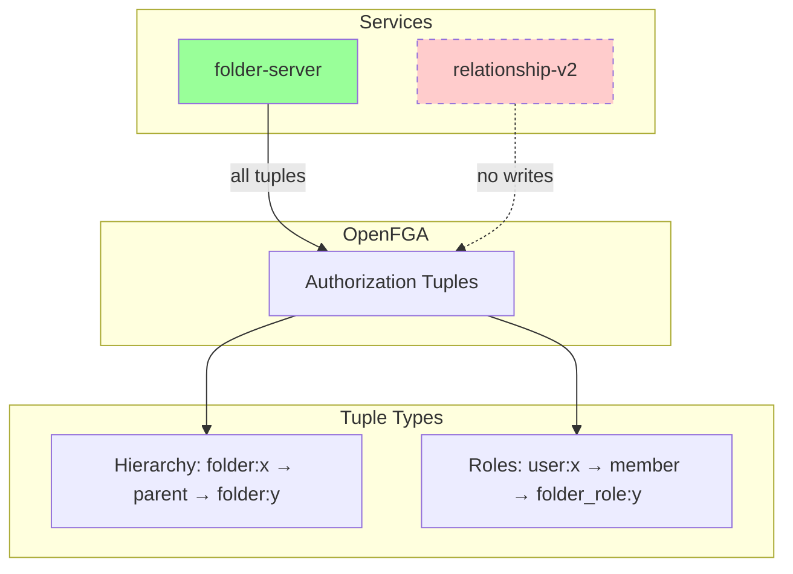
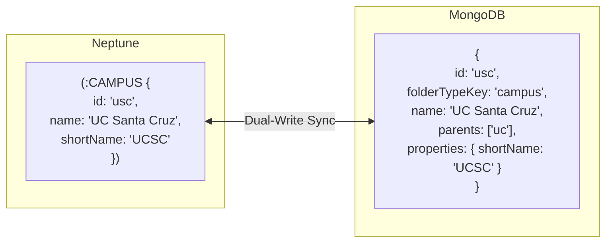
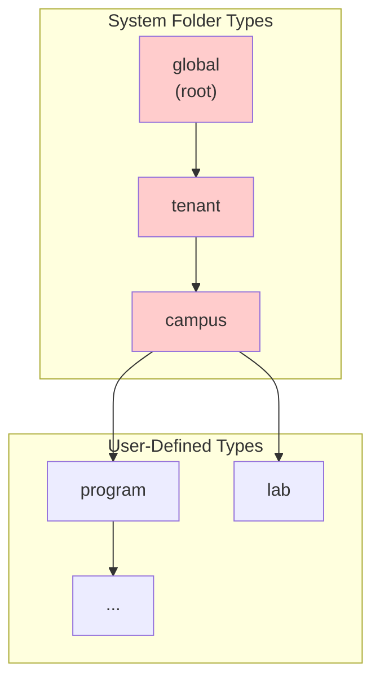

# RelationshipV2 to Folder-Server Migration Architecture

**Date**: 2025-12-11
**Status**: Research / Planning
**Related**: [Migration Spec](../spec/06-relationshipv2-migration-spec.md)

## Executive Summary

This document describes the architecture for migrating from relationship-v2 (Neptune graph database) to folder-server (MongoDB) using Apollo Federation as the unified routing layer. The key changes are:

1. **Apollo Router** becomes the single entry point for all GraphQL requests
2. **Queries** for tenant, campus, program entities route to folder-server
3. **Mutations** for tenant, campus, program are removed from relationship-v2 and implemented in folder-server
4. **Dual-write** to Neptune ensures backward compatibility during transition
5. **OpenFGA** remains the authorization layer, with both services writing tuples

---

## Current State

**Current Issues:**
- No unified API gateway - clients connect directly to services
- Neptune is expensive and complex to maintain
- Schema is rigid; adding new entity types requires code changes
- Dual database sync (Neptune + FGA) is error-prone

---

## Target State

**Benefits:**
- Apollo Router provides single entry point for all clients
- Unified folder model for all hierarchical entities
- MongoDB is simpler, cheaper, and scales horizontally
- Dynamic folder types - no code changes for new entity types
- folder-server dual-writes to Neptune for backward compatibility

---

## Query Routing

Apollo Router uses the federated supergraph schema to route queries to the appropriate subgraph based on which service owns the type.

### Query Routing Table

| Query | Current Owner | Target Owner |
|-------|---------------|--------------|
| `tenants` | relationship-v2 | **folder-server** |
| `campus(id)` | relationship-v2 | **folder-server** |
| `campuses` | relationship-v2 | **folder-server** |
| `program(id)` | relationship-v2 | **folder-server** |
| `searchPrograms` | relationship-v2 | **folder-server** |
| `programsByUser` | relationship-v2 | **folder-server** |
| `getRoles` | relationship-v2 | **folder-server** |
| `getPermissions` | relationship-v2 | **folder-server** |
| `programRole` | relationship-v2 | **folder-server** |
| `programRolesForProgram` | relationship-v2 | **folder-server** |

### Query Flow Example

---

## Mutation Changes

**All tenant, campus, and program mutations are removed from relationship-v2** and implemented in folder-server. The new mutations use the folder-server API with dual-write to Neptune.

### Mutation Changes Table

| Old Mutation (relationship-v2) | New Mutation (folder-server) | Notes |
|-------------------------------|------------------------------|-------|
| `createTenant` | `upsertSystemFolder` | folderTypeKey: "tenant" |
| `createCampus` | `upsertSystemFolder` | folderTypeKey: "campus" |
| `createProgram` | `createFolder` | folderTypeKey: "program" |
| `updateProgram` | `updateFolder` | |
| `createRole` | `assignRole` | |
| `addRoleMember` | `assignRole` | |
| `removeRoleMember` | `removeRole` | |
| `createProgramRole` | `assignRole` | scopeType: FOLDER |
| `addMemberToProgramRole` | `assignRole` | |
| `removeMemberFromProgramRole` | `removeRole` | |
| ~~`createDomain`~~ | *removed* | Domain entity deprecated |

### Mutation Flow with Dual-Write

When folder-server receives a mutation for tenant/campus/program, it writes to both MongoDB and Neptune to maintain backward compatibility.

---

## Dual-Write Strategy

folder-server writes to both MongoDB (primary) and Neptune (backward compatibility) for all tenant, campus, and program operations.

**Why Dual-Write:**
- Other services may still query Neptune directly
- Gradual migration - can disable Neptune writes once all consumers migrate
- Rollback capability - Neptune remains in sync

**Dual-Write Rules:**
1. MongoDB write happens first (primary)
2. Neptune write is best-effort (failure logged but doesn't fail the operation)
3. FGA tuples written after both stores succeed

---

## OpenFGA Authorization

Since all entity mutations (tenant, campus, program) and role mutations move to folder-server, **folder-server becomes the sole writer to OpenFGA**. relationship-v2 no longer writes any FGA tuples.

### FGA Tuple Examples

| Operation | Service | FGA Tuple Written |
|-----------|---------|-------------------|
| Create tenant folder | folder-server | `folder:global-id` → `parent` → `folder:tenant-id` |
| Create campus folder | folder-server | `folder:tenant-id` → `parent` → `folder:campus-id` |
| Create program folder | folder-server | `folder:campus-id` → `parent` → `folder:program-id` |
| Assign role to user | folder-server | `user:123` → `member` → `folder_role:xyz` |

---

## Entity Mapping

System folder types map to legacy Neptune entities:

| Neptune Entity | Folder Type | Notes |
|----------------|-------------|-------|
| `:GLOBAL` | `global` | Root of hierarchy, empty parents |
| `:TENANT` | `tenant` | Child of global |
| `:CAMPUS` | `campus` | Child of tenant |
| `:PROGRAM` | `program` | Child of campus (or domain) |
| `:DOMAIN` | *deprecated* | Not migrated |

### Campus Example

---

## System Folder Hierarchy

**Rules:**
- System folders use `upsertSystemFolder` mutation
- Only `global` can have empty `parents` array
- System folders cannot be archived/deleted via folder-server

---

## Open Questions

1. **Neptune Deprecation Timeline**: When can we stop dual-writing to Neptune?
2. **Direct Neptune Queries**: Which services query Neptune directly and need migration?
3. **FGA Model Unification**: Should legacy tuples (`tenant:x`) migrate to `folder:x` format?

---

## References

- [Migration Spec](../spec/06-relationshipv2-migration-spec.md)
- [System Folder Types Spec](../spec/archive/system-folder-types-spec.md)
- [OpenFGA Documentation](https://openfga.dev/docs)
- [Apollo Federation Documentation](https://www.apollographql.com/docs/federation/)
