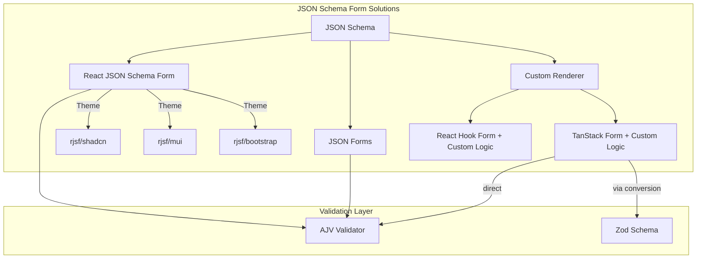
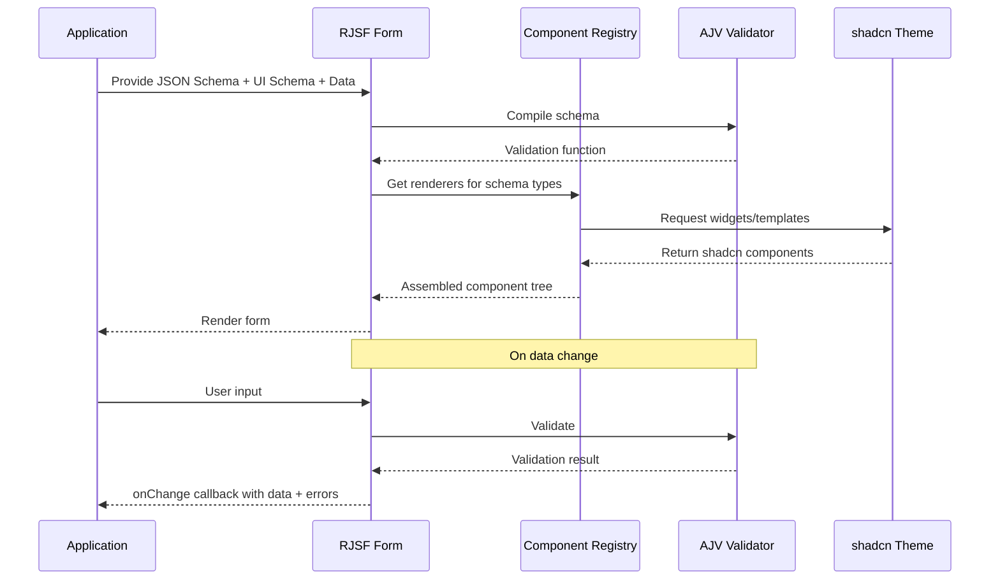
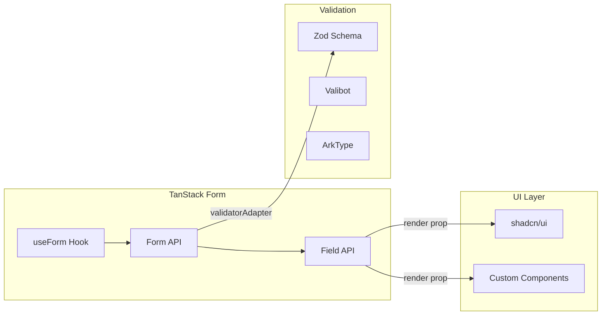
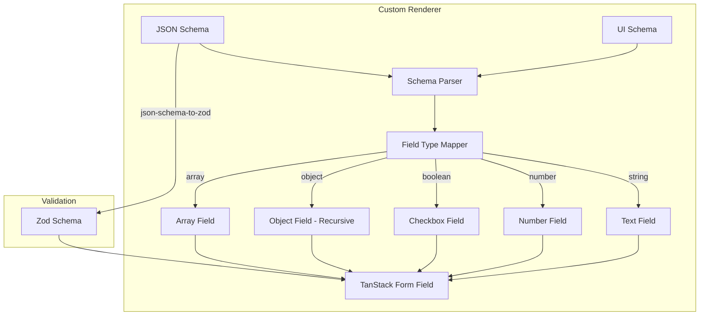
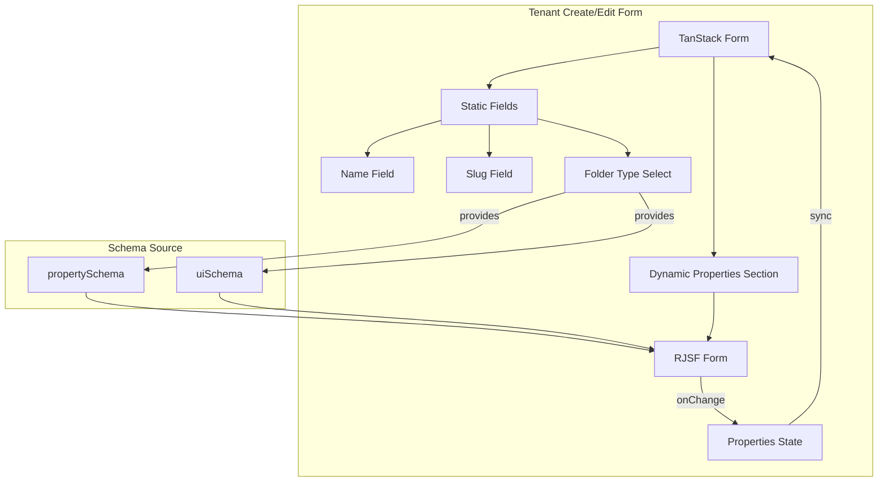
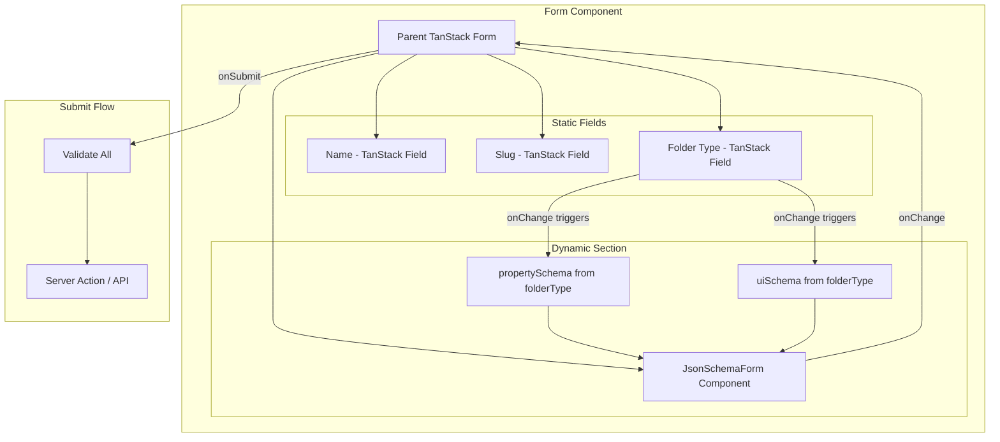

# Dynamic JSON Schema Form Rendering in React - Research

**Date**: 2025-12-14
**Status**: Research Complete

## Table of Contents

- [Executive Summary](#executive-summary)
- [Technical Deep Dive](#technical-deep-dive)
- [Technology Stack / Ecosystem](#technology-stack--ecosystem)
- [Codebase Analysis](#codebase-analysis)
- [Implementation Feasibility](#implementation-feasibility)
- [Implementation Options](#implementation-options)
- [Comparison Matrix](#comparison-matrix)
- [Implementation Approach](#implementation-approach)
- [Alternatives Considered](#alternatives-considered)
- [Debates & Open Questions](#debates--open-questions)
- [Recommendations](#recommendations)
- [Additional Notes](#additional-notes)
- [Sources](#sources)

## Executive Summary

This research compares two approaches for rendering dynamic forms from JSON Schema in the project's React/Next.js application: using RJSF with the @rjsf/shadcn theme versus building a custom TanStack Form + JSON Schema renderer. Given the project's moderate complexity requirements (nested objects, conditional fields, dependencies), existing TanStack Form usage, and React 19 environment, **the recommended approach is RJSF with @rjsf/shadcn** for the dynamic properties section, potentially wrapped within the existing TanStack Form for static fields (hybrid approach).

## Technical Deep Dive

### Overview

The project needs to render forms dynamically based on folder-type's `propertySchema` (JSON Schema draft-07) and `uiSchema` (RJSF-style UI hints). This is a common pattern in configurable systems where form structure is stored as data rather than code.

### JSON Schema Form Rendering Landscape

The React ecosystem offers several approaches to JSON Schema-based form rendering:



### RJSF Architecture

React JSON Schema Form (RJSF) uses a modular architecture:

1. **Core (@rjsf/core)**: Form logic, schema processing, state management
2. **Utils (@rjsf/utils)**: Shared utilities across packages
3. **Validator (@rjsf/validator-ajv8)**: JSON Schema validation via AJV
4. **Theme (@rjsf/shadcn)**: UI components matching shadcn design system



### Conditional Fields in JSON Schema

JSON Schema supports several patterns for conditional fields:

1. **Dependencies** (legacy, still supported):
```json
{
  "dependencies": {
    "credit_card": ["billing_address"]
  }
}
```

2. **If/Then/Else** (draft-07+, fully supported in RJSF v6):
```json
{
  "if": { "properties": { "country": { "const": "USA" } } },
  "then": { "properties": { "postal_code": { "pattern": "\\d{5}" } } },
  "else": { "properties": { "postal_code": { "pattern": "[A-Z]\\d[A-Z] \\d[A-Z]\\d" } } }
}
```

3. **oneOf/anyOf** (schema composition):
```json
{
  "oneOf": [
    { "properties": { "type": { "const": "individual" }, "ssn": { "type": "string" } } },
    { "properties": { "type": { "const": "business" }, "ein": { "type": "string" } } }
  ]
}
```

### TanStack Form Architecture

TanStack Form is a headless form library focused on type safety and performance:



Key differences from RJSF:
- **No native JSON Schema support** - requires conversion or custom implementation
- **Headless** - brings only state management, no UI
- **Type-safe** - Full TypeScript inference from schema
- **Performance-optimized** - Minimal re-renders via subscription model

## Technology Stack / Ecosystem

### Option 1: RJSF with @rjsf/shadcn

**Required Packages:**
```json
{
  "@rjsf/core": "^6.1.2",
  "@rjsf/utils": "^6.1.2",
  "@rjsf/validator-ajv8": "^6.1.2",
  "@rjsf/shadcn": "^6.0.0-beta.10"
}
```

**Current Status:**
- Latest version: 6.1.2 (core packages)
- @rjsf/shadcn: 6.0.0-beta.10 (still in beta, last published 4 months ago)
- Weekly downloads (core): ~130,000
- GitHub stars: 15,465
- Active maintenance with regular releases

**React 19 Compatibility:**
- No official React 19 compatibility statement found
- React 19's `forwardRef` deprecation may cause warnings/issues
- RJSF v6 upgrade guide mentions React 16.14+ as minimum, React 18 "use at own risk"
- @rjsf/shadcn depends on shadcn/ui which IS React 19 compatible

**Tailwind v4 Configuration Required:**
```javascript
// tailwind.config.js content array
content: [
  "./src/**/*.{html,js,ts,tsx}",
  "node_modules/@rjsf/shadcn/src/**/*.{js,ts,jsx,tsx,mdx}"
]
```

### Option 2: Custom TanStack Form + JSON Schema

**Required Packages:**
```json
{
  "@tanstack/react-form": "^1.27.3",  // Already in project
  "zod": "^4.1.13",                    // Already in project
  "@dmitryrechkin/json-schema-to-zod": "^1.0.0",  // For validation
  "ajv": "^8.x"                        // Alternative: direct JSON Schema validation
}
```

**Additional Custom Code Required:**
- JSON Schema to field renderer mapping (~500-1000 lines)
- UI Schema parser for layout hints (~200-300 lines)
- Conditional field logic (~300-500 lines)
- Array field handling (~200-300 lines)

### Option 3: JSON Forms (Alternative)

**Required Packages:**
```json
{
  "@jsonforms/core": "^3.x",
  "@jsonforms/react": "^3.x",
  "@jsonforms/vanilla-renderers": "^3.x"  // or custom renderers
}
```

- More modular than RJSF
- No shadcn theme available (would require custom renderers)
- Better separation of concerns
- Smaller community (~130k weekly downloads for core)

## Codebase Analysis

### Existing Form Patterns

The project already uses TanStack Form:

**Package.json dependencies:**
```json
{
  "@tanstack/react-form": "^1.27.3",
  "zod": "^4.1.13"
}
```

**Technology Stack:**
- Next.js 16 with React 19
- shadcn/ui components throughout
- Zod for validation
- TanStack Form for static forms

### Key Patterns to Consider

1. **Form Validation**: Project uses Zod schemas
2. **UI Components**: shadcn/ui components
3. **State Management**: Zustand for global state
4. **Package Manager**: Bun

### Architecture Compatibility

```
Current Stack:
├── Next.js 16 (App Router)
├── React 19 + RSC
├── TanStack Form (for static forms)
├── Zod (validation)
└── shadcn/ui (UI components)

RJSF Integration:
├── Form wrapper with "use client" directive
├── @rjsf/shadcn theme matches existing UI
├── Custom widgets can reuse shadcn components
└── Validation via AJV (separate from Zod)
```

## Implementation Feasibility

### RJSF with @rjsf/shadcn

**Benefits:**
- Complete JSON Schema support including if/then/else, dependencies, oneOf [1]
- Native UI Schema support for layout hints [2]
- Active community with 15,465 GitHub stars [3]
- @rjsf/shadcn provides visual consistency with existing UI
- Minimal custom code required (~50-100 lines for integration)
- Proven in production (used by React-Admin Enterprise) [4]

**Trade-offs & Challenges:**
- @rjsf/shadcn is still in beta (6.0.0-beta.10) [5]
- React 19 compatibility uncertain - may require testing/patches
- Bundle size impact (adds AJV, RJSF core)
- Two form state management systems (TanStack for static, RJSF for dynamic)
- Performance concerns with complex schemas using oneOf/dependencies [6]
- Learning curve for customizing widgets/templates

**When to Use:**
- Dynamic form requirements with full JSON Schema support
- UI Schema layout hints needed
- Time-to-delivery is priority over architectural purity
- Moderate schema complexity (nested objects, conditionals)

**When to Avoid:**
- Very simple schemas (flat objects only)
- Strict React 19 compatibility requirements without testing budget
- Bundle size is critical concern

### Custom TanStack Form + JSON Schema Renderer

**Benefits:**
- Single form library throughout application
- Full TypeScript type safety
- Smaller bundle (no additional form library)
- Complete control over rendering and behavior
- Performance-optimized with TanStack's subscription model
- React 19 compatible (TanStack Form supports RSC) [7]

**Trade-offs & Challenges:**
- Significant implementation effort (estimated 2-3 weeks for moderate complexity)
- JSON Schema to Zod conversion has limitations [8]
- Conditional fields (if/then/else) require custom implementation
- UI Schema support must be built from scratch
- Ongoing maintenance burden for JSON Schema edge cases
- No community support for custom implementation

**When to Use:**
- Simple schemas (flat objects, basic types)
- Bundle size is critical
- Team has capacity for custom development
- Long-term investment in form infrastructure

**When to Avoid:**
- Complex schemas with conditionals and dependencies
- Tight timeline
- Small team without form library expertise

## Implementation Options

### Option 1: RJSF with @rjsf/shadcn (Standalone)

**Description**: Use RJSF exclusively for the entire dynamic properties form section.

**Pros:**
- Fastest implementation time [1]
- Complete JSON Schema + UI Schema support out of the box [2]
- Visual consistency with @rjsf/shadcn theme
- Well-documented with active community

**Cons:**
- Two form systems in codebase (TanStack for static, RJSF for dynamic)
- @rjsf/shadcn is beta, may have issues
- React 19 compatibility uncertain
- Additional bundle size (~100-150KB gzipped estimate)

**Complexity**: Low

**Time Estimate**: 1-2 days

**Reuses Patterns**: Partial (uses shadcn components but different form state)

**When to Use:**
- Dynamic properties form is self-contained
- Full JSON Schema features needed immediately
- Team prefers proven solution over custom development

**Example/Reference**: [RJSF shadcn boilerplate](https://github.com/tuanphung2308/react-jsonschema-form-shadcn-boilerplate)

### Option 2: Custom TanStack Form + JSON Schema Renderer

**Description**: Build a custom field renderer that maps JSON Schema to TanStack Form fields, with manual UI Schema support.

**Pros:**
- Single form library throughout codebase
- Full TypeScript type safety
- No additional bundle size
- React 19 / RSC compatible
- Complete control over behavior

**Cons:**
- Significant development time (2-3 weeks) [8]
- Must implement if/then/else, dependencies manually
- UI Schema support requires custom implementation
- Ongoing maintenance burden
- No community support for edge cases

**Complexity**: High

**Time Estimate**: 2-3 weeks

**Reuses Patterns**: Yes (uses existing TanStack Form patterns)

**When to Use:**
- Team has time for custom development
- Simple to moderate schema complexity
- Bundle size is critical concern
- Long-term investment in form infrastructure

**Architecture:**


### Option 3: Hybrid Approach (Recommended)

**Description**: Use TanStack Form for the parent form with static fields, embed RJSF for the dynamic `properties` section only. RJSF's onChange propagates values to TanStack Form's state.

**Pros:**
- Best of both worlds - consistency for static, full support for dynamic
- Minimal custom code
- Single submit handler through TanStack Form
- Leverages @rjsf/shadcn for visual consistency
- Incremental adoption - can migrate later if needed

**Cons:**
- Two form systems in single form (complexity)
- State synchronization between systems
- React 19 compatibility concerns for RJSF portion

**Complexity**: Medium

**Time Estimate**: 2-4 days

**Reuses Patterns**: Yes (TanStack Form for static portions)

**When to Use:**
- Form has both static fields (name, slug) and dynamic properties
- Need full JSON Schema support for properties section
- Want to maintain TanStack Form patterns for non-dynamic fields

**Architecture:**


**Implementation Pattern:**
```typescript
// Conceptual example
function TenantForm({ folderType }) {
  const form = useForm({
    defaultValues: {
      name: '',
      slug: '',
      properties: {}
    }
  });

  return (
    <form onSubmit={form.handleSubmit(onSubmit)}>
      {/* Static fields via TanStack Form */}
      <form.Field name="name" children={...} />
      <form.Field name="slug" children={...} />

      {/* Dynamic properties via RJSF */}
      <RJSFForm
        schema={folderType.propertySchema}
        uiSchema={folderType.uiSchema}
        formData={form.getFieldValue('properties')}
        onChange={(e) => form.setFieldValue('properties', e.formData)}
      />

      <button type="submit">Save</button>
    </form>
  );
}
```

## Comparison Matrix

| Criteria | Option 1: RJSF Standalone | Option 2: Custom TanStack | Option 3: Hybrid |
|----------|---------------------------|---------------------------|------------------|
| **Implementation Time** | 1-2 days | 2-3 weeks | 2-4 days |
| **JSON Schema Support** | Full | Partial (needs custom) | Full (via RJSF) |
| **UI Schema Support** | Full | Must build | Full (via RJSF) |
| **Conditional Fields** | Native | Must implement | Native |
| **Bundle Size Impact** | +100-150KB | Minimal | +100-150KB |
| **React 19 Compat** | Uncertain | Yes | Uncertain (RJSF portion) |
| **TypeScript Safety** | Good | Excellent | Good |
| **Maintainability** | Good (community) | Low (custom code) | Good |
| **Pattern Consistency** | Low (new patterns) | High | Medium |
| **Complexity** | Low | High | Medium |
| **Risk Level** | Low-Medium | High | Medium |

## Implementation Approach

### Recommended: Option 3 - Hybrid Approach

### Prerequisites & Requirements

- @rjsf/core, @rjsf/utils, @rjsf/validator-ajv8, @rjsf/shadcn packages
- Update Tailwind config to include @rjsf/shadcn source paths
- Client component boundary for RJSF (requires "use client")

### Getting Started

1. **Install RJSF packages:**
```bash
bun add @rjsf/core @rjsf/utils @rjsf/validator-ajv8 @rjsf/shadcn
```

2. **Update Tailwind configuration** (if using config file, or add to CSS):
```javascript
content: [
  // ... existing paths
  "node_modules/@rjsf/shadcn/src/**/*.{js,ts,jsx,tsx,mdx}"
]
```

3. **Create RJSF wrapper component:**
```typescript
// src/components/forms/json-schema-form.tsx
"use client";

import { withTheme } from '@rjsf/core';
import { Theme as ShadcnTheme } from '@rjsf/shadcn';
import validator from '@rjsf/validator-ajv8';
import type { RJSFSchema, UiSchema } from '@rjsf/utils';

const Form = withTheme(ShadcnTheme);

interface JsonSchemaFormProps {
  schema: RJSFSchema;
  uiSchema?: UiSchema;
  formData?: unknown;
  onChange?: (data: { formData: unknown }) => void;
}

export function JsonSchemaForm({
  schema,
  uiSchema,
  formData,
  onChange
}: JsonSchemaFormProps) {
  return (
    <Form
      schema={schema}
      uiSchema={uiSchema}
      formData={formData}
      validator={validator}
      onChange={onChange}
      // Hide default submit button - parent form handles submission
      children={<></>}
    />
  );
}
```

### Architecture & Design Considerations



**Key Design Decisions:**

1. **State Ownership**: TanStack Form owns the complete form state including `properties` object
2. **RJSF as Controlled Component**: RJSF receives `formData` from TanStack and reports changes via `onChange`
3. **Single Submit Handler**: Parent TanStack Form handles validation and submission
4. **Schema Source**: `propertySchema` and `uiSchema` come from selected folder-type

### Best Practices

1. **Validation Strategy**:
   - Let RJSF handle JSON Schema validation for dynamic fields
   - TanStack Form validates static fields via Zod
   - Final validation on submit combines both

2. **Error Handling**:
   - RJSF displays inline errors for dynamic fields
   - TanStack Form displays errors for static fields
   - Form-level errors shown separately

3. **Performance**:
   - Debounce RJSF onChange to prevent excessive re-renders
   - Use React.memo for JsonSchemaForm wrapper if needed

4. **Testing Strategy**:
   - Integration tests for form submission flow
   - Unit tests for custom widgets if any are created
   - E2E tests for conditional field behavior

### Common Pitfalls & How to Avoid Them

1. **React 19 forwardRef Warnings**
   - RJSF may use forwardRef which is deprecated in React 19
   - Monitor console for warnings, may need patches
   - Consider testing thoroughly before production deployment

2. **State Sync Issues**
   - Ensure RJSF onChange properly updates TanStack Form state
   - Avoid circular update loops by using stable callbacks

3. **Bundle Size Creep**
   - Import only needed components from @rjsf/shadcn
   - Consider dynamic import for JsonSchemaForm component

4. **Tailwind Class Conflicts**
   - Ensure @rjsf/shadcn path is in Tailwind content
   - Check that CSS variables are properly defined

### Migration/Adoption Strategy

**Phase 1: Proof of Concept (1 day)**
- Install RJSF packages
- Create JsonSchemaForm wrapper
- Test with sample JSON Schema

**Phase 2: Integration (1-2 days)**
- Integrate into tenant create/edit form
- Wire up state synchronization
- Test with real folder-type schemas

**Phase 3: Production Hardening (1 day)**
- Add error handling
- Test edge cases
- Monitor for React 19 issues

**Rollback Strategy:**
- If RJSF proves problematic, the JsonSchemaForm component can be swapped for a custom implementation
- Interface remains the same, only internal implementation changes

## Alternatives Considered

### Alternative 1: JSON Forms (@jsonforms)

- **Brief description**: Another JSON Schema form library with modular architecture
- **Why not chosen**: No shadcn theme available, would require building custom renderers (~1 week)
- **When it might be better**: If team wants more control over renderer architecture

### Alternative 2: Direct AJV + Custom Renderer

- **Brief description**: Use AJV for validation directly, build custom form renderer
- **Why not chosen**: Similar effort to Option 2 but without TanStack Form benefits
- **When it might be better**: If validation performance is critical concern

### Alternative 3: Static Code Generation

- **Brief description**: Generate React components from JSON Schema at build time
- **Why not chosen**: Doesn't support runtime schema changes, defeats purpose of dynamic forms
- **When it might be better**: If schemas are known at build time and rarely change

## Debates & Open Questions

1. **React 19 Compatibility Risk**
   - RJSF has not officially declared React 19 support
   - @rjsf/shadcn is in beta and depends on shadcn/ui (which is React 19 compatible)
   - May encounter forwardRef deprecation warnings
   - **Mitigation**: Test thoroughly in development before production deployment

2. **@rjsf/shadcn Beta Status**
   - Package is at 6.0.0-beta.10, published 4 months ago
   - Lower adoption (only 2 npm dependents) [5]
   - May have bugs or missing features
   - **Mitigation**: Have fallback plan to other RJSF themes (MUI, Bootstrap) or custom widgets

3. **Performance with Complex Schemas**
   - RJSF has known performance issues with large schemas using oneOf/dependencies [6]
   - Project expects "moderate complexity" which should be acceptable
   - **Mitigation**: Profile if performance issues arise, consider schema simplification

4. **Two Form Systems**
   - Having TanStack Form and RJSF adds complexity
   - State synchronization adds potential for bugs
   - **Mitigation**: Clear ownership boundaries, thorough testing

## Recommendations

### Preferred Approach: Option 3 - Hybrid (TanStack Form + RJSF for Dynamic Section)

**Should This Be Implemented?**: Yes, with caveats

**Rationale:**
1. **Balances consistency and effort**: Uses existing TanStack Form patterns for static fields while leveraging RJSF's proven JSON Schema support for dynamic fields
2. **Full JSON Schema support**: if/then/else, dependencies, nested objects work out of the box [1]
3. **UI Schema support**: Native RJSF feature, no custom implementation needed [2]
4. **Visual consistency**: @rjsf/shadcn matches existing shadcn/ui components
5. **Reasonable timeline**: 2-4 days vs 2-3 weeks for custom solution

**Why:**
- The project's requirement for "moderate complexity schemas" (nested objects, conditionals, dependencies) makes a proven library more practical than custom implementation
- TanStack Form is already in use for static forms, maintaining that pattern for non-dynamic fields reduces cognitive overhead
- @rjsf/shadcn being in beta is a concern but acceptable given the fallback options

**Key Considerations:**
1. **Test React 19 compatibility** thoroughly before production deployment
2. **Monitor @rjsf/shadcn releases** for beta exit and React 19 support
3. **Prepare fallback** to alternative RJSF theme or custom widgets if needed

**Potential Challenges:**

1. **React 19 Compatibility**
   - **Mitigation**: Test in development environment first, check console for forwardRef warnings
   - **Fallback**: Use @rjsf/bootstrap-4 theme with custom CSS to match shadcn look

2. **@rjsf/shadcn Beta Issues**
   - **Mitigation**: Test all field types used in propertySchema
   - **Fallback**: Create custom widgets extending base RJSF components with shadcn styling

**Success Criteria:**
- Dynamic properties form renders correctly from JSON Schema
- UI Schema layout hints are respected
- Conditional fields show/hide based on data
- Form submission includes both static and dynamic field values
- No React 19 console errors or warnings
- Performance acceptable for moderate complexity schemas

## Additional Notes

1. **Bundle Size Estimation**: Based on RJSF documentation and npm package sizes, expect approximately 100-150KB gzipped addition to bundle. This is acceptable for the functionality provided but should be monitored.

2. **Alternative: json-schema-to-zod at Runtime**: The `@dmitryrechkin/json-schema-to-zod` library can convert JSON Schema to Zod at runtime, which could enable a pure TanStack Form solution. However, it has limitations with complex conditionals and would still require custom field rendering [8].

3. **Server Components Note**: RJSF requires client-side JavaScript and cannot be used as a React Server Component. The form component must be wrapped with "use client" directive.

4. **Future Option**: If the project's schemas remain relatively simple, consider revisiting Option 2 (custom renderer) in the future. The hybrid approach allows for gradual migration by replacing the RJSF component with a custom implementation while keeping the same interface.

## Sources

1. [RJSF Dependencies Documentation](https://rjsf-team.github.io/react-jsonschema-form/docs/json-schema/dependencies/) - JSON Schema conditional fields support
2. [RJSF uiSchema Documentation](https://rjsf-team.github.io/react-jsonschema-form/docs/api-reference/uiSchema/) - UI Schema capabilities
3. [react-jsonschema-form GitHub](https://github.com/rjsf-team/react-jsonschema-form) - Main repository
4. [React-Admin JsonSchemaForm](https://marmelab.com/react-admin/JsonSchemaForm.html) - Enterprise usage example
5. [@rjsf/shadcn npm](https://www.npmjs.com/package/@rjsf/shadcn) - Package metadata (beta status, version 6.0.0-beta.10)
6. [RJSF Performance Issue #4203](https://github.com/rjsf-team/react-jsonschema-form/issues/4203) - Performance with complex schemas
7. [TanStack Form SSR Documentation](https://tanstack.com/form/v1/docs/framework/react/guides/ssr) - React 19 / RSC support
8. [json-schema-to-zod npm](https://www.npmjs.com/package/json-schema-to-zod) - Conversion limitations
9. [TanStack Form Quick Start](https://tanstack.com/form/latest/docs/framework/react/quick-start) - TanStack Form usage
10. [shadcn/ui TanStack Form Guide](https://ui.shadcn.com/docs/forms/tanstack-form) - Integration guide
11. [RJSF Custom Widgets and Fields](https://rjsf-team.github.io/react-jsonschema-form/docs/advanced-customization/custom-widgets-fields/) - Customization options
12. [shadcn/ui React 19 Support](https://ui.shadcn.com/docs/react-19) - React 19 compatibility
13. [RJSF If/Then/Else Issue #850](https://github.com/rjsf-team/react-jsonschema-form/issues/850) - Conditional fields implementation status (completed)
14. [@dmitryrechkin/json-schema-to-zod](https://github.com/dmitryrechkin/json-schema-to-zod) - Runtime JSON Schema to Zod conversion
15. [JSON Forms React Integration](https://jsonforms.io/docs/integrations/react/) - Alternative library
16. [npm-compare Form Libraries](https://npm-compare.com/@jsonforms/react,formik,react-final-form,react-hook-form,react-jsonschema-form,uniforms) - Library comparison
17. [RJSF 5.x Upgrade Guide](https://rjsf-team.github.io/react-jsonschema-form/docs/migration-guides/v5.x%20upgrade%20guide/) - React version requirements
18. [React 19 forwardRef Changes](https://react.dev/blog/2024/12/05/react-19) - forwardRef deprecation
