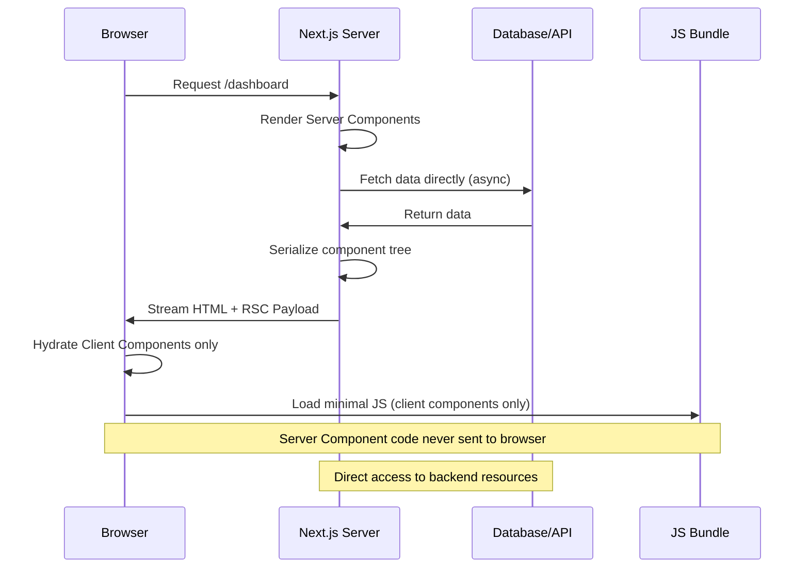
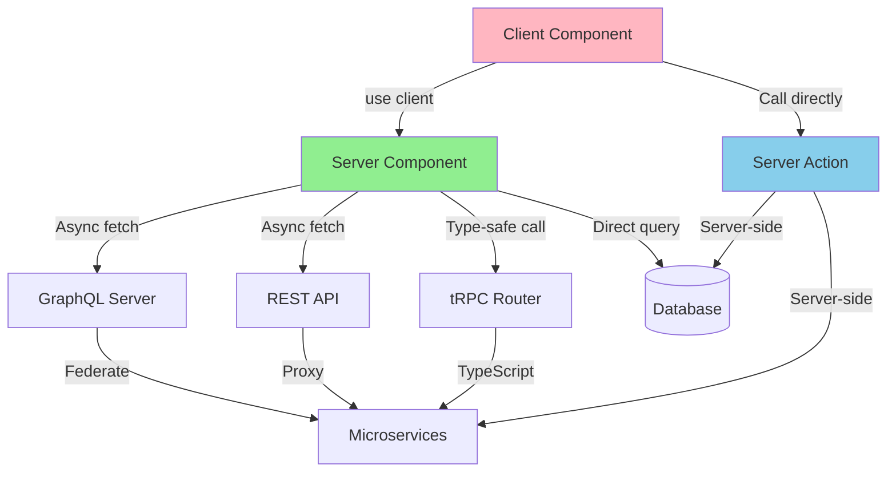
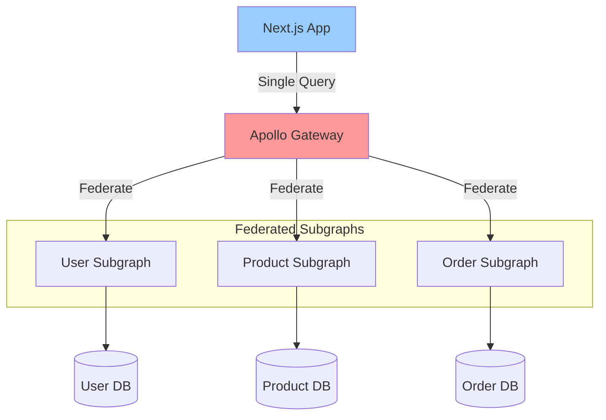

# React Server Components (RSC) Ecosystem and Data Fetching - Research

**Date**: 2025-10-24
**Status**: Research Complete

## Executive Summary

React Server Components (RSC) have officially stabilized with React 19 (December 2024) and are rapidly becoming a standard primitive across the React ecosystem. All major frameworks—Next.js, React Router (formerly Remix), TanStack Start, and Waku—are either supporting or actively implementing RSC. For microservices architectures, the data fetching landscape has evolved: GraphQL remains valuable for complex multi-client scenarios, while tRPC and Server Actions offer simpler alternatives for TypeScript-native monorepos. The recommendation for this platform-rsc migration is to adopt the Backend-for-Frontend (BFF) pattern using Next.js Server Components with direct microservice calls for authentication and aggregation, reserving GraphQL for scenarios where client flexibility and multi-frontend support justify the additional complexity.

## Technical Deep Dive

### Overview

React Server Components represent a fundamental shift in how React applications are architected. Unlike traditional client-side rendering where all components run in the browser, Server Components execute exclusively on the server, can be async, and have direct access to backend resources (databases, file systems, internal services) without exposing sensitive logic or credentials to clients. This enables zero-bundle-size data fetching, reduced client JavaScript, and improved performance.

### RSC Adoption Timeline Across Frameworks

#### React 19 (December 5, 2024)
- **Status**: Stable and production-ready
- **Key Feature**: React Server Components are now stable and will not break between major versions
- **Breaking Change**: APIs like `headers`, `cookies`, `params`, and `searchParams` transitioned to async patterns
- **New Features**: Actions framework with `useActionState`, `useOptimistic`, new `use` API, `ref` as props replacing `forwardRef`
- **Source**: [React v19 Release](https://react.dev/blog/2024/12/05/react-19)

#### Next.js 15 (October 21, 2024)
- **Status**: Production-ready with React 19 support
- **Major Change**: Caching behavior reversed—GET Route Handlers and Client Router Cache now uncached by default
- **Performance**: Turbopack Dev stable with 76.7% faster startup, 96.3% faster Fast Refresh
- **RSC Features**: Improved hydration errors, async request APIs, React Compiler (experimental)
- **Source**: [Next.js 15 Release](https://nextjs.org/blog/next-15)

#### React Router v7 (November 22, 2024)
- **Status**: Stable release merging Remix into React Router
- **RSC Support**: Preview support available (experimental)
- **Implementation**: Three approaches—RSC from loaders, Server Component routes, Server Functions
- **Limitation**: Currently requires Parcel bundler; Vite RSC support pending
- **Adoption Path**: Incremental—can return server components directly from existing loaders
- **Source**: [React Router v7](https://remix.run/blog/react-router-v7), [RSC Preview](https://remix.run/blog/rsc-preview)

#### TanStack Start
- **Status**: Release Candidate (v1 stable imminent)
- **RSC Support**: Not yet available but "actively working on integration"
- **Timeline**: Expected "in the near future" as a non-breaking v1.x addition
- **Philosophy**: Plans to "utilize React Query to interact with RSC as if it were an API"—treating RSC as "an API that returns JSX instead of JSON"
- **Source**: [TanStack Start Overview](https://tanstack.com/start/latest/docs/framework/react/overview)

#### Waku
- **Status**: Rapid development (v0.20-0.21), pre-v1
- **RSC Support**: RSC-first framework from inception
- **Focus**: Minimal React framework designed specifically for exploring and building with Server Components
- **Features**: Supports Server Actions, SSG, SSR, async components, Vite integration
- **Source**: [Waku Documentation](https://waku.gg/)

#### Other Frameworks
- **SolidStart 1.0**: Shipped with "use server" directive support (first implementation of this pattern before React)
- **Astro**: Shipped stable Actions following similar server-first patterns
- **Expo Router**: Universal Server Components announced at React Conf 2024 for web, desktop, and mobile

### How React Server Components Work

React Server Components fundamentally change the React rendering model by splitting components into two categories:



**Server Components:**
- Execute only on the server during the render pass
- Can be async functions
- Have direct access to databases, file systems, environment variables
- Never included in client JavaScript bundle
- Cannot use hooks like `useState`, `useEffect`, or browser APIs
- Can import and render Client Components

**Client Components:**
- Marked with `"use client"` directive
- Execute on both server (SSR) and client (hydration)
- Can use React hooks and browser APIs
- Included in client JavaScript bundle
- Cannot import Server Components (but can receive them as props/children)

**Key Benefits:**
1. **Zero-Bundle-Size Data Fetching**: Server Components fetch data without adding to client JavaScript
2. **Automatic Code Splitting**: Only client components are bundled for browser
3. **Streaming**: Components can stream to browser as they complete rendering
4. **Direct Backend Access**: No need for API routes for data fetching
5. **Security**: Sensitive logic and credentials stay on server

### Technology Stack / Ecosystem

**Framework Support:**
- **Next.js 14+**: Full production support (most mature)
- **React Router v7**: Preview support (experimental)
- **TanStack Start**: Planned (actively in development)
- **Waku**: Full support (RSC-first framework)
- **Expo Router**: Universal RSC across platforms

**Build Tools:**
- **Vite**: RSC support in development (not yet stable)
- **Turbopack**: Stable in Next.js 15 for `next dev`
- **Parcel**: Used by React Router RSC preview
- **Webpack**: Still used for Next.js production builds

**Data Fetching Libraries:**
- **Native fetch**: Works directly in Server Components with automatic deduplication
- **Apollo Client**: Separate package `@apollo/experimental-nextjs-app-support` for RSC
- **tRPC**: Works with Server Components via dedicated setup
- **React Query**: TanStack plans integration for RSC data fetching
- **GraphQL**: Requires adapter patterns for Server Components

## Implementation Feasibility

### Benefits

1. **Improved Performance** [React v19 Announcement]
   - Reduces client-side JavaScript bundle size by excluding server-only code
   - Enables streaming and progressive rendering for faster perceived load times
   - Automatic request deduplication for parallel fetches within component tree

2. **Enhanced Security** [Next.js Data Security Guide]
   - Sensitive data and API keys never exposed to client
   - Direct database queries stay server-side with no client access
   - Eliminates entire class of client-side data exposure vulnerabilities

3. **Simplified Data Fetching** [React Conf 2024]
   - Async/await directly in components eliminates loading state boilerplate
   - Automatic request waterfall optimization via React's fetch deduplication
   - No need for useEffect data fetching patterns

4. **Better Developer Experience** [Next.js 15 Release]
   - Colocation of data fetching with components
   - Type-safe server-to-client data flow with TypeScript
   - Improved error messages with source code context (Next.js 15+)

5. **Ecosystem Momentum** [React Trends 2025]
   - 2025 expected to be "the year RSC becomes standard primitive"
   - All major frameworks adopting (Next.js, React Router, TanStack Start)
   - React 19 stability means no breaking changes between majors

### Trade-offs & Challenges

1. **Mental Model Shift** [React Server Components Guide]
   - Requires understanding server/client boundary and component categories
   - Cannot use hooks in Server Components
   - Props must be serializable (no functions across server/client boundary)

2. **Build Tooling Complexity** [React Router RSC Preview]
   - RSC requires bundler support (Vite support still in development)
   - More complex build pipeline than traditional CSR
   - Preview/experimental state in non-Next.js frameworks

3. **Testing Complexity** [Community Discussions]
   - Server Components require different testing strategies
   - Must mock server-side data sources and APIs
   - Integration tests become more important than unit tests

4. **Learning Curve** [Developer Surveys]
   - New patterns for data fetching and component composition
   - Understanding when to use Server vs Client Components
   - Debugging spans server and client environments

5. **Framework Lock-in** [RSC Architecture Analysis]
   - RSC heavily tied to framework implementation
   - Migration between frameworks more complex than traditional React
   - Underlying bundler APIs don't follow semver in React 19.x

### When to Use

1. **Data-Heavy Applications**
   - Dashboard and analytics applications with extensive server data needs
   - E-commerce sites with product catalogs, inventory, and pricing
   - Content management systems with server-side rendering requirements

2. **Security-Sensitive Scenarios**
   - Applications handling sensitive user data or financial transactions
   - Internal tools requiring database access without exposing credentials
   - Multi-tenant applications with row-level security

3. **Performance-Critical Applications**
   - Sites prioritizing Core Web Vitals and SEO
   - Applications serving users on slow networks or low-powered devices
   - Large-scale applications where bundle size significantly impacts UX

4. **Full-Stack TypeScript Projects**
   - Teams building entire stack with TypeScript
   - Monorepo architectures with shared types between frontend/backend
   - Projects benefiting from end-to-end type safety

### When to Avoid

1. **Highly Interactive SPAs**
   - Real-time collaborative applications (Google Docs-like)
   - Complex client-side state management applications
   - Gaming or animation-heavy experiences

2. **Static-First Sites**
   - Marketing websites or blogs with minimal dynamic content
   - Sites where static generation (SSG) suffices
   - Content sites without personalization needs

3. **Small Team Without Server Infrastructure**
   - Teams without backend expertise or DevOps resources
   - Projects requiring only client-side rendering and third-party APIs
   - Prototypes or MVPs prioritizing speed over optimization

4. **Existing Large Client-Side Codebases**
   - Mature applications with established CSR patterns
   - Projects where migration cost outweighs benefits
   - Applications without performance or security concerns

## GraphQL vs REST vs tRPC vs Server Actions

### Overview

The data fetching landscape with React Server Components introduces new patterns that complement or replace traditional API architectures.



### GraphQL with React Server Components

**How It Works:**
- Server Components can use GraphQL clients (Apollo, urql, graphql-request) directly
- Requires separate Apollo Client package for RSC: `@apollo/experimental-nextjs-app-support`
- Client instances created per-request to avoid cache sharing and data leaks
- Can leverage GraphQL streaming with `@defer` directive and Suspense boundaries

**Advantages:**
- **Precise Data Fetching**: Eliminates over-fetching—clients request exactly what they need [GraphQL Advantages]
- **Multi-Frontend Support**: Single GraphQL layer serves web, mobile, desktop clients efficiently [GraphQL in RSC Era]
- **Type Safety**: Code generation tools provide end-to-end TypeScript types
- **Federation for Microservices**: Unifies multiple backends into single schema [GraphQL Federation]
- **Rich Tooling**: Mature ecosystem with Apollo, Relay, GraphQL Playground
- **Data Aggregation**: Built-in query batching and N+1 query prevention

**Disadvantages:**
- **Maintenance Overhead**: Schema design, resolver maintenance, type generation pipeline [GraphQL Trade-offs]
- **Complexity**: Steeper learning curve than REST or direct fetches
- **Performance**: Query parsing and execution adds overhead vs direct database access
- **Caching**: Requires additional setup to leverage React's automatic fetch deduplication
- **RSC Integration**: Not seamless—needs adapter packages and per-request client instances

**When to Use with RSC:**
- **Multiple Frontends**: Web app, mobile app, and third-party integrations sharing data layer
- **Growing Organizations**: Teams large enough to justify schema governance and GraphQL expertise
- **Microservices Architecture**: Multiple backends requiring unified API layer
- **Complex Data Requirements**: Many related entities with varying client needs
- **Third-Party API Access**: Exposing internal data to external developers

**When to Avoid:**
- **Solo Developer/Small Team**: Maintenance overhead too high for small teams [GraphQL vs RSC Analysis]
- **Simple CRUD Operations**: REST or direct database queries more straightforward
- **1:1 Frontend-Backend**: Single frontend with dedicated backend gains little benefit
- **Rapid Prototyping**: Adds complexity during MVP/prototype phase

**Code Example:**
```typescript
// app/dashboard/page.tsx - Server Component
import { getClient } from '@/lib/apollo-client';
import { gql } from '@apollo/client';

// GraphQL query
const GET_DASHBOARD_DATA = gql`
  query GetDashboard {
    user {
      id
      name
      metrics {
        revenue
        orders
      }
    }
  }
`;

export default async function DashboardPage() {
  const client = getClient(); // Per-request client
  const { data } = await client.query({ query: GET_DASHBOARD_DATA });

  return <DashboardView data={data} />;
}
```

### REST APIs with React Server Components

**How It Works:**
- Server Components use native `fetch()` API (automatically deduped by React)
- Can call REST endpoints directly from components
- Next.js extends fetch with caching options: `{ cache: 'force-cache' | 'no-store', next: { revalidate: 60 } }`

**Advantages:**
- **Simplicity**: Widely understood, minimal learning curve
- **Automatic Deduplication**: React dedupes identical fetch requests in component tree
- **Flexibility**: Easy to call existing REST APIs without adapters
- **Caching**: Next.js provides granular caching control per-request
- **No Additional Dependencies**: Works with native fetch

**Disadvantages:**
- **Over-fetching**: Endpoints return more data than needed
- **Under-fetching**: May require multiple round-trips for related data
- **No Type Safety**: Requires manual TypeScript types or code generation
- **Versioning**: API versioning more complex than GraphQL schema evolution

**When to Use:**
- Calling existing REST microservices
- Simple data requirements without complex relationships
- Teams familiar with REST patterns
- Third-party API integrations

**Code Example:**
```typescript
// app/products/page.tsx - Server Component
export default async function ProductsPage() {
  // Automatically deduped if called multiple times in tree
  const res = await fetch('https://api.example.com/products', {
    next: { revalidate: 3600 } // Revalidate every hour
  });
  const products = await res.json();

  return <ProductList products={products} />;
}
```

### tRPC with React Server Components

**How It Works:**
- Type-safe RPC framework requiring TypeScript client and server
- Works with React Query for client-side caching and mutations
- Server Components can call tRPC procedures directly
- Requires shared types between frontend and backend (monorepo ideal)

**Advantages:**
- **End-to-End Type Safety**: Automatic TypeScript types without codegen [tRPC Benefits]
- **Lightweight**: Minimal overhead compared to GraphQL
- **Developer Experience**: Auto-complete and type errors at compile time
- **React Query Integration**: Excellent client-side caching and state management
- **Simple Setup**: No schema language or code generation pipeline

**Disadvantages:**
- **TypeScript-Only**: Requires TypeScript on client and server
- **Monorepo Assumption**: Works best when frontend/backend share codebase [tRPC Limitations]
- **Single Client Type**: Not designed for multi-platform scenarios (web + mobile)
- **Less Flexible**: Tightly coupled client-server compared to GraphQL
- **Smaller Ecosystem**: Less mature than GraphQL or REST

**When to Use:**
- **TypeScript Monorepo**: Entire stack in TypeScript with shared types
- **Rapid Development**: Fast iteration without schema design overhead
- **Internal Tools**: Single frontend without multi-client requirements
- **React Query Users**: Teams already leveraging TanStack Query

**When to Avoid:**
- **Multiple Client Types**: Mobile apps, third-party integrations
- **Non-TypeScript Backends**: Java, Python, Go microservices
- **Public APIs**: GraphQL or REST better for external consumption

**Code Example:**
```typescript
// server/routers/product.ts
import { router, publicProcedure } from '../trpc';
import { z } from 'zod';

export const productRouter = router({
  list: publicProcedure
    .input(z.object({ limit: z.number().optional() }))
    .query(async ({ input }) => {
      return await db.product.findMany({ take: input.limit });
    }),
});

// app/products/page.tsx - Server Component
import { createCaller } from '@/server/routers';

export default async function ProductsPage() {
  const caller = createCaller(); // Server-side caller
  const products = await caller.product.list({ limit: 10 });

  return <ProductList products={products} />; // Fully typed!
}
```

### Server Actions

**How It Works:**
- Functions marked with `"use server"` directive (introduced in React 19)
- Called directly from client components like regular functions
- Automatically serialized as POST requests
- Built-in form integration with `<form action={serverAction}>`

**Advantages:**
- **Built-in**: No external libraries required [Server Actions Guide]
- **Seamless DX**: Call server functions like client functions
- **Form Integration**: Native `<form>` support with progressive enhancement
- **Optimistic Updates**: `useOptimistic` hook for instant UI feedback
- **Type Safe**: TypeScript types flow automatically
- **CSRF Protected**: Origin header validation built-in

**Disadvantages:**
- **POST Only**: All server actions use POST method [Server Actions vs tRPC]
- **No GET Caching**: Not suitable for read operations requiring HTTP caching
- **Limited Use Cases**: Best for mutations, not general data fetching
- **Framework Coupling**: Next.js-specific implementation details

**When to Use:**
- **Form Submissions**: User registration, checkout, content creation
- **Mutations**: Update, delete operations with immediate UI feedback
- **Simple Operations**: Single-step server operations without complex flows
- **Progressive Enhancement**: Forms that work without JavaScript

**When to Avoid:**
- **Data Fetching**: Use Server Components instead for read operations
- **Complex Workflows**: Multi-step operations better suited to API routes
- **Public APIs**: Not designed for external consumption
- **HTTP Caching**: GET requests with cache headers better served by Route Handlers

**Code Example:**
```typescript
// app/actions.ts
'use server';

import { revalidatePath } from 'next/cache';

export async function createProduct(formData: FormData) {
  const name = formData.get('name') as string;
  const price = parseFloat(formData.get('price') as string);

  await db.product.create({ data: { name, price } });
  revalidatePath('/products'); // Refresh products page
}

// app/products/new/page.tsx - Client Component
'use client';

import { createProduct } from '@/app/actions';
import { useFormStatus } from 'react-dom';

export default function NewProductPage() {
  return (
    <form action={createProduct}>
      <input name="name" required />
      <input name="price" type="number" required />
      <SubmitButton />
    </form>
  );
}

function SubmitButton() {
  const { pending } = useFormStatus();
  return (
    <button disabled={pending}>
      {pending ? 'Creating...' : 'Create Product'}
    </button>
  );
}
```

## Comparison Matrix

| Criteria | GraphQL | REST | tRPC | Server Actions |
|----------|---------|------|------|----------------|
| **Complexity** | High | Low | Medium | Low |
| **Type Safety** | High (codegen) | Low (manual) | Native (auto) | Native (auto) |
| **Multi-Client Support** | Excellent | Good | Poor | None |
| **Learning Curve** | Steep | Minimal | Moderate | Minimal |
| **Microservices Support** | Excellent (federation) | Good | Good | Poor |
| **Over-fetching Prevention** | Excellent | Poor | Good | N/A |
| **Caching** | Good (client-side) | Excellent (HTTP) | Excellent (React Query) | None (POST only) |
| **Maintenance Overhead** | High | Low | Low | Minimal |
| **Best for Reads** | Yes | Yes | Yes | No |
| **Best for Mutations** | Yes | Yes | Yes | Excellent |
| **RSC Integration** | Moderate (adapters) | Native (fetch) | Good (direct call) | Native (built-in) |
| **Public API** | Excellent | Excellent | Poor | Not designed |
| **Real-time Support** | Excellent (subscriptions) | Poor (polling) | Good (subscriptions) | None |
| **Bundle Size Impact** | Medium | Small | Medium | None (server-only) |
| **Time to Implement** | 1-2 weeks | 2-3 days | 3-5 days | 1 day |

## Microservices Architecture with Next.js

### Backend-for-Frontend (BFF) Pattern

The BFF pattern involves creating a dedicated backend layer specifically tailored to frontend needs, sitting between the UI and microservices.

```mermaid
flowchart TB
    subgraph Client
        UI[React Client Components]
    end

    subgraph "Next.js App (BFF Layer)"
        SC[Server Components]
        SA[Server Actions]
        AR[API Routes]
        MW[Middleware]
    end

    subgraph "Microservices"
        Auth[Auth Service]
        User[User Service]
        Product[Product Service]
        Order[Order Service]
    end

    subgraph "Data Layer"
        DB1[(Auth DB)]
        DB2[(User DB)]
        DB3[(Product DB)]
        DB4[(Order DB)]
    end

    UI -->|Render| SC
    UI -->|Call| SA
    UI -->|Fetch| AR

    SC -->|Direct Call| Auth
    SC -->|Direct Call| User
    SC -->|Direct Call| Product
    SA -->|Mutate| Order
    AR -->|Proxy| Product
    MW -->|Validate JWT| Auth

    Auth --> DB1
    User --> DB2
    Product --> DB3
    Order --> DB4

    style "Next.js App (BFF Layer)" fill:#e1f5ff
    style Client fill:#fff4e1
    style Microservices fill:#f0f0f0
```

**Implementation Strategy:**

1. **Server Components for Reads**
   - Fetch data from microservices directly in async Server Components
   - Aggregate data from multiple services in single component
   - Handle authentication via headers (JWT forwarding)

2. **Server Actions for Mutations**
   - User actions (create, update, delete) trigger Server Actions
   - Server Actions call microservice endpoints with authentication
   - Automatic revalidation with `revalidatePath` or `revalidateTag`

3. **API Routes for Proxying**
   - Proxy external requests to microservices
   - Hide internal service URLs and authentication
   - Aggregate multiple service calls into single endpoint

4. **Middleware for Cross-Cutting Concerns**
   - Authentication validation (JWT verification)
   - Rate limiting
   - Request logging and tracing

**Benefits:**
- **Simplified Client**: Frontend complexity reduced by BFF handling aggregation
- **Security**: Internal service URLs and credentials never exposed to client
- **Flexibility**: Can optimize data shape for specific UI needs
- **Testability**: BFF layer can be tested independently
- **Team Ownership**: Frontend teams own their BFF layer

**Example:**
```typescript
// app/dashboard/page.tsx - Server Component
import { getAuthToken } from '@/lib/auth';

export default async function DashboardPage() {
  const token = await getAuthToken(); // Get JWT from session

  // Call multiple microservices in parallel
  const [user, orders, metrics] = await Promise.all([
    fetch('http://user-service/api/profile', {
      headers: { Authorization: `Bearer ${token}` }
    }).then(r => r.json()),

    fetch('http://order-service/api/orders', {
      headers: { Authorization: `Bearer ${token}` }
    }).then(r => r.json()),

    fetch('http://analytics-service/api/metrics', {
      headers: { Authorization: `Bearer ${token}` }
    }).then(r => r.json()),
  ]);

  return <Dashboard user={user} orders={orders} metrics={metrics} />;
}
```

### API Gateway vs Direct Microservice Calls

#### API Gateway Approach

An API Gateway is a centralized entry point that routes requests, transforms protocols, and implements shared logic.

**When to Use:**
- **Cross-Cutting Concerns**: Authentication, rate limiting, logging needed globally
- **Protocol Translation**: Converting REST to gRPC or other protocols
- **Request Routing**: Complex routing logic based on request attributes
- **Multiple Clients**: Mobile apps, web apps, third-party integrations
- **Legacy Integration**: Gradually migrating to microservices

**Trade-offs:**
- **Pros**: Centralized security, easier monitoring, simplified client code
- **Cons**: Single point of failure, added network hop, operational complexity

**Tools:**
- Kong, AWS API Gateway, Azure API Management, Nginx, Envoy

#### Direct Microservice Calls from Server Components

Next.js Server Components can call microservices directly without an API Gateway.

**When to Use:**
- **Simple Architecture**: Small to medium teams without Gateway infrastructure
- **Performance-Critical**: Eliminating Gateway network hop
- **Internal Apps**: No external client access requiring Gateway security
- **Rapid Development**: Faster iteration without Gateway configuration

**Trade-offs:**
- **Pros**: Fewer network hops, simpler infrastructure, faster requests
- **Cons**: Duplicate auth/logging logic, harder to monitor, more client complexity

**Security Considerations:**
- Use JWT forwarding from client to microservices
- Implement middleware for token validation
- Keep microservices internal (not publicly accessible)
- Use service mesh (Istio, Linkerd) for mTLS between services

**Example:**
```typescript
// lib/microservice-client.ts
export async function callUserService(endpoint: string) {
  const token = await getServerSession(); // From next-auth or custom auth

  return fetch(`http://user-service${endpoint}`, {
    headers: {
      Authorization: `Bearer ${token}`,
      'X-Request-ID': generateRequestId(),
    },
  });
}

// app/profile/page.tsx
import { callUserService } from '@/lib/microservice-client';

export default async function ProfilePage() {
  const response = await callUserService('/api/profile');
  const user = await response.json();

  return <Profile user={user} />;
}
```

### GraphQL Federation for Microservices

GraphQL Federation unifies multiple GraphQL services (subgraphs) into a single federated schema.



**How It Works:**
1. Each microservice exposes its own GraphQL schema (subgraph)
2. Apollo Gateway federates subgraphs into unified schema
3. Clients query Gateway with single GraphQL request
4. Gateway automatically resolves queries across multiple subgraphs
5. Supports entity relationships across services via `@key` directive

**When to Use:**
- **Multiple GraphQL Services**: Microservices already using GraphQL
- **Complex Relationships**: Entities spanning multiple services (User → Orders → Products)
- **Growing Teams**: Independent teams owning subgraphs
- **Flexible Client Queries**: Clients need to query arbitrary combinations of data

**Alternatives:**
- **Schema Stitching**: Combines non-GraphQL services (REST + GraphQL)
- **StepZen**: SDL-first approach without federation specification
- **Hasura**: Auto-generates GraphQL from databases
- **BFF Pattern**: Next.js aggregates data without GraphQL layer

**Trade-offs:**
- **Pros**: Single unified API, flexible queries, independent service evolution
- **Cons**: Operational complexity, Gateway as single point of failure, requires GraphQL expertise

**When to Avoid:**
- Small teams without GraphQL expertise
- Simple CRUD applications
- Performance-critical apps (Gateway adds latency)
- 1:1 frontend-backend relationships

**Example:**
```typescript
// User subgraph schema
type User @key(fields: "id") {
  id: ID!
  name: String!
  email: String!
}

// Order subgraph schema
type Order {
  id: ID!
  user: User! # References User from User subgraph
  total: Float!
}

extend type User @key(fields: "id") {
  id: ID! @external
  orders: [Order!]! # Extend User with orders
}
```

## Alternatives Considered

### 1. REST APIs with API Gateway

**Description**: Traditional REST microservices behind Kong or AWS API Gateway

**Why Not Chosen**:
- Adds operational complexity of maintaining Gateway infrastructure
- Over-fetching issues with REST endpoints
- No native type safety without additional tooling

**When It Might Be Better**:
- Organizations with existing API Gateway infrastructure
- Multiple client types (web, mobile, IoT) requiring centralized security
- Complex routing or protocol translation needs

### 2. GraphQL Federation

**Description**: Apollo Federation with federated subgraphs per microservice

**Why Not Chosen**:
- High maintenance overhead for small-medium teams
- Requires GraphQL expertise across organization
- Gateway becomes critical single point of failure
- Doesn't leverage Server Components' direct backend access

**When It Might Be Better**:
- Large organizations with multiple teams owning microservices
- Complex data relationships spanning many services
- Existing GraphQL infrastructure and expertise
- External third-party API access requirements

### 3. tRPC Monorepo

**Description**: tRPC with shared TypeScript types in monorepo

**Why Not Chosen**:
- Assumes monorepo architecture (may not fit existing microservices)
- Not ideal for multi-platform clients (mobile apps)
- Tight coupling between frontend and backend

**When It Might Be Better**:
- Greenfield projects with full TypeScript stack
- Single team owning frontend and backend
- Internal tools without external API requirements
- Teams prioritizing DX and rapid iteration

### 4. Direct Database Queries from Server Components

**Description**: Server Components query databases directly without API layer

**Why Not Chosen**:
- Bypasses existing microservices business logic
- Couples frontend to database schema
- Doesn't scale well for large teams
- Security concerns with database credentials in frontend layer

**When It Might Be Better**:
- Solo developers or very small teams
- Rapid prototyping or MVPs
- Simple CRUD applications without complex business logic
- Full ownership of both frontend and database

## Debates & Open Questions

### Is GraphQL Still Needed with RSC?

**Debate**: React Server Components can query databases directly—does this make GraphQL obsolete?

**Perspectives**:
- **Pro-GraphQL**: GraphQL remains valuable for multi-client scenarios, flexible querying, and microservices federation [GraphQL in RSC Era]
- **Anti-GraphQL**: For 1:1 frontend-backend relationships, direct Server Component fetches eliminate GraphQL complexity [Do I Need GraphQL Now?]
- **Middle Ground**: Use Server Components for internal data fetching, GraphQL for public/multi-client APIs [Community Consensus]

**Current Status**: GraphQL usage continues growing despite RSC adoption—both technologies serve complementary purposes rather than competing.

### Will Vite Support RSC?

**Open Question**: When will Vite have stable RSC support?

**Current Situation**:
- React Router RSC preview uses Parcel due to lack of Vite RSC support
- TanStack Start (built on Vite) waiting for Vite RSC before implementation
- Next.js uses Turbopack/Webpack, not affected by Vite timeline

**Impact**: Non-Next.js RSC adoption depends heavily on Vite's RSC support roadmap.

### Should Server Actions Replace API Routes?

**Debate**: Are Server Actions the new default for mutations, or do API routes still have a place?

**Perspectives**:
- **Pro-Server Actions**: Built-in, type-safe, seamless DX [Server Actions Benefits]
- **Pro-API Routes**: Better for public APIs, HTTP caching, RESTful conventions [API Routes Use Cases]

**Recommendation**: Use Server Actions for internal mutations, API Routes for external/public endpoints.

### How to Test Server Components?

**Open Question**: What's the best testing strategy for Server Components?

**Current Approaches**:
- Unit test data fetching functions separately from components
- Integration tests rendering full Server Component trees
- Mocking server-side APIs and databases

**Community Status**: Testing patterns still evolving; no clear consensus on best practices yet.

### Performance: Direct DB vs Microservices?

**Debate**: Should Server Components query databases directly or call microservices?

**Trade-offs**:
- **Direct DB**: Faster (no network hop), simpler for reads
- **Microservices**: Better separation of concerns, business logic centralized, scalable

**Recommendation**: Depends on architecture—greenfield projects may prefer direct DB for simplicity; existing microservices should continue using service layer to preserve business logic.

## Recommendations

### Preferred Approach: Backend-for-Frontend (BFF) Pattern with Direct Microservice Calls

**Should This Be Implemented?**: Yes

**Rationale**:
1. **Leverages RSC Strengths**: Server Components can fetch from microservices directly, eliminating need for separate API layer for reads
2. **Maintains Microservices Architecture**: Preserves existing microservices business logic and separation of concerns
3. **Optimal for Current Project**: Migration from existing platform-shell to platform-rsc benefits from incremental adoption
4. **Performance**: Direct microservice calls from Server Components eliminate extra network hops compared to API Gateway
5. **Security**: Sensitive microservice URLs and authentication tokens stay server-side
6. **Developer Experience**: Co-located data fetching with components improves maintainability

**Why**:
- **Cost/Benefit**: Adopting BFF pattern with direct calls maximizes RSC benefits while minimizing infrastructure changes—no need to introduce API Gateway or GraphQL Federation
- **Risk Assessment**: Low risk—follows established patterns documented by Next.js team; can be adopted incrementally starting with single page
- **Alignment**: Matches Next.js 15 best practices and React 19 Server Components design

**Key Considerations**:

1. **Authentication Pattern**
   - Use Next.js middleware for JWT validation
   - Forward authentication tokens to microservices via headers
   - Implement token refresh logic in middleware layer

2. **Error Handling**
   - Use Error Boundaries for Server Component errors
   - Implement fallback UI for failed microservice calls
   - Add retry logic with exponential backoff for transient failures

3. **Caching Strategy**
   - Leverage Next.js 15's opt-in caching with `staleTimes` configuration
   - Use `revalidateTag` and `revalidatePath` for granular cache invalidation
   - Consider Redis for shared cache across instances

4. **Data Aggregation**
   - Parallel fetches with `Promise.all()` for independent microservices
   - Sequential fetches only when data dependencies exist
   - Create utility functions for common microservice call patterns

**Implementation Approach**:

```typescript
// lib/api-client.ts - Shared microservice client
import { getServerSession } from '@/lib/auth';

export async function callMicroservice(
  service: 'user' | 'product' | 'order',
  endpoint: string,
  options: RequestInit = {}
) {
  const token = await getServerSession();
  const serviceUrl = process.env[`${service.toUpperCase()}_SERVICE_URL`];

  const response = await fetch(`${serviceUrl}${endpoint}`, {
    ...options,
    headers: {
      ...options.headers,
      Authorization: `Bearer ${token}`,
      'X-Request-ID': crypto.randomUUID(),
    },
  });

  if (!response.ok) {
    throw new Error(`${service} service error: ${response.statusText}`);
  }

  return response.json();
}

// app/dashboard/page.tsx - Server Component
import { callMicroservice } from '@/lib/api-client';

export default async function DashboardPage() {
  // Parallel fetches to multiple microservices
  const [user, orders, products] = await Promise.all([
    callMicroservice('user', '/api/profile'),
    callMicroservice('order', '/api/orders?status=pending'),
    callMicroservice('product', '/api/products?featured=true'),
  ]);

  return (
    <Dashboard
      user={user}
      orders={orders}
      products={products}
    />
  );
}

// app/actions/order.ts - Server Action for mutations
'use server';

import { callMicroservice } from '@/lib/api-client';
import { revalidatePath } from 'next/cache';

export async function createOrder(formData: FormData) {
  const productId = formData.get('productId');

  await callMicroservice('order', '/api/orders', {
    method: 'POST',
    headers: { 'Content-Type': 'application/json' },
    body: JSON.stringify({ productId }),
  });

  revalidatePath('/dashboard'); // Invalidate dashboard cache
  return { success: true };
}
```

**Potential Challenges**:

1. **Challenge: Microservice Authentication**
   - **Mitigation**: Implement JWT forwarding in shared API client utility
   - **Fallback**: Use service-to-service authentication (mTLS) if token forwarding insufficient

2. **Challenge: Error Handling Across Services**
   - **Mitigation**: Create unified error handling with Error Boundaries and fallback UI
   - **Fallback**: Implement circuit breaker pattern for failing services

3. **Challenge: Performance Under Load**
   - **Mitigation**: Add Redis caching layer for frequently accessed data
   - **Fallback**: Implement rate limiting and request queuing

4. **Challenge: Testing Server Components**
   - **Mitigation**: Mock microservice responses at network level (MSW for Node.js)
   - **Fallback**: Integration tests with dedicated test microservice instances

**Success Criteria**:

1. **Performance Metrics**
   - Time to First Byte (TTFB) < 200ms for dashboard page
   - First Contentful Paint (FCP) < 1.5s
   - Largest Contentful Paint (LCP) < 2.5s

2. **Developer Experience**
   - Data fetching co-located with components (not separate API layer)
   - Type-safe microservice calls with TypeScript
   - Clear error messages for microservice failures

3. **Security**
   - Zero client-side exposure of microservice URLs or credentials
   - JWT validation in Next.js middleware
   - Service-to-service authentication for internal calls

4. **Maintainability**
   - Shared utilities for common microservice patterns
   - Consistent error handling across all pages
   - Comprehensive tests for data fetching logic

### When to Introduce GraphQL (Future Consideration)

**Triggers for GraphQL Adoption**:
1. Mobile app or third-party integrations requiring flexible API
2. More than 3 distinct client applications sharing backend
3. Complex data relationships requiring federation across services
4. External developer API requirements

**Migration Path**:
1. Start with GraphQL for new features (not full rewrite)
2. Use BFF layer to proxy GraphQL queries initially
3. Gradually migrate high-traffic endpoints to native GraphQL
4. Evaluate ROI after 3-6 months of partial adoption

## Additional Notes

### Edge Cases Identified

1. **WebSocket/Real-time Data**: Server Components don't support streaming updates—requires Client Components with traditional WebSocket patterns
2. **File Uploads**: Large file uploads better handled via API routes with streaming support rather than Server Actions
3. **Long-Running Operations**: Server Actions have timeout limits—background jobs require separate task queue (BullMQ, Temporal)

### Emerging Patterns

1. **"use cache" Directive**: Experimental Next.js 15 feature for explicit component-level caching
2. **Partial Prerendering (PPR)**: Combines static and dynamic rendering in single page—useful for dashboard-like UIs
3. **React Query + RSC**: TanStack's upcoming pattern treats RSC as "API returning JSX"

### Migration Strategy Notes

For platform-shell → platform-rsc migration:
1. Start with single page (dashboard) as proof of concept
2. Keep existing GraphQL API operational during transition
3. Migrate page-by-page rather than big bang rewrite
4. Measure performance and DX improvements incrementally
5. Document patterns in living style guide

### Framework-Specific Considerations

- **Next.js**: Most mature RSC implementation; recommended for production
- **React Router v7**: Preview support only; wait for Vite RSC before production use
- **TanStack Start**: No RSC support yet; monitor roadmap for future adoption
- **Waku**: RSC-first but pre-v1; suitable for experimentation, not production

## Sources

1. [React v19 Release](https://react.dev/blog/2024/12/05/react-19) - December 5, 2024
2. [Next.js 15 Release](https://nextjs.org/blog/next-15) - October 21, 2024
3. [React Router v7 Announcement](https://remix.run/blog/react-router-v7) - November 22, 2024
4. [React Router RSC Preview](https://remix.run/blog/rsc-preview) - 2024
5. [TanStack Start Overview](https://tanstack.com/start/latest/docs/framework/react/overview) - Accessed October 24, 2025
6. [Waku Documentation](https://waku.gg/) - Accessed October 24, 2025
7. [React Conf 2024 Recap](https://react.dev/blog/2024/05/22/react-conf-2024-recap) - May 22, 2024
8. [Next.js Conf 2024 Recap](https://vercel.com/blog/recap-next-js-conf-2024) - October 2024
9. [React Trends in 2025](https://www.robinwieruch.de/react-trends/) - Robin Wieruch
10. [GraphQL in the Era of React Server Components](https://graphql.org/conf/2024/schedule/b45e3e5dfce0eec4d5498bedb8c54f04/) - GraphQLConf 2024
11. [Do I Need GraphQL Now that We Have React Server Components?](https://hackteam.io/blog/do-need-graphql-now-react-server-components/) - Hackteam
12. [tRPC vs GraphQL Comparison](https://betterstack.com/community/guides/scaling-nodejs/trpc-vs-graphql/) - Better Stack
13. [tRPC vs Server Actions](https://caisy.io/blog/trpc-vs-server-actions) - Caisy
14. [Backend-for-Frontend Pattern with Next.js](https://wundergraph.com/blog/the-backend-for-frontend-pattern-using-nextjs) - WunderGraph
15. [Next.js BFF Guide](https://nextjs.org/docs/app/guides/backend-for-frontend) - Next.js Official Docs
16. [Authentication in Microservices](https://frontegg.com/blog/authentication-in-microservices) - Frontegg
17. [Data Security in Next.js](https://nextjs.org/docs/app/guides/data-security) - Next.js Official Docs
18. [Next.js Data Fetching Patterns](https://nextjs.org/docs/app/building-your-application/data-fetching/patterns) - Next.js Official Docs
19. [GraphQL vs React Server Components](https://blog.bitsrc.io/graphql-vs-react-server-components-do-we-need-both-226c8b1c2cf7) - Fernando Doglio
20. [Building Scalable Microservice Architecture in Next.js](https://dev.to/hamzakhan/building-scalable-microservice-architecture-in-nextjs-1p21) - DEV Community
