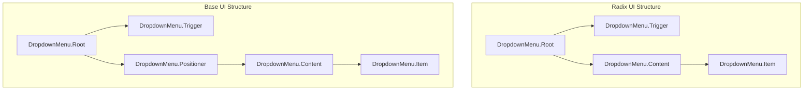
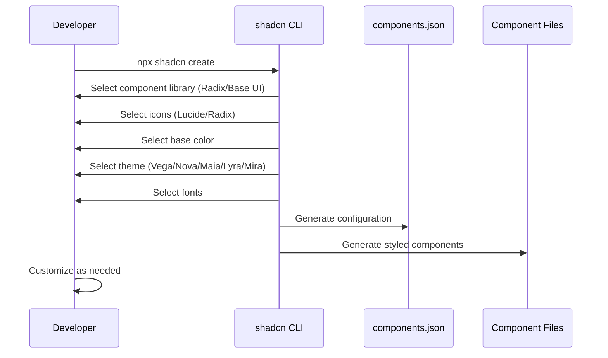

# shadcn/ui Base UI Migration & Customization - Research

**Date**: 2025-12-16
**Status**: Research Complete

## Table of Contents

- [Executive Summary](#executive-summary)
- [Technical Deep Dive](#technical-deep-dive)
- [Technology Stack / Ecosystem](#technology-stack--ecosystem)
- [Codebase Analysis](#codebase-analysis)
- [Implementation Feasibility](#implementation-feasibility)
- [Implementation Options](#implementation-options)
- [Comparison Matrix](#comparison-matrix)
- [Implementation Approach](#implementation-approach)
- [Alternatives Considered](#alternatives-considered)
- [Debates & Open Questions](#debates--open-questions)
- [Recommendations](#recommendations)
- [Additional Notes](#additional-notes)
- [Sources](#sources)

## Executive Summary

shadcn/ui now officially supports Base UI as an alternative to Radix UI, following Base UI's v1.0.0 stable release on December 11, 2025. For your Next.js 16 + React 19 + Tailwind v4 project with 20+ existing shadcn components, the recommended approach is a **fresh start with Base UI** rather than migrating existing Radix-based components. This provides better styling flexibility through the `render` prop pattern, a single dependency instead of 15+ Radix packages, and access to new features like native multi-select and combobox. The new shadcn/ui themes system (Vega, Nova, Maia, Lyra, Mira) combined with OKLCH colors offers significantly more customization options to avoid the "same look" problem.

## Technical Deep Dive

### Overview

Base UI is a library of unstyled ("headless") React components created by a collaboration of the teams behind Radix UI, Material UI, and Floating UI. It provides the behavior and accessibility logic without imposing any visual styling, giving developers complete control over appearance.

### Base UI vs Radix UI Architecture

The fundamental architectural difference lies in how component customization is handled:

**Radix UI: `asChild` Pattern**
```tsx
import { Slot } from 'radix-ui';

function Button({ asChild, ...props }) {
  const Comp = asChild ? Slot.Root : 'button';
  return <Comp {...props} />;
}

// Usage
<Button asChild>
  <a href="/contact">Contact</a>
</Button>
```

**Base UI: `render` Prop Pattern**
```tsx
import { useRender } from '@base-ui/react/use-render';

function Button({ render = <button />, ...props }) {
  return useRender({ render, props });
}

// Usage
<Button render={<a href="/contact">Contact</a>} />
```

The `render` prop pattern is considered more intuitive and provides better TypeScript inference.

### Component Structure Differences

Base UI requires a different component structure for positioned elements:



**Key Structural Changes:**
- Position props (`side`, `align`) attach to a `Positioner` component in Base UI, not directly to `Content`
- Labels must be nested within `Group` components
- `Select.Content` and `Select.Viewport` do not map directly to `Select.Positioner` and `Select.Popup`

### shadcn/ui New Themes System

shadcn/ui introduced 5 visual styles that go beyond color theming:

| Style | Description | Best For |
|-------|-------------|----------|
| **Vega** | Classic shadcn/ui look | General purpose, familiar aesthetic |
| **Nova** | Reduced padding/margins | Compact layouts, data-dense UIs |
| **Maia** | Soft, rounded, generous spacing | Consumer apps, friendly interfaces |
| **Lyra** | Boxy, sharp edges | Developer tools, pairs with mono fonts |
| **Mira** | Ultra-compact | Dense interfaces, dashboards |

These styles rewrite component code, not just CSS variables. Fonts, spacing, structure, and libraries all adapt to your selection.

### How the New CLI Works



## Technology Stack / Ecosystem

### Current Project Dependencies (Radix)

Your project currently uses 15 separate Radix packages:
- `@radix-ui/react-alert-dialog`
- `@radix-ui/react-avatar`
- `@radix-ui/react-checkbox`
- `@radix-ui/react-collapsible`
- `@radix-ui/react-dialog`
- `@radix-ui/react-dropdown-menu`
- `@radix-ui/react-label`
- `@radix-ui/react-popover`
- `@radix-ui/react-scroll-area`
- `@radix-ui/react-select`
- `@radix-ui/react-slot`
- `@radix-ui/react-switch`
- `@radix-ui/react-tabs`
- `@radix-ui/react-toggle`
- `@radix-ui/react-toggle-group`
- `@radix-ui/react-tooltip`

### Base UI Equivalent

With Base UI, all components come from a single package:
```bash
npm i @base-ui-components/react
# or
bun add @base-ui-components/react
```

### Base UI v1.0 Components

Base UI v1.0 includes 35+ components:

**Overlay Components:**
- Dialog, Popover, Tooltip, Toast
- Menu, Menubar, Context Menu, Navigation Menu

**Form Components:**
- Checkbox, Radio, Switch
- Select (with native `multiple` support)
- Combobox, Autocomplete
- Slider, Progress
- Toggle, Toggle Group

**Layout Components:**
- Accordion, Collapsible
- Tabs, Scroll Area

**Utilities:**
- Portal, Focus Trap
- useRender hook

### Tailwind v4 + React 19 Compatibility

Your project is already well-positioned:
- Next.js 16.0.10
- React 19.2.1
- Tailwind v4 via `@tailwindcss/postcss`
- `tw-animate-css` (already migrated from deprecated `tailwindcss-animate`)

**Key Changes in shadcn + Tailwind v4:**
- HSL colors converted to OKLCH
- `@theme inline` directive for CSS variables
- `forwardRef` removed (React 19 style)
- `data-slot` attributes for styling hooks
- Size utility consolidation (`size-4` instead of `w-4 h-4`)

## Codebase Analysis

### Current Radix Component Usage

Your project uses Radix components extensively across the folder-type management feature:

1. **Dialog/Alert Dialog** - `src/components/delete-confirmation-dialog.tsx`
2. **Dropdown Menu** - `src/app/(auth)/_components/header-tenant-switcher-client.tsx`
3. **Select** - Various form components
4. **Tabs** - `src/app/(auth)/folder-types/_components/tabs/`
5. **Toggle/Toggle Group** - Form builder components
6. **Collapsible** - Settings panels, accordions
7. **Checkbox/Switch** - Form fields
8. **Popover** - Field settings, tooltips

### Key Patterns to Preserve

Based on your codebase structure:
- **Form Builder** with drag-and-drop (`@dnd-kit`)
- **Tab-based forms** (Details, Properties, Roles tabs)
- **Server Components** with client islands
- **TanStack Form** integration
- **Zustand** for form builder state

## Implementation Feasibility

### Benefits

1. **Single dependency** - Replace 15+ `@radix-ui/*` packages with one `@base-ui-components/react`
2. **~15% smaller bundle** - Base UI optimizes for tree-shaking
3. **~20% faster rendering** in complex components
4. **Native multi-select** - `<Select multiple>` without workarounds
5. **Modern patterns** - `render` prop more intuitive than `asChild`
6. **Active maintenance** - Team from Radix, MUI, and Floating UI
7. **Better TypeScript** - More precise type inference

### Trade-offs & Challenges

1. **Learning curve** - New component structure (Positioner pattern)
2. **Migration effort** - Not a simple find-replace
3. **Ecosystem maturity** - Base UI v1.0 is new (December 2025)
4. **Third-party compatibility** - Some shadcn extensions may still require Radix
5. **API differences** - Props renamed, some removed

### When to Use Base UI

- New projects where you want modern patterns
- Projects needing multi-select or advanced combobox
- Teams frustrated with Radix's maintenance pace
- Projects prioritizing bundle size

### When to Stick with Radix

- Stable production apps with no issues
- Heavy use of third-party Radix-based libraries
- Team familiarity with Radix patterns
- Complex customizations already built on Radix

## Implementation Options

### Option 1: Fresh Start with Base UI (Recommended)

**Description**: Start a new shadcn/ui project with Base UI, then migrate features incrementally.

**Pros**:
- Clean slate with modern patterns
- Proper Base UI component structure from the start
- Access to new themes (Vega, Nova, Maia, Lyra, Mira)
- OKLCH color system with better customization
- Single dependency simplifies maintenance

**Cons**:
- Requires re-implementing all 20+ components
- Temporary parallel work during transition
- Need to preserve custom logic (form builder, dnd-kit integration)

**Complexity**: Medium

**Time Estimate**: 1-2 weeks

**When to Use**:
- Want a fundamentally different visual style
- Experiencing pain points with current component structure
- Planning significant UI changes anyway

### Option 2: In-Place Radix to Base UI Migration

**Description**: Migrate existing Radix-based shadcn components to Base UI one by one.

**Pros**:
- Gradual, lower risk
- Can preserve existing customizations
- No parallel codebases

**Cons**:
- Mixed dependencies during migration
- Must manually update each component's structure
- More complex than fresh start for structural changes

**Complexity**: High

**Time Estimate**: 2-3 weeks

**When to Use**:
- Heavy customizations you want to preserve
- Can't afford any downtime
- Need to maintain exact behavior during transition

### Option 3: Radix + New Themes (No Base UI)

**Description**: Keep Radix but leverage new shadcn themes and customization features.

**Pros**:
- No migration required
- Same familiar APIs
- New themes still available
- Lower risk

**Cons**:
- Miss Base UI benefits (bundle size, multi-select)
- Still 15+ dependencies
- Radix maintenance concerns remain

**Complexity**: Low

**Time Estimate**: 2-3 days

**When to Use**:
- Primary goal is visual refresh, not architecture
- Current components work well
- Not experiencing Radix pain points

## Comparison Matrix

| Criteria | Option 1: Fresh Start Base UI | Option 2: In-Place Migration | Option 3: Radix + Themes |
|----------|------------------------------|------------------------------|--------------------------|
| Complexity | Medium | High | Low |
| Risk | Medium | Medium-High | Low |
| Bundle Size | Best (~15% smaller) | Best | Same |
| Time to Implement | 1-2 weeks | 2-3 weeks | 2-3 days |
| Customization Freedom | Highest | High | Medium |
| Future-Proofing | Best | Best | Moderate |
| Learning Curve | Medium | Medium | None |
| Breaking Changes | All at once | Gradual | Minimal |

## Implementation Approach

### Prerequisites & Requirements

**For Base UI migration (Options 1 or 2):**
```bash
# Install Base UI
bun add @base-ui-components/react

# Remove Radix packages (after migration)
bun remove @radix-ui/react-alert-dialog @radix-ui/react-avatar \
  @radix-ui/react-checkbox @radix-ui/react-collapsible \
  @radix-ui/react-dialog @radix-ui/react-dropdown-menu \
  @radix-ui/react-label @radix-ui/react-popover \
  @radix-ui/react-scroll-area @radix-ui/react-select \
  @radix-ui/react-slot @radix-ui/react-switch \
  @radix-ui/react-tabs @radix-ui/react-toggle \
  @radix-ui/react-toggle-group @radix-ui/react-tooltip
```

### Getting Started (Option 1: Fresh Start)

**Step 1: Initialize New shadcn Configuration**
```bash
# Create new configuration alongside existing
npx shadcn@latest init
```

When prompted, select:
- Component library: **Base UI**
- Style: Choose one of **Vega/Nova/Maia/Lyra/Mira** based on your design goals
- Base color: Select your brand color
- CSS variables: **Yes**

**Step 2: Generate New Components**
```bash
# Add all base components you need
npx shadcn@latest add button dialog dropdown-menu select tabs \
  checkbox switch toggle collapsible alert-dialog popover \
  tooltip scroll-area avatar label
```

**Step 3: Create Unique Theme**

Edit `src/app/globals.css`:
```css
@import "tailwindcss";
@import "tw-animate-css";

@theme inline {
  /* Use OKLCH for better color manipulation */
  --color-background: oklch(100% 0 0);
  --color-foreground: oklch(10% 0 0);
  --color-primary: oklch(45% 0.2 250);
  --color-primary-foreground: oklch(98% 0 0);

  /* Customize to avoid "sameness" */
  --radius: 0.5rem;
  --font-sans: 'Your-Custom-Font', system-ui, sans-serif;
}

:root {
  --background: oklch(100% 0 0);
  --foreground: oklch(10% 0 0);
  --card: oklch(100% 0 0);
  --card-foreground: oklch(10% 0 0);
  --popover: oklch(100% 0 0);
  --popover-foreground: oklch(10% 0 0);
  --primary: oklch(45% 0.2 250);
  --primary-foreground: oklch(98% 0 0);
  --secondary: oklch(96% 0.01 250);
  --secondary-foreground: oklch(20% 0 0);
  --muted: oklch(96% 0.01 250);
  --muted-foreground: oklch(45% 0.02 250);
  --accent: oklch(96% 0.01 250);
  --accent-foreground: oklch(20% 0 0);
  --destructive: oklch(55% 0.25 25);
  --destructive-foreground: oklch(98% 0 0);
  --border: oklch(90% 0.01 250);
  --input: oklch(90% 0.01 250);
  --ring: oklch(45% 0.2 250);
}

.dark {
  --background: oklch(10% 0.01 250);
  --foreground: oklch(98% 0 0);
  /* ... dark mode values */
}
```

### Migration Pattern: Radix to Base UI

For each component, apply these transformations:

**1. Replace `asChild` with `render`:**
```tsx
// Before (Radix)
<Button asChild>
  <Link href="/page">Go</Link>
</Button>

// After (Base UI)
<Button render={<Link href="/page" />}>
  Go
</Button>
```

**2. Add Positioner for positioned content:**
```tsx
// Before (Radix)
<DropdownMenu.Content side="bottom" align="start">
  {/* items */}
</DropdownMenu.Content>

// After (Base UI)
<DropdownMenu.Positioner side="bottom" align="start">
  <DropdownMenu.Content>
    {/* items */}
  </DropdownMenu.Content>
</DropdownMenu.Positioner>
```

**3. Wrap labels in Groups:**
```tsx
// Before (Radix)
<DropdownMenu.Label>My Account</DropdownMenu.Label>
<DropdownMenu.Item>Profile</DropdownMenu.Item>

// After (Base UI)
<DropdownMenu.Group>
  <DropdownMenu.Label>My Account</DropdownMenu.Label>
  <DropdownMenu.Item>Profile</DropdownMenu.Item>
</DropdownMenu.Group>
```

### Theme Customization Tools

Use these tools to create unique themes:

1. **[TweakCN](https://tweakcn.com)** - Interactive theme editor with real-time preview
2. **[Shadcn Studio](https://shadcnstudio.com/theme-generator)** - Full theme generator with export
3. **[ui.jln.dev](https://ui.jln.dev)** - 10,000+ community themes

### Best Practices

1. **Create wrapper components** - Extend shadcn components rather than modifying originals
2. **Use CSS variables** - One change updates all components
3. **Test accessibility** - Both libraries are accessible, but verify after customization
4. **Preserve dnd-kit integration** - The drag-and-drop logic is independent of the UI library

### Common Pitfalls & How to Avoid Them

1. **Direct Content positioning** - Remember Base UI requires Positioner wrapper
2. **Missing Group wrappers** - Labels must be inside Group components
3. **`asChild` in Base UI** - This pattern doesn't exist; use `render` prop
4. **OKLCH syntax errors** - Ensure proper format: `oklch(L% C H)`
5. **Mixed dependencies** - Don't import from both Radix and Base UI in same component

### Testing Strategy

- **Unit tests**: Focus on custom business logic, not component behavior
- **Integration tests**: Verify form builder functionality with new components
- **Visual regression**: Use Playwright screenshots to catch styling issues
- **Accessibility audit**: Run axe-core after migration

## Alternatives Considered

### Alternative 1: React Aria (Adobe)

- **Description**: Adobe's accessibility-first hooks library
- **Why not chosen**: More complex API, hook-based rather than component-based, larger learning curve
- **When better**: When you need the strictest ARIA compliance

### Alternative 2: Ariakit

- **Description**: Another headless UI library with good accessibility
- **Why not chosen**: Smaller ecosystem, not officially supported by shadcn
- **When better**: When you want simpler APIs than React Aria but more flexibility than Radix

### Alternative 3: Keep Current Setup

- **Description**: No changes, continue with Radix-based shadcn
- **Why not chosen**: User specifically wants better styling flexibility and fresh start
- **When better**: When current setup works and no major changes needed

## Debates & Open Questions

### Base UI Maturity
- v1.0 just released December 2025; some edge cases may emerge
- Strong team (Radix + MUI + Floating UI creators) provides confidence
- shadcn official support validates production readiness

### Radix Future
- Concerns about maintenance pace and WorkOS acquisition
- Still battle-tested and stable
- shadcn creator recommends staying with Radix for existing production apps

### Multi-Select Native Support
- Base UI has native `<Select multiple>` support
- Radix lacks this, requiring custom implementations
- Significant advantage for form-heavy applications

## Recommendations

### Preferred Approach: Option 1 - Fresh Start with Base UI

**Should This Be Implemented?**: Yes

**Rationale**:
- User explicitly wants "fresh start with better styling flexibility"
- Heavy shadcn usage (20+ components) means significant bundle savings
- New themes system provides unique styling opportunities
- Project already on React 19 + Tailwind v4, minimizing compatibility concerns
- Form-heavy application can benefit from Base UI's native multi-select

**Why**:
1. **Clean architecture** - Proper Base UI patterns from start
2. **Maximum customization** - New themes + OKLCH + render prop flexibility
3. **Future-proofing** - Base UI actively maintained by combined team
4. **Bundle optimization** - Single package vs 15+ Radix packages
5. **Developer experience** - Modern patterns, better TypeScript inference

**Key Considerations**:
- Preserve form builder logic during migration
- Test dnd-kit integration with new components
- Consider Nova or Lyra theme for data-dense folder management UI
- Use TweakCN for rapid theme prototyping

**Potential Challenges**:

1. **Form Builder Complexity** - The drag-and-drop form builder has intricate state management. Test thoroughly.
   - Mitigation: dnd-kit is UI-library agnostic; focus on component props

2. **Tab Navigation** - Multiple tabbed interfaces in folder-type forms
   - Mitigation: Base UI Tabs API is similar; mainly structural changes

3. **Dialog/Modal Patterns** - Delete confirmation, form editors
   - Mitigation: Follow Base UI Dialog patterns; test focus management

**Success Criteria**:
- All 20+ current components migrated to Base UI
- Bundle size reduced by 10%+ (measure before/after)
- Unique visual identity achieved (no "shadcn default" look)
- All existing functionality preserved
- Accessibility maintained (axe-core passes)

## Additional Notes

- The basecn.dev project provides pre-built shadcn components on Base UI if you want references
- Consider the Nova or Mira theme for your data-dense folder management interface
- OKLCH color space allows for more perceptually uniform color adjustments
- The new `data-slot` attributes in React 19 components enable powerful CSS targeting

## Sources

1. [Radix UI vs Base UI: Which Library Fits Your React Project?](https://preblocks.com/blog/radix-ui-vs-base-ui)
2. [migrate Radix to new Base UI - shadcn-ui/ui Discussion #6248](https://github.com/shadcn-ui/ui/discussions/6248)
3. [shadcn/ui Changelog](https://ui.shadcn.com/docs/changelog)
4. [shadcn/ui Theming Documentation](https://ui.shadcn.com/docs/theming)
5. [shadcn/ui Tailwind v4 Migration Guide](https://ui.shadcn.com/docs/tailwind-v4)
6. [Base UI Releases](https://base-ui.com/react/overview/releases)
7. [Base UI GitHub](https://github.com/mui/base-ui)
8. [basecn - shadcn/ui components powered by Base UI](https://basecn.dev/)
9. [Migrating from Radix UI - basecn](https://basecn.dev/docs/get-started/migrating-from-radix-ui)
10. [TweakCN Theme Editor](https://tweakcn.com/)
11. [Shadcn Studio Theme Generator](https://shadcnstudio.com/theme-generator)
12. [The Complete Shadcn/UI Theming Guide with OKLCH](https://dev.to/yigit-konur/the-complete-shadcnui-theming-guide-a-practical-approach-with-oklch-to-make-it-looks-10x-more-2l4l)
13. [You're Using ShadCN Wrong - Customization Guide](https://dev.to/vansh-codes/youre-using-shadcn-wrong-heres-the-right-way-to-customize-it-3656)
14. [React UI libraries in 2025 Comparison](https://makersden.io/blog/react-ui-libs-2025-comparing-shadcn-radix-mantine-mui-chakra)
15. [@base-ui-components/react - npm](https://www.npmjs.com/package/@base-ui-components/react)
