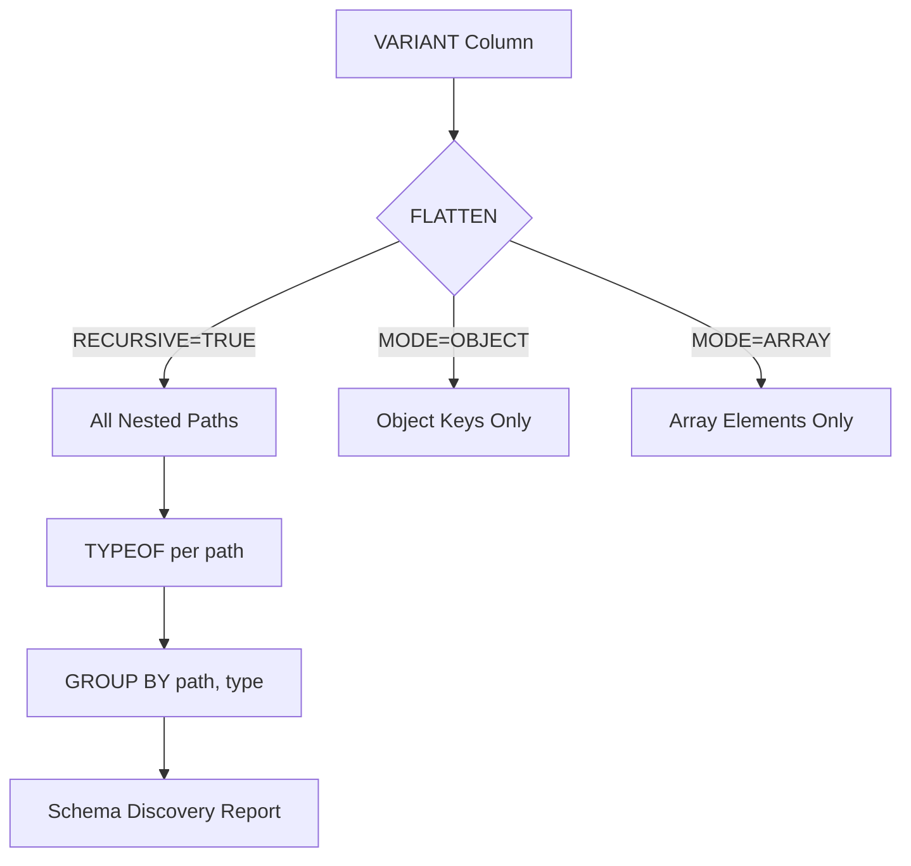
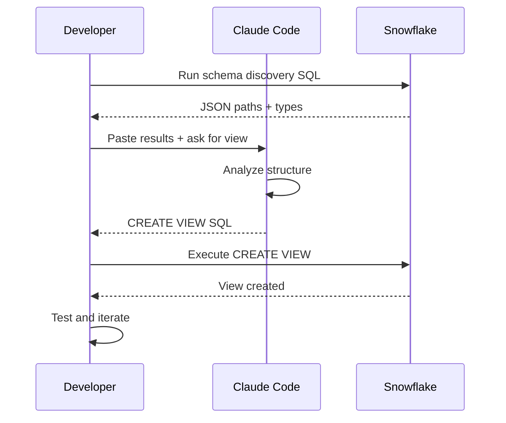

# Snowflake + Claude Code Workflow - Research

**Date**: 2025-12-03
**Status**: Research Complete

## Table of Contents

- [Executive Summary](#executive-summary)
- [Technical Deep Dive](#technical-deep-dive)
- [Technology Stack / Ecosystem](#technology-stack--ecosystem)
- [Codebase Analysis](#codebase-analysis)
- [Implementation Feasibility](#implementation-feasibility)
- [Implementation Options](#implementation-options)
- [Comparison Matrix](#comparison-matrix)
- [Implementation Approach](#implementation-approach)
- [Alternatives Considered](#alternatives-considered)
- [Debates & Open Questions](#debates--open-questions)
- [Recommendations](#recommendations)
- [Additional Notes](#additional-notes)
- [Sources](#sources)

## Executive Summary

Working with Snowflake in Claude Code for reverse-engineering table schemas and building views from VARIANT/JSON data is best accomplished through a combination of SQL introspection scripts and optionally an MCP server for live query capabilities. The recommended approach uses a "paste results" workflow with targeted SQL scripts for schema discovery, combined with FLATTEN with RECURSIVE for JSON path enumeration and explicit type casting for view creation.

## Technical Deep Dive

### Overview

Snowflake provides multiple mechanisms for schema introspection and semi-structured data exploration. For MongoDB CDC pipelines storing data in VARIANT columns, the key challenge is discovering the JSON structure within `RECORD_CONTENT` columns and creating typed views that extract meaningful fields.

### Schema Introspection Methods

#### INFORMATION_SCHEMA Queries

The `INFORMATION_SCHEMA` views provide metadata about database objects. Key views for schema work:

```sql
-- Get column metadata for a specific table
SELECT
    TABLE_SCHEMA,
    TABLE_NAME,
    COLUMN_NAME,
    DATA_TYPE,
    IS_NULLABLE,
    COLUMN_DEFAULT,
    COMMENT
FROM INFORMATION_SCHEMA.COLUMNS
WHERE TABLE_NAME = 'MY_TABLE'
ORDER BY ORDINAL_POSITION;

-- List all tables in a schema with row counts
SELECT
    TABLE_SCHEMA,
    TABLE_NAME,
    ROW_COUNT,
    BYTES
FROM INFORMATION_SCHEMA.TABLES
WHERE TABLE_SCHEMA = 'MY_SCHEMA'
ORDER BY TABLE_NAME;
```

**Limitations**: Only shows column-level metadata. For VARIANT columns, it returns `VARIANT` as the data type without revealing internal JSON structure.

#### DESCRIBE TABLE / SHOW COLUMNS

Quick metadata retrieval without querying INFORMATION_SCHEMA:

```sql
-- Full table description
DESCRIBE TABLE MY_DATABASE.MY_SCHEMA.MY_TABLE;

-- Abbreviated form
DESC TABLE MY_TABLE;

-- Show columns with filtering
SHOW COLUMNS IN TABLE MY_TABLE;
SHOW COLUMNS LIKE '%RAW' IN SCHEMA MY_SCHEMA;
```

**Output includes**: Column name, data type, nullable, default, primary key, unique key, check, expression, comment, policy name.

#### GET_DDL Function

Extract complete DDL for recreation or documentation:

```sql
-- Get CREATE TABLE statement
SELECT GET_DDL('TABLE', 'MY_SCHEMA.MY_TABLE');

-- Get schema DDL (all objects)
SELECT GET_DDL('SCHEMA', 'MY_DATABASE.MY_SCHEMA');

-- Get view definition
SELECT GET_DDL('VIEW', 'MY_SCHEMA.MY_VIEW');
```

### JSON Path Discovery with FLATTEN

The most powerful technique for exploring VARIANT column structure:

```sql
-- Discover all JSON paths and their types
SELECT
    REGEXP_REPLACE(f.path, '\\[[0-9]+\\]', '[]') AS json_path,
    TYPEOF(f.value) AS data_type,
    COUNT(*) AS occurrence_count,
    COUNT(DISTINCT f.value) AS distinct_values
FROM MY_TABLE,
     LATERAL FLATTEN(RECORD_CONTENT, RECURSIVE => TRUE) f
GROUP BY 1, 2
ORDER BY 1, 2;
```

**Key FLATTEN parameters**:
- `RECURSIVE => TRUE`: Traverses all nested levels
- `MODE => 'ARRAY'|'OBJECT'|'BOTH'`: Filter by structure type
- `OUTER => TRUE`: Include rows even when nothing to flatten



### TYPEOF Function for Type Inference

Returns the actual data type stored in a VARIANT value:

```sql
-- Check type of specific field
SELECT
    TYPEOF(RECORD_CONTENT:_id) AS id_type,
    TYPEOF(RECORD_CONTENT:created_at) AS created_type,
    TYPEOF(RECORD_CONTENT:amount) AS amount_type
FROM MY_TABLE
LIMIT 10;

-- Common return values:
-- VARCHAR, INTEGER, DECIMAL, DOUBLE, BOOLEAN,
-- ARRAY, OBJECT, NULL_VALUE, TIMESTAMP_NTZ
```

### INFER_SCHEMA for Staged Files

Note: `INFER_SCHEMA` works on staged files, not VARIANT columns directly:

```sql
-- For staged JSON files
SELECT * FROM TABLE(
    INFER_SCHEMA(
        LOCATION => '@my_stage/data/',
        FILE_FORMAT => 'my_json_format',
        MAX_RECORDS_PER_FILE => 1000
    )
);
```

**Limitation**: Only supports first-level nesting. Not applicable to data already loaded into VARIANT columns.

### OBJECT_KEYS for Top-Level Discovery

Get immediate keys without recursion:

```sql
-- List top-level keys in JSON
SELECT DISTINCT OBJECT_KEYS(RECORD_CONTENT) AS top_level_keys
FROM MY_TABLE
LIMIT 100;

-- Sample values for specific keys
SELECT
    f.value AS key_name
FROM MY_TABLE,
     LATERAL FLATTEN(OBJECT_KEYS(RECORD_CONTENT)) f
GROUP BY 1;
```

## Technology Stack / Ecosystem

### MCP Server Options

#### 1. Official Snowflake Labs MCP Server

**Repository**: [Snowflake-Labs/mcp](https://github.com/Snowflake-Labs/mcp)

**Features**:
- Cortex Search, Analyst, and Agent integration
- SQL Execution with permission controls
- Object Management (create, modify, drop)
- Semantic View consumption

**Installation**:
```bash
uvx snowflake-labs-mcp --service-config-file config.yaml
```

**Best for**: Enterprise environments with Cortex AI needs

#### 2. Community MCP Server (isaacwasserman)

**Repository**: [isaacwasserman/mcp-snowflake-server](https://github.com/isaacwasserman/mcp-snowflake-server)

**Features**:
- `read_query` - Execute SELECT statements
- `list_databases`, `list_schemas`, `list_tables`
- `describe_table` - Get column definitions
- `append_insight` - Track discoveries

**Installation**:
```bash
npx -y @smithery/cli install mcp_snowflake_server --client claude
```

**Configuration** (Claude Desktop / Claude Code):
```json
{
  "mcpServers": {
    "snowflake": {
      "command": "uvx",
      "args": ["mcp-snowflake-server"],
      "env": {
        "SNOWFLAKE_ACCOUNT": "your_account",
        "SNOWFLAKE_USER": "your_user",
        "SNOWFLAKE_PASSWORD": "your_password",
        "SNOWFLAKE_WAREHOUSE": "your_warehouse",
        "SNOWFLAKE_DATABASE": "your_database",
        "SNOWFLAKE_SCHEMA": "your_schema"
      }
    }
  }
}
```

**Best for**: Simple read-only schema exploration and query execution

#### 3. Read-Only MCP Server (dynamike)

**Repository**: [dynamike/snowflake-mcp-server](https://github.com/dynamike/snowflake-mcp-server)

**Best for**: Security-conscious environments requiring read-only access

### CLI Tools

#### SnowSQL (Legacy CLI)

Snowflake's original command-line client:

```bash
# Connect and run query
snowsql -a <account> -u <user> -d <database> -s <schema> \
  -q "DESCRIBE TABLE MY_TABLE" -o output_format=csv
```

#### Snow CLI (Modern Alternative)

Newer CLI with better ergonomics:

```bash
# Install
pip install snowflake-cli-labs

# Run query
snow sql -q "SELECT * FROM TABLE LIMIT 10"
```

### Python Connector

For scripted schema extraction:

```python
import snowflake.connector

conn = snowflake.connector.connect(
    account='account',
    user='user',
    password='password',
    warehouse='warehouse',
    database='database',
    schema='schema'
)

# Get schema info
cursor = conn.cursor()
cursor.execute("""
    SELECT REGEXP_REPLACE(f.path, '\\\\[[0-9]+\\\\]', '[]') AS path,
           TYPEOF(f.value) AS type,
           COUNT(*) AS count
    FROM MY_TABLE, LATERAL FLATTEN(RECORD_CONTENT, RECURSIVE=>TRUE) f
    GROUP BY 1, 2 ORDER BY 1
""")
for row in cursor:
    print(row)
```

## Codebase Analysis

### Existing CDC Pipeline Pattern

From `CLAUDE.md`, the repository follows this pattern:

```
MongoDB -> Kafka (MSK) -> Snowflake

1. CDC Table (KAFKA.<COLLECTION>_CDC)
   - RECORD_METADATA VARIANT
   - RECORD_CONTENT VARIANT

2. Stream (KAFKA.<COLLECTION>_STREAM)
   - APPEND_ONLY stream on CDC table

3. Raw Table (<SCHEMA>.<COLLECTION>_RAW)
   - ID VARCHAR
   - CDC_TIMESTAMP TIMESTAMP_NTZ
   - RECORD_METADATA VARIANT
   - RECORD_CONTENT VARIANT

4. Task (KAFKA.<COLLECTION>_TASK)
   - 5-minute scheduled MERGE
```

### Key Pattern Observations

1. **Two VARIANT columns**: `RECORD_METADATA` (Kafka metadata) and `RECORD_CONTENT` (MongoDB document)
2. **ID extraction**: Already extracted to VARCHAR in RAW tables
3. **Deduplication**: Uses `MAX_BY` for offset-based deduplication
4. **Views location**: `scripts/views/` directory

### Typical View Creation Flow



## Implementation Feasibility

### Benefits

**MCP Server Approach**:
- Live query execution without context switching
- Automatic schema exploration tools
- Integrated insight tracking
- Reduced copy-paste workflow

**Paste Results Approach**:
- No additional setup required
- Works in any environment
- Full control over queries
- No credential exposure to MCP

### Trade-offs & Challenges

**MCP Server Challenges**:
- Requires credential configuration
- Additional dependency to maintain
- May not support all authentication methods
- Security review needed for enterprise environments

**Paste Results Challenges**:
- Manual workflow with context switching
- Results may be truncated for large schemas
- Requires user to know which queries to run

### When to Use MCP

- Frequent schema exploration across many tables
- Interactive view development with rapid iteration
- Team standardization on tooling

### When to Use Paste Results

- One-off view creation
- Enterprise environments with strict security
- When MCP server is unavailable or unsupported

## Implementation Options

### Option 1: Paste Results Workflow (Recommended)

**Description**: Use curated SQL scripts to extract schema info, paste results into Claude Code

**Pros**:
- Zero setup required
- Works immediately
- No credential management
- Compatible with any Snowflake access method

**Cons**:
- Manual context switching
- Copy-paste overhead
- Results may need formatting

**Complexity**: Low

**Time Estimate**: Immediate

**Reuses Patterns**: Yes - leverages existing SQL knowledge

### Option 2: MCP Server Integration

**Description**: Install and configure isaacwasserman/mcp-snowflake-server for live queries

**Pros**:
- Interactive schema exploration
- Automated table listing
- Built-in describe functionality
- Seamless Claude Code integration

**Cons**:
- Requires setup and configuration
- Credential management
- Additional dependency
- May not support SSO/MFA

**Complexity**: Medium

**Time Estimate**: 1-2 hours setup

**Reuses Patterns**: Partial - new tooling layer

### Option 3: Schema Documentation Files

**Description**: Generate and maintain JSON/YAML schema documentation files

**Pros**:
- Version controlled schemas
- Shareable across team
- Works offline
- Good for stable schemas

**Cons**:
- Requires maintenance as schemas evolve
- Initial generation effort
- May become stale

**Complexity**: Medium

**Time Estimate**: 2-4 hours initial, ongoing maintenance

**Reuses Patterns**: Yes - standard documentation practice

## Comparison Matrix

| Criteria | Paste Results | MCP Server | Schema Docs |
|----------|---------------|------------|-------------|
| Setup Time | None | 1-2 hours | 2-4 hours |
| Maintenance | None | Low | Medium |
| Real-time Data | Yes (manual) | Yes (auto) | No |
| Security | High | Medium | High |
| Offline Work | No | No | Yes |
| Team Sharing | Manual | N/A | Easy |
| Learning Curve | Low | Medium | Low |

## Implementation Approach

### Recommended: Paste Results Workflow

#### SQL Scripts for Claude Code

**1. Table Schema Overview**
```sql
-- Get all RAW tables and their structure
SELECT
    TABLE_SCHEMA,
    TABLE_NAME,
    COLUMN_NAME,
    DATA_TYPE
FROM INFORMATION_SCHEMA.COLUMNS
WHERE TABLE_NAME LIKE '%_RAW'
ORDER BY TABLE_SCHEMA, TABLE_NAME, ORDINAL_POSITION;
```

**2. JSON Path Discovery (Primary Tool)**
```sql
-- Discover all JSON paths in RECORD_CONTENT
-- Run this against your target RAW table
SELECT
    REGEXP_REPLACE(f.path, '\\[[0-9]+\\]', '[]') AS json_path,
    TYPEOF(f.value) AS snowflake_type,
    COUNT(*) AS occurrences,
    COUNT(DISTINCT TYPEOF(f.value)) AS type_variations
FROM MY_SCHEMA.MY_TABLE_RAW
    SAMPLE (1000 ROWS),
    LATERAL FLATTEN(RECORD_CONTENT, RECURSIVE => TRUE) f
WHERE f.value IS NOT NULL
GROUP BY 1, 2
ORDER BY 1, 2;
```

**3. Sample Values for Key Fields**
```sql
-- Get sample values to understand data patterns
SELECT
    RECORD_CONTENT:field_name::VARCHAR AS field_value,
    COUNT(*) AS count
FROM MY_TABLE_RAW
GROUP BY 1
ORDER BY 2 DESC
LIMIT 20;
```

**4. Null Analysis**
```sql
-- Check which fields are commonly null
SELECT
    'field1' AS field_name,
    COUNT(*) AS total_rows,
    COUNT(RECORD_CONTENT:field1) AS non_null_count,
    ROUND(100.0 * COUNT(RECORD_CONTENT:field1) / COUNT(*), 2) AS fill_rate_pct
FROM MY_TABLE_RAW
UNION ALL
SELECT 'field2', COUNT(*), COUNT(RECORD_CONTENT:field2),
       ROUND(100.0 * COUNT(RECORD_CONTENT:field2) / COUNT(*), 2)
FROM MY_TABLE_RAW;
```

### View Creation Patterns

**Basic Typed View**
```sql
CREATE OR REPLACE VIEW MY_SCHEMA.MY_VIEW AS
SELECT
    ID,
    CDC_TIMESTAMP,
    -- String fields
    RECORD_CONTENT:name::VARCHAR AS name,
    RECORD_CONTENT:email::VARCHAR AS email,
    -- Numeric fields
    RECORD_CONTENT:amount::NUMBER(18,2) AS amount,
    RECORD_CONTENT:quantity::INTEGER AS quantity,
    -- Boolean fields
    RECORD_CONTENT:is_active::BOOLEAN AS is_active,
    -- Timestamp fields (MongoDB stores as $date)
    TRY_TO_TIMESTAMP_NTZ(RECORD_CONTENT:created_at:"$date"::VARCHAR) AS created_at,
    -- Nested object access
    RECORD_CONTENT:address:city::VARCHAR AS city,
    RECORD_CONTENT:address:zip::VARCHAR AS zip_code,
    -- Array handling (first element)
    RECORD_CONTENT:tags[0]::VARCHAR AS primary_tag
FROM MY_SCHEMA.MY_TABLE_RAW;
```

**MongoDB ObjectId Handling**
```sql
-- MongoDB _id is often an object with $oid
RECORD_CONTENT:_id:"$oid"::VARCHAR AS mongo_id,
-- Or if stored as string directly
RECORD_CONTENT:_id::VARCHAR AS mongo_id
```

**MongoDB Date Handling**
```sql
-- MongoDB dates from CDC typically have $date wrapper
TRY_TO_TIMESTAMP_NTZ(
    RECORD_CONTENT:created_at:"$date"::VARCHAR
) AS created_at,

-- Or as milliseconds since epoch
TO_TIMESTAMP_NTZ(
    RECORD_CONTENT:created_at:"$date"::NUMBER / 1000
) AS created_at
```

### Workflow Steps

1. **Identify Target Table**
   ```
   User: "I need to create a view for the ORDERS_RAW table"
   ```

2. **Run Schema Discovery**
   ```sql
   -- Paste this query result to Claude
   SELECT REGEXP_REPLACE(f.path, '\\[[0-9]+\\]', '[]'), TYPEOF(f.value), COUNT(*)
   FROM ORDERS_SCHEMA.ORDERS_RAW SAMPLE (1000 ROWS),
        LATERAL FLATTEN(RECORD_CONTENT, RECURSIVE => TRUE) f
   GROUP BY 1, 2 ORDER BY 1;
   ```

3. **Share Results with Claude**
   ```
   User: "Here are the JSON paths in ORDERS_RAW:
   [paste results]
   Create a view extracting the key fields."
   ```

4. **Iterate on View Definition**
   - Claude generates initial view SQL
   - User tests in Snowflake
   - User reports any type errors or issues
   - Claude refines the view

### Best Practices

1. **Use TRY_ Functions for Safety**
   ```sql
   TRY_TO_NUMBER(RECORD_CONTENT:amount::VARCHAR) AS amount
   TRY_TO_TIMESTAMP_NTZ(RECORD_CONTENT:date::VARCHAR) AS date
   ```

2. **Handle NULL Consistently**
   ```sql
   COALESCE(RECORD_CONTENT:status::VARCHAR, 'unknown') AS status
   ```

3. **Document Complex Extractions**
   ```sql
   -- MongoDB stores dates as {$date: "2024-01-01T00:00:00Z"}
   TRY_TO_TIMESTAMP_NTZ(RECORD_CONTENT:created_at:"$date"::VARCHAR) AS created_at
   ```

4. **Sample Before Full Discovery**
   ```sql
   -- Use SAMPLE to speed up path discovery on large tables
   FROM MY_TABLE SAMPLE (1000 ROWS)
   ```

## Alternatives Considered

### Alternative 1: Full Schema Documentation System

- Create a schema registry with versioned JSON schemas
- Maintain documentation for each collection
- **Why not chosen**: Overhead for small/medium teams, schemas evolve frequently in CDC scenarios

### Alternative 2: Automated View Generation

- Script that auto-generates views from VARIANT analysis
- **Why not chosen**: Requires significant upfront investment, may miss business context for field naming and typing

### Alternative 3: dbt for View Management

- Use dbt models for view generation with Jinja templating
- **Why not chosen**: Adds tooling complexity, paste workflow is simpler for one-off views

## Debates & Open Questions

1. **MCP Server Security**: The community MCP servers require storing credentials. Is this acceptable for production database access?

2. **Schema Evolution**: When MongoDB schema changes, how should views be updated? Manual review vs automated detection?

3. **Type Coercion Strictness**: Should views use `TRY_` functions everywhere (safer but may hide data issues) or strict casting (fails fast but may break downstream)?

4. **Array Handling**: For arrays in VARIANT, when to use `FLATTEN` in views vs handling in application layer?

## Recommendations

### Preferred Approach: Paste Results Workflow

**Should This Be Implemented?**: Yes - immediate, no setup required

**Rationale**:
- Aligns with existing repository patterns (SQL scripts in `scripts/` directory)
- No additional dependencies or security considerations
- Claude Code handles schema analysis well when given structured query results
- Flexible for any Snowflake access method (SnowSQL, web UI, Python)

**Key Considerations**:
1. Create a standard set of schema discovery SQL scripts
2. Document MongoDB-specific type handling patterns
3. Use `SAMPLE` clauses for performance on large tables
4. Include `TRY_` functions in view templates for robustness

**Potential Challenges**:
1. **Large Result Sets** - Use `SAMPLE` and `LIMIT` to keep output manageable
2. **Complex Nested Structures** - May need iterative exploration with targeted queries
3. **Type Inconsistencies** - MongoDB schemaless nature may have mixed types in same field

**Success Criteria**:
- Can create a typed view from any RAW table within 15-30 minutes
- Views handle MongoDB-specific patterns (ObjectId, Date, etc.)
- Schema discovery queries are reusable across collections

### Optional Enhancement: MCP Server

If the paste workflow becomes cumbersome with frequent view development:

1. Install `mcp-snowflake-server` with read-only credentials
2. Configure for the development database only
3. Use for schema exploration, not production queries

## Additional Notes

### MongoDB CDC-Specific Patterns

MongoDB documents through Debezium/CDC typically have these special structures:

```json
{
  "_id": {"$oid": "507f1f77bcf86cd799439011"},
  "created_at": {"$date": "2024-01-15T10:30:00Z"},
  "updated_at": {"$date": 1705312200000},
  "decimal_field": {"$numberDecimal": "123.45"},
  "long_field": {"$numberLong": "9223372036854775807"}
}
```

Handle these in views:
```sql
RECORD_CONTENT:_id:"$oid"::VARCHAR AS id,
TRY_TO_TIMESTAMP_NTZ(RECORD_CONTENT:created_at:"$date"::VARCHAR) AS created_at,
RECORD_CONTENT:decimal_field:"$numberDecimal"::NUMBER(18,2) AS decimal_field
```

### Performance Tips

1. **Avoid FLATTEN in frequently-queried views** - materialize if needed
2. **Extract frequently-filtered fields** to dedicated columns
3. **Use search optimization** for VARIANT columns with frequent queries:
   ```sql
   ALTER TABLE MY_TABLE ADD SEARCH OPTIMIZATION ON EQUALITY(RECORD_CONTENT);
   ```

## Sources

1. [INFER_SCHEMA Documentation](https://docs.snowflake.com/en/sql-reference/functions/infer_schema) - Snowflake Documentation
2. [Querying Semi-structured Data](https://docs.snowflake.com/en/user-guide/querying-semistructured) - Snowflake Documentation
3. [TYPEOF Function](https://docs.snowflake.com/en/sql-reference/functions/typeof) - Snowflake Documentation
4. [Snowflake Information Schema](https://docs.snowflake.com/en/sql-reference/info-schema) - Snowflake Documentation
5. [DESCRIBE TABLE](https://docs.snowflake.com/en/sql-reference/sql/desc-table) - Snowflake Documentation
6. [SHOW COLUMNS](https://docs.snowflake.com/en/sql-reference/sql/show-columns) - Snowflake Documentation
7. [Snowflake Labs MCP Server](https://github.com/Snowflake-Labs/mcp) - GitHub
8. [Community MCP Snowflake Server](https://github.com/isaacwasserman/mcp-snowflake-server) - GitHub
9. [Read-Only MCP Server](https://github.com/dynamike/snowflake-mcp-server) - GitHub
10. [Semi-structured Data Considerations](https://docs.snowflake.com/en/user-guide/semistructured-considerations) - Snowflake Documentation
11. [Snowflake 101: Working with Semi-Structured Data](https://select.dev/posts/snowflake-semi-structured-data) - Select.dev
12. [Schema Evolution in Snowflake](https://medium.com/snowflake/schema-evolution-patterns-handling-in-snowflake-4ea5674c8a87) - Medium
13. [Infer Schema from VARIANT Column](https://stackoverflow.com/questions/62604149/snowflake-infer-schema-from-json-data-in-variant-column-dynamically) - Stack Overflow
