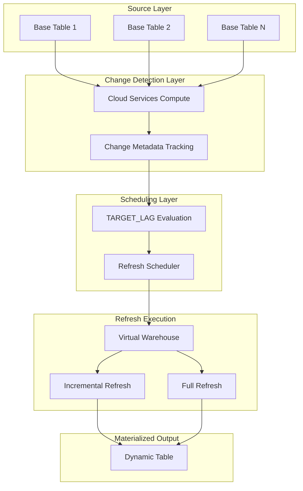
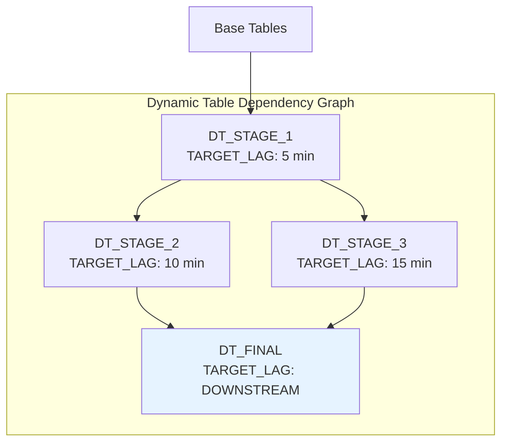
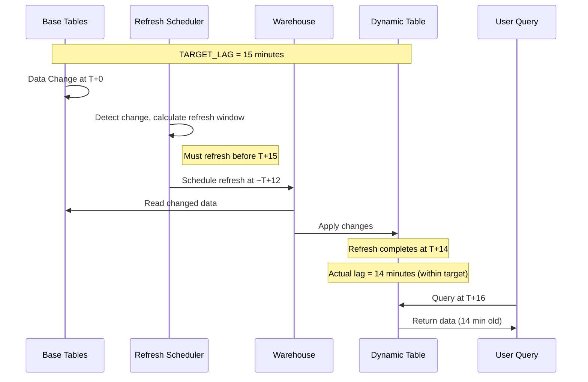
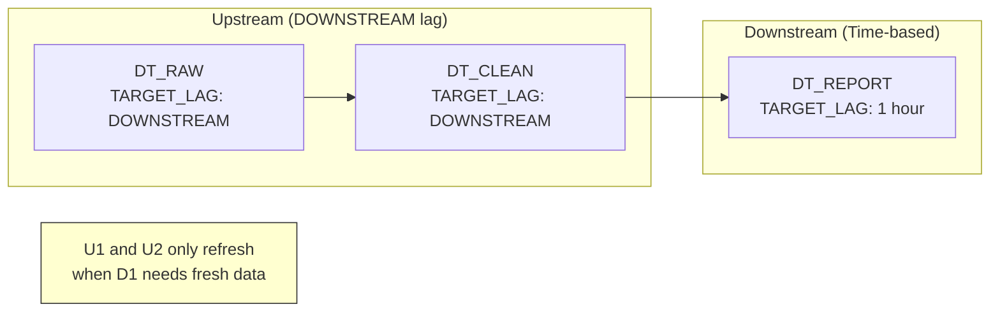
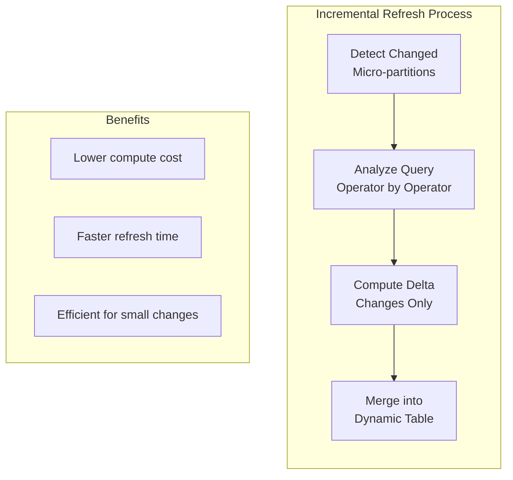
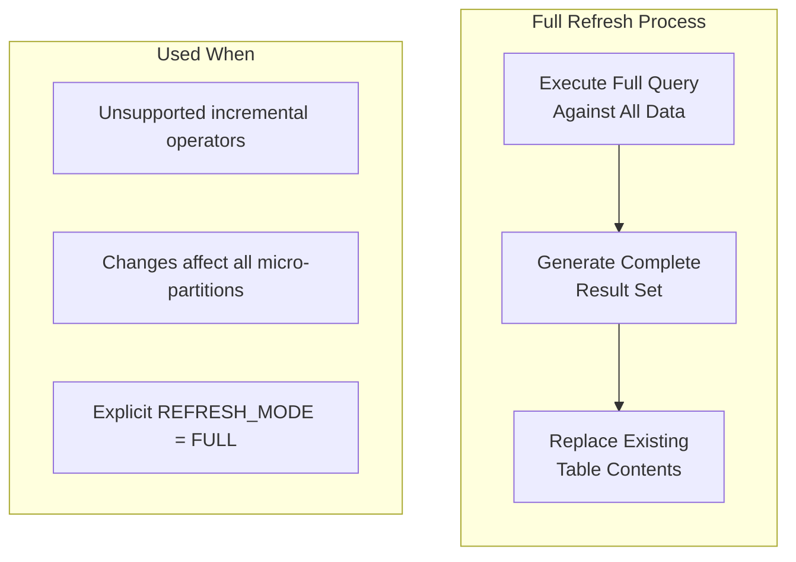
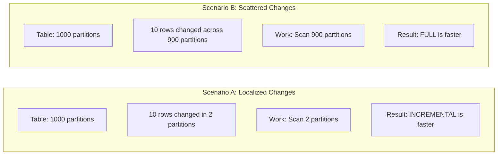
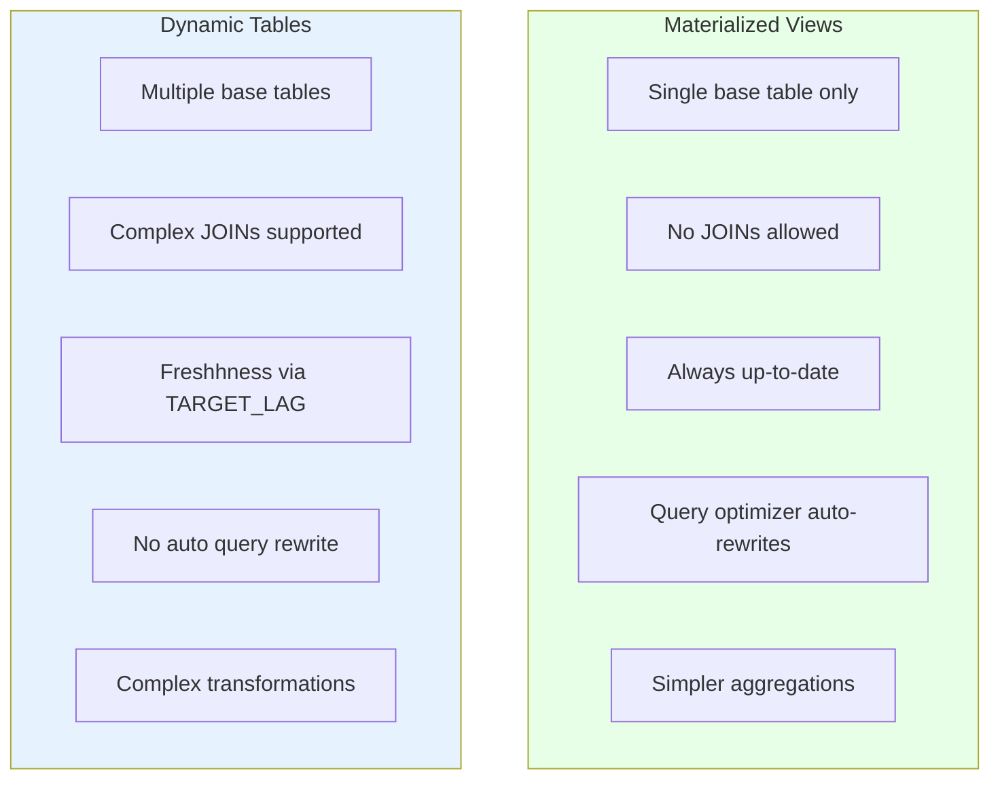
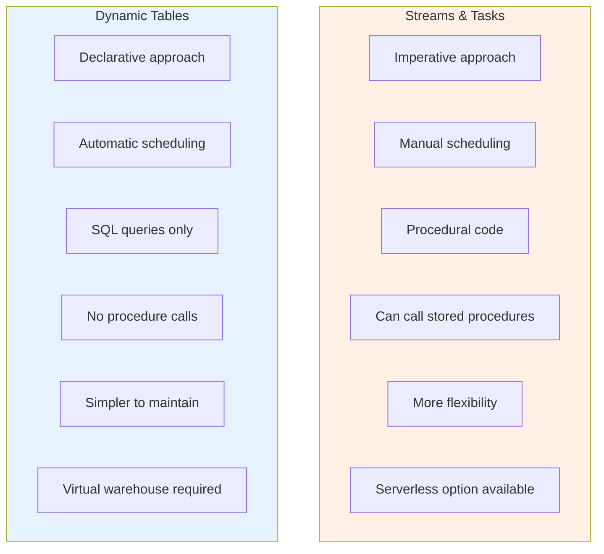
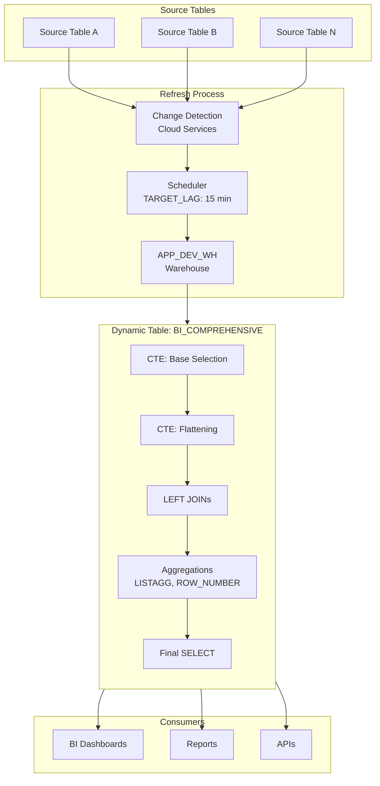

# Snowflake Dynamic Tables and TARGET_LAG - Research

**Date**: 2025-12-03
**Status**: Research Complete

## Table of Contents

- [Executive Summary](#executive-summary)
- [Technical Deep Dive](#technical-deep-dive)
- [Technology Stack / Ecosystem](#technology-stack--ecosystem)
- [Implementation Feasibility](#implementation-feasibility)
- [Implementation Options](#implementation-options)
- [Comparison Matrix](#comparison-matrix)
- [Implementation Approach](#implementation-approach)
- [Alternatives Considered](#alternatives-considered)
- [Debates & Open Questions](#debates--open-questions)
- [Recommendations](#recommendations)
- [Additional Notes](#additional-notes)
- [Sources](#sources)

## Executive Summary

Snowflake Dynamic Tables are declarative, automatically-refreshing tables that materialize query results and maintain data freshness through a TARGET_LAG specification. Unlike streams/tasks (imperative) or materialized views (limited to single tables), Dynamic Tables support complex transformations including JOINs, aggregations, and LATERAL FLATTEN operations while Snowflake handles refresh scheduling and change propagation automatically. For a complex BI table like `BI_COMPREHENSIVE` with multiple CTEs, LATERAL FLATTEN, LEFT JOINs, and aggregations (LISTAGG, ROW_NUMBER), a TARGET_LAG of 15 minutes will trigger periodic refreshes where Snowflake determines the optimal schedule (likely every 10-14 minutes) to keep actual lag below the target, though the query complexity may result in full refresh mode rather than incremental.

## Technical Deep Dive

### Overview

Dynamic Tables are a table type introduced by Snowflake (GA April 2024) that automatically materialize query results and refresh based on a user-defined freshness target. They represent a declarative approach to data pipelines where you specify *what* you want (the query result) rather than *how* to get it (procedural transformation code).

### Core Architecture

Dynamic Tables operate through a sophisticated automated refresh process:

1. **Query Definition**: You define a SELECT statement that specifies the desired transformation
2. **Materialization**: Snowflake executes the query and stores results as a physical table
3. **Change Detection**: Cloud Services continuously monitor base objects for changes
4. **Refresh Scheduling**: An automated process schedules refreshes based on TARGET_LAG
5. **Incremental/Full Refresh**: The system merges changes or rebuilds the table as needed



### How Change Detection Works

Behind the scenes, Snowflake creates lightweight internal streams on base tables to capture change metadata. This metadata includes:

- Row identifiers (ROW_ID)
- Operation type (INSERT, UPDATE, DELETE)
- Timestamps

This allows Snowflake to identify which micro-partitions have changed since the last refresh without scanning entire tables.

### Directed Acyclic Graph (DAG) Coordination

When multiple Dynamic Tables depend on each other, Snowflake builds a DAG to coordinate refreshes:



The refresh scheduler:
- Calculates compatible refresh times across the DAG
- Ensures downstream tables never refresh faster than upstream tables
- Maintains snapshot isolation across dependent tables

### TARGET_LAG Deep Dive

TARGET_LAG is the primary control mechanism for data freshness. It specifies the maximum acceptable delay between source data changes and their reflection in the Dynamic Table.

#### Time-Based TARGET_LAG

When you specify `TARGET_LAG = '15 minutes'`:

1. **Not a Fixed Interval**: This does NOT mean the table refreshes exactly every 15 minutes
2. **Inverse Relationship**: Target lag is inversely proportional to refresh frequency
3. **Proactive Scheduling**: Snowflake schedules refreshes slightly earlier to allow completion time
4. **Actual Behavior**: A 15-minute target might result in refreshes every 10-14 minutes



#### How Snowflake Calculates Refresh Schedule

The scheduler considers:

1. **Target Lag Value**: The maximum acceptable staleness
2. **Expected Refresh Duration**: Based on historical refresh times
3. **DAG Dependencies**: Coordination with upstream/downstream tables
4. **Change Volume**: Amount of data that needs processing

**Example Calculation**:
- Target lag: 15 minutes
- Average refresh duration: 3 minutes
- Scheduled refresh interval: ~12 minutes (15 - 3 buffer)

#### DOWNSTREAM vs Time-Based

| Aspect | Time-Based (e.g., '15 minutes') | DOWNSTREAM |
|--------|--------------------------------|------------|
| **Trigger** | Scheduled based on target lag | On-demand when dependent tables need data |
| **Use Case** | End-consumer tables | Intermediate pipeline stages |
| **Compute Cost** | Predictable, regular | Variable, only when needed |
| **Freshness** | Guaranteed maximum staleness | Depends on downstream requirements |



#### Target Lag Constraints

- Target lag is NOT a guarantee - it's a best-effort target
- Actual lag may exceed target due to:
  - Warehouse size being insufficient
  - Large data volumes
  - Complex query execution
  - Upstream refresh delays

### Refresh Process: Incremental vs Full

#### Incremental Refresh

Incremental refresh analyzes query changes since the last refresh and merges only modified data:



**Best for**:
- Large datasets with small, frequent updates
- Changes affecting < 5% of total data
- Well-clustered data aligned with query keys

**Operator Support for Incremental Refresh**:

| Operator | Incremental Support | Performance Notes |
|----------|-------------------|-------------------|
| SELECT (scalar) | Yes | Applies expressions to changed rows only |
| WHERE | Yes | Evaluates predicates on changed rows |
| UNION ALL | Yes | Takes union of changes from each side |
| WITH (CTEs) | Yes | Computes changes for each CTE |
| INNER JOIN | Yes | 10x improvement with good locality |
| LEFT/RIGHT JOIN | Yes | 3x improvement with good locality |
| GROUP BY | Yes | 5x with good locality, 0.25x with poor |
| LATERAL FLATTEN | Yes | Cost scales linearly with change size |
| Window Functions | Yes | Requires PARTITION BY, recomputes affected partitions |

**NOT Supported for Incremental**:
- External functions
- Subquery operators (WHERE EXISTS)
- PIVOT, UNPIVOT, SAMPLE
- MINUS, EXCEPT, INTERSECT
- Non-deterministic functions
- Recursive CTEs

#### Full Refresh

Full refresh executes the entire query and replaces all materialized results:



**Best for**:
- Complex queries with unsupported operators
- Aggregate tables where changes impact all partitions
- Small tables where full refresh is faster

#### Micro-Partition Considerations

A critical insight: **incremental refresh work is proportional to modified micro-partitions, not just row count**.



**Key Practice**: Keep change volume to ~5% of source data and cluster by grouping keys to maximize incremental refresh efficiency.

### Comparison: Dynamic Tables vs Alternatives

#### Dynamic Tables vs Materialized Views



| Feature | Materialized Views | Dynamic Tables |
|---------|-------------------|----------------|
| Query Complexity | Single table, aggregations only | JOINs, UNIONs, complex transformations |
| Data Freshness | Always current (automatic) | Based on TARGET_LAG |
| Query Optimization | Automatic rewrite | Manual reference required |
| Refresh Cost | Included in query processing | Separate compute cost |
| Use Case | Query acceleration | ELT pipelines |

#### Dynamic Tables vs Streams/Tasks



| Feature | Streams/Tasks | Dynamic Tables |
|---------|---------------|----------------|
| Approach | Imperative (how) | Declarative (what) |
| Scheduling | Manual definition | Automatic based on lag |
| Code Flexibility | Stored procedures, UDFs | SQL queries only |
| Error Handling | Custom logic | Automatic retry |
| Compute | Serverless available | Virtual warehouse |
| Complexity | Higher (more code) | Lower (just SQL) |

## Technology Stack / Ecosystem

### Required Components

- **Snowflake Account**: Enterprise edition or higher recommended
- **Virtual Warehouse**: Dedicated warehouse for refresh operations
- **Base Tables**: Standard Snowflake tables (not external, streams, or MVs)

### Version Requirements

- Dynamic Tables reached GA in April 2024
- LATERAL FLATTEN incremental support added in 2024
- Iceberg table support added November 2024

### Integration Points

- **Snowsight UI**: Visual monitoring and management
- **SQL Commands**: CREATE, ALTER, DESCRIBE DYNAMIC TABLE
- **Table Functions**: DYNAMIC_TABLE_REFRESH_HISTORY, DYNAMIC_TABLE_GRAPH_HISTORY
- **Account Usage Views**: Historical monitoring beyond 7-day retention

## Implementation Feasibility

### Benefits for BI_COMPREHENSIVE Use Case

1. **Simplified Pipeline Management**
   - No manual stream/task orchestration
   - Automatic dependency handling
   - Declarative refresh scheduling

2. **Complex Query Support**
   - CTEs fully supported
   - LATERAL FLATTEN supported with incremental refresh
   - LEFT JOINs supported
   - Window functions (ROW_NUMBER) supported with PARTITION BY

3. **Predictable Freshness**
   - 15-minute TARGET_LAG ensures data never more than 15 minutes stale
   - Automatic refresh scheduling

### Trade-offs & Challenges

1. **Potential Full Refresh**
   - LISTAGG may not be efficiently incrementalized
   - Complex CTEs with aggregations may trigger full refresh
   - Multiple JOINs with aggregations can be inefficient

2. **Cost Considerations**
   - 15-minute lag means frequent refreshes (~4-6 per hour)
   - Complex query = longer refresh duration = higher cost
   - No serverless option (unlike Tasks)

3. **Performance Uncertainty**
   - Refresh mode determined at creation (cannot change)
   - Complex queries may unpredictably choose full refresh
   - Micro-partition scatter can degrade incremental performance

### When to Use Dynamic Tables

**Ideal for**:
- BI dashboards with acceptable staleness (5-60 minutes)
- Complex transformations currently using streams/tasks
- Multi-stage data pipelines
- Deduplication with ROW_NUMBER patterns

**Avoid When**:
- Real-time requirements (< 1 minute freshness)
- Need for procedural logic or stored procedures
- Multiple inputs to single target table
- Tables requiring DML operations

## Implementation Options

### Option 1: Single Dynamic Table (Current Approach)

**Description**: Define the entire BI_COMPREHENSIVE query as a single Dynamic Table with TARGET_LAG = '15 minutes'

```sql
CREATE OR REPLACE DYNAMIC TABLE INSPECT.BI_COMPREHENSIVE
  TARGET_LAG = '15 minutes'
  WAREHOUSE = APP_DEV_WH
AS
  -- Full complex query with CTEs, JOINs, FLATTEN, aggregations
  ...
```

**Pros**:
- Simplest implementation
- Single point of management
- Automatic refresh scheduling

**Cons**:
- May force full refresh due to query complexity
- All-or-nothing refresh cost
- Difficult to optimize specific stages

**Complexity**: Low
**Time Estimate**: 1-2 hours (already implemented)

### Option 2: Multi-Stage Dynamic Table Pipeline

**Description**: Break the complex query into multiple Dynamic Tables, each handling a specific transformation stage

```sql
-- Stage 1: Base flattening
CREATE DYNAMIC TABLE INSPECT.BI_STAGE_FLATTEN
  TARGET_LAG = DOWNSTREAM
  WAREHOUSE = APP_DEV_WH
AS
  SELECT ...
  FROM source, LATERAL FLATTEN(...);

-- Stage 2: Joins
CREATE DYNAMIC TABLE INSPECT.BI_STAGE_JOINS
  TARGET_LAG = DOWNSTREAM
  WAREHOUSE = APP_DEV_WH
AS
  SELECT ...
  FROM INSPECT.BI_STAGE_FLATTEN
  LEFT JOIN ...;

-- Stage 3: Final aggregations
CREATE DYNAMIC TABLE INSPECT.BI_COMPREHENSIVE
  TARGET_LAG = '15 minutes'
  WAREHOUSE = APP_DEV_WH
AS
  SELECT ...
  FROM INSPECT.BI_STAGE_JOINS
  GROUP BY ...;
```

**Pros**:
- Each stage can use optimal refresh mode
- Better incremental refresh potential
- Easier debugging and monitoring
- Intermediate tables can serve other use cases

**Cons**:
- More objects to manage
- Slightly higher storage cost
- More complex initial setup

**Complexity**: Medium
**Time Estimate**: 4-8 hours

### Option 3: Hybrid Streams/Tasks + Dynamic Table

**Description**: Use streams and tasks for high-frequency base transformations, Dynamic Table for final aggregation

```sql
-- Stream on source
CREATE STREAM INSPECT.BI_SOURCE_STREAM ON TABLE ...;

-- Task for incremental processing
CREATE TASK INSPECT.BI_INCREMENTAL_TASK
  WAREHOUSE = APP_DEV_WH
  SCHEDULE = '5 minutes'
AS
  MERGE INTO INSPECT.BI_INTERMEDIATE ...;

-- Dynamic Table for final view
CREATE DYNAMIC TABLE INSPECT.BI_COMPREHENSIVE
  TARGET_LAG = '15 minutes'
  WAREHOUSE = APP_DEV_WH
AS
  SELECT ... FROM INSPECT.BI_INTERMEDIATE ...;
```

**Pros**:
- Maximum control over incremental processing
- Append-only stream option for performance
- Serverless task option for cost savings

**Cons**:
- Most complex implementation
- Manual orchestration required
- More failure points

**Complexity**: High
**Time Estimate**: 1-2 days

## Comparison Matrix

| Criteria | Option 1: Single DT | Option 2: Multi-Stage | Option 3: Hybrid |
|----------|---------------------|----------------------|------------------|
| Complexity | Low | Medium | High |
| Maintainability | High | Medium | Low |
| Refresh Efficiency | Low (likely full) | High (staged incremental) | High |
| Cost Control | Low | Medium | High |
| Debugging | Difficult | Easy | Medium |
| Setup Time | 1-2 hours | 4-8 hours | 1-2 days |
| Flexibility | Low | Medium | High |

## Implementation Approach

### Prerequisites & Requirements

1. **Warehouse**: Dedicated warehouse for refresh operations (APP_DEV_WH)
2. **Permissions**: CREATE DYNAMIC TABLE privilege
3. **Source Tables**: Must have DATA_RETENTION_TIME_IN_DAYS > 0
4. **Monitoring**: Access to Snowsight or DYNAMIC_TABLE_REFRESH_HISTORY

### Getting Started

For the current single Dynamic Table approach:

```sql
-- Create the Dynamic Table
CREATE OR REPLACE DYNAMIC TABLE INSPECT.BI_COMPREHENSIVE
  TARGET_LAG = '15 minutes'
  WAREHOUSE = APP_DEV_WH
  REFRESH_MODE = AUTO  -- Let Snowflake decide
  INITIALIZE = ON_CREATE
AS
  -- Your complex query here
  WITH cte1 AS (...),
       cte2 AS (...)
  SELECT ...
  FROM ...
  LEFT JOIN ...
  GROUP BY ...;

-- Verify creation and refresh mode
SHOW DYNAMIC TABLES LIKE 'BI_COMPREHENSIVE' IN SCHEMA INSPECT;
DESCRIBE DYNAMIC TABLE INSPECT.BI_COMPREHENSIVE;
```

### Architecture & Design Considerations



**Key Design Decisions**:

1. **Refresh Mode**: Use `AUTO` to let Snowflake determine optimal approach
2. **Warehouse Sizing**: Ensure warehouse can complete refresh within target lag
3. **Initialize**: Use `ON_CREATE` for immediate data availability
4. **Error Handling**: Monitor for FAILED refresh states

### Best Practices

1. **Warehouse Sizing**
   - Test refresh duration on representative data
   - Warehouse should complete refresh in < 50% of TARGET_LAG
   - Consider auto-scaling for variable workloads

2. **Query Optimization**
   - Use QUALIFY ROW_NUMBER() pattern for deduplication
   - Minimize unnecessary GROUP BY operations
   - Consider breaking complex CTEs into separate Dynamic Tables

3. **Monitoring Setup**
   ```sql
   -- Check refresh history
   SELECT *
   FROM TABLE(INFORMATION_SCHEMA.DYNAMIC_TABLE_REFRESH_HISTORY(
     NAME => 'INSPECT.BI_COMPREHENSIVE'
   ))
   ORDER BY REFRESH_END_TIME DESC
   LIMIT 10;

   -- Check lag metrics
   SELECT *
   FROM TABLE(INFORMATION_SCHEMA.DYNAMIC_TABLES(
     NAME => 'INSPECT.BI_COMPREHENSIVE'
   ));
   ```

4. **Cost Management**
   - Use dedicated warehouse for cost attribution
   - Monitor credits via METERING_HISTORY
   - Consider longer TARGET_LAG if near-real-time not required

### Common Pitfalls & How to Avoid Them

1. **Pitfall: Assuming Incremental Refresh**
   - Complex queries often fall back to full refresh
   - **Solution**: Check actual refresh mode after creation; consider multi-stage approach

2. **Pitfall: Undersized Warehouse**
   - Refresh takes longer than TARGET_LAG, causing lag accumulation
   - **Solution**: Test with production data volumes; size warehouse for 2x expected refresh time

3. **Pitfall: Ignoring Micro-Partition Scatter**
   - Scattered changes across all partitions kill incremental performance
   - **Solution**: Cluster source tables by keys used in Dynamic Table query

4. **Pitfall: No Monitoring**
   - Silently failing refreshes or accumulated lag
   - **Solution**: Set up alerts on DYNAMIC_TABLE_REFRESH_HISTORY

### Testing Strategy

```sql
-- 1. Create with small dataset first
CREATE DYNAMIC TABLE INSPECT.BI_COMPREHENSIVE_TEST
  TARGET_LAG = '15 minutes'
  WAREHOUSE = APP_DEV_WH
AS
  SELECT ... WHERE created_date > CURRENT_DATE - 7;

-- 2. Check refresh mode
SHOW DYNAMIC TABLES LIKE 'BI_COMPREHENSIVE_TEST';
-- Look at REFRESH_MODE column

-- 3. Force a refresh and measure duration
ALTER DYNAMIC TABLE INSPECT.BI_COMPREHENSIVE_TEST REFRESH;

-- 4. Check refresh history
SELECT *
FROM TABLE(INFORMATION_SCHEMA.DYNAMIC_TABLE_REFRESH_HISTORY(
  NAME => 'INSPECT.BI_COMPREHENSIVE_TEST'
));

-- 5. Scale to full dataset and repeat
```

## Alternatives Considered

### Alternative 1: Materialized View

**Why Not Chosen**:
- Cannot support JOINs (BI_COMPREHENSIVE requires multiple)
- Cannot support complex CTEs
- Limited to single base table

**When Better**:
- Simple aggregations on single table
- Need always-current data
- Want transparent query optimization

### Alternative 2: Standard View

**Why Not Chosen**:
- No materialization - query runs every time
- Performance impact on consumers
- No freshness guarantee (always current but expensive)

**When Better**:
- Data must always be real-time
- Query is simple and fast
- Infrequent access pattern

### Alternative 3: Manual Streams/Tasks Pipeline

**Why Not Chosen**:
- More complex to implement and maintain
- Manual dependency management
- More failure points

**When Better**:
- Need procedural logic
- Require serverless compute
- Need precise control over incremental processing

## Debates & Open Questions

1. **Incremental vs Full Refresh for Complex Aggregations**
   - Community debate on whether LISTAGG triggers full refresh
   - Some report incremental working with simple LISTAGG, full for complex cases
   - **Recommendation**: Test with actual query and check refresh mode

2. **Optimal TARGET_LAG Value**
   - Trade-off between freshness and cost
   - 15 minutes is reasonable for BI dashboards
   - Consider: Do stakeholders actually need data fresher than 15 minutes?

3. **Single vs Multi-Stage Pipeline**
   - Single is simpler but may force full refresh
   - Multi-stage adds complexity but enables targeted optimization
   - **Open Question**: Test single approach first; migrate to multi-stage only if refresh costs are prohibitive

4. **Warehouse Sharing vs Dedicated**
   - Shared warehouse complicates cost attribution
   - Dedicated warehouse clearer for monitoring but may be underutilized
   - Consider: Use dedicated warehouse with aggressive auto-suspend

## Recommendations

### Preferred Approach: Option 1 (Single Dynamic Table) with Monitoring

**Should This Be Implemented?**: Yes - already implemented; focus on monitoring and optimization

**Rationale**:
- Dynamic Tables are the appropriate solution for this use case
- 15-minute lag is reasonable for BI dashboards
- Simplest approach should be tried first

**Why**:
- Complex query with CTEs, JOINs, FLATTEN is exactly what Dynamic Tables are designed for
- Automatic refresh scheduling eliminates manual orchestration
- Current streams/tasks pattern (if any) can be simplified

**Key Considerations**:

1. **Verify Refresh Mode**: After creation, check if Snowflake chose INCREMENTAL or FULL
   ```sql
   SHOW DYNAMIC TABLES LIKE 'BI_COMPREHENSIVE' IN SCHEMA INSPECT;
   ```

2. **Monitor Refresh Duration**: Ensure refreshes complete well within 15 minutes
   ```sql
   SELECT REFRESH_START_TIME, REFRESH_END_TIME,
          DATEDIFF('second', REFRESH_START_TIME, REFRESH_END_TIME) as duration_seconds
   FROM TABLE(INFORMATION_SCHEMA.DYNAMIC_TABLE_REFRESH_HISTORY(
     NAME => 'INSPECT.BI_COMPREHENSIVE'
   ))
   ORDER BY REFRESH_END_TIME DESC;
   ```

3. **Track Costs**: Monitor warehouse credits consumed
   ```sql
   SELECT *
   FROM TABLE(INFORMATION_SCHEMA.DYNAMIC_TABLE_REFRESH_HISTORY(
     NAME => 'INSPECT.BI_COMPREHENSIVE'
   ))
   WHERE WAREHOUSE_USED = TRUE;
   ```

**Potential Challenges**:

1. **Full Refresh Mode Selected**
   - *Mitigation*: If refresh duration is acceptable, full refresh is fine
   - *Fallback*: Migrate to Option 2 (multi-stage) if costs are too high

2. **Refresh Duration Exceeds Target Lag**
   - *Mitigation*: Increase warehouse size or extend TARGET_LAG
   - *Fallback*: Break into smaller Dynamic Tables

**Success Criteria**:
- Refreshes consistently complete within 15 minutes
- No FAILED refresh states
- Warehouse costs are acceptable for business value delivered
- Dashboard users report data is sufficiently fresh

## Additional Notes

### Upcoming Features (2025)

1. **IMMUTABLE WHERE Clause**: Mark historical data regions as immutable to skip reprocessing
2. **Backfill Support**: Seed Dynamic Tables with historical data without full reprocessing
3. **Enhanced Iceberg Support**: Native Iceberg Dynamic Tables

### Cost Estimation Formula

Approximate monthly cost:
```
Refreshes per hour = 60 / (TARGET_LAG_MINUTES * 0.8)
Refreshes per month = Refreshes per hour * 24 * 30
Credits per month = Refreshes per month * (Refresh duration / 3600) * Warehouse credits per hour
```

For 15-minute lag with 3-minute refresh on X-Small (1 credit/hour):
```
Refreshes per hour = 60 / (15 * 0.8) = 5
Refreshes per month = 5 * 24 * 30 = 3,600
Credits per month = 3,600 * (180/3600) * 1 = 180 credits
```

### Monitoring Queries Reference

```sql
-- Current status of all Dynamic Tables
SELECT
  NAME,
  SCHEDULING_STATE,
  LAST_COMPLETED_REFRESH_STATE,
  DATA_TIMESTAMP,
  PCT_TIME_WITHIN_TARGET_LAG,
  MAX_LAG_SECONDS
FROM TABLE(INFORMATION_SCHEMA.DYNAMIC_TABLES());

-- Refresh history with warehouse usage
SELECT
  NAME,
  REFRESH_START_TIME,
  REFRESH_END_TIME,
  STATE,
  STATE_MESSAGE,
  WAREHOUSE_USED
FROM TABLE(INFORMATION_SCHEMA.DYNAMIC_TABLE_REFRESH_HISTORY())
WHERE NAME = 'BI_COMPREHENSIVE'
ORDER BY REFRESH_END_TIME DESC
LIMIT 20;

-- Dependency graph
SELECT *
FROM TABLE(INFORMATION_SCHEMA.DYNAMIC_TABLE_GRAPH_HISTORY())
WHERE NAME = 'BI_COMPREHENSIVE';
```

## Sources

1. [Dynamic tables | Snowflake Documentation](https://docs.snowflake.com/en/user-guide/dynamic-tables-about) - Core concepts and overview
2. [Understanding dynamic table target lag | Snowflake Documentation](https://docs.snowflake.com/en/user-guide/dynamic-tables-target-lag) - TARGET_LAG mechanism details
3. [Understanding dynamic table initialization and refresh | Snowflake Documentation](https://docs.snowflake.com/en/user-guide/dynamic-tables-refresh) - Refresh process internals
4. [How refresh mode affects dynamic table performance | Snowflake Documentation](https://docs.snowflake.com/en/user-guide/dynamic-tables-performance-refresh-mode) - Incremental vs full refresh
5. [How operators incrementally refresh | Snowflake Documentation](https://docs.snowflake.com/en/user-guide/dynamic-tables-performance-incremental-operators) - Operator-level incremental support
6. [Best practices for optimizing dynamic table performance | Snowflake Documentation](https://docs.snowflake.com/en/user-guide/dynamic-table-performance-guide) - Performance optimization
7. [Understanding cost for dynamic tables | Snowflake Documentation](https://docs.snowflake.com/en/user-guide/dynamic-tables-cost) - Cost components and optimization
8. [Monitor dynamic tables | Snowflake Documentation](https://docs.snowflake.com/en/user-guide/dynamic-tables-monitor) - Monitoring approaches
9. [Dynamic table limitations | Snowflake Documentation](https://docs.snowflake.com/en/user-guide/dynamic-tables-limitations) - Constraints and unsupported features
10. [Dynamic tables compared to streams and tasks, and materialized views | Snowflake Documentation](https://docs.snowflake.com/en/user-guide/dynamic-tables-comparison) - Alternative comparison
11. [Supported queries for dynamic tables | Snowflake Documentation](https://docs.snowflake.com/en/user-guide/dynamic-tables-supported-queries) - Query support matrix
12. [CREATE DYNAMIC TABLE | Snowflake Documentation](https://docs.snowflake.com/en/sql-reference/sql/create-dynamic-table) - SQL reference
13. [April 29, 2024 — Dynamic Tables — General Availability | Snowflake Documentation](https://docs.snowflake.com/en/release-notes/2024/other/2024-04-29-dynamic-tables) - GA announcement
14. [Snowflake Dynamic Tables Explained | DataCamp](https://www.datacamp.com/tutorial/snowflake-dynamic-tables) - Tutorial overview
15. [Everything You Need to Know About Snowflake Dynamic Tables | Select](https://select.dev/posts/snowflake-dynamic-tables) - Comprehensive guide
