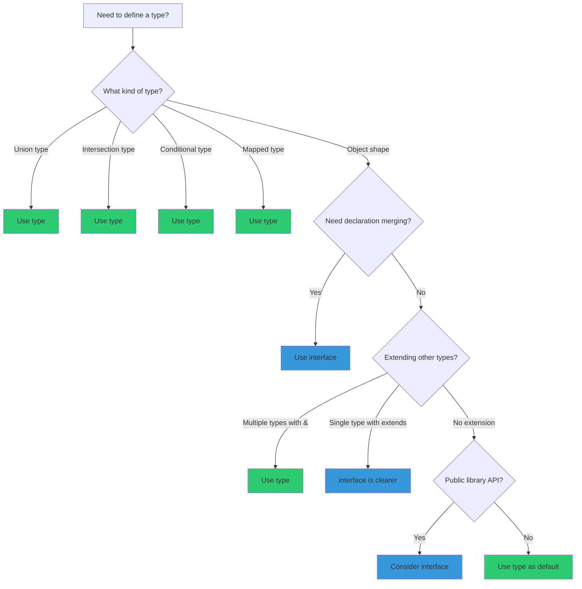

# TypeScript Anti-Patterns - Comprehensive Research

**Date**: 2025-12-19
**Status**: Research Complete

## Table of Contents

- [Executive Summary](#executive-summary)
- [TypeScript 5.x New Feature Guidelines](#typescript-5x-new-feature-guidelines)
- [Type Safety Anti-Patterns](#type-safety-anti-patterns)
- [Generic Anti-Patterns](#generic-anti-patterns)
- [Union and Intersection Anti-Patterns](#union-and-intersection-anti-patterns)
- [Utility Type Anti-Patterns](#utility-type-anti-patterns)
- [Interface vs Type Anti-Patterns](#interface-vs-type-anti-patterns)
- [Enum Anti-Patterns](#enum-anti-patterns)
- [Function Anti-Patterns](#function-anti-patterns)
- [Class Anti-Patterns](#class-anti-patterns)
- [Module and Import Anti-Patterns](#module-and-import-anti-patterns)
- [Configuration Anti-Patterns](#configuration-anti-patterns)
- [React + TypeScript Anti-Patterns](#react--typescript-anti-patterns)
- [Strict Mode Checklist](#strict-mode-checklist)
- [Type vs Interface Decision Tree](#type-vs-interface-decision-tree)
- [Common Type Errors and Fixes](#common-type-errors-and-fixes)
- [Sources](#sources)

---

## Executive Summary

This document catalogs TypeScript anti-patterns across multiple categories, from TypeScript 5.x-specific features through general type safety issues to React integration problems. The key takeaways are: (1) prefer `unknown` over `any` for type safety, (2) use `satisfies` for validation while preserving inference, (3) follow the "Golden Rule of Generics" - type parameters should appear at least twice, (4) enable strict mode for all new projects, and (5) understand the nuances between `type` and `interface` for appropriate use cases.

---

## TypeScript 5.x New Feature Guidelines

### Stage 3 Decorators (TS 5.0+)

TypeScript 5.0 implemented Stage 3 decorators, replacing the experimental Stage 2 implementation.

#### Decorator Migration Anti-Pattern

```typescript
// ❌ DON'T: Use Stage 2 decorator syntax expecting 3 arguments
function legacyDecorator(
  target: any,
  propertyKey: string,
  descriptor: PropertyDescriptor
) {
  // Old Stage 2 pattern
}

// ✅ DO: Use Stage 3 decorator pattern with 2 arguments
function modernDecorator<T>(
  target: T,
  context: ClassMethodDecoratorContext
) {
  return function (this: unknown, ...args: unknown[]) {
    console.log("Method called:", context.name);
    return (target as Function).apply(this, args);
  };
}
```

**Why it's an anti-pattern**: Stage 3 decorators receive only 2 arguments, not 3. Libraries using the old pattern will break at runtime when invoked with the new decorator implementation.

**Impact**: Runtime errors, broken third-party library integration

#### Parameter Decorators Anti-Pattern

```typescript
// ❌ DON'T: Expect parameter decorators to work (not yet in Stage 3)
class Service {
  constructor(@Inject("config") config: Config) {} // Not supported
}

// ✅ DO: Use alternative patterns until parameter decorators reach Stage 3
class Service {
  constructor(config: Config) {}
}

// Or use metadata through class decorators
@Injectable({ deps: ["config"] })
class Service {
  constructor(config: Config) {}
}
```

**Why it's an anti-pattern**: Parameter decorator proposal is not yet in Stage 3, so TypeScript 5.0+ doesn't support decorating parameters without `experimentalDecorators`.

---

### `satisfies` Operator (TS 4.9+)

The `satisfies` operator validates that a value conforms to a type without widening it.

#### Overuse of `satisfies`

```typescript
// ❌ DON'T: Use satisfies for simple values where type annotation works
const name = "John" satisfies string;
const count = 42 satisfies number;

// ✅ DO: Use type annotation for simple cases
const name: string = "John";
const count: number = 42;
```

**Why it's an anti-pattern**: Using `satisfies` for simple primitives adds verbosity without benefit.

#### Underuse Where `satisfies` Excels

```typescript
type RouteConfig = Record<string, { path: string; auth?: boolean }>;

// ❌ DON'T: Use type annotation and lose literal types
const routes: RouteConfig = {
  home: { path: "/" },
  admin: { path: "/admin", auth: true },
};
routes.home; // Type: { path: string; auth?: boolean }
// routes.typo - No error! RouteConfig allows any string key

// ✅ DO: Use satisfies to validate while preserving inference
const routes = {
  home: { path: "/" },
  admin: { path: "/admin", auth: true },
} satisfies RouteConfig;
routes.home; // Type: { path: "/" }
routes.typo; // Error: Property 'typo' does not exist
```

**Why it's an anti-pattern**: Type annotations widen types, losing the precise literal types. `satisfies` validates the structure while preserving the narrow inferred type.

#### Incorrect Combination with `as const`

```typescript
// ❌ DON'T: Use as const after satisfies (order matters)
const config = {
  mode: "production",
} satisfies Config as const; // Less effective

// ✅ DO: Use as const before satisfies
const config = {
  mode: "production",
} as const satisfies Config; // Validates readonly literal type
```

---

### `const` Type Parameters (TS 5.0+)

```typescript
// ❌ DON'T: Lose literal types in generic functions
function createConfig<T>(config: T): T {
  return config;
}
const cfg = createConfig({ mode: "dev" }); // { mode: string }

// ✅ DO: Use const type parameter for literal inference
function createConfig<const T>(config: T): T {
  return config;
}
const cfg = createConfig({ mode: "dev" }); // { readonly mode: "dev" }
```

#### When NOT to Use `const` Type Parameters

```typescript
// ❌ DON'T: Use const when you need mutable types
function mutableOperation<const T>(arr: T[]): T[] {
  arr.push(/* something */); // Error: readonly array
  return arr;
}

// ✅ DO: Omit const when mutation is needed
function mutableOperation<T>(arr: T[]): T[] {
  arr.push(/* something */);
  return arr;
}
```

**Important**: The `const` modifier only affects inference of object, array, and primitive expressions written directly in the call. Variables passed as arguments won't be affected.

---

### `verbatimModuleSyntax` (TS 5.0+)

```typescript
// ❌ DON'T: Import types without type modifier (with verbatimModuleSyntax enabled)
import { User, UserService } from "./users";
// Error: 'User' is a type and must be imported using a type-only import

// ✅ DO: Use explicit type imports
import type { User } from "./users";
import { UserService } from "./users";

// Or use inline type imports
import { type User, UserService } from "./users";
```

**Why it's an anti-pattern**: Without explicit type imports, bundlers and the TypeScript compiler may not correctly elide type-only imports, potentially causing runtime issues.

---

### Module Resolution (TS 5.0+)

#### Mismatched Configuration

```typescript
// ❌ DON'T: Mix incompatible module/moduleResolution settings
// tsconfig.json
{
  "compilerOptions": {
    "module": "esnext",
    "moduleResolution": "node16"  // Incompatible!
  }
}

// ✅ DO: Use compatible settings
// For bundlers (Vite, webpack, etc.)
{
  "compilerOptions": {
    "module": "esnext",
    "moduleResolution": "bundler"
  }
}

// For Node.js
{
  "compilerOptions": {
    "module": "node16",
    "moduleResolution": "node16"
  }
}
```

#### Bundler Resolution for Library Code

```typescript
// ❌ DON'T: Use bundler resolution for npm library code
// ./src/index.ts
import { helper } from "./utils"; // Works with bundler, fails in Node.js

// ✅ DO: Use node16 resolution with explicit extensions for libraries
import { helper } from "./utils.js"; // Works everywhere
```

**Why it's an anti-pattern**: Libraries published with `moduleResolution: "bundler"` may have extensionless imports that fail in Node.js ESM environments.

---

## Type Safety Anti-Patterns

### The `any` Escape Hatch

```typescript
// ❌ DON'T: Use any for unknown data
function processData(data: any) {
  return data.someProperty.nested.value; // No type safety
}

// ❌ DON'T: Use any for API responses
const response: any = await fetch("/api/users");
const users = response.data; // No type checking

// ✅ DO: Use unknown and narrow types
function processData(data: unknown) {
  if (isValidData(data)) {
    return data.someProperty.nested.value; // Type-safe after guard
  }
  throw new Error("Invalid data structure");
}

// ✅ DO: Type API responses properly
interface ApiResponse<T> {
  data: T;
  status: number;
}
const response: ApiResponse<User[]> = await fetchJson("/api/users");
```

**Why it's an anti-pattern**: `any` disables all type checking, defeating TypeScript's purpose. One `any` can poison an entire codebase through type inference.

**Impact**: Runtime errors, lost type safety, technical debt

### Type Assertion Overuse

```typescript
// ❌ DON'T: Use type assertions to bypass errors
const user = {} as User; // Lies to compiler
user.name.toUpperCase(); // Runtime error!

// ❌ DON'T: Use double assertions
const value = input as unknown as SpecificType; // Red flag

// ✅ DO: Construct objects properly
const user: User = {
  id: "1",
  name: "John",
  email: "john@example.com",
};

// ✅ DO: Use type guards for runtime validation
function isUser(value: unknown): value is User {
  return (
    typeof value === "object" &&
    value !== null &&
    "id" in value &&
    "name" in value
  );
}
```

**Why it's an anti-pattern**: Type assertions tell TypeScript to trust you instead of verifying. When your assertion is wrong, you get runtime errors.

### Non-Null Assertion Abuse

```typescript
// ❌ DON'T: Scatter non-null assertions throughout code
function processItems(items?: Item[]) {
  const first = items![0]!; // Dangerous assumptions
  return first!.value!.toString();
}

// ❌ DON'T: Use ! to silence the compiler without verification
const element = document.getElementById("app")!;

// ✅ DO: Handle null cases explicitly
function processItems(items?: Item[]) {
  if (!items?.length) {
    throw new Error("Items required");
  }
  const first = items[0];
  return first.value.toString();
}

// ✅ DO: Validate before asserting
const element = document.getElementById("app");
if (!element) {
  throw new Error("App element not found");
}
```

**Why it's an anti-pattern**: The `!` operator is removed at compile time and provides no runtime protection. It's a promise that can break.

**ESLint Rule**: `@typescript-eslint/no-non-null-assertion`

### `@ts-ignore` vs `@ts-expect-error`

```typescript
// ❌ DON'T: Use @ts-ignore (stays forever, hides future errors)
// @ts-ignore
const result = brokenFunction();

// ✅ DO: Use @ts-expect-error with explanation
// @ts-expect-error - Library types are incorrect for v2.0
const result = brokenFunction();

// ✅ BETTER: Fix the underlying type issue when possible
```

**Why it's an anti-pattern**: `@ts-ignore` silently suppresses all errors on a line forever. `@ts-expect-error` errors when the suppression becomes unnecessary.

---

## Generic Anti-Patterns

### The Golden Rule of Generics

> **"Type parameters should appear at least twice in a function signature. If a type parameter only appears in one location, it's not relating anything."**

#### Return-Only Generics (Equivalent to `any`)

```typescript
// ❌ DON'T: Use generics that appear only in return type
function parseYAML<T>(input: string): T {
  return yaml.parse(input);
}
const config = parseYAML<Config>(text); // No actual type checking!

// ✅ DO: Use unknown and require assertion
function parseYAML(input: string): unknown {
  return yaml.parse(input);
}
const config = parseYAML(text) as Config; // Explicit assertion
```

**Why it's an anti-pattern**: Return-only generics are equivalent to `any` in disguise. They provide no type safety.

#### Unnecessary Type Parameters

```typescript
// ❌ DON'T: Use type parameter that appears once
function getLength<T extends { length: number }>(x: T): number {
  return x.length;
}

// ✅ DO: Use the constraint directly
function getLength(x: { length: number }): number {
  return x.length;
}

// ❌ DON'T: Use unnecessary K parameter
function printProperty<T, K extends keyof T>(obj: T, key: K): void {
  console.log(obj[key]);
}

// ✅ DO: Inline the constraint when K isn't reused
function printProperty<T>(obj: T, key: keyof T): void {
  console.log(obj[key]);
}
```

#### Over-Complicated Generic Types

```typescript
// ❌ DON'T: Create overly complex generics
type ParentChild<
  P extends Record<string, unknown>,
  C extends Record<string, unknown>,
  R extends keyof P,
  S extends keyof C,
  T extends P[R]
> = { parent: P; child: C; relation: R };

// ✅ DO: Simplify to what's actually needed
type ParentChild<P, C> = {
  parent: P;
  child: C;
};
```

**Why it's an anti-pattern**: Complex generics hurt readability and can indicate over-engineering. Simpler types are easier to understand and maintain.

#### Partial Inference Problem Workaround

```typescript
// Problem: TypeScript doesn't support partial type parameter inference
// ❌ DON'T: Force users to specify all or nothing
function createStore<TState, TActions>(
  state: TState,
  actions: TActions
): Store<TState, TActions> {
  // ...
}
// User must specify both or neither

// ✅ DO: Split into curried function for partial inference
function createStore<TState>(state: TState) {
  return function <TActions>(actions: TActions): Store<TState, TActions> {
    // ...
  };
}
const store = createStore({ count: 0 })({
  increment: (s) => ({ count: s.count + 1 }),
});
```

---

## Union and Intersection Anti-Patterns

### Discriminated Unions Done Wrong

```typescript
// ❌ DON'T: Create unions without discriminant property
type Shape = Circle | Rectangle;

interface Circle {
  radius: number;
}

interface Rectangle {
  width: number;
  height: number;
}

function getArea(shape: Shape) {
  // No way to narrow the type!
  if ("radius" in shape) {
    // Works but fragile
  }
}

// ✅ DO: Include a discriminant property
type Shape = Circle | Rectangle;

interface Circle {
  kind: "circle";
  radius: number;
}

interface Rectangle {
  kind: "rectangle";
  width: number;
  height: number;
}

function getArea(shape: Shape): number {
  switch (shape.kind) {
    case "circle":
      return Math.PI * shape.radius ** 2;
    case "rectangle":
      return shape.width * shape.height;
  }
}
```

**Why it's an anti-pattern**: Without a discriminant, TypeScript can't narrow union types effectively. Using `in` checks is fragile and error-prone.

### Missing Exhaustive Checks

```typescript
// ❌ DON'T: Miss handling new union members
type Status = "pending" | "success" | "error";

function getMessage(status: Status): string {
  switch (status) {
    case "pending":
      return "Loading...";
    case "success":
      return "Done!";
    // Missing 'error' case - no compile error!
  }
  return ""; // Silent fallthrough
}

// ✅ DO: Use exhaustive checking with never
function getMessage(status: Status): string {
  switch (status) {
    case "pending":
      return "Loading...";
    case "success":
      return "Done!";
    case "error":
      return "Failed!";
    default:
      const _exhaustive: never = status; // Error if case missed
      throw new Error(`Unhandled status: ${_exhaustive}`);
  }
}
```

### Overly Complex Union Types

```typescript
// ❌ DON'T: Create massive inline unions
function handleEvent(
  event:
    | { type: "click"; x: number; y: number }
    | { type: "keydown"; key: string; code: number }
    | { type: "scroll"; delta: number; direction: "up" | "down" }
    | { type: "resize"; width: number; height: number }
    // ... 10 more types
) {}

// ✅ DO: Extract and name union members
interface ClickEvent {
  type: "click";
  x: number;
  y: number;
}

interface KeydownEvent {
  type: "keydown";
  key: string;
  code: number;
}

type AppEvent = ClickEvent | KeydownEvent | ScrollEvent | ResizeEvent;

function handleEvent(event: AppEvent) {}
```

---

## Utility Type Anti-Patterns

### `Partial<T>` Creating Unsafe Code

```typescript
// ❌ DON'T: Use Partial and then access properties unsafely
function updateUser(id: string, updates: Partial<User>) {
  const name = updates.name.toUpperCase(); // May be undefined!
}

// ✅ DO: Check for existence before accessing
function updateUser(id: string, updates: Partial<User>) {
  if (updates.name) {
    const name = updates.name.toUpperCase();
  }
}

// ✅ DO: Use Pick for specific required fields
function updateUser(id: string, updates: Pick<User, "name" | "email">) {
  const name = updates.name.toUpperCase(); // Safe - name is required
}
```

### Reinventing Built-in Utility Types

```typescript
// ❌ DON'T: Create custom utility types that exist
type MakeOptional<T> = { [K in keyof T]?: T[K] };
type MakeReadonly<T> = { readonly [K in keyof T]: T[K] };
type GetReturnType<T> = T extends (...args: any[]) => infer R ? R : never;

// ✅ DO: Use built-in utility types
type OptionalUser = Partial<User>;
type ReadonlyUser = Readonly<User>;
type FunctionReturn = ReturnType<typeof myFunction>;
```

### `Record` Misuse

```typescript
// ❌ DON'T: Use Record<string, any> for typed data
const users: Record<string, any> = {};
users.someKey.nonexistent.property; // No type safety

// ❌ DON'T: Use Record when you have known keys
const status: Record<string, boolean> = {
  isLoading: true,
  hasError: false,
};
status.typo = true; // Allowed but probably wrong

// ✅ DO: Use specific types
interface StatusFlags {
  isLoading: boolean;
  hasError: boolean;
}
const status: StatusFlags = {
  isLoading: true,
  hasError: false,
};

// ✅ DO: Use Record with union keys
type StatusKey = "isLoading" | "hasError";
const status: Record<StatusKey, boolean> = {
  isLoading: true,
  hasError: false,
};
```

---

## Interface vs Type Anti-Patterns

### Unexpected Declaration Merging

```typescript
// ❌ DON'T: Name interfaces same as global types
interface FormData {
  // Merges with global FormData!
  username: string;
}

const form: FormData = { username: "john" };
form.entries(); // Where did this come from?

// ✅ DO: Use unique names or type aliases
type LoginFormData = {
  username: string;
};

// Or be explicit about extending
interface ExtendedFormData extends globalThis.FormData {
  customField: string;
}
```

**Why it's an anti-pattern**: Interfaces with the same name merge declarations, which can cause surprising behavior when you accidentally shadow global types.

### Interface Index Signature Issues

```typescript
// ❌ DON'T: Expect interfaces to work with index signatures
interface Config {
  debug: boolean;
  version: string;
}

function logConfig(config: Record<string, string | boolean>) {
  // ...
}

const config: Config = { debug: true, version: "1.0" };
logConfig(config); // Error! Interface not assignable

// ✅ DO: Use type alias for index signature compatibility
type Config = {
  debug: boolean;
  version: string;
};

logConfig(config); // Works! Type aliases have implicit index signature
```

### Decision Tree: Type vs Interface

```
Should I use `type` or `interface`?
│
├── Is it a union, intersection, or conditional type?
│   └── YES → Use `type`
│
├── Do you need declaration merging?
│   └── YES → Use `interface`
│
├── Is it extending another type with different semantics?
│   ├── extends (inheritance) → Use `interface`
│   └── & (intersection) → Use `type`
│
├── Are you authoring a library's public API?
│   └── YES → Consider `interface` for extensibility
│
└── Default: Use `type` (more predictable, no implicit merging)
```

---

## Enum Anti-Patterns

### Numeric Enum Type Safety Issues

```typescript
// ❌ DON'T: Use numeric enums (not type-safe pre-TS 5.0)
enum Direction {
  Up,    // 0
  Down,  // 1
  Left,  // 2
  Right, // 3
}

function move(dir: Direction) {}
move(999); // No error in older TypeScript!

// ✅ DO: Use string enums for type safety
enum Direction {
  Up = "UP",
  Down = "DOWN",
  Left = "LEFT",
  Right = "RIGHT",
}

move("INVALID"); // Error!

// ✅ BETTER: Use union types
type Direction = "up" | "down" | "left" | "right";

function move(dir: Direction) {}
```

### Enum Bundle Size and Compatibility

```typescript
// ❌ DON'T: Use enums when bundle size matters
enum Status {
  Active = "ACTIVE",
  Inactive = "INACTIVE",
}
// Compiles to runtime JavaScript object

// ✅ DO: Use const object pattern
const Status = {
  Active: "ACTIVE",
  Inactive: "INACTIVE",
} as const;

type Status = (typeof Status)[keyof typeof Status];
// "ACTIVE" | "INACTIVE" - zero runtime cost

// ✅ DO: Use string literal unions for simple cases
type Status = "ACTIVE" | "INACTIVE";
```

### `const enum` Limitations

```typescript
// ❌ DON'T: Use const enum with isolatedModules/Babel
const enum Color {
  Red,
  Green,
  Blue,
}
// Fails with isolatedModules

// ❌ DON'T: Use const enum if you need runtime iteration
const enum Color {
  Red,
  Green,
  Blue,
}
Object.values(Color); // Error: const enum has no runtime object

// ✅ DO: Use regular enum or const object when iteration needed
const Color = {
  Red: 0,
  Green: 1,
  Blue: 2,
} as const;

Object.values(Color); // Works: [0, 1, 2]
```

---

## Function Anti-Patterns

### The `Function` Type

```typescript
// ❌ DON'T: Use the Function type
function execute(callback: Function) {
  callback("unexpected", "arguments", 123); // No type checking
}

// ✅ DO: Define specific function signatures
type Callback = (result: string) => void;

function execute(callback: Callback) {
  callback("expected argument");
}

// ✅ DO: Use generic function types when needed
function execute<T extends (...args: unknown[]) => unknown>(callback: T) {
  // Type-safe callback handling
}
```

**Why it's an anti-pattern**: `Function` is like `any` for functions - it accepts any callable with no type checking on parameters or return type.

### Overload Abuse

```typescript
// ❌ DON'T: Overload when union types work
function format(value: string): string;
function format(value: number): string;
function format(value: string | number): string {
  return String(value);
}

// ✅ DO: Use union types for simple cases
function format(value: string | number): string {
  return String(value);
}

// ❌ DON'T: Overload for trailing optional parameters
function greet(name: string): string;
function greet(name: string, greeting: string): string;
function greet(name: string, greeting?: string): string {
  return `${greeting ?? "Hello"}, ${name}!`;
}

// ✅ DO: Use optional parameters
function greet(name: string, greeting = "Hello"): string {
  return `${greeting}, ${name}!`;
}
```

**When overloads ARE appropriate**:

```typescript
// ✅ DO: Use overloads when return type depends on input
function createElement(tag: "div"): HTMLDivElement;
function createElement(tag: "span"): HTMLSpanElement;
function createElement(tag: "a"): HTMLAnchorElement;
function createElement(tag: string): HTMLElement {
  return document.createElement(tag);
}

const div = createElement("div"); // HTMLDivElement
```

---

## Class Anti-Patterns

### TypeScript `private` vs ECMAScript `#private`

```typescript
// ❌ DON'T: Rely on TypeScript private for runtime privacy
class User {
  private password: string; // Only compile-time privacy

  constructor(password: string) {
    this.password = password;
  }
}

const user = new User("secret");
console.log((user as any).password); // "secret" - accessible at runtime!

// ✅ DO: Use ECMAScript private fields for true privacy
class User {
  #password: string; // True runtime privacy

  constructor(password: string) {
    this.#password = password;
  }
}

const user = new User("secret");
console.log((user as any).#password); // SyntaxError!
```

**Key differences**:
- `private`: Compile-time only, accessible via `as any`, removed in JavaScript output
- `#private`: True runtime privacy, enforced by JavaScript engine, cannot be accessed externally

### Class Overuse

```typescript
// ❌ DON'T: Use classes for everything (especially singletons)
class ConfigService {
  private static instance: ConfigService;
  private config: Record<string, string>;

  private constructor() {
    this.config = {};
  }

  static getInstance(): ConfigService {
    if (!ConfigService.instance) {
      ConfigService.instance = new ConfigService();
    }
    return ConfigService.instance;
  }

  get(key: string): string | undefined {
    return this.config[key];
  }
}

// ✅ DO: Use plain objects for stateless services
const configService = {
  config: {} as Record<string, string>,

  get(key: string): string | undefined {
    return this.config[key];
  },
};

// Or just functions
const config: Record<string, string> = {};

function getConfig(key: string): string | undefined {
  return config[key];
}
```

**Why it's an anti-pattern**: Classes add complexity when a simple object or functions would suffice. JavaScript/TypeScript is multi-paradigm, not strictly OOP.

### Constructor Parameter Property Issues

```typescript
// ⚠️ CAUTION: Parameter properties can be confusing
class User {
  constructor(
    public name: string,
    private email: string,
    readonly id: string
  ) {}
}
// Implicit property creation may confuse developers new to TypeScript

// ✅ CLEARER: Explicit property declaration
class User {
  public name: string;
  readonly id: string;
  #email: string;

  constructor(name: string, email: string, id: string) {
    this.name = name;
    this.#email = email;
    this.id = id;
  }
}
```

---

## Module and Import Anti-Patterns

### Barrel File Performance Issues

```typescript
// ❌ DON'T: Create deep barrel file chains
// src/components/index.ts
export * from "./Button";
export * from "./Input";
export * from "./Modal";
// ... 100 more components

// src/index.ts
export * from "./components";
export * from "./hooks";
export * from "./utils";

// Consumer imports one thing, loads everything
import { Button } from "@/src"; // Pulls in entire codebase!

// ✅ DO: Import directly from source
import { Button } from "@/src/components/Button";

// ✅ DO: If using barrels, keep them shallow
// src/components/index.ts - only for true public API
export { Button } from "./Button";
export { Input } from "./Input";
```

**Impact**: Atlassian reported TypeScript highlighting taking 2+ minutes and 10x slower tests due to barrel files. Removing them resulted in 30%+ faster TypeScript highlighting and 50% faster tests.

### Circular Dependencies

```typescript
// ❌ DON'T: Create circular imports through barrels
// src/components/Tab.ts
import { TabPanel } from "./index"; // TabPanel imports Tab!

// src/components/TabPanel.ts
import { Tab } from "./index"; // Circular!

// src/components/index.ts
export * from "./Tab";
export * from "./TabPanel";

// ✅ DO: Import directly to avoid cycles
// src/components/Tab.ts
import { TabPanel } from "./TabPanel";

// src/components/TabPanel.ts
import { Tab } from "./Tab";
```

**ESLint Rule**: `import/no-cycle`

### Missing Type-Only Imports

```typescript
// ❌ DON'T: Import types as values
import { User, UserService } from "./users";
// User might not be elided, causing runtime issues

// ✅ DO: Use type-only imports
import type { User } from "./users";
import { UserService } from "./users";

// Or inline syntax
import { type User, UserService } from "./users";
```

---

## Configuration Anti-Patterns

### Disabled Strict Mode

```typescript
// ❌ DON'T: Disable strict mode in new projects
{
  "compilerOptions": {
    "strict": false // Loses most of TypeScript's value
  }
}

// ✅ DO: Enable strict mode
{
  "compilerOptions": {
    "strict": true
  }
}
```

### `skipLibCheck` Abuse

```typescript
// ❌ DON'T: Use skipLibCheck to hide real type errors
{
  "compilerOptions": {
    "skipLibCheck": true // May hide type conflicts
  }
}

// ✅ DO: Understand what skipLibCheck does
// It skips type checking of .d.ts files
// Useful for: performance, incompatible library strict modes
// But may hide: duplicate type definitions, type conflicts
```

### Missing `noUncheckedIndexedAccess`

```typescript
// ❌ DON'T: Assume array access is safe
const users: User[] = [];
const first = users[0]; // Type: User (but actually undefined!)
first.name; // Runtime error!

// ✅ DO: Enable noUncheckedIndexedAccess
{
  "compilerOptions": {
    "noUncheckedIndexedAccess": true
  }
}

const users: User[] = [];
const first = users[0]; // Type: User | undefined
first?.name; // Safe access
```

### Template Literal Type Performance

```typescript
// ❌ DON'T: Create overly complex template literal types
type CSSValue = `${number}${"px" | "em" | "rem" | "vh" | "vw" | "%"}`;
type AllCSSProperties = `${CSSProperty}: ${CSSValue};`; // Exponential combinations!

// ❌ DON'T: Use deep recursion in template types
type Repeat<S extends string, N extends number> =
  N extends 0 ? "" : `${S}${Repeat<S, Decrement<N>>}`;
// Error: "Type instantiation is excessively deep and possibly infinite"

// ✅ DO: Keep template types simple
type CSSUnit = "px" | "em" | "rem";
type CSSLength = `${number}${CSSUnit}`;

// ✅ DO: Use ahead-of-time generation for large unions
// Generate types at build time instead of complex template types
```

---

## React + TypeScript Anti-Patterns

### Overflexible Props

```typescript
// ❌ DON'T: Allow arbitrary props
interface ButtonProps {
  label: string;
  onClick: () => void;
  [key: string]: unknown; // Accepts anything!
}

// ✅ DO: Use ComponentProps for HTML element extension
import { ComponentPropsWithoutRef } from "react";

interface ButtonProps extends ComponentPropsWithoutRef<"button"> {
  label: string;
  variant?: "primary" | "secondary";
}
```

### Event Handler Typing

```typescript
// ❌ DON'T: Use any for events
const handleChange = (e: any) => {
  setValue(e.target.value);
};

// ❌ DON'T: Use wrong element type
const handleClick = (e: MouseEvent<HTMLInputElement>) => {
  // Wrong! This is a button
};

// ✅ DO: Use correct event types
const handleChange = (e: ChangeEvent<HTMLInputElement>) => {
  setValue(e.target.value);
};

// ✅ DO: Type the handler function
const handleChange: ChangeEventHandler<HTMLInputElement> = (e) => {
  setValue(e.target.value);
};

// ✅ TIP: Write inline first, then extract
<input onChange={(e) => {
  // Hover over e to see: ChangeEvent<HTMLInputElement>
}} />
```

### forwardRef with Generics

```typescript
// ❌ DON'T: Expect generic inference to work with forwardRef
const List = forwardRef(<T,>(props: ListProps<T>, ref) => {
  // T becomes unknown!
});

// ✅ DO: Create a wrapper function
function fixedForwardRef<T, P = {}>(
  render: (props: P, ref: React.Ref<T>) => React.ReactNode
): (props: P & React.RefAttributes<T>) => React.ReactNode {
  return forwardRef(render) as any;
}

const List = fixedForwardRef(<T,>(props: ListProps<T>, ref: Ref<HTMLUListElement>) => {
  // T inference works!
});

// ✅ React 19+: Use ref as prop directly
function List<T>({ items, ref }: ListProps<T> & { ref?: Ref<HTMLUListElement> }) {
  return <ul ref={ref}>{/* ... */}</ul>;
}
```

### Context Typing

```typescript
// ❌ DON'T: Use empty object assertion
const UserContext = createContext<User>({} as User);
// Lies to TypeScript, may cause runtime errors

// ❌ DON'T: Use Partial unnecessarily
const UserContext = createContext<Partial<User>>({});
// Forces optional chaining everywhere: user?.name?.first

// ✅ DO: Use null with custom hook and runtime check
const UserContext = createContext<User | null>(null);

function useUser() {
  const context = useContext(UserContext);
  if (!context) {
    throw new Error("useUser must be used within UserProvider");
  }
  return context; // Type: User (not null)
}
```

### Custom Hook Return Types

```typescript
// ❌ DON'T: Return arrays without tuple typing
function useToggle(initial: boolean) {
  const [value, setValue] = useState(initial);
  const toggle = () => setValue((v) => !v);
  return [value, toggle]; // Inferred as (boolean | (() => void))[]
}

const [isOpen, toggle] = useToggle(false);
toggle(); // Error: not callable

// ✅ DO: Use as const for tuple inference
function useToggle(initial: boolean) {
  const [value, setValue] = useState(initial);
  const toggle = () => setValue((v) => !v);
  return [value, toggle] as const;
}

// ✅ DO: Explicit tuple return type
function useToggle(initial: boolean): [boolean, () => void] {
  const [value, setValue] = useState(initial);
  const toggle = () => setValue((v) => !v);
  return [value, toggle];
}

// ✅ BEST: Return objects for >2 values
function useToggle(initial: boolean) {
  const [value, setValue] = useState(initial);
  return {
    value,
    toggle: () => setValue((v) => !v),
    setTrue: () => setValue(true),
    setFalse: () => setValue(false),
  };
}
```

---

## Strict Mode Checklist

Enable `strict: true` in tsconfig.json. This enables all of the following:

| Flag | Description | Impact |
|------|-------------|--------|
| `noImplicitAny` | Error on expressions with implied `any` type | Prevents accidental `any` |
| `strictNullChecks` | `null` and `undefined` have distinct types | Prevents null reference errors |
| `strictFunctionTypes` | Stricter checking of function parameter types | Prevents unsafe function assignments |
| `strictBindCallApply` | Strict typing for `bind`, `call`, `apply` | Type-safe function manipulation |
| `strictPropertyInitialization` | Class properties must be initialized | Prevents uninitialized properties |
| `noImplicitThis` | Error on `this` expressions with implied `any` | Safer `this` handling |
| `alwaysStrict` | Emit `"use strict"` in all files | JavaScript strict mode |
| `useUnknownInCatchVariables` | Catch clause variables are `unknown` | Safer error handling |

### Additional Recommended Flags

```json
{
  "compilerOptions": {
    "strict": true,
    "noUncheckedIndexedAccess": true,
    "noImplicitOverride": true,
    "noPropertyAccessFromIndexSignature": true,
    "exactOptionalPropertyTypes": true
  }
}
```

---

## Type vs Interface Decision Tree



**Summary**:
- **Use `type`**: unions, intersections, conditionals, mapped types, default choice
- **Use `interface`**: declaration merging needed, public library APIs, `extends` inheritance

---

## Common Type Errors and Fixes

### "Type 'X' is not assignable to type 'Y'"

```typescript
// Common cause: literal type vs general type
const status = "active"; // Type: "active"
let mutableStatus = "active"; // Type: string

// Fix 1: Use const assertion
let mutableStatus = "active" as const;

// Fix 2: Explicit type annotation
let mutableStatus: "active" | "inactive" = "active";
```

### "Property 'X' does not exist on type 'Y'"

```typescript
// Common cause: union type not narrowed
function process(value: string | number) {
  value.toUpperCase(); // Error: number doesn't have toUpperCase
}

// Fix: Narrow the type
function process(value: string | number) {
  if (typeof value === "string") {
    value.toUpperCase(); // OK
  }
}
```

### "Object is possibly 'undefined'"

```typescript
// Common cause: optional property or nullable type
interface User {
  name?: string;
}

const user: User = {};
user.name.toUpperCase(); // Error

// Fix 1: Optional chaining
user.name?.toUpperCase();

// Fix 2: Nullish coalescing
(user.name ?? "").toUpperCase();

// Fix 3: Type guard
if (user.name) {
  user.name.toUpperCase();
}
```

### "Type instantiation is excessively deep and possibly infinite"

```typescript
// Common cause: recursive type without termination
type DeepReadonly<T> = {
  readonly [K in keyof T]: DeepReadonly<T[K]>; // Infinite for primitives
};

// Fix: Add base case
type DeepReadonly<T> = T extends object
  ? { readonly [K in keyof T]: DeepReadonly<T[K]> }
  : T;
```

### "Argument of type 'X' is not assignable to parameter of type 'never'"

```typescript
// Common cause: exhausted union or empty array
const arr: string[] = [];
arr.reduce((acc, item) => {
  return [...acc, item]; // Error: acc is never[]
}, []);

// Fix: Type the accumulator
arr.reduce<string[]>((acc, item) => {
  return [...acc, item];
}, []);
```

---

## Sources

### Official Documentation
1. [TypeScript 5.0 Release Notes](https://www.typescriptlang.org/docs/handbook/release-notes/typescript-5-0.html)
2. [TypeScript 5.5 Release Notes](https://www.typescriptlang.org/docs/handbook/release-notes/typescript-5-5.html)
3. [TypeScript 5.6 Release Notes](https://devblogs.microsoft.com/typescript/announcing-typescript-5-6/)
4. [TSConfig Reference](https://www.typescriptlang.org/tsconfig/)
5. [TypeScript Handbook - Generics](https://www.typescriptlang.org/docs/handbook/2/generics.html)
6. [TypeScript Handbook - Narrowing](https://www.typescriptlang.org/docs/handbook/2/narrowing.html)

### Total TypeScript (Matt Pocock)
7. [Clarifying the satisfies Operator](https://www.totaltypescript.com/clarifying-the-satisfies-operator)
8. [Const Type Parameters](https://www.totaltypescript.com/const-type-parameters)
9. [The TSConfig Cheat Sheet](https://www.totaltypescript.com/tsconfig-cheat-sheet)
10. [Type vs Interface](https://www.totaltypescript.com/type-vs-interface-which-should-you-use)
11. [forwardRef with Generic Components](https://www.totaltypescript.com/forwardref-with-generic-components)
12. [How to Use @ts-expect-error](https://www.totaltypescript.com/concepts/how-to-use-ts-expect-error)

### Effective TypeScript (Dan Vanderkam)
13. [The Golden Rule of Generics](https://effectivetypescript.com/2020/08/12/generics-golden-rule/)
14. [TypeScript 5.5: A Blockbuster Release](https://effectivetypescript.com/2024/07/02/ts-55/)
15. [Notes on TypeScript 5.6](https://effectivetypescript.com/2024/09/30/ts-56/)

### React TypeScript Cheatsheets
16. [React TypeScript Cheatsheets](https://react-typescript-cheatsheet.netlify.app/)
17. [Typing Component Props](https://react-typescript-cheatsheet.netlify.app/docs/basic/getting-started/basic_type_example/)
18. [forwardRef/createRef](https://react-typescript-cheatsheet.netlify.app/docs/basic/getting-started/forward_and_create_ref/)
19. [Context](https://react-typescript-cheatsheet.netlify.app/docs/basic/getting-started/context/)

### Blog Posts and Articles
20. [TypeScript Anti-Patterns - Tomasz Ducin](https://ducin.dev/typescript-anti-patterns)
21. [Tidy TypeScript: Prefer Union Types Over Enums](https://oida.dev/tidy-typescript-avoid-enums/)
22. [Tidy TypeScript: Prefer Type Aliases Over Interfaces](https://fettblog.eu/tidy-typescript-prefer-type-aliases/)
23. [Please Stop Using Barrel Files - TkDodo](https://tkdodo.eu/blog/please-stop-using-barrel-files)
24. [How We Achieved 75% Faster Builds by Removing Barrel Files - Atlassian](https://www.atlassian.com/blog/atlassian-engineering/faster-builds-when-removing-barrel-files)
25. [Stop Using TypeScript's Exclamation Mark](https://typescript.tv/best-practices/stop-using-typescripts-exclamation-mark/)
26. [Why You Should Avoid Type Assertions in TypeScript](https://medium.com/swlh/why-you-should-avoid-type-assertions-in-typescript-5494e3d04dd)
27. [The Fatal TypeScript Patterns](https://medium.com/@sohail_saifi/the-fatal-typescript-patterns-that-make-senior-developers-question-your-experience-8d7f10a3be42)
28. [TypeScript as vs satisfies vs Type Annotations](https://betterstack.com/community/guides/scaling-nodejs/typescript-as-satisfies-type/)
29. [Using Modern Decorators in TypeScript](https://blog.logrocket.com/using-modern-decorators-typescript/)
30. [TypeScript Enums: Use Cases and Alternatives](https://2ality.com/2025/01/typescript-enum-patterns.html)
31. [Consistent Type Imports and Exports - typescript-eslint](https://typescript-eslint.io/blog/consistent-type-imports-and-exports-why-and-how/)

### Google Style Guide
32. [Google TypeScript Style Guide](https://google.github.io/styleguide/tsguide.html)
