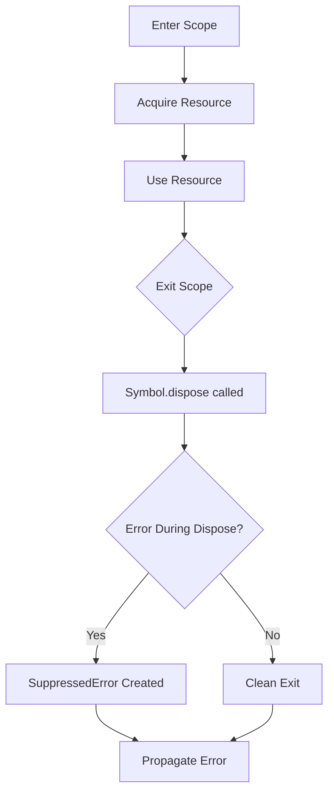
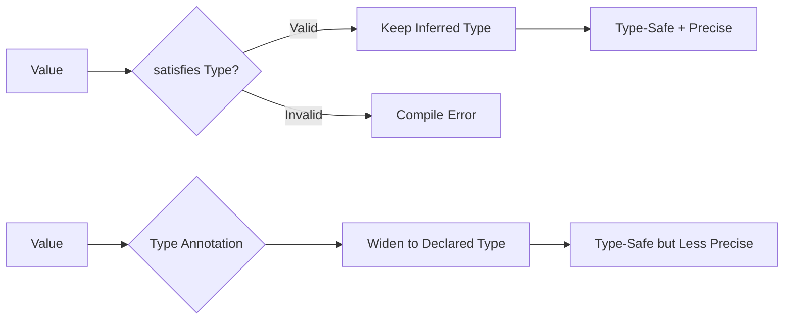
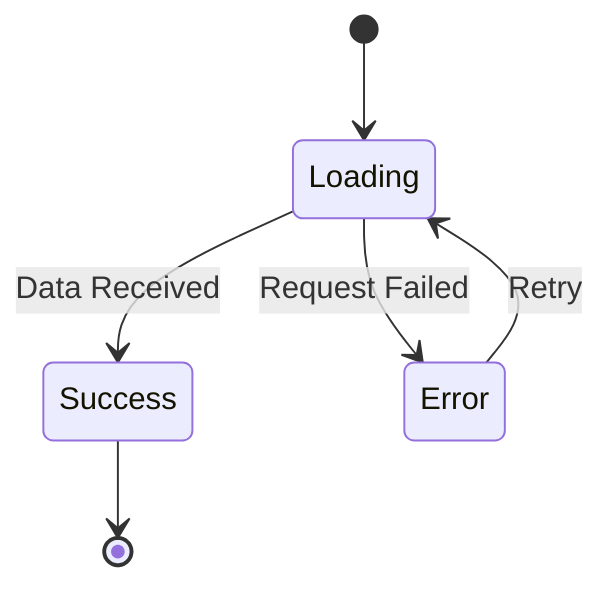

# TypeScript Best Practices and Anti-Patterns - Research

**Date**: 2025-12-19
**Status**: Research Complete

## Table of Contents

- [Executive Summary](#executive-summary)
- [TypeScript 5.x New Features and Patterns](#typescript-5x-new-features-and-patterns)
- [Type System Best Practices](#type-system-best-practices)
- [Comprehensive Anti-Patterns Section](#comprehensive-anti-patterns-section)
- [Configuration Recommendations](#configuration-recommendations)
- [React + TypeScript Patterns](#react--typescript-patterns)
- [Quick Reference Checklists](#quick-reference-checklists)
- [Sources and Bibliography](#sources-and-bibliography)

## Executive Summary

TypeScript 5.x brings significant improvements including const type parameters, stable decorators, the `satisfies` operator, explicit resource management with `using`, and enhanced type inference. The most critical aspect of TypeScript development is avoiding anti-patterns that undermine type safety - particularly the misuse of `any`, type assertions (`as`), and non-null assertions (`!`). This document provides comprehensive guidance on leveraging TypeScript's type system effectively while avoiding common pitfalls that can lead to runtime errors and reduced maintainability.

## TypeScript 5.x New Features and Patterns

### TypeScript 5.0 Features

#### Decorators (Stable)

Stage 3 decorators are now stable, providing a way to add annotations and meta-programming syntax for class declarations and members.

```typescript
// Method decorator example
function loggedMethod(
  originalMethod: any,
  context: ClassMethodDecoratorContext
) {
  const methodName = String(context.name);

  function replacementMethod(this: any, ...args: any[]) {
    console.log(`LOG: Entering method '${methodName}'.`);
    const result = originalMethod.call(this, ...args);
    console.log(`LOG: Exiting method '${methodName}'.`);
    return result;
  }

  return replacementMethod;
}

class Person {
  @loggedMethod
  greet() {
    console.log("Hello!");
  }
}
```

#### const Type Parameters

Enable const-like inference by default without requiring `as const`:

```typescript
// Without const type parameter
function getNames<T extends readonly string[]>(names: T): T {
  return names;
}
const names1 = getNames(["Alice", "Bob"]); // string[]

// With const type parameter
function getNamesExactly<const T extends readonly string[]>(names: T): T {
  return names;
}
const names2 = getNamesExactly(["Alice", "Bob"]); // readonly ["Alice", "Bob"]
```

#### moduleResolution: bundler

New resolution strategy matching modern bundler behavior:

```json
{
  "compilerOptions": {
    "target": "esnext",
    "moduleResolution": "bundler"
  }
}
```

#### verbatimModuleSyntax

Simplified module handling - what you see is what you get:

```typescript
// Erased away entirely
import type { A } from "a";

// Rewritten to 'import { b } from "bcd";'
import { b, type c, type d } from "bcd";
```

### TypeScript 5.2 Features

#### Explicit Resource Management (`using`)

Support for the ECMAScript Explicit Resource Management proposal:

```typescript
function processFile() {
  using file = openFile("data.txt");
  // file is automatically disposed at end of scope
  return file.read();
}

// Async version
async function processAsync() {
  await using connection = await openConnection();
  return connection.query("SELECT * FROM users");
}
```



#### Decorator Metadata

Decorators can create and consume metadata on classes:

```typescript
function logged(target: any, context: ClassMethodDecoratorContext) {
  context.metadata[context.name] = { logged: true };
}

class MyClass {
  @logged
  greet() {}
}

console.log(MyClass[Symbol.metadata]); // { greet: { logged: true } }
```

### TypeScript 5.4 Features

#### NoInfer Utility Type

Controls type inference in generic functions:

```typescript
// Without NoInfer - "blue" widens the type
function createStreetLight<C extends string>(
  colors: C[],
  defaultColor?: C
) {}
createStreetLight(["red", "yellow", "green"], "blue"); // No error!

// With NoInfer - restricts defaultColor
function createStreetLightSafe<C extends string>(
  colors: C[],
  defaultColor?: NoInfer<C>
) {}
createStreetLightSafe(["red", "yellow", "green"], "blue"); // Error!
```

#### Preserved Narrowing in Closures

TypeScript preserves type narrowing in closures after last assignments:

```typescript
function getUrls(url: string | URL, names: string[]) {
  if (typeof url === "string") {
    url = new URL(url);
  }
  return names.map(name => {
    url.searchParams.set("name", name); // Works! url is narrowed to URL
    return url.toString();
  });
}
```

### TypeScript 5.5 Features

#### Inferred Type Predicates

TypeScript automatically infers type predicates for filter functions:

```typescript
const countries = ["US", "UK", "DE"];
const nationalBirds = new Map([["US", "Eagle"], ["UK", "Robin"]]);

// TypeScript infers: bird is Bird (not undefined)
const birds = countries
  .map(country => nationalBirds.get(country))
  .filter(bird => bird !== undefined);
```

#### Regular Expression Syntax Checking

```typescript
// TypeScript catches regex errors
let myRegex = /@robot(\s+(please|immediately)))? do task/;
// Error: Unexpected ')'
```

#### Control Flow Narrowing for Indexed Accesses

```typescript
function f1(obj: Record<string, unknown>, key: string) {
  if (typeof obj[key] === "string") {
    obj[key].toUpperCase(); // Now works!
  }
}
```

### TypeScript 5.6 Features

#### Disallowed Nullish and Truthy Checks

TypeScript errors on always-truthy or always-nullish expressions:

```typescript
// Error: This kind of expression is always truthy
if (/0x[0-9a-f]/) {
  // ...
}

// Error: Right operand of ?? is unreachable
return value < options.max ?? 100;
```

#### Iterator Helper Methods

```typescript
function* positiveIntegers() {
  let i = 1;
  while (true) {
    yield i++;
  }
}

const evenNumbers = positiveIntegers().map(x => x * 2);

for (const value of evenNumbers.take(5)) {
  console.log(value); // 2, 4, 6, 8, 10
}
```

### TypeScript 5.7 Features

#### Checks for Never-Initialized Variables

```typescript
function foo() {
  let result: number;

  function printResult() {
    console.log(result); // Error: Variable 'result' is used before being assigned
  }
}
```

#### Path Rewriting for Relative Imports

```typescript
// With --rewriteRelativeImportExtensions
// Source:
import * as foo from "./foo.ts";

// Compiled output:
import * as foo from "./foo.js";
```

#### JSON Import Validation (--module nodenext)

```typescript
// Error: Import attributes required
import myConfig from "./myConfig.json";

// Correct
import myConfig from "./myConfig.json" with { type: "json" };
```

### The `satisfies` Operator

Use `satisfies` to validate types while preserving narrow inference:

```typescript
type Color = "red" | "green" | "blue";
type ColorMap = Record<Color, string | [number, number, number]>;

// Without satisfies - loses specific types
const colors1: ColorMap = {
  red: [255, 0, 0],
  green: "#00ff00",
  blue: [0, 0, 255],
};
colors1.green.toUpperCase(); // Error: No method 'toUpperCase' on array

// With satisfies - validates AND preserves types
const colors2 = {
  red: [255, 0, 0],
  green: "#00ff00",
  blue: [0, 0, 255],
} satisfies ColorMap;
colors2.green.toUpperCase(); // Works! TypeScript knows it's a string
```



## Type System Best Practices

### type vs interface

#### When to Use `interface`

```typescript
// Objects that may be extended
interface User {
  id: string;
  name: string;
}

interface AdminUser extends User {
  permissions: string[];
}

// Declaration merging (library augmentation)
interface Window {
  myCustomProperty: string;
}
```

**Benefits:**
- Better performance (cached by name)
- Cleaner error messages
- Declaration merging support
- Better for class contracts

#### When to Use `type`

```typescript
// Union types
type Status = "pending" | "approved" | "rejected";

// Intersection types
type UserWithRoles = User & { roles: string[] };

// Primitive aliases
type UserId = string;

// Mapped types
type Readonly<T> = { readonly [K in keyof T]: T[K] };

// Conditional types
type NonNullable<T> = T extends null | undefined ? never : T;
```

**Benefits:**
- Required for unions, intersections, primitives
- Works with mapped and conditional types
- More flexible for complex type manipulations

#### Recommendation

Use `type` by default. Reach for `interface` when you need `extends` or declaration merging.

### Discriminated Unions

Use discriminated unions for type-safe state management:

```typescript
// API Response Pattern
type ApiResponse<T> =
  | { status: "loading" }
  | { status: "error"; error: Error }
  | { status: "success"; data: T };

function handleResponse<T>(response: ApiResponse<T>) {
  switch (response.status) {
    case "loading":
      return <Spinner />;
    case "error":
      return <Error message={response.error.message} />;
    case "success":
      return <Data data={response.data} />;
  }
}
```



**Best Practices:**
- Use consistent discriminant property names (`type`, `kind`, `status`)
- Use string literals (not numbers or booleans)
- Make the discriminant required
- Use exhaustiveness checking with `never`

```typescript
// Exhaustiveness checking
function assertNever(x: never): never {
  throw new Error(`Unexpected value: ${x}`);
}

function handleStatus(status: Status) {
  switch (status) {
    case "pending": return "Waiting...";
    case "approved": return "Done!";
    case "rejected": return "Failed";
    default: return assertNever(status); // Compile error if case missed
  }
}
```

### Utility Types

#### Partial and Required

```typescript
interface User {
  id: string;
  name: string;
  email: string;
}

// For updates (all optional)
type UserUpdate = Partial<User>;

// Ensure all required
type CompleteUser = Required<User>;
```

#### Pick and Omit

```typescript
// Select specific properties
type UserPreview = Pick<User, "id" | "name">;

// Exclude specific properties
type UserWithoutEmail = Omit<User, "email">;
```

#### Custom Utility Types

```typescript
// Make specific properties optional
type WithOptional<T, K extends keyof T> = Omit<T, K> & Partial<Pick<T, K>>;

type UserWithOptionalEmail = WithOptional<User, "email">;

// Distributive Omit for discriminated unions
type DistributiveOmit<T, K extends keyof any> = T extends any
  ? Omit<T, K>
  : never;
```

### Branded Types

Create distinct types for primitive values:

```typescript
// Define brands
type Brand<K, T> = K & { __brand: T };

type UserId = Brand<string, "UserId">;
type OrderId = Brand<string, "OrderId">;

// Type-safe functions
function getUser(id: UserId) { /* ... */ }
function getOrder(id: OrderId) { /* ... */ }

// Create branded values
function createUserId(id: string): UserId {
  return id as UserId;
}

// Usage
const userId = createUserId("user-123");
const orderId = "order-456" as OrderId;

getUser(userId);  // OK
getUser(orderId); // Error! Type 'OrderId' is not assignable to 'UserId'
```

### Generic Naming Conventions

```typescript
// Single letter for simple, obvious generics
function identity<T>(value: T): T { return value; }

// Descriptive names for complex generics
type ApiHandler<TRequest, TResponse, TError = Error> = (
  request: TRequest
) => Promise<TResponse | TError>;

// Prefix with T for clarity
interface Repository<TEntity, TId = string> {
  findById(id: TId): Promise<TEntity | null>;
  save(entity: TEntity): Promise<TEntity>;
}
```

## Comprehensive Anti-Patterns Section

### 1. The `any` Type Abuse

**The Problem:**

Using `any` defeats TypeScript's purpose by disabling type checking entirely.

```typescript
// WRONG: Using any defeats type safety
function processData(data: any) {
  return data.someProperty.thatMayNotExist(); // No error, but crashes at runtime
}

// WRONG: any spreads through your codebase
let config: any = getConfig();
let port = config.port; // port is any
let host = config.host; // host is any
```

**The Correct Approach:**

```typescript
// CORRECT: Use unknown for truly unknown types
function processData(data: unknown) {
  if (typeof data === "object" && data !== null && "name" in data) {
    console.log((data as { name: string }).name);
  }
}

// CORRECT: Define proper types
interface Config {
  port: number;
  host: string;
}

function getConfig(): Config {
  return { port: 3000, host: "localhost" };
}

// CORRECT: Use generics for flexibility
function identity<T>(value: T): T {
  return value;
}
```

**When `any` is Acceptable:**
- Migrating JavaScript to TypeScript (temporary)
- Working with truly dynamic third-party libraries (with documentation)
- Type-level programming edge cases

### 2. Type Assertion (`as`) Overuse

**The Problem:**

Type assertions tell TypeScript to trust you, bypassing its checks.

```typescript
// WRONG: Asserting external data
const user = await fetch("/api/user").then(r => r.json()) as User;
// If API changes, your app crashes at runtime

// WRONG: Asserting away null
const element = document.getElementById("root") as HTMLElement;
element.innerHTML = "Hello"; // Crashes if element doesn't exist

// WRONG: Double assertions
const value = "hello" as unknown as number; // Lying to TypeScript
```

**The Correct Approach:**

```typescript
// CORRECT: Validate external data at runtime
import { z } from "zod";

const UserSchema = z.object({
  id: z.string(),
  name: z.string(),
  email: z.string().email(),
});

const response = await fetch("/api/user").then(r => r.json());
const user = UserSchema.parse(response); // Throws if invalid

// CORRECT: Handle null explicitly
const element = document.getElementById("root");
if (!element) {
  throw new Error("Root element not found");
}
element.innerHTML = "Hello";

// CORRECT: Use type guards
function isUser(value: unknown): value is User {
  return (
    typeof value === "object" &&
    value !== null &&
    "id" in value &&
    "name" in value
  );
}
```

### 3. Non-Null Assertion (`!`) Abuse

**The Problem:**

The non-null assertion tells TypeScript a value isn't null/undefined, but provides no runtime guarantee.

```typescript
// WRONG: Asserting without verification
const name = user.profile!.name!.first!;

// WRONG: In React refs
function Component() {
  const ref = useRef<HTMLInputElement>(null);

  useEffect(() => {
    ref.current!.focus(); // Could crash if ref not attached
  }, []);
}

// WRONG: Array access
const first = items![0]!.value!;
```

**The Correct Approach:**

```typescript
// CORRECT: Use optional chaining with fallbacks
const name = user.profile?.name?.first ?? "Unknown";

// CORRECT: Check before use
function Component() {
  const ref = useRef<HTMLInputElement>(null);

  useEffect(() => {
    if (ref.current) {
      ref.current.focus();
    }
  }, []);
}

// CORRECT: Array access with validation
const first = items?.[0]?.value;
if (first === undefined) {
  throw new Error("Expected at least one item");
}
```

### 4. `@ts-ignore` and `@ts-expect-error` Abuse

**The Problem:**

These directives suppress entire lines, hiding potential issues.

```typescript
// WRONG: Ignoring errors without reason
// @ts-ignore
const result = someFunction(invalidArg);

// WRONG: Using ts-ignore instead of ts-expect-error
// @ts-ignore
// This comment might be outdated
```

**The Correct Approach:**

```typescript
// CORRECT: Use @ts-expect-error with explanation
// @ts-expect-error - Third-party library types are incorrect, see issue #123
const result = someFunction(arg);

// CORRECT: Fix the underlying issue
// Instead of ignoring, use type assertion for specific value
const result = someFunction(arg as ExpectedType);

// CORRECT: Use any for specific value (more targeted)
const result = someFunction(arg as any as ExpectedType);
```

**Priority:** Fix the issue > Use targeted `as any` > Use `@ts-expect-error` with explanation > Never use `@ts-ignore`

### 5. Enum Anti-Patterns

**The Problem:**

Enums have subtle behaviors that cause issues.

```typescript
// WRONG: Numeric enums with implicit values
enum Status {
  Pending,  // 0
  Approved, // 1
  Rejected, // 2
}
// Adding new values or reordering changes the numbers!

// WRONG: Merging enums
enum Colors {
  Red = 1,
}
enum Colors {
  Blue = 2,
}
// Creates confusing merged enum

// WRONG: Using numeric enums (bidirectional mapping issues)
enum Direction {
  Up = 1,
  Down = 2,
}
Direction[1]; // "Up" - reverse mapping is confusing
```

**The Correct Approach:**

```typescript
// CORRECT: Use const objects with as const
const Status = {
  Pending: "pending",
  Approved: "approved",
  Rejected: "rejected",
} as const;

type Status = (typeof Status)[keyof typeof Status];

// CORRECT: String literal unions for simple cases
type Direction = "up" | "down" | "left" | "right";

// CORRECT: If you must use enums, use string values
enum LogLevel {
  Error = "ERROR",
  Warn = "WARN",
  Info = "INFO",
}
```

### 6. Object.keys and Object.entries Type Issues

**The Problem:**

TypeScript returns `string[]` instead of `(keyof T)[]` for safety reasons.

```typescript
interface User {
  name: string;
  age: number;
}

const user: User = { name: "Alice", age: 30 };

// Problem: keys is string[], not (keyof User)[]
const keys = Object.keys(user);
keys.forEach(key => {
  console.log(user[key]); // Error: can't index with string
});
```

**The Correct Approach:**

```typescript
// Option 1: Type assertion (when you control the object)
const keys = Object.keys(user) as (keyof User)[];

// Option 2: Use Object.entries
Object.entries(user).forEach(([key, value]) => {
  console.log(key, value); // key is string, value is string | number
});

// Option 3: Custom typed helper (use with caution)
function typedKeys<T extends object>(obj: T): (keyof T)[] {
  return Object.keys(obj) as (keyof T)[];
}

// Option 4: Use for...in with type guard
for (const key in user) {
  if (key in user) {
    console.log(user[key as keyof User]);
  }
}
```

**Why TypeScript Does This:** Objects in TypeScript can have more properties at runtime than known at compile time (due to structural typing and inheritance).

### 7. Over-Annotating Types

**The Problem:**

Redundant type annotations add noise without benefit.

```typescript
// WRONG: Redundant annotations
const name: string = "Alice";
const numbers: number[] = [1, 2, 3];
const user: User = { name: "Alice", age: 30 };

// WRONG: Annotating obvious return types
function add(a: number, b: number): number {
  return a + b;
}

// WRONG: Over-annotating in forEach
items.forEach((item: Item, index: number) => {
  console.log(item);
});
```

**The Correct Approach:**

```typescript
// CORRECT: Let TypeScript infer
const name = "Alice";
const numbers = [1, 2, 3];

// CORRECT: Annotate when it helps
// Public API functions - YES, annotate return type
export function getUser(id: string): Promise<User> {
  return fetchUser(id);
}

// Object literals - YES, for excess property checking
const config: Config = {
  port: 3000,
  hoost: "localhost", // Error! Typo caught
};

// Complex types - YES, when inference is unclear
const handler: EventHandler<MouseEvent> = (e) => {
  console.log(e.clientX);
};
```

### 8. Ignoring Strict Mode

**The Problem:**

Disabling strict mode hides many potential bugs.

```typescript
// Without strictNullChecks
function getLength(str: string) {
  return str.length; // No error even if str could be null
}

// Without noImplicitAny
function process(data) { // data is any!
  return data.whatever;
}
```

**The Correct Approach:**

Always use `"strict": true` in tsconfig.json. Individual options it enables:
- `noImplicitAny`
- `noImplicitThis`
- `strictNullChecks`
- `strictFunctionTypes`
- `strictBindCallApply`
- `strictPropertyInitialization`
- `alwaysStrict`

### 9. Incorrect Optional Chaining Use

**The Problem:**

Using optional chaining when values shouldn't be optional.

```typescript
// WRONG: Hiding bugs with optional chaining
function processUser(user: User) {
  // If user.name is required, this hides bugs
  const upperName = user?.name?.toUpperCase();
}

// WRONG: Optional chaining instead of proper error handling
const port = config?.server?.port ?? 3000;
// What if config.server.port is 0? You get 3000!
```

**The Correct Approach:**

```typescript
// CORRECT: Only use optional chaining for truly optional values
function processUser(user: User) {
  const upperName = user.name.toUpperCase();
}

// CORRECT: Explicit checks for required config
if (!config || !config.server) {
  throw new Error("Invalid configuration");
}
const port = config.server.port;

// CORRECT: Distinguish between undefined and falsy
const port = config.server.port !== undefined ? config.server.port : 3000;
```

### 10. Mutable vs Readonly Confusion

**The Problem:**

Not using readonly when data shouldn't be modified.

```typescript
// WRONG: Mutable arrays in function params
function sum(numbers: number[]): number {
  numbers.sort(); // Mutates the input array!
  return numbers.reduce((a, b) => a + b, 0);
}

// WRONG: Mutable config objects
const config = {
  apiUrl: "https://api.example.com",
  timeout: 5000,
};
config.apiUrl = "https://malicious.com"; // Allowed!
```

**The Correct Approach:**

```typescript
// CORRECT: Readonly arrays for immutable operations
function sum(numbers: readonly number[]): number {
  return [...numbers].sort().reduce((a, b) => a + b, 0);
}

// CORRECT: Readonly config
const config = {
  apiUrl: "https://api.example.com",
  timeout: 5000,
} as const;
// config.apiUrl = "..."; // Error!

// CORRECT: Readonly utility type
function processUser(user: Readonly<User>) {
  // user.name = "New Name"; // Error!
}
```

### 11. Class Anti-Patterns

**The Problem:**

Over-using classes when simpler patterns work better.

```typescript
// WRONG: Classes for simple data
class UserDTO {
  constructor(
    public name: string,
    public email: string
  ) {}
}

// WRONG: Singleton via class
class ConfigManager {
  private static instance: ConfigManager;
  private constructor() {}
  static getInstance() {
    if (!ConfigManager.instance) {
      ConfigManager.instance = new ConfigManager();
    }
    return ConfigManager.instance;
  }
}
```

**The Correct Approach:**

```typescript
// CORRECT: Interface + object for data
interface User {
  name: string;
  email: string;
}
const user: User = { name: "Alice", email: "alice@example.com" };

// CORRECT: Module for singleton
// config.ts
export const config = {
  apiUrl: process.env.API_URL,
  // ...
};

// CORRECT: Use classes only when you need:
// - Encapsulation with private state
// - Inheritance hierarchies
// - Interface implementation
// - Complex initialization logic
```

### 12. Import Type Mistakes

**The Problem:**

Not using `import type` for type-only imports.

```typescript
// WRONG: Regular import for types only
import { User, UserService } from "./user";
// UserService might be bundled even if only used as type

// WRONG: Inconsistent imports
import { User } from "./types";
import type { Config } from "./config";
```

**The Correct Approach:**

```typescript
// CORRECT: Use import type for type-only imports
import type { User } from "./types";
import { UserService } from "./user";

// CORRECT: Mixed imports with verbatimModuleSyntax
import { UserService, type User, type Config } from "./user";

// CORRECT: Enable verbatimModuleSyntax in tsconfig.json
// This enforces correct import type usage
```

### 13. Function Overload Misuse

**The Problem:**

Using overloads when simpler patterns work.

```typescript
// WRONG: Overloads for simple unions
function process(input: string): string;
function process(input: number): number;
function process(input: string | number): string | number {
  return typeof input === "string" ? input.toUpperCase() : input * 2;
}
```

**The Correct Approach:**

```typescript
// CORRECT: Generic for related types
function process<T extends string | number>(input: T): T {
  return (typeof input === "string" ? input.toUpperCase() : input * 2) as T;
}

// CORRECT: Overloads only when return types differ based on input
function createElement(tag: "div"): HTMLDivElement;
function createElement(tag: "span"): HTMLSpanElement;
function createElement(tag: "a"): HTMLAnchorElement;
function createElement(tag: string): HTMLElement {
  return document.createElement(tag);
}
```

### 14. Nullish Coalescing Misuse

**The Problem:**

Confusing `??` with `||`.

```typescript
// WRONG: Using || when you mean ??
const port = config.port || 3000;
// If port is 0, you get 3000!

const name = user.name || "Anonymous";
// If name is "", you get "Anonymous"!
```

**The Correct Approach:**

```typescript
// CORRECT: ?? for null/undefined only
const port = config.port ?? 3000;
// 0 -> 0, null -> 3000, undefined -> 3000

// CORRECT: || for all falsy values
const displayName = user.name || "Anonymous";
// "" -> "Anonymous" (if that's what you want)

// CORRECT: Explicit checks for complex logic
const port = config.port !== undefined ? config.port : 3000;
```

### 15. Generic Parameter Excess

**The Problem:**

Too many generic parameters make code unreadable.

```typescript
// WRONG: Too many generics
function transform<T, U, V, W, X>(
  input: T,
  mapper: (t: T) => U,
  filter: (u: U) => V,
  reducer: (v: V) => W,
  finalizer: (w: W) => X
): X {
  // ...
}
```

**The Correct Approach:**

```typescript
// CORRECT: Fewer, well-named generics
function transform<TInput, TOutput>(
  input: TInput,
  pipeline: (input: TInput) => TOutput
): TOutput {
  return pipeline(input);
}

// CORRECT: Break into smaller functions
function map<T, U>(input: T, fn: (t: T) => U): U {
  return fn(input);
}
```

### 16. Returning Implicit `any` from Functions

**The Problem:**

Functions that return `any` spread type unsafety.

```typescript
// WRONG: Implicit any return
function parseJSON(text: string) {
  return JSON.parse(text); // Returns any
}

const data = parseJSON('{"name": "Alice"}');
data.nonExistent(); // No error!
```

**The Correct Approach:**

```typescript
// CORRECT: Generic with type parameter
function parseJSON<T>(text: string): T {
  return JSON.parse(text);
}
const data = parseJSON<User>('{"name": "Alice"}');

// BETTER: Runtime validation
import { z } from "zod";

function parseJSON<T>(text: string, schema: z.ZodSchema<T>): T {
  return schema.parse(JSON.parse(text));
}

const UserSchema = z.object({ name: z.string() });
const data = parseJSON('{"name": "Alice"}', UserSchema);
```

### 17. Array Type Confusion

**The Problem:**

Confusing array types and their implications.

```typescript
// WRONG: Using Array<T> inconsistently
let items: string[] = [];
let otherItems: Array<string> = [];

// WRONG: Not using tuples when order matters
function getMinMax(numbers: number[]): number[] {
  return [Math.min(...numbers), Math.max(...numbers)];
}
const result = getMinMax([1, 2, 3]);
// result[0] and result[1] are both just "number"
```

**The Correct Approach:**

```typescript
// CORRECT: Consistent style (prefer T[])
let items: string[] = [];

// CORRECT: Tuples for fixed-length arrays
function getMinMax(numbers: number[]): [min: number, max: number] {
  return [Math.min(...numbers), Math.max(...numbers)];
}
const [min, max] = getMinMax([1, 2, 3]);

// CORRECT: Readonly tuples for immutable returns
function getCoordinates(): readonly [x: number, y: number] {
  return [10, 20];
}
```

### 18. Partial for Non-Updates

**The Problem:**

Using `Partial<T>` inappropriately.

```typescript
// WRONG: Partial for creation
function createUser(data: Partial<User>): User {
  return data as User; // Missing required fields!
}
createUser({}); // No error, but crashes later

// WRONG: Partial removes all guarantees
const config: Partial<Config> = {};
config.port; // number | undefined - even if port is required
```

**The Correct Approach:**

```typescript
// CORRECT: Explicit required fields for creation
type CreateUserInput = Pick<User, "name" | "email">;

function createUser(data: CreateUserInput): User {
  return {
    id: generateId(),
    ...data,
    createdAt: new Date(),
  };
}

// CORRECT: Partial only for updates
function updateUser(id: string, updates: Partial<User>): User {
  const existing = getUser(id);
  return { ...existing, ...updates };
}
```

### 19. Type Guard Return Type Issues

**The Problem:**

Incorrect type predicate implementations.

```typescript
// WRONG: Type guard that lies
function isString(value: unknown): value is string {
  return true; // Always returns true!
}

// WRONG: Incomplete type guard
function isUser(value: unknown): value is User {
  return typeof value === "object" && value !== null;
  // Doesn't actually check for User properties
}
```

**The Correct Approach:**

```typescript
// CORRECT: Thorough type guard
function isUser(value: unknown): value is User {
  return (
    typeof value === "object" &&
    value !== null &&
    "id" in value &&
    "name" in value &&
    typeof (value as User).id === "string" &&
    typeof (value as User).name === "string"
  );
}

// BETTER: Use assertion functions for complex validation
function assertUser(value: unknown): asserts value is User {
  if (typeof value !== "object" || value === null) {
    throw new Error("Expected object");
  }
  if (!("id" in value) || typeof value.id !== "string") {
    throw new Error("Expected string id");
  }
  if (!("name" in value) || typeof value.name !== "string") {
    throw new Error("Expected string name");
  }
}
```

### 20. Ignoring Excess Property Checking

**The Problem:**

Missing typos in object literals.

```typescript
interface User {
  name: string;
  email: string;
}

// Without type annotation, typos slip through
const user = {
  name: "Alice",
  emial: "alice@example.com", // Typo not caught!
};

function process(u: User) {}
process(user); // Works due to structural typing!
```

**The Correct Approach:**

```typescript
// CORRECT: Use type annotation for excess property checking
const user: User = {
  name: "Alice",
  emial: "alice@example.com", // Error: Object literal may only specify known properties
};

// CORRECT: Use satisfies for validation + inference
const user = {
  name: "Alice",
  emial: "alice@example.com", // Error!
} satisfies User;
```

## Configuration Recommendations

### Base tsconfig.json (2025)

```json
{
  "compilerOptions": {
    // Base Options
    "esModuleInterop": true,
    "skipLibCheck": true,
    "target": "ES2022",
    "allowJs": true,
    "resolveJsonModule": true,
    "moduleDetection": "force",
    "isolatedModules": true,
    "verbatimModuleSyntax": true,

    // Strictness (Essential)
    "strict": true,
    "noUncheckedIndexedAccess": true,
    "noImplicitOverride": true,

    // If transpiling with TypeScript
    "module": "NodeNext",
    "outDir": "dist",
    "sourceMap": true,

    // If using TypeScript as linter only
    // "module": "Preserve",
    // "noEmit": true,

    // Library builds
    "declaration": true,
    "declarationMap": true,

    // Environment
    "lib": ["ES2022", "DOM", "DOM.Iterable"]
  }
}
```

### Strict Mode Options Explained

| Option | Description | Recommendation |
|--------|-------------|----------------|
| `strict` | Enables all strict options | Always enable |
| `noImplicitAny` | Error on implicit any | Included in strict |
| `strictNullChecks` | null/undefined are distinct types | Included in strict |
| `strictFunctionTypes` | Contravariant function params | Included in strict |
| `noUncheckedIndexedAccess` | Indexed access returns `T \| undefined` | Enable separately |
| `noImplicitOverride` | Require `override` keyword | Enable separately |
| `exactOptionalPropertyTypes` | Distinguish `undefined` from missing | Optional, can be noisy |

### Project-Specific Configurations

#### Next.js App Router

```json
{
  "compilerOptions": {
    "target": "ES2022",
    "lib": ["ES2022", "DOM", "DOM.Iterable"],
    "allowJs": true,
    "skipLibCheck": true,
    "strict": true,
    "noEmit": true,
    "esModuleInterop": true,
    "module": "ESNext",
    "moduleResolution": "Bundler",
    "resolveJsonModule": true,
    "isolatedModules": true,
    "jsx": "preserve",
    "incremental": true,
    "noUncheckedIndexedAccess": true,
    "plugins": [{ "name": "next" }],
    "paths": {
      "@/*": ["./src/*"]
    }
  }
}
```

#### Library (npm package)

```json
{
  "compilerOptions": {
    "target": "ES2020",
    "module": "NodeNext",
    "moduleResolution": "NodeNext",
    "declaration": true,
    "declarationMap": true,
    "sourceMap": true,
    "outDir": "dist",
    "strict": true,
    "noUncheckedIndexedAccess": true
  }
}
```

## React + TypeScript Patterns

### Component Props

```typescript
// Basic props with type
type ButtonProps = {
  variant: "primary" | "secondary";
  size?: "sm" | "md" | "lg";
  disabled?: boolean;
  onClick: () => void;
  children: React.ReactNode;
};

function Button({ variant, size = "md", disabled, onClick, children }: ButtonProps) {
  return (
    <button
      className={`btn btn-${variant} btn-${size}`}
      disabled={disabled}
      onClick={onClick}
    >
      {children}
    </button>
  );
}

// Extending native element props
type InputProps = React.ComponentPropsWithoutRef<"input"> & {
  label: string;
  error?: string;
};

function Input({ label, error, ...props }: InputProps) {
  return (
    <div>
      <label>{label}</label>
      <input {...props} />
      {error && <span className="error">{error}</span>}
    </div>
  );
}
```

### Event Handlers

```typescript
// Button click
function handleClick(event: React.MouseEvent<HTMLButtonElement>) {
  console.log(event.currentTarget.name);
}

// Input change
function handleChange(event: React.ChangeEvent<HTMLInputElement>) {
  console.log(event.target.value);
}

// Form submit
function handleSubmit(event: React.FormEvent<HTMLFormElement>) {
  event.preventDefault();
  const formData = new FormData(event.currentTarget);
}

// Keyboard event
function handleKeyDown(event: React.KeyboardEvent<HTMLInputElement>) {
  if (event.key === "Enter") {
    // ...
  }
}
```

### Refs in React 19+

```typescript
// React 19+: ref as prop (no forwardRef needed)
type InputProps = React.ComponentPropsWithRef<"input"> & {
  label: string;
};

function Input({ label, ref, ...props }: InputProps) {
  return (
    <div>
      <label>{label}</label>
      <input ref={ref} {...props} />
    </div>
  );
}

// Parent component
function Form() {
  const inputRef = useRef<HTMLInputElement>(null);

  useEffect(() => {
    inputRef.current?.focus();
  }, []);

  return <Input ref={inputRef} label="Name" />;
}

// For React 18 and earlier: forwardRef
const Input = forwardRef<HTMLInputElement, InputProps>(
  function Input({ label, ...props }, ref) {
    return (
      <div>
        <label>{label}</label>
        <input ref={ref} {...props} />
      </div>
    );
  }
);
```

### Custom Hooks

```typescript
// Return tuple with const assertion or explicit type
function useToggle(initialValue = false): [boolean, () => void] {
  const [value, setValue] = useState(initialValue);
  const toggle = useCallback(() => setValue(v => !v), []);
  return [value, toggle];
}

// Generic hook with proper typing
function useLocalStorage<T>(key: string, initialValue: T) {
  const [storedValue, setStoredValue] = useState<T>(() => {
    try {
      const item = window.localStorage.getItem(key);
      return item ? (JSON.parse(item) as T) : initialValue;
    } catch {
      return initialValue;
    }
  });

  const setValue = useCallback((value: T | ((val: T) => T)) => {
    const valueToStore = value instanceof Function ? value(storedValue) : value;
    setStoredValue(valueToStore);
    window.localStorage.setItem(key, JSON.stringify(valueToStore));
  }, [key, storedValue]);

  return [storedValue, setValue] as const;
}
```

### Context with Type Safety

```typescript
interface AuthContextType {
  user: User | null;
  login: (credentials: Credentials) => Promise<void>;
  logout: () => void;
}

const AuthContext = createContext<AuthContextType | null>(null);

// Custom hook with runtime check
function useAuth(): AuthContextType {
  const context = useContext(AuthContext);
  if (!context) {
    throw new Error("useAuth must be used within AuthProvider");
  }
  return context;
}

// Provider component
function AuthProvider({ children }: { children: React.ReactNode }) {
  const [user, setUser] = useState<User | null>(null);

  const login = async (credentials: Credentials) => {
    const user = await authService.login(credentials);
    setUser(user);
  };

  const logout = () => {
    authService.logout();
    setUser(null);
  };

  return (
    <AuthContext.Provider value={{ user, login, logout }}>
      {children}
    </AuthContext.Provider>
  );
}
```

### Server Components (Next.js App Router)

```typescript
// Server Component (default in app directory)
async function UserList() {
  const users = await db.user.findMany();

  return (
    <ul>
      {users.map(user => (
        <li key={user.id}>{user.name}</li>
      ))}
    </ul>
  );
}

// Client Component
"use client";

import { useState } from "react";

function Counter() {
  const [count, setCount] = useState(0);
  return (
    <button onClick={() => setCount(c => c + 1)}>
      Count: {count}
    </button>
  );
}

// Passing Server Components as children
function ClientWrapper({ children }: { children: React.ReactNode }) {
  "use client";
  const [isOpen, setIsOpen] = useState(false);

  return (
    <div>
      <button onClick={() => setIsOpen(!isOpen)}>Toggle</button>
      {isOpen && children}
    </div>
  );
}

// Usage
<ClientWrapper>
  <UserList /> {/* Server Component as child */}
</ClientWrapper>
```

### Generic Components

```typescript
// Generic list component
type ListProps<T> = {
  items: T[];
  renderItem: (item: T) => React.ReactNode;
  keyExtractor: (item: T) => string;
};

function List<T>({ items, renderItem, keyExtractor }: ListProps<T>) {
  return (
    <ul>
      {items.map(item => (
        <li key={keyExtractor(item)}>{renderItem(item)}</li>
      ))}
    </ul>
  );
}

// Usage
<List
  items={users}
  renderItem={user => <span>{user.name}</span>}
  keyExtractor={user => user.id}
/>
```

## Quick Reference Checklists

### Type Safety Checklist

- [ ] `strict: true` enabled in tsconfig.json
- [ ] `noUncheckedIndexedAccess: true` enabled
- [ ] No `any` types (use `unknown` or proper types)
- [ ] No unvalidated type assertions on external data
- [ ] `@ts-ignore` comments have documented reasons
- [ ] All public APIs have explicit return types
- [ ] Runtime validation at system boundaries (API responses, user input)

### Anti-Pattern Avoidance Checklist

- [ ] Avoid `any` - use `unknown` or proper types
- [ ] Avoid `as` assertions on external data - use runtime validation
- [ ] Avoid `!` non-null assertions - use proper null checks
- [ ] Avoid `@ts-ignore` - prefer `@ts-expect-error` with explanation
- [ ] Avoid numeric enums - use `as const` objects or string unions
- [ ] Avoid over-annotating - trust TypeScript's inference
- [ ] Avoid classes for simple data - use interfaces
- [ ] Avoid mutable when possible - use `readonly`

### React + TypeScript Checklist

- [ ] Props typed with `type` or `interface`
- [ ] Event handlers properly typed (`React.MouseEvent<HTMLButtonElement>`, etc.)
- [ ] Refs typed correctly (`useRef<HTMLInputElement>(null)`)
- [ ] Custom hooks return explicit types or `as const`
- [ ] Context has null check in custom hook
- [ ] `"use client"` directive for client components
- [ ] Generic components properly constrained

### tsconfig.json Essentials

```json
{
  "compilerOptions": {
    "strict": true,
    "noUncheckedIndexedAccess": true,
    "noImplicitOverride": true,
    "verbatimModuleSyntax": true,
    "isolatedModules": true
  }
}
```

## Sources and Bibliography

### Official Documentation

1. [TypeScript 5.0 Release Notes](https://www.typescriptlang.org/docs/handbook/release-notes/typescript-5-0.html)
2. [TypeScript 5.1 Release Notes](https://www.typescriptlang.org/docs/handbook/release-notes/typescript-5-1.html)
3. [TypeScript 5.2 Release Notes](https://www.typescriptlang.org/docs/handbook/release-notes/typescript-5-2.html)
4. [TypeScript 5.4 Release Notes](https://www.typescriptlang.org/docs/handbook/release-notes/typescript-5-4.html)
5. [Announcing TypeScript 5.5](https://devblogs.microsoft.com/typescript/announcing-typescript-5-5/)
6. [Announcing TypeScript 5.6](https://devblogs.microsoft.com/typescript/announcing-typescript-5-6/)
7. [Announcing TypeScript 5.7](https://devblogs.microsoft.com/typescript/announcing-typescript-5-7/)
8. [TypeScript TSConfig Reference](https://www.typescriptlang.org/tsconfig/)
9. [TypeScript Utility Types](https://www.typescriptlang.org/docs/handbook/utility-types.html)

### Expert Resources

10. [Total TypeScript - Matt Pocock](https://www.totaltypescript.com/)
11. [The TSConfig Cheat Sheet - Total TypeScript](https://www.totaltypescript.com/tsconfig-cheat-sheet)
12. [Effective TypeScript - Dan Vanderkam](https://effectivetypescript.com/)
13. [Avoid Cluttering Your Code with Inferable Types - Effective TypeScript](https://effectivetypescript.com/2020/04/28/avoid-inferable/)
14. [TypeScript Deep Dive - Basarat Ali Syed](https://basarat.gitbook.io/typescript/)

### Anti-Patterns and Best Practices

15. [10 TypeScript Anti Patterns to Avoid](https://javascript.plainenglish.io/10-typescript-anti-patterns-to-avoid-as-a-typescript-developer-490fc75feaf3)
16. [TypeScript Anti-Patterns - Tomasz Ducin](https://ducin.dev/typescript-anti-patterns)
17. [Avoid the Any Type - AllThingsTypeScript](https://www.allthingstypescript.dev/p/why-avoid-the-any-type-in-typescript)
18. [Avoid Type Assertions - AllThingsTypeScript](https://www.allthingstypescript.dev/p/avoid-using-type-assertions-in-typescript)
19. [Avoiding anys with Linting - typescript-eslint](https://typescript-eslint.io/blog/avoiding-anys/)
20. [TypeScript Bang Operator Considered Harmful - DEV](https://dev.to/tmaximini/typescript-bang-operator-considered-harmful-3hhi)
21. [At Least 7 Reasons to Avoid @ts-expect-error - Shane Osbourne](https://shane-o.dev/articles/any-or-expect)
22. [TypeScript Enums: Use Cases and Alternatives](https://2ality.com/2025/01/typescript-enum-patterns.html)

### Type System Patterns

23. [Types vs Interfaces in TypeScript - LogRocket](https://blog.logrocket.com/types-vs-interfaces-typescript/)
24. [Type vs Interface - Total TypeScript](https://www.totaltypescript.com/type-vs-interface-which-should-you-use)
25. [Discriminated Unions - TypeScript Deep Dive](https://basarat.gitbook.io/typescript/type-system/discriminated-unions)
26. [Branded Types - Learning TypeScript](https://www.learningtypescript.com/articles/branded-types)
27. [Properly Type Object.keys and Object.entries](https://www.charpeni.com/blog/properly-type-object-keys-and-object-entries)
28. [The satisfies Operator - 2ality](https://2ality.com/2025/02/satisfies-operator.html)

### React + TypeScript

29. [React TypeScript Cheatsheets](https://react-typescript-cheatsheet.netlify.app/)
30. [Typing Component Props - React TypeScript Cheatsheet](https://react-typescript-cheatsheet.netlify.app/docs/basic/getting-started/basic_type_example/)
31. [Event Types in React and TypeScript - Total TypeScript](https://www.totaltypescript.com/event-types-in-react-and-typescript)
32. [forwardRef/createRef - React TypeScript Cheatsheet](https://react-typescript-cheatsheet.netlify.app/docs/basic/getting-started/forward_and_create_ref/)
33. [Context - React TypeScript Cheatsheet](https://react-typescript-cheatsheet.netlify.app/docs/basic/getting-started/context/)
34. [Next.js Server and Client Components](https://nextjs.org/docs/app/getting-started/server-and-client-components)

### Configuration

35. [Google TypeScript Style Guide](https://google.github.io/styleguide/tsguide.html)
36. [TypeScript Best Practices in 2025 - DEV](https://dev.to/mitu_mariam/typescript-best-practices-in-2025-57hb)
37. [Effective TypeScript Principles in 2025](https://www.dennisokeeffe.com/blog/2025-03-16-effective-typescript-principles-in-2025)
