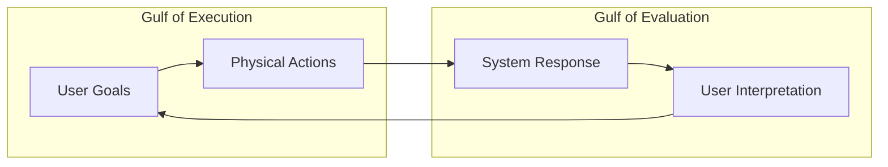
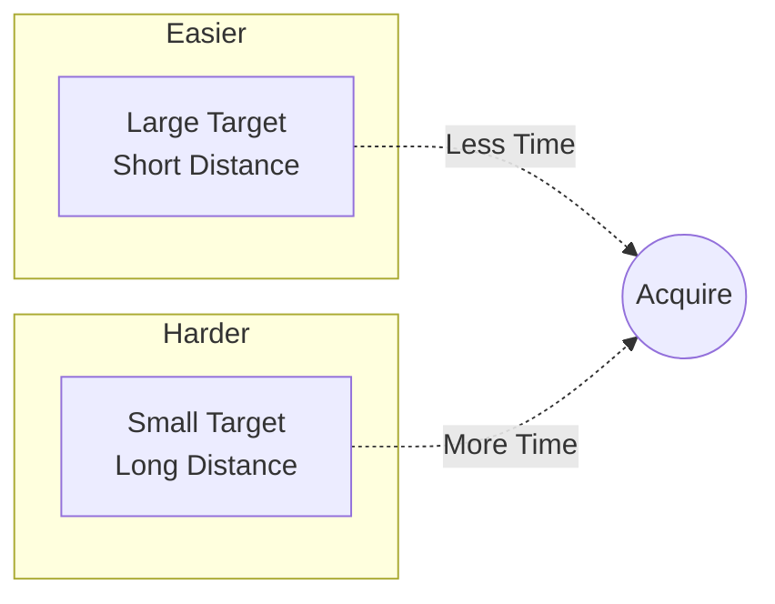
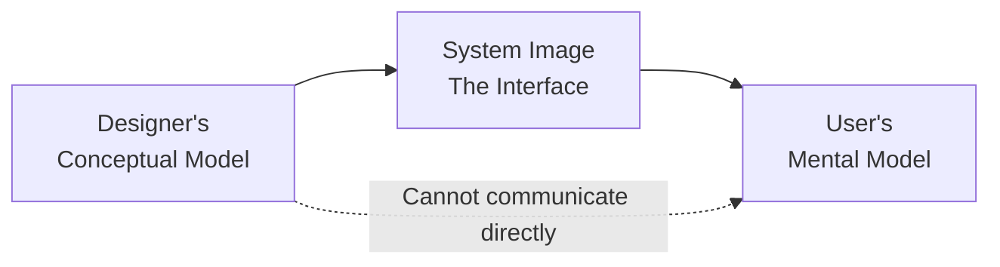
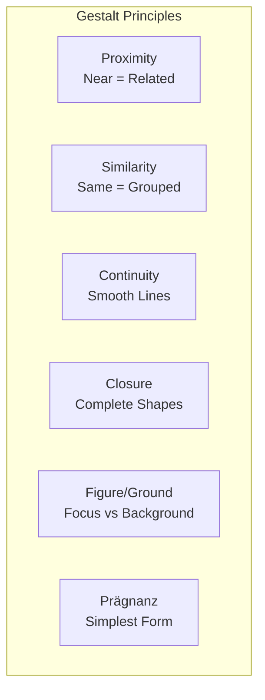
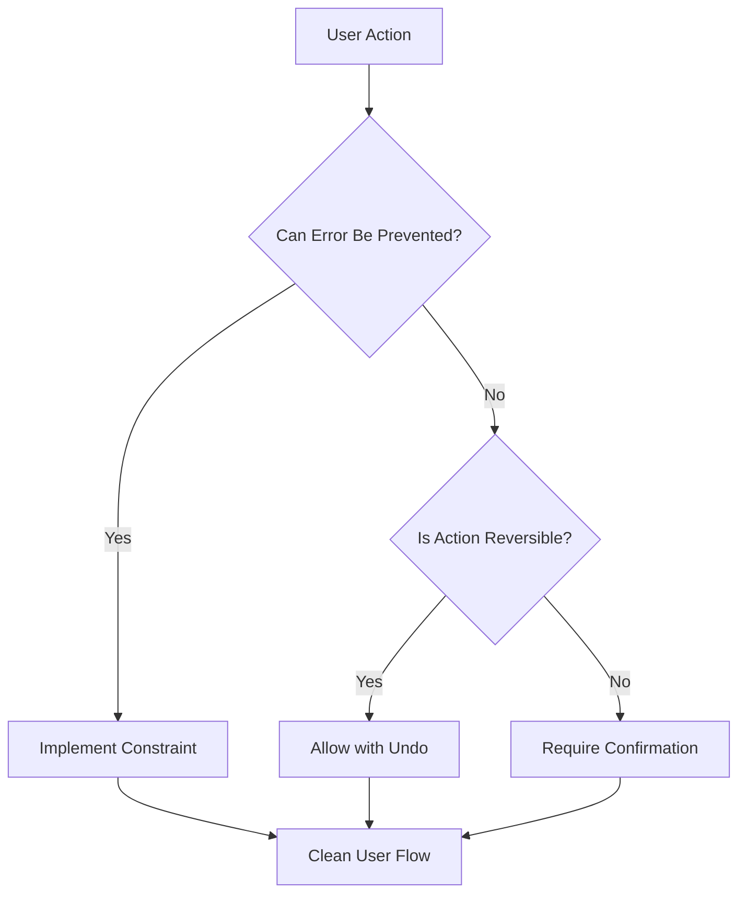
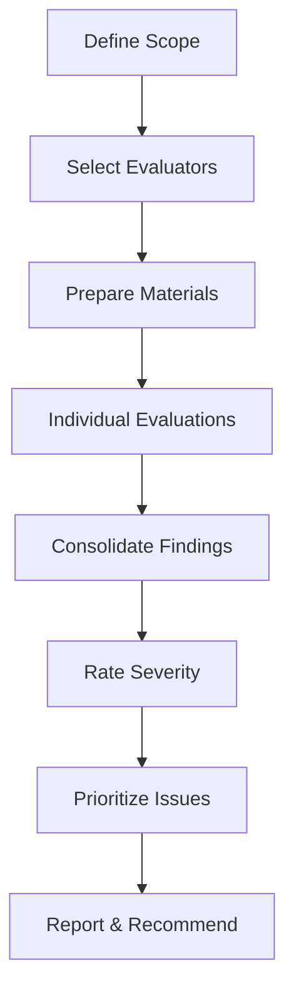

# UX Heuristics and Design Principles - Research

**Date**: 2025-12-20
**Status**: Research Complete

## Table of Contents

- [Executive Summary](#executive-summary)
- [Nielsen's 10 Usability Heuristics](#nielsens-10-usability-heuristics)
- [Other Major Heuristic Frameworks](#other-major-heuristic-frameworks)
- [Foundational Cognitive Psychology](#foundational-cognitive-psychology)
- [Laws of UX](#laws-of-ux)
- [Gestalt Principles](#gestalt-principles)
- [Modern UX Principles](#modern-ux-principles)
- [Heuristic Evaluation Methodology](#heuristic-evaluation-methodology)
- [Common UX Violations](#common-ux-violations)
- [Practical Application Guide](#practical-application-guide)
- [Comprehensive Bibliography](#comprehensive-bibliography)

---

## Executive Summary

UX heuristics are broad rules of thumb derived from empirical research that guide the design of usable interfaces. The field is anchored by Nielsen's 10 Usability Heuristics (1994), which remain the gold standard after 30 years due to their grounding in fundamental mismatches between humans and machines rather than specific UI technologies. These heuristics are complemented by frameworks from Shneiderman, Norman, ISO 9241, and others, as well as cognitive psychology principles like Miller's Law, Fitts's Law, and Hick's Law. Together, these form a comprehensive foundation for evaluating and improving user interfaces.

---

## Nielsen's 10 Usability Heuristics

Jakob Nielsen developed these heuristics in collaboration with Rolf Molich in 1990, then refined them in 1994 based on factor analysis of 249 usability problems. They have remained unchanged since 1994 because they address fundamental human-computer interaction principles rather than specific technologies.

### 1. Visibility of System Status

**Principle**: The design should always keep users informed about what is going on, through appropriate feedback within a reasonable amount of time.

**Why It Matters**: When users know the current system status, they can learn from prior interactions and determine next steps. Without feedback, users feel lost and anxious.

**Examples of Proper Implementation**:
- Progress bars during file uploads or downloads
- "You Are Here" markers on mall maps
- Loading spinners with estimated time
- Real-time form validation feedback
- Save confirmations and auto-save indicators

**Common Violations**:
- Silent form submissions with no confirmation
- Actions that complete without visual feedback
- Background processes with no progress indication
- Ambiguous button states (clicked vs. unclicked)

**Tips**:
- Communicate system state clearly and immediately
- Never perform consequential actions silently
- Use appropriate feedback intensity (subtle for minor actions, prominent for major ones)

---

### 2. Match Between System and Real World

**Principle**: The design should speak the users' language. Use words, phrases, and concepts familiar to the user, rather than internal jargon.

**Why It Matters**: Users' prior experiences shape their expectations. Familiar terminology and logical information ordering reduce cognitive friction.

**Examples of Proper Implementation**:
- Stovetop controls arranged to match heating element layout
- "Shopping cart" instead of "order buffer"
- Calendar interfaces that mirror physical calendars
- File/folder metaphors for document organization

**Common Violations**:
- Technical error codes (Error 0x80004005)
- Internal company jargon in user-facing interfaces
- Non-intuitive icons without labels
- Controls that don't map to real-world equivalents

**Tips**:
- Conduct user research to identify familiar language and mental models
- Never assume internal terminology matches user understanding
- Present information in a natural and logical order

---

### 3. User Control and Freedom

**Principle**: Users often perform actions by mistake. They need a clearly marked "emergency exit" to leave the unwanted action without having to go through an extended process.

**Why It Matters**: Easy reversal and exit options foster confidence, reduce anxiety, and encourage exploration.

**Examples of Proper Implementation**:
- Undo/Redo functionality
- "Back" buttons that work predictably
- Cancel buttons on dialogs and forms
- Gmail's "Undo Send" feature
- Trash/Recycle Bin before permanent deletion

**Common Violations**:
- No way to cancel a multi-step process
- Immediate permanent deletion without confirmation
- Forced completion of unwanted wizards
- No undo after destructive actions

**Tips**:
- Implement Undo and Redo universally
- Make exits discoverable and accessible
- Allow users to escape at any point without penalty

---

### 4. Consistency and Standards

**Principle**: Users should not have to wonder whether different words, situations, or actions mean the same thing. Follow platform and industry conventions.

**Why It Matters**: Users spend most of their time using other products; those experiences set expectations. Inconsistency increases cognitive load.

**Two Types**:
- **Internal Consistency**: Same patterns within your product or product family
- **External Consistency**: Following established industry/platform conventions

**Examples of Proper Implementation**:
- Shopping cart icon in top-right corner (e-commerce convention)
- Ctrl+S / Cmd+S for save (platform convention)
- Consistent button styling throughout an application
- Standard navigation patterns (hamburger menu on mobile)

**Common Violations**:
- Different terms for the same action across screens
- Inconsistent placement of navigation elements
- Varying visual styles for the same type of element
- Breaking established platform conventions unnecessarily

**Tips**:
- Maintain a design system with documented patterns
- Follow platform-specific guidelines (iOS HIG, Material Design)
- Audit for consistency across all product surfaces

---

### 5. Error Prevention

**Principle**: Good error messages are important, but the best designs carefully prevent problems from occurring in the first place.

**Two Error Types**:
- **Slips**: Unconscious errors caused by inattention (typing errors, accidental clicks)
- **Mistakes**: Conscious errors based on misunderstanding (wrong mental model)

**Why It Matters**: Prevention is always better than recovery. Users feel more confident with systems that help them avoid errors.

**Examples of Proper Implementation**:
- Highway guardrails (physical metaphor)
- Disabled "Submit" buttons until all required fields complete
- Date pickers instead of free-text date entry
- Confirmation dialogs before destructive actions
- Grayed-out unavailable options rather than hiding them

**Common Violations**:
- Free-text input for structured data (dates, phone numbers)
- No validation until form submission
- Allowing invalid combinations of options
- No confirmation before permanent actions

**Tips**:
- Use constraints and sensible defaults
- Provide suggestions and auto-complete
- Require confirmation for high-stakes actions
- Implement real-time validation

---

### 6. Recognition Rather Than Recall

**Principle**: Minimize the user's memory load by making elements, actions, and options visible. Users should not have to remember information from one part of the interface to another.

**Why It Matters**: Human short-term memory is limited. Recognition is cognitively easier than recall.

**Examples of Proper Implementation**:
- Recently used items in menus
- Visible labels on icons
- Breadcrumb navigation showing path
- Autocomplete suggestions based on history
- Search with recent queries shown

**Common Violations**:
- Requiring memorization of codes or IDs
- Hidden navigation requiring recall
- Icon-only interfaces without labels
- Complex keyboard shortcut requirements

**Tips**:
- Display information visibly rather than requiring memory
- Provide contextual help at the moment of need
- Use recent/frequent item lists
- Always pair icons with labels for clarity

---

### 7. Flexibility and Efficiency of Use

**Principle**: Shortcuts—hidden from novice users—may speed up interaction for expert users so that the design can cater to both inexperienced and experienced users.

**Why It Matters**: Different users have different needs and skill levels. Flexible systems accommodate this diversity.

**Examples of Proper Implementation**:
- Keyboard shortcuts for power users
- Touch gestures (swipe to delete)
- Customizable dashboards and toolbars
- Templates and presets for common tasks
- Macro recording for repetitive tasks

**Common Violations**:
- No keyboard shortcuts for common actions
- Forcing all users through the same lengthy process
- No customization options
- No way to save preferences or create templates

**Tips**:
- Provide accelerators (shortcuts, gestures)
- Enable personalization and customization
- Support multiple paths to the same goal
- Remember user preferences

---

### 8. Aesthetic and Minimalist Design

**Principle**: Interfaces should not contain information that is irrelevant or rarely needed. Every extra unit of information competes with the relevant units and diminishes their relative visibility.

**Why It Matters**: Visual focus on essentials supports primary goals. Clutter creates cognitive overload.

**Examples of Proper Implementation**:
- Clean, focused landing pages
- Progressive disclosure (show more only when needed)
- Clear visual hierarchy emphasizing important elements
- Adequate whitespace

**Common Violations**:
- Cluttered dashboards showing everything at once
- Decorative elements that distract from content
- Too many calls-to-action competing for attention
- Information-dense screens without clear hierarchy

**Tips**:
- Prioritize content and features that support primary goals
- Remove or hide rarely-used features
- Use progressive disclosure for advanced options
- Apply clear visual hierarchy

---

### 9. Help Users Recognize, Diagnose, and Recover from Errors

**Principle**: Error messages should be expressed in plain language (no error codes), precisely indicate the problem, and constructively suggest a solution.

**Why It Matters**: Errors are inevitable. How the system handles them determines whether users can continue their task or become frustrated and abandon it.

**Examples of Proper Implementation**:
- "Password must be at least 8 characters" (specific, actionable)
- "Credit card expired. Update your payment method." (solution provided)
- Red highlighting on specific fields with errors
- "Page not found. Here are some popular pages..." (alternative paths)

**Common Violations**:
- "Error 500" or "Something went wrong"
- Technical jargon in error messages
- Errors without guidance on how to fix
- Error messages that blame the user
- Errors that clear form data

**Tips**:
- Use plain language, not codes
- Be specific about what went wrong
- Suggest concrete remediation steps
- Use traditional error visuals (red, warning icons)
- Preserve user input when errors occur

---

### 10. Help and Documentation

**Principle**: It's best if the system doesn't need additional explanation. However, it may be necessary to provide documentation to help users understand how to complete their tasks.

**Why It Matters**: Despite best efforts at intuitive design, users sometimes need help. Quality documentation should be available when needed.

**Examples of Proper Implementation**:
- Contextual tooltips and hints
- Searchable help documentation
- In-app tutorials for new features
- FAQ sections addressing common questions
- Airport information kiosks (in-context help)

**Common Violations**:
- No help documentation
- Help that's hard to find or search
- Outdated or inaccurate documentation
- Dense manuals instead of task-focused guides

**Tips**:
- Make help searchable
- Provide contextual, in-situ help
- Focus on user tasks, not feature descriptions
- Keep documentation concise and actionable

---

## Other Major Heuristic Frameworks

### Shneiderman's 8 Golden Rules of Interface Design (1986)

Ben Shneiderman introduced these rules in "Designing the User Interface" (1986). They complement Nielsen's heuristics with additional focus on dialogue design and user control.

| Rule | Description |
|------|-------------|
| **1. Strive for Consistency** | Consistent sequences, terminology, colors, layout, capitalization, and fonts throughout |
| **2. Seek Universal Usability** | Accommodate novice-to-expert differences, age ranges, disabilities, international variations |
| **3. Offer Informative Feedback** | For every action, provide appropriate feedback (modest for minor, substantial for major actions) |
| **4. Design Dialogs to Yield Closure** | Organize action sequences with clear beginning, middle, and end; provide completion feedback |
| **5. Prevent Errors** | Design so users cannot make serious errors; provide recovery guidance when errors occur |
| **6. Permit Easy Reversal of Actions** | Make actions reversible to reduce anxiety and encourage exploration |
| **7. Keep Users in Control** | Users should feel they are initiators, not responders; avoid unexpected changes |
| **8. Reduce Short-Term Memory Load** | Follow "7±2" rule; don't require remembering info across screens |

**Source**: [The Eight Golden Rules of Interface Design - Ben Shneiderman](http://www.cs.umd.edu/users/ben/goldenrules.html)

---

### Don Norman's Design Principles

From "The Design of Everyday Things" (1988, revised 2013), Norman introduced concepts foundational to all UX work.

#### Core Concepts

**Affordances**: Properties of an object that indicate how it can be used. A button affords pushing; a handle affords pulling.

**Signifiers**: Signals that communicate where action should take place. Labels, icons, and visual cues that indicate affordances.

**Mapping**: The relationship between controls and their effects. Natural mappings follow spatial or conceptual correspondence.

**Feedback**: Information that confirms actions were received and indicates results.

**Conceptual Models**: User's understanding of how a system works. Good design provides clear conceptual models.

**Constraints**: Limiting possible actions to guide users toward correct choices.

#### Gulfs of Execution and Evaluation



- **Gulf of Execution**: The gap between what users want to do and the actions required
- **Gulf of Evaluation**: The gap between system state and user's understanding of it

---

### Weinschenk & Barker's 20 Usability Heuristics (2000)

Susan Weinschenk and Dean Barker researched and consolidated guidelines from multiple sources (Nielsen, Apple, Microsoft) into 20 categories through card sorting.

| # | Heuristic | Description |
|---|-----------|-------------|
| 1 | User Control | User perceives they are in control with appropriate control mechanisms |
| 2 | Human Limitations | Interface doesn't overload cognitive, visual, auditory, tactile, or motor limits |
| 3 | Modal Integrity | Interface fits tasks within the modality being used |
| 4 | Accommodation | Interface fits how each user group works and thinks |
| 5 | Linguistic Clarity | Interface communicates as efficiently as possible |
| 6 | Aesthetic Integrity | Interface has attractive and appropriate design |
| 7 | Simplicity | Interface presents elements simply |
| 8 | Predictability | User can accurately predict what will happen next |
| 9 | Interpretation | Interface makes reasonable guesses about user intent |
| 10 | Accuracy | Interface is free from errors |
| 11 | Technical Clarity | Interface has highest possible fidelity |
| 12 | Flexibility | Interface accommodates different user needs |
| 13 | Fulfillment | Interface helps users accomplish their goals |
| 14 | Cultural Propriety | Interface is culturally appropriate |
| 15 | Suitable Tempo | Interface responds at an appropriate pace |
| 16 | Consistency | Interface operates consistently throughout |
| 17 | User Support | Interface provides appropriate help and support |
| 18 | Precision | Interface allows precise interactions |
| 19 | Forgiveness | Interface helps users recover from errors |
| 20 | Responsiveness | Interface provides adequate feedback on status and completion |

**Source**: Weinschenk, S., & Barker, D. T. (2000). "Designing Effective Speech Interfaces." John Wiley & Sons.

---

### Gerhardt-Powals' Cognitive Engineering Principles (1996)

Ten principles extracted from cognitive science literature for interface design:

1. **Automate Unwanted Workload**: Eliminate mental calculations and comparisons
2. **Reduce Uncertainty**: Display data clearly to reduce decision time and error
3. **Fuse Data**: Reduce cognitive load by integrating lower-level data
4. **Present New Information with Meaningful Aids**: Use familiar patterns
5. **Use Names That Are Conceptually Related to Function**: Semantic alignment
6. **Group Data Consistent with Mental Models**: Match user expectations
7. **Limit Data-Driven Tasks**: Reduce information-intensive analysis
8. **Include Only Needed Information**: Minimize display density
9. **Provide Multiple Coding of Data**: Offer different formats for flexibility
10. **Practice Judicious Redundancy**: Strategic redundancy for important information

**Source**: Gerhardt-Powals, J. (1996). "Cognitive engineering principles for enhancing human-computer performance." International Journal of Human-Computer Interaction, 8(2), 189-211.

---

### ISO 9241 Usability Standards

Multi-part international standard from the International Organization for Standardization (ISO).

#### Key Parts

**ISO 9241-11**: Defines usability framework with three components:
- **Effectiveness**: Can users successfully complete tasks?
- **Efficiency**: How much effort/resources are required?
- **Satisfaction**: How do users feel about the experience?

**ISO 9241-110 (2020 revision)**: Seven interaction principles:
1. Suitability for the task
2. Self-descriptiveness
3. Conformity with user expectations
4. Learnability
5. Controllability
6. Use error robustness
7. User engagement

**ISO 9241-210**: Human-centered design for interactive systems

**Sources**:
- [ISO 9241-11:2018](https://www.iso.org/standard/63500.html)
- [ISO 9241-210:2019](https://www.iso.org/standard/77520.html)

---

### Constantine & Lockwood's Usage-Centered Design

From "Software for Use: A Practical Guide to the Models and Methods of Usage-Centered Design" (1999).

**Key Focus**: Work users are trying to accomplish, not just who users are.

**Core Components**:
- **Essential Use Cases**: What tasks truly mean to users
- **Role Models**: Abstract user roles rather than concrete personas
- **Abstract Interface Models**: Focus on function before form

**Distinction from User-Centered Design**: While user-centered design focuses on users, usage-centered design focuses on usage—the work to be accomplished.

---

## Foundational Cognitive Psychology

### Miller's Law (1956)

**Principle**: The average person can hold 7±2 items in working memory simultaneously.

**Source**: George A. Miller's paper "The Magical Number Seven, Plus or Minus Two: Some Limits on Our Capacity for Processing Information"

**Key Concept - Chunking**: Grouping information into meaningful units increases effective memory capacity. What constitutes a "chunk" depends on user knowledge.

**UX Applications**:
- Phone numbers chunked with hyphens: (555) 867-5309
- Credit card numbers in groups of 4
- Navigation limited to ~7 top-level items
- Netflix content categorized and limited to ~6 visible items per row

**Important Caveat**: Don't use this as dogmatic justification (e.g., "must have exactly 7 menu items"). Use chunking to help users process information, but actual limits vary by context and individual.

**Source**: [Miller's Law | Laws of UX](https://lawsofux.com/millers-law/)

---

### Hick's Law (1952)

**Principle**: Decision time increases logarithmically with the number and complexity of choices.

**Formula**: RT = a + b × log₂(n)
- RT = reaction time
- n = number of choices
- a, b = constants based on task

**Key Insight**: The relationship is logarithmic, not linear. Adding more options has diminishing impact on decision time.

**Exceptions**:
- Doesn't apply when users already know what they want
- Only applies to equally probable choices
- Familiarity reduces the effect

**UX Applications**:
- Limit options in navigation menus
- Use progressive disclosure
- Present "Most Popular" or "Recommended" options first
- Category hierarchies instead of flat lists

**Source**: [Hick's Law | Laws of UX](https://lawsofux.com/hicks-law/)

---

### Fitts's Law (1954)

**Principle**: Time to acquire a target depends on distance to target and size of target.

**Formula**: MT = a + b × log₂(D/W + 1)
- MT = movement time
- D = distance to target
- W = width (size) of target



**Key Implications**:
- **Make targets big**: Larger buttons are easier to click
- **Reduce distance**: Place frequently used elements close together
- **Screen edges are infinitely high targets**: Cursor can't overshoot (Mac menu bar at top)
- **Corners are best**: Two infinite edges = two dimensions of infinite size

**UX Applications**:
- Large touch targets (minimum 44×44px per Apple, 48×48dp per Material Design)
- Important actions near current cursor position
- Pie menus (equal distance, large wedge targets) vs. linear menus
- Floating action buttons near thumb reach

**Source**: [Fitts's Law | Laws of UX](https://lawsofux.com/fittss-law/)

---

### Mental Models

**Definition**: Internal representations of how users believe a system works, based on prior experience.

**Key Figures**:
- **Kenneth Craik (1943)**: First proposed "small-scale models" of reality
- **Philip Johnson-Laird (1983)**: Developed mental model theory in "Mental Models: Towards a Cognitive Science of Language, Inference and Consciousness"
- **Donald Norman (1983)**: Distinguished between mental models (what users have) and conceptual models (what designers create)

**The Communication Problem**:


Designers can only influence user mental models through the "system image"—the actual interface.

**Key Challenges**:
- Users have limited ability to "run" mental models
- Mental models are unstable and forgotten over time
- Users often have incorrect or incomplete models

**UX Applications**:
- Design interfaces that match user expectations
- Use familiar metaphors (file folders, shopping carts)
- Provide clear feedback to help users build accurate models
- Don't require users to understand how the system actually works

---

### Cognitive Load Theory

**Definition**: The amount of mental resources needed to understand and interact with an interface.

**Origin**: Developed by John Sweller in late 1980s, building on Miller's information processing research.

**Three Types**:
1. **Intrinsic**: Inherent complexity of the content itself
2. **Extraneous**: Load imposed by poor design (can be reduced)
3. **Germane**: Load that helps learning and schema building (desirable)

**UX Goal**: Minimize extraneous load while managing intrinsic load effectively.

**Applications**:
- Simplify interfaces to reduce extraneous load
- Break complex tasks into steps
- Use chunking and progressive disclosure
- Provide appropriate scaffolding

---

## Laws of UX

Jon Yablonski's "Laws of UX" collection synthesizes psychology principles relevant to design. These complement the heuristics with specific psychological foundations.

### Core Laws

| Law | Description | Key Takeaway |
|-----|-------------|--------------|
| **Jakob's Law** | Users prefer sites that work like other familiar sites | Follow conventions |
| **Doherty Threshold** | Productivity soars when responses take <400ms | Optimize for speed |
| **Aesthetic-Usability Effect** | Attractive designs are perceived as more usable | Aesthetics matter |
| **Von Restorff Effect** | Distinctive items are remembered better | Use contrast for importance |
| **Peak-End Rule** | Experiences judged by peak moments and endings | Optimize critical moments |
| **Goal-Gradient Effect** | Motivation increases as goal approaches | Show progress |
| **Serial Position Effect** | First and last items remembered best | Prioritize placement |
| **Postel's Law** | Be liberal accepting input, conservative sending output | Build forgiving interfaces |
| **Tesler's Law** | Complexity cannot be eliminated, only shifted | Decide who bears complexity |
| **Zeigarnik Effect** | Incomplete tasks remembered better | Use to maintain engagement |
| **Paradox of the Active User** | Users don't read manuals; they start using immediately | Design intuitively |
| **Occam's Razor** | Simplest solution is usually best | Choose simplicity |
| **Pareto Principle** | 80% of effects from 20% of causes | Focus on high-impact work |

### Jakob's Law in Detail

**Statement**: "Users spend most of their time on other sites. This means that users prefer your site to work the same way as all the other sites they already know."

**Research Support**: A 2022 Baymard Institute study found interfaces adhering to familiar patterns can reduce user errors by up to 30% and increase task completion rates by 18%.

**Examples**:
- Shopping cart in top-right corner
- Logo links to homepage
- Search in header area
- Hamburger menu on mobile
- Pinch-to-zoom on touch devices

**Balance**: Familiarity shouldn't stifle all innovation, but deviation should be deliberate and user-tested.

### Doherty Threshold in Detail

**Statement**: "Productivity soars when a computer and its users interact at a pace (<400ms) that ensures neither has to wait on the other."

**Origin**: 1982 IBM Systems Journal paper by Walter J. Doherty and Ahrvind J. Thadani set requirement at 400ms instead of the previous 2-second standard.

**Related Thresholds**:
- 100ms: Human visual processing of an image
- 250ms: Average human reaction time
- 400ms: Doherty Threshold for maintaining flow
- 1000ms: Maximum before users feel a delay
- 10s: Maximum before users lose attention

**Applications**:
- Provide feedback within 400ms
- Use skeleton screens and loading states for longer operations
- Optimize perceived performance even when actual performance can't improve

**Source**: [Doherty Threshold | Laws of UX](https://lawsofux.com/doherty-threshold/)

---

## Gestalt Principles

Developed by German psychologists in the 1920s, these describe how humans perceive visual elements.

### The Six Core Principles



#### 1. Proximity
**Principle**: Elements close together are perceived as related.

**Application**:
- Group related form fields
- Create clear sections with whitespace
- Associate labels with their controls

**Caution**: Responsive layouts may break proximity relationships—test across screen sizes.

#### 2. Similarity
**Principle**: Elements sharing characteristics (color, shape, size) are perceived as grouped.

**Application**:
- Consistent button styling for same action types
- Color coding for categories
- Similar card designs for related content

#### 3. Continuity
**Principle**: Eyes follow smooth lines and curves.

**Application**:
- Progress indicators
- Process flows
- Timeline designs
- Breadcrumb navigation

#### 4. Closure
**Principle**: Mind completes incomplete shapes.

**Application**:
- Logos with negative space
- Carousel indicators showing more content exists
- Progress circles

#### 5. Figure/Ground
**Principle**: Elements perceived as either foreground (focus) or background.

**Application**:
- Modal overlays with dimmed backgrounds
- Highlighted selected items
- Card elevation and shadows

#### 6. Prägnanz (Law of Simplicity)
**Principle**: Ambiguous images perceived in simplest form.

**Application**:
- Simple, clean iconography
- Clear visual hierarchy
- Unambiguous affordances

### Additional Gestalt Laws

| Law | Description |
|-----|-------------|
| **Common Region** | Elements in bounded area seen as grouped |
| **Uniform Connectedness** | Visually connected elements perceived as related |
| **Common Fate** | Elements moving together perceived as grouped |
| **Symmetry** | Symmetrical elements perceived as unified |

**Source**: [Gestalt Principles | IxDF](https://www.interaction-design.org/literature/topics/gestalt-principles)

---

## Modern UX Principles

### Accessibility (WCAG)

The Web Content Accessibility Guidelines (WCAG) are published by W3C's Web Accessibility Initiative (WAI).

#### Four Principles (POUR)


1. **Perceivable**: Information must be presentable in ways users can perceive
   - Text alternatives for non-text content
   - Captions for audio/video
   - Sufficient color contrast
   - Resizable text

2. **Operable**: Interface must be operable by all users
   - Keyboard accessibility
   - Sufficient time to read/interact
   - No seizure-inducing content
   - Navigable structure
   - Input modalities beyond keyboard

3. **Understandable**: Information and operation must be understandable
   - Readable text
   - Predictable operation
   - Input assistance

4. **Robust**: Content must work with current and future technologies
   - Compatible with assistive technologies
   - Valid, semantic markup

#### Conformance Levels

| Level | Description |
|-------|-------------|
| **A** | Minimum accessibility; removes major barriers |
| **AA** | Recommended target; removes significant barriers |
| **AAA** | Highest level; may not be possible for all content |

**Current Standard**: WCAG 2.2 became W3C Recommendation on October 5, 2023.

**Regulatory Context**: ADA Title II (April 2024) establishes WCAG 2.1 Level AA as technical standard for compliance.

**Sources**:
- [WCAG 2.2](https://www.w3.org/TR/WCAG22/)
- [WCAG 2 Overview](https://www.w3.org/WAI/standards-guidelines/wcag/)

---

### Mobile-First Design Principles

#### Touch Target Sizing

| Source | Minimum Size |
|--------|--------------|
| Apple HIG | 44×44 points |
| Material Design | 48×48 dp |
| WCAG 2.5.5 (AAA) | 44×44 CSS pixels |

#### Key Principles

1. **Thumb Zone Optimization**: Place important actions within natural thumb reach
2. **Adequate Spacing**: Prevent accidental taps between touch targets
3. **Avoid Hover Dependence**: Touch interfaces have no hover state
4. **Gesture Support**: Implement intuitive gestures (swipe, pinch, long-press)
5. **Responsive Layouts**: Test groupings across screen sizes

**Sources**:
- [A Hands-On Guide to Mobile-First Design | UXPin](https://www.uxpin.com/studio/blog/a-hands-on-guide-to-mobile-first-design/)
- [Mobile First | IxDF](https://www.interaction-design.org/literature/topics/mobile-first)

---

### Error Prevention and Recovery (Poka-Yoke)

**Origin**: Japanese term meaning "mistake-proofing," developed by Shigeo Shingo at Toyota in the 1960s.

#### Two Types

1. **Prevention (Control Methods)**: Make errors impossible
   - Date pickers instead of free-text
   - Disabled invalid options
   - Input masks and constraints

2. **Detection (Warning Methods)**: Identify errors for quick correction
   - Real-time validation
   - Confirmation dialogs
   - Visual error indicators

#### Implementation Strategies



**Examples**:
- Greyed-out submit buttons until validation passes
- Undo options for most actions
- Confirmation dialogs for destructive actions
- Autosave to prevent data loss

**Source**: [Poka-Yoke in UX Design](https://designcentered.co/poka-yoke-ux-error-prevention/)

---

### Information Architecture

#### Core Components

1. **Organization**: Categorization and grouping of content
2. **Labeling**: Clear, consistent terminology
3. **Navigation**: Pathways through content
4. **Searching**: Finding specific content

#### Dan Brown's 8 IA Principles (2010)

| Principle | Description |
|-----------|-------------|
| **Objects** | Treat content as living things with lifecycles |
| **Choices** | Minimize options to avoid overwhelming users |
| **Disclosure** | Preview what's behind a click |
| **Exemplars** | Show examples of category contents |
| **Front Doors** | Assume users enter from any page |
| **Multiple Classification** | Offer multiple ways to find content |
| **Focused Navigation** | Keep navigation focused; don't mix concerns |
| **Growth** | Design for content growth |

**Research Methods**:
- Card sorting (discover user mental models)
- Tree testing (validate hierarchy)
- First-click testing (navigation effectiveness)

**Sources**:
- [Information Architecture | Figma](https://www.figma.com/resource-library/what-is-information-architecture/)
- [IA Study Guide | NN/g](https://www.nngroup.com/articles/ia-study-guide/)

---

### Visual Hierarchy

#### Key Tools

| Tool | How It Creates Hierarchy |
|------|-------------------------|
| **Size** | Larger = more important |
| **Color/Contrast** | High contrast draws attention |
| **Position** | Top-left (Western) gets first attention |
| **Typography** | Weight, size, style variations |
| **Whitespace** | Isolation emphasizes importance |
| **Density** | Sparse areas draw attention |

#### Typography Hierarchy

```
H1: Primary Headlines (largest, boldest)
  H2: Section Headers
    H3: Subsection Headers
      Body: Reading text
        Captions: Supporting details (smallest)
```

**Best Practices**:
- Limit to 2-3 typefaces maximum
- Use weight and size to create hierarchy within a family
- Ensure adequate contrast between levels
- Maintain consistent spacing ratios

**Sources**:
- [Visual Hierarchy | IxDF](https://www.interaction-design.org/literature/topics/visual-hierarchy)
- [Typographic Hierarchies | Smashing Magazine](https://www.smashingmagazine.com/2022/10/typographic-hierarchies/)

---

## Heuristic Evaluation Methodology

### Process Overview



### Evaluator Requirements

- **Optimal Number**: 3-5 evaluators
- **Why Multiple**: Single evaluator finds ~35% of issues; 5 evaluators find ~75%
- **Expertise**: UX knowledge helps but not required; domain expertise valuable

### Nielsen's Severity Rating Scale

| Rating | Level | Description | Priority |
|--------|-------|-------------|----------|
| 0 | Not a Problem | No usability issue identified | N/A |
| 1 | Cosmetic | Issue causes minimal impact; fix if time permits | Low |
| 2 | Minor | Issue causes some difficulty; low priority fix | Low |
| 3 | Major | Issue causes significant difficulty; important to fix | High |
| 4 | Catastrophe | Issue prevents task completion; must fix before release | Critical |

### Severity Factors

When rating, consider:
1. **Frequency**: Is the problem common or rare?
2. **Impact**: How difficult is it to overcome?
3. **Persistence**: One-time issue or recurring frustration?

### Evaluation Steps

1. **Individual Review**: Each evaluator works independently
2. **Document Issues**: For each issue, record:
   - Screen/location
   - Description of problem
   - Heuristic(s) violated
   - Supporting evidence (screenshots)
3. **Consolidation**: Merge findings, remove duplicates
4. **Severity Rating**: Rate each issue (ideally use mean of 3+ raters)
5. **Prioritization**: Rank by severity and effort to fix
6. **Recommendations**: Provide actionable solutions

### Tools and Templates

- [Nielsen Norman Group Heuristic Evaluation Workbook](https://media.nngroup.com/media/articles/attachments/Heuristic_Evaluation_Workbook_1_Fillable.pdf)
- [Figma Community: Heuristic Evaluation Template](https://www.figma.com/community/file/905622673082476274/heuristic-evaluation-template)
- [UX Check Chrome Extension](https://www.uxcheck.co/)

**Source**: [How to Conduct a Heuristic Evaluation | NN/g](https://www.nngroup.com/articles/how-to-conduct-a-heuristic-evaluation/)

---

## Common UX Violations

### By Heuristic Category

#### Visibility of System Status Violations
- Silent form submissions
- No loading indicators
- Unclear button states
- Background processes with no feedback
- "Phantom" progress (spinners that don't reflect actual progress)

#### Match with Real World Violations
- Technical error codes (Error 0x80004005)
- Internal jargon in user-facing text
- Illogical information ordering
- Non-standard date/time formats

#### User Control and Freedom Violations
- No undo functionality
- Forced completion of processes
- Immediate permanent deletion
- No "cancel" or "back" option

#### Consistency and Standards Violations
- Varying terminology for same concepts
- Inconsistent button placement across screens
- Mixed visual styles for similar elements
- Breaking established platform conventions

#### Error Prevention Violations
- Free-text for structured data
- No validation until submission
- Allowing invalid option combinations
- No confirmation for destructive actions

#### Recognition vs. Recall Violations
- Requiring memorization of codes/IDs
- Hidden navigation
- Icon-only interfaces
- Information needed on one screen, entered on another

#### Flexibility and Efficiency Violations
- No keyboard shortcuts
- Same process for novice and expert
- No customization options
- No saved preferences/templates

#### Aesthetic and Minimalist Design Violations
- Cluttered dashboards
- Decorative elements distracting from content
- Competing calls-to-action
- Dense text without visual breaks

#### Error Recovery Violations
- Vague error messages ("Something went wrong")
- No guidance on fixing errors
- Error clears form data
- Technical jargon in errors

#### Help and Documentation Violations
- No help documentation
- Help that's hard to find
- Outdated documentation
- Feature-focused instead of task-focused

### Anti-Patterns to Watch For

| Anti-Pattern | Description | Impact |
|--------------|-------------|--------|
| **Choice Overload** | Too many options at once | Decision paralysis, abandonment |
| **Mystery Meat Navigation** | Unclear where links lead | Frustration, inefficiency |
| **False Floors** | Content below the fold appears complete | Missed content |
| **Confirmation Fatigue** | Too many confirmations | Ignored warnings |
| **Modal Abuse** | Excessive pop-ups/modals | Disrupted flow, frustration |
| **Infinite Scroll Issues** | No way to return to position | Lost context, frustration |
| **Dark Patterns** | Deliberately deceptive design | Distrust, legal risk |

**Sources**:
- [Top 10 Application Design Mistakes | NN/g](https://www.nngroup.com/articles/top-10-application-design-mistakes/)
- [12 Bad UX Examples | Eleken](https://www.eleken.co/blog-posts/bad-ux-examples)

---

## Practical Application Guide

### Conducting a UX Evaluation

#### Quick Heuristic Checklist

For each screen or flow, ask:

**System Status**
- [ ] Is the current state clear?
- [ ] Is there feedback for actions?
- [ ] Are loading states shown?

**Real World Match**
- [ ] Is language user-friendly?
- [ ] Are metaphors familiar?
- [ ] Is organization logical?

**User Control**
- [ ] Can actions be undone?
- [ ] Can users exit processes?
- [ ] Is navigation clear?

**Consistency**
- [ ] Are patterns consistent internally?
- [ ] Are platform conventions followed?
- [ ] Is terminology consistent?

**Error Prevention**
- [ ] Are dangerous actions confirmed?
- [ ] Is input validated appropriately?
- [ ] Are constraints in place?

**Recognition > Recall**
- [ ] Is information visible when needed?
- [ ] Are options discoverable?
- [ ] Is help contextual?

**Flexibility**
- [ ] Are there shortcuts for experts?
- [ ] Can users customize?
- [ ] Are there multiple paths to goals?

**Aesthetic/Minimal**
- [ ] Is the design focused?
- [ ] Is visual hierarchy clear?
- [ ] Is clutter minimized?

**Error Recovery**
- [ ] Are error messages clear?
- [ ] Do errors suggest solutions?
- [ ] Is user data preserved?

**Help**
- [ ] Is help available and findable?
- [ ] Is it task-focused?
- [ ] Is it contextual?

### Documentation Template

For each issue found:

```markdown
## Issue: [Brief Title]

**Location**: [Screen/Flow/URL]

**Screenshot**: [Include visual]

**Severity**: [1-4]

**Heuristic(s) Violated**:
- [Heuristic name]

**Description**:
[What is the problem?]

**Impact**:
[How does this affect users?]

**Recommendation**:
[How should this be fixed?]

**Effort**: [Low/Medium/High]
```

### Prioritization Matrix

```mermaid
quadrantChart
    title Issue Prioritization
    x-axis Low Effort --> High Effort
    y-axis Low Severity --> High Severity
    quadrant-1 Schedule (Hard but Important)
    quadrant-2 Do First (Quick Wins)
    quadrant-3 Deprioritize
    quadrant-4 Consider (Easy but Minor)
```

---

## Comprehensive Bibliography

### Classic Texts (Must-Read)

| Title | Author(s) | Year | Importance |
|-------|-----------|------|------------|
| **The Design of Everyday Things** | Don Norman | 1988, 2013 | Foundational UX principles; affordances, signifiers, mental models |
| **Don't Make Me Think** | Steve Krug | 2000, 2014 | Practical web usability; highly accessible |
| **Usability Engineering** | Jakob Nielsen | 1993 | Comprehensive usability methodology |
| **The Inmates Are Running the Asylum** | Alan Cooper | 1999 | Case for user-centered design; goal-directed design |
| **Designing the User Interface** | Ben Shneiderman | 1986 | 8 Golden Rules; comprehensive HCI textbook |
| **About Face** | Alan Cooper et al. | 1995, 2014 | Interaction design essentials |
| **Software for Use** | Constantine & Lockwood | 1999 | Usage-centered design methods |

### Modern Essential Reading

| Title | Author(s) | Year | Focus |
|-------|-----------|------|-------|
| **Laws of UX** | Jon Yablonski | 2020, 2024 | Psychology principles for design |
| **100 Things Every Designer Needs to Know About People** | Susan Weinschenk | 2011 | Psychology for designers |
| **Designing with the Mind in Mind** | Jeff Johnson | 2010 | Cognitive psychology for UI |
| **Hooked** | Nir Eyal | 2014 | Habit-forming products |
| **Lean UX** | Jeff Gothelf | 2013 | Integrating UX with Agile |
| **Refactoring UI** | Adam Wathan, Steve Schoger | 2018 | Practical visual design tips |
| **The Elements of User Experience** | Jesse James Garrett | 2002, 2011 | UX framework (5 planes) |
| **Rocket Surgery Made Easy** | Steve Krug | 2010 | DIY usability testing |

### Seminal Research Papers

| Paper | Author(s) | Year | Key Contribution |
|-------|-----------|------|------------------|
| "Enhancing the explanatory power of usability heuristics" | Jakob Nielsen | 1994 | The 10 usability heuristics |
| "The Magical Number Seven, Plus or Minus Two" | George A. Miller | 1956 | Working memory limits |
| "Some Observations on Mental Models" | Donald Norman | 1983 | Mental vs. conceptual models |
| "Cognitive engineering principles for enhancing human-computer performance" | Jill Gerhardt-Powals | 1996 | Cognitive engineering principles |
| "The information capacity of the human motor system in controlling the amplitude of movement" | Paul Fitts | 1954 | Fitts's Law |
| "On the rate of gain of information" | William Edmund Hick | 1952 | Hick's Law |
| "The economic value of rapid response time" | Walter J. Doherty, Ahrvind J. Thadani | 1982 | Doherty Threshold |
| "Mental Models" | Philip Johnson-Laird | 1983 | Mental model theory |

### Online Resources

| Resource | URL | Description |
|----------|-----|-------------|
| Nielsen Norman Group | [nngroup.com](https://www.nngroup.com/) | Authoritative UX research and articles |
| Laws of UX | [lawsofux.com](https://lawsofux.com/) | Psychology principles for UX |
| Interaction Design Foundation | [interaction-design.org](https://www.interaction-design.org/) | UX education and encyclopedia |
| W3C WCAG | [w3.org/WAI/standards-guidelines/wcag](https://www.w3.org/WAI/standards-guidelines/wcag/) | Accessibility guidelines |
| Baymard Institute | [baymard.com](https://baymard.com/) | E-commerce UX research |
| A List Apart | [alistapart.com](https://alistapart.com/) | Web design best practices |
| Smashing Magazine | [smashingmagazine.com](https://www.smashingmagazine.com/) | Design and development articles |
| UX Collective | [uxdesign.cc](https://uxdesign.cc/) | Community UX articles |

### Design System References

| System | URL | Maintained By |
|--------|-----|---------------|
| Material Design | [material.io](https://material.io/) | Google |
| Human Interface Guidelines | [developer.apple.com/design](https://developer.apple.com/design/) | Apple |
| Fluent Design | [fluent2.microsoft.design](https://fluent2.microsoft.design/) | Microsoft |
| Carbon Design | [carbondesignsystem.com](https://carbondesignsystem.com/) | IBM |
| Lightning Design System | [lightningdesignsystem.com](https://www.lightningdesignsystem.com/) | Salesforce |

### Evaluation Tools

| Tool | Type | URL |
|------|------|-----|
| UX Check | Chrome Extension | [uxcheck.co](https://www.uxcheck.co/) |
| WAVE | Accessibility Checker | [wave.webaim.org](https://wave.webaim.org/) |
| axe DevTools | Accessibility Testing | [deque.com/axe](https://www.deque.com/axe/) |
| Lighthouse | Performance & Accessibility | Built into Chrome DevTools |
| UserTesting | Remote Usability Testing | [usertesting.com](https://www.usertesting.com/) |
| Optimal Workshop | IA Research Tools | [optimalworkshop.com](https://www.optimalworkshop.com/) |

---

## Additional Notes

### Considerations for AI-Powered Evaluation

When using AI (like Claude) to evaluate web applications:

1. **Visual Analysis**: Screenshots provide context for visual hierarchy, layout, and aesthetic assessment
2. **Interaction Flow**: Describe or demonstrate user flows to assess efficiency and error prevention
3. **Text Content**: Evaluate labels, error messages, and help text for clarity
4. **Consistency Checking**: Compare patterns across multiple screens
5. **Accessibility**: Check for color contrast, text alternatives, and semantic structure

### Limitations of Heuristic Evaluation

- Doesn't replace user testing with real users
- Evaluator expertise affects quality of findings
- May miss context-specific issues
- Can produce false positives (issues that don't affect users)
- Best combined with other methods (usability testing, analytics review)

### When to Use Different Methods

| Method | Best For |
|--------|----------|
| Heuristic Evaluation | Early design review, quick assessment, finding obvious issues |
| Usability Testing | Validating designs, understanding user behavior, measuring performance |
| Analytics Review | Understanding real-world usage patterns, identifying problem areas |
| A/B Testing | Comparing specific design variations |
| Accessibility Audit | Ensuring compliance and inclusive design |

---

## Sources

### Primary Sources

1. [10 Usability Heuristics for User Interface Design - Nielsen Norman Group](https://www.nngroup.com/articles/ten-usability-heuristics/)
2. [The Eight Golden Rules of Interface Design - Ben Shneiderman](http://www.cs.umd.edu/users/ben/goldenrules.html)
3. [Laws of UX - Jon Yablonski](https://lawsofux.com/)
4. [Web Content Accessibility Guidelines (WCAG) 2.2 - W3C](https://www.w3.org/TR/WCAG22/)
5. [How to Conduct a Heuristic Evaluation - Nielsen Norman Group](https://www.nngroup.com/articles/how-to-conduct-a-heuristic-evaluation/)
6. [Severity Ratings for Usability Problems - Nielsen Norman Group](https://www.nngroup.com/articles/how-to-rate-the-severity-of-usability-problems/)
7. [Gestalt Principles - Interaction Design Foundation](https://www.interaction-design.org/literature/topics/gestalt-principles)
8. [Fitts's Law and Its Applications in UX - Nielsen Norman Group](https://www.nngroup.com/articles/fitts-law/)
9. [Hick's Law - Interaction Design Foundation](https://www.interaction-design.org/literature/topics/hick-s-law)
10. [Mental Models - Interaction Design Foundation](https://www.interaction-design.org/literature/book/the-glossary-of-human-computer-interaction/mental-models)

### Secondary Sources

11. [Nielsen's heuristics (1994) - DialogDesign](https://www.dialogdesign.dk/nielsens-heuristics-1994/)
12. [Shneiderman's Eight Golden Rules - Interaction Design Foundation](https://www.interaction-design.org/literature/article/shneiderman-s-eight-golden-rules-will-help-you-design-better-interfaces)
13. [Don Norman's Principles of Design - Principles.Design](https://principles.design/examples/don-norman-s-principles-of-design)
14. [ISO 9241 Overview - UserFocus](https://www.userfocus.co.uk/resources/iso9241/intro.html)
15. [Weinschenk & Barker Classification - Heurio](https://www.heurio.co/weinschenk-barker-classification)
16. [Cognitive Engineering Principles - Taylor & Francis](https://www.tandfonline.com/doi/abs/10.1080/10447319609526147)
17. [Miller's Law - Laws of UX](https://lawsofux.com/millers-law/)
18. [Doherty Threshold - Laws of UX](https://lawsofux.com/doherty-threshold/)
19. [Jakob's Law - Laws of UX](https://lawsofux.com/jakobs-law/)
20. [Proximity Principle in Visual Design - Nielsen Norman Group](https://www.nngroup.com/articles/gestalt-proximity/)
21. [A Hands-On Guide to Mobile-First Design - UXPin](https://www.uxpin.com/studio/blog/a-hands-on-guide-to-mobile-first-design/)
22. [Poka-Yoke in UX Design - DesignCentered](https://designcentered.co/poka-yoke-ux-error-prevention/)
23. [Information Architecture - Figma](https://www.figma.com/resource-library/what-is-information-architecture/)
24. [Visual Hierarchy - Interaction Design Foundation](https://www.interaction-design.org/literature/topics/visual-hierarchy)
25. [Top 10 Application Design Mistakes - Nielsen Norman Group](https://www.nngroup.com/articles/top-10-application-design-mistakes/)
26. [14 Common UX Design Mistakes - ContentSquare](https://contentsquare.com/guides/ux-design/mistakes/)
27. [The Top UX Design Books - Interaction Design Foundation](https://www.interaction-design.org/literature/article/ux-design-books-guide)
28. [UX Design Audit Checklist - Eleken](https://www.eleken.co/blog-posts/a-checklist-for-ux-design-audit-based-on-jakob-nielsens-10-usability-heuristics)
29. [Usage-Centered Design - Wikipedia](https://en.wikipedia.org/wiki/Usage-centered_design)
30. [The Design of Everyday Things - Wikipedia](https://en.wikipedia.org/wiki/The_Design_of_Everyday_Things)
