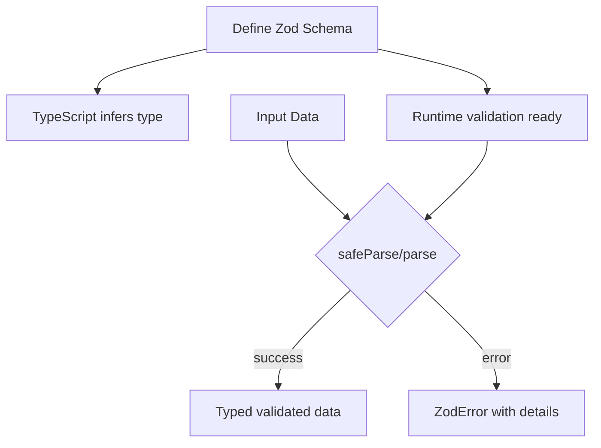
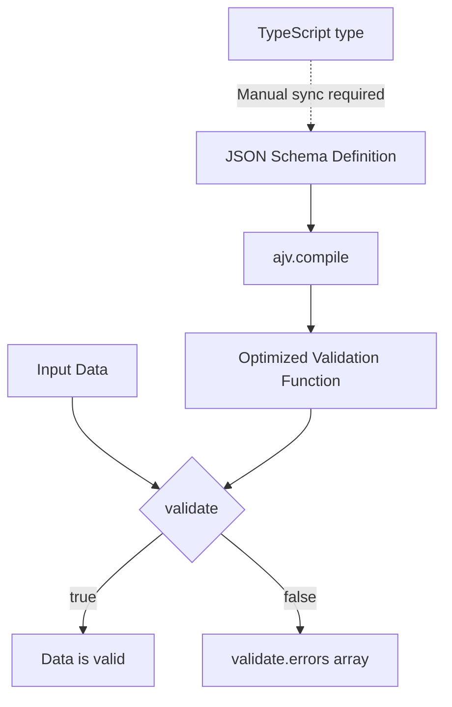
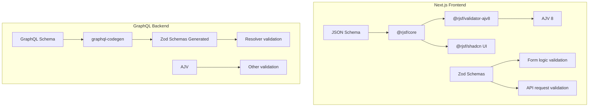
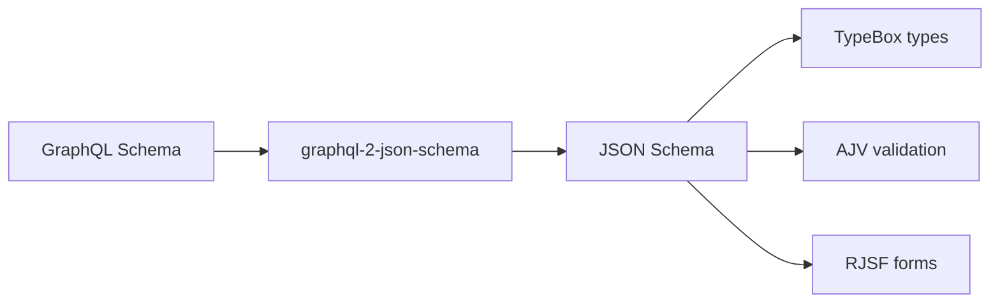
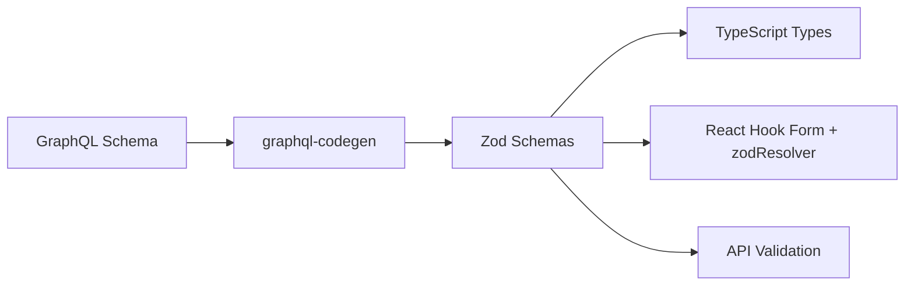
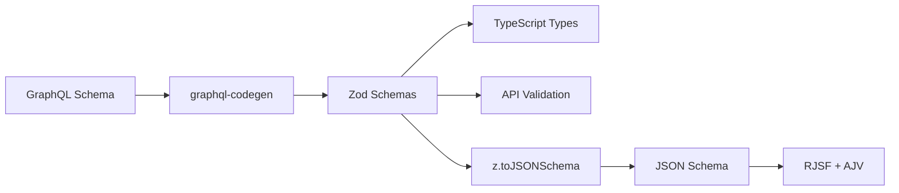
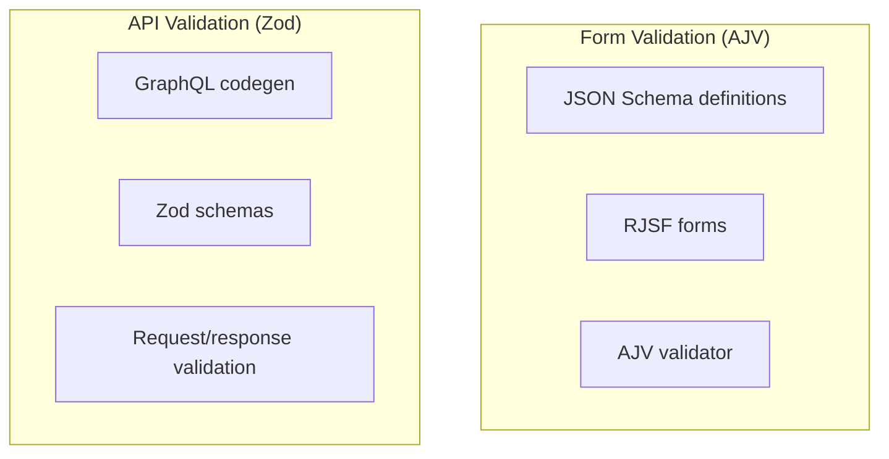
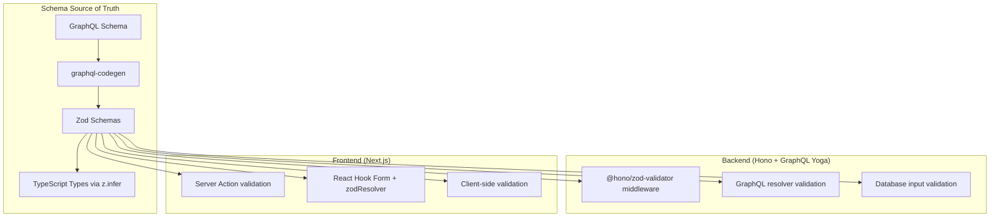

# Zod vs AJV Validation Framework Comparison - Research

**Date**: 2025-12-19
**Status**: Research Complete

## Table of Contents

- [Executive Summary](#executive-summary)
- [Technical Deep Dive](#technical-deep-dive)
- [Feature-by-Feature Comparison](#feature-by-feature-comparison)
- [RJSF Integration Analysis](#rjsf-integration-analysis)
- [GraphQL Codegen Options](#graphql-codegen-options)
- [Unification Strategies](#unification-strategies)
- [Comparison Matrix](#comparison-matrix)
- [Implementation Approach](#implementation-approach)
- [Recommendation](#recommendation)
- [Greenfield Application Recommendations](#greenfield-application-recommendations)
- [NPM Download Analysis: Why AJV Dominates](#npm-download-analysis-why-ajv-dominates)
  - [Why Build Tools Don't Switch to Zod](#why-build-tools-dont-switch-to-zod)
  - [When to Use AJV vs Zod: Decision Framework](#when-to-use-ajv-vs-zod-decision-framework)
  - [When Your Project Actually Needs AJV](#when-your-project-actually-needs-ajv)
  - [Deep Dive: Schema as Code vs Schema as Data](#deep-dive-schema-as-code-vs-schema-as-data)
  - [Real-World Architecture Patterns](#real-world-architecture-patterns)
  - [Decision Matrix: Comprehensive Guide](#decision-matrix-comprehensive-guide)
  - [Edge Cases and Nuances](#edge-cases-and-nuances)
- [Sources](#sources)

## Executive Summary

The project currently uses both Zod (v4 in frontend, v3 in backend) and AJV (via RJSF in frontend, directly in backend). While using two validation systems may seem like a code smell, this research concludes that **maintaining both frameworks is the pragmatic choice** for this specific stack. RJSF is deeply coupled with AJV and there's no production-ready Zod validator for it. The recommended approach is to use Zod 4's native `z.toJSONSchema()` to bridge the two systems when needed, keeping Zod as the source of truth for TypeScript-first validation while letting RJSF continue using AJV for JSON Schema form validation.

## Technical Deep Dive

### Overview

**Zod** is a TypeScript-first schema declaration and validation library. It emphasizes developer experience, static type inference, and composable schema definitions. Zod schemas compile to TypeScript types, eliminating the need for separate type definitions.

**AJV (Another JSON Validator)** is the fastest JSON Schema validator for Node.js and browsers. It compiles JSON Schema definitions into highly optimized JavaScript validation functions, making it ideal for high-throughput validation scenarios.

### How Zod Works

Zod uses a chainable, builder-pattern API to define schemas:

```typescript
import { z } from "zod";

const UserSchema = z.object({
  name: z.string().min(1),
  email: z.string().email(),
  age: z.number().int().positive().optional(),
});

// Type is automatically inferred
type User = z.infer<typeof UserSchema>;

// Validation with parse (throws) or safeParse (returns result)
const result = UserSchema.safeParse(data);
if (result.success) {
  console.log(result.data); // Typed as User
}
```



### How AJV Works

AJV compiles JSON Schema into optimized validation functions:

```typescript
import Ajv from "ajv";

const ajv = new Ajv();
const schema = {
  type: "object",
  properties: {
    name: { type: "string", minLength: 1 },
    email: { type: "string", format: "email" },
    age: { type: "integer", minimum: 1 },
  },
  required: ["name", "email"],
};

// Compile once, validate many times
const validate = ajv.compile(schema);
const valid = validate(data);
if (!valid) {
  console.log(validate.errors);
}
```



### Zod 4 Performance Improvements

Zod 4 (used in the frontend) brought significant improvements:

- **14x faster string parsing** compared to Zod 3
- **7x faster array parsing**
- **6.5x faster object parsing**
- **57% smaller core bundle** (12.5KB to 5.36KB gzipped)
- **100x reduction in TypeScript instantiations** (25,000+ down to ~175)
- **Native JSON Schema generation** via `z.toJSONSchema()`

## Feature-by-Feature Comparison

| Feature | Zod | AJV |
|---------|-----|-----|
| **Schema Definition** | TypeScript-first chainable API | JSON Schema (draft-04 through 2020-12) |
| **TypeScript Types** | Automatic inference from schemas | Manual (or use TypeBox/json-schema-to-ts) |
| **Bundle Size (gzipped)** | ~5.4KB (Zod 4), ~1.9KB (@zod/mini) | ~32KB (+ ajv-formats) |
| **Performance** | 6.7M ops/sec (Zod 4 safe-parse) | 10-100x faster for complex schemas |
| **Error Messages** | Rich, customizable, `z.prettifyError()` | Verbose, i18n support via plugins |
| **Async Validation** | Native `z.promise()`, `z.refine()` async | Supported via `$async` keyword |
| **Custom Validators** | `.refine()`, `.superRefine()`, `.transform()` | Custom keywords, formats |
| **Composability** | `.extend()`, `.merge()`, `.pick()`, `.omit()` | `$ref`, `allOf`, `anyOf` |
| **JSON Schema Compat** | Native `z.toJSONSchema()` in v4 | Native (IS JSON Schema) |
| **Dependencies** | Zero | uri-js, fast-deep-equal |
| **GraphQL Codegen** | Supported (primary output) | Not directly supported |

### Schema Definition Syntax Comparison

**Zod Approach**:
```typescript
const CreateUserSchema = z.object({
  name: z.string().min(1, "Name is required"),
  email: z.string().email("Invalid email format"),
  role: z.enum(["admin", "user", "guest"]),
  settings: z.object({
    notifications: z.boolean().default(true),
    theme: z.enum(["light", "dark"]).optional(),
  }),
});

type CreateUserInput = z.infer<typeof CreateUserSchema>;
```

**AJV/JSON Schema Approach**:
```typescript
const createUserSchema = {
  type: "object",
  properties: {
    name: { type: "string", minLength: 1, errorMessage: "Name is required" },
    email: { type: "string", format: "email" },
    role: { enum: ["admin", "user", "guest"] },
    settings: {
      type: "object",
      properties: {
        notifications: { type: "boolean", default: true },
        theme: { enum: ["light", "dark"] },
      },
    },
  },
  required: ["name", "email", "role"],
};

// Separate TypeScript type (manual sync required)
interface CreateUserInput {
  name: string;
  email: string;
  role: "admin" | "user" | "guest";
  settings?: {
    notifications?: boolean;
    theme?: "light" | "dark";
  };
}
```

### Performance Benchmarks

Based on 2025 benchmarks:

| Validator | Safe Parse (ops/sec) | Notes |
|-----------|---------------------|-------|
| Typia | ~76,000,000 | AOT compilation |
| TypeBox + AJV | ~15,000,000 | JSON Schema compiled |
| AJV (standalone) | ~10,000,000 | Pure JSON Schema |
| Zod v4 | ~6,700,000 | 14x faster than v3 |
| Zod v3 | ~500,000 | Legacy version |

**Key insight**: AJV is 5-18x faster than Zod for structural validation, but as ArkType's author notes: "validator performance is mostly negligible in ~95% of situations and Zod's is totally reasonable."

## RJSF Integration Analysis

### Current Architecture

The project uses RJSF v6 with AJV8:



### How Deeply is AJV Integrated into RJSF?

**Very deeply**. RJSF's relationship with AJV is fundamental:

1. **Required validator**: Since RJSF v5, a validator implementation is mandatory
2. **Schema resolution**: RJSF uses AJV for `anyOf`/`oneOf` selections, `if-then-else`, `dependencies`, and `$ref` resolution
3. **Form state management**: The `retrieveSchema()` utility builds on AJV's schema compilation
4. **Error handling**: Error formats match AJV's output structure
5. **Official package**: `@rjsf/validator-ajv8` is the only official validator

### Can RJSF Use Zod Instead?

**Not easily**. While RJSF exposes a `ValidatorType` interface for custom validators, building a Zod-based validator would require:

1. Converting all JSON Schema features to Zod equivalents at runtime
2. Implementing `retrieveSchema()` logic without AJV
3. Mapping Zod errors to RJSF's expected error format
4. Supporting all JSON Schema drafts RJSF uses

**No production-ready `@rjsf/validator-zod` exists**. This would be a significant undertaking.

### Zod-Native Form Library Alternatives

| Library | Zod Support | JSON Schema Support | Trade-offs |
|---------|-------------|---------------------|------------|
| **React Hook Form + zodResolver** | Native | Manual via ajvResolver | Most popular, but no auto-form generation |
| **TanStack Form** | Native | No | Type-safe, headless, framework-agnostic |
| **@autoform/react** | Native | Via conversion | Auto-generates forms from Zod schemas |
| **Uniforms** | Via adapter | Native | Supports multiple UI frameworks |
| **JSON Forms** | No | Native | Alternative to RJSF |

### Migration Cost: RJSF to React Hook Form

If moving away from RJSF:

**Pros**:
- Unify on Zod everywhere
- Better TypeScript integration
- Smaller bundle (~8KB vs ~69KB for RJSF + validator)
- More control over form rendering

**Cons**:
- Lose automatic form generation from JSON Schema
- Must manually build form UI for each schema
- Significant rewrite if using many RJSF forms
- Lose JSON Schema portability

## GraphQL Codegen Options

### Current Setup

The project uses `graphql-codegen-typescript-validation-schema` to generate Zod schemas from GraphQL types:

```typescript
// codegen.ts
{
  plugins: [
    "typescript",
    "typescript-validation-schema"
  ],
  config: {
    schema: "zod" // Generates Zod schemas
  }
}
```

### Supported Output Formats

The plugin supports:
- **Zod** (recommended for TypeScript projects)
- **Zod v4** (`zodv4` option)
- **Yup**
- **MyZod**
- **Valibot**

**JSON Schema is NOT a supported output format** for this plugin.

### Alternative: GraphQL to JSON Schema

If you wanted to generate JSON Schema instead:

| Package | Status | Notes |
|---------|--------|-------|
| `graphql-2-json-schema` | Maintained | Uses introspection query |
| `graphql-to-json-schema` | Abandoned (8 years) | Direct SDL conversion |
| `json-schema-from-graphql` | Abandoned (5 years) | Fork with `@validate` directive |

**Recommendation**: The TypeScript validation schema plugin generating Zod is more mature and better maintained than GraphQL-to-JSON-Schema alternatives.

### Bridge: Zod to JSON Schema

Zod 4 provides native JSON Schema generation:

```typescript
import { z } from "zod";

const UserSchema = z.object({
  name: z.string(),
  email: z.string().email(),
});

const jsonSchema = z.toJSONSchema(UserSchema, {
  target: "draft-07", // RJSF compatible
});
```

This enables a "Zod-first" approach where Zod schemas are the source of truth and JSON Schema is derived when needed.

## Unification Strategies

### Strategy A: Move Entirely to AJV

**Approach**: Use JSON Schema everywhere, replace Zod with TypeBox + AJV.



**Feasibility**: Medium - requires finding/building GraphQL to JSON Schema tooling

**Pros**:
- Single validation paradigm
- RJSF works natively
- Best performance for high-throughput

**Cons**:
- Lose Zod's excellent DX and type inference
- GraphQL-to-JSON-Schema tools are poorly maintained
- TypeScript types require TypeBox or manual sync
- More verbose schema definitions

**Required Changes**:
- Replace `graphql-codegen-typescript-validation-schema` with custom GraphQL-to-JSON-Schema pipeline
- Add TypeBox for TypeScript integration
- Remove Zod from both projects

### Strategy B: Move Entirely to Zod

**Approach**: Replace RJSF with React Hook Form + Zod.



**Feasibility**: Medium-High - proven pattern, but requires form rewrites

**Pros**:
- Single validation library
- Best TypeScript integration
- Smaller bundle than RJSF
- Consistent DX across codebase

**Cons**:
- Lose RJSF's automatic form generation
- Must rebuild all forms manually
- More code to maintain for forms

**Required Changes**:
- Replace `@rjsf/*` with `react-hook-form` + `@hookform/resolvers`
- Rebuild form components
- Remove AJV from frontend

### Strategy C: Bridge Approach (Recommended)

**Approach**: Keep Zod as source of truth, convert to JSON Schema for RJSF.



**Feasibility**: High - leverages Zod 4's native capabilities

**Pros**:
- Zod remains source of truth
- RJSF continues working unchanged
- Minimal migration effort
- Type safety throughout

**Cons**:
- Still shipping both libraries (bundle size)
- Some Zod features don't convert to JSON Schema
- Slight conceptual complexity

**Required Changes**:
- Create utility to convert Zod schemas to RJSF-compatible JSON Schema
- Update form code to use derived JSON Schema
- Keep both libraries but with clear separation

### Strategy D: Accept the Duplication

**Approach**: Keep both systems with clear boundaries.



**Feasibility**: Highest - status quo with refinement

**Pros**:
- No migration work
- Each tool used for its strengths
- Battle-tested patterns continue working

**Cons**:
- Two validation paradigms to learn
- Potential drift between form and API validation
- Larger bundle with both libraries

**When This Makes Sense**:
- Forms are truly separate concerns from API validation
- Team is comfortable with both tools
- Bundle size isn't critical

## Comparison Matrix

| Criteria | A: All AJV | B: All Zod | C: Bridge | D: Keep Both |
|----------|------------|------------|-----------|--------------|
| **Migration Effort** | High | Medium | Low | None |
| **TypeScript DX** | Medium | Excellent | Excellent | Good |
| **Bundle Size** | Smaller | Smaller | Larger | Largest |
| **Performance** | Best | Good | Good | Good |
| **Maintainability** | Good | Good | Good | Medium |
| **RJSF Compatibility** | Native | Broken | Works | Native |
| **GraphQL Codegen** | Poor | Excellent | Excellent | Excellent |
| **Risk Level** | High | Medium | Low | None |

## Implementation Approach

### Recommended: Strategy C - Bridge Approach

#### Prerequisites

- Zod 4 already in frontend (`^4.1.13`)
- Understanding of `z.toJSONSchema()` limitations
- Willingness to maintain a thin conversion layer

#### Step 1: Create Schema Conversion Utility

```typescript
// src/lib/schema-bridge.ts
import { z } from "zod";
import type { RJSFSchema } from "@rjsf/utils";

export function zodToRJSFSchema<T extends z.ZodType>(
  schema: T,
  options?: {
    title?: string;
    description?: string;
  }
): RJSFSchema {
  const jsonSchema = z.toJSONSchema(schema, {
    target: "draft-07", // RJSF uses draft-07
    unrepresentable: "any", // Gracefully handle edge cases
  });

  return {
    ...jsonSchema,
    ...(options?.title && { title: options.title }),
    ...(options?.description && { description: options.description }),
  } as RJSFSchema;
}
```

#### Step 2: Update Form Components

```typescript
// Before: Separate JSON Schema
const formSchema = {
  type: "object",
  properties: {
    name: { type: "string", minLength: 1 },
  },
  required: ["name"],
};

// After: Derive from Zod schema
import { CreateUserSchema } from "@/generated/validation";
import { zodToRJSFSchema } from "@/lib/schema-bridge";

const formSchema = zodToRJSFSchema(CreateUserSchema, {
  title: "Create User",
});
```

#### Step 3: Handle Unrepresentable Types

Zod features that don't convert to JSON Schema:
- `z.transform()` - Use input schema before transform
- `z.refine()` with complex logic - Use RJSF's `customValidate` prop
- `z.date()` - Convert to `z.string().datetime()` for forms

```typescript
// For forms, use input-compatible schema
const FormSchema = BaseSchema.omit({ createdAt: true }).extend({
  createdAt: z.string().datetime(), // Instead of z.date()
});
```

### Best Practices

1. **Zod is the source of truth** for type definitions and API validation
2. **Derive JSON Schema** for RJSF forms using `z.toJSONSchema()`
3. **Keep GraphQL codegen** generating Zod schemas
4. **Use RJSF's `customValidate`** for Zod refinements that don't convert
5. **Document the bridge** so team understands the pattern

### Common Pitfalls

1. **Don't duplicate schemas** - always derive JSON Schema from Zod
2. **Watch for Zod 3/4 mismatch** - backend uses v3, frontend v4
3. **Test edge cases** - some Zod features may not round-trip perfectly
4. **Bundle monitoring** - track if shipping both libraries impacts performance

## Recommendation

### Preferred Approach: Strategy C - Bridge with Zod as Source of Truth

**Should This Be Implemented?**: Yes, but incrementally

**Rationale**:

1. **Minimal disruption**: RJSF continues working; no form rewrites needed
2. **Type safety**: Zod remains the single source of truth for TypeScript types
3. **GraphQL alignment**: Codegen already produces Zod; leverage this investment
4. **Future-proof**: Zod 4's native `z.toJSONSchema()` is first-party, maintained
5. **Pragmatic**: Using two validation libraries isn't inherently wrong if each serves a purpose

**Why Not Full Unification?**

- RJSF has no production Zod validator - building one is significant effort
- GraphQL-to-JSON-Schema tools are poorly maintained vs. Zod codegen
- The "code smell" of two libraries is offset by clear separation of concerns

**Key Considerations**:

1. **Backend Zod version**: Consider upgrading backend from Zod 3 to Zod 4 for consistency
2. **Bundle size**: Monitor impact; consider `@zod/mini` for frontend if needed
3. **Team knowledge**: Document the bridge pattern for onboarding

**Potential Challenges**:

| Challenge | Mitigation |
|-----------|------------|
| Zod features not in JSON Schema | Use RJSF's `customValidate` for refinements |
| Backend/frontend Zod version mismatch | Upgrade backend to Zod 4 when stable |
| Schema drift | Derive all JSON Schema from Zod; never hand-write |

**Success Criteria**:

- All form JSON Schemas derived from Zod schemas (no duplication)
- Type safety maintained throughout the stack
- No regression in form functionality
- Bundle size increase < 10KB

## Greenfield Application Recommendations

This section provides recommendations for **new projects** using the modern stack: **Bun, Hono, GraphQL Yoga, and Next.js**.

### Why Greenfield Changes the Calculus

In an existing project, the recommendation was a bridge approach to avoid migration costs. For greenfield projects, you have the freedom to choose one system from the start and build consistently around it.

### Stack Analysis

| Technology | Validation Ecosystem | Notes |
|------------|---------------------|-------|
| **Bun** | Agnostic | Works with any validation library |
| **Hono** | Zod-first via `@hono/zod-validator` | Official middleware with excellent DX |
| **GraphQL Yoga** | Agnostic, but Zod codegen mature | `graphql-codegen-typescript-validation-schema` is battle-tested |
| **Next.js** | Agnostic | Server Actions work well with Zod's `safeParse` |

### Recommendation: Zod-First Architecture

For greenfield apps with this stack, **choose Zod as your single validation framework**.



### Why Zod Over AJV for Greenfield?

| Factor | Zod Advantage | AJV Consideration |
|--------|---------------|-------------------|
| **TypeScript DX** | Schemas ARE types - no sync issues | Requires TypeBox or manual types |
| **Hono Integration** | First-class `@hono/zod-validator` | No official AJV middleware |
| **GraphQL Codegen** | Mature, well-maintained plugin | Poor/abandoned tooling |
| **Bundle Size** | 5.4KB (Zod 4) or 1.9KB (@zod/mini) | 32KB+ with formats |
| **Learning Curve** | Chainable API is intuitive | JSON Schema has more ceremony |
| **Error Messages** | Rich, customizable | Verbose, needs configuration |

### Form Strategy: Skip RJSF

For greenfield, avoid RJSF entirely. Instead:

**Option A: React Hook Form + Zod (Recommended)**
```typescript
import { useForm } from "react-hook-form";
import { zodResolver } from "@hookform/resolvers/zod";
import { CreateUserSchema } from "@/generated/validation";

const form = useForm({
  resolver: zodResolver(CreateUserSchema),
});
```

**Option B: AutoForm for Rapid Prototyping**
```typescript
import { AutoForm } from "@autoform/react";
import { CreateUserSchema } from "@/generated/validation";

<AutoForm schema={CreateUserSchema} onSubmit={handleSubmit} />
```

**Option C: TanStack Form for Complex State**
```typescript
import { useForm } from "@tanstack/react-form";
import { zodValidator } from "@tanstack/zod-form-adapter";

const form = useForm({
  defaultValues: {},
  validatorAdapter: zodValidator(),
});
```

### Implementation Blueprint

#### 1. GraphQL Codegen Configuration

```typescript
// codegen.ts
import type { CodegenConfig } from "@graphql-codegen/cli";

const config: CodegenConfig = {
  schema: "./src/graphql/**/*.graphql",
  generates: {
    "./src/graphql/generated/types.ts": {
      plugins: ["typescript", "typescript-resolvers"],
      config: {
        contextType: "../context.js#GraphQLContext",
        federation: true,
        enumsAsTypes: true,
        useTypeImports: true,
      },
    },
    "./src/graphql/generated/validation.ts": {
      plugins: ["graphql-codegen-typescript-validation-schema"],
      config: {
        schema: "zodv4", // Use Zod v4 for best performance
        importFrom: "./types.js",
        withObjectType: true,
        directives: {
          constraint: {
            minLength: "min",
            maxLength: "max",
            pattern: ["regex", "/$1/"],
          },
        },
      },
    },
  },
};

export default config;
```

#### 2. Hono API Validation

```typescript
// src/routes/users.ts
import { Hono } from "hono";
import { zValidator } from "@hono/zod-validator";
import { CreateUserSchema } from "@/generated/validation";

const app = new Hono();

app.post(
  "/users",
  zValidator("json", CreateUserSchema, (result, c) => {
    if (!result.success) {
      return c.json({ errors: result.error.flatten() }, 400);
    }
  }),
  async (c) => {
    const data = c.req.valid("json"); // Fully typed!
    // ... create user
  }
);
```

#### 3. Next.js Server Actions

```typescript
// src/app/actions/user.ts
"use server";

import { CreateUserSchema } from "@/generated/validation";

export async function createUser(formData: FormData) {
  const raw = Object.fromEntries(formData);
  const result = CreateUserSchema.safeParse(raw);

  if (!result.success) {
    return { errors: result.error.flatten().fieldErrors };
  }

  // Proceed with validated data
  const user = result.data;
  // ...
}
```

#### 4. React Hook Form Integration

```typescript
// src/components/user-form.tsx
"use client";

import { useForm } from "react-hook-form";
import { zodResolver } from "@hookform/resolvers/zod";
import { CreateUserSchema, type CreateUserInput } from "@/generated/validation";
import { createUser } from "@/app/actions/user";

export function UserForm() {
  const form = useForm<CreateUserInput>({
    resolver: zodResolver(CreateUserSchema),
  });

  return (
    <form onSubmit={form.handleSubmit((data) => createUser(data))}>
      <input {...form.register("name")} />
      {form.formState.errors.name && (
        <span>{form.formState.errors.name.message}</span>
      )}
      {/* ... */}
    </form>
  );
}
```

### When to Still Consider AJV

AJV remains the better choice in specific scenarios:

| Scenario | Why AJV |
|----------|---------|
| **Extremely high throughput** | 10-100x faster for complex schemas |
| **External JSON Schema requirement** | APIs that must accept/emit JSON Schema |
| **Schema stored in database** | JSON Schema is portable, Zod is code |
| **Non-TypeScript consumers** | JSON Schema is language-agnostic |

### Package Recommendations

```json
{
  "dependencies": {
    "zod": "^3.24.0",
    "@hono/zod-validator": "^0.4.0",
    "react-hook-form": "^7.54.0",
    "@hookform/resolvers": "^3.9.0"
  },
  "devDependencies": {
    "graphql-codegen-typescript-validation-schema": "^0.17.0"
  }
}
```

**Note on Zod versions**: Use Zod 3.x for now as the codegen plugin doesn't fully support Zod 4 syntax yet. The `zodv4` option generates v4-compatible code but still imports from `zod` v3.

### Migration Path from Prototype

If starting from RJSF-based prototype:

1. **Keep RJSF temporarily** for complex forms during migration
2. **New forms use React Hook Form + Zod**
3. **Migrate RJSF forms incrementally** as you touch them
4. **Remove RJSF/AJV** once all forms are migrated

### Summary: Greenfield Decision Matrix

| If Your Priority Is... | Choose |
|------------------------|--------|
| TypeScript developer experience | Zod |
| Schema portability (JSON Schema) | AJV + TypeBox |
| Maximum runtime performance | AJV (compiled) |
| Smallest bundle size | @zod/mini (1.9KB) |
| Hono integration | Zod |
| GraphQL codegen | Zod |
| Auto-form generation from schema | RJSF + AJV or AutoForm + Zod |

**For Bun + Hono + GraphQL Yoga + Next.js**: **Zod is the clear winner**. The ecosystem alignment, TypeScript integration, and developer experience make it the natural choice for modern TypeScript-first applications.

## NPM Download Analysis: Why AJV Dominates

### The Numbers

| Package | Weekly Downloads | GitHub Stars |
|---------|-----------------|--------------|
| AJV | ~174 million | 14,430 |
| Zod | ~51 million | 40,499 |

AJV has **3-4x more weekly downloads** than Zod, yet Zod has **3x more GitHub stars**. This paradox reveals something important about how these libraries are actually used.

### Why AJV Downloads Are Inflated

AJV's massive download count is largely **transitive** - most downloads come from tools that depend on AJV internally, not from developers directly choosing it:

```
Your Project
├── eslint (depends on ajv)
├── webpack (depends on ajv via schema-utils)
├── @babel/core (depends on ajv)
├── jest (depends on ajv)
├── typescript-eslint (depends on ajv)
├── postcss-loader (depends on ajv via schema-utils)
├── css-loader (depends on ajv via schema-utils)
└── ... dozens more build tools
```

#### Major AJV Dependents

| Package | Why It Uses AJV |
|---------|-----------------|
| **ESLint** | Validates eslint.config.js / .eslintrc configuration |
| **Webpack** | Validates webpack.config.js via schema-utils |
| **schema-utils** | Webpack's validation utility (used by all loaders) |
| **Babel** | Validates babel.config.js |
| **Jest** | Validates jest.config.js |
| **Prettier** | Validates .prettierrc configuration |
| **OpenAPI tools** | JSON Schema is the OpenAPI validation standard |

**Every project using ESLint or Webpack automatically downloads AJV** - regardless of whether the developer ever writes a line of AJV code themselves.

### What the Numbers Actually Mean

| Metric | What It Measures | Winner |
|--------|------------------|--------|
| **Weekly downloads** | Total installs (direct + transitive) | AJV (174M) |
| **GitHub stars** | Developer interest/preference | Zod (40K) |
| **Direct dependencies** | Developers explicitly choosing the library | Zod (growing faster) |

### The Historical Context

1. **AJV (2015)**: Created when JSON Schema was the only standard for schema validation. Became the de-facto validator, embedded into build tooling.

2. **Zod (2020)**: Created for TypeScript-first development. Grew rapidly as TypeScript adoption exploded.

3. **Current trend**: Zod's downloads are growing ~50% year-over-year. New projects increasingly choose Zod for application code while AJV remains embedded in tooling.

### Apples-to-Apples Comparison

If we could filter for **direct dependencies only** (developers explicitly `npm install`-ing the package for their application code), the picture would be very different:

| Use Case | Likely Leader |
|----------|---------------|
| New TypeScript projects | Zod |
| React/Next.js form validation | Zod |
| API input validation | Zod (growing) |
| Configuration file validation | AJV (embedded in tools) |
| OpenAPI/Swagger validation | AJV (JSON Schema standard) |
| Legacy JavaScript projects | AJV |

### Key Insight

> **AJV's download count reflects its historical role as infrastructure**, not current developer preference. Zod's GitHub stars reflect where the TypeScript community is heading.

When choosing a validation library for your application code (not build tooling), the download disparity is misleading. Zod's developer experience, TypeScript integration, and community momentum make it the preferred choice for modern applications - which is why it has 3x the GitHub stars despite fewer downloads.

### Why Build Tools Don't Switch to Zod

The question isn't "why haven't they migrated?" - it's "why is AJV fundamentally the right choice for their use case?"

#### The Core Distinction

| Aspect | AJV (JSON Schema) | Zod |
|--------|-------------------|-----|
| **Schema is...** | Data (JSON/YAML) | Code (TypeScript) |
| **Defined by...** | Users/config files | Developers |
| **Stored in...** | Files, databases, APIs | Source code |
| **Language** | Language-agnostic standard | TypeScript-only |
| **Runtime requirement** | Just needs a JSON parser | Needs Zod library |

#### Why ESLint/Webpack Can't Use Zod

1. **Schemas are user-defined, not code**
   ```js
   // .eslintrc.json - This is DATA, not code
   {
     "rules": {
       "no-unused-vars": "error"
     }
   }
   ```
   ESLint validates config files that users write. These files are JSON/YAML - they can't contain Zod code. JSON Schema validates JSON. Zod validates... things you parse into your TypeScript code.

2. **IDE autocomplete requires JSON Schema**

   When you get autocomplete in `.eslintrc.json` or `tsconfig.json`, that's powered by JSON Schema. VS Code's `json.schemas` setting, the `$schema` field in JSON files - all JSON Schema. There's no Zod equivalent for this.

3. **Cross-language ecosystems**

   Webpack loaders are written in JS, but the schema for loader options might be consumed by:
   - Documentation generators
   - IDE plugins (written in various languages)
   - Build tool wrappers in other languages

   JSON Schema is an RFC standard. Python, Go, Java, Rust all have validators.

4. **Schemas as API contracts**

   OpenAPI/Swagger specs use JSON Schema. If you're building a REST API that needs to document its request/response shapes for consumers in any language, JSON Schema is the standard.

### When to Use AJV vs Zod: Decision Framework

```
Is the schema defined by your code, or by external data/users?
│
├─► BY YOUR CODE (developers write schemas)
│   │
│   └─► Use Zod
│       - Form validation
│       - API request/response in your handlers
│       - Internal data transformations
│       - Anywhere you write TypeScript
│
└─► BY EXTERNAL DATA (users/config/APIs define schemas)
    │
    └─► Use AJV
        - Config file validation (users write the config)
        - Dynamic schemas from database
        - OpenAPI/Swagger validation
        - Schemas received over the wire
        - Multi-language interop needed
```

### Concrete Examples

| Scenario | Use | Why |
|----------|-----|-----|
| Validate user form input | **Zod** | Schema is in your code |
| Validate API request body | **Zod** | Schema is in your code |
| Validate eslint.config.js | **AJV** | Schema validates user-written config |
| Validate webpack.config.js | **AJV** | Schema validates user-written config |
| Dynamic form from CMS | **AJV** | Schema comes from database/API |
| RJSF form builder | **AJV** | Schema is user-defined JSON |
| OpenAPI request validation | **AJV** | Standard requires JSON Schema |
| Validate tsconfig.json | **AJV** | IDE autocomplete needs JSON Schema |
| GraphQL resolver input | **Zod** | Schema generated into your code |
| Validate env variables | **Zod** | Schema is in your code |

### The RJSF Case Explained

RJSF uses AJV because its core value proposition is:

> "Give me a JSON Schema, I'll generate a form"

The schema is **input data**, not code. Users define schemas in JSON, store them in databases, fetch them from APIs. You can't do that with Zod - Zod schemas are TypeScript code that must be compiled.

This is why the "bridge approach" makes sense for your project:
- **Zod** for schemas you write in code (API validation, type inference)
- **AJV** for schemas that are data (RJSF forms with dynamic schemas)

### When Your Project Actually Needs AJV

You should use AJV (not Zod) when:

1. **Users define schemas at runtime**
   ```typescript
   // Schema comes from your CMS/database
   const formSchema = await fetchSchemaFromCMS(formId);
   // Can't be Zod - it's JSON data, not code
   ```

2. **Schemas are stored/transmitted as data**
   ```typescript
   // Storing in MongoDB
   await db.formTemplates.insertOne({
     name: "Contact Form",
     schema: { type: "object", properties: { ... } } // JSON Schema
   });
   ```

3. **Non-TypeScript consumers need the schema**
   ```typescript
   // Python service also validates against this schema
   // JSON Schema works, Zod doesn't
   ```

4. **You need JSON Schema ecosystem features**
   - `$ref` for schema composition across files
   - `$id` for schema registries
   - IDE autocomplete in JSON/YAML files
   - OpenAPI/AsyncAPI integration

### Deep Dive: Schema as Code vs Schema as Data

This is the fundamental distinction that determines which library to use. Let's explore this in depth.

#### What "Schema as Code" Means (Zod Territory)

When your schema is **code**, it means:

1. **Developers write the schema** in TypeScript files
2. **Schema is version-controlled** alongside your application code
3. **Schema changes require code deployment** to take effect
4. **TypeScript compiler** processes the schema at build time
5. **Types are inferred** directly from the schema definition

```typescript
// Schema as Code - lives in your TypeScript files
// src/schemas/user.ts

import { z } from "zod";

export const UserSchema = z.object({
  id: z.string().uuid(),
  email: z.string().email(),
  name: z.string().min(1).max(100),
  role: z.enum(["admin", "user", "guest"]),
  createdAt: z.date(),
});

// Type is derived FROM the schema - single source of truth
export type User = z.infer<typeof UserSchema>;

// Used in your code
function createUser(input: unknown): User {
  return UserSchema.parse(input); // Validates AND types
}
```

**Use cases for Schema as Code:**
- API request/response validation in your handlers
- Form input validation (when forms are developer-defined)
- Database model validation
- Environment variable validation
- Internal data transformations
- GraphQL resolver input validation
- Any validation where YOU control the schema

#### What "Schema as Data" Means (AJV Territory)

When your schema is **data**, it means:

1. **Users/systems define the schema** outside your code
2. **Schema lives in databases, APIs, or config files**
3. **Schema can change without redeploying** your application
4. **Schema is JSON/YAML** - a portable data format
5. **Types must be manually defined** or generated separately

```typescript
// Schema as Data - comes from external source
// Could be fetched from database, API, or config file

const formSchema = {
  "$schema": "http://json-schema.org/draft-07/schema#",
  "type": "object",
  "properties": {
    "name": { "type": "string", "minLength": 1 },
    "email": { "type": "string", "format": "email" }
  },
  "required": ["name", "email"]
};

// This schema could come from:
// - A CMS where admins configure forms
// - A database storing form templates
// - An API returning dynamic form configurations
// - A YAML config file users edit

// AJV validates against this data-defined schema
import Ajv from "ajv";
const ajv = new Ajv();
const validate = ajv.compile(formSchema);
```

**Use cases for Schema as Data:**
- Form builders (users create form structures)
- CMS-driven dynamic forms
- Config file validation (eslint, webpack, tsconfig)
- OpenAPI/Swagger request validation
- Multi-tenant apps where each tenant has custom fields
- Schema registries (Confluent, AWS Glue)
- Cross-language validation (same schema used by Python, Go, etc.)
- IDE autocomplete in JSON/YAML files

### Real-World Architecture Patterns

#### Pattern 1: Pure Zod (Most Common for Modern Apps)

```
┌─────────────────────────────────────────────────────────┐
│                    Your Application                      │
├─────────────────────────────────────────────────────────┤
│  GraphQL Schema (.graphql files)                         │
│         │                                                │
│         ▼                                                │
│  graphql-codegen                                         │
│         │                                                │
│         ▼                                                │
│  Generated Zod Schemas (schema.ts)                       │
│         │                                                │
│    ┌────┴────┬────────────┬─────────────┐               │
│    ▼         ▼            ▼             ▼               │
│  Types   Resolver     Form          API                  │
│ (infer)  Validation   Validation    Validation           │
│                       (RHF+Zod)     (Hono)               │
└─────────────────────────────────────────────────────────┘
```

**When to use:** Standard web applications where developers define all data shapes.

#### Pattern 2: Zod + AJV Bridge (Your Current Situation)

```
┌─────────────────────────────────────────────────────────┐
│                    Your Application                      │
├─────────────────────────────────────────────────────────┤
│  GraphQL Schema                                          │
│         │                                                │
│         ▼                                                │
│  Generated Zod Schemas ──────────────┐                   │
│         │                            │                   │
│    ┌────┴────┐                       ▼                   │
│    ▼         ▼              z.toJSONSchema()             │
│  Types   API Validation              │                   │
│                                      ▼                   │
│                              JSON Schema                 │
│                                      │                   │
│                                      ▼                   │
│                              RJSF + AJV                  │
│                          (Form Rendering)                │
└─────────────────────────────────────────────────────────┘
```

**When to use:** You want Zod as source of truth but need JSON Schema for specific tools (RJSF, OpenAPI docs).

#### Pattern 3: Pure AJV/JSON Schema (Schema as Data)

```
┌─────────────────────────────────────────────────────────┐
│                    Your Application                      │
├─────────────────────────────────────────────────────────┤
│  JSON Schema stored in Database                          │
│  (Admins create via Form Builder UI)                     │
│         │                                                │
│         ▼                                                │
│  Fetch Schema at Runtime                                 │
│         │                                                │
│    ┌────┴────────────────────┐                          │
│    ▼                         ▼                          │
│  RJSF Renders Form      AJV Validates                   │
│  (Dynamic UI)           (Dynamic Rules)                  │
│                                                          │
│  TypeScript types? → json-schema-to-ts at build time    │
│                   → or accept `unknown` and validate    │
└─────────────────────────────────────────────────────────┘
```

**When to use:** Form builders, multi-tenant customization, CMS-driven apps.

#### Pattern 4: Hybrid (Different Schemas for Different Concerns)

```
┌─────────────────────────────────────────────────────────┐
│                    Your Application                      │
├─────────────────────────────────────────────────────────┤
│                                                          │
│  ┌──────────────────┐    ┌──────────────────┐           │
│  │  DEVELOPER-      │    │  USER-DEFINED    │           │
│  │  DEFINED SCHEMAS │    │  SCHEMAS         │           │
│  ├──────────────────┤    ├──────────────────┤           │
│  │  Zod             │    │  JSON Schema     │           │
│  │  - API validation│    │  - Custom fields │           │
│  │  - Auth logic    │    │  - Form builder  │           │
│  │  - Core models   │    │  - Tenant config │           │
│  └──────────────────┘    └──────────────────┘           │
│           │                       │                      │
│           ▼                       ▼                      │
│      TypeScript              AJV Runtime                 │
│      Type Safety             Validation                  │
│                                                          │
└─────────────────────────────────────────────────────────┘
```

**When to use:** Enterprise apps with both fixed core models and customizable extensions.

### Decision Matrix: Comprehensive Guide

| Question | If Yes → | If No → |
|----------|----------|---------|
| Do **developers** define all schemas? | Zod | Consider AJV |
| Are schemas **checked into git**? | Zod | AJV |
| Do schemas **change without deployment**? | AJV | Zod |
| Is schema **fetched from database/API**? | AJV | Zod |
| Do **non-JS languages** consume the schema? | AJV | Zod |
| Need **IDE autocomplete** in JSON files? | AJV | Zod |
| Building an **OpenAPI spec**? | AJV | Zod |
| Users **create custom forms** at runtime? | AJV | Zod |
| Need **TypeScript type inference**? | Zod | Either |
| Is **bundle size** critical (client-side)? | Zod (5KB) | Either |
| Need **maximum validation speed**? | AJV | Zod (good enough) |
| Using **GraphQL codegen**? | Zod | Either |
| Using **Hono** middleware? | Zod | Either |

### Edge Cases and Nuances

#### Edge Case 1: OpenAPI/Swagger with TypeScript

You're building a REST API and need OpenAPI docs. OpenAPI uses JSON Schema internally.

**Option A: Zod-first with OpenAPI generation**
```typescript
// Use zod-openapi to generate OpenAPI from Zod
import { createDocument } from "zod-openapi";
import { UserSchema } from "./schemas";

const doc = createDocument({
  paths: {
    "/users": {
      post: {
        requestBody: { content: { "application/json": { schema: UserSchema } } }
      }
    }
  }
});
// Zod is source of truth, OpenAPI is derived
```

**Option B: OpenAPI-first with type generation**
```typescript
// Write OpenAPI spec, generate types
// openapi-typescript generates types from spec
import type { paths } from "./generated/api";
type CreateUserBody = paths["/users"]["post"]["requestBody"]["content"]["application/json"];
// JSON Schema is source of truth, types are derived
```

**Recommendation:** For TypeScript-first teams, Option A (Zod → OpenAPI) is better DX.

#### Edge Case 2: Multi-Tenant Custom Fields

Each tenant can add custom fields to entities. These fields are defined by tenant admins, not developers.

```typescript
// Core schema (developer-defined) - Zod
const CoreUserSchema = z.object({
  id: z.string().uuid(),
  email: z.string().email(),
  name: z.string(),
});

// Custom fields schema (tenant-defined) - JSON Schema in database
const tenantCustomFields = await db.tenantSchemas.findOne({ tenantId });
// { type: "object", properties: { department: { type: "string" } } }

// Combine at runtime
const ajv = new Ajv();
const validateCustom = ajv.compile(tenantCustomFields.schema);

function validateUser(input: unknown, tenantId: string) {
  // Validate core with Zod
  const core = CoreUserSchema.parse(input);

  // Validate custom fields with AJV
  const customFields = tenantCustomFields.schema;
  if (!validateCustom(input.customFields)) {
    throw new Error("Invalid custom fields");
  }

  return { ...core, customFields: input.customFields };
}
```

**Recommendation:** Hybrid approach - Zod for core, AJV for dynamic extensions.

#### Edge Case 3: Form Builder Application

You're building an app where users visually construct forms (like Typeform, Google Forms).

```typescript
// User creates form via UI, stored as JSON Schema
const formDefinition = {
  id: "form_123",
  title: "Customer Survey",
  schema: {
    type: "object",
    properties: {
      satisfaction: { type: "integer", minimum: 1, maximum: 5 },
      feedback: { type: "string", maxLength: 1000 }
    },
    required: ["satisfaction"]
  },
  uiSchema: {
    satisfaction: { "ui:widget": "rating" }
  }
};

// Store in database
await db.forms.insertOne(formDefinition);

// Render with RJSF
<Form schema={formDefinition.schema} uiSchema={formDefinition.uiSchema} />
```

**Recommendation:** Pure AJV/JSON Schema - this is exactly what it's designed for.

#### Edge Case 4: GraphQL + RJSF in Same Project (Your Situation)

You have GraphQL schemas that generate Zod, but also use RJSF for some forms.

**Analysis:**
- GraphQL types → Zod schemas (via codegen): ✅ Keep this
- RJSF forms → need JSON Schema: 🤔 Options below

**Option A: Bridge with z.toJSONSchema() (Recommended for fixed forms)**
```typescript
import { z } from "zod";
import { CreateFolderTypeSchema } from "@/generated/validation";

// Convert Zod to JSON Schema for RJSF
const formSchema = z.toJSONSchema(CreateFolderTypeSchema, {
  target: "draft-07"
});

<Form schema={formSchema} validator={validator} />
```

**Option B: Separate JSON Schemas (If forms diverge from API)**
```typescript
// API validation (from codegen)
import { CreateFolderTypeSchema } from "@/generated/validation";

// Form schema (hand-written, different structure for UX)
const formSchema = {
  type: "object",
  properties: {
    // Form might have different fields, order, grouping
  }
};
```

**Option C: Replace RJSF with React Hook Form (Long-term unification)**
```typescript
// Ditch RJSF, use RHF + Zod everywhere
import { useForm } from "react-hook-form";
import { zodResolver } from "@hookform/resolvers/zod";
import { CreateFolderTypeSchema } from "@/generated/validation";

const form = useForm({
  resolver: zodResolver(CreateFolderTypeSchema)
});
// Build form UI manually or use AutoForm
```

### Your Project: Specific Recommendations

Based on your stack (Bun, Hono, GraphQL Yoga, Next.js) and your use of RJSF:

| Component | Current | Recommendation | Rationale |
|-----------|---------|----------------|-----------|
| GraphQL resolver validation | Zod (codegen) | ✅ Keep | Schema as code, TypeScript-native |
| Hono middleware | Zod | ✅ Keep | First-class integration |
| Server Actions | Zod | ✅ Keep | Schema as code |
| RJSF forms | AJV | 🔄 Bridge or Replace | See below |
| Env validation | Zod (t3-oss/env) | ✅ Keep | Schema as code |

**For RJSF specifically:**

1. **If forms mirror your GraphQL types** → Use `z.toJSONSchema()` bridge
2. **If forms are significantly different from API** → Maintain separate JSON Schemas for forms
3. **If forms are simple and you want unification** → Migrate to React Hook Form + Zod
4. **If users create forms at runtime** → Keep RJSF + AJV (it's the right tool)

**The "code smell" is only real if you're duplicating schemas.** If Zod handles code-defined schemas and AJV handles data-defined schemas, that's not duplication - that's using the right tool for each job

### Summary: The Mental Model

> **Zod = Schemas as Code** (developer-defined, compile-time, TypeScript-native)
>
> **AJV = Schemas as Data** (user-defined, runtime, language-agnostic standard)

For your stack (Bun, Hono, GraphQL Yoga, Next.js), almost everything is "schemas as code" - which is why Zod is recommended. The only exception is if you're building a form builder where users define their own form structures at runtime.

### Recommendation Impact

This analysis reinforces the greenfield recommendation: **choose Zod**. The download numbers don't reflect developer preference for application validation - they reflect AJV's legacy as infrastructure. For new TypeScript applications, Zod is the community's clear choice.

## Sources

1. [Zod Official Documentation](https://zod.dev/) - Comprehensive Zod v4 documentation
2. [Zod JSON Schema Conversion](https://zod.dev/json-schema) - Native z.toJSONSchema() documentation
3. [Zod v4 Release Notes](https://zod.dev/v4) - Performance improvements and new features
4. [AJV Official Documentation](https://ajv.js.org/) - JSON Schema validator documentation
5. [AJV TypeScript Guide](https://ajv.js.org/guide/typescript.html) - TypeScript integration patterns
6. [RJSF Validation Documentation](https://rjsf-team.github.io/react-jsonschema-form/docs/usage/validation/) - Custom validator requirements
7. [RJSF GitHub Repository](https://github.com/rjsf-team/react-jsonschema-form) - Source and issues
8. [graphql-codegen-typescript-validation-schema](https://github.com/Code-Hex/graphql-codegen-typescript-validation-schema) - GraphQL to Zod codegen
9. [React Hook Form Resolvers](https://github.com/react-hook-form/resolvers) - Zod and AJV resolvers
10. [Bitovi: Comparing Schema Validation Libraries](https://www.bitovi.com/blog/comparing-schema-validation-libraries-ajv-joi-yup-and-zod) - Feature comparison
11. [Better Stack: TypeBox vs Zod](https://betterstack.com/community/guides/scaling-nodejs/typebox-vs-zod/) - Performance benchmarks
12. [LogRocket: Why is Zod Slow?](https://blog.logrocket.com/why-zod-slow/) - Performance analysis
13. [InfoQ: Zod v4 Release](https://www.infoq.com/news/2025/08/zod-v4-available/) - v4 improvements overview
14. [npm-compare: AJV vs Zod](https://npm-compare.com/ajv,zod) - Package comparison metrics
15. [zod-to-json-schema npm](https://www.npmjs.com/package/zod-to-json-schema) - Third-party conversion (deprecated for v4)
16. [json-schema-to-zod npm](https://www.npmjs.com/package/json-schema-to-zod) - Reverse conversion utility
17. [npm trends: AJV vs Zod](https://npmtrends.com/ajv-vs-zod) - Download comparison and trends
18. [ESLint Dependencies Blog](https://eslint.org/blog/2020/09/supporting-eslint-dependencies/) - ESLint's AJV dependency
